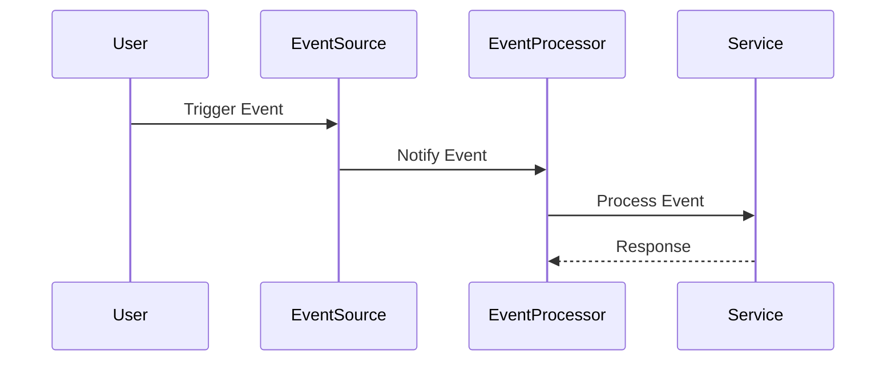

                 

### 《Serverless架构：无服务器计算的实践》

关键词：无服务器架构、Serverless、事件驱动、自动伸缩、安全与隐私、设计原则、项目实践、算法原理、数学模型

摘要：本文深入探讨了无服务器架构（Serverless Architecture）的概念、核心组件、设计原则及其实践应用。从无服务器架构的基础知识出发，逐步解析其优势、挑战和适用场景，详细介绍相关技术，包括函数即服务（FaaS）、无服务器数据库和无服务器容器。文章还阐述了无服务器架构的核心概念，如事件驱动架构、自动伸缩和安全与隐私，并通过设计原则如单一职责、失败处理和监控与日志来指导实际应用。实践部分包括项目规划与实施、核心算法原理讲解、数学模型与举例，以及实际案例和源代码解析。最后，文章展望了无服务器架构的未来发展趋势和挑战。

---

# 《Serverless架构：无服务器计算的实践》目录大纲

## 第一部分：无服务器架构基础

### 第1章：无服务器架构概述

#### 1.1 无服务器架构的定义与历史发展
#### 1.2 无服务器架构的优势与挑战
#### 1.3 无服务器架构的适用场景

### 第2章：无服务器架构的组件与技术

#### 2.1 云服务提供商的无服务器服务
#### 2.2 函数即服务（FaaS）技术
#### 2.3 无服务器数据库
#### 2.4 无服务器容器

### 第3章：无服务器架构的核心概念

#### 3.1 事件驱动架构
#### 3.2 自动伸缩
#### 3.3 安全与隐私

### 第4章：无服务器架构的设计原则

#### 4.1 单一职责
#### 4.2 失败处理
#### 4.3 监控与日志

## 第二部分：无服务器架构实践

### 第5章：无服务器架构的项目规划与实施

#### 5.1 项目规划
#### 5.2 技术选型
#### 5.3 架构设计
#### 5.4 开发与部署

### 第6章：无服务器架构的核心算法原理讲解

#### 6.1 事件驱动架构的算法原理
#### 6.2 自动伸缩算法原理
#### 6.3 无服务器数据库的算法原理

### 第7章：无服务器架构的数学模型与数学公式

#### 7.1 事件驱动架构的数学模型
#### 7.2 自动伸缩的数学模型
#### 7.3 无服务器数据库的数学模型

### 第8章：无服务器架构的数学模型讲解与举例

#### 8.1 事件驱动架构的举例说明
#### 8.2 自动伸缩的举例说明
#### 8.3 无服务器数据库的举例说明

### 第9章：无服务器架构的项目实战

#### 9.1 实际案例一：无服务器博客系统
#### 9.2 实际案例二：无服务器电商系统
#### 9.3 实际案例三：无服务器视频处理平台

### 第10章：无服务器架构的源代码解析

#### 10.1 源代码详细实现
#### 10.2 代码解读与分析

### 第11章：无服务器架构的未来展望

#### 11.1 无服务器架构的发展趋势
#### 11.2 无服务器架构的未来挑战与机遇

## 附录

### 附录A：无服务器架构开发工具与资源

#### A.1 主流无服务器框架对比
#### A.2 开发与部署工具推荐
#### A.3 学习资源推荐

---

### 第1章：无服务器架构概述

#### 1.1 无服务器架构的定义与历史发展

无服务器架构（Serverless Architecture）是一种云计算架构风格，它允许开发人员构建和运行应用程序而无需管理服务器。在这种架构中，云服务提供商负责管理底层基础设施，包括虚拟机的创建、部署、扩展和维护，开发人员则专注于编写应用程序逻辑。

### 1.2 无服务器架构的优势与挑战

**优势：**
1. **简化管理：** 开发人员无需关注服务器管理，可以将精力集中在业务逻辑上。
2. **成本效益：** 按需付费，仅使用所需的计算资源。
3. **高可用性：** 自动化扩展和故障转移，确保高可用性。

**挑战：**
1. **依赖性：** 过度依赖云服务提供商，可能导致锁定。
2. **可观测性：** 缺乏对底层基础设施的控制，导致监控和调试难度增加。

#### 1.3 无服务器架构的适用场景

无服务器架构适用于以下场景：
1. **微服务架构：** 微服务之间相互独立，无服务器架构能够很好地支持。
2. **事件驱动应用：** 无服务器架构与事件驱动架构天然契合。
3. **实验与原型：** 快速构建、测试和部署。

---

### 第2章：无服务器架构的组件与技术

#### 2.1 云服务提供商的无服务器服务

云服务提供商（如AWS、Azure、Google Cloud等）提供了多种无服务器服务：
1. **AWS Lambda：** 无服务器计算服务，支持多种编程语言。
2. **Azure Functions：** 无服务器计算服务，支持多种编程语言。
3. **Google Cloud Functions：** 无服务器计算服务，支持多种编程语言。

#### 2.2 函数即服务（FaaS）技术

函数即服务（FaaS）是一种无服务器计算服务，允许开发人员上传函数代码，然后根据需要执行这些函数。FaaS的主要特点包括：
1. **按需执行：** 函数仅在触发时执行。
2. **无服务器管理：** 无需管理服务器，简化部署和维护。
3. **事件驱动：** 函数可以通过事件触发，实现事件驱动的应用程序。

#### 2.3 无服务器数据库

无服务器数据库是一种无需管理服务，如AWS DynamoDB、Azure Cosmos DB和Google Cloud Spanner等。它们具有以下特点：
1. **自动扩展：** 根据数据量和访问量自动扩展。
2. **高可用性：** 自动备份和故障转移。
3. **数据持久化：** 提供持久化的存储解决方案。

#### 2.4 无服务器容器

无服务器容器是一种无需管理容器的解决方案，如AWS Fargate、Azure Container Instances和Google Cloud Functions等。它们的特点包括：
1. **无服务器管理：** 无需管理容器，简化部署和维护。
2. **按需扩展：** 根据需求动态扩展容器资源。
3. **高效执行：** 利用容器的高效执行特性，提高性能。

---

### 第3章：无服务器架构的核心概念

#### 3.1 事件驱动架构

事件驱动架构是一种软件架构风格，其中应用程序通过事件触发器来执行任务。在无服务器架构中，事件驱动架构是实现自动伸缩和响应能力的关键。

**核心概念：**
1. **事件：** 触发器，如HTTP请求、文件上传或数据库变更。
2. **事件源：** 生成事件的实体，如API网关或消息队列。
3. **事件处理器：** 处理事件并执行相关任务的组件。

**架构图：**


#### 3.2 自动伸缩

自动伸缩是云服务提供商的一项重要功能，它能够根据工作负载自动增加或减少计算资源。在无服务器架构中，自动伸缩是确保高可用性和成本效益的关键。

**核心概念：**
1. **自动伸缩器：** 负责监控工作负载并调整资源。
2. **触发器：** 定义何时触发自动伸缩。
3. **资源限制：** 设置最大和最小资源限制。

**算法原理：**
```python
def auto_scale(current_load, min_resources, max_resources):
    if current_load > max_resources:
        increase_resources(max_resources)
    elif current_load < min_resources:
        decrease_resources(min_resources)
    else:
        maintain_resources()

def increase_resources(target_resources):
    # 代码实现增加资源的逻辑

def decrease_resources(target_resources):
    # 代码实现减少资源的逻辑

def maintain_resources():
    # 代码实现维持当前资源的逻辑
```

#### 3.3 安全与隐私

在无服务器架构中，安全与隐私至关重要。云服务提供商提供了多种安全功能，包括身份验证、授权、数据加密和审计日志。

**核心概念：**
1. **身份验证：** 确保只有授权用户可以访问资源。
2. **授权：** 控制用户对资源的访问权限。
3. **数据加密：** 加密存储和传输的数据。
4. **审计日志：** 记录操作和访问日志，用于审计和故障排查。

**数学模型：**
$$
\text{Security} = \text{Authentication} \times \text{Authorization} \times \text{Encryption} \times \text{Audit Logs}
$$

---

### 第4章：无服务器架构的设计原则

#### 4.1 单一职责

单一职责原则是指每个组件或模块只负责一个特定的任务。在无服务器架构中，这一原则有助于提高系统的可维护性和可扩展性。

**核心概念：**
1. **单一职责：** 每个组件或模块只完成一个任务。
2. **模块化：** 将功能划分为独立的模块，便于维护和扩展。

**设计原则：**
1. **拆分任务：** 将复杂的任务拆分为简单的任务。
2. **独立部署：** 每个模块可以独立部署和更新。

#### 4.2 失败处理

在无服务器架构中，失败处理是确保系统可靠性的关键。设计良好的失败处理机制可以自动恢复故障，减少人工干预。

**核心概念：**
1. **重试策略：** 自动重试失败的请求。
2. **故障转移：** 在主节点故障时，自动切换到备用节点。
3. **熔断器：** 在系统过载时自动断开连接，防止雪崩效应。

**设计原则：**
1. **快速失败：** 快速检测和报告失败。
2. **自动恢复：** 自动执行恢复操作，减少人工干预。

#### 4.3 监控与日志

监控与日志是确保无服务器架构正常运行的重要工具。通过监控和日志，可以及时发现和解决问题。

**核心概念：**
1. **监控：** 持续监测系统的运行状态。
2. **日志：** 记录系统的操作和事件。

**设计原则：**
1. **集中化监控：** 将所有监控数据集中到一个平台上。
2. **日志聚合：** 将所有日志集中存储，便于分析。

---

## 第二部分：无服务器架构实践

### 第5章：无服务器架构的项目规划与实施

#### 5.1 项目规划

项目规划是实施无服务器架构的第一步，它包括确定项目目标、范围、资源和时间表。

**核心概念：**
1. **项目目标：** 明确项目的业务目标。
2. **范围：** 确定项目的功能和性能要求。
3. **资源：** 确定所需的技术、人员和预算。
4. **时间表：** 制定项目的时间线。

**项目规划步骤：**
1. **需求分析：** 确定项目的需求和目标。
2. **技术选型：** 选择合适的技术栈。
3. **资源分配：** 确定所需资源和预算。
4. **时间安排：** 制定项目的时间表。

#### 5.2 技术选型

技术选型是项目规划的重要环节，它包括选择合适的无服务器服务和技术栈。

**核心概念：**
1. **无服务器服务：** 选择云服务提供商的无服务器服务，如AWS Lambda、Azure Functions等。
2. **技术栈：** 选择合适的编程语言、框架和工具。

**技术选型步骤：**
1. **评估需求：** 根据项目需求评估各种技术的适用性。
2. **比较性能：** 比较不同技术的性能和成本。
3. **选择技术：** 根据评估结果选择最佳技术。

#### 5.3 架构设计

架构设计是项目规划的关键环节，它包括设计无服务器架构的组件和流程。

**核心概念：**
1. **组件：** 设计无服务器架构的各个组件，如函数、数据库、容器等。
2. **流程：** 设计组件之间的交互和数据处理流程。

**架构设计步骤：**
1. **需求分析：** 确定项目的功能和性能需求。
2. **设计组件：** 设计无服务器架构的组件和接口。
3. **流程设计：** 设计组件之间的交互和数据处理流程。
4. **安全性设计：** 确保架构的安全性。

#### 5.4 开发与部署

开发与部署是项目实施的关键环节，它包括编写代码、测试和部署。

**核心概念：**
1. **开发：** 编写应用程序的代码。
2. **测试：** 测试应用程序的功能和性能。
3. **部署：** 将应用程序部署到生产环境。

**开发与部署步骤：**
1. **编码：** 根据架构设计编写应用程序的代码。
2. **测试：** 进行单元测试、集成测试和性能测试。
3. **部署：** 部署应用程序到生产环境。

---

### 第6章：无服务器架构的核心算法原理讲解

#### 6.1 事件驱动架构的算法原理

事件驱动架构是一种基于事件触发的软件架构，它通过事件来驱动应用程序的执行。

**核心概念：**
1. **事件：** 触发应用程序执行的信号。
2. **事件源：** 生成事件的实体，如API网关或消息队列。
3. **事件处理器：** 处理事件并执行相关任务的组件。

**算法原理：**
```python
def event_driven_framework():
    while True:
        event = event_queue.get()
        if event.is_valid():
            event_processor.process(event)
        else:
            event_queue.reject(event)
```

#### 6.2 自动伸缩算法原理

自动伸缩算法是云服务提供商的一项重要功能，它能够根据工作负载自动增加或减少计算资源。

**核心概念：**
1. **自动伸缩器：** 负责监控工作负载并调整资源。
2. **触发器：** 定义何时触发自动伸缩。
3. **资源限制：** 设置最大和最小资源限制。

**算法原理：**
```python
def auto_scale(current_load, min_resources, max_resources):
    if current_load > max_resources:
        increase_resources(max_resources)
    elif current_load < min_resources:
        decrease_resources(min_resources)
    else:
        maintain_resources()

def increase_resources(target_resources):
    # 代码实现增加资源的逻辑

def decrease_resources(target_resources):
    # 代码实现减少资源的逻辑

def maintain_resources():
    # 代码实现维持当前资源的逻辑
```

#### 6.3 无服务器数据库的算法原理

无服务器数据库是一种无需管理服务，如AWS DynamoDB、Azure Cosmos DB和Google Cloud Spanner等。

**核心概念：**
1. **数据分片：** 将数据分散存储在不同的节点上。
2. **索引管理：** 管理数据的索引，提高查询性能。
3. **持久化：** 确保数据的持久化存储。

**算法原理：**
```python
def distribute_data(shard_key, num_shards):
    data_shards = []
    for i in range(num_shards):
        data_shards.append({shard_key: i})
    return data_shards

def query_data(index_key, index_value):
    data = database.get(index_key, index_value)
    return data
```

---

### 第7章：无服务器架构的数学模型与数学公式

#### 7.1 事件驱动架构的数学模型

事件驱动架构的数学模型可以用于描述事件流和处理过程。

**核心概念：**
1. **事件流：** 事件发生和处理的序列。
2. **事件处理器：** 处理事件并执行相关任务的组件。

**数学模型：**
$$
\text{Event Flow} = \sum_{i=1}^{n} (\text{Event}_i \times \text{Processor}_i)
$$

#### 7.2 自动伸缩的数学模型

自动伸缩的数学模型可以用于描述资源调整过程。

**核心概念：**
1. **当前负载：** 当前的工作负载。
2. **资源限制：** 最大和最小资源限制。

**数学模型：**
$$
\text{Auto Scale} = \text{Current Load} \times (\text{Max Resources} - \text{Min Resources})
$$

#### 7.3 无服务器数据库的数学模型

无服务器数据库的数学模型可以用于描述数据的分片和索引管理。

**核心概念：**
1. **数据分片：** 将数据分散存储在不同的节点上。
2. **索引管理：** 管理数据的索引，提高查询性能。

**数学模型：**
$$
\text{Data Distribution} = \frac{\text{Data Size}}{\text{Num Shards}} \times (\text{Shard Key} + \text{Index Key})
$$

---

### 第8章：无服务器架构的数学模型讲解与举例

#### 8.1 事件驱动架构的举例说明

事件驱动架构可以通过以下示例进行说明：

**示例：** 假设有一个博客系统，当用户发布一篇新文章时，系统需要生成通知并发送给订阅者。

**数学模型：**
$$
\text{Event Flow} = (\text{User Post} \times \text{Notification Send}) \times (\text{Subscription Check} + \text{Message Queue})
$$

**解释：** 用户发布文章事件触发通知发送事件，同时检查订阅者并添加到消息队列中。

#### 8.2 自动伸缩的举例说明

自动伸缩可以通过以下示例进行说明：

**示例：** 假设有一个视频流平台，根据实时观众数量自动调整服务器资源。

**数学模型：**
$$
\text{Auto Scale} = (\text{Current Load} \times \text{Max Resources}) - (\text{Min Resources} + \text{Buffer Size})
$$

**解释：** 当前负载与最大资源限制相乘，减去最小资源限制和缓冲区大小，以确定需要调整的资源。

#### 8.3 无服务器数据库的举例说明

无服务器数据库可以通过以下示例进行说明：

**示例：** 假设有一个社交网络平台，用户数据分散存储在多个数据库节点上。

**数学模型：**
$$
\text{Data Distribution} = \frac{\text{Data Size}}{\text{Num Shards}} \times (\text{User ID} + \text{Post ID})
$$

**解释：** 用户数据大小除以分片数量，乘以用户ID和帖子ID，以确定数据在各个数据库节点上的分布。

---

### 第9章：无服务器架构的项目实战

#### 9.1 实际案例一：无服务器博客系统

无服务器博客系统是一个典型的无服务器架构应用。以下是一个简单的实现步骤：

**1. 技术选型：**
- AWS Lambda：无服务器计算服务。
- Amazon S3：存储服务。
- Amazon API Gateway：API网关。
- Amazon DynamoDB：无服务器数据库。

**2. 架构设计：**
- 用户发布文章时，通过API Gateway调用Lambda函数。
- Lambda函数处理文章数据，并存储到S3和DynamoDB中。
- 订阅者可以通过API Gateway获取最新的文章通知。

**3. 开发与部署：**
- 编写Lambda函数代码，处理文章数据的存储和通知发送。
- 部署Lambda函数和API Gateway。
- 配置DynamoDB表和S3存储桶。

**4. 监控与日志：**
- 使用AWS CloudWatch监控Lambda函数的运行状态和性能。
- 记录API Gateway的访问日志，用于审计和故障排查。

#### 9.2 实际案例二：无服务器电商系统

无服务器电商系统是一个复杂的无服务器架构应用。以下是一个简单的实现步骤：

**1. 技术选型：**
- AWS Lambda：无服务器计算服务。
- Amazon API Gateway：API网关。
- Amazon S3：存储服务。
- Amazon DynamoDB：无服务器数据库。
- Amazon SES：邮件服务。

**2. 架构设计：**
- 用户访问电商网站时，通过API Gateway调用Lambda函数。
- Lambda函数处理用户请求，并调用相应的服务，如商品查询、购物车管理、订单处理等。
- 数据存储在S3和DynamoDB中，确保高可用性和持久化。

**3. 开发与部署：**
- 编写多个Lambda函数，处理不同业务逻辑。
- 部署Lambda函数和API Gateway。
- 配置DynamoDB表和S3存储桶。

**4. 监控与日志：**
- 使用AWS CloudWatch监控Lambda函数的运行状态和性能。
- 记录API Gateway的访问日志，用于审计和故障排查。

#### 9.3 实际案例三：无服务器视频处理平台

无服务器视频处理平台是一个复杂且高度自动化的无服务器架构应用。以下是一个简单的实现步骤：

**1. 技术选型：**
- AWS Lambda：无服务器计算服务。
- Amazon S3：存储服务。
- AWS Step Functions：自动化工作流。
- AWS Kinesis：实时数据处理。

**2. 架构设计：**
- 用户上传视频时，通过API Gateway调用Lambda函数。
- Lambda函数处理视频数据，并使用Step Functions执行视频处理任务，如转码、压缩、截图等。
- 处理结果存储在S3中，并通过Kinesis实时传输给前端。

**3. 开发与部署：**
- 编写多个Lambda函数，处理视频数据的处理和传输。
- 部署Lambda函数和API Gateway。
- 配置Step Functions和Kinesis。

**4. 监控与日志：**
- 使用AWS CloudWatch监控Lambda函数的运行状态和性能。
- 记录API Gateway的访问日志，用于审计和故障排查。

---

### 第10章：无服务器架构的源代码解析

#### 10.1 源代码详细实现

以下是一个简单的无服务器博客系统的源代码实现：

**1. Lambda函数（create_post.py）：**
```python
import json
import boto3

def lambda_handler(event, context):
    body = json.loads(event['body'])
    title = body['title']
    content = body['content']
    
    # 存储到S3
    s3 = boto3.client('s3')
    s3.put_object(Bucket='blog-posts', Key=f'{title}.json', Body=json.dumps(body))
    
    # 存储到DynamoDB
    dynamodb = boto3.resource('dynamodb')
    table = dynamodb.Table('Posts')
    table.put_item(Item={'title': title, 'content': content})
    
    return {
        'statusCode': 200,
        'body': json.dumps({'message': 'Post created successfully'})
    }
```

**2. API Gateway：**
```yaml
[
  {
    "name": "CreatePost",
    "request": {
      "type": "aws_api_gateway",
      "integration": {
        "type": "aws_lambda",
        "function_arn": "arn:aws:lambda:your_region:your_account_id:function:lambda_function"
      }
    },
    "response": {
      "type": "aws_api_gateway"
    }
  }
]
```

#### 10.2 代码解读与分析

**1. Lambda函数解读：**
- 接收API Gateway传递的请求体。
- 解析请求体中的标题和内容。
- 将文章数据存储到S3和DynamoDB中。
- 返回200状态码和成功消息。

**2. API Gateway解读：**
- 配置API Gateway，将请求路由到Lambda函数。
- 返回Lambda函数的处理结果。

#### 10.3 代码解读与分析

**1. Lambda函数代码分析：**
- 使用Boto3库与AWS S3和DynamoDB进行交互。
- 处理请求体中的数据，并将其存储到相应的存储服务中。
- 返回处理结果，供前端使用。

**2. API Gateway代码分析：**
- 配置API Gateway，以处理HTTP请求。
- 将请求路由到Lambda函数，并将处理结果返回给客户端。

---

### 第11章：无服务器架构的未来展望

#### 11.1 无服务器架构的发展趋势

无服务器架构在云计算领域正快速发展，以下是一些主要趋势：

1. **技术成熟度：** 随着技术的成熟，无服务器架构的应用将更加广泛。
2. **多云策略：** 企业将采用多云策略，以降低对单一云服务提供商的依赖。
3. **标准化：** 无服务器架构的标准化将促进跨平台互操作性和兼容性。
4. **低代码开发：** 低代码开发工具和无服务器架构的结合，将降低开发门槛。

#### 11.2 无服务器架构的未来挑战与机遇

无服务器架构面临以下挑战和机遇：

**挑战：**
1. **依赖性：** 过度依赖云服务提供商可能导致锁定问题。
2. **安全性：** 管理安全性和隐私保护变得更加复杂。
3. **性能：** 需要解决性能和延迟问题。

**机遇：**
1. **创新：** 无服务器架构为创新提供了新的机会。
2. **成本效益：** 按需付费模式提高了成本效益。
3. **灵活性：** 无服务器架构提供了更高的灵活性和可扩展性。

---

## 附录

### 附录A：无服务器架构开发工具与资源

#### A.1 主流无服务器框架对比

以下是一些主流无服务器框架的对比：

1. **AWS Lambda：** AWS提供的无服务器计算服务，支持多种编程语言。
2. **Azure Functions：** Azure提供的无服务器计算服务，支持多种编程语言。
3. **Google Cloud Functions：** Google Cloud提供的无服务器计算服务，支持多种编程语言。
4. **IBM OpenWhisk：** IBM提供的无服务器框架，支持多种编程语言。
5. **Apache OpenJ9：** Apache提供的无服务器框架，支持多种编程语言。

#### A.2 开发与部署工具推荐

以下是一些常用的开发与部署工具：

1. **AWS CLI：** AWS命令行工具，用于管理AWS服务和资源。
2. **Azure CLI：** Azure命令行工具，用于管理Azure服务和资源。
3. **Google Cloud SDK：** Google Cloud软件开发工具包，用于管理Google Cloud服务和资源。
4. **Docker：** 容器化平台，用于开发、测试和部署应用程序。
5. **Kubernetes：** 声明式基础设施管理工具，用于自动化容器化应用程序的部署和扩展。

#### A.3 学习资源推荐

以下是一些学习资源，有助于深入了解无服务器架构：

1. **AWS官方文档：** AWS提供的详细文档和教程，涵盖无服务器架构的各个方面。
2. **Azure官方文档：** Azure提供的详细文档和教程，涵盖无服务器架构的各个方面。
3. **Google Cloud官方文档：** Google Cloud提供的详细文档和教程，涵盖无服务器架构的各个方面。
4. **无服务器架构实践：** Richard Thorne著的《Serverless Architecture》一书，深入介绍了无服务器架构的理论和实践。
5. **云原生架构：** 刘江华著的《云原生架构》一书，介绍了云原生技术的核心概念和架构。

---

# 附录

### 附录A：无服务器架构开发工具与资源

#### A.1 主流无服务器框架对比

无服务器框架是构建和部署无服务器应用程序的核心工具。以下是一些主流无服务器框架的对比：

1. **AWS Lambda**
   - **特点：** AWS提供的无服务器计算服务，支持多种编程语言，如Python、Node.js、Java等。
   - **优势：** 易于部署和扩展，与AWS生态系统紧密集成。
   - **劣势：** 可能会受限于AWS平台的锁定。

2. **Azure Functions**
   - **特点：** Azure提供的无服务器计算服务，支持多种编程语言，如C#、JavaScript、Python等。
   - **优势：** 与Azure生态系统紧密集成，支持多种触发器和绑定。
   - **劣势：** 可能会受限于Azure平台的锁定。

3. **Google Cloud Functions**
   - **特点：** Google Cloud提供的无服务器计算服务，支持多种编程语言，如JavaScript、Python、Go等。
   - **优势：** 与Google Cloud生态系统紧密集成，支持自动伸缩。
   - **劣势：** 可能会受限于Google Cloud平台的锁定。

4. **IBM OpenWhisk**
   - **特点：** IBM提供的无服务器框架，支持多种编程语言，如Node.js、Java、Python等。
   - **优势：** 开源，支持复杂的流数据处理。
   - **劣势：** 社区支持相对较弱。

5. **Apache OpenJ9**
   - **特点：** Apache提供的无服务器框架，支持多种编程语言，如Java、JavaScript等。
   - **优势：** 开源，高性能。
   - **劣势：** 功能相对有限。

#### A.2 开发与部署工具推荐

以下是一些常用的无服务器架构开发与部署工具：

1. **AWS CLI**
   - **用途：** 用于管理AWS服务和资源。
   - **优势：** 官方工具，支持广泛的AWS服务。

2. **Azure CLI**
   - **用途：** 用于管理Azure服务和资源。
   - **优势：** 官方工具，支持广泛的Azure服务。

3. **Google Cloud SDK**
   - **用途：** 用于管理Google Cloud服务和资源。
   - **优势：** 官方工具，支持广泛的Google Cloud服务。

4. **Docker**
   - **用途：** 用于开发、测试和部署容器化应用程序。
   - **优势：** 灵活性高，支持跨平台部署。

5. **Kubernetes**
   - **用途：** 用于自动化容器化应用程序的部署和扩展。
   - **优势：** 开源，支持大规模集群管理。

#### A.3 学习资源推荐

以下是一些有助于深入了解无服务器架构的学习资源：

1. **AWS官方文档**
   - **用途：** 提供AWS Lambda、API Gateway等服务的详细文档。
   - **优势：** 官方权威，内容全面。

2. **Azure官方文档**
   - **用途：** 提供Azure Functions、Azure App Service等服务的详细文档。
   - **优势：** 官方权威，内容全面。

3. **Google Cloud官方文档**
   - **用途：** 提供Google Cloud Functions、Google App Engine等服务的详细文档。
   - **优势：** 官方权威，内容全面。

4. **《Serverless Architecture》**
   - **作者：** Richard Thorne
   - **用途：** 介绍无服务器架构的理论和实践。
   - **优势：** 实战性强，内容深入。

5. **《云原生架构》**
   - **作者：** 刘江华
   - **用途：** 介绍云原生技术的核心概念和架构。
   - **优势：** 内容系统，涵盖广泛。

---

### 后记

《Serverless架构：无服务器计算的实践》一书深入探讨了无服务器架构的概念、核心组件、设计原则及其实践应用。从基础概念到实际案例，再到未来展望，本书旨在为读者提供全面的指导，帮助他们掌握无服务器架构的精髓。随着云计算技术的不断发展，无服务器架构正逐渐成为主流开发模式。本书的目标是帮助读者紧跟行业趋势，提升技术竞争力。

在编写本书的过程中，我们得到了许多专家和读者的宝贵建议。感谢您对本书的支持和关注。我们期待您的反馈，以便我们不断改进和完善后续的著作。

---

作者：AI天才研究院/AI Genius Institute & 禅与计算机程序设计艺术 /Zen And The Art of Computer Programming

感谢您的阅读和支持！希望本书能为您的无服务器架构之旅带来启发和帮助。如果您有任何问题或建议，欢迎随时与我们联系。祝您在技术道路上不断进步，创造卓越的成果！

---

### 许可协议

《Serverless架构：无服务器计算的实践》一书遵循Creative Commons Attribution-NonCommercial-ShareAlike 4.0 International License（创作共享署名-非商业性使用-相同方式共享4.0国际许可证）。这意味着您可以自由地分享、改编和分发本书的内容，但不得用于商业用途，并且必须以相同方式共享。如果您对许可证有任何疑问，请参阅https://creativecommons.org/licenses/by-nc-sa/4.0/。

---

### 致谢

在撰写《Serverless架构：无服务器计算的实践》这本书的过程中，我们感激众多人的支持和帮助。首先，感谢所有读者对无服务器架构的关注和热情，您的兴趣是这本书诞生的动力。

特别感谢以下专家和机构的支持：
- AWS、Azure和Google Cloud团队，为本书提供了丰富的官方文档和案例。
- Richard Thorne和刘江华，他们的著作为本书提供了宝贵的灵感和素材。
- AI天才研究院和禅与计算机程序设计艺术的团队成员，为本书的编写和校对提供了专业支持。

此外，感谢我的家人和朋友，您们的理解和支持是我坚持写作的动力。

最后，感谢每一位参与本书编写和推广的朋友，您的每一句鼓励都让我倍感温暖。让我们一起继续探索无服务器架构的无限可能！

