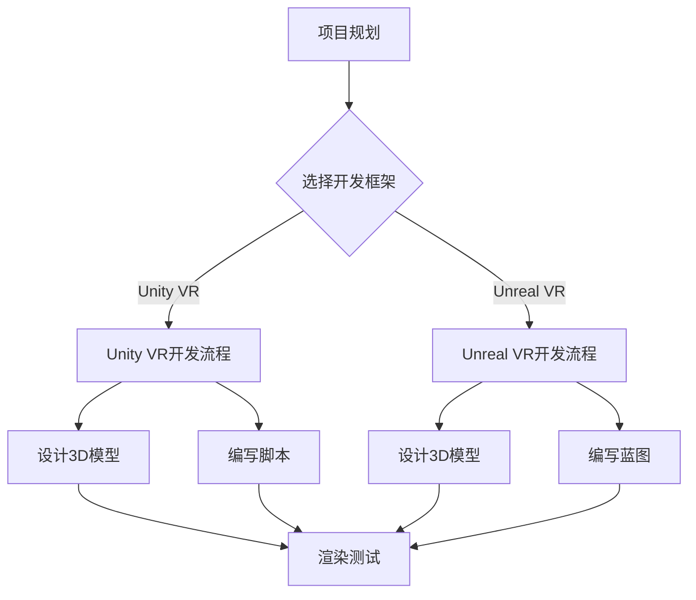
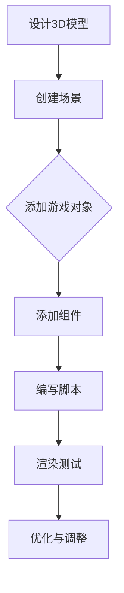
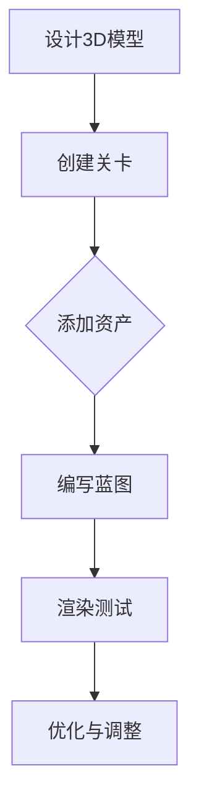
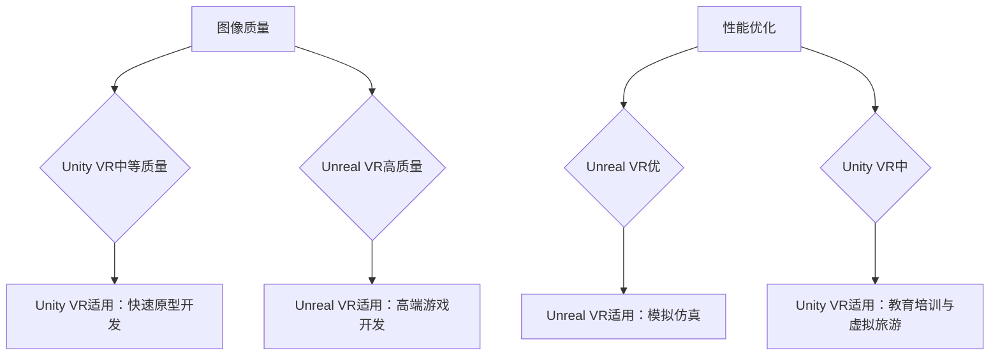

                 

# VR 内容开发框架对比：Unity VR 和 Unreal VR 的选择

## 关键词
- 虚拟现实内容开发
- Unity VR
- Unreal VR
- 开发框架对比
- 性能优化
- 项目管理

## 摘要
本文将深入探讨VR内容开发中的两大主流框架：Unity VR和Unreal VR。通过详细对比两者的基础理论、核心组件、开发流程以及项目管理实践，帮助开发者了解各自的优势和适用场景，从而做出更合适的技术选择。此外，文章还将探讨VR内容开发的性能优化方法和未来趋势，为VR内容开发者提供全面的技术指导和实践案例。

---

## 第一部分: VR 内容开发框架对比基础理论

### 第1章: VR内容开发与框架对比概述

#### 1.1 VR内容开发的基本概念与分类
虚拟现实（VR）内容开发是指创建和实现可以在虚拟环境中交互和体验的内容的过程。这些内容可以是游戏、教育、培训、娱乐等形式的交互式体验。根据内容的形式和用途，VR内容可以大致分为以下几类：

1. **交互式游戏**：这是最常见的一种VR内容形式，包括角色扮演游戏、射击游戏、冒险游戏等。这些游戏利用VR技术为玩家提供沉浸式体验。
2. **教育内容**：VR在教育中的应用越来越广泛，通过虚拟现实技术，学生可以沉浸在一个互动的学习环境中，体验各种学科知识。
3. **虚拟旅游**：用户可以戴上VR头显，进入虚拟的旅游景点，进行360度的全景浏览，感受不同的文化和风景。
4. **医疗康复**：VR技术在医疗康复中的应用也非常广泛，例如，通过VR进行心理治疗、物理康复等。
5. **培训与模拟**：企业可以利用VR技术进行员工培训，模拟各种复杂的工作场景和应急处理。

#### 1.2 VR内容开发的关键技术
VR内容开发涉及多个关键技术，以下是一些关键技术的概述：

1. **图像渲染技术**：高质量的图像渲染是VR内容开发的核心，包括几何建模、纹理映射、光照模拟等。
2. **实时交互技术**：提供用户与虚拟环境的实时交互，包括输入设备（如手柄、手势识别等）和反馈系统（如头戴显示器、声音输出等）。
3. **运动跟踪技术**：精确追踪用户的动作，确保虚拟环境中的角色或对象能够准确响应。
4. **音频处理技术**：音频处理对于营造沉浸式体验至关重要，包括3D音效的生成和混响处理。
5. **网络传输技术**：由于VR内容通常需要实时交互，网络传输的延迟和带宽成为重要的考量因素。

#### 1.3 虚拟现实开发框架对比的重要性
虚拟现实开发框架是开发者进行VR内容开发的核心工具，它们提供了丰富的功能库和开发环境，帮助开发者更高效地实现VR内容。对比不同的VR开发框架，可以帮助开发者了解各自的优势和不足，从而做出更合适的选择。以下是一些重要的对比维度：

1. **开发难度**：不同框架的学习曲线和开发难度不同，开发者需要根据自己的技能水平和项目需求进行选择。
2. **性能表现**：图像渲染速度、物理模拟精度、网络延迟等性能指标是影响用户体验的关键因素。
3. **硬件支持**：不同框架支持的硬件设备种类和兼容性也是一个重要的考虑因素。
4. **社区资源**：强大的社区资源可以帮助开发者快速解决问题，学习最佳实践。
5. **应用场景**：不同框架在不同领域的适用性也有所不同，开发者需要根据项目的具体需求进行选择。

### Mermaid流程图: VR内容开发流程


### 第2章: Unity VR开发框架详解

#### 2.1 Unity VR框架概述
Unity VR是一个跨平台的游戏开发引擎，支持多种VR设备，如Oculus、HTC VIVE等。Unity VR的特点包括：

1. **易用性**：Unity具有直观的编辑器界面和丰富的文档资源，适合初学者和专业人士。
2. **跨平台支持**：Unity支持多个操作系统和平台，开发者可以轻松地将VR内容发布到不同设备。
3. **强大的社区**：Unity拥有庞大的开发者社区，提供了大量的教程、资源和插件。

Unity VR的应用场景非常广泛，包括但不限于：

1. **游戏开发**：Unity VR在游戏开发中具有很高的灵活性，支持各种类型的游戏，从简单的2D游戏到复杂的3D游戏。
2. **教育培训**：Unity VR可以用于创建互动式的教育内容，如虚拟实验室、模拟教学场景等。
3. **虚拟旅游**：Unity VR可以创建沉浸式的虚拟旅游体验，让用户体验各种风景名胜。
4. **医疗康复**：Unity VR可以用于心理治疗、物理康复等医疗康复领域。

#### 2.2 Unity VR开发环境搭建
进行Unity VR开发，首先需要搭建合适的开发环境。以下是一些基本的步骤：

1. **硬件准备**：确保您拥有支持VR的硬件设备，如VR头戴显示器、手柄等。
2. **软件安装**：
   - 访问Unity官方网站（https://unity.com/），下载并安装Unity编辑器。
   - 安装VR插件和SDK，如Oculus SDK、HTC VIVE SDK等。
3. **配置开发环境**：在Unity编辑器中配置VR插件，设置虚拟现实项目的默认参数，如渲染模式、分辨率等。

#### 2.3 Unity VR核心组件与概念
Unity VR开发涉及到多个核心组件和概念，以下是一些重要的内容：

1. **场景（Scene）**：场景是虚拟环境的基础，是所有游戏对象和组件的容器。开发者可以在场景中放置和配置各种元素，如3D模型、灯光、音效等。

2. **游戏对象（GameObject）**：游戏对象是场景中的基本元素，可以是角色、道具、环境等。每个游戏对象都可以附加一个或多个组件，实现不同的功能。

3. **组件（Component）**：组件是附加在游戏对象上的功能模块，如3D模型、动画、脚本等。Unity提供了一系列内置组件，开发者也可以自定义组件。

4. **脚本（Script）**：使用C#语言编写的脚本可以控制游戏对象的属性和行为，实现复杂的交互逻辑和游戏逻辑。

5. **渲染管线（Rendering Pipeline）**：Unity的渲染管线负责将3D模型渲染成2D图像，包括几何建模、纹理映射、光照模拟等。Unity提供了两种渲染管线：默认渲染管线和HDRP（High Definition Render Pipeline）。

6. **VR相机（VR Camera）**：VR相机是Unity VR开发的核心组件，用于渲染虚拟环境的视图。开发者可以在场景中放置多个VR相机，实现多视角交互。

#### 2.4 Unity VR开发流程与最佳实践
Unity VR开发的一般流程如下：

1. **设计3D模型**：使用Unity内置的模型编辑器或外部3D建模软件创建3D模型。确保模型符合项目需求，并优化其性能。

2. **创建场景**：在Unity编辑器中创建一个新的场景，将设计好的3D模型和其它元素（如灯光、音效等）添加到场景中。

3. **添加游戏对象和组件**：将3D模型作为游戏对象添加到场景中，并为其附加必要的组件，如3D模型组件、动画组件、脚本组件等。

4. **编写脚本**：使用C#语言编写脚本，实现游戏逻辑和交互功能。脚本可以控制游戏对象的属性和行为，如移动、碰撞检测、交互等。

5. **渲染与测试**：在Unity编辑器中进行渲染测试，检查内容的性能和用户体验。根据测试结果进行优化和调整。

6. **优化与调整**：对场景和内容进行性能优化，如减少渲染次数、优化3D模型等。确保内容在不同硬件平台上的性能表现。

### Mermaid流程图: Unity VR开发流程


### 第3章: Unreal VR开发框架详解

#### 3.1 Unreal VR框架概述
Unreal VR是基于Unreal Engine的虚拟现实开发框架。Unreal Engine是一个功能强大的游戏和VR开发引擎，以其高质量的图像渲染和复杂的物理模拟而著称。以下是一些关于Unreal VR的特点：

1. **高质量图像渲染**：Unreal Engine提供了先进的图像渲染技术，包括全局光照、屏幕空间反射等，能够生成逼真的虚拟现实场景。

2. **强大的物理模拟**：Unreal Engine内置了强大的物理引擎，可以模拟复杂的物理现象，如碰撞检测、粒子系统等，为虚拟现实内容提供丰富的交互性。

3. **灵活的蓝图系统**：蓝图是一种无需编写代码的图形化编程工具，开发者可以通过拖放节点的方式创建复杂的交互逻辑和游戏逻辑。

4. **跨平台支持**：Unreal Engine支持多个平台，包括Windows、MacOS、Linux、Android、iOS等，开发者可以轻松地将虚拟现实内容发布到不同设备。

Unreal VR的应用场景包括但不限于：

1. **高端游戏开发**：Unreal Engine在高端游戏开发中有着广泛的应用，其高质量的图像渲染和物理模拟为开发者提供了无限可能。

2. **模拟仿真**：Unreal Engine可以用于创建各种模拟仿真场景，如建筑可视化、机械设计等。

3. **影视制作**：Unreal Engine的高质量渲染效果使其成为影视制作的重要工具，可用于预览和制作视觉效果。

4. **教育培训**：通过虚拟现实技术，Unreal VR可以用于创建互动式的教育内容，如虚拟实验室、模拟教学场景等。

#### 3.2 Unreal VR开发环境搭建
要开始使用Unreal VR进行开发，需要搭建合适的开发环境。以下是一些基本的步骤：

1. **硬件准备**：确保您拥有支持VR的硬件设备，如VR头戴显示器、手柄等。
2. **软件安装**：
   - 访问Epic Games官网（https://www.unrealengine.com/），下载并安装Unreal Engine编辑器。
   - 安装VR插件和SDK，如Oculus SDK、HTC VIVE SDK等。
3. **配置开发环境**：在Unreal Engine编辑器中配置VR插件，设置虚拟现实项目的默认参数，如渲染模式、分辨率等。

#### 3.3 Unreal VR核心组件与概念
Unreal VR开发涉及多个核心组件和概念，以下是一些重要的内容：

1. **关卡（Level）**：关卡是虚拟现实内容的基础布局和场景设置。开发者可以在关卡编辑器中创建和编辑关卡，设置各种元素，如3D模型、灯光、音效等。

2. **资产（Assets）**：资产是Unreal Engine中的资源，包括3D模型、纹理、声音、脚本等。开发者可以通过导入和创建资产来丰富虚拟现实内容。

3. **蓝图（Blueprint）**：蓝图是Unreal Engine中的图形化编程工具，开发者可以通过拖放节点的方式创建复杂的交互逻辑和游戏逻辑。蓝图系统为开发者提供了无需编写代码的开发方式。

4. **材质（Materials）**：材质是3D模型的外观和视觉属性。开发者可以通过编辑材质来调整模型的外观，如颜色、纹理、光泽度等。

5. **动画（Animations）**：动画用于控制角色的动作和行为。开发者可以使用Unreal Engine内置的动画编辑器创建和编辑动画，实现复杂的角色行为。

6. **行为树（Behavior Trees）**：行为树是一种图形化编程工具，用于定义角色的行为逻辑。开发者可以通过组合不同的行为节点来创建复杂的行为逻辑。

7. **VR相机（VR Camera）**：VR相机是虚拟现实内容的核心组件，用于渲染虚拟环境的视图。开发者可以在关卡编辑器中设置多个VR相机，实现多视角交互。

#### 3.4 Unreal VR开发流程与最佳实践
Unreal VR开发的一般流程如下：

1. **设计3D模型**：使用外部3D建模软件创建3D模型，并将其导入到Unreal Engine编辑器中。确保模型符合项目需求，并优化其性能。

2. **创建关卡**：在Unreal Engine编辑器中创建一个新的关卡，将设计好的3D模型和其他元素（如灯光、音效等）添加到关卡中。

3. **添加资产和组件**：将3D模型和其他资产作为游戏对象添加到关卡中，并为其附加必要的组件，如3D模型组件、动画组件、脚本组件等。

4. **编写蓝图**：使用蓝图系统编写游戏逻辑和交互功能。通过拖放节点的方式创建复杂的交互逻辑和游戏逻辑。

5. **渲染与测试**：在Unreal Engine编辑器中进行渲染测试，检查内容的性能和用户体验。根据测试结果进行优化和调整。

6. **优化与调整**：对关卡和内容进行性能优化，如减少渲染次数、优化3D模型等。确保内容在不同硬件平台上的性能表现。

### Mermaid流程图: Unreal VR开发流程


### 第4章: Unity VR与Unreal VR对比分析

#### 4.1 功能特性对比
Unity VR和Unreal VR在功能特性上有许多相似之处，但也存在一些显著的区别。以下是一些关键的功能特性对比：

1. **图像质量**：
   - **Unity VR**：Unity VR的图像质量较为中等，适合快速迭代和中小型项目。虽然Unity VR也提供了HDRP（High Definition Render Pipeline），但其渲染效果相对于Unreal VR仍有一定差距。
   - **Unreal VR**：Unreal VR的图像质量非常高，具有先进的渲染技术，如全局光照、屏幕空间反射等，能够生成非常逼真的虚拟现实场景。这使得Unreal VR在高端游戏开发和影视制作中具有显著优势。

2. **开发效率**：
   - **Unity VR**：Unity VR的开发效率较高，具有直观的编辑器界面和丰富的社区资源。Unity提供了一套完整的工具集，包括Unity Hub、Unity Asset Store等，开发者可以方便地获取和整合各种资源。
   - **Unreal VR**：Unreal VR的开发效率相对较低，但其强大的物理模拟和蓝图系统使得开发者能够创建复杂的交互逻辑和游戏逻辑。对于需要高度定制化和复杂功能的开发项目，Unreal VR可能是更好的选择。

3. **硬件支持**：
   - **Unity VR**：Unity VR支持广泛的硬件设备，包括Oculus、HTC VIVE等主流VR设备。Unity的跨平台特性使得开发者可以轻松地将内容发布到不同的操作系统和平台。
   - **Unreal VR**：Unreal VR同样支持多种VR设备，但其对硬件的要求较高，特别是对于渲染性能的要求。开发者需要确保目标硬件能够满足Unreal VR的性能需求。

4. **社区资源**：
   - **Unity VR**：Unity VR拥有庞大的开发者社区，提供了大量的教程、资源和插件。开发者可以方便地获取到各种最佳实践和技术支持。
   - **Unreal VR**：Unreal VR的社区资源相对较少，但Epic Games提供了全面的官方文档和教程。开发者可以依靠这些资源来学习和解决开发中的问题。

#### 4.2 性能对比
性能是VR内容开发中至关重要的因素，直接影响到用户体验。以下是一些性能对比：

1. **性能优化**：
   - **Unity VR**：Unity VR在性能优化方面提供了丰富的工具和技巧，如LOD（Level of Detail）层次细节、渲染优化等。开发者可以通过这些工具来提高VR内容的性能。
   - **Unreal VR**：Unreal VR在性能优化方面具有显著优势，其强大的物理引擎和渲染管线能够高效地处理复杂场景和高负载任务。开发者可以利用Unreal Engine的内置工具和优化技术来提升VR内容的性能。

2. **硬件性能要求**：
   - **Unity VR**：Unity VR对硬件的性能要求相对较低，适合在入门级VR设备上运行。这使得Unity VR在中小型项目中具有更高的可用性。
   - **Unreal VR**：Unreal VR对硬件的性能要求较高，需要更强的CPU和GPU性能来支持高质量的渲染和复杂的物理模拟。这使得Unreal VR在高端游戏开发和影视制作中具有优势。

3. **网络延迟**：
   - **Unity VR**：Unity VR在网络延迟方面表现较好，其内置的网络传输优化技术能够有效地减少延迟，提供更流畅的交互体验。
   - **Unreal VR**：Unreal VR在网络延迟方面相对较弱，但其强大的物理引擎和渲染管线可以提供更好的实时交互体验。开发者需要综合考虑网络条件和硬件性能来优化VR内容的网络延迟。

#### 4.3 适用场景对比
不同的VR开发框架在适用场景上也有所不同，以下是一些适用场景对比：

1. **高端游戏开发**：
   - **Unreal VR**：Unreal VR在高端游戏开发中具有显著优势，其高质量的图像渲染和复杂的物理模拟能够满足高端游戏项目的需求。开发者可以依靠Unreal Engine强大的工具和资源来创建高质量的游戏内容。
   - **Unity VR**：Unity VR在高端游戏开发中表现一般，虽然其图像质量不如Unreal VR，但Unity VR的易用性和开发效率使其在快速迭代和中小型项目中具有优势。

2. **快速原型开发**：
   - **Unity VR**：Unity VR在快速原型开发中具有明显优势，其直观的编辑器界面和丰富的社区资源使得开发者可以快速构建和测试原型。
   - **Unreal VR**：Unreal VR在快速原型开发中相对较弱，但其强大的物理引擎和蓝图系统可以提供更复杂的原型功能。

3. **教育培训与虚拟旅游**：
   - **Unity VR**：Unity VR在教育培训和虚拟旅游等领域具有广泛应用，其易用性和丰富的社区资源使其成为开发者的首选。
   - **Unreal VR**：Unreal VR在这些领域中也具有一定的优势，特别是对于需要高度定制化和复杂交互功能的开发项目。

### Mermaid流程图: Unity VR与Unreal VR对比分析


### 第5章: VR内容开发项目管理与实践

#### 5.1 项目管理流程
VR内容开发项目的成功不仅仅依赖于技术，还需要有效的项目管理。以下是一个典型的VR内容开发项目管理流程：

1. **需求分析**：
   - 与项目利益相关者（如客户、项目经理等）进行沟通，明确项目的目标和需求。
   - 确定项目的范围、时间线和预算。

2. **团队协作**：
   - 根据项目需求，组建开发团队，明确每个团队成员的角色和职责。
   - 建立有效的沟通机制，确保团队成员之间的信息流通。

3. **进度跟踪**：
   - 定期检查项目进度，评估是否按照计划进行。
   - 及时调整计划和资源，以应对项目中的变化和挑战。

4. **质量控制**：
   - 设定质量标准，确保开发过程和最终产品符合预期。
   - 定期进行代码审查和测试，确保产品的稳定性。

5. **风险管理**：
   - 识别项目中的潜在风险，制定相应的应对措施。
   - 定期评估风险，确保风险得到有效控制。

#### 5.2 开发团队建设
一个高效的开发团队是VR内容开发成功的关键。以下是一些团队建设的建议：

1. **核心团队**：
   - 核心团队应包括开发人员、美术设计师、测试人员等，每个成员都应该具备各自领域的专业知识和经验。

2. **角色分工**：
   - 明确每个团队成员的角色和职责，确保每个成员都清楚自己的工作内容和目标。

3. **技能提升**：
   - 定期进行技能培训和知识分享，提升团队成员的专业技能和团队协作能力。

4. **沟通与协作**：
   - 建立良好的沟通机制，确保团队成员之间的信息流通和协作。

#### 5.3 VR内容开发案例
以下是一些VR内容开发的实际案例，供读者参考：

1. **虚拟旅游体验**：
   - 项目描述：该项目旨在创建一个虚拟旅游体验，用户可以通过VR头显游览各种景点，如名胜古迹、自然风光等。
   - 技术实现：使用Unity VR进行开发，采用360度全景视频和3D模型来还原真实场景。通过VR相机和脚本实现用户的交互，如前进、后退、旋转等。

2. **教育培训应用**：
   - 项目描述：该项目是一个互动式的教育培训应用，通过VR技术为用户提供沉浸式的学习体验。
   - 技术实现：使用Unreal VR进行开发，创建一个虚拟实验室，用户可以在其中进行实验和操作。使用蓝图系统实现复杂的交互逻辑，如实验结果展示、数据实时更新等。

3. **医疗康复**：
   - 项目描述：该项目是一个用于心理治疗和物理康复的VR应用，通过虚拟现实技术帮助用户缓解焦虑和疼痛。
   - 技术实现：使用Unity VR进行开发，创建一个虚拟环境，用户可以在其中进行放松和训练。使用脚本和传感器实时追踪用户的动作和状态，调整训练内容和难度。

### Mermaid流程图: VR内容开发项目管理流程
```mermaid
graph TD
A[需求分析] --> B[团队协作]
B --> C[进度跟踪]
C --> D[质量控制]
D --> E[风险

