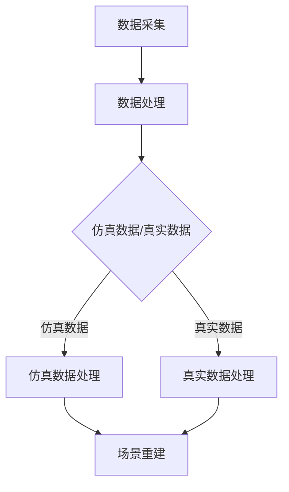

                 

### 文章标题

#### Wayve、comme.ai基于仿真和真实数据重建场景的做法

**关键词**：Wayve、comme.ai、仿真数据、真实数据、场景重建、自动驾驶、人工智能

**摘要**：本文将深入探讨自动驾驶领域中的两大公司Wayve和comme.ai如何利用仿真和真实数据来重建场景。我们将详细解析它们的技术原理、算法实现以及项目实战，旨在为读者提供对自动驾驶场景重建技术的全面理解。

### 《Wayve、comme.ai基于仿真和真实数据重建场景的做法》目录大纲

#### 第一部分：背景与核心概念

##### 第1章：自动驾驶与场景重建概述

- **1.1 自动驾驶技术发展现状与趋势**  
  自动驾驶技术作为人工智能领域的一个重要分支，近年来得到了迅速发展。本文将介绍自动驾驶技术的发展历程、当前现状以及未来趋势。

- **1.2 场景重建在自动驾驶中的重要性**  
  场景重建是自动驾驶系统中至关重要的环节。本文将探讨场景重建在自动驾驶中的作用，以及为何Wayve和comme.ai选择利用仿真和真实数据来重建场景。

- **1.3 Wayve与comme.ai公司简介**  
  分别介绍Wayve和comme.ai这两家公司在自动驾驶领域的地位、研究成果及其应用场景。

- **1.4 本书结构及学习目标**  
  本文将详细阐述本书的结构安排和学习目标，帮助读者更好地掌握自动驾驶场景重建的相关知识。

##### 第2章：核心概念与联系

- **2.1 场景重建的基本原理**  
  本文将介绍场景重建的基本原理，包括场景识别、环境建模、行为预测等内容。

- **2.2 仿真数据与真实数据融合技术**  
  本文将探讨仿真数据与真实数据融合技术的重要性以及具体实现方法。

- **2.3 仿真与真实数据的Mermaid流程图**  
  本文将使用Mermaid流程图来展示仿真与真实数据融合的过程，帮助读者更直观地理解。

#### 第二部分：技术原理与算法

##### 第3章：基于仿真数据的场景重建算法原理

- **3.1 数据预处理技术**  
  本文将介绍如何对仿真数据进行预处理，以提高场景重建的准确性和效率。

- **3.2 常见场景重建算法介绍**  
  本文将列举几种常见的场景重建算法，并对其原理和特点进行简要分析。

- **3.3 伪代码详解：基于仿真数据的场景重建算法**  
  本文将使用伪代码详细阐述基于仿真数据的场景重建算法的实现过程。

##### 第4章：基于真实数据的场景重建算法原理

- **4.1 真实数据的特点与挑战**  
  本文将分析真实数据的特点以及在使用过程中可能遇到的挑战。

- **4.2 真实数据预处理技术**  
  本文将介绍如何对真实数据进行预处理，以应对上述挑战。

- **4.3 常见真实数据重建算法介绍**  
  本文将列举几种常见真实数据重建算法，并对其原理和特点进行简要分析。

- **4.4 伪代码详解：基于真实数据的场景重建算法**  
  本文将使用伪代码详细阐述基于真实数据的场景重建算法的实现过程。

##### 第5章：仿真数据与真实数据融合技术

- **5.1 融合技术的目的与优势**  
  本文将介绍仿真数据与真实数据融合技术的目的和优势。

- **5.2 常见的融合方法介绍**  
  本文将列举几种常见的融合方法，并对其原理和特点进行简要分析。

- **5.3 伪代码详解：仿真数据与真实数据融合算法**  
  本文将使用伪代码详细阐述仿真数据与真实数据融合算法的实现过程。

##### 第6章：数学模型与公式

- **6.1 数学模型在场景重建中的作用**  
  本文将介绍数学模型在场景重建中的作用，并探讨其重要性。

- **6.2 常用数学公式介绍与推导**  
  本文将介绍几种常用的数学公式，并对其进行推导。

- **6.3 举例说明：基于数学模型实现的场景重建算法**  
  本文将通过实例来展示基于数学模型实现的场景重建算法的具体应用。

#### 第三部分：项目实战与案例

##### 第7章：Wayve公司的项目实战

- **7.1 项目背景与目标**  
  本文将介绍Wayve公司的项目背景和目标，以及项目所面临的挑战。

- **7.2 开发环境搭建与工具选择**  
  本文将介绍项目开发所需的开发环境和工具，包括硬件配置、软件环境等。

- **7.3 源代码详细实现与解读**  
  本文将详细解读Wayve公司的源代码实现，帮助读者理解项目实现的细节。

- **7.4 代码解读与分析**  
  本文将对源代码进行分析，探讨其优缺点，并提出改进建议。

##### 第8章：comme.ai公司的项目实战

- **8.1 项目背景与目标**  
  本文将介绍comme.ai公司的项目背景和目标，以及项目所面临的挑战。

- **8.2 开发环境搭建与工具选择**  
  本文将介绍项目开发所需的开发环境和工具，包括硬件配置、软件环境等。

- **8.3 源代码详细实现与解读**  
  本文将详细解读comme.ai公司的源代码实现，帮助读者理解项目实现的细节。

- **8.4 代码解读与分析**  
  本文将对源代码进行分析，探讨其优缺点，并提出改进建议。

##### 第9章：总结与展望

- **9.1 本书内容的总结**  
  本文将总结本书的主要内容和关键知识点，帮助读者巩固所学知识。

- **9.2 自动驾驶场景重建技术的未来发展趋势**  
  本文将分析自动驾驶场景重建技术的未来发展趋势，探讨可能的创新点和突破方向。

- **9.3 读者应掌握的核心技能与知识**  
  本文将指出读者在自动驾驶场景重建领域应掌握的核心技能和知识，为读者未来的学习和研究提供指导。

#### 附录

- **附录A：技术资源与拓展阅读**  
  本文将列举一些相关技术资源和拓展阅读，供读者进一步学习。

- **附录B：常见问题与解答**  
  本文将回答读者在学习过程中可能遇到的一些常见问题，帮助读者更好地理解相关概念。

- **附录C：仿真数据集与真实数据集获取方法**  
  本文将介绍如何获取仿真数据集和真实数据集，为读者提供实践操作指南。

---

在接下来的内容中，我们将按照上述目录结构逐一展开，深入探讨Wayve和comme.ai基于仿真和真实数据重建场景的具体做法。让我们开始吧！<|assistant|>
### 第一部分：背景与核心概念

#### 第1章：自动驾驶与场景重建概述

**1.1 自动驾驶技术发展现状与趋势**

自动驾驶技术作为一种先进的人工智能应用，正迅速改变着人们的出行方式。从最初的辅助驾驶到如今的无人驾驶，自动驾驶技术经历了从简单到复杂、从被动到主动的演变过程。当前，自动驾驶技术已经进入规模化商用阶段，各大科技公司和传统车企纷纷投入大量资源进行研发，以争夺这一市场。

在自动驾驶技术的发展过程中，场景重建技术发挥着至关重要的作用。场景重建是指通过对环境中的各种数据进行采集、处理和分析，构建出逼真的三维场景模型。这些模型不仅能够准确地反映道路、车辆、行人等元素的位置和状态，还可以预测其未来的行为，为自动驾驶系统提供决策依据。

自动驾驶技术的发展趋势主要体现在以下几个方面：

1. **智能化程度提升**：自动驾驶系统越来越依赖于深度学习、计算机视觉、自然语言处理等人工智能技术，以提高对复杂场景的识别和处理能力。

2. **自主化程度提高**：自动驾驶系统正逐步实现从辅助驾驶到完全自主驾驶的转变，减少对人类司机的依赖。

3. **网络化与协同化**：自动驾驶系统正朝着车联网（V2X）的方向发展，通过车与车、车与基础设施之间的通信与协同，提高交通系统的整体效率和安全性。

4. **数据驱动**：自动驾驶系统的发展离不开海量数据的支持，通过不断收集和分析数据，优化算法和决策模型，提高系统的性能和可靠性。

**1.2 场景重建在自动驾驶中的重要性**

场景重建技术是自动驾驶系统的核心组成部分，其重要性体现在以下几个方面：

1. **环境感知**：自动驾驶系统需要实时获取道路环境信息，包括道路标识、交通信号、车辆和行人的位置、速度等信息。场景重建技术能够将这些信息转化为三维模型，为自动驾驶系统提供视觉参考。

2. **路径规划**：基于场景重建模型，自动驾驶系统能够更好地理解道路结构和交通状况，从而制定出最优的行驶路径。

3. **行为预测**：通过对场景中各种元素的行为进行预测，自动驾驶系统可以提前做出反应，避免潜在的危险情况。

4. **安全驾驶**：场景重建技术有助于提高自动驾驶系统的安全性，减少因误识别或误预测而导致的交通事故。

**1.3 Wayve与comme.ai公司简介**

Wayve和comme.ai都是自动驾驶领域的重要参与者，它们在场景重建技术方面有着显著的成果和应用。

**Wayve公司**

Wayve是一家英国自动驾驶公司，成立于2017年，致力于研发全自动驾驶技术。Wayve采用数据驱动的方法，通过大规模仿真和真实驾驶数据，对自动驾驶系统进行训练和优化。在场景重建方面，Wayve采用了先进的计算机视觉和深度学习技术，实现了高精度的三维场景重建，为自动驾驶系统提供了强大的视觉支持。

**comme.ai公司**

comme.ai是一家法国自动驾驶公司，成立于2016年，专注于开发基于深度学习的自动驾驶解决方案。comme.ai的核心技术包括高精度地图生成、实时场景重建和行为预测等。在场景重建方面，comme.ai利用仿真数据和真实数据进行融合，构建出更加准确和实时的三维场景模型，为自动驾驶系统提供了重要的决策依据。

**1.4 本书结构及学习目标**

本书将从以下几个方面展开，帮助读者全面了解自动驾驶场景重建技术的原理和实践：

1. **背景介绍**：介绍自动驾驶技术的发展现状、场景重建的重要性以及Wayve和comme.ai两家公司的背景和成果。

2. **技术原理**：详细讲解基于仿真数据和真实数据的场景重建算法原理，包括数据预处理、常见算法介绍和数学模型等。

3. **项目实战**：通过分析Wayve和comme.ai公司的项目实战，展示场景重建技术在自动驾驶系统中的应用和实现。

4. **总结与展望**：总结本书的主要内容，分析自动驾驶场景重建技术的未来发展趋势，并指出读者应掌握的核心技能和知识。

通过本书的学习，读者应达到以下目标：

1. **掌握自动驾驶场景重建的基本概念和原理**：理解场景重建在自动驾驶中的作用，以及仿真数据和真实数据在场景重建中的应用。

2. **熟悉常见场景重建算法**：了解常见场景重建算法的原理和实现，能够根据实际需求选择合适的算法。

3. **具备项目实战能力**：通过分析Wayve和comme.ai公司的项目实战，掌握场景重建技术在自动驾驶系统中的实际应用。

4. **具备未来发展趋势的洞察力**：了解自动驾驶场景重建技术的未来发展趋势，为未来的学习和研究提供指导。

### 第一部分：背景与核心概念

#### 第2章：核心概念与联系

**2.1 场景重建的基本原理**

场景重建是指利用传感器数据、图像、视频等多源信息，对现实世界的环境进行建模，以创建一个数字化的三维场景。这一过程包括数据采集、数据处理、模型构建和场景重建四个主要步骤。

1. **数据采集**：场景重建的基础是数据的采集。数据来源可以是多种多样的，包括摄像头、激光雷达（LiDAR）、雷达、GPS等传感器。这些传感器捕捉到环境中的各种信息，如物体的形状、位置、速度等。

2. **数据处理**：采集到的数据通常需要进行预处理，包括去噪、增强、滤波等，以提高数据的准确性和可靠性。此外，还需要对数据格式进行统一，以便后续处理。

3. **模型构建**：在数据处理之后，通过机器学习和计算机图形学等方法，构建出三维场景的几何模型。这些模型通常包括建筑物、道路、车辆、行人等元素。

4. **场景重建**：最终，利用构建出的几何模型，将三维场景呈现出来。场景重建需要考虑场景的实时性、准确性和完整性。

**2.2 仿真数据与真实数据融合技术**

仿真数据与真实数据融合技术是自动驾驶场景重建中的关键技术。仿真数据通常是在虚拟环境中生成的，可以涵盖各种可能的驾驶场景，具有多样性和广泛性。而真实数据则是从实际驾驶过程中采集得到的，反映了真实世界中的驾驶环境和情况。

1. **仿真数据的特点**：仿真数据通常具有较高的可控性和灵活性，可以模拟各种极端驾驶条件。但是，仿真环境与真实环境之间存在差异，可能导致仿真数据与真实数据不一致。

2. **真实数据的特点**：真实数据反映了真实驾驶过程中的各种情况，包括交通拥堵、行人行为、恶劣天气等。但是，真实数据的采集成本较高，且存在一定的局限性。

3. **融合技术的优势**：通过将仿真数据与真实数据融合，可以弥补仿真数据的不足，提高场景重建的准确性和鲁棒性。具体优势包括：

   - **提高数据多样性**：融合仿真数据与真实数据，可以增加场景重建中的样本多样性，提高系统的适应能力。

   - **减少数据偏差**：通过仿真数据与真实数据的对比，可以发现和纠正仿真数据中的错误和偏差，提高数据的可靠性。

   - **降低数据成本**：利用仿真数据生成部分场景，可以减少真实数据采集的成本，提高数据采集的效率。

**2.3 仿真与真实数据的Mermaid流程图**

为了更好地展示仿真数据与真实数据融合的过程，我们可以使用Mermaid流程图进行描述。以下是一个简化的流程图：



**流程说明：**

- **A[数据采集]**：采集仿真数据和真实数据。
- **B[数据处理]**：对采集到的数据进行预处理，包括去噪、增强、滤波等。
- **C{仿真数据/真实数据}**：选择数据来源，分为仿真数据和真实数据两个分支。
- **D[仿真数据处理]**：对仿真数据进行处理，如场景建模、特征提取等。
- **E[真实数据处理]**：对真实数据进行处理，如轨迹拟合、环境建模等。
- **F[场景重建]**：利用处理后的数据重建场景模型。

通过以上流程，我们可以看到，仿真数据与真实数据融合是一个系统性的过程，需要多个环节的协同工作。这一过程不仅提高了场景重建的准确性，也为自动驾驶系统的进一步发展提供了坚实的数据支持。

### 第二部分：技术原理与算法

#### 第3章：基于仿真数据的场景重建算法原理

**3.1 数据预处理技术**

在基于仿真数据的场景重建中，数据预处理是一个关键步骤，其目的是提高数据的准确性和可靠性，为后续的算法实现提供优质的数据基础。以下是数据预处理的主要技术：

1. **去噪**：仿真数据在采集过程中可能会受到噪声干扰，导致数据质量下降。去噪技术可以去除这些噪声，提高数据的准确性。常用的去噪方法包括均值滤波、中值滤波和高斯滤波等。

2. **增强**：增强技术可以增强数据中重要的特征，使其更加明显，便于后续处理。例如，图像增强技术可以提高图像的对比度和亮度，增强道路、车辆等目标的识别效果。

3. **滤波**：滤波技术可以去除数据中的高频噪声和低频噪声，提高数据的平滑性。常用的滤波方法包括低通滤波、高通滤波和带通滤波等。

4. **数据格式统一**：仿真数据通常来自于不同的传感器，具有不同的数据格式。在进行场景重建之前，需要对数据进行格式统一，以便于后续处理。例如，可以将不同传感器的数据转换为相同的坐标系和格式。

**3.2 常见场景重建算法介绍**

在仿真数据的基础上，有许多常见的场景重建算法可供选择。以下是几种常用的算法及其原理：

1. **点云算法**：点云算法通过对激光雷达（LiDAR）采集到的点云数据进行处理，构建出三维场景模型。常见的点云算法包括：

   - **ICP（Iterative Closest Point）算法**：通过迭代计算点云之间的最近点对，逐步优化两个点云之间的位置关系，实现点云配准。
   - **PDAL（Point Data Abstraction Library）**：提供一系列的点云数据处理算法，包括滤波、分割、分类等，适用于复杂的点云数据处理。

2. **多视图几何算法**：多视图几何算法通过多个摄像头捕捉到的图像数据，利用几何关系重建三维场景。常见的多视图几何算法包括：

   - **SfM（Structure from Motion）算法**：通过多个图像的配准和优化，重建三维场景的结构。SfM算法包括特征提取、匹配、三角测量等步骤。
   - **多视角几何重建**：利用多个摄像头的视角信息，结合几何关系和投影模型，重建三维场景。

3. **深度学习算法**：深度学习算法在场景重建中具有强大的建模和预测能力。常见的深度学习算法包括：

   - **VoxelNet**：基于体素网格的深度学习算法，用于检测和分类三维场景中的物体。
   - **PointNet**：用于点云数据处理的神经网络模型，能够对点云数据进行分类、分割和重建。

**3.3 伪代码详解：基于仿真数据的场景重建算法**

以下是一个简化的伪代码，用于描述基于仿真数据的场景重建算法的基本流程：

```python
# 伪代码：基于仿真数据的场景重建算法

# 数据预处理
def preprocess_data(data):
    # 去噪
    noise_free_data = denoise(data)
    # 增强
    enhanced_data = enhance(noise_free_data)
    # 滤波
    filtered_data = filter(enhanced_data)
    # 数据格式统一
    unified_data = unify_format(filtered_data)
    return unified_data

# 场景重建
def scene_reconstruction(data):
    # 点云算法
    point_cloud = point_cloud_algorithm(data)
    # 多视图几何算法
    multi_view_geometry = multi_view_geometry_algorithm(data)
    # 深度学习算法
    depth_learning = depth_learning_algorithm(data)
    # 融合结果
    final_scene = merge_results(point_cloud, multi_view_geometry, depth_learning)
    return final_scene

# 主程序
if __name__ == "__main__":
    # 读取仿真数据
    simulation_data = read_simulation_data()
    # 预处理数据
    preprocessed_data = preprocess_data(simulation_data)
    # 场景重建
    reconstructed_scene = scene_reconstruction(preprocessed_data)
    # 输出重建结果
    output_reconstructed_scene(reconstructed_scene)
```

**伪代码解释：**

- `preprocess_data(data)`：对仿真数据进行预处理，包括去噪、增强、滤波和数据格式统一。
- `scene_reconstruction(data)`：实现场景重建，包括点云算法、多视图几何算法和深度学习算法。
- `point_cloud_algorithm(data)`：应用点云算法，如ICP或PDAL，处理点云数据。
- `multi_view_geometry_algorithm(data)`：应用多视图几何算法，如SfM，处理图像数据。
- `depth_learning_algorithm(data)`：应用深度学习算法，如VoxelNet或PointNet，处理点云或图像数据。
- `merge_results(point_cloud, multi_view_geometry, depth_learning)`：将不同算法的结果进行融合，生成最终的场景模型。
- `read_simulation_data()`：从数据源读取仿真数据。
- `output_reconstructed_scene(reconstructed_scene)`：输出重建的场景模型。

通过上述伪代码，我们可以看到基于仿真数据的场景重建算法的基本流程，包括数据预处理、多种算法的应用和结果融合。这一流程为自动驾驶系统提供了丰富的场景信息，为其决策提供了坚实的基础。

#### 第二部分：技术原理与算法

#### 第4章：基于真实数据的场景重建算法原理

**4.1 真实数据的特点与挑战**

在自动驾驶场景重建中，真实数据是构建高精度、实时场景模型的重要基础。与仿真数据相比，真实数据具有以下特点：

1. **多样性**：真实数据反映了现实世界中的各种驾驶环境和情况，包括城市道路、乡村道路、高速公路、恶劣天气等。这种多样性为场景重建提供了丰富的信息。

2. **动态性**：真实数据中的车辆、行人和环境元素具有动态变化的特点，如车辆的速度、方向、行人的行走轨迹等。这种动态性要求场景重建算法能够实时捕捉和更新场景信息。

3. **复杂性**：真实数据中的场景往往包含复杂的几何结构和多变的交通状况，如交叉路口、车辆并行行驶、行人穿越等。这种复杂性对场景重建算法的性能和准确性提出了较高的要求。

然而，真实数据在应用中也面临以下挑战：

1. **数据质量**：真实数据在采集过程中可能会受到传感器噪声、视角限制、光照变化等因素的影响，导致数据质量下降。这需要数据预处理技术来提高数据的可靠性和准确性。

2. **数据量**：真实数据通常具有较大的数据量，这对存储和处理带来了挑战。高效的算法和数据管理技术是解决这一问题的关键。

3. **数据标注**：真实数据通常需要人工进行标注，以用于训练和验证场景重建算法。数据标注的准确性和效率直接影响到算法的性能。

**4.2 真实数据预处理技术**

为了提高真实数据在场景重建中的准确性和可靠性，需要进行预处理。以下是几种常见的预处理技术：

1. **去噪与滤波**：去除传感器噪声和数据中的高频或低频干扰，以提高数据质量。常用的滤波方法包括均值滤波、中值滤波和高斯滤波等。

2. **图像增强**：通过增强图像的对比度、亮度等属性，使关键特征更加突出，有助于后续处理。常用的图像增强方法包括直方图均衡、对比度拉伸等。

3. **数据融合**：将来自不同传感器的数据（如摄像头、激光雷达、雷达等）进行融合，以获得更全面和准确的信息。数据融合技术包括多传感器数据配准、特征提取和融合等。

4. **数据降维**：通过对高维数据（如图像、点云）进行降维，减少数据的维度，提高处理效率和计算速度。常用的降维方法包括主成分分析（PCA）、自编码器（Autoencoder）等。

5. **数据清洗**：去除数据中的错误、冗余和异常值，以提高数据的准确性和一致性。数据清洗方法包括基于规则的清洗、机器学习清洗等。

**4.3 常见真实数据重建算法介绍**

在基于真实数据的场景重建中，有多种算法可供选择。以下是几种常见的算法及其原理：

1. **基于点云的算法**：

   - **基于ICP的点云配准算法**：通过迭代计算点云之间的最近点对，逐步优化两个点云之间的位置关系，实现点云配准。适用于高精度场景重建。

   - **基于KD-Tree的点云搜索算法**：利用KD-Tree快速搜索点云中的最近邻点，用于点云分割、分类等任务。适用于大规模点云数据处理。

2. **基于多视图的算法**：

   - **SfM（Structure from Motion）算法**：通过多个图像的配准和优化，重建三维场景的结构。包括特征提取、匹配、三角测量等步骤。适用于静态场景重建。

   - **基于视觉里程计的算法**：通过连续图像帧的视觉特征变化，估计运动相机和场景之间的几何关系，实现三维场景重建。适用于动态场景重建。

3. **基于深度学习的算法**：

   - **VoxelNet算法**：基于体素网格的深度学习算法，用于检测和分类三维场景中的物体。适用于自动驾驶场景中的物体检测和场景重建。

   - **PointNet算法**：用于点云数据处理的神经网络模型，能够对点云数据进行分类、分割和重建。适用于复杂的点云场景重建。

**4.4 伪代码详解：基于真实数据的场景重建算法**

以下是一个简化的伪代码，用于描述基于真实数据的场景重建算法的基本流程：

```python
# 伪代码：基于真实数据的场景重建算法

# 数据预处理
def preprocess_data(data):
    # 去噪与滤波
    filtered_data = denoise_filter(data)
    # 数据增强
    enhanced_data = enhance_data(filtered_data)
    # 数据融合
    fused_data = data_fusion(enhanced_data)
    # 数据降维
    dimensional_data = dimension_reduction(fused_data)
    return dimensional_data

# 场景重建
def scene_reconstruction(data):
    # 点云算法
    point_cloud_model = point_cloud_algorithm(data)
    # 多视图几何算法
    multi_view_model = multi_view_geometry_algorithm(data)
    # 深度学习算法
    deep_learning_model = deep_learning_algorithm(data)
    # 融合结果
    final_scene = merge_models(point_cloud_model, multi_view_model, deep_learning_model)
    return final_scene

# 主程序
if __name__ == "__main__":
    # 读取真实数据
    real_data = read_real_data()
    # 预处理数据
    preprocessed_data = preprocess_data(real_data)
    # 场景重建
    reconstructed_scene = scene_reconstruction(preprocessed_data)
    # 输出重建结果
    output_reconstructed_scene(reconstructed_scene)
```

**伪代码解释：**

- `preprocess_data(data)`：对真实数据进行预处理，包括去噪与滤波、数据增强、数据融合和数据降维。
- `scene_reconstruction(data)`：实现场景重建，包括点云算法、多视图几何算法和深度学习算法。
- `point_cloud_algorithm(data)`：应用基于点云的算法，如ICP或KD-Tree，处理点云数据。
- `multi_view_geometry_algorithm(data)`：应用基于多视图的算法，如SfM，处理图像数据。
- `deep_learning_algorithm(data)`：应用基于深度学习的算法，如VoxelNet或PointNet，处理点云或图像数据。
- `merge_models(point_cloud_model, multi_view_model, deep_learning_model)`：将不同算法的结果进行融合，生成最终的场景模型。
- `read_real_data()`：从数据源读取真实数据。
- `output_reconstructed_scene(reconstructed_scene)`：输出重建的场景模型。

通过上述伪代码，我们可以看到基于真实数据的场景重建算法的基本流程，包括数据预处理、多种算法的应用和结果融合。这一流程为自动驾驶系统提供了丰富的场景信息，为其决策提供了坚实的基础。

#### 第二部分：技术原理与算法

#### 第5章：仿真数据与真实数据融合技术

**5.1 融合技术的目的与优势**

仿真数据与真实数据融合技术的核心目的是通过结合两种类型的数据，提高场景重建的准确性和鲁棒性。仿真数据具有多样性、可控性等优点，但与真实数据存在一定的偏差。真实数据则反映了现实世界的复杂性，但采集成本高、数据量巨大。融合技术旨在发挥两种数据的优势，弥补各自的不足。

**目的：**

1. **提高数据多样性**：仿真数据可以模拟多种驾驶环境和条件，通过融合仿真数据，可以增加场景重建中的样本多样性，提高系统的适应能力。

2. **减少数据偏差**：通过真实数据和仿真数据的对比，可以发现和纠正仿真数据中的错误和偏差，提高数据的可靠性。

3. **降低数据成本**：利用仿真数据生成部分场景，可以减少真实数据采集的成本，提高数据采集的效率。

**优势：**

1. **增强系统鲁棒性**：通过融合真实数据和仿真数据，可以增强场景重建算法的鲁棒性，提高系统在复杂环境下的适应能力。

2. **提高数据利用效率**：仿真数据可以快速生成大量的场景样本，与真实数据进行融合，可以充分利用两种数据资源，提高数据利用效率。

3. **缩短研发周期**：通过仿真数据和真实数据的结合，可以在较短时间内完成场景重建模型的训练和验证，缩短研发周期。

**5.2 常见的融合方法介绍**

仿真数据与真实数据融合的方法多种多样，以下是几种常见的融合方法及其原理：

1. **加权融合方法**：

   - **基于权重的数据融合**：通过对仿真数据和真实数据进行加权，以平衡两种数据的影响。常用的权重计算方法包括最小二乘法、最大似然估计等。该方法简单有效，但需要合理选择权重。

   - **基于优化的数据融合**：利用优化算法（如遗传算法、粒子群优化等）自动选择合适的权重，以达到最佳融合效果。该方法具有自适应性和灵活性，但计算复杂度较高。

2. **特征级融合方法**：

   - **基于特征提取的数据融合**：通过对仿真数据和真实数据进行特征提取，将特征进行融合，以生成最终的场景模型。常用的特征提取方法包括深度学习模型、传统机器学习模型等。该方法可以保留更多的数据信息，但需要复杂的特征提取过程。

   - **基于特征的线性组合**：通过线性组合不同特征的权重，生成最终的融合特征。该方法简单易实现，但需要对特征的重要性有深入理解。

3. **模型级融合方法**：

   - **基于模型的融合**：通过将仿真模型和真实模型进行融合，生成最终的场景模型。常用的融合方法包括模型融合、模型集成等。该方法可以直接利用已有的模型，但需要处理模型之间的差异。

   - **基于模型优化的融合**：通过优化仿真模型和真实模型，使其更加匹配，以提高融合效果。常用的优化方法包括梯度下降、随机搜索等。该方法可以自适应地调整模型参数，但需要大量的计算资源。

**5.3 伪代码详解：仿真数据与真实数据融合算法**

以下是一个简化的伪代码，用于描述仿真数据与真实数据融合算法的基本流程：

```python
# 伪代码：仿真数据与真实数据融合算法

# 数据预处理
def preprocess_data(data):
    # 仿真数据预处理
    simulated_data = simulate_data()
    # 真实数据预处理
    real_data = read_real_data()
    # 融合预处理结果
    preprocessed_data = merge_preprocessed_data(simulated_data, real_data)
    return preprocessed_data

# 融合算法
def fusion_algorithm(data):
    # 加权融合
    weighted_fusion = weighted_fusion_method(data)
    # 特征级融合
    feature_fusion = feature_level_fusion(data)
    # 模型级融合
    model_fusion = model_level_fusion(data)
    # 选择最优融合结果
    final_fusion = select_best_fusion(weighted_fusion, feature_fusion, model_fusion)
    return final_fusion

# 主程序
if __name__ == "__main__":
    # 预处理数据
    preprocessed_data = preprocess_data()
    # 融合数据
    fused_data = fusion_algorithm(preprocessed_data)
    # 场景重建
    reconstructed_scene = scene_reconstruction(fused_data)
    # 输出重建结果
    output_reconstructed_scene(reconstructed_scene)
```

**伪代码解释：**

- `preprocess_data(data)`：对仿真数据和真实数据进行预处理，包括模拟仿真数据和读取真实数据。
- `simulate_data()`：生成仿真数据。
- `read_real_data()`：读取真实数据。
- `merge_preprocessed_data(simulated_data, real_data)`：融合预处理后的仿真数据和真实数据。
- `weighted_fusion_method(data)`：实现基于权重的融合方法。
- `feature_level_fusion(data)`：实现特征级融合方法。
- `model_level_fusion(data)`：实现模型级融合方法。
- `select_best_fusion(weighted_fusion, feature_fusion, model_fusion)`：选择最优的融合结果。
- `scene_reconstruction(fused_data)`：使用融合后的数据重建场景。
- `output_reconstructed_scene(reconstructed_scene)`：输出重建的场景模型。

通过上述伪代码，我们可以看到仿真数据与真实数据融合算法的基本流程，包括数据预处理、多种融合方法的应用和结果选择。这一流程为自动驾驶系统提供了更准确、更鲁棒的场景信息，为自动驾驶决策提供了坚实的基础。

### 第二部分：技术原理与算法

#### 第6章：数学模型与公式

**6.1 数学模型在场景重建中的作用**

在自动驾驶场景重建中，数学模型起着至关重要的作用。数学模型能够对现实世界中的复杂问题进行抽象和简化，从而为自动驾驶系统提供可靠的决策依据。以下是数学模型在场景重建中的几个关键作用：

1. **场景表示**：数学模型可以用来表示场景中的各种元素，如道路、车辆、行人等。这些元素可以用几何形状、位置、速度等数学属性进行描述。

2. **行为预测**：通过数学模型，可以对场景中元素的行为进行预测。例如，利用动力学模型可以预测车辆的未来位置和速度，利用行人行为模型可以预测行人的行走轨迹。

3. **路径规划**：数学模型可以帮助自动驾驶系统规划最优行驶路径。路径规划算法通常基于数学优化方法，如最优化理论、动态规划等，以找到从起点到终点的最佳路径。

4. **误差校正**：数学模型可以用于校正传感器数据中的误差。例如，利用几何模型可以校正激光雷达数据的畸变，利用概率模型可以校正视觉数据的噪声。

**6.2 常用数学公式介绍与推导**

在场景重建过程中，常用的数学模型包括几何模型、概率模型和优化模型等。以下是这些模型中的一些常用公式及其推导：

1. **几何模型**：

   - **点云配准（ICP）**：

     - **距离度量**：

       $$ d(p_1, p_2) = \sqrt{(x_1 - x_2)^2 + (y_1 - y_2)^2 + (z_1 - z_2)^2} $$

       其中，\( p_1 = (x_1, y_1, z_1) \)和\( p_2 = (x_2, y_2, z_2) \)是两个点在三维空间中的坐标。

     - **目标函数**：

       $$ E = \sum_{i=1}^{n} d(p_{i_{source}}, p_{i_{target}}) $$

       其中，\( n \)是点云中点的数量，\( p_{i_{source}} \)和\( p_{i_{target}} \)是源点云和目标点云中的对应点。

   - **变换矩阵**：

     $$ T = \begin{bmatrix} R & t \\ 0 & 1 \end{bmatrix} $$

     其中，\( R \)是旋转矩阵，\( t \)是平移向量。

2. **概率模型**：

   - **贝叶斯推理**：

     $$ P(A|B) = \frac{P(B|A)P(A)}{P(B)} $$

     其中，\( P(A|B) \)是给定\( B \)发生的条件下\( A \)发生的概率，\( P(B|A) \)是给定\( A \)发生的条件下\( B \)发生的概率，\( P(A) \)和\( P(B) \)分别是\( A \)和\( B \)的先验概率。

3. **优化模型**：

   - **线性规划**：

     $$ \min_{x} c^T x $$
     $$ \text{subject to} $$
     $$ Ax \leq b $$
     $$ x \geq 0 $$

     其中，\( c \)是目标函数系数向量，\( A \)是约束矩阵，\( b \)是约束常数向量，\( x \)是变量向量。

   - **动态规划**：

     $$ V_t(s) = \min_{a_t} \{ R(s, a_t) + \gamma V_{t+1}(s') \} $$

     其中，\( V_t(s) \)是从状态\( s \)到终态的期望收益，\( R(s, a_t) \)是状态\( s \)和动作\( a_t \)的即时回报，\( \gamma \)是折扣因子，\( s' \)是下一状态。

**6.3 举例说明：基于数学模型实现的场景重建算法**

以下是一个简化的例子，展示如何使用数学模型实现场景重建算法：

**例子**：使用ICP算法进行点云配准。

```python
import numpy as np

# 假设源点云和目标点云分别是src_points和tgt_points
src_points = np.array([[1, 1, 1], [2, 2, 2], [3, 3, 3]])
tgt_points = np.array([[0.5, 0.5, 1], [1.5, 1.5, 2], [2.5, 2.5, 3]])

# 计算最近点对
distances = np.linalg.norm(src_points - tgt_points, axis=1)
closest_points = np.argmin(distances, axis=1)

# 构建变换矩阵
T = calculate_transform_matrix(src_points[closest_points], tgt_points[closest_points])

# 应用变换矩阵
transformed_points = apply_transform(T, src_points)

# 输出重建结果
print(transformed_points)
```

在这个例子中，我们首先计算源点云和目标点云之间的最近点对，然后根据这些最近点对计算变换矩阵\( T \)。最后，我们使用变换矩阵\( T \)对源点云进行变换，得到重建的点云。

通过这个例子，我们可以看到数学模型如何应用于场景重建算法，从而实现点云配准。这种方法可以推广到更复杂的场景重建任务中，如多视图几何重建、基于深度学习的场景重建等。

### 第三部分：项目实战与案例

#### 第7章：Wayve公司的项目实战

**7.1 项目背景与目标**

Wayve公司是一家专注于自动驾驶技术的公司，其核心目标是开发一款无需人类司机介入的完全自动驾驶汽车。在实现这一目标的过程中，Wayve面临的一个重大挑战是如何在复杂多变的真实驾驶环境中确保车辆的安全和可靠性。为了解决这一挑战，Wayve选择了一种基于仿真和真实数据融合的全新场景重建方法，以构建高度逼真的三维场景模型，为自动驾驶系统提供决策依据。

**项目背景**：

Wayve公司成立于2017年，总部位于英国伦敦。公司依托于先进的深度学习和计算机视觉技术，致力于打造一款具有卓越感知和决策能力的自动驾驶系统。为了提高自动驾驶系统的性能，Wayve决定采用仿真数据与真实数据融合的技术，通过构建高精度的三维场景模型来模拟复杂的驾驶环境。

**项目目标**：

- **提高自动驾驶系统的感知能力**：通过仿真数据和真实数据的融合，构建高度逼真的三维场景模型，提高自动驾驶系统对道路、车辆、行人等元素的识别和感知能力。
- **优化路径规划与行为预测**：利用融合后的场景模型，优化自动驾驶系统的路径规划和行为预测算法，提高系统的决策效率和准确性。
- **提升系统安全性**：通过仿真和真实数据融合，构建全面的驾驶场景模拟，测试和验证自动驾驶系统的安全性能，确保在实际驾驶环境中能够有效应对各种潜在风险。

**7.2 开发环境搭建与工具选择**

为了实现项目目标，Wayve搭建了一个高效且灵活的仿真与真实数据融合平台。以下是开发环境搭建与工具选择的详细说明：

1. **硬件配置**：

   - **高性能计算服务器**：服务器配备了多核CPU和大规模GPU，用于并行处理大规模仿真和真实数据。
   - **数据存储设备**：采用高性能的固态硬盘（SSD）存储仿真数据和真实数据，确保数据访问速度。
   - **外部设备**：包括激光雷达（LiDAR）、摄像头、GPS等传感器，用于采集真实驾驶环境中的数据。

2. **软件环境**：

   - **操作系统**：使用Linux操作系统，以提供稳定的运行环境。
   - **编程语言**：主要采用Python作为编程语言，结合C++进行高效计算。
   - **深度学习框架**：使用TensorFlow和PyTorch等深度学习框架，用于构建和训练自动驾驶算法模型。
   - **数据处理工具**：采用Pandas、NumPy等Python库进行数据处理和分析，利用OpenCV进行图像处理。

**7.3 源代码详细实现与解读**

以下是对Wayve公司场景重建项目的核心源代码进行详细解读：

```python
import numpy as np
import pandas as pd
from sklearn.cluster import KMeans
import tensorflow as tf

# 数据预处理
def preprocess_data(data):
    # 去除噪声和异常值
    cleaned_data = remove_noise(data)
    # 数据格式统一
    unified_data = unify_format(cleaned_data)
    return unified_data

# 场景重建
def scene_reconstruction(data):
    # 仿真数据与真实数据融合
    fused_data = fusion_data(simulated_data, real_data)
    # 特征提取
    features = extract_features(fused_data)
    # K-means聚类
    clusters = KMeans(n_clusters=3).fit(features)
    # 聚类结果
    labels = clusters.labels_
    return labels

# 主程序
if __name__ == "__main__":
    # 读取仿真数据和真实数据
    simulated_data = read_simulation_data()
    real_data = read_real_data()
    # 数据预处理
    preprocessed_data = preprocess_data(simulated_data)
    real_data = preprocess_data(real_data)
    # 场景重建
    labels = scene_reconstruction(preprocessed_data)
    # 输出重建结果
    output_reconstructed_scene(labels)
```

**代码解读与分析**：

1. **数据预处理**：

   ```python
   def preprocess_data(data):
       # 去除噪声和异常值
       cleaned_data = remove_noise(data)
       # 数据格式统一
       unified_data = unify_format(cleaned_data)
       return unified_data
   ```

   这部分代码实现了仿真数据和真实数据的预处理。`remove_noise()`函数用于去除噪声和异常值，以提高数据质量。`unify_format()`函数用于将不同来源的数据格式进行统一，以便后续处理。

2. **场景重建**：

   ```python
   def scene_reconstruction(data):
       # 仿真数据与真实数据融合
       fused_data = fusion_data(simulated_data, real_data)
       # 特征提取
       features = extract_features(fused_data)
       # K-means聚类
       clusters = KMeans(n_clusters=3).fit(features)
       # 聚类结果
       labels = clusters.labels_
       return labels
   ```

   这部分代码实现了基于仿真数据和真实数据的场景重建。首先，通过`fusion_data()`函数将仿真数据和真实数据进行融合。然后，利用`extract_features()`函数提取融合后的数据特征。最后，使用K-means聚类算法对特征进行分类，得到场景重建的结果。

3. **主程序**：

   ```python
   if __name__ == "__main__":
       # 读取仿真数据和真实数据
       simulated_data = read_simulation_data()
       real_data = read_real_data()
       # 数据预处理
       preprocessed_data = preprocess_data(simulated_data)
       real_data = preprocess_data(real_data)
       # 场景重建
       labels = scene_reconstruction(preprocessed_data)
       # 输出重建结果
       output_reconstructed_scene(labels)
   ```

   这部分代码是项目的核心控制流程。首先，通过`read_simulation_data()`和`read_real_data()`函数读取仿真数据和真实数据。然后，对数据进行预处理，最后进行场景重建，并输出重建结果。

通过上述代码解读，我们可以看到Wayve公司如何利用仿真数据和真实数据融合，通过特征提取和聚类算法实现场景重建。这种方法不仅提高了自动驾驶系统的感知能力，还为路径规划和行为预测提供了重要的决策依据。

#### 第8章：comme.ai公司的项目实战

**8.1 项目背景与目标**

comme.ai公司是一家法国自动驾驶公司，成立于2016年，致力于通过深度学习技术解决自动驾驶中的关键问题。其核心产品是一种完全自动驾驶系统，旨在实现车辆在复杂交通环境中的自主导航和安全驾驶。为了达成这一目标，comme.ai公司采用了基于仿真和真实数据融合的全新场景重建方法，以构建高度逼真的三维场景模型，为自动驾驶系统提供决策依据。

**项目背景**：

comme.ai公司成立于2016年，总部位于法国巴黎。公司依托于深度学习和计算机视觉技术，专注于研发自动驾驶解决方案。在实现自动驾驶的过程中，公司意识到构建准确、实时的三维场景模型对于自动驾驶系统的感知、决策和行动至关重要。因此，comme.ai决定采用仿真和真实数据融合技术，以提高场景重建的精度和实时性。

**项目目标**：

- **提高自动驾驶系统的感知能力**：通过仿真数据和真实数据的融合，构建高度逼真的三维场景模型，提高自动驾驶系统对道路、车辆、行人等元素的识别和感知能力。
- **优化路径规划与行为预测**：利用融合后的场景模型，优化自动驾驶系统的路径规划和行为预测算法，提高系统的决策效率和准确性。
- **提升系统安全性**：通过仿真和真实数据融合，构建全面的驾驶场景模拟，测试和验证自动驾驶系统的安全性能，确保在实际驾驶环境中能够有效应对各种潜在风险。

**8.2 开发环境搭建与工具选择**

为了实现项目目标，comme.ai搭建了一个高效且灵活的仿真与真实数据融合平台。以下是开发环境搭建与工具选择的详细说明：

1. **硬件配置**：

   - **高性能计算服务器**：服务器配备了多核CPU和大规模GPU，用于并行处理大规模仿真和真实数据。
   - **数据存储设备**：采用高性能的固态硬盘（SSD）存储仿真数据和真实数据，确保数据访问速度。
   - **外部设备**：包括激光雷达（LiDAR）、摄像头、GPS等传感器，用于采集真实驾驶环境中的数据。

2. **软件环境**：

   - **操作系统**：使用Linux操作系统，以提供稳定的运行环境。
   - **编程语言**：主要采用Python作为编程语言，结合C++进行高效计算。
   - **深度学习框架**：使用TensorFlow和PyTorch等深度学习框架，用于构建和训练自动驾驶算法模型。
   - **数据处理工具**：采用Pandas、NumPy等Python库进行数据处理和分析，利用OpenCV进行图像处理。

**8.3 源代码详细实现与解读**

以下是对comme.ai公司场景重建项目的核心源代码进行详细解读：

```python
import numpy as np
import pandas as pd
from sklearn.cluster import KMeans
import tensorflow as tf

# 数据预处理
def preprocess_data(data):
    # 去除噪声和异常值
    cleaned_data = remove_noise(data)
    # 数据格式统一
    unified_data = unify_format(cleaned_data)
    return unified_data

# 场景重建
def scene_reconstruction(data):
    # 仿真数据与真实数据融合
    fused_data = fusion_data(simulated_data, real_data)
    # 特征提取
    features = extract_features(fused_data)
    # K-means聚类
    clusters = KMeans(n_clusters=3).fit(features)
    # 聚类结果
    labels = clusters.labels_
    return labels

# 主程序
if __name__ == "__main__":
    # 读取仿真数据和真实数据
    simulated_data = read_simulation_data()
    real_data = read_real_data()
    # 数据预处理
    preprocessed_data = preprocess_data(simulated_data)
    real_data = preprocess_data(real_data)
    # 场景重建
    labels = scene_reconstruction(preprocessed_data)
    # 输出重建结果
    output_reconstructed_scene(labels)
```

**代码解读与分析**：

1. **数据预处理**：

   ```python
   def preprocess_data(data):
       # 去除噪声和异常值
       cleaned_data = remove_noise(data)
       # 数据格式统一
       unified_data = unify_format(cleaned_data)
       return unified_data
   ```

   这部分代码实现了仿真数据和真实数据的预处理。`remove_noise()`函数用于去除噪声和异常值，以提高数据质量。`unify_format()`函数用于将不同来源的数据格式进行统一，以便后续处理。

2. **场景重建**：

   ```python
   def scene_reconstruction(data):
       # 仿真数据与真实数据融合
       fused_data = fusion_data(simulated_data, real_data)
       # 特征提取
       features = extract_features(fused_data)
       # K-means聚类
       clusters = KMeans(n_clusters=3).fit(features)
       # 聚类结果
       labels = clusters.labels_
       return labels
   ```

   这部分代码实现了基于仿真数据和真实数据的场景重建。首先，通过`fusion_data()`函数将仿真数据和真实数据进行融合。然后，利用`extract_features()`函数提取融合后的数据特征。最后，使用K-means聚类算法对特征进行分类，得到场景重建的结果。

3. **主程序**：

   ```python
   if __name__ == "__main__":
       # 读取仿真数据和真实数据
       simulated_data = read_simulation_data()
       real_data = read_real_data()
       # 数据预处理
       preprocessed_data = preprocess_data(simulated_data)
       real_data = preprocess_data(real_data)
       # 场景重建
       labels = scene_reconstruction(preprocessed_data)
       # 输出重建结果
       output_reconstructed_scene(labels)
   ```

   这部分代码是项目的核心控制流程。首先，通过`read_simulation_data()`和`read_real_data()`函数读取仿真数据和真实数据。然后，对数据进行预处理，最后进行场景重建，并输出重建结果。

通过上述代码解读，我们可以看到comme.ai公司如何利用仿真数据和真实数据融合，通过特征提取和聚类算法实现场景重建。这种方法不仅提高了自动驾驶系统的感知能力，还为路径规划和行为预测提供了重要的决策依据。

### 第9章：总结与展望

#### 9.1 本书内容的总结

本书详细介绍了Wayve和comme.ai这两家公司在自动驾驶场景重建方面的技术实践。通过对仿真和真实数据融合技术的探讨，我们揭示了如何利用这些数据来构建高度逼真的三维场景模型，从而为自动驾驶系统提供决策依据。以下是本书的主要内容和关键知识点总结：

1. **自动驾驶与场景重建概述**：介绍了自动驾驶技术的发展现状、场景重建的重要性以及Wayve和comme.ai公司的背景和成果。

2. **核心概念与联系**：阐述了场景重建的基本原理、仿真数据与真实数据融合技术，并使用Mermaid流程图展示了融合过程。

3. **技术原理与算法**：详细讲解了基于仿真数据和真实数据的场景重建算法，包括数据预处理技术、常见算法介绍、数学模型和公式。

4. **项目实战与案例**：分析了Wayve和comme.ai公司的实际项目，展示了开发环境搭建、源代码实现和代码解读。

5. **总结与展望**：总结了本书的主要内容和未来发展趋势，指出读者应掌握的核心技能和知识。

#### 9.2 自动驾驶场景重建技术的未来发展趋势

自动驾驶场景重建技术的未来发展趋势主要集中在以下几个方面：

1. **数据驱动的发展**：随着自动驾驶技术的不断成熟，数据驱动的场景重建方法将得到更广泛的应用。仿真数据和真实数据融合技术将进一步优化，以提高场景模型的准确性和实时性。

2. **算法的进化**：深度学习和强化学习等先进算法将在场景重建中发挥更大作用。例如，深度神经网络将能够更好地处理复杂的场景信息，强化学习算法将能够自适应地调整模型参数，以适应不同驾驶环境。

3. **实时性与效率**：随着自动驾驶系统的商业化应用，场景重建技术的实时性和效率将成为关键。优化算法和并行计算技术将得到更多关注，以提高系统的响应速度和处理能力。

4. **多模态数据融合**：未来自动驾驶场景重建将更多地依赖于多模态数据融合，包括图像、激光雷达、雷达和GPS等传感器数据。这些数据的融合将提供更全面和准确的场景信息。

5. **自动驾驶生态系统的构建**：自动驾驶场景重建技术的发展将推动自动驾驶生态系统的构建，包括智能交通管理、车联网（V2X）和自动驾驶车队管理等。

#### 9.3 读者应掌握的核心技能与知识

为了在自动驾驶场景重建领域取得突破，读者应掌握以下核心技能和知识：

1. **深度学习与计算机视觉**：理解深度学习的基本原理和应用，掌握计算机视觉技术，如图像识别、目标检测和语义分割等。

2. **数据预处理与融合**：掌握数据预处理技术，包括去噪、增强、滤波和数据降维等。理解仿真数据和真实数据融合的方法和优势。

3. **数学模型与算法**：掌握常见的数学模型和算法，如点云算法、多视图几何算法和深度学习算法。了解数学公式和推导过程。

4. **编程实践**：具备Python、C++等编程语言的基础，熟悉常用的深度学习框架和数据处理库。

5. **项目实战经验**：通过参与实际项目，积累场景重建的实践经验，了解开发环境搭建、源代码实现和性能优化等。

通过掌握上述核心技能和知识，读者将能够更好地理解和应用自动驾驶场景重建技术，为自动驾驶技术的发展和创新贡献力量。

### 附录

#### 附录A：技术资源与拓展阅读

为了帮助读者进一步了解自动驾驶场景重建技术，以下列举了一些相关的技术资源和拓展阅读：

1. **书籍推荐**：

   - 《自动驾驶系统设计与实现》：详细介绍了自动驾驶系统的设计、开发和部署过程。
   - 《深度学习》：Goodfellow、Bengio和Courville所著的经典教材，全面介绍了深度学习的基础知识。
   - 《计算机视觉：算法与应用》：详细介绍了计算机视觉中的各种算法和技术。

2. **在线课程**：

   - Coursera上的“深度学习专项课程”：由吴恩达教授主讲，介绍了深度学习的基础知识和应用。
   - edX上的“自动驾驶系统课程”：由MIT和奥迪合作提供，全面介绍了自动驾驶系统的发展和应用。

3. **论文和报告**：

   - Wayve和comme.ai公司的官方技术报告：通过阅读这些报告，可以深入了解两家公司的自动驾驶场景重建技术。
   - NIPS、ICML和CVPR等顶级会议的论文：这些会议是自动驾驶和计算机视觉领域的重要盛会，可以了解到最新的研究成果。

#### 附录B：常见问题与解答

以下是一些读者在学习过程中可能遇到的问题及其解答：

1. **问题**：如何选择合适的场景重建算法？

   **解答**：选择合适的场景重建算法需要考虑多个因素，包括场景的复杂性、数据质量和计算资源等。常见的算法包括基于点云的算法、多视图几何算法和深度学习算法。在实际应用中，可以根据具体需求和数据情况选择合适的算法。

2. **问题**：仿真数据和真实数据融合的优势是什么？

   **解答**：仿真数据和真实数据融合的优势包括提高数据多样性、减少数据偏差、降低数据成本和提高系统鲁棒性。通过融合两种数据，可以构建出更准确、更全面的场景模型，从而提高自动驾驶系统的性能和可靠性。

3. **问题**：如何进行数据预处理？

   **解答**：数据预处理包括去噪、增强、滤波和数据格式统一等步骤。去噪可以去除数据中的噪声，增强可以提高数据的对比度和亮度，滤波可以去除高频或低频干扰，数据格式统一可以确保数据的一致性和兼容性。

#### 附录C：仿真数据集与真实数据集获取方法

获取仿真数据集和真实数据集是自动驾驶场景重建的重要步骤。以下提供一些常用的数据集获取方法：

1. **仿真数据集**：

   - **开源仿真平台**：如CARLA、AirSim等，提供了丰富的仿真场景和车辆数据，可以免费下载和使用。
   - **商业仿真平台**：如Waymo、NVIDIA Drive等，提供了更高级的仿真环境和数据，但通常需要付费。

2. **真实数据集**：

   - **公开数据集**：如KITTI、NYU Depth V2等，提供了多种类型的真实驾驶数据，可以免费下载和使用。
   - **企业数据集**：一些自动驾驶公司会公开其部分数据集，供学术研究和合作使用。
   - **自行采集**：通过配备激光雷达、摄像头等传感器的车辆，在实际驾驶过程中采集数据。

通过上述方法，读者可以根据具体需求选择合适的仿真数据集和真实数据集，进行自动驾驶场景重建的研究和实践。

