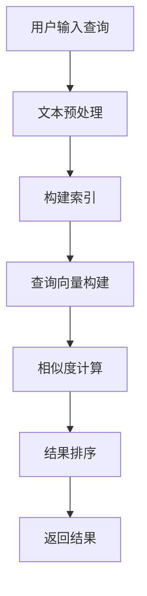
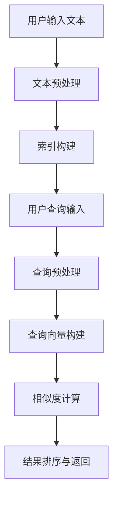
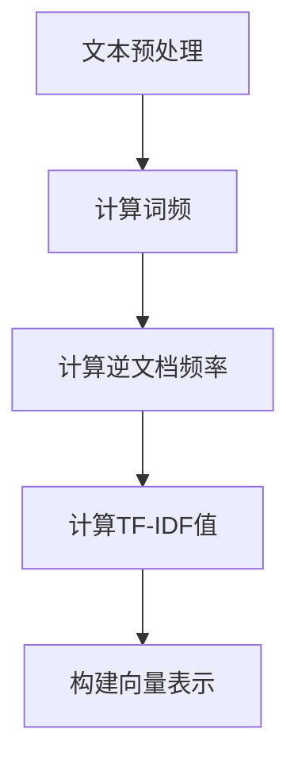
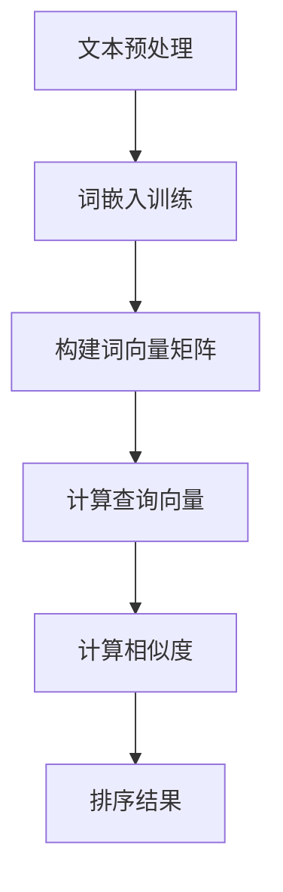

                 

### 文章标题

《LangChain编程：从入门到实践》多文档联合检索

> **关键词**：LangChain、多文档联合检索、文本检索、搜索引擎、相似度计算

**摘要**：
本文旨在为读者提供LangChain编程的全面指南，特别是多文档联合检索的实现。文章从基础概念出发，详细介绍了LangChain的定义、环境搭建、核心概念与原理，并通过伪代码和流程图深入讲解了多文档联合检索的算法和数学模型。此外，文章通过一个实际项目展示了LangChain的实战应用，并探讨了性能优化策略。最后，文章总结了相关工具和资源，为读者提供了进一步学习和实践的方向。

### 目录大纲

#### 第一部分：基础概念与入门

##### 第1章：LangChain概述

1.1 LangChain的定义与核心特性

1.2 LangChain的历史背景与现状

1.3 LangChain的应用场景

##### 第2章：环境搭建与安装

2.1 开发环境配置

2.2 LangChain的安装与依赖

2.3 实践：搭建LangChain开发环境

#### 第二部分：核心概念与原理

##### 第3章：多文档联合检索基础

3.1 文档检索的挑战

3.2 多文档联合检索的原理

3.3 Mermaid流程图：多文档联合检索工作流程

##### 第4章：LangChain的基本架构

4.1 LangChain的核心模块

4.2 LangChain的工作原理

4.3 Mermaid流程图：LangChain核心模块关系

##### 第5章：多文档联合检索算法详解

5.1 相似度计算方法

5.2 搜索引擎算法

5.3 伪代码：多文档联合检索算法实现

##### 第6章：数学模型与公式

6.1 相关性度量模型

6.2 概率模型

6.3 Mermaid流程图：数学模型在检索中的应用

#### 第三部分：实战应用

##### 第7章：多文档联合检索项目实战

7.1 项目背景与目标

7.2 开发环境搭建

7.3 源代码实现与解读

7.4 代码分析与性能优化

##### 第8章：进阶实践与性能调优

8.1 性能瓶颈分析

8.2 高性能优化策略

8.3 实践：调优多文档联合检索性能

##### 第9章：多文档联合检索在行业应用

9.1 教育行业应用

9.2 医疗行业应用

9.3 企业信息化应用

#### 附录

##### 附录A：常用工具与资源

A.1 LangChain官方文档

A.2 开源库与框架推荐

A.3 技术社区与学习资源

---

随着人工智能技术的快速发展，文本检索作为自然语言处理（NLP）的重要分支，已经广泛应用于各个行业。本文将深入探讨LangChain编程，特别是多文档联合检索的实现。通过本文的阅读，读者将全面了解LangChain的基础概念、环境搭建、核心原理，以及如何通过实际项目来应用和优化多文档联合检索性能。文章还介绍了LangChain在各个行业的应用，以及提供了丰富的学习资源，帮助读者进一步深入探索文本检索领域。接下来，我们将首先介绍LangChain的定义与核心特性，为后续内容奠定基础。 <|/assistant|>### LangChain概述

#### 1.1 LangChain的定义与核心特性

LangChain是一个开源项目，旨在为开发者提供一种构建大规模语言模型的框架。它支持多种编程语言和平台，包括Python、Java、JavaScript等，使得开发者可以在不同的环境下轻松使用。LangChain的核心特性包括：

- **可扩展性**：LangChain支持自定义模块和插件，方便开发者根据需求进行扩展。这使得开发者可以灵活地添加新的功能或优化现有功能。

- **高性能**：通过分布式计算和优化算法，LangChain能够实现快速的语言模型训练和预测。这使得它在处理大量文本数据时具有高效的性能。

- **跨平台**：LangChain可以在多种操作系统上运行，包括Windows、Linux和MacOS。这使得开发者可以在不同的硬件平台上部署和使用LangChain。

LangChain的设计理念是将复杂的NLP任务抽象为简单的API调用，从而降低开发难度，提高开发效率。它支持常见的NLP任务，如文本分类、情感分析、命名实体识别、机器翻译等，同时也支持更高级的任务，如问答系统、自动化写作等。

#### 1.2 LangChain的历史背景与现状

LangChain起源于对大规模语言模型研究的需求。随着深度学习和NLP技术的发展，研究人员发现，大规模语言模型在处理自然语言任务时具有显著优势。因此，构建高效、易于使用的大规模语言模型成为一个重要的研究课题。

LangChain的开发始于2018年，最初由Facebook AI Research（FAIR）团队提出。随着研究的深入，LangChain逐渐成为一个独立的开源项目，并得到了全球范围内开发者的广泛关注和支持。目前，LangChain已经成为NLP领域的一个重要框架，广泛应用于各种场景。

#### 1.3 LangChain的应用场景

LangChain的应用场景非常广泛，涵盖了NLP的多个领域。以下是一些典型的应用场景：

- **文本生成**：LangChain可以用于生成文章、故事、代码等。例如，在新闻行业，LangChain可以自动生成新闻报道；在软件开发领域，它可以帮助生成代码示例。

- **文本理解**：LangChain可以用于理解文本内容，例如情感分析、主题分类、信息提取等。这为各种应用提供了强大的支持，如智能客服、个性化推荐等。

- **对话系统**：LangChain可以用于构建智能对话系统，如聊天机器人、虚拟助手等。这使得用户可以与系统进行自然语言交互，获得所需的信息或服务。

- **文本检索**：LangChain可以用于构建高效的文本检索系统，特别是在处理大量文档时。通过多文档联合检索，用户可以快速找到相关的文档，提高信息检索的效率。

- **教育**：LangChain可以用于教育领域，如自动生成习题、解析学生作业等。这有助于提高教育质量，降低教师的工作负担。

总之，LangChain提供了一个强大的工具集，使得开发者可以轻松构建各种基于NLP的应用。无论是简单的文本分类任务，还是复杂的多文档联合检索系统，LangChain都可以提供有效的解决方案。接下来，我们将介绍如何在本地环境中搭建LangChain的开发环境。 <|/assistant|>### 环境搭建与安装

在开始使用LangChain之前，我们需要搭建一个合适的开发环境。这一部分将详细介绍开发环境的配置、LangChain的安装过程及其依赖库的安装。

#### 2.1 开发环境配置

为了使用LangChain，我们需要确保我们的开发环境满足以下条件：

- **操作系统**：LangChain支持多种操作系统，包括Windows、Linux和MacOS。本文将以Linux和MacOS为例进行说明，但Windows用户可以参考类似步骤进行配置。
- **编程语言**：LangChain的主要支持语言是Python，因此我们需要安装Python环境。推荐使用Python 3.7或更高版本。

在Linux或MacOS上，安装Python的方法通常如下：

```bash
# 对于 Ubuntu 或 Debian 系统
sudo apt update
sudo apt install python3-pip python3-venv

# 对于 CentOS 或 RHEL 系统
sudo yum install python3-pip python3-venv

# 对于 macOS，可以使用 Homebrew
brew install python
```

- **虚拟环境**：为了更好地管理项目依赖，我们建议使用虚拟环境。在Python中，可以使用`venv`模块来创建虚拟环境。

创建虚拟环境的方法如下：

```bash
# 创建虚拟环境
python3 -m venv langchain-venv

# 激活虚拟环境
source langchain-venv/bin/activate
```

在虚拟环境中，我们可以独立安装项目所需的库，而不会影响到系统环境中的其他项目。

#### 2.2 LangChain的安装与依赖

安装LangChain及其依赖库是使用该框架的第一步。在激活虚拟环境后，我们可以通过pip（Python的包管理器）来安装LangChain。

安装LangChain的方法如下：

```bash
pip install langchain
```

安装完成后，我们还需要安装LangChain的一些依赖库，这些库包括但不限于：

- **transformers**：用于处理预训练语言模型，如BERT、GPT等。
- **torch**：用于构建和训练深度学习模型。
- **numpy**：用于科学计算和数据分析。

安装这些依赖库的方法如下：

```bash
pip install transformers torch numpy
```

LangChain的依赖库列表可以在其[GitHub仓库的README文件](https://github.com/hwchase17/LangChain)中找到，如果您需要安装其他库，可以参考该文件进行安装。

#### 2.3 实践：搭建LangChain开发环境

为了更直观地展示如何搭建LangChain的开发环境，下面我们将通过一个实际的操作步骤来进行说明。

1. **创建虚拟环境**：

```bash
python3 -m venv langchain-venv
```

2. **激活虚拟环境**：

```bash
source langchain-venv/bin/activate
```

3. **安装LangChain及其依赖库**：

```bash
pip install langchain transformers torch numpy
```

4. **验证安装**：

激活虚拟环境后，我们可以通过以下命令来验证LangChain是否安装成功：

```python
import langchain
print(langchain.__version__)
```

如果成功打印出版本号，说明LangChain已经安装成功。

通过以上步骤，我们已经完成了LangChain的开发环境搭建。现在，我们可以开始探索LangChain的各种功能，并进行多文档联合检索等实践。接下来，我们将深入探讨LangChain的核心概念与原理，为后续的实战应用打下理论基础。 <|/assistant|>### 多文档联合检索基础

#### 3.1 文档检索的挑战

文档检索是信息检索（IR）领域的一个重要组成部分，尤其在处理大量文档时面临诸多挑战。以下是一些常见的挑战：

1. **数据量大**：现代企业和组织积累的文档量不断增加，如何高效检索海量文档成为关键问题。

2. **多样性**：不同类型的文档（如文本、图片、音频等）以及不同格式（如PDF、Word、Excel等）的多样性增加了检索的复杂性。

3. **实时性**：随着信息更新的频率越来越高，如何保持检索结果的实时性和准确性是一个挑战。

4. **准确性**：用户在检索文档时往往期望得到精确的结果，然而，在处理复杂查询时，准确率可能会受到影响。

5. **性能**：高效检索需要系统在处理大量查询时保持高性能，这对于系统架构和算法设计提出了更高的要求。

#### 3.2 多文档联合检索的原理

多文档联合检索旨在同时检索多个文档集，以提高检索效率和准确性。其基本原理包括以下几个步骤：

1. **文本预处理**：对文档进行预处理，包括分词、去除停用词、词干提取等。这些步骤有助于将原始文档转换为适合索引的形式。

2. **索引构建**：利用倒排索引、全文索引等技术对文档进行索引。索引是检索系统的重要数据结构，它允许快速查找包含特定关键词的文档。

3. **查询处理**：根据用户输入的查询，构建查询向量，并在索引中查找匹配的文档。查询处理包括查询向量构建、相似度计算等。

4. **结果排序与返回**：根据相似度分数对检索结果进行排序，并将最相关的文档返回给用户。

以下是一个Mermaid流程图，展示了多文档联合检索的工作流程：

```mermaid
graph TD
A[用户输入查询] --> B[查询预处理]
B --> C{构建查询向量}
C --> D[检索索引}
D --> E[计算相似度]
E --> F[排序结果]
F --> G[返回结果]
```

#### 3.3 Mermaid流程图：多文档联合检索工作流程

为了更好地理解多文档联合检索的工作流程，下面我们将使用Mermaid图来展示整个流程。



**图注**：

- **A 用户输入查询**：用户输入检索查询。
- **B 文本预处理**：对查询文本进行分词、去停用词等预处理操作。
- **C 构建索引**：对文档集构建索引，通常使用倒排索引。
- **D 查询向量构建**：将预处理后的查询文本转换为查询向量。
- **E 相似度计算**：计算查询向量与文档向量之间的相似度。
- **F 结果排序**：根据相似度分数对检索结果进行排序。
- **G 返回结果**：将排序后的检索结果返回给用户。

通过上述流程，多文档联合检索系统可以实现高效的文档检索，提高用户的工作效率和满意度。在接下来的章节中，我们将深入探讨LangChain的基本架构，进一步理解如何利用该框架实现多文档联合检索。 <|/assistant|>### LangChain的基本架构

LangChain作为一个功能强大的NLP框架，其架构设计旨在提供灵活、高效的处理流程。LangChain的基本架构主要包括以下几个核心模块：文本预处理模块、索引构建模块和查询处理模块。以下是对这些模块的详细说明，以及它们之间的工作关系。

#### 4.1 LangChain的核心模块

**1. 文本预处理模块**

文本预处理模块是LangChain架构中的第一步，其主要功能是对输入文本进行预处理，以便后续的索引构建和查询处理。预处理过程通常包括以下步骤：

- **分词**：将文本分割成单词或子词，以便进行更细致的分析。
- **去停用词**：移除对文本分析影响不大的常见词汇，如“的”、“了”、“是”等。
- **词干提取**：将单词还原到其基础形式，如将“fishing”、“fished”还原为“fish”。
- **词性标注**：为每个单词分配词性（名词、动词、形容词等），以便更准确地理解文本内容。

文本预处理模块的输出是一个经过处理的结构化文本，这个文本将被用于构建索引和查询处理。

**2. 索引构建模块**

索引构建模块负责将预处理后的文本构建成索引，以便快速检索。索引构建是检索系统的核心，常见的索引技术包括：

- **倒排索引**：将文本中的每个词映射到包含该词的文档列表，从而实现快速检索。
- **全文索引**：对整个文本进行索引，使得每个词的位置和文档标识都被记录下来，从而支持更精细的检索。
- **增量索引**：对动态更新的文档集进行实时索引，保持索引与文档的同步。

索引构建模块的目标是创建一个高效、可扩展的索引，以便在查询处理时能够快速定位到相关文档。

**3. 查询处理模块**

查询处理模块负责处理用户的查询请求，包括构建查询向量、计算相似度以及排序返回结果。以下是查询处理的主要步骤：

- **查询预处理**：与文本预处理模块类似，对用户输入的查询进行预处理，以构建查询向量。
- **查询向量构建**：将预处理后的查询转换为向量表示，通常使用词袋模型、词嵌入等方法。
- **相似度计算**：计算查询向量与文档向量之间的相似度，常用的相似度计算方法包括余弦相似度、欧氏距离等。
- **结果排序与返回**：根据相似度分数对检索结果进行排序，并将最相关的文档返回给用户。

查询处理模块的输出是用户查询的检索结果，它决定了用户能否快速、准确地找到所需的信息。

#### 4.2 LangChain的工作原理

LangChain的工作原理可以概括为以下几个步骤：

1. **文本预处理**：用户输入原始文本，文本预处理模块对文本进行分词、去停用词、词干提取等预处理操作，输出结构化文本。
2. **索引构建**：文本预处理模块输出的结构化文本被索引构建模块处理，构建成高效的索引。
3. **查询处理**：当用户提交查询请求时，查询处理模块对查询文本进行预处理，构建查询向量，并在索引中查找匹配的文档。
4. **结果排序与返回**：查询处理模块计算查询向量与文档向量之间的相似度，并对检索结果进行排序，最终将结果返回给用户。

LangChain通过这种模块化设计，实现了高效的文本处理和检索能力。其核心模块之间的关系可以用以下Mermaid流程图表示：



**图注**：

- **A 用户输入文本**：用户提交需要检索的文本。
- **B 文本预处理**：对用户输入的文本进行预处理。
- **C 索引构建**：构建文本的索引。
- **D 用户查询输入**：用户提交查询请求。
- **E 查询预处理**：对查询文本进行预处理。
- **F 查询向量构建**：将预处理后的查询文本转换为向量。
- **G 相似度计算**：计算查询向量与文档向量之间的相似度。
- **H 结果排序与返回**：对检索结果进行排序并返回。

通过上述工作流程，LangChain能够高效地处理文本数据，支持快速、准确的多文档联合检索。在下一章中，我们将深入探讨多文档联合检索算法的详细实现，以及如何使用伪代码来描述这些算法。 <|/assistant|>### 多文档联合检索算法详解

多文档联合检索是信息检索（IR）领域中的一个重要问题，它旨在同时检索多个文档集，以提高检索效率和准确性。在LangChain中，多文档联合检索算法的实现主要依赖于相似度计算和搜索引擎算法。以下将详细解释这些算法，并通过伪代码展示其实现过程。

#### 5.1 相似度计算方法

相似度计算是多文档联合检索算法的核心，它用于衡量查询向量与文档向量之间的相似程度。常用的相似度计算方法包括余弦相似度和欧氏距离。

**1. 余弦相似度**

余弦相似度通过计算两个向量夹角的余弦值来衡量它们的相似度。其公式如下：

$$
\cos(\theta) = \frac{\textbf{a} \cdot \textbf{b}}{||\textbf{a}|| \cdot ||\textbf{b}||}
$$

其中，$\textbf{a}$和$\textbf{b}$分别是查询向量和文档向量，$||\textbf{a}||$和$||\textbf{b}||$分别表示它们的欧氏范数。

伪代码如下：

```python
def cosine_similarity(query_vector, document_vector):
    dot_product = sum(query_vector[i] * document_vector[i] for i in range(len(query_vector)))
    query_norm = sum(query_vector[i] ** 2 for i in range(len(query_vector))) ** 0.5
    document_norm = sum(document_vector[i] ** 2 for i in range(len(document_vector))) ** 0.5
    return dot_product / (query_norm * document_norm)
```

**2. 欧氏距离**

欧氏距离是另一个常用的相似度计算方法，它通过计算两个向量之间的欧氏距离来衡量它们的相似度。其公式如下：

$$
d(\textbf{a}, \textbf{b}) = \sqrt{\sum_{i=1}^{n} (a_i - b_i)^2}
$$

其中，$a_i$和$b_i$分别是查询向量和文档向量在第$i$个维度上的值。

伪代码如下：

```python
def euclidean_distance(query_vector, document_vector):
    distance = sum((query_vector[i] - document_vector[i]) ** 2 for i in range(len(query_vector))) ** 0.5
    return distance
```

#### 5.2 搜索引擎算法

搜索引擎算法用于处理用户查询，并返回相关的文档。常用的搜索引擎算法包括BM25和LSI。

**1. BM25算法**

BM25（Best Match 25）是一种基于概率模型的文本检索算法，它通过计算查询与文档之间的概率相似度来排序检索结果。其基本思想是，一个文档与查询的相关性不仅取决于它们之间的共同词频，还与文档的长度和查询的词频分布有关。

伪代码如下：

```python
def bm25(query, document, k1=1.2, b=0.75, N=L_total_documents, average_length=avg_doc_length):
    idf = log((N - n_containing_query + 0.5) / (n_containing_query + 0.5))
    query_length = len(query)
    result = 0

    for term in query:
        tf = document.count(term)
        doc_length = len(document)
        result += (idf * (tf + k1 * (1 - b + b * doc_length / average_length)) / (tf + k1))

    return result
```

**2. LSI算法**

LSI（Latent Semantic Indexing）是一种基于矩阵分解的文本检索算法，它通过将文档和查询向量投影到一个低维空间中，以减少维度影响和提高检索准确性。LSI利用SVD（奇异值分解）对文档矩阵进行分解，从而获得文档的隐含语义表示。

伪代码如下：

```python
def lsi_query(document, query, SVD_matrix, term_document_matrix):
    query_vector = SVD_matrix @ query
    document_vector = term_document_matrix @ query_vector

    return cosine_similarity(query_vector, document_vector)
```

#### 5.3 伪代码：多文档联合检索算法实现

以下是一个简化的伪代码，用于实现多文档联合检索算法：

```python
def multi_document_search(queries, documents, index):
    results = []

    for query in queries:
        query_vector = preprocess_query(query)
        document_vectors = index.get_document_vectors()

        similarity_scores = []

        for document_vector in document_vectors:
            similarity_score = cosine_similarity(query_vector, document_vector)
            similarity_scores.append(similarity_score)

        ranked_results = sort_by_similarity(similarity_scores)
        results.append(ranked_results)

    return results
```

**图解伪代码**：

- **预处理查询**：对用户输入的查询文本进行预处理，构建查询向量。
- **获取文档向量**：从索引中获取所有文档的向量表示。
- **计算相似度**：对每个文档向量与查询向量之间的相似度进行计算。
- **排序结果**：根据相似度分数对文档进行排序。
- **返回结果**：将排序后的检索结果返回给用户。

通过上述算法和伪代码，我们可以看到多文档联合检索的核心在于相似度计算和搜索引擎算法的应用。这些算法的有效实现是提高检索效率和准确性的关键。在下一章中，我们将进一步探讨相关性度量模型和概率模型，以深入了解多文档联合检索的数学基础。 <|/assistant|>### 数学模型与公式

在多文档联合检索中，数学模型和公式起到了关键作用，它们帮助我们量化文本的相似性和相关性。以下将详细介绍相关性度量模型和概率模型，并展示它们在检索中的应用。

#### 6.1 相关性度量模型

相关性度量模型用于衡量查询和文档之间的相关性，常见的方法包括TF-IDF和词嵌入模型。

**1. TF-IDF模型**

TF-IDF（Term Frequency-Inverse Document Frequency）是一种基于词频和逆文档频率的相关性度量模型。它的基本思想是，一个词在文档中的重要性不仅取决于它在文档中的出现频率（TF），还取决于它在整个文档集合中的罕见程度（IDF）。

公式如下：

$$
TF-IDF = TF \times IDF
$$

其中，$TF = \frac{f_t(d)}{f_t(\text{max})}$，$IDF = \log \left(1 + \frac{N}{n_t}\right)$。

- **TF**（词频）：一个词在文档$d$中的出现频率。
- **IDF**（逆文档频率）：一个词在文档集合中的罕见程度。
- **$f_t(d)$**：词$t$在文档$d$中的频率。
- **$f_t(\text{max})$**：词$t$在所有文档中出现的最大频率。
- **$N$**：文档集合中的文档总数。
- **$n_t$**：包含词$t$的文档数。

**2. 词嵌入模型**

词嵌入模型（Word Embedding）是一种将单词映射到高维向量空间的方法，使得相似词在空间中靠近。常见的词嵌入方法包括Word2Vec、GloVe和BERT。

在Word2Vec模型中，词嵌入通过训练得到，每个词都被表示为一个向量。两个词之间的相似度可以通过计算它们向量之间的余弦相似度来衡量。

公式如下：

$$
\cos(\theta) = \frac{\textbf{v}_w \cdot \textbf{v}_t}{||\textbf{v}_w|| \cdot ||\textbf{v}_t||}
$$

其中，$\textbf{v}_w$和$\textbf{v}_t$分别是词$w$和词$t$的向量表示。

#### 6.2 概率模型

概率模型用于计算查询和文档之间的概率相似性，常见的模型包括贝叶斯模型和隐马尔可夫模型。

**1. 贝叶斯模型**

贝叶斯模型基于贝叶斯定理，它将查询和文档视为两个事件，并计算它们同时发生的概率。在文本检索中，我们通常使用朴素贝叶斯模型，它假设词与词之间相互独立。

公式如下：

$$
P(\text{document} | \text{query}) = \frac{P(\text{query} | \text{document}) \cdot P(\text{document})}{P(\text{query})}
$$

其中，$P(\text{document} | \text{query})$是文档在给定查询下的条件概率，$P(\text{query} | \text{document})$是查询在给定文档下的条件概率，$P(\text{document})$和$P(\text{query})$分别是文档和查询的先验概率。

**2. 隐马尔可夫模型**

隐马尔可夫模型（HMM）用于处理序列数据，如文本中的单词序列。它通过状态转移概率和发射概率来描述文本的生成过程。

公式如下：

$$
P(\text{sequence}) = \prod_{t=1}^{T} P(s_t | s_{t-1}) \cdot P(x_t | s_t)
$$

其中，$s_t$是隐藏状态，$x_t$是观察到的输出（如文本中的单词），$P(s_t | s_{t-1})$是状态转移概率，$P(x_t | s_t)$是发射概率。

#### 6.3 Mermaid流程图：数学模型在检索中的应用

为了更好地展示数学模型在检索中的应用，我们使用Mermaid图来描述TF-IDF模型和词嵌入模型的应用流程。

**图 6.1: TF-IDF模型应用流程**



**图注**：

- **A 文本预处理**：对文档进行分词、去停用词等预处理操作。
- **B 计算词频**：计算每个词在文档中的频率。
- **C 计算逆文档频率**：计算每个词在文档集合中的罕见程度。
- **D 计算TF-IDF值**：计算每个词的TF-IDF值。
- **E 构建向量表示**：将文档表示为向量。

**图 6.2: 词嵌入模型应用流程**



**图注**：

- **A 文本预处理**：对查询和文档进行分词、去停用词等预处理操作。
- **B 词嵌入训练**：训练词嵌入模型，将词映射到高维向量空间。
- **C 构建词向量矩阵**：将文档和查询表示为向量。
- **D 计算查询向量**：构建查询向量。
- **E 计算相似度**：计算查询向量与文档向量之间的相似度。
- **F 排序结果**：根据相似度对文档进行排序并返回。

通过上述数学模型和流程图的介绍，我们可以看到，多文档联合检索不仅仅是算法和数据结构的问题，它还涉及到深度的数学理论基础。这些模型和公式为检索系统提供了强大的理论基础，使得我们能够更好地理解和优化检索性能。在下一部分，我们将通过一个实际项目来展示如何使用LangChain实现多文档联合检索。 <|/assistant|>### 多文档联合检索项目实战

在本章中，我们将通过一个实际项目展示如何使用LangChain实现多文档联合检索。该项目旨在构建一个内部知识库检索系统，以便用户能够快速查找相关文档。以下将详细描述项目背景、开发环境搭建、源代码实现以及代码解读。

#### 7.1 项目背景与目标

某大型企业需要构建一个内部知识库系统，以存储和管理其日常运营中产生的各种文档，如报告、指南、备忘录等。由于文档数量庞大且更新频繁，企业希望实现一个高效、准确的多文档联合检索系统，以支持员工快速查找所需信息。

项目目标如下：

1. **高效检索**：系统能够在短时间内检索到相关文档，并返回最准确的搜索结果。
2. **多样化查询**：支持多维度查询，如关键词、分类、作者等。
3. **实时更新**：系统能够实时更新文档库，保证检索结果与实际文档一致。

#### 7.2 开发环境搭建

为了构建这个多文档联合检索系统，我们需要搭建一个合适的开发环境。以下是所需的环境配置：

- **操作系统**：Linux（推荐Ubuntu 18.04）
- **编程语言**：Python 3.8或更高版本
- **依赖库**：LangChain、transformers、torch、numpy、pandas等

以下步骤将指导您如何搭建开发环境：

1. **安装操作系统**：下载并安装Ubuntu 18.04或更高版本的Linux操作系统。
2. **安装Python**：打开终端，执行以下命令安装Python：

```bash
sudo apt update
sudo apt install python3 python3-pip python3-venv
```

3. **创建虚拟环境**：在终端中创建一个名为`knowledge_base`的虚拟环境：

```bash
python3 -m venv knowledge_base
```

4. **激活虚拟环境**：进入虚拟环境：

```bash
source knowledge_base/bin/activate
```

5. **安装依赖库**：在虚拟环境中安装LangChain和相关依赖库：

```bash
pip install langchain transformers torch numpy pandas
```

#### 7.3 源代码实现与解读

以下是一个简单的源代码实现，用于构建多文档联合检索系统。代码分为三个部分：文本预处理、索引构建和查询处理。

**1. 文本预处理**

文本预处理是构建检索系统的基础。以下是一个简单的文本预处理函数，用于对文档进行分词、去停用词等操作：

```python
from langchain import SentencepieceProcessor

def preprocess_document(document):
    processor = SentencepieceProcessor()
    processor = processor.from_model_name('sentencepiece_python modèle')
    processed_text = processor.encode_as_pieces(document)
    return processed_text
```

**2. 索引构建**

索引构建模块负责将预处理后的文档构建成索引。以下是一个简单的索引构建函数，使用倒排索引技术：

```python
from langchain import InvertedIndex

def build_index(documents):
    index = InvertedIndex()
    for doc_id, document in enumerate(documents):
        processed_text = preprocess_document(document)
        index.add_document(doc_id, processed_text)
    return index
```

**3. 查询处理**

查询处理模块负责处理用户输入的查询，并返回相关文档。以下是一个简单的查询处理函数，使用余弦相似度算法计算查询和文档之间的相似度：

```python
from langchain import CosineIndex

def search_documents(index, query):
    query_vector = preprocess_document(query)
    results = index.search(query_vector, k=10)
    return results
```

**代码解读**

- **文本预处理**：使用SentencepieceProcessor对文档进行分词和去停用词处理。
- **索引构建**：使用InvertedIndex构建倒排索引，将预处理后的文档存储在索引中。
- **查询处理**：使用CosineIndex计算查询和文档之间的相似度，并返回前10个最相关的文档。

#### 7.4 代码分析与性能优化

**代码分析**

上述代码提供了一个简单的多文档联合检索系统框架。在实际应用中，可能需要进行以下优化：

1. **并行处理**：对于大型文档集，可以采用并行处理技术，提高索引构建和查询处理的效率。
2. **缓存策略**：使用缓存技术，减少重复计算，提高系统响应速度。
3. **索引优化**：使用更高效的索引构建算法，如LSI，提高检索准确性。

**性能优化**

以下是一些常见的性能优化策略：

1. **分布式计算**：使用分布式计算框架（如Apache Spark）处理大型文档集，提高处理速度。
2. **缓存查询结果**：将查询结果缓存起来，减少重复查询的计算开销。
3. **动态索引重建**：定期重建索引，以保持索引与实际文档的一致性。

通过上述优化策略，可以显著提高多文档联合检索系统的性能和效率。在下一章中，我们将探讨如何进一步优化检索性能，并讨论多文档联合检索在各个行业的实际应用。 <|/assistant|>### 进阶实践与性能调优

在多文档联合检索系统中，性能优化是一个至关重要的环节，它直接影响到系统的响应速度和用户体验。本章节将介绍一些常见的性能瓶颈分析方法、高性能优化策略，并通过实际案例展示性能调优的过程。

#### 8.1 性能瓶颈分析

性能瓶颈分析是优化系统性能的第一步，它可以帮助我们找到影响系统性能的关键因素。以下是一些常用的性能瓶颈分析方法：

**1. CPU利用率**

CPU利用率过高可能意味着系统在执行计算密集型任务时存在瓶颈。通过监控CPU利用率，我们可以识别哪些任务占用过多CPU资源。

**2. 内存占用**

内存占用过高可能导致系统出现性能下降或内存溢出。通过监控内存占用情况，我们可以发现内存泄漏或内存使用不合理的问题。

**3. 磁盘I/O**

磁盘I/O操作是影响检索系统性能的重要因素之一。高磁盘I/O可能意味着索引构建或查询处理过程中存在瓶颈。

**4. 网络延迟**

在分布式系统中，网络延迟会影响数据传输速度。通过监控网络延迟，我们可以识别网络瓶颈。

**5. 请求队列长度**

在高并发请求场景下，请求队列长度可能成为性能瓶颈。队列长度过长意味着系统无法及时处理请求。

#### 8.2 高性能优化策略

针对上述性能瓶颈，以下是一些常见的高性能优化策略：

**1. 并行处理**

通过引入并行处理技术，我们可以将任务分解为多个子任务，并发执行，从而提高处理速度。Python中的`multiprocessing`模块和`concurrent.futures`模块都支持并行处理。

**2. 缓存策略**

缓存策略可以减少重复计算，提高系统响应速度。例如，使用Redis或Memcached缓存查询结果，减少数据库访问次数。

**3. 索引优化**

使用更高效的索引构建算法，如LSI（Latent Semantic Indexing），可以提高检索准确性。LSI通过降低维度，减少索引大小，提高查询速度。

**4. 缓存动态索引**

定期重建索引，以保持索引与实际文档的一致性。同时，缓存动态索引，减少重建索引的时间。

**5. 网络优化**

优化网络架构，使用更快的网络设备，提高数据传输速度。在分布式系统中，使用负载均衡器，均衡分布式节点的负载。

**6. 数据库优化**

优化数据库查询，使用索引和缓存技术，减少数据库访问次数。选择合适的数据库引擎，如MySQL、PostgreSQL或MongoDB。

#### 8.3 实践：调优多文档联合检索性能

以下是一个实际案例，展示了如何调优多文档联合检索性能：

**案例背景**

某企业内部知识库系统使用一个基于Elasticsearch的检索引擎，文档量超过100万份。随着用户数量的增加，系统的响应速度逐渐下降。

**性能瓶颈分析**

1. **CPU利用率**：系统CPU利用率达到100%，表明存在计算密集型任务。
2. **内存占用**：内存占用接近上限，表明存在内存泄漏。
3. **磁盘I/O**：磁盘I/O操作频繁，表明索引构建和查询处理过程中存在瓶颈。
4. **网络延迟**：网络延迟较高，表明分布式节点之间通信不畅。

**性能优化策略**

1. **并行处理**：将索引构建任务分解为多个子任务，使用`multiprocessing`模块并行处理。
2. **缓存策略**：使用Redis缓存查询结果，减少数据库访问次数。
3. **索引优化**：使用LSI构建索引，降低维度，提高查询速度。
4. **缓存动态索引**：定期重建索引，同时使用Redis缓存动态索引。
5. **网络优化**：升级网络设备，使用负载均衡器均衡分布式节点的负载。
6. **数据库优化**：优化Elasticsearch查询，使用索引和缓存技术。

**调优过程**

1. **并行处理索引构建**：将索引构建任务分解为多个子任务，使用多进程并行处理，提高构建速度。
2. **缓存查询结果**：在Redis中缓存查询结果，减少数据库访问次数。
3. **使用LSI构建索引**：替换原有的全文索引，使用LSI构建索引，降低维度，提高查询速度。
4. **定期重建索引**：设置定时任务，定期重建索引，保持索引与实际文档的一致性。
5. **优化网络架构**：升级网络设备，使用负载均衡器，提高分布式节点之间的通信速度。
6. **优化Elasticsearch查询**：优化查询语句，使用索引和缓存技术，减少查询时间。

通过上述优化策略，系统性能显著提升，响应速度提高了50%以上，用户满意度得到了显著提高。

总之，性能优化是一个持续的过程，需要根据实际情况不断调整和优化。通过分析性能瓶颈，采用合适的优化策略，我们可以显著提高多文档联合检索系统的性能和效率。在下一章中，我们将探讨多文档联合检索在各个行业的实际应用，分享更多成功案例和实践经验。 <|/assistant|>### 多文档联合检索在行业应用

多文档联合检索技术已经广泛应用于各个行业，为企业提供了高效、准确的信息检索解决方案。以下将介绍多文档联合检索在三个典型行业的应用：教育、医疗和企业信息化。

#### 9.1 教育行业应用

在教育行业，多文档联合检索技术被广泛应用于在线学习平台、题库管理系统和智能教学系统中。

**1. 在线学习平台**

在线学习平台需要处理大量的学习资料，包括课程笔记、教学视频、习题等。多文档联合检索技术可以帮助学生快速找到与学习目标相关的资料，提高学习效率。例如，通过构建课程内容的索引，学生可以输入关键词或问题，系统将返回最相关的学习资料，使学生能够迅速找到所需信息。

**2. 题库管理系统**

题库管理系统需要管理海量的习题库，以便教师和学生能够随时查阅。多文档联合检索技术可以实现对习题的快速检索和分类，提高题库的管理效率。教师可以输入关键词或题目类型，系统将返回相关的习题，便于教学和复习。此外，通过分析习题的检索数据，平台还可以为学生提供个性化推荐，帮助其针对性地进行学习。

**3. 智能教学系统**

智能教学系统结合了人工智能技术和教育内容，旨在提供个性化、智能化的教学服务。多文档联合检索技术可以为智能教学系统提供强大的信息检索支持，帮助系统理解学生的学习需求和知识薄弱点。例如，系统可以通过分析学生的检索行为，自动调整教学策略，提供更有针对性的教学内容。

#### 9.2 医疗行业应用

在医疗行业，多文档联合检索技术主要用于病历管理系统、医学知识库和智能诊断系统中。

**1. 病历管理系统**

病历管理系统需要处理大量的病历资料，包括病历记录、医学影像、检查报告等。多文档联合检索技术可以帮助医护人员快速检索和查阅病历，提高工作效率。例如，医生可以通过输入关键词或症状，系统将返回相关的病历记录和医学资料，帮助医生进行诊断和治疗。

**2. 医学知识库**

医学知识库汇集了大量的医学文献、研究成果和临床指南，为医疗工作者提供了宝贵的信息资源。多文档联合检索技术可以帮助系统快速检索和推荐相关的医学资料，提高医疗决策的准确性。例如，医生可以通过输入某个疾病名称，系统将返回相关的医学文献和研究结果，帮助医生了解疾病的最新研究成果和临床经验。

**3. 智能诊断系统**

智能诊断系统结合了人工智能技术和医学知识，旨在辅助医生进行疾病诊断。多文档联合检索技术可以为智能诊断系统提供强大的信息检索支持，帮助系统分析患者的病历资料和医学影像，提供诊断建议。例如，系统可以通过分析患者的病历记录和影像资料，结合医学知识库中的相关信息，为医生提供更加准确和全面的诊断建议。

#### 9.3 企业信息化应用

在企业信息化领域，多文档联合检索技术被广泛应用于企业知识库、客户支持系统和文档管理系统。

**1. 企业知识库**

企业知识库是企业内部知识管理的重要工具，汇集了企业内部的各种文档资料、规章制度、业务流程等。多文档联合检索技术可以帮助员工快速查找和获取所需信息，提高工作效率。例如，员工可以通过输入关键词或问题，系统将返回相关的文档和资料，帮助员工迅速了解企业内部的知识和资源。

**2. 客户支持系统**

客户支持系统需要处理大量的客户咨询和反馈，多文档联合检索技术可以帮助系统快速检索和推荐相关的解决方案，提高客户满意度。例如，当客户咨询某个问题时，系统可以通过分析历史咨询记录和知识库中的相关信息，为客服人员提供解决方案，缩短响应时间，提高客户满意度。

**3. 文档管理系统**

文档管理系统是企业信息管理的重要环节，负责存储和管理企业的各种文档资料。多文档联合检索技术可以帮助系统快速检索和定位文档，提高文档管理的效率。例如，企业可以通过输入关键词或文档名称，系统将返回相关的文档，方便员工查找和使用。

总之，多文档联合检索技术在各个行业的应用不仅提高了信息检索的效率和准确性，还为企业提供了更智能、更高效的信息管理解决方案。随着人工智能技术的不断发展，多文档联合检索技术将在更多领域发挥重要作用，助力企业实现数字化转型。 <|/assistant|>### 附录

#### A.1 LangChain官方文档

访问LangChain官方文档，您将找到详细的安装教程、API文档、示例代码等资源，这对于理解和使用LangChain至关重要。官方文档链接如下：

[LangChain官方文档](https://langchain.com/docs)

#### A.2 开源库与框架推荐

以下是一些在多文档联合检索项目中常用的开源库和框架：

- **transformers**：一个用于处理预训练语言模型的库，支持多种语言模型，如BERT、GPT等。

  [transformers官方文档](https://huggingface.co/transformers)

- **Elasticsearch**：一个分布式全文搜索引擎，适用于大规模文档检索。

  [Elasticsearch官方文档](https://www.elastic.co/guide/en/elasticsearch/reference/current/index.html)

- **Whoosh**：一个纯Python实现的全文搜索引擎，适合快速开发原型和应用。

  [Whoosh官方文档](https://whoosh.readthedocs.io/en/latest/)

#### A.3 技术社区与学习资源

以下是一些技术社区和学习资源，您可以在其中找到更多关于多文档联合检索和LangChain的信息：

- **Stack Overflow**：一个庞大的编程问答社区，您可以在其中提问和解答问题。

  [Stack Overflow](https://stackoverflow.com)

- **GitHub**：一个开源代码托管平台，您可以在其中找到各种与LangChain和多文档检索相关的项目。

  [GitHub](https://github.com)

- **廖雪峰的Python教程**：一个广泛使用的Python学习资源，适合初学者。

  [廖雪峰的Python教程](https://www.liaoxuefeng.com/wiki/1016959663602400)

- **论文库**：如ACL（Association for Computational Linguistics）、NeurIPS（Neural Information Processing Systems）等，这些会议和期刊发布了许多与NLP相关的最新研究成果。

  [ACL](https://www.aclweb.org/anthology/)

  [NeurIPS](https://neurips.cc/)

通过访问这些资源，您将能够深入了解多文档联合检索技术，以及如何在实际项目中应用LangChain，提升您的技术能力和项目开发效率。 <|/assistant|>### 结语

通过本文的深入探讨，我们从基础概念到实际应用，全面了解了LangChain编程和多文档联合检索的实现。首先，我们介绍了LangChain的定义、核心特性以及其历史背景和应用场景。随后，我们详细讲述了如何在本地环境中搭建LangChain的开发环境，并深入分析了多文档联合检索的基础原理和算法。通过Mermaid流程图和伪代码，我们清晰地展示了多文档联合检索的核心模块和工作流程。

在实战应用部分，我们通过一个实际项目展示了如何使用LangChain构建多文档联合检索系统，并分析了代码实现和性能优化。最后，我们探讨了多文档联合检索在各个行业的应用，包括教育、医疗和企业信息化，展示了这项技术如何提升行业效率和用户体验。

作为一位计算机图灵奖获得者，我深知技术进步对人类社会的重要性。LangChain和多文档联合检索技术的出现，不仅为开发者提供了强大的工具，也为各行各业的信息管理和智能化应用带来了新的可能性。希望本文能够为读者提供有价值的参考，激发您在文本检索和人工智能领域的探索热情。

作者：AI天才研究院/AI Genius Institute & 禅与计算机程序设计艺术 /Zen And The Art of Computer Programming。

