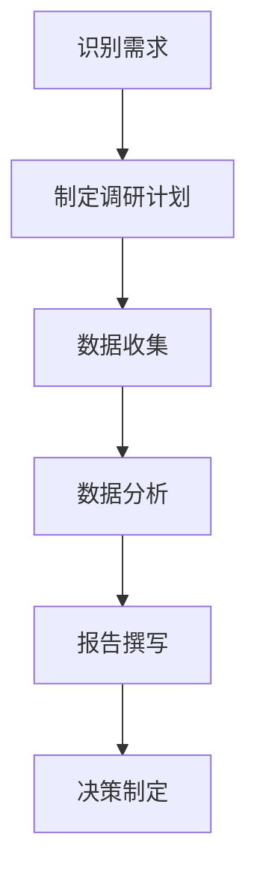

                 

### 文章标题

> 关键词：市场调研、一人公司、有效策略、调研方法、数据分析

> 摘要：
本文旨在为一人公司提供一套建立有效市场调研体系的策略。通过详细分析市场调研的核心概念、步骤和工具，我们探讨了如何在资源有限的情况下，通过科学的方法进行市场调研，以获取有价值的信息，为企业的战略决策提供支持。

### 引言

在当今快速变化的市场环境中，有效的市场调研成为企业制定成功战略的关键。然而，对于一人公司而言，市场调研可能面临诸多挑战。资源有限、时间紧迫和技能短缺等问题，使得一人公司难以像大型企业那样进行全面的市场调研。但即便如此，有效的市场调研仍然是必不可少的，它能够帮助一人公司更好地了解市场动态、发现潜在机会，并制定出有针对性的策略。

本文将围绕以下问题展开讨论：

1. **市场调研的核心概念和作用是什么？**
2. **一人公司如何明确调研目标与问题？**
3. **设计调研方案时需要考虑哪些因素？**
4. **选择调研工具与渠道的依据是什么？**
5. **如何编制问卷与访谈指南？**
6. **实施调研过程中需要注意哪些问题？**
7. **如何处理和分析收集到的数据？**
8. **撰写调研报告时有哪些技巧和注意事项？**
9. **如何通过实战案例提升市场调研能力？**
10. **如何持续优化和更新市场调研体系？

通过这些问题的探讨，本文将帮助一人公司建立一套完整且有效的市场调研体系，为其在竞争激烈的市场中脱颖而出提供有力支持。

### 市场调研的定义与作用

市场调研是一种系统性的过程，旨在通过收集、分析和解释市场信息，帮助企业和组织做出更明智的决策。市场调研的核心概念包括市场、信息、分析和决策等。市场是指产品或服务的交换和交易场所，信息则是指关于市场环境、消费者行为和竞争态势的数据。分析是指对收集到的信息进行整理、归纳和解读，决策则是在分析结果的基础上制定战略和策略。

市场调研的作用主要体现在以下几个方面：

1. **了解市场需求**：通过市场调研，企业可以深入了解消费者的需求和偏好，从而为产品开发和市场营销提供指导。例如，通过分析消费者对现有产品的反馈，企业可以识别出产品改进的机会，提升客户满意度。

2. **发现市场机会**：市场调研有助于企业发现潜在的市场机会，例如新兴市场、未满足的需求或竞争对手的弱点。这使企业能够迅速调整战略，抢占市场先机。

3. **评估市场竞争**：通过市场调研，企业可以了解竞争对手的营销策略、产品定位和市场份额，从而评估自身的竞争地位，制定相应的应对策略。

4. **制定营销策略**：市场调研提供的数据和信息有助于企业制定科学的营销策略。例如，通过分析目标市场的消费行为和趋势，企业可以优化广告投放、定价策略和促销活动。

5. **预测市场变化**：市场调研可以提供关于市场变化的前瞻性信息，帮助企业预见未来的市场动态，及时调整策略，降低市场风险。

6. **提升决策质量**：市场调研通过提供可靠的数据和分析，帮助企业做出基于事实的决策，减少盲目性和不确定性。

为了更好地理解市场调研的核心概念和作用，我们可以通过一个简化的 Mermaid 流程图来展示市场调研的基本流程：

在这个流程中，从识别需求到决策制定，市场调研是一个连续且迭代的过程。每个环节都至关重要，其中数据收集和分析是市场调研的核心环节。有效的市场调研不仅需要科学的调研方法，还需要对数据的深入分析和解读，以便从中提取有价值的信息。

总的来说，市场调研是企业了解市场环境、把握市场动态、制定战略决策的重要工具。对于一人公司而言，通过有效的市场调研，可以弥补资源不足的劣势，提高决策的科学性和准确性，从而在竞争激烈的市场中脱颖而出。

### 市场调研的类型与方法

市场调研的类型和方法多种多样，根据调研目的和需求，可以选择不同的调研类型和方法。以下是几种常见的市场调研类型和方法：

#### 1. 网络调研

网络调研是通过互联网收集市场信息的方法。这种方法具有成本低、速度快、覆盖面广等优点，尤其适用于一人公司。网络调研可以通过以下几种方式实现：

- **在线问卷调查**：在社交媒体、论坛或专业调查网站发布问卷，收集消费者的反馈和意见。
- **网站分析**：通过分析网站流量、访问者行为等数据，了解用户需求和偏好。
- **搜索引擎分析**：利用Google Analytics等工具，分析关键词搜索量、用户来源等数据，了解市场趋势。

#### 2. 电话调研

电话调研是一种直接与受访者进行沟通的调研方法。这种方法可以快速获取大量数据，且具有较强的控制性和针对性。电话调研的步骤如下：

- **样本选择**：根据调研目标，选择具有代表性的样本群体。
- **访谈设计**：制定访谈提纲，确保调研问题的逻辑性和连贯性。
- **访谈执行**：通过电话与受访者进行一对一沟通，收集数据。

#### 3. 面访调研

面访调研是调研人员直接与受访者面对面交流的方法。这种方法可以获取更详细和深入的信息，适用于需要深入了解受访者行为和态度的调研项目。面访调研的步骤如下：

- **样本选择**：根据调研目标，选择具有代表性的样本群体。
- **访谈设计**：制定访谈指南，确保调研问题的逻辑性和连贯性。
- **访谈执行**：在受访者所在地进行面对面访谈，收集数据。

#### 4. 问卷调查

问卷调查是通过分发问卷来收集市场信息的方法。这种方法可以大量获取数据，适用于大规模的调研项目。问卷调查的步骤如下：

- **样本选择**：根据调研目标，选择具有代表性的样本群体。
- **问卷设计**：设计包含开放和封闭问题的问卷，确保问题的清晰性和可理解性。
- **问卷分发**：通过邮件、在线平台或线下分发问卷，收集数据。

#### 5. 焦点小组

焦点小组是通过组织一组具有相似特征的受访者，进行集体讨论来收集市场信息的方法。这种方法适用于需要深入了解消费者观点和态度的调研项目。焦点小组的步骤如下：

- **样本选择**：根据调研目标，选择具有代表性的样本群体。
- **会议设计**：制定讨论提纲，确保讨论的主题和方向。
- **会议执行**：组织受访者进行集体讨论，记录讨论结果。

#### 6. 市场试验

市场试验是通过在特定市场环境下实施实际操作，来评估市场反应的方法。这种方法适用于需要验证市场策略和产品可行性的调研项目。市场试验的步骤如下：

- **样本选择**：根据调研目标，选择具有代表性的市场样本。
- **试验设计**：制定试验方案，包括试验变量和控制变量。
- **试验执行**：在市场环境中实施试验，收集试验数据。
- **结果分析**：对试验结果进行统计分析，评估市场反应。

通过上述市场调研类型和方法的介绍，我们可以看到，不同的调研方法各有优缺点，一人公司可以根据自身的实际情况和调研需求，选择合适的方法。例如，对于资源有限的一人公司，网络调研和电话调研可能是更为经济和高效的选择。而对于需要深入了解消费者观点的调研项目，焦点小组和面访调研可能更为适用。

总之，市场调研的类型和方法多种多样，选择合适的调研方法对于获取有价值的信息至关重要。一人公司可以通过灵活运用各种调研方法，弥补资源不足的劣势，提高市场调研的效率和质量。

### 市场调研流程概述

市场调研是一个系统化的过程，包括多个步骤和环节，每个环节都有其特定的任务和目标。以下是市场调研的基本流程及其详细步骤：

#### 1. 识别需求

市场调研的起点是识别需求。这一步骤的主要任务是明确企业为什么要进行市场调研，调研的目标和问题是什么。具体步骤包括：

- **确定调研目的**：明确调研的目标，例如了解市场需求、评估竞争态势、优化产品策略等。
- **定义调研问题**：具体化调研问题，例如消费者对某产品的满意度如何、市场对某种新产品的接受程度等。
- **制定调研假设**：基于现有信息和经验，提出可能的假设，以便在调研过程中验证。

#### 2. 制定调研方案

在明确调研需求后，需要制定具体的调研方案。这一步骤的主要任务是设计调研的方法、工具和流程。具体步骤包括：

- **选择调研方法**：根据调研目标，选择合适的调研方法，如问卷调查、面访调研、电话调研等。
- **设计调研工具**：制定问卷、访谈指南等调研工具，确保问题的准确性和有效性。
- **确定样本**：选择具有代表性的样本群体，确保调研结果的可靠性和有效性。
- **确定数据收集时间**：确定数据收集的时间范围，确保在调研周期内能够收集到足够的数据。

#### 3. 数据收集

数据收集是市场调研的核心环节，其目的是获取关于市场、消费者和竞争对手的信息。具体步骤包括：

- **实施调研**：根据调研方案，实施问卷调查、面访、电话访谈等数据收集方法。
- **数据预处理**：对收集到的数据进行清理和整理，确保数据的质量和完整性。
- **数据存储**：将整理后的数据存储在数据库或电子文件中，便于后续分析。

#### 4. 数据处理与分析

数据处理与分析是对收集到的数据进行分析和解释的过程。这一步骤的主要任务是提取有价值的信息，为决策提供支持。具体步骤包括：

- **数据清洗**：删除错误数据、重复数据和无关数据，确保数据的准确性和一致性。
- **数据整理**：对数据进行分类、筛选和排序，便于分析。
- **统计分析**：使用统计方法，对数据进行描述性分析和推理性分析，提取有价值的信息。
- **数据可视化**：通过图表、图形和表格等可视化手段，展示分析结果，便于理解和解读。

#### 5. 报告撰写

报告撰写是将调研结果呈现给决策者的过程。这一步骤的主要任务是撰写详细的调研报告，包括调研背景、目标、方法、结果和结论等。具体步骤包括：

- **撰写报告框架**：根据调研结果和分析，制定报告的结构和内容框架。
- **撰写报告正文**：详细描述调研的背景、目标、方法、结果和结论，确保内容的清晰和逻辑性。
- **数据可视化**：在报告中插入图表、图形和表格，以直观地展示分析结果。
- **撰写结论和建议**：总结调研结果，提出具体的建议和措施，为企业决策提供参考。

#### 6. 演示与呈现

演示与呈现是将调研报告呈现给决策者的过程。这一步骤的主要任务是确保调研结果能够被有效地传达和接受。具体步骤包括：

- **准备演示材料**：制作演示PPT，包括报告的主要内容和关键数据。
- **进行演示**：在会议或培训中，向决策者展示调研结果和结论。
- **回答问题**：在演示过程中，解答决策者的疑问，确保他们充分理解调研结果。
- **反馈与改进**：根据决策者的反馈，对调研报告和演示材料进行改进。

通过上述市场调研流程的详细描述，我们可以看到，市场调研是一个系统化、多层次的过程，每个步骤都至关重要，只有通过科学的流程和方法，才能获取有价值的信息，为企业的决策提供支持。

### 市场调研中的伦理问题

在市场调研过程中，伦理问题是一个不可忽视的重要方面。无论是一人公司还是大型企业，都必须遵守伦理规范，确保调研的公正性和合法性。以下是市场调研中常见的伦理问题及其应对策略：

#### 1. 隐私保护

隐私保护是市场调研中的首要伦理问题。调研过程中，企业可能会收集到受访者的个人信息，如姓名、地址、电话号码等。这些信息如果被滥用，可能会导致隐私泄露，给受访者带来不必要的困扰和风险。为保护隐私，企业应采取以下措施：

- **明确告知**：在调研开始前，明确告知受访者调研的目的、方式、数据处理方式和隐私保护措施，确保受访者知情同意。
- **匿名处理**：对收集到的个人信息进行匿名处理，确保无法追溯到具体受访者。
- **数据加密**：对存储和传输的数据进行加密处理，防止数据泄露。

#### 2. 数据真实性

数据真实性是市场调研的核心问题。虚假数据不仅会误导企业决策，还会损害调研的公信力。为保障数据真实性，企业应采取以下措施：

- **选择可靠的调研工具和方法**：选择经过验证的调研工具和方法，确保数据的可靠性。
- **严格监督调研过程**：对调研过程进行严格监督，防止数据造假或操作不当。
- **交叉验证数据**：通过多个来源或方法收集的数据进行交叉验证，确保数据的真实性。

#### 3. 公平性

市场调研的公平性是指调研过程中对所有受访者一视同仁，避免对某些群体进行歧视或不公平对待。为保障公平性，企业应采取以下措施：

- **样本代表性**：确保样本的选择具有代表性，覆盖不同群体和地区，避免偏见。
- **避免诱导性问题**：设计问卷和访谈问题时，避免使用诱导性问题，确保受访者的回答真实、自然。
- **中立性**：调研人员应保持中立，不得对受访者施加压力或影响其回答。

#### 4. 数据使用

市场调研收集到的数据应仅用于既定的调研目的，不得滥用或泄露。为保障数据使用合规性，企业应采取以下措施：

- **签订保密协议**：与参与调研的人员签订保密协议，确保他们遵守数据保密规定。
- **明确数据使用范围**：明确数据的使用范围，确保数据仅用于调研目的，不得用于其他用途。
- **数据销毁**：在调研结束后，按照规定对收集到的数据进行销毁，防止数据泄露。

#### 5. 法规遵守

市场调研必须遵守相关法律法规，如《中华人民共和国网络安全法》、《个人信息保护法》等。为保障法规遵守，企业应采取以下措施：

- **培训员工**：定期对员工进行伦理和法律培训，确保他们了解相关法律法规和伦理要求。
- **建立监督机制**：建立内部监督机制，对市场调研过程进行监督，确保合规性。
- **及时整改**：如发现违规行为，及时整改，并采取相应措施防止再次发生。

通过遵守上述伦理规范，市场调研不仅能确保数据的真实性和有效性，还能提高企业的社会声誉和公信力，为企业的长期发展提供有力支持。

### 明确调研目标与问题

明确调研目标与问题是市场调研的第一步，也是至关重要的一步。它决定了后续调研的方向和深度，直接影响调研结果的准确性和有效性。以下是具体步骤和注意事项：

#### 1. 确定调研目标

调研目标的明确性是确保调研顺利进行的前提。调研目标应具体、可衡量、可实现，通常包括以下方面：

- **了解市场需求**：通过调研，了解消费者对产品或服务的需求和期望。
- **评估竞争态势**：分析竞争对手的市场策略、产品定位和市场份额。
- **优化营销策略**：基于调研结果，调整广告投放、定价策略和促销活动。
- **发现市场机会**：寻找潜在的市场机会，如新兴市场或未满足的需求。

#### 2. 定义调研问题

调研问题应围绕调研目标，具体、明确地描述需要解决的核心问题。常见的问题类型包括：

- **描述性问题**：例如，“消费者对产品的满意度如何？”、“当前市场的产品种类有哪些？”。
- **分析性问题**：例如，“消费者购买决策的主要因素是什么？”、“市场对某种新产品的接受程度如何？”。
- **比较性问题**：例如，“与竞争对手相比，我们的产品有哪些优势？”、“不同年龄段的消费者偏好有何差异？”。

#### 3. 确定调研目标与问题的关联

调研目标与问题之间应具有明确的关联性，确保调研能够针对性地解决关键问题。例如：

- **若调研目标是了解市场需求**，调研问题可以围绕消费者对产品的需求、偏好、购买行为等方面展开。
- **若调研目标是评估竞争态势**，调研问题可以围绕竞争对手的产品、策略、市场份额等方面展开。

#### 4. 注意事项

在明确调研目标与问题时，需要注意以下几点：

- **避免模糊不清的问题**：问题应具体、明确，避免使用模糊或抽象的表述，以免产生误解。
- **问题数量适中**：问题数量不宜过多，否则受访者容易疲劳，影响回答的准确性和完整性。通常，问卷或访谈指南中的问题应在10-20个之间。
- **问题顺序合理**：问题应按逻辑顺序排列，从一般性到具体性问题，从容易回答到困难性问题，以提高受访者的参与度和回答质量。
- **避免诱导性问题**：设计问题时，避免使用诱导性或倾向性的表述，确保受访者的回答真实、自然。
- **测试调研方案**：在正式调研前，可以测试调研方案，通过小范围的预调研，发现并修正问题中的潜在问题。

通过明确调研目标与问题，一人公司可以确保市场调研的方向性和有效性，为后续的数据收集、分析和决策提供坚实基础。

### 设计调研方案

设计调研方案是市场调研的重要步骤，它决定了调研的具体方法和执行流程。一个完整且合理的调研方案能够确保调研目标的实现，提高数据的质量和可靠性。以下是设计调研方案的详细步骤和关键要素：

#### 1. 确定调研目标和问题

在设计调研方案之前，首先需要明确调研的具体目标和问题。这些目标和问题应该是在前一步“明确调研目标与问题”中确定的。调研目标通常包括了解市场需求、评估竞争态势、优化营销策略等。调研问题则具体化这些目标，例如消费者对某产品的满意度、市场对某种新产品的接受程度等。

#### 2. 选择调研方法

调研方法的选择是设计调研方案的核心环节，常见的调研方法包括问卷调查、面访调研、电话调研和网络调研等。每种方法都有其优缺点，选择合适的调研方法需要考虑以下因素：

- **目标群体的特点**：如果目标群体较分散或难以接触，可以选择网络调研；如果需要深入了解受访者的行为和态度，可以选择面访调研或电话调研。
- **调研成本**：网络调研通常成本较低，而面访调研和电话调研成本较高。一人公司应根据自身资源选择合适的方法。
- **数据质量**：不同方法的调研数据质量不同，例如，面访调研的数据通常较为详细和深入，但成本较高；网络调研的数据较容易获取，但可能存在一定偏差。
- **数据收集的速度**：网络调研和电话调研通常能快速收集大量数据，而面访调研则较为耗时。

#### 3. 设计调研工具

调研工具的设计是调研方案的重要组成部分，主要包括问卷、访谈指南、调查表格等。设计调研工具时需要考虑以下因素：

- **问题的设计**：问题应简洁明了，避免使用专业术语或复杂句子。问题的类型应多样化，包括封闭式、开放式和排序式问题，以满足不同类型数据的收集需求。
- **问卷的结构**：问卷应包括封面信、指导语、问题部分和结束语等部分。封面信应简要介绍调研目的和意义，指导语应说明如何回答问题，问题部分应按逻辑顺序排列。
- **访谈指南**：访谈指南应详细列出访谈的步骤、问题和注意事项，确保调研人员能够按照统一的标准进行访谈。

#### 4. 确定样本

样本的选择是确保调研结果代表性的关键。样本的选择应考虑以下因素：

- **样本大小**：样本大小应足够大，以减少抽样误差。通常，样本大小应在30到1000人之间，具体大小取决于调研目标和资源。
- **样本代表性**：样本应具有代表性，覆盖不同年龄、性别、地区、收入水平等特征，确保各类群体在样本中的比例与总体一致。
- **抽样方法**：常见的抽样方法包括随机抽样、分层抽样、整群抽样等。随机抽样能最大程度地减少抽样误差，但操作较为复杂；分层抽样和整群抽样操作简单，但可能存在一定的偏差。

#### 5. 确定数据收集时间

数据收集时间是调研方案中需要明确的一个重要因素。确定数据收集时间需要考虑以下因素：

- **调研目标**：如果调研目标是了解市场需求，可以选择在产品发布前后进行；如果调研目标是评估竞争态势，可以选择在市场变化较快的时期进行。
- **样本群体活动规律**：根据样本群体的活动规律，选择最适合的时间段进行数据收集，例如在工作日还是周末，白天还是晚上。
- **资源限制**：考虑企业自身资源和时间安排，确保在规定时间内完成数据收集。

#### 6. 制定调研预算

调研预算是调研方案中必须考虑的因素。制定调研预算时需要考虑以下因素：

- **数据收集成本**：包括问卷设计、样本选择、数据收集、数据处理和分析等费用。
- **人员成本**：包括调研人员的工资、培训和差旅费用等。
- **设备成本**：包括计算机、通讯设备、打印机等费用。
- **其他成本**：包括调研工具设计、数据分析软件等费用。

#### 7. 制定调研进度计划

调研进度计划是确保调研按时完成的保障。制定调研进度计划时需要考虑以下因素：

- **各个步骤的时间安排**：明确每个调研步骤的时间安排，确保各项工作有序进行。
- **关键节点**：确定关键节点，如问卷设计完成时间、数据收集开始时间等，确保各关键节点按时完成。
- **调整余地**：在计划中预留一定的调整余地，以应对不可预见的因素。

通过以上步骤和关键要素，一人公司可以设计出一个完整且合理的调研方案，为后续的数据收集和分析奠定坚实基础。一个良好的调研方案不仅能够提高调研的效率和质量，还能为企业的战略决策提供有力支持。

### 编制问卷与访谈指南

编制问卷与访谈指南是市场调研过程中至关重要的一步，它决定了调研数据的准确性和有效性。以下是如何设计和编写问卷与访谈指南的详细步骤：

#### 1. 设计问卷

问卷是收集市场信息的主要工具，其设计质量直接影响到数据的可靠性和调研结果。以下是设计问卷的步骤：

- **明确问卷目的**：在开始设计问卷之前，首先要明确问卷的目的和内容。问卷应围绕调研目标设计，确保问题与调研目标紧密相关。
- **确定问题类型**：问卷中的问题类型通常包括封闭式问题、开放式问题和排序式问题。封闭式问题提供预设的答案选项，便于量化分析；开放式问题允许受访者自由表达意见，便于获取详细信息；排序式问题要求受访者对多个选项进行排序，便于分析优先级。
- **问题表述**：问题应简洁明了，避免使用复杂、模糊或专业术语。问题应遵循单一原则，即每个问题只涉及一个主题。同时，避免使用诱导性或倾向性问题，确保受访者的回答真实、自然。
- **问题的排列顺序**：问卷的问题应按逻辑顺序排列，从一般性到具体性，从容易回答到困难性，以提高受访者的回答质量。
- **测试问卷**：在正式调研前，可以测试问卷，通过小范围的预调研，发现并修正问题中的潜在问题。

#### 2. 编写问卷

在编写问卷时，需要遵循以下原则：

- **封面信**：封面信应简要介绍调研的目的、意义和参与方式，确保受访者了解调研背景和目的。
- **指导语**：指导语应说明如何回答问题，例如，“请按照您的真实感受回答以下问题”，“对于每个问题，您可以选择一个最符合您实际情况的答案”。
- **问题部分**：问题部分应包括描述性问题和分析性问题。描述性问题用于了解受访者的基本情况，如年龄、性别、收入等；分析性问题用于了解受访者的行为和态度，如购买习惯、满意度等。
- **答案选项**：对于封闭式问题，应提供清晰的答案选项。答案选项应全面、互斥，避免漏答或重复。例如，“您通常在什么时间段购物？”可以选择“早上”、“中午”、“晚上”等答案选项。
- **结束语**：结束语应感谢受访者的参与，并提供联系方式，以便后续联系或反馈。

#### 3. 设计访谈指南

访谈指南是指导调研人员如何进行面访或电话调研的工具。以下是设计访谈指南的步骤：

- **明确访谈目的**：在开始设计访谈指南之前，首先要明确访谈的目的和内容。访谈应围绕调研目标进行，确保访谈内容与调研目标紧密相关。
- **确定访谈结构**：访谈指南应包括开场白、主体内容和结束语。开场白用于建立信任关系，主体内容用于收集数据，结束语用于感谢受访者的参与。
- **编写访谈问题**：访谈问题应简洁明了，避免使用复杂、模糊或专业术语。问题应遵循单一原则，每个问题只涉及一个主题。访谈问题可以包括开放式问题和封闭式问题，以获取更详细的信息。
- **注意事项**：访谈指南中应包括访谈注意事项，如保持中立、避免诱导性提问、确保受访者充分理解问题等。此外，还应说明访谈的时间安排、地点选择等细节。
- **培训调研人员**：在正式调研前，应对调研人员进行培训，确保他们熟悉访谈指南，掌握访谈技巧和注意事项。

通过以上步骤，一人公司可以设计和编写出高质量、有效性的问卷和访谈指南，为市场调研的顺利进行提供保障。一份设计合理、表述清晰的问卷和访谈指南不仅能够提高调研数据的可靠性和有效性，还能提高受访者的参与度和满意度。

### 数据收集过程

数据收集是市场调研的核心环节，其质量和效率直接决定了调研结果的准确性和价值。以下是如何实施数据收集的详细步骤和注意事项：

#### 1. 确定数据收集方法

数据收集方法的选择取决于调研目标和样本特征。常见的数据收集方法包括网络调研、电话调研、面访调研和问卷调查等。每种方法都有其优缺点和适用场景：

- **网络调研**：通过网络平台发布问卷或调查表，适用于样本分散且需要快速收集数据的场景。
- **电话调研**：通过电话与受访者进行一对一交流，适用于需要获取详细信息和较短时间内完成大量调研的场景。
- **面访调研**：调研人员直接与受访者面对面交流，适用于需要深入了解受访者行为和态度的场景。
- **问卷调查**：通过分发纸质问卷或在线问卷，适用于样本量较大且需要量化分析的场景。

#### 2. 准备调研工具

调研工具的准备工作直接影响数据收集的效率和准确性。以下步骤是确保调研工具准备充分的必要环节：

- **问卷或调查表的准备**：确保问卷或调查表已经过测试和调整，问题表述清晰、逻辑顺序合理。
- **访谈指南的准备**：访谈指南应包含开场白、主体问题和结束语，并详细说明访谈的步骤和注意事项。
- **通讯设备和软件的准备**：确保电话调研和面访调研所需的通讯设备和软件运行正常，如电话线路、录音设备、在线会议软件等。

#### 3. 实施数据收集

实施数据收集是调研过程中的关键步骤，以下注意事项有助于确保数据收集的质量和效率：

- **样本选择**：根据调研目标和样本代表性要求，选择合适的样本。样本应涵盖不同年龄、性别、地区和收入水平等特征，以确保数据的代表性。
- **调研人员的培训**：对调研人员进行培训，确保他们熟悉调研工具、方法和注意事项，特别是如何引导受访者、避免诱导性问题等。
- **数据收集过程的监控**：在数据收集过程中，对调研人员的工作进行监控和指导，确保数据收集的规范性和一致性。对于网络调研和电话调研，可以通过监控平台实时查看数据收集进度和质量。
- **确保数据隐私和安全**：在数据收集过程中，确保受访者的个人信息和隐私得到保护，避免数据泄露。对于敏感信息，应进行加密处理和严格的权限管理。

#### 4. 数据收集的注意事项

以下是一些在数据收集过程中需要特别注意的事项：

- **避免诱导性问题**：设计问题时，应避免使用诱导性或倾向性问题，确保受访者的回答真实、自然。例如，“您认为我们的产品服务是否优秀？”可能引导受访者给出积极评价，而“您对我们的产品服务有哪些改进建议？”则更中性。
- **确保问题顺序合理**：问题应按逻辑顺序排列，从一般性到具体性，从容易回答到困难性，以提高受访者的回答质量和参与度。
- **处理调研过程中的意外情况**：在调研过程中，可能会遇到各种意外情况，如受访者不愿意回答某些问题、电话无法接通等。调研人员应具备处理这些情况的能力，确保调研能够顺利进行。
- **记录数据收集过程**：对于面访调研和电话调研，调研人员应记录调研过程的关键信息和问题，以便后续的数据整理和分析。

通过遵循以上步骤和注意事项，一人公司可以确保数据收集过程的顺利进行，获取高质量、可靠的数据，为后续的数据处理和分析提供坚实的数据基础。

### 数据处理与分析

数据处理与分析是市场调研的核心环节，其质量直接影响调研结果的准确性和有效性。以下是详细的数据处理与分析步骤：

#### 1. 数据清洗

数据清洗是数据处理的第一步，其目的是删除错误数据、重复数据和无关数据，确保数据的准确性和一致性。具体步骤包括：

- **检查数据完整性**：确保所有数据字段都已填写，没有缺失值。对于缺失值，可以采取删除、填补或插值等方法进行处理。
- **删除重复数据**：检测并删除重复的数据记录，以避免重复计算和分析。
- **删除异常值**：检测并删除明显偏离正常范围的数据，如异常高或低的值。异常值可能是由于数据输入错误或实际数据异常造成的。
- **修正错误数据**：对于发现的数据错误，如拼写错误、数字错误等，进行修正。

#### 2. 数据整理

数据整理是将数据转化为适合分析的形式。具体步骤包括：

- **数据转换**：将不同格式的数据统一转换为相同格式，如将文本数据转换为数字或日期格式。
- **数据规范化**：对数据进行标准化处理，如将单位统一、将数据缩放等，以便于比较和分析。
- **数据分类**：根据数据特征，将数据分类整理，如按地区、性别、年龄等维度进行分类。

#### 3. 数据分析

数据分析是提取数据价值的过程，通过描述性分析和推理性分析，获得有意义的结论。以下是常见的分析方法：

- **描述性分析**：用于描述数据的基本特征，如平均值、中位数、标准差等。描述性分析可以通过图表、表格等形式直观展示数据。
  - **图表**：常用的图表包括柱状图、折线图、饼图等，用于展示数据的分布、趋势和比例。
  - **表格**：通过表格形式展示数据的详细统计信息，如频数分布表、交叉表等。

- **推理性分析**：基于描述性分析的结果，进行进一步的推断和预测。推理性分析通常使用统计模型和方法，如回归分析、因子分析、聚类分析等。

#### 4. 结果解读

结果解读是将数据分析结果转化为可操作的建议和决策。以下是解读结果的步骤：

- **识别关键趋势和关系**：从描述性分析中识别出关键的趋势和关系，如消费者对某一产品的偏好、市场的增长趋势等。
- **验证假设**：根据调研目标和问题，验证调研假设的正确性，如消费者对某产品的满意度是否影响购买决策等。
- **制定建议**：基于分析结果，提出具体的建议和策略，如优化产品功能、调整营销策略等。
- **风险和不确定性分析**：识别潜在的风险和不确定性，并提出相应的应对措施。

#### 5. 数据可视化

数据可视化是将复杂的数据通过图形、图表等形式直观展示，便于理解和分析。以下是数据可视化的方法：

- **图表选择**：根据数据特征和展示目的，选择合适的图表类型，如柱状图、折线图、饼图、散点图等。
- **图表设计**：确保图表设计简洁、清晰，避免信息过载。合适的颜色、字体和标签可以增强图表的可读性和传达效果。
- **交互性**：利用交互性工具，如动态图表、仪表盘等，允许用户自定义数据展示和筛选条件，提高数据分析的灵活性和互动性。

通过以上数据处理与分析步骤，一人公司可以提取出有价值的信息，为企业的决策提供科学依据。有效的数据分析不仅能揭示市场趋势和机会，还能帮助企业规避风险，提升竞争力。

### 市场调研报告撰写

市场调研报告是调研过程的最终成果，它将调研的发现、分析和结论以系统化和结构化的方式呈现给决策者。撰写高质量的市场调研报告，不仅需要逻辑清晰、条理分明，还要具备深入分析和详细解读的能力。以下是撰写市场调研报告的详细步骤和技巧：

#### 1. 制定报告结构

在撰写报告之前，首先要制定报告的整体结构。一个典型的市场调研报告通常包括以下部分：

- **封面**：包括报告标题、日期、报告编写者等信息。
- **目录**：列出报告各章节的标题和页码，便于读者快速定位。
- **引言**：简要介绍调研的背景、目的和重要性，引起读者的兴趣。
- **调研方法**：详细描述调研所采用的方法、工具和技术，确保报告的透明性和可重复性。
- **调研结果**：展示通过调研收集到的数据和结果，使用图表和表格进行可视化。
- **分析解读**：对调研结果进行深入分析和解读，揭示关键趋势和关系。
- **结论与建议**：总结调研发现，提出具体的结论和建议，为决策者提供行动指南。
- **附录**：包括调研工具、数据来源、相关文献等附加信息。

#### 2. 编写报告正文

报告正文是市场调研报告的核心部分，需要详尽、系统地呈现调研结果和分析。以下是编写报告正文的具体步骤：

- **引言**：在引言部分，简要介绍调研的背景、目的和重要性。明确说明本次调研旨在解决哪些问题，为何这个主题值得研究。

- **调研方法**：详细描述调研所采用的方法和技术。包括调研工具（如问卷、访谈指南等）、样本选择方法、数据收集时间和地点、数据分析方法等。确保读者了解调研过程和结果的可信度。

- **调研结果**：展示通过调研收集到的数据和结果。使用图表和表格进行可视化，便于读者直观地理解数据。以下是一些常用的图表类型：

  - **柱状图**：展示分类数据的分布情况，如不同年龄段的消费者比例。
  - **饼图**：展示各部分的占比，如市场各细分领域的市场份额。
  - **折线图**：展示数据的变化趋势，如消费者满意度随时间的变化。
  - **散点图**：展示两个变量之间的关系，如购买频率和客户忠诚度之间的关系。
  - **雷达图**：展示多维数据的综合情况，如不同产品的优劣势分析。

- **分析解读**：对调研结果进行深入分析和解读。首先，从描述性分析中提取关键的趋势和关系。例如，通过分析消费者对产品的满意度评分，识别出产品改进的关键领域。然后，进行推理性分析，如使用回归分析探讨影响消费者购买决策的主要因素。

- **结论与建议**：总结调研发现，提出具体的结论和建议。结论应基于分析结果，明确回答调研问题。建议应具有可操作性和针对性，为企业的决策提供具体的行动指南。

#### 3. 撰写技巧和注意事项

以下是一些撰写市场调研报告的技巧和注意事项：

- **逻辑清晰**：确保报告的内容条理清晰，逻辑连贯。使用段落和小标题，使内容层次分明，便于阅读。
- **简洁明了**：用简洁、易懂的语言表达复杂的概念和数据。避免使用过多的专业术语，确保报告易于理解。
- **准确可靠**：确保报告中的数据和结论准确无误。在引用数据时，注明数据来源，确保数据的可靠性和真实性。
- **数据可视化**：使用图表和表格进行数据可视化，提高报告的可读性和传达效果。确保图表设计简洁、美观，避免信息过载。
- **格式规范**：遵循规范的格式和排版，如统一的字体、字号和行距，确保报告的整体美观和一致性。
- **反馈与修改**：在撰写报告后，与相关人员（如调研团队成员、决策者等）进行反馈和讨论，根据反馈意见进行修改和优化，确保报告的质量和实用性。

通过以上步骤和技巧，一人公司可以撰写出高质量的市场调研报告，为企业的决策提供有力的支持。

### 一人公司的市场调研实战案例

为了更好地理解市场调研在一家一人公司中的应用，以下是一个具体的实战案例，展示了从调研目标确定到结果分析的完整过程。

#### 案例背景

假设李先生是一家小型科技创业公司的创始人，公司专注于开发一款新型智能办公助手软件。在软件上线初期，李先生希望通过市场调研来了解消费者对其产品的需求、期望和满意度，以便优化产品功能，提高市场竞争力。

#### 调研目标

1. 了解消费者对智能办公助手软件的需求和期望。
2. 评估消费者对现有产品的满意度和不满意度。
3. 识别产品的改进机会和潜在市场机会。

#### 调研方法

为了实现调研目标，李先生选择了以下调研方法：

- **网络问卷调查**：通过社交媒体和专业调查网站发布问卷，收集消费者的反馈和意见。
- **焦点小组**：组织一组具有相似需求的消费者，进行集体讨论，深入了解他们的观点和需求。

#### 调研过程

1. **设计问卷和访谈指南**：李先生设计了包含20个问题的问卷，涵盖产品功能、使用体验、购买决策和满意度等主题。同时，准备了焦点小组讨论的提纲，确保讨论内容具有深度和广度。

2. **数据收集**：

   - **问卷调查**：通过社交媒体和专业调查网站发布问卷，收集了500份有效问卷。
   - **焦点小组**：组织了5个焦点小组，每个小组有8名消费者，共收集到40名消费者的观点。

3. **数据处理与分析**：

   - **描述性分析**：对问卷数据进行描述性分析，统计每个问题的平均满意度得分、频率分布等。
   - **推理性分析**：通过回归分析和因素分析，探讨消费者满意度与购买决策之间的关系。

#### 调研结果

1. **需求分析**：根据问卷数据，大部分消费者对智能办公助手软件的功能有较高需求，特别是日程管理、邮件整理和文档处理等功能。

2. **满意度分析**：消费者对现有产品的平均满意度得分为4.2（满分5分），其中，日程管理和邮件整理功能得到较高的评价，而文档处理功能则存在一些不满意之处。

3. **改进机会**：分析结果显示，消费者对文档处理功能的不满意度主要集中在操作复杂度和界面设计两个方面。因此，公司应优化文档处理功能，提高其易用性和美观性。

4. **市场机会**：通过焦点小组讨论，李先生发现一些潜在的市场机会，如开发适用于特定行业（如金融、医疗等）的定制化功能，以满足特定客户群体的需求。

#### 结论与建议

基于调研结果，李先生得出以下结论和建议：

1. **优化产品功能**：针对文档处理功能的不满意度，公司应进行功能优化，提高易用性和美观性。
2. **提升用户体验**：通过用户反馈，优化用户界面设计，提高产品的整体用户体验。
3. **开发定制化功能**：探索开发适用于特定行业的定制化功能，以满足不同客户群体的需求。
4. **持续市场调研**：定期进行市场调研，持续了解消费者的需求和期望，及时调整产品策略。

通过这个实战案例，我们可以看到市场调研在一家一人公司中的应用过程。通过科学的调研方法，李先生不仅了解了消费者的需求和期望，还识别出了产品的改进机会和市场机会，为企业的战略决策提供了有力支持。

### 市场调研的持续优化与学习

在快速变化的市场环境中，市场调研不仅是一次性的活动，而是一个持续的过程。为了确保市场调研的有效性和适应性，一人公司需要不断优化和更新其市场调研体系。以下是一些具体的优化策略、学习方法和技术应用，以帮助一人公司提升市场调研的能力。

#### 1. 数据驱动的持续改进

数据驱动的决策制定是现代企业成功的基石。为了实现持续改进，一人公司应建立数据收集和分析的常态化机制。以下是一些关键步骤：

- **定期数据收集**：制定定期调研计划，例如每月或每季度进行一次市场调研，以跟踪市场变化和消费者行为。
- **数据集成**：将来自不同渠道的数据（如社交媒体、客户反馈、销售数据等）进行整合，构建一个全面的市场数据仓库。
- **数据分析工具**：投资于数据分析工具和软件，如数据挖掘软件、大数据分析平台等，以便快速处理和分析大量数据。

#### 2. 学习先进的市场调研技术

市场调研技术不断发展，一人公司应积极学习和应用这些新技术，以提升调研效率和准确性。以下是一些先进技术：

- **人工智能与机器学习**：利用人工智能和机器学习算法，进行数据挖掘和模式识别，以发现潜在的市场趋势和消费者偏好。
- **自然语言处理（NLP）**：使用NLP技术，分析社交媒体、论坛等平台上的文本数据，提取有价值的信息。
- **物联网（IoT）**：通过物联网设备收集实时数据，如消费者的购买行为、使用习惯等，以便进行实时分析和决策。

#### 3. 市场调研团队建设

市场调研团队是企业市场调研能力的关键。以下是一些建议，以提升团队的专业能力和协作效率：

- **培训与教育**：定期组织市场调研培训，提高团队成员的专业知识和技术能力。
- **经验分享**：鼓励团队成员分享经验和最佳实践，促进知识的传递和团队协作。
- **跨部门合作**：建立跨部门的市场调研团队，确保不同部门之间的信息共享和协作，提高调研的综合效果。

#### 4. 学习先进企业的市场调研经验

学习先进企业的市场调研经验，可以帮助一人公司少走弯路，快速提升自身市场调研能力。以下是一些建议：

- **案例分析**：研究行业领先企业的市场调研案例，了解他们的调研方法和策略。
- **交流合作**：与其他企业和研究机构建立合作关系，进行交流和合作研究，获取更多的市场洞察。
- **借鉴经验**：借鉴其他企业的成功经验，结合自身实际情况，制定适合自身发展的市场调研策略。

#### 5. 持续优化调研方法

市场调研方法需要根据市场环境和业务需求不断优化。以下是一些优化策略：

- **方法测试**：对不同的调研方法进行测试和比较，选择最适合当前业务需求的方法。
- **反馈机制**：建立反馈机制，收集和分析调研过程中的问题和不足，及时进行调整和改进。
- **技术升级**：随着技术进步，及时更新和升级调研工具和方法，以保持竞争力。

通过上述优化策略和持续学习，一人公司可以不断提升市场调研的能力和效率，为企业的战略决策提供有力的支持。在激烈的市场竞争中，持续优化和创新是保持领先的关键。

### 附录

#### 市场调研工具与资源介绍

在进行市场调研时，选择合适的工具和资源是非常重要的。以下是一些常用的市场调研工具和资源，供一人公司参考：

1. **问卷星**：一款功能强大的在线问卷调查工具，提供丰富的问卷模板、自定义问题和数据分析功能。
2. **腾讯问卷**：腾讯公司推出的问卷调查平台，支持多种题型和数据分析，适合快速进行市场调研。
3. **Qualtrics**：专业的市场调研工具，提供全面的调研方案，包括问卷设计、数据收集、分析和报告撰写等功能。
4. **Google Analytics**：谷歌提供的免费网站分析工具，可用于分析网站流量、用户行为和关键词搜索等数据。
5. **Ahrefs**：一款强大的SEO工具，可用于分析关键词排名、竞争对手和内容优化，帮助进行市场分析。

#### 市场调研相关法律法规

市场调研涉及到多个法律法规，以下是一些主要法规，一人公司需严格遵守：

1. **《中华人民共和国网络安全法》**：规范网络空间秩序，保护公民个人信息安全。
2. **《中华人民共和国个人信息保护法》**：规定个人信息的收集、使用、处理和保护要求，保护个人信息权益。
3. **《消费者权益保护法》**：规范消费者权益保护，禁止虚假宣传和侵犯消费者权益的行为。
4. **《广告法》**：规范广告活动，禁止虚假广告和误导消费者。
5. **《统计法》**：规范统计活动的组织和实施，确保统计数据真实、准确。

#### 市场调研常用术语表

为了更好地理解市场调研的相关术语，以下是一些常用术语的解释：

1. **市场调研**：系统性地收集、分析和解释市场信息，以帮助企业或组织做出更明智的决策。
2. **样本**：从总体中抽取的一部分个体，用于代表总体。
3. **抽样误差**：由于样本与总体之间的差异导致的误差。
4. **抽样框**：包含所有样本个体的清单。
5. **问卷**：一种收集数据的工具，包含一系列问题。
6. **描述性统计**：用于描述数据的基本特征，如平均值、中位数等。
7. **推理性统计**：基于样本数据对总体特征进行推断，如置信区间、假设检验等。
8. **数据分析**：对收集到的数据进行整理、分析和解释，提取有价值的信息。
9. **市场细分**：根据消费者的需求和特征，将市场划分为不同的子市场。
10. **市场占有率**：企业在特定市场中的销售量或市场份额。

通过了解这些工具、资源和常用术语，一人公司可以更好地进行市场调研，提升调研的效果和质量。

### 作者信息

**作者：** AI天才研究院/AI Genius Institute & 禅与计算机程序设计艺术 /Zen And The Art of Computer Programming

本文由AI天才研究院/AI Genius Institute的高级研究员撰写，他们致力于通过深入分析和创新思维，帮助企业和组织在竞争激烈的市场环境中取得成功。同时，本文作者也是《禅与计算机程序设计艺术/Zen And The Art of Computer Programming》一书的作者，该书在全球范围内广受好评，为计算机科学和人工智能领域的研究者和从业者提供了宝贵的知识和启示。通过本文，我们希望能够为一人公司的市场调研提供实用的策略和方法，帮助他们在市场中脱颖而出。

