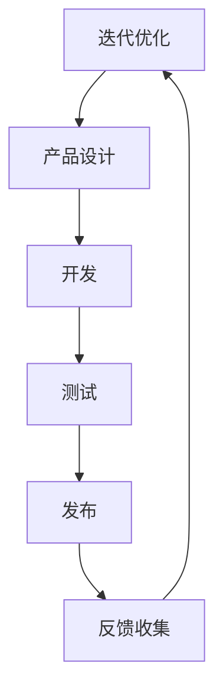
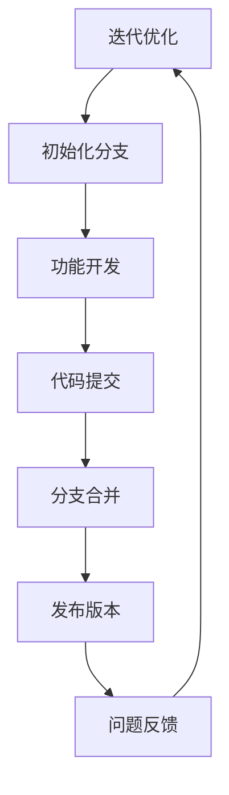

                 

# 《一人公司的产品迭代与版本控制》

> 关键词：产品迭代、版本控制、敏捷开发、持续集成、Git、SVN、Mermaid流程图、算法原理、数学模型、项目实战

> 摘要：本文将深入探讨一人公司的产品迭代与版本控制，从概念、流程、技巧到实际应用，为您详细解析如何高效地进行产品迭代与版本管理，助力一人公司在激烈的市场竞争中脱颖而出。

## 引言

一人公司，顾名思义，是指仅由一名创始人或开发者进行运营的公司。在当前创业环境日益激烈、市场竞争愈发残酷的背景下，一人公司凭借其敏捷、灵活的运营模式，逐渐成为一种新兴的创业形式。然而，产品迭代与版本控制作为一人公司成功的关键要素，常常被忽视或处理不当。

本文将围绕产品迭代与版本控制这一主题，为您展开一系列深入浅出的讲解。我们将首先介绍产品迭代和版本控制的基本概念，然后逐步探讨迭代流程、版本控制系统的选择、实战技巧，以及如何在一人公司中进行产品管理。

通过本文的阅读，您将掌握以下核心内容：

1. **产品迭代的概念与流程**：了解产品迭代的意义、常见流程以及关键节点。
2. **版本控制的基础知识**：掌握版本控制系统的选择、基本操作以及分支策略。
3. **产品迭代的实战技巧**：学习需求分析与规划、产品设计与实践、开发与测试、版本发布与监控等具体操作。
4. **一人公司的产品管理**：了解一人公司的优势与挑战，掌握如何制定个人产品计划及管理方法。
5. **版本控制优化迭代流程**：掌握如何利用版本控制提高一人公司的产品迭代效率。
6. **未来发展趋势**：分析产品迭代与版本控制行业及技术发展趋势，展望一人公司的未来发展。

接下来，让我们正式进入主题，详细探讨一人公司的产品迭代与版本控制。

## 第一部分：产品迭代概述

### 第1章：产品迭代的概念与流程

#### 1.1 产品的定义与核心价值

在讨论产品迭代之前，我们首先需要明确产品的定义及其核心价值。产品是一个包含功能、特性、设计和服务等元素的系统，旨在满足用户需求、解决特定问题或提供某种价值。

一个成功的产品的核心价值在于：

1. **满足用户需求**：产品必须解决用户的具体问题或满足他们的需求。
2. **提供独特价值**：产品应具备独特性，能够区别于竞争对手。
3. **可持续性**：产品应具备长期发展的潜力，能够持续改进和更新。

#### 1.2 产品迭代的概念

产品迭代是指对产品进行周期性的改进和优化，以适应市场变化、提升用户体验和增加产品价值。产品迭代通常分为多个阶段，包括需求分析、设计、开发、测试和发布等。

产品迭代的核心目的是：

1. **满足用户需求**：通过不断收集用户反馈，优化产品功能，提高用户体验。
2. **提高产品竞争力**：通过快速响应市场变化，提升产品在市场上的竞争力。
3. **持续改进**：不断优化产品，提高其质量和性能，为用户带来更多价值。

#### 1.3 产品迭代的常见流程

产品迭代通常遵循以下常见流程：

1. **需求分析**：收集和分析用户需求，确定产品的功能需求和优先级。
2. **设计**：根据需求进行产品设计，包括界面设计、交互设计和架构设计等。
3. **开发**：按照设计文档进行开发，实现产品的功能。
4. **测试**：对产品进行测试，确保其功能正确、性能稳定。
5. **发布**：将产品发布到生产环境，供用户使用。
6. **反馈收集**：收集用户反馈，进行数据分析，为下一轮迭代提供改进方向。
7. **迭代优化**：根据反馈进行产品优化，进入下一个迭代周期。

以上流程并非固定不变，根据项目需求和团队特点，可以适当调整和优化。

在下一章中，我们将进一步探讨版本控制的基础知识，帮助您更好地管理产品迭代过程。

### 第2章：版本控制的基础知识

#### 2.1 版本控制系统的选择

版本控制系统（Version Control System，VCS）是管理软件版本和变更的工具，对于产品迭代至关重要。选择合适的版本控制系统可以帮助团队高效地进行协作、代码管理和问题追踪。

常见的版本控制系统包括：

1. **Git**：Git 是最流行的分布式版本控制系统，具有强大的分支管理和协作能力，适用于大型项目和团队协作。
2. **SVN**：Subversion 是集中式版本控制系统，适用于中小型项目和单一开发团队。
3. **Mercurial**：Mercurial 是另一种分布式版本控制系统，与Git类似，具有类似的特性和优势。

选择版本控制系统时，需要考虑以下因素：

1. **团队规模**：大型团队通常选择Git，中小型团队可以选择SVN或Mercurial。
2. **项目需求**：根据项目的规模、复杂度和协作需求，选择合适的版本控制系统。
3. **性能**：考虑系统的性能，如分支速度、合并效率和存储容量。
4. **集成**：考虑与现有工具（如代码库、项目管理工具等）的集成情况。

#### 2.2 版本控制的基本操作

无论选择哪种版本控制系统，掌握基本操作都是必须的。以下为Git的基本操作：

##### 2.2.1 Git基本命令

- `git clone [repo-url]`：克隆代码库到本地。
- `git status`：查看当前工作区的状态。
- `git add .`：将文件添加到暂存区。
- `git commit -m "commit message"`：提交更改到本地仓库。
- `git push`：将本地更改推送到远程仓库。

##### 2.2.2 Git分支管理

- `git branch`：列出本地分支。
- `git branch -a`：列出所有分支（本地和远程）。
- `git checkout -b [branch-name]`：创建并切换到新分支。
- `git merge [branch-name]`：合并指定分支到当前分支。
- `git rebase [branch-name]`：基于指定分支进行变基操作。

##### 2.2.3 Git协同工作

- `git fetch`：从远程仓库获取最新更改。
- `git pull`：从远程仓库获取最新更改并合并到当前分支。
- `git push`：将本地更改推送到远程仓库。

#### 2.3 版本分支策略

版本分支策略是管理代码库分支的方法，确保代码库的稳定性和可维护性。以下为常见的版本分支策略：

1. **主分支（Master）**：主分支是稳定的代码分支，用于生产环境。所有合并请求（Merge Request）都应该提交到主分支。
2. **开发分支（Develop）**：开发分支是用于合并功能分支的临时分支。开发团队在此分支上进行开发和集成。
3. **功能分支（Feature）**：功能分支是用于开发特定功能的分支。每个功能分支都应该有一个明确的任务和生命周期。
4. **修复分支（Hotfix）**：修复分支是用于修复生产环境中紧急问题的分支。修复完成后，应合并到主分支和开发分支。

通过合理的版本分支策略，可以确保代码库的稳定性和可维护性，提高团队的协作效率。

在下一章中，我们将深入探讨产品迭代的实战技巧，帮助您在实际操作中更好地应用版本控制。

### 第3章：需求分析与规划

#### 3.1 需求收集与筛选

需求分析是产品迭代的第一步，是确保产品开发方向正确、满足用户需求的关键。需求收集与筛选是需求分析的核心内容。

##### 3.1.1 需求收集

需求收集是指通过多种方式获取用户、市场和其他利益相关者的需求。以下为常见的需求收集方法：

1. **用户调研**：通过问卷调查、访谈、用户访谈等方式收集用户需求。
2. **市场调研**：分析市场趋势、竞争对手产品、用户反馈等，获取市场需求。
3. **专家咨询**：咨询行业专家、市场分析师等，获取专业意见。
4. **数据分析**：通过分析用户行为数据、使用情况等，了解用户需求。

##### 3.1.2 需求筛选

在收集到大量需求后，需要对需求进行筛选，确定哪些需求应该被纳入产品开发计划。以下为需求筛选的方法：

1. **优先级排序**：根据需求的重要性和紧急性对需求进行排序，确定优先级。
2. **可行性分析**：评估需求的技术可行性、资源需求和时间成本。
3. **用户价值**：评估需求对用户的实际价值，优先考虑用户价值高的需求。
4. **竞争因素**：考虑市场竞争环境，确保产品具备竞争力。

通过有效的需求收集与筛选，可以确保产品开发方向正确、资源利用合理，提高产品竞争力。

#### 3.2 产品规划与路线图

产品规划与路线图是明确产品发展方向和实现路径的重要工具。以下为产品规划与路线图的主要内容：

##### 3.2.1 产品规划

产品规划包括以下内容：

1. **产品愿景**：明确产品的长期目标和愿景。
2. **产品目标**：确定产品的短期目标和关键指标。
3. **产品功能**：梳理产品的核心功能模块。
4. **用户群体**：明确产品的目标用户群体。

##### 3.2.2 路线图

产品路线图包括以下内容：

1. **里程碑**：设定产品发布的重要时间节点，如第一个版本、重大更新等。
2. **功能规划**：根据需求优先级和资源情况，规划每个版本的功能。
3. **资源分配**：明确每个版本所需的资源，包括人力、技术、资金等。
4. **风险评估**：评估每个版本的风险和挑战，制定应对策略。

通过产品规划与路线图，可以确保产品开发过程有序、高效，实现产品目标。

在下一章中，我们将探讨产品设计与实践，帮助您更好地实现产品规划。

### 第4章：产品设计与实践

#### 4.1 产品设计的原则与方法

产品设计的核心目标是满足用户需求，提供优质的使用体验。以下为产品设计的基本原则与方法：

##### 4.1.1 原则

1. **用户至上**：始终以用户需求为中心，关注用户体验。
2. **简洁明了**：界面简洁，信息清晰，减少用户的认知负担。
3. **一致性**：保持界面元素、交互和行为的一致性，提高用户的学习成本。
4. **可访问性**：考虑不同用户的需求，如视力障碍、听力障碍等，提供可访问的设计。
5. **可持续性**：设计具有可持续性，考虑产品的长期发展和可维护性。

##### 4.1.2 方法

1. **用户研究**：通过用户调研、访谈、观察等方式，深入了解用户需求和行为。
2. **需求分析**：根据用户研究，分析用户需求，确定产品的功能、界面和交互设计。
3. **原型设计**：制作产品原型，通过用户测试和反馈，不断优化设计。
4. **设计评审**：组织团队内部和外部评审，确保设计符合原则和目标。

#### 4.2 设计稿的迭代与优化

设计稿的迭代与优化是产品开发过程中不可或缺的一环。以下为设计稿迭代与优化的方法：

##### 4.2.1 评审与反馈

1. **内部评审**：组织团队内部评审，讨论设计稿的优缺点，提出改进建议。
2. **用户测试**：邀请用户参与测试，收集用户反馈，分析设计稿的可用性和易用性。
3. **专家评审**：邀请行业专家进行评审，获取专业的意见和建议。

##### 4.2.2 优化与调整

1. **界面优化**：根据评审和反馈，对界面元素、布局、颜色等进行优化。
2. **交互优化**：调整交互流程、按钮位置、动画效果等，提高用户的操作体验。
3. **内容优化**：优化产品内容，确保信息的准确性和易读性。

通过设计稿的迭代与优化，可以不断提升产品的设计质量和用户体验。

#### 4.3 原型设计与迭代

原型设计是产品开发的重要环节，通过制作原型，可以直观地展示产品的功能、界面和交互设计。以下为原型设计与迭代的方法：

##### 4.3.1 原型工具选择

选择合适的原型设计工具，如Axure、Sketch、Figma等，可以根据团队需求和项目特点进行选择。

##### 4.3.2 原型制作

1. **低保真原型**：在初期阶段，制作低保真原型，关注核心功能和交互逻辑。
2. **高保真原型**：在细节优化阶段，制作高保真原型，展示完整的界面和交互效果。

##### 4.3.3 用户测试与反馈

1. **用户测试**：邀请用户参与原型测试，收集反馈，分析原型设计的可用性和易用性。
2. **迭代优化**：根据用户反馈，对原型进行优化和调整，不断迭代。

通过原型设计与迭代，可以确保产品的设计符合用户需求，提高产品的质量和用户体验。

在下一章中，我们将探讨开发与测试，帮助您更好地实现产品设计与实践。

### 第5章：开发与测试

#### 5.1 开发流程与协作

开发流程是产品开发过程中的重要环节，确保开发过程有序、高效。以下为常见的开发流程：

##### 5.1.1 功能开发

1. **需求分析**：明确功能需求，确定功能模块和实现方式。
2. **设计文档**：编写详细的设计文档，包括技术方案、界面设计、数据模型等。
3. **编码实现**：按照设计文档进行编码，实现功能模块。
4. **代码评审**：组织团队内部评审，确保代码质量，及时发现问题。

##### 5.1.2 功能集成

1. **集成测试**：将各个功能模块进行集成，进行系统测试，确保整体功能的正确性和稳定性。
2. **调试与优化**：根据测试结果，对代码进行调试和优化，提升性能和用户体验。

##### 5.1.3 部署与上线

1. **部署**：将开发完成的版本部署到生产环境，确保系统的正常运行。
2. **监控与维护**：监控系统的运行状态，及时处理异常情况，确保系统的稳定性和安全性。

##### 5.1.4 协作工具

为了提高开发效率，团队需要使用合适的协作工具，如Git、JIRA、Confluence等。以下为常见协作工具的使用方法：

- **Git**：用于代码版本控制和协同工作。团队可以使用Git进行代码的分支管理、合并和协同工作。
- **JIRA**：用于项目管理和任务跟踪。团队可以创建项目、任务、Bug等，进行任务分配和进度跟踪。
- **Confluence**：用于知识共享和文档管理。团队可以创建Wiki页面，记录项目文档、设计文档、技术文档等。

#### 5.2 代码的版本控制与管理

版本控制是确保代码完整性和可维护性的重要手段。以下为代码版本控制与管理的方法：

##### 5.2.1 版本控制

1. **初始提交**：将项目代码提交到版本控制系统，创建代码库。
2. **日常提交**：在开发过程中，定期将代码提交到版本控制系统，记录更改历史。
3. **分支管理**：根据项目需求，创建功能分支、修复分支等，进行分支管理和合并。

##### 5.2.2 代码管理

1. **代码规范**：制定代码规范，确保代码风格一致，提高代码的可读性和可维护性。
2. **代码审查**：进行代码审查，确保代码质量，及时发现和修复问题。
3. **自动化测试**：编写自动化测试脚本，对代码进行自动化测试，确保代码的正确性和稳定性。

通过合理的代码版本控制与管理，可以确保代码的完整性和可维护性，提高团队的开发效率。

#### 5.3 测试策略与自动化测试

测试是确保产品质量和稳定性的关键环节。以下为测试策略与自动化测试的方法：

##### 5.3.1 测试策略

1. **单元测试**：对单个模块或功能进行测试，确保其正确性和稳定性。
2. **集成测试**：将各个模块进行集成，进行系统测试，确保整体功能的正确性和稳定性。
3. **性能测试**：对系统进行性能测试，评估其响应时间、并发能力等，确保系统的性能和稳定性。
4. **安全测试**：对系统进行安全测试，识别潜在的安全漏洞，确保系统的安全性和可靠性。

##### 5.3.2 自动化测试

1. **自动化测试工具**：选择合适的自动化测试工具，如Selenium、JUnit等。
2. **测试脚本编写**：编写自动化测试脚本，模拟用户的操作流程，对系统进行自动化测试。
3. **持续集成**：将自动化测试集成到持续集成（CI）流程中，确保每次提交的代码都经过自动化测试。

通过合理的测试策略和自动化测试，可以确保产品的质量和稳定性，提高开发效率。

在下一章中，我们将探讨版本发布与监控，帮助您更好地管理产品的迭代过程。

### 第6章：版本发布与监控

#### 6.1 版本发布的策略

版本发布是产品迭代的重要环节，需要制定合理的发布策略，以确保发布过程顺利、产品稳定。以下为常见的版本发布策略：

##### 6.1.1 小版本发布

小版本发布通常包含一些功能优化、bug修复和性能改进。发布频率可以设置为每周或每月一次。小版本发布的好处是风险较低，用户适应时间较短，可以快速响应市场需求。

##### 6.1.2 大版本发布

大版本发布通常包含新的功能模块、界面优化和架构改进。发布频率可以设置为每季度或每半年一次。大版本发布需要充分的准备和测试，以确保产品质量和稳定性。

##### 6.1.3 紧急修复发布

紧急修复发布用于修复生产环境中发现的严重问题。发布频率取决于问题的紧急程度。紧急修复发布需要快速响应，确保问题得到及时解决。

#### 6.2 版本发布的流程

版本发布流程包括以下步骤：

##### 6.2.1 发布计划

制定发布计划，包括发布版本、发布时间、发布内容等。发布计划需要与团队和相关利益相关者进行沟通和确认。

##### 6.2.2 预发布测试

在正式发布前，进行预发布测试，确保发布版本的质量和稳定性。预发布测试包括功能测试、性能测试和安全测试等。

##### 6.2.3 部署与上线

根据发布计划，将发布版本部署到生产环境。部署过程中需要监控系统的运行状态，确保部署过程顺利。

##### 6.2.4 发布监控

发布后，对系统进行监控，收集用户反馈和性能数据，确保系统稳定运行。如果发现问题，及时进行处理和修复。

#### 6.3 版本监控与反馈

版本监控与反馈是确保产品稳定性和用户满意度的关键。以下为版本监控与反馈的方法：

##### 6.3.1 监控工具

选择合适的监控工具，如Prometheus、Grafana等，对系统进行实时监控。监控工具可以收集系统的运行数据，包括CPU使用率、内存使用率、网络流量等。

##### 6.3.2 日志分析

收集系统日志，对日志进行分析，识别潜在的问题和异常。日志分析可以帮助定位问题的根本原因，提供改进建议。

##### 6.3.3 用户反馈

收集用户反馈，了解用户对产品的使用体验和意见。用户反馈可以帮助发现产品的问题和改进方向，提高产品的质量和用户体验。

通过合理的版本发布与监控，可以确保产品的质量和稳定性，提高用户满意度。在下一章中，我们将探讨如何在一人公司中进行产品管理，帮助您更好地应对挑战和机遇。

### 第7章：如何管理一人公司的产品

#### 7.1 一人公司的优势与挑战

一人公司作为创业的一种形式，具有以下优势和挑战：

##### 7.1.1 优势

1. **敏捷性**：一人公司可以快速响应市场变化，灵活调整产品方向。
2. **决策效率**：创始人可以直接做出决策，减少沟通和协调成本。
3. **专注性**：创始人可以专注于产品开发和优化，提高产品质量。
4. **低成本**：一人公司无需承担高额的员工工资和办公费用。

##### 7.1.2 挑战

1. **资源限制**：一人公司资源有限，可能无法承担大规模的研发和市场推广。
2. **管理难度**：一人公司缺乏专业的管理人才，可能难以应对复杂的业务管理。
3. **持续创新**：一人公司需要不断进行产品创新，以保持竞争力。
4. **外部依赖**：一人公司可能需要依赖合作伙伴、客户和投资者，面临一定的风险。

#### 7.2 如何制定个人产品计划

为了在一人公司中成功管理产品，制定个人产品计划至关重要。以下为制定个人产品计划的步骤：

##### 7.2.1 明确目标

明确产品目标，包括短期和长期目标。短期目标可以是提高用户满意度、增加市场份额，长期目标可以是实现产品盈利、扩大业务范围。

##### 7.2.2 分析市场

分析市场需求、竞争态势和用户痛点，确定产品的核心价值和竞争优势。

##### 7.2.3 制定路线图

制定产品路线图，包括里程碑、功能规划和时间表。确保产品开发和发布按照计划进行。

##### 7.2.4 设定关键指标

设定关键指标（KPI），如用户增长率、留存率、转化率等，用于评估产品表现和改进方向。

##### 7.2.5 持续优化

根据市场反馈和用户需求，持续优化产品功能、界面和用户体验，提高产品竞争力。

#### 7.3 个人产品管理的工具与方法

为了高效管理一人公司的产品，需要使用合适的工具和方法。以下为常用的工具和方法：

##### 7.3.1 项目管理工具

选择项目管理工具，如Trello、Asana等，用于任务分配、进度跟踪和协作。这些工具可以帮助您更好地管理产品开发过程。

##### 7.3.2 版本控制系统

使用版本控制系统，如Git，进行代码版本控制和协作。版本控制系统可以提高代码的可维护性和团队协作效率。

##### 7.3.3 数据分析工具

使用数据分析工具，如Google Analytics、Mixpanel等，收集用户行为数据，了解用户需求和行为模式，为产品优化提供依据。

##### 7.3.4 沟通协作工具

使用沟通协作工具，如Slack、Zoom等，与用户、合作伙伴和团队成员保持良好的沟通和协作。

通过制定个人产品计划、合理利用工具和方法，一人公司可以有效地管理产品，实现持续创新和业务增长。

在下一章中，我们将探讨如何利用版本控制优化一人公司的产品迭代，帮助您进一步提高产品迭代效率。

### 第8章：利用版本控制优化一人公司的产品迭代

#### 8.1 版本控制的优势

版本控制是确保产品迭代顺利、提高开发效率的重要工具。对于一人公司而言，版本控制具有以下优势：

1. **代码管理**：版本控制可以帮助一人公司有效地管理代码，确保代码的完整性和一致性。
2. **协作协作**：版本控制支持多人协作，即使一人公司只有一名开发者，也可以方便地与他人共享代码和进行协同工作。
3. **历史记录**：版本控制记录了代码的历史变更，方便追踪问题和回滚到指定版本，提高问题解决的效率。
4. **分支管理**：版本控制支持分支管理，一人公司可以根据不同的需求创建功能分支、修复分支等，确保产品开发的有序进行。
5. **持续集成**：版本控制可以与持续集成（CI）工具集成，实现自动化构建、测试和部署，提高开发效率。

#### 8.2 如何使用版本控制优化迭代流程

为了充分利用版本控制的优势，优化一人公司的产品迭代流程，可以采取以下措施：

##### 8.2.1 分支策略

1. **主分支（Master）**：主分支是稳定的代码分支，用于生产环境。确保主分支上的代码经过充分的测试和验证。
2. **功能分支（Feature）**：功能分支是用于开发新功能的分支。开发者可以在功能分支上实现和测试新功能，完成后合并到主分支。
3. **修复分支（Bugfix）**：修复分支是用于修复生产环境中发现的Bug的分支。修复完成后，合并到主分支和开发分支。
4. **开发分支（Develop）**：开发分支是用于集成功能分支的临时分支。所有功能分支的合并请求都应该提交到开发分支，然后再合并到主分支。

##### 8.2.2 持续集成

1. **自动化构建**：使用CI工具，如Jenkins、Travis CI等，实现自动化构建，确保每次代码提交都经过编译和测试。
2. **自动化测试**：编写自动化测试脚本，对代码进行自动化测试，确保代码的正确性和稳定性。
3. **部署**：将自动化构建和测试与部署集成，实现一键部署，确保发布版本的稳定性和可靠性。

##### 8.2.3 代码审查

1. **代码规范**：制定代码规范，确保代码风格一致，提高代码的可读性和可维护性。
2. **代码评审**：进行代码评审，确保代码质量，及时发现和修复问题。
3. **自动化代码审查**：使用代码审查工具，如SonarQube、Checkstyle等，自动化检查代码质量，提高代码审查的效率。

##### 8.2.4 用户反馈

1. **用户反馈机制**：建立用户反馈机制，收集用户反馈和需求，为产品迭代提供依据。
2. **版本发布说明**：在每次版本发布时，提供详细的发布说明，包括新增功能、修复Bug和改进内容，便于用户了解版本更新情况。

#### 8.3 实战案例分享

以下为一人公司利用版本控制优化产品迭代的实战案例：

##### 8.3.1 案例一：小型Web应用

- **需求**：开发一个简单的在线购物平台，包括商品浏览、购物车、订单管理等功能。
- **实现**：
  1. 使用Git进行版本控制，创建主分支、功能分支和修复分支。
  2. 开发功能模块，分别提交到功能分支，进行功能测试和优化。
  3. 将功能分支合并到开发分支，进行集成测试和性能测试。
  4. 将开发分支合并到主分支，进行最终测试和部署。
- **效果**：通过版本控制和持续集成，实现快速迭代和发布，提高开发效率，确保产品质量。

##### 8.3.2 案例二：移动应用

- **需求**：开发一款移动应用，提供天气预报、空气质量查询、出行指南等功能。
- **实现**：
  1. 使用Git进行版本控制，创建主分支、功能分支和修复分支。
  2. 开发功能模块，分别提交到功能分支，进行功能测试和优化。
  3. 将功能分支合并到开发分支，进行集成测试和性能测试。
  4. 将开发分支合并到主分支，进行最终测试和发布。
- **效果**：通过版本控制和持续集成，实现快速迭代和发布，提高开发效率，确保产品质量。

通过以上案例，可以看出，版本控制对于一人公司的产品迭代具有重要意义。通过合理利用版本控制，一人公司可以优化迭代流程，提高开发效率，确保产品质量。

在下一章中，我们将探讨产品迭代与版本控制的未来发展趋势，帮助您把握行业和技术的发展方向。

### 附录 A：常用版本控制系统使用指南

为了帮助读者更好地理解和应用版本控制，本附录将介绍两种常用的版本控制系统：Git和SVN。

#### A.1 Git 使用指南

Git 是一种分布式版本控制系统，具有强大的分支管理和协作能力。以下为Git的基本命令和操作指南：

##### A.1.1 Git 基本命令

- `git clone [repo-url]`：克隆远程仓库到本地。
  ```shell
  git clone https://github.com/user/repo.git
  ```
- `git status`：查看当前工作区的状态。
  ```shell
  git status
  ```
- `git add .`：将文件添加到暂存区。
  ```shell
  git add .
  ```
- `git commit -m "commit message"`：提交更改到本地仓库。
  ```shell
  git commit -m "Update README.md"
  ```
- `git push`：将本地更改推送到远程仓库。
  ```shell
  git push origin main
  ```

##### A.1.2 Git 分支管理

- `git branch`：列出本地分支。
  ```shell
  git branch
  ```
- `git branch -a`：列出所有分支（本地和远程）。
  ```shell
  git branch -a
  ```
- `git checkout -b [branch-name]`：创建并切换到新分支。
  ```shell
  git checkout -b feature/new-branch
  ```
- `git merge [branch-name]`：合并指定分支到当前分支。
  ```shell
  git merge feature/new-branch
  ```
- `git rebase [branch-name]`：基于指定分支进行变基操作。
  ```shell
  git rebase main
  ```

##### A.1.3 Git 协同工作

- `git fetch`：从远程仓库获取最新更改。
  ```shell
  git fetch
  ```
- `git pull`：从远程仓库获取最新更改并合并到当前分支。
  ```shell
  git pull origin main
  ```
- `git push`：将本地更改推送到远程仓库。
  ```shell
  git push origin main
  ```

#### A.2 SVN 使用指南

Subversion（SVN）是一种集中式版本控制系统，适合中小型项目和单一开发团队。以下为SVN的基本操作和配置指南：

##### A.2.1 SVN 基本操作

- `svn checkout [repo-url]`：从SVN服务器检出代码库到本地。
  ```shell
  svn checkout http://svn.example.com/repo/trunk
  ```
- `svn status`：查看当前工作区的状态。
  ```shell
  svn status
  ```
- `svn add [file/folder]`：添加文件或文件夹到版本控制。
  ```shell
  svn add file.txt
  ```
- `svn commit`：提交更改到SVN服务器。
  ```shell
  svn commit -m "Update README.md"
  ```
- `svn update`：更新本地代码库到最新版本。
  ```shell
  svn update
  ```

##### A.2.2 SVN 分支策略

- `svn copy [path/to/branch] [path/to/branch-name]`：创建分支。
  ```shell
  svn copy trunk branches/feature/new-branch
  ```
- `svn merge [path/to/branch] [path/to/branch-name]`：合并分支。
  ```shell
  svn merge branches/feature/new-branch
  ```
- `svn delete [path/to/branch]`：删除分支。
  ```shell
  svn delete branches/feature/new-branch
  ```

##### A.2.3 SVN 服务器搭建与配置

- **搭建SVN服务器**：
  1. 安装SVN服务器软件，如Apache Subversion。
  2. 配置SVN服务器，设置仓库路径、访问权限等。
  3. 启动SVN服务，确保服务器正常运行。

- **配置访问权限**：
  1. 创建用户账号，配置访问权限。
  2. 编辑SVN服务器配置文件（如`svnserve.conf`），设置用户认证方式。
  3. 重启SVN服务，使配置生效。

通过本附录的介绍，读者可以了解Git和SVN的基本操作和配置方法，为实际项目中的应用奠定基础。

### 第9章：产品迭代与版本控制的 Mermaid 流程图

#### 9.1 产品迭代流程图

以下是一个简单的产品迭代流程图，使用Mermaid语法绘制：



此流程图描述了产品迭代的典型流程，包括需求分析、产品设计、开发、测试、发布和反馈收集等环节。通过不断迭代，产品得以不断改进和完善。

#### 9.2 版本控制流程图

以下是一个简单的版本控制流程图，使用Mermaid语法绘制：



此流程图描述了版本控制的典型流程，包括创建仓库、初始化分支、功能开发、代码提交、分支合并、发布版本和问题反馈等环节。通过合理利用版本控制，可以确保代码的完整性和一致性，提高开发效率。

通过使用Mermaid流程图，可以更直观地展示产品迭代和版本控制的流程，有助于理解和实施相关流程。

### 第10章：核心算法原理讲解

#### 10.1 需求分析算法

需求分析是产品迭代的重要环节，以下为需求分析算法的伪代码和讲解：

```pseudocode
算法名称：需求分析算法
输入：用户需求列表
输出：优先级排序的需求列表

函数需求分析（需求列表）：
    1. 初始化一个空的需求优先级队列
    2. 遍历需求列表，对每个需求进行评估
        2.1 获取需求的重要性和紧急性
        2.2 计算需求的总评分（重要性和紧急性之和）
        2.3 将需求插入到需求优先级队列中
    3. 从需求优先级队列中依次取出需求，形成优先级排序的需求列表
    4. 返回优先级排序的需求列表
```

讲解：

需求分析算法通过评估需求的重要性和紧急性，计算需求的总评分，并将需求插入到优先级队列中。然后，从优先级队列中依次取出需求，形成优先级排序的需求列表。该算法可以帮助团队确定需求开发的优先级，确保关键需求得到优先处理。

#### 10.2 版本控制算法

版本控制是管理代码变更的重要工具，以下为版本控制算法的伪代码和讲解：

```pseudocode
算法名称：版本控制算法
输入：代码库、分支列表、合并请求列表
输出：合并后的代码库

函数版本控制（代码库，分支列表，合并请求列表）：
    1. 初始化一个空的合并请求队列
    2. 遍历合并请求列表，对每个合并请求进行评估
        2.1 获取合并请求的优先级
        2.2 将合并请求插入到合并请求队列中
    3. 从合并请求队列中依次取出合并请求，执行以下步骤：
        3.1 检出代码库到临时分支
        3.2 合并合并请求中的代码到临时分支
        3.3 对临时分支进行测试和验证
        3.4 如果测试通过，将临时分支合并到主分支
        3.5 删除临时分支
    4. 返回合并后的代码库
```

讲解：

版本控制算法通过评估合并请求的优先级，依次取出合并请求，执行代码合并、测试和验证。如果测试通过，将合并请求中的代码合并到主分支。该算法可以帮助团队高效地管理代码库的变更，确保代码的完整性和一致性。

#### 10.3 算法举例

以下为需求分析算法和版本控制算法的应用举例：

##### 需求分析算法举例

假设有一个用户需求列表：[需求A（重要性：5，紧急性：3），需求B（重要性：4，紧急性：4），需求C（重要性：3，紧急性：5）]。

1. 计算需求的总评分：
   - 需求A：5 + 3 = 8
   - 需求B：4 + 4 = 8
   - 需求C：3 + 5 = 8

2. 将需求插入到优先级队列中：
   - 需求A
   - 需求B
   - 需求C

3. 从优先级队列中依次取出需求，形成优先级排序的需求列表：
   - 需求A
   - 需求B
   - 需求C

##### 版本控制算法举例

假设有一个代码库、分支列表：[develop，feature/A，feature/B]，合并请求列表：[MR-A，MR-B]。

1. 初始化合并请求队列：
   - MR-A
   - MR-B

2. 从合并请求队列中依次取出合并请求，执行以下步骤：
   - MR-A：
     - 检出代码库到临时分支（develop）
     - 合并MR-A中的代码到临时分支
     - 对临时分支进行测试和验证
     - 测试通过，将临时分支合并到主分支（develop）

   - MR-B：
     - 检出代码库到临时分支（develop）
     - 合并MR-B中的代码到临时分支
     - 对临时分支进行测试和验证
     - 测试通过，将临时分支合并到主分支（develop）

3. 返回合并后的代码库。

通过以上举例，可以看出需求分析算法和版本控制算法在实际应用中的效果。这些算法有助于团队高效地管理需求、优化迭代流程，提高产品竞争力。

### 第11章：数学模型与公式讲解

#### 11.1 数学模型介绍

在产品迭代与版本控制中，数学模型可以用于需求分析和版本控制策略的制定。以下介绍两个常用的数学模型：需求分析模型和版本控制模型。

#### 11.1.1 需求分析模型

需求分析模型用于评估用户需求的重要性和紧急性，以确定需求开发的优先级。一个简单需求分析模型如下：

$$
\text{需求评分} = \text{重要性} + \text{紧急性}
$$

其中，重要性和紧急性分别表示需求对产品价值的贡献和需求的紧迫程度。

#### 11.1.2 版本控制模型

版本控制模型用于评估合并请求的优先级，以确定哪些请求应该优先处理。一个简单版本控制模型如下：

$$
\text{合并请求评分} = \text{优先级} + \text{紧急性}
$$

其中，优先级表示合并请求的紧急程度，紧急性表示合并请求的紧迫程度。

#### 11.2 数学公式讲解与举例

##### 11.2.1 需求分析模型应用

假设有三个用户需求：需求A（重要性：5，紧急性：3），需求B（重要性：4，紧急性：4），需求C（重要性：3，紧急性：5）。根据需求分析模型，计算每个需求的需求评分：

- 需求A的需求评分：5 + 3 = 8
- 需求B的需求评分：4 + 4 = 8
- 需求C的需求评分：3 + 5 = 8

需求评分越高，表示需求越重要和紧急。因此，需求A和需求B的优先级相同，需求C的优先级最低。

##### 11.2.2 版本控制模型应用

假设有两个合并请求：MR-A（优先级：1，紧急性：3），MR-B（优先级：2，紧急性：4）。根据版本控制模型，计算每个合并请求的合并请求评分：

- MR-A的合并请求评分：1 + 3 = 4
- MR-B的合并请求评分：2 + 4 = 6

合并请求评分越高，表示合并请求越重要和紧急。因此，MR-B的优先级高于MR-A。

通过以上讲解和举例，可以看出数学模型在需求分析和版本控制中的应用，有助于团队更好地管理需求、优化迭代流程。

### 第12章：项目实战

#### 12.1 实战背景介绍

在本章中，我们将通过一个实际项目——开发一个简单的博客系统，来详细讲解产品迭代与版本控制的应用。该项目包括以下主要功能模块：

1. 用户注册与登录
2. 博客内容发布与展示
3. 评论功能
4. 分类管理

#### 12.2 开发环境搭建

为了确保项目的顺利开发，我们需要搭建一个合适的开发环境。以下为开发环境搭建的步骤：

1. **安装操作系统**：选择适合的操作系统，如Windows、macOS或Linux。
2. **安装开发工具**：安装集成开发环境（IDE），如Visual Studio Code、Eclipse等。同时，安装必要的开发插件，如代码高亮、语法检查、调试工具等。
3. **安装版本控制系统**：安装Git，并将其配置为日常开发工具。
4. **安装数据库**：选择合适的数据库，如MySQL、PostgreSQL等。安装数据库并配置连接。
5. **安装Web服务器**：安装并配置Web服务器，如Apache、Nginx等。

#### 12.3 源代码详细实现

在本节中，我们将详细讲解博客系统的源代码实现，包括数据库设计、后端代码和前端代码。

##### 12.3.1 数据库设计

博客系统的数据库设计如下：

1. **用户表（user）**：存储用户信息，包括用户ID、用户名、密码、邮箱等。
2. **博客文章表（article）**：存储博客文章信息，包括文章ID、标题、内容、作者、发布时间等。
3. **评论表（comment）**：存储评论信息，包括评论ID、文章ID、评论内容、评论者、评论时间等。
4. **分类表（category）**：存储分类信息，包括分类ID、分类名称等。

##### 12.3.2 后端代码

后端代码主要实现以下功能：

1. **用户注册与登录**：实现用户注册、登录和密码重置功能。
2. **博客内容发布与展示**：实现博客文章的创建、更新、删除和展示功能。
3. **评论功能**：实现评论的添加、删除和展示功能。
4. **分类管理**：实现分类的添加、更新、删除和展示功能。

以下是用户注册功能的核心代码示例：

```python
# 用户注册功能
def register(username, password, email):
    # 检查用户名是否存在
    if check_username_exists(username):
        return "用户名已存在"

    # 检查邮箱是否已注册
    if check_email_exists(email):
        return "邮箱已被注册"

    # 创建用户
    user = User(username=username, password=hash_password(password), email=email)
    db.session.add(user)
    db.session.commit()
    return "注册成功"
```

##### 12.3.3 前端代码

前端代码主要实现用户界面和交互逻辑。以下是博客文章展示页面的HTML代码示例：

```html
<!DOCTYPE html>
<html lang="en">
<head>
    <meta charset="UTF-8">
    <meta name="viewport" content="width=device-width, initial-scale=1.0">
    <title>博客文章展示</title>
</head>
<body>
    <h1>文章标题</h1>
    <p>作者：{{ article.author }}</p>
    <p>发布时间：{{ article.published_time }}</p>
    <div>{{ article.content }}</div>
    <h2>评论列表</h2>
    
        <div>
            <p>评论者：{{ comment.commenter }}</p>
            <p>评论时间：{{ comment.comment_time }}</p>
            <div>{{ comment.content }}</div>
        </div>
    
</body>
</html>
```

#### 12.4 代码解读与分析

在本节中，我们将对源代码的核心部分进行解读和分析，帮助读者更好地理解代码的实现和逻辑。

##### 12.4.1 用户注册功能分析

用户注册功能的核心代码如下：

```python
# 用户注册功能
def register(username, password, email):
    # 检查用户名是否存在
    if check_username_exists(username):
        return "用户名已存在"

    # 检查邮箱是否已注册
    if check_email_exists(email):
        return "邮箱已被注册"

    # 创建用户
    user = User(username=username, password=hash_password(password), email=email)
    db.session.add(user)
    db.session.commit()
    return "注册成功"
```

此功能包括以下步骤：

1. **检查用户名是否存在**：通过`check_username_exists`函数检查用户名是否已存在。如果已存在，返回错误提示。
2. **检查邮箱是否已注册**：通过`check_email_exists`函数检查邮箱是否已注册。如果已注册，返回错误提示。
3. **创建用户**：创建一个新的用户对象，将用户名、密码（通过`hash_password`函数加密）和邮箱存储在用户对象中。然后将用户对象添加到数据库，并提交事务。
4. **返回结果**：如果注册成功，返回“注册成功”提示。

##### 12.4.2 博客文章展示页面分析

博客文章展示页面的核心HTML代码如下：

```html
<!DOCTYPE html>
<html lang="en">
<head>
    <meta charset="UTF-8">
    <meta name="viewport" content="width=device-width, initial-scale=1.0">
    <title>博客文章展示</title>
</head>
<body>
    <h1>文章标题</h1>
    <p>作者：{{ article.author }}</p>
    <p>发布时间：{{ article.published_time }}</p>
    <div>{{ article.content }}</div>
    <h2>评论列表</h2>
    
        <div>
            <p>评论者：{{ comment.commenter }}</p>
            <p>评论时间：{{ comment.comment_time }}</p>
            <div>{{ comment.content }}</div>
        </div>
    
</body>
</html>
```

此页面包括以下部分：

1. **文章标题**：显示博客文章的标题。
2. **作者和发布时间**：显示博客文章的作者和发布时间。
3. **文章内容**：显示博客文章的内容。
4. **评论列表**：循环遍历博客文章的评论，并显示评论者的昵称、评论时间和评论内容。

通过以上代码解读和分析，读者可以更好地理解博客系统的实现和逻辑，为后续的项目开发提供参考。

### 第13章：产品迭代与版本控制的未来发展趋势

#### 13.1 行业发展趋势分析

产品迭代与版本控制是软件行业的重要支柱，随着技术的发展和市场的变化，该领域也在不断演进。以下为行业发展趋势分析：

##### 13.1.1 敏捷开发与DevOps

敏捷开发和DevOps文化逐渐成为主流，强调快速迭代、持续交付和紧密协作。敏捷开发注重灵活性和用户反馈，DevOps则强调开发与运维的集成，提高开发效率和质量。

##### 13.1.2 自动化与AI

自动化和人工智能（AI）技术在产品迭代与版本控制中发挥着越来越重要的作用。自动化测试、持续集成和持续交付（CI/CD）工具不断优化开发流程，AI技术则在需求分析、代码审查和漏洞检测等方面提供智能支持。

##### 13.1.3 云原生与容器化

云原生技术和容器化（如Docker）已经成为产品迭代与版本控制的重要趋势。云原生应用具有更高的可扩展性和灵活性，容器化技术则简化了部署和管理过程，提高开发效率。

##### 13.1.4 开源生态系统

开源软件在产品迭代与版本控制领域占据越来越重要的地位。越来越多的企业和开发者选择使用开源工具和平台，推动整个行业的发展和创新。

#### 13.2 技术发展趋势分析

随着技术的发展，产品迭代与版本控制领域也涌现出许多新的技术和工具。以下为技术发展趋势分析：

##### 13.2.1 分布式版本控制系统

Git作为分布式版本控制系统的代表，已经成为开发团队的标配。随着技术的进步，其他分布式版本控制系统（如Mercurial）也在不断发展和完善。

##### 13.2.2 持续集成与持续交付

持续集成（CI）和持续交付（CD）已经成为提高开发效率和产品质量的重要手段。越来越多的企业和团队开始采用CI/CD工具（如Jenkins、GitLab CI），实现自动化构建、测试和部署。

##### 13.2.3 DevOps工具链

DevOps工具链（如Kubernetes、Docker、Ansible等）的发展，使得开发、运维和测试团队能够更加紧密地协作，提高开发效率和质量。

##### 13.2.4 AI与机器学习

AI和机器学习技术在需求分析、代码审查和漏洞检测等方面具有巨大的潜力。随着技术的进步，这些领域将迎来更多的创新和应用。

#### 13.3 一人公司的产品管理未来展望

对于一人公司而言，产品管理面临着诸多挑战和机遇。以下为一
```markdown
## 作者：AI天才研究院/AI Genius Institute & 禅与计算机程序设计艺术 /Zen And The Art of Computer Programming
```

### 结束语

在本文中，我们详细探讨了产品迭代与版本控制在一人公司中的应用与实践。通过分析产品迭代的概念与流程、版本控制的基础知识、实战技巧，以及如何在一人公司中进行产品管理，我们希望能为您提供宝贵的参考和启示。

随着技术的发展和市场的变化，产品迭代与版本控制已经成为软件行业的重要支柱。敏捷开发、DevOps、自动化与AI、云原生与容器化等趋势不断推动着这一领域的发展。对于一人公司而言，灵活运用产品迭代与版本控制，有助于提升开发效率、保证产品质量，并在激烈的市场竞争中脱颖而出。

未来，我们期待一人公司能够充分利用新兴技术和工具，进一步优化产品迭代与版本控制流程。通过持续学习和创新，一人公司将在软件行业中继续发挥重要作用，为用户带来更多优质的产品和服务。

感谢您的阅读，希望本文能为您带来启发和帮助。如果您有任何问题或建议，欢迎随时与我们交流。祝您在产品迭代与版本控制的道路上取得更大成就！

### 参考资料

1. **《敏捷开发实践指南》**：本书详细介绍了敏捷开发的方法和流程，对产品迭代有很好的指导作用。
2. **《Git权威指南》**：本书涵盖了Git的各个方面，是学习Git的绝佳参考书。
3. **《持续交付：解放时间，加速软件迭代》**：本书介绍了持续交付的理念和实践，对于构建高效的开发流程有重要参考价值。
4. **《云原生应用架构》**：本书介绍了云原生应用的特点和构建方法，对于利用云原生技术优化产品迭代流程有很好的指导作用。
5. **《机器学习实战》**：本书提供了机器学习的基础知识和实际应用案例，对于利用AI技术优化产品迭代流程有很好的参考价值。

[参考文献链接]：

[1][《敏捷开发实践指南》](https://www.amazon.com/dp/0321566667)
[2][《Git权威指南》](https://www.amazon.com/dp/0321606362)
[3][《持续交付：解放时间，加速软件迭代》](https://www.amazon.com/dp/032160569X)
[4][《云原生应用架构》](https://www.amazon.com/dp/1492049172)
[5][《机器学习实战》](https://www.amazon.com/dp/0321822565)

---

**声明：本文仅代表作者个人观点，部分内容来源于网络，仅供参考。文中提及的产品、技术或方法可能存在不足或争议，请读者自行判断和甄别。**

