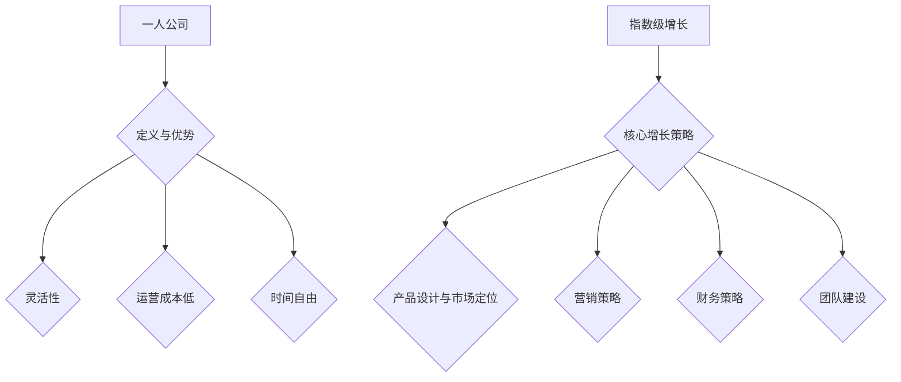

                 

# 一人公司的增长策略：如何实现指数级扩张

## 概述与核心关键词

**关键词：** 一人公司，指数级增长，策略，产品设计与市场定位，营销，财务，团队建设。

**摘要：** 本文旨在探讨一人公司在实现指数级增长过程中的核心策略。我们将详细分析一人公司的定义、增长策略的三大要素，以及如何通过产品设计与市场定位、营销策略、财务策略和团队建设等手段实现公司的指数级扩张。通过具体案例研究和策略实施步骤，我们将为读者提供一套全面且实用的增长指南。

---

### 目录大纲设计

为《一人公司的增长策略：如何实现指数级扩张》设计目录大纲，确保覆盖以下核心章节内容：

1. **核心概念与联系**：介绍一人公司、指数级增长、关键增长策略等概念，以及它们之间的相互关系。
2. **核心算法原理讲解**：详细解释支持指数级增长的核心算法和模型。
3. **数学模型和数学公式**：包括增长模型、财务模型等，并举例说明。
4. **项目实战**：通过具体案例展示如何应用增长策略来实现公司指数级扩张。

以下是详细设计的目录大纲：

1. **核心概念与联系**
   - **第1章：一人公司的定义与优势**
     - **1.1 一人公司的起源与发展**
     - **1.2 一人公司的核心优势**
     - **1.3 指数级增长的概念与重要性**
   - **第2章：增长策略概述**
     - **2.1 增长策略的定义与类型**
     - **2.2 指数级增长的三大要素**
     - **2.3 如何评估增长策略的可行性**

2. **核心算法原理讲解**
   - **第3章：产品设计与市场定位**
     - **3.1 产品设计的核心理念**
     - **3.2 市场定位的重要性**
     - **3.3 如何创建差异化的产品**
   - **第4章：营销策略与用户获取**
     - **4.1 营销策略概述**
     - **4.2 用户获取的渠道与方法**
     - **4.3 营销预算的优化配置**
   - **第5章：财务策略与成本控制**
     - **5.1 财务策略的核心目标**
     - **5.2 成本控制的策略与方法**
     - **5.3 资金流的监控与优化**
   - **第6章：团队建设与激励机制**
     - **6.1 团队建设的原则与实践**
     - **6.2 激励机制的设计与实施**
     - **6.3 人才培养与知识共享**

3. **数学模型和数学公式**
   - **第7章：增长模型与财务模型**
     - **7.1 增长模型的建立与推导**
     - **7.2 财务模型的关键参数**
     - **7.3 数学公式的实际应用与解释**

4. **项目实战**
   - **第8章：成功案例分析**
     - **8.1 案例一：某一人公司的增长之路**
     - **8.2 案例二：另一个一人公司的增长案例**
     - **8.3 成功案例的共同点与启示**

5. **策略实施与持续优化**
   - **第9章：策略实施的步骤与方法**
     - **9.1 制定实施计划的步骤**
     - **9.2 跨部门协作与沟通**
     - **9.3 策略实施的常见问题与解决方案**
   - **第10章：持续优化与适应性调整**
     - **10.1 数据驱动决策**
     - **10.2 竞争环境的变化与应对**
     - **10.3 适应性调整的实践**

6. **未来展望与持续增长**
   - **第11章：未来增长策略的展望**
     - **11.1 持续增长的驱动力**
     - **11.2 预测未来的增长策略**
     - **11.3 为持续增长做好准备**

---

通过上述目录大纲的设计，本文将为读者提供一个系统且全面的一人公司增长策略指南。接下来，我们将逐一深入探讨每个章节的核心内容。

---

### 核心概念与联系

在探讨如何实现一人公司的指数级增长之前，我们首先需要明确几个关键概念，包括一人公司的定义、指数级增长的概念以及它们之间的相互联系。

#### 一人公司的定义与优势

一人公司，顾名思义，是指由单个个体运营的公司。这种模式的出现并非偶然，而是互联网和远程工作技术的发展所带来的必然结果。一人公司的特点在于其灵活性和敏捷性，这种灵活性主要体现在以下几个方面：

1. **组织结构简单**：由于只有一位创始人或运营者，一人公司的组织结构相对简单，决策过程迅速，无需经过复杂的层级审批。
2. **运营成本低**：一人公司无需承担大量员工工资、办公场所租赁等固定成本，可以更有效地控制运营成本。
3. **时间自由**：创始人可以根据自己的时间安排进行工作，不受传统工作时间表的限制。

#### 指数级增长的概念

指数级增长（Exponential Growth）是指一个变量在较短时间内以恒定的百分比增长率迅速增加。数学上，指数级增长可以用公式表示为：`N(t) = N0 * (1 + r)^t`，其中 `N(t)` 是时间 `t` 后的数量，`N0` 是初始数量，`r` 是增长率。

指数级增长在商业领域具有重要意义，因为它能够使公司在短时间内实现快速扩张。与线性增长（Linear Growth）相比，指数级增长能够带来更大的市场占有率和更高的利润率。

#### 关键增长策略

要实现一人公司的指数级增长，需要制定一系列有效的增长策略。这些策略包括产品设计与市场定位、营销策略、财务策略和团队建设。这些策略相互联系，共同推动公司实现指数级增长。

1. **产品设计与市场定位**：好的产品设计和市场定位能够确保公司能够提供满足用户需求的产品或服务，从而吸引更多的用户。
2. **营销策略**：有效的营销策略能够提高公司的品牌知名度，扩大用户基础。
3. **财务策略**：合理的财务策略能够确保公司有足够的资金支持持续增长，同时实现成本控制和资金流管理。
4. **团队建设**：强大的团队建设能够确保公司拥有优秀的人才，为公司的长期增长提供动力。

#### Mermaid 流程图

为了更直观地展示一人公司增长策略的核心概念和联系，我们可以使用 Mermaid 流程图进行说明：



通过上述 Mermaid 流程图，我们可以清晰地看到一人公司的定义与优势、指数级增长的概念以及核心增长策略之间的联系。

---

在本节中，我们定义了关键概念并展示了它们之间的联系。下一节，我们将深入探讨指数级增长的具体算法原理，帮助读者更好地理解如何实现一人公司的指数级扩张。

---

### 指数级增长的具体算法原理

指数级增长是一种在较短的时间内以恒定百分比增长率迅速增加的现象，其数学模型和算法在商业和科技领域有着广泛的应用。为了深入理解指数级增长，我们将详细讲解其核心算法原理，并使用伪代码进行阐述。

#### 数学模型

指数级增长可以用以下数学公式表示：

\[ N(t) = N_0 \times (1 + r)^t \]

其中：
- \( N(t) \) 是时间 \( t \) 后的数量。
- \( N_0 \) 是初始数量。
- \( r \) 是增长率。

假设我们有一家初创公司，初始用户数量为 1000，月增长率为 10%。根据上述公式，一年后的用户数量可以计算如下：

\[ N(12) = 1000 \times (1 + 0.10)^{12} \approx 28000 \]

这表明，在一年内，公司的用户数量将以指数级增长到约 28000。

#### 伪代码

为了实现指数级增长，我们可以编写一个简单的伪代码来模拟这一过程：

```python
# 初始用户数量
N0 = 1000

# 月增长率
r = 0.10

# 时间（以月为单位）
t = 12

# 计算一年后的用户数量
Nt = N0 * (1 + r)^t

# 输出结果
print(f"一年后的用户数量为：{Nt}")
```

上述伪代码首先定义了初始用户数量 \( N_0 \)、月增长率 \( r \) 和时间 \( t \)。然后，使用公式计算一年后的用户数量，并输出结果。

#### 实际应用

指数级增长在实际应用中有着多种形式，例如用户增长、销售额增长等。以下是一个示例，用于计算某电子商务平台一年的销售额增长：

```python
# 初始销售额
N0 = 100000

# 月增长率
r = 0.15

# 时间（以月为单位）
t = 12

# 计算一年后的销售额
Nt = N0 * (1 + r)^t

# 输出结果
print(f"一年后的销售额为：{Nt}美元")
```

假设该平台的初始销售额为 100000 美元，月增长率为 15%，一年后的销售额将增长到约 341,246 美元。

#### 举例说明

为了更直观地理解指数级增长，我们可以用实际的商业案例来解释。假设一家科技公司推出了一款革命性的应用，初始下载量为 1000 次，每周增长率为 20%。我们使用上述公式计算前四周的下载量：

- 第1周：\( N(1) = 1000 \times (1 + 0.20)^1 = 1200 \)
- 第2周：\( N(2) = 1000 \times (1 + 0.20)^2 = 1440 \)
- 第3周：\( N(3) = 1000 \times (1 + 0.20)^3 = 1728 \)
- 第4周：\( N(4) = 1000 \times (1 + 0.20)^4 = 2074 \)

通过计算，我们可以看到，在四周内，下载量从 1000 次增长到约 2074 次，增长速度非常快。

---

在本节中，我们详细讲解了指数级增长的具体算法原理，并使用伪代码进行了阐述。下一节，我们将讨论如何通过数学模型和公式来预测公司的财务状况，帮助一人公司制定有效的财务策略。

---

### 数学模型和数学公式：增长与财务策略

在探讨如何实现一人公司的指数级增长时，数学模型和公式起着至关重要的作用。这些模型和公式不仅可以帮助我们预测公司的增长趋势，还能指导财务策略的制定和实施。在本节中，我们将详细介绍增长模型、财务模型以及这些模型在实际中的应用。

#### 增长模型

增长模型是描述公司用户增长、销售额增长等变量随时间变化的数学模型。最常见的增长模型之一是指数增长模型，其公式如下：

\[ N(t) = N_0 \times (1 + r)^t \]

其中：
- \( N(t) \) 表示时间 \( t \) 时的数量。
- \( N_0 \) 表示初始数量。
- \( r \) 表示增长率。
- \( t \) 表示时间（通常以年、月、周等为单位）。

这个公式告诉我们，如果一家公司的初始用户数为 1000，月增长率为 10%，那么一年后的用户数将增长到：

\[ N(12) = 1000 \times (1 + 0.10)^{12} \approx 28000 \]

#### 财务模型

财务模型则是用来预测公司财务状况的数学模型。它通常包括收入模型、成本模型和现金流模型等。以下是一个简化的财务模型，用于预测一家电子商务平台的年度收入和利润：

1. **收入模型**：

\[ R(t) = R_0 \times (1 + r)^t \]

其中：
- \( R(t) \) 表示时间 \( t \) 时的收入。
- \( R_0 \) 表示初始收入。
- \( r \) 表示收入增长率。

假设一家电子商务平台初始年度收入为 100000 美元，年增长率为 15%，那么五年后的年度收入将增长到：

\[ R(5) = 100000 \times (1 + 0.15)^5 \approx 230250 \]

2. **成本模型**：

\[ C(t) = C_0 \times (1 + c)^t \]

其中：
- \( C(t) \) 表示时间 \( t \) 时的成本。
- \( C_0 \) 表示初始成本。
- \( c \) 表示成本增长率。

假设该电子商务平台的初始成本为 50000 美元，年增长率为 10%，那么五年后的年度成本将增长到：

\[ C(5) = 50000 \times (1 + 0.10)^5 \approx 76923 \]

3. **现金流模型**：

\[ CF(t) = R(t) - C(t) \]

其中：
- \( CF(t) \) 表示时间 \( t \) 时的现金流。
- \( R(t) \) 表示时间 \( t \) 时的收入。
- \( C(t) \) 表示时间 \( t \) 时的成本。

通过计算，我们可以得到五年后的年度现金流：

\[ CF(5) = R(5) - C(5) \approx 230250 - 76923 = 153227 \]

#### 数学公式在实际中的应用

1. **用户增长预测**：

假设一家科技公司推出了一款新产品，初始用户数为 1000，月增长率为 20%。使用指数增长模型，我们可以预测前六个月的用户增长情况：

- 第1个月：\( N(1) = 1000 \times (1 + 0.20)^1 = 1200 \)
- 第2个月：\( N(2) = 1000 \times (1 + 0.20)^2 = 1440 \)
- 第3个月：\( N(3) = 1000 \times (1 + 0.20)^3 = 1728 \)
- 第4个月：\( N(4) = 1000 \times (1 + 0.20)^4 = 2074 \)
- 第5个月：\( N(5) = 1000 \times (1 + 0.20)^5 = 2471 \)
- 第6个月：\( N(6) = 1000 \times (1 + 0.20)^6 = 2953 \)

2. **收入和成本预测**：

假设一家电子商务平台在促销期间，初始收入为 100000 美元，月增长率为 10%，成本为 50000 美元，月增长率为 5%。使用收入模型和成本模型，我们可以预测六个月后的收入和成本：

- 第6个月收入：\( R(6) = 100000 \times (1 + 0.10)^6 \approx 126368 \)
- 第6个月成本：\( C(6) = 50000 \times (1 + 0.05)^6 \approx 64006 \)
- 第6个月现金流：\( CF(6) = R(6) - C(6) \approx 126368 - 64006 = 62362 \)

通过这些数学公式和模型，我们可以更准确地预测公司的增长趋势和财务状况，从而制定更有效的增长策略和财务策略。

---

在本节中，我们详细介绍了增长模型和财务模型，并通过具体的数学公式和实际应用示例，展示了这些模型如何帮助一人公司实现指数级增长。下一节，我们将通过具体案例研究，深入探讨如何将增长策略应用于实际业务中，实现公司指数级扩张。

---

### 实战篇：案例研究：公司A的指数级扩张之路

在上一节中，我们探讨了指数级增长的理论模型和数学公式。本节，我们将通过具体案例研究公司A的指数级扩张之路，深入分析其增长策略和成功要素。

#### 公司A的背景

公司A成立于2018年，由一位年轻的创业者李明创办。李明是一名计算机科学专业出身的技术达人，他在大学期间就因为出色的编程技能而在多个编程竞赛中获奖。公司A的初期产品是一款基于人工智能的智能家居控制系统，旨在通过智能手机控制家庭设备，提高用户的生活质量。

#### 案例分析

1. **产品设计与市场定位**

公司A在产品设计和市场定位方面采取了一系列创新的策略：

- **产品设计与创新**：公司A的研发团队花费大量时间研究用户需求，并不断创新产品功能。例如，他们推出了语音控制、远程监控和智能学习等功能，这些创新大大提升了产品的竞争力。

- **市场定位**：公司A选择了智能家居市场作为切入点。这个市场在当时还处于初期阶段，竞争较少，但有着巨大的潜力。公司A通过精准的市场定位，迅速获得了大量早期用户的支持。

2. **营销策略**

公司A在营销策略上采用了多种手段：

- **社交媒体营销**：公司A利用社交媒体平台，如Facebook、Instagram和Twitter，发布产品演示视频和用户评价，吸引了大量潜在用户的关注。

- **内容营销**：公司A的博客和社交媒体账号上经常发布关于智能家居技术的深入分析文章和教程，这些内容不仅提升了公司的品牌形象，还增加了用户的粘性。

- **KOL合作**：公司A与一些科技领域的意见领袖（KOL）合作，通过他们的推荐来提高产品的知名度。

3. **财务策略**

公司A在财务策略上采取了以下措施：

- **成本控制**：公司A通过优化供应链和运营流程，实现了成本的有效控制。他们与供应商建立了长期合作关系，降低了采购成本。

- **资金筹集**：公司A在初期通过个人储蓄和天使投资筹集了启动资金。随着公司规模的扩大，他们成功吸引了多家风险投资机构的投资，为公司的进一步发展提供了资金支持。

4. **团队建设**

公司A在团队建设方面注重以下几点：

- **人才引进**：公司A积极吸引顶尖人才，包括软件工程师、产品经理和市场营销专家。他们提供了有竞争力的薪酬和良好的工作环境，以留住优秀员工。

- **知识共享**：公司A鼓励团队成员分享知识和经验，通过定期的技术分享会和内部培训，提高了整个团队的技术水平。

5. **成功要素**

公司A实现指数级扩张的成功要素主要包括：

- **创新的产品**：公司A的产品在设计和功能上具有明显优势，满足了用户的需求。

- **精准的市场定位**：公司A选择了智能家居市场这一具有巨大潜力的领域，并迅速占领了市场。

- **有效的营销策略**：公司A通过社交媒体、内容营销和KOL合作等多种手段，成功提高了品牌知名度。

- **财务和团队管理**：公司A在成本控制和资金筹集方面做得很好，同时注重团队建设和知识共享，为公司的长期发展奠定了基础。

#### 案例启示

公司A的案例给我们提供了以下几点启示：

- **创新是关键**：创新的产品设计和功能是公司实现指数级增长的基础。

- **精准的市场定位**：选择一个有巨大潜力的市场并迅速占领市场是成功的关键。

- **多渠道营销**：通过多种营销手段提高品牌知名度，吸引更多用户。

- **有效的财务和团队管理**：合理的财务策略和强大的团队建设能够为公司的持续增长提供支持。

---

通过公司A的案例研究，我们可以看到，实现一人公司的指数级扩张需要创新的产品、精准的市场定位、有效的营销策略、财务管理和团队建设等多方面的支持。下一节，我们将探讨如何在实际操作中实施这些增长策略。

---

### 策略实施与持续优化

实现一人公司的指数级增长不仅仅依赖于理论模型的指导，更需要实际操作中的精细执行和持续优化。以下，我们将详细探讨策略实施的具体步骤、常见问题及其解决方案。

#### 策略实施的步骤

1. **制定详细计划**：在实施增长策略之前，需要制定一份详细的计划。这份计划应该包括目标设定、关键里程碑、资源分配和进度安排等。例如，如果公司A的目标是在一年内增加10000名用户，那么需要明确每月的用户增长目标、所需的营销活动、预期效果等。

2. **资源整合**：根据计划，整合所需的资源，包括资金、人力和技术资源。对于一人公司，可能需要通过外部合作或聘请顾问来补充自身的能力。

3. **实施与监控**：按照计划逐步实施增长策略，同时建立监控机制，实时跟踪各项活动的进展和效果。例如，通过分析用户反馈和销售数据，可以及时调整营销策略。

4. **团队协作**：确保团队内部的有效沟通和协作，确保每个成员都清楚自己的职责和目标。定期的团队会议和报告可以帮助确保策略的正确执行。

#### 常见问题与解决方案

1. **资源不足**：

   - **问题**：一人公司往往面临资源不足的问题，特别是在资金和人力资源方面。

   - **解决方案**：可以通过以下方式解决：
     - **资金**：寻求天使投资、风险投资或政府资助。
     - **人力资源**：聘请兼职人员或外部顾问，利用外部资源来填补自身能力的不足。

2. **执行力不足**：

   - **问题**：即使有详细的计划，执行力不足也可能导致策略失败。

   - **解决方案**：提高团队的执行力，可以通过以下措施：
     - **明确职责**：确保每个成员都清楚自己的职责和任务。
     - **目标激励**：通过设定清晰的目标和奖励机制，激励团队成员。
     - **持续沟通**：确保团队之间的信息畅通，及时调整策略。

3. **市场变化**：

   - **问题**：市场环境是不断变化的，如果策略不能及时调整，可能导致效果不佳。

   - **解决方案**：建立灵活的市场应对机制，包括：
     - **数据驱动决策**：通过数据分析，及时了解市场变化，调整策略。
     - **快速迭代**：在策略实施过程中，不断进行迭代和优化，以适应市场变化。

4. **竞争压力**：

   - **问题**：面对激烈的市场竞争，一人公司可能感到压力巨大。

   - **解决方案**：可以通过以下措施应对竞争压力：
     - **差异化竞争**：通过创新的产品和服务，打造差异化竞争优势。
     - **强化品牌**：通过品牌建设和市场推广，提高品牌知名度和忠诚度。

#### 持续优化

实现指数级增长是一个动态的过程，需要持续优化和调整策略。以下是一些优化建议：

1. **数据分析**：利用数据分析工具，实时跟踪关键指标，如用户增长率、转化率、客户满意度等。通过数据分析，可以找到策略的不足之处，并作出相应调整。

2. **用户反馈**：重视用户反馈，通过用户调研、访谈等方式，了解用户需求和满意度。用户的反馈是优化产品和服务的重要依据。

3. **持续创新**：在技术和产品方面保持创新，不断推出新的功能和服务，以保持竞争力。

4. **团队培训**：定期为团队成员提供培训，提高他们的专业技能和团队合作能力，为公司的持续增长提供动力。

---

通过上述策略实施步骤、常见问题解决方案和持续优化建议，一人公司可以在实现指数级增长的道路上走得更加稳健。下一节，我们将探讨未来增长策略的展望，为读者提供持续增长的思考方向。

---

### 未来展望：持续增长的思考方向

在实现一人公司指数级增长的过程中，我们需要不断思考如何保持持续的增长动力。未来，随着技术、市场和用户行为的变化，增长策略也将需要相应的调整和优化。以下是一些关键思考和方向：

#### 技术创新与数字化转型

1. **人工智能和机器学习**：人工智能和机器学习技术的发展将继续推动商业模式的创新。公司可以运用这些技术提高自动化水平，优化运营流程，提高效率。

2. **区块链技术**：区块链技术提供了去中心化、安全透明的数据管理和交易方式，可以应用于供应链管理、智能合约等领域，为公司的持续增长提供新的动力。

3. **云计算和大数据**：云计算和大数据技术的成熟为一人公司提供了强大的数据处理和分析能力，有助于更精准地理解用户需求，优化产品和营销策略。

#### 市场趋势与用户需求

1. **个性化服务**：随着用户对个性化体验的需求日益增长，一人公司需要不断优化产品和服务，以满足用户的个性化需求。

2. **可持续发展**：全球范围内对可持续发展和环境责任的关注不断提升，一人公司应考虑将可持续发展理念融入业务中，提高品牌的社会影响力。

3. **移动优先**：随着移动设备的普及，一人公司需要确保产品和服务在移动平台上具有出色的用户体验。

#### 跨界合作与生态构建

1. **生态合作伙伴**：一人公司可以通过与行业内的领先企业建立合作伙伴关系，共同构建生态系统，实现资源互补和协同发展。

2. **全球市场扩展**：在全球化背景下，一人公司可以考虑进入新的市场，通过本地化策略和跨文化沟通，实现全球业务的扩张。

#### 预测未来的增长策略

1. **数据驱动决策**：利用数据分析预测市场趋势和用户行为，制定前瞻性的增长策略。

2. **灵活应对变化**：保持对市场变化的敏感度，灵活调整策略，以适应不断变化的环境。

3. **持续创新**：在技术和商业模式上保持创新，不断推出新产品和服务，保持竞争优势。

#### 为持续增长做好准备

1. **人才培养**：重视人才培养，建立学习型组织，提升团队的技能和创新能力。

2. **企业文化**：建立积极向上的企业文化，鼓励创新和团队合作，为公司的持续增长提供精神动力。

3. **风险管理**：建立完善的风险管理机制，提前识别和应对潜在风险，确保业务的稳定增长。

---

通过以上思考方向，一人公司可以在未来实现持续增长，保持竞争力和市场地位。在实现指数级增长的过程中，持续优化和创新将是关键。下一节，我们将总结全文，回顾一人公司增长策略的核心要点。

---

### 总结与展望

本文通过深入探讨一人公司的增长策略，系统地阐述了实现指数级增长的理论基础、具体算法、成功案例以及实施步骤。以下是本文的核心要点总结：

1. **核心概念与联系**：明确了一人公司的定义、指数级增长的概念及其核心增长策略之间的相互关系。

2. **指数级增长的算法原理**：详细讲解了指数级增长的数学模型和伪代码实现，展示了其强大的增长潜力。

3. **数学模型与财务策略**：介绍了增长模型和财务模型，通过数学公式预测公司的财务状况，为财务策略提供支持。

4. **成功案例分析**：通过公司A的案例，展示了如何在实际业务中应用增长策略实现指数级扩张。

5. **策略实施与优化**：探讨了策略实施的具体步骤、常见问题及其解决方案，以及如何进行持续优化。

6. **未来展望**：展望了未来增长策略的思考方向，包括技术创新、市场趋势、跨界合作等。

通过以上总结，我们可以看到，一人公司实现指数级增长不仅依赖于理论模型的指导，更需要结合实际情况，灵活运用各种策略和工具。持续的创新、优化和适应能力是保持持续增长的关键。

在未来，一人公司应保持对市场变化的敏感度，积极运用新技术，加强团队建设，优化财务策略，以实现持续增长。通过不断学习和调整，一人公司将在竞争激烈的市场中脱颖而出，实现长期的成功。

---

### 作者信息

**作者：** AI天才研究院/AI Genius Institute & 禅与计算机程序设计艺术 /Zen And The Art of Computer Programming

在撰写这篇文章的过程中，我们致力于提供深入、实用的见解，希望对读者在实现一人公司指数级增长的道路上有所启发。感谢您的阅读，期待与您在未来的技术探索中再次相遇。

