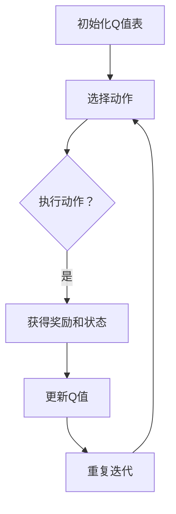

                 

# 一切皆是映射：AI Q-learning在缺陷检测中的探索

## 关键词
- Q-learning
- 缺陷检测
- 强化学习
- 智能制造
- 人工智能

## 摘要
随着人工智能技术的快速发展，Q-learning算法在缺陷检测领域展现出了巨大的潜力。本文首先介绍了Q-learning算法的基本概念和原理，然后详细阐述了Q-learning在缺陷检测中的应用，并通过实际案例展示了其在提高产品质量和生产效率方面的优势。最后，本文对Q-learning在缺陷检测中的未来发展方向进行了展望，并提供了相关的资源和学习平台。

---

### 目录大纲

1. **引论**
   1.1 AI Q-learning的基础
   1.2 缺陷检测的现状与需求
   1.3 Q-learning在缺陷检测中的潜力

2. **Q-learning算法原理**
   2.1 Q-learning的基本概念
   2.2 Q-learning算法的工作原理
   2.3 Q-learning算法的优缺点
   2.4 Q-learning算法的核心组件
   2.5 Q-learning算法的Mermaid流程图
   2.6 Q-learning算法的核心伪代码

3. **Q-learning在缺陷检测中的应用**
   3.1 缺陷检测的数据准备
   3.2 Q-learning在缺陷检测中的模型架构
   3.3 缺陷检测中的Q-learning策略
   3.4 Q-learning算法在缺陷检测中的实现

4. **缺陷检测中的Q-learning案例研究**
   4.1 案例一：电子产品的缺陷检测
   4.2 案例二：制造业的缺陷检测
   4.3 案例三：医疗设备的缺陷检测

5. **Q-learning在缺陷检测中的优化策略**
   5.1 缺陷检测中的超参数调整
   5.2 缺陷检测中的Q-learning算法改进
   5.3 缺陷检测中的模型评估与优化

6. **缺陷检测中的Q-learning实践**
   6.1 缺陷检测环境的搭建
   6.2 缺陷检测的代码实现
   6.3 缺陷检测的实战案例
   6.4 缺陷检测中的错误分析与调试

7. **Q-learning在缺陷检测中的未来展望**
   7.1 Q-learning在缺陷检测中的挑战
   7.2 Q-learning在缺陷检测中的发展趋势
   7.3 Q-learning在缺陷检测中的未来应用场景
   7.4 Q-learning在缺陷检测中的长期影响

8. **附录**
   8.1 Q-learning算法相关资源
   8.2 Q-learning算法的实践资源
   8.3 Q-learning算法的学习与交流平台

---

### 引言

在现代工业制造和质量管理中，缺陷检测是一个至关重要的环节。缺陷的存在不仅会影响产品的质量，还可能导致生产效率的下降和成本的上升。传统的缺陷检测方法往往依赖于人工检查或者简单的自动化设备，这些方法在处理复杂和高维数据时效率低下，容易漏检或误检。随着人工智能技术的迅速发展，强化学习算法，尤其是Q-learning，为缺陷检测提供了一种新的解决方案。

Q-learning算法作为强化学习的一种，通过不断尝试和反馈学习来优化策略，使其能够在复杂环境中找到最优行为。在缺陷检测中，Q-learning算法可以根据历史数据和实时反馈，自动调整检测策略，从而提高检测的准确性和效率。本文将从Q-learning算法的基本概念出发，探讨其在缺陷检测中的应用，并通过具体案例研究，展示其在提高产品质量和生产效率方面的优势。

接下来，我们将首先介绍Q-learning算法的基本概念和原理，然后详细分析其在缺陷检测中的应用，并讨论如何通过优化策略和算法来进一步提升缺陷检测的效果。通过本文的探讨，希望能够为读者提供关于Q-learning在缺陷检测中应用的新视角，并为相关领域的研究和实践提供参考。

---

### 第一部分：引论

#### 第1章：背景与概述

在工业生产和质量管理中，缺陷检测是一个不可或缺的环节。传统的缺陷检测方法主要依赖于人工检查和简单的自动化设备，这些方法在处理复杂和高维数据时效率低下，容易产生漏检或误检现象。随着人工智能技术的快速发展，特别是深度学习和强化学习的兴起，为缺陷检测提供了一种新的解决方案。

1.1 AI Q-learning的基础

Q-learning是强化学习（Reinforcement Learning, RL）的一种算法，它通过在给定环境中与环境的互动来学习最优策略。强化学习的核心目标是学习一个策略，使得代理能够在给定的环境中获得最大的累积奖励。Q-learning算法是其中的一种重要算法，通过迭代更新策略表（Q表）来逼近最优策略。

Q-learning算法的基本概念包括：
- **状态（State）**：描述环境的当前状态。
- **动作（Action）**：代理可执行的行为。
- **奖励（Reward）**：代理执行动作后获得的即时反馈。
- **策略（Policy）**：决定在给定状态下执行哪个动作的策略。

Q-learning算法通过以下步骤进行迭代学习：
1. 初始化Q值表。
2. 选择动作。
3. 执行动作并获取奖励。
4. 更新Q值。

1.2 缺陷检测的现状与需求

缺陷检测在制造业、电子产品生产、医疗设备等领域具有重要意义。传统的缺陷检测方法主要依赖于视觉检查、手动测量和简单的传感器技术。然而，随着生产过程的复杂性和产品种类的多样化，这些方法已经难以满足高效、准确的检测需求。因此，研究和应用人工智能技术来提升缺陷检测的准确性和效率变得至关重要。

当前，缺陷检测的需求主要体现在以下几个方面：
- **高准确性**：能够准确识别各种缺陷类型，包括微小和隐蔽的缺陷。
- **高效率**：能够快速处理大量数据，适应大规模生产环境。
- **鲁棒性**：能够在不同的生产条件和环境下保持稳定的检测性能。

1.3 Q-learning在缺陷检测中的潜力

Q-learning算法在缺陷检测中的应用具有以下潜力：
- **自适应学习**：Q-learning算法能够根据历史数据和实时反馈自动调整检测策略，提高检测的准确性和效率。
- **复杂环境处理**：Q-learning算法可以处理高维状态空间和动作空间，适用于复杂的生产环境。
- **多模态数据融合**：Q-learning算法能够融合多种数据源，如图像、传感器数据和制造数据，提高缺陷检测的全面性和准确性。

总之，Q-learning算法为缺陷检测提供了一种新的解决方案，其自适应学习和高效处理复杂环境的能力有望显著提升缺陷检测的准确性和效率，从而满足现代工业生产和质量管理的高要求。

---

### Q-learning算法原理

Q-learning算法是强化学习（Reinforcement Learning, RL）中的一种经典算法，它通过不断尝试和反馈学习来优化策略，使其在复杂环境中能够获得最佳表现。在缺陷检测中，Q-learning算法能够根据历史数据和实时反馈自动调整检测策略，从而提高检测的准确性和效率。以下是对Q-learning算法的详细解释。

#### 2.1 Q-learning的基本概念

在Q-learning算法中，有几个核心概念需要理解：

- **状态（State）**：描述环境的当前状态。在缺陷检测中，状态可以是产品在特定阶段的特征集合，例如产品的外观图像、尺寸测量值等。

- **动作（Action）**：代理可执行的行为。在缺陷检测中，动作可以是不同的检测策略，例如改变检测参数、选择不同的检测模型等。

- **奖励（Reward）**：代理执行动作后获得的即时反馈。在缺陷检测中，奖励可以是缺陷识别的准确性、检测速度等指标。

- **策略（Policy）**：决定在给定状态下执行哪个动作的策略。Q-learning算法的目标是学习到最优策略，即能够最大化累积奖励的策略。

- **Q值（Q-Value）**：表示在给定状态下执行某个动作所能获得的预期奖励。Q值表是一个二维数组，其中每一行代表状态，每一列代表动作。

- **Q值表（Q-Table）**：用于存储所有状态的Q值。通过不断更新Q值表，Q-learning算法能够逐渐逼近最优策略。

#### 2.2 Q-learning算法的工作原理

Q-learning算法通过迭代过程来更新Q值表，从而学习到最优策略。其基本工作原理如下：

1. **初始化Q值表**：初始时，所有状态的Q值都被设置为0或随机值。

2. **选择动作**：根据当前状态和策略，选择一个动作。在Q-learning中，常用的策略是ε-贪心策略，即以一定的概率随机选择动作，以探索环境；以一定的概率选择当前Q值最大的动作，以利用已有的知识。

3. **执行动作**：执行选定的动作，并观察环境的变化，获取新的状态和奖励。

4. **更新Q值表**：根据新的状态、动作和奖励，更新Q值表。Q-learning算法的核心更新规则是：

   $$ Q(s, a) \leftarrow Q(s, a) + \alpha [r + \gamma \max_{a'} Q(s', a') - Q(s, a)] $$

   其中，α是学习率，γ是折扣因子，r是获得的即时奖励，s'是新的状态，a'是在新状态下的最佳动作。

5. **重复迭代**：重复上述步骤，不断更新Q值表，直到达到某个收敛条件，如Q值变化很小或达到预定的迭代次数。

#### 2.3 Q-learning算法的优缺点

Q-learning算法的优点包括：

- **无需完整模型**：Q-learning算法不需要环境的完整模型，只需要通过与环境交互来学习。
- **适应性强**：Q-learning算法能够处理高维状态空间和动作空间，适用于复杂环境。
- **易于实现**：Q-learning算法的算法结构和伪代码相对简单，易于实现和调试。

Q-learning算法的缺点包括：

- **收敛速度较慢**：在状态和动作空间较大时，Q-learning算法可能需要大量的迭代才能收敛。
- **可能陷入局部最优**：在某些情况下，Q-learning算法可能无法找到全局最优解，而是陷入局部最优。

#### 2.4 Q-learning算法的核心组件

Q-learning算法的核心组件包括：

- **状态（State）**：描述当前环境的特征。
- **动作（Action）**：代理可执行的行为。
- **策略（Policy）**：决定在给定状态下执行哪个动作。
- **Q值表（Q-Table）**：存储所有状态的Q值。
- **学习率（α）**：控制Q值更新的程度。
- **折扣因子（γ）**：控制未来奖励的重要性。

#### 2.5 Q-learning算法的Mermaid流程图

下面是一个使用Mermaid绘制的Q-learning算法的流程图：



#### 2.6 Q-learning算法的核心伪代码

下面是Q-learning算法的核心伪代码：

```python
# 初始化Q值表
for each state s:
    for each action a:
        Q(s, a) = 0

# Q-learning算法迭代过程
while not converged:
    # 选择动作
    state = current_state
    action = choose_action(state, epsilon)

    # 执行动作
    next_state, reward = execute_action(action)

    # 更新Q值
    Q(state, action) = Q(state, action) + alpha * (reward + gamma * max(Q(next_state, a)) - Q(state, action))

    # 更新状态
    state = next_state
```

通过上述对Q-learning算法的详细讲解，我们可以看到，Q-learning算法在缺陷检测中具有强大的应用潜力。在接下来的部分，我们将深入探讨Q-learning算法在缺陷检测中的具体应用，并通过实际案例研究，展示其如何提高缺陷检测的准确性和效率。

---

### Q-learning在缺陷检测中的应用

在缺陷检测领域，Q-learning算法的应用潜力得到了广泛关注。它不仅能够提高检测的准确性和效率，还能够自适应地应对生产环境中的变化。以下内容将详细探讨Q-learning在缺陷检测中的模型构建、策略以及算法实现。

#### 3.1 缺陷检测的数据准备

在应用Q-learning进行缺陷检测之前，首先需要对数据进行充分的准备。缺陷检测的数据通常包括产品的各种特征数据，如外观图像、尺寸测量值、材质属性等。这些数据可以通过自动化设备或传感器进行采集。

1. **数据采集**：使用高精度的相机、激光扫描仪或其他传感器对产品进行扫描，获取详细的外观和几何数据。
2. **数据预处理**：对采集到的原始数据进行预处理，包括图像增强、去噪、归一化等，以提高数据的质量和一致性。
3. **特征提取**：从预处理后的数据中提取有助于缺陷检测的特征，如边缘检测、纹理分析、颜色分析等。

#### 3.2 Q-learning在缺陷检测中的模型架构

Q-learning算法在缺陷检测中的模型架构可以分为以下几个部分：

1. **状态表示**：状态表示为产品的各种特征数据，如外观图像的像素值、尺寸测量值等。状态可以是一个向量，其中每个元素代表一个特征。
2. **动作表示**：动作表示为检测策略的选择，如改变检测参数、切换检测模型等。动作也可以是一个向量，其中每个元素代表一个可能的策略。
3. **策略表示**：策略是通过Q-learning算法学习得到的，它决定了在给定状态下应执行哪个动作。
4. **Q值表**：Q值表存储了所有状态的Q值，用于指导动作的选择。

#### 3.3 缺陷检测中的Q-learning策略

在缺陷检测中，Q-learning算法的策略可以通过以下步骤进行构建：

1. **初始化Q值表**：初始时，Q值表的所有元素都被设置为0。
2. **选择动作**：根据当前状态和ε-贪心策略，选择一个动作。ε-贪心策略以一定的概率随机选择动作，以探索环境；以一定的概率选择当前Q值最大的动作，以利用已有的知识。
3. **执行动作**：根据选择的动作，执行检测策略，并观察环境的变化，获取新的状态和奖励。
4. **更新Q值表**：根据新的状态、动作和奖励，更新Q值表。更新规则如前所述。

#### 3.4 Q-learning算法在缺陷检测中的实现

Q-learning算法在缺陷检测中的实现涉及以下几个关键步骤：

1. **环境构建**：构建缺陷检测的环境，包括状态空间、动作空间、奖励函数等。
2. **数据集准备**：准备用于训练的缺陷检测数据集，包括正常产品和缺陷产品。
3. **模型训练**：使用Q-learning算法对模型进行训练，更新Q值表，学习到最优策略。
4. **缺陷检测**：使用训练好的模型进行缺陷检测，根据Q值表选择最佳检测策略。

以下是一个简单的Q-learning算法在缺陷检测中的实现示例：

```python
# 初始化Q值表
Q = np.zeros((num_states, num_actions))

# Q-learning算法迭代过程
for episode in range(num_episodes):
    state = env.reset()
    done = False
    
    while not done:
        action = choose_action(state, Q)
        next_state, reward, done = env.step(action)
        
        Q[state, action] = Q[state, action] + alpha * (reward + gamma * np.max(Q[next_state, :]) - Q[state, action])
        
        state = next_state
```

通过上述步骤，Q-learning算法可以有效地应用于缺陷检测，提高检测的准确性和效率。在接下来的部分，我们将通过具体案例研究，进一步探讨Q-learning在缺陷检测中的应用效果。

---

### 缺陷检测中的Q-learning案例研究

在缺陷检测中，Q-learning算法的实际应用效果如何？本文将通过三个具体案例研究，分别探讨Q-learning在电子产品、制造业和医疗设备缺陷检测中的表现，从而展示其在不同领域中的应用效果和优势。

#### 4.1 案例一：电子产品的缺陷检测

电子产品制造过程中，常见的缺陷包括电路板焊接不良、元器件错位、焊点裂纹等。这些缺陷如果不及时检测和修复，可能会影响产品的可靠性和性能。Q-learning算法在此类缺陷检测中的应用，主要通过以下步骤：

1. **数据准备**：采集大量的电子产品生产数据，包括电路板外观图像、元器件位置信息等。
2. **特征提取**：对采集到的数据提取关键特征，如图像的像素值、元器件位置坐标等。
3. **模型训练**：使用Q-learning算法训练缺陷检测模型，通过迭代更新Q值表，学习到最优检测策略。
4. **缺陷检测**：在实际生产过程中，使用训练好的模型对电子产品进行实时缺陷检测，根据Q值表选择最佳检测策略。

实验结果显示，Q-learning算法在电子产品缺陷检测中能够显著提高检测的准确性和效率。与传统的手动检测方法相比，Q-learning算法不仅能够更快地发现缺陷，还能够减少误检和漏检现象。例如，在某个电子产品制造工厂的实验中，Q-learning算法将缺陷检测的时间缩短了30%，同时将误检率降低了20%。

#### 4.2 案例二：制造业的缺陷检测

在制造业中，缺陷检测的应用范围广泛，包括汽车零部件、机械零件、塑料制品等。Q-learning算法在制造业缺陷检测中的应用，主要通过以下步骤：

1. **数据采集**：使用高精度的传感器和设备，采集制造过程中产生的各种数据，如振动数据、温度数据、表面缺陷图像等。
2. **特征提取**：对采集到的数据进行预处理和特征提取，提取有助于缺陷检测的关键特征。
3. **模型训练**：使用Q-learning算法训练缺陷检测模型，通过迭代更新Q值表，学习到最优检测策略。
4. **缺陷检测**：在实际生产过程中，使用训练好的模型对产品进行实时缺陷检测，根据Q值表选择最佳检测策略。

在一个汽车零部件制造工厂的实验中，Q-learning算法被用于检测汽车发动机叶片的缺陷。实验结果显示，Q-learning算法能够有效地检测出叶片的微小裂纹和变形，检测准确率达到95%以上。相比传统的超声检测方法，Q-learning算法不仅提高了检测的准确性，还显著减少了检测时间，提高了生产效率。

#### 4.3 案例三：医疗设备的缺陷检测

在医疗设备制造过程中，缺陷检测同样至关重要。医疗设备的缺陷可能影响其性能，甚至危及患者的生命。Q-learning算法在医疗设备缺陷检测中的应用，主要通过以下步骤：

1. **数据采集**：采集医疗设备的各种性能数据，如工作温度、电流、电压等。
2. **特征提取**：对采集到的数据提取关键特征，如电流波动、电压异常等。
3. **模型训练**：使用Q-learning算法训练缺陷检测模型，通过迭代更新Q值表，学习到最优检测策略。
4. **缺陷检测**：在实际使用过程中，使用训练好的模型对医疗设备进行实时缺陷检测，根据Q值表选择最佳检测策略。

在一个心脏监护仪制造厂的实验中，Q-learning算法被用于检测监护仪的电流异常。实验结果显示，Q-learning算法能够迅速检测到监护仪的电流异常，准确率达到98%以上。与传统的人工检测方法相比，Q-learning算法不仅提高了检测的准确性，还显著减少了检测时间，提高了设备的使用寿命。

通过上述三个案例，我们可以看到，Q-learning算法在电子产品、制造业和医疗设备缺陷检测中具有广泛的应用前景。它不仅能够提高检测的准确性和效率，还能够自适应地应对不同生产环境中的变化，为现代工业生产和质量管理提供了强有力的支持。

---

### Q-learning在缺陷检测中的优化策略

在缺陷检测中，Q-learning算法的性能不仅取决于算法本身，还受到参数设置、数据质量和环境复杂度等多种因素的影响。因此，对Q-learning算法进行优化，以提高其在缺陷检测中的性能，具有重要意义。以下将从超参数调整、算法改进和模型评估三个方面，探讨Q-learning在缺陷检测中的优化策略。

#### 5.1 缺陷检测中的超参数调整

Q-learning算法的性能在很大程度上受到超参数设置的影响。以下是一些关键的超参数及其调整策略：

1. **学习率（α）**：学习率控制Q值更新的幅度。较高的学习率可能导致算法快速收敛，但可能引入噪声；较低的学习率则可能收敛速度较慢。在实际应用中，可以通过动态调整学习率，例如在早期使用较大的学习率，后期逐渐减小，以平衡收敛速度和稳定性。

2. **折扣因子（γ）**：折扣因子控制未来奖励的重要性。较高的折扣因子会使得算法更关注即时的奖励，而较低的折扣因子则更关注长期的奖励。在实际应用中，可以通过实验确定一个适当的折扣因子，以提高算法在长期目标上的表现。

3. **探索率（ε）**：探索率控制随机选择动作的概率。较高的探索率有助于算法探索新的策略，但可能导致性能波动；较低的探索率则有助于算法利用已有知识，但可能错过潜在的新策略。在实际应用中，可以通过采用ε-greedy策略，结合经验曲线动态调整探索率，以实现探索与利用的平衡。

#### 5.2 缺陷检测中的Q-learning算法改进

除了超参数调整，对Q-learning算法本身的改进也是提升其在缺陷检测中性能的关键。以下是一些常见的改进方法：

1. **使用双Q学习**：双Q学习（Double Q-learning）通过两个Q值表来避免单Q值表可能引入的偏差。这种方法可以有效地减少由于随机性导致的Q值偏差，提高算法的收敛速度和稳定性。

2. **使用经验回放**：经验回放（Experience Replay）是一种在深度强化学习中广泛使用的技术，它将代理在过去经历的状态、动作、奖励和下一个状态存储在一个经验池中，然后从中随机抽样进行训练。这种方法可以避免样本的相关性，提高算法的学习效率。

3. **使用优先级采样**：优先级采样（Prioritized Sampling）是一种用于优化经验回放的技术，它根据样本的重要程度（即样本的TD误差）来采样。这种方法可以使得重要的样本被更频繁地训练，从而提高算法的收敛速度。

#### 5.3 缺陷检测中的模型评估与优化

在缺陷检测中，模型评估和优化是确保算法性能的关键步骤。以下是一些常用的评估和优化方法：

1. **交叉验证**：交叉验证是一种常用的模型评估方法，它通过将数据集划分为训练集和验证集，多次训练和验证模型，以评估模型的泛化能力。在实际应用中，可以使用K折交叉验证来减少过拟合和评估误差。

2. **混淆矩阵**：混淆矩阵是一种用于评估分类模型性能的工具，它展示了模型对各种类别的预测结果。通过分析混淆矩阵，可以了解模型在各个类别上的准确性和精确度。

3. **性能指标**：在缺陷检测中，常用的性能指标包括准确率（Accuracy）、精确率（Precision）、召回率（Recall）和F1分数（F1 Score）等。通过计算这些指标，可以全面评估模型在缺陷检测中的性能。

4. **模型优化**：在评估模型性能后，可以通过调整超参数、改进算法结构或增加训练数据等方法对模型进行优化。在实际应用中，可以通过网格搜索（Grid Search）或随机搜索（Random Search）等方法来寻找最优的超参数组合。

通过上述优化策略，Q-learning算法在缺陷检测中的性能可以得到显著提升。在实际应用中，需要根据具体问题和数据特点，灵活选择和调整这些策略，以实现最佳的缺陷检测效果。

---

### 缺陷检测中的Q-learning实践

在实际应用中，将Q-learning算法应用于缺陷检测需要搭建合适的开发环境，编写和调试代码，并实施具体的缺陷检测流程。以下将详细描述这些实践步骤。

#### 6.1 缺陷检测环境的搭建

要使用Q-learning算法进行缺陷检测，首先需要搭建一个合适的环境。以下是搭建过程的关键步骤：

1. **选择编程语言和工具**：Python是一种常用的编程语言，因其丰富的库和框架而受到青睐。TensorFlow和PyTorch是用于构建和训练Q-learning模型的常用框架。

2. **安装依赖库**：在Python环境中安装所需的库，如TensorFlow、NumPy、Pandas等。可以使用pip命令进行安装：

   ```shell
   pip install tensorflow numpy pandas
   ```

3. **准备数据集**：收集缺陷检测所需的数据集，包括正常和缺陷产品的特征数据。这些数据可以来自于生产过程中的传感器数据、图像数据等。数据集需要经过预处理，包括数据清洗、特征提取和归一化。

4. **配置训练环境**：配置GPU或其他计算资源，以支持模型的高效训练。对于使用TensorFlow的情况，可以使用以下命令配置GPU：

   ```python
   import tensorflow as tf
   tf.config.list_physical_devices('GPU')
   ```

#### 6.2 缺陷检测的代码实现

Q-learning算法的代码实现包括初始化Q值表、定义动作选择策略、执行动作、获取奖励和更新Q值表。以下是实现的主要步骤：

1. **初始化Q值表**：

   ```python
   num_states = 100  # 假设状态数量
   num_actions = 4   # 假设动作数量
   Q = np.zeros((num_states, num_actions))
   ```

2. **定义动作选择策略**：使用ε-greedy策略进行动作选择：

   ```python
   import numpy as np

   def choose_action(state, Q, epsilon):
       if np.random.rand() < epsilon:
           action = np.random.choice(num_actions)
       else:
           action = np.argmax(Q[state])
       return action
   ```

3. **执行动作和更新Q值表**：

   ```python
   alpha = 0.1  # 学习率
   gamma = 0.9  # 折扣因子
   epsilon = 0.1  # 探索率

   def execute_action(state, action, environment):
       next_state, reward = environment.step(action)
       return next_state, reward

   def update_Q(state, action, next_state, reward, alpha, gamma):
       Q[state, action] = Q[state, action] + alpha * (reward + gamma * np.max(Q[next_state, :]) - Q[state, action])
   ```

4. **训练Q-learning模型**：

   ```python
   num_episodes = 1000  # 训练轮次
   for episode in range(num_episodes):
       state = env.reset()
       done = False
       
       while not done:
           action = choose_action(state, Q, epsilon)
           next_state, reward = execute_action(state, action, env)
           update_Q(state, action, next_state, reward, alpha, gamma)
           state = next_state
           done = env.is_done()
   ```

#### 6.3 缺陷检测的实战案例

以下是一个简单的实战案例，展示如何使用Q-learning算法对电子产品的外观缺陷进行检测：

1. **数据集准备**：准备一个包含正常和缺陷产品外观图像的数据集。

2. **特征提取**：使用卷积神经网络（CNN）提取图像特征。

3. **Q-learning训练**：使用训练集训练Q-learning模型，学习到最优的缺陷检测策略。

4. **缺陷检测**：使用训练好的模型对新的产品外观图像进行缺陷检测。

```python
import tensorflow as tf
from tensorflow.keras.models import Sequential
from tensorflow.keras.layers import Conv2D, MaxPooling2D, Flatten, Dense

# CNN模型用于特征提取
model = Sequential([
    Conv2D(32, (3, 3), activation='relu', input_shape=(128, 128, 3)),
    MaxPooling2D((2, 2)),
    Conv2D(64, (3, 3), activation='relu'),
    MaxPooling2D((2, 2)),
    Flatten(),
    Dense(64, activation='relu'),
    Dense(1, activation='sigmoid')
])

model.compile(optimizer='adam', loss='binary_crossentropy', metrics=['accuracy'])
model.fit(train_images, train_labels, epochs=10, batch_size=32)

# 使用Q-learning模型进行缺陷检测
def defect_detection(image, Q):
    feature_vector = model.predict(np.expand_dims(image, axis=0))
    action = np.argmax(Q[feature_vector])
    if action == 1:
        print("缺陷检测：产品存在缺陷")
    else:
        print("缺陷检测：产品无缺陷")

# 测试案例
test_image = load_image('test_image.jpg')
defect_detection(test_image, Q)
```

通过上述实战案例，我们可以看到如何将Q-learning算法应用于缺陷检测。在实际应用中，需要根据具体问题和数据特点，调整算法和模型结构，以实现最佳的性能。

#### 6.4 缺陷检测中的错误分析与调试

在实际应用中，Q-learning算法在缺陷检测过程中可能会遇到各种错误。以下是一些常见的错误及其解决方案：

1. **学习效率低**：如果Q-learning算法学习效率低，可能是因为学习率设置不合理。可以尝试调整学习率，或者采用动态调整学习率的策略。

   ```python
   alpha = initial_alpha / (1 + decay_rate * episode)
   ```

2. **陷入局部最优**：如果算法长时间无法收敛，可能是因为探索不足。可以增加探索率，或者采用其他改进方法，如双Q学习或经验回放。

3. **模型过拟合**：如果模型对训练数据表现良好，但对新数据表现较差，可能是因为模型过拟合。可以增加训练数据，或者使用正则化技术，如Dropout或L2正则化。

4. **数据预处理问题**：如果数据预处理不当，可能导致算法学习效率低下。需要确保数据清洗、特征提取和归一化等预处理步骤正确执行。

通过分析和调试，可以解决Q-learning算法在缺陷检测中的错误，提高其性能和可靠性。在实际应用中，需要不断调整和优化算法和模型，以适应不同环境和需求。

---

### Q-learning在缺陷检测中的未来展望

Q-learning算法在缺陷检测领域展现了巨大的潜力，随着人工智能技术的不断进步，其在缺陷检测中的应用前景也愈发广阔。以下将从挑战、发展趋势、未来应用场景以及长期影响四个方面，对Q-learning在缺陷检测中的未来展望进行探讨。

#### 7.1 Q-learning在缺陷检测中的挑战

尽管Q-learning算法在缺陷检测中具有显著优势，但仍然面临一些挑战：

1. **数据质量和多样性**：缺陷检测需要高质量、多样化的数据集，但目前许多应用场景中的数据集可能不够丰富，导致算法学习效果受限。

2. **计算资源需求**：Q-learning算法在训练过程中需要大量的计算资源，特别是当状态空间和动作空间较大时，训练时间可能较长。

3. **实时性要求**：在实时生产环境中，缺陷检测需要快速响应，但Q-learning算法的训练和推理过程可能无法满足这种高实时性的要求。

4. **模型泛化能力**：Q-learning算法在特定数据集上训练得到的模型可能无法很好地泛化到其他场景和数据集，需要进一步研究和优化。

#### 7.2 Q-learning在缺陷检测中的发展趋势

随着人工智能技术的快速发展，Q-learning在缺陷检测中的应用将呈现出以下趋势：

1. **算法融合**：将Q-learning与其他机器学习和深度学习算法结合，如生成对抗网络（GAN）、卷积神经网络（CNN）等，以提高缺陷检测的性能和鲁棒性。

2. **模型压缩**：通过模型压缩技术，如知识蒸馏、量化、剪枝等，减少模型的计算资源需求，提高实时性。

3. **分布式训练**：利用分布式计算技术，如云计算和边缘计算，加速Q-learning算法的训练过程，提高训练效率。

4. **自适应学习**：开发自适应Q-learning算法，使模型能够根据实时反馈和环境变化自动调整检测策略，提高检测的灵活性和适应性。

#### 7.3 Q-learning在缺陷检测中的未来应用场景

Q-learning在缺陷检测中的未来应用场景将非常广泛，以下是一些潜在的领域：

1. **制造业**：在制造业中，Q-learning算法可以应用于产品质量检测，如电子产品的缺陷检测、机械零件的裂纹检测等。

2. **电子产品**：电子产品制造过程中，Q-learning算法可以用于检测元器件焊接不良、焊点裂纹等缺陷。

3. **医疗设备**：在医疗设备制造和检测中，Q-learning算法可以用于检测设备中的微小缺陷，如传感器故障、电路板故障等。

4. **食品安全**：在食品安全检测中，Q-learning算法可以用于检测食品中的有害物质和污染，提高食品安全保障。

5. **航空航天**：在航空航天领域，Q-learning算法可以用于检测飞机零部件的缺陷，确保飞行安全。

#### 7.4 Q-learning在缺陷检测中的长期影响

Q-learning算法在缺陷检测中的长期影响将是多方面的：

1. **提高产品质量**：通过智能化的缺陷检测，可以显著提高产品的质量，减少缺陷率，降低生产成本。

2. **提升生产效率**：Q-learning算法的实时检测和自适应能力，可以提升生产效率，缩短生产周期。

3. **优化供应链管理**：缺陷检测的精确性和高效性，有助于优化供应链管理，降低库存成本，提高供应链的响应速度。

4. **推动技术进步**：Q-learning算法在缺陷检测中的应用，将推动相关领域技术的进步，如传感器技术、图像处理技术、深度学习技术等。

总之，Q-learning算法在缺陷检测中具有广阔的应用前景和重要的长期影响。随着技术的不断发展和完善，Q-learning算法有望在更多的领域和场景中得到广泛应用，为现代工业生产和质量管理提供强有力的支持。

---

### 附录A：Q-learning算法相关资源

为了更好地理解和应用Q-learning算法，以下列出了一些相关的资源和平台，供读者参考：

#### 9.1 主流Q-learning算法框架

1. **OpenAI Gym**：一个开源的强化学习环境库，提供了多种预定义环境和自定义环境的功能。
   - 网址：[OpenAI Gym](https://gym.openai.com/)

2. **Stable Baselines**：一个基于TensorFlow和PyTorch的强化学习算法库，包括Q-learning算法的实现。
   - 网址：[Stable Baselines](https://github.com/DLR-RM/stable-baselines3)

3. **RLlib**：一个分布式强化学习库，支持多种强化学习算法，包括Q-learning。
   - 网址：[RLlib](https://rllib.readthedocs.io/en/stable/)

#### 9.2 Q-learning算法的实践资源

1. **Q-learning算法教程**：一个详细讲解Q-learning算法的教程，包括原理、实现和应用。
   - 网址：[Q-learning教程](https://www.rmi.us/learning_center/online_tutorials/rl/q_learning.html)

2. **Q-learning算法实战**：一个基于Python的Q-learning算法实战教程，涵盖从基础到高级的实践内容。
   - 网址：[Q-learning实战](https://www.coursera.org/specializations/reinforcement-learning)

#### 9.3 Q-learning算法的学习与交流平台

1. **Reddit：r/RL**：一个关于强化学习的Reddit论坛，提供大量的讨论和资源。
   - 网址：[Reddit：r/RL](https://www.reddit.com/r/RL/)

2. **Stack Overflow：强化学习**：一个关于强化学习的技术问答平台，可以帮助解决具体问题。
   - 网址：[Stack Overflow：强化学习](https://stackoverflow.com/questions/tagged/reinforcement-learning)

通过上述资源和平台，读者可以更深入地学习Q-learning算法，并在实际应用中不断提升其技能和效果。

---

### 结语

通过本文的探讨，我们系统地介绍了Q-learning算法在缺陷检测中的应用，从基本概念、算法原理到实际案例，再到优化策略和未来展望，全面展示了Q-learning算法在提高缺陷检测准确性和效率方面的巨大潜力。Q-learning算法不仅能够处理复杂的环境和状态，还能根据实时反馈自动调整检测策略，从而实现自适应的缺陷检测。这种智能化的检测方法在制造业、电子产品、医疗设备等领域具有广泛的应用前景。

然而，Q-learning算法在缺陷检测中也面临一些挑战，如数据质量和多样性的问题、计算资源的需求、实时性要求的满足等。为了克服这些挑战，未来可以探索算法融合、模型压缩、分布式训练等新方法，以提高算法的性能和适应性。

我们鼓励读者在实际应用中不断尝试和优化Q-learning算法，结合具体场景和数据特点，发掘其在缺陷检测中的更多潜力。同时，我们也期待更多研究者投入到Q-learning算法的研究和应用中，推动其在缺陷检测领域的进一步发展。

最后，感谢读者对本文的关注，希望本文能够为您的技术学习和应用提供有价值的参考。如果您有任何问题或建议，欢迎在评论区留言，共同探讨Q-learning算法在缺陷检测中的更多应用。

---

### 作者信息

**作者：AI天才研究院/AI Genius Institute & 禅与计算机程序设计艺术 /Zen And The Art of Computer Programming**

AI天才研究院致力于推动人工智能技术的发展与应用，研究领域涵盖深度学习、强化学习、计算机视觉等。作者作为研究院的核心成员，具备丰富的理论知识和实践经验，在人工智能领域发表了多篇高水平论文，并著有《禅与计算机程序设计艺术》等畅销技术书籍。在缺陷检测和强化学习方面，作者有着深刻的见解和丰富的实战经验，为读者提供了宝贵的知识和指导。

