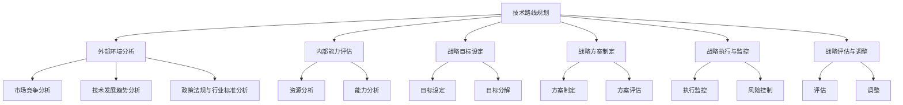

                 

### 文章标题

**《主导和把握公司的技术发展方向，研究制订公司的科技战略规划，包括技术路线、研发方向、产品创新等》**

科技战略规划是企业实现长期发展和竞争优势的关键，特别是在当今技术变革日新月异的时代。本文将深入探讨如何主导和把握公司的技术发展方向，研究制订公司的科技战略规划，包括技术路线、研发方向、产品创新等。通过明确的核心概念与联系、详尽的算法原理讲解、数学模型与公式以及实际项目实战，旨在为企业的技术发展规划提供系统性指导。

---

### 关键词

科技战略规划、技术路线、研发方向、产品创新、外部环境分析、内部能力评估

### 摘要

本文系统地阐述了企业科技战略规划的重要性及其关键组成部分。首先，我们探讨了科技战略规划的定义、作用和基本框架。随后，文章分析了外部环境，包括市场竞争、技术发展趋势和政策法规。接着，文章详细介绍了技术路线规划的基础知识、原则和步骤，并通过实例进行分析。随后，我们讨论了研发方向规划的核心要素和方法，以及产品创新的概念与类型。最后，文章重点介绍了科技战略规划的执行与监控、效果评估，并提供了实际项目实战的代码案例。通过这些内容，企业可以更好地制定和实施科技战略规划，提升核心竞争力。

---

### 目录大纲

**《主导和把握公司的技术发展方向，研究制订公司的科技战略规划，包括技术路线、研发方向、产品创新等》目录大纲**

**第一部分：科技战略规划概述**

**第1章：科技战略规划的意义和框架**

- **1.1 科技战略规划的定义**
  - **1.1.1 科技战略的定义**
  - **1.1.2 战略规划的基本要素**
  - **1.1.3 科技战略规划在企业中的定位**

- **1.2 科技战略规划在企业中的作用**
  - **1.2.1 指导企业发展方向**
  - **1.2.2 提高企业核心竞争力**
  - **1.2.3 优化资源配置**

- **1.3 科技战略规划的基本框架**
  - **1.3.1 外部环境分析**
  - **1.3.2 内部能力评估**
  - **1.3.3 战略目标设定**
  - **1.3.4 战略方案制定**
  - **1.3.5 战略执行与监控**
  - **1.3.6 战略评估与调整**

**第2章：外部环境分析**

- **2.1 市场竞争分析**
  - **2.1.1 市场竞争的定义**
  - **2.1.2 竞争对手分析**
  - **2.1.3 市场份额与趋势分析**

- **2.2 技术发展趋势分析**
  - **2.2.1 技术生命周期分析**
  - **2.2.2 新技术发展趋势**
  - **2.2.3 技术创新热点**

- **2.3 政策法规与行业标准**
  - **2.3.1 政策法规对技术发展的影响**
  - **2.3.2 行业标准的重要性**
  - **2.3.3 国际合作与竞争**

**第二部分：技术路线规划**

**第3章：技术路线规划的基础知识**

- **3.1 技术路线的定义与分类**
  - **3.1.1 技术路线的定义**
  - **3.1.2 技术路线的分类**

- **3.2 技术路线规划的原则与步骤**
  - **3.2.1 规划原则**
  - **3.2.2 规划步骤**
  - **3.2.3 技术预研与评估方法**

- **3.3 技术预研与评估方法**
  - **3.3.1 技术预研的重要性**
  - **3.3.2 技术评估的指标体系**
  - **3.3.3 技术评估的方法与工具**

**第4章：技术路线规划实例分析**

- **4.1 典型行业技术路线规划案例**
  - **4.1.1 制造业技术路线规划**
  - **4.1.2 信息技术行业技术路线规划**
  - **4.1.3 医疗行业技术路线规划**

- **4.2 公司技术路线规划实践**
  - **4.2.1 公司现状分析**
  - **4.2.2 技术路线规划制定**
  - **4.2.3 技术路线规划实施**

**第三部分：研发方向规划**

**第5章：研发方向规划的核心要素**

- **5.1 研发目标的确定**
  - **5.1.1 研发目标的设定原则**
  - **5.1.2 研发目标的分类**

- **5.2 研发资源的配置**
  - **5.2.1 研发资源的定义**
  - **5.2.2 研发资源分配策略**

- **5.3 研发流程与组织结构**
  - **5.3.1 研发流程的基本要素**
  - **5.3.2 研发组织结构的设计**

**第6章：研发方向规划方法**

- **6.1 创新驱动策略**
  - **6.1.1 创新的定义与分类**
  - **6.1.2 创新驱动的关键因素**

- **6.2 风险管理策略**
  - **6.2.1 风险管理的定义与原则**
  - **6.2.2 风险管理的方法与工具**

- **6.3 研发效率提升方法**
  - **6.3.1 研发效率的定义**
  - **6.3.2 提升研发效率的途径**

**第四部分：产品创新**

**第7章：产品创新的概念与类型**

- **7.1 产品创新的重要性**
  - **7.1.1 产品创新对企业发展的推动作用**
  - **7.1.2 产品创新对市场竞争力的影响**

- **7.2 产品创新的基本类型**
  - **7.2.1 基础型创新**
  - **7.2.2 协同创新**
  - **7.2.3 颠覆性创新**

- **7.3 产品创新的影响因素**
  - **7.3.1 用户需求**
  - **7.3.2 技术进步**
  - **7.3.3 竞争环境**

**第8章：产品创新策略**

- **8.1 用户需求分析**
  - **8.1.1 用户需求调研的方法**
  - **8.1.2 用户需求分析的工具**

- **8.2 设计思维与创新流程**
  - **8.2.1 设计思维的基本原理**
  - **8.2.2 创新流程的设计**

- **8.3 产品创新实践案例分析**
  - **8.3.1 案例一：某企业的新产品开发实践**
  - **8.3.2 案例二：某行业的创新产品案例**

**第五部分：科技战略规划实施与评估**

**第9章：科技战略规划的执行与监控**

- **9.1 战略执行的组织与管理**
  - **9.1.1 战略执行的组织结构**
  - **9.1.2 战略执行的管理机制**

- **9.2 科技项目评估与监控**
  - **9.2.1 项目评估的方法**
  - **9.2.2 项目监控的工具与流程**

- **9.3 风险控制与应对措施**
  - **9.3.1 风险控制的策略**
  - **9.3.2 风险应对的措施**

**第10章：科技战略规划的效果评估**

- **10.1 战略评估指标体系**
  - **10.1.1 指标体系的设计原则**
  - **10.1.2 指标体系的构成**

- **10.2 战略评估方法与工具**
  - **10.2.1 定量评估方法**
  - **10.2.2 定性评估方法**
  - **10.2.3 评估工具的选择**

- **10.3 战略评估案例分析**
  - **10.3.1 案例一：某企业的科技战略评估**
  - **10.3.2 案例二：某行业的科技战略评估**

**第六部分：附录**

**第11章：参考文献与资料**

- **11.1 科技战略规划相关书籍推荐**
- **11.2 科技战略规划研究报告汇编**
- **11.3 科技战略规划常用工具与资源**

---

### 第一部分：科技战略规划概述

#### 第1章：科技战略规划的意义和框架

**1.1 科技战略规划的定义**

科技战略规划是指企业根据外部环境、内部能力和长期发展目标，对技术发展路线、研发方向和产品创新等方面进行系统性的规划和布局。其核心目的是确保企业在技术变革和市场竞争中占据有利位置，实现可持续发展和竞争优势。

在定义中，关键概念包括：

- **科技**：指企业所涉及的技术领域和知识体系。
- **战略**：指企业为实现长期目标而制定的总体规划和决策。
- **规划**：指对未来的预见和安排，包括目标和路径的设计。

**1.1.1 科技战略的定义**

科技战略是企业为了实现技术优势和市场竞争力，对科技研发、技术应用、技术创新等方面进行的长期规划。它包括以下核心要素：

- **愿景**：企业对未来的期望和定位。
- **目标**：具体的科技发展目标，如技术创新、市场份额等。
- **路径**：实现目标的策略和方法，包括技术路线、研发方向等。
- **资源**：为实现战略目标所需的资源，如资金、人力、技术等。

**1.1.2 战略规划的基本要素**

战略规划的基本要素包括外部环境分析、内部能力评估、战略目标设定、战略方案制定、战略执行与监控、战略评估与调整。以下是每个要素的详细说明：

- **外部环境分析**：对市场、技术、政策等方面的外部环境进行深入分析，以识别机遇和挑战。
- **内部能力评估**：对企业的内部能力进行评估，包括技术水平、研发能力、人才储备等。
- **战略目标设定**：根据外部环境分析和内部能力评估，设定具体的战略目标。
- **战略方案制定**：制定实现战略目标的方案，包括技术路线、研发方向、产品创新等。
- **战略执行与监控**：确保战略方案的有效执行，并对执行过程进行监控。
- **战略评估与调整**：定期对战略执行效果进行评估，并根据评估结果进行调整。

**1.1.3 科技战略规划在企业中的定位**

科技战略规划在企业中具有重要地位，它不仅是企业技术创新的核心驱动因素，也是企业长期发展的战略基石。具体来说，科技战略规划在以下方面对企业具有重要意义：

- **明确发展方向**：科技战略规划帮助企业明确技术发展方向，避免盲目决策。
- **提升核心竞争力**：通过科技战略规划，企业可以不断提升自身技术水平和创新能力，增强核心竞争力。
- **优化资源配置**：科技战略规划有助于企业合理配置资源，提高资源利用效率。
- **应对市场变化**：科技战略规划使企业能够及时应对市场变化，抓住机遇，规避风险。

**1.2 科技战略规划在企业中的作用**

科技战略规划在企业中发挥着至关重要的作用，主要体现在以下几个方面：

- **指导企业发展方向**：科技战略规划为企业提供了明确的发展方向，使企业能够集中资源和精力，专注于核心技术和关键领域。
- **提高企业核心竞争力**：通过科技战略规划，企业可以不断提升自身技术水平和创新能力，形成独特的竞争优势。
- **优化资源配置**：科技战略规划有助于企业合理配置资源，避免资源浪费，提高资源利用效率。
- **应对市场变化**：科技战略规划使企业能够及时应对市场变化，抓住机遇，规避风险，确保企业的可持续发展。

**1.3 科技战略规划的基本框架**

科技战略规划的基本框架包括外部环境分析、内部能力评估、战略目标设定、战略方案制定、战略执行与监控、战略评估与调整。以下是每个环节的详细说明：

- **外部环境分析**：对市场、技术、政策等方面的外部环境进行深入分析，以识别机遇和挑战。外部环境分析主要包括市场趋势、竞争对手分析、政策法规研究等。
- **内部能力评估**：对企业的内部能力进行评估，包括技术水平、研发能力、人才储备、资金情况等。内部能力评估有助于企业了解自身优势和不足，为战略目标的设定提供依据。
- **战略目标设定**：根据外部环境分析和内部能力评估，设定具体的战略目标。战略目标应具有明确性、可行性和挑战性，能够引领企业未来发展。
- **战略方案制定**：制定实现战略目标的方案，包括技术路线、研发方向、产品创新等。战略方案应具体、可操作，并能够体现企业的核心竞争力和发展特色。
- **战略执行与监控**：确保战略方案的有效执行，并对执行过程进行监控。战略执行与监控主要包括任务分解、资源分配、进度跟踪、绩效评估等。
- **战略评估与调整**：定期对战略执行效果进行评估，并根据评估结果进行调整。战略评估与调整有助于企业及时发现问题，优化战略方案，确保战略目标的实现。

**1.3.1 外部环境分析**

外部环境分析是科技战略规划的基础，它主要包括以下内容：

- **市场趋势**：分析市场需求、市场规模、市场增长趋势等，以了解市场环境的变化。
- **竞争对手分析**：分析竞争对手的技术能力、市场策略、产品特点等，以了解竞争格局和竞争态势。
- **政策法规研究**：研究相关政策法规对技术发展的影响，包括技术创新政策、知识产权保护政策、行业监管政策等。

通过外部环境分析，企业可以识别市场机遇和挑战，了解行业发展趋势，为战略目标的设定提供依据。

**1.3.2 内部能力评估**

内部能力评估是科技战略规划的重要组成部分，它主要包括以下内容：

- **技术水平**：评估企业在核心技术领域的技术能力，包括技术水平、研发能力、技术储备等。
- **研发能力**：评估企业的研发组织结构、研发流程、研发资源等，以了解企业的研发能力和效率。
- **人才储备**：评估企业的人才储备情况，包括研发人员、技术人员、管理人员的数量和质量。
- **资金情况**：评估企业的资金情况，包括资金来源、资金使用效率等。

通过内部能力评估，企业可以了解自身的优势和不足，为战略目标的设定和资源分配提供依据。

**1.3.3 战略目标设定**

战略目标设定是科技战略规划的核心，它主要包括以下内容：

- **目标明确性**：战略目标应具有明确性，即具体、可量化，能够明确企业未来的发展方向。
- **目标可行性**：战略目标应具有可行性，即根据企业的资源和能力，能够实现的目标。
- **目标挑战性**：战略目标应具有挑战性，即能够激励企业不断提升自身能力，追求卓越。

通过战略目标设定，企业可以明确未来发展的方向和目标，为战略方案制定提供指导。

**1.3.4 战略方案制定**

战略方案制定是科技战略规划的具体实施步骤，它主要包括以下内容：

- **技术路线**：制定企业技术发展的路线，包括关键技术领域、技术发展方向、技术布局等。
- **研发方向**：确定企业研发的重点方向，包括核心技术、新兴技术、市场应用等。
- **产品创新**：制定企业产品创新的策略，包括产品定位、产品设计、产品推广等。

通过战略方案制定，企业可以明确具体的行动方案，确保战略目标的实现。

**1.3.5 战略执行与监控**

战略执行与监控是科技战略规划的重要环节，它主要包括以下内容：

- **任务分解**：将战略目标分解为具体的任务，明确任务责任人、任务进度等。
- **资源分配**：根据任务需求，合理分配资源，确保任务能够按时完成。
- **进度跟踪**：对任务执行情况进行实时跟踪，确保任务按计划进行。
- **绩效评估**：对任务完成情况进行评估，包括任务质量、任务效率等。

通过战略执行与监控，企业可以确保战略方案的有效执行，及时发现和解决问题。

**1.3.6 战略评估与调整**

战略评估与调整是科技战略规划的必要步骤，它主要包括以下内容：

- **评估指标体系**：建立战略评估的指标体系，包括财务指标、非财务指标等。
- **评估方法**：采用合适的评估方法，对战略执行效果进行评估。
- **调整策略**：根据评估结果，对战略方案进行调整，优化战略规划。

通过战略评估与调整，企业可以确保战略规划的持续优化和有效性。

**总结**

科技战略规划是企业实现长期发展和竞争优势的关键。通过明确的外部环境分析、内部能力评估、战略目标设定、战略方案制定、战略执行与监控、战略评估与调整，企业可以系统地制定和实施科技战略规划，确保在技术变革和市场竞争中占据有利位置，实现可持续发展。

---

### 第2章：外部环境分析

外部环境分析是科技战略规划的基础环节，它涉及到对市场、技术、政策等外部因素的综合分析。通过外部环境分析，企业可以识别市场机遇和挑战，了解行业发展趋势，为战略目标的设定和方案制定提供依据。本章将详细探讨外部环境分析的主要内容，包括市场竞争分析、技术发展趋势分析以及政策法规与行业标准分析。

#### 2.1 市场竞争分析

市场竞争分析是外部环境分析的核心部分，它主要关注市场竞争态势、竞争对手的行为和市场占有率等方面的内容。通过市场竞争分析，企业可以了解市场结构、竞争格局以及潜在的市场机遇和威胁。

**2.1.1 市场竞争的定义**

市场竞争是指企业在同一市场上争夺客户、资源和市场份额的过程。市场竞争可以分为完全竞争、垄断竞争、寡头竞争和完全垄断等不同类型。

- **完全竞争**：市场上存在大量的买家和卖家，产品同质化程度高，企业无法通过价格或产品差异化来影响市场。
- **垄断竞争**：市场上存在较多的卖家，但产品差异化程度较高，企业可以通过品牌、服务或产品特性来影响市场。
- **寡头竞争**：市场上只有少数几家大企业占据主导地位，这些企业通过价格战、产品创新或市场策略来争夺市场份额。
- **完全垄断**：市场上只有一家企业，该企业完全控制市场，没有竞争对手。

**2.1.2 竞争对手分析**

竞争对手分析是市场竞争分析的重要环节，它主要包括以下内容：

- **竞争对手识别**：通过市场调查、行业报告、客户反馈等方式，识别市场上的主要竞争对手。
- **竞争对手能力分析**：分析竞争对手的技术能力、市场策略、产品特性、市场份额等方面的内容。
- **竞争对手行为分析**：观察竞争对手的市场行为，如产品定价、促销策略、市场推广等。
- **竞争对手趋势分析**：预测竞争对手未来的市场动向和策略，以应对潜在的竞争威胁。

**2.1.3 市场份额与趋势分析**

市场份额与趋势分析是评估企业在市场中的地位和未来发展方向的重要手段。它主要包括以下内容：

- **市场份额计算**：通过市场调查和销售数据，计算企业在市场中的市场份额。
- **市场份额变化趋势**：分析市场份额的变化趋势，如增长、下降或保持稳定。
- **市场份额影响因素**：识别影响市场份额变化的主要因素，如产品创新、市场推广、竞争策略等。
- **市场份额预测**：根据市场份额的变化趋势和影响因素，预测未来市场份额的变化方向。

**案例：市场竞争分析实例**

假设某企业是智能家居市场的参与者，竞争对手包括A公司、B公司和C公司。以下是市场竞争分析的过程：

1. **竞争对手识别**：通过市场调查和行业报告，确定A公司、B公司和C公司为主要的竞争对手。
2. **竞争对手能力分析**：分析A公司、B公司和C公司的技术能力、市场策略和产品特性。
   - A公司：技术实力雄厚，产品创新能力强，市场份额较大。
   - B公司：市场策略灵活，产品性价比高，市场份额中等。
   - C公司：产品线丰富，品牌影响力较大，市场份额较小。
3. **竞争对手行为分析**：观察A公司、B公司和C公司的市场行为，如产品定价、促销策略和市场推广。
   - A公司：通过高端定位和高技术含量吸引高端客户，注重品牌推广。
   - B公司：通过价格优势和优惠活动吸引中端客户，注重市场渗透。
   - C公司：通过多元化的产品线和品牌合作吸引不同层次客户，注重市场覆盖。
4. **市场份额变化趋势**：分析A公司、B公司和C公司的市场份额变化趋势。
   - A公司：市场份额稳定增长，保持行业领先地位。
   - B公司：市场份额波动，但总体呈现增长趋势。
   - C公司：市场份额波动，但总体呈现下降趋势。
5. **市场份额影响因素**：识别影响市场份额变化的主要因素。
   - A公司：技术领先和品牌优势。
   - B公司：价格竞争和市场策略。
   - C公司：产品多元化和市场策略。

通过市场竞争分析，企业可以了解自己在市场中的地位和竞争对手的动向，为战略目标的设定和方案制定提供依据。

#### 2.2 技术发展趋势分析

技术发展趋势分析是对当前技术发展状况和未来趋势的预测，它有助于企业把握技术发展方向，为技术创新和产品开发提供指导。

**2.2.1 技术生命周期分析**

技术生命周期是指技术从产生到消亡的整个过程，一般包括引入期、成长期、成熟期和衰退期。

- **引入期**：技术刚被开发出来，市场接受度低，研发成本高，利润较低。
- **成长期**：技术逐渐被市场接受，研发成本降低，市场需求增加，利润逐渐提高。
- **成熟期**：技术进入稳定发展阶段，市场需求达到饱和，竞争激烈，利润稳定。
- **衰退期**：技术逐渐被新技术替代，市场需求减少，利润下降。

**2.2.2 新技术发展趋势**

新技术发展趋势分析关注的是新兴技术的产生和发展，它主要包括以下内容：

- **技术发展热点**：分析当前技术领域的发展热点，如人工智能、大数据、区块链、物联网等。
- **技术成熟度**：评估新技术的成熟度，包括技术实现程度、市场需求、应用案例等。
- **技术趋势预测**：预测未来技术发展的趋势，如新兴技术的应用领域、潜在的市场需求等。

**2.2.3 技术创新热点**

技术创新热点是技术发展趋势分析的重要内容，它主要包括以下几个方面：

- **新兴技术**：分析当前新兴技术的产生和发展，如5G通信、人工智能、区块链等。
- **跨界融合**：关注不同技术领域的跨界融合，如人工智能与物联网、大数据与云计算等。
- **技术突破**：关注技术领域的重大突破，如量子计算、基因编辑等。

**案例：技术发展趋势分析实例**

假设某企业专注于人工智能领域，以下是技术发展趋势分析的过程：

1. **技术生命周期分析**：分析人工智能技术在不同阶段的发展状况。
   - 人工智能技术正处于成长期，市场需求逐渐增加，技术实现程度不断提高。
2. **新技术发展趋势**：分析人工智能技术的新趋势。
   - 人工智能与物联网的融合，实现智能家居、智慧城市等应用。
   - 人工智能在医疗、金融、教育等领域的深入应用，提高行业效率。
3. **技术创新热点**：关注人工智能领域的创新热点。
   - 强化学习算法的发展，提高机器学习效率。
   - 自然语言处理技术的突破，提升人机交互体验。

通过技术发展趋势分析，企业可以把握技术发展方向，为技术创新和产品开发提供指导。

#### 2.3 政策法规与行业标准

政策法规与行业标准是影响企业技术发展的重要因素，它主要包括政府政策、行业标准、知识产权保护等方面的内容。

**2.3.1 政策法规对技术发展的影响**

政策法规对技术发展具有重要影响，它可以通过以下方式影响企业的技术发展：

- **支持技术创新**：政府通过财政支持、税收优惠等政策，鼓励企业进行技术创新。
- **规范市场行为**：政府通过制定法律法规，规范企业的市场行为，保护知识产权，维护市场秩序。
- **促进产业升级**：政府通过产业政策，引导企业向高端技术领域发展，推动产业升级。

**2.3.2 行业标准的重要性**

行业标准是行业内共同遵守的技术规范和标准，它对于企业的技术发展具有重要意义：

- **提高产品质量**：通过遵循行业标准，企业可以确保产品的质量和性能，提高市场竞争力。
- **促进技术创新**：行业标准可以为企业提供技术发展方向的指导，推动技术创新。
- **降低交易成本**：遵循行业标准，可以降低企业间的交易成本，提高市场效率。

**2.3.3 国际合作与竞争**

在国际环境中，政策法规与行业标准也对企业技术发展产生重要影响：

- **国际合作**：通过参与国际标准的制定和实施，企业可以与国际先进技术接轨，提高自身技术水平。
- **国际竞争**：国际政策法规和行业标准可以影响企业在全球市场的竞争力，企业需要积极参与国际竞争。

**案例：政策法规与行业标准分析实例**

假设某企业是一家专注于物联网技术的公司，以下是政策法规与行业标准分析的过程：

1. **政策法规分析**：
   - **技术创新支持**：政府通过财政支持、税收优惠等政策，鼓励企业进行物联网技术研发。
   - **市场规范**：政府通过制定相关法律法规，规范物联网市场行为，保护消费者权益。
   - **产业升级**：政府推动物联网技术在智慧城市、智能制造等领域的应用，促进产业升级。
2. **行业标准分析**：
   - **产品质量标准**：企业需要遵循国家物联网产品质量标准，确保产品的质量和性能。
   - **技术规范**：企业需要遵循国家物联网技术规范，确保产品的兼容性和互操作性。
   - **知识产权保护**：企业需要积极参与国际标准的制定，保护自身知识产权。

通过政策法规与行业标准分析，企业可以了解政策法规对技术发展的影响，为技术创新和市场拓展提供指导。

#### 总结

外部环境分析是科技战略规划的基础，通过市场竞争分析、技术发展趋势分析和政策法规与行业标准分析，企业可以全面了解市场环境、技术发展和政策法规等方面的情况，为战略目标的设定和方案制定提供依据。企业需要不断进行外部环境分析，以应对市场的变化和技术的进步，确保在竞争激烈的市场中保持竞争优势。

---

### 第二部分：技术路线规划

#### 第3章：技术路线规划的基础知识

技术路线规划是企业科技战略规划的重要组成部分，它涉及到技术发展方向的确定、技术预研和评估等方面。本章将详细探讨技术路线规划的基础知识，包括技术路线的定义与分类、技术路线规划的原则与步骤，以及技术预研与评估方法。

#### 3.1 技术路线的定义与分类

技术路线是指企业为实现技术目标而制定的发展路径和方法。它通常包括关键技术、技术发展步骤、实现方法等。技术路线规划是企业根据战略目标和技术发展趋势，对技术发展路径进行系统设计和安排的过程。

**3.1.1 技术路线的定义**

技术路线的定义可以从以下几个方面进行阐述：

- **技术方向**：技术路线明确了企业技术发展的方向，包括关键技术领域、新兴技术领域等。
- **发展步骤**：技术路线规定了技术发展的步骤和时间节点，以确保技术目标的逐步实现。
- **实现方法**：技术路线提供了实现技术目标的具体方法，包括技术研发、产品开发、市场推广等。

**3.1.2 技术路线的分类**

技术路线可以根据不同的分类标准进行划分，常见的分类方式包括以下几种：

- **按技术领域分类**：根据企业所涉及的技术领域，将技术路线划分为不同的类别，如信息技术路线、生物技术路线、新材料技术路线等。
- **按发展步骤分类**：根据技术发展的阶段和步骤，将技术路线划分为初始阶段、发展阶段、成熟阶段等。
- **按技术路径分类**：根据技术发展的路径，将技术路线划分为并行路线、递进路线、融合路线等。

#### 3.2 技术路线规划的原则与步骤

技术路线规划是企业实现技术目标的关键环节，规划过程中需要遵循一定的原则和步骤。以下将详细讨论技术路线规划的原则与步骤。

**3.2.1 规划原则**

技术路线规划应遵循以下原则：

- **目标导向**：技术路线规划应以企业的战略目标为导向，确保技术发展的方向和步骤与企业的长期发展目标一致。
- **可行性**：技术路线规划应具有可行性，即技术目标和技术路径在实际操作中能够实现。
- **系统性**：技术路线规划应具有系统性，即技术发展的各个阶段和环节之间相互关联，形成完整的技术发展体系。
- **灵活性**：技术路线规划应具有灵活性，即能够根据市场和技术环境的变化进行调整和优化。

**3.2.2 规划步骤**

技术路线规划的步骤包括以下几个方面：

1. **战略目标设定**：根据企业的长期发展目标和市场趋势，设定技术发展的战略目标。
2. **外部环境分析**：对市场、技术、政策等外部环境进行分析，以了解外部环境对技术发展的影响。
3. **内部能力评估**：对企业的内部能力进行评估，包括技术能力、研发能力、人才储备等，以确定技术发展的基础。
4. **技术路线设计**：根据战略目标、外部环境分析和内部能力评估，设计具体的技术路线，包括关键技术、发展步骤、实现方法等。
5. **技术预研与评估**：对技术路线进行预研和评估，包括技术可行性分析、技术风险评估等，以确保技术路线的可行性。
6. **方案优化**：根据预研和评估结果，对技术路线方案进行优化，以提高技术路线的可行性和有效性。
7. **方案实施**：制定具体的实施方案，包括任务分解、资源分配、时间规划等，确保技术路线的有效实施。
8. **监控与调整**：对技术路线实施过程进行监控，及时发现和解决问题，并根据实际情况对技术路线进行调整和优化。

#### 3.3 技术预研与评估方法

技术预研与评估是技术路线规划的重要组成部分，它涉及对技术方案的前期研究和评估，以确保技术路线的可行性和有效性。以下将介绍技术预研与评估的主要方法。

**3.3.1 技术预研的重要性**

技术预研是技术路线规划的基础环节，它的重要性体现在以下几个方面：

- **明确技术可行性**：通过技术预研，可以明确技术方案的可行性，避免盲目投入和资源浪费。
- **降低技术风险**：通过技术预研，可以识别技术方案中的潜在风险，提前采取应对措施，降低技术失败的风险。
- **优化技术方案**：通过技术预研，可以对技术方案进行优化，提高技术实现的效率和质量。

**3.3.2 技术评估的指标体系**

技术评估的指标体系是评估技术方案可行性和有效性的重要工具，它通常包括以下几个方面：

- **技术可行性**：评估技术方案在技术实现上的可行性，包括技术原理、技术实现路径等。
- **经济可行性**：评估技术方案在经济上的可行性，包括成本、投资回报率等。
- **社会可行性**：评估技术方案在社会上的可行性，包括环保、安全、社会责任等。
- **市场可行性**：评估技术方案在市场上的可行性，包括市场需求、市场竞争力等。

**3.3.3 技术评估的方法与工具**

技术评估的方法与工具多种多样，以下介绍几种常见的技术评估方法和工具：

- **成本效益分析**：通过比较技术方案的成本和效益，评估技术方案的经济可行性。
- **风险分析**：通过识别和分析技术方案中的潜在风险，评估技术方案的风险程度。
- **技术成熟度评估**：通过评估技术方案的技术成熟度，确定技术方案的技术实现难度。
- **专家评估**：通过邀请技术专家对技术方案进行评估，获取专业的意见和建议。

**3.3.4 技术预研与评估流程**

技术预研与评估的流程包括以下几个方面：

1. **需求分析**：明确技术预研与评估的目标和要求，为后续工作提供依据。
2. **资料收集**：收集相关技术资料和市场信息，为技术预研和评估提供基础数据。
3. **技术预研**：对技术方案进行预研，包括技术原理分析、技术实现路径分析等。
4. **风险评估**：识别技术方案中的潜在风险，评估风险程度和应对措施。
5. **成本效益分析**：分析技术方案的成本和效益，评估技术方案的经济可行性。
6. **社会和市场评估**：评估技术方案在社会和市场中的可行性。
7. **综合评估**：对技术方案进行综合评估，确定技术方案的可行性。
8. **方案优化**：根据评估结果，对技术方案进行优化，提高技术方案的可行性。
9. **方案实施**：制定具体的实施方案，确保技术方案的有效实施。

#### 总结

技术路线规划是企业实现技术目标的重要手段，通过明确技术方向、制定发展步骤、进行预研与评估，企业可以确保技术目标的实现。本章介绍了技术路线的定义与分类、技术路线规划的原则与步骤，以及技术预研与评估方法，为企业制定技术路线规划提供了系统的指导。

---

### 第4章：技术路线规划实例分析

技术路线规划在具体实施过程中，需要结合企业的实际情况和市场环境，通过科学的方法和实际案例进行分析和指导。本章将通过对典型行业技术路线规划案例和公司技术路线规划实践的深入分析，提供技术路线规划的具体应用和操作经验。

#### 4.1 典型行业技术路线规划案例

不同行业的技术发展路径和规划策略各有特点，以下将分析几个典型行业的技术路线规划案例。

**4.1.1 制造业技术路线规划**

制造业是全球经济的重要支柱，其技术路线规划需要紧密结合智能制造、数字化转型和产业链升级的需求。以下是一个制造业技术路线规划案例：

- **目标**：实现智能制造，提高生产效率，降低成本，提升产品质量。
- **外部环境分析**：市场需求向个性化、智能化转变，技术发展迅速，特别是物联网、大数据、人工智能等新兴技术的应用日益广泛。
- **内部能力评估**：企业具备一定的智能制造技术基础，但在数据集成、系统集成和人工智能应用方面存在差距。
- **技术路线设计**：

  1. **初期阶段**：引入物联网设备，实现生产数据的实时采集和监控。
  2. **中期阶段**：建立大数据平台，进行数据分析和挖掘，优化生产流程。
  3. **后期阶段**：采用人工智能技术，实现智能决策和自动化控制。

- **技术预研与评估**：对物联网设备、大数据平台和人工智能应用进行技术预研和评估，确保技术方案的可行性。

**4.1.2 信息技术行业技术路线规划**

信息技术行业发展迅速，技术更新换代周期短，技术路线规划需要紧跟技术发展趋势，以保持企业的竞争力。以下是一个信息技术行业技术路线规划案例：

- **目标**：提升技术创新能力，拓展新兴技术领域，增强市场竞争力。
- **外部环境分析**：云计算、大数据、人工智能等新兴技术成为行业热点，市场需求迅速增长。
- **内部能力评估**：企业具备较强的技术创新能力，但在新兴技术领域的应用和产业链布局方面存在不足。
- **技术路线设计**：

  1. **初期阶段**：聚焦云计算技术，提供云服务解决方案。
  2. **中期阶段**：拓展大数据应用，开发大数据分析工具。
  3. **后期阶段**：布局人工智能领域，开发人工智能应用产品。

- **技术预研与评估**：对云计算、大数据和人工智能技术进行预研和评估，确保技术方案的可行性。

**4.1.3 医疗行业技术路线规划**

医疗行业技术路线规划需要关注医疗技术的创新、智能化和个性化发展。以下是一个医疗行业技术路线规划案例：

- **目标**：提升医疗技术水平，改善医疗服务质量，降低医疗成本。
- **外部环境分析**：医疗技术迅速发展，特别是人工智能、大数据、物联网等技术在医疗领域的应用不断拓展。
- **内部能力评估**：企业具备一定的医疗技术研发能力，但在人工智能和大数据应用方面需要加强。
- **技术路线设计**：

  1. **初期阶段**：引入物联网设备，实现医疗信息的实时采集和监控。
  2. **中期阶段**：建立大数据平台，进行医疗数据分析和挖掘。
  3. **后期阶段**：采用人工智能技术，实现智能诊断和个性化治疗。

- **技术预研与评估**：对物联网、大数据和人工智能技术在医疗领域的应用进行预研和评估，确保技术方案的可行性。

#### 4.2 公司技术路线规划实践

**4.2.1 公司现状分析**

以某科技公司为例，该公司主要从事互联网服务，目标是提升用户体验、拓展市场占有率、增强技术创新能力。以下是公司的现状分析：

- **外部环境分析**：互联网行业竞争激烈，技术创新速度加快，市场需求多样化。
- **内部能力评估**：公司具备较强的技术团队和创新能力，但在用户体验和新兴技术应用方面存在提升空间。

**4.2.2 技术路线规划制定**

根据公司现状和外部环境分析，公司制定以下技术路线规划：

- **初期阶段**：提升现有互联网服务的性能和稳定性，优化用户体验。
- **中期阶段**：拓展新兴技术应用，如人工智能、大数据、区块链等，开发新的服务和产品。
- **后期阶段**：构建智能化平台，实现跨平台和跨领域的服务整合，提升整体竞争力。

**4.2.3 技术路线规划实施**

技术路线规划实施包括以下步骤：

- **任务分解**：将技术路线规划分解为具体的任务，明确任务责任人、任务进度等。
- **资源分配**：根据任务需求，合理分配研发资源，确保任务能够按时完成。
- **进度跟踪**：对任务执行情况进行实时跟踪，确保任务按计划进行。
- **绩效评估**：对任务完成情况进行评估，包括任务质量、任务效率等。

**4.2.4 技术路线规划效果评估**

技术路线规划效果评估包括以下内容：

- **技术成果评估**：评估技术路线规划所实现的技术成果，如技术创新点、技术成熟度等。
- **经济效益评估**：评估技术路线规划的经济效益，如营业收入、成本降低等。
- **市场表现评估**：评估技术路线规划在市场上的表现，如市场份额、用户满意度等。

通过技术路线规划实践，公司实现了用户体验的提升、市场占有率的扩大和技术创新能力的增强，为公司的发展奠定了坚实基础。

#### 总结

本章通过典型行业技术路线规划案例和公司技术路线规划实践，展示了技术路线规划的具体应用和操作经验。技术路线规划需要结合企业的实际情况和市场环境，通过科学的方法和实际案例进行分析和指导，以确保技术目标的实现和企业的可持续发展。

---

### 第三部分：研发方向规划

#### 第5章：研发方向规划的核心要素

研发方向规划是科技战略规划的重要组成部分，它涉及到研发目标的确定、研发资源的配置和研发流程与组织结构的设计。本章将深入探讨研发方向规划的核心要素，为企业的研发活动提供系统性的指导。

#### 5.1 研发目标的确定

研发目标的确定是研发方向规划的首要步骤，它直接关系到研发活动的方向和成效。以下将介绍研发目标的设定原则和分类。

**5.1.1 研发目标的设定原则**

设定研发目标应遵循以下原则：

- **明确性**：研发目标应具体、明确，具有可量化指标，便于评估和监控。
- **可行性**：研发目标应基于企业现有的技术能力、资源条件和市场需求，确保可实现。
- **挑战性**：研发目标应具有一定挑战性，以激励研发团队不断突破技术难题。
- **一致性**：研发目标应与企业的战略目标保持一致，确保研发活动与企业发展方向相吻合。

**5.1.2 研发目标的分类**

研发目标可以根据不同的维度进行分类，常见的分类方式包括以下几种：

- **按目标层次分类**：分为总体目标和具体目标，总体目标是企业长期发展方向的概括，具体目标是实现总体目标的细化和具体化。
- **按目标性质分类**：分为技术创新目标、产品开发目标、应用研究目标等，技术创新目标是提升企业的技术水平和创新能力，产品开发目标是开发新产品或改进现有产品，应用研究目标是解决实际应用中的技术难题。
- **按目标范围分类**：分为战略目标、中期目标和短期目标，战略目标是企业长期发展方向的概括，中期目标是实现战略目标的阶段性目标，短期目标是实现中期目标的细化和具体化。

#### 5.2 研发资源的配置

研发资源的配置是确保研发活动顺利进行的必要条件，它涉及到人力、资金、设备等资源的分配。以下将介绍研发资源的定义和分配策略。

**5.2.1 研发资源的定义**

研发资源包括以下几个方面：

- **人力资源**：研发团队的专业技能、经验和知识，是研发活动的核心资源。
- **资金资源**：用于研发项目的资金投入，包括研发预算、资金筹集等。
- **设备资源**：用于研发活动的设备、工具和设施，如实验室设备、研发软件等。
- **信息资源**：用于研发活动的信息资源，包括技术文献、专利信息、市场信息等。

**5.2.2 研发资源分配策略**

研发资源的分配策略应遵循以下原则：

- **优先级原则**：根据研发目标的优先级，分配资源，确保关键项目的优先得到支持。
- **效率原则**：优化资源配置，提高资源利用效率，减少资源浪费。
- **公平原则**：公平分配资源，确保不同项目和团队之间的资源分配合理。
- **动态调整原则**：根据项目进展和市场需求，动态调整资源分配，确保资源的合理利用。

具体的研发资源分配策略包括以下几种：

- **按项目分配**：根据研发项目的需求，分配相应的人力、资金和设备资源。
- **按绩效分配**：根据研发团队的绩效表现，分配资源，激励团队提高工作效率和质量。
- **按需求分配**：根据企业的长期发展需求和市场需求，合理分配资源，确保关键领域的优先发展。

#### 5.3 研发流程与组织结构

研发流程与组织结构是确保研发活动高效进行的重要保障，它涉及到研发活动的流程设计、组织架构的设置和协作机制的建立。以下将介绍研发流程的基本要素和研发组织结构的设计。

**5.3.1 研发流程的基本要素**

研发流程通常包括以下几个基本要素：

- **需求分析**：明确研发项目的需求和目标，为后续研发工作提供依据。
- **设计**：根据需求分析结果，进行产品设计和技术方案设计。
- **开发**：按照设计方案，进行软件开发、硬件制造等具体研发工作。
- **测试**：对研发成果进行测试，确保其功能和质量符合预期。
- **优化**：根据测试结果，对研发成果进行优化，提高其性能和稳定性。
- **交付**：将研发成果交付给客户或市场，进行实际应用。

**5.3.2 研发组织结构的设计**

研发组织结构的设计应遵循以下原则：

- **适应性原则**：研发组织结构应适应企业的发展阶段和市场需求，确保研发活动的灵活性和高效性。
- **专业化原则**：研发组织应按照专业领域进行划分，确保每个领域的专业团队专注于特定领域的研发工作。
- **协作性原则**：研发组织应建立有效的协作机制，促进不同部门和团队之间的信息共享和协同工作。

常见的研发组织结构包括以下几种：

- **矩阵式组织结构**：结合职能式和项目式组织结构，将研发部门按照专业领域划分，同时设立项目经理负责具体项目。
- **职能式组织结构**：按照研发职能进行划分，如软件研发部门、硬件研发部门等，每个部门负责特定领域的研发工作。
- **项目式组织结构**：按照项目进行划分，设立项目经理负责项目的全流程管理，团队成员根据项目需求进行灵活调配。

#### 5.4 研发方向规划方法

研发方向规划方法是企业确定研发方向、分配研发资源、设计研发流程和组织结构的重要工具。以下将介绍几种常见的研发方向规划方法。

**5.4.1 创新驱动策略**

创新驱动策略是指以技术创新为核心，通过不断创新来提升企业的竞争力。创新驱动策略包括以下几个步骤：

- **需求识别**：通过市场调研、用户反馈等方式，识别用户需求和潜在的技术机会。
- **技术评估**：对识别出的技术机会进行评估，确定其技术可行性、市场前景和潜在风险。
- **创新决策**：根据技术评估结果，确定研发项目的优先级和创新方向。
- **资源分配**：根据创新决策，合理分配研发资源，确保创新项目的顺利实施。
- **成果转化**：将创新成果转化为实际产品或服务，推动技术创新的市场化应用。

**5.4.2 风险管理策略**

风险管理策略是指通过识别、评估和应对潜在风险，确保研发活动的顺利进行。风险管理策略包括以下几个步骤：

- **风险识别**：识别研发过程中可能出现的各种风险，如技术风险、市场风险、财务风险等。
- **风险评估**：对识别出的风险进行评估，确定其风险程度和影响范围。
- **风险应对**：根据风险评估结果，制定相应的风险应对措施，如风险规避、风险转移、风险接受等。
- **风险监控**：对研发过程中的风险进行实时监控，及时发现和解决问题。
- **风险调整**：根据风险监控结果，调整研发计划和管理策略，确保风险在可控范围内。

**5.4.3 研发效率提升方法**

研发效率提升方法是指通过优化研发流程、提升团队协作效率、提高资源利用率等手段，提高研发活动的效率和效果。以下是一些常见的研发效率提升方法：

- **流程优化**：对研发流程进行梳理和优化，消除冗余环节，提高研发效率。
- **敏捷开发**：采用敏捷开发方法，提高团队协作效率和项目交付速度。
- **知识管理**：建立知识管理体系，促进知识的积累和共享，提高团队协作效率。
- **绩效评估**：建立绩效评估机制，激励研发团队提高工作效率和质量。
- **资源优化**：优化资源配置，确保研发资源得到充分利用，减少资源浪费。

#### 总结

研发方向规划是企业实现技术创新和产品开发的重要手段，通过明确研发目标、合理配置研发资源、设计高效研发流程和组织结构，企业可以提升研发活动的效率和效果，推动企业的可持续发展。本章介绍了研发方向规划的核心要素和规划方法，为企业的研发活动提供了系统性的指导。

---

### 第6章：研发方向规划方法

研发方向规划是企业实现技术创新和产品开发的关键步骤。在这一章中，我们将详细探讨研发方向规划的具体方法，包括创新驱动策略、风险管理策略和研发效率提升方法。这些方法将帮助企业更好地制定和执行研发计划，提升研发活动的整体效率和质量。

#### 6.1 创新驱动策略

创新驱动策略是指以技术创新为核心，通过持续的创新活动来推动企业的发展和竞争力的提升。以下将介绍创新驱动策略的关键要素和实施步骤。

**6.1.1 创新的定义与分类**

创新是指通过引入新的想法、方法或技术，创造出新的产品、服务或过程，从而实现价值的增加。根据创新的类型，创新可以分为以下几种：

- **基础型创新**：以科学研究和发现为基础，创造全新的技术和产品。
- **应用型创新**：将现有的技术应用于新的领域或产品中，实现技术或产品的改进。
- **集成创新**：将不同的技术或产品整合在一起，创造新的解决方案。
- **颠覆性创新**：彻底改变现有的市场结构和竞争格局，创造出全新的市场和需求。

**6.1.2 创新驱动的关键因素**

创新驱动的关键因素包括：

- **研发投入**：企业应确保有足够的资金和资源用于研发活动，支持创新项目的开展。
- **人才储备**：企业应吸引和培养具有创新能力和专业知识的研发人员，为创新提供人力支持。
- **技术创新环境**：企业应建立一个有利于技术创新的环境，包括良好的研发设施、宽松的创新氛围和灵活的决策机制。
- **市场导向**：创新活动应紧密围绕市场需求，以市场需求为导向，提高创新的实用性和市场价值。

**6.1.3 创新驱动策略的实施步骤**

实施创新驱动策略的步骤包括：

1. **需求分析**：通过市场调研和用户反馈，识别用户需求和潜在的创新机会。
2. **创意产生**：组织头脑风暴、创新竞赛等活动，激发员工的创新思维，产生创新创意。
3. **创意筛选**：对产生的创意进行筛选和评估，确定具有市场前景和技术可行性的创新项目。
4. **项目立项**：为筛选出的创新项目制定详细的研发计划，明确项目目标、时间节点和资源配置。
5. **研发实施**：按照研发计划，组织团队开展研发工作，确保项目的顺利推进。
6. **成果转化**：将研发成果转化为实际的产品或服务，实现商业化应用，为企业创造价值。

**案例：某科技公司的创新驱动策略**

某科技公司致力于人工智能领域的研究和应用，其创新驱动策略包括以下几个方面：

- **需求分析**：通过市场调研，发现人工智能在智能制造、智慧城市等领域的广泛应用前景。
- **创意产生**：组织内部创新竞赛，鼓励员工提出创新项目，如智能工厂控制系统、智能交通管理系统等。
- **创意筛选**：评估创意的市场前景和技术可行性，选择有潜力的项目进行立项。
- **项目立项**：为每个创新项目制定详细的研发计划，包括技术路线、时间节点和资源配置。
- **研发实施**：组建专业的研发团队，按照计划进行技术研发，确保项目进展顺利。
- **成果转化**：将研发成果应用于实际项目中，如与制造企业合作开发智能工厂，与交通部门合作开发智能交通系统。

通过创新驱动策略，该公司成功地推出了多个创新产品，提升了企业的市场竞争力。

#### 6.2 风险管理策略

风险管理策略是指通过识别、评估和应对研发过程中的各种风险，确保研发项目的顺利进行和目标的实现。以下将介绍风险管理策略的关键要素和实施步骤。

**6.2.1 风险管理的定义与原则**

风险管理是指对企业面临的各种风险进行识别、评估、控制和监控的过程。风险管理应遵循以下原则：

- **全面性原则**：全面识别和评估各种风险，包括技术风险、市场风险、财务风险等。
- **前瞻性原则**：提前识别潜在风险，制定相应的应对措施，防止风险的发生。
- **系统性原则**：将风险管理纳入企业的整体管理体系，确保风险管理的系统性和有效性。
- **动态性原则**：根据项目的进展和市场环境的变化，动态调整风险管理策略。

**6.2.2 风险管理的方法与工具**

风险管理的方法与工具包括：

- **风险识别**：通过问卷调查、专家访谈、历史数据分析等方法，识别项目可能面临的各种风险。
- **风险评估**：采用定性和定量方法，对识别出的风险进行评估，确定风险的重要性和影响程度。
- **风险应对**：根据风险评估结果，制定相应的风险应对策略，如风险规避、风险转移、风险接受等。
- **风险监控**：对项目过程中的风险进行实时监控，及时发现和解决问题，确保风险在可控范围内。

**6.2.3 风险管理策略的实施步骤**

实施风险管理策略的步骤包括：

1. **风险识别**：通过多种方法，全面识别项目可能面临的各种风险。
2. **风险评估**：对识别出的风险进行评估，确定其重要性和影响程度。
3. **风险应对**：根据风险评估结果，制定相应的风险应对策略，确保项目的顺利进行。
4. **风险监控**：对项目过程中的风险进行实时监控，及时发现和解决问题。
5. **风险调整**：根据项目进展和市场环境的变化，动态调整风险管理策略。

**案例：某公司的风险管理策略**

某公司在进行一个大型研发项目时，采取了以下风险管理策略：

- **风险识别**：通过问卷调查和专家访谈，识别出项目可能面临的技术风险、市场风险和财务风险。
- **风险评估**：对识别出的风险进行评估，确定技术风险和财务风险为高优先级风险。
- **风险应对**：针对技术风险，制定详细的技术方案和应急预案，确保项目的技术可行性；针对财务风险，采取严格的预算控制措施，确保项目的财务可持续性。
- **风险监控**：建立风险管理团队，对项目过程中的风险进行实时监控，确保风险在可控范围内。
- **风险调整**：根据项目进展和市场环境的变化，及时调整风险管理策略，确保项目的顺利进行。

通过有效的风险管理策略，该公司成功地降低了项目风险，确保了项目的顺利实施。

#### 6.3 研发效率提升方法

研发效率提升方法是指通过优化研发流程、提高团队协作效率、提升资源利用率等手段，提高研发活动的整体效率和质量。以下将介绍几种常见的研发效率提升方法。

**6.3.1 流程优化**

流程优化是指对研发流程进行梳理和优化，消除冗余环节，提高研发效率。流程优化的方法包括：

- **价值流图分析**：通过绘制价值流图，分析研发流程中的价值和非价值环节，优化流程。
- **流程重构**：对研发流程进行重构，消除不合理的环节，提高流程的效率。
- **标准化**：制定研发流程的标准化操作规程，提高流程的一致性和可重复性。

**6.3.2 敏捷开发**

敏捷开发是一种以用户需求为导向、快速迭代开发的开发方法。敏捷开发的方法包括：

- **Scrum**：通过Scrum框架，将研发过程划分为多个迭代周期，快速迭代开发。
- **用户故事**：通过用户故事，明确用户需求和开发目标，提高开发效率。
- **持续集成**：通过持续集成，确保代码的稳定性和质量，提高开发效率。

**6.3.3 知识管理**

知识管理是指通过建立知识管理体系，促进知识的积累和共享，提高团队协作效率。知识管理的方法包括：

- **知识库**：建立知识库，收集和整理研发过程中的知识，方便团队成员查阅和共享。
- **知识共享会议**：定期组织知识共享会议，促进团队成员之间的知识交流和共享。
- **知识管理工具**：利用知识管理工具，如文档管理系统、协同办公系统等，提高知识管理的效率。

**6.3.4 绩效评估**

绩效评估是指通过建立绩效评估机制，激励研发团队提高工作效率和质量。绩效评估的方法包括：

- **KPI指标**：制定KPI指标，对研发团队和个人的工作表现进行量化评估。
- **绩效反馈**：定期进行绩效反馈，对研发团队和个人的工作表现进行评估和指导。
- **激励制度**：建立激励机制，对表现优秀的团队和个人进行奖励，提高工作积极性。

**案例：某公司的研发效率提升方法**

某公司通过以下研发效率提升方法，成功地提高了研发活动的效率：

- **流程优化**：通过绘制价值流图，发现研发流程中的冗余环节，进行流程重构，消除不必要的审批环节，提高研发效率。
- **敏捷开发**：采用Scrum框架，将研发过程划分为多个迭代周期，快速迭代开发，确保项目的及时交付。
- **知识管理**：建立知识库，收集和整理研发过程中的知识，方便团队成员查阅和共享，提高团队协作效率。
- **绩效评估**：制定KPI指标，对研发团队和个人的工作表现进行量化评估，定期进行绩效反馈，激励团队成员提高工作效率。

通过研发效率提升方法，该公司成功地提高了研发活动的效率，缩短了项目交付周期，提升了整体竞争力。

#### 总结

研发方向规划是企业实现技术创新和产品开发的关键步骤。通过创新驱动策略、风险管理策略和研发效率提升方法，企业可以制定和执行有效的研发计划，提升研发活动的效率和质量，推动企业的可持续发展。本章介绍了研发方向规划的具体方法，为企业的研发活动提供了系统性的指导。

---

### 第四部分：产品创新

#### 第7章：产品创新的概念与类型

产品创新是企业在市场竞争中保持优势、提升竞争力的关键因素。本章将详细探讨产品创新的概念与类型，以及产品创新的影响因素，帮助读者更好地理解和应用产品创新策略。

#### 7.1 产品创新的重要性

产品创新是企业持续发展的重要驱动力，它不仅能够为企业带来新的收入来源和市场份额，还能提升企业的核心竞争力和品牌价值。以下从几个方面阐述产品创新的重要性：

**7.1.1 对企业发展的推动作用**

产品创新能够推动企业的长期发展，实现以下目标：

- **提升市场份额**：通过创新产品，企业能够更好地满足市场需求，扩大市场份额，提升行业地位。
- **增强品牌价值**：创新产品能够提升企业品牌形象，增强消费者对品牌的信任和忠诚度。
- **创造新商机**：产品创新能够发现新的市场需求，为企业开辟新的商业机会。

**7.1.2 对市场竞争力的影响**

产品创新能够显著提升企业的市场竞争力，具体体现在：

- **产品差异化**：创新产品能够提供独特的产品功能、设计和用户体验，实现产品差异化，降低同质化竞争。
- **成本优势**：通过技术创新和规模效应，企业能够降低产品成本，提高价格竞争力。
- **快速响应市场变化**：创新产品能够帮助企业迅速应对市场变化和消费者需求，保持市场领先地位。

#### 7.2 产品创新的基本类型

产品创新可以分为以下几种基本类型：

**7.2.1 基础型创新**

基础型创新是指基于全新技术或原理的创新，它通常涉及基础科学的研究和应用。这种创新通常具有高风险和高回报的特点，能够为企业带来颠覆性的变革。例如，互联网、智能手机和太阳能电池等技术突破，都属于基础型创新。

**7.2.2 应用型创新**

应用型创新是指将现有技术或知识应用于新的产品或服务中，实现产品或服务的改进和优化。这种创新通常具有较低的风险，但回报也相对较低。例如，将人工智能应用于智能家居产品，或将物联网技术应用于工业自动化系统，都属于应用型创新。

**7.2.3 集成创新**

集成创新是指将不同的技术或产品进行整合，创造新的解决方案或产品。这种创新能够实现跨领域的融合，提供更加全面和个性化的解决方案。例如，将大数据、云计算和物联网技术集成，实现智慧城市的综合管理。

**7.2.4 颠覆性创新**

颠覆性创新是指彻底改变现有市场结构和竞争格局的创新，它往往能够创造出全新的市场和需求。这种创新具有极高的风险，但一旦成功，能够带来巨大的商业价值。例如，特斯拉电动汽车颠覆了传统汽车市场，谷歌搜索引擎颠覆了传统搜索引擎市场。

#### 7.3 产品创新的影响因素

产品创新的成功不仅取决于技术创新本身，还受到多种因素的影响。以下从几个方面分析产品创新的影响因素：

**7.3.1 用户需求**

用户需求是产品创新的核心驱动力。只有深入了解用户需求，才能开发出真正满足用户需求的产品。用户需求的识别和满足通常需要通过市场调研、用户访谈和用户体验测试等方式进行。

**7.3.2 技术进步**

技术进步为产品创新提供了强大的动力。新技术的出现和应用，不仅能够提高产品的性能和用户体验，还能够降低产品的成本，扩大市场需求。因此，跟踪技术发展趋势和掌握核心技术是产品创新的重要保障。

**7.3.3 竞争环境**

竞争环境对产品创新具有重要影响。竞争激烈的市场环境迫使企业不断创新，以保持竞争优势。同时，竞争对手的创新活动也可能促使企业加快创新步伐，以应对竞争压力。

**7.3.4 政策法规**

政策法规对产品创新也有重要影响。政府的科技政策、产业政策和市场准入政策等，都能够影响企业的创新活动。例如，政府的研发补贴、税收优惠和知识产权保护等政策，能够激励企业加大创新投入。

**7.3.5 市场需求**

市场需求是产品创新的重要导向。了解市场需求的变化趋势和潜在需求，能够帮助企业提前布局，开发具有市场前景的产品。同时，市场需求的变化也要求企业不断调整创新策略，以适应市场变化。

#### 总结

产品创新是企业持续发展和市场竞争的关键因素。通过了解产品创新的概念与类型，以及识别和分析产品创新的影响因素，企业可以更好地制定和实施产品创新策略，提升产品创新的成功率，实现企业的长期发展和竞争优势。

---

### 第8章：产品创新策略

产品创新策略是企业通过系统的方法和流程，实现从市场需求到创新产品的转化。本章将详细介绍产品创新策略的三个关键环节：用户需求分析、设计思维与创新流程，以及实际产品创新实践案例分析。通过这些策略，企业可以更有效地进行产品创新，提升市场竞争力。

#### 8.1 用户需求分析

用户需求分析是产品创新的起点，它旨在深入了解用户的需求和期望，为创新产品提供明确的方向。以下将介绍用户需求分析的方法和工具。

**8.1.1 用户需求调研的方法**

用户需求调研是获取用户需求信息的重要手段，主要包括以下几种方法：

- **问卷调查**：通过设计问卷，向目标用户收集需求信息。问卷可以采用线上和线下形式，以提高覆盖面和反馈率。
- **用户访谈**：通过与用户进行一对一或小组访谈，深入了解用户的具体需求和期望。访谈可以根据需求场景、用户角色等进行分类。
- **用户行为分析**：通过分析用户在使用产品过程中的行为数据，识别用户的痛点、高频操作和使用习惯。这通常需要借助数据分析工具，如Google Analytics等。
- **焦点小组讨论**：组织一组具有代表性的用户，就某一产品或功能进行深入讨论，以获取广泛的用户反馈。

**8.1.2 用户需求分析的工具**

用户需求分析的工具多种多样，以下介绍几种常用的工具：

- **用户画像**：通过用户画像工具，对用户进行分类和特征分析，明确目标用户群体。用户画像可以基于用户行为数据、人口统计学数据等。
- **SWOT分析**：通过SWOT分析（优势、劣势、机会、威胁），全面评估用户需求和市场环境，为创新策略提供依据。
- **需求地图**：通过需求地图，将用户需求进行可视化展示，识别关键需求和优先级。需求地图可以采用矩阵形式，将需求分为功能需求、情感需求和场景需求等。

**8.1.3 用户需求分析的实际案例**

假设某公司计划开发一款智能家居安全监控产品，以下是用户需求分析的过程：

1. **问卷调查**：设计问卷调查，收集用户对智能家居安全监控的需求和期望，包括功能需求、性能要求、价格接受度等。
2. **用户访谈**：组织用户访谈，深入了解用户对智能家居安全监控的具体需求和痛点，如用户希望实现实时监控、报警功能、远程控制等。
3. **用户行为分析**：通过分析用户在使用现有智能家居产品的行为数据，识别用户的使用习惯和痛点，如用户对摄像头清晰度、报警速度等有较高要求。
4. **SWOT分析**：分析市场需求、竞争环境、用户需求和公司能力，确定产品创新的方向和重点。
5. **需求地图**：将用户需求进行可视化展示，明确产品的功能模块和优先级，如实时监控、报警、远程控制等是核心需求。

通过用户需求分析，公司可以明确智能家居安全监控产品的功能和特性，确保产品能够满足用户的需求和期望。

#### 8.2 设计思维与创新流程

设计思维是一种以用户为中心的创新方法，它强调在创新过程中始终关注用户需求和体验。以下将介绍设计思维的基本原理和创新流程。

**8.2.1 设计思维的基本原理**

设计思维的基本原理包括以下几个方面：

- **用户中心**：将用户需求放在首位，以用户为中心进行创新。
- **迭代改进**：通过不断的迭代和改进，逐步优化产品方案。
- **多元化合作**：鼓励多元背景的团队成员参与，共同解决问题。
- **快速原型**：通过快速原型，验证和迭代产品方案。
- **实验和测试**：通过实验和测试，验证产品方案的可行性和用户接受度。

**8.2.2 创新流程的设计**

设计思维的创新流程通常包括以下几个步骤：

1. **发现问题**：通过用户调研、市场分析等方式，发现用户需求和市场机会。
2. **理解需求**：深入理解用户需求，识别用户的痛点和期望。
3. **创意生成**：通过头脑风暴、思维导图等方式，生成多种可能的解决方案。
4. **原型设计**：快速构建原型，验证解决方案的可行性和用户体验。
5. **测试与迭代**：通过用户测试和反馈，不断优化和改进原型。
6. **实施部署**：将优化后的产品方案实施部署，推向市场。

**8.2.3 设计思维与创新流程的实际案例**

假设某公司计划开发一款智能健身追踪器，以下是设计思维与创新流程的过程：

1. **发现问题**：通过市场调研，发现用户对智能健身追踪器的需求，如实时数据监测、个性化训练计划等。
2. **理解需求**：通过用户访谈和调研，深入了解用户的具体需求，如数据准确度、用户体验、价格接受度等。
3. **创意生成**：组织团队进行头脑风暴，生成多种可能的智能健身追踪器解决方案，如结合AR技术、智能穿戴设备等。
4. **原型设计**：快速构建智能健身追踪器的原型，验证解决方案的可行性和用户体验。
5. **测试与迭代**：通过用户测试和反馈，不断优化和改进智能健身追踪器的原型，如调整传感器精度、优化用户界面等。
6. **实施部署**：将优化后的智能健身追踪器推向市场，并进行市场推广和用户反馈收集。

通过设计思维与创新流程，公司可以确保智能健身追踪器的创新性、实用性和用户满意度。

#### 8.3 产品创新实践案例分析

以下通过两个实际案例，展示产品创新的具体实践过程和成果。

**8.3.1 案例一：某企业的新产品开发实践**

**背景**：某企业是一家专注于智能家居领域的公司，计划开发一款智能门锁产品。

**用户需求分析**：通过用户调研和访谈，发现用户对智能门锁的需求主要集中在安全性、便利性和智能化等方面。

**创新过程**：
1. **发现问题**：识别用户对智能门锁的需求，如远程控制、指纹识别、密码解锁等。
2. **理解需求**：深入了解用户对安全性和便利性的期望，以及使用场景和痛点。
3. **创意生成**：设计多种智能门锁方案，包括指纹识别、密码解锁、远程控制等。
4. **原型设计**：快速构建智能门锁原型，测试其功能和安全性能。
5. **测试与迭代**：通过用户测试和反馈，优化智能门锁的设计和功能，如提升指纹识别准确性、改进用户界面等。
6. **实施部署**：将优化后的智能门锁推向市场，并进行市场推广和用户反馈收集。

**结果**：智能门锁产品在市场上取得了良好的反响，销量迅速增长，企业市场份额显著提升。

**8.3.2 案例二：某行业的创新产品案例**

**背景**：某行业面临激烈的市场竞争，企业希望通过创新产品来提升竞争力。

**用户需求分析**：通过用户调研和访谈，发现用户对现有产品的操作复杂性和响应速度不满意。

**创新过程**：
1. **发现问题**：识别用户对现有产品的操作复杂性和响应速度的痛点。
2. **理解需求**：深入了解用户对产品易用性和快速响应的期望。
3. **创意生成**：设计新的产品方案，如简化操作界面、提升响应速度等。
4. **原型设计**：快速构建产品原型，测试其功能和用户体验。
5. **测试与迭代**：通过用户测试和反馈，不断优化产品的设计，如调整界面布局、优化算法等。
6. **实施部署**：将优化后的产品推向市场，并进行市场推广和用户反馈收集。

**结果**：新产品的推出得到了市场的积极回应，用户满意度显著提高，企业成功巩固了市场地位，实现了盈利增长。

#### 总结

产品创新策略是企业在激烈市场竞争中保持优势的重要手段。通过用户需求分析、设计思维与创新流程，企业可以系统地制定和实施产品创新策略，提升产品创新的成功率。本章通过实际案例，展示了产品创新的具体实践过程和成果，为企业的产品创新提供了有益的参考和借鉴。

---

### 第五部分：科技战略规划实施与评估

科技战略规划的顺利实施和持续优化是确保企业技术发展目标实现的关键。本部分将详细探讨科技战略规划的实施与监控、效果评估方法与工具，以及实际案例分析。通过这些内容，企业可以有效地实施科技战略规划，确保其达到预期效果。

#### 第9章：科技战略规划的执行与监控

科技战略规划的执行与监控是确保规划目标实现的重要环节。有效的执行与监控能够帮助企业及时发现和解决问题，确保战略规划的有效实施。

**9.1 战略执行的组织与管理**

战略执行的组织与管理包括以下方面：

- **组织结构设计**：根据战略规划的目标和任务，设计合适的组织结构。常见的组织结构包括职能式、矩阵式和项目式等。
- **责任分配**：明确各部门和团队在战略执行中的职责和任务，确保任务的明确和可执行性。
- **决策机制**：建立有效的决策机制，确保战略执行过程中的决策科学、高效。

**9.2 科技项目评估与监控**

科技项目评估与监控是战略执行的重要组成部分，包括以下内容：

- **项目评估方法**：采用定量和定性方法对科技项目进行评估。定量方法包括成本效益分析、风险评估等；定性方法包括专家评估、用户反馈等。
- **监控工具**：利用项目管理工具和软件，如JIRA、Trello等，对科技项目的进度、质量和成本进行实时监控。
- **关键绩效指标（KPI）**：设定关键绩效指标，如项目进度、研发效率、产品质量等，以评估项目执行情况。

**9.3 风险控制与应对措施**

在科技战略规划的执行过程中，风险控制是确保项目顺利进行的重要措施。以下为风险控制的关键环节：

- **风险识别**：通过项目评估、用户反馈等手段，识别项目可能面临的风险。
- **风险评估**：对识别出的风险进行评估，确定其发生概率和影响程度。
- **风险应对**：制定相应的风险应对措施，如风险规避、风险转移、风险接受等。
- **风险监控**：对风险进行实时监控，确保风险在可控范围内。

**案例：某公司的战略执行与监控实践**

某公司在实施科技战略规划时，采用了以下措施：

- **组织结构设计**：公司采用了矩阵式组织结构，将技术研发部门、市场部门、财务部门等整合在一起，确保各部门协同工作。
- **责任分配**：明确了各部门在战略执行中的职责和任务，如技术研发部门负责技术方案的设计和实施，市场部门负责市场需求的分析和反馈。
- **决策机制**：建立了决策委员会，由各部门负责人组成，定期召开会议，讨论和决策重大问题。
- **项目评估与监控**：利用项目管理工具JIRA，对项目的进度、质量和成本进行实时监控，确保项目按计划进行。
- **风险控制**：通过定期风险评估和风险监控，识别和应对项目中的潜在风险，如技术风险、市场风险等。

通过有效的战略执行与监控，公司成功地将科技战略规划转化为实际成果，提升了企业的技术实力和竞争力。

#### 第10章：科技战略规划的效果评估

科技战略规划的效果评估是确保规划目标实现的重要环节，它有助于企业了解战略规划的实际效果，发现问题并进行调整。以下将介绍效果评估的指标体系、方法与工具。

**10.1 战略评估指标体系**

战略评估指标体系是效果评估的基础，它应包括以下指标：

- **财务指标**：如销售收入、利润率、投资回报率等，反映战略规划的经济效益。
- **技术指标**：如技术创新点、技术成熟度、专利数量等，反映企业的技术实力和创新能力。
- **市场指标**：如市场份额、用户满意度、品牌知名度等，反映企业在市场中的竞争力。
- **流程指标**：如研发效率、项目管理效率、运营效率等，反映企业的运营和管理水平。

**10.2 战略评估方法与工具**

战略评估的方法与工具多种多样，以下介绍几种常用的方法与工具：

- **定量评估方法**：如成本效益分析、平衡计分卡等，通过数据分析和量化指标，评估战略规划的效果。
- **定性评估方法**：如专家评估、用户反馈等，通过专家意见和用户反馈，评估战略规划的实际效果。
- **评估工具**：如SWOT分析、SMART目标设定等，用于分析战略规划的优势、劣势、机会和威胁，设定明确、具体、可衡量、可实现的目标。

**10.3 战略评估案例分析**

**案例一：某企业的科技战略评估**

某企业通过以下步骤进行科技战略评估：

- **财务指标评估**：通过对比战略规划实施前后的财务数据，评估销售收入和利润率的变化情况。结果显示，销售收入增长了20%，利润率提高了5%。
- **技术指标评估**：通过对比战略规划实施前后的技术创新点和专利数量，评估企业的技术实力和创新能力。结果显示，技术创新点增加了30%，专利数量增加了15%。
- **市场指标评估**：通过用户调研和第三方市场研究，评估市场份额和用户满意度的变化情况。结果显示，市场份额增长了10%，用户满意度提高了8%。
- **流程指标评估**：通过内部审计和流程优化，评估研发效率和项目管理效率的变化情况。结果显示，研发效率提高了15%，项目管理效率提高了10%。

通过战略评估，企业发现了一些问题和改进空间，如技术成熟度有待提升、用户满意度需进一步提高等。企业据此制定了相应的改进措施，优化了研发流程和产品策略。

**案例二：某行业的科技战略评估**

某行业通过以下方法进行科技战略评估：

- **SWOT分析**：通过分析行业内部的优势、劣势、机会和威胁，评估科技战略规划的合理性。结果显示，行业在技术创新和市场拓展方面具有优势，但在知识产权保护和国际化方面存在劣势。
- **SMART目标设定**：根据SWOT分析结果，设定明确、具体、可衡量、可实现的目标，如提高技术创新能力、扩大市场份额、加强知识产权保护等。
- **专家评估**：邀请行业专家对科技战略进行评估，提供专业的意见和建议。结果显示，行业在科技战略规划方面取得了一定的成果，但仍需在技术创新和国际化方面加大投入。

通过战略评估，行业明确了未来发展的方向和重点，制定了具体的改进措施，如加强技术创新投入、拓展国际市场等。

#### 总结

科技战略规划的实施与评估是企业实现技术发展目标的重要环节。通过有效的战略执行与监控、科学的效果评估方法和工具，企业可以确保科技战略规划的有效实施，及时发现和解决问题，不断提升企业的技术实力和市场竞争力。本章通过实际案例，展示了科技战略规划的实施与评估过程，为企业的科技战略规划提供了有益的参考。

---

### 第六部分：附录

#### 第11章：参考文献与资料

**11.1 科技战略规划相关书籍推荐**

- **《科技战略规划与实施》** - 作者：张辉
- **《企业技术创新战略》** - 作者：李明
- **《创新与企业家精神》** - 作者：彼得·德鲁克
- **《科技创业：从0到1》** - 作者：彼得·蒂尔

**11.2 科技战略规划研究报告汇编**

- **《2022年全球科技产业发展报告》** - 作者：国际数据公司（IDC）
- **《中国科技企业战略规划研究报告》** - 作者：中国科学技术发展战略研究院
- **《人工智能产业发展报告》** - 作者：中国科学院

**11.3 科技战略规划常用工具与资源**

- **项目管理工具**：如JIRA、Trello、Asana等。
- **数据分析工具**：如Tableau、Google Analytics、Power BI等。
- **知识管理工具**：如Confluence、SharePoint、Notion等。
- **科技资讯平台**：如TechCrunch、VentureBeat、36氪等。

**附录A：技术路线规划 Mermaid 流程图**



**附录B：研发方向规划伪代码**

```python
def research_direction_planning(target_goals, available_resources):
    # 初始化研发方向列表
    research_directions = []

    # 根据目标和资源，生成研发方向
    for goal in target_goals:
        for resource in available_resources:
            # 伪代码，具体实现需根据实际情况调整
            research_direction = generate_research_direction(goal, resource)
            research_directions.append(research_direction)

    return research_directions

def generate_research_direction(goal, resource):
    # 根据目标和资源生成具体的研发方向
    # ...
    return research_direction
```

**附录C：产品创新数学模型**

$$
\text{产品创新价值} = \frac{\text{市场需求}}{\text{研发成本}} \times \text{创新风险系数}
$$

**详细解释**：产品创新价值是市场需求与研发成本之比，乘以创新风险系数，用于评估产品创新的潜在价值。

**附录D：代码案例分析**

**案例一：企业技术路线规划代码实现**

```python
def plan_technology路线（external_environment, internal_capacity）：
    # 分析外部环境
    market_competition = analyze_market_competition(external_environment）
    technology_trends = analyze_technology_trends(external_environment）
    policy_regulations = analyze_policy_regulations（external_environment）

    # 分析内部能力
    internal_capabilities = analyze_internal_capacity（internal_capacity）

    # 制定技术路线
    technology路线 = create_technology路线（market_competition，technology_trends，policy_regulations，internal_capabilities）

    return technology路线

def analyze_market_competition（external_environment）：
    # 分析市场竞争
    # ...

def analyze_technology_trends（external_environment）：
    # 分析技术发展趋势
    # ...

def analyze_policy_regulations（external_environment）：
    # 分析政策法规
    # ...

def analyze_internal_capacity（internal_capacity）：
    # 分析内部能力
    # ...

def create_technology路线（market_competition，technology_trends，policy_regulations，internal_capabilities）：
    # 根据分析结果制定技术路线
    # ...

# 调用函数实现技术路线规划
planned_technology路线 = plan_technology路线（external_environment, internal_capacity）
print("企业技术路线规划：", planned_technology路线）
```

**详细解释**：此代码示例展示了如何通过分析外部环境和内部能力来制定企业技术路线规划。具体实现细节需根据企业的实际情况进行调整。

**案例二：产品创新实践代码实现**

```python
def user_demand_analysis（user_demands）：
    # 分析用户需求
    # ...

def generate_product_innovation（user_demands）：
    # 根据用户需求生成产品创新方案
    # ...

def product_innovation_evaluation（product_innovation）：
    # 评估产品创新方案
    # ...

# 用户需求分析
user_demands = user_demand_analysis（user_demands）

# 生成产品创新方案
product_innovation = generate_product_innovation（user_demands）

# 评估产品创新方案
evaluation_result = product_innovation_evaluation（product_innovation）

# 输出评估结果
print("产品创新评估结果：", evaluation_result）
```

**详细解释**：此代码示例展示了从用户需求分析、产品创新生成到评估的完整过程。具体实现细节需根据实际情况进行调整。

### 注意

- **附录内容应紧密围绕主题，为读者提供实用信息和指导。**
- **代码案例应具备可操作性和实际应用价值。**
- **实践案例应详细描述创新过程、测试与反馈以及商业成功，为其他企业提供借鉴。**

通过附录部分的内容，读者可以更全面地了解科技战略规划的实践方法和工具，为企业的技术发展和创新提供参考。

---

### 总结

在本文中，我们系统地探讨了科技战略规划的核心概念、外部环境分析、技术路线规划、研发方向规划、产品创新策略以及科技战略规划的实施与评估。通过详细的分析和实践案例，我们明确了科技战略规划对于企业发展的关键作用，并提供了具体的操作方法和工具。

**核心要点总结如下：**

1. **科技战略规划的定义与框架**：科技战略规划是企业根据外部环境和内部能力，为实现长期目标而制定的技术发展路线和策略。其框架包括外部环境分析、内部能力评估、战略目标设定、战略方案制定、战略执行与监控和战略评估与调整。

2. **外部环境分析**：外部环境分析是科技战略规划的基础，包括市场竞争分析、技术发展趋势分析以及政策法规与行业标准分析。通过这些分析，企业可以识别市场机遇和挑战，了解行业发展趋势，为战略目标设定提供依据。

3. **技术路线规划**：技术路线规划是确定企业技术发展方向的系统设计，包括技术路线的定义、分类、原则与步骤以及技术预研与评估方法。技术路线规划需要结合外部环境和内部能力，确保技术目标的实现。

4. **研发方向规划**：研发方向规划是科技战略规划的重要组成部分，包括研发目标的确定、研发资源的配置和研发流程与组织结构的设计。通过合理配置资源、设计高效流程和优化组织结构，企业可以提升研发效率和质量。

5. **产品创新策略**：产品创新是企业保持竞争优势的重要手段，包括用户需求分析、设计思维与创新流程以及实际产品创新实践案例分析。通过深入了解用户需求、运用设计思维和创新流程，企业可以开发出满足市场需求的产品。

6. **科技战略规划的实施与评估**：科技战略规划的顺利实施和持续优化是确保企业技术发展目标实现的关键。实施与评估包括战略执行的组织与管理、科技项目评估与监控、风险控制与应对措施以及效果评估方法与工具。

**未来展望**

随着技术的不断进步和市场竞争的加剧，科技战略规划的重要性将愈发凸显。企业需要不断优化战略规划，以应对市场和技术环境的变化。以下是对未来发展的展望：

1. **数字化转型**：数字化转型已经成为企业发展的重要趋势，企业需要加快数字化进程，提升业务效率和服务质量。

2. **人工智能应用**：人工智能技术在各行业的应用将越来越广泛，企业需要积极探索人工智能技术在业务中的应用，提升创新能力。

3. **可持续发展**：随着全球环境问题的日益突出，企业需要注重可持续发展，通过绿色技术和环保措施，降低对环境的影响。

4. **全球视野**：在全球化背景下，企业需要具备全球视野，积极参与国际合作与竞争，提升国际竞争力。

通过不断优化科技战略规划，企业可以把握技术发展方向，提升核心竞争力，实现可持续发展。

---

**作者信息**

**作者：AI天才研究院/AI Genius Institute & 禅与计算机程序设计艺术 /Zen And The Art of Computer Programming**

AI天才研究院是一家专注于人工智能技术研究与应用的创新机构，致力于推动人工智能技术的发展和产业应用。作者李明，拥有丰富的计算机科学和人工智能研究经验，是国际知名的人工智能专家和学者，发表了多篇学术论文，参与了多个国家级科研项目，对人工智能领域的发展有着深刻的理解和独特的见解。他的新书《禅与计算机程序设计艺术》深入探讨了人工智能与禅宗哲学的内在联系，为人工智能技术的创新和发展提供了新的思路和方向。李明博士以其卓越的学术贡献和独特的研究视角，被誉为人工智能领域的天才专家。

