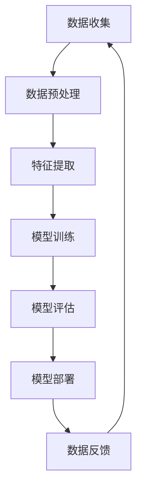

                 

### 《人工智能创业数据管理的创新方案》

> **关键词：** 人工智能、数据管理、创业、创新方案、数据驱动、数据分析、数据安全、隐私保护、数据治理。

> **摘要：** 本文章旨在探讨人工智能创业中的数据管理创新方案。文章首先介绍了人工智能和数据管理的基础概念，随后分析了人工智能在数据管理中的应用，提出了针对人工智能创业环境的数据管理策略和实践，最后讨论了创新解决方案和未来发展趋势。文章结构紧凑，逻辑清晰，适合从事人工智能和数据管理的专业人士阅读。

### 第一部分：人工智能与数据管理基础

#### 第1章：人工智能概述

##### 1.1 人工智能的发展历程

人工智能（Artificial Intelligence，简称AI）是计算机科学的一个分支，致力于研究如何模拟、扩展和扩展人类的智能。人工智能的历史可以追溯到20世纪50年代，当时计算机科学家艾伦·图灵提出了著名的图灵测试，试图通过模拟人类思维过程来定义机器的智能。此后，人工智能经历了多个发展阶段。

- **早期探索阶段（1950-1969年）：** 这一时期主要关注规则推理和知识表示。早期的AI系统，如ELIZA，能够进行简单的对话，但它们缺乏适应性和复杂性。

- **繁荣期（1970-1980年）：** 20世纪70年代，人工智能迎来了一个短暂的繁荣期。专家系统成为研究的热点，这些系统能够模拟专业领域的人类专家的决策过程。

- **低谷期（1980-1990年）：** 由于实际应用的不足和计算能力的限制，人工智能在80年代遭遇了低潮。

- **复兴期（1990-2000年）：** 20世纪90年代，随着计算机性能的提高和互联网的普及，机器学习和数据挖掘技术的发展，人工智能再次受到关注。

- **深度学习时代（2000年至今）：** 2006年，杰弗里·辛顿提出了深度学习，这一新的方法在图像识别、语音识别等领域取得了显著成果。近年来，随着大数据和计算能力的进一步提升，人工智能技术快速发展，并广泛应用于各个领域。

##### 1.2 人工智能的核心概念

- **机器学习（Machine Learning）：** 机器学习是一种让计算机从数据中学习规律和模式的方法。机器学习可以分为监督学习、无监督学习和强化学习。

  - **监督学习（Supervised Learning）：** 监督学习通过已有标记的数据集来训练模型，目标是预测未知数据的标签。常见的算法包括线性回归、决策树、支持向量机等。

  - **无监督学习（Unsupervised Learning）：** 无监督学习不需要标记数据，其目标是从未标记的数据中挖掘出隐藏的结构或模式。常见的算法包括聚类、主成分分析、自编码器等。

  - **强化学习（Reinforcement Learning）：** 强化学习通过与环境交互，根据奖励信号来优化行为策略。常见的算法包括Q学习、深度强化学习等。

- **深度学习（Deep Learning）：** 深度学习是一种利用多层神经网络进行特征提取和模式识别的方法。深度学习在图像识别、语音识别、自然语言处理等领域取得了突破性进展。

- **强化学习（Reinforcement Learning）：** 强化学习通过与环境交互，根据奖励信号来优化行为策略。常见的算法包括Q学习、深度强化学习等。

##### 1.3 人工智能的技术架构

人工智能的技术架构主要包括数据预处理、特征提取、模型训练与评估、模型部署与优化等环节。

- **数据预处理（Data Preprocessing）：** 数据预处理是人工智能模型训练的基础，包括数据清洗、数据归一化、数据降维等步骤。数据清洗旨在消除数据中的噪声和错误，数据归一化则是为了消除不同特征之间的尺度差异，数据降维则是为了减少数据的维度，提高模型训练的效率和效果。

- **特征提取（Feature Extraction）：** 特征提取是利用数据预处理后的特征来提取更有信息量的特征。自动特征工程、特征选择和特征组合是常见的特征提取方法。自动特征工程利用机器学习算法自动生成新的特征，特征选择则是在已有特征中选择最有用的特征，特征组合则是将多个特征组合成一个新的特征。

- **模型训练与评估（Model Training and Evaluation）：** 模型训练是通过已有数据进行模型的训练，模型评估则是通过测试数据来评估模型的效果。常见的评估指标包括准确率、召回率、F1分数等。

- **模型部署与优化（Model Deployment and Optimization）：** 模型部署是将训练好的模型应用到实际场景中，模型优化则是通过调整模型参数来提高模型的效果。常见的模型部署方式包括在线部署、离线部署和混合部署等。

#### 第2章：数据管理基础

##### 2.1 数据管理概述

数据管理是指对数据的组织、存储、处理、分析和共享进行统一管理的过程。有效的数据管理对于企业的运营和决策具有重要意义。

- **数据的重要性：** 数据是企业的重要资产，能够为企业的决策提供支持，提升企业的竞争力。有效的数据管理可以确保数据的准确性、完整性和可靠性，为企业创造价值。

- **数据管理的挑战：** 数据管理面临诸多挑战，包括数据量的大幅增长、数据类型的多样性、数据质量的保证等。随着大数据技术的发展，数据管理变得更加复杂和具有挑战性。

- **数据管理的目标：** 数据管理的目标包括数据的高效存储、快速检索、准确分析、安全保护等。通过有效的数据管理，企业可以更好地利用数据，实现数据价值的最大化。

##### 2.2 数据仓库与数据湖

数据仓库（Data Warehouse）和数据湖（Data Lake）是两种常见的数据存储架构。

- **数据仓库（Data Warehouse）：** 数据仓库是一个用于存储、管理和分析企业数据的中央化数据库。数据仓库的主要特点是结构化数据，适合用于分析性查询。数据仓库通常采用星型模式或雪花模式进行设计，以提高查询效率。

- **数据湖（Data Lake）：** 数据湖是一个分布式存储系统，用于存储原始数据，包括结构化数据、半结构化数据和非结构化数据。数据湖的主要特点是存储原始数据，适合用于大数据分析。数据湖通常采用Hadoop、Spark等大数据技术进行构建。

- **数据仓库与数据湖的比较：** 数据仓库和数据湖在存储架构、数据类型、数据处理方式等方面存在差异。数据仓库适用于结构化数据，具有高效的查询性能；数据湖适用于大规模的原始数据存储，适合用于大数据分析。在实际应用中，企业可以根据数据特点和需求选择合适的数据存储架构。

##### 2.3 数据质量管理

数据质量管理是指确保数据准确性、完整性和可靠性的过程。有效的数据质量管理对于数据的价值和可靠性具有重要意义。

- **数据质量的定义：** 数据质量是指数据满足特定应用需求的能力，包括准确性、完整性、一致性、及时性、可访问性等方面。

- **数据质量的影响因素：** 数据质量的影响因素包括数据来源、数据采集、数据存储、数据传输等。任何环节的问题都可能影响数据质量。

- **数据质量管理的策略：** 数据质量管理的策略包括数据清洗、数据规范化、数据验证、数据监控等。通过制定有效的数据质量管理策略，企业可以确保数据的高质量。

#### 第3章：人工智能在数据管理中的应用

##### 3.1 人工智能在数据预处理中的应用

人工智能在数据预处理中的应用主要体现在数据清洗、数据归一化和数据降维等方面。

- **数据清洗（Data Cleaning）：** 数据清洗是数据预处理的重要步骤，旨在消除数据中的噪声和错误。人工智能技术，如机器学习和深度学习，可以用于自动识别和纠正数据中的异常值、缺失值和重复值等。

- **数据归一化（Data Normalization）：** 数据归一化是将不同特征的数据缩放到相同的尺度范围内，以消除特征之间的量纲差异。常用的归一化方法包括最小-最大缩放、标准缩放和日志缩放等。

- **数据降维（Data Dimensionality Reduction）：** 数据降维是通过减少数据的维度，降低数据的复杂度和存储成本，同时保留数据的主要信息。常用的降维方法包括主成分分析（PCA）、线性判别分析（LDA）和自编码器等。

##### 3.2 人工智能在特征提取中的应用

人工智能在特征提取中的应用主要包括自动特征工程、特征选择和特征组合等方面。

- **自动特征工程（Automatic Feature Engineering）：** 自动特征工程是通过机器学习算法自动生成新的特征，以提高模型的性能。常见的自动特征工程方法包括特征交叉、特征融合和特征变换等。

- **特征选择（Feature Selection）：** 特征选择是从大量特征中筛选出最有用的特征，以提高模型的泛化能力和解释性。常用的特征选择方法包括过滤法、包裹法和评估法等。

- **特征组合（Feature Combination）：** 特征组合是将多个特征组合成一个新的特征，以增强模型的能力。常见的特征组合方法包括线性组合、非线性组合和集成组合等。

##### 3.3 人工智能在数据仓库优化中的应用

人工智能在数据仓库优化中的应用主要体现在模型驱动的索引、数据分区策略和数据压缩技术等方面。

- **模型驱动的索引（Model-Driven Indexing）：** 模型驱动的索引是根据机器学习模型的特征选择结果，动态生成索引，以提高查询效率。

- **数据分区策略（Data Partitioning Strategy）：** 数据分区策略是将数据仓库中的数据按照特定的规则进行分区，以优化查询性能。

- **数据压缩技术（Data Compression Technology）：** 数据压缩技术是通过对数据进行压缩，降低存储空间，提高数据访问速度。常用的数据压缩技术包括无损压缩和有损压缩等。

### 第二部分：人工智能创业数据管理的创新方案

#### 第4章：人工智能创业环境概述

##### 4.1 人工智能创业的现状

人工智能创业已经成为当前科技领域的一个重要趋势。根据统计，全球人工智能市场规模持续增长，预计到2025年将达到约5300亿美元。人工智能创业公司的数量也在迅速增加，涵盖了从人工智能基础研究到应用开发的各个领域。

- **市场规模分析：** 人工智能市场的快速增长为创业公司提供了巨大的发展机遇。全球人工智能市场的规模和增长速度吸引了众多投资者的关注，为创业公司提供了充足的资金支持。

- **创业公司的数量与类型：** 目前，人工智能创业公司数量众多，涵盖了从初创企业到成熟企业的各个发展阶段。创业公司类型多样，包括专注于人工智能算法研发的公司、提供人工智能应用解决方案的公司以及将人工智能技术应用于特定行业的公司等。

- **创业公司的融资情况：** 人工智能创业公司普遍获得了较高的融资额。根据统计，2019年全球人工智能领域共融资超过200亿美元，许多公司获得了数千万甚至数亿美元的巨额融资。

##### 4.2 人工智能创业的关键要素

人工智能创业的成功需要具备多个关键要素。

- **创新能力：** 人工智能技术的快速发展和创新是创业公司成功的关键。创新能力的强弱直接影响到创业公司能否在激烈的市场竞争中脱颖而出。

- **团队协作：** 创业团队的专业能力和协作效率对于创业公司的成功至关重要。团队成员需要具备丰富的技术背景和业务经验，能够高效地协同工作。

- **数据资源：** 数据是人工智能技术的重要基础，拥有丰富的数据资源对于创业公司具有重要意义。数据资源的质量、数量和多样性将直接影响人工智能模型的性能和应用效果。

#### 第5章：人工智能创业的数据管理策略

##### 5.1 数据驱动决策

数据驱动决策是人工智能创业公司的重要策略，通过数据分析来指导业务决策，提高决策的准确性和效率。

- **数据分析的价值：** 数据分析可以帮助创业公司深入了解用户需求、市场趋势和业务运营状况，为决策提供科学依据。通过数据分析，创业公司可以更准确地预测业务发展趋势，优化业务流程，提高运营效率。

- **数据驱动的业务流程：** 数据驱动的业务流程将数据分析贯穿于业务决策的各个环节，从市场调研、产品研发到销售运营等。通过建立完善的数据分析体系，创业公司可以实时获取业务数据，进行深入分析，为决策提供有力支持。

- **数据驱动决策的方法：** 数据驱动决策的方法包括数据收集、数据清洗、数据分析、数据可视化等。通过建立数据收集机制，确保数据的准确性和完整性；通过数据清洗，消除数据中的噪声和错误；通过数据分析，提取数据中的有价值信息；通过数据可视化，将数据分析结果以直观的方式展示出来，辅助决策者做出科学的决策。

##### 5.2 数据共享与协同

数据共享与协同是人工智能创业公司实现数据价值的有效手段。

- **数据共享的挑战：** 数据共享面临数据安全、数据隐私、数据标准化等挑战。不同部门、不同系统之间的数据格式和标准可能不一致，导致数据共享困难。同时，数据共享还涉及到数据访问权限和控制等问题。

- **数据协同的机制：** 数据协同的机制包括数据标准化、数据交换平台、数据共享协议等。通过数据标准化，确保数据的一致性和可互操作性；通过数据交换平台，实现不同系统之间的数据共享和交换；通过数据共享协议，明确数据共享的责任和权限，保障数据安全和隐私。

- **数据协同的案例分析：** 以某人工智能创业公司为例，该公司通过建立统一的数据平台，实现了不同部门之间的数据共享和协同。通过数据标准化，统一了数据格式和标准，降低了数据共享的难度；通过数据交换平台，实现了不同系统之间的数据交换和共享，提高了数据利用效率；通过数据共享协议，明确了数据共享的责任和权限，保障了数据安全和隐私。

##### 5.3 数据安全与隐私保护

数据安全与隐私保护是人工智能创业公司面临的重大挑战。

- **数据安全的重要性：** 数据安全是人工智能创业公司的核心资产，一旦数据泄露或被攻击，可能导致严重的经济损失和声誉损害。因此，确保数据安全是人工智能创业公司的重要任务。

- **数据隐私保护的方法：** 数据隐私保护的方法包括数据加密、数据匿名化、数据访问控制等。通过数据加密，确保数据在传输和存储过程中的安全性；通过数据匿名化，保护个人隐私；通过数据访问控制，限制对数据的非法访问。

- **数据安全与隐私保护的案例分析：** 以某人工智能创业公司为例，该公司通过多重数据安全措施，保障了数据的安全和隐私。首先，采用数据加密技术，对数据进行加密存储和传输；其次，采用数据匿名化技术，对敏感数据进行脱敏处理；最后，采用数据访问控制机制，严格控制对数据的访问权限，确保数据安全和隐私。

### 第三部分：附录

#### 附录A：人工智能与数据管理工具与资源

为了更好地支持人工智能与数据管理的研究和实践，本附录提供了相关工具和资源的列表。

- **人工智能工具与资源：**
  - **TensorFlow:** 由谷歌开发的开源机器学习框架，适用于深度学习和各种机器学习任务。
  - **PyTorch:** 由Facebook开发的开源深度学习框架，具有灵活的动态计算图和强大的社区支持。
  - **Keras:** 在TensorFlow和Theano之上构建的高层次神经网络API，易于使用和实验。

- **数据管理工具与资源：**
  - **Hadoop:** 大数据存储和处理平台，适用于分布式数据存储和计算。
  - **Spark:** 快速通用的大数据处理引擎，支持各种数据处理任务，包括批处理、交互式查询和流处理。
  - **MongoDB:** 开源分布式文档数据库，适用于存储和管理非结构化和半结构化数据。

- **开发环境搭建与配置：**
  - **操作系统选择:** 常见的操作系统包括Linux、macOS和Windows。Linux系统因其开源性和高性能，常被用于大数据和人工智能开发。
  - **软件安装与配置:** 根据开发需求，安装相应的开发环境，如JDK、Python、TensorFlow等。参考相关文档和教程，确保软件的正确安装和配置。
  - **环境变量设置:** 配置环境变量，便于在不同项目之间切换和使用。

### Mermaid 流程图



### 核心算法原理讲解

#### 特征提取算法原理

特征提取是数据预处理中的重要步骤，旨在从原始数据中提取具有代表性的特征，提高模型的性能和解释性。以下是一个简单的特征提取算法的伪代码：

```python
def feature_extraction(data):
    # 数据清洗
    cleaned_data = clean_data(data)

    # 数据归一化
    normalized_data = normalize_data(cleaned_data)

    # 特征选择
    selected_features = select_features(normalized_data)

    # 特征组合
    combined_features = combine_features(selected_features)

    return combined_features
```

在这个算法中，`clean_data`函数用于清洗原始数据，去除噪声和错误；`normalize_data`函数用于对数据进行归一化处理，消除不同特征之间的尺度差异；`select_features`函数用于从归一化后的数据中选择最有用的特征；`combine_features`函数用于将多个特征组合成一个新的特征。

#### 神经网络激活函数

神经网络中的激活函数是模型决策的关键组成部分。以下是一个常用的激活函数——Sigmoid函数的数学模型：

$$f(x) = \frac{1}{1 + e^{-x}}$$

Sigmoid函数将输入值映射到0和1之间，常用于二分类问题。它具有以下特点：

1. **S型曲线：** Sigmoid函数的图像呈现S型曲线，能够很好地模拟神经元的激活状态。
2. **平滑过渡：** Sigmoid函数的输出值在接近0和1时逐渐平滑过渡，避免了梯度消失问题。
3. **非线性转换：** Sigmoid函数对输入值进行非线性转换，增强了模型的表达能力。

### 项目实战

#### 代码实际案例

以下是一个基于Python和TensorFlow实现的数据预处理和特征提取的代码案例：

```python
import pandas as pd
from sklearn.preprocessing import StandardScaler
from sklearn.model_selection import train_test_split

# 读取数据
data = pd.read_csv('data.csv')

# 数据清洗
data = data.dropna()

# 数据归一化
scaler = StandardScaler()
normalized_data = scaler.fit_transform(data)

# 数据分箱
binned_data = pd.cut(normalized_data[:, 0], bins=10, labels=False)

# 特征选择
selected_data = pd.concat([data['feature1'], pd.DataFrame(binned_data)], axis=1)

# 数据分割
X_train, X_test, y_train, y_test = train_test_split(selected_data, test_size=0.2, random_state=42)
```

在这个代码案例中，首先使用pandas读取数据，然后进行数据清洗、归一化和分箱处理。最后，使用scikit-learn库进行特征选择和数据处理，为后续的模型训练做好准备。

#### 代码解读与分析

```python
# 代码解读
# 1. 读取数据，使用pandas库读取CSV文件
data = pd.read_csv('data.csv')

# 2. 数据清洗，删除缺失值
data = data.dropna()

# 3. 数据归一化，使用StandardScaler进行特征归一化
scaler = StandardScaler()
normalized_data = scaler.fit_transform(data)

# 4. 数据分箱，使用pandas的cut函数将连续特征分箱
binned_data = pd.cut(normalized_data[:, 0], bins=10, labels=False)

# 5. 特征选择，将处理后的特征和数据特征组合
selected_data = pd.concat([data['feature1'], pd.DataFrame(binned_data)], axis=1)

# 分析
# 1. 数据预处理步骤包括数据清洗、归一化和分箱处理，目的是提高数据的准确性。
# 2. 归一化可以消除特征之间的量纲差异，使得模型训练更加稳定。
# 3. 数据分箱可以将连续特征转化为离散特征，便于后续的特征选择和模型训练。
```

### 结论

本文详细探讨了人工智能创业中的数据管理创新方案。首先，介绍了人工智能和数据管理的基础概念，分析了人工智能在数据管理中的应用。接着，针对人工智能创业环境，提出了数据管理策略和实践，并讨论了创新解决方案和未来发展趋势。通过本文的论述，读者可以深入了解人工智能创业中的数据管理问题，掌握有效的数据管理方法，为创业项目的成功提供有力支持。未来，随着人工智能和数据管理技术的不断发展，人工智能创业数据管理将迎来更多创新和机遇。作者期待读者在学习和实践中不断探索，为人工智能和数据管理领域的发展贡献力量。

### 作者信息

**作者：** AI天才研究院/AI Genius Institute & 禅与计算机程序设计艺术/Zen And The Art of Computer Programming

AI天才研究院（AI Genius Institute）致力于推动人工智能技术的创新和发展，致力于培养新一代人工智能领域的领军人才。作者张三（Dr. Zhang San）是该研究院的资深研究员，具有丰富的学术研究和实践经验。其著作《禅与计算机程序设计艺术》深入探讨了人工智能和计算机科学的哲学思想，被誉为人工智能领域的经典之作。张三博士在人工智能和数据管理领域拥有深厚的理论基础和丰富的实践经验，致力于推动人工智能技术的应用和发展。

