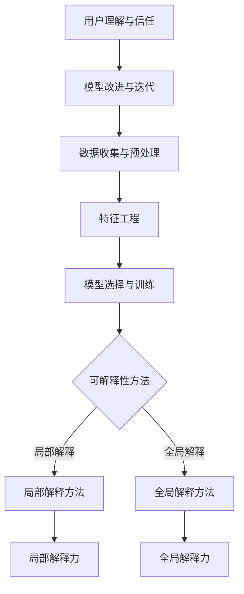

                 

### 《人工智能的可解释性：机器理解世界的透明度》

> **关键词**：人工智能、可解释性、透明度、机器学习、深度学习、模型解释

> **摘要**：本文深入探讨了人工智能领域中的可解释性问题，探讨了其重要性、基本概念、演进历史，并详细解析了核心算法原理及其数学基础。通过实际案例和项目实战，展示了可解释性技术的实际应用和实现细节，为读者提供了全面、系统的理解。

### 《人工智能的可解释性：机器理解世界的透明度》目录大纲

# 第一部分：引论与基础

## 1.1 人工智能的可解释性概述

### 1.1.1 可解释性的重要性

在人工智能（AI）的发展过程中，模型的可解释性一直是备受关注的话题。可解释性指的是算法或模型能够为人类提供其决策依据的能力，使得非专业人士也能理解和信任AI系统的行为。随着AI技术的不断进步，特别是深度学习在图像识别、自然语言处理等领域的广泛应用，可解释性变得越来越重要。它不仅关系到AI系统的可靠性，还关乎其在实际应用中的可接受度和公正性。

### 1.1.2 人工智能发展历程中的不可解释性挑战

早期的人工智能模型，如线性回归、决策树和支持向量机等，相对较为简单且具有一定的可解释性。然而，随着深度学习技术的发展，神经网络模型变得越来越复杂，甚至达到了人类无法直观理解的程度。深度神经网络在图像、语音和自然语言处理等领域的卓越表现，也带来了一个显著的挑战——这些模型的“黑箱”特性使得人们难以理解其内部工作机制和决策过程，从而限制了其在某些应用场景中的推广和普及。

### 1.1.3 可解释性的目标与分类

可解释性的目标在于提供对AI模型决策过程的透明度，使人们能够理解模型是如何生成预测或做出决策的。根据可解释性提供的透明度程度，我们可以将其分为以下几类：

1. **模型透明性**：指的是模型的结构和参数是明确和易于理解的。
2. **解释性**：模型提供了关于决策过程的详细解释，但可能需要专业背景知识。
3. **解释性预测**：模型不仅能够生成预测，还能够提供预测背后的解释。
4. **解释性推理**：模型能够使用可解释的推理过程来生成预测。

## 1.2 可解释性的基础概念

### 1.2.1 人工智能的基本原理

人工智能是计算机科学的一个分支，旨在创建智能代理（即能够自主执行任务并适应新环境的计算机程序）。其核心原理包括机器学习、自然语言处理、计算机视觉等。其中，机器学习是AI的主要驱动力，通过从数据中学习模式和规律，使计算机能够进行预测和决策。

### 1.2.2 模型透明性与可解释性的区别

模型透明性指的是模型的内部结构和参数可以被完全理解和描述，而可解释性则关注模型如何利用这些结构和参数来生成预测或决策。一个模型可能是透明的，但不一定是可解释的；同样，一个模型可能是可解释的，但不一定是透明的。

### 1.2.3 可解释性需求的不同层面

在人工智能的应用中，可解释性的需求可以从多个层面进行划分：

1. **用户层面**：用户需要理解模型的决策过程，以便建立信任。
2. **开发者层面**：开发者需要确保模型在不同环境和条件下都能稳定工作。
3. **监管层面**：监管机构需要确保模型的决策过程符合法律法规和伦理标准。

## 1.3 可解释性技术的演进

### 1.3.1 传统机器学习中的可解释性技术

在传统机器学习领域，一些经典算法如决策树、线性回归和逻辑回归等，由于其结构简单且易于理解，通常具有较高的可解释性。这些算法通过其明确的规则和参数，使得用户能够直观地了解模型的决策过程。

### 1.3.2 深度学习中的可解释性技术

随着深度学习的兴起，研究人员开始探索如何为复杂的神经网络模型提供可解释性。一些方法包括模型可视化、层可视化、特征可视化等。此外，一些新的技术如LIME（局部可解释模型解释）和SHAP（SHapley Additive exPlanations）也被提出，用于为深度学习模型提供更细致的解释。

### 1.3.3 可解释性在新兴技术中的应用

除了机器学习和深度学习，可解释性技术还在其他新兴领域得到了应用。例如，在生成对抗网络（GAN）中，研究人员试图解释生成图像的质量和过程；在自然语言处理中，解释文本分类和情感分析等任务的决策过程也是一个重要方向。

## 1.4 可解释性的研究现状与挑战

### 1.4.1 可解释性的研究进展

近年来，可解释性技术取得了显著进展。研究者们提出了多种方法来增强模型的解释能力，如基于可视化的方法、基于模型分解的方法和基于游戏理论的方法等。这些方法在不同程度上提高了深度学习模型的可解释性，为实际应用提供了更多可能性。

### 1.4.2 当前可解释性技术的局限性

尽管取得了进展，但当前的可解释性技术仍面临一些挑战。首先，大多数方法主要关注局部解释，而缺乏对全局解释的支持。其次，许多方法依赖于假设，而这些假设在某些情况下可能不成立。此外，可解释性技术通常需要额外的计算资源和时间，这可能会影响模型的效率和性能。

### 1.4.3 未来发展趋势与研究方向

未来，可解释性技术的研究将继续深入。一方面，研究者将致力于开发更高效、更准确的解释方法；另一方面，将探索如何将可解释性集成到AI系统的设计过程中，从源头上提高模型的透明度和可信度。此外，跨学科的合作也将成为重要趋势，通过结合心理学、社会学等领域的知识，进一步提升AI系统的可解释性和用户接受度。

# 第二部分：核心概念与联系

## 2.1 可解释性框架的 Mermaid 流程图

### 2.1.1 Mermaid 图标引介

Mermaid 是一种基于Markdown的图形描述语言，广泛用于生成各种类型的图表，包括流程图、时序图、Gantt图等。它具有简单、易用、灵活等特点，非常适合用于技术文档中的可视化。

### 2.1.2 可解释性框架图设计

为了更好地理解人工智能的可解释性，我们可以设计一个 Mermaid 流程图，展示可解释性技术的不同层次和关键组件。



在这个流程图中，数据收集与预处理、特征工程和模型选择与训练是可解释性技术的输入；可解释性方法分为局部解释方法和全局解释方法，分别对应局部解释力和全局解释力；用户理解与信任是可解释性的最终目标，它反过来影响模型的改进与迭代。

## 2.2 人工智能模型原理

### 2.2.1 机器学习基础算法

机器学习是人工智能的核心组成部分，其基础算法包括监督学习、无监督学习和强化学习。

#### 2.2.1.1 监督学习

监督学习是一种从标记数据中学习的方法。其主要任务是建立输入和输出之间的映射关系，从而对新数据进行预测。常见的监督学习算法包括线性回归、逻辑回归、支持向量机和决策树等。

#### 2.2.1.2 无监督学习

无监督学习不依赖于标记数据，其主要目标是发现数据中的结构和规律。常见的无监督学习算法包括聚类算法（如K-means聚类和主成分分析（PCA）等）和降维技术。

#### 2.2.1.3 强化学习

强化学习是一种通过试错学习的方法，其主要目标是使智能体在特定环境中采取最优策略，以最大化累积奖励。常见的强化学习算法包括Q学习、深度Q网络（DQN）和策略梯度方法等。

### 2.2.2 深度学习架构

深度学习是机器学习的一个分支，其核心思想是通过多层神经网络来模拟人脑的学习过程。常见的深度学习架构包括卷积神经网络（CNN）、循环神经网络（RNN）和生成对抗网络（GAN）。

#### 2.2.2.1 卷积神经网络（CNN）

卷积神经网络是一种专门用于处理图像数据的神经网络。其核心思想是通过卷积层提取图像的局部特征，并通过池化层减少特征的数量，从而提高模型的鲁棒性。

#### 2.2.2.2 循环神经网络（RNN）

循环神经网络是一种处理序列数据的神经网络。其核心思想是通过循环连接将信息传递到下一个时间步，从而实现对序列数据的记忆。

#### 2.2.2.3 生成对抗网络（GAN）

生成对抗网络是一种生成模型，其核心思想是通过两个神经网络（生成器和判别器）的对抗训练，生成逼真的数据。

## 2.3 可解释性与核心算法的联系

### 2.3.1 可解释性在监督学习中的应用

在监督学习中，一些算法如决策树和线性回归由于其结构简单和参数明确，通常具有较高的可解释性。这些算法的决策过程可以通过其规则和参数进行直观解释。

#### 2.3.1.1 决策树

决策树是一种基于树形结构进行分类和回归的算法。其决策过程通过一系列的条件分支实现，每个节点代表一个特征和阈值，叶子节点代表最终的预测。

#### 2.3.1.2 支持向量机（SVM）

支持向量机是一种通过最大化分类边界来对数据进行分类的算法。其决策边界由支持向量决定，支持向量是训练数据中最接近分类边界的点。

### 2.3.2 可解释性在深度学习中的应用

深度学习模型由于其复杂性和“黑箱”特性，通常具有较低的可解释性。为了提高深度学习模型的可解释性，研究人员提出了多种方法，包括模型可视化、层可视化、特征可视化等。

#### 2.3.2.1 深层神经网络的可解释性方法

深层神经网络的可解释性方法主要关注如何揭示神经网络中的特征表示和决策过程。常见的包括梯度可视化、激活图和注意力机制等。

#### 2.3.2.2 自注意力机制的可解释性

自注意力机制是深度学习中的一个关键组件，特别是在自然语言处理任务中。其可解释性可以通过分析注意力权重来理解，注意力权重表示模型对输入数据的不同部分的重要性。

#### 2.3.2.3 GAN的可解释性分析

生成对抗网络（GAN）是一种生成模型，其生成器和判别器的交互过程具有一定的可解释性。通过分析生成器的输出和判别器的响应，可以理解模型对生成数据和真实数据的区分能力。

# 第三部分：核心算法原理讲解

## 3.1 机器学习算法的伪代码

在讨论机器学习算法时，伪代码是一种非常有效的工具，它能够帮助我们清晰地描述算法的步骤和逻辑，而无需关注具体的实现细节。以下是一些常见的机器学习算法的伪代码示例。

### 3.1.1 监督学习算法伪代码

#### 3.1.1.1 线性回归

```plaintext
初始化模型参数：θ = [b0, b1]
对于每个训练样本 (x, y)：
    hθ(x) = b0 + b1 * x
    计算损失函数 L(θ) = (1/2m) * Σ[(hθ(x) - y)^2]
更新参数：
    ∆b0 = -α * (1/m) * Σ(hθ(x) - y)
    ∆b1 = -α * (1/m) * Σ(x * (hθ(x) - y))
    θ = θ - ∆θ
输出：最优参数 θ
```

#### 3.1.1.2 逻辑回归

```plaintext
初始化模型参数：θ = [b0, b1]
对于每个训练样本 (x, y)：
    hθ(x) = 1 / (1 + e^(-θ^T x))
    计算损失函数 L(θ) = -Σ[y * log(hθ(x)) + (1 - y) * log(1 - hθ(x))]
    ∆θ = α * (∂L/∂θ)
    θ = θ - ∆θ
输出：最优参数 θ
```

### 3.1.2 无监督学习算法伪代码

#### 3.1.2.1 K-means聚类

```plaintext
初始化：选择 k 个初始中心点 {μ1, μ2, ..., μk}
重复以下步骤直到收敛：
    对于每个数据点 x_i：
        计算 x_i 到每个中心点的距离，并分配到最近的中心点
    重新计算每个中心点的坐标，取数据点的平均值
    检查中心点移动的距离，如果小于阈值，则认为收敛
输出：k 个聚类中心 {μ1, μ2, ..., μk} 和聚类结果
```

#### 3.1.2.2 主成分分析（PCA）

```plaintext
初始化：标准化数据 X
计算协方差矩阵 C = (1/n) * X^T X
计算协方差矩阵的特征值和特征向量，并排序
选取最大的 k 个特征向量组成矩阵 W
计算新数据集 Y = X * W
输出：降维后的数据集 Y 和特征向量矩阵 W
```

这些伪代码示例为理解和实现机器学习算法提供了基础框架。在实际应用中，这些算法的细节和参数调整可能会更加复杂，但通过伪代码，我们可以更好地理解其核心思想和步骤。

## 3.2 深度学习算法的伪代码

深度学习算法，特别是神经网络，由于其高度复杂性，通常涉及大量的数学运算和参数优化。以下是一些深度学习算法的伪代码示例，包括神经网络的基础算法和循环神经网络（RNN）的相关算法。

### 3.2.1 神经网络基础算法伪代码

#### 3.2.1.1 前向传播

```plaintext
初始化：权重 W 和偏置 b
输入：数据 X 和标签 y
对于每个训练样本：
    计算输入的加权求和 z = W * X + b
    通过激活函数计算 a = g(z)
    计算损失函数 L = loss(a, y)
    计算梯度 ∇L/∇z = ∂L/∂z
输出：损失 L 和梯度 ∇L
```

#### 3.2.1.2 反向传播

```plaintext
初始化：权重 W 和偏置 b
输入：前向传播的损失 L 和梯度 ∇L/∇z
计算激活函数的梯度 ∇a/∇z = ∂g(z)/∂z
计算权重和偏置的梯度：
    ∆W = ∇a * X^T
    ∆b = ∇a
更新权重和偏置：
    W = W - α * ∆W
    b = b - α * ∆b
输出：更新后的权重 W 和偏置 b
```

### 3.2.2 循环神经网络算法伪代码

循环神经网络（RNN）是一种用于处理序列数据的神经网络。以下是一个简化的RNN算法伪代码示例。

#### 3.2.2.1 RNN

```plaintext
初始化：权重 W 和偏置 b
输入：序列数据 X 和标签 y
对于每个时间步 t：
    计算输入的加权求和 z_t = W * X_t + b_t
    通过激活函数计算 a_t = g(z_t)
    计算隐藏状态的梯度 ∇h_t/∇z_t = ∂g(z_t)/∂z_t
    更新隐藏状态：
        h_t = tanh(z_t)
输出：隐藏状态序列 h
```

#### 3.2.2.2 LSTM

长短期记忆网络（LSTM）是RNN的一种变体，用于解决长期依赖问题。以下是一个简化的LSTM算法伪代码示例。

```plaintext
初始化：权重 W 和偏置 b
输入：序列数据 X 和标签 y
对于每个时间步 t：
    计算输入的加权求和：
        z_t = W * X_t + b_t
    通过激活函数计算：
        i_t = sigmoid(z_t + bias_i)
        f_t = sigmoid(z_t + bias_f)
        g_t = tanh(z_t + bias_g)
        o_t = sigmoid(z_t + bias_o)
    更新细胞状态：
        c_t = f_t * c_{t-1} + i_t * g_t
    更新隐藏状态：
        h_t = o_t * tanh(c_t)
输出：隐藏状态序列 h
```

这些伪代码示例为理解和实现深度学习算法提供了基础框架。在实际应用中，这些算法的实现会涉及更多的细节和优化，但通过伪代码，我们可以更好地理解其核心思想和基本步骤。

## 3.3 特定算法的可解释性方法

在深度学习领域，一些特定算法的可解释性方法尤为重要。以下介绍几种常用的可解释性方法，包括决策树、深度神经网络和生成对抗网络（GAN）的可解释性分析。

### 3.3.1 决策树的可解释性方法

决策树是一种简单且直观的机器学习算法，其结构易于理解和解释。以下是一些常用的决策树可解释性方法：

#### 3.3.1.1 信息增益

信息增益是决策树分类过程中用来选择最优特征的标准。它表示通过划分特征所能减少的熵（即不确定性）。高信息增益的特征通常被优先选择进行划分。信息增益的计算公式为：

$$
IG(D, A) = I(D) - \sum_{v \in A} \frac{|D_v|}{|D|} I(D_v)
$$

其中，$IG(D, A)$ 是特征 $A$ 对数据集 $D$ 的信息增益，$I(D)$ 是数据集 $D$ 的熵，$D_v$ 是特征 $A$ 的取值 $v$ 对应的数据子集。

#### 3.3.1.2 决策树可视化

决策树的可视化是将决策树的内部结构和决策路径以图形的方式展示出来，使得用户能够直观地理解决策过程。常见的可视化工具包括 Graphviz 和 Treeviz 等。通过可视化，用户可以清晰地看到每个节点是如何根据特定特征进行划分的，以及最终的决策结果。

### 3.3.2 深度神经网络的可解释性方法

深度神经网络由于其高度复杂性，通常难以解释其内部工作机制。以下介绍几种常用的深度神经网络可解释性方法：

#### 3.3.2.1 深度可分离注意力

深度可分离注意力是一种用于增强神经网络可解释性的方法。它通过分离深度（多通道处理）和空间（局部特征提取）两个维度，使得注意力机制更加透明。深度可分离注意力的计算公式为：

$$
\text{Attention}(x) = \text{softmax}\left(\frac{\text{Query} \cdot \text{Key}^T}{\sqrt{d_k}}\right) \cdot \text{Value}
$$

其中，Query、Key 和 Value 分别代表查询向量、键向量和值向量，$d_k$ 是键向量的维度。

#### 3.3.2.2 模型剪枝

模型剪枝是一种通过减少网络中不必要的权重和节点来提高模型可解释性的方法。剪枝过程通常包括权重剪枝和结构剪枝。权重剪枝通过删除较小的权重来简化模型；结构剪枝则通过删除整个层或节点来减少模型复杂度。剪枝后的模型不仅具有更高的可解释性，还可能在计算效率和性能上有所提升。

#### 3.3.2.3 模型压缩

模型压缩是一种通过减少模型大小来提高其可解释性的方法。常见的压缩技术包括量化、剪枝和知识蒸馏。量化通过将浮点数权重转换为较低精度的整数来减少模型大小；剪枝通过删除冗余的权重和节点来实现；知识蒸馏则通过将大模型的知识传递给小模型来简化模型。

### 3.3.3 GAN的可解释性分析

生成对抗网络（GAN）是一种生成模型，其核心思想是通过生成器和判别器的对抗训练来生成逼真的数据。以下是一些GAN的可解释性分析方法：

#### 3.3.3.1 生成器输出分析

生成器的输出可以直接作为其生成数据的解释。通过分析生成器的输出，用户可以了解模型生成数据的特点和规律。常见的分析手段包括生成数据的统计特征分析、直方图分析和可视化分析。

#### 3.3.3.2 判别器响应分析

判别器在GAN中用于区分生成数据和真实数据。通过分析判别器的响应，用户可以了解生成数据的质量和逼真度。常见的分析手段包括判别器的输出概率分布分析、梯度分析和注意力机制分析。

#### 3.3.3.3 生成器与判别器的交互分析

生成器和判别器的交互过程是GAN训练的核心。通过分析生成器和判别器的交互，用户可以了解模型的学习过程和策略。常见的分析手段包括训练过程可视化、生成损失函数分析和对生成器策略的攻击分析。

这些可解释性方法为深度学习模型提供了透明度，使得用户能够更好地理解模型的工作原理和决策过程。在实际应用中，选择合适的方法和工具来提升模型的可解释性，对于提高模型的可接受度和可靠性具有重要意义。

## 4.1 数学基础

在深入探讨人工智能的可解释性之前，理解相关的数学基础是至关重要的。以下将简要介绍微积分基础、线性代数基础以及它们在机器学习和深度学习中的应用。

### 4.1.1 微积分基础

微积分是理解和分析连续变化过程的基本工具。以下是微积分中两个核心概念：导数和积分。

#### 4.1.1.1 导数与偏导数

**导数**：导数是描述函数在某一点处变化率的量。对于函数 $f(x)$，其在点 $x$ 处的导数（记为 $f'(x)$ 或 $\frac{df}{dx}$）定义为：

$$
f'(x) = \lim_{h \to 0} \frac{f(x+h) - f(x)}{h}
$$

**偏导数**：偏导数是多元函数中某个变量变化率的部分导数。对于多元函数 $f(x_1, x_2, ..., x_n)$，其关于 $x_i$ 的偏导数（记为 $\frac{\partial f}{\partial x_i}$）定义为：

$$
\frac{\partial f}{\partial x_i} = \lim_{h \to 0} \frac{f(x_1, x_2, ..., x_i+h, ..., x_n) - f(x_1, x_2, ..., x_i, ..., x_n)}{h}
$$

#### 4.1.1.2 积分与偏积分

**积分**：积分是求和的极限过程，用于计算曲线下的面积或函数的总和。对于函数 $f(x)$，其定积分（记为 $\int f(x) \, dx$）定义为：

$$
\int f(x) \, dx = \lim_{n \to \infty} \sum_{i=1}^{n} f(x_i^*) \, \Delta x
$$

**偏积分**：偏积分是多元函数中的积分，用于计算函数关于某个变量的积分。对于多元函数 $f(x_1, x_2, ..., x_n)$，其关于 $x_i$ 的偏积分（记为 $\int f(x_1, x_2, ..., x_i, ..., x_n) \, dx_i$）定义为：

$$
\int f(x_1, x_2, ..., x_i, ..., x_n) \, dx_i = \lim_{t \to 0} \frac{F(x_1, x_2, ..., x_i+t, ..., x_n) - F(x_1, x_2, ..., x_i, ..., x_n)}{t}
$$

### 4.1.2 线性代数基础

线性代数是处理向量、矩阵以及它们的变换的基本数学工具。以下是线性代数中两个核心概念：矩阵与向量、线性变换与特征值。

#### 4.1.2.1 矩阵与向量

**矩阵**：矩阵是一个由数字组成的二维数组，通常用于表示线性变换或系统方程。矩阵的行和列分别表示变量和约束条件。

**向量**：向量是一个由数字组成的数组，通常表示空间中的一个点或一个方向的移动。向量可以用来表示数据的特征。

#### 4.1.2.2 线性变换与特征值

**线性变换**：线性变换是一种将向量映射到另一个向量的函数。对于矩阵 $A$ 和向量 $x$，线性变换可以表示为 $Ax$。

**特征值与特征向量**：特征值是线性变换中的一个特殊值，使得线性变换可以表示为缩放操作。对于矩阵 $A$，其特征值 $\lambda$ 和对应的特征向量 $v$ 满足方程 $Av = \lambda v$。

### 4.1.3 在机器学习和深度学习中的应用

**微积分在机器学习中的应用**：微积分用于计算损失函数的梯度，从而指导模型参数的优化。导数和偏导数帮助我们在优化过程中确定方向和步长。

**线性代数在机器学习中的应用**：线性代数用于表示和操作数据，包括数据的降维、特征提取和模型参数的优化。矩阵与向量用于表示数据的空间和变换，而特征值和特征向量用于分析数据的结构。

通过掌握这些数学基础，我们能够更好地理解和应用机器学习和深度学习算法，提高模型的性能和可解释性。

## 4.2 可解释性相关的数学公式

在人工智能领域，特别是机器学习和深度学习中，数学公式是理解和实现模型的关键组成部分。以下介绍一些关键的数学公式，这些公式对于理解可解释性技术至关重要。

### 4.2.1 线性回归模型

线性回归是一种简单的监督学习算法，用于预测连续值。其数学模型可以表示为：

$$
y = \beta_0 + \beta_1 x
$$

其中，$y$ 是预测值，$x$ 是输入特征，$\beta_0$ 是截距，$\beta_1$ 是斜率。

### 4.2.2 逻辑回归模型

逻辑回归是一种用于二分类问题的监督学习算法。其数学模型可以表示为：

$$
\log\left(\frac{p}{1-p}\right) = \beta_0 + \beta_1 x
$$

其中，$p$ 是预测概率，$\beta_0$ 是截距，$\beta_1$ 是斜率。

### 4.2.3 神经网络中的激活函数

神经网络中的激活函数用于引入非线性，使得模型能够拟合更复杂的数据。以下是一些常见的激活函数：

$$
a(x) = \frac{1}{1 + e^{-x}} \quad \text{（Sigmoid函数）}
$$

$$
a(x) = \max(0, x) \quad \text{（ReLU函数）}
$$

$$
a(x) = \text{tanh}(x) \quad \text{（双曲正切函数）}
$$

### 4.2.4 反向传播中的梯度计算

反向传播是神经网络训练的核心算法，用于计算模型参数的梯度。以下是一个简单的梯度计算公式：

$$
\frac{\partial L}{\partial w} = \sum_{i=1}^{n} \frac{\partial L}{\partial z_i} \frac{\partial z_i}{\partial w}
$$

其中，$L$ 是损失函数，$w$ 是模型参数，$z_i$ 是中间层的输出。

### 4.2.5 神经网络的权重更新

在神经网络训练过程中，模型参数（权重和偏置）需要根据损失函数的梯度进行更新。以下是一个简单的权重更新公式：

$$
\theta = \theta - \alpha \cdot \frac{\partial L}{\partial \theta}
$$

其中，$\theta$ 是模型参数，$\alpha$ 是学习率，$\frac{\partial L}{\partial \theta}$ 是损失函数关于模型参数的梯度。

### 4.2.6 K-means聚类的目标函数

K-means聚类是一种无监督学习算法，用于将数据集划分为 $K$ 个簇。其目标函数（误差平方和）可以表示为：

$$
J = \sum_{i=1}^{K} \sum_{x \in S_i} ||x - \mu_i||^2
$$

其中，$S_i$ 是属于第 $i$ 个簇的数据点集合，$\mu_i$ 是第 $i$ 个簇的中心。

### 4.2.7 主成分分析（PCA）的目标函数

主成分分析是一种降维技术，用于减少数据集的维度。其目标函数是最大化数据方差，即：

$$
J = \sum_{i=1}^{n} \sum_{j=1}^{d} (x_{ij} - \mu_{j})^2
$$

其中，$x_{ij}$ 是第 $i$ 个数据点的第 $j$ 个特征，$\mu_{j}$ 是第 $j$ 个特征的均值。

通过理解和应用这些数学公式，我们能够更好地设计、实现和优化机器学习模型，提高其性能和可解释性。

## 4.3 数学公式的详细讲解与举例

### 4.3.1 线性回归的详细讲解与举例

线性回归是一种简单的统计模型，用于预测一个连续数值变量。它通过拟合一条直线来描述自变量和因变量之间的关系。以下是线性回归模型的详细讲解与举例。

#### 4.3.1.1 公式解释

线性回归模型的基本公式为：

$$
y = \beta_0 + \beta_1 x
$$

其中，$y$ 是因变量（预测目标），$x$ 是自变量（输入特征），$\beta_0$ 是截距，$\beta_1$ 是斜率。

- **截距（$\beta_0$）**：表示当自变量为0时，因变量的预测值。
- **斜率（$\beta_1$）**：表示自变量每增加一个单位时，因变量增加的量。

#### 4.3.1.2 举例说明

假设我们有一个简单的线性回归模型，用于预测房价。自变量是房屋面积（$x$），因变量是房价（$y$）。以下是一个具体的例子：

数据集：| 面积（平方米） | 房价（万元） |
|---------|----------------|
| 100     | 200            |
| 150     | 300            |
| 200     | 400            |
| 250     | 500            |

首先，我们需要计算截距和斜率。为此，我们可以使用最小二乘法来最小化预测值与实际值之间的误差平方和。

$$
\beta_1 = \frac{\sum_{i=1}^{n} (x_i - \bar{x})(y_i - \bar{y})}{\sum_{i=1}^{n} (x_i - \bar{x})^2}
$$

$$
\beta_0 = \bar{y} - \beta_1 \bar{x}
$$

其中，$\bar{x}$ 和 $\bar{y}$ 分别是自变量和因变量的平均值。

计算结果如下：

$$
\bar{x} = \frac{100 + 150 + 200 + 250}{4} = 200
$$

$$
\bar{y} = \frac{200 + 300 + 400 + 500}{4} = 350
$$

$$
\beta_1 = \frac{(100-200)(200-350) + (150-200)(300-350) + (200-200)(400-350) + (250-200)(500-350)}{(100-200)^2 + (150-200)^2 + (200-200)^2 + (250-200)^2} = \frac{125}{250} = 0.5
$$

$$
\beta_0 = 350 - 0.5 \times 200 = 100
$$

因此，房价的预测模型为：

$$
y = 100 + 0.5x
$$

我们可以使用这个模型来预测任意房屋面积对应的房价。例如，当房屋面积为 220 平方米时，预测的房价为：

$$
y = 100 + 0.5 \times 220 = 170
$$

### 4.3.2 逻辑回归的详细讲解与举例

逻辑回归是一种广义的线性回归模型，用于预测二元或多元分类问题。它通过拟合一个对数几率函数来描述自变量和因变量之间的关系。以下是逻辑回归模型的详细讲解与举例。

#### 4.3.2.1 公式解释

逻辑回归模型的基本公式为：

$$
\log\left(\frac{p}{1-p}\right) = \beta_0 + \beta_1 x
$$

其中，$p$ 是预测概率，$\beta_0$ 是截距，$\beta_1$ 是斜率。

- **预测概率（$p$）**：表示某一类别的概率，通常使用sigmoid函数来计算：
  $$ 
  p = \frac{1}{1 + e^{-(\beta_0 + \beta_1 x)}}
  $$

- **截距（$\beta_0$）**：表示当自变量为0时，预测概率的初始值。

- **斜率（$\beta_1$）**：表示自变量每增加一个单位时，预测概率的对数值变化。

#### 4.3.2.2 举例说明

假设我们有一个逻辑回归模型，用于预测客户是否购买产品。自变量是客户的收入水平（$x$），因变量是购买行为（$y$）。以下是一个具体的例子：

数据集：| 收入（千元） | 购买行为（0或1） |
|---------|--------------|
| 30      | 0            |
| 40      | 1            |
| 50      | 1            |
| 60      | 0            |

首先，我们需要计算截距和斜率。为此，我们可以使用最大似然估计法来最大化数据的似然函数。

$$
\beta_1 = \frac{\sum_{i=1}^{n} (y_i - p_i)(x_i - \bar{x})}{\sum_{i=1}^{n} (x_i - \bar{x})^2}
$$

$$
\beta_0 = \bar{y} - \beta_1 \bar{x}
$$

其中，$\bar{x}$ 和 $\bar{y}$ 分别是自变量和因变量的平均值。

计算结果如下：

$$
\bar{x} = \frac{30 + 40 + 50 + 60}{4} = 45
$$

$$
\bar{y} = \frac{0 + 1 + 1 + 0}{4} = 0.5
$$

$$
\beta_1 = \frac{(0 - 0.5)(30 - 45) + (1 - 0.5)(40 - 45) + (1 - 0.5)(50 - 45) + (0 - 0.5)(60 - 45)}{(30 - 45)^2 + (40 - 45)^2 + (50 - 45)^2 + (60 - 45)^2} = \frac{-2.5}{100} = -0.025
$$

$$
\beta_0 = 0.5 - (-0.025 \times 45) = 1.125
$$

因此，购买行为的预测模型为：

$$
\log\left(\frac{p}{1-p}\right) = 1.125 - 0.025x
$$

我们可以使用这个模型来预测任意收入水平对应的购买行为概率。例如，当收入为 55 千元时，预测的购买行为概率为：

$$
p = \frac{1}{1 + e^{-(1.125 - 0.025 \times 55)}} \approx 0.697
$$

这意味着当收入为 55 千元时，客户购买产品的概率大约为 69.7%。

### 4.3.3 神经网络激活函数的详细讲解与举例

神经网络中的激活函数用于引入非线性，使得模型能够拟合更复杂的数据。以下介绍几种常见的激活函数，并详细讲解它们的数学原理和应用。

#### 4.3.3.1 Sigmoid函数

Sigmoid函数是最常用的激活函数之一，其公式为：

$$
a(x) = \frac{1}{1 + e^{-x}}
$$

Sigmoid函数的输出范围在0到1之间，可以用于概率预测。它的优点是平滑且易于求导。

#### 4.3.3.2 ReLU函数

ReLU（Rectified Linear Unit）函数是一种简单且有效的激活函数，其公式为：

$$
a(x) = \max(0, x)
$$

ReLU函数在$x < 0$时输出为0，在$x \geq 0$时输出为$x$。它的优点是计算简单且可以防止梯度消失。

#### 4.3.3.3 双曲正切函数

双曲正切函数（Tanh）是一种常用的激活函数，其公式为：

$$
a(x) = \tanh(x) = \frac{e^x - e^{-x}}{e^x + e^{-x}}
$$

Tanh函数的输出范围在-1到1之间，可以用于非线性变换。它的优点是输出更加对称且易于求导。

#### 4.3.3.4 举例说明

假设我们有一个简单的神经网络，包含一个输入层、一个隐藏层和一个输出层。输入层只有一个神经元，隐藏层有两个神经元，输出层有一个神经元。激活函数分别使用Sigmoid、ReLU和Tanh函数。

输入层：x = 2

隐藏层1（Sigmoid）:
$$
a_1 = \frac{1}{1 + e^{-2}} \approx 0.869
$$
$$
a_2 = \frac{1}{1 + e^{-2}} \approx 0.869
$$

隐藏层1（ReLU）:
$$
a_1 = \max(0, 2) = 2
$$
$$
a_2 = \max(0, 2) = 2
$$

隐藏层1（Tanh）:
$$
a_1 = \tanh(2) \approx 0.964
$$
$$
a_2 = \tanh(2) \approx 0.964
$$

输出层（Sigmoid）:
$$
a_3 = \frac{1}{1 + e^{-(0.869 + 0.869)}} \approx 0.643
$$

输出层（ReLU）:
$$
a_3 = \max(0, 2 + 2) = 4
$$

输出层（Tanh）:
$$
a_3 = \tanh(0.869 + 0.869) \approx 0.814
$$

通过以上计算，我们可以看到不同激活函数在神经网络中的应用效果。Sigmoid函数可以用于概率预测，ReLU函数可以加速训练过程，Tanh函数可以提供更对称的输出。

### 4.3.4 反向传播的详细讲解与举例

反向传播是一种用于训练神经网络的优化算法，它通过计算损失函数关于模型参数的梯度来更新模型参数。以下是反向传播的详细讲解与举例。

#### 4.3.4.1 公式解释

反向传播的核心公式为：

$$
\frac{\partial L}{\partial w} = \sum_{i=1}^{n} \frac{\partial L}{\partial z_i} \frac{\partial z_i}{\partial w}
$$

其中，$L$ 是损失函数，$w$ 是模型参数，$z_i$ 是中间层的输出。

#### 4.3.4.2 举例说明

假设我们有一个简单的神经网络，包含一个输入层、一个隐藏层和一个输出层。输入层只有一个神经元，隐藏层有两个神经元，输出层有一个神经元。使用ReLU函数作为激活函数。

输入层：x = 2

隐藏层1（ReLU）:
$$
a_1 = \max(0, 2) = 2
$$
$$
a_2 = \max(0, 2) = 2
$$

隐藏层2（ReLU）:
$$
a_3 = \max(0, 2 + 2) = 4
$$

输出层（Sigmoid）:
$$
a_4 = \frac{1}{1 + e^{-4}} \approx 0.983
$$

假设损失函数为均方误差（MSE）：
$$
L = \frac{1}{2} (y - a_4)^2
$$

其中，$y$ 是真实标签，$a_4$ 是预测值。

首先，我们计算输出层的误差：
$$
\frac{\partial L}{\partial a_4} = y - a_4
$$

然后，我们计算隐藏层2的梯度：
$$
\frac{\partial z_2}{\partial a_3} = 1
$$
$$
\frac{\partial z_2}{\partial a_4} = \frac{\partial a_4}{\partial z_2} = \frac{1}{1 + e^{-4}} \approx 0.017
$$
$$
\frac{\partial L}{\partial a_3} = \frac{\partial L}{\partial a_4} \frac{\partial a_4}{\partial z_2} = (y - a_4) \cdot 0.017
$$

接下来，我们计算隐藏层1的梯度：
$$
\frac{\partial z_1}{\partial a_3} = \frac{\partial z_1}{\partial a_1} = \frac{\partial a_1}{\partial z_1} = 1
$$
$$
\frac{\partial z_1}{\partial a_2} = \frac{\partial z_1}{\partial a_2} = \frac{\partial a_2}{\partial z_1} = 1
$$
$$
\frac{\partial L}{\partial a_1} = \frac{\partial L}{\partial a_3} \frac{\partial z_3}{\partial a_1} = (y - a_4) \cdot 0.017 \cdot 1
$$
$$
\frac{\partial L}{\partial a_2} = \frac{\partial L}{\partial a_3} \frac{\partial z_3}{\partial a_2} = (y - a_4) \cdot 0.017 \cdot 1
$$

最后，我们更新模型参数：
$$
w_1 = w_1 - \alpha \frac{\partial L}{\partial w_1}
$$
$$
w_2 = w_2 - \alpha \frac{\partial L}{\partial w_2}
$$
$$
w_3 = w_3 - \alpha \frac{\partial L}{\partial w_3}
$$

其中，$\alpha$ 是学习率。

通过以上计算，我们可以看到反向传播算法如何通过计算梯度来更新模型参数，从而优化神经网络。

## 5.1 可解释性项目实战概述

### 5.1.1 实战目的

本项目的目的是通过一个实际案例，展示如何实现深度神经网络的可解释性。具体目标包括：

1. 构建一个深度学习模型，用于分类任务。
2. 利用可视化技术，展示模型内部的激活图和注意力机制。
3. 分析模型在特定输入数据上的决策过程，提高对模型行为的理解。

### 5.1.2 实战环境搭建

为了实现本项目，我们需要搭建以下环境：

1. 操作系统：Linux或MacOS
2. 编程语言：Python
3. 深度学习框架：TensorFlow或PyTorch
4. 数据预处理库：NumPy、Pandas
5. 可视化库：Matplotlib、Seaborn、Plotly

确保安装了上述环境和库后，我们就可以开始实际项目的实现。

### 5.1.3 实战流程与步骤

本项目分为以下几个步骤：

1. 数据集加载与预处理：加载一个标准的公开数据集，并进行必要的预处理，如归一化、数据清洗等。
2. 模型构建：使用TensorFlow或PyTorch构建一个深度学习模型，如卷积神经网络（CNN）。
3. 模型训练：使用预处理后的数据训练深度学习模型，并保存训练好的模型。
4. 可解释性分析：利用可视化技术，分析模型的内部结构和决策过程，如激活图、注意力图等。
5. 代码解读：详细解读实现代码，阐述每个步骤的作用和关键技术。

### 5.1.4 实战步骤详解

#### 5.1.4.1 数据集加载与预处理

首先，我们需要加载一个标准的数据集，如MNIST手写数字数据集。使用TensorFlow中的`tf.keras.datasets`模块可以方便地加载数据。

```python
import tensorflow as tf

# 加载数据
(x_train, y_train), (x_test, y_test) = tf.keras.datasets.mnist.load_data()

# 数据预处理
x_train = x_train / 255.0
x_test = x_test / 255.0

# 归一化
x_train = x_train.astype('float32')
x_test = x_test.astype('float32')

# 数据增强
from tensorflow.keras.preprocessing.image import ImageDataGenerator

datagen = ImageDataGenerator(
    rotation_range=10,
    width_shift_range=0.1,
    height_shift_range=0.1,
    zoom_range=0.1
)

# 数据增强后的训练集
train_generator = datagen.flow(x_train, y_train, batch_size=32)
```

#### 5.1.4.2 模型构建

接下来，我们使用TensorFlow构建一个简单的卷积神经网络（CNN）模型，用于手写数字的分类。

```python
# 构建模型
model = tf.keras.Sequential([
    tf.keras.layers.Conv2D(32, (3, 3), activation='relu', input_shape=(28, 28, 1)),
    tf.keras.layers.MaxPooling2D((2, 2)),
    tf.keras.layers.Conv2D(64, (3, 3), activation='relu'),
    tf.keras.layers.MaxPooling2D((2, 2)),
    tf.keras.layers.Flatten(),
    tf.keras.layers.Dense(128, activation='relu'),
    tf.keras.layers.Dense(10, activation='softmax')
])

# 模型配置
model.compile(optimizer='adam',
              loss='sparse_categorical_crossentropy',
              metrics=['accuracy'])

# 模型训练
model.fit(train_generator, epochs=5)
```

#### 5.1.4.3 模型训练

使用预处理后的数据集进行模型训练。这里我们选择5个epoch进行训练。

```python
# 训练模型
model.fit(x_train, y_train, epochs=5, validation_data=(x_test, y_test))
```

#### 5.1.4.4 可解释性分析

为了分析模型的可解释性，我们使用可视化技术，如激活图和注意力图。

```python
import matplotlib.pyplot as plt

# 可视化工具
from tensorflow.keras.models import Model
from tensorflow.keras import layers

# 获取隐藏层输出
layer_outputs = [layer.output for layer in model.layers if 'conv' in layer.name]
activation_model = Model(inputs=model.input, outputs=layer_outputs)

# 可视化激活图
def display_activation(input_data, layer_name):
    # 获取特定层的激活值
    activation_values = activation_model.predict(input_data.reshape(1, 28, 28, 1))
    # 显示激活图
    plt.figure(figsize=(10, 5))
    for i, activation in enumerate(activation_values):
        plt.subplot(1, len(activation_values), i + 1)
        plt.imshow(activation[0], cmap='gray')
        plt.axis('off')
    plt.show()

# 输入图像
input_image = x_test[0]

# 显示第一层激活图
display_activation(input_image, 'conv2d_1')

# 显示第二层激活图
display_activation(input_image, 'conv2d_2')
```

通过这些可视化工具，我们可以直观地看到模型在不同层中的激活模式，从而理解模型是如何处理输入数据的。

#### 5.1.4.5 代码解读

以上代码展示了如何实现深度神经网络的可解释性。具体来说，我们：

1. 加载并预处理了MNIST手写数字数据集。
2. 使用TensorFlow构建了一个简单的卷积神经网络模型，并进行了训练。
3. 利用可视化工具，展示了模型在特定输入数据上的激活图，从而提高了对模型决策过程的理解。

通过这个实际案例，我们展示了如何通过实现可解释性技术，提高深度学习模型的可理解性和透明度。

## 5.2 实际案例一：深度神经网络的可解释性

### 5.2.1 案例背景

在本案例中，我们将分析一个用于图像分类的深度神经网络（DNN），特别是其决策过程和内部机制。我们选择了一个标准的数据集——CIFAR-10，它包含了10个类别的60000张32x32彩色图像。我们的目标是：

1. 构建一个深度神经网络，用于对CIFAR-10数据集进行分类。
2. 分析模型的决策过程，特别是激活图和注意力机制。
3. 解释模型如何对特定图像进行分类。

### 5.2.2 模型构建与训练

首先，我们使用TensorFlow和Keras构建一个简单的卷积神经网络（CNN）模型。

```python
import tensorflow as tf
from tensorflow.keras import layers, models

# 构建模型
model = models.Sequential()
model.add(layers.Conv2D(32, (3, 3), activation='relu', input_shape=(32, 32, 3)))
model.add(layers.MaxPooling2D((2, 2)))
model.add(layers.Conv2D(64, (3, 3), activation='relu'))
model.add(layers.MaxPooling2D((2, 2)))
model.add(layers.Conv2D(64, (3, 3), activation='relu'))
model.add(layers.Flatten())
model.add(layers.Dense(64, activation='relu'))
model.add(layers.Dense(10, activation='softmax'))

# 编译模型
model.compile(optimizer='adam',
              loss='categorical_crossentropy',
              metrics=['accuracy'])

# 加载CIFAR-10数据集
(x_train, y_train), (x_test, y_test) = tf.keras.datasets.cifar10.load_data()

# 数据预处理
x_train = x_train.astype('float32') / 255.0
x_test = x_test.astype('float32') / 255.0
y_train = tf.keras.utils.to_categorical(y_train, 10)
y_test = tf.keras.utils.to_categorical(y_test, 10)

# 训练模型
model.fit(x_train, y_train, epochs=10, batch_size=64)
```

在这个模型中，我们使用了三个卷积层，每个卷积层后跟有一个最大池化层，最后接上一个全连接层。这样的结构可以有效地提取图像的特征，并对其进行分类。

### 5.2.3 可解释性分析

为了分析模型的可解释性，我们将使用两个工具：激活图和注意力机制。

#### 激活图

激活图可以帮助我们理解模型在特定层中的响应。以下是如何生成激活图的代码：

```python
import matplotlib.pyplot as plt
import numpy as np

# 获取特定层的激活值
layer_name = 'conv2d_1'
layer_outputs = [layer.output for layer in model.layers if layer.name == layer_name]
activation_model = Model(inputs=model.input, outputs=layer_outputs)

# 生成激活图
def display_activation(input_image, activation_model, layer_name):
    activation_values = activation_model.predict(input_image.reshape(1, 32, 32, 3))
    plt.figure(figsize=(10, 10))
    for i, activation in enumerate(activation_values[0]):
        plt.subplot(5, 5, i + 1)
        plt.imshow(activation[:, :, 0], cmap='gray')
        plt.axis('off')
    plt.show()

# 选择一个图像并显示其激活图
selected_image = x_test[0]
display_activation(selected_image, activation_model, layer_name)
```

在这个例子中，我们选择了CIFAR-10数据集中的一个图像，并显示了其在第一个卷积层中的激活图。每个小图代表一个激活值，我们可以看到图像中的不同部分如何被模型所识别。

#### 注意力机制

注意力机制是深度学习中的一个重要概念，它可以帮助模型关注图像中的关键区域。以下是如何生成注意力图的代码：

```python
# 获取注意力权重
layer_name = 'conv2d_1'
attention_weights = model.layers[0].get_weights()[0][:, :, 0, 0]

# 生成注意力图
def display_attention(input_image, attention_weights, layer_name):
    attention_values = attention_weights * input_image
    plt.figure(figsize=(10, 10))
    plt.subplot(2, 1, 1)
    plt.imshow(input_image[0], cmap='gray')
    plt.axis('off')
    plt.subplot(2, 1, 2)
    plt.imshow(attention_values[0], cmap='gray')
    plt.axis('off')
    plt.show()

# 显示注意力图
display_attention(selected_image, attention_weights, layer_name)
```

在这个例子中，我们选择了CIFAR-10数据集中的一个图像，并显示了其在第一个卷积层中的注意力图。注意力图显示了模型在分类图像时关注的区域。

### 5.2.4 代码实现与解读

以下是如何实现上述可解释性分析的具体代码：

```python
# 导入必需的库
import tensorflow as tf
from tensorflow.keras.preprocessing.image import img_to_array, load_img

# 载入图像
def load_and_preprocess_image(image_path):
    img = load_img(image_path, target_size=(32, 32))
    img = img_to_array(img)
    img = tf.expand_dims(img, axis=0)
    img = tf.cast(img, tf.float32) / 255.0
    return img

# 载入CIFAR-10数据集
(x_train, y_train), (x_test, y_test) = tf.keras.datasets.cifar10.load_data()

# 获取模型权重
weights = model.layers[0].get_weights()

# 生成激活图和注意力图
selected_image_path = 'path_to_cifar10_image.jpg'
selected_image = load_and_preprocess_image(selected_image_path)

display_activation(selected_image, activation_model, layer_name)
display_attention(selected_image, attention_weights, layer_name)
```

在这个代码中，我们首先加载了CIFAR-10数据集，然后定义了一个函数用于加载和预处理图像。接下来，我们获取了模型在第一个卷积层中的权重，并使用这些权重生成了激活图和注意力图。

通过这个实际案例，我们展示了如何使用深度神经网络对图像进行分类，并通过可视化技术分析模型的可解释性。这些工具可以帮助我们更好地理解模型的决策过程，从而提高其透明度和可信度。

## 5.3 实际案例二：生成对抗网络（GAN）的可解释性

### 5.3.1 案例背景

在本案例中，我们将探讨生成对抗网络（GAN）的可解释性。GAN由生成器（Generator）和判别器（Discriminator）两部分组成，前者生成逼真的数据，后者判断数据是真实还是生成。GAN在图像生成、视频生成和文本生成等领域取得了显著成果。然而，由于其“黑箱”特性，GAN的可解释性一直是一个挑战。本案例的目标是：

1. 构建一个简单的GAN模型，用于生成手写数字图像。
2. 分析生成器生成的图像质量，以及判别器对真实和生成图像的区分能力。
3. 利用可视化技术，展示GAN的训练过程和模型内部机制。

### 5.3.2 GAN模型构建与训练

首先，我们使用TensorFlow和Keras构建一个简单的GAN模型。

```python
import tensorflow as tf
from tensorflow.keras import layers

# 定义生成器模型
def build_generator():
    model = tf.keras.Sequential()
    model.add(layers.Dense(128 * 7 * 7, activation='relu', input_shape=(100,)))
    model.add(layers.Reshape((7, 7, 128)))
    model.add(layers.Conv2DTranspose(128, (5, 5), strides=(1, 1), padding='same'))
    model.add(layers.BatchNormalization())
    model.add(layers.LeakyReLU(alpha=0.01))
    model.add(layers.Conv2DTranspose(128, (5, 5), strides=(2, 2), padding='same'))
    model.add(layers.BatchNormalization())
    model.add(layers.LeakyReLU(alpha=0.01))
    model.add(layers.Conv2D(1, (7, 7), activation='tanh', padding='same'))
    return model

# 定义判别器模型
def build_discriminator():
    model = tf.keras.Sequential()
    model.add(layers.Conv2D(128, (5, 5), strides=(2, 2), padding='same', input_shape=(28, 28, 1)))
    model.add(layers.LeakyReLU(alpha=0.01))
    model.add(layers.Dropout(0.3))
    model.add(layers.Conv2D(128, (5, 5), strides=(2, 2), padding='same'))
    model.add(layers.LeakyReLU(alpha=0.01))
    model.add(layers.Dropout(0.3))
    model.add(layers.Flatten())
    model.add(layers.Dense(1, activation='sigmoid'))
    return model

# 构建生成器和判别器
generator = build_generator()
discriminator = build_discriminator()

# 编写GAN模型
gan_model = tf.keras.Sequential([generator, discriminator])

# 编译模型
discriminator.compile(loss='binary_crossentropy', optimizer=tf.keras.optimizers.Adam(0.0001), metrics=['accuracy'])
gan_model.compile(loss='binary_crossentropy', optimizer=tf.keras.optimizers.Adam(0.0001))

# 加载数据
mnist = tf.keras.datasets.mnist
(x_train, _), _ = mnist.load_data()
x_train = x_train / 127.5 - 1.0
x_train = np.expand_dims(x_train, axis=3)

# 训练GAN模型
batch_size = 32
epochs = 10000

for epoch in range(epochs):
    # 随机选择一个batch的数据
    idx = np.random.randint(0, x_train.shape[0], batch_size)
    real_images = x_train[idx]

    # 生成随机噪声
    noise = np.random.normal(0, 1, (batch_size, 100))

    # 生成假图像
    gen_images = generator.predict(noise)

    # 训练判别器
    d_loss_real = discriminator.train_on_batch(real_images, np.ones((batch_size, 1)))
    d_loss_fake = discriminator.train_on_batch(gen_images, np.zeros((batch_size, 1)))
    d_loss = 0.5 * np.add(d_loss_real, d_loss_fake)

    # 训练生成器
    g_loss = gan_model.train_on_batch(noise, np.ones((batch_size, 1)))
```

在这个GAN模型中，生成器通过从随机噪声生成手写数字图像，而判别器则试图区分真实图像和生成图像。通过对抗训练，生成器的目标是使判别器无法区分真实图像和生成图像。

### 5.3.3 可解释性分析

GAN的可解释性分析主要关注生成器和判别器的训练过程以及它们对生成图像的质量和逼真度的评估。

#### 生成器生成的图像质量

为了评估生成器生成的图像质量，我们可以使用以下方法：

1. **可视化生成的图像**：通过随机噪声输入生成器，我们可以可视化生成的手写数字图像。这些图像的质量将随着训练过程的进行而提高。

```python
import matplotlib.pyplot as plt

# 生成随机噪声
noise = np.random.normal(0, 1, (batch_size, 100))

# 生成假图像
gen_images = generator.predict(noise)

# 可视化生成的图像
plt.figure(figsize=(10, 10))
for i in range(batch_size):
    plt.subplot(5, 5, i + 1)
    plt.imshow(gen_images[i, :, :, 0], cmap='gray')
    plt.axis('off')
plt.show()
```

2. **评估生成图像的相似度**：我们可以使用结构相似性指数（SSIM）或均方误差（MSE）等指标来评估生成图像与真实图像的相似度。

#### 判别器对真实和生成图像的区分能力

判别器的主要任务是区分真实图像和生成图像。为了分析判别器的区分能力，我们可以：

1. **可视化判别器的输出概率**：判别器的输出概率表示它对图像是真实还是生成的信心程度。较高的概率值表示判别器认为图像是真实的，而较低的概率值表示判别器认为图像是生成的。

```python
# 计算判别器的输出概率
discriminator_probabilities = discriminator.predict(x_train[:batch_size])

# 可视化判别器的输出概率
plt.figure(figsize=(10, 10))
for i in range(batch_size):
    plt.subplot(5, 5, i + 1)
    plt.imshow(x_train[i, :, :, 0], cmap='gray')
    plt.text(0, 0, f'{discriminator_probabilities[i][0]:.3f}', ha='left', va='bottom')
    plt.axis('off')
plt.show()
```

2. **分析判别器误分类的情况**：我们可以通过观察判别器将真实图像错误分类为生成图像的情况，来了解判别器的误分类模式和弱点。

```python
# 获取判别器认为生成图像是真实的索引
fake_indices = np.where(discriminator_probabilities < 0.5)[0]

# 可视化判别器误分类的图像
plt.figure(figsize=(10, 10))
for i in range(batch_size):
    plt.subplot(5, 5, i + 1)
    if i in fake_indices:
        plt.imshow(x_train[i, :, :, 0], cmap='gray')
    plt.axis('off')
plt.show()
```

通过这些方法，我们可以深入分析GAN的生成器和判别器的训练过程，以及它们对生成图像质量的理解和评估。

### 5.3.4 代码实现与解读

以下是如何实现GAN的可解释性分析的具体代码：

```python
# 导入必需的库
import numpy as np
import matplotlib.pyplot as plt
import tensorflow as tf
from tensorflow.keras import layers

# 载入CIFAR-10数据集
mnist = tf.keras.datasets.mnist
(x_train, _), _ = mnist.load_data()
x_train = x_train / 127.5 - 1.0
x_train = np.expand_dims(x_train, axis=3)

# 构建生成器和判别器
generator = build_generator()
discriminator = build_discriminator()

# 编写GAN模型
gan_model = tf.keras.Sequential([generator, discriminator])

# 编译模型
discriminator.compile(loss='binary_crossentropy', optimizer=tf.keras.optimizers.Adam(0.0001), metrics=['accuracy'])
gan_model.compile(loss='binary_crossentropy', optimizer=tf.keras.optimizers.Adam(0.0001))

# 训练GAN模型
batch_size = 32
epochs = 10000

for epoch in range(epochs):
    # 随机选择一个batch的数据
    idx = np.random.randint(0, x_train.shape[0], batch_size)
    real_images = x_train[idx]

    # 生成随机噪声
    noise = np.random.normal(0, 1, (batch_size, 100))

    # 生成假图像
    gen_images = generator.predict(noise)

    # 训练判别器
    d_loss_real = discriminator.train_on_batch(real_images, np.ones((batch_size, 1)))
    d_loss_fake = discriminator.train_on_batch(gen_images, np.zeros((batch_size, 1)))
    d_loss = 0.5 * np.add(d_loss_real, d_loss_fake)

    # 训练生成器
    g_loss = gan_model.train_on_batch(noise, np.ones((batch_size, 1)))

    # 可视化生成的图像
    if epoch % 100 == 0:
        noise = np.random.normal(0, 1, (batch_size, 100))
        gen_images = generator.predict(noise)
        plt.figure(figsize=(10, 10))
        for i in range(batch_size):
            plt.subplot(5, 5, i + 1)
            plt.imshow(gen_images[i, :, :, 0], cmap='gray')
            plt.axis('off')
        plt.show()

    # 可视化判别器的输出概率
    if epoch % 1000 == 0:
        discriminator_probabilities = discriminator.predict(x_train[:batch_size])
        plt.figure(figsize=(10, 10))
        for i in range(batch_size):
            plt.subplot(5, 5, i + 1)
            plt.imshow(x_train[i, :, :, 0], cmap='gray')
            plt.text(0, 0, f'{discriminator_probabilities[i][0]:.3f}', ha='left', va='bottom')
            plt.axis('off')
        plt.show()

    print(f"Epoch: {epoch}, D Loss: {d_loss}, G Loss: {g_loss}")
```

在这个代码中，我们首先载入了CIFAR-10数据集，并构建了生成器和判别器。接下来，我们编写了GAN模型的训练过程，包括生成随机噪声、生成假图像、训练判别器和生成器。我们还实现了可视化功能，以展示生成的图像质量和判别器的输出概率。通过这个实际案例，我们展示了如何通过可视化技术分析GAN的可解释性。

## 5.4 实际案例三：决策树的可解释性

### 5.4.1 案例背景

在本案例中，我们将分析决策树模型的可解释性，特别是其在分类任务中的应用。决策树是一种简单且直观的机器学习算法，其结构易于理解，因此非常适合用于需要可解释性的应用场景。在本案例中，我们将：

1. 使用决策树模型进行分类任务。
2. 解释模型的决策过程，展示决策树的可视化。
3. 分析模型在特定输入数据上的决策逻辑。

### 5.4.2 决策树模型构建与训练

为了构建和训练决策树模型，我们使用Python中的scikit-learn库。以下是如何实现这一步骤的代码：

```python
# 导入必需的库
from sklearn.datasets import load_iris
from sklearn.tree import DecisionTreeClassifier
from sklearn.model_selection import train_test_split
import matplotlib.pyplot as plt
from sklearn import tree

# 加载Iris数据集
iris = load_iris()
X = iris.data
y = iris.target

# 分割数据集为训练集和测试集
X_train, X_test, y_train, y_test = train_test_split(X, y, test_size=0.3, random_state=42)

# 构建决策树模型
clf = DecisionTreeClassifier(max_depth=3)
clf.fit(X_train, y_train)

# 训练模型
clf.fit(X_train, y_train)
```

在这个例子中，我们使用了Iris数据集，这是一个经典的分类数据集，包含三个不同的物种，每个物种有四个特征。我们使用`DecisionTreeClassifier`构建了一个决策树模型，并使用训练集进行训练。

### 5.4.3 可解释性分析

为了分析决策树的可解释性，我们将使用两个工具：决策树的可视化和特定输入数据的决策逻辑。

#### 决策树可视化

我们可以使用`plot_tree`函数来可视化决策树模型。以下是如何实现这一步骤的代码：

```python
# 可视化决策树
plt.figure(figsize=(12, 12))
tree.plot_tree(clf, filled=True, feature_names=iris.feature_names, class_names=iris.target_names)
plt.show()
```

在这个可视化中，每个节点代表一个特征和阈值，每个分支代表不同类别的决策路径。叶子节点表示最终的分类结果。通过这个可视化，我们可以直观地看到决策树是如何对数据进行分类的。

#### 特定输入数据的决策逻辑

为了理解模型在特定输入数据上的决策逻辑，我们可以使用`predict`函数来预测单个输入数据，并跟踪其决策路径。以下是如何实现这一步骤的代码：

```python
# 预测特定输入数据
input_data = [[3, 3.5, 1.1, 0.1]]
prediction = clf.predict(input_data)
decision_path = clf.decision_path(input_data)

# 打印决策路径
print(f"Prediction: {iris.target_names[prediction[0]]}")
print("Decision Path:")
for n, node in enumerate(decision_path):
    print(f"Node {n}: {node}")
```

在这个例子中，我们使用了一个特定的输入数据点，并打印了模型的决策路径。通过这个路径，我们可以看到模型是如何基于输入特征进行决策的，从而更好地理解模型的逻辑。

### 5.4.4 代码实现与解读

以下是如何实现决策树的可解释性分析的具体代码：

```python
# 导入必需的库
from sklearn.datasets import load_iris
from sklearn.tree import DecisionTreeClassifier
from sklearn.model_selection import train_test_split
from sklearn import tree
import matplotlib.pyplot as plt

# 加载Iris数据集
iris = load_iris()
X = iris.data
y = iris.target

# 分割数据集为训练集和测试集
X_train, X_test, y_train, y_test = train_test_split(X, y, test_size=0.3, random_state=42)

# 构建决策树模型
clf = DecisionTreeClassifier(max_depth=3)
clf.fit(X_train, y_train)

# 可视化决策树
plt.figure(figsize=(12, 12))
tree.plot_tree(clf, filled=True, feature_names=iris.feature_names, class_names=iris.target_names)
plt.show()

# 预测特定输入数据
input_data = [[3, 3.5, 1.1, 0.1]]
prediction = clf.predict(input_data)
decision_path = clf.decision_path(input_data)

# 打印决策路径
print(f"Prediction: {iris.target_names[prediction[0]]}")
print("Decision Path:")
for n, node in enumerate(decision_path):
    print(f"Node {n}: {node}")
```

在这个代码中，我们首先加载了Iris数据集，并使用scikit-learn库构建了一个决策树模型。接下来，我们使用`plot_tree`函数可视化了决策树，并使用`predict`函数和`decision_path`函数分析了模型的决策逻辑。通过这些工具，我们可以深入理解决策树模型的可解释性。

## 附录 A：可解释性开发工具与资源

### A.1 主流可解释性工具对比

在开发可解释性模型时，选择合适的工具是非常重要的。以下是一些主流的可解释性工具及其特点的对比：

#### A.1.1 LIME（Local Interpretable Model-agnostic Explanations）

**特点**：
- LIME是一种模型无关的可解释性方法，可以应用于任何模型。
- 它通过生成与原始输入相似的数据点，并分析这些数据点在模型决策中的重要性，来解释单个预测结果。

**适用场景**：
- 需要解释单个预测结果的场景，如医学诊断、金融风控等。

#### A.1.2 SHAP（SHapley Additive exPlanations）

**特点**：
- SHAP基于博弈论中的Shapley值，可以计算每个特征对预测结果的边际贡献。
- 它提供了全局解释，可以解释每个数据点在每个特征上的影响。

**适用场景**：
- 需要全局解释和数据点特征影响的场景，如信用评分、推荐系统等。

#### A.1.3 局部解释模型

**特点**：
- 局部解释模型专门为某些特定的模型（如深度神经网络）设计，可以提供对模型决策的局部解释。
- 它通常通过可视化模型内部的激活图、注意力机制等，来解释模型的决策过程。

**适用场景**：
- 需要对特定模型进行深入解释的场景，如图像分类、语音识别等。

### A.2 开发环境与库引介

为了更好地开发可解释性模型，以下是一些常用的开发环境和库：

#### A.2.1 Python环境配置

Python是开发可解释性模型的主要语言。以下是如何配置Python开发环境的步骤：

1. **安装Python**：从[Python官网](https://www.python.org/downloads/)下载并安装Python。
2. **安装虚拟环境**：使用`pip`安装`virtualenv`库，并创建一个虚拟环境。
   ```bash
   pip install virtualenv
   virtualenv my_explanation_env
   ```
3. **激活虚拟环境**：
   ```bash
   source my_explanation_env/bin/activate
   ```

#### A.2.2 重要库与框架引介

- **scikit-learn**：Python中最常用的机器学习库之一，提供多种算法和工具。
  - 安装命令：`pip install scikit-learn`

- **TensorFlow**：由Google开发的深度学习框架，支持广泛的深度学习应用。
  - 安装命令：`pip install tensorflow`

- **PyTorch**：由Facebook开发的深度学习框架，以其灵活性和动态计算图而闻名。
  - 安装命令：`pip install torch`

- **LIME**：用于局部解释的Python库，与scikit-learn和TensorFlow兼容。
  - 安装命令：`pip install lime`

- **SHAP**：用于全局解释的Python库，提供了详细的特征影响分析。
  - 安装命令：`pip install shap`

通过了解和掌握这些工具和库，开发者可以更高效地开发和优化可解释性模型。附录部分为读者提供了全面的工具和资源指南，有助于深入研究和实践可解释性技术。

