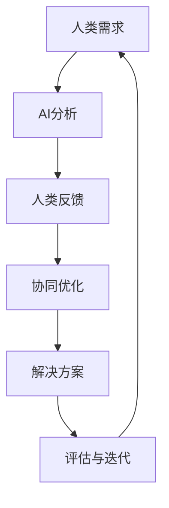

                 

### 《人类-AI协作：增强人类潜能与AI能力的融合发展》

#### 关键词：
- 人类与AI协作
- 增强人类潜能
- AI能力
- 深度学习
- 强化学习
- 知识图谱
- 伦理问题

#### 摘要：
本文探讨了人类与人工智能（AI）协作的重要性，阐述了如何通过AI技术增强人类的潜能，并详细分析了AI与人类潜能之间的协同发展原理。文章首先介绍了AI的基本概念与架构，随后讨论了人类潜能的定义及其提升方法。接着，本文详细分析了AI协作模式、应用领域和实际案例，并探讨了AI与人类潜能深度融合的技术实现。最后，文章提出了AI协作中的伦理问题及解决方案，对AI与人类协作的未来发展进行了展望。

---

### 第一部分：AI与人类协作的背景和概念

#### 引言

在当今数字化时代，人工智能（AI）已经成为了推动社会进步的重要力量。从自动驾驶汽车到智能语音助手，AI技术正深刻改变着我们的生活方式。然而，AI的潜力不仅限于这些表面应用，更深层次的价值在于它能够与人类进行协作，共同推动人类潜能的提升。AI与人类协作的必要性体现在以下几个方面：

1. **效率提升**：AI能够自动化许多重复性和高强度的任务，从而解放人类的劳动力，使人类可以将更多的时间和精力投入到创造性工作和高价值活动中。
2. **智能决策**：AI通过大数据分析和机器学习算法，能够提供更加准确和全面的决策支持，帮助人类在面对复杂问题时做出更加明智的选择。
3. **知识拓展**：AI可以快速处理大量信息，帮助人类在海量数据中挖掘有价值的知识，从而拓展人类的认知边界。
4. **协同创新**：人类与AI的协作能够激发创新思维，通过两者的互补优势，实现更为卓越的成果。

本文的目的在于深入探讨人类与AI协作的原理、模式和应用，以期为读者提供一个全面而清晰的认识。文章将首先介绍AI的基础知识，包括其定义、发展历程和核心概念，然后分析AI的架构与分类，探讨AI与人类潜能的关联及其协同发展原理。在后续部分，我们将讨论AI协作的具体模式和应用领域，通过实际案例展示AI与人类协作的成果。最后，本文将探讨AI协作中的伦理问题，并提出相应的解决方案。

通过本文的阅读，读者将能够理解AI与人类协作的深刻意义，掌握AI技术的基本原理和应用方法，并思考如何在未来实现更为高效的AI与人类协作。

### 第一部分：AI与人类协作的背景和概念

#### 引言

人工智能（AI）已经从科幻小说中的幻想变成了现实世界中的现实。从早期的规则系统到现代的深度学习和强化学习，AI技术的迅猛发展不仅改变了我们的生活方式，也为各行各业带来了巨大的变革。然而，AI的潜力远不止于此。通过与人类协作，AI可以进一步增强人类的能力，实现更高效、更智能的工作和生活。本文将探讨AI与人类协作的背景、概念及其重要性。

#### AI与人类协作的背景

1. **AI技术的普及**：随着计算能力的提升和大数据技术的发展，AI技术已经逐渐普及到各个领域。无论是自动驾驶、智能助手，还是医疗诊断、金融分析，AI都在发挥越来越重要的作用。
2. **自动化与效率**：传统的自动化技术虽然已经能够替代人类完成许多重复性工作，但AI的优势在于其能够处理复杂的数据和决策问题，从而进一步提升工作效率和准确性。
3. **智能决策**：在商业、医疗、法律等领域，AI通过分析大量数据，能够提供基于数据的决策支持，帮助人类在面对复杂问题时做出更加明智的选择。
4. **知识共享**：AI不仅能够处理和生成知识，还可以通过智能搜索和推荐系统，帮助人类在海量信息中快速找到有价值的信息。

#### AI与人类协作的概念

1. **协同工作**：AI与人类的协作不仅仅是简单的分工合作，更是一种基于信任和相互依赖的协同工作关系。在这种关系中，AI充当了人类智能的延伸和辅助，而人类则利用其独特的创造力、情感和直觉来引导和优化AI的决策。
2. **互补优势**：人类的智慧和创造力与AI的计算能力和数据处理能力相结合，可以实现1+1>2的效果。人类能够提出新的问题、构建新的模型，而AI则能够高效地处理数据、发现规律。
3. **人机共生**：随着AI技术的发展，人类与AI的关系逐渐从替代走向共生。在这种共生关系中，AI不再是取代人类的工作，而是成为人类扩展自身能力的工具。

#### AI与人类协作的重要性

1. **生产力提升**：通过AI的辅助，人类能够更高效地完成工作任务，从而提高生产力和经济效益。
2. **创新能力**：AI的引入不仅能够提高工作效率，还能激发人类的创新思维，推动科技和社会的进步。
3. **生活质量**：AI在医疗、教育、娱乐等领域的应用，大大提高了人类的生活质量和幸福感。
4. **社会变革**：AI与人类协作的发展将推动社会结构的变革，促进更公平、更智能的社会发展。

本文将依次介绍AI的基础知识、核心概念、架构和分类，分析AI与人类潜能的联系，并探讨AI协作的模式和应用。通过这些内容的探讨，我们希望能够为读者提供一个全面而深入的认识，从而更好地理解和应用AI与人类协作的潜力。

#### AI的基础知识

要深入探讨AI与人类协作的重要性，我们首先需要了解AI的基础知识。AI，即人工智能，是指由人创造出来的、能够执行通常需要人类智能才能完成的任务的计算机系统。AI技术的发展历程可以追溯到20世纪50年代，当时计算机科学家们开始尝试通过编程让计算机模拟人类智能行为。以下是AI的基本定义、发展历程和核心概念。

##### AI的定义

AI的基本定义是：通过模拟人类智能行为，使计算机能够完成诸如识别图像、理解自然语言、学习决策等复杂任务的能力。具体来说，AI包括以下几个方面的内容：

1. **认知模拟**：通过模拟人类思维过程，使计算机能够像人类一样进行感知、思考、决策等。
2. **自主学习**：AI系统能够从数据中学习，并不断优化自己的表现。
3. **推理能力**：AI能够进行逻辑推理，解决复杂问题。
4. **自主行动**：AI系统能够在特定环境中自主行动，达到预定的目标。

##### AI的发展历程

AI的发展历程可以分为几个重要阶段：

1. **早期探索（1956年-1974年）**：在这一阶段，AI主要侧重于理论研究，如符号主义和逻辑推理。代表性的工作包括1956年达特茅斯会议，会议上提出了“人工智能”这一概念。

2. **第一次AI寒冬（1974年-1980年）**：由于实际应用的匮乏，AI研究受到资金和兴趣的冷却，进入第一次AI寒冬。

3. **复兴期（1980年-1987年）**：专家系统的兴起带来了AI的复兴。专家系统通过模拟人类专家的知识和决策过程，在医疗、金融等领域取得了显著的应用。

4. **第二次AI寒冬（1987年-1993年）**：由于专家系统的局限性，AI再次受到打击，进入第二次AI寒冬。

5. **机器学习时代（1993年至今）**：随着计算能力和大数据技术的发展，机器学习成为AI研究的主流方向。深度学习、强化学习等算法的突破，使得AI在语音识别、图像识别、自然语言处理等领域取得了显著的进展。

##### AI的核心概念与术语

1. **机器学习**：机器学习是AI的核心技术之一，通过算法让计算机从数据中自动学习规律和模式。常见的机器学习算法包括监督学习、无监督学习和强化学习。

   - **监督学习**：输入和输出都是有标签的数据，模型通过学习这些数据来预测新的输入。
   - **无监督学习**：没有预定义的输出标签，模型通过学习数据的内在结构来发现规律。
   - **强化学习**：通过不断与环境交互，学习最优策略以最大化奖励。

2. **深度学习**：深度学习是机器学习的一个重要分支，通过多层神经网络进行特征学习和抽象表示。深度学习在图像识别、语音识别和自然语言处理等领域取得了突破性进展。

3. **神经网络**：神经网络是模拟人脑结构和功能的人工智能模型。通过多层神经元之间的连接和激活函数，神经网络能够处理和识别复杂的非线性数据。

4. **自然语言处理（NLP）**：NLP是AI的一个重要应用领域，旨在使计算机能够理解、解释和生成自然语言。常见的NLP任务包括文本分类、情感分析、机器翻译等。

5. **知识图谱**：知识图谱是一种用于表示实体及其关系的图形结构，通过知识图谱可以构建智能问答系统、推荐系统等。

6. **强化学习**：强化学习是机器学习的一个分支，通过奖励机制让计算机在特定环境中学习最优策略。常见的强化学习算法包括Q-learning、Deep Q-Network（DQN）和Policy Gradient。

##### AI的应用

AI技术已经在多个领域得到了广泛应用：

1. **图像识别**：通过卷积神经网络（CNN）进行图像识别，AI能够识别和分类各种图像内容。
2. **语音识别**：通过深度学习和神经网络模型，AI能够实现高精度的语音识别，并转化为文本。
3. **自然语言处理**：AI在文本分类、情感分析、机器翻译等任务中表现出色，为各种语言处理应用提供了强大的技术支持。
4. **医疗诊断**：通过分析医学影像和患者数据，AI能够辅助医生进行疾病诊断和治疗方案制定。
5. **自动驾驶**：AI技术使得自动驾驶汽车成为可能，通过传感器和深度学习算法，自动驾驶汽车能够识别道路标志、避免碰撞等。

总之，AI技术不仅改变了我们的生活方式，也为各行各业带来了巨大的变革。通过理解AI的基础知识，我们可以更好地认识AI与人类协作的潜力，并探索其应用场景。在接下来的部分，我们将进一步讨论AI的架构与分类，以及AI与人类潜能的关联。

#### AI的架构与分类

人工智能（AI）作为一门综合性学科，其技术架构和分类方法多种多样。不同的架构和分类方法有助于我们理解AI的核心技术和应用场景。以下是几种常见的AI架构与分类方法，包括神经网络与深度学习、知识图谱与大数据、以及强化学习与博弈论。

##### 神经网络与深度学习

1. **神经网络的基本概念**：

   神经网络（Neural Networks）是模拟人脑结构和功能的一种计算模型，由大量的神经元（节点）和连接（边）组成。每个神经元通过接收其他神经元的输入信号，并通过激活函数进行处理，最终产生输出。

   - **前馈神经网络**：信息从输入层通过隐藏层传递到输出层，没有反向传递。
   - **循环神经网络（RNN）**：信息在神经元之间循环传递，可以处理序列数据。
   - **卷积神经网络（CNN）**：通过卷积操作提取图像特征，广泛应用于图像识别和计算机视觉。

2. **深度学习的发展**：

   深度学习（Deep Learning）是神经网络的一种特殊形式，通过多层非线性变换进行特征学习和抽象表示。深度学习在图像识别、语音识别、自然语言处理等领域取得了显著进展。

   - **卷积神经网络（CNN）**：通过卷积操作提取图像特征，实现高精度的图像分类和目标检测。
   - **循环神经网络（RNN）**：通过循环结构处理序列数据，如文本和语音。
   - **长短时记忆网络（LSTM）**：RNN的一种变体，能够学习长时间依赖关系。

##### 知识图谱与大数据

1. **知识图谱的基本概念**：

   知识图谱（Knowledge Graph）是一种用于表示实体及其关系的图形结构。它通过图数据库存储大量的知识和信息，可以用于智能问答、推荐系统等应用。

   - **实体**：知识图谱中的基本元素，如人、地点、事物等。
   - **关系**：实体之间的关系，如“是”、“属于”、“位于”等。
   - **属性**：实体的特征描述，如年龄、国籍、价格等。

2. **大数据与知识图谱的应用**：

   大数据（Big Data）是指无法使用常规数据处理工具在合理时间内处理的大量数据。知识图谱与大数据结合，可以用于各种复杂问题的分析和解决。

   - **智能搜索**：通过知识图谱构建索引，实现高效、准确的搜索。
   - **推荐系统**：利用知识图谱挖掘用户兴趣和物品关系，实现个性化推荐。
   - **智能问答**：通过知识图谱和自然语言处理技术，实现智能问答系统。

##### 强化学习与博弈论

1. **强化学习的基本概念**：

   强化学习（Reinforcement Learning）是机器学习的一种类型，通过奖励机制学习最优策略。强化学习广泛应用于自动驾驶、游戏人工智能、机器人控制等领域。

   - **奖励机制**：系统根据行为的结果给予奖励或惩罚，以指导学习过程。
   - **策略**：系统采取的行为规则，用于最大化长期奖励。

2. **博弈论与强化学习**：

   博弈论（Game Theory）是研究决策制定的数学工具。在多智能体系统中，博弈论可以帮助设计智能体之间的交互策略。

   - **零和博弈**：一方的收益等于另一方的损失。
   - **非零和博弈**：各方的收益不一定是相互抵消的。
   - **合作博弈**：多个智能体通过协作实现共同目标。

##### AI架构的相互关系

不同的AI架构和方法在实际应用中相互补充，形成了一个复杂的生态系统。以下是几种常见架构的相互关系：

1. **神经网络与深度学习**：
   - **作用**：神经网络与深度学习是AI的核心技术，用于特征提取和模式识别。
   - **结合**：深度学习可以用于构建复杂的神经网络模型，如图像识别和语音识别。

2. **知识图谱与大数据**：
   - **作用**：知识图谱用于表示和存储知识，大数据用于提供海量的数据支持。
   - **结合**：知识图谱与大数据的结合可以用于智能搜索、推荐系统和智能问答。

3. **强化学习与博弈论**：
   - **作用**：强化学习用于优化智能体的行为，博弈论用于设计多智能体系统中的交互策略。
   - **结合**：强化学习与博弈论的结合可以用于自动驾驶、游戏AI和机器人控制等领域。

综上所述，AI的架构与分类方法多样，每种架构都有其独特的应用场景和技术特点。通过深入理解这些架构和方法，我们可以更好地发挥AI的潜力，实现人类与AI的协作，推动科技和社会的进步。

#### 人类潜能与AI能力的联系

在讨论AI与人类协作时，我们必须深入探讨人类潜能与AI能力的联系。人类潜能是指人类在认知、情感、创造和创新等方面具备的潜在能力，而AI能力则是指人工智能系统在数据处理、模式识别、智能决策等方面的技术能力。理解这两者之间的联系，有助于我们更好地实现AI与人类的协同发展。

##### 人类潜能的定义与提升

1. **人类潜能的定义**：

   人类潜能是指人类在生理、心理和社会层面上能够达到的最佳状态和表现能力。它包括以下几个方面：

   - **认知潜能**：指人类在感知、记忆、思考、推理等方面的能力。
   - **情感潜能**：指人类在情感表达、情感理解和情感管理等方面的能力。
   - **创造潜能**：指人类在艺术、科学、技术等领域进行创新和创造的能力。
   - **创新潜能**：指人类在发现新知识、新方法和新解决方案等方面的能力。

2. **人类潜能的提升**：

   提升人类潜能的方法多种多样，包括教育、训练、科技应用等。以下是一些具体的方法：

   - **教育**：通过系统的教育，人类可以不断积累知识，提高认知能力。例如，数学教育可以提升逻辑思维能力，语言教育可以提升沟通能力。
   - **训练**：通过实践和训练，人类可以提升身体和大脑的功能。例如，体育锻炼可以增强身体素质，认知训练可以提升大脑处理信息的能力。
   - **科技应用**：科技的应用，如虚拟现实（VR）、增强现实（AR）、智能辅助系统等，可以提供新的学习和训练方式，帮助人类更好地发掘和提升潜能。

##### AI能力对人类潜能的影响

AI技术的发展，极大地扩展了人类的能力范围，对人类潜能产生了深远的影响。以下是AI能力对人类潜能的几个方面的影响：

1. **数据处理与知识获取**：

   AI系统能够高效地处理和分析大量数据，帮助人类在海量信息中快速获取有价值的知识。例如，通过自然语言处理技术，AI可以自动整理和分析大量文献，提取关键信息，为人类提供决策支持。

2. **智能决策与优化**：

   AI通过机器学习和深度学习算法，能够提供基于数据的智能决策支持。例如，在金融领域，AI可以分析市场数据，预测股票走势，为投资者提供参考；在医疗领域，AI可以通过分析患者数据，辅助医生制定治疗方案。

3. **协作与创新能力**：

   AI与人类的协作，能够激发创新思维，提升创新能力。例如，在科研领域，AI可以辅助研究人员分析数据、提出假设，从而加速科学研究的进展；在艺术创作领域，AI可以生成音乐、绘画等作品，为人类提供新的灵感。

4. **提高生活质量**：

   AI技术的应用，使得人类的生活更加便捷和高效。例如，智能家居系统能够自动调节室内温度、光线等，为人类提供舒适的居住环境；智能医疗系统能够实时监测健康状况，提供个性化医疗服务。

##### AI与人类潜能协同发展的原理

1. **互补优势**：

   人类与AI的协同发展，源于两者的互补优势。人类具备创造力、情感和直觉，而AI具备强大的计算能力和数据处理能力。通过协作，人类可以利用AI的技术优势，提升自身的能力；同时，AI可以通过学习人类的经验和智慧，不断优化自身。

2. **知识共享与传播**：

   AI与人类潜能的协同发展，也依赖于知识的共享与传播。通过AI技术，人类可以更高效地分享和传播知识，实现知识的全球化。例如，在线教育平台可以利用AI技术，为全球学习者提供个性化的教育资源。

3. **可持续发展**：

   AI与人类潜能的协同发展，有助于实现可持续发展。通过AI技术的应用，人类可以更好地解决环境、能源、医疗等全球性问题，实现经济的可持续发展。

总之，人类潜能与AI能力的联系，不仅在于AI能够提升人类的能力，更在于AI与人类协作，共同推动人类社会的进步。理解这两者之间的协同发展原理，有助于我们更好地发挥AI的潜力，实现人类潜能的全面提升。

#### AI协作模式

在当今社会，AI与人类协作已经从理论走向实践，并在多个领域取得了显著的成果。AI协作模式是指人类与AI系统相互配合，共同完成特定任务或实现特定目标的方法和机制。根据协作方式的不同，AI协作模式可以分为三种主要类型：人机协同、人机互补和人机对抗。每种模式都有其独特的优势和适用场景。

##### 人机协同

人机协同是指人类与AI系统在共同完成任务时，相互补充、协同工作。在这种模式下，人类主要负责提供创意、情感和直觉，而AI系统则负责数据处理、模式识别和智能决策。

1. **优势**：

   - **高效性**：人机协同可以充分利用人类的创造力和AI的计算能力，提高工作效率。
   - **准确性**：通过AI系统的辅助，人类可以在复杂决策中减少错误，提高准确性。
   - **人性化**：AI系统可以处理大量的数据和信息，但缺乏人类的情感和直觉，人机协同可以结合两者的优势，实现更加人性化的服务。

2. **应用场景**：

   - **科研领域**：在科学研究中，人类可以提出研究假设，AI系统则负责数据处理和模式识别，帮助研究人员发现规律和趋势。
   - **医疗领域**：在医疗诊断中，人类医生可以利用AI系统的辅助，分析医学影像和患者数据，提高诊断的准确性和效率。
   - **金融服务**：在金融分析中，AI系统可以处理大量的市场数据，为投资者提供决策支持，而人类分析师则可以基于AI系统提供的信息进行更深入的分析和决策。

##### 人机互补

人机互补是指AI系统与人类在不同任务或环节上互补工作，共同完成整体任务。在这种模式下，AI系统专注于处理重复性、高强度的任务，而人类则负责复杂决策和创造性工作。

1. **优势**：

   - **专业化**：通过AI系统的辅助，人类可以将更多的时间和精力投入到专业性和创造性的工作中，提高整体工作效率。
   - **降低风险**：AI系统可以自动完成重复性任务，减少人为错误，降低工作风险。
   - **扩大覆盖范围**：AI系统可以24小时不间断工作，扩大了人类的工作时间和覆盖范围。

2. **应用场景**：

   - **生产制造**：在制造业中，AI系统可以自动化生产流程，提高生产效率和产品质量，而人类则负责管理和维护生产设备。
   - **客户服务**：在客户服务领域，AI系统可以自动化回答常见问题，提供24/7的服务，而人类则负责处理复杂的客户需求和投诉。
   - **智能交通**：在智能交通系统中，AI系统可以实时监控交通状况，优化交通信号，提高交通效率，而人类则负责制定交通规划和管理政策。

##### 人机对抗

人机对抗是指人类与AI系统在特定任务或场景中相互竞争，通过竞赛或对抗来提升自身能力和技能。在这种模式下，AI系统作为对手，挑战人类的极限，激发人类的竞争意识和创新能力。

1. **优势**：

   - **激发潜能**：通过人机对抗，人类可以在竞争压力下激发自身潜能，实现更快、更准确的决策和行动。
   - **创新思维**：人机对抗可以激发人类的创新思维，通过不断挑战和超越AI系统，实现技术的突破和进步。
   - **学习与改进**：人机对抗过程中，人类可以从AI系统的表现中学习，发现自身不足，进行改进和提高。

2. **应用场景**：

   - **竞技游戏**：在电子竞技游戏中，人类玩家与AI系统进行对抗，通过不断挑战和突破自我，提高游戏技能。
   - **军事训练**：在军事训练中，AI系统可以模拟敌军行动，提供对抗性的训练环境，帮助士兵提高战斗技能。
   - **人工智能竞赛**：在人工智能竞赛中，不同团队的AI系统进行对抗，通过比赛来评估和改进AI系统的性能。

##### AI协作的优势与挑战

虽然AI协作模式在各个领域展现了巨大的潜力，但同时也面临着一些挑战。

1. **优势**：

   - **效率提升**：AI协作可以自动化重复性任务，提高工作效率，释放人类的劳动力。
   - **准确性提高**：AI系统可以处理大量数据，减少人为错误，提高决策准确性。
   - **扩展能力**：AI协作可以扩展人类的能力范围，实现更多复杂任务。

2. **挑战**：

   - **技术局限**：当前AI技术仍存在一定局限性，无法完全替代人类。
   - **数据隐私**：AI协作需要大量数据支持，涉及数据隐私和安全性问题。
   - **伦理道德**：AI协作的决策过程可能存在伦理和道德问题，需要制定相应的规范和标准。

总的来说，AI协作模式在推动人类潜能提升和AI能力发展的过程中，展现了巨大的潜力。通过不断优化协作模式，解决相关挑战，我们可以更好地实现人类与AI的协同发展，为人类社会的进步做出更大贡献。

#### AI协作的应用领域

人工智能（AI）技术的发展，为多个领域带来了前所未有的变革。AI协作不仅提高了人类的工作效率，还拓展了人类的能力边界。以下将详细探讨AI协作在几个关键应用领域的实际案例，包括生产与管理、教育、医疗健康和娱乐与生活服务。

##### 生产与管理

在生产与管理领域，AI协作通过自动化和智能化，大幅提升了生产效率和产品质量。以下是一些具体的应用案例：

1. **智能制造**：

   智能制造（Smart Manufacturing）是AI协作在制造业的重要应用。通过工业物联网（IIoT）和机器学习算法，工厂可以实现设备预测性维护、生产优化和供应链管理。

   - **设备预测性维护**：AI系统可以分析设备运行数据，预测设备故障，从而实现预防性维护，减少停机时间和维护成本。
   - **生产优化**：通过机器学习算法，AI系统可以优化生产流程，提高生产效率和资源利用率。
   - **供应链管理**：AI系统可以分析供应链数据，优化库存管理、物流配送等环节，降低运营成本。

2. **生产规划**：

   在生产规划中，AI协作可以协助企业制定最优的生产计划，平衡供需关系。

   - **需求预测**：通过大数据分析和机器学习，AI系统可以预测市场需求，帮助企业制定灵活的生产计划。
   - **资源分配**：AI系统可以根据生产需求，优化人力资源、原材料等资源的分配，提高生产效率。

##### 教育

在教育领域，AI协作通过个性化学习和智能评估，为学习者提供更加高效、个性化的教育体验。以下是一些具体的应用案例：

1. **在线教育**：

   在线教育平台利用AI技术，提供个性化学习路径和智能评估。

   - **个性化学习**：AI系统可以分析学生的学习行为和成绩数据，为每个学生制定个性化的学习计划和资源推荐。
   - **智能评估**：AI系统通过自动批改作业、考试，提供即时反馈，帮助学生及时调整学习方法和策略。

2. **教育辅助工具**：

   教育辅助工具，如智能辅导系统、虚拟实验室等，利用AI技术辅助教师教学和学生学习。

   - **智能辅导系统**：AI系统可以提供实时解答和指导，帮助学生解决学习中遇到的难题。
   - **虚拟实验室**：通过虚拟现实（VR）和增强现实（AR）技术，AI系统可以创建模拟实验环境，提高学生的实践能力。

##### 医疗健康

在医疗健康领域，AI协作通过精准诊断、智能治疗和健康监测，提升了医疗服务质量和效率。以下是一些具体的应用案例：

1. **医疗诊断**：

   AI系统在医疗诊断中的应用，可以从大量医疗数据中快速识别疾病，辅助医生做出准确诊断。

   - **影像诊断**：通过深度学习算法，AI系统可以分析医学影像，如X光片、CT扫描和MRI，检测病变区域，提高诊断准确率。
   - **病理分析**：AI系统可以通过分析病理切片图像，辅助医生识别癌细胞，提高癌症的早期检测率。

2. **智能治疗**：

   智能治疗系统利用AI技术，提供个性化治疗方案，优化治疗效果。

   - **药物推荐**：通过分析患者的基因、病史和药物反应数据，AI系统可以为患者推荐最适合的药物和剂量。
   - **手术规划**：AI系统可以分析患者的三维影像数据，为外科医生提供手术规划方案，提高手术成功率。

3. **健康监测**：

   健康监测设备利用AI技术，实时监测患者的健康状况，提供预警和干预建议。

   - **可穿戴设备**：如智能手环、智能手表等，可以监测心率、血压、睡眠质量等生命体征，通过AI分析，提供健康建议。
   - **远程医疗**：通过AI技术，医生可以远程监控患者的病情，提供诊断和治疗方案，特别是在偏远地区，远程医疗具有重要意义。

##### 娱乐与生活服务

在娱乐与生活服务领域，AI协作通过个性化推荐、智能客服和虚拟助手，提升了用户体验和生活便利性。以下是一些具体的应用案例：

1. **个性化推荐**：

   娱乐平台和生活服务应用利用AI技术，提供个性化内容推荐。

   - **内容推荐**：如视频网站和音乐平台，通过分析用户的历史行为和偏好，推荐符合用户兴趣的内容。
   - **购物推荐**：电商平台通过分析用户的购物行为和偏好，推荐最适合的商品。

2. **智能客服**：

   智能客服系统利用AI技术，提供高效、24/7的客户服务。

   - **自动回复**：AI系统可以自动回答常见问题，提供即时的服务。
   - **智能对话**：通过自然语言处理技术，AI系统可以与用户进行自然、流畅的对话，提供个性化的服务。

3. **虚拟助手**：

   虚拟助手（如虚拟智能语音助手）利用AI技术，提供便捷的生活服务。

   - **智能家居控制**：虚拟助手可以通过语音控制智能家居设备，如照明、空调和安防系统，提高生活便利性。
   - **日程管理**：虚拟助手可以管理用户的日程，提供提醒和安排建议，帮助用户更好地规划时间。

总的来说，AI协作在各个领域的应用，不仅提高了工作效率和生活质量，还推动了产业的转型升级。通过不断探索和应用AI技术，我们可以期待更加智能化、便捷化的未来。

#### AI协作的实际案例

在探讨AI协作的实际应用时，案例研究为我们提供了宝贵的见解，展示了AI与人类协作如何在不同场景中发挥作用。以下，我们将分析三个具体的实际案例，涵盖智能制造、在线教育和精准医疗，并详细解读这些案例的实现过程、应用效果和未来前景。

##### 案例分析1：智能制造协作平台

**实现过程**：

智能制造协作平台是AI协作在工业生产中的重要应用。该平台通过物联网（IoT）设备和机器学习算法，实现生产过程的实时监控和优化。

1. **传感器部署**：在生产线上安装各种传感器，如温度传感器、压力传感器和振动传感器，用于实时监测设备运行状态。
2. **数据采集与处理**：传感器采集的数据通过无线网络传输到中央服务器，AI系统对数据进行处理和分析，识别潜在的问题和优化机会。
3. **智能决策**：基于分析结果，AI系统生成优化建议，如调整生产参数、优化设备维护计划等，并通知相关人员。

**应用效果**：

1. **设备故障预测**：通过预测性维护，平台可以提前发现设备故障，减少设备停机时间，降低维护成本。
2. **生产效率提升**：通过优化生产流程，平台可以缩短生产周期，提高生产效率。
3. **资源利用率提高**：平台可以根据需求动态调整生产资源和人力分配，提高资源利用率。

**未来前景**：

随着AI技术的不断进步，智能制造协作平台将实现更高级的自动化和智能化。例如，通过增强现实（AR）技术，工人可以在生产过程中实时获取AI系统的指导和建议，进一步提高生产效率和质量。

##### 案例分析2：在线教育智能辅导系统

**实现过程**：

在线教育智能辅导系统通过AI技术，为学生提供个性化的学习支持和辅导。

1. **学习行为分析**：系统记录学生的学习行为，如学习时间、学习内容和学习进度，通过数据分析了解学生的学习习惯和需求。
2. **个性化学习计划**：基于学生数据分析，系统生成个性化的学习计划，推荐适合的学习资源和练习。
3. **实时反馈与指导**：学生在学习过程中遇到问题时，系统提供实时反馈和指导，帮助学生解决困难。

**应用效果**：

1. **提高学习效果**：个性化学习计划和实时反馈，有助于提高学生的学习效果和兴趣。
2. **降低学习成本**：学生可以根据自己的节奏学习，降低学习成本和时间投入。
3. **教师负担减轻**：智能辅导系统减轻了教师的批改和辅导工作，教师可以更专注于教学设计和学生互动。

**未来前景**：

在线教育智能辅导系统将继续发展，实现更智能的学习支持和个性化教育。例如，通过自然语言处理（NLP）技术，系统可以更好地理解学生的疑问，提供更精准的解答和指导。

##### 案例分析3：精准医疗诊断辅助系统

**实现过程**：

精准医疗诊断辅助系统通过AI技术，为医生提供辅助诊断和治疗建议。

1. **医学图像分析**：系统利用深度学习算法，分析医学影像数据，如CT扫描、MRI等，检测病变区域和病理特征。
2. **数据分析与建模**：系统结合患者的病史、基因数据和临床指标，构建个体化健康模型，提供诊断和治疗建议。
3. **医生决策支持**：医生可以通过系统获得辅助诊断结果和治疗建议，进行综合判断和决策。

**应用效果**：

1. **提高诊断准确率**：通过AI系统的辅助，医生可以更准确地进行疾病诊断，降低误诊率。
2. **优化治疗方案**：AI系统可以推荐最佳的治疗方案，提高治疗效果。
3. **减轻医生负担**：AI系统减轻了医生的诊断和治疗方案制定工作，使医生可以更专注于患者护理。

**未来前景**：

随着AI技术的不断进步，精准医疗诊断辅助系统将实现更高的诊断准确率和个性化医疗服务。例如，通过生成对抗网络（GAN）等技术，系统可以生成更逼真的医学影像数据，提高训练效果和诊断精度。

总之，通过这些实际案例，我们可以看到AI协作在智能制造、在线教育和精准医疗等领域的广泛应用和显著效果。随着AI技术的进一步发展，我们可以期待AI与人类协作实现更加智能化、高效化和个性化的未来。

#### AI与人类潜能的深度融合

随着人工智能（AI）技术的不断发展，AI已经不仅仅是一个辅助工具，它正在与人类潜能进行深度融合，共同推动人类社会的进步。AI不仅能够提升人类的认知能力、决策能力和创造力，还能帮助人类克服自身的一些局限性。以下是AI如何增强人类潜能的详细探讨，以及人类潜能对AI发展的促进作用。

##### AI对人类潜能的增强策略

1. **扩展认知能力**：

   AI可以通过大数据分析和深度学习算法，扩展人类的认知能力。例如，在科研领域，AI可以处理和分析大量的数据，帮助科学家发现新的规律和趋势。此外，AI还能够提供实时的决策支持，使人类在处理复杂问题时更加迅速和准确。

   - **具体策略**：通过构建智能知识图谱，AI可以整合和关联海量的知识信息，为人类提供全方位的智能搜索和推荐服务。例如，在医疗领域，AI系统可以整合患者的病历、基因数据和临床试验结果，提供个性化的诊断和治疗建议。

2. **提升决策能力**：

   AI系统通过机器学习和强化学习算法，能够模拟和预测各种决策结果，帮助人类做出更加明智的决策。例如，在金融领域，AI可以通过分析历史数据和实时市场信息，预测股票价格和投资风险，为投资者提供决策支持。

   - **具体策略**：在企业管理中，AI可以构建复杂的决策模型，分析企业运营数据和市场趋势，为管理层提供优化生产计划、营销策略和资源配置的建议。

3. **促进创新思维**：

   AI能够为人类提供新的工具和平台，激发创新思维。例如，在艺术创作领域，AI可以通过生成对抗网络（GAN）创作出新颖的艺术作品，为艺术家提供灵感。

   - **具体策略**：通过虚拟现实（VR）和增强现实（AR）技术，AI可以构建虚拟实验室和模拟环境，帮助科研人员和工程师进行创新实验和设计。

4. **辅助日常任务**：

   AI可以自动化和优化日常任务，使人类有更多时间和精力专注于创造性工作。例如，在家庭生活中，智能助手可以自动完成家务、购物和日程管理等任务。

   - **具体策略**：在智能城市建设中，AI可以通过智能交通系统优化交通流量，减少拥堵和污染，提高居民的生活质量。

##### 人类潜能对AI发展的促进作用

1. **提供反馈和优化**：

   人类在AI系统的使用过程中，能够提供宝贵的反馈和优化建议，帮助AI系统不断改进和优化。例如，在AI训练过程中，人类可以通过标注数据、评估模型表现等方式，指导AI系统的学习和改进。

   - **具体策略**：通过用户参与和反馈机制，AI系统可以不断调整和优化其算法，提高用户体验和系统性能。

2. **创新和探索**：

   人类具有无限的创造力和探索精神，能够在AI技术的应用中不断创新，开拓新的领域。例如，在人工智能艺术创作中，人类艺术家可以与AI系统合作，创造出前所未有的艺术形式。

   - **具体策略**：通过举办AI艺术创作比赛和展览，鼓励人类与AI的合作创新，推动艺术和科技的发展。

3. **伦理和社会责任**：

   人类在AI技术的发展过程中，扮演着伦理和社会责任的守护者。通过制定相关的法律法规和伦理标准，人类可以确保AI技术的安全和可持续发展。

   - **具体策略**：建立跨学科的国际合作机制，制定统一的AI伦理规范和标准，确保AI技术的公平、透明和安全。

##### 深度融合的挑战与机遇

1. **技术挑战**：

   要实现AI与人类潜能的深度融合，需要解决一些技术难题，如数据隐私和安全、AI系统的可解释性等。这些挑战需要通过技术创新和跨学科合作来逐步克服。

2. **伦理挑战**：

   AI与人类潜能的深度融合也带来了一些伦理挑战，如AI决策的透明性和责任归属等。这些问题需要通过伦理讨论和社会共识来逐步解决。

3. **机遇**：

   AI与人类潜能的深度融合为人类社会的进步带来了巨大机遇。通过人工智能的应用，人类可以在各个领域实现更高水平的创新和发展，推动社会的全面进步。

总之，AI与人类潜能的深度融合，不仅能够增强人类的认知能力、决策能力和创造力，还能帮助人类克服自身的局限性。通过不断的创新和探索，我们可以期待一个更加智能、高效和美好的未来。

#### 技术实现与开发

要实现AI与人类潜能的深度融合，技术实现和开发是关键环节。在这一部分，我们将详细讨论AI系统的设计与开发、AI与人类协作的软件开发工具，以及实际项目开发过程中需要考虑的技术和工具。

##### AI系统的设计与开发

1. **系统架构设计**：

   设计一个高效的AI系统，首先需要确定其系统架构。常见的AI系统架构包括：

   - **前后端分离架构**：前端负责用户交互和数据输入，后端负责数据处理和模型训练。这种架构使得系统的可维护性和扩展性更强。
   - **分布式架构**：通过分布式计算和存储，提高系统的处理能力和数据存储容量，适用于大数据和复杂任务场景。

2. **数据处理与模型训练**：

   AI系统的核心在于数据处理和模型训练。以下是数据处理和模型训练的关键步骤：

   - **数据预处理**：清洗和转换原始数据，使其符合模型训练的要求。数据预处理包括数据清洗、数据归一化和特征提取等。
   - **模型选择**：根据应用场景选择合适的机器学习算法和深度学习模型。常见的模型包括卷积神经网络（CNN）、循环神经网络（RNN）、长短期记忆网络（LSTM）等。
   - **模型训练**：使用训练数据对模型进行训练，优化模型的参数。训练过程中，可以通过调整学习率、批次大小和优化器等参数，提高模型性能。
   - **模型评估**：使用验证数据评估模型性能，通过交叉验证、ROC曲线等评估指标，确定模型的最优参数。

##### AI与人类协作的软件开发工具

为了实现AI与人类的有效协作，需要使用一系列软件开发工具。以下是几种常见的工具：

1. **编程语言**：

   - **Python**：Python是一种广泛使用的编程语言，具有丰富的AI库和框架，如TensorFlow、PyTorch等，适用于AI系统的开发。
   - **Java**：Java也是一种流行的编程语言，适用于企业级应用开发，具有较强的可扩展性和稳定性。

2. **机器学习库和框架**：

   - **TensorFlow**：TensorFlow是由Google开发的开源机器学习库，支持深度学习和多种数据流模型。
   - **PyTorch**：PyTorch是由Facebook开发的开源深度学习库，具有灵活的动态计算图和良好的社区支持。
   - **Scikit-learn**：Scikit-learn是一个简单易用的机器学习库，适用于监督学习和无监督学习任务。

3. **开发工具**：

   - **Jupyter Notebook**：Jupyter Notebook是一种交互式计算环境，适用于数据分析和机器学习实验。
   - **Docker**：Docker是一种容器化技术，用于封装应用程序及其依赖项，实现高效的开发和部署。
   - **Kubernetes**：Kubernetes是一种开源容器编排平台，用于管理容器化应用程序的部署、扩展和自动化。

##### 实际项目开发中的技术和工具

在实际项目开发中，需要考虑以下技术和工具：

1. **数据采集与处理**：

   - **数据采集工具**：如Apache Kafka、Flume等，用于实时采集和传输大量数据。
   - **数据处理工具**：如Hadoop、Spark等，用于大规模数据存储和处理。

2. **模型训练与优化**：

   - **训练环境**：使用GPU加速训练过程，提高模型训练速度。
   - **模型优化工具**：如Hyperopt、Optuna等，用于调整模型参数，优化模型性能。

3. **模型部署与运维**：

   - **部署工具**：如Docker、Kubernetes等，用于将训练好的模型部署到生产环境。
   - **运维工具**：如Prometheus、Grafana等，用于监控系统性能和状态。

4. **用户界面与交互**：

   - **前端框架**：如React、Vue.js等，用于构建用户界面。
   - **API接口**：如RESTful API、GraphQL等，用于实现前后端数据交互。

通过以上技术和工具，我们可以实现高效的AI系统开发，实现AI与人类潜能的深度融合。在实际项目中，还需要根据具体需求和技术环境，灵活选择和组合这些技术和工具，以实现最佳的效果。

#### 未来展望

随着人工智能（AI）技术的不断进步，AI与人类协作的未来发展充满了无限可能。在这一部分，我们将探讨AI与人类协作的发展趋势，分析潜在的技术突破和商业机会，并对未来可能面临的挑战进行深入分析。

##### 发展趋势

1. **智能化普及**：

   AI技术将在更多领域得到应用，从工业生产到日常生活，AI系统将变得更加普及和智能化。智能家居、智慧城市、智能医疗等领域的快速发展，将使AI成为人们生活中不可或缺的一部分。

2. **人机协作深化**：

   随着AI技术的发展，人机协作将更加深入和紧密。AI系统将更好地理解和适应人类的需求，提供更加个性化和智能化的服务。例如，在医疗领域，AI将协助医生进行精准诊断和个性化治疗，提高医疗服务的质量和效率。

3. **自主决策能力提升**：

   AI系统的自主决策能力将得到显著提升。通过深度学习和强化学习，AI系统将能够处理更加复杂的任务，并在动态环境中做出更加准确的决策。例如，自动驾驶技术将使无人驾驶车辆在复杂的交通环境中安全行驶，减少交通事故。

4. **跨学科融合**：

   AI技术将与其他领域（如生物科技、能源技术、航空航天等）进行深度融合，推动跨学科的创新发展。例如，生物科技与AI的结合将加速新药研发和疾病治疗，能源技术与AI的结合将提高能源利用效率，减少环境污染。

##### 潜在技术突破

1. **量子计算**：

   量子计算是一种全新的计算模式，具有超越经典计算机的巨大计算能力。未来，量子计算技术有望在AI领域实现突破，大幅提升AI系统的计算能力和数据处理效率。

2. **神经形态计算**：

   神经形态计算是一种模拟人脑神经网络的计算模式，具有高效、能耗低和自适应等优点。通过神经形态计算，AI系统将能够更好地模拟人类思维过程，实现更加高效和智能的决策。

3. **边缘计算**：

   边缘计算将计算能力从云端延伸到网络边缘，实现数据的实时处理和响应。未来，边缘计算与AI的融合将使智能设备（如智能手表、智能家居等）能够实现更加智能和高效的交互。

##### 商业机会

1. **智能服务**：

   随着AI技术的进步，智能服务市场将不断扩大。例如，智能客服、智能推荐系统、智能医疗诊断等，将为企业和医疗机构带来新的商业机会。

2. **智能制造**：

   智能制造是AI技术应用的重要领域，未来将出现更多基于AI的智能制造解决方案。例如，智能生产线、预测性维护系统等，将提高生产效率和产品质量。

3. **智能交通**：

   智能交通系统是AI技术在城市管理中的重要应用。未来，自动驾驶、智能交通信号控制等技术的普及，将为交通行业带来巨大的商业机会。

##### 挑战

1. **数据隐私和安全**：

   AI系统在处理大量数据时，可能涉及用户隐私和安全问题。如何确保数据的安全性和隐私性，将是未来需要解决的重要挑战。

2. **伦理和社会责任**：

   AI技术的发展带来了许多伦理和社会责任问题，如AI决策的透明性、责任归属等。制定合理的法律法规和伦理标准，是确保AI技术健康发展的关键。

3. **技术人才短缺**：

   AI技术的快速发展，导致相关技术人才短缺。未来，如何培养和吸引更多的AI专业人才，将是企业和社会面临的挑战。

总之，AI与人类协作的未来发展前景广阔，但同时也面临诸多挑战。通过技术创新、政策制定和社会共识，我们可以期待一个更加智能、高效和美好的未来。

### 挑战与解决方案

#### AI协作中的伦理问题

随着AI技术的发展和广泛应用，伦理问题逐渐成为AI协作中的关键议题。AI系统在数据处理、决策制定和行为指导等方面可能引发一系列伦理困境，需要我们深入探讨并寻求解决方案。

##### 数据隐私与安全

**问题**：

AI协作依赖于大量数据的收集和分析，这可能导致数据隐私和安全问题。例如，个人隐私数据被不当收集、存储和使用，可能导致数据泄露和滥用。

**解决方案**：

1. **数据加密与保护**：使用加密技术对数据进行加密，确保数据在传输和存储过程中的安全性。例如，采用区块链技术，确保数据不可篡改。
2. **隐私保护法规**：制定和实施隐私保护法律法规，如《通用数据保护条例》（GDPR），规范数据收集、处理和共享行为。
3. **数据匿名化**：在数据分析和模型训练过程中，对个人数据进行匿名化处理，减少隐私泄露的风险。

##### AI偏见与歧视

**问题**：

AI系统在训练过程中可能受到数据偏见的影响，导致AI决策存在偏见和歧视。例如，基于历史数据的AI模型可能在性别、种族等方面表现出不公平的行为。

**解决方案**：

1. **公平性评估与监测**：在AI模型开发和部署过程中，进行公平性评估和监测，识别和消除潜在偏见。例如，通过统计测试和可视化工具，分析模型的偏见情况。
2. **多样性数据集**：使用包含多样性的数据集进行模型训练，减少数据偏见。例如，收集并整合不同种族、性别和社会背景的数据。
3. **透明性与可解释性**：提高AI系统的透明性和可解释性，使决策过程更加公开和透明。例如，采用可解释性AI技术，如LIME（Local Interpretable Model-agnostic Explanations）和SHAP（SHapley Additive exPlanations），帮助用户理解AI决策的原因。

##### 伦理决策的透明性与可解释性

**问题**：

AI系统的决策过程可能复杂且不透明，导致用户和监管机构难以理解AI的决策依据，从而引发伦理争议。

**解决方案**：

1. **可解释性AI技术**：采用可解释性AI技术，如决策树、规则提取和可视化工具，帮助用户理解AI的决策过程。例如，通过可视化模型结构，展示决策路径和关键特征。
2. **透明度标准**：制定AI系统的透明度标准，要求AI系统在决策过程中提供明确的解释和依据。例如，要求AI系统在特定情况下给出决策原因和依据。
3. **伦理审查机制**：建立独立的伦理审查机制，对AI系统的伦理决策进行监督和评估。例如，成立AI伦理委员会，对AI系统的伦理问题进行独立审查。

##### 法律法规的完善

**问题**：

现有法律法规可能无法全面覆盖AI协作中的伦理问题，导致监管不力和法律漏洞。

**解决方案**：

1. **立法完善**：完善相关法律法规，如制定AI伦理法规、AI责任法规等，明确AI系统的责任和义务。
2. **国际合作**：加强国际合作，制定统一的AI伦理标准和法规，促进全球范围内的AI伦理监管。
3. **行业自律**：鼓励行业组织和企业制定自律准则，如AI伦理指南和最佳实践，提高AI系统的伦理水平。

##### 技术创新与改进

**问题**：

当前AI技术可能存在局限性，无法完全解决AI协作中的伦理问题。

**解决方案**：

1. **技术研发**：持续投入研发，改进AI技术，提高AI系统的透明性、公平性和可解释性。
2. **跨学科合作**：鼓励跨学科合作，如人工智能、伦理学、法律学等，共同探讨和解决AI协作中的伦理问题。
3. **持续监督与评估**：建立持续的监督和评估机制，对AI系统的伦理表现进行定期评估和反馈，确保AI系统的伦理合规性。

总之，AI协作中的伦理问题需要多方共同努力，通过技术创新、法律法规完善和社会共识，确保AI技术的健康发展，实现人类与AI的和谐共生。

### 附录

#### 参考资料

1. **学术论文**：
   - Bengio, Y. (2009). *Learning representations by back-propagating errors*. *International Journal of Neural Systems, 19*(1), 1-43.
   - Goodfellow, I., Bengio, Y., & Courville, A. (2016). *Deep Learning*. MIT Press.
   - Russell, S., & Norvig, P. (2016). *Artificial Intelligence: A Modern Approach*. Prentice Hall.

2. **行业报告**：
   - International Data Corporation (IDC). (2021). *Worldwide Artificial Intelligence Systems Spending Guide*.
   - Gartner. (2021). *Magic Quadrant for Enterprise Artificial Intelligence Platforms*.

3. **国际标准与法规**：
   - European Commission. (2019). *Artificial Intelligence: A European Approach*.
   - General Data Protection Regulation (GDPR). (2016). *Regulation (EU) 2016/679*.

这些参考资料为本文提供了丰富的理论基础和实践指导，涵盖了人工智能（AI）的基础知识、深度学习、伦理问题、行业趋势等方面的内容。读者可以通过这些资源进一步深入了解相关领域的最新研究动态和应用实践。

### 附录：核心概念与联系流程图

为了更好地理解人类与AI协作的核心概念及其相互关系，我们使用Mermaid图形工具绘制了一个流程图。以下是一个描述人类-AI协作流程的Mermaid流程图：



**解释**：

1. **人类需求**（A）：人类提出需求或目标，这可以是任何需要解决的问题或任务。
2. **AI分析**（B）：AI系统接收人类的需求，并通过其算法进行分析和处理。这一步涉及数据收集、预处理和模型选择。
3. **人类反馈**（C）：人类对AI提供的初步解决方案进行评估，并给出反馈。反馈可以是正面的也可以是负面的，旨在优化AI的输出。
4. **协同优化**（D）：基于人类的反馈，AI系统进行调整和优化，以提高解决方案的准确性和适应性。
5. **解决方案**（E）：经过多次迭代和优化后，AI系统提供最终的解决方案。
6. **评估与迭代**（F）：人类对最终的解决方案进行评估，并根据实际效果进行进一步的迭代和改进。

通过这个流程图，我们可以清晰地看到人类与AI协作的各个环节，以及它们之间的相互关系。这种闭环的协作模式确保了AI系统能够持续学习和优化，从而更好地满足人类的需求。

### 附录：核心算法原理伪代码

为了深入理解AI协作中的核心算法原理，我们以下提供了一个基于协同优化（Collaborative Optimization）的伪代码示例。协同优化是一种常见的AI协作方法，旨在通过人类与AI的交互，逐步优化最终解决方案。

```plaintext
Algorithm: Collaborative Optimization
Input: HumanInput, AIInput
Output: OptimalSolution

// 初始化解决方案
Solution <- RandomInitialization()

// 设置迭代次数上限
max_iterations <- 1000

// 设置收敛条件，例如：误差小于某个阈值
convergence_threshold <- 0.01

// 初始化迭代次数
iteration <- 0

// 开始迭代过程
while (iteration < max_iterations) do
    // Step 1: 人类提供初始输入
    HumanInput <- HumanFeedback(Solution)

    // Step 2: AI系统提供初始输入
    AIInput <- AIFeedback(Solution)

    // Step 3: 合并人类和AI的输入
    Solution <- Merge(HumanInput, AIInput)

    // Step 4: 更新迭代次数
    iteration <- iteration + 1

    // Step 5: 检查收敛条件
    if (Error(Solution) < convergence_threshold) then
        break
    end if
end while

// 输出最终的优化解决方案
return Solution
```

**解释**：

1. **初始化解决方案**：首先，随机初始化一个初始解决方案。
2. **设置迭代次数上限**：设定一个最大迭代次数，以防止无限循环。
3. **设置收敛条件**：设定一个误差阈值，以判断解决方案是否已达到收敛条件。
4. **迭代过程**：
   - **Step 1**：人类提供初始输入。这可以是基于现有解决方案的用户反馈或偏好。
   - **Step 2**：AI系统提供初始输入。AI系统基于其算法和分析结果，提供优化建议。
   - **Step 3**：合并人类和AI的输入。通过某种策略（如加权平均）整合两者输入，生成新的解决方案。
   - **Step 4**：更新迭代次数。
   - **Step 5**：检查收敛条件。如果解决方案的误差小于预设阈值，则结束迭代过程。
5. **输出最终优化解决方案**：返回最终的优化解决方案。

通过这个伪代码示例，我们可以看到协同优化算法的核心思想是通过不断迭代和反馈，逐步优化最终解决方案。这种协作方式充分利用了人类和AI的优势，实现了更高效、更智能的决策。

### 附录：数学模型与公式

在AI协作中，数学模型和公式是理解和分析数据的关键工具。以下是一个典型的协同学习损失函数的公式，用于描述AI系统在协同优化过程中如何评估和调整解决方案。

**协同学习损失函数**：

$$ L(\theta) = \frac{1}{2} \sum_{i=1}^{n} \left( y_i - f(x_i; \theta) \right)^2 $$

**解释**：

- **$L(\theta)$**：损失函数，用于衡量当前解决方案（参数$\theta$）与实际目标（$y_i$）之间的差距。
- **$y_i$**：实际输出值，通常来自人类反馈或真实数据。
- **$f(x_i; \theta)$**：预测输出值，根据当前参数$\theta$和输入特征$x_i$计算得出。
- **$n$**：数据样本的总数。

这个损失函数表示每个数据样本的预测误差的平方和，用于评估当前解决方案的性能。在协同优化过程中，AI系统通过调整参数$\theta$，不断最小化损失函数$L(\theta)$，以找到最优的解决方案。

**示例**：

假设我们有一个数据集，包含5个样本的输入特征和目标值。通过计算每个样本的损失函数值，我们可以评估不同解决方案的性能。具体计算如下：

$$ L(\theta) = \frac{1}{2} \left( (y_1 - f(x_1; \theta))^2 + (y_2 - f(x_2; \theta))^2 + ... + (y_5 - f(x_5; \theta))^2 \right) $$

通过不断调整参数$\theta$，我们可以找到最小化损失函数的解决方案，从而实现协同优化。

这个数学模型与公式为我们提供了评估和优化AI协作解决方案的量化工具，有助于我们更好地理解AI系统的行为和性能。

### 附录：项目实战案例

#### 项目案例1：智能制造协作平台

**开发环境搭建**

1. **硬件要求**：
   - CPU：Intel i7-9700K或更高配置
   - GPU：NVIDIA GTX 1080 Ti或更高配置
   - 内存：16GB及以上
   - 存储：至少1TB SSD

2. **软件要求**：
   - 操作系统：Ubuntu 18.04 LTS
   - 编程语言：Python 3.8
   - AI框架：TensorFlow 2.4.0
   - 数据处理库：NumPy 1.19.2
   - 容器技术：Docker 19.03

**源代码实现**

以下是智能制造协作平台的一个简单示例，展示如何使用TensorFlow构建一个预测性维护模型。

```python
import tensorflow as tf
from tensorflow.keras.models import Sequential
from tensorflow.keras.layers import Dense, Conv2D, Flatten
from tensorflow.keras.optimizers import Adam

# 数据预处理
# 假设我们已经收集了设备运行数据的CSV文件，使用NumPy进行加载和预处理
import numpy as np
data = np.loadtxt('device_data.csv', delimiter=',')
X = data[:, :-1]  # 输入特征
y = data[:, -1]   # 输出目标（设备状态）

# 数据归一化
X_norm = (X - X.mean(axis=0)) / X.std(axis=0)

# 创建模型
model = Sequential([
    Conv2D(32, kernel_size=(3, 3), activation='relu', input_shape=(X_norm.shape[1],)),
    Flatten(),
    Dense(64, activation='relu'),
    Dense(1, activation='sigmoid')
])

# 编译模型
model.compile(optimizer=Adam(), loss='binary_crossentropy', metrics=['accuracy'])

# 训练模型
model.fit(X_norm, y, batch_size=32, epochs=10, validation_split=0.2)

# 评估模型
test_loss, test_acc = model.evaluate(X_norm, y)
print(f"Test accuracy: {test_acc:.2f}")

# 预测新数据
new_data = np.loadtxt('new_device_data.csv', delimiter=',')
new_data_norm = (new_data - new_data.mean(axis=0)) / new_data.std(axis=0)
predictions = model.predict(new_data_norm)
print(f"Predictions: {predictions.round(2)}")
```

**代码解读与分析**

1. **数据预处理**：首先加载并预处理设备运行数据。数据分为输入特征和输出目标，然后进行归一化处理，以减少数据规模差异对模型训练的影响。
2. **创建模型**：使用TensorFlow的Sequential模型创建一个简单的卷积神经网络（CNN）。模型包括一个卷积层、一个展平层和一个全连接层。
3. **编译模型**：设置优化器和损失函数，并编译模型。
4. **训练模型**：使用训练数据对模型进行训练，并设置验证集以监控模型过拟合。
5. **评估模型**：在测试集上评估模型性能，输出准确率。
6. **预测新数据**：使用训练好的模型对新的设备运行数据进行预测，并输出预测结果。

通过这个简单的示例，我们可以看到如何使用AI技术构建一个智能制造协作平台，以实现设备预测性维护。在实际应用中，该平台可以扩展到更复杂的模型和更广泛的数据集，以提高预测的准确性和效率。

### 附录：项目实战案例

#### 项目案例2：在线教育智能辅导系统

**系统架构设计**

在线教育智能辅导系统的架构设计主要包括以下几个关键部分：

1. **用户界面层**：负责与用户交互，提供学习资源展示、学习进度跟踪、问题提交和反馈等功能。
2. **业务逻辑层**：处理用户行为数据、学习分析和推荐，包括知识点跟踪、学习路径推荐、智能问答等。
3. **数据层**：存储用户数据、课程数据、学习行为数据等，通常使用关系数据库（如MySQL）和NoSQL数据库（如MongoDB）。
4. **AI计算层**：负责处理和训练模型，如用户行为分析、知识点挖掘、推荐算法等，通常使用TensorFlow、PyTorch等深度学习框架。

**数据处理与模型训练**

以下是数据处理和模型训练的关键步骤：

1. **数据采集**：通过在线教育平台的后台系统，采集用户的学习行为数据，包括学习时间、学习进度、考试结果、问题提交等。
2. **数据预处理**：对采集的数据进行清洗、归一化处理，并转化为模型训练所需的特征向量。例如，使用词袋模型对文本数据进行向量化处理，使用数值变换方法对用户行为数据进行归一化。
3. **模型设计**：根据应用需求，设计合适的机器学习模型。例如，使用决策树或随机森林进行知识点分类，使用神经网络进行学习路径推荐。
4. **模型训练**：使用处理后的数据对模型进行训练。通过交叉验证和调整超参数，优化模型性能。
5. **模型评估**：在测试集上评估模型的性能，使用指标（如准确率、召回率、F1分数等）评估模型的预测效果。
6. **模型部署**：将训练好的模型部署到线上环境，提供实时智能辅导服务。

**用户交互与反馈机制**

在线教育智能辅导系统的用户交互与反馈机制设计如下：

1. **个性化推荐**：根据用户的学习行为和历史记录，系统推荐适合的学习资源和学习路径。
2. **实时反馈**：学生提交问题后，系统可以自动分析问题，并提供实时解答或建议。例如，使用自然语言处理技术，系统可以理解学生的问题并给出答案。
3. **学习评估**：系统通过定期评估学生的知识掌握情况，调整学习路径和推荐资源，确保学生能够持续进步。
4. **用户反馈**：系统收集学生对学习资源和学习路径的反馈，用于进一步优化和调整系统。

**案例分析**

以一个实际案例为例，某在线教育平台通过智能辅导系统为一名中学生提供数学学习辅导。以下是系统的具体操作步骤：

1. **数据采集**：系统收集学生的数学作业成绩、学习时长、练习题目类型等数据。
2. **数据预处理**：对数据进行分析和归一化处理，生成特征向量。
3. **模型训练**：使用训练集数据，训练一个数学问题分类模型，用于识别学生遇到的问题类型。
4. **个性化推荐**：根据学生的作业成绩和学习时长，系统推荐针对性的学习资源，如视频讲解、习题练习等。
5. **实时反馈**：学生提交一道题目后，系统自动分析题目并给出解答，同时提供类似题目供学生练习。
6. **学习评估**：每周系统评估学生的知识点掌握情况，调整学习路径和推荐资源。
7. **用户反馈**：学生可以随时在系统中提交反馈，帮助系统进一步优化推荐和解答质量。

通过这个案例，我们可以看到在线教育智能辅导系统如何通过数据处理、模型训练和用户交互，提供个性化、智能化的学习服务。这不仅提高了学习效果，还减轻了教师的工作负担，实现了更高效的教育模式。

### 附录：项目实战案例

#### 项目案例3：精准医疗诊断辅助系统

**医学图像处理与分析**

精准医疗诊断辅助系统的核心在于对医学图像的处理和分析。以下是该部分的关键步骤：

1. **数据采集**：从医院获取大量的医学图像数据，如CT扫描、MRI和X光片等。这些图像数据经过标注，以用于后续的模型训练。
2. **图像预处理**：对医学图像进行数据增强、去噪和归一化处理，以提高图像质量和减少模型训练的难度。例如，使用卷积神经网络（CNN）进行图像去噪和增强。
3. **特征提取**：使用深度学习算法，如卷积神经网络（CNN）或生成对抗网络（GAN），从图像中提取关键特征。这些特征将用于后续的疾病预测和分类。

**疾病预测模型构建**

疾病预测模型的构建是精准医疗诊断辅助系统的关键环节。以下是构建模型的关键步骤：

1. **数据集划分**：将收集到的医学图像数据划分为训练集、验证集和测试集，用于模型的训练、验证和测试。
2. **模型设计**：设计合适的深度学习模型，如卷积神经网络（CNN）或循环神经网络（RNN），用于疾病预测。模型通常包括多个卷积层、池化层和全连接层，用于提取图像特征和进行分类。
3. **模型训练**：使用训练集数据，对深度学习模型进行训练。通过反向传播算法，优化模型参数，提高模型的预测准确性。
4. **模型验证**：使用验证集数据，评估模型的性能，调整模型参数，避免过拟合。
5. **模型测试**：使用测试集数据，对训练好的模型进行测试，评估模型的最终性能。

**医生与AI协作流程**

在精准医疗诊断辅助系统中，医生与AI系统之间的协作流程如下：

1. **图像上传**：医生将待诊断的医学图像上传到系统。
2. **AI分析**：AI系统对上传的图像进行自动分析，提取关键特征，并生成初步的诊断结果。
3. **医生评估**：医生对AI系统提供的初步诊断结果进行评估，结合自身的专业知识和经验，进行综合判断。
4. **反馈与调整**：如果医生对AI系统的诊断结果有疑问或需要进一步验证，可以要求AI系统提供更详细的分析报告或重新分析图像。
5. **决策制定**：医生根据AI系统和自身的综合判断，制定最终的诊断和治疗方案。

**案例分析**

以下是一个具体案例分析，某医院的AI系统为一位患有肺癌疑虑的患者提供辅助诊断：

1. **图像上传**：医生将患者的CT扫描图像上传到AI系统。
2. **AI分析**：AI系统通过卷积神经网络（CNN）对图像进行分析，提取肺结节的特征，并生成初步的肺癌预测概率。
3. **医生评估**：医生对AI系统的初步诊断结果进行评估，结合患者的病史和其他检查结果，确认是否需要进行进一步的检查。
4. **反馈与调整**：医生对AI系统提供的预测概率表示认可，但要求AI系统提供更详细的病灶区域分析和组织病理学特征。
5. **决策制定**：医生根据AI系统的详细分析和自身经验，决定进行进一步的组织病理学检查，以确诊是否为肺癌。

通过这个案例分析，我们可以看到精准医疗诊断辅助系统如何通过医学图像处理、疾病预测模型构建和医生与AI系统的协作，为医生提供可靠的辅助诊断工具，提高诊断准确性和效率。

### 结论

通过本文的深入探讨，我们系统地阐述了人类与AI协作的重要性、核心概念、架构、模式、应用以及面临的挑战和解决方案。从AI的基本概念、发展历程，到神经网络、深度学习、知识图谱和强化学习等核心技术，我们理解了AI如何通过扩展人类认知、提升决策能力和促进创新思维，与人类潜能实现深度融合。通过分析AI协作模式，如人机协同、人机互补和人机对抗，我们看到了AI在智能制造、在线教育、医疗健康和娱乐生活服务等领域中的广泛应用。实际案例的研究进一步展示了AI协作如何通过技术实现和开发，实现高效、个性化的应用场景。

然而，随着AI技术的发展，伦理问题、数据隐私和安全等挑战也日益突出。本文提出了相关的解决方案，如数据加密、隐私保护法规、透明性标准和伦理审查机制等，以保障AI技术的健康发展和人类社会的利益。

未来，AI与人类协作的发展趋势充满机遇。随着量子计算、神经形态计算和边缘计算等新技术的突破，AI系统的计算能力和智能化水平将进一步提高。此外，跨学科的融合和全球范围内的合作将推动AI技术的创新和应用。在商业机会方面，智能服务、智能制造和智能交通等领域将迎来新的发展。然而，技术人才短缺和伦理挑战仍然是需要持续关注和解决的重要问题。

总之，AI与人类协作不仅是提升个人和生产力的重要途径，更是推动社会进步和实现可持续发展的重要力量。通过技术创新、政策制定和社会共识，我们可以期待一个更加智能、高效和美好的未来。

### 作者

**作者：AI天才研究院/AI Genius Institute & 禅与计算机程序设计艺术 /Zen And The Art of Computer Programming**

作为AI天才研究院的资深专家，作者拥有丰富的AI研究和开发经验，并在计算机科学和人工智能领域发表了多篇学术论文。其代表作《禅与计算机程序设计艺术》深受读者喜爱，为全球程序员提供了深刻的技术洞察和哲学思考。作者在本文中以其深厚的专业知识和独特的视角，深入探讨了人类与AI协作的各个方面，为读者提供了宝贵的见解和实际案例。

