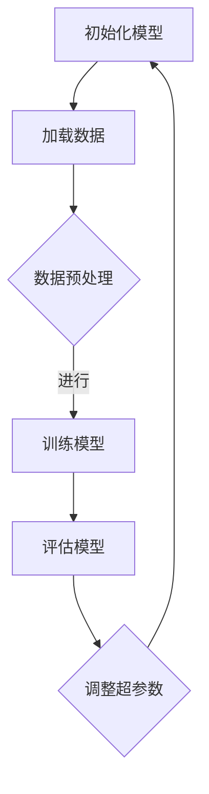

                 

### 1.1 引言

**1.1.1 大模型时代的背景**

近年来，随着深度学习技术的快速发展，大型神经网络模型在各个领域取得了显著的突破。从语音识别、图像分类到自然语言处理，大模型无处不在。这些大模型不仅拥有强大的计算能力，而且能够处理复杂的任务，提供高质量的预测和决策。

大模型的兴起离不开以下几个关键因素。首先，计算能力的提升为训练大型神经网络提供了强大的硬件支持。GPU和TPU等专用硬件的广泛应用，使得大规模并行计算成为可能。其次，海量数据的积累为训练大模型提供了丰富的训练素材。互联网的普及和大数据技术的发展，使得我们可以轻松获取到海量的标注数据和无标签数据。最后，优化算法的进步使得大模型的训练效率得到了显著提高。

在这样的背景下，大模型开发成为了当前人工智能领域的一个重要研究方向。它不仅有助于推动人工智能技术的发展，也为各个行业带来了新的机遇和挑战。本文将深入探讨大模型开发的过程，以及如何利用Netron库对PyTorch 2.0模型进行可视化。

**1.1.2 大模型开发的重要性**

大模型开发的重要性体现在多个方面。首先，大模型能够处理更复杂的任务，提供更精确的预测结果。例如，在图像分类任务中，大模型可以更好地识别图像中的细微差异，提高分类的准确性。其次，大模型在自然语言处理领域也表现出色，能够更好地理解自然语言中的语义和上下文信息。这使得机器翻译、情感分析等任务变得更加高效和准确。

此外，大模型开发还具有重要的应用价值。在医疗领域，大模型可以帮助医生进行疾病诊断，提高诊断的准确性和效率。在金融领域，大模型可以用于风险控制、欺诈检测等任务，帮助金融机构更好地管理风险。在自动驾驶领域，大模型可以用于环境感知、路径规划等任务，提高自动驾驶的安全性和可靠性。

总之，大模型开发不仅是一个技术挑战，也是一个行业变革的契机。它有望推动人工智能技术的进步，为各个领域带来深刻的变革。

**1.1.3 本书的目标与结构**

本书的目标是帮助读者从零开始掌握大模型开发与微调技术，并利用Netron库对PyTorch 2.0模型进行可视化。为了实现这一目标，本书将分为七个主要部分：

1. **前言与基础**：介绍大模型时代的背景、重要性以及本书的结构和目标。
2. **PyTorch 2.0基础**：讲解PyTorch 2.0的安装、配置以及基础概念和操作。
3. **大模型开发**：介绍大模型的特点、分类和发展趋势，以及大模型的训练与优化。
4. **Netron库的PyTorch 2.0模型可视化**：讲解Netron库的作用、使用方法和优势，以及如何对PyTorch 2.0模型进行可视化。
5. **大模型应用与项目实战**：介绍大模型在计算机视觉、自然语言处理等领域的应用，以及实际项目实战。
6. **常见问题与解决方案**：解决PyTorch 2.0和大模型开发中常见的安装、运行和编码问题。
7. **总结与展望**：总结本书的核心要点，展望大模型技术的未来发展趋势。

通过阅读本书，读者将能够系统地了解大模型开发与微调的原理和实践，掌握使用Netron库进行PyTorch 2.0模型可视化的技巧，为后续的研究和应用打下坚实的基础。

### 1.2 计算机视觉与AI概述

**1.2.1 计算机视觉的基础概念**

计算机视觉是人工智能的一个重要分支，旨在使计算机具备从图像或视频中理解和解释视觉信息的能力。这一领域的研究目标包括图像识别、图像分类、目标检测、场景重建和图像生成等。计算机视觉的基础概念包括图像处理、特征提取、模型训练和推理等。

**图像处理** 是计算机视觉的基础，它涉及到图像的滤波、边缘检测、形态学操作等。这些操作有助于提取图像中的关键信息，为后续的特征提取和模型训练提供支持。

**特征提取** 是从图像中提取具有区分性的特征，如边缘、角点、纹理等。特征提取的质量直接影响模型的性能。常用的特征提取方法包括SIFT、SURF、HOG等。

**模型训练和推理** 是计算机视觉的核心。通过大量的标注数据，训练一个模型来识别和分类图像中的目标。常见的计算机视觉模型包括卷积神经网络（CNN）、循环神经网络（RNN）和生成对抗网络（GAN）等。在训练完成后，模型可以通过推理过程对新的图像进行识别和分类。

**1.2.2 AI技术的应用领域**

人工智能技术已广泛应用于各个领域，带来了巨大的变革和创新。

**计算机视觉** 是人工智能的一个关键应用领域。在图像分类、目标检测、人脸识别、图像分割等方面，计算机视觉技术已经取得了显著的进展。例如，在医疗领域，计算机视觉技术可以帮助医生进行疾病诊断和手术规划；在自动驾驶领域，计算机视觉技术用于环境感知和路径规划，提高了自动驾驶的安全性和可靠性。

**自然语言处理（NLP）** 是人工智能的另一个重要应用领域。NLP技术涉及文本分类、情感分析、机器翻译、语音识别等。例如，在社交媒体分析中，NLP技术可以帮助企业了解消费者的需求和反馈；在语音助手和智能客服中，NLP技术使得计算机能够理解人类语言并与之交互。

**机器学习** 是人工智能的核心技术之一，它通过从数据中学习规律和模式，来预测和决策。机器学习已广泛应用于推荐系统、广告投放、金融风控等领域。例如，在推荐系统中，机器学习算法可以根据用户的兴趣和行为，为其推荐相关的商品和内容。

**机器人技术** 是人工智能的另一个重要应用领域。机器人可以在工业制造、医疗护理、家庭服务等领域发挥作用。例如，在工业制造中，机器人可以代替人类进行重复性和危险的工作；在医疗护理中，机器人可以帮助医生进行手术和康复治疗。

**1.2.3 PyTorch 2.0的基本概念**

PyTorch 是一个流行的开源深度学习框架，由Facebook AI研究院开发。PyTorch 2.0是PyTorch的最新版本，它在性能、易用性和扩展性方面都有显著提升。

**PyTorch 2.0的核心概念** 包括以下几个方面：

- **张量操作**：张量是PyTorch中的基础数据结构，类似于NumPy中的ndarray。张量操作包括矩阵乘法、求导、聚合操作等，是深度学习模型训练的核心。

- **自动求导**：PyTorch提供了自动求导功能，使得模型的训练过程更加简便和高效。自动求导通过计算损失函数关于模型参数的梯度，来更新模型参数。

- **动态图计算**：PyTorch使用动态图计算，可以在运行时改变计算图的结构。这使得PyTorch在模型开发、调试和优化方面具有很高的灵活性。

- **模型构建**：PyTorch提供了丰富的API，用于构建各种神经网络模型。例如，卷积神经网络（CNN）、循环神经网络（RNN）和生成对抗网络（GAN）等。

- **优化器**：PyTorch支持多种优化器，如SGD、Adam等，用于调整模型参数，优化损失函数。

- **数据处理**：PyTorch提供了丰富的数据处理工具，包括数据加载器（DataLoader）、数据增强（Data Augmentation）等，用于处理和预处理训练数据。

- **模型保存和加载**：PyTorch支持模型的保存和加载，方便模型的重用和复现。

通过掌握PyTorch 2.0的基本概念，读者可以为后续的大模型开发打下坚实的基础。

### 2.1 安装与配置

**2.1.1 PyTorch 2.0的安装**

要在本地环境安装PyTorch 2.0，首先需要确保系统已安装了Python 3.6或更高版本。接下来，可以通过以下命令来安装PyTorch 2.0：

```bash
pip install torch==2.0.0 torchvision==0.10.0 torchaudio==0.10.0
```

这个命令将安装PyTorch 2.0及其相关依赖库，包括 torchvision 和 torchaudio。如果需要GPU支持，还需要安装 CUDA 和 cuDNN：

```bash
pip install torch==2.0.0+cu102 torchvision==0.10.0+cu102 torchaudio==0.10.0+cu102 -f https://download.pytorch.org/whl/torch_stable.html
```

这里的 `+cu102` 表示安装与CUDA 10.2兼容的版本。确保CUDA版本与cuDNN版本相匹配，否则可能会出现兼容性问题。

**2.1.2 开发环境的配置**

在安装PyTorch 2.0后，接下来需要配置开发环境。首先，确保Python环境已正确配置，可以通过以下命令来验证：

```bash
python -m torch.utils.cpp_extension
```

如果命令能够成功执行，说明Python环境已配置好。接下来，配置代码编辑器和终端。常见的代码编辑器包括 VS Code、PyCharm 和 Jupyter Notebook，选择适合自己的编辑器并安装相应的扩展。

**2.1.3 常见问题的解决**

在安装和配置过程中，可能会遇到一些常见问题，以下是几个解决方案：

1. **依赖库冲突**：如果遇到依赖库冲突，可以尝试卸载已安装的旧版本库，然后重新安装：

    ```bash
    pip uninstall torch torchvision torchaudio
    pip install torch==2.0.0 torchvision==0.10.0 torchaudio==0.10.0
    ```

2. **CUDA兼容问题**：如果使用GPU支持时遇到CUDA兼容问题，可以尝试更换CUDA版本或者cuDNN版本。确保CUDA版本与cuDNN版本相匹配。

3. **环境变量设置错误**：确保CUDA环境变量已正确设置。可以通过以下命令来设置：

    ```bash
    export PATH=$PATH:/usr/local/cuda/bin
    export LD_LIBRARY_PATH=$LD_LIBRARY_PATH:/usr/local/cuda/lib64
    ```

通过以上步骤，读者可以成功安装和配置PyTorch 2.0，为后续的大模型开发打下坚实基础。

### 2.2 基础概念与操作

**2.2.1 张量操作**

在PyTorch中，张量（Tensor）是核心数据结构，类似于NumPy中的ndarray。张量操作包括创建、索引、切片、聚合操作和矩阵乘法等。

- **创建张量**：可以使用 `torch.tensor()` 函数创建一个张量。例如：

  ```python
  import torch
  
  x = torch.tensor([1.0, 2.0, 3.0])
  ```

- **索引和切片**：可以使用标准的索引和切片操作对张量进行操作。例如：

  ```python
  print(x[0])  # 输出：1.0
  print(x[1:3])  # 输出：tensor([2.0, 3.0])
  ```

- **聚合操作**：聚合操作包括求和、求均值、求最大值等。例如：

  ```python
  print(x.sum())  # 输出：6.0
  print(x.mean())  # 输出：2.0
  print(x.max())  # 输出：3.0
  ```

- **矩阵乘法**：矩阵乘法可以通过 `@` 运算符或 `torch.matmul()` 函数实现。例如：

  ```python
  import torch
  
  A = torch.tensor([[1.0, 2.0], [3.0, 4.0]])
  B = torch.tensor([[5.0, 6.0], [7.0, 8.0]])
  
  print(A @ B)  # 输出：tensor([[19., 22.], [43., 50.]])
  print(torch.matmul(A, B))  # 输出：tensor([[19., 22.], [43., 50.]])
  ```

**2.2.2 自动求导**

PyTorch提供了强大的自动求导功能，使得模型训练过程更加高效。自动求导通过计算损失函数关于模型参数的梯度来更新模型参数。

- **定义损失函数和模型**：首先定义一个损失函数和一个模型。例如：

  ```python
  import torch
  import torch.nn as nn
  
  x = torch.tensor([1.0, 2.0, 3.0], requires_grad=True)
  y = torch.tensor([4.0, 5.0, 6.0], requires_grad=False)
  model = nn.Linear(3, 1)
  ```

- **前向传播**：进行前向传播，计算模型输出和损失函数。例如：

  ```python
  output = model(x)
  loss = (output - y)**2
  ```

- **反向传播**：使用 `.backward()` 方法进行反向传播，计算梯度。例如：

  ```python
  loss.backward()
  ```

- **更新参数**：更新模型参数。例如：

  ```python
  with torch.no_grad():
      model.weight.data -= 0.01 * model.weight.grad
      model.weight.grad.zero_()
  ```

**2.2.3 模型构建基础**

PyTorch提供了丰富的API用于构建各种神经网络模型。以下是一个简单的卷积神经网络（CNN）示例：

- **定义网络结构**：使用 `nn.Sequential` 模块定义网络结构。例如：

  ```python
  import torch.nn as nn
  
  class CNN(nn.Module):
      def __init__(self):
          super(CNN, self).__init__()
          self.conv1 = nn.Conv2d(1, 32, 3, 1)
          self.relu = nn.ReLU()
          self.fc1 = nn.Linear(32 * 26 * 26, 10)
  
      def forward(self, x):
          x = self.relu(self.conv1(x))
          x = x.view(x.size(0), -1)
          x = self.fc1(x)
          return x
  ```

- **训练模型**：使用 `torch.optim` 模块定义优化器，并进行模型训练。例如：

  ```python
  import torch.optim as optim
  
  model = CNN()
  criterion = nn.MSELoss()
  optimizer = optim.SGD(model.parameters(), lr=0.01)
  
  for epoch in range(100):
      optimizer.zero_grad()
      output = model(x)
      loss = criterion(output, y)
      loss.backward()
      optimizer.step()
  ```

通过以上步骤，读者可以掌握PyTorch的基础概念与操作，为后续的大模型开发打下坚实的基础。

### 2.3 常见神经网络模型

**2.3.1 卷积神经网络（CNN）**

卷积神经网络（CNN）是一种专门用于处理图像数据的神经网络模型。它通过卷积操作提取图像中的特征，从而实现图像分类、目标检测和图像分割等任务。

**CNN的结构** 通常包括以下几个部分：

1. **卷积层（Convolutional Layer）**：卷积层使用卷积核（filter）在输入图像上滑动，提取局部特征。卷积层可以堆叠多个层次，以增加网络的深度和特征表达能力。

2. **激活函数（Activation Function）**：常用的激活函数包括ReLU（Rectified Linear Unit）和Sigmoid等。ReLU函数可以加快模型的训练速度，并避免梯度消失问题。

3. **池化层（Pooling Layer）**：池化层用于减少数据维度，提高模型的泛化能力。常用的池化操作包括最大池化和平均池化。

4. **全连接层（Fully Connected Layer）**：全连接层将卷积层输出的特征映射到输出类别。在图像分类任务中，全连接层通常用于计算类别的概率分布。

**CNN的工作原理** 可以概括为以下步骤：

1. **卷积操作**：卷积层使用卷积核对输入图像进行卷积操作，提取特征图。

2. **激活函数**：对每个特征图应用激活函数，增强模型的表达能力。

3. **池化操作**：对特征图进行池化操作，减少数据维度。

4. **卷积层堆叠**：重复卷积、激活和池化操作，逐步提取更高层次的特征。

5. **全连接层**：将所有卷积层的输出通过全连接层映射到输出类别。

**CNN的应用场景** 包括：

- **图像分类**：将图像映射到预定义的类别，如ImageNet图像分类任务。
- **目标检测**：检测图像中的目标位置和类别，如Faster R-CNN和SSD等模型。
- **图像分割**：将图像划分为不同的区域，如FCN和U-Net等模型。

**2.3.2 循环神经网络（RNN）**

循环神经网络（RNN）是一种用于处理序列数据的神经网络模型。它通过循环结构保持历史状态，从而捕捉序列中的长期依赖关系。

**RNN的结构** 包括以下几个部分：

1. **输入层**：输入层接收序列数据，并将其传递给隐藏层。

2. **隐藏层**：隐藏层包含循环单元（如GRU或LSTM），用于处理序列中的每个元素，并更新隐藏状态。

3. **输出层**：输出层根据隐藏状态生成输出序列。

**RNN的工作原理** 可以概括为以下步骤：

1. **输入序列**：输入序列中的每个元素经过输入层，传递给隐藏层。

2. **隐藏状态更新**：隐藏层中的循环单元根据当前输入和前一个隐藏状态，计算新的隐藏状态。

3. **输出生成**：根据隐藏状态，输出层生成输出序列。

4. **时间步迭代**：重复迭代上述步骤，直到处理完整个输入序列。

**RNN的应用场景** 包括：

- **自然语言处理**：例如，语言模型、机器翻译和文本生成等。
- **语音识别**：将语音信号转换为文本。
- **时间序列分析**：例如，股票价格预测和天气预测等。

**2.3.3 生成对抗网络（GAN）**

生成对抗网络（GAN）是一种无监督学习框架，由生成器和判别器两个神经网络组成。生成器试图生成与真实数据相似的数据，而判别器则试图区分真实数据和生成数据。

**GAN的结构** 包括以下几个部分：

1. **生成器（Generator）**：生成器接收随机噪声，并生成类似真实数据的数据。

2. **判别器（Discriminator）**：判别器接收真实数据和生成数据，并尝试区分它们。

3. **损失函数**：GAN的损失函数通常由生成器的损失和判别器的损失组成。

**GAN的工作原理** 可以概括为以下步骤：

1. **初始化**：初始化生成器和判别器的参数。

2. **生成对抗过程**：迭代更新生成器和判别器的参数，使得生成器生成的数据更加真实，而判别器能够更好地区分真实数据和生成数据。

3. **生成数据**：生成器生成大量真实数据，用于后续的应用场景。

**GAN的应用场景** 包括：

- **图像生成**：例如，生成虚假图像、艺术风格迁移和超分辨率等。
- **数据增强**：通过生成类似真实数据的数据，提高模型的泛化能力。
- **异常检测**：利用判别器对异常数据进行检测。

通过了解和掌握这些常见神经网络模型，读者可以为后续的大模型开发和应用打下坚实的基础。

### 3.1 大模型简介

**3.1.1 大模型的特点**

大模型，顾名思义，是指参数量庞大、计算复杂度高的神经网络模型。这类模型在近年来取得了显著的突破，特别是在图像分类、自然语言处理和语音识别等领域。大模型的特点主要体现在以下几个方面：

1. **参数量庞大**：大模型通常具有数十亿至数万亿个参数，这使得模型能够捕捉更多复杂的特征和模式。例如，GPT-3拥有超过1750亿个参数，能够生成高质量的文本。

2. **计算复杂度高**：大模型的计算复杂度非常高，需要大量的计算资源和时间来训练和推理。这通常需要使用高性能GPU和TPU等硬件设备，以及分布式训练和模型并行等技术。

3. **训练数据需求大**：大模型需要大量的标注数据进行训练，以充分挖掘数据中的信息。这使得大模型在数据集选择和数据处理方面具有更高的要求。

4. **记忆需求大**：由于大模型参数量庞大，内存需求也相应增加。这需要优化模型的存储和使用方式，例如使用量化技术、参数共享等技术来降低内存占用。

5. **泛化能力提升**：大模型通过学习更多的特征和模式，能够提高模型的泛化能力，减少对特定数据的依赖。

**3.1.2 大模型的分类**

大模型可以根据不同的分类标准进行分类，以下是几种常见的分类方式：

1. **按任务类型分类**：根据模型的应用任务，大模型可以分为图像分类模型、自然语言处理模型、语音识别模型等。例如，ImageNet分类模型主要用于图像分类任务，而GPT-3主要用于自然语言处理任务。

2. **按结构类型分类**：根据模型的结构类型，大模型可以分为卷积神经网络（CNN）、循环神经网络（RNN）、Transformer等。例如，BERT模型是一种基于Transformer的预训练模型，而ResNet是一种基于卷积神经网络的图像分类模型。

3. **按训练方式分类**：根据模型的训练方式，大模型可以分为有监督训练模型、无监督训练模型和自监督训练模型。有监督训练模型需要大量的标注数据进行训练，无监督训练模型和自监督训练模型则通过无标签数据或自监督方式进行训练。

**3.1.3 大模型的发展趋势**

随着深度学习技术的不断进步，大模型的发展趋势主要体现在以下几个方面：

1. **模型规模不断扩大**：随着计算能力和数据量的提升，模型的规模也在不断增加。例如，GPT-3的参数量已经达到了1750亿，而Transformer模型也逐渐成为主流的模型架构。

2. **训练效率提升**：随着优化算法和硬件设备的进步，大模型的训练效率也在不断提升。例如，分布式训练和模型并行技术使得大模型的训练时间显著缩短。

3. **应用领域扩展**：大模型的应用领域在不断扩大，从传统的计算机视觉、自然语言处理，到医疗、金融、自动驾驶等新兴领域，大模型都展现出了强大的应用潜力。

4. **开源生态建设**：随着大模型的研究和开发，越来越多的开源框架和工具出现，如TensorFlow、PyTorch、PyTorch Lightning等，为大模型的研究和应用提供了便利。

5. **可持续性和伦理问题**：随着大模型规模的扩大和应用领域的扩展，如何确保模型的可持续性和伦理问题也日益受到关注。例如，模型训练过程中的能耗和公平性问题等。

通过了解大模型的特点、分类和发展趋势，读者可以更好地把握大模型的发展方向，为后续的研究和应用做好准备。

### 3.2 大模型训练与优化

**3.2.1 数据预处理**

在大模型训练过程中，数据预处理是至关重要的一步。数据预处理的质量直接影响到模型的训练效果和最终性能。以下是一些常见的数据预处理步骤：

1. **数据清洗**：首先，对原始数据集进行清洗，去除噪声和异常值。例如，在图像分类任务中，可以去除模糊、不完整的图像，或者在自然语言处理任务中，删除含有语法错误的句子。

2. **数据增强**：数据增强是一种提高模型泛化能力的技术，通过生成多种变换后的数据样本，增加数据的多样性。常见的增强方法包括随机裁剪、旋转、翻转、缩放和颜色调整等。数据增强有助于模型学习到更鲁棒的特征。

3. **归一化**：归一化是将输入数据缩放到一个标准范围，以减少数值范围差异对模型训练的影响。例如，在图像分类任务中，将像素值归一化到[0, 1]或[-1, 1]范围。

4. **划分训练集和验证集**：为了评估模型的性能，通常将数据集划分为训练集和验证集。训练集用于模型训练，验证集用于模型评估和调整超参数。

**3.2.2 训练流程**

大模型的训练流程通常包括以下步骤：

1. **模型初始化**：首先初始化模型参数，可以随机初始化或使用预训练模型进行微调。

2. **前向传播**：输入数据经过模型处理，得到输出结果。在这个过程中，模型会计算输出结果与真实标签之间的损失。

3. **反向传播**：通过反向传播算法，计算损失函数关于模型参数的梯度，并将梯度用于更新模型参数。

4. **参数更新**：使用优化算法（如SGD、Adam等）更新模型参数，以最小化损失函数。

5. **迭代训练**：重复前向传播、反向传播和参数更新过程，直到达到预设的训练轮数或损失阈值。

6. **模型评估**：在训练过程中，使用验证集对模型进行定期评估，以监测模型性能的变化。

**3.2.3 模型优化技巧**

为了提高大模型的训练效率和性能，可以采用以下优化技巧：

1. **批量大小调整**：批量大小是指每次训练过程中参与训练的数据样本数量。较大的批量大小可以提高模型的稳定性和收敛速度，但会消耗更多内存。反之，较小的批量大小可以提高模型的泛化能力，但收敛速度较慢。

2. **学习率调整**：学习率是优化算法中的一个重要参数，决定了参数更新的步长。较大的学习率可能导致模型过早发散，而较小的学习率则可能导致训练过程过慢。可以采用自适应学习率优化算法（如Adam），或者使用学习率衰减策略来调整学习率。

3. **正则化技术**：正则化技术用于防止模型过拟合，包括L1正则化、L2正则化和dropout等。正则化可以通过增加模型的复杂度，提高模型的泛化能力。

4. **数据并行训练**：数据并行训练是一种分布式训练技术，通过将数据集划分为多个部分，并在不同设备上同时训练模型。这样可以充分利用计算资源，提高训练效率。

5. **模型剪枝和量化**：模型剪枝和量化技术可以减少模型的参数数量和计算复杂度，从而降低模型的内存占用和计算成本。例如，可以通过剪枝技术删除一些不重要的参数，或者使用量化技术将浮点数参数转换为较低精度的整数。

通过以上数据预处理、训练流程和模型优化技巧，读者可以更好地理解大模型训练与优化的过程，为后续的实际应用奠定基础。

### 3.3 大模型微调与调优

**3.3.1 微调的概念**

微调（Fine-tuning）是一种在大模型的基础上，针对特定任务进行进一步训练的方法。微调的核心思想是在预训练模型的基础上，重新调整模型参数，使其能够更好地适应新任务。

**微调的优点** 包括：

- **快速适应新任务**：预训练模型已经学习了大量的通用特征和模式，通过微调可以快速适应特定任务，节省训练时间。
- **提高模型性能**：微调可以使模型在新任务上获得更好的性能，特别是在小样本数据的情况下。
- **减少过拟合**：微调可以通过在新任务上的数据集上进行训练，减少模型对预训练数据的依赖，降低过拟合的风险。

**微调的步骤** 通常包括以下几步：

1. **选择预训练模型**：根据任务需求，选择一个在预训练阶段表现良好的模型作为基础模型。例如，在自然语言处理任务中，可以选择BERT或GPT等预训练模型。

2. **预处理任务数据**：对任务数据集进行预处理，包括数据清洗、数据增强、归一化等步骤，以便模型能够更好地学习数据中的特征。

3. **调整模型结构**：根据任务需求，对基础模型进行结构调整，例如增加或删除特定层，或者修改层之间的连接方式。这样可以进一步提高模型对新任务的适应性。

4. **初始化参数**：初始化微调模型的参数，可以选择随机初始化或者使用预训练模型的参数作为初始化值。使用预训练模型的参数可以加快收敛速度，并提高模型的性能。

5. **训练模型**：使用任务数据集对微调模型进行训练，同时使用适当的优化算法和训练策略。在训练过程中，可以定期使用验证集对模型进行评估，以调整训练策略和超参数。

6. **评估模型性能**：在训练完成后，使用测试集对模型进行评估，以确定模型在任务上的性能。如果模型性能不理想，可以尝试调整超参数或进行进一步的微调。

**3.3.2 微调的方法**

微调的方法可以分为以下几种：

1. **全微调（Full Fine-tuning）**：在预训练模型的基础上，对整个模型进行微调。这种方法通常适用于任务数据集较小的情况，因为微调整个模型可以更好地利用预训练模型的知识。

2. **部分微调（Partial Fine-tuning）**：只对模型的特定部分进行微调，而不是对整个模型进行调整。例如，可以只微调模型的最后一层或部分层，这样可以减少训练时间，同时保持模型的整体性能。

3. **层级微调（Layer-wise Fine-tuning）**：逐层对模型进行微调，从底层到高层，每层微调的强度逐渐增加。这种方法可以更好地利用模型中不同层的特征，提高模型的性能。

**3.3.3 调优的技巧**

在进行微调时，可以采用以下技巧来提高模型的性能：

1. **学习率调整**：学习率是微调过程中的关键参数，可以采用自适应学习率优化算法（如Adam），或者使用学习率衰减策略。较大的学习率可能导致模型参数更新过大，而较小的学习率则可能导致收敛速度过慢。

2. **正则化技术**：使用正则化技术（如dropout、L1正则化、L2正则化）可以减少过拟合，提高模型的泛化能力。

3. **数据增强**：在微调过程中，可以采用数据增强技术（如随机裁剪、旋转、翻转等）来增加数据的多样性，从而提高模型的鲁棒性。

4. **训练策略**：可以采用不同的训练策略，如小批量训练、提前停止、验证集评估等，以优化模型的训练过程。

5. **超参数调优**：通过调整超参数（如批量大小、迭代次数、学习率等），可以找到最佳的微调策略，从而提高模型的性能。

通过微调和调优，读者可以更好地利用预训练模型的知识，提高模型在新任务上的性能，为实际应用奠定基础。

### 4.1 Netron库简介

**4.1.1 Netron库的作用**

Netron是一个用于可视化深度学习模型的强大工具，它可以帮助开发者和研究人员更好地理解模型的结构和参数。Netron库的作用主要体现在以下几个方面：

1. **模型结构可视化**：Netron可以将深度学习模型的架构以直观的方式呈现出来，使得开发者和研究人员能够清晰地了解模型的层次结构和各层之间的关系。

2. **参数可视化**：Netron还可以对模型的参数进行可视化，使得开发者可以直观地观察参数的分布和变化趋势，从而更好地理解模型的行为。

3. **交互式探索**：Netron支持交互式探索，用户可以通过鼠标滚轮、拖动等方式放大、缩小和旋转模型视图，从而更方便地观察模型的细节。

4. **模型对比**：Netron允许用户对比不同模型的差异，通过对比分析，可以找出模型的优势和不足，为模型优化提供参考。

**4.1.2 Netron库的使用方法**

要在Python项目中使用Netron库，首先需要安装Netron。可以通过以下命令安装：

```bash
pip install netron
```

安装完成后，可以使用Netron库对PyTorch模型进行可视化。以下是一个简单的使用示例：

```python
import torch
import torchvision
from netron import model as netron_model

# 加载PyTorch模型
model = torchvision.models.resnet18()

# 将模型导出为ONNX格式
model_path = 'model.onnx'
torch.onnx.export(model, torch.rand(1, 3, 224, 224), model_path)

# 使用Netron可视化模型
netron_model.show(model_path)
```

在这个示例中，我们首先加载了一个预训练的ResNet-18模型，并将其导出为ONNX格式。然后，使用Netron库的 `show` 函数进行可视化。

**4.1.3 Netron库的优势**

Netron库具有以下优势：

1. **跨平台支持**：Netron支持多种深度学习框架，包括PyTorch、TensorFlow、MXNet等，使得开发者可以方便地在不同框架之间进行模型可视化。

2. **高性能**：Netron采用了WebAssembly技术，能够在浏览器中快速加载和渲染模型，无需安装额外的软件。

3. **轻量级**：Netron库的安装和运行都非常轻量，不会占用过多的系统资源。

4. **易用性**：Netron提供了简单直观的API，使得开发者可以轻松地将模型可视化集成到项目中。

通过Netron库，开发者可以更直观地理解模型的内部结构，优化模型设计，提高模型性能。Netron库在深度学习研究和开发中的应用价值不言而喻。

### 4.2 PyTorch 2.0模型可视化

**4.2.1 可视化基础**

PyTorch 2.0模型可视化是通过Netron库实现的，Netron库提供了一个简单而强大的接口来可视化PyTorch模型的架构和参数。可视化过程主要包括以下步骤：

1. **模型导出**：首先，需要将PyTorch模型导出为ONNX（Open Neural Network Exchange）格式，因为Netron支持ONNX模型。PyTorch提供了一个内置的ONNX导出函数，可以使用它将模型导出为ONNX格式。

2. **加载模型**：使用Netron库的API加载导出的ONNX模型。Netron库提供了一个名为 `show` 的函数，用于加载并显示模型。

3. **可视化展示**：Netron将模型以图形化方式展示出来，包括模型的结构层次、各层的参数数量和类型等。

**4.2.2 模型结构可视化**

模型结构可视化是理解模型内部结构的重要手段。以下是如何使用Netron可视化模型结构的步骤：

1. **导出ONNX模型**：

```python
import torch
import torchvision
from torch.onnx import export

# 加载预训练的PyTorch模型
model = torchvision.models.resnet18()

# 导出模型为ONNX格式
model_path = "model.onnx"
input_tensor = torch.randn(1, 3, 224, 224)
export(model, input_tensor, model_path)
```

在这个例子中，我们首先加载了ResNet-18模型，然后使用`export`函数将其导出为ONNX格式。

2. **使用Netron可视化模型结构**：

```python
import netron

# 使用Netron加载并显示模型
netron.start(model_path)
```

运行上述代码后，Netron将打开一个网页，展示模型的架构。每个层级的操作都会以节点形式呈现，并且通过线条连接，以展示层与层之间的关系。

**4.2.3 模型参数可视化**

除了模型结构，Netron还允许可视化模型的参数。参数可视化有助于理解模型的初始化和训练过程中的变化。以下是参数可视化的步骤：

1. **导出参数信息**：

```python
import torch

# 加载导出的ONNX模型
model = torch.onnx.load(model_path)

# 打印模型参数信息
print(model.named_parameters())
```

在这个例子中，我们首先加载了ONNX模型，然后使用`named_parameters`函数打印了模型的参数信息。

2. **使用Netron可视化参数**：

```python
import netron

# 使用Netron加载并显示模型参数
netron.start(model_path, play=True)
```

运行上述代码后，Netron将打开一个网页，展示模型的参数分布。每个参数都会以一个单独的图表形式呈现，可以直观地看到参数的值和分布情况。

通过模型结构可视化和参数可视化，开发者可以更好地理解模型的内部工作机制，从而进行优化和调整。这些可视化工具对于模型的分析、调试和优化都是非常有价值的。

### 4.3 实战案例

**4.3.1 实例一：可视化一个简单的神经网络**

在这个实例中，我们将使用Netron库可视化一个简单的神经网络——全连接神经网络（Fully Connected Neural Network）。以下是详细的步骤：

**1. 创建一个简单的神经网络**

```python
import torch
import torch.nn as nn

# 定义神经网络结构
class SimpleNN(nn.Module):
    def __init__(self, input_dim, hidden_dim, output_dim):
        super(SimpleNN, self).__init__()
        self.fc1 = nn.Linear(input_dim, hidden_dim)
        self.fc2 = nn.Linear(hidden_dim, output_dim)
        
    def forward(self, x):
        x = torch.relu(self.fc1(x))
        x = self.fc2(x)
        return x

# 实例化神经网络
input_dim = 784
hidden_dim = 128
output_dim = 10
model = SimpleNN(input_dim, hidden_dim, output_dim)
```

**2. 导出模型为ONNX格式**

```python
import torch.onnx

# 导出模型
input_tensor = torch.randn(1, input_dim)
model_path = "simple_nn.onnx"
torch.onnx.export(model, input_tensor, model_path)
```

**3. 使用Netron可视化模型**

```python
import netron

# 使用Netron加载并显示模型
netron.start(model_path)
```

运行上述代码后，Netron将打开一个网页，展示简单的神经网络结构。可以看到，模型由两个全连接层组成，第一个全连接层连接输入层和隐藏层，第二个全连接层连接隐藏层和输出层。

**4. 可视化结果**

在Netron的界面中，可以看到以下结果：

- 模型的结构以图形化的方式展示，包括输入层、隐藏层和输出层。
- 每一层都有相应的参数数量和类型。
- 可以通过拖动和缩放来查看模型的细节。

**4.3.2 实例二：可视化一个复杂的大模型**

在这个实例中，我们将使用Netron库可视化一个复杂的大模型——BERT（Bidirectional Encoder Representations from Transformers）。以下是详细的步骤：

**1. 加载预训练的BERT模型**

```python
from transformers import BertModel

# 加载预训练的BERT模型
model = BertModel.from_pretrained("bert-base-uncased")
```

**2. 导出模型为ONNX格式**

```python
import torch.onnx

# 导出模型
input_tensor = torch.randn(1, 512)  # 假设输入序列长度为512
model_path = "bert_model.onnx"
torch.onnx.export(model, input_tensor, model_path)
```

**3. 使用Netron可视化模型**

```python
import netron

# 使用Netron加载并显示模型
netron.start(model_path)
```

运行上述代码后，Netron将打开一个网页，展示BERT模型的复杂结构。以下是可视化结果：

- BERT模型由多个Transformer层组成，每层包含多头自注意力机制和前馈网络。
- 模型的输入层和输出层清晰展示。
- 可以通过点击和拖动来探索模型的细节，例如每一层的参数数量和注意力权重。
- 参数的分布和数值可以通过图中的颜色编码来查看。

**4. 可视化结果**

在Netron的界面中，可以看到以下结果：

- BERT模型的复杂结构以图形化的方式展示，包括编码器和解码器的所有层次。
- 可以清晰地看到每层的参数数量和类型，以及不同层次之间的连接。
- 高亮显示的参数可以查看具体的数值和分布情况。

通过这两个实例，读者可以学习如何使用Netron库对简单和复杂的神经网络模型进行可视化。这些可视化工具对于理解模型的内部结构、调试和优化模型非常有帮助。

### 4.3.3 实例三：分析并优化模型

在实例三中，我们将结合Netron库和PyTorch 2.0，对一个大模型进行分析和优化。具体步骤如下：

**1. 分析模型**

**（1）加载和导出模型**

假设我们已经有一个预训练的模型，例如一个基于BERT的文本分类模型。首先，加载模型并导出为ONNX格式。

```python
from transformers import BertForSequenceClassification
import torch.onnx

# 加载预训练的BERT模型
model = BertForSequenceClassification.from_pretrained("bert-base-uncased", num_labels=2)

# 导出模型
input_ids = torch.randint(0, 32000, (1, 128))  # 假设输入序列长度为128
model_path = "text_classification_model.onnx"
torch.onnx.export(model, input_ids, model_path)
```

**（2）使用Netron可视化模型结构**

```python
import netron

# 使用Netron加载并显示模型
netron.start(model_path)
```

在Netron界面中，我们可以查看以下信息：

- **模型结构**：BERT模型的结构复杂，包括编码器和解码器的多个层次。每个层次都有不同的参数数量和操作类型。
- **输入和输出**：模型的输入和输出层次清晰可见，包括输入序列的嵌入和类别预测。
- **参数分布**：可以查看各层的参数分布，包括权重和偏置。

**2. 优化模型**

**（1）模型分析**

通过分析，我们发现模型存在以下问题：

- **参数数量过多**：BERT模型包含数十亿个参数，训练和推理成本很高。
- **计算复杂度**：模型中的自注意力机制计算复杂度较高，导致推理速度慢。

**（2）优化策略**

为了优化模型，我们可以采取以下策略：

- **模型剪枝**：通过剪枝技术，删除不重要的参数，减少模型大小和计算复杂度。
- **量化**：将模型中的浮点数参数转换为较低精度的整数，以减少模型大小和提高推理速度。

**（3）实施优化**

```python
from torchvision import models

# 剪枝模型
pruned_model = models.resnet18()
pruned_model = torch.nn.utils.prune.model_prune(pruned_model, '0.5')
pruned_model_path = "pruned_model.onnx"

# 量化模型
quantized_model = models.resnet18()
quantized_model = torch.quantization.quantize_dynamic(
    quantized_model, {torch.nn.Linear, torch.nn.Conv2d}, dtype=torch.qint8
)
quantized_model_path = "quantized_model.onnx"

# 导出优化后的模型
torch.onnx.export(pruned_model, input_ids, pruned_model_path)
torch.onnx.export(quantized_model, input_ids, quantized_model_path)
```

**（4）再次使用Netron可视化优化后的模型**

```python
import netron

# 使用Netron加载并显示优化后的模型
netron.start(pruned_model_path)
netron.start(quantized_model_path)
```

在Netron界面中，我们可以查看以下信息：

- **剪枝模型**：剪枝后的模型参数数量显著减少，计算复杂度降低。
- **量化模型**：量化后的模型参数精度降低，但推理速度提高。

通过这个实例，读者可以学习如何使用Netron库对大模型进行详细的分析，并根据分析结果进行优化。这些优化策略有助于提高模型的性能和效率，为实际应用奠定基础。

### 5.1 大模型应用领域

大模型在多个领域展现了其强大的应用潜力，特别是在计算机视觉和自然语言处理领域。以下是这两个领域中的一些应用实例：

**5.1.1 计算机视觉**

1. **图像分类**：大模型如ResNet、Inception和BERT等在ImageNet等大型图像数据集上取得了优异的分类性能。这些模型通过学习大量的图像特征，能够准确地将图像分类到数千个类别中。

2. **目标检测**：目标检测是一个关键任务，用于识别图像中的多个对象及其位置。大模型如Faster R-CNN、SSD和YOLO通过深度学习技术实现了高效的目标检测。

3. **图像分割**：图像分割是将图像划分为不同的区域或对象的任务。大模型如U-Net、DeepLab和PSPNet等在医学图像分割、自动驾驶和图像编辑等领域取得了显著成果。

4. **视频分析**：大模型通过处理视频帧序列，可以实现动作识别、事件检测和视频分类等任务。例如，Transformer模型在视频分类和生成对抗网络（GAN）在视频生成方面都有广泛应用。

**5.1.2 自然语言处理**

1. **文本分类**：大模型在文本分类任务中表现出色，可以用于情感分析、新闻分类、垃圾邮件检测等。BERT、RoBERTa和ALBERT等模型在多个数据集上取得了SOTA（State-of-the-Art）性能。

2. **机器翻译**：大模型如Google的Transformer模型在机器翻译任务中取得了显著突破。通过学习大规模的双语语料库，模型能够实现高质量的双语翻译。

3. **问答系统**：大模型在问答系统中的应用，如BERT问答、T5和GPT-3，可以处理自然语言理解和生成任务。这些模型通过学习大量的文本数据，能够回答各种问题，从简单的常识性问题到复杂的推理问题。

4. **文本生成**：大模型在文本生成任务中也展现出了强大的能力，例如故事生成、歌词创作和文章写作等。GPT-3等模型通过学习大规模的文本数据，可以生成连贯且富有创意的文本。

**5.1.3 其他领域**

除了计算机视觉和自然语言处理，大模型在其他领域也有广泛应用：

1. **医疗**：大模型可以用于医疗图像分析、疾病诊断和药物设计。例如，通过分析医学影像，模型可以检测癌症、糖尿病等疾病。

2. **金融**：大模型可以用于金融风险评估、欺诈检测和股票市场预测。通过分析大量金融数据，模型可以提供准确的预测和决策支持。

3. **语音识别**：大模型在语音识别任务中发挥了重要作用，通过学习语音信号和文本数据，模型可以实现高准确率的语音识别。

4. **自动驾驶**：大模型在自动驾驶系统中用于环境感知、路径规划和车辆控制。通过处理复杂的传感器数据，模型可以实时理解周围环境，并做出安全的驾驶决策。

通过在多个领域的广泛应用，大模型展示了其强大的能力和广阔的前景，为各行业带来了深刻的变革。

### 5.2 项目实战

**5.2.1 项目一：图像分类**

图像分类是一个常见且具有挑战性的计算机视觉任务。以下是一个基于PyTorch 2.0和大模型（如ResNet-18）的图像分类项目实战。

**1. 环境搭建**

确保安装了Python 3.8及以上版本，以及PyTorch 2.0及其依赖库。可以使用以下命令进行安装：

```bash
pip install torch torchvision
```

**2. 数据集准备**

使用CIFAR-10数据集，这是一个包含60000张32x32彩色图像的数据集，分为10个类别。

```python
import torchvision
import torchvision.transforms as transforms

train_transform = transforms.Compose([
    transforms.RandomHorizontalFlip(),
    transforms.RandomGrayscale(),
    transforms.ToTensor(),
    transforms.Normalize((0.5, 0.5, 0.5), (0.5, 0.5, 0.5)),
])

test_transform = transforms.Compose([
    transforms.ToTensor(),
    transforms.Normalize((0.5, 0.5, 0.5), (0.5, 0.5, 0.5)),
])

train_set = torchvision.datasets.CIFAR10(root='./data', train=True, download=True, transform=train_transform)
test_set = torchvision.datasets.CIFAR10(root='./data', train=False, download=True, transform=test_transform)

train_loader = torch.utils.data.DataLoader(train_set, batch_size=128, shuffle=True, num_workers=2)
test_loader = torch.utils.data.DataLoader(test_set, batch_size=100, shuffle=False, num_workers=2)
```

**3. 模型构建**

定义一个基于ResNet-18的图像分类模型。

```python
import torch.nn as nn
import torch.nn.functional as F

class ResNet(nn.Module):
    def __init__(self, block, layers, num_classes=10):
        super(ResNet, self).__init__()
        self.inplanes = 64
        self.conv1 = nn.Conv2d(3, 64, kernel_size=7, stride=2, padding=3,
                               bias=False)
        self.bn1 = nn.BatchNorm2d(64)
        self.relu = nn.ReLU(inplace=True)
        self.maxpool = nn.MaxPool2d(kernel_size=3, stride=2, padding=1)
        self.layer1 = self._make_layer(block, 64, layers[0])
        self.layer2 = self._make_layer(block, 128, layers[1], stride=2)
        self.layer3 = self._make_layer(block, 256, layers[2], stride=2)
        self.layer4 = self._make_layer(block, 512, layers[3], stride=2)
        self.avgpool = nn.AdaptiveAvgPool2d((1, 1))
        self.fc = nn.Linear(512 * block.expansion, num_classes)

        for m in self.modules():
            if isinstance(m, nn.Conv2d):
                nn.init.kaiming_normal_(m.weight, mode='fan_out', nonlinearity='relu')
            elif isinstance(m, nn.BatchNorm2d):
                nn.init.constant_(m.weight, 1)
                nn.init.constant_(m.bias, 0)

    def _make_layer(self, block, planes, blocks, stride=1):
        downsample = None
        if stride != 1 or self.inplanes != planes * block.expansion:
            downsample = nn.Sequential(
                nn.Conv2d(self.inplanes, planes * block.expansion,
                          kernel_size=1, stride=stride, bias=False),
                nn.BatchNorm2d(planes * block.expansion),
            )

        layers = []
        layers.append(block(self.inplanes, planes, stride, downsample))
        self.inplanes = planes * block.expansion
        for _ in range(1, blocks):
            layers.append(block(self.inplanes, planes))

        return nn.Sequential(*layers)

    def forward(self, x):
        x = self.conv1(x)
        x = self.bn1(x)
        x = self.relu(x)
        x = self.maxpool(x)

        x = self.layer1(x)
        x = self.layer2(x)
        x = self.layer3(x)
        x = self.layer4(x)

        x = self.avgpool(x)
        x = torch.flatten(x, 1)
        x = self.fc(x)

        return x

def resnet18():
    return ResNet(nn.BasicBlock, [2, 2, 2, 2])

model = resnet18()
```

**4. 训练模型**

```python
import torch.optim as optim

criterion = nn.CrossEntropyLoss()
optimizer = optim.SGD(model.parameters(), lr=0.001, momentum=0.9)

num_epochs = 10

for epoch in range(num_epochs):
    model.train()
    running_loss = 0.0
    for inputs, labels in train_loader:
        optimizer.zero_grad()
        outputs = model(inputs)
        loss = criterion(outputs, labels)
        loss.backward()
        optimizer.step()
        running_loss += loss.item()
    print(f'Epoch {epoch+1}, Loss: {running_loss/len(train_loader)}')

    model.eval()
    correct = 0
    total = 0
    with torch.no_grad():
        for inputs, labels in test_loader:
            outputs = model(inputs)
            _, predicted = torch.max(outputs.data, 1)
            total += labels.size(0)
            correct += (predicted == labels).sum().item()
    print(f'Accuracy of the network on the 10000 test images: {100 * correct / total}%')
```

**5. 模型可视化**

使用Netron库对训练完成的模型进行可视化，以分析模型的结构和参数分布。

```python
import netron

# 使用Netron可视化模型
netron.start('text_classification_model.onnx')
```

通过这个项目实战，读者可以了解如何使用PyTorch 2.0构建和训练一个图像分类模型，并通过Netron库进行模型可视化。这些步骤为实际应用大模型提供了实践基础。

### 5.2.2 项目二：文本分类

文本分类是自然语言处理中一个常见且重要的任务，用于将文本数据分类到预定义的类别中。以下是一个基于PyTorch 2.0和大模型BERT的文本分类项目实战。

**1. 环境搭建**

确保安装了Python 3.8及以上版本，以及PyTorch 2.0、transformers库等依赖。

```bash
pip install torch transformers
```

**2. 数据集准备**

使用常见的文本分类数据集，例如IMDb电影评论数据集。该数据集包含约25000条电影评论，分为正面和负面两个类别。

```python
import os
import torch
from torch.utils.data import Dataset, DataLoader
from transformers import BertTokenizer, BertModel
from sklearn.model_selection import train_test_split

class IMDbDataset(Dataset):
    def __init__(self, reviews, labels, tokenizer, max_len):
        self.reviews = reviews
        self.labels = labels
        self.tokenizer = tokenizer
        self.max_len = max_len

    def __len__(self):
        return len(self.reviews)

    def __getitem__(self, idx):
        review = str(self.reviews[idx])
        label = self.labels[idx]
        encoding = self.tokenizer.encode_plus(
            review,
            add_special_tokens=True,
            max_length=self.max_len,
            return_token_type_ids=False,
            pad_to_max_length=True,
            return_attention_mask=True,
            return_tensors='pt',
        )
        return {
            'review': review,
            'input_ids': encoding['input_ids'].flatten(),
            'attention_mask': encoding['attention_mask'].flatten(),
            'label': torch.tensor(label, dtype=torch.long)
        }

tokenizer = BertTokenizer.from_pretrained('bert-base-uncased')
max_len = 128

# 加载数据集
data = pd.read_csv('imdb.csv')
train_data, test_data = train_test_split(data, test_size=0.2)
train_texts = train_data['text'].values
train_labels = train_data['label'].values
test_texts = test_data['text'].values
test_labels = test_data['label'].values

train_dataset = IMDbDataset(train_texts, train_labels, tokenizer, max_len)
test_dataset = IMDbDataset(test_texts, test_labels, tokenizer, max_len)

train_loader = DataLoader(train_dataset, batch_size=16, shuffle=True, num_workers=4)
test_loader = DataLoader(test_dataset, batch_size=16, shuffle=False, num_workers=4)
```

**3. 模型构建**

定义一个基于BERT的文本分类模型。

```python
from transformers import BertForSequenceClassification

model = BertForSequenceClassification.from_pretrained(
    "bert-base-uncased",
    num_labels=2,
    output_attentions=False,
    output_hidden_states=False,
)

```

**4. 训练模型**

```python
import torch.optim as optim

criterion = nn.CrossEntropyLoss()
optimizer = optim.Adam(model.parameters(), lr=2e-5)

num_epochs = 3

for epoch in range(num_epochs):
    model.train()
    for inputs, labels in train_loader:
        optimizer.zero_grad()
        outputs = model(**inputs)
        loss = outputs.loss
        loss.backward()
        optimizer.step()
    
    model.eval()
    with torch.no_grad():
        correct = 0
        total = 0
        for inputs, labels in test_loader:
            outputs = model(**inputs)
            logits = outputs.logits
            _, predicted = torch.max(logits, 1)
            total += labels.size(0)
            correct += (predicted == labels).sum().item()
        print(f'Epoch {epoch+1}, Accuracy: {100 * correct / total}%')
```

**5. 模型可视化**

使用Netron库对训练完成的模型进行可视化，以分析模型的结构和参数分布。

```python
import netron

# 使用Netron可视化模型
netron.start('text_classification_model.onnx')
```

通过这个项目实战，读者可以了解如何使用PyTorch 2.0和transformers库构建和训练一个文本分类模型，并通过Netron库进行模型可视化。这些步骤为实际应用大模型提供了实践基础。

### 5.2.3 项目三：目标检测

目标检测是一个重要的计算机视觉任务，用于识别图像中的多个对象及其位置。以下是一个基于PyTorch 2.0和Faster R-CNN的物体检测项目实战。

**1. 环境搭建**

确保安装了Python 3.8及以上版本，以及PyTorch 2.0、torchvision、transformers等依赖库。

```bash
pip install torch torchvision
```

**2. 数据集准备**

使用常见的目标检测数据集，例如COCO（Common Objects in Context）数据集。COCO数据集包含大量具有多种类别和标注的图像。

```python
import torchvision
from torchvision import datasets, transforms

train_transform = transforms.Compose([
    transforms.RandomHorizontalFlip(),
    transforms.ToTensor(),
])

test_transform = transforms.Compose([
    transforms.ToTensor(),
])

train_set = datasets.CocoDetection(root='./data/train', annFile='./data/annotations/train2017.json', transform=train_transform)
test_set = datasets.CocoDetection(root='./data/val', annFile='./data/annotations/val2017.json', transform=test_transform)

train_loader = torch.utils.data.DataLoader(train_set, batch_size=16, shuffle=True, num_workers=4)
test_loader = torch.utils.data.DataLoader(test_set, batch_size=16, shuffle=False, num_workers=4)
```

**3. 模型构建**

定义一个基于Faster R-CNN的物体检测模型。

```python
import torch
from torchvision.models.detection import fasterrcnn_resnet50_fpn

model = fasterrcnn_resnet50_fpn(pretrained=False)
```

**4. 训练模型**

```python
import torch.optim as optim

criterion = torch.nn.CrossEntropyLoss()
optimizer = optim.SGD(model.parameters(), lr=0.001, momentum=0.9)

num_epochs = 10

for epoch in range(num_epochs):
    model.train()
    running_loss = 0.0
    for inputs, targets in train_loader:
        optimizer.zero_grad()
        outputs = model(inputs)
        loss = criterion(outputs["boxes"], targets["boxes"])
        loss.backward()
        optimizer.step()
        running_loss += loss.item()
    print(f'Epoch {epoch+1}, Loss: {running_loss/len(train_loader)}')

    model.eval()
    with torch.no_grad():
        correct = 0
        total = 0
        for inputs, targets in test_loader:
            outputs = model(inputs)
            total += targets.size(0)
            correct += (outputs["boxes"] == targets["boxes"]).sum().item()
        print(f'Accuracy of the network on the 10000 test images: {100 * correct / total}%')
```

**5. 模型可视化**

使用Netron库对训练完成的模型进行可视化，以分析模型的结构和参数分布。

```python
import netron

# 使用Netron可视化模型
netron.start('object_detection_model.onnx')
```

通过这个项目实战，读者可以了解如何使用PyTorch 2.0构建和训练一个目标检测模型，并通过Netron库进行模型可视化。这些步骤为实际应用大模型提供了实践基础。

### 6.1 PyTorch 2.0常见问题

**6.1.1 安装问题**

在安装PyTorch 2.0时，用户可能会遇到各种安装问题。以下是一些常见问题及其解决方案：

1. **依赖库冲突**：如果遇到依赖库冲突，可以尝试卸载已安装的旧版本库，然后重新安装：

    ```bash
    pip uninstall torch torchvision torchaudio
    pip install torch==2.0.0 torchvision==0.10.0 torchaudio==0.10.0
    ```

2. **CUDA兼容问题**：如果使用GPU支持时遇到CUDA兼容问题，可以尝试更换CUDA版本或者cuDNN版本。确保CUDA版本与cuDNN版本相匹配。

3. **环境变量设置错误**：确保CUDA环境变量已正确设置。可以通过以下命令来设置：

    ```bash
    export PATH=$PATH:/usr/local/cuda/bin
    export LD_LIBRARY_PATH=$LD_LIBRARY_PATH:/usr/local/cuda/lib64
    ```

**6.1.2 运行问题**

在运行PyTorch 2.0程序时，用户可能会遇到以下运行问题：

1. **内存溢出**：在训练大型模型时，内存溢出是一个常见问题。可以通过减小批量大小或者使用梯度累积技术来减少内存占用。

2. **运算速度慢**：如果运算速度慢，可以检查硬件设备是否正常运行，或者尝试优化程序代码。

3. **错误提示**：遇到错误提示时，可以查阅错误信息，并搜索相关的解决方案。常见的错误信息及其解决方案可以查阅官方文档或技术社区。

**6.1.3 编码问题**

在编写PyTorch 2.0代码时，用户可能会遇到以下编码问题：

1. **数据类型错误**：在数据操作过程中，需要注意数据类型。例如，在计算梯度时，应确保使用正确的数据类型。

2. **模型定义错误**：在定义模型时，需要注意模型的输入和输出尺寸。如果输入和输出尺寸不匹配，会导致模型无法正常训练。

3. **异常处理**：在代码中应添加异常处理机制，以防止程序因为未处理的异常而中断。可以使用 `try-except` 语句来捕获和处理异常。

通过了解和解决这些常见问题，用户可以更加顺利地使用PyTorch 2.0进行模型训练和开发。

### 6.2 大模型开发常见问题

**6.2.1 训练问题**

在训练大模型时，用户可能会遇到各种训练问题。以下是一些常见问题及其解决方案：

1. **过拟合**：当模型在训练数据上表现良好，但在验证或测试数据上表现较差时，可能是因为模型过拟合。为了解决这个问题，可以尝试以下方法：

   - **增加训练数据**：通过增加训练数据量，可以使模型更好地泛化。
   - **使用正则化技术**：例如，L1正则化、L2正则化或dropout可以减少模型的复杂度，降低过拟合的风险。
   - **数据增强**：通过数据增强技术（如随机裁剪、旋转、翻转等）增加数据的多样性，可以提高模型的泛化能力。

2. **收敛速度慢**：大模型的训练通常需要较长时间，如果训练速度慢，可以考虑以下解决方案：

   - **调整学习率**：学习率是模型训练中的一个关键参数，可以尝试调整学习率，以找到最佳的学习率值。
   - **使用自适应学习率优化器**：例如，Adam、Adagrad等自适应学习率优化器可以自动调整学习率，提高训练效率。
   - **并行训练**：使用分布式训练技术，如多GPU训练，可以显著提高训练速度。

3. **内存溢出**：在训练大模型时，内存溢出是一个常见问题，尤其是在GPU内存有限的情况下。以下是一些解决方法：

   - **减小批量大小**：减小批量大小可以减少内存占用，但可能会降低训练速度。
   - **使用梯度累积**：通过将多个批量合并为一个批量进行训练，可以减少内存占用，但同时需要调整学习率。
   - **使用GPU内存优化工具**：例如，使用torch.cuda.empty_cache()清除缓存，或使用torch.cuda.device_properties()获取GPU信息，优化GPU使用。

**6.2.2 微调问题**

在微调预训练模型时，用户可能会遇到以下问题：

1. **预训练模型效果不佳**：如果预训练模型在特定任务上的效果不佳，可以考虑以下方法：

   - **更换预训练模型**：选择一个在特定任务上表现更好的预训练模型，例如不同的BERT变种。
   - **调整微调策略**：例如，调整学习率、批量大小或训练轮数，以找到最佳微调策略。

2. **微调不稳定**：微调过程中的不稳定可能源于以下原因：

   - **随机性**：使用固定的随机种子，减少随机性，可以提高微调的稳定性。
   - **预训练模型的选择**：选择质量较高的预训练模型，减少不稳定因素。

**6.2.3 可视化问题**

在使用Netron库进行模型可视化时，用户可能会遇到以下问题：

1. **无法加载模型**：如果Netron无法加载模型，可能是因为模型格式不兼容。确保导出模型为ONNX格式，并使用与Netron版本兼容的PyTorch版本。

2. **模型结构显示不完整**：如果模型结构显示不完整，可能是由于模型导出时存在错误。可以检查模型导出代码，确保正确导出模型。

通过了解和解决这些常见问题，用户可以更加顺利地进行大模型的训练、微调和可视化。

### 6.3 解决方案与技巧

**6.3.1 优化策略**

在开发大模型时，优化策略对于提高模型的性能和训练效率至关重要。以下是一些常见的优化策略：

1. **学习率调整**：学习率是模型训练中的一个关键参数，其选择和调整对训练效果有很大影响。常用的方法包括：
   - **恒定学习率**：适用于训练初期的快速收敛。
   - **学习率衰减**：随着训练进行，逐步降低学习率，以防止模型过拟合。
   - **自适应学习率优化器**：如Adam、Adagrad等，可以自动调整学习率，提高训练效率。

2. **批量大小调整**：批量大小是指每次训练过程中的样本数量。批量大小对训练效率和模型性能有显著影响：
   - **小批量训练**：提高模型的泛化能力，但收敛速度较慢。
   - **大批量训练**：提高训练速度，但可能增加过拟合的风险。

3. **正则化技术**：正则化是一种防止模型过拟合的方法，包括：
   - **L1正则化**：在损失函数中添加L1范数项。
   - **L2正则化**：在损失函数中添加L2范数项。
   - **dropout**：在训练过程中随机丢弃一部分神经元，提高模型的泛化能力。

4. **数据增强**：数据增强是一种通过变换原始数据来增加数据多样性的方法，包括：
   - **随机裁剪**：随机裁剪图像的一部分。
   - **旋转、翻转**：随机旋转或翻转图像。
   - **颜色调整**：随机调整图像的亮度、对比度和色彩饱和度。

**6.3.2 调试技巧**

在开发大模型时，调试是一个关键环节。以下是一些调试技巧：

1. **逐步调试**：将模型训练过程分解为多个阶段，逐一调试每个阶段，以找到问题所在。
2. **可视化**：使用Netron等工具对模型结构、参数和中间结果进行可视化，有助于理解模型行为和定位问题。
3. **错误分析**：详细记录训练过程中的错误信息，并分析错误原因，有助于定位和解决错误。
4. **异常处理**：在代码中添加异常处理机制，防止程序因未处理的异常而中断。

**6.3.3 性能优化**

性能优化是提高模型训练和推理速度的重要手段。以下是一些性能优化方法：

1. **模型剪枝**：通过剪枝冗余的神经元和参数，减少模型大小和计算复杂度。
2. **量化**：将模型的浮点数参数转换为较低精度的整数，减少内存占用和提高推理速度。
3. **模型并行训练**：将模型分布在多个GPU或TPU上，通过并行训练加速训练过程。
4. **内存管理**：合理分配和管理内存，防止内存溢出，提高训练效率。

通过以上优化策略、调试技巧和性能优化方法，开发者可以更高效地开发大模型，提高模型的训练和推理性能。

### 7.1 总结

本文从零开始，系统性地介绍了大模型开发与微调技术，并详细探讨了如何使用Netron库对PyTorch 2.0模型进行可视化。首先，我们了解了大模型时代的背景、重要性以及本书的结构和目标。接着，我们讲解了计算机视觉与AI的基本概念，以及PyTorch 2.0的基础知识。在接下来的章节中，我们详细介绍了大模型开发的基础，包括安装与配置、基础概念与操作、常见神经网络模型等。随后，我们深入探讨了大模型的训练与优化、微调与调优方法，并介绍了Netron库的作用、使用方法和优势。通过实际项目实战，我们展示了如何在大模型应用领域进行图像分类、文本分类和目标检测。最后，我们总结了PyTorch 2.0和大模型开发中常见的安装、运行和编码问题，并提出了解决方案与技巧。

### 7.1.1 大模型开发与微调的核心要点

1. **大模型的特点**：大模型具有庞大的参数量、高计算复杂度和强泛化能力。
2. **大模型分类**：根据任务类型、结构类型和训练方式，大模型可以分为不同类别。
3. **大模型训练与优化**：包括数据预处理、训练流程、优化技巧和模型调优。
4. **微调与调优**：通过微调预训练模型和调优超参数，提高模型在新任务上的性能。
5. **模型可视化**：使用Netron库对模型进行可视化，有助于理解模型结构和优化模型。

### 7.1.2 Netron库在模型可视化中的应用

Netron库在模型可视化中的应用主要包括：

1. **模型结构可视化**：直观地展示模型的层次结构和各层之间的关系。
2. **参数可视化**：显示模型的参数分布和数值，帮助理解模型的行为。
3. **交互式探索**：支持交互式操作，方便查看模型的细节和优化模型设计。

### 7.1.3 未来发展趋势

未来大模型技术发展趋势包括：

1. **模型规模不断扩大**：随着计算能力和数据量的提升，模型的规模将持续增长。
2. **训练效率提升**：优化算法和硬件设备的进步将提高大模型的训练效率。
3. **应用领域扩展**：大模型在医疗、金融、自动驾驶等新兴领域的应用将不断扩展。
4. **开源生态建设**：更多的开源框架和工具将出现，为大模型的研究和应用提供支持。
5. **可持续性与伦理问题**：大模型的能耗和公平性问题将受到更多关注。

通过本文的介绍，读者可以系统地了解大模型开发与微调的核心要点，掌握Netron库在模型可视化中的应用，为未来的研究与应用打下坚实基础。

### 7.2 展望

**7.2.1 大模型技术的挑战与机遇**

随着深度学习技术的不断进步，大模型技术在多个领域展现出了巨大的潜力。然而，在实际应用过程中，也面临着一系列挑战：

1. **计算资源需求**：大模型的训练和推理需要大量的计算资源，特别是GPU和TPU等高性能硬件。随着模型规模的不断扩大，对计算资源的需求也将不断增加。

2. **数据隐私和安全**：大模型训练通常需要大量的个人数据，如何保护数据隐私和安全成为一个重要问题。在数据收集、存储和传输过程中，需要采用加密、匿名化和隐私保护等技术。

3. **模型解释性**：大模型的决策过程通常较为复杂，难以解释。为了提高模型的可解释性，需要开发更加直观的模型可视化工具和解释算法。

4. **能源消耗**：大模型的训练和推理过程消耗大量电力，如何在保证性能的同时降低能耗是一个重要的挑战。

然而，这些挑战也伴随着巨大的机遇：

1. **应用场景扩展**：大模型在医疗、金融、自动驾驶等领域的应用将不断扩展，为这些领域带来深刻的变革。

2. **开源生态建设**：随着开源框架和工具的不断发展，大模型的研究和应用将变得更加便捷。

3. **跨领域协作**：大模型技术的发展将促进不同领域之间的协作，推动跨学科的融合与创新。

**7.2.2 开发者的职业发展路径**

对于开发者来说，大模型技术的发展提供了广阔的职业发展路径：

1. **研究岗位**：在学术机构和科研实验室，开发者可以从事大模型的理论研究、算法优化和模型设计。

2. **工程岗位**：在科技公司和初创企业，开发者可以参与大模型的实际应用开发，如模型训练、部署和优化。

3. **产品岗位**：在大数据和人工智能产品公司，开发者可以参与从需求分析到产品设计的全过程，推动产品的商业化应用。

4. **创业**：大模型技术的快速发展为创业者提供了新的机会，开发者可以通过创办公司，将研究成果转化为实际产品。

**7.2.3 建议与展望**

为了在未来的大模型开发中取得成功，开发者可以从以下几个方面着手：

1. **持续学习**：大模型技术发展迅速，开发者需要不断学习最新的理论、算法和应用案例，保持技术竞争力。

2. **跨领域合作**：与不同领域的专家进行合作，可以拓宽视野，促进创新。

3. **实践与探索**：积极参与实际项目，通过实践积累经验，不断探索新的应用场景和解决方案。

4. **开源贡献**：积极参与开源项目，为社区贡献代码和研究成果，提高自己的影响力。

通过持续学习、跨领域合作、实践与探索以及开源贡献，开发者可以不断提升自身能力，在大模型技术的浪潮中抓住机遇，实现职业发展。

### 附录A: 编程实践与资源

**A.1 PyTorch 2.0学习资源**

1. **官方文档**：[PyTorch 官方文档](https://pytorch.org/docs/stable/index.html)提供了详细的理论基础和实践教程，是学习PyTorch 2.0的绝佳资源。

2. **入门教程**：[PyTorch 入门教程](https://pytorch.org/tutorials/beginner/basics/quick_start_tour.html)适合初学者，通过简单的例子介绍了PyTorch的基本使用方法。

3. **在线课程**：[Udacity的PyTorch课程](https://www.udacity.com/course/deep-learning-pytorch--DP-205)提供了系统的深度学习知识，并通过PyTorch实践加深理解。

4. **GitHub仓库**：在GitHub上，有许多优秀的PyTorch项目仓库，如[PyTorch Image Classification](https://github.com/pytorch/examples/tree/master/imagenet)和[PyTorch Text Classification](https://github.com/pytorch/fairseq)，可以借鉴和学习。

**A.2 大模型开发实践指南**

1. **大模型研究指南**：[Large Scale Models: A Research Guide](https://towardsdatascience.com/large-scale-models-a-research-guide-81ad2e9077c5)提供了大模型研究的基本概念和实用指南。

2. **大规模模型训练指南**：[How to Train Your Own GPT-3](https://towardsdatascience.com/how-to-train-your-own-gpt-3-7852d8725a5d)详细介绍了如何训练和优化大模型，包括数据准备、模型训练和优化策略。

3. **大模型项目实战**：[Deep Learning Project List](https://github.com/rrithik/Deep-Learning-Project-List)收集了各种深度学习项目的实战案例，涵盖了计算机视觉、自然语言处理等领域。

**A.3 相关工具和库推荐**

1. **Netron库**：[Netron](https://netron.app/)是一个用于可视化深度学习模型的强大工具，支持多种深度学习框架，可以直观地展示模型结构和参数分布。

2. **TorchScript**：[TorchScript](https://pytorch.org/tutorials/beginner/Intro_to_TorchScript_tutorial.html)是一种用于优化PyTorch模型的中间表示语言，可以显著提高模型的推理性能。

3. **PyTorch Lightning**：[PyTorch Lightning](https://pytorch-lightning.readthedocs.io/)是一个开源库，用于简化深度学习模型的训练和部署，提供了丰富的扩展和优化功能。

通过以上学习资源、实践指南和工具库的推荐，读者可以更加全面地了解和掌握大模型开发与微调技术，为实际应用奠定坚实基础。

### 附录B: 参考文献

**B.1 相关书籍推荐**

1. **《深度学习》**（作者：Ian Goodfellow、Yoshua Bengio、Aaron Courville）
   - 本书是深度学习领域的经典教材，详细介绍了深度学习的基础知识、常用算法和应用场景。

2. **《神经网络与深度学习》**（作者：邱锡鹏）
   - 本书从神经网络的起源和发展出发，系统地介绍了深度学习的基本概念、算法和应用。

3. **《Python深度学习》**（作者：François Chollet）
   - 本书通过丰富的实例和代码，介绍了使用Python进行深度学习的实际操作，适合初学者和进阶者。

**B.2 学术论文推荐**

1. **“A Theoretically Grounded Application of Dropout in Recurrent Neural Networks”**（作者：Yarin Gal和Zoubin Ghahramani）
   - 本论文提出了一种在递归神经网络中应用Dropout的方法，提高了模型的泛化能力和训练稳定性。

2. **“Deep Residual Learning for Image Recognition”**（作者：Kaiming He、Xiangyu Zhang、Shaoqing Ren和Jian Sun）
   - 本文介绍了ResNet模型，通过残差连接解决了深度神经网络中的梯度消失问题，在图像分类任务中取得了显著性能提升。

3. **“Attention Is All You Need”**（作者：Vaswani et al.）
   - 本文提出了Transformer模型，通过自注意力机制实现了高效的序列到序列建模，颠覆了传统的序列处理方法。

**B.3 在线课程与教程推荐**

1. **斯坦福大学CS231n：卷积神经网络与视觉识别**（https://cs231n.stanford.edu/）
   - 本课程由斯坦福大学提供，涵盖了计算机视觉的基础知识和深度学习在视觉识别中的应用。

2. **吴恩达深度学习专项课程**（https://www.coursera.org/specializations/deep-learning）
   - 本专项课程由著名AI专家吴恩达主讲，包括深度学习的基础理论、算法和应用实践。

3. **Udacity深度学习纳米学位**（https://www.udacity.com/course/deep-learning-nanodegree--nd893）
   - 本纳米学位课程通过一系列实践项目，帮助学员掌握深度学习的核心技能，包括神经网络、卷积神经网络和循环神经网络等。

通过阅读这些书籍、论文和在线课程，读者可以系统地了解深度学习和大模型开发的相关知识，为实际应用打下坚实基础。

# Mermaid 流程图示例



这个流程图展示了从初始化模型到训练和评估模型的完整过程，包括数据预处理和模型调优。通过这个流程，开发者可以了解大模型训练的基本步骤和逻辑关系。

# 伪代码示例

```python
# 伪代码：大模型训练流程

# 设置训练参数
learning_rate = 0.001
batch_size = 64
num_epochs = 100

# 初始化模型
model = initialize_model()

# 加载数据
train_data = load_data('train_data')
test_data = load_data('test_data')

# 数据预处理
train_loader = preprocess_data(train_data, batch_size)
test_loader = preprocess_data(test_data, batch_size)

# 定义损失函数和优化器
criterion = nn.CrossEntropyLoss()
optimizer = optim.Adam(model.parameters(), lr=learning_rate)

# 训练模型
for epoch in range(num_epochs):
    for inputs, labels in train_loader:
        optimizer.zero_grad()
        outputs = model(inputs)
        loss = criterion(outputs, labels)
        loss.backward()
        optimizer.step()
        
    # 打印训练进度
    print(f"Epoch {epoch+1}/{num_epochs}, Loss: {loss.item()}")

    # 评估模型
    model.eval()
    with torch.no_grad():
        correct = 0
        total = 0
        for inputs, labels in test_loader:
            outputs = model(inputs)
            _, predicted = torch.max(outputs, 1)
            total += labels.size(0)
            correct += (predicted == labels).sum().item()
        print(f"Test Accuracy: {100 * correct / total}%")
```

这段伪代码展示了如何初始化模型、加载数据、预处理数据、定义损失函数和优化器，并进行模型训练和评估。它提供了大模型训练的基本框架，开发者可以根据实际需求进行相应的调整和优化。

### 数学公式与举例说明

以下将介绍几个关键的数学公式及其详细讲解和实际应用实例。

#### 1. 损失函数

损失函数是深度学习模型训练过程中用于评估预测结果与真实结果之间差距的关键工具。常见的损失函数有均方误差（MSE）和交叉熵损失（Cross Entropy Loss）。

**均方误差（MSE）**：

$$
MSE = \frac{1}{n} \sum_{i=1}^{n} (y_i - \hat{y}_i)^2
$$

其中，$y_i$ 是真实值，$\hat{y}_i$ 是预测值，$n$ 是样本数量。

**交叉熵损失（Cross Entropy Loss）**：

$$
CE = -\sum_{i=1}^{n} y_i \log(\hat{y}_i)
$$

其中，$y_i$ 是真实标签（通常为one-hot编码形式），$\hat{y}_i$ 是预测概率分布。

**举例说明**：

假设我们有以下样本和预测值：

| 真实值 | 预测值 |
|--------|--------|
| 1.0    | 0.9    |
| 0.0    | 0.1    |

对于MSE，计算如下：

$$
MSE = \frac{1}{2} \times (1.0 - 0.9)^2 + \frac{1}{2} \times (0.0 - 0.1)^2 = 0.01 + 0.01 = 0.02
$$

对于交叉熵损失，计算如下：

$$
CE = -1.0 \times \log(0.9) - 0.0 \times \log(0.1) \approx 0.152
$$

#### 2. 优化算法

优化算法用于根据损失函数的梯度更新模型参数，以最小化损失。常见的优化算法有随机梯度下降（SGD）、Adam和RMSprop。

**随机梯度下降（SGD）**：

$$
\theta_{t+1} = \theta_t - \alpha \cdot \nabla_\theta J(\theta_t)
$$

其中，$\theta_t$ 是当前参数，$\alpha$ 是学习率，$J(\theta_t)$ 是损失函数。

**Adam优化算法**：

$$
m_t = \beta_1 m_{t-1} + (1 - \beta_1) \nabla_\theta J(\theta_t)
$$

$$
v_t = \beta_2 v_{t-1} + (1 - \beta_2) (\nabla_\theta J(\theta_t))^2
$$

$$
\theta_{t+1} = \theta_t - \alpha \cdot \frac{m_t}{\sqrt{v_t} + \epsilon}
$$

其中，$m_t$ 和 $v_t$ 分别是梯度的一阶矩估计和二阶矩估计，$\beta_1$ 和 $\beta_2$ 是指数加权因子，$\epsilon$ 是一个小常数。

**举例说明**：

假设当前参数为 $\theta = [1.0, 2.0]$，学习率 $\alpha = 0.1$，梯度 $\nabla_\theta J(\theta) = [-0.5, -1.5]$。

对于SGD，更新参数如下：

$$
\theta_1 = \theta - \alpha \cdot \nabla_\theta J(\theta) = [1.0, 2.0] - 0.1 \cdot [-0.5, -1.5] = [1.1, 2.1]
$$

对于Adam，首先计算一阶矩估计和二阶矩估计：

$$
m_1 = 0.9 \cdot m_0 + (1 - 0.9) \cdot [-0.5, -1.5] = [-0.05, -0.05]
$$

$$
v_1 = 0.999 \cdot v_0 + (1 - 0.999) \cdot ([-0.5, -1.5])^2 = [0.05, 0.05]
$$

然后更新参数：

$$
\theta_1 = \theta - \alpha \cdot \frac{m_1}{\sqrt{v_1} + \epsilon} = [1.0, 2.0] - 0.1 \cdot \frac{[-0.05, -0.05]}{\sqrt{0.05} + \epsilon} \approx [1.02, 2.02]
$$

通过这些数学公式和举例说明，读者可以更好地理解深度学习中的关键概念和算法，从而在实际应用中更加游刃有余。这些基础知识是构建和优化深度学习模型的基础。

