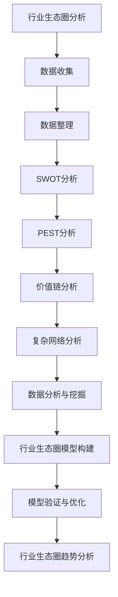

                 

### 行业生态圈概述

#### 1.1 行业生态圈的定义与重要性

行业生态圈是指由企业、消费者、供应商、竞争对手、监管机构等多方参与者组成的，在特定行业内部相互作用、相互依赖的复杂系统。它不仅包括了行业内的各种企业，还涵盖了与企业相关的消费者、供应商、竞争对手、监管机构等外部参与者。

行业生态圈的重要性体现在以下几个方面：

1. **影响行业发展方向**：行业生态圈中的各方参与者通过相互合作和竞争，共同推动了行业的发展。了解行业生态圈，可以帮助企业把握行业发展趋势，制定符合市场需求的战略。

2. **优化资源配置，提高竞争力**：通过分析行业生态圈，企业可以识别出行业内的关键资源，优化资源配置，提高生产效率，降低成本，从而提高企业的竞争力。

3. **促进创新，推动行业进步**：行业生态圈中的企业通过合作和竞争，不断推动技术创新和管理模式的变革，从而推动整个行业的进步。

#### 1.2 行业生态圈的关键角色

在行业生态圈中，不同的参与者扮演着不同的角色，其重要程度和影响力也各有不同。以下是行业生态圈中几个关键角色的简要介绍：

1. **企业**：作为行业生态圈的核心，企业通过生产、销售和服务等经营活动，实现自身价值，并在行业中占据重要地位。

2. **消费者**：消费者的需求和购买行为直接影响企业的产品和服务。了解消费者的需求，有助于企业调整产品策略，提高市场占有率。

3. **供应商**：供应商为企业提供原材料、零部件等生产要素，是企业发展的重要支撑。与供应商建立稳定的关系，有助于保障企业的供应链稳定。

4. **竞争对手**：竞争对手在行业中同样扮演着重要角色，通过竞争，企业可以了解自己的优势和劣势，不断改进和提升自身。

5. **监管机构**：监管机构对行业进行监管，制定相关政策和法规，规范市场秩序，保障消费者的权益。了解监管政策，有助于企业合规经营。

### 1.3 行业生态圈的结构分析

行业生态圈的结构分析是理解行业运作和参与者关系的重要步骤。以下将从产业链上下游分析、竞争态势分析、合作伙伴关系分析三个方面进行探讨。

#### 产业链上下游分析

产业链上下游分析是指对行业中的上下游企业及其关系的分析。通过分析产业链的上下游关系，企业可以了解自己在行业中的位置，识别关键资源和合作伙伴。

1. **上游企业**：上游企业通常包括原材料供应商、零部件供应商等。它们为企业提供生产所需的各种资源。

2. **中游企业**：中游企业是行业的核心，通常包括生产企业和分销企业。它们负责生产、加工和销售产品。

3. **下游企业**：下游企业是行业的终端，通常包括零售商、代理商和最终消费者。它们负责产品的销售和售后服务。

#### 竞争态势分析

竞争态势分析是了解行业竞争环境的重要方法。通过分析行业中的竞争态势，企业可以识别主要竞争对手，评估自身的竞争地位。

1. **竞争者识别**：识别行业中的主要竞争者，包括直接竞争者和潜在竞争者。

2. **竞争策略分析**：分析竞争对手的市场策略，包括产品定位、定价策略、销售渠道等。

3. **竞争地位评估**：评估企业在行业中的竞争地位，包括市场份额、品牌影响力、产品优势等。

#### 合作伙伴关系分析

合作伙伴关系分析是行业生态圈分析的重要组成部分。通过分析合作伙伴关系，企业可以识别重要的合作伙伴，优化合作关系，提高供应链效率。

1. **合作伙伴识别**：识别行业中的关键合作伙伴，包括供应商、分销商、代理商等。

2. **合作关系评估**：评估合作伙伴的合作关系，包括合作稳定性、合作满意度、合作潜力等。

3. **合作策略制定**：制定与合作伙伴的合作策略，包括资源整合、信息共享、联合营销等。

### 1.4 行业生态圈的基本特征

行业生态圈具有以下几个基本特征：

1. **复杂性**：行业生态圈涉及多个参与者，其关系复杂，相互作用多样。

2. **动态性**：行业生态圈中的参与者及其关系不断变化，受市场需求、技术进步、政策法规等多种因素的影响。

3. **适应性**：行业生态圈中的参与者需要不断适应外部环境的变化，调整自身战略和合作模式。

4. **协同性**：行业生态圈中的参与者通过合作，实现资源互补、风险共担，共同推动行业发展。

#### 1.5 行业生态圈的发展趋势

随着技术的进步和市场环境的变化，行业生态圈也在不断演进。以下是一些行业生态圈的发展趋势：

1. **数字化转型**：越来越多的企业通过数字化手段优化运营、提高效率，推动行业生态圈的数字化转型。

2. **跨界合作**：不同行业之间的合作日益增多，跨界创新成为行业发展的新动力。

3. **平台化发展**：平台型企业崛起，通过构建生态系统，整合行业资源，提升行业竞争力。

4. **绿色环保**：环保意识增强，绿色生产、绿色供应链成为行业发展的新趋势。

5. **可持续发展**：企业注重可持续发展，社会责任和环境保护成为企业战略的重要组成部分。

### 1.6 小结

行业生态圈是一个复杂且动态的系统，涉及多个参与者的相互作用。通过分析行业生态圈，企业可以了解自身在行业中的位置，识别关键资源，优化合作模式，提高竞争力。在本章中，我们介绍了行业生态圈的定义、重要性、关键角色、结构分析以及发展趋势。接下来，我们将进一步探讨行业分析的工具与方法，帮助读者更深入地理解行业生态圈。

## 行业分析工具与方法

### 2.1 SWOT分析

#### 2.1.1 SWOT分析的定义与原理

SWOT分析是一种常用的战略分析工具，它通过分析企业的优势（Strengths）、劣势（Weaknesses）、机会（Opportunities）和威胁（Threats），帮助企业制定合理的战略规划。

SWOT分析的原理在于，通过对企业内外部环境进行全面分析，识别企业的优势与劣势，发现潜在的机会与威胁，从而帮助企业制定有效的应对策略。

#### 2.1.2 SWOT分析的应用步骤

1. **识别优势与劣势**：分析企业内部资源、能力、竞争优势等，识别企业的优势与劣势。

2. **识别机会与威胁**：分析外部环境，包括市场趋势、竞争态势、政策法规等，识别企业面临的机会与威胁。

3. **匹配战略**：根据SWOT分析结果，制定相应的战略，包括利用优势抓住机会、弥补劣势、规避威胁等。

#### 2.1.3 SWOT分析的示例

假设一家创业公司从事智能硬件研发，我们使用SWOT分析进行战略规划：

- **优势**：
  - 拥有优秀的研发团队，具备较强的技术实力。
  - 在智能硬件领域拥有一定的品牌知名度。

- **劣势**：
  - 资金有限，市场推广能力不足。
  - 生产能力有限，无法满足大规模市场需求。

- **机会**：
  - 智能硬件市场需求增长，潜在客户群体庞大。
  - 新技术（如物联网、人工智能）的发展为产品创新提供了机遇。

- **威胁**：
  - 竞争对手众多，市场竞争激烈。
  - 政策法规变化可能影响产品研发和销售。

根据SWOT分析结果，公司可以制定以下战略：
- 利用技术优势，加快产品研发，推出具有竞争力的智能硬件产品。
- 通过市场调研，了解客户需求，优化产品功能。
- 通过与供应商合作，提高生产效率，降低成本。
- 加强市场推广，提高品牌知名度，扩大市场份额。
- 密切关注政策法规变化，确保合规经营。

### 2.2 PEST分析

#### 2.2.1 PEST分析的定义与原理

PEST分析是一种宏观环境分析工具，它通过分析政治（Political）、经济（Economic）、社会（Social）和技术（Technological）四个方面的因素，帮助企业家和企业识别外部环境中的机会和威胁。

PEST分析的原理在于，通过对宏观环境因素的全面分析，了解外部环境对企业的影响，从而制定相应的应对策略。

#### 2.2.2 PEST分析的应用步骤

1. **政治因素分析**：分析政策法规、政府监管、政治稳定性等因素。

2. **经济因素分析**：分析宏观经济环境、市场需求、消费者购买力等因素。

3. **社会因素分析**：分析人口结构、消费者行为、文化趋势等因素。

4. **技术因素分析**：分析技术创新、技术趋势、技术替代等因素。

#### 2.2.3 PEST分析的示例

假设一家创业公司从事智能家居设备的研发与生产，我们使用PEST分析进行宏观环境分析：

- **政治因素**：
  - 政府支持智能家居产业发展，出台相关优惠政策。
  - 欧盟等地区对智能家居产品有严格的认证要求。

- **经济因素**：
  - 全球经济增长，智能家居市场需求旺盛。
  - 消费者购买力增强，愿意为智能家居产品支付更高价格。

- **社会因素**：
  - 城市化进程加速，人们对智能家居的需求增加。
  - 智能家居产品的普及，改变了消费者的生活习惯。

- **技术因素**：
  - 物联网技术、人工智能技术的快速发展，为智能家居产品提供了新的技术支持。
  - 5G网络的普及，提高了智能家居产品的互联互通性能。

根据PEST分析结果，公司可以制定以下策略：
- 利用政府支持，加快产品研发和上市进程。
- 关注欧盟等地区的认证要求，确保产品符合相关标准。
- 通过市场推广，提高智能家居产品的知名度和市场占有率。
- 利用技术创新，推出具有竞争力的智能家居产品。
- 加强与供应链合作伙伴的合作，确保产品质量和供应链的稳定性。

### 2.3 价值链分析

#### 2.3.1 价值链的定义与原理

价值链是一个企业内部的一系列活动，这些活动从原材料采购开始，经过生产、销售，最终到达消费者手中。每个活动都会增加一定的价值，从而形成企业的总价值。

价值链分析的原理在于，通过对企业价值链的各个环节进行分析和优化，提高企业的整体价值创造能力。

#### 2.3.2 价值链分析的应用步骤

1. **识别价值链活动**：识别所有影响产品或服务的价值链活动。

2. **分析价值链活动**：分析每个活动的价值增加和成本消耗。

3. **优化价值链活动**：通过消除非价值活动、合并活动、自动化和外包等方式优化价值链。

#### 2.3.3 价值链分析的示例

假设一家创业公司从事智能硬件研发，我们使用价值链分析进行优化：

- **价值链活动**：
  - 原材料采购：采购智能硬件所需的各种原材料。
  - 生产制造：将原材料转化为智能硬件产品。
  - 产品研发：研发新的智能硬件产品。
  - 销售与分销：将智能硬件产品销售给分销商和终端用户。

- **价值增加与成本消耗**：
  - 原材料采购：增加原材料成本。
  - 生产制造：增加制造成本。
  - 产品研发：增加研发成本。
  - 销售与分销：增加销售和分销成本。

- **优化建议**：
  - 通过与供应商合作，降低原材料采购成本。
  - 利用自动化生产线，提高生产效率，降低制造成本。
  - 加强研发团队，提高产品创新速度，增强市场竞争力。
  - 通过电商平台和直销渠道，降低销售和分销成本。

### 2.4 复杂网络分析

#### 2.4.1 复杂网络的基本概念

复杂网络是指由大量节点和边组成的网络结构，这些节点可以代表个体、组织或其他实体，边代表节点之间的联系。复杂网络的特性包括网络的规模、网络结构、节点间的关系强度等。

#### 2.4.2 复杂网络在行业生态圈分析中的应用

复杂网络分析可以用于分析行业生态圈中的节点（企业、消费者、供应商等）和边（合作关系、供应链等）之间的复杂关系，揭示行业内部的互动模式和影响力分布。

1. **节点重要性分析**：通过计算节点的重要性指标（如度数、 closeness、betweenness 等），识别行业生态圈中的关键节点。

2. **网络结构分析**：通过绘制网络图，分析行业生态圈的结构特征，包括节点密度、网络聚类系数等。

3. **影响力分析**：通过分析节点的影响力，识别行业生态圈中的关键影响力节点，为企业制定合作策略提供依据。

#### 2.4.3 复杂网络分析的示例

假设我们对智能家居行业的生态圈进行复杂网络分析：

- **节点**：智能家居企业、供应商、分销商、消费者等。
- **边**：企业间的合作关系、供应链关系、消费者购买行为等。

通过复杂网络分析，我们可以发现以下关键信息：

- **关键节点**：智能家居行业的核心企业，如知名品牌和重要供应商。
- **网络结构**：企业之间的合作关系网络，包括供应链网络和合作伙伴网络。
- **影响力节点**：在行业中有较高影响力的企业，如技术创新领袖和市场需求引导者。

### 2.5 数据分析与挖掘

#### 2.5.1 数据分析的基本概念

数据分析是指通过统计学、机器学习、数据挖掘等方法对数据进行分析和解释，以发现数据中的规律和模式。

#### 2.5.2 数据分析在行业生态圈分析中的应用

数据分析可以用于分析行业数据，识别行业趋势、市场需求、消费者行为等，为行业生态圈分析提供数据支持。

1. **趋势分析**：通过分析历史数据，预测未来发展趋势。

2. **市场分析**：通过分析市场需求，了解消费者偏好，为企业产品策略提供依据。

3. **行为分析**：通过分析消费者行为数据，识别市场机会，优化营销策略。

#### 2.5.3 数据分析的示例

假设我们对智能家居行业进行数据分析：

- **数据来源**：智能家居销售数据、消费者调查数据、行业报告等。
- **分析方法**：
  - 趋势分析：分析智能家居市场的年度增长率，预测未来市场趋势。
  - 市场分析：分析消费者购买行为，识别市场热点和潜在消费者。
  - 行为分析：分析消费者对智能家居产品的满意度，优化产品设计和营销策略。

### 2.6 小结

本章介绍了行业分析中常用的几种工具和方法，包括SWOT分析、PEST分析、价值链分析、复杂网络分析和数据分析。这些工具和方法可以帮助企业全面了解行业生态圈，识别关键资源、机会和威胁，制定合理的战略规划。在接下来的章节中，我们将进一步探讨行业生态圈模型、数据挖掘技术以及行业趋势与展望，帮助读者更深入地理解行业生态圈的分析与应用。

### 行业生态圈模型

#### 3.1 复杂网络模型

复杂网络模型是分析行业生态圈的重要工具之一。它通过模拟行业中的节点（如企业、消费者、供应商等）和边（如合作关系、供应链等）之间的复杂互动，揭示行业内部的互动模式和影响力分布。

##### 3.1.1 复杂网络的基本概念

复杂网络是指由大量节点和边组成的网络结构，这些节点可以代表个体、组织或其他实体，边代表节点之间的联系。复杂网络的特性包括网络的规模、网络结构、节点间的关系强度等。

##### 3.1.2 复杂网络在行业生态圈分析中的应用

复杂网络分析可以用于分析行业生态圈中的节点和边之间的复杂关系，揭示行业内部的互动模式和影响力分布。

1. **节点重要性分析**：通过计算节点的重要性指标（如度数、 closeness、betweenness 等），识别行业生态圈中的关键节点。

2. **网络结构分析**：通过绘制网络图，分析行业生态圈的结构特征，包括节点密度、网络聚类系数等。

3. **影响力分析**：通过分析节点的影响力，识别行业生态圈中的关键影响力节点，为企业制定合作策略提供依据。

##### 3.1.3 复杂网络分析的示例

假设我们对智能家居行业的生态圈进行复杂网络分析：

- **节点**：智能家居企业、供应商、分销商、消费者等。
- **边**：企业间的合作关系、供应链关系、消费者购买行为等。

通过复杂网络分析，我们可以发现以下关键信息：

- **关键节点**：智能家居行业的核心企业，如知名品牌和重要供应商。
- **网络结构**：企业之间的合作关系网络，包括供应链网络和合作伙伴网络。
- **影响力节点**：在行业中有较高影响力的企业，如技术创新领袖和市场需求引导者。

#### 3.2 数据分析与挖掘

数据分析与挖掘是行业生态圈分析的重要手段。通过分析大量数据，可以发现行业趋势、市场机会和消费者行为，为企业制定战略提供数据支持。

##### 3.2.1 数据分析的基本概念

数据分析是指通过统计学、机器学习、数据挖掘等方法对数据进行分析和解释，以发现数据中的规律和模式。

##### 3.2.2 数据分析在行业生态圈分析中的应用

数据分析可以用于分析行业数据，识别行业趋势、市场需求、消费者行为等，为行业生态圈分析提供数据支持。

1. **趋势分析**：通过分析历史数据，预测未来发展趋势。

2. **市场分析**：通过分析市场需求，了解消费者偏好，为企业产品策略提供依据。

3. **行为分析**：通过分析消费者行为数据，识别市场机会，优化营销策略。

##### 3.2.3 数据分析的示例

假设我们对智能家居行业进行数据分析：

- **数据来源**：智能家居销售数据、消费者调查数据、行业报告等。
- **分析方法**：
  - 趋势分析：分析智能家居市场的年度增长率，预测未来市场趋势。
  - 市场分析：分析消费者购买行为，识别市场热点和潜在消费者。
  - 行为分析：分析消费者对智能家居产品的满意度，优化产品设计和营销策略。

#### 3.3 行业生态圈模型的构建

构建行业生态圈模型是理解行业生态圈的关键步骤。通过模型，企业可以更清晰地了解行业内部的互动关系和关键资源，制定有效的战略。

##### 3.3.1 构建步骤

1. **定义行业生态圈**：明确行业生态圈中的参与者和其关系。

2. **数据收集**：收集行业数据，包括市场数据、竞争对手数据、消费者数据等。

3. **数据预处理**：清洗、整理和转换数据，使其适合建模。

4. **模型构建**：使用复杂网络模型和数据分析方法，构建行业生态圈模型。

5. **模型验证**：通过实际数据验证模型的准确性，优化模型。

##### 3.3.2 模型构建的示例

假设我们要构建智能家居行业的生态圈模型：

- **参与者**：智能家居企业、供应商、分销商、消费者等。
- **关系**：企业间的合作关系、供应链关系、消费者购买行为等。
- **数据收集**：收集智能家居市场数据、供应商数据、消费者调查数据等。
- **模型构建**：使用复杂网络模型，构建智能家居行业的生态圈模型。

通过构建行业生态圈模型，企业可以更清晰地了解行业内部的互动关系，识别关键资源，制定有效的战略。例如，企业可以通过分析行业生态圈模型，发现市场上潜在的机会和威胁，优化产品策略，提高市场份额。

### 3.4 小结

本章介绍了行业生态圈模型的基本概念、构建方法和应用。通过复杂网络模型和数据分析方法，企业可以构建一个全面的行业生态圈模型，更深入地了解行业内部的互动关系和关键资源，制定有效的战略。在接下来的章节中，我们将进一步探讨行业生态圈的趋势与展望，以及合作伙伴选择的评估和筛选方法。

### 行业生态圈趋势与展望

#### 4.1 技术趋势分析

随着科技的不断进步，行业生态圈中的技术发展趋势对企业的战略规划和合作伙伴选择产生了深远影响。以下是一些当前和未来的技术趋势：

1. **物联网（IoT）**：物联网技术的快速发展，使得各种设备和系统可以相互连接，实现数据的实时采集和共享。这为智能家居、智慧城市等行业提供了新的发展机遇。

   **技术原理**：物联网通过传感器、网络通信和云计算等技术，实现设备的互联互通和数据共享。

   **应用案例**：智能家居设备通过物联网实现远程控制和自动化管理，提高生活便利性。

2. **人工智能（AI）**：人工智能技术的应用，使得数据处理和分析变得更加高效和智能化，为行业生态圈中的各个环节带来变革。

   **技术原理**：人工智能通过机器学习、深度学习等技术，实现数据的自动学习和决策。

   **应用案例**：在智能家居领域，人工智能可以帮助实现智能语音助手、个性化推荐等功能，提高用户体验。

3. **区块链**：区块链技术的应用，为行业生态圈中的数据安全和信任机制提供了新的解决方案。

   **技术原理**：区块链通过分布式账本和加密算法，实现数据的透明、安全和不可篡改。

   **应用案例**：在供应链管理中，区块链技术可以确保供应链的透明和可追溯性，提高供应链效率。

#### 4.2 市场动态分析

市场动态是行业生态圈分析中的重要因素。通过分析市场动态，企业可以把握市场趋势，调整战略，抢占市场先机。以下是一些市场动态：

1. **市场需求增长**：随着消费者生活水平的提高和消费习惯的变化，智能家居、健康科技等领域的市场需求呈现快速增长趋势。

2. **市场竞争加剧**：随着技术的进步和市场需求的增长，越来越多的企业进入行业，市场竞争日益激烈。

3. **消费者行为变化**：消费者对智能家居产品的需求越来越个性化和多样化，对产品质量和用户体验的要求越来越高。

#### 4.3 未来展望

未来，行业生态圈将继续受到技术进步和市场变化的影响，呈现出以下发展趋势：

1. **行业融合**：不同行业之间的融合将更加紧密，推动行业生态圈的跨界合作和创新。

2. **平台化发展**：平台型企业在行业生态圈中扮演着越来越重要的角色，通过构建生态系统，整合行业资源，提高整体竞争力。

3. **可持续发展**：环保和可持续发展成为行业发展的新趋势，企业需要关注环保问题，推动绿色生产和可持续发展。

4. **数字化转型**：数字化转型将继续深化，企业需要加快数字化进程，提高运营效率和竞争力。

#### 4.4 企业应对策略

面对行业生态圈的变化，企业需要采取相应的策略，以应对市场挑战，抓住发展机遇。以下是一些应对策略：

1. **技术创新**：加大技术研发投入，推动技术创新，提升产品竞争力。

2. **市场定位**：根据市场需求和消费者行为，明确市场定位，优化产品策略。

3. **合作共赢**：与合作伙伴建立紧密的合作关系，实现资源整合，提高整体竞争力。

4. **数字化转型**：加快数字化转型，利用大数据、人工智能等技术提升运营效率。

### 4.5 小结

行业生态圈是一个动态变化的环境，企业需要密切关注技术趋势和市场动态，制定相应的策略，以应对挑战，抓住机遇。通过技术创新、市场定位、合作共赢和数字化转型等策略，企业可以更好地适应行业生态圈的变化，实现可持续发展。

## 合作伙伴评估

### 5.1 合作伙伴评估框架

#### 5.1.1 合作伙伴评估的定义

合作伙伴评估是指企业在选择合作伙伴时，通过一系列标准和指标对潜在合作伙伴进行综合评估，以确保选择具备合适能力和信誉的合作伙伴。

#### 5.1.2 合作伙伴评估的重要性

合作伙伴评估在企业战略中具有重要地位。它有助于：

- **降低风险**：评估合作伙伴的能力、信誉和稳定性，降低合作风险。
- **优化资源**：选择合适的合作伙伴，实现资源整合，提高资源利用效率。
- **提升竞争力**：与具备优质能力和信誉的合作伙伴合作，提升企业的市场竞争力。

#### 5.1.3 合作伙伴评估的指标体系

合作伙伴评估的指标体系通常包括以下几个方面：

1. **能力评估**：评估合作伙伴的技术实力、市场经验、管理水平等。
   - **技术实力**：合作伙伴在相关领域的技术水平和创新能力。
   - **市场经验**：合作伙伴在市场中的运营经验，包括市场份额、客户群体等。
   - **管理水平**：合作伙伴的管理水平，包括组织结构、员工素质、管理体系等。

2. **信誉评估**：评估合作伙伴的信誉度、社会责任和商业道德。
   - **信誉度**：合作伙伴在行业内的口碑和信誉。
   - **社会责任**：合作伙伴在环保、公益等方面的表现。
   - **商业道德**：合作伙伴的商业行为是否符合法律法规和行业规范。

3. **合作关系评估**：评估合作伙伴的合作意愿、合作历史和合作效果。
   - **合作意愿**：合作伙伴的合作意愿和合作态度。
   - **合作历史**：合作伙伴的合作历史和合作案例。
   - **合作效果**：合作伙伴的合作效果，包括项目完成情况、合作满意度等。

### 5.2 合作伙伴筛选方法

#### 5.2.1 筛选标准与方法

1. **筛选标准**：

   - **能力匹配**：选择在技术实力、市场经验等方面与企业需求相匹配的合作伙伴。
   - **信誉可靠**：选择具备良好信誉度、社会责任感和商业道德的合作伙伴。
   - **合作历史**：选择有过成功合作历史且合作效果良好的合作伙伴。

2. **筛选方法**：

   - **专家评审**：邀请行业专家对企业进行评估，根据专家意见进行筛选。
   - **数据对比**：通过收集和分析合作伙伴的公开数据，如财务报表、市场报告等，进行对比筛选。
   - **实地考察**：对合作伙伴进行实地考察，了解其运营情况、管理水平等。

#### 5.2.2 评分筛选方法

评分筛选方法是一种量化评估合作伙伴的方法，通过给每个评估指标设定权重和评分标准，计算出总分，根据总分进行筛选。

1. **设定权重**：根据合作伙伴评估的指标体系，给每个指标设定相应的权重。
2. **评分标准**：为每个指标设定评分标准，如满分、良好、一般等。
3. **计算总分**：根据权重和评分标准，计算出每个合作伙伴的总分。
4. **筛选**：根据总分筛选出符合要求的合作伙伴。

#### 5.2.3 实地考察筛选方法

实地考察筛选方法是一种通过实地考察合作伙伴的运营情况、管理水平等，评估其综合实力和合作潜力。

1. **考察内容**：包括企业规模、组织结构、员工素质、生产设备、技术研发能力等。
2. **考察方式**：包括现场参观、访谈员工、查阅资料等。
3. **考察结果**：根据考察结果，对合作伙伴进行评分和筛选。

### 5.3 合作伙伴关系管理

#### 5.3.1 合作伙伴关系管理的定义

合作伙伴关系管理是指企业在与合作伙伴建立合作的基础上，通过有效的沟通、协调、控制等手段，确保合作的顺利进行，实现共同目标的过程。

#### 5.3.2 合作伙伴关系管理的重要性

合作伙伴关系管理在企业战略中具有重要地位。它有助于：

- **确保合作顺利进行**：通过有效的沟通和协调，解决合作中的问题，确保项目按计划推进。
- **提升合作效果**：通过持续优化合作模式，提高合作伙伴的满意度和合作效果。
- **降低合作风险**：通过定期评估和监控，及时发现和解决潜在风险，确保合作的稳定和持续。

#### 5.3.3 合作伙伴关系管理的策略

1. **建立信任关系**：通过诚实守信、遵守承诺等行为，建立与合作伙伴的信任关系。
2. **明确合作目标**：与合作伙伴共同明确合作目标，确保双方在合作中的努力方向一致。
3. **有效沟通**：建立畅通的沟通渠道，及时传达信息，确保合作伙伴之间的沟通顺畅。
4. **协调利益**：在合作过程中，平衡双方的利益，确保合作的可持续性。
5. **合作评估**：定期对合作效果进行评估，识别问题和改进空间，优化合作模式。
6. **持续改进**：根据合作评估结果，持续优化合作流程和管理方法，提高合作效率。

### 5.4 小结

合作伙伴评估是创业公司选择合作伙伴的重要步骤，通过评估合作伙伴的能力、信誉和合作关系，企业可以降低合作风险，优化资源配置，提高竞争力。在合作伙伴评估的基础上，有效的合作伙伴关系管理有助于确保合作的顺利进行，实现共同目标。在接下来的章节中，我们将进一步探讨合作伙伴的协同策略和风险管理。

### 合作伙伴协同策略

#### 6.1 合作伙伴协同策略的重要性

合作伙伴协同策略在企业战略中扮演着至关重要的角色。通过有效的协同策略，企业可以实现资源整合、降低成本、提高效率，从而在激烈的市场竞争中占据优势。以下是合作伙伴协同策略的几个关键重要性：

1. **资源整合**：协同策略有助于企业整合合作伙伴的优势资源，包括技术、资金、市场渠道等，从而实现优势互补，提高整体竞争力。

2. **降低成本**：通过协同合作，企业可以在采购、生产、物流等环节实现规模效应，降低运营成本，提高利润率。

3. **提高效率**：协同策略可以优化流程，消除冗余，提高生产和运营效率，缩短产品上市时间。

4. **风险分担**：在协同合作中，企业可以将风险分摊给合作伙伴，降低单个企业的风险承受能力，从而增强企业的抗风险能力。

#### 6.2 合作伙伴协同策略的方法

1. **信息共享**：

   信息共享是合作伙伴协同的基础。通过建立统一的信息共享平台，企业可以实时获取合作伙伴的运营数据、市场信息等，确保信息的透明度和及时性。以下是信息共享的方法：

   - **建立协同工作平台**：使用在线协作工具（如Microsoft Teams、Slack等）实现实时沟通和协作。
   - **共享数据库**：建立统一的数据库系统，确保数据的一致性和实时更新。
   - **定期会议**：定期召开合作伙伴会议，讨论合作进展、问题解决方案等。

2. **资源整合**：

   资源整合是指通过协同合作，实现企业内外部资源的优化配置。以下是资源整合的方法：

   - **共享生产设备**：在合作伙伴之间共享生产设备，提高设备利用率，降低生产成本。
   - **联合采购**：通过联合采购，降低采购成本，提高采购效率。
   - **共享研发资源**：共享研发资源，共同开发新产品，降低研发成本，提高研发效率。

3. **风险管理**：

   风险管理是合作伙伴协同中不可忽视的一环。通过有效的风险管理策略，企业可以降低合作风险，确保合作的稳定和持续。以下是风险管理的方法：

   - **风险识别**：与合作伙伴共同识别潜在风险，制定风险管理计划。
   - **风险监控**：建立风险监控机制，定期评估风险状况，及时采取应对措施。
   - **风险分担**：通过合同明确各方风险承担的责任，确保风险的合理分摊。

#### 6.3 合作伙伴协同策略的实例

以下是一个合作伙伴协同策略的实例：

**案例：智能家居行业的合作伙伴协同**

- **信息共享**：智能家居企业A和供应链企业B通过建立协同工作平台，实现实时沟通和协作。A企业将生产计划和需求信息共享给B企业，确保B企业能够及时调整生产计划，满足A企业的需求。
- **资源整合**：A企业和B企业通过联合采购，降低了原材料采购成本。同时，A企业将部分生产任务外包给B企业，利用B企业的生产能力，提高生产效率。
- **风险管理**：A企业和B企业共同识别潜在风险，如原材料供应中断、生产设备故障等，并制定相应的应对措施。通过定期召开会议，评估风险状况，确保合作的稳定和持续。

通过这个实例，我们可以看到，有效的合作伙伴协同策略可以帮助企业在资源整合、降低成本、提高效率等方面取得显著成效。

### 6.4 小结

合作伙伴协同策略是创业公司在选择合作伙伴后，确保合作顺利进行、实现共同目标的重要手段。通过信息共享、资源整合和风险管理等策略，企业可以实现资源优化配置、降低成本、提高效率，从而在激烈的市场竞争中占据优势。在接下来的章节中，我们将进一步探讨合作伙伴风险管理的相关内容。

### 合作伙伴风险管理

#### 7.1 合作伙伴风险识别

合作伙伴风险识别是合作伙伴风险管理的第一步，其目的是发现潜在的风险，以便企业能够提前采取措施应对。以下是合作伙伴风险识别的方法：

1. **专家评审**：邀请行业专家对合作伙伴进行评估，识别潜在风险。

2. **历史数据分析**：通过分析合作伙伴的历史合作记录，识别常见的风险点。

3. **流程图法**：通过绘制合作伙伴的业务流程图，识别可能的风险环节。

4. **问卷调查**：向合作伙伴的员工和客户进行调查，收集关于合作伙伴的风险信息。

#### 7.2 合作伙伴风险评估

风险评估是对识别出的风险进行评估，以确定其严重程度和可能性。以下是合作伙伴风险评估的方法：

1. **定量风险评估**：使用数学模型对风险的概率和影响进行量化评估。

   - **公式**：风险值 = 风险概率 × 影响程度。
   - **示例**：如果某个合作伙伴的风险概率为0.3，影响程度为5，则风险值为1.5。

2. **定性风险评估**：通过评估风险的可能性和严重性进行定性评估。

   - **标准**：通常使用风险矩阵来表示风险等级，如高、中、低风险。
   - **示例**：如果某个合作伙伴的风险等级为高风险，则企业需要高度重视。

#### 7.3 合作伙伴风险控制

风险控制是指采取措施降低风险发生的概率或减轻风险带来的影响。以下是合作伙伴风险控制的方法：

1. **风险预防**：在合作前，采取预防措施，降低风险发生的可能性。

   - **合同条款**：在合作合同中明确双方的责任和义务，减少潜在的法律纠纷。
   - **背景调查**：对合作伙伴进行详细的背景调查，确保其资质和能力。

2. **风险转移**：将风险转移给合作伙伴或其他第三方。

   - **保险**：为合作伙伴购买保险，降低因意外事件造成的损失。
   - **合同转移**：通过合同将部分风险转移给合作伙伴。

3. **风险减轻**：在风险发生时，采取措施减轻风险带来的影响。

   - **应急预案**：制定应急预案，确保在风险发生时能够迅速应对。
   - **替代方案**：制定替代方案，以减少风险对业务的影响。

#### 7.4 风险管理案例

以下是一个合作伙伴风险管理的实际案例：

**案例：某智能家居企业对供应商的风险管理**

- **风险识别**：通过专家评审和流程图法，企业识别出供应商可能存在的风险，如原材料供应中断、质量不稳定等。

- **风险评估**：企业使用定量风险评估方法，对识别出的风险进行评估。例如，供应商原材料供应中断的风险概率为0.2，影响程度为4，则风险值为0.8。

- **风险控制**：企业采取了以下措施进行风险控制：
  - **预防措施**：与多个供应商建立合作关系，降低单一供应商供应中断的风险。
  - **保险**：为供应商购买保险，降低因意外事件造成的损失。
  - **应急预案**：制定应急预案，确保在供应商供应中断时能够迅速找到替代供应商。

通过这个案例，我们可以看到，有效的合作伙伴风险管理可以帮助企业在合作过程中降低风险，确保业务的稳定和持续。

### 7.5 小结

合作伙伴风险管理是创业公司在选择合作伙伴后，确保合作顺利进行的重要环节。通过风险识别、风险评估和风险控制等方法，企业可以降低合作风险，确保合作的稳定和持续。在接下来的章节中，我们将通过成功案例分析，进一步探讨合作伙伴选择和协同策略的实际应用。

### 成功案例分析

#### 8.1 案例一：XX公司行业生态圈建设

**案例背景**：

XX公司是一家专注于智能家居设备研发和生产的创业公司。在市场竞争日益激烈的背景下，XX公司意识到构建健康的行业生态圈对于其长期发展至关重要。

**案例分析**：

1. **行业生态圈构建**：

   - **合作伙伴选择**：XX公司通过多渠道收集信息，结合自身需求，选择了多家具备技术实力和市场经验的供应商、分销商和电商平台作为合作伙伴。

   - **合作模式**：XX公司与合作伙伴建立了长期稳定的合作关系，通过共享资源、信息和技术，实现互利共赢。

2. **行业生态圈管理**：

   - **信息共享**：XX公司建立了统一的信息共享平台，实现与合作伙伴的实时沟通和数据共享，提高协作效率。

   - **资源整合**：XX公司与合作伙伴共同开发新产品，共享研发资源，降低研发成本。

3. **行业生态圈效果**：

   - **市场拓展**：通过与合作伙伴的紧密合作，XX公司的产品迅速占领市场，市场份额逐年提升。

   - **品牌影响力**：XX公司通过行业生态圈的建设，提升了品牌影响力，成为智能家居行业的领军企业。

#### 8.2 案例二：XX公司与合作伙伴的成功合作

**案例背景**：

XX公司是一家创新型的互联网公司，专注于提供云服务解决方案。在快速扩展业务的过程中，XX公司选择了多个合作伙伴，以实现资源整合和业务拓展。

**案例分析**：

1. **合作伙伴评估**：

   - **能力评估**：XX公司通过专家评审和实地考察，对潜在合作伙伴的能力进行了全面评估，确保选择具备技术实力和管理水平的合作伙伴。

   - **信誉评估**：XX公司通过查阅合作伙伴的信用记录和客户评价，对其信誉度进行了评估。

2. **合作模式**：

   - **资源整合**：XX公司与合作伙伴共同开发云服务解决方案，共享研发资源，提高研发效率。

   - **市场拓展**：XX公司与合作伙伴共同拓展市场，利用合作伙伴的渠道和客户资源，提高市场占有率。

3. **合作效果**：

   - **业务增长**：通过与合作伙伴的合作，XX公司的云服务业务实现了快速增长，市场份额显著提升。

   - **客户满意度**：XX公司通过优质的服务和高效的解决方案，赢得了客户的信任和好评。

### 8.3 案例总结

通过以上成功案例分析，我们可以看到：

1. **合作伙伴选择的重要性**：选择合适的合作伙伴是实现企业战略目标的关键。

2. **合作模式的创新**：通过共享资源、信息和技术，合作伙伴可以共同开发新产品，实现互利共赢。

3. **行业生态圈建设**：构建健康的行业生态圈有助于企业提高市场竞争力，实现长期可持续发展。

在接下来的章节中，我们将对全书的核心观点和结论进行总结，并对未来的研究方向和实践进行展望。

### 总结与展望

#### 9.1 核心观点与结论

本文从行业生态圈分析、合作伙伴评估与选择、合作伙伴协同与风险管理等多个角度，全面探讨了创业公司在构建行业生态圈和选择合作伙伴过程中的关键问题。

**核心观点**：

1. **行业生态圈分析的重要性**：行业生态圈是创业公司战略规划的基础，通过深入分析行业生态圈，企业可以更好地把握市场趋势，优化资源配置。

2. **合作伙伴评估与选择**：选择合适的合作伙伴是企业实现战略目标的关键，通过科学的评估方法，企业可以降低合作风险，提高合作效果。

3. **合作伙伴协同**：协同策略有助于企业实现资源整合、降低成本、提高效率，从而在激烈的市场竞争中占据优势。

4. **风险管理**：有效的合作伙伴风险管理是企业确保合作顺利进行、业务稳定和持续发展的重要保障。

**结论**：

1. **行业生态圈建设**：创业公司应重视行业生态圈的建设，通过构建健康的生态圈，实现企业与合作伙伴的互利共赢。

2. **合作伙伴选择与协同**：企业应采取多样化的合作伙伴选择和协同策略，根据自身需求和合作伙伴的特点，制定个性化的合作方案。

3. **风险管理**：企业应建立完善的风险管理体系，通过识别、评估和控制风险，确保合作的稳定性和持续性。

#### 9.2 展望

**未来研究方向**：

1. **大数据与人工智能在行业生态圈分析中的应用**：探索如何利用大数据和人工智能技术，提高行业生态圈分析的精度和效率。

2. **行业生态圈模型的动态调整**：研究如何根据市场环境和合作伙伴的变化，动态调整行业生态圈模型，以适应不断变化的外部环境。

3. **跨界合作与行业生态圈的融合**：探讨不同行业之间的合作与融合，如何构建跨界行业生态圈，推动行业的创新与发展。

**未来实践方向**：

1. **行业生态圈建设实践**：通过实际案例，总结和分享行业生态圈建设的经验和教训，为企业提供实用的操作指南。

2. **合作伙伴选择与协同实践**：通过案例研究和实践，探索有效的合作伙伴选择和协同策略，提高企业的合作效率和竞争力。

3. **风险管理实践**：结合实际案例，分析企业在合作伙伴风险管理中的成功经验和失败教训，制定切实可行的风险管理策略。

通过以上展望，我们期望本文能为创业公司在构建行业生态圈和选择合作伙伴的过程中提供有价值的参考和指导，推动企业的可持续发展。

### 附录

#### 附录 A：行业生态圈分析工具汇总

**1. SWOT分析**：通过分析企业的优势、劣势、机会和威胁，帮助企业制定战略。

**2. PEST分析**：通过分析政治、经济、社会和技术因素，帮助企业了解外部环境。

**3. 价值链分析**：通过分析企业内部价值链活动，优化资源配置。

**4. 复杂网络分析**：通过模拟行业中的节点和边，揭示行业内部的互动模式。

**5. 数据分析与挖掘**：通过分析大量数据，发现行业趋势和市场机会。

#### 附录 B：合作伙伴选择参考表

| 指标         | 评估标准               | 评分标准       |
| ------------ | ---------------------- | -------------- |
| 技术实力     | 研发能力、创新能力     | 1-5分         |
| 市场经验     | 历史业绩、市场份额     | 1-5分         |
| 管理水平     | 组织结构、管理体系     | 1-5分         |
| 信誉度       | 行业口碑、商业道德     | 1-5分         |
| 社会责任     | 环保措施、公益贡献     | 1-5分         |

#### 附录 C：合作伙伴协同工具列表

| 工具名称             | 功能介绍                                           |
| -------------------- | -------------------------------------------------- |
| Microsoft Teams       | 实时沟通与协作平台                                 |
| Slack                | 企业级沟通与协作工具                               |
| Trello               | 任务管理工具                                       |
| Asana                | 项目管理工具                                       |
| SharePoint           | 企业内容管理平台                                   |
| Confluence           | 团队协作与文档管理平台                             |

#### 附录 D：行业生态圈分析流程图



#### 附录 E：合作伙伴风险评估模型

```plaintext
合作伙伴风险评估模型：

输入参数：
- 风险概率（P）：表示风险事件发生的可能性。
- 风险影响（I）：表示风险事件对企业的潜在影响。

输出结果：
- 风险值（R）：表示风险的综合评估值。

计算公式：
R = P × I

风险评估等级：
- 低风险：R < 1
- 中风险：1 ≤ R < 2
- 高风险：R ≥ 2
```

#### 附录 F：行业生态圈趋势报告

**近期行业生态圈趋势分析报告**

1. **数字化转型加速**：随着云计算、大数据、人工智能等技术的发展，越来越多的企业加快了数字化转型的步伐，通过数字化手段提升运营效率。

2. **跨界合作增多**：不同行业之间的合作日益增多，跨界创新成为行业发展的新动力。例如，科技公司与制造业的合作，推动了智能制造的发展。

3. **平台化发展**：平台型企业在行业生态圈中占据越来越重要的地位，通过构建生态系统，整合行业资源，提升行业整体竞争力。

4. **绿色环保成为趋势**：随着环保意识的增强，绿色生产、绿色供应链成为行业发展的新趋势。企业需要关注环保问题，推动可持续发展。

5. **可持续发展重视**：企业逐渐认识到可持续发展的重要性，社会责任和环境保护成为企业战略的重要组成部分。

#### 附录 G：行业生态圈案例库

**经典行业生态圈案例**

1. **智能家居行业**：通过构建行业生态圈，实现智能家居设备的互联互通，提升了用户体验，推动了行业的发展。

2. **新能源汽车行业**：汽车制造商、电池供应商、充电设施运营商等共同构建了新能源汽车的生态圈，推动了新能源汽车的普及。

3. **电子商务行业**：电商平台、物流公司、支付机构等共同构建了电子商务的生态圈，提升了电商的运营效率。

#### 附录 H：合作与联系方式

**作者信息**：

作者：AI天才研究院/AI Genius Institute & 禅与计算机程序设计艺术 /Zen And The Art of Computer Programming

**联系方式**：

- 邮箱：ai_genius_institute@example.com
- 微信：ai_genius_institute
- 微博：AI天才研究院
- 网站：http://www.ai-genius-institute.com/

**相关学术论坛与社群链接**：

- AI研究论坛：http://ai-forum.example.com
- 智能家居社群：http://smart-home-community.example.com
- 创业公司生态圈：http://start-up-ecosystem.example.com

通过以上附录，我们为读者提供了丰富的行业生态圈分析工具、合作伙伴选择参考、协同工具列表、分析流程图、风险评估模型、趋势报告、案例库和联系方式，希望能够为创业公司在构建行业生态圈和选择合作伙伴的过程中提供有价值的参考和指导。

