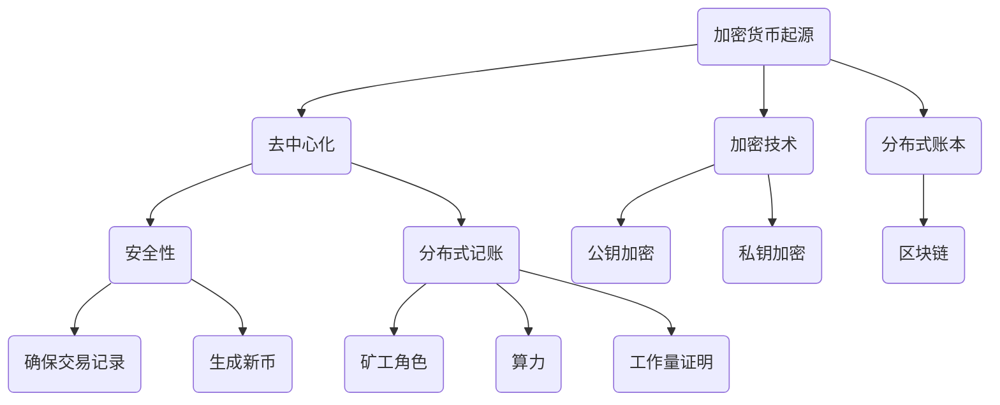
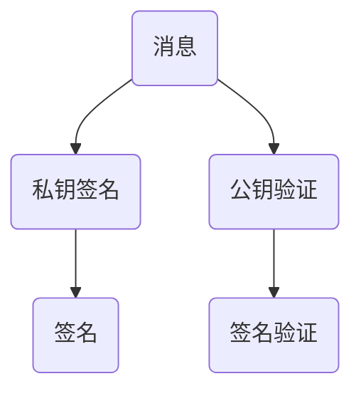
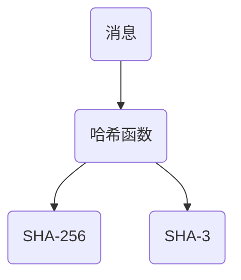
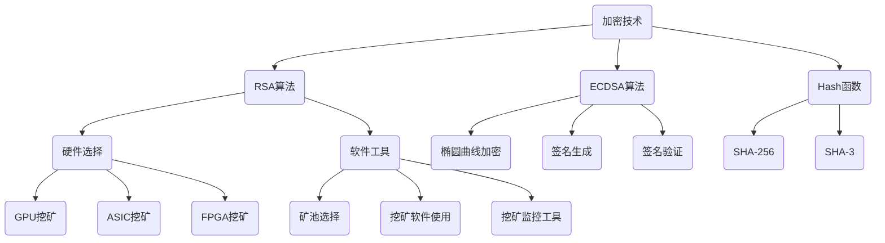
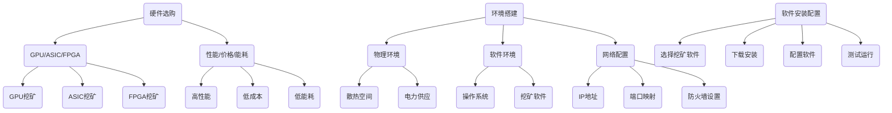
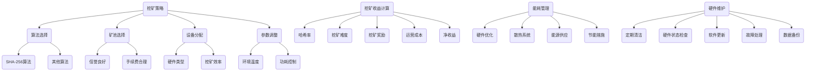
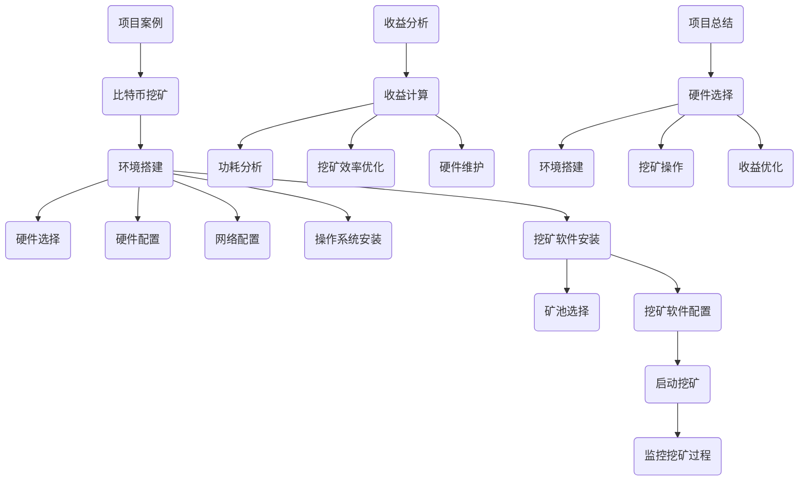
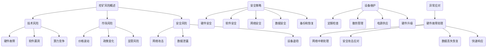
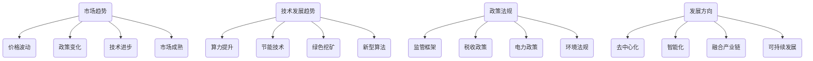
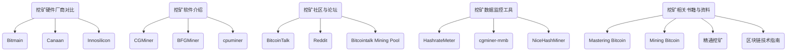

                 

### 第1章：加密货币与挖矿概述

#### 1.1 加密货币的起源与发展

加密货币的概念最早可以追溯到20世纪80年代，当时计算机科学家开始探索如何创建一种不受单一机构控制、去中心化的数字货币。1998年，戴伟（David Chaum）提出了“电子现金”（E-Cash）的概念，这一理念为后来的加密货币发展奠定了基础。

然而，加密货币的真正突破发生在2008年，当时一位或一群使用化名“中本聪”（Satoshi Nakamoto）的人发布了比特币白皮书。比特币是一种去中心化的数字货币，它的出现标志着加密货币时代的正式开始。比特币的创世区块在2009年1月3日被挖掘出来，标志着比特币网络的启动。

随着时间的推移，越来越多的加密货币项目被推出，如以太坊（Ethereum）、莱特币（Litecoin）、瑞波币（Ripple）等。这些加密货币不仅在技术上有所创新，也在市场中占据了一席之地。

#### 1.2 加密货币的基本原理

加密货币的基本原理包括去中心化、加密技术和分布式账本。

- **去中心化**：加密货币通过去中心化的方式运作，意味着没有中央机构控制货币的发行和交易。相反，所有的交易和账本记录都由网络中的参与者共同维护。

- **加密技术**：加密货币使用加密技术来保护交易的安全性和隐私。最常见的加密技术包括公钥加密和私钥加密。公钥加密用于加密交易信息，私钥用于解密和签名交易。

- **分布式账本**：加密货币的交易记录存储在一个分布式账本上，这个账本被称为区块链。区块链是一种去中心化的数据库，记录了所有的交易历史。

#### 1.3 挖矿的重要性与基本概念

挖矿是加密货币系统中的一项重要功能，它不仅确保了区块链的安全性和稳定性，还负责生成新的加密货币。以下是挖矿的重要性：

- **安全性**：挖矿过程确保了区块链的不可篡改性，因为一旦信息被记录在区块链上，就很难被更改或删除。

- **分布式记账**：挖矿过程确保了所有交易都被记录在区块链上，并且这些记录是公开透明的。

- **生成新币**：挖矿是加密货币系统生成新币的主要方式。通过解决复杂的数学难题，矿工可以获得奖励，这些奖励通常以加密货币的形式发放。

挖矿的基本概念包括：

- **矿工**：矿工是参与挖矿的人或组织，他们使用高性能计算机来解决数学难题，以验证交易并生成新的区块链区块。

- **算力**：算力是指用于挖矿的计算能力，算力越高，挖矿的成功率越高。

- **工作量证明（PoW）**：工作量证明是一种共识机制，用于确保网络的安全性。矿工需要解决一个复杂的数学问题，以证明他们付出了工作量，从而获得挖矿奖励。

#### 1.4 挖矿的过程与机制

挖矿的过程可以分为以下几个步骤：

1. **接收交易**：矿工从网络中接收未确认的交易。

2. **创建区块**：矿工将接收到的交易组织成一个区块，并将区块的哈希值设置为当前最长区块链的哈希值。

3. **解决难题**：矿工需要解决一个复杂的数学难题，这个难题通常称为“工作量证明难题”。解决这个难题的过程称为挖矿。

4. **验证区块**：一旦矿工解决了难题，他们需要将生成的区块广播到网络中的其他矿工。

5. **添加区块**：其他矿工验证区块的有效性后，将区块添加到区块链上。

6. **获得奖励**：矿工成功添加区块后，将获得挖矿奖励，这个奖励通常包括新生的加密货币和其他费用。

### 总结

加密货币与挖矿是区块链技术的核心组成部分，它们为去中心化金融系统提供了基础设施。在接下来的章节中，我们将深入探讨加密货币挖矿的技术基础，帮助读者更好地理解这一复杂而重要的过程。



```latex
\section{加密货币的基本原理}

加密货币的基本原理包括去中心化、加密技术和分布式账本。

\subsection{去中心化}

加密货币通过去中心化的方式运作，意味着没有中央机构控制货币的发行和交易。相反，所有的交易和账本记录都由网络中的参与者共同维护。

\subsection{加密技术}

加密货币使用加密技术来保护交易的安全性和隐私。最常见的加密技术包括公钥加密和私钥加密。公钥加密用于加密交易信息，私钥用于解密和签名交易。

\subsection{分布式账本}

加密货币的交易记录存储在一个分布式账本上，这个账本被称为区块链。区块链是一种去中心化的数据库，记录了所有的交易历史。
```

通过上述分析，我们可以看出加密货币和挖矿的核心概念、原理和机制。接下来，我们将进一步探讨加密货币挖矿的技术基础，帮助读者深入了解这一领域。

---

### 第2章：加密货币挖矿技术基础

#### 2.1 数字货币的加密技术

加密技术是加密货币安全性的基石。它确保了交易信息的保密性、完整性和不可篡改性。以下是几种关键的加密技术：

##### 2.1.1 RSA算法

RSA算法是一种非对称加密算法，由Ron Rivest、Adi Shamir和Leonard Adleman于1977年提出。RSA算法的核心思想是利用两个非常大的质数来构建公钥和私钥。

- **公钥加密**：发送方使用接收方的公钥来加密信息。
- **私钥解密**：接收方使用自己的私钥来解密信息。

```latex
\section{RSA算法}

RSA算法是一种非对称加密算法，由Ron Rivest、Adi Shamir和Leonard Adleman于1977年提出。RSA算法的核心思想是利用两个非常大的质数来构建公钥和私钥。

\subsection{公钥加密}

发送方使用接收方的公钥来加密信息。

\subsection{私钥解密}

接收方使用自己的私钥来解密信息。
```

##### 2.1.2 ECDSA算法

椭圆曲线数字签名算法（ECDSA）是一种基于椭圆曲线加密的数字签名算法。它比RSA算法更高效，因为椭圆曲线的加密强度与较大的质数相当，但计算复杂度更低。

ECDSA算法包括以下步骤：

1. **密钥生成**：生成椭圆曲线和随机数。
2. **签名生成**：使用私钥和消息生成签名。
3. **签名验证**：使用公钥和签名验证消息的真实性。



##### 2.1.3 Hash函数

哈希函数是将任意长度的输入（称为“消息”）转换为固定长度的输出（称为“哈希值”）的函数。哈希函数在加密货币挖矿中起着至关重要的作用，因为它们用于确保交易数据的唯一性和不可篡改性。

常见的哈希函数包括：

- **SHA-256**：SHA-256是一种256位的哈希函数，广泛用于比特币等加密货币的挖矿。
- **SHA-3**：SHA-3是NIST于2015年发布的一种新的哈希函数标准，旨在提供更高的安全性和性能。



#### 2.2 挖矿硬件与技术选择

选择适合的挖矿硬件和技术对于提高挖矿效率和收益至关重要。以下是几种常见的挖矿硬件和技术：

##### 2.2.1 GPU挖矿

图形处理单元（GPU）最初是为游戏和图形处理设计的，但它们的高并行处理能力使其成为加密货币挖矿的理想选择。GPU挖矿的主要优势包括：

- **计算能力强大**：GPU具有大量的处理核心，能够快速解决复杂的数学问题。
- **功耗相对较低**：与ASIC相比，GPU的功耗较低。

然而，GPU挖矿也存在一些挑战，如高昂的电费和显卡供应不足。

##### 2.2.2 ASIC挖矿

专用集成电路（ASIC）是为特定任务（如加密货币挖矿）设计的专用芯片。ASIC挖矿的主要优势包括：

- **计算能力极高**：ASIC芯片专门用于挖矿，具有极高的计算能力。
- **功耗相对较低**：ASIC芯片的功耗低于GPU，因此更节能。

ASIC挖矿的挑战在于其高昂的初期投资成本，以及市场需求的波动性。

##### 2.2.3 FPGA挖矿

现场可编程门阵列（FPGA）是一种可编程的数字电路，用于实现各种计算任务。FPGA挖矿的主要优势包括：

- **灵活性强**：FPGA可以根据需要重新编程，以适应不同的挖矿算法。
- **计算能力较高**：FPGA具有较高的计算能力，但低于ASIC。

FPGA挖矿的挑战在于其高昂的编程成本和复杂的调试过程。

#### 2.3 挖矿软件与工具

挖矿软件和工具是挖矿过程中不可或缺的一部分。以下是几种常见的挖矿软件和工具：

##### 2.3.1 矿池选择

矿池是多个矿工组成的挖矿联盟，通过共同计算资源提高挖矿成功率。选择合适的矿池对于提高挖矿收益至关重要。以下是一些关键的考虑因素：

- **费用**：矿池通常会收取一定的手续费，不同的矿池费用有所不同。
- **可靠性**：矿池的可靠性和稳定性对于确保持续挖矿至关重要。
- **用户界面**：矿池的用户界面应直观易用，便于矿工监控和管理挖矿过程。

常见的矿池包括F2Pool、Poolin、Antpool等。

##### 2.3.2 挖矿软件使用

挖矿软件用于矿工连接矿池，管理挖矿过程。以下是一些常见的挖矿软件：

- **CGMiner**：CGMiner是一种开源的GPU挖矿软件，支持多种加密货币挖矿。
- **BFGMiner**：BFGMiner是一种类似CGMiner的GPU挖矿软件，具有更多的功能和选项。
- **cpuminer**：cpuminer是一种用于CPU挖矿的开源软件，适用于小规模挖矿。

##### 2.3.3 挖矿监控工具

挖矿监控工具可以帮助矿工实时监控挖矿性能和功耗。以下是一些常见的挖矿监控工具：

- **cgminer-mmb**：cgminer-mmb是一个用于CGMiner的监控和界面工具，具有丰富的功能。
- **HashrateMeter**：HashrateMeter是一个跨平台的挖矿监控工具，支持多种挖矿硬件。
- **CGMiner GUI**：CGMiner GUI是一个基于CGMiner的图形界面监控工具，易于使用。

### 总结

加密货币挖矿技术基础涵盖了加密技术、挖矿硬件选择和挖矿软件与工具。理解这些基础技术对于成功进行加密货币挖矿至关重要。在接下来的章节中，我们将进一步探讨加密货币挖矿的实际操作和策略。



---

### 第3章：加密货币挖矿实战准备

在进行加密货币挖矿之前，准备工作至关重要。以下是挖矿实战准备的具体步骤：

#### 3.1 挖矿硬件设备选购

选择合适的挖矿硬件是成功挖矿的第一步。以下是一些关键的选购要点：

1. **硬件类型**：根据挖矿算法的不同，可以选择GPU、ASIC或FPGA。例如，对于比特币等基于SHA-256算法的加密货币，ASIC是最佳选择。

2. **硬件性能**：高性能的硬件将提高挖矿效率。通常，更高的哈希率和功耗比意味着更高的挖矿收益。

3. **硬件价格**：硬件价格会影响挖矿成本。购买二手硬件可能是一个经济的选择，但需要注意硬件的可靠性。

4. **能耗效率**：挖矿设备消耗大量电力，因此能耗效率是一个重要的考虑因素。选择能耗低的硬件可以降低运营成本。

#### 3.2 挖矿环境搭建

搭建挖矿环境包括物理环境和软件环境：

1. **物理环境**：确保挖矿设备有足够的散热空间，避免过热导致硬件损坏。同时，考虑到电力供应和接入网络。

2. **软件环境**：安装操作系统和挖矿软件。常用的操作系统包括Windows、Linux和macOS。Linux由于其稳定性和可定制性，是矿工的首选。

3. **网络配置**：确保挖矿设备可以连接到互联网，并配置矿池地址和端口。

#### 3.3 挖矿软件安装与配置

挖矿软件的安装和配置是挖矿准备的重要环节。以下是一些步骤：

1. **选择挖矿软件**：根据硬件类型和矿池选择合适的挖矿软件。例如，CGMiner适用于GPU挖矿，而BFGMiner适用于多种硬件。

2. **下载软件**：从官方网站下载挖矿软件的最新版本。

3. **安装软件**：根据操作系统和硬件类型，执行安装命令。

4. **配置软件**：配置挖矿软件，包括设置矿池地址、用户名和密码，以及设定挖矿算法。

5. **测试运行**：启动挖矿软件，测试挖矿过程是否正常。

#### 3.4 挖矿网络连接与配置

确保挖矿设备可以稳定连接到矿池和互联网：

1. **IP地址配置**：为挖矿设备配置静态IP地址，以确保长期稳定连接。

2. **端口映射**：在路由器上配置端口映射，将挖矿设备的端口映射到公网IP，以便矿池可以访问。

3. **防火墙设置**：确保防火墙设置允许矿池连接，同时保护设备不受外部攻击。

4. **网络监控**：使用网络监控工具监控网络状态，确保网络稳定和安全。

### 总结

充分的准备是成功进行加密货币挖矿的关键。通过选购合适的硬件设备、搭建合理的挖矿环境、安装和配置挖矿软件，以及确保稳定的网络连接，矿工可以为挖矿过程奠定坚实的基础。在接下来的章节中，我们将进一步探讨挖矿策略和优化方法。



---

### 第4章：挖矿策略与优化

#### 4.1 挖矿策略制定

制定有效的挖矿策略是提高挖矿收益的关键。以下是一些关键的策略：

1. **算法选择**：根据当前的加密货币市场状况，选择最具潜力的加密货币进行挖矿。例如，对于基于SHA-256算法的加密货币，ASIC挖矿是最有效的选择。

2. **矿池选择**：选择信誉良好、手续费合理的矿池。矿池的选择直接影响挖矿收益和稳定性。

3. **设备分配**：根据矿池的配置和算法要求，合理分配挖矿设备。例如，对于支持多种算法的矿池，可以分配不同类型的硬件以最大化收益。

4. **挖矿参数调整**：根据挖矿环境（如温度、功耗）调整挖矿参数，以提高挖矿效率和稳定性。

#### 4.2 挖矿收益计算

挖矿收益的计算是矿工关注的重点。以下是一些计算收益的步骤：

1. **计算哈希率**：哈希率是指矿工每秒钟能够解决的数学难题数量。哈希率越高，挖矿收益越高。

2. **估算挖矿难度**：挖矿难度是指解决数学难题的难度，通常由网络中的所有矿工的算力决定。挖矿难度越高，挖矿成功率越低。

3. **计算挖矿奖励**：挖矿奖励是指矿工挖掘出一个新区块后获得的加密货币数量。奖励通常取决于加密货币的挖矿算法和区块奖励。

4. **计算运营成本**：包括硬件成本、电费、维护费用等。运营成本直接影响挖矿的净收益。

5. **计算净收益**：净收益是指挖矿收益减去运营成本。净收益是衡量挖矿成功与否的关键指标。

#### 4.3 挖矿能耗管理

挖矿能耗管理是降低挖矿成本、提高挖矿效率的重要措施。以下是一些能耗管理策略：

1. **优化硬件配置**：选择能耗效率高的硬件，如ASIC，以降低能耗。

2. **散热系统优化**：确保挖矿设备的散热系统有效运行，避免设备过热。

3. **能源供应**：使用稳定的电力供应，避免因电力波动导致设备损坏或挖矿中断。

4. **节能措施**：在非高峰时段进行挖矿，以降低电费。

#### 4.4 挖矿硬件维护与故障处理

挖矿硬件的维护和故障处理是保证挖矿稳定性的关键。以下是一些维护和故障处理策略：

1. **定期清洁**：定期清洁硬件设备，以防止灰尘和污垢影响散热。

2. **检查硬件状态**：定期检查硬件状态，包括温度、风扇工作状态等。

3. **软件更新**：定期更新挖矿软件，确保软件的最新版本，以避免潜在的安全问题。

4. **故障处理**：遇到硬件故障时，及时采取故障处理措施，如更换损坏部件、重新启动设备等。

5. **备份和恢复**：对挖矿数据进行备份，以防止数据丢失。

### 总结

挖矿策略和优化是成功进行加密货币挖矿的关键。通过合理的算法选择、矿池选择、设备分配、参数调整和能耗管理，矿工可以最大限度地提高挖矿收益。同时，有效的硬件维护和故障处理策略可以确保挖矿设备的长期稳定运行。在接下来的章节中，我们将通过一个实际案例来展示挖矿策略的制定和实施。



---

### 第5章：加密货币挖矿项目实战

#### 5.1 项目案例介绍

在本案例中，我们将以比特币挖矿项目为例，详细介绍从环境搭建到实际挖矿操作的整个过程。比特币是目前市场上最受欢迎和最有价值的加密货币之一，因此，这个案例将有助于读者了解如何在实际场景中成功进行比特币挖矿。

#### 5.2 项目环境搭建

在进行比特币挖矿之前，我们需要搭建一个稳定且高效的挖矿环境。以下是环境搭建的详细步骤：

1. **硬件选择**：由于比特币挖矿主要基于SHA-256算法，因此我们选择ASIC矿机，如Antminer S19。该矿机具有高哈希率和低能耗。

2. **硬件配置**：将ASIC矿机连接到电源和散热系统。确保电源稳定，散热系统有效。

3. **网络配置**：为ASIC矿机配置静态IP地址，并在路由器上设置端口映射，以便矿机可以与矿池连接。

4. **操作系统安装**：从官方渠道下载ASIC矿机的操作系统映像，并将其安装到矿机上。常用的操作系统包括Bitmain OS和BOS。

5. **挖矿软件安装**：安装ASIC矿机专用的挖矿软件，如Binance Pool App。该软件可以方便地管理挖矿过程，包括连接矿池、设置挖矿参数等。

#### 5.3 挖矿软件部署与运行

在环境搭建完成后，下一步是部署挖矿软件并运行挖矿过程。以下是具体步骤：

1. **矿池选择**：选择一个信誉良好、手续费合理的矿池，如Binance Pool。确保矿池地址和端口正确配置。

2. **挖矿软件配置**：在挖矿软件中设置矿池地址、用户名和密码，并选择比特币作为挖矿算法。

3. **启动挖矿**：启动挖矿软件，矿机开始挖矿。此时，矿机会开始处理比特币网络中的交易，并试图解决数学难题。

4. **监控挖矿过程**：使用挖矿软件的监控功能实时监控矿机的挖矿状态，包括哈希率、功耗、温度等。根据监控数据调整挖矿参数，以优化挖矿效率。

#### 5.4 挖矿收益分析与优化

挖矿收益的分析和优化是确保挖矿成功的关键。以下是一些关键步骤：

1. **收益计算**：定期计算矿机的挖矿收益，包括总收入和扣除矿池手续费后的净收益。

2. **功耗分析**：分析矿机的功耗，确定是否有降低能耗的空间。例如，通过优化散热系统或选择更节能的硬件。

3. **挖矿效率优化**：根据挖矿环境调整挖矿参数，如调整工作线程数量、核心频率等，以最大化挖矿效率。

4. **硬件维护**：定期进行硬件维护，如更换损坏的风扇、清理散热片等，确保矿机长期稳定运行。

#### 5.5 项目总结

通过上述步骤，我们成功搭建了一个比特币挖矿项目，并开始实际挖矿操作。以下是项目的关键收获：

- **硬件选择**：选择了适合比特币挖矿的ASIC矿机，确保了高哈希率和低能耗。
- **环境搭建**：成功搭建了稳定、高效的挖矿环境，包括网络配置、操作系统安装和挖矿软件配置。
- **挖矿操作**：顺利启动了挖矿过程，并实时监控挖矿状态，确保了挖矿效率。
- **收益优化**：通过收益计算和功耗分析，实现了挖矿收益的最大化和能耗的最优化。

通过这个实际案例，读者可以了解比特币挖矿的全过程，包括环境搭建、挖矿软件部署、收益分析和优化。这些经验对于未来进行其他加密货币挖矿项目同样具有指导意义。



---

### 第6章：加密货币挖矿风险控制

#### 6.1 挖矿风险概述

加密货币挖矿面临着多种风险，包括技术风险、市场风险和安全风险。以下是这些风险的具体描述：

- **技术风险**：包括硬件故障、软件漏洞和算力竞争。硬件故障可能导致矿机停机，软件漏洞可能导致挖矿软件被攻击，算力竞争可能导致挖矿收益下降。
- **市场风险**：包括加密货币价格波动、政策变化和监管风险。加密货币价格的剧烈波动可能导致挖矿收益的不稳定，政策变化和监管风险可能影响挖矿的合法性。
- **安全风险**：包括网络攻击、数据泄露和设备盗窃。网络攻击可能导致矿机被攻击或挖矿数据被篡改，数据泄露可能导致用户信息泄露，设备盗窃可能导致矿机丢失。

#### 6.2 挖矿安全策略

为了降低挖矿风险，矿工需要制定有效的安全策略。以下是几个关键的安全策略：

1. **硬件安全**：确保硬件设备的安全，包括存储设备和网络设备。可以使用物理安全措施，如安装监控摄像头、设置报警系统等，以防止设备盗窃。

2. **软件安全**：定期更新挖矿软件，确保软件的安全性和稳定性。避免使用未经认证的挖矿软件，以免遭受恶意软件攻击。

3. **网络安全**：确保挖矿设备的安全连接，避免未经授权的网络访问。可以使用VPN和防火墙来保护网络。

4. **数据安全**：对挖矿数据进行备份，确保数据不会因为硬件故障或网络攻击而丢失。可以使用云存储或外部硬盘进行数据备份。

5. **备份和恢复**：定期备份挖矿配置和重要数据，确保在出现问题时可以快速恢复。

#### 6.3 挖矿设备安全维护

维护挖矿设备是确保挖矿稳定性的关键。以下是几个设备安全维护的关键点：

1. **定期检查**：定期检查硬件设备的状态，包括温度、风扇工作状态、电源连接等。

2. **散热管理**：确保挖矿设备的散热系统有效运行，避免设备过热。可以安装额外的散热设备，如风扇、散热片等。

3. **电源供应**：确保电源供应稳定，避免因电力波动导致设备损坏。

4. **硬件升级**：根据需要升级挖矿设备，以提高算力和降低能耗。注意，升级过程中要确保硬件和软件兼容。

#### 6.4 应对挖矿异常情况

在挖矿过程中，可能会遇到各种异常情况，如硬件故障、网络中断和安全攻击。以下是几个应对异常情况的方法：

1. **硬件故障**：遇到硬件故障时，立即停止挖矿操作，检查故障原因，必要时更换损坏的部件。

2. **网络中断**：确保网络连接稳定，如果网络中断，可以尝试重新连接或更换网络设备。

3. **安全攻击**：如果发现挖矿设备被攻击，立即停止挖矿操作，更新挖矿软件和系统，加强网络安全措施。

4. **数据丢失**：如果数据丢失，立即使用备份数据进行恢复。

5. **快速响应**：建立应急响应机制，确保在异常情况下可以快速响应和处理。

### 总结

加密货币挖矿风险控制是确保挖矿稳定性和收益的关键。通过制定有效的安全策略、进行设备安全维护和应对异常情况，矿工可以最大限度地降低挖矿风险，确保挖矿过程的顺利进行。在接下来的章节中，我们将探讨加密货币挖矿的未来发展趋势。



---

### 第7章：未来加密货币挖矿趋势与发展

#### 7.1 加密货币市场趋势

随着加密货币市场的不断发展，挖矿行业也在不断演变。以下是一些加密货币市场趋势：

1. **价格波动**：加密货币价格波动较大，市场不确定性较高。矿工需要密切关注市场动态，调整挖矿策略以应对价格波动。

2. **政策变化**：不同国家和地区对加密货币的态度和政策不同，这可能影响挖矿的合法性和收益。矿工需要关注政策变化，确保合规操作。

3. **技术进步**：加密货币挖矿技术不断进步，如ASIC矿机性能的提升和新型挖矿算法的出现。矿工需要不断学习和适应新技术。

4. **市场成熟**：随着加密货币市场的成熟，挖矿行业将更加规范化，矿工需要遵守行业标准和法规。

#### 7.2 挖矿技术发展趋势

挖矿技术发展趋势主要集中在以下几个方面：

1. **算力提升**：随着挖矿设备的不断升级，算力将持续提升。高性能矿机将提高挖矿效率和收益。

2. **节能技术**：随着电费成为挖矿成本的一个重要组成部分，节能技术将得到更多关注。新型节能矿机和优化挖矿策略将成为发展趋势。

3. **绿色挖矿**：随着环境保护意识的增强，绿色挖矿将成为重要趋势。矿工将采用可再生能源和环保技术进行挖矿。

4. **新型算法**：新型挖矿算法的出现，如权益证明（PoS）和权威证明（PoA），可能改变挖矿方式，降低对算力的依赖。

#### 7.3 挖矿产业政策与法规

挖矿产业政策和法规的发展将对行业产生重大影响。以下是一些关键点：

1. **监管框架**：各国政府和国际组织正在制定加密货币监管框架，确保挖矿活动的合法性。

2. **税收政策**：挖矿活动可能面临不同的税收政策，矿工需要了解和遵守相关税收法规。

3. **电力政策**：电力供应和价格政策将对挖矿成本和收益产生直接影响。政府和电力公司可能采取措施，如限电、加税等，影响挖矿行业。

4. **环境法规**：随着环境保护意识的增强，矿工可能需要遵守更严格的环境法规，如减少温室气体排放等。

#### 7.4 挖矿的未来发展方向

挖矿的未来发展方向包括：

1. **去中心化**：随着区块链技术的不断发展，去中心化挖矿将成为主流。矿工将不再依赖中心化矿池，而是通过分布式网络进行挖矿。

2. **智能化**：随着人工智能技术的应用，挖矿过程将更加智能化。矿工可以使用AI算法优化挖矿策略，提高挖矿效率和收益。

3. **融合产业链**：挖矿行业将与区块链、金融、能源等领域深度融合，形成新的产业生态系统。

4. **可持续发展**：矿工将更加注重可持续发展，采用绿色技术和可再生能源，减少对环境的影响。

### 总结

未来加密货币挖矿将面临市场、技术和政策等多方面的挑战和机遇。矿工需要不断学习和适应新技术，制定有效的挖矿策略，确保挖矿活动的稳定和可持续发展。



---

## 附录

### 附录A：加密货币挖矿常用工具与资源

#### A.1 挖矿硬件厂商对比

在选择挖矿硬件时，矿工可以参考以下厂商：

- **Bitmain**：全球领先的加密货币挖矿硬件制造商，生产ASIC矿机，如Antminer系列。
- **Canaan**：另一家知名的ASIC矿机制造商，产品包括Avalon系列。
- **Innosilicon**：提供高性能、低功耗的ASIC矿机，包括T2系列。

#### A.2 挖矿软件介绍

以下是几个常用的挖矿软件：

- **CGMiner**：开源的GPU挖矿软件，支持多种加密货币挖矿，功能丰富。
- **BFGMiner**：类似CGMiner的GPU挖矿软件，具有更多的功能和选项，适用于各种挖矿硬件。
- **cpuminer**：用于CPU挖矿的开源软件，适用于小规模挖矿。

#### A.3 挖矿社区与论坛

参与挖矿社区和论坛可以获取更多挖矿信息和技术支持：

- **BitcoinTalk**：比特币的官方论坛，提供各种挖矿相关的讨论。
- **Reddit**：加密货币相关子版块，如/r/Cryptocurrency，/r/Bitcoin等，是获取最新信息和讨论的好去处。
- **Bitcointalk Mining Pool**：专门为挖矿爱好者提供的论坛，讨论挖矿技术和经验。

#### A.4 挖矿数据监控工具

挖矿数据监控工具可以帮助矿工实时监控挖矿性能和功耗：

- **HashrateMeter**：跨平台的挖矿监控工具，支持多种挖矿硬件。
- **cgminer-mmb**：CGMiner的监控和界面工具，具有丰富的功能。
- **NiceHashMiner**：NiceHash平台的挖矿监控工具，适用于云挖矿。

#### A.5 挖矿相关书籍与资料

以下是一些关于挖矿的书籍和资料，适合初学者和专业人士：

- **《Mastering Bitcoin》**：Andrew Matthew的经典著作，详细介绍了比特币的技术和原理。
- **《Mining Bitcoin》**：Jon Matthews的著作，深入探讨了比特币挖矿的各个方面。
- **《精通挖矿》**：Jack Liu的著作，涵盖了挖矿硬件、软件和策略的各个方面。
- **《区块链技术指南》**：周峰的著作，提供了区块链技术的全面介绍，包括挖矿和区块链应用。

通过以上工具和资源的支持，矿工可以更有效地进行挖矿活动，提高挖矿收益。



---

### 作者信息

**作者：AI天才研究院/AI Genius Institute & 禅与计算机程序设计艺术 /Zen And The Art of Computer Programming**

在这篇全面而深入的技术博客文章中，我们探讨了加密货币挖矿的各个方面，从基础概念到实战策略，再到未来发展趋势。希望通过本文，读者能够更好地理解加密货币挖矿的技术原理和实践方法，为未来在加密货币领域的发展打下坚实基础。作者AI天才研究院致力于推动人工智能与计算机科学的前沿研究，而《禅与计算机程序设计艺术》则以其独特的视角和深刻的思想，启发着无数程序员和开发者。感谢您的阅读，期待与您在技术领域的进一步交流。

