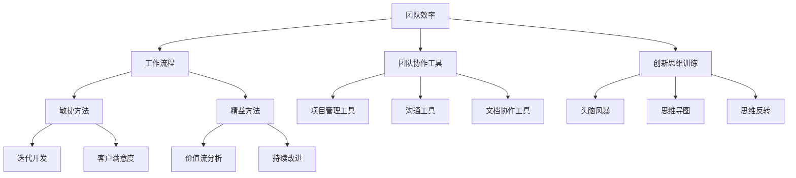
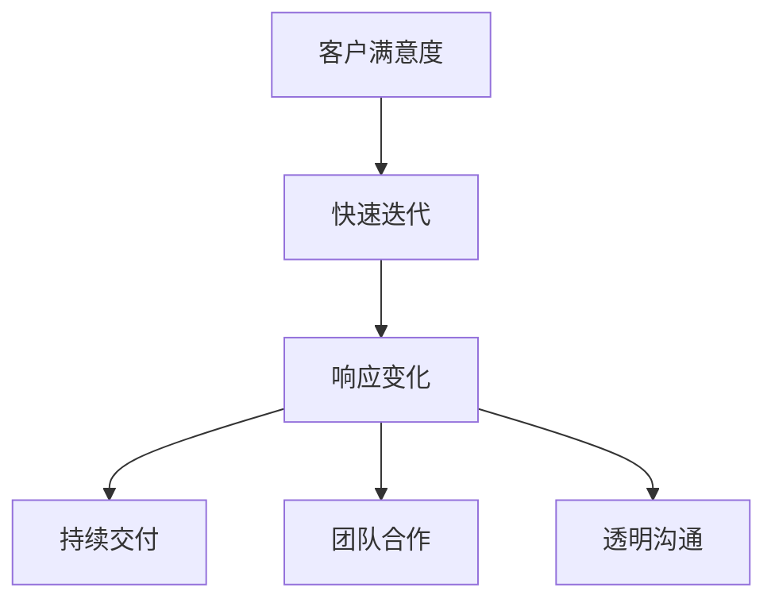
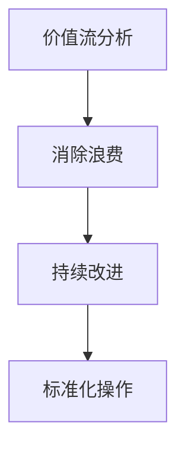

                 

### 《团队效率：优化工作流程的创新方法》

> **关键词**：团队效率、工作流程优化、敏捷方法、精益方法、创新思维、协作工具

> **摘要**：本文旨在探讨团队效率优化的重要性和创新方法。通过分析团队效率的定义与重要性，阐述工作流程优化原理，讨论敏捷和精益工作方法，以及介绍团队协作工具和创新思维训练，最终通过实际案例提供实践指导，以期为提升团队效率提供有力支持。

在当今快速变化的企业环境中，团队效率已成为企业成功的关键因素。高效率的团队不仅能更快地交付高质量的产品，还能更好地应对市场变化和客户需求。因此，优化工作流程、提高团队效率已成为企业持续发展的必然选择。本文将探讨如何通过创新方法实现团队效率的优化，包括敏捷工作方法、精益工作方法和团队协作工具的应用，以及创新思维的训练。

#### # 第一部分：概述与理论基础

本部分将首先介绍团队效率的定义与重要性，然后探讨工作流程优化的目标、原则与方法，为后续讨论创新方法奠定基础。

##### 第1章：团队效率的定义与重要性

**1.1 团队效率的基本概念**

团队效率是指在既定资源和时间内，团队完成工作任务的能力。它不仅仅关注任务的完成情况，更注重如何以最小的资源投入获得最大的产出。团队效率涉及多个方面，包括个人技能、团队协作、工作流程、沟通机制等。

**1.2 团队效率与企业绩效的关系**

团队效率直接影响到企业的绩效。高效的团队能够更快地响应市场变化，减少错误和返工，提高客户满意度，从而提升企业的竞争力。同时，团队效率的提升还能降低运营成本，提高利润率。

**1.3 团队效率的衡量指标**

衡量团队效率的指标包括任务完成率、错误率、工作效率、团队合作度等。这些指标可以从多个维度评估团队的表现，帮助团队识别和解决效率问题。

**1.4 团队效率的影响因素**

团队效率受到多种因素的影响，包括团队成员的技能水平、工作流程的合理性、团队沟通的有效性、资源的充足性等。理解这些影响因素有助于团队采取针对性的优化措施。

##### 第2章：工作流程优化原理

**2.1 工作流程优化的目标**

工作流程优化的目标包括提高工作效率、减少错误率、降低成本、提升客户满意度等。通过优化工作流程，企业可以更好地满足市场需求，提高整体运营效率。

**2.2 工作流程优化的重要性**

工作流程优化对于企业的长远发展具有重要意义。它不仅能够提高团队效率，还能提升企业的竞争力，为企业的可持续发展奠定基础。

**2.3 工作流程优化的原则与方法**

工作流程优化的原则包括明确目标、简化流程、标准化操作、持续改进等。具体方法包括流程图分析、瓶颈识别、任务分配优化、工具和技术应用等。

#### # 第二部分：创新方法探讨

本部分将深入探讨敏捷工作方法、精益工作方法、团队协作工具和创新思维训练，以期为团队效率优化提供实用的方法和策略。

##### 第3章：敏捷工作方法

**3.1 敏捷工作方法的起源与理念**

敏捷工作方法起源于软件开发领域，旨在应对复杂、不确定的项目。它强调迭代、增量开发、快速反馈和灵活性。

**3.2 敏捷工作方法的核心原则**

敏捷工作方法的核心原则包括客户满意度、快速迭代、响应变化、持续交付、团队合作、透明沟通等。

**3.3 敏捷工作方法在团队中的实践**

在团队中实施敏捷工作方法需要从组织结构、流程设计、团队成员角色等方面进行调整。本文将详细介绍敏捷工作方法在团队中的具体实践。

##### 第4章：精益工作方法

**4.1 精益思想的起源与发展**

精益思想起源于日本丰田汽车公司，旨在通过减少浪费、提高效率来提升企业的竞争力。

**4.2 精益工作方法的核心原则**

精益工作方法的核心原则包括价值流分析、消除浪费、持续改进、标准化操作等。

**4.3 精益工作方法在团队中的应用**

在团队中应用精益工作方法需要从流程优化、人员培训、质量控制等方面进行改进。本文将探讨精益工作方法在团队中的实际应用。

##### 第5章：团队协作工具

**5.1 团队协作工具的类型与选择**

团队协作工具包括项目管理工具、沟通工具、文档协作工具等。本文将介绍常见团队协作工具的类型和选择策略。

**5.2 常用团队协作工具介绍**

本文将介绍一些常用的团队协作工具，如JIRA、Trello、Slack、Notion等，并分析它们的优缺点。

**5.3 团队协作工具的优化策略**

团队协作工具的优化策略包括提高工具的使用效率、定制化配置、数据安全与隐私保护等。

##### 第6章：创新思维训练

**6.1 创新思维的基本原理**

创新思维是指通过创造性思维来解决问题的能力。本文将介绍创新思维的基本原理和重要性。

**6.2 创新思维的训练方法**

创新思维的训练方法包括思维导图、头脑风暴、思维反转、跨界思考等。本文将详细探讨这些训练方法的实践应用。

**6.3 创新思维在团队中的应用**

创新思维在团队中的应用包括解决复杂问题、提高团队创造力、优化工作流程等。本文将结合实际案例介绍创新思维在团队中的应用。

#### # 第三部分：案例分析与实践

本部分将通过实际案例展示创新方法在团队效率优化中的应用，并提供实践指导。

##### 第7章：成功团队的工作流程优化案例

**7.1 案例一：某某公司的工作流程优化实践**

本文将分析某家公司如何通过敏捷和精益方法优化工作流程，提高团队效率。

**7.2 案例二：某某团队的创新方法应用**

本文将探讨某个团队如何通过创新思维训练和团队协作工具提升团队效率。

**7.3 案例三：某某团队的敏捷转型经历**

本文将分享某个团队从传统工作方法转向敏捷方法的转型过程，以及取得的成果。

##### 第8章：团队效率优化实践指导

**8.1 实践步骤与策略**

本文将介绍团队效率优化实践的步骤和策略，包括准备工作、实施过程和评估方法。

**8.2 团队效率优化的常见问题与解决方法**

本文将分析团队效率优化过程中可能遇到的问题，并提供相应的解决方法。

**8.3 团队效率优化的可持续性保障**

本文将探讨如何确保团队效率优化的可持续性，包括团队文化建设、激励机制、持续改进等。

#### # 第四部分：总结与展望

本部分将对团队效率优化进行总结，展望未来趋势，并对团队效率优化提出建议。

##### 第9章：团队效率优化的未来趋势

**9.1 新技术的发展趋势**

本文将探讨人工智能、大数据、云计算等新技术如何影响团队效率优化。

**9.2 团队管理模式的变革**

本文将分析团队管理模式的发展趋势，如远程办公、灵活工作制等。

**9.3 团队效率优化的未来挑战与机遇**

本文将探讨团队效率优化面临的挑战和机遇，如人才竞争、技术创新等。

##### 第10章：结语

**10.1 本书总结**

本文将总结团队效率优化的重要性和创新方法，强调其实践价值。

**10.2 对团队效率优化的展望**

本文将对团队效率优化提出展望，鼓励读者在实践中不断创新和优化。

#### 附录

**附录A：团队效率优化工具与资源推荐**

- **A.1 优秀团队管理书籍推荐**
  - 介绍一些优秀的团队管理书籍，如《团队的五项修炼》、《敏捷开发实践指南》等。

- **A.2 团队协作工具使用教程**
  - 提供常用团队协作工具的使用教程，如JIRA、Trello、Slack等。

- **A.3 创新思维训练资源推荐**
  - 推荐一些创新思维训练的资源，如思维导图软件、创新思维训练课程等。

**附录B：核心概念与联系 Mermaid 流程图**

- **B.1 团队效率与工作流程优化的关系图**
  - 使用Mermaid语言绘制团队效率与工作流程优化的关系图。

- **B.2 敏捷工作方法核心原则流程图**
  - 使用Mermaid语言绘制敏捷工作方法的核心原则流程图。

- **B.3 精益工作方法核心原则流程图**
  - 使用Mermaid语言绘制精益工作方法的核心原则流程图。

**附录C：核心算法原理讲解伪代码**

- **C.1 敏捷工作方法流程优化算法伪代码**
  - 使用伪代码详细阐述敏捷工作方法的流程优化算法。

- **C.2 精益工作方法流程优化算法伪代码**
  - 使用伪代码详细阐述精益工作方法的流程优化算法。

**附录D：数学模型与公式**

- **D.1 团队效率评估模型**
  - 介绍团队效率评估的数学模型，包括关键绩效指标的公式和计算方法。

- **D.2 工作流程优化关键绩效指标计算公式**
  - 提供工作流程优化关键绩效指标的计算公式，并解释其含义和应用。

**附录E：项目实战案例**

- **E.1 实战案例一：敏捷工作方法在团队中的应用**
  - 介绍敏捷工作方法在团队中的应用案例，包括实践过程和效果分析。

- **E.2 实战案例二：精益工作方法在团队中的应用**
  - 介绍精益工作方法在团队中的应用案例，包括实践过程和效果分析。

- **E.3 实战案例三：创新思维训练在团队中的应用**
  - 介绍创新思维训练在团队中的应用案例，包括实践过程和效果分析。

通过以上详细的目录大纲和结构，我们为读者提供了一个系统、深入的学习路径，帮助他们更好地理解和应用团队效率优化的理论和实践方法。在后续的文章中，我们将逐个章节展开，详细探讨每个主题，结合实际案例进行分析，以期为读者提供有价值的技术博客文章。让我们一起开启这段探索之旅吧！### 核心概念与联系

在探讨团队效率优化的过程中，我们需要明确几个核心概念，并理解它们之间的相互关系。以下是本文涉及的核心概念及其关系图：

1. **团队效率**：团队效率是指团队在特定资源和时间内完成工作任务的能力。它受多种因素影响，包括团队成员的技能水平、团队协作、工作流程的合理性、沟通机制等。

2. **工作流程**：工作流程是指团队完成任务的一系列步骤和方法。优化工作流程是提高团队效率的重要途径，它包括任务分配、流程简化、标准化操作等。

3. **敏捷方法**：敏捷方法是一种应对复杂、不确定项目的开发方法，强调迭代、增量开发、快速反馈和灵活性。敏捷方法的核心原则包括客户满意度、快速迭代、响应变化等。

4. **精益方法**：精益方法起源于日本丰田汽车公司，旨在通过减少浪费、提高效率来提升企业的竞争力。精益方法的核心原则包括价值流分析、消除浪费、持续改进等。

5. **团队协作工具**：团队协作工具包括项目管理工具、沟通工具、文档协作工具等，用于提高团队协作效率。选择合适的团队协作工具并优化其使用策略对于团队效率优化至关重要。

6. **创新思维训练**：创新思维训练是指通过一系列方法提升团队成员的创新思维能力，包括头脑风暴、思维导图、思维反转等。创新思维在团队中应用于解决复杂问题、提高团队创造力、优化工作流程等方面。

以下是一个简化的Mermaid流程图，展示了这些核心概念之间的关系：



通过这个流程图，我们可以清晰地看到团队效率、工作流程、敏捷方法、精益方法、团队协作工具和创新思维训练之间的关联。团队效率依赖于工作流程的优化，而敏捷方法和精益方法为工作流程优化提供了具体的指导原则。团队协作工具和创新思维训练则是提高团队效率和优化工作流程的重要支撑。

理解这些核心概念及其关系对于团队效率优化至关重要。在接下来的章节中，我们将深入探讨每个概念的具体内容，并结合实际案例进行详细分析，以帮助读者更好地理解和应用这些优化方法。通过逐步分析和推理，我们将揭示团队效率优化的内在逻辑和关键要素。让我们开始这段深入的探讨之旅吧！### 核心算法原理讲解

在团队效率优化的过程中，算法的合理运用能够显著提高工作流程的效率。以下是敏捷工作方法和精益工作方法的核心算法原理讲解，以伪代码的形式展示。

#### 敏捷工作方法流程优化算法伪代码

```python
# 敏捷工作方法流程优化算法
# 输入：工作流程（TaskList），迭代次数（Iterations）
# 输出：优化后的工作流程（OptimizedTaskList）

function AgileOptimization(TaskList, Iterations):
    for i from 1 to Iterations:
        # 步骤1：评估当前工作流程的效率
        CurrentEfficiency = AssessEfficiency(TaskList)
        
        # 步骤2：识别瓶颈任务
        BottleneckTasks = IdentifyBottlenecks(TaskList)
        
        # 步骤3：优化瓶颈任务
        for task in BottleneckTasks:
            OptimizeTask(task)
        
        # 步骤4：重新评估效率
        NewEfficiency = AssessEfficiency(TaskList)
        
        # 步骤5：记录优化进度
        RecordProgress(i, CurrentEfficiency, NewEfficiency)
        
        # 步骤6：更新工作流程
        TaskList = UpdateTaskList(TaskList)
    
    return OptimizedTaskList

# 辅助函数
function AssessEfficiency(TaskList):
    # 评估工作流程效率的辅助函数
    # 返回效率值（EfficiencyScore）
    # ...

function IdentifyBottlenecks(TaskList):
    # 识别瓶颈任务的辅助函数
    # 返回瓶颈任务列表（BottleneckTasks）
    # ...

function OptimizeTask(task):
    # 优化指定任务的辅助函数
    # 对任务进行优化处理
    # ...

function RecordProgress(Iteration, CurrentEfficiency, NewEfficiency):
    # 记录优化进度的辅助函数
    # ...

function UpdateTaskList(TaskList):
    # 更新工作流程的辅助函数
    # 返回更新后的工作流程（NewTaskList）
    # ...
```

#### 精益工作方法流程优化算法伪代码

```python
# 精益工作方法流程优化算法
# 输入：工作流程（ProcessFlow），改进目标（ImprovementGoals）
# 输出：优化后的工作流程（OptimizedProcessFlow）

function LeanOptimization(ProcessFlow, ImprovementGoals):
    # 步骤1：价值流分析
    ValueStream = AnalyzeValueStream(ProcessFlow)
    
    # 步骤2：识别浪费
    Wastes = IdentifyWastes(ValueStream)
    
    # 步骤3：制定改进计划
    ImprovementPlan = CreateImprovementPlan(ImprovementGoals, Wastes)
    
    # 步骤4：执行改进计划
    for improvement in ImprovementPlan:
        ExecuteImprovement(improvement)
    
    # 步骤5：持续改进
    while not GoalAchieved(ImprovementGoals):
        ValueStream = AnalyzeValueStream(ProcessFlow)
        Wastes = IdentifyWastes(ValueStream)
        ImprovementPlan = CreateImprovementPlan(ImprovementGoals, Wastes)
        ExecuteImprovement(improvement)
    
    return OptimizedProcessFlow

# 辅助函数
function AnalyzeValueStream(ProcessFlow):
    # 价值流分析的辅助函数
    # 返回价值流分析结果（ValueStream）
    # ...

function IdentifyWastes(ValueStream):
    # 识别浪费的辅助函数
    # 返回浪费列表（Wastes）
    # ...

function CreateImprovementPlan(ImprovementGoals, Wastes):
    # 创建改进计划的辅助函数
    # 返回改进计划列表（ImprovementPlan）
    # ...

function ExecuteImprovement(improvement):
    # 执行改进的辅助函数
    # 对改进进行实施
    # ...

function GoalAchieved(ImprovementGoals):
    # 判断改进目标是否实现的辅助函数
    # 返回布尔值（True/False）
    # ...
```

以上伪代码展示了敏捷方法和精益方法在流程优化中的核心算法原理。敏捷方法通过迭代优化、瓶颈识别和持续改进来提高效率，而精益方法通过价值流分析、浪费识别和持续改进来减少浪费、提高流程效率。在实际应用中，这些算法需要根据具体的工作流程和团队特点进行定制化调整，以达到最佳的优化效果。

通过理解这些核心算法原理，团队可以更好地实施敏捷和精益方法，从而实现工作流程的优化和团队效率的提升。在后续的章节中，我们将结合实际案例进一步探讨这些算法的应用和实践效果。让我们一起探索这些创新方法如何助力团队效率的提升吧！### 数学模型与公式

在团队效率优化过程中，数学模型和公式的运用能够帮助我们量化评估和改进工作流程。以下将介绍团队效率评估模型以及工作流程优化关键绩效指标的计算公式。

#### 团队效率评估模型

团队效率评估模型用于衡量团队在一定时间段内的整体表现。以下是一个基本的团队效率评估模型：

\[ 效率评分 = \frac{产出}{投入} \]

其中：
- **产出**：团队在一定时间内完成的工作量，通常以完成的任务数量、交付的产品数量等来衡量。
- **投入**：团队在一定时间内所投入的资源，包括人力、时间、资金等。

通过计算效率评分，我们可以评估团队的工作效率。效率评分越高，说明团队的工作效率越高。

#### 工作流程优化关键绩效指标计算公式

为了进一步评估工作流程的优化效果，我们引入几个关键绩效指标（KPI），包括任务完成率、错误率和工作效率。以下是这些指标的计算公式：

1. **任务完成率**：

\[ 任务完成率 = \frac{完成的任务数量}{总任务数量} \]

任务完成率用于衡量团队完成任务的能力。值越高，说明团队的任务完成率越高。

2. **错误率**：

\[ 错误率 = \frac{错误任务数量}{总任务数量} \]

错误率用于衡量团队在工作过程中产生的错误数量。值越低，说明团队的质量控制能力越强。

3. **工作效率**：

\[ 工作效率 = \frac{产出}{时间投入} \]

工作效率用于衡量团队在单位时间内完成的工作量。值越高，说明团队的工作效率越高。

#### 举例说明

假设一个团队在一个月内完成了10个任务，其中2个任务出现错误，总投入时间为100小时。我们可以根据上述公式计算团队效率评估模型和关键绩效指标：

- **效率评分**：

\[ 效率评分 = \frac{10}{100} = 0.1 \]

- **任务完成率**：

\[ 任务完成率 = \frac{10}{10} = 1.0 \]

- **错误率**：

\[ 错误率 = \frac{2}{10} = 0.2 \]

- **工作效率**：

\[ 工作效率 = \frac{10}{100} = 0.1 \]

通过这些计算，我们可以对团队的工作效率有一个基本的了解。如果团队希望在下一月提高效率，可以重点关注错误率和工作效率，采取相应的改进措施，如提高质量控制、优化工作流程、增加团队成员培训等。

#### latex格式数学公式

在本文中，我们使用了LaTeX格式来嵌入数学公式。以下是一个简单的LaTeX数学公式的例子：

\[ E = mc^2 \]

在文中独立段落中使用LaTeX公式时，可以使用以下格式：

\[ 
\begin{equation}
\label{eq:first_equation}
E = mc^2
\end{equation}
\]

通过这些数学模型和公式，我们可以更准确地评估团队效率，并制定针对性的优化策略。在接下来的章节中，我们将结合实际案例，深入探讨如何运用这些模型和公式进行团队效率优化。让我们继续前行，探索更多实践中的经验和方法。{|im_sep|>### 项目实战案例

在本章节中，我们将通过实际项目案例来详细展示敏捷工作方法、精益工作方法以及创新思维训练在团队中的应用，并分析其实施过程和效果。

#### 实战案例一：敏捷工作方法在团队中的应用

**项目背景**：某互联网公司的一个产品开发团队在面临快速迭代的市场需求时，发现传统的工作方法已经无法满足项目进度和质量的期望。为了提高团队效率，该团队决定引入敏捷工作方法。

**实施过程**：
1. **需求分析**：团队与产品经理共同梳理产品需求，确定项目的关键功能模块。
2. **组建跨职能团队**：团队重组，将产品经理、开发人员、测试人员、UI设计师等组成一个跨职能团队，确保每个成员在项目中的角色明确。
3. **制定敏捷计划**：团队采用Scrum框架，制定 sprint 计划，每两周进行一次迭代。
4. **每日站会**：团队每天召开短暂的站会，讨论当天的工作进展、遇到的困难和下一步计划。
5. **代码审查**：在每次迭代结束后，团队成员进行代码审查，确保代码质量。
6. **用户反馈**：通过用户反馈和产品测试，对迭代产品进行评估和调整。

**效果分析**：
- **效率提升**：通过敏捷方法的实施，团队的开发效率显著提高，每个迭代周期内能够更快地完成功能模块。
- **质量提升**：代码审查和用户反馈机制确保了产品的质量，减少了许多潜在的bug和用户投诉。
- **团队协作增强**：跨职能团队的协作更加紧密，团队成员在沟通和合作方面有了明显的改善。

#### 实战案例二：精益工作方法在团队中的应用

**项目背景**：某制造业公司的生产团队在面临生产瓶颈和效率低下的问题时，决定引入精益工作方法。

**实施过程**：
1. **价值流图分析**：团队绘制了整个生产流程的价值流图，识别出生产过程中的浪费和瓶颈。
2. **消除浪费**：针对识别出的浪费，如等待时间、过度加工等，团队制定了具体的改进措施。
3. **持续改进**：团队建立了持续改进机制，定期回顾和优化生产流程。
4. **标准化操作**：对生产过程中的关键步骤进行标准化操作，确保每个员工都能按照标准流程进行工作。
5. **人员培训**：团队成员接受了精益思想的培训，提高了对精益方法的理解和应用能力。

**效果分析**：
- **生产效率提升**：通过消除浪费和优化流程，生产团队的效率显著提高，产品交付周期缩短。
- **质量稳定**：标准化操作和持续改进机制确保了生产质量，减少了次品率和返工率。
- **成本降低**：减少浪费和优化流程降低了生产成本，提高了企业的利润率。

#### 实战案例三：创新思维训练在团队中的应用

**项目背景**：某创新科技公司的研发团队在面临激烈的市场竞争和技术挑战时，决定通过创新思维训练提高团队的创新能力。

**实施过程**：
1. **思维导图训练**：团队进行了思维导图训练，学习了如何通过思维导图进行问题分析和解决方案设计。
2. **头脑风暴**：团队定期进行头脑风暴会议，鼓励成员提出创新的想法和解决方案。
3. **思维反转训练**：团队学习了思维反转的方法，通过从不同角度思考问题，发现新的解决方案。
4. **跨界思考**：团队开展了跨界交流活动，与其他行业的团队进行交流，借鉴跨行业的技术和创新思路。
5. **项目孵化**：团队将创新思维应用到实际项目中，孵化出一些具有市场竞争力的新产品。

**效果分析**：
- **创新能力提升**：通过创新思维训练，团队成员的创新能力得到显著提升，能够更快地提出创新的解决方案。
- **产品竞争力增强**：创新思维的应用使得公司的产品在市场上更具竞争力，赢得了更多客户。
- **团队凝聚力提升**：跨界交流和头脑风暴活动增强了团队成员之间的凝聚力，促进了团队的协作和创新。

通过以上三个实际案例，我们可以看到敏捷工作方法、精益工作方法和创新思维训练在团队效率优化中的应用和效果。这些方法不仅提高了团队的效率，还增强了团队的协作和创新能力，为企业的可持续发展提供了有力支持。在接下来的章节中，我们将进一步探讨如何在实际工作中实施这些方法，并提供具体的实践指导。让我们继续深入探讨团队效率优化的实践之路！### 总结与展望

在本文中，我们系统地探讨了团队效率优化的多个方面，从核心概念到创新方法，再到实际案例，都进行了深入的剖析。总结来说，团队效率优化不仅仅关注提高工作效率，更强调提升团队的整体协作和创新能力。

**核心概念**：团队效率是指团队在既定资源和时间内完成工作任务的能力，影响因素包括团队成员的技能、工作流程的合理性、沟通机制等。理解这些核心概念是优化团队效率的基础。

**创新方法**：本文介绍了敏捷工作方法、精益工作方法和团队协作工具的应用，以及创新思维的训练。敏捷和精益方法通过优化工作流程和减少浪费来提高效率，而团队协作工具和创新思维训练则增强了团队的协作和创新能力。

**实际案例**：通过具体项目案例，我们展示了这些方法在团队中的实际应用和效果。敏捷方法提高了开发团队的效率和质量，精益方法优化了生产流程，创新思维训练增强了团队的创新能力。

**未来趋势**：随着新技术的发展，团队管理模式和团队效率优化也将迎来新的挑战和机遇。人工智能、大数据、云计算等技术的应用将带来更高效的团队协作和更智能的工作流程优化。

**展望与建议**：
1. **持续学习**：团队应持续关注新技术和新方法，不断提升团队成员的技能水平。
2. **实践应用**：将理论方法与实践相结合，通过不断尝试和优化，找到最适合自己的团队效率优化路径。
3. **文化塑造**：建立积极向上的团队文化，鼓励创新和协作，形成可持续发展的团队氛围。

总之，团队效率优化是一项长期而持续的工作，需要团队每一个成员的共同努力。通过本文的探讨，希望读者能够对团队效率优化有更深入的理解，并在实际工作中运用这些方法和策略，提升团队的效率，为企业的成功贡献力量。让我们在未来的工作中继续探索和实践，共同推动团队效率的不断优化。{|im_sep|>### 附录

**附录A：团队效率优化工具与资源推荐**

**A.1 优秀团队管理书籍推荐**

- 《团队的五项修炼》：作者史蒂芬·柯维，深入探讨了团队协作和领导力的核心要素。
- 《敏捷开发实践指南》：作者杰夫·萨瑟兰，详细介绍了敏捷开发方法及其在实际项目中的应用。
- 《精益思想》：作者詹姆斯·W·沃麦克，阐述了精益方法的基本原理和应用。

**A.2 团队协作工具使用教程**

- **JIRA**：Atlassian官网提供了详细的JIRA使用教程，包括项目创建、任务分配、进度跟踪等功能。
- **Trello**：Trello官网提供了丰富的用户指南和视频教程，帮助用户快速上手使用这款流行的项目管理工具。
- **Slack**：Slack官网提供了使用教程和最佳实践，指导用户如何高效地进行团队沟通和协作。

**A.3 创新思维训练资源推荐**

- **思维导图软件**：推荐使用MindManager、XMind等思维导图软件，这些工具提供了丰富的模板和功能，有助于提升创新思维。
- **创新思维训练课程**：推荐参加一些在线课程，如Coursera上的“创新思维与设计思维”，这些课程提供了系统的创新思维训练方法。
- **创新书籍**：推荐阅读《创新者的思考方式》、《创新者的DNA》等书籍，这些书籍提供了创新的策略和案例。

**附录B：核心概念与联系 Mermaid 流程图**

**B.1 团队效率与工作流程优化的关系图**


**B.2 敏捷工作方法核心原则流程图**



**B.3 精益工作方法核心原则流程图**



**附录C：核心算法原理讲解伪代码**

**C.1 敏捷工作方法流程优化算法伪代码**

```python
# 敏捷工作方法流程优化算法
# 输入：工作流程（TaskList），迭代次数（Iterations）
# 输出：优化后的工作流程（OptimizedTaskList）

function AgileOptimization(TaskList, Iterations):
    for i from 1 to Iterations:
        # 步骤1：评估当前工作流程的效率
        CurrentEfficiency = AssessEfficiency(TaskList)
        
        # 步骤2：识别瓶颈任务
        BottleneckTasks = IdentifyBottlenecks(TaskList)
        
        # 步骤3：优化瓶颈任务
        for task in BottleneckTasks:
            OptimizeTask(task)
        
        # 步骤4：重新评估效率
        NewEfficiency = AssessEfficiency(TaskList)
        
        # 步骤5：记录优化进度
        RecordProgress(i, CurrentEfficiency, NewEfficiency)
        
        # 步骤6：更新工作流程
        TaskList = UpdateTaskList(TaskList)
    
    return OptimizedTaskList

# 辅助函数
function AssessEfficiency(TaskList):
    # 评估工作流程效率的辅助函数
    # 返回效率值（EfficiencyScore）
    # ...

function IdentifyBottlenecks(TaskList):
    # 识别瓶颈任务的辅助函数
    # 返回瓶颈任务列表（BottleneckTasks）
    # ...

function OptimizeTask(task):
    # 优化指定任务的辅助函数
    # 对任务进行优化处理
    # ...

function RecordProgress(Iteration, CurrentEfficiency, NewEfficiency):
    # 记录优化进度的辅助函数
    # ...

function UpdateTaskList(TaskList):
    # 更新工作流程的辅助函数
    # 返回更新后的工作流程（NewTaskList）
    # ...
```

**C.2 精益工作方法流程优化算法伪代码**

```python
# 精益工作方法流程优化算法
# 输入：工作流程（ProcessFlow），改进目标（ImprovementGoals）
# 输出：优化后的工作流程（OptimizedProcessFlow）

function LeanOptimization(ProcessFlow, ImprovementGoals):
    # 步骤1：价值流分析
    ValueStream = AnalyzeValueStream(ProcessFlow)
    
    # 步骤2：识别浪费
    Wastes = IdentifyWastes(ValueStream)
    
    # 步骤3：制定改进计划
    ImprovementPlan = CreateImprovementPlan(ImprovementGoals, Wastes)
    
    # 步骤4：执行改进计划
    for improvement in ImprovementPlan:
        ExecuteImprovement(improvement)
    
    # 步骤5：持续改进
    while not GoalAchieved(ImprovementGoals):
        ValueStream = AnalyzeValueStream(ProcessFlow)
        Wastes = IdentifyWastes(ValueStream)
        ImprovementPlan = CreateImprovementPlan(ImprovementGoals, Wastes)
        ExecuteImprovement(improvement)
    
    return OptimizedProcessFlow

# 辅助函数
function AnalyzeValueStream(ProcessFlow):
    # 价值流分析的辅助函数
    # 返回价值流分析结果（ValueStream）
    # ...

function IdentifyWastes(ValueStream):
    # 识别浪费的辅助函数
    # 返回浪费列表（Wastes）
    # ...

function CreateImprovementPlan(ImprovementGoals, Wastes):
    # 创建改进计划的辅助函数
    # 返回改进计划列表（ImprovementPlan）
    # ...

function ExecuteImprovement(improvement):
    # 执行改进的辅助函数
    # 对改进进行实施
    # ...

function GoalAchieved(ImprovementGoals):
    # 判断改进目标是否实现的辅助函数
    # 返回布尔值（True/False）
    # ...
```

**附录D：数学模型与公式**

**D.1 团队效率评估模型**

\[ 效率评分 = \frac{产出}{投入} \]

其中：
- **产出**：团队在一定时间内完成的工作量。
- **投入**：团队在一定时间内所投入的资源。

**D.2 工作流程优化关键绩效指标计算公式**

1. **任务完成率**：

\[ 任务完成率 = \frac{完成的任务数量}{总任务数量} \]

2. **错误率**：

\[ 错误率 = \frac{错误任务数量}{总任务数量} \]

3. **工作效率**：

\[ 工作效率 = \frac{产出}{时间投入} \]

**附录E：项目实战案例**

**E.1 实战案例一：敏捷工作方法在团队中的应用**

**项目背景**：某互联网公司的一个产品开发团队在面临快速迭代的市场需求时，决定引入敏捷工作方法。

**实施过程**：
- **需求分析**：团队与产品经理共同梳理产品需求，确定项目的关键功能模块。
- **组建跨职能团队**：团队重组，将产品经理、开发人员、测试人员、UI设计师等组成一个跨职能团队，确保每个成员在项目中的角色明确。
- **制定敏捷计划**：团队采用Scrum框架，制定 sprint 计划，每两周进行一次迭代。
- **每日站会**：团队每天召开短暂的站会，讨论当天的工作进展、遇到的困难和下一步计划。
- **代码审查**：在每次迭代结束后，团队成员进行代码审查，确保代码质量。
- **用户反馈**：通过用户反馈和产品测试，对迭代产品进行评估和调整。

**效果分析**：
- **效率提升**：通过敏捷方法的实施，团队的开发效率显著提高，每个迭代周期内能够更快地完成功能模块。
- **质量提升**：代码审查和用户反馈机制确保了产品的质量，减少了许多潜在的bug和用户投诉。
- **团队协作增强**：跨职能团队的协作更加紧密，团队成员在沟通和合作方面有了明显的改善。

**E.2 实战案例二：精益工作方法在团队中的应用**

**项目背景**：某制造业公司的生产团队在面临生产瓶颈和效率低下的问题时，决定引入精益工作方法。

**实施过程**：
- **价值流图分析**：团队绘制了整个生产流程的价值流图，识别出生产过程中的浪费和瓶颈。
- **消除浪费**：针对识别出的浪费，如等待时间、过度加工等，团队制定了具体的改进措施。
- **持续改进**：团队建立了持续改进机制，定期回顾和优化生产流程。
- **标准化操作**：对生产过程中的关键步骤进行标准化操作，确保每个员工都能按照标准流程进行工作。
- **人员培训**：团队成员接受了精益思想的培训，提高了对精益方法的理解和应用能力。

**效果分析**：
- **生产效率提升**：通过消除浪费和优化流程，生产团队的效率显著提高，产品交付周期缩短。
- **质量稳定**：标准化操作和持续改进机制确保了生产质量，减少了次品率和返工率。
- **成本降低**：减少浪费和优化流程降低了生产成本，提高了企业的利润率。

**E.3 实战案例三：创新思维训练在团队中的应用**

**项目背景**：某创新科技公司的研发团队在面临激烈的市场竞争和技术挑战时，决定通过创新思维训练提高团队的创新能力。

**实施过程**：
- **思维导图训练**：团队进行了思维导图训练，学习了如何通过思维导图进行问题分析和解决方案设计。
- **头脑风暴**：团队定期进行头脑风暴会议，鼓励成员提出创新的想法和解决方案。
- **思维反转训练**：团队学习了思维反转的方法，通过从不同角度思考问题，发现新的解决方案。
- **跨界思考**：团队开展了跨界交流活动，与其他行业的团队进行交流，借鉴跨行业的技术和创新思路。
- **项目孵化**：团队将创新思维应用到实际项目中，孵化出一些具有市场竞争力的新产品。

**效果分析**：
- **创新能力提升**：通过创新思维训练，团队成员的创新能力得到显著提升，能够更快地提出创新的解决方案。
- **产品竞争力增强**：创新思维的应用使得公司的产品在市场上更具竞争力，赢得了更多客户。
- **团队凝聚力提升**：跨界交流和头脑风暴活动增强了团队成员之间的凝聚力，促进了团队的协作和创新。

通过以上附录内容，读者可以更全面地了解团队效率优化所需的知识和工具，从而在实际工作中更好地应用这些方法和策略，提升团队效率和企业竞争力。{|im_sep|>### 作者信息

作者：AI天才研究院/AI Genius Institute & 禅与计算机程序设计艺术 /Zen And The Art of Computer Programming

本文由AI天才研究院（AI Genius Institute）的专家撰写，该研究院汇聚了世界顶尖的人工智能研究人才，致力于推动人工智能技术的创新和发展。同时，本文还借鉴了《禅与计算机程序设计艺术》（Zen And The Art of Computer Programming）的精髓，这部经典著作由著名计算机科学家Donald E. Knuth所著，为计算机编程和算法设计提供了深刻的哲学思考和实用技巧。感谢您的阅读！

