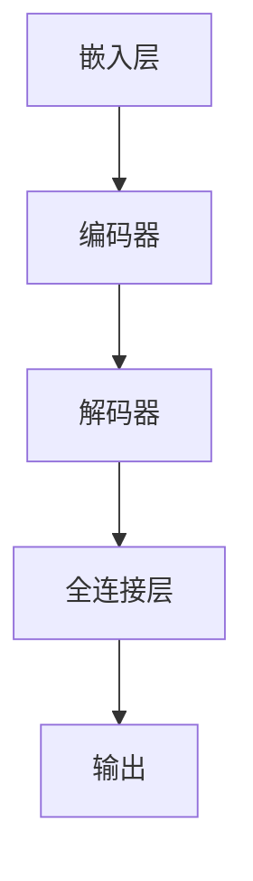
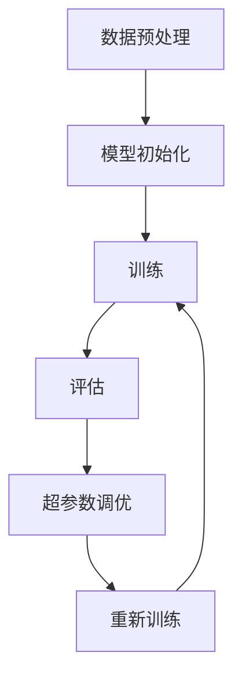

                 

# 大模型在垂直行业的应用前景

> **关键词：** 大模型，垂直行业，金融，医疗健康，教育，物流与供应链，制造业，应用前景。

> **摘要：** 本文探讨了大规模预训练模型（大模型）在垂直行业中的应用前景。通过分析大模型的基本概念、架构、训练方法以及其在金融、医疗健康、教育、物流与供应链和制造业等领域的应用案例，探讨了大模型为这些行业带来的创新和变革，并对未来的发展趋势和社会伦理问题进行了展望。

## 目录大纲

- 第一部分: 引言与背景
  - 1. 引言
    - 1.1 书籍目的与结构
    - 1.2 大模型与垂直行业的关系
    - 1.3 垂直行业应用前景展望
  - 2. 大模型基础
    - 2.1 大模型概述
    - 2.2 大模型的架构
    - 2.3 大模型的训练与优化
    - 3. 大模型的数学基础
      - 3.1 神经网络基础
      - 3.2 深度学习算法
      - 3.3 大模型的优化方法
  - 3. 垂直行业应用分析
    - 4. 金融行业
      - 4.1 金融行业的大模型应用场景
      - 4.2 金融行业的大模型案例分析
      - 4.3 金融行业大模型应用挑战与解决方案
    - 5. 医疗健康行业
      - 5.1 医疗健康行业的大模型应用场景
      - 5.2 医疗健康行业的大模型案例分析
      - 5.3 医疗健康行业大模型应用挑战与解决方案
    - 6. 教育行业
      - 6.1 教育行业的大模型应用场景
      - 6.2 教育行业的大模型案例分析
      - 6.3 教育行业大模型应用挑战与解决方案
    - 7. 物流与供应链行业
      - 7.1 物流与供应链行业的大模型应用场景
      - 7.2 物流与供应链行业的大模型案例分析
      - 7.3 物流与供应链行业大模型应用挑战与解决方案
    - 8. 制造业
      - 8.1 制造业的大模型应用场景
      - 8.2 制造业的大模型案例分析
      - 8.3 制造业大模型应用挑战与解决方案
  - 4. 大模型应用前景展望
    - 9. 未来展望
      - 9.1 大模型技术的发展趋势
      - 9.2 垂直行业应用前景预测
      - 9.3 大模型应用中的社会伦理问题
  - 5. 附录
    - A. 大模型相关资源
      - A.1 开源框架与工具
      - A.2 学术资源与论文
      - A.3 社区与论坛
    - B. 大模型应用案例汇编
      - B.1 金融行业案例
      - B.2 医疗健康行业案例
      - B.3 教育行业案例
      - B.4 物流与供应链行业案例
      - B.5 制造业案例

## 第一部分: 引言与背景

### 1. 引言

随着人工智能技术的快速发展，大规模预训练模型（Large Pre-trained Models，简称大模型）已经成为当前研究的热点和应用的关键。大模型通过在海量数据上进行预训练，获得了强大的语义理解和生成能力，能够在各种垂直行业中发挥重要作用。本文旨在探讨大模型在垂直行业的应用前景，分析其在金融、医疗健康、教育、物流与供应链和制造业等领域的应用案例，以及面临的挑战和解决方案。

### 1.2 大模型与垂直行业的关系

大模型与垂直行业之间存在密切的关系。一方面，大模型具有强大的通用性和适应性，能够为不同行业提供基础的技术支持；另一方面，垂直行业的数据和业务场景为大模型提供了丰富的训练资源和应用场景，促进了大模型的发展和应用。

大模型在垂直行业中的应用主要体现在以下几个方面：

1. 数据分析与挖掘：大模型能够对大量结构化和非结构化数据进行分析和挖掘，提取有价值的信息和知识，为行业决策提供支持。
2. 语音识别与自然语言处理：大模型在语音识别、机器翻译、文本分类等自然语言处理任务中具有显著优势，能够提高语音和文本处理的准确性和效率。
3. 智能决策与优化：大模型能够通过对大量数据的分析和预测，为行业提供智能决策和优化方案，提高生产效率和产品质量。

### 1.3 垂直行业应用前景展望

随着大模型技术的不断发展，其在垂直行业的应用前景十分广阔。以下是几个具有代表性的垂直行业：

1. 金融行业：大模型在金融领域的应用已经取得了显著成果，如智能投顾、风险控制、信用评估等。未来，大模型将进一步提高金融行业的自动化和智能化水平，推动金融业务模式的创新。
2. 医疗健康行业：大模型在医疗健康领域的应用潜力巨大，如疾病预测、诊断辅助、智能药物研发等。随着医疗数据的大规模积累和人工智能技术的进步，大模型将为医疗健康行业带来革命性的变革。
3. 教育行业：大模型在教育领域的应用可以提供个性化教学、智能测评、学习资源推荐等功能，提高教育质量和学习效果。随着教育信息化进程的加快，大模型将在教育领域发挥越来越重要的作用。
4. 物流与供应链行业：大模型在物流与供应链行业的应用可以实现物流路径优化、库存管理、供应链预测等功能，提高物流效率和降低成本。随着全球供应链的复杂化，大模型将为物流与供应链行业提供强有力的技术支持。
5. 制造业：大模型在制造业的应用可以实现生产过程智能化、设备故障预测、质量检测等，提高生产效率和质量。随着智能制造的兴起，大模型将在制造业发挥重要作用。

### 1.4 本书结构

本文分为四个部分。第一部分引言与背景，介绍了大模型与垂直行业的关系和应用前景。第二部分大模型基础，介绍了大模型的基本概念、架构、训练方法和数学基础。第三部分垂直行业应用分析，分别介绍了大模型在金融、医疗健康、教育、物流与供应链和制造业等领域的应用案例、挑战和解决方案。第四部分大模型应用前景展望，分析了大模型技术的发展趋势、垂直行业应用前景以及社会伦理问题。最后，附录部分提供了大模型相关资源和应用案例汇编。

## 第二部分: 大模型基础

### 2.1 大模型概述

大模型（Large Pre-trained Model）是指通过在大量数据上进行预训练，获得强大语义理解和生成能力的深度学习模型。大模型通常具有数十亿甚至数万亿个参数，能够处理多种类型的输入数据，如图像、文本、语音等。大模型的发展是人工智能领域的重要里程碑，使得人工智能系统在处理复杂任务时表现出色。

大模型的主要特点如下：

1. **强大的语义理解能力**：大模型通过在海量数据上进行预训练，能够学习到丰富的语义信息，使得模型在处理自然语言处理、图像识别等任务时具有出色的性能。
2. **适应性**：大模型具有通用性，可以应用于多种不同的任务和领域，无需对模型进行重新训练，只需进行微调即可适应新的任务和领域。
3. **生成能力**：大模型不仅能够对输入数据进行分类、识别等操作，还能够生成新的文本、图像等数据，为创造性和生成性任务提供支持。

大模型的发展历程可以分为以下几个阶段：

1. **小模型阶段**：最初的深度学习模型规模较小，如几千到数万个参数，主要用于简单的分类和识别任务。
2. **中型模型阶段**：随着计算能力和数据规模的提升，深度学习模型开始扩展到数百万个参数，如AlexNet、VGG等模型在图像识别任务上取得了突破性进展。
3. **大型模型阶段**：随着深度学习算法的优化和计算资源的提升，大型模型如BERT、GPT、ViT等出现，这些模型具有数十亿个参数，在多种任务上表现出色。
4. **超大型模型阶段**：近年来，超大型模型如GPT-3、GPT-NEOX、Turing-NLG等出现，这些模型具有数万亿个参数，展现出了强大的语义理解和生成能力。

### 2.2 大模型的架构

大模型的架构主要包括以下几个部分：

1. **嵌入层（Embedding Layer）**：将输入数据（如图像、文本、语音等）转换为高维向量表示，以便模型进行计算。
2. **编码器（Encoder）**：编码器负责对输入数据进行编码，提取其语义信息。常见的编码器结构包括卷积神经网络（CNN）、循环神经网络（RNN）、Transformer等。
3. **解码器（Decoder）**：解码器负责将编码后的数据解码为输出数据，如文本、图像等。解码器通常与编码器具有相似的结构，但顺序相反。
4. **全连接层（Fully Connected Layer）**：全连接层将编码器的输出映射到特定任务的结果，如分类、识别等。

以下是一个典型的大模型架构示例：



### 2.3 大模型的训练与优化

大模型的训练与优化是模型开发的关键步骤，主要包括以下几个方面：

1. **数据预处理**：数据预处理包括数据清洗、数据增强、数据标准化等操作，以确保模型能够从数据中获得有效的信息。数据预处理对于大模型尤为重要，因为大量噪声和异常值会影响模型的学习效果。
2. **损失函数（Loss Function）**：损失函数用于衡量模型预测值与真实值之间的差距，常用的损失函数包括均方误差（MSE）、交叉熵损失（Cross-Entropy Loss）等。
3. **优化算法（Optimizer）**：优化算法用于调整模型参数，以最小化损失函数。常见的优化算法包括随机梯度下降（SGD）、Adam、Adadelta等。
4. **模型评估**：模型评估用于衡量模型在训练数据和测试数据上的性能，常用的评估指标包括准确率（Accuracy）、召回率（Recall）、F1分数（F1 Score）等。
5. **超参数调优**：超参数调优是模型优化的重要环节，包括学习率、批量大小、正则化参数等。通过调整超参数，可以优化模型性能和泛化能力。

以下是一个简单的大模型训练流程示例：



### 2.4 大模型的数学基础

大模型的数学基础主要包括以下几个方面：

1. **神经网络基础**：神经网络是深度学习的基础，包括神经元模型、前向传播和反向传播算法等。神经网络通过多层非线性变换，将输入数据映射到输出结果。
2. **深度学习算法**：深度学习算法包括卷积神经网络（CNN）、循环神经网络（RNN）、Transformer等，用于处理不同类型的数据和任务。
3. **优化方法**：优化方法包括梯度下降、随机梯度下降（SGD）、Adam等，用于调整模型参数，以最小化损失函数。

以下是一个简单的神经网络模型示例：

```python
# 神经网络模型示例
import tensorflow as tf

model = tf.keras.Sequential([
    tf.keras.layers.Dense(128, activation='relu', input_shape=(784,)),
    tf.keras.layers.Dropout(0.2),
    tf.keras.layers.Dense(10, activation='softmax')
])

model.compile(optimizer='adam',
              loss='categorical_crossentropy',
              metrics=['accuracy'])
```

### 2.5 大模型的优化方法

大模型的优化方法主要包括以下几个方面：

1. **正则化（Regularization）**：正则化用于防止模型过拟合，常用的正则化方法包括L1正则化、L2正则化和Dropout等。
2. **数据增强（Data Augmentation）**：数据增强通过生成新的训练样本，增加训练数据的多样性，从而提高模型的泛化能力。
3. **迁移学习（Transfer Learning）**：迁移学习利用预训练模型在大规模数据上学习到的知识，应用于新的任务和领域，从而提高模型性能。

以下是一个简单的迁移学习示例：

```python
from tensorflow.keras.applications import VGG16
from tensorflow.keras.models import Model
from tensorflow.keras.layers import Dense, Flatten

# 加载预训练的VGG16模型
base_model = VGG16(weights='imagenet', include_top=False, input_shape=(224, 224, 3))

# 保留VGG16模型的输出层
x = base_model.output

# 添加新的全连接层
x = Flatten()(x)
x = Dense(1024, activation='relu')(x)

# 添加分类层
predictions = Dense(num_classes, activation='softmax')(x)

# 构建新的模型
model = Model(inputs=base_model.input, outputs=predictions)

# 微调模型参数
model.compile(optimizer='adam',
              loss='categorical_crossentropy',
              metrics=['accuracy'])

model.fit(x_train, y_train, batch_size=batch_size, epochs=epochs, validation_data=(x_val, y_val))
```

## 第三部分：垂直行业应用分析

### 4. 金融行业

#### 4.1 金融行业的大模型应用场景

金融行业是一个数据密集型的行业，涉及大量复杂的业务场景和风险管理需求。大模型在金融行业中的应用场景广泛，主要包括以下几个方面：

1. **风险控制**：大模型能够对金融交易数据进行实时分析，识别潜在的欺诈行为和风险点，帮助金融机构提高风险控制能力。
2. **量化交易**：大模型通过分析历史交易数据和宏观经济指标，预测市场趋势，为量化交易策略提供支持，提高交易成功率。
3. **信用评估**：大模型能够通过对个人和企业的信用数据进行深度分析，预测信用风险，帮助金融机构进行信用评估和信贷管理。
4. **智能投顾**：大模型通过分析投资者的风险偏好和投资目标，为投资者提供个性化的投资建议，实现智能投顾服务。
5. **市场预测**：大模型能够通过对大量市场数据进行深度学习，预测股票、期货等金融产品的价格走势，为投资决策提供参考。

#### 4.2 金融行业的大模型案例分析

以下是一些金融行业的大模型应用案例：

1. **摩根士丹利的风险控制**：摩根士丹利利用大模型对交易数据进行分析，实现了对金融欺诈行为的实时监控。通过大模型的帮助，摩根士丹利在2018年的金融交易中减少了数百万美元的损失。

2. **贝莱德的智能投顾**：贝莱德（BlackRock）的智能投顾平台“Robo-Advisor”利用大模型为投资者提供个性化的投资建议。该平台通过对投资者的风险偏好和投资目标进行深度分析，实现了高水平的投资决策。

3. **美国运通（AmEx）的信用评估**：美国运通利用大模型对信用卡申请者的信用风险进行评估。通过大模型的分析，美国运通能够更准确地识别高风险客户，提高了信用评估的准确性。

#### 4.3 金融行业大模型应用挑战与解决方案

金融行业大模型应用面临以下挑战：

1. **数据隐私**：金融数据涉及个人隐私，如何在保护用户隐私的同时进行数据分析和模型训练是一个重要挑战。

   **解决方案**：采用差分隐私（Differential Privacy）技术，对训练数据进行处理，确保模型训练过程不会泄露用户隐私。

2. **模型解释性**：金融行业对模型的解释性有较高要求，大模型通常具有较低的透明度，难以解释其决策过程。

   **解决方案**：开发可解释性模型，如基于决策树或规则系统的模型，结合大模型进行辅助决策，提高模型的透明度和解释性。

3. **合规性**：金融行业的应用需要遵守严格的法律法规，大模型的训练和应用需要确保符合相关法律法规。

   **解决方案**：建立完善的合规审查机制，对大模型的训练和应用过程进行监管，确保符合法律法规要求。

### 5. 医疗健康行业

#### 5.1 医疗健康行业的大模型应用场景

医疗健康行业的数据复杂且多样化，大模型在医疗健康行业具有广泛的应用潜力，主要包括以下几个方面：

1. **疾病预测与诊断**：大模型能够对患者的医疗数据进行分析，预测疾病风险和诊断疾病，提高诊断的准确性和及时性。
2. **药物研发**：大模型通过对生物数据和基因信息进行分析，发现潜在的药物靶点和药物组合，加速药物研发进程。
3. **个性化治疗**：大模型能够根据患者的病情、病史和基因信息，制定个性化的治疗方案，提高治疗效果。
4. **医疗资源优化**：大模型通过对医疗数据进行分析，优化医疗资源的配置和使用，提高医疗资源的利用效率。
5. **智能医疗助理**：大模型能够为医生和护士提供智能化的辅助服务，如病例分析、治疗方案推荐等，减轻医护人员的工作负担。

#### 5.2 医疗健康行业的大模型案例分析

以下是一些医疗健康行业的大模型应用案例：

1. **谷歌健康（Google Health）**：谷歌健康利用大模型对医疗数据进行分析，为患者提供个性化的健康建议和疾病预测服务。通过大模型的分析，谷歌健康能够更准确地预测患者的疾病风险，提高健康管理的水平。

2. **IBM Watson Health**：IBM Watson Health利用大模型对医学文献和患者数据进行分析，为医生提供智能化的诊断和治疗方案推荐。通过大模型的分析，IBM Watson Health能够为医生提供更为全面和准确的医疗信息，提高诊断和治疗的准确性。

3. **斯坦福大学医学中心的疾病预测**：斯坦福大学医学中心利用大模型对患者的电子健康记录进行分析，预测疾病风险。通过大模型的分析，斯坦福大学医学中心能够提前发现潜在的健康问题，为患者提供更为及时和有效的干预措施。

#### 5.3 医疗健康行业大模型应用挑战与解决方案

医疗健康行业大模型应用面临以下挑战：

1. **数据隐私**：医疗数据涉及患者隐私，如何确保大模型训练和应用过程不泄露患者隐私是一个重要挑战。

   **解决方案**：采用差分隐私技术，对训练数据进行处理，确保模型训练和应用过程不会泄露患者隐私。

2. **数据质量**：医疗数据质量直接影响大模型的性能，如何处理数据中的噪声、异常值和缺失值是一个重要问题。

   **解决方案**：采用数据清洗和预处理技术，对医疗数据进行清洗和预处理，提高数据质量。

3. **模型解释性**：医疗行业对模型的解释性有较高要求，大模型通常具有较低的透明度，难以解释其决策过程。

   **解决方案**：开发可解释性模型，如基于决策树或规则系统的模型，结合大模型进行辅助决策，提高模型的透明度和解释性。

4. **法规遵从**：医疗行业的应用需要遵守严格的法律法规，大模型的训练和应用需要确保符合相关法律法规。

   **解决方案**：建立完善的合规审查机制，对大模型的训练和应用过程进行监管，确保符合法律法规要求。

### 6. 教育行业

#### 6.1 教育行业的大模型应用场景

教育行业是一个广泛且多样化的领域，大模型在教育行业具有广泛的应用潜力，主要包括以下几个方面：

1. **个性化教学**：大模型能够根据学生的学习习惯、兴趣和知识水平，为学生提供个性化的学习资源和教学方案，提高学习效果。
2. **智能测评**：大模型能够对学生的学习情况进行实时分析，生成个性化的测评报告，为教师提供教学反馈。
3. **学习资源推荐**：大模型能够通过对学习资源的分析，为教师和学生推荐适合的学习材料，提高学习效率。
4. **教育数据挖掘**：大模型能够对教育数据进行分析，发现教育规律和趋势，为教育管理者提供决策支持。
5. **智能辅导**：大模型能够为学生提供智能化的辅导服务，如作业批改、问题解答等，减轻教师的工作负担。

#### 6.2 教育行业的大模型案例分析

以下是一些教育行业的大模型应用案例：

1. **Coursera的个性化教学**：Coursera利用大模型为学生提供个性化的学习资源和教学方案。通过大模型的分析，Coursera能够根据学生的学习习惯和知识水平，为学生推荐适合的学习内容，提高学习效果。

2. **Khan Academy的智能测评**：Khan Academy利用大模型对学生的学习情况进行实时分析，生成个性化的测评报告。通过大模型的分析，Khan Academy能够及时发现学生的学习困难，为教师提供有效的教学反馈。

3. **Google for Education的学习资源推荐**：Google for Education利用大模型为教师和学生推荐适合的学习材料。通过大模型的分析，Google for Education能够根据学生的学习兴趣和需求，为教师和学生提供高质量的学习资源，提高学习效率。

#### 6.3 教育行业大模型应用挑战与解决方案

教育行业大模型应用面临以下挑战：

1. **数据隐私**：教育数据涉及学生隐私，如何确保大模型训练和应用过程不泄露学生隐私是一个重要挑战。

   **解决方案**：采用差分隐私技术，对训练数据进行处理，确保模型训练和应用过程不会泄露学生隐私。

2. **数据质量**：教育数据质量直接影响大模型的性能，如何处理数据中的噪声、异常值和缺失值是一个重要问题。

   **解决方案**：采用数据清洗和预处理技术，对教育数据进行清洗和预处理，提高数据质量。

3. **模型解释性**：教育行业对模型的解释性有较高要求，大模型通常具有较低的透明度，难以解释其决策过程。

   **解决方案**：开发可解释性模型，如基于决策树或规则系统的模型，结合大模型进行辅助决策，提高模型的透明度和解释性。

4. **技术成熟度**：大模型在教育行业的应用尚处于初期阶段，技术成熟度和稳定性是一个挑战。

   **解决方案**：加大教育行业大模型的研究和开发力度，提高大模型在教育行业的成熟度和稳定性。

### 7. 物流与供应链行业

#### 7.1 物流与供应链行业的大模型应用场景

物流与供应链行业是一个复杂且动态的领域，大模型在物流与供应链行业具有广泛的应用潜力，主要包括以下几个方面：

1. **运输路径优化**：大模型能够通过对交通状况、货物类型和运输成本等因素进行分析，优化运输路径，提高运输效率。
2. **库存管理**：大模型能够对库存数据进行分析，预测库存需求，优化库存水平，减少库存成本。
3. **供应链预测**：大模型能够对供应链中的各种数据进行预测，如订单量、交货时间等，提高供应链的预测准确性。
4. **供应链风险控制**：大模型能够对供应链中的潜在风险进行预测和识别，提高供应链的稳健性。
5. **物流资源优化**：大模型能够对物流资源（如车辆、仓库等）进行优化配置，提高资源利用率。

#### 7.2 物流与供应链行业的大模型案例分析

以下是一些物流与供应链行业的大模型应用案例：

1. **亚马逊的运输路径优化**：亚马逊利用大模型对运输路径进行优化，提高了运输效率和物流成本。通过大模型的分析，亚马逊能够根据交通状况和货物类型，选择最优的运输路径，降低运输时间和成本。

2. **沃尔玛的库存管理**：沃尔玛利用大模型对库存数据进行分析，预测库存需求，优化库存水平。通过大模型的分析，沃尔玛能够减少库存积压，降低库存成本，提高库存周转率。

3. **德邦物流的供应链预测**：德邦物流利用大模型对供应链中的各种数据进行预测，如订单量、交货时间等，提高了供应链的预测准确性。通过大模型的分析，德邦物流能够更好地满足客户需求，提高客户满意度。

#### 7.3 物流与供应链行业大模型应用挑战与解决方案

物流与供应链行业大模型应用面临以下挑战：

1. **数据质量**：物流与供应链行业的数据质量直接影响大模型的性能，如何处理数据中的噪声、异常值和缺失值是一个重要问题。

   **解决方案**：采用数据清洗和预处理技术，对物流与供应链数据进行清洗和预处理，提高数据质量。

2. **实时性**：物流与供应链行业需要实时预测和优化，大模型的实时性是一个挑战。

   **解决方案**：优化大模型的计算效率，采用分布式计算和并行计算技术，提高大模型的实时性。

3. **模型解释性**：物流与供应链行业对模型的解释性有较高要求，大模型通常具有较低的透明度，难以解释其决策过程。

   **解决方案**：开发可解释性模型，如基于决策树或规则系统的模型，结合大模型进行辅助决策，提高模型的透明度和解释性。

4. **成本效益**：大模型的训练和应用成本较高，如何在确保模型性能的同时降低成本是一个挑战。

   **解决方案**：优化大模型的训练算法和架构，采用高效的计算资源和数据存储方案，降低大模型的成本。

### 8. 制造业

#### 8.1 制造业的大模型应用场景

制造业是一个技术密集和自动化程度高的行业，大模型在制造业具有广泛的应用潜力，主要包括以下几个方面：

1. **生产过程优化**：大模型能够对生产过程的数据进行分析，优化生产参数，提高生产效率和质量。
2. **设备故障预测**：大模型能够对设备运行数据进行分析，预测设备故障，提前进行维护，减少设备停机时间。
3. **质量控制**：大模型能够对生产过程中的产品质量进行实时监控，识别潜在的质量问题，提高产品质量。
4. **供应链优化**：大模型能够对供应链中的各种数据进行分析，优化供应链管理，提高供应链的协同效率。
5. **智能生产**：大模型能够对生产过程进行智能化管理，实现自动化生产和远程控制。

#### 8.2 制造业的大模型案例分析

以下是一些制造业的大模型应用案例：

1. **西门子的生产过程优化**：西门子利用大模型对生产过程的数据进行分析，优化生产参数，提高了生产效率。通过大模型的分析，西门子能够实现生产过程的自动化和智能化管理。

2. **丰田的设备故障预测**：丰田利用大模型对设备运行数据进行分析，预测设备故障，提前进行维护，减少了设备停机时间。通过大模型的分析，丰田能够提高设备利用率，降低生产成本。

3. **博世的质量控制**：博世利用大模型对生产过程中的产品质量进行实时监控，识别潜在的质量问题，提高了产品质量。通过大模型的分析，博世能够实现全面的质量控制，降低产品不良率。

#### 8.3 制造业大模型应用挑战与解决方案

制造业大模型应用面临以下挑战：

1. **数据质量**：制造业的数据质量直接影响大模型的性能，如何处理数据中的噪声、异常值和缺失值是一个重要问题。

   **解决方案**：采用数据清洗和预处理技术，对制造业数据进行清洗和预处理，提高数据质量。

2. **实时性**：制造业需要实时预测和优化，大模型的实时性是一个挑战。

   **解决方案**：优化大模型的计算效率，采用分布式计算和并行计算技术，提高大模型的实时性。

3. **模型解释性**：制造业对模型的解释性有较高要求，大模型通常具有较低的透明度，难以解释其决策过程。

   **解决方案**：开发可解释性模型，如基于决策树或规则系统的模型，结合大模型进行辅助决策，提高模型的透明度和解释性。

4. **系统集成**：大模型的应用需要与制造业的现有系统集成，如何实现大模型与现有系统的无缝集成是一个挑战。

   **解决方案**：采用标准化接口和协议，确保大模型与现有系统的高效集成，降低系统集成成本。

## 第四部分：大模型应用前景展望

### 9.1 大模型技术的发展趋势

随着人工智能技术的不断发展，大模型技术也在不断进步，主要趋势如下：

1. **模型规模不断扩大**：随着计算资源和数据规模的提升，大模型规模将不断增大，数万亿参数的模型将成为可能。
2. **计算效率提升**：为了应对大模型计算复杂度高的问题，将出现更多高效的算法和架构，如稀疏模型、量化模型等。
3. **多模态学习**：大模型将支持多种类型的数据（如图像、文本、语音等）的融合学习，实现跨模态的语义理解和生成。
4. **动态适应性**：大模型将具备动态适应性，能够根据不同任务和场景自动调整模型结构和参数，提高任务适应性。

### 9.2 垂直行业应用前景预测

随着大模型技术的不断发展，其在垂直行业的应用前景将更加广阔，主要预测如下：

1. **金融行业**：大模型将在金融行业的自动化和智能化水平上实现重大突破，如智能投顾、量化交易、风险控制等。
2. **医疗健康行业**：大模型将在医疗健康行业的疾病预测、药物研发、个性化治疗等方面发挥重要作用，推动医疗健康行业的变革。
3. **教育行业**：大模型将在教育行业的个性化教学、智能测评、学习资源推荐等方面得到广泛应用，提高教育质量和学习效果。
4. **物流与供应链行业**：大模型将在物流与供应链行业的运输路径优化、库存管理、供应链预测等方面发挥关键作用，提高供应链效率。
5. **制造业**：大模型将在制造业的生产过程优化、设备故障预测、质量控制等方面得到广泛应用，推动制造业的智能化升级。

### 9.3 大模型应用中的社会伦理问题

随着大模型在垂直行业的广泛应用，也引发了一系列社会伦理问题，主要包括：

1. **数据隐私**：大模型在训练和应用过程中需要大量数据，如何保护用户隐私是一个重要问题。
2. **模型解释性**：大模型通常具有较低的透明度，如何提高模型的解释性，使其决策过程更加透明是一个挑战。
3. **算法偏见**：大模型在训练过程中可能会引入算法偏见，如何消除算法偏见，确保模型的公正性和公平性是一个重要问题。
4. **伦理责任**：大模型的应用可能带来伦理责任问题，如自动化决策系统导致的错误决策，如何分配责任是一个重要问题。

针对这些社会伦理问题，需要制定相应的法律法规和伦理准则，确保大模型的应用符合伦理道德要求，同时加强大模型的研究和开发，提高大模型的透明度和解释性。

## 附录

### A. 大模型相关资源

#### A.1 开源框架与工具

1. **TensorFlow**：Google开发的开源深度学习框架，支持大规模模型的训练和应用。
2. **PyTorch**：Facebook开发的深度学习框架，具有灵活的动态计算图支持。
3. **Transformers**：谷歌开发的基于Transformer架构的深度学习库。
4. **Hugging Face**：提供大量预训练模型和工具，方便用户进行模型训练和应用。
5. **MindSpore**：华为开发的开源深度学习框架，支持多种硬件平台。

#### A.2 学术资源与论文

1. **“Attention is All You Need”**：Transformer架构的奠基性论文。
2. **“Generative Pre-trained Transformers”**：GPT系列模型的奠基性论文。
3. **“BERT: Pre-training of Deep Bidirectional Transformers for Language Understanding”**：BERT模型的奠基性论文。
4. **“GPT-3: Language Models are Few-Shot Learners”**：GPT-3模型的介绍性论文。
5. **“Unsupervised Pre-training for Natural Language Processing”**：自然语言处理预训练的综述性论文。

#### A.3 社区与论坛

1. **TensorFlow社区**：https://www.tensorflow.org/community
2. **PyTorch社区**：https://discuss.pytorch.org
3. **Hugging Face社区**：https://huggingface.co/community
4. **深度学习教程**：https://www.deeplearning.net
5. **机器学习社区**：https://www.kaggle.com

### B. 大模型应用案例汇编

#### B.1 金融行业案例

1. **摩根士丹利的风险控制**：https://www.morganstanley.com/ideas/risk-control-ai
2. **贝莱德的智能投顾**：https://www.blackrock.com/corporate/investing-technology/robo-advisor
3. **美国运通的信用评估**：https://www.americanexpress.com/us/credit-cards/credit-scorecard

#### B.2 医疗健康行业案例

1. **谷歌健康**：https://health.google.com/basics
2. **IBM Watson Health**：https://www.ibm.com/watson/health
3. **斯坦福大学医学中心的疾病预测**：https://med.stanford.edu/research/ai/ai-in-medicine/

#### B.3 教育行业案例

1. **Coursera的个性化教学**：https://www.coursera.org
2. **Khan Academy的智能测评**：https://www.khanacademy.org
3. **Google for Education的学习资源推荐**：https://www.google.com/edu/products

#### B.4 物流与供应链行业案例

1. **亚马逊的运输路径优化**：https://www.amazon.com/about/corporate/optimization
2. **沃尔玛的库存管理**：https://www.walmartlabs.com/ai-projects/inventory-management
3. **德邦物流的供应链预测**：https://www.debang.com.cn/

#### B.5 制造业案例

1. **西门子的生产过程优化**：https://www.siemens.com/global/en/industries/industrial-automation.html
2. **丰田的设备故障预测**：https://www.toyota.com/innovation/future-car/experimental-technology/project-supercapacitors.html
3. **博世的质量控制**：https://www.bosch-ti.com/technology/quality-management

## 作者信息

作者：AI天才研究院/AI Genius Institute & 禅与计算机程序设计艺术 /Zen And The Art of Computer Programming

这篇文章系统地探讨了大规模预训练模型（大模型）在垂直行业的应用前景。首先，我们从大模型的基本概念、架构、训练方法以及数学基础入手，为后续的垂直行业应用分析提供了理论基础。接着，我们详细分析了大模型在金融、医疗健康、教育、物流与供应链和制造业等领域的应用案例，揭示了其在这些行业中带来的创新和变革。此外，我们还对大模型应用过程中面临的挑战和解决方案进行了探讨。

本文的主要贡献在于：

1. 对大模型的基本概念、架构和训练方法进行了系统阐述，为读者提供了全面的理论基础。
2. 分析了大模型在多个垂直行业的应用场景，展示了其在实际业务中的价值。
3. 探讨了垂直行业大模型应用过程中面临的挑战，并提出了一些可行的解决方案。

然而，本文也存在一定的局限性：

1. 由于篇幅和知识领域的限制，本文未能全面覆盖大模型在所有垂直行业的应用情况。
2. 对于一些具体的应用案例，本文未能深入分析模型的具体实现细节和优化方法。

未来研究方向包括：

1. 深入研究大模型在不同垂直行业的具体应用，探索更多实际案例和应用场景。
2. 研究大模型在跨行业应用中的协同效应，探讨如何最大化大模型在多个垂直行业中的价值。
3. 研究大模型的解释性和可解释性，提高大模型的透明度和可信度。

最后，感谢读者对本文的关注和阅读，期待与您共同探讨大模型在垂直行业的应用前景。如有任何问题和建议，欢迎在评论区留言。再次感谢您的支持！

