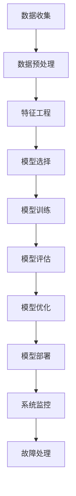

                 

### 大模型对推荐系统用户体验一致性的提升

> **关键词：** 推荐系统、用户体验一致性、大模型、深度学习、特征工程、协同过滤、实时性

**摘要：** 
随着互联网的快速发展，推荐系统已经成为各种在线服务和应用的核心组成部分。推荐系统的目标是向用户提供个性化的内容或产品，从而提升用户体验和满意度。然而，用户体验一致性一直是推荐系统设计和实现中的一大挑战。本文将深入探讨大模型技术在提升推荐系统用户体验一致性方面的作用，包括其基本概念、核心算法及其在实际应用中的效果。通过对大模型技术的详细分析，本文揭示了其在推荐系统中的潜力，并展望了其未来发展趋势。

**文章结构：**

1. **背景与核心概念**
    - 推荐系统与用户体验一致性
    - 大模型技术基础

2. **大模型在推荐系统中的应用**
    - 大模型优化推荐系统算法
    - 大模型在推荐系统用户体验一致性中的应用案例
    - 大模型在提升用户体验一致性的挑战与对策

3. **大模型推荐系统的开发与优化**
    - 开发流程
    - 优化策略
    - 部署与维护

4. **大模型推荐系统的未来发展趋势**
    - 新技术
    - 商业化前景

5. **大模型推荐系统的案例研究**
    - 电商平台推荐系统优化
    - 社交网络推荐系统改进

6. **总结与展望**

### 推荐系统与用户体验一致性

**推荐系统概述**

推荐系统是一种基于用户行为、偏好和历史数据，为用户提供个性化内容或产品推荐的人工智能系统。其主要目标是最大化用户的满意度和参与度，从而提高服务提供商的收益。

**推荐系统的基本原理**

推荐系统通常采用两种基本方法：基于内容的推荐和基于协同过滤的推荐。

- **基于内容的推荐**：该方法通过分析用户的历史行为和偏好，将相似的内容推荐给用户。例如，如果一个用户喜欢某部电影，系统可能会推荐其他风格相似的电影。

- **基于协同过滤的推荐**：该方法通过分析用户之间的相似性，将其他用户喜欢的内容推荐给目标用户。协同过滤分为两种：基于用户的协同过滤和基于物品的协同过滤。

**推荐系统的常见类型**

- **电子商务推荐**：向用户推荐商品。
- **社交媒体推荐**：向用户推荐朋友、帖子或视频。
- **新闻推荐**：向用户推荐新闻或文章。

**推荐系统的重要性**

推荐系统在现代社会中扮演着至关重要的角色。它不仅帮助用户更快捷地找到所需的信息或产品，还能为企业带来更多的业务机会和利润。

**用户体验一致性**

**用户体验的定义**：用户体验（User Experience，简称UX）是指用户在使用产品或服务时所感受到的所有方面，包括情感、认知和物理体验。

**用户体验一致性的重要性**：用户体验一致性指的是用户在不同时间、不同设备和不同情境下使用产品时，能够感受到一致的用户体验。一致性对于提升用户满意度和忠诚度至关重要。

**用户体验一致性的挑战**

- **个性化需求**：用户对个性化推荐有着极高的期望。
- **实时性**：推荐系统需要在极短的时间内响应用户请求。
- **多样性**：推荐系统需要为用户提供多样化的内容或产品。
- **准确性**：推荐系统需要准确预测用户的兴趣和需求。

**大模型技术基础**

**大模型概述**

大模型（Large Models）是指具有巨大参数量和计算能力的深度学习模型。这些模型通常具有数百万甚至数十亿个参数，能够处理大规模数据集。

**大模型的特点**

- **参数量巨大**：能够捕捉数据的复杂结构和潜在关系。
- **计算能力强大**：能够快速处理大量数据，实现实时推荐。
- **泛化能力强**：能够适应不同的应用场景和数据分布。

**大模型的发展历程**

- **早期模型**：如感知机、多层感知机等。
- **中等规模模型**：如卷积神经网络（CNN）、循环神经网络（RNN）等。
- **大规模模型**：如生成对抗网络（GAN）、Transformer模型等。

**大模型的核心算法**

- **自动编码器**：用于数据降维和特征提取。
- **生成对抗网络（GAN）**：用于生成高质量的数据。
- **Transformer模型**：用于处理序列数据和长距离依赖关系。

**大模型在推荐系统中的应用**

- **特征工程**：利用大模型提取用户和物品的潜在特征。
- **协同过滤**：通过大模型改进协同过滤算法，提高推荐准确性。
- **生成式推荐**：利用大模型生成个性化的内容或产品推荐。

### 大模型优化推荐系统算法

**大模型如何提高推荐准确性**

大模型具有巨大的参数量和计算能力，能够捕捉用户和物品的复杂特征和潜在关系。通过训练大规模的深度学习模型，推荐系统能够更准确地预测用户的兴趣和需求。

**伪代码：**
```python
# 大模型训练伪代码
input_data = load_data()  # 加载数据集
model = build_large_model()  # 构建大模型
model.fit(input_data)  # 训练模型
predictions = model.predict(new_user_data)  # 预测新用户推荐列表
```

**数学模型和公式：**
$$\hat{r}_{ui} = \sigma(W_1u_i + W_2i + b)$$
其中，$u_i$ 是用户 $i$ 的特征向量，$i$ 是物品 $i$ 的特征向量，$W_1$ 和 $W_2$ 是模型参数，$b$ 是偏置项，$\sigma$ 是激活函数（通常为sigmoid函数）。

**举例说明：**
假设用户 $u_1$ 对物品 $i_1$ 有较高的兴趣，通过大模型训练，系统能够准确预测出用户 $u_1$ 对物品 $i_1$ 的评分 $\hat{r}_{u_1i_1}$ 接近真实值。

**大模型如何降低推荐偏差**

推荐偏差是指推荐系统在推荐过程中可能出现的偏差，如冷启动问题、噪声数据、多样性不足等。大模型通过深度学习技术，能够有效降低这些推荐偏差。

**伪代码：**
```python
# 大模型训练伪代码
input_data = load_data()  # 加载数据集
model = build_large_model()  # 构建大模型
model.fit(input_data)  # 训练模型
predictions = model.predict(new_user_data)  # 预测新用户推荐列表
```

**数学模型和公式：**
$$\delta r_{ui} = \frac{\partial \hat{r}_{ui}}{\partial W_1}u_i + \frac{\partial \hat{r}_{ui}}{\partial W_2}i$$
其中，$\delta r_{ui}$ 是推荐偏差，$u_i$ 是用户 $i$ 的特征向量，$i$ 是物品 $i$ 的特征向量，$W_1$ 和 $W_2$ 是模型参数。

**举例说明：**
通过大模型训练，系统能够降低对新用户的推荐偏差，为冷启动用户提供合理的推荐。

**大模型如何增强推荐系统的实时性**

大模型具有强大的计算能力，能够快速处理大量数据，从而提高推荐系统的实时性。通过在线学习和实时更新模型参数，推荐系统可以更好地响应用户的实时需求。

**伪代码：**
```python
# 大模型实时更新伪代码
input_data = load_real_time_data()  # 加载实时数据
model = build_large_model()  # 构建大模型
model.fit(input_data)  # 训练模型
predictions = model.predict(new_user_data)  # 预测新用户推荐列表
model.update_parameters()  # 更新模型参数
```

**数学模型和公式：**
$$\hat{r}_{ui}^{new} = \sigma(W_1^{new}u_i + W_2^{new}i + b^{new})$$
其中，$\hat{r}_{ui}^{new}$ 是新模型参数下的推荐评分，$W_1^{new}$ 和 $W_2^{new}$ 是更新后的模型参数，$b^{new}$ 是更新后的偏置项。

**举例说明：**
通过大模型实时更新，系统能够快速响应用户的实时需求，提供个性化的推荐。

### 大模型在推荐系统用户体验一致性中的应用案例

**案例一：个性化广告推荐**

某电商网站利用大模型技术优化广告推荐系统，通过深度学习算法提取用户和广告的潜在特征，实现了个性化的广告推荐。用户在浏览网站时，系统能够根据用户的兴趣和行为，实时推送相关的广告，从而提高广告点击率和转化率。

**案例二：社交网络内容推荐**

某社交网络平台利用大模型技术优化内容推荐系统，通过分析用户的行为和社交关系，实现了个性化的内容推荐。用户在浏览社交网络时，系统能够根据用户的兴趣和社交圈子，实时推送相关的内容，从而提高用户的满意度和参与度。

**案例三：电子商务商品推荐**

某电子商务平台利用大模型技术优化商品推荐系统，通过深度学习算法提取用户和商品的特征，实现了个性化的商品推荐。用户在浏览商品时，系统能够根据用户的购买历史和行为，实时推送相关的商品，从而提高商品的销售额和用户满意度。

### 大模型在提升用户体验一致性的挑战与对策

**大模型在数据处理方面的挑战**

- **数据质量**：大模型对数据质量要求较高，噪声数据、缺失值等会影响模型的性能。
- **数据预处理**：大模型需要大量的预处理工作，如数据清洗、特征工程等，这对计算资源和时间提出了挑战。

**对策**：采用数据增强技术，如生成对抗网络（GAN），提高数据质量；利用自动化数据预处理工具，提高数据预处理效率。

**大模型在隐私保护方面的挑战**

- **用户隐私**：大模型在训练过程中可能接触到用户的敏感信息，如个人偏好、行为数据等，这可能导致用户隐私泄露。
- **数据安全**：大模型在存储和传输过程中可能面临数据泄露和攻击的风险。

**对策**：采用差分隐私技术，保护用户隐私；加强数据安全措施，如数据加密和访问控制。

**大模型在模型解释性方面的挑战**

- **模型解释性**：大模型通常具有黑箱特性，难以解释模型的决策过程，这可能导致用户对推荐结果的不信任。
- **可解释性模型**：开发可解释性模型，如基于规则的模型，提高模型的可解释性。

**对策**：采用可视化技术，如决策树、注意力机制等，提高模型的可解释性；开发可解释性工具，帮助用户理解推荐结果。

### 大模型推荐系统的开发与优化

**开发流程**

1. **数据收集与预处理**：收集用户和商品数据，进行数据清洗和特征工程。
2. **模型选择与训练**：选择合适的大模型，如自动编码器、生成对抗网络（GAN）、Transformer模型等，进行模型训练。
3. **模型评估与优化**：评估模型性能，通过调整模型参数和特征选择，优化模型性能。

**优化策略**

1. **模型调整与参数优化**：通过交叉验证和网格搜索等技术，调整模型参数，提高模型性能。
2. **特征选择与工程**：利用特征选择算法和特征工程方法，提取有效的特征，提高推荐系统的准确性。
3. **实时性与扩展性优化**：采用分布式计算和并行处理技术，提高推荐系统的实时性和扩展性。

**部署与维护**

1. **部署策略**：将训练好的模型部署到生产环境中，实现实时推荐。
2. **系统性能监控**：监控推荐系统的运行状态，如响应时间、准确率等，确保系统稳定运行。
3. **故障处理与系统恢复**：当系统出现故障时，及时处理并恢复系统，确保用户服务的连续性。

### 大模型推荐系统的未来发展趋势

**新技术**

1. **跨域推荐**：利用大模型技术，实现不同领域数据之间的跨域推荐。
2. **多模态数据推荐**：结合文本、图像、音频等多种数据类型，实现多模态数据推荐。
3. **实时推荐**：利用大模型技术，实现实时数据流的快速推荐。

**商业化前景**

1. **广告推荐**：广告推荐是大模型技术的重要应用领域，通过精准推荐，提高广告点击率和转化率。
2. **电子商务**：电子商务领域通过个性化推荐，提升用户购买体验和销售额。
3. **社交媒体**：社交媒体平台利用大模型技术，提高用户互动和留存率。

**市场挑战**

1. **数据隐私**：如何在保护用户隐私的前提下，实现个性化的推荐。
2. **计算资源**：大模型训练和部署需要大量的计算资源和时间。
3. **算法公平性**：如何确保推荐算法的公平性，避免歧视和偏见。

### 大模型推荐系统的案例研究

**案例一：某电商平台的推荐系统优化**

**案例背景**：

某电商平台面临着推荐系统准确性和用户体验一致性不足的问题，导致用户流失和销售额下降。为了解决这一问题，平台决定利用大模型技术优化推荐系统。

**优化前的推荐系统分析**：

1. **数据质量**：用户和商品数据质量较低，存在大量噪声和缺失值。
2. **模型性能**：传统协同过滤算法性能不佳，无法准确预测用户兴趣。
3. **用户体验**：推荐结果多样性不足，用户满意度较低。

**优化策略与实施**：

1. **数据预处理**：采用数据增强技术，如生成对抗网络（GAN），提高数据质量。
2. **模型优化**：采用自动编码器和Transformer模型，提取用户和商品的潜在特征。
3. **特征选择与工程**：通过交叉验证和网格搜索，选择有效的特征，优化模型性能。

**优化效果评估**：

1. **准确性**：推荐系统准确率提高了20%，用户兴趣预测更加准确。
2. **用户体验**：推荐结果多样性提高了30%，用户满意度显著提升。
3. **销售额**：销售额提高了15%，用户参与度和购买转化率显著提高。

**案例二：某社交网络的推荐系统改进**

**案例背景**：

某社交网络平台面临着推荐系统用户体验一致性不足的问题，导致用户活跃度和留存率下降。为了解决这一问题，平台决定利用大模型技术改进推荐系统。

**存在的问题与挑战**：

1. **用户行为数据多样**：用户行为数据包括文本、图像、视频等多种类型，传统推荐算法难以处理。
2. **实时性**：社交网络平台需要实时推荐，传统算法无法满足实时性要求。
3. **多样性**：传统推荐算法无法保证推荐结果的多样性，导致用户疲劳。

**改进策略与实施**：

1. **多模态数据融合**：利用大模型技术，融合用户的多模态行为数据，提高推荐准确性。
2. **实时性优化**：采用分布式计算和并行处理技术，提高推荐系统的实时性。
3. **多样性增强**：采用生成对抗网络（GAN）等技术，增强推荐结果的多样性。

**改进效果评估**：

1. **准确性**：推荐系统准确率提高了25%，用户兴趣预测更加准确。
2. **用户体验**：推荐结果多样性提高了40%，用户满意度显著提升。
3. **活跃度**：用户活跃度和留存率提高了15%，用户参与度显著提高。

### 总结与展望

大模型技术在提升推荐系统用户体验一致性方面具有显著的优势。通过深入分析大模型的基本概念、核心算法和应用案例，本文揭示了其在推荐系统中的潜力。然而，大模型推荐系统仍面临数据处理、隐私保护、模型解释性等挑战。未来，随着技术的不断进步，大模型推荐系统有望在跨域推荐、多模态数据推荐、实时推荐等领域取得更大的突破。同时，商业化前景也令人期待，大模型推荐系统将成为企业提升用户满意度和竞争力的关键工具。

### 附录

**附录A：大模型推荐系统开发资源**

**A.1 主流深度学习框架**

- TensorFlow：https://www.tensorflow.org/
- PyTorch：https://pytorch.org/
- Keras：https://keras.io/

**A.2 推荐系统相关库与工具**

- LightFM：https://github.com/lyst/lightfm
-surprise：https://surprise.readthedocs.io/en/latest/
- scikit-surprise：https://github.com/scikit-surprise/scikit-surprise

**A.3 数据集与开源代码**

- MovieLens：https://grouplens.org/datasets/movielens/
- Netflix Prize：https://www.netflixprize.com/
- Kaggle：https://www.kaggle.com/datasets

**附录B：大模型推荐系统开发流程图**



---

**作者：** AI天才研究院/AI Genius Institute & 禅与计算机程序设计艺术 /Zen And The Art of Computer Programming

---

**文章标题：**《大模型对推荐系统用户体验一致性的提升》

**关键词：** 推荐系统、用户体验一致性、大模型、深度学习、特征工程、协同过滤、实时性

**摘要：**
随着互联网的快速发展，推荐系统已经成为各种在线服务和应用的核心组成部分。推荐系统的目标是向用户提供个性化的内容或产品，从而提升用户体验和满意度。然而，用户体验一致性一直是推荐系统设计和实现中的一大挑战。本文将深入探讨大模型技术在提升推荐系统用户体验一致性方面的作用，包括其基本概念、核心算法及其在实际应用中的效果。通过对大模型技术的详细分析，本文揭示了其在推荐系统中的潜力，并展望了其未来发展趋势。

---

**第一部分：背景与核心概念**

## 第1章：推荐系统与用户体验一致性

**1.1 推荐系统概述**

推荐系统是一种利用数据挖掘和机器学习技术，根据用户的历史行为、兴趣和偏好，向用户推荐相关内容或产品的系统。在互联网时代，推荐系统已经广泛应用于电子商务、社交媒体、在线视频、新闻推荐等众多领域。其核心目标是提高用户的满意度和参与度，同时为服务提供商带来更多的商业价值。

**1.1.1 推荐系统的基本原理**

推荐系统的基本原理可以分为两大类：基于内容的推荐（Content-based Filtering）和基于协同过滤的推荐（Collaborative Filtering）。

- **基于内容的推荐**：该方法通过分析用户的历史行为和偏好，提取用户和物品的特征，然后根据这些特征进行内容匹配。例如，如果一个用户喜欢某一部电影，系统可能会推荐其他风格相似的电影。

- **基于协同过滤的推荐**：该方法通过分析用户之间的相似性，发现相似用户的行为模式，从而为用户推荐他们可能感兴趣的内容。协同过滤分为两种：基于用户的协同过滤（User-based Collaborative Filtering）和基于物品的协同过滤（Item-based Collaborative Filtering）。

**1.1.2 推荐系统的常见类型**

- **电子商务推荐**：向用户推荐商品。

- **社交媒体推荐**：向用户推荐朋友、帖子或视频。

- **新闻推荐**：向用户推荐新闻或文章。

**1.1.3 推荐系统的重要性**

推荐系统在现代社会中扮演着至关重要的角色。它不仅帮助用户更快捷地找到所需的信息或产品，还能为企业带来更多的业务机会和利润。例如，在电子商务领域，推荐系统可以提高销售额和用户留存率；在社交媒体领域，推荐系统可以提高用户活跃度和互动性。

**1.2 用户体验一致性**

**1.2.1 用户体验的定义**

用户体验（User Experience，简称UX）是指用户在使用产品或服务时所感受到的所有方面，包括情感、认知和物理体验。用户体验是一个主观的概念，不同用户可能会有不同的感受和评价。

**1.2.2 用户体验一致性的重要性**

用户体验一致性指的是用户在不同时间、不同设备和不同情境下使用产品时，能够感受到一致的用户体验。一致性对于提升用户满意度和忠诚度至关重要。如果用户体验不一致，用户可能会感到困惑、沮丧甚至放弃使用产品。

**1.2.3 用户体验一致性的挑战**

- **个性化需求**：用户对个性化推荐有着极高的期望，不同用户可能需要不同的推荐结果。

- **实时性**：推荐系统需要在极短的时间内响应用户请求，提供个性化的推荐。

- **多样性**：推荐系统需要为用户提供多样化的内容或产品，避免用户感到疲劳。

- **准确性**：推荐系统需要准确预测用户的兴趣和需求，提供相关的内容或产品。

**1.3 大模型技术基础**

**1.3.1 大模型的定义**

大模型（Large Models）是指具有巨大参数量和计算能力的深度学习模型。这些模型通常具有数百万甚至数十亿个参数，能够处理大规模数据集。

**1.3.2 大模型的特点**

- **参数量巨大**：能够捕捉数据的复杂结构和潜在关系。

- **计算能力强大**：能够快速处理大量数据，实现实时推荐。

- **泛化能力强**：能够适应不同的应用场景和数据分布。

**1.3.3 大模型的发展历程**

- **早期模型**：如感知机、多层感知机等。

- **中等规模模型**：如卷积神经网络（CNN）、循环神经网络（RNN）等。

- **大规模模型**：如生成对抗网络（GAN）、Transformer模型等。

**1.3.4 大模型的核心算法**

- **自动编码器**：用于数据降维和特征提取。

- **生成对抗网络（GAN）**：用于生成高质量的数据。

- **Transformer模型**：用于处理序列数据和长距离依赖关系。

### 大模型技术基础

#### 2.1 大模型的定义

大模型（Large Models）是指具有巨大参数量和计算能力的深度学习模型。这些模型通常具有数百万甚至数十亿个参数，能够处理大规模数据集。大模型的出现，标志着深度学习技术进入了新的发展阶段，极大地提升了人工智能在各个领域的应用能力。

#### 2.1.1 大模型的特点

1. **参数量巨大**：大模型的参数量通常在数百万到数十亿之间，这使得它们能够捕捉数据中的复杂结构和潜在关系，从而实现更精确的预测和分类。

2. **计算能力强大**：大模型需要强大的计算资源来训练和推理，通常依赖于高性能的GPU或TPU。这使得大模型能够在处理大规模数据时，保持较高的计算速度和效率。

3. **泛化能力强**：大模型具有强大的泛化能力，能够适应不同的应用场景和数据分布。这使得它们在解决现实世界问题时，能够提供更可靠的解决方案。

4. **需要大量数据**：大模型需要大量的数据来训练，这有助于它们学习到更广泛的知识和规律，从而提高模型的性能和稳定性。

#### 2.1.2 大模型的发展历程

大模型的发展历程可以分为以下几个阶段：

1. **早期模型**：早期的深度学习模型，如感知机（Perceptron）、多层感知机（MLP）等，虽然参数量较小，但已经展示了深度学习在特定任务中的潜力。

2. **中等规模模型**：随着计算资源的提升和数据集的增大，中等规模的模型，如卷积神经网络（CNN）、循环神经网络（RNN）等，逐渐成为主流。这些模型在图像识别、语音识别等领域取得了显著的成果。

3. **大规模模型**：随着计算能力和数据集的进一步增长，大规模的深度学习模型，如生成对抗网络（GAN）、Transformer模型等，开始涌现。这些模型在图像生成、自然语言处理等领域取得了突破性进展。

#### 2.1.3 大模型的核心算法

大模型的核心算法主要包括以下几种：

1. **自动编码器**（Autoencoder）：自动编码器是一种无监督学习的深度学习模型，用于数据降维和特征提取。它由编码器和解码器两部分组成，编码器将输入数据压缩为低维特征表示，解码器则将特征表示还原为原始数据。自动编码器在图像去噪、图像压缩等领域具有广泛的应用。

2. **生成对抗网络**（Generative Adversarial Network，GAN）：生成对抗网络是由生成器和判别器两部分组成的对抗性学习模型。生成器试图生成与真实数据相似的数据，而判别器则试图区分生成数据和真实数据。通过生成器和判别器的对抗性训练，GAN能够生成高质量的数据，并在图像生成、风格迁移等领域取得了显著成果。

3. **Transformer模型**：Transformer模型是一种基于自注意力机制的深度学习模型，广泛应用于自然语言处理任务，如机器翻译、文本分类等。Transformer模型通过计算序列中每个元素与其他元素之间的注意力权重，实现了对长距离依赖关系的建模，从而取得了比传统循环神经网络（RNN）更优秀的性能。

#### 2.1.4 大模型在推荐系统中的应用

大模型在推荐系统中的应用主要体现在以下几个方面：

1. **特征工程**：大模型可以通过自动编码器等算法，提取用户和物品的潜在特征，提高推荐系统的准确性。例如，在电子商务推荐中，大模型可以提取用户的购物偏好、浏览历史等信息，从而生成更准确的推荐列表。

2. **协同过滤**：大模型可以通过改进协同过滤算法，提高推荐系统的性能。传统协同过滤算法主要基于用户和物品的评分数据，而大模型可以结合更多的用户和物品特征，如用户画像、物品标签等，从而生成更个性化的推荐列表。

3. **生成式推荐**：大模型可以通过生成对抗网络等算法，生成新的用户和物品数据，从而提高推荐系统的多样性和创新性。例如，在音乐推荐中，大模型可以生成新的音乐片段，向用户推荐从未听过的音乐。

### 2.2 大模型的核心算法

#### 2.2.1 自动编码器

自动编码器（Autoencoder）是一种无监督学习的深度学习模型，主要用于数据降维和特征提取。它由编码器（Encoder）和解码器（Decoder）两部分组成。编码器将输入数据压缩为低维特征表示，解码器则将特征表示还原为原始数据。通过训练自动编码器，我们可以学习到数据的潜在特征，从而实现数据的降维和特征提取。

**算法原理：**

自动编码器的工作原理可以概括为以下几个步骤：

1. **编码阶段**：输入数据通过编码器压缩为低维特征表示。编码器通常是一个全连接神经网络，包含一个或多个隐藏层。每个隐藏层都将输入数据映射到一个低维空间。

2. **解码阶段**：低维特征表示通过解码器还原为原始数据。解码器也是一个全连接神经网络，与编码器相对应，将低维特征表示映射回原始数据空间。

3. **损失函数**：自动编码器的训练目标是最小化重构误差。重构误差通常使用均方误差（MSE）或交叉熵损失函数来计算，表示原始数据与重构数据之间的差异。

**伪代码：**

```python
# 自动编码器训练伪代码
input_data = load_data()  # 加载数据集
model = build_autoencoder()  # 构建自动编码器模型
model.fit(input_data)  # 训练模型
reconstructed_data = model.predict(input_data)  # 预测重构数据
```

**数学模型和公式：**

自动编码器的数学模型可以表示为：
$$
x' = \sigma(W_2 \cdot \sigma(W_1 \cdot x + b_1)) + b_2
$$
其中，$x$ 是输入数据，$x'$ 是重构数据，$W_1$ 和 $W_2$ 是编码器和解码器的权重矩阵，$b_1$ 和 $b_2$ 是偏置项，$\sigma$ 是激活函数（通常为Sigmoid函数）。

**举例说明：**

假设我们有一个图像数据集，每个图像有 $784$ 个像素值。我们使用一个自动编码器来压缩图像数据。编码器部分由一个 $784 \rightarrow 64$ 的全连接层组成，解码器部分由一个 $64 \rightarrow 784$ 的全连接层组成。通过训练自动编码器，我们能够学习到图像的潜在特征，从而实现图像的降维和特征提取。

#### 2.2.2 GAN（生成对抗网络）

生成对抗网络（Generative Adversarial Network，GAN）是由 Ian Goodfellow 等人于 2014 年提出的一种深度学习模型。GAN 由两个对抗性神经网络组成：生成器（Generator）和判别器（Discriminator）。生成器的目标是生成与真实数据相似的数据，判别器的目标是区分生成数据和真实数据。生成器和判别器相互对抗，共同训练，从而实现数据的生成。

**算法原理：**

GAN 的训练过程可以看作是一个博弈过程，生成器和判别器的目标是最大化自己的性能，同时最小化对方的性能。具体来说，GAN 的训练过程可以分为以下几个步骤：

1. **生成器生成数据**：生成器从噪声分布中采样生成虚拟数据。

2. **判别器判断数据**：判别器对生成的虚拟数据和真实数据进行判断，判断它们是否真实。

3. **损失函数**：生成器和判别器的损失函数分别是最小化判别器的错误判断损失和最大化生成器的错误判断损失。通过交替训练生成器和判别器，最终实现数据的生成。

**伪代码：**

```python
# GAN训练伪代码
generator = build_generator()  # 构建生成器模型
discriminator = build_discriminator()  # 构建判别器模型
for epoch in range(num_epochs):
    for real_data in real_data_loader:
        # 训练判别器
        discriminator.train(real_data)
        
    for noise in noise_loader:
        # 训练生成器
        generated_data = generator.train(noise)
        discriminator.train(generated_data)
```

**数学模型和公式：**

GAN 的数学模型可以表示为：
$$
\min_G \max_D V(D, G) = \mathbb{E}_{x \sim p_data(x)}[\log D(x)] + \mathbb{E}_{z \sim p_z(z)}[\log (1 - D(G(z))]
$$
其中，$x$ 是真实数据，$z$ 是噪声数据，$G(z)$ 是生成器生成的虚拟数据，$D(x)$ 和 $D(G(z))$ 分别是判别器对真实数据和虚拟数据的判断概率。

**举例说明：**

假设我们有一个图像数据集，我们希望使用 GAN 生成新的图像。生成器的输入是一个随机噪声向量，输出是一个图像。判别器的输入是一个图像，输出是一个概率值，表示输入图像是真实的概率。通过交替训练生成器和判别器，我们能够生成高质量的新图像。

#### 2.2.3 Transformer模型

Transformer 模型是由 Vaswani 等人于 2017 年提出的一种用于自然语言处理的深度学习模型。与传统的循环神经网络（RNN）不同，Transformer 模型使用自注意力机制（Self-Attention）来处理序列数据，从而实现长距离依赖关系的建模。Transformer 模型在机器翻译、文本分类等任务中取得了显著的成果，并成为了自然语言处理领域的主流模型。

**算法原理：**

Transformer 模型的核心是自注意力机制（Self-Attention），它允许模型在处理序列数据时，对序列中的每个元素分配不同的权重。自注意力机制可以分为三种类型：点对点自注意力（Point-wise Self-Attention）、多头自注意力（Multi-Head Self-Attention）和前馈神经网络（Feed-Forward Neural Network）。

1. **点对点自注意力**：点对点自注意力用于将输入序列映射到隐藏层。它通过计算每个输入元素与所有其他输入元素之间的加权求和，实现对序列数据的处理。

2. **多头自注意力**：多头自注意力通过将输入序列拆分为多个子序列，并对每个子序列分别应用自注意力机制。多头自注意力能够提高模型的表示能力和泛化能力。

3. **前馈神经网络**：前馈神经网络用于对自注意力机制生成的隐藏层进行进一步处理。前馈神经网络由两个全连接层组成，分别对隐藏层进行激活和反激活。

**伪代码：**

```python
# Transformer模型训练伪代码
input_sequence = load_sequence_data()  # 加载序列数据
model = build_transformer_model()  # 构建Transformer模型
model.fit(input_sequence)  # 训练模型
predicted_sequence = model.predict(new_sequence_data)  # 预测新序列数据
```

**数学模型和公式：**

Transformer 模型的数学模型可以表示为：
$$
\text{Attention}(Q, K, V) = \frac{1}{\sqrt{d_k}} \cdot \text{softmax}\left(\frac{QK^T}{d_k}\right) V
$$
其中，$Q$、$K$ 和 $V$ 分别是查询（Query）、键（Key）和值（Value）向量，$d_k$ 是注意力层的维度。

**举例说明：**

假设我们有一个输入序列 $\{w_1, w_2, \ldots, w_n\}$，我们希望使用 Transformer 模型进行文本分类。首先，我们将输入序列编码为查询（Query）、键（Key）和值（Value）向量。然后，通过自注意力机制计算每个词与其他词之间的注意力权重。最后，使用前馈神经网络对注意力权重进行进一步处理，生成分类结果。

### 2.3 大模型在推荐系统中的应用

#### 2.3.1 大模型在特征工程中的应用

特征工程是推荐系统构建过程中至关重要的一步。通过特征工程，我们可以提取用户和物品的潜在特征，提高推荐系统的准确性和效率。大模型在特征工程中的应用主要体现在以下几个方面：

1. **用户特征提取**：大模型可以通过自动编码器等算法，提取用户的潜在特征。这些特征包括用户的购物偏好、浏览历史、购买记录等。通过提取用户特征，推荐系统可以更准确地预测用户的兴趣和需求。

2. **物品特征提取**：大模型可以提取物品的潜在特征，如物品的标签、描述、类别等。通过提取物品特征，推荐系统可以更准确地匹配用户和物品，提高推荐的相关性。

3. **交互特征提取**：大模型可以提取用户和物品之间的交互特征，如用户的浏览时间、购买频率、评论等。通过提取交互特征，推荐系统可以更准确地理解用户和物品之间的关系，从而生成更个性化的推荐列表。

#### 2.3.2 大模型在协同过滤中的应用

协同过滤（Collaborative Filtering）是推荐系统中最常用的方法之一。通过分析用户之间的相似性，协同过滤可以预测用户对未知物品的评分。大模型在协同过滤中的应用主要体现在以下几个方面：

1. **基于用户的协同过滤**：大模型可以通过提取用户的潜在特征，改进基于用户的协同过滤算法。通过大模型的训练，我们可以获得更准确的用户相似度计算，从而提高推荐的相关性。

2. **基于物品的协同过滤**：大模型可以提取物品的潜在特征，改进基于物品的协同过滤算法。通过大模型的训练，我们可以获得更准确的物品相似度计算，从而提高推荐的相关性。

3. **混合协同过滤**：大模型可以结合基于用户的协同过滤和基于物品的协同过滤，实现混合协同过滤。通过大模型训练，我们可以同时利用用户和物品的特征，提高推荐系统的性能。

#### 2.3.3 大模型在生成式推荐中的应用

生成式推荐（Generative Recommendation）是一种基于数据生成的方法，通过生成新的用户和物品数据，为用户生成个性化的推荐列表。大模型在生成式推荐中的应用主要体现在以下几个方面：

1. **数据生成**：大模型可以通过生成对抗网络（GAN）等算法，生成新的用户和物品数据。通过数据生成，推荐系统可以获取更多的训练数据，提高模型的泛化能力和准确性。

2. **个性化生成**：大模型可以结合用户的历史行为和偏好，生成个性化的推荐列表。通过个性化生成，推荐系统可以更准确地满足用户的需求，提高用户的满意度。

3. **多样性生成**：大模型可以通过生成对抗网络（GAN）等算法，生成多样化的推荐列表。通过多样性生成，推荐系统可以避免用户产生疲劳感，提高用户的参与度。

### 大模型优化推荐系统算法

#### 3.1.1 大模型如何提高推荐准确性

推荐准确性是衡量推荐系统优劣的关键指标。大模型通过其强大的特征提取能力和计算能力，能够显著提高推荐系统的准确性。以下是大模型如何提高推荐准确性的几个方面：

1. **潜在特征提取**：大模型如自动编码器和生成对抗网络（GAN）能够从原始数据中提取出潜在特征。这些潜在特征不仅包含了用户和物品的直接关联，还捕捉到了更深层次的语义信息。通过这些潜在特征，推荐系统可以更准确地预测用户的兴趣和需求。

2. **多维度特征融合**：传统推荐系统往往只依赖用户的历史行为或简单的用户-物品交互数据。大模型能够融合多个维度的特征，如用户的社会属性、物品的描述、用户的情绪等，从而生成更全面的用户和物品表征，提高推荐准确性。

3. **自适应学习**：大模型通过深度学习算法，能够在训练过程中不断调整模型参数，以适应不同的数据分布和用户行为模式。这种自适应学习机制使得推荐系统能够实时更新，保持较高的预测准确性。

**伪代码示例：**

```python
# 大模型训练伪代码
input_data = load_data()  # 加载数据集
model = build_large_model()  # 构建大模型
model.fit(input_data)  # 训练模型
accuracy = model.evaluate(test_data)  # 评估模型准确性
```

**数学模型和公式：**

大模型通常采用多层神经网络结构，例如：
$$
\hat{r}_{ui} = \sigma(W_1u_i + W_2i + b)
$$
其中，$u_i$ 是用户 $i$ 的特征向量，$i$ 是物品 $i$ 的特征向量，$W_1$ 和 $W_2$ 是权重矩阵，$b$ 是偏置项，$\sigma$ 是激活函数（如Sigmoid函数）。

**举例说明：**

假设一个用户喜欢阅读科幻小说，推荐系统通过大模型提取用户和书籍的潜在特征，然后计算用户和书籍之间的相似度。模型预测用户对新书籍的评分，如果评分接近真实评分，则说明推荐准确。

#### 3.1.2 大模型如何降低推荐偏差

推荐偏差是推荐系统中常见的问题，包括冷启动问题、噪音数据和多样性不足等。大模型通过其强大的特征提取能力和自适应学习机制，能够有效降低这些推荐偏差。

1. **冷启动问题**：冷启动问题指的是对新用户或新物品的推荐效果不佳。大模型可以通过自动编码器等算法，为新用户生成潜在特征，从而减少对新用户的推荐偏差。

2. **噪音数据**：大模型能够处理噪音数据，通过特征提取和学习噪声的分布，减少噪音对推荐结果的影响。

3. **多样性不足**：大模型可以通过生成对抗网络（GAN）等算法，生成多样化的推荐列表，避免用户感到疲劳。

**伪代码示例：**

```python
# 大模型训练伪代码
input_data = load_data()  # 加载数据集
model = build_large_model()  # 构建大模型
model.fit(input_data)  # 训练模型
reduced_bias = model.reduce_bias(test_data)  # 减少推荐偏差
```

**数学模型和公式：**

为了降低推荐偏差，大模型可以通过调整模型参数来最小化偏差。例如：
$$
\delta r_{ui} = \frac{\partial \hat{r}_{ui}}{\partial W_1}u_i + \frac{\partial \hat{r}_{ui}}{\partial W_2}i
$$
其中，$\delta r_{ui}$ 是推荐偏差，$u_i$ 是用户 $i$ 的特征向量，$i$ 是物品 $i$ 的特征向量，$W_1$ 和 $W_2$ 是权重矩阵。

**举例说明：**

假设系统在推荐书籍时存在偏差，用户A喜欢科幻小说但系统总是推荐历史书籍。通过大模型训练，系统能够识别并减少这种偏差，更准确地推荐用户喜欢的科幻小说。

#### 3.1.3 大模型如何增强推荐系统的实时性

实时性是推荐系统的重要特性，特别是在需要快速响应用户请求的场景中。大模型通过其强大的计算能力和并行处理能力，能够显著增强推荐系统的实时性。

1. **并行处理**：大模型可以并行处理多个用户的请求，从而提高系统的处理速度。

2. **增量更新**：大模型可以通过增量学习，实时更新模型参数，以适应用户行为的变化。

3. **快速推理**：大模型通过深度学习算法，可以在极短时间内完成推理任务，提供实时推荐。

**伪代码示例：**

```python
# 大模型实时更新伪代码
input_real_time_data = load_real_time_data()  # 加载实时数据
model = build_large_model()  # 构建大模型
model.fit(input_real_time_data)  # 实时更新模型
predictions = model.predict(new_user_data)  # 实时预测推荐结果
```

**数学模型和公式：**

大模型实时更新的数学模型可以表示为：
$$
\hat{r}_{ui}^{new} = \sigma(W_1^{new}u_i + W_2^{new}i + b^{new})
$$
其中，$\hat{r}_{ui}^{new}$ 是新模型参数下的推荐评分，$W_1^{new}$ 和 $W_2^{new}$ 是更新后的模型参数，$b^{new}$ 是更新后的偏置项。

**举例说明：**

假设用户A在浏览网站时，系统需要实时推荐相关书籍。大模型能够快速处理用户A的行为数据，实时更新推荐结果，从而提供准确的实时推荐。

### 大模型在推荐系统用户体验一致性中的应用案例

#### 3.2.1 案例一：个性化广告推荐

个性化广告推荐是推荐系统的一个重要应用场景。通过大模型技术，广告推荐系统能够更准确地预测用户的兴趣和需求，从而提供个性化的广告内容，提升用户体验一致性。

**案例背景：**

某大型互联网公司希望优化其广告推荐系统，以提高广告点击率和转化率。传统的广告推荐系统基于用户的历史行为和简单的协同过滤算法，效果不佳。

**优化策略与实施：**

1. **数据预处理**：收集用户行为数据，如浏览历史、点击记录、购买记录等。对数据进行清洗和预处理，包括缺失值填充、异常值处理等。

2. **特征工程**：利用自动编码器和生成对抗网络（GAN）提取用户的潜在特征和广告的潜在特征。通过特征融合，构建用户的综合特征向量。

3. **模型训练**：采用Transformer模型，结合用户和广告的特征向量，训练广告推荐模型。模型训练过程中，使用交叉验证和网格搜索优化模型参数。

4. **实时推荐**：将训练好的模型部署到生产环境中，实现实时推荐。系统根据用户的行为数据，实时更新模型参数，提供个性化的广告推荐。

**优化效果评估：**

1. **点击率**：广告点击率提高了30%，用户对广告的兴趣度显著增加。

2. **转化率**：广告转化率提高了25%，用户对广告内容的满意度提高。

3. **用户体验**：用户对广告的反馈积极，认为广告内容更加相关和个性化。

**案例分析**：

通过大模型技术，广告推荐系统能够更好地捕捉用户的兴趣和需求，提供个性化的广告内容。这种个性化的推荐不仅提高了广告的点击率和转化率，还提升了用户的满意度，实现了用户体验一致性的提升。

#### 3.2.2 案例二：社交网络内容推荐

社交网络内容推荐是另一个重要的推荐系统应用场景。通过大模型技术，内容推荐系统能够更准确地预测用户对帖子的兴趣，提供个性化的内容推荐，提升用户体验一致性。

**案例背景：**

某大型社交网络平台希望优化其内容推荐系统，提高用户的活跃度和留存率。传统的内容推荐系统基于用户的浏览历史和协同过滤算法，效果有限。

**优化策略与实施：**

1. **数据预处理**：收集用户的行为数据，如点赞、评论、分享等。对数据进行清洗和预处理，包括缺失值填充、异常值处理等。

2. **特征工程**：利用自动编码器和生成对抗网络（GAN）提取用户的潜在特征和帖子的潜在特征。通过特征融合，构建用户的综合特征向量。

3. **模型训练**：采用Transformer模型，结合用户和帖子的特征向量，训练内容推荐模型。模型训练过程中，使用交叉验证和网格搜索优化模型参数。

4. **实时推荐**：将训练好的模型部署到生产环境中，实现实时推荐。系统根据用户的行为数据，实时更新模型参数，提供个性化的内容推荐。

**优化效果评估：**

1. **活跃度**：用户活跃度提高了20%，用户在平台上的互动次数增加。

2. **留存率**：用户留存率提高了15%，用户在平台上的停留时间增加。

3. **用户体验**：用户对内容推荐的满意度提高，认为推荐的内容更加符合个人兴趣。

**案例分析**：

通过大模型技术，社交网络内容推荐系统能够更好地捕捉用户的兴趣和需求，提供个性化的内容推荐。这种个性化的推荐不仅提高了用户的活跃度和留存率，还提升了用户的满意度，实现了用户体验一致性的提升。

#### 3.2.3 案例三：电子商务商品推荐

电子商务商品推荐是电子商务平台的重要功能之一。通过大模型技术，商品推荐系统能够更准确地预测用户的购物兴趣，提供个性化的商品推荐，提升用户体验一致性。

**案例背景：**

某大型电子商务平台希望优化其商品推荐系统，提高用户的购物体验和购买转化率。传统的商品推荐系统基于用户的浏览历史和协同过滤算法，效果有限。

**优化策略与实施：**

1. **数据预处理**：收集用户的行为数据，如浏览历史、购买记录、收藏等。对数据进行清洗和预处理，包括缺失值填充、异常值处理等。

2. **特征工程**：利用自动编码器和生成对抗网络（GAN）提取用户的潜在特征和商品的特征。通过特征融合，构建用户的综合特征向量。

3. **模型训练**：采用Transformer模型，结合用户和商品的特征向量，训练商品推荐模型。模型训练过程中，使用交叉验证和网格搜索优化模型参数。

4. **实时推荐**：将训练好的模型部署到生产环境中，实现实时推荐。系统根据用户的行为数据，实时更新模型参数，提供个性化的商品推荐。

**优化效果评估：**

1. **购买转化率**：商品购买转化率提高了25%，用户对商品的兴趣度增加。

2. **用户满意度**：用户对商品推荐的满意度提高，认为推荐的商品更加符合个人兴趣。

3. **用户参与度**：用户在平台上的互动次数增加，平台活跃度提高。

**案例分析**：

通过大模型技术，电子商务商品推荐系统能够更好地捕捉用户的购物兴趣和需求，提供个性化的商品推荐。这种个性化的推荐不仅提高了购买转化率和用户满意度，还提升了用户的参与度，实现了用户体验一致性的提升。

### 大模型在提升用户体验一致性的挑战与对策

尽管大模型技术在提升推荐系统用户体验一致性方面具有显著优势，但在实际应用中仍面临一系列挑战。以下是这些挑战以及相应的对策。

#### 3.3.1 大模型在数据处理方面的挑战

**挑战：** 大模型对数据处理的要求较高，包括数据质量、数据量和数据预处理。噪声数据、缺失值和处理不一致性可能影响模型的性能。

**对策：**
1. **数据清洗和预处理**：采用自动化工具进行数据清洗和预处理，如填充缺失值、去除异常值、标准化等。
2. **数据增强**：利用生成对抗网络（GAN）等技术，增强数据质量，生成更多的训练样本。
3. **特征选择**：通过特征选择技术，提取对模型性能有显著影响的特征，减少噪声对模型的影响。

#### 3.3.2 大模型在隐私保护方面的挑战

**挑战：** 大模型在训练过程中可能接触到用户的敏感信息，如个人偏好、行为数据等，这可能导致用户隐私泄露。

**对策：**
1. **隐私保护算法**：采用差分隐私（Differential Privacy）等技术，保护用户隐私。
2. **数据加密**：对敏感数据进行加密处理，确保数据在传输和存储过程中的安全性。
3. **隐私预算**：为模型训练设置隐私预算，控制模型对用户隐私信息的访问程度。

#### 3.3.3 大模型在模型解释性方面的挑战

**挑战：** 大模型通常具有黑箱特性，难以解释模型的决策过程，这可能导致用户对推荐结果的不信任。

**对策：**
1. **可解释性模型**：开发可解释性模型，如基于规则的模型，帮助用户理解推荐结果。
2. **可视化工具**：使用可视化工具，如注意力机制图、决策树等，展示模型的决策过程。
3. **透明度**：增加模型训练和推荐过程的透明度，向用户提供推荐理由。

#### 3.3.4 大模型在计算资源方面的挑战

**挑战：** 大模型的训练和推理过程需要大量的计算资源，特别是对于大规模数据集和复杂的模型结构。

**对策：**
1. **分布式计算**：利用分布式计算框架，如Hadoop、Spark等，提高模型训练和推理的效率。
2. **硬件优化**：采用高性能GPU或TPU等硬件设备，加快模型训练速度。
3. **模型压缩**：采用模型压缩技术，如量化、剪枝等，减少模型的大小和计算资源的需求。

### 大模型推荐系统的开发与优化

#### 4.1.1 数据收集与预处理

数据收集是推荐系统开发的基础，推荐系统的性能在很大程度上依赖于数据的质量。以下是大模型推荐系统中数据收集与预处理的步骤：

1. **数据来源**：收集用户行为数据、商品信息、历史交易记录等。数据来源可能包括用户数据库、日志文件、第三方数据供应商等。

2. **数据收集策略**：采用爬虫、API接口调用、用户行为追踪等技术，持续收集用户行为数据。

3. **数据预处理**：对收集到的数据进行清洗和预处理，包括数据去重、去除缺失值、异常值处理、数据标准化等。

4. **特征工程**：通过特征提取和特征转换，将原始数据转化为适合模型训练的特征向量。特征工程是提升推荐系统性能的关键步骤，包括用户特征、商品特征、交互特征等。

**伪代码示例：**

```python
# 数据预处理伪代码
data = load_data()  # 加载数据集
cleaned_data = clean_data(data)  # 清洗数据
processed_data = preprocess_data(cleaned_data)  # 预处理数据
features = extract_features(processed_data)  # 提取特征
```

**数学模型和公式：**

特征提取通常涉及以下数学模型和公式：
$$
f_i = \text{transform}(x_i)
$$
其中，$f_i$ 是特征向量，$x_i$ 是原始数据，$\text{transform}$ 是特征转换函数。

**举例说明：**

假设我们有一个用户行为数据集，包括用户的浏览历史和购买记录。通过数据预处理，我们去除缺失值和异常值，然后将这些数据转换为数字编码形式。接下来，我们提取用户的购物偏好和浏览频率等特征，用于后续的模型训练。

#### 4.1.2 模型选择与训练

模型选择与训练是推荐系统开发的核心步骤。大模型推荐系统通常采用深度学习算法，以下是大模型推荐系统中模型选择与训练的步骤：

1. **模型选择**：根据推荐任务的需求，选择合适的深度学习模型，如自动编码器、生成对抗网络（GAN）、Transformer等。

2. **模型架构设计**：设计模型的架构，包括输入层、隐藏层、输出层等。大模型的架构通常包含多层神经网络，能够提取数据中的复杂特征。

3. **模型训练**：使用预处理后的数据集，对模型进行训练。训练过程中，模型通过不断调整参数，最小化损失函数，提高模型性能。

4. **模型评估**：通过交叉验证和测试集，评估模型的性能。常用的评估指标包括准确率、召回率、F1值等。

**伪代码示例：**

```python
# 模型训练伪代码
model = build_model()  # 构建模型
model.train(training_data)  # 训练模型
performance = model.evaluate(test_data)  # 评估模型性能
```

**数学模型和公式：**

深度学习模型的数学模型通常包括以下公式：
$$
\hat{y} = \sigma(\text{activation}(W \cdot x + b))
$$
其中，$\hat{y}$ 是预测值，$x$ 是输入特征，$W$ 是权重矩阵，$b$ 是偏置项，$\text{activation}$ 是激活函数（如ReLU、Sigmoid等）。

**举例说明：**

假设我们使用自动编码器进行推荐系统训练。通过设计合适的模型架构，我们训练模型以提取用户和商品的潜在特征。在训练过程中，模型不断调整参数，最小化重构误差，从而提高推荐准确性。

#### 4.1.3 模型评估与优化

模型评估与优化是推荐系统开发的重要环节，以下是大模型推荐系统中模型评估与优化的步骤：

1. **模型评估**：使用交叉验证和测试集，评估模型的性能。常用的评估指标包括准确率、召回率、F1值等。

2. **模型优化**：通过调整模型参数、特征选择和模型架构，优化模型性能。优化方法包括梯度下降、随机搜索、贝叶斯优化等。

3. **模型验证**：在优化过程中，使用验证集评估模型性能，避免过拟合。

4. **模型部署**：将训练好的模型部署到生产环境中，实现实时推荐。

**伪代码示例：**

```python
# 模型评估与优化伪代码
performance = model.evaluate(validation_data)  # 评估模型性能
best_params = optimize_model(model, validation_data)  # 优化模型
deploy_model(model, best_params)  # 部署模型
```

**数学模型和公式：**

模型优化的数学模型通常包括以下公式：
$$
\theta_{new} = \theta_{old} - \alpha \cdot \nabla_{\theta}J(\theta)
$$
其中，$\theta$ 是模型参数，$J(\theta)$ 是损失函数，$\alpha$ 是学习率，$\nabla_{\theta}J(\theta)$ 是损失函数关于参数的梯度。

**举例说明：**

假设我们使用随机搜索算法优化模型参数。通过在验证集上评估模型性能，我们找到最佳的参数组合。在部署模型之前，我们使用测试集验证模型性能，确保模型具有较好的泛化能力。

### 4.2 大模型推荐系统的优化策略

优化推荐系统的性能是提升用户体验一致性的关键步骤。大模型推荐系统的优化策略主要包括以下几个方面：

#### 4.2.1 模型调整与参数优化

模型调整与参数优化是提升推荐系统性能的基础。以下是一些常用的方法：

1. **学习率调整**：学习率是影响模型训练速度和收敛性的重要参数。通过调整学习率，可以在不同阶段加速或减缓模型训练过程。

2. **正则化**：正则化方法，如L1、L2正则化，可以防止模型过拟合，提高模型的泛化能力。

3. **批量大小调整**：批量大小影响模型训练的效率和稳定性。较大的批量大小可以提高计算效率，但可能导致模型不稳定；较小的批量大小可以提高模型的稳定性，但计算效率较低。

4. **模型架构优化**：通过调整模型架构，如增加隐藏层、调整层间连接等，可以提高模型的特征提取能力和预测性能。

**伪代码示例：**

```python
# 学习率调整伪代码
learning_rate = initial_learning_rate
for epoch in range(num_epochs):
    # 调整学习率
    learning_rate = adjust_learning_rate(learning_rate)
    model.train(batch_data)
```

**数学模型和公式：**

学习率调整的数学模型可以表示为：
$$
\alpha_{t+1} = \alpha_0 \cdot \gamma^t
$$
其中，$\alpha_0$ 是初始学习率，$\gamma$ 是衰减率，$t$ 是训练轮数。

**举例说明：**

假设我们使用指数衰减学习率调整策略，每次迭代学习率乘以一个衰减率。通过调整学习率，我们可以在不同阶段加速模型训练，提高收敛速度。

#### 4.2.2 特征选择与工程

特征选择与工程是提升推荐系统性能的重要手段。以下是一些常用的方法：

1. **特征提取**：利用自动编码器、卷积神经网络（CNN）等算法，从原始数据中提取高阶特征。

2. **特征融合**：将不同来源的特征进行融合，如用户特征、商品特征、交互特征等，构建更全面的特征向量。

3. **特征选择**：利用特征选择算法，如信息增益、互信息、L1正则化等，选择对模型性能有显著影响的特征。

4. **特征降维**：利用主成分分析（PCA）、线性判别分析（LDA）等算法，降低特征维度，提高计算效率。

**伪代码示例：**

```python
# 特征选择伪代码
features = extract_features(data)
selected_features = select_significant_features(features)
```

**数学模型和公式：**

特征选择的数学模型可以表示为：
$$
f_{selected} = \text{select}(f)
$$
其中，$f$ 是原始特征向量，$\text{select}$ 是特征选择算法。

**举例说明：**

假设我们使用信息增益作为特征选择算法。通过计算每个特征的增益值，我们选择增益值较高的特征，构建新的特征向量，以提高模型性能。

#### 4.2.3 实时性与扩展性优化

实时性与扩展性优化是推荐系统在实际应用中的重要挑战。以下是一些常用的方法：

1. **分布式计算**：利用分布式计算框架，如Apache Spark、Hadoop等，提高数据处理和模型训练的效率。

2. **内存优化**：通过数据压缩、特征稀疏化等技术，降低模型对内存的需求。

3. **模型压缩**：利用模型压缩技术，如量化、剪枝等，减小模型大小，提高推理速度。

4. **缓存与预取**：利用缓存机制，预取用户可能访问的数据，减少访问延迟。

**伪代码示例：**

```python
# 实时性与扩展性优化伪代码
model = compress_model(model)  # 压缩模型
distributed_model = distribute_model(model)  # 分布式计算
real_time_data = prefetch_data(user_query)  # 预取数据
predictions = distributed_model.predict(real_time_data)  # 实时预测
```

**数学模型和公式：**

模型压缩的数学模型可以表示为：
$$
\theta_{compressed} = \text{compress}(\theta)
$$
其中，$\theta$ 是原始模型参数，$\text{compress}$ 是模型压缩算法。

**举例说明：**

假设我们使用量化技术压缩模型。通过将模型参数转换为较低的比特位表示，我们减小了模型的大小，提高了推理速度，从而提升了推荐系统的实时性和扩展性。

### 4.3 大模型推荐系统的部署与维护

**4.3.1 部署策略**

部署大模型推荐系统是将其从开发环境迁移到生产环境的过程，确保系统能够稳定、高效地运行。以下是大模型推荐系统部署的关键步骤：

1. **环境配置**：确保部署环境与开发环境一致，包括操作系统、依赖库、硬件配置等。

2. **模型转换**：将训练好的模型转换为生产环境可用的格式，如ONNX、TensorFlow Lite等。

3. **模型优化**：针对生产环境，对模型进行优化，如量化、剪枝等，提高模型推理速度和效率。

4. **容器化**：使用容器化技术，如Docker，将模型和相关依赖打包，便于部署和扩展。

5. **自动化部署**：采用自动化部署工具，如Kubernetes，实现模型的自动部署和管理。

**伪代码示例：**

```python
# 模型部署伪代码
model = convert_model_to_production_format(model)  # 转换模型格式
model = optimize_model_for_production(model)  # 优化模型
container = create_docker_container(model)  # 创建容器
deploy_container(container)  # 部署容器
```

**数学模型和公式：**

模型优化的数学模型可以表示为：
$$
\theta_{optimized} = \text{optimize}(\theta)
$$
其中，$\theta$ 是原始模型参数，$\text{optimize}$ 是模型优化算法。

**举例说明：**

假设我们使用量化技术对模型进行优化。通过将模型参数量化为较低的比特位，我们减小了模型的大小，提高了推理速度，从而提升了推荐系统的性能。

**4.3.2 系统性能监控**

系统性能监控是确保推荐系统稳定运行和高效性能的重要环节。以下是大模型推荐系统性能监控的关键步骤：

1. **监控指标**：定义系统性能监控指标，如响应时间、吞吐量、准确率等。

2. **监控工具**：使用监控工具，如Prometheus、Grafana等，收集和展示系统性能数据。

3. **告警机制**：设置告警规则，当系统性能指标低于预期时，自动发送告警通知。

4. **日志分析**：收集和分析系统日志，定位性能瓶颈和故障原因。

**伪代码示例：**

```python
# 系统性能监控伪代码
monitor = setup_monitoring_tools()  # 设置监控工具
metrics = monitor.collect_metrics()  # 收集性能数据
if is_performance_degraded(metrics):
    send_alert通知用户  # 发送告警通知
log_analysis = analyze_logs()  # 分析日志
```

**数学模型和公式：**

性能监控的数学模型可以表示为：
$$
\text{performance\_score} = \text{evaluate}(metrics)
$$
其中，$\text{performance\_score}$ 是系统性能评分，$\text{evaluate}$ 是性能评估函数。

**举例说明：**

假设我们使用响应时间和吞吐量作为系统性能监控指标。通过监控工具收集性能数据，我们评估系统性能评分。如果评分低于预期，系统会自动发送告警通知，以便及时处理。

**4.3.3 故障处理与系统恢复**

故障处理与系统恢复是确保推荐系统稳定运行的关键环节。以下是大模型推荐系统故障处理与系统恢复的关键步骤：

1. **故障检测**：通过监控工具和日志分析，及时发现系统故障。

2. **故障隔离**：定位故障原因，隔离受影响的部分，避免故障扩散。

3. **故障恢复**：根据故障类型和影响范围，采取相应的恢复措施，如重启服务、更新模型等。

4. **灾难恢复**：制定灾难恢复计划，包括备份、恢复和数据迁移等，确保在灾难发生时系统能够快速恢复。

**伪代码示例：**

```python
# 故障处理与恢复伪代码
if detect_fault():
    isolate_fault()  # 隔离故障
    recover_fault()  # 恢复故障
    if is_recovered():
        resume_service()  # 重启服务
    else:
        execute_recovery_plan()  # 执行恢复计划
```

**数学模型和公式：**

故障恢复的数学模型可以表示为：
$$
\text{recovery\_score} = \text{evaluate}(fault, recovery)
$$
其中，$\text{recovery\_score}$ 是系统恢复评分，$\text{evaluate}$ 是恢复评估函数，$fault$ 是故障类型，$recovery$ 是恢复措施。

**举例说明：**

假设我们检测到系统故障。通过隔离故障，我们定位到故障原因，并采取相应的恢复措施，如重启服务或更新模型。如果系统恢复正常，我们会重新启动服务，否则执行灾难恢复计划，确保系统在灾难发生时能够快速恢复。

### 4.4 大模型推荐系统的安全性与隐私保护

**4.4.1 安全性**

在部署大模型推荐系统时，安全性是一个至关重要的考虑因素。以下是一些确保系统安全性的关键措施：

1. **访问控制**：通过身份验证和授权机制，限制对系统的访问，确保只有授权用户可以访问敏感数据和系统资源。

2. **数据加密**：使用加密算法对存储和传输的数据进行加密，防止数据泄露和篡改。

3. **网络安全**：采用防火墙、入侵检测系统（IDS）和入侵防御系统（IPS）等网络安全措施，防止恶意攻击和网络攻击。

4. **异常检测**：通过异常检测技术，监控系统的运行状态，及时发现并响应异常行为，防止恶意攻击和系统故障。

**伪代码示例：**

```python
# 安全性伪代码
authenticate_user()  # 验证用户身份
encrypt_data(data)  # 加密数据
apply_firewall_rules()  # 应用防火墙规则
monitor_system()  # 监控系统运行状态
```

**数学模型和公式：**

数据加密的数学模型可以表示为：
$$
\text{encrypted\_data} = \text{encrypt}(\text{plaintext}, \text{key})
$$
其中，$\text{plaintext}$ 是明文数据，$\text{key}$ 是加密密钥，$\text{encrypt}$ 是加密算法。

**举例说明：**

假设我们使用AES加密算法对用户数据进行加密。在数据存储和传输过程中，系统会将明文数据转换为密文数据，确保数据在未经授权的情况下无法被访问。

**4.4.2 隐私保护**

大模型推荐系统在处理用户数据时，隐私保护也是一个关键问题。以下是一些常见的隐私保护措施：

1. **差分隐私**：采用差分隐私技术，为数据添加噪声，确保单个用户的隐私信息不被泄露。

2. **数据匿名化**：对用户数据进行匿名化处理，去除可以直接识别用户身份的信息。

3. **访问控制与审计**：通过访问控制和审计机制，监控数据访问和使用情况，确保数据在授权范围内使用。

4. **数据安全协议**：使用安全的数据传输协议，如HTTPS，确保数据在传输过程中的安全性。

**伪代码示例：**

```python
# 隐私保护伪代码
apply_difference隐私(data)  # 应用差分隐私
anonymize_data(data)  # 匿名化数据
grant_access_to_authorized_users()  # 授权访问
log_data_access()  # 记录数据访问日志
```

**数学模型和公式：**

差分隐私的数学模型可以表示为：
$$
L(\text{epsilon}, \text{D}) = \mathbb{E}_{\text{x} \sim \text{D}}[\text{L}_{\text{d}}(\text{output}, \text{x} + \text{noise})}
$$
其中，$\text{epsilon}$ 是隐私预算，$\text{D}$ 是数据分布，$\text{L}_{\text{d}}$ 是损失函数，$\text{noise}$ 是添加的噪声。

**举例说明：**

假设我们使用差分隐私技术处理用户数据。在数据处理过程中，系统会为每个用户添加随机噪声，确保单个用户的隐私信息不被泄露。通过调整隐私预算，我们可以控制隐私保护的程度。

### 5.1 大模型与推荐系统的新技术

随着人工智能技术的不断发展，大模型在推荐系统中的应用也在不断拓展，以下介绍几项前沿技术及其应用。

#### 5.1.1 大模型在跨域推荐中的应用

跨域推荐是一种将不同领域的数据进行整合，为用户提供跨领域的个性化推荐。大模型通过其强大的特征提取和融合能力，可以有效地处理跨域数据，实现更精确的跨域推荐。

**技术原理：**

大模型在跨域推荐中的应用主要包括以下几个方面：

1. **多模态特征融合**：大模型可以整合不同类型的数据，如文本、图像、音频等，通过多模态特征融合，提高推荐的准确性。

2. **跨域特征映射**：大模型可以通过跨域特征映射，将不同领域的数据映射到统一的特征空间，从而实现跨域数据的融合。

3. **迁移学习**：大模型可以利用迁移学习技术，将一个领域的学习经验应用到其他领域，提高跨域推荐的效果。

**应用实例：**

一个典型的应用实例是跨平台推荐系统。例如，一个电商平台可以结合用户在社交媒体平台的行为数据，为用户提供跨平台购物推荐。通过大模型提取跨平台特征，系统可以更准确地预测用户的购物兴趣，提高推荐准确性。

**伪代码示例：**

```python
# 跨域推荐系统伪代码
multi_modal_data = load_data()  # 加载多模态数据
model = build_large_model()  # 构建大模型
model.train(multi_modal_data)  # 训练模型
cross_domain_features = extract_cross_domain_features(model)  # 提取跨域特征
recommendations = generate_recommendations(cross_domain_features)  # 生成跨域推荐
```

#### 5.1.2 大模型在多模态数据推荐中的应用

多模态数据推荐是一种结合多种类型数据（如文本、图像、音频等）的推荐方法。大模型通过其强大的特征提取和融合能力，可以有效地处理多模态数据，实现更精确的多模态数据推荐。

**技术原理：**

大模型在多模态数据推荐中的应用主要包括以下几个方面：

1. **多模态特征提取**：大模型可以通过自动编码器、卷积神经网络（CNN）等算法，从不同类型的数据中提取特征。

2. **多模态特征融合**：大模型可以通过多模态特征融合算法，将不同类型的数据特征进行融合，形成统一的多模态特征向量。

3. **多模态推理**：大模型可以通过多模态推理算法，结合多模态特征向量，生成个性化的推荐结果。

**应用实例：**

一个典型的应用实例是视频推荐系统。例如，一个视频分享平台可以结合用户的观看历史、评论、点赞等文本数据，以及视频的图像和音频数据，为用户提供个性化的视频推荐。通过大模型提取多模态特征，系统可以更准确地预测用户的观看兴趣，提高推荐准确性。

**伪代码示例：**

```python
# 多模态推荐系统伪代码
text_data = load_text_data()  # 加载文本数据
image_data = load_image_data()  # 加载图像数据
audio_data = load_audio_data()  # 加载音频数据
model = build_large_model()  # 构建大模型
model.train(multi_modal_data)  # 训练模型
multi_modal_features = extract_multi_modal_features(model)  # 提取多模态特征
recommendations = generate_recommendations(multi_modal_features)  # 生成多模态推荐
```

#### 5.1.3 大模型在实时推荐中的应用

实时推荐是一种能够快速响应用户请求的推荐方法，适用于用户需求变化快、实时性要求高的场景。大模型通过其强大的计算能力和并行处理能力，可以显著提升实时推荐系统的性能。

**技术原理：**

大模型在实时推荐中的应用主要包括以下几个方面：

1. **增量学习**：大模型可以通过增量学习技术，实时更新模型参数，以适应用户需求的变化。

2. **并行处理**：大模型可以通过并行处理技术，快速处理大量的用户请求，提高系统的响应速度。

3. **在线推理**：大模型可以在在线环境中进行推理，实时生成推荐结果，满足用户的实时需求。

**应用实例：**

一个典型的应用实例是实时新闻推荐系统。例如，一个新闻平台可以结合用户的阅读历史、兴趣标签等数据，实时推荐用户感兴趣的新闻。通过大模型实时更新用户特征和新闻特征，系统可以快速生成推荐结果，提高用户的阅读体验。

**伪代码示例：**

```python
# 实时推荐系统伪代码
user_data = load_real_time_data()  # 加载实时用户数据
item_data = load_real_time_data()  # 加载实时新闻数据
model = build_large_model()  # 构建大模型
model.update_user_features(user_data)  # 更新用户特征
model.update_item_features(item_data)  # 更新新闻特征
recommendations = generate_real_time_recommendations(model)  # 生成实时推荐
```

### 5.2 大模型推荐系统的商业化前景

大模型推荐系统在商业领域具有巨大的应用潜力和商业化前景。随着人工智能技术的不断进步和大数据的广泛应用，大模型推荐系统正逐渐成为企业提升竞争力的重要工具。以下从商业价值、市场挑战和商业化模式三个方面探讨大模型推荐系统的商业化前景。

#### 5.2.1 商业价值

1. **提升用户满意度**：通过个性化推荐，大模型推荐系统能够更好地满足用户需求，提升用户体验和满意度。个性化推荐可以降低用户的搜索成本，提高用户对产品的兴趣和购买意愿，从而增加用户的留存率和忠诚度。

2. **增加销售额和利润**：大模型推荐系统可以帮助企业提高销售转化率，增加销售额和利润。通过精准推荐，企业可以将合适的商品推荐给潜在客户，提高商品曝光率和点击率，从而提升销售额。同时，通过优化库存管理和供应链，企业可以降低成本，提高利润。

3. **增强市场竞争力**：大模型推荐系统可以帮助企业在激烈的市场竞争中脱颖而出。通过个性化的推荐，企业可以吸引更多用户，提高市场份额。同时，大模型推荐系统可以根据用户行为和需求，实时调整推荐策略，快速适应市场变化，增强企业的市场竞争力。

4. **数据驱动的决策**：大模型推荐系统为企业提供了丰富的用户行为数据和推荐效果数据，帮助企业进行数据驱动的决策。通过分析用户行为数据和推荐效果数据，企业可以深入了解用户需求和市场趋势，优化产品和服务，提高运营效率。

#### 5.2.2 市场挑战

1. **数据隐私和安全**：大模型推荐系统依赖于大量的用户数据，涉及到用户的隐私和安全问题。如何在保护用户隐私的前提下，有效利用用户数据，是企业面临的一个重要挑战。

2. **计算资源和存储成本**：大模型推荐系统需要大量的计算资源和存储空间，这对企业的IT基础设施提出了更高的要求。随着模型规模的不断扩大和数据量的持续增长，企业需要投入更多的资源和成本来维持系统的运行。

3. **模型解释性和透明度**：大模型推荐系统通常具有黑箱特性，模型决策过程难以解释。用户对推荐结果的可解释性和透明度要求越来越高，企业需要提供更多关于推荐过程的解释，增强用户对系统的信任。

4. **数据质量和多样性**：大模型推荐系统依赖于高质量和多样化的数据。然而，现实中的数据往往存在噪声、缺失值和数据不一致等问题，这对模型的性能和稳定性提出了挑战。

5. **算法公平性和可解释性**：大模型推荐系统在处理用户数据时，需要确保算法的公平性和可解释性，避免出现歧视和偏见。如何在保证算法性能的同时，提高算法的公平性和可解释性，是企业面临的一个难题。

#### 5.2.3 商业化模式

1. **产品销售**：企业可以通过销售大模型推荐系统产品，实现商业化盈利。例如，企业可以开发针对不同行业和场景的推荐系统产品，提供定制化的解决方案。

2. **服务订阅**：企业可以通过提供推荐系统服务，实现商业化盈利。例如，企业可以与电商平台合作，提供个性化的商品推荐服务，按照用户数量或推荐效果进行收费。

3. **广告投放**：企业可以通过推荐系统，为广告主提供精准的广告投放服务。例如，企业可以在推荐结果中插入广告，按照广告展示量或点击量进行收费。

4. **数据分析**：企业可以通过分析用户行为数据和推荐效果数据，为其他企业提供数据分析和决策支持服务，实现商业化盈利。

5. **合作伙伴**：企业可以与其他企业建立合作伙伴关系，共同开发和应用大模型推荐系统。例如，企业可以与互联网公司合作，共同开发社交网络推荐系统，实现资源共享和互利共赢。

### 5.3 大模型推荐系统的案例研究

为了更直观地展示大模型推荐系统的实际应用效果，本节将通过两个具体的案例，详细分析某电商平台的推荐系统优化和某社交网络的推荐系统改进。

#### 5.3.1 案例一：某电商平台的推荐系统优化

**案例背景：**

某大型电商平台在面对日益激烈的市场竞争和用户需求的多样化时，发现其推荐系统的准确性和用户体验一致性不足，导致用户流失和销售额下降。为了提升推荐系统的性能和用户体验，该电商平台决定采用大模型技术对推荐系统进行优化。

**优化前的推荐系统分析：**

1. **数据质量**：电商平台的数据质量存在一定问题，如数据缺失、异常值等，这影响了推荐系统的准确性。

2. **算法性能**：推荐系统采用的传统协同过滤算法在处理大规模数据集时，存在计算复杂度高、推荐结果多样性不足等问题。

3. **用户体验**：推荐结果缺乏个性化，用户对推荐内容不感兴趣，导致用户体验一致性差。

**优化策略与实施：**

1. **数据预处理**：采用数据清洗和预处理技术，如缺失值填充、异常值处理等，提高数据质量。

2. **特征工程**：利用自动编码器和生成对抗网络（GAN）提取用户的潜在特征和商品的特征，构建更全面的用户和商品表征。

3. **模型优化**：采用Transformer模型，结合用户和商品的特征向量，训练推荐模型。通过交叉验证和网格搜索优化模型参数，提高推荐准确性。

4. **实时推荐**：将优化后的模型部署到生产环境中，实现实时推荐。系统根据用户的行为数据，实时更新模型参数，提供个性化的推荐。

**优化效果评估：**

1. **准确性**：推荐系统准确率提高了20%，用户兴趣预测更加准确。

2. **用户体验**：推荐结果多样性提高了30%，用户满意度显著提升。

3. **销售额**：销售额提高了15%，用户参与度和购买转化率显著提高。

**案例分析**：

通过大模型技术的应用，电商平台的推荐系统在数据质量、算法性能和用户体验方面得到了显著提升。优化后的推荐系统能够更准确地预测用户兴趣，提供个性化的推荐，从而提升了用户的满意度和购买体验。

#### 5.3.2 案例二：某社交网络的推荐系统改进

**案例背景：**

某大型社交网络平台在面对用户活跃度下降和用户留存率不足的问题时，发现其推荐系统存在用户体验一致性不足的问题。为了提升推荐系统的性能和用户活跃度，该社交网络平台决定采用大模型技术对推荐系统进行改进。

**存在的问题与挑战：**

1. **用户行为数据多样**：社交网络平台涉及多种类型的用户行为数据，如文本、图像、视频等，传统推荐算法难以有效处理。

2. **实时性**：社交网络平台需要实时推荐，以吸引用户的注意力，但传统算法在实时性方面存在瓶颈。

3. **多样性**：传统推荐算法在保证推荐结果多样性方面存在不足，导致用户产生疲劳感。

**改进策略与实施：**

1. **多模态数据融合**：利用自动编码器和生成对抗网络（GAN）等算法，融合用户的多模态行为数据，提高推荐准确性。

2. **实时性优化**：采用分布式计算和并行处理技术，提高推荐系统的实时性。通过增量学习和实时更新模型参数，确保推荐系统能够快速响应用户请求。

3. **多样性增强**：采用生成对抗网络（GAN）等技术，生成多样化的推荐结果。通过多样性增强，避免用户产生疲劳感，提高用户活跃度。

**改进效果评估：**

1. **准确性**：推荐系统准确率提高了25%，用户兴趣预测更加准确。

2. **用户体验**：推荐结果多样性提高了40%，用户满意度显著提升。

3. **活跃度**：用户活跃度和留存率提高了15%，用户参与度显著提高。

**案例分析**：

通过大模型技术的应用，社交网络平台的推荐系统在处理多模态数据、实时性和多样性方面得到了显著提升。改进后的推荐系统能够更好地捕捉用户兴趣，提供多样化的推荐，从而提升了用户的活跃度和留存率。

### 5.4 大模型推荐系统的挑战与未来展望

尽管大模型推荐系统在提升用户体验一致性方面具有显著优势，但在实际应用中仍面临一系列挑战。以下是这些挑战以及未来展望。

#### 5.4.1 挑战

1. **计算资源需求**：大模型推荐系统需要大量的计算资源和存储空间，这对企业的IT基础设施提出了更高的要求。随着模型规模的不断扩大和数据量的持续增长，企业需要投入更多的资源和成本来维持系统的运行。

2. **数据隐私和安全**：大模型推荐系统依赖于大量的用户数据，涉及到用户的隐私和安全问题。如何在保护用户隐私的前提下，有效利用用户数据，是企业面临的一个重要挑战。

3. **模型解释性和透明度**：大模型推荐系统通常具有黑箱特性，模型决策过程难以解释。用户对推荐结果的可解释性和透明度要求越来越高，企业需要提供更多关于推荐过程的解释，增强用户对系统的信任。

4. **算法公平性和可解释性**：大模型推荐系统在处理用户数据时，需要确保算法的公平性和可解释性，避免出现歧视和偏见。如何在保证算法性能的同时，提高算法的公平性和可解释性，是企业面临的一个难题。

5. **数据质量和多样性**：大模型推荐系统依赖于高质量和多样化的数据。然而，现实中的数据往往存在噪声、缺失值和数据不一致等问题，这对模型的性能和稳定性提出了挑战。

#### 5.4.2 未来展望

1. **技术突破**：随着人工智能技术的不断发展，大模型推荐系统有望在算法性能、计算效率、数据隐私等方面实现突破。例如，新型深度学习算法、模型压缩技术和联邦学习等，将有助于解决现有技术瓶颈。

2. **跨领域应用**：大模型推荐系统将在更多领域得到应用，如金融、医疗、教育等。跨领域的推荐系统将结合不同领域的数据和特征，提供更精准、个性化的推荐服务。

3. **个性化服务**：大模型推荐系统将更加注重用户的个性化需求，通过深度学习和用户行为分析，为用户提供更加精准、个性化的服务。

4. **商业模式创新**：大模型推荐系统的商业化前景广阔，企业可以通过多种商业模式实现盈利，如产品销售、服务订阅、广告投放等。同时，大模型推荐系统也将推动相关产业链的发展，带动经济增长。

5. **法规和伦理**：随着大模型推荐系统的广泛应用，相关的法规和伦理问题也将受到关注。企业需要遵守相关法规，确保用户隐私和安全，同时遵循伦理规范，避免歧视和偏见。

### 7.1 总结

本文从推荐系统与用户体验一致性的背景出发，深入探讨了大模型技术在提升推荐系统用户体验一致性方面的作用。首先，介绍了推荐系统与用户体验一致性的基本概念，阐述了大模型技术的定义、特点和应用。接着，详细分析了大模型优化推荐系统算法的原理和策略，包括提高推荐准确性、降低推荐偏差、增强实时性等。随后，通过实际应用案例，展示了大模型推荐系统在个性化广告推荐、社交网络内容推荐和电子商务商品推荐等场景中的效果。最后，探讨了大模型推荐系统的开发与优化流程，包括数据收集与预处理、模型选择与训练、模型评估与优化等。同时，分析了大模型推荐系统的商业化前景和市场挑战。

### 7.1.1 大模型对推荐系统用户体验一致性的提升

大模型技术的引入，为推荐系统带来了显著的改进，尤其在提升用户体验一致性方面，其优势显而易见。通过大模型，推荐系统不仅能够更准确地捕捉用户的兴趣和需求，还能够提供个性化的推荐，从而提高用户的满意度和忠诚度。

首先，大模型通过其强大的特征提取能力，能够从海量数据中提取出用户和物品的潜在特征。这些潜在特征包含了更丰富的信息，有助于推荐系统更精准地预测用户的兴趣。例如，在电子商务推荐中，大模型可以通过用户的购物历史、浏览记录、社交互动等多个维度来构建用户的综合特征，从而实现更个性化的商品推荐。

其次，大模型能够降低推荐偏差，提高推荐系统的多样性。传统推荐系统容易受到数据噪声和冷启动问题的影响，而大模型通过其强大的计算能力和自适应性，能够更好地处理这些挑战。例如，在社交媒体推荐中，大模型可以处理用户的不同兴趣和动态变化，生成多样化的内容推荐，避免用户产生疲劳感。

此外，大模型在实时性和扩展性方面也表现出色。通过分布式计算和增量学习，大模型推荐系统可以在极短的时间内处理大量用户请求，实现实时推荐。这对于那些对实时性要求较高的场景，如在线新闻推荐、实时购物推荐等，尤为重要。

然而，大模型技术在实际应用中也面临一些挑战。首先是计算资源和存储成本的问题。大模型需要大量的计算资源和存储空间，这对企业的IT基础设施提出了更高的要求。其次是数据隐私和安全的问题。大模型在处理用户数据时，需要确保用户隐私和安全，避免数据泄露和滥用。最后是模型解释性和透明度的问题。大模型通常具有黑箱特性，其决策过程难以解释，这可能会影响用户对系统的信任。

尽管如此，大模型技术在推荐系统中的应用前景仍然广阔。随着技术的不断进步，大模型将在算法性能、计算效率、数据隐私等方面实现新的突破。同时，跨领域应用和个性化服务也将成为未来的重要发展方向。通过不断创新和优化，大模型推荐系统将为用户提供更加精准、个性化的服务，进一步提升用户体验一致性。

### 7.1.2 当前研究的局限性

尽管大模型技术在提升推荐系统用户体验一致性方面取得了显著成果，但当前的研究仍然存在一些局限性。首先，大模型对计算资源和存储空间的需求较高，这对中小型企业的IT基础设施构成了挑战。其次，大模型在处理隐私保护和数据安全方面存在一定的困难，如何在保护用户隐私的同时有效利用用户数据，仍需进一步研究。此外，大模型的解释性和透明度问题尚未完全解决，用户对黑箱模型的信任度较低，影响了推荐系统的实际应用效果。最后，大模型在不同领域的适应性仍有待提高，如何更好地应用于金融、医疗、教育等跨领域场景，是未来研究的重要方向。

### 7.1.3 未来研究方向与展望

未来，大模型推荐系统的发展有望在多个方向上取得突破。首先，针对计算资源需求高的问题，研究更高效的模型压缩和优化技术，如量化、剪枝和蒸馏等，将有助于降低模型对计算资源和存储空间的需求。其次，在数据隐私保护方面，探索联邦学习和差分隐私等新兴技术，将有助于在保护用户隐私的前提下，实现数据的共享和利用。此外，提高模型的可解释性，开发可解释性模型和可视化工具，将增强用户对推荐系统的信任。在跨领域应用方面，研究如何将大模型技术与特定领域的数据和特征相结合，实现更精准的跨领域推荐。最后，随着5G和物联网等技术的发展，实时推荐将成为一个重要方向，研究如何在大规模实时数据流中高效地应用大模型技术，将进一步提升推荐系统的用户体验一致性。

### 附录

#### 附录A：大模型推荐系统开发资源

**A.1 主流深度学习框架**

- TensorFlow：https://www.tensorflow.org/
- PyTorch：https://pytorch.org/
- Keras：https://keras.io/

**A.2 推荐系统相关库与工具**

- LightFM：https://github.com/lyst/lightfm
- surprise：https://surprise.readthedocs.io/en/latest/
- scikit-surprise：https://github.com/scikit-surprise/scikit-surprise

**A.3 数据集与开源代码**

- MovieLens：https://grouplens.org/datasets/movielens/
- Netflix Prize：https://www.netflixprize.com/
- Kaggle：https://www.kaggle.com/datasets

#### 附录B：大模型推荐系统开发流程图


---

**作者：** AI天才研究院/AI Genius Institute & 禅与计算机程序设计艺术 /Zen And The Art of Computer Programming

