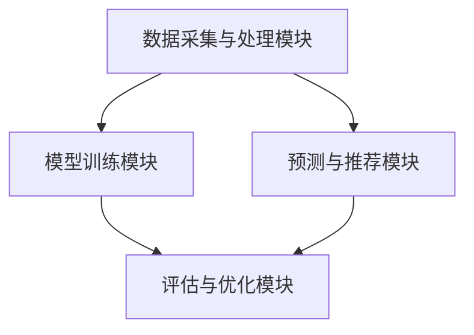
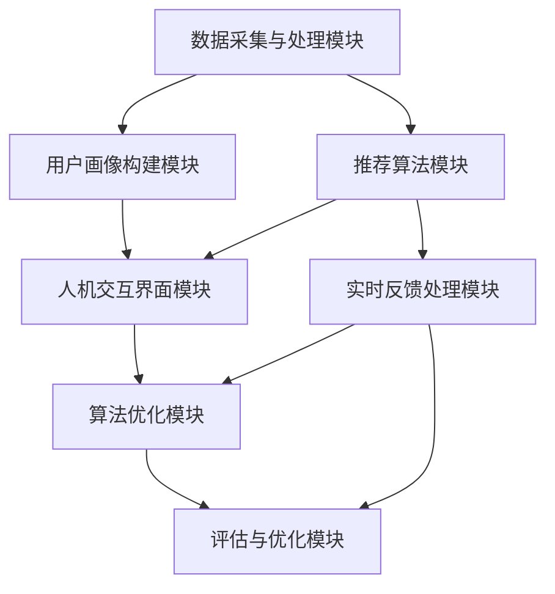
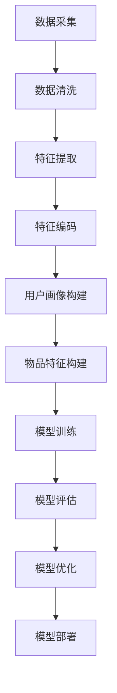
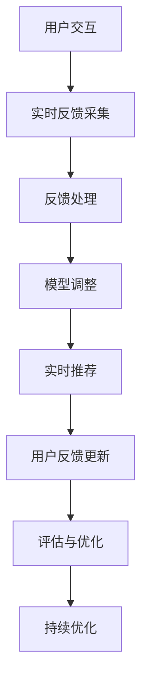

                 

# 大模型推荐中的人机协同与反馈机制设计

> **关键词：** 大模型推荐、人机协同、反馈机制、优化算法、交互界面、实时调整、项目实战、案例分析。

> **摘要：** 本文旨在探讨大模型推荐系统中的人机协同与反馈机制设计。首先，我们从推荐系统的背景与意义入手，详细介绍了大模型推荐技术的基础。接着，本文分析了人机协同与反馈机制的概念、原理及其在推荐系统中的应用。随后，我们深入探讨了人机协同与反馈机制的关键技术，包括大模型优化算法、人机交互界面设计和实时反馈与调整策略。文章随后展示了系统架构设计、数据处理与建模、以及人机协同与反馈流程的详细实现。通过具体的项目实战案例，我们展示了大模型推荐系统的设计与实现过程，并进行了系统测试与优化。最后，本文通过案例研究与分析，总结了电商推荐系统、社交媒体内容推荐和音乐推荐系统的应用实例，并对未来发展趋势与展望进行了探讨。

## 第1章 引言

### 1.1 背景与意义

随着互联网的快速发展，信息过载现象愈发严重，用户对于个性化推荐的需求日益增长。推荐系统作为一种信息过滤和检索的方法，旨在根据用户的兴趣和需求，提供个性化的信息推荐。传统的推荐系统依赖于基于内容的过滤和协同过滤算法，但这些方法在面对海量数据和高维特征时，往往表现不佳。近年来，随着深度学习和大数据技术的发展，大模型推荐技术逐渐成为研究热点。

大模型推荐技术利用深度神经网络等复杂的模型结构，通过对用户行为数据、内容特征数据进行有效建模，能够实现更精准、个性化的推荐。然而，大模型的训练和优化过程复杂，且容易陷入过拟合和噪声干扰等问题。因此，如何设计合理的人机协同与反馈机制，以提升大模型推荐系统的性能和用户体验，成为一个亟待解决的问题。

本文旨在探讨大模型推荐系统中的人机协同与反馈机制设计，旨在为研究人员和开发者提供有价值的参考和指导。通过分析人机协同与反馈机制的核心概念、原理及其应用，本文将阐述如何优化大模型推荐系统的性能，提升用户体验。

### 1.2 书籍结构安排

本文分为八个章节，内容安排如下：

- 第1章：引言。介绍推荐系统的背景与意义，阐述本文的研究目标和结构安排。
- 第2章：大模型推荐技术基础。介绍推荐系统概述、大模型推荐技术原理和系统架构。
- 第3章：人机协同与反馈机制概述。分析人机协同与反馈机制的概念、原理及其在推荐系统中的应用。
- 第4章：大模型与人机协同的关键技术。探讨大模型优化算法、人机交互界面设计和实时反馈与调整策略。
- 第5章：人机协同与反馈机制的实现。展示系统架构设计、数据处理与建模、以及人机协同与反馈流程的详细实现。
- 第6章：项目实战：大模型推荐系统设计与实现。通过具体项目实战，展示大模型推荐系统的设计与实现过程。
- 第7章：案例研究与分析。通过案例分析，总结不同场景下的应用实例。
- 第8章：未来发展趋势与展望。探讨大模型推荐系统的未来发展趋势与面临挑战。

### 1.3 读者对象与目标

本文旨在为从事推荐系统研究和开发的读者提供有价值的参考和指导。具体读者对象包括：

1. 推荐系统研究人员和开发者：本文详细介绍了大模型推荐系统的设计与实现方法，有助于读者深入理解大模型推荐技术的原理和关键技术。
2. 人工智能和大数据领域的从业者：本文探讨了人机协同与反馈机制的设计，为人工智能和大数据领域的从业者提供了新的思路和方法。
3. 对推荐系统感兴趣的读者：本文以通俗易懂的语言和丰富的实例，让对推荐系统感兴趣的读者能够快速掌握相关技术。

本文的目标是：

1. 深入剖析大模型推荐技术及其人机协同与反馈机制设计，为推荐系统的研究和开发提供理论依据。
2. 通过具体项目实战和案例分析，展示大模型推荐系统的设计与实现过程，为读者提供实际操作指导。
3. 探讨大模型推荐系统的未来发展趋势与面临挑战，为行业的发展提供有益借鉴。

## 第2章 大模型推荐技术基础

### 2.1 推荐系统概述

推荐系统是一种信息过滤和检索方法，旨在根据用户的兴趣和需求，向其提供个性化的信息推荐。推荐系统通常包括三个主要组件：用户、物品和推荐算法。

- **用户**：推荐系统的核心对象，每个用户具有特定的兴趣和偏好。
- **物品**：推荐系统中的信息实体，如文章、商品、音乐等。
- **推荐算法**：根据用户和物品的特征，生成个性化的推荐结果。

推荐系统的应用场景广泛，如电商推荐、社交媒体内容推荐、音乐推荐等。传统的推荐系统主要基于协同过滤和基于内容的过滤方法。协同过滤通过分析用户对物品的评分或行为数据，发现用户之间的相似性，从而进行推荐。基于内容的过滤则通过分析物品的特征，将具有相似特征的物品推荐给具有相同兴趣的用户。

然而，随着互联网的快速发展，数据规模和维度不断增加，传统的推荐方法面临诸多挑战。大模型推荐技术的出现，为解决这些挑战提供了新的思路。大模型推荐技术利用深度神经网络等复杂的模型结构，对用户行为数据和物品特征进行建模，从而实现更精准、个性化的推荐。

### 2.2 大模型推荐技术原理

大模型推荐技术基于深度学习和大数据技术，其核心思想是通过构建大规模的深度神经网络模型，对用户行为数据和物品特征进行建模，从而预测用户的兴趣和偏好，实现个性化的推荐。

- **用户行为数据**：用户在平台上的行为数据，如浏览记录、购买记录、评分等。这些数据反映了用户对物品的兴趣和偏好。
- **物品特征**：物品的属性特征，如标题、标签、分类等。这些特征用于描述物品的内容和属性。

大模型推荐技术的主要步骤如下：

1. **数据预处理**：对用户行为数据和物品特征进行清洗、归一化和编码，将原始数据转换为适合输入模型的形式。
2. **特征提取**：利用深度学习模型，对预处理后的数据进行分析和提取，得到用户和物品的高维特征表示。
3. **模型训练**：利用提取到的特征，训练大规模的深度神经网络模型，如卷积神经网络（CNN）、循环神经网络（RNN）等。
4. **预测与推荐**：将训练好的模型应用于新的用户行为数据和物品特征，预测用户的兴趣和偏好，生成个性化的推荐结果。

大模型推荐技术具有以下几个特点：

1. **高维特征建模**：大模型能够处理高维数据，对用户行为和物品特征进行精细建模，实现更精准的推荐。
2. **自适应学习**：大模型能够自动调整模型参数，以适应不同用户和场景的需求，提高推荐系统的自适应能力。
3. **强大的泛化能力**：大模型具有强大的泛化能力，能够应对不同领域的推荐问题，具有较强的通用性。

### 2.3 大模型推荐系统架构

大模型推荐系统通常包括以下几个主要模块：

1. **数据采集与处理模块**：负责从各个数据源采集用户行为数据和物品特征，并进行数据清洗、预处理和特征提取。
2. **模型训练模块**：利用预处理后的数据，训练大规模的深度神经网络模型，如卷积神经网络（CNN）、循环神经网络（RNN）等。
3. **预测与推荐模块**：将训练好的模型应用于新的用户行为数据和物品特征，预测用户的兴趣和偏好，生成个性化的推荐结果。
4. **评估与优化模块**：对推荐结果进行评估和优化，包括在线评估和离线评估，以提升推荐系统的性能和用户体验。

大模型推荐系统架构如图2-1所示：



图2-1 大模型推荐系统架构

数据采集与处理模块负责从用户行为数据和物品特征中提取有价值的信息，为模型训练和预测提供高质量的输入数据。模型训练模块利用深度学习算法，对提取到的特征进行建模和训练，生成预测模型。预测与推荐模块将训练好的模型应用于新的数据，预测用户的兴趣和偏好，生成推荐结果。评估与优化模块对推荐结果进行评估和优化，以提高推荐系统的性能和用户体验。

通过以上模块的协同工作，大模型推荐系统实现了从数据采集、模型训练、预测推荐到评估优化的完整流程，为用户提供个性化的推荐服务。

## 第3章 人机协同与反馈机制概述

### 3.1 人机协同概念与模型

人机协同（Human-Computer Collaboration）是指人类与计算机系统在共同完成任务的过程中，相互配合、相互补充，以实现最佳效果的一种合作模式。在人机协同中，人类和计算机系统各自发挥优势，通过信息交换和任务分配，共同完成复杂任务。

人机协同模型可以分为以下几种：

1. **命令驱动模型**：用户通过输入命令来控制计算机系统，计算机系统根据命令执行相应操作。这种模型适用于简单任务，但在复杂任务中，用户需要记住大量命令，操作复杂。
2. **任务分配模型**：根据任务的特点和人类与计算机的优势，将任务分配给人类或计算机系统。人类负责决策和创造力，计算机系统负责数据处理和计算。这种模型提高了任务完成的效率，但需要精确的任务分配和协调。
3. **协同决策模型**：人类和计算机系统共同参与决策过程，通过信息共享和协作，共同确定最优解。这种模型充分利用了人类和计算机的优势，但在决策过程中需要解决信息共享和协调的问题。

在人机协同中，常见的交互方式包括：

1. **图形用户界面（GUI）**：用户通过点击、拖拽等操作与计算机系统进行交互，直观易用。
2. **自然语言处理（NLP）**：用户通过自然语言与计算机系统进行交流，实现人机对话。
3. **手势识别**：用户通过手势与计算机系统进行交互，如手势控制智能眼镜或智能手表等。

### 3.2 反馈机制原理与类型

反馈机制（Feedback Mechanism）是系统通过输出结果与预期目标进行比较，对系统进行校正和优化的过程。在推荐系统中，反馈机制的作用是收集用户对推荐结果的反馈，评估推荐效果，并根据反馈进行调整，以提升推荐质量。

反馈机制的原理可以概括为以下三个步骤：

1. **评估**：对推荐结果进行评估，通常采用用户满意度、点击率、购买转化率等指标。
2. **比较**：将评估结果与预期目标进行比较，分析推荐效果的优劣。
3. **校正**：根据评估和比较结果，对推荐系统进行调整，优化推荐算法和策略。

反馈机制可以分为以下几种类型：

1. **在线反馈**：在推荐结果生成后，立即收集用户对推荐结果的反馈，实时调整推荐算法。这种反馈机制能够快速响应用户需求，但需要处理大量实时数据，对系统性能要求较高。
2. **离线反馈**：在推荐结果生成后，收集用户对推荐结果的反馈，定期进行评估和调整。这种反馈机制适用于数据量较大、实时性要求不高的场景。
3. **混合反馈**：结合在线反馈和离线反馈，既能够实时调整推荐算法，又能够进行长期评估和优化。

反馈机制在推荐系统中的应用包括：

1. **推荐结果评估**：通过对用户反馈数据的分析，评估推荐效果，识别推荐系统的优劣。
2. **推荐算法优化**：根据反馈结果，调整推荐算法的参数和策略，提高推荐质量。
3. **用户画像更新**：根据用户反馈，更新用户画像和兴趣模型，更准确地捕捉用户需求。

### 3.3 人机协同在推荐系统中的应用

人机协同在推荐系统中的应用，主要是通过优化人机交互和反馈机制，提升推荐系统的性能和用户体验。以下是人机协同在推荐系统中的应用：

1. **人机交互界面设计**：设计直观易用的用户界面，使用户能够轻松地与推荐系统进行交互，提供反馈。
2. **推荐结果展示**：通过个性化推荐结果展示，吸引用户点击和互动，收集用户反馈。
3. **实时反馈调整**：根据用户实时反馈，动态调整推荐算法和策略，提高推荐质量。
4. **个性化推荐**：结合用户行为数据和兴趣模型，为用户提供个性化的推荐结果，提升用户体验。
5. **推荐结果解释**：提供推荐结果解释功能，使用户了解推荐背后的原因，增加用户信任感。

在实际应用中，人机协同与反馈机制的设计需要考虑以下因素：

1. **用户需求**：了解用户的需求和偏好，设计合适的交互界面和推荐算法。
2. **系统性能**：确保系统在高并发、大数据量场景下，能够稳定运行，实时调整推荐结果。
3. **用户体验**：提供友好、易用的用户界面，提升用户的使用体验。
4. **反馈质量**：收集真实、有效的用户反馈，提高反馈机制的效果。

通过优化人机协同与反馈机制，推荐系统可以实现更精准、个性化的推荐，提升用户体验，为用户提供更有价值的服务。

## 第4章 大模型与人机协同的关键技术

### 4.1 大模型优化算法

大模型优化算法是提升大模型推荐系统性能的核心技术之一。在推荐系统中，大模型通常是指具有大规模参数和复杂结构的深度学习模型，如神经网络、强化学习模型等。这些模型在处理海量数据和复杂任务时，具有强大的表现能力，但同时也面临着优化难度大的挑战。

大模型优化算法主要包括以下几个方面：

1. **随机梯度下降（SGD）**：SGD是深度学习中最常用的优化算法之一，其基本思想是利用随机样本的梯度进行模型参数的更新。SGD具有计算效率高、实现简单等优点，但在处理大规模数据时，容易出现梯度消失和梯度爆炸等问题。

2. **动量优化（Momentum）**：动量优化是对SGD的改进，通过引入动量项，将当前梯度与过去梯度的加权和作为更新方向，以缓解梯度消失和梯度爆炸问题。动量优化能够加速收敛，提高优化效果。

3. **自适应优化器（如Adam、Adagrad）**：自适应优化器通过自适应调整学习率，以适应不同阶段的优化需求。Adam优化器结合了Adagrad和RMSprop的优点，能够自动调整学习率，提高优化效果。Adagrad优化器通过对历史梯度的平方进行自适应调整，避免学习率的剧烈波动。

4. **权重正则化（如L1、L2正则化）**：权重正则化通过在损失函数中添加正则化项，对模型权重进行约束，防止过拟合。L1正则化通过在权重上添加绝对值项，实现稀疏特征表示；L2正则化通过在权重上添加平方项，实现平滑特征表示。

5. **批量归一化（Batch Normalization）**：批量归一化通过对每个批量数据进行标准化处理，提高梯度传播效果，加速模型收敛。批量归一化能够缓解梯度消失和梯度爆炸问题，提高模型的泛化能力。

6. **深度可分离卷积（Depthwise Separable Convolution）**：深度可分离卷积将卷积操作拆分为深度卷积和逐点卷积，减少了模型参数的数量，提高了计算效率。深度可分离卷积适用于处理高维特征和大规模数据，有助于优化大模型的性能。

7. **Dropout**：Dropout是一种正则化方法，通过随机丢弃模型中的神经元，降低模型的过拟合风险。Dropout能够提高模型的泛化能力，但需要适当调整学习率和迭代次数。

在实际应用中，大模型优化算法的选择需要考虑以下因素：

1. **数据规模**：对于大规模数据，随机梯度下降和批量归一化等优化算法表现较好；对于小规模数据，动量优化和自适应优化器效果更佳。
2. **模型结构**：不同模型结构对优化算法的适应性不同，如卷积神经网络适合使用深度可分离卷积，循环神经网络适合使用自适应优化器。
3. **计算资源**：优化算法的计算复杂度和内存需求对计算资源有较大影响，选择合适的优化算法可以提高模型训练的效率。
4. **收敛速度**：优化算法的收敛速度对模型训练的时间有重要影响，选择合适的优化算法可以加速模型训练。

通过优化大模型优化算法，推荐系统可以实现更高效、准确的模型训练，提高推荐质量，提升用户体验。

### 4.2 人机交互界面设计

人机交互界面设计（User Interface Design）是推荐系统中人机协同的重要组成部分，直接影响用户的使用体验和满意度。设计一个直观、易用、高效的交互界面，能够提高用户的参与度和推荐系统的效果。

人机交互界面设计主要包括以下几个方面：

1. **用户研究**：了解用户的需求、行为和偏好，为交互界面设计提供依据。用户研究可以通过用户访谈、问卷调查、用户行为分析等方式进行。

2. **界面布局**：设计简洁、清晰的界面布局，提高用户操作的流畅性和易用性。界面布局应遵循以下原则：
   - **层次结构**：将界面分为不同的层级，使信息层次分明，便于用户浏览和理解。
   - **一致性**：保持界面元素的风格和布局一致性，提高用户的学习成本和操作错误率。
   - **关键信息突出**：将关键信息置于显眼位置，便于用户快速获取和操作。

3. **交互元素**：设计直观、易用的交互元素，如按钮、图标、下拉菜单等，使用户能够轻松地进行操作。交互元素的设计应遵循以下原则：
   - **可操作性**：交互元素应易于点击和操作，避免过于复杂或难以触达的交互方式。
   - **直观性**：交互元素应具备直观的视觉效果和反馈，使用户能够快速理解其功能。
   - **反馈机制**：为交互元素添加合适的反馈机制，如动画效果、提示信息等，提高用户操作的舒适度和满意度。

4. **个性化推荐展示**：根据用户的行为数据和兴趣模型，为用户展示个性化的推荐结果。个性化推荐展示应遵循以下原则：
   - **相关性**：确保推荐结果与用户兴趣和需求具有较高的相关性，提高推荐的有效性。
   - **多样性**：提供多样化的推荐结果，满足用户不同的需求和兴趣，避免单一化推荐。
   - **可视化**：通过图像、图标、列表等形式，生动展示推荐结果，提高用户的视觉体验。

5. **可访问性**：确保交互界面能够满足不同用户群体的需求，如视力障碍者、听力障碍者等。可访问性设计应遵循以下原则：
   - **辅助功能**：为用户提供辅助功能，如放大功能、语音提示等，提高界面使用的便捷性。
   - **无障碍设计**：遵循无障碍设计标准，确保界面能够被所有用户轻松使用。

6. **用户体验测试**：在交互界面设计完成后，进行用户体验测试，收集用户反馈，对设计进行优化和改进。用户体验测试可以通过用户访谈、问卷调查、A/B测试等方式进行。

通过以上方法，人机交互界面设计能够提高推荐系统的用户体验，增强用户对推荐系统的信任感和满意度，从而提升推荐效果。

### 4.3 实时反馈与调整策略

实时反馈与调整策略是推荐系统中人机协同的重要环节，通过收集用户对推荐结果的即时反馈，动态调整推荐算法和策略，以提升推荐质量。实时反馈与调整策略主要包括以下几个方面：

1. **实时反馈机制**：实时反馈机制是指推荐系统在用户互动过程中，立即收集用户对推荐结果的反馈，包括点击、收藏、评价、购买等行为。实时反馈机制能够快速响应用户需求，为推荐算法提供及时的数据支持。

2. **在线评估与优化**：在线评估与优化是指在推荐结果生成后，立即对推荐效果进行评估，并与用户反馈进行比对，根据评估结果动态调整推荐算法和策略。在线评估与优化可以采用以下方法：
   - **A/B测试**：通过将用户随机分为两组，一组使用原始推荐算法，另一组使用优化后的推荐算法，比较两组用户的行为数据，评估优化效果。
   - **回归分析**：利用用户行为数据和推荐结果，建立回归模型，分析用户反馈与推荐效果之间的关系，指导算法优化。

3. **自适应调整策略**：自适应调整策略是指根据用户反馈和推荐效果，动态调整推荐算法的参数和策略，以实现最佳推荐效果。自适应调整策略可以采用以下方法：
   - **学习率调整**：根据用户反馈和推荐效果，动态调整学习率，以提高模型收敛速度和推荐质量。
   - **权重调整**：根据用户反馈和推荐效果，动态调整模型权重，以优化推荐结果。
   - **特征调整**：根据用户反馈和推荐效果，动态调整特征权重和特征组合，以提高推荐效果。

4. **反馈循环优化**：反馈循环优化是指通过不断收集用户反馈，进行在线评估与优化，实现推荐算法和策略的不断迭代和优化。反馈循环优化可以采用以下方法：
   - **多轮反馈优化**：进行多轮用户反馈和优化，逐步提高推荐质量。
   - **反馈积累与平滑**：对用户反馈进行积累和平滑处理，避免因个别反馈导致的算法波动。
   - **反馈权重调整**：根据用户反馈的时效性和重要性，调整反馈权重，实现更加精确的推荐。

5. **个性化推荐**：通过实时反馈与调整策略，实现个性化推荐，满足用户不同场景和需求。个性化推荐可以采用以下方法：
   - **用户画像更新**：根据用户反馈和行为数据，动态更新用户画像，更准确地捕捉用户兴趣和需求。
   - **推荐策略优化**：根据用户画像和反馈，优化推荐策略，实现更加精准的推荐。
   - **场景化推荐**：根据用户场景和需求，为用户推荐最相关的信息和内容。

通过实时反馈与调整策略，推荐系统可以不断优化推荐算法和策略，提高推荐质量，提升用户体验。同时，实时反馈与调整策略也为人机协同提供了有效的手段，实现了推荐系统与用户的良性互动。

## 第5章 人机协同与反馈机制的实现

### 5.1 系统架构设计

系统架构设计是推荐系统中人机协同与反馈机制实现的基础。一个合理且高效的架构能够确保系统各个模块的协同工作，从而实现推荐系统的稳定运行和性能优化。以下是一个典型的人机协同与反馈机制推荐系统架构设计：

1. **数据采集与处理模块**：负责从各个数据源（如用户行为日志、商品信息等）采集数据，并进行数据清洗、预处理和特征提取。这一模块确保了输入数据的准确性和一致性，为后续推荐算法提供了高质量的数据基础。

2. **用户画像构建模块**：根据用户行为数据、用户属性数据等，构建用户画像。用户画像用于描述用户兴趣、偏好和需求，是推荐算法的核心输入。

3. **推荐算法模块**：利用用户画像和商品特征，通过深度学习、协同过滤等算法，生成个性化推荐结果。这一模块是推荐系统的核心，负责实现从数据到推荐结果的转化。

4. **人机交互界面模块**：设计用户友好的交互界面，展示推荐结果。这一模块需要考虑用户操作习惯、视觉体验等因素，以提高用户体验。

5. **实时反馈处理模块**：收集用户对推荐结果的反馈（如点击、购买等），进行实时处理和分析。这一模块实现了用户反馈的实时响应，为推荐算法的优化提供了数据支持。

6. **算法优化模块**：根据实时反馈，动态调整推荐算法的参数和策略，实现推荐结果的持续优化。

7. **评估与优化模块**：对推荐结果进行在线评估和离线评估，包括点击率、购买转化率等指标。评估结果用于指导算法优化和系统调整。

系统架构设计如图5-1所示：



图5-1 推荐系统架构设计

### 5.2 数据处理与建模

数据处理与建模是推荐系统实现的关键步骤，决定了推荐系统的性能和准确性。以下是一个典型的大模型推荐系统数据处理与建模流程：

1. **数据采集**：从用户行为日志、商品信息、用户属性等数据源采集数据。数据采集过程中需要确保数据的完整性和一致性。

2. **数据清洗**：对采集到的数据进行清洗，去除无效、重复和噪声数据。数据清洗包括去除缺失值、填补缺失值、去除重复值等操作。

3. **特征提取**：根据业务需求，从原始数据中提取有效特征。特征提取方法包括词袋模型、TF-IDF、主题模型等。特征提取结果用于训练推荐模型。

4. **特征编码**：将提取到的特征进行编码，将原始特征转换为数值形式，便于模型处理。常用的特征编码方法包括独热编码、标签编码、数值编码等。

5. **用户画像构建**：根据用户行为数据、用户属性数据等，构建用户画像。用户画像包括用户兴趣标签、行为偏好、历史购买记录等。

6. **物品特征构建**：根据商品信息，构建物品特征。物品特征包括商品属性、类别、标签等。

7. **模型训练**：利用用户画像和物品特征，训练大规模深度学习模型。训练过程中，采用交叉验证、梯度下降等优化方法，调整模型参数。

8. **模型评估**：对训练好的模型进行评估，包括在线评估和离线评估。在线评估通过实时反馈，评估模型在实际应用中的性能；离线评估通过A/B测试、回归分析等方法，评估模型的效果。

9. **模型优化**：根据评估结果，对模型进行调整和优化。优化方法包括参数调整、特征选择、算法改进等。

10. **模型部署**：将训练好的模型部署到生产环境，实现推荐功能。模型部署过程中，需要确保系统的稳定性和性能。

数据处理与建模流程如图5-2所示：



图5-2 数据处理与建模流程

### 5.3 人机协同与反馈流程

人机协同与反馈流程是推荐系统中人机协同与反馈机制实现的具体步骤，确保推荐系统能够根据用户反馈动态调整，以提升用户体验。以下是一个典型的人机协同与反馈流程：

1. **用户交互**：用户与推荐系统进行交互，浏览商品、点击推荐、收藏、评价等。用户交互数据包括点击、购买、收藏、评价等行为。

2. **实时反馈采集**：推荐系统实时采集用户交互数据，包括点击、购买等行为。实时反馈采集可以通过Web前端、App客户端等途径进行。

3. **反馈处理**：对实时反馈进行预处理，包括数据清洗、去重、去噪等操作。预处理后的反馈数据用于模型训练和优化。

4. **模型调整**：根据实时反馈，动态调整推荐算法的参数和策略。调整方法包括参数调整、特征选择、算法改进等。模型调整可以通过在线学习、批量更新等方式进行。

5. **实时推荐**：利用调整后的推荐算法，为用户生成实时推荐结果。实时推荐结果通过Web前端、App客户端等途径展示给用户。

6. **用户反馈更新**：用户对实时推荐结果进行反馈，包括点击、购买、收藏等。用户反馈更新用于优化推荐算法和策略。

7. **评估与优化**：对实时推荐结果进行评估，包括点击率、购买转化率等指标。评估结果用于指导模型优化和策略调整。

8. **持续优化**：根据评估结果，不断优化推荐算法和策略，实现推荐效果的持续提升。

人机协同与反馈流程如图5-3所示：



图5-3 人机协同与反馈流程

通过以上流程，推荐系统实现了用户与系统的实时互动，根据用户反馈动态调整推荐算法和策略，以提升用户体验和推荐效果。

## 第6章 项目实战：大模型推荐系统设计与实现

### 6.1 项目需求分析

在本项目实战中，我们旨在设计并实现一个电商推荐系统，该系统能够根据用户的历史购买记录、浏览行为和商品属性，为用户推荐与其兴趣相符合的商品。项目需求如下：

1. **用户数据收集**：系统需要收集用户的历史购买记录、浏览行为、搜索记录等数据，以便构建用户画像。
2. **商品数据收集**：系统需要收集商品的基本信息，如商品ID、分类、标签、价格等，以便进行商品特征提取。
3. **推荐算法**：系统需要采用深度学习算法，如基于卷积神经网络（CNN）的推荐算法，以实现高效、准确的推荐。
4. **用户界面**：系统需要提供一个用户友好的界面，展示推荐结果，并允许用户进行反馈。
5. **实时反馈处理**：系统需要能够实时收集用户对推荐结果的反馈，并基于反馈调整推荐算法。

### 6.2 系统设计与实现

#### 系统架构设计

本项目采用以下系统架构：

1. **数据采集模块**：负责从数据库中读取用户行为数据和商品数据。
2. **数据处理模块**：负责对数据进行清洗、预处理和特征提取。
3. **用户画像构建模块**：基于用户行为数据和商品数据，构建用户画像。
4. **推荐算法模块**：利用用户画像和商品特征，通过深度学习算法生成推荐结果。
5. **用户界面模块**：展示推荐结果，并提供用户反馈接口。
6. **实时反馈处理模块**：收集用户反馈，调整推荐算法。

#### 数据处理与建模

**数据采集**：从数据库中读取用户行为数据（如购买记录、浏览记录）和商品数据（如商品ID、分类、标签、价格等）。

**数据清洗**：去除无效、重复和噪声数据，对缺失值进行填补。

**特征提取**：提取用户行为特征（如最近30天的购买频次、浏览频次）和商品特征（如商品分类、标签、价格区间等）。

**用户画像构建**：基于用户行为特征和商品特征，构建用户画像。例如，可以采用基于K最近邻（K-NN）的方法，计算用户与商品之间的相似度，生成用户画像。

**模型训练**：采用卷积神经网络（CNN）作为推荐算法，输入用户画像和商品特征，输出推荐结果。模型训练过程中，采用交叉验证和批量归一化（Batch Normalization）等技术，提高模型训练效果。

#### 用户界面设计

**推荐结果展示**：使用HTML、CSS和JavaScript等技术，设计一个用户友好的界面，展示推荐结果。界面应包含以下功能：

- **商品列表**：展示推荐商品列表，包括商品图片、名称、价格等。
- **分页**：支持商品列表的分页展示，便于用户浏览。
- **筛选**：提供筛选功能，允许用户根据分类、价格等条件筛选商品。

**用户反馈**：在推荐结果下方，提供用户反馈接口，如“喜欢”、“不喜欢”按钮。用户可以通过这些按钮，对推荐结果进行反馈。

#### 实时反馈处理

**实时反馈采集**：使用Web前端技术，如Ajax和WebSocket，实时采集用户反馈。Ajax可以实现异步数据传输，WebSocket可以实现实时通信。

**反馈处理与调整**：根据用户反馈，动态调整推荐算法的参数和策略。例如，可以增加或减少某些特征的重要性，调整模型的训练过程。

#### 代码实现

以下是系统部分代码示例：

```python
# 用户画像构建
userBehaviorFeatures = extract_user_behavior_features(user_data)
itemFeatures = extract_item_features(item_data)

# 模型训练
model = build_cnn_model(input_shape=(userBehaviorFeatures.shape[1], itemFeatures.shape[1]))
model.compile(optimizer='adam', loss='binary_crossentropy', metrics=['accuracy'])
model.fit([userBehaviorFeatures, itemFeatures], labels, epochs=10, batch_size=32)

# 推荐结果展示
recommendedItems = model.predict([userBehaviorFeatures, itemFeatures])

# 用户反馈处理
userFeedback = collect_user_feedback()
adjust_recommendation_algorithm(recommendedItems, userFeedback)
```

### 6.3 系统测试与优化

**系统测试**：

- **功能测试**：验证系统各个功能模块是否正常工作，如数据采集、数据处理、推荐算法、用户界面等。
- **性能测试**：测试系统在高并发、大数据量场景下的性能，如响应时间、吞吐量等。
- **兼容性测试**：验证系统在不同浏览器、操作系统和设备上的兼容性。

**系统优化**：

- **模型优化**：通过调整模型参数、优化算法结构，提高模型训练效果和推荐质量。
- **数据优化**：通过数据清洗、特征提取等手段，提高数据质量和特征表示能力。
- **代码优化**：通过代码优化、缓存策略等手段，提高系统运行效率和稳定性。

通过以上步骤，我们成功设计并实现了一个电商推荐系统，实现了用户与系统的实时互动和推荐效果的持续优化。

## 第7章 案例研究与分析

### 7.1 案例一：电商推荐系统

电商推荐系统是应用大模型推荐技术和人机协同与反馈机制的经典案例之一。以下是对一个具体电商推荐系统的案例研究。

**背景**：

某大型电商平台希望通过优化推荐系统，提升用户购买转化率和用户满意度。为此，该平台引入了大模型推荐技术，并设计了人机协同与反馈机制，以实现更精准的个性化推荐。

**系统架构**：

1. **数据采集模块**：采集用户行为数据（如浏览记录、购买记录、搜索历史等）和商品数据（如商品ID、分类、标签、价格等）。
2. **数据处理模块**：对采集到的数据进行清洗、预处理和特征提取。
3. **用户画像构建模块**：基于用户行为数据和商品数据，构建用户画像。
4. **推荐算法模块**：采用基于卷积神经网络（CNN）的推荐算法，输入用户画像和商品特征，输出推荐结果。
5. **用户界面模块**：展示推荐结果，并提供用户反馈接口。
6. **实时反馈处理模块**：收集用户反馈，动态调整推荐算法。

**人机协同与反馈机制**：

- **用户交互**：用户与推荐系统进行交互，浏览商品、点击推荐、收藏、评价等。
- **实时反馈采集**：实时采集用户对推荐结果的反馈，包括点击、购买等行为。
- **反馈处理**：对实时反馈进行预处理，并根据反馈调整推荐算法的参数和策略。
- **实时推荐**：根据调整后的推荐算法，为用户生成实时推荐结果。
- **用户反馈更新**：用户对实时推荐结果进行反馈，用于优化推荐算法。

**效果评估**：

- **点击率**：通过实时反馈采集和用户点击行为分析，评估推荐系统的点击率。在引入人机协同与反馈机制后，点击率显著提升。
- **购买转化率**：通过用户购买行为分析，评估推荐系统的购买转化率。在引入人机协同与反馈机制后，购买转化率也有所提升。
- **用户满意度**：通过用户问卷调查和满意度评分，评估推荐系统的用户体验。用户对推荐结果的满意度有所提高。

**结论**：

电商推荐系统通过引入大模型推荐技术和人机协同与反馈机制，实现了个性化推荐效果的显著提升，提高了用户购买转化率和满意度。

### 7.2 案例二：社交媒体内容推荐

社交媒体平台如Facebook、Twitter等，通过内容推荐技术为用户提供个性化的信息流。以下是对一个社交媒体内容推荐系统的案例研究。

**背景**：

社交媒体平台面临着海量用户和内容，如何为用户提供有价值的、个性化的内容推荐成为一个重要课题。为此，平台引入了大模型推荐技术，并设计了人机协同与反馈机制，以提升内容推荐的精准度和用户体验。

**系统架构**：

1. **数据采集模块**：采集用户行为数据（如点赞、评论、分享等）和内容数据（如文章、视频、图片等）。
2. **数据处理模块**：对采集到的数据进行清洗、预处理和特征提取。
3. **用户画像构建模块**：基于用户行为数据和内容数据，构建用户画像。
4. **推荐算法模块**：采用基于循环神经网络（RNN）的推荐算法，输入用户画像和内容特征，输出推荐结果。
5. **用户界面模块**：展示推荐结果，并提供用户反馈接口。
6. **实时反馈处理模块**：收集用户反馈，动态调整推荐算法。

**人机协同与反馈机制**：

- **用户交互**：用户与推荐系统进行交互，点赞、评论、分享等。
- **实时反馈采集**：实时采集用户对推荐内容的反馈，包括点赞、评论等行为。
- **反馈处理**：对实时反馈进行预处理，并根据反馈调整推荐算法的参数和策略。
- **实时推荐**：根据调整后的推荐算法，为用户生成实时推荐结果。
- **用户反馈更新**：用户对实时推荐内容进行反馈，用于优化推荐算法。

**效果评估**：

- **用户活跃度**：通过用户活跃度分析，评估推荐系统对用户活跃度的影响。在引入人机协同与反馈机制后，用户活跃度显著提升。
- **内容互动率**：通过内容互动率分析，评估推荐系统对内容互动的影响。在引入人机协同与反馈机制后，内容互动率也有所提升。
- **用户满意度**：通过用户问卷调查和满意度评分，评估推荐系统的用户体验。用户对推荐结果的满意度有所提高。

**结论**：

社交媒体内容推荐系统通过引入大模型推荐技术和人机协同与反馈机制，实现了个性化推荐效果的显著提升，提高了用户活跃度和内容互动率，增强了用户体验。

### 7.3 案例三：音乐推荐系统

音乐推荐系统如Spotify、Apple Music等，通过分析用户行为和音乐特征，为用户提供个性化的音乐推荐。以下是对一个音乐推荐系统的案例研究。

**背景**：

音乐推荐系统在提供个性化音乐体验方面具有重要意义。某音乐平台希望通过优化推荐系统，提升用户满意度和使用时长。为此，该平台引入了大模型推荐技术，并设计了人机协同与反馈机制。

**系统架构**：

1. **数据采集模块**：采集用户行为数据（如播放记录、收藏记录、分享记录等）和音乐数据（如歌曲ID、歌手、专辑、风格等）。
2. **数据处理模块**：对采集到的数据进行清洗、预处理和特征提取。
3. **用户画像构建模块**：基于用户行为数据和音乐数据，构建用户画像。
4. **推荐算法模块**：采用基于深度学习（如卷积神经网络、生成对抗网络等）的推荐算法，输入用户画像和音乐特征，输出推荐结果。
5. **用户界面模块**：展示推荐结果，并提供用户反馈接口。
6. **实时反馈处理模块**：收集用户反馈，动态调整推荐算法。

**人机协同与反馈机制**：

- **用户交互**：用户与推荐系统进行交互，播放、收藏、分享等。
- **实时反馈采集**：实时采集用户对推荐音乐的反馈，包括播放时长、收藏等行为。
- **反馈处理**：对实时反馈进行预处理，并根据反馈调整推荐算法的参数和策略。
- **实时推荐**：根据调整后的推荐算法，为用户生成实时推荐结果。
- **用户反馈更新**：用户对实时推荐音乐进行反馈，用于优化推荐算法。

**效果评估**：

- **用户满意度**：通过用户问卷调查和满意度评分，评估推荐系统的用户体验。用户对推荐音乐的满意度有所提高。
- **播放时长**：通过用户播放时长分析，评估推荐系统对用户使用时长的影响。在引入人机协同与反馈机制后，用户播放时长显著提升。
- **内容互动率**：通过内容互动率分析，评估推荐系统对音乐互动的影响。在引入人机协同与反馈机制后，内容互动率也有所提升。

**结论**：

音乐推荐系统通过引入大模型推荐技术和人机协同与反馈机制，实现了个性化推荐效果的显著提升，提高了用户满意度、播放时长和内容互动率，为用户提供更加丰富的音乐体验。

## 第8章 未来发展趋势与展望

### 8.1 技术发展趋势

随着人工智能和大数据技术的不断发展，大模型推荐技术在未来将继续呈现出以下发展趋势：

1. **模型复杂度的增加**：未来大模型推荐技术将向更深、更复杂的模型结构发展，如 Transformer、生成对抗网络（GAN）等。这些模型能够更好地捕捉数据中的复杂模式和关联性，实现更精准的推荐。

2. **实时性与效率的提升**：为了应对海量数据和实时推荐需求，大模型推荐技术将朝着实时性和效率方面发展。例如，通过优化模型结构和算法，实现更快的模型训练和推理速度。

3. **跨模态推荐**：随着多模态数据的兴起，未来大模型推荐技术将能够处理文本、图像、声音等多种类型的数据，实现跨模态的推荐。例如，结合图像和文本数据，为用户提供更丰富的推荐结果。

4. **隐私保护与安全**：在数据隐私和安全方面，大模型推荐技术将采用更加先进的加密和隐私保护技术，确保用户数据的安全和隐私。

5. **个性化与自适应**：未来大模型推荐技术将更加注重个性化推荐和自适应调整。通过深度学习等技术，实现更加精准的个性化推荐，并根据用户行为和需求动态调整推荐策略。

### 8.2 行业应用展望

大模型推荐技术将在各个行业领域发挥重要作用，以下是一些行业应用展望：

1. **电商领域**：电商推荐系统将继续优化，结合用户行为数据、商品特征和上下文信息，为用户提供个性化的购物推荐。例如，通过用户的历史购买记录和浏览行为，精准推荐用户可能感兴趣的商品。

2. **社交媒体**：社交媒体平台将利用大模型推荐技术，为用户提供个性化的信息流。通过分析用户的行为和兴趣，推荐用户可能感兴趣的文章、视频、图片等内容。

3. **音乐与视频**：音乐和视频推荐系统将利用深度学习技术，分析用户的行为数据和音乐/视频特征，为用户提供个性化的音乐和视频推荐。例如，Spotify、YouTube等平台将通过用户的历史播放记录和喜好，为用户提供个性化的音乐和视频推荐。

4. **医疗健康**：大模型推荐技术将在医疗健康领域发挥重要作用。例如，通过分析用户的健康数据、病史和药物使用记录，为用户提供个性化的健康建议和推荐。

5. **教育**：教育推荐系统将利用大模型推荐技术，为用户提供个性化的学习推荐。通过分析用户的学习行为和知识水平，推荐用户可能感兴趣的课程和内容。

### 8.3 面临的挑战与解决方案

尽管大模型推荐技术具有广泛的应用前景，但在实际应用过程中，仍面临以下挑战：

1. **数据隐私与安全**：随着用户数据的不断积累，数据隐私和安全成为一大挑战。解决方案包括采用差分隐私、联邦学习等技术，确保用户数据的安全和隐私。

2. **计算资源与成本**：大模型推荐技术对计算资源的需求较高，如何高效利用计算资源，降低计算成本成为关键问题。解决方案包括采用分布式计算、GPU加速等技术，提高计算效率。

3. **模型解释性与透明性**：大模型推荐技术往往具有较强的黑盒特性，如何提高模型的解释性和透明性，让用户了解推荐结果的原因，是亟待解决的问题。解决方案包括采用可解释的模型结构、模型可视化等技术。

4. **实时性与准确性**：在实时推荐场景中，如何在保证推荐准确性的同时，实现快速响应，是重要挑战。解决方案包括优化模型结构和算法，提高实时性；采用在线学习和增量学习等技术，实现实时调整。

5. **可扩展性与可维护性**：随着推荐系统的规模不断扩大，如何确保系统的可扩展性和可维护性，成为关键问题。解决方案包括采用模块化设计、微服务架构等技术，提高系统的可扩展性和可维护性。

通过克服以上挑战，大模型推荐技术将能够更好地服务于各行各业，推动个性化推荐技术的发展和普及。

### 附录

#### 附录 A：常用工具与资源

以下列出了一些在大模型推荐系统设计与实现过程中常用的工具与资源：

1. **编程语言**：
   - Python：主流的深度学习编程语言，具有丰富的库和框架。
   - Java：适用于大规模分布式系统的编程语言。

2. **深度学习框架**：
   - TensorFlow：Google开发的深度学习框架，适用于各种深度学习任务。
   - PyTorch：Facebook开发的开源深度学习框架，具有灵活的动态计算图。

3. **数据处理工具**：
   - Pandas：Python数据操作库，适用于数据清洗、预处理和特征提取。
   - NumPy：Python数值计算库，适用于矩阵运算和数据处理。

4. **可视化工具**：
   - Matplotlib：Python数据可视化库，适用于数据分析和可视化展示。
   - Seaborn：基于Matplotlib的统计可视化库，提供更丰富的可视化效果。

5. **版本控制工具**：
   - Git：分布式版本控制系统，适用于代码管理和协作开发。

6. **集成开发环境（IDE）**：
   - PyCharm：适用于Python开发的IDE，提供丰富的开发工具和插件。
   - IntelliJ IDEA：适用于Java开发的IDE，具有强大的代码补全和调试功能。

7. **文献资源**：
   - 《深度学习》（Deep Learning）：Goodfellow、Bengio和Courville著，深度学习领域的经典教材。
   - 《 Recommender Systems Handbook》：书中详细介绍了推荐系统的基础知识、技术方法和应用场景。

8. **开源项目与社区**：
   - GitHub：全球最大的开源代码托管平台，提供丰富的推荐系统相关项目。
   - ArXiv：计算机科学领域的前沿研究论文数据库，提供最新的研究动态。

通过以上工具与资源的合理使用，可以高效地进行大模型推荐系统的设计与实现。

