                 

# 大模型时代的创业者谈判技巧：沟通、说服与妥协

关键词：大模型、创业者、谈判技巧、沟通、说服、妥协、心理策略、实战技巧、案例分析

摘要：在当今的大模型时代，创业者面临的竞争和挑战日益激烈。谈判技巧成为创业者成功的重要因素之一。本文旨在探讨大模型时代的创业者如何运用沟通、说服与妥协等技巧，提高谈判成功率，实现企业的长期发展。

## 目录大纲

1. 谈判的概念与基本原则  
    1.1 谈判的定义  
    1.2 谈判的基本原则  
    1.3 谈判的类型

2. 谈判的心理策略  
    2.1 谈判中的心理因素  
    2.2 谈判中的心理战术  
    2.3 建立信任关系

3. 沟通技巧  
    3.1 有效沟通的要素  
    3.2 沟通障碍及解决方法  
    3.3 非言语沟通

4. 谈判实战技巧  
    4.1 开场与建立关系  
    4.2 价格谈判  
    4.3 合作谈判  
    4.4 说服与妥协

5. 谈判案例分析  
    5.1 初创公司融资谈判  
    5.2 企业并购谈判  
    5.3 供应链谈判

6. 谈判策略的优化  
    6.1 谈判策略的评估  
    6.2 谈判策略的调整  
    6.3 谈判后的评估与反思

7. 附录  
    7.1 谈判技巧相关的书籍推荐  
    7.2 谈判技巧相关的在线课程  
    7.3 谈判模拟训练工具

## 第一部分：谈判基础

### 第1章：谈判的概念与基本原则

#### 1.1 谈判的定义

谈判是一种双方或多方通过沟通和协商来解决分歧、达成共识的过程。它涉及多个方面的内容，包括利益交换、资源分配、权责划分等。在创业过程中，谈判技巧尤为重要，因为创业者需要与投资人、合作伙伴、供应商等多方进行谈判，以实现企业的发展目标。

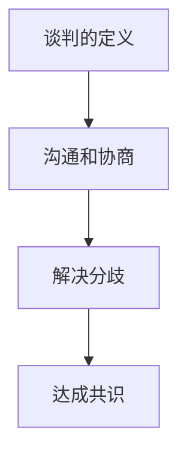

#### 1.2 谈判的基本原则

谈判的基本原则包括坦诚与诚实、尊重与理解、互利共赢。这些原则是确保谈判顺利进行的基础，有助于建立良好的合作关系。

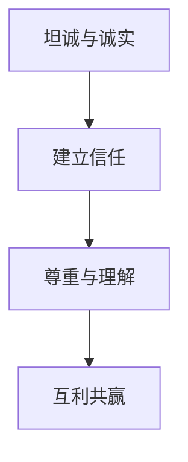

#### 1.3 谈判的类型

谈判可以分为以下几种类型：

- 价格谈判：涉及产品或服务的价格确定。
- 合作谈判：涉及合作项目的规划与实施。
- 权力谈判：涉及权力和资源的分配。

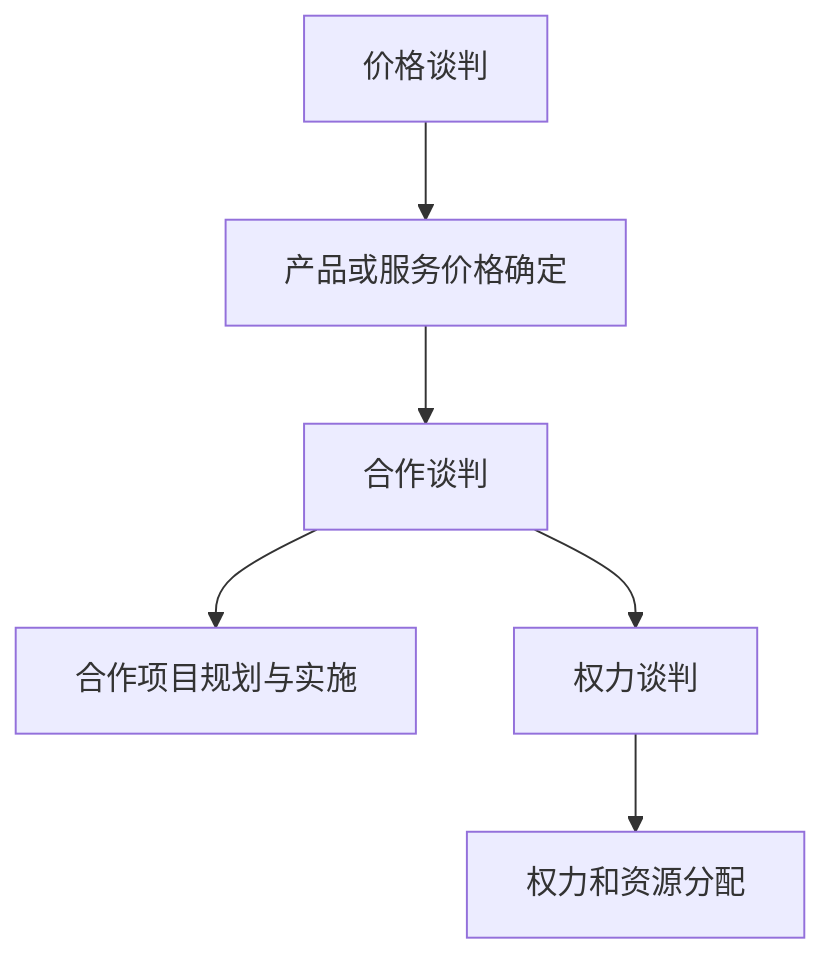

### 第2章：谈判的心理策略

#### 2.1 谈判中的心理因素

谈判中的心理因素包括自我认知、对方认知和情绪管理。了解这些心理因素有助于创业者更好地掌握谈判节奏，提高谈判成功率。

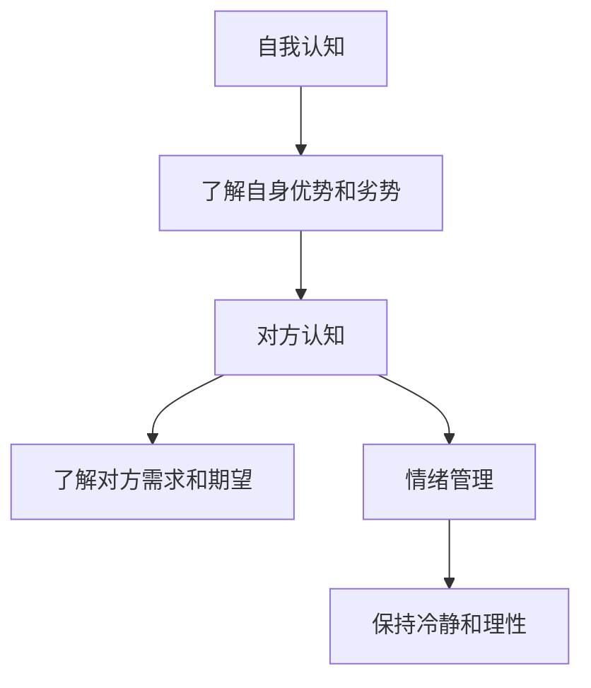

#### 2.2 谈判中的心理战术

谈判中的心理战术包括赢得对方信任、设定预期目标和利用对方的心理弱点。这些战术有助于创业者更好地控制谈判局面，实现自身目标。

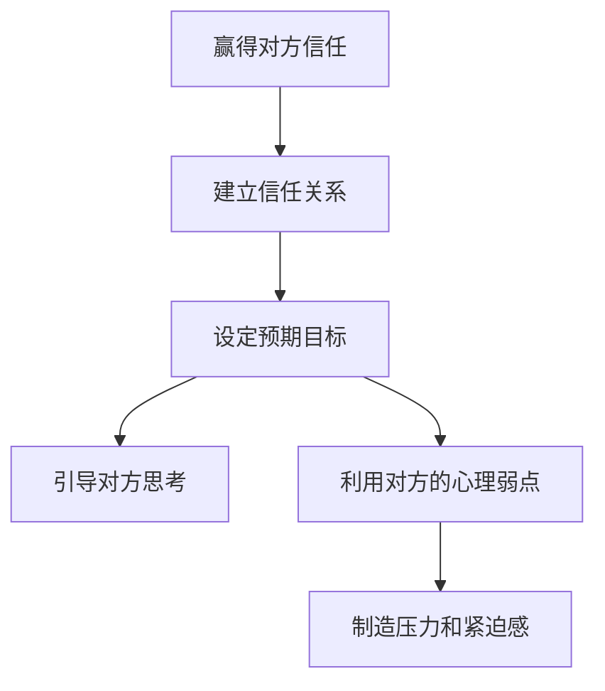

#### 2.3 建立信任关系

建立信任关系是谈判成功的关键。创业者需要通过相互了解、诚信沟通和避免误解来建立信任关系。

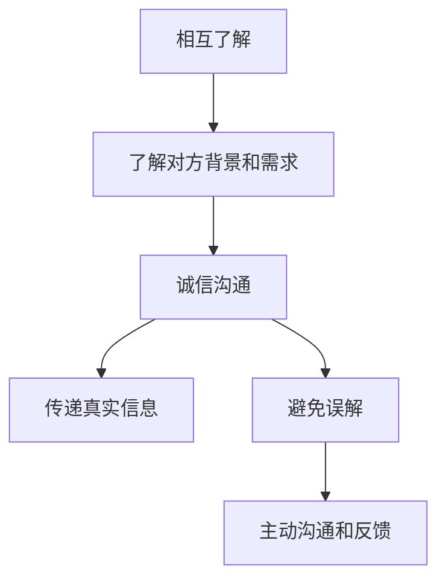

### 第3章：沟通技巧

#### 3.1 有效沟通的要素

有效沟通的要素包括信息传递清晰、听取对方意见和正确理解。创业者需要掌握这些要素，以提高沟通效果。

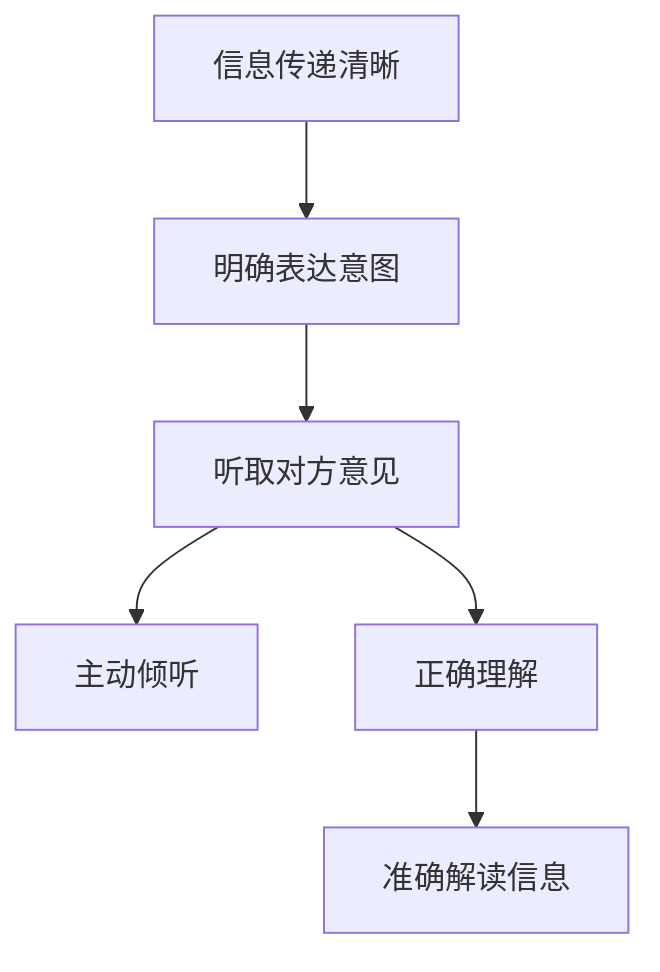

#### 3.2 沟通障碍及解决方法

沟通障碍包括语言障碍、文化差异和情绪干扰。创业者需要识别这些障碍，并采取相应的方法来解决。

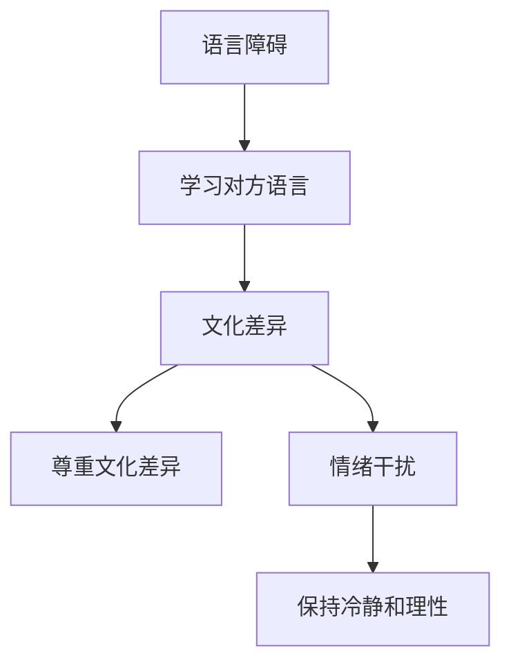

#### 3.3 非言语沟通

非言语沟通在谈判中发挥着重要作用。创业者需要注重自己的身体语言、面部表情和声音语调，以传递积极的信号。

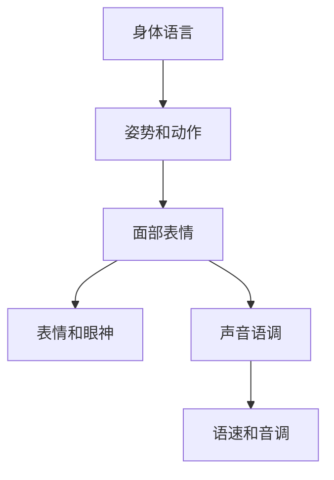

## 第二部分：谈判实战技巧

### 第4章：开场与建立关系

#### 4.1 如何进行自我介绍

自我介绍是谈判开场的必要环节。创业者需要简洁明了地介绍自己，并给对方留下良好的第一印象。

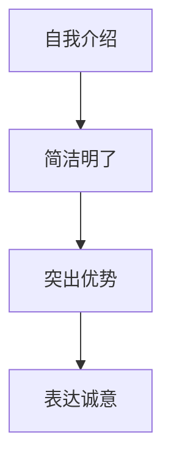

#### 4.2 建立互信关系

建立互信关系是谈判成功的关键。创业者需要通过建立信任、表达理解和尊重对方来建立互信关系。

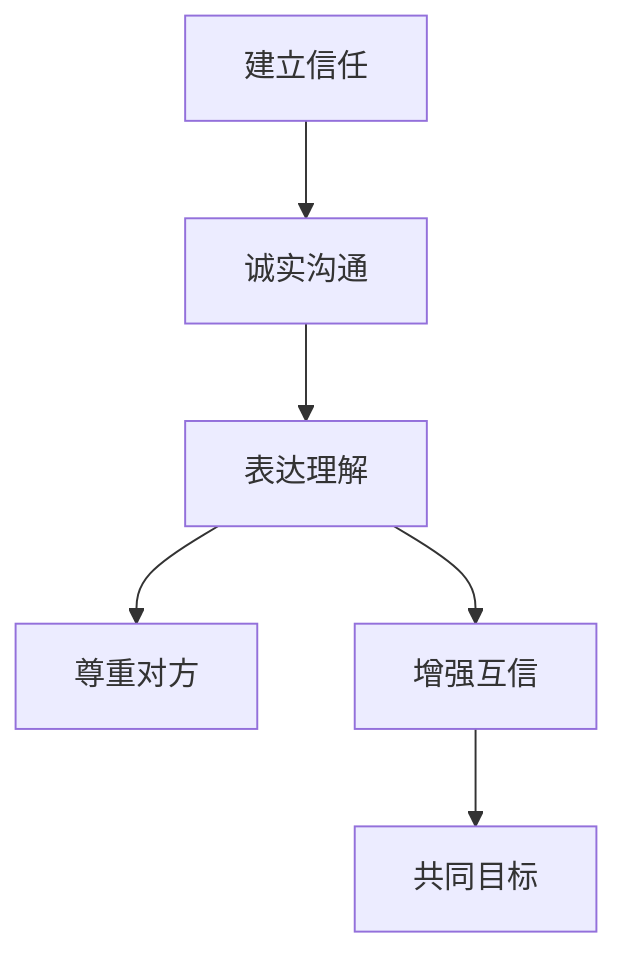

#### 4.3 如何设定谈判议程

设定谈判议程有助于明确谈判目标和进度。创业者需要根据谈判内容设定议程，确保谈判有条不紊地进行。

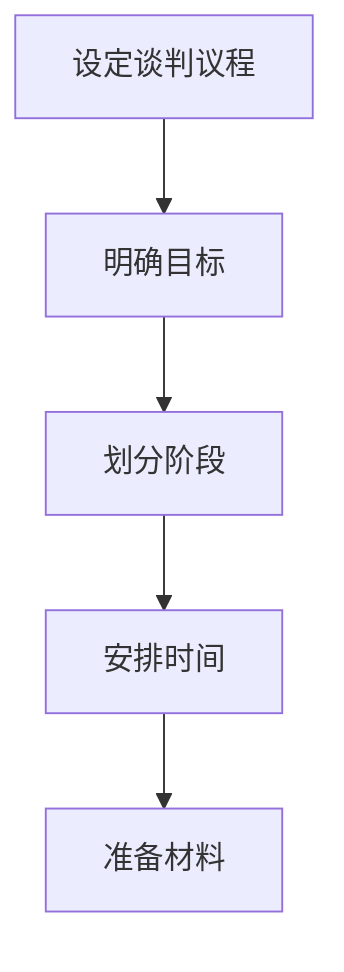

### 第5章：价格谈判

#### 5.1 价格谈判的策略

价格谈判是谈判中常见的一环。创业者需要根据市场需求、成本结构和竞争对手情况来制定价格谈判策略。

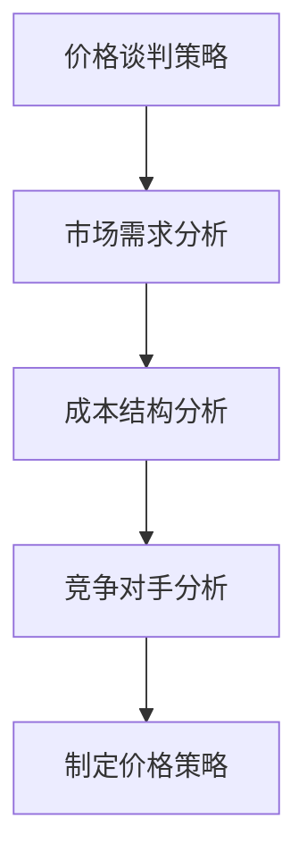

#### 5.2 如何处理对方的价格异议

对方的价格异议是谈判中的常见问题。创业者需要分析对方异议的原因，并采取相应的方法来处理。

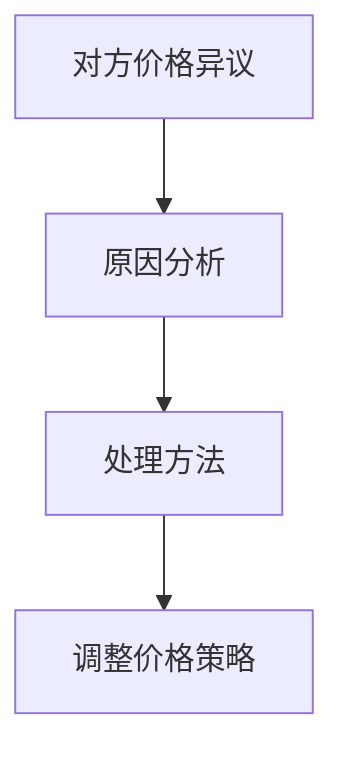

#### 5.3 如何运用价格谈判技巧

价格谈判技巧包括利用数据、情感沟通和软硬兼施。创业者需要灵活运用这些技巧，以提高谈判成功率。

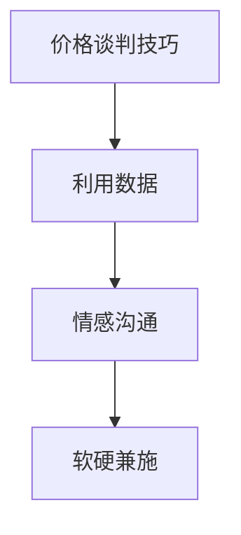

### 第6章：合作谈判

#### 6.1 合作谈判的原则

合作谈判的原则包括合作的基础、利益共享和风险共担。创业者需要遵循这些原则，以确保合作谈判的顺利进行。

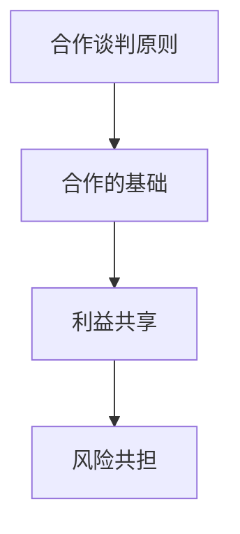

#### 6.2 合作谈判中的利益平衡

合作谈判中的利益平衡是确保合作双方都能获得利益的关键。创业者需要分析合作双方的需求，并寻求利益平衡点。

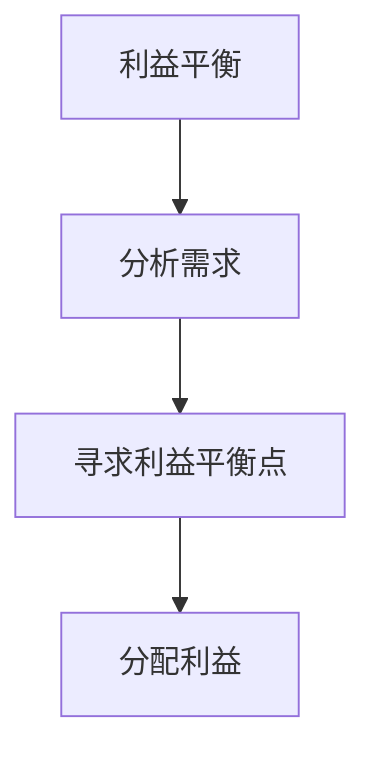

#### 6.3 如何处理合作中的纠纷

合作中的纠纷是不可避免的。创业者需要采取合适的策略来处理纠纷，以确保合作的顺利进行。

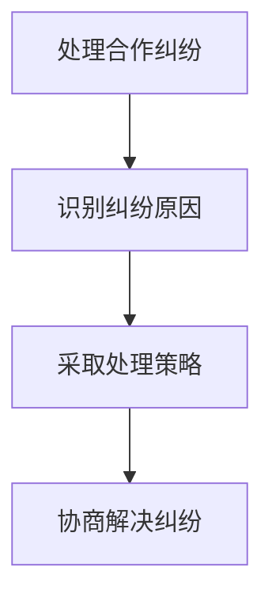

### 第7章：说服与妥协

#### 7.1 如何运用说服技巧

说服技巧包括引导对方思考、利用事实和数据、建立共同目标。创业者需要灵活运用这些技巧，以提高说服成功率。

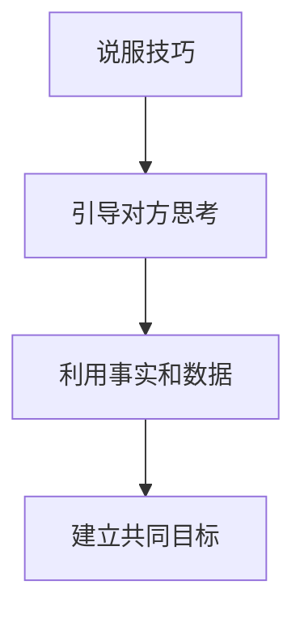

#### 7.2 妥协的策略与技巧

妥协是谈判中常见的一环。创业者需要根据谈判局势和利益关系来制定妥协策略和技巧。

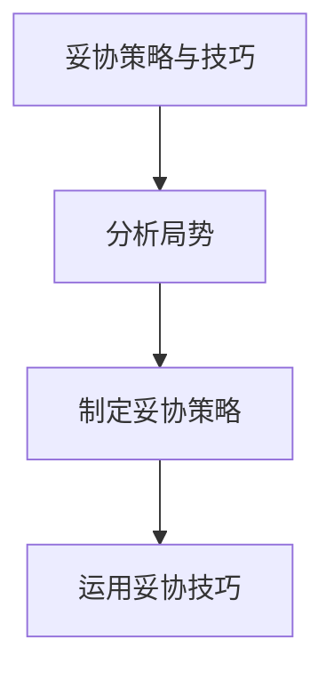

#### 7.3 如何处理谈判中的僵局

谈判中的僵局是谈判失败的前兆。创业者需要采取合适的策略来处理僵局，以避免谈判破裂。

```mermaid
graph TB
A[处理谈判僵局] --> B[识别僵局原因]
B --> C[采取解决策略]
C --> D[协商解决僵局]
```

## 第三部分：谈判案例分析

### 第8章：案例分析与策略选择

#### 8.1 案例一：初创公司融资谈判

初创公司融资谈判是创业者面临的常见挑战。本文将分析一个初创公司融资谈判的案例，并探讨其中的策略选择。

```mermaid
graph TB
A[案例一：初创公司融资谈判] --> B[案例背景]
B --> C[谈判策略分析]
```

#### 8.2 案例二：企业并购谈判

企业并购谈判是企业扩展业务的重要手段。本文将分析一个企业并购谈判的案例，并探讨其中的策略选择。

```mermaid
graph TB
A[案例二：企业并购谈判] --> B[案例背景]
B --> C[谈判策略分析]
```

#### 8.3 案例三：供应链谈判

供应链谈判是企业采购和供应链管理的重要环节。本文将分析一个供应链谈判的案例，并探讨其中的策略选择。

```mermaid
graph TB
A[案例三：供应链谈判] --> B[案例背景]
B --> C[谈判策略分析]
```

### 第9章：谈判策略的优化

#### 9.1 谈判策略的评估

谈判策略的评估是确保谈判成功的关键。本文将介绍如何评估谈判策略，并提出改进建议。

```mermaid
graph TB
A[谈判策略评估] --> B[评估标准]
B --> C[评估方法]
C --> D[改进建议]
```

#### 9.2 谈判策略的调整

谈判策略的调整是应对谈判局势变化的重要手段。本文将介绍如何根据谈判局势调整谈判策略。

```mermaid
graph TB
A[谈判策略调整] --> B[调整原则]
B --> C[调整方法]
C --> D[实战案例]
```

#### 9.3 谈判后的评估与反思

谈判后的评估与反思是提高谈判能力的重要环节。本文将介绍如何进行谈判后的评估与反思，并提出改进措施。

```mermaid
graph TB
A[谈判后评估与反思] --> B[评估方法]
B --> C[反思内容]
C --> D[改进措施]
```

## 附录

### 附录A：谈判技巧相关的书籍推荐

以下是一些关于谈判技巧的推荐书籍，供读者参考：

1. 《谈判力：如何用策略和技巧赢得谈判》
2. 《说服力：如何用语言和行动影响他人》
3. 《妥协的艺术：如何在谈判中赢得合作》

### 附录B：谈判技巧相关的在线课程

以下是一些关于谈判技巧的在线课程，供读者参考：

1. Coursera上的《谈判策略与技巧》
2. edX上的《商务谈判》
3. Udemy上的《谈判技巧：从入门到精通》

### 附录C：谈判模拟训练工具

以下是一些用于谈判模拟训练的工具，供读者参考：

1. NegotiationSimulator
2.NEGOTIATOR
3. 谈判模拟平台

## 结语

大模型时代的创业者面临着前所未有的挑战和机遇。掌握谈判技巧是创业者成功的关键之一。本文从谈判的基础知识、心理策略、沟通技巧、实战技巧等方面进行了详细阐述，并提供了案例分析、谈判策略优化和评估等实用内容。希望通过本文的阅读，创业者能够更好地应对谈判挑战，实现企业的长期发展。

### 谈判的概念与基本原则

#### 谈判的定义

谈判是一种双方或多方通过沟通和协商来解决分歧、达成共识的过程。它涉及多个方面的内容，包括利益交换、资源分配、权责划分等。在创业过程中，谈判技巧尤为重要，因为创业者需要与投资人、合作伙伴、供应商等多方进行谈判，以实现企业的发展目标。

让我们通过一个简单的Mermaid流程图来展示谈判的基本概念：

```mermaid
graph TB
A[谈判开始] --> B[多方参与]
B --> C[沟通协商]
C --> D[达成共识]
D --> E[签订协议]
E --> F[执行协议]
```

在上面的流程图中，A表示谈判的开始，B表示多方的参与，C表示通过沟通协商来解决问题，D表示达成共识并签订协议，E表示协议的执行，F表示协议的履行和监督。这个过程是谈判的核心，也是创业者需要掌握的基本流程。

#### 谈判的基本原则

谈判的基本原则是确保谈判顺利进行和双方达成满意结果的基础。以下是我们列举的几个基本原则：

1. **坦诚与诚实**：在谈判过程中，双方应该保持坦诚和诚实，不隐瞒真实意图，不夸大事实，以便建立信任。

2. **尊重与理解**：尊重对方的观点和立场，理解对方的利益和需求，有助于促进谈判的顺利进行。

3. **互利共赢**：谈判的目标是让双方都能获得利益，实现共赢。通过寻求双方都能接受的解决方案，谈判才能持久。

4. **公平公正**：在谈判过程中，双方应该遵循公平公正的原则，不偏袒任何一方，确保谈判结果合理。

这些原则在谈判中相互关联，共同作用。例如，坦诚与诚实有助于建立信任，尊重与理解有助于减少冲突，互利共赢和公平公正是确保谈判结果公平合理的重要保障。

#### 谈判的类型

谈判可以分为多种类型，每种类型都有其独特的特点和策略。以下是几种常见的谈判类型：

1. **价格谈判**：这是最常见的一种谈判类型，主要涉及商品或服务的价格。创业者需要在价格竞争中保持竞争力，同时确保利润。

2. **合作谈判**：这种谈判类型涉及双方或多方合作，以实现共同的目标。例如，企业之间的合作项目、研发合作等。

3. **权力谈判**：这种谈判类型主要涉及权力的分配和资源的控制。创业者需要在权力谈判中确保企业的利益。

4. **利益谈判**：这种谈判类型涉及双方或多方的利益分配。创业者需要分析利益关系，确保自身利益最大化。

下面是一个简单的Mermaid流程图，展示了不同类型谈判的流程：

```mermaid
graph TB
A[价格谈判] --> B[确定价格}
B --> C{协议签订}
C --> D{履行协议}

A --> E[合作谈判] --> F{确定合作目标}
F --> G{合作协议}
G --> H{合作执行}

A --> I[权力谈判] --> J{确定权力分配}
J --> K{权力协议}
K --> L{权力执行}

A --> M[利益谈判] --> N{确定利益分配}
N --> O{利益协议}
O --> P{利益执行}
```

在这个流程图中，A表示谈判的开始，B表示价格的确定，C表示协议的签订和执行。E表示合作谈判的目标确定、合作协议的签订和执行。I表示权力谈判的权力分配、权力协议的签订和执行。M表示利益谈判的利益分配、利益协议的签订和执行。

通过理解谈判的定义、基本原则和不同类型，创业者可以更好地准备和进行谈判，从而提高谈判的成功率，实现企业的发展目标。

### 谈判中的心理策略

谈判不仅是一种技术和策略的应用，更是一种心理的较量。在谈判过程中，心理因素往往对谈判的结果产生重要影响。因此，了解和运用谈判中的心理策略对于创业者来说至关重要。

#### 谈判中的心理因素

1. **自我认知**：自我认知是指谈判者对自己的认知，包括自身的优势、劣势、期望和需求。在谈判中，了解自己的真实想法和目标，可以帮助谈判者更好地定位自己和谈判策略。

2. **对方认知**：对方认知是指谈判者对对方的认知，包括对方的利益、需求、立场和期望。了解对方的情况，可以帮助谈判者更好地预测对方的行为和反应，从而制定更有效的谈判策略。

3. **情绪管理**：情绪管理是指谈判者在谈判过程中对自身情绪的控制。情绪管理良好，可以帮助谈判者保持冷静、理性，避免因情绪波动而做出不理智的决策。

下面是一个简单的Mermaid流程图，展示了谈判中的心理因素：

```mermaid
graph TB
A[自我认知] --> B{了解自身优势和劣势}
B --> C{设定谈判目标}
C --> D{选择谈判策略}

A --> E[对方认知] --> F{了解对方利益和需求}
F --> G{分析对方立场}
G --> H{预测对方行为}

A --> I[情绪管理] --> J{保持冷静和理性}
J --> K{控制情绪波动}
K --> L{避免不理智决策}
```

在这个流程图中，A表示自我认知，B表示了解自身的优势和劣势，C表示设定谈判目标，D表示选择谈判策略。E表示对方认知，F表示了解对方的利益和需求，G表示分析对方的立场，H表示预测对方的行为。I表示情绪管理，J表示保持冷静和理性，K表示控制情绪波动，L表示避免不理智的决策。

#### 谈判中的心理战术

1. **赢得对方信任**：信任是谈判成功的基础。在谈判中，创业者需要通过诚实、透明和积极的沟通来赢得对方的信任。例如，可以通过分享自身的经验和专业知识，展示自己的可靠性和专业性。

2. **设定预期目标**：设定合理的预期目标可以帮助谈判者在谈判过程中保持信心和动力。同时，合理的预期目标也可以为双方提供谈判的空间，减少谈判的阻力。

3. **利用对方的心理弱点**：在谈判中，创业者可以通过观察和分析，找到对方的心理弱点，并加以利用。例如，对方可能对某种产品或服务有强烈的需求，或者对某种合作模式有特别的偏好，这些都可以成为谈判的筹码。

下面是一个简单的Mermaid流程图，展示了谈判中的心理战术：

```mermaid
graph TB
A[赢得对方信任] --> B{诚实沟通}
B --> C{透明交易}
C --> D{展示专业}

A --> E[设定预期目标] --> F{合理目标}
F --> G{谈判空间}
G --> H{减少阻力}

A --> I[利用对方心理弱点] --> J{观察和分析}
J --> K{找到弱点}
K --> L{利用弱点}
```

在这个流程图中，A表示赢得对方信任，B表示诚实沟通，C表示透明交易，D表示展示专业。E表示设定预期目标，F表示合理目标，G表示谈判空间，H表示减少阻力。I表示利用对方心理弱点，J表示观察和分析，K表示找到弱点，L表示利用弱点。

#### 建立信任关系

建立信任关系是谈判成功的关键。以下是一些建立信任关系的方法：

1. **相互了解**：通过沟通和交流，了解对方的背景、需求和期望，从而建立互信。

2. **诚信沟通**：在谈判过程中，始终保持诚信，不隐瞒真实信息，不夸大事实。

3. **避免误解**：通过积极的沟通和反馈，避免因误解而产生的冲突。

下面是一个简单的Mermaid流程图，展示了建立信任关系的步骤：

```mermaid
graph TB
A[相互了解] --> B{了解对方背景}
B --> C{交流需求}
C --> D{建立互信}

A --> E[诚信沟通] --> F{不隐瞒真实信息}
F --> G{不夸大事实}
G --> H{保持诚信}

A --> I[避免误解] --> J{积极沟通}
J --> K{反馈机制}
K --> L{避免冲突}
```

在这个流程图中，A表示相互了解，B表示了解对方背景，C表示交流需求，D表示建立互信。E表示诚信沟通，F表示不隐瞒真实信息，G表示不夸大事实，H表示保持诚信。I表示避免误解，J表示积极沟通，K表示反馈机制，L表示避免冲突。

通过了解和运用谈判中的心理策略，创业者可以更好地掌握谈判的主动权，提高谈判的成功率，实现企业的发展目标。

### 沟通技巧

在谈判过程中，沟通技巧是确保谈判顺利进行的重要因素。有效的沟通不仅可以帮助创业者清晰地传达自己的观点和需求，还能理解和回应对方的立场和利益。以下是一些关键的沟通技巧，帮助创业者提升谈判效果。

#### 有效沟通的要素

1. **信息传递清晰**：清晰的信息传递是有效沟通的基础。创业者需要确保自己的观点和需求被对方准确理解。以下是一些具体方法：

   - **简明扼要**：在沟通时，尽量用简洁明了的语言表达自己的观点，避免使用过于复杂或模糊的表述。
   - **逻辑清晰**：将信息按照逻辑顺序组织，确保对方能够跟上你的思路。
   - **使用数据支持**：在可能的情况下，使用数据和事实来支持你的观点，增强说服力。

2. **听取对方意见**：有效的沟通不仅是单向的信息传递，还包括听取对方的意见和反馈。以下是一些具体方法：

   - **主动倾听**：在对方发言时，保持专注，不要打断对方，让对方充分表达自己的观点。
   - **提出问题**：通过提问来深入了解对方的观点和需求，从而更好地理解对方。
   - **反馈机制**：在对方发言结束后，通过复述或总结对方的主要观点，确认自己是否理解正确。

3. **正确理解**：确保自己正确理解对方的意图和需求是有效沟通的重要部分。以下是一些具体方法：

   - **确认理解**：在对方发言结束后，通过提问或复述来确认自己是否正确理解对方的意图。
   - **避免假设**：不要根据自己对情况的理解做出假设，而是直接询问对方的意图。
   - **关注非言语信号**：通过观察对方的身体语言、面部表情和声音语调，进一步理解对方的真实意图。

#### 沟通障碍及解决方法

在谈判过程中，沟通障碍是不可避免的。以下是一些常见的沟通障碍及解决方法：

1. **语言障碍**：

   - **学习对方语言**：对于使用不同语言的谈判者，学习对方的语言可以帮助更好地理解对方。
   - **使用翻译**：如果语言障碍无法避免，可以聘请专业的翻译人员，确保信息的准确传递。

2. **文化差异**：

   - **尊重文化差异**：了解对方的文化背景，尊重对方的文化习惯和价值观，避免因文化差异导致的误解。
   - **文化敏感培训**：通过参加文化敏感性培训，提高自己的跨文化沟通能力。

3. **情绪干扰**：

   - **情绪管理**：通过情绪管理技巧，保持冷静和理性，避免因情绪波动而影响沟通效果。
   - **提供冷静期**：在情绪激动时，可以给对方和自己一些时间冷静下来，再继续沟通。

#### 非言语沟通

非言语沟通在谈判中也发挥着重要作用。以下是一些非言语沟通的技巧：

1. **身体语言**：

   - **保持眼神接触**：通过保持眼神接触，展示自己的诚信和自信。
   - **适当的姿态**：通过适当的姿态，如挺直腰背、微微点头等，展示自己的开放和关注。

2. **面部表情**：

   - **积极的表情**：通过微笑、点头等积极的表情，传递出友好和合作的态度。
   - **避免负面表情**：避免使用愤怒、不满等负面表情，以免影响谈判氛围。

3. **声音语调**：

   - **音量适中**：确保自己的声音清晰、适中，让对方能够听清楚。
   - **语调变化**：通过语调的变化，如提高音调来表示兴奋，降低音调来表示严肃，增强沟通效果。

通过掌握这些沟通技巧，创业者可以在谈判中更加自信和有效地传达信息，理解和回应对方的立场和利益，从而提高谈判的成功率。

### 开场与建立关系

在谈判的开场阶段，建立良好的关系和营造积极的氛围至关重要。这一阶段不仅决定了双方是否能够顺利进行谈判，还直接影响谈判的最终结果。以下是一些关键的开场技巧和建立关系的方法。

#### 如何进行自我介绍

自我介绍是谈判的开场白，是双方建立第一印象的重要环节。以下是一些自我介绍的技巧：

1. **简洁明了**：在自我介绍时，尽量保持简洁，明确表达自己的姓名、职业和背景。例如：“您好，我是李明，来自XX公司，负责产品研发。”

2. **突出优势**：在自我介绍中，可以适当突出自己的优势和专业领域，以增加对方的信任感和兴趣。例如：“我在这个领域有多年的经验，对行业有深入的理解。”

3. **展示诚意**：在自我介绍时，可以通过表达对对方公司的兴趣和对合作机会的期待，展示自己的诚意。例如：“我对贵公司的产品非常感兴趣，期待有机会进一步了解和合作。”

以下是一个自我介绍的例子：

```
您好，我是张伟，来自阳光科技有限公司，负责市场营销和业务拓展。很高兴有机会与您相识，我对贵公司的技术创新和产品线非常感兴趣，期待我们的合作能够带来双赢的结果。
```

#### 建立互信关系

建立信任关系是谈判成功的关键。以下是一些建立互信关系的方法：

1. **诚实沟通**：在谈判过程中，保持诚实和透明，不隐瞒真实信息，不夸大事实。诚实有助于建立信任，提高对方对你的信任度。

2. **展示专业**：通过展示自己的专业知识和经验，让对方对你产生信任。例如，你可以分享一些成功的案例或项目经验，展示自己的能力和专业性。

3. **尊重对方**：尊重对方的观点和意见，通过积极的倾听和反馈来展示你的尊重。避免在谈判中批评或否定对方的观点，而是以建设性的方式提出不同的意见。

4. **建立共同目标**：找到双方共同的目标和利益，通过共同目标来建立合作关系。例如，可以讨论双方如何通过合作实现共同的市场目标或业务增长。

以下是一个建立互信关系的例子：

```
非常感谢您抽出时间与我交流。我对贵公司的市场战略非常感兴趣，特别是你们在数字化转型方面的创新。我了解到，贵公司在过去的三年中实现了两位数的年增长，这是一个了不起的成就。我非常期待我们能够合作，共同探索如何通过技术创新来推动市场扩张和业务增长。
```

#### 如何设定谈判议程

设定谈判议程是确保谈判有序进行的重要步骤。以下是如何设定谈判议程的一些方法：

1. **明确目标**：在设定谈判议程之前，明确双方的目标和期望。这有助于确保谈判议程的内容与双方的目标一致。

2. **划分阶段**：将谈判议程划分为不同的阶段，例如开场介绍、讨论具体问题、达成共识、签订协议等。每个阶段都应有明确的目标和任务。

3. **安排时间**：为每个议程阶段安排适当的时间，确保谈判能够在规定的时间内完成。同时，留出一些缓冲时间，以应对意外情况。

4. **准备材料**：在设定谈判议程时，准备相关的材料和文件，如商业计划书、财务报告、市场分析等，以便在讨论时提供支持。

以下是一个设定谈判议程的例子：

```
谈判议程：

1. 开场介绍（10分钟）
   - 自我介绍
   - 介绍双方目标和期望

2. 具体问题讨论（30分钟）
   - 产品合作模式
   - 市场推广策略

3. 达成共识（20分钟）
   - 确定合作条款
   - 签订初步协议

4. 签订协议（10分钟）
   - 签订合作协议
   - 确定后续行动计划

```

通过上述的开场技巧、建立互信关系的方法和设定谈判议程，创业者可以更好地为谈判做好准备，营造积极的谈判氛围，从而提高谈判的成功率。

### 价格谈判

价格谈判是谈判过程中至关重要的一环，尤其是在商业交易中。对于创业者来说，掌握价格谈判的策略和技巧，不仅能够确保自身的利益最大化，还能为双方建立长期稳定的合作关系奠定基础。以下将详细探讨价格谈判的策略和技巧。

#### 价格谈判的策略

1. **市场调研**：在价格谈判前，进行充分的市场调研是至关重要的。通过了解同类产品或服务的市场价格、供需状况、竞争对手的定价策略等，可以为自己的定价提供有力的参考依据。

2. **成本分析**：了解自身的成本结构，包括固定成本和变动成本，以便在谈判中为自己设定一个合理的底线价格。

3. **设定目标价格**：在市场调研和成本分析的基础上，设定一个既能保证利润又能具有竞争力的目标价格。目标价格应考虑长期合作的可能性，而不是仅仅追求短期利益。

4. **谈判弹性**：在设定目标价格时，预留一定的谈判空间，以应对对方的价格异议和谈判中的让步需求。

5. **价值主张**：强调产品或服务的独特价值和优势，而不是仅仅围绕价格进行谈判。通过展示产品的高品质、创新性或良好的售后服务，可以增加对方对价格的接受度。

下面是一个简单的Mermaid流程图，展示了价格谈判的策略：

```mermaid
graph TB
A[市场调研] --> B{了解市场价格}
B --> C{供需状况}
C --> D{竞争对手定价策略}
D --> E{成本分析} --> F{设定目标价格}
F --> G{谈判弹性}
G --> H{价值主张}
```

#### 如何处理对方的价格异议

对方的价格异议是价格谈判中常见的问题，有效的处理方法可以缓解对方的顾虑，促进谈判的顺利进行。以下是一些处理价格异议的方法：

1. **了解异议原因**：首先，要了解对方提出价格异议的具体原因。是价格过高？还是预算有限？或者对方有其他更便宜的供应商？通过提问或反馈来确认对方的真实意图。

2. **提供解释**：针对对方的价格异议，提供合理的解释和证据。例如，如果价格高于市场平均水平，可以解释为产品或服务的特殊价值或高质量。

3. **灵活调整**：在了解异议原因后，根据具体情况灵活调整价格。可以通过提供折扣、增加服务内容、分期付款等方式来满足对方的需求。

4. **强调长期合作**：如果对方对价格有异议，可以强调长期合作的价值。例如，通过签订长期合同，可以享受优惠价格或额外的服务。

下面是一个简单的Mermaid流程图，展示了处理价格异议的方法：

```mermaid
graph TB
A[了解异议原因] --> B{价格过高？}
B --> C{预算有限？}
C --> D{其他供应商？}
D --> E{提供解释}
E --> F{灵活调整}
F --> G{强调长期合作}
```

#### 如何运用价格谈判技巧

在价格谈判中，运用一定的技巧可以提升谈判效果，以下是一些常用的价格谈判技巧：

1. **情感沟通**：在谈判中，通过情感上的共鸣和建立友好关系，可以增加对方的信任度，从而更容易接受你的价格。

2. **利用数据**：在谈判中，运用数据和事实来支持你的价格主张。例如，通过展示成本分析和市场调研数据，来证明你的价格的合理性。

3. **软硬兼施**：在谈判中，既要展示你的坚定立场，又要表现出一定的灵活性。通过软硬兼施，可以在对方心目中树立一个既有原则又有合作意愿的形象。

4. **利用对手的心理弱点**：通过观察和分析，找到对方的心理弱点，并加以利用。例如，如果对方对某种产品有强烈的需求，可以将其作为谈判的筹码。

下面是一个简单的Mermaid流程图，展示了价格谈判的技巧：

```mermaid
graph TB
A[情感沟通] --> B{建立友好关系}
B --> C{增加信任度}
C --> D{利用数据}
D --> E{支持价格主张}
E --> F{软硬兼施}
F --> G{树立合作形象}
G --> H{利用对手心理弱点}
```

通过上述策略和技巧，创业者可以更好地进行价格谈判，实现自身的利益最大化，并为双方建立长期稳定的合作关系。

### 合作谈判

合作谈判是创业者实现业务拓展、资源共享和技术创新的重要途径。在合作谈判中，双方需要共同探讨合作的基础、利益平衡以及如何处理合作中的纠纷，以确保合作的顺利进行和长期发展。

#### 合作谈判的原则

1. **合作的基础**：合作谈判应建立在信任、理解和支持的基础上。双方需要对彼此的业务模式、文化理念和发展目标有充分的了解，以确保合作目标的实现。

2. **利益共享**：合作谈判应确保双方都能从合作中获益。在利益分配上，应公平合理，避免一方占据绝对优势，导致合作关系不稳定。

3. **风险共担**：合作谈判中，双方应共同承担合作过程中可能面临的风险。通过明确责任和权利，确保合作过程中各方的权益得到保障。

4. **共赢目标**：合作谈判的最终目标是为双方创造价值，实现共赢。双方应通过合作，共同推动业务发展，提升市场竞争力。

下面是一个简单的Mermaid流程图，展示了合作谈判的基本原则：

```mermaid
graph TB
A[合作的基础] --> B{信任、理解、支持}
B --> C[利益共享] --> D{公平合理}
C --> E[风险共担] --> F{明确责任和权利}
F --> G[共赢目标] --> H{创造价值、提升竞争力}
```

#### 合作谈判中的利益平衡

在合作谈判中，利益平衡是确保合作双方都能接受的谈判结果的重要一环。以下是一些实现利益平衡的方法：

1. **分析需求**：了解双方在合作中的具体需求，包括资源需求、市场机会、技术支持等。通过分析需求，找到双方利益的交汇点。

2. **资源互换**：通过资源互换，实现双方利益的平衡。例如，一方提供技术支持，另一方提供市场资源。

3. **利益分配**：在利益分配上，可以采用固定比例分配或浮动比例分配。固定比例分配适用于资源需求明确且相对稳定的情况，而浮动比例分配则适用于市场波动较大的情况。

4. **激励机制**：建立激励机制，鼓励双方在合作中积极履行职责，实现合作目标。例如，通过绩效奖金、利润分成等方式，激发双方的积极性。

下面是一个简单的Mermaid流程图，展示了利益平衡的方法：

```mermaid
graph TB
A[分析需求] --> B{了解资源需求}
B --> C{资源互换}
C --> D{利益分配}
D --> E{激励机制}
```

#### 如何处理合作中的纠纷

合作过程中难免会出现纠纷，有效的纠纷处理机制可以确保合作的顺利进行。以下是一些处理合作纠纷的方法：

1. **预防为主**：在合作初期，通过明确的合作协议和沟通机制，预防纠纷的发生。在合作协议中，应详细规定各方的权利和义务，避免模糊条款。

2. **沟通解决**：在纠纷发生时，通过积极沟通，寻找双方都能接受的解决方案。沟通时应保持冷静，避免情绪化，以事实和数据为依据。

3. **第三方调解**：如果双方无法通过沟通解决纠纷，可以寻求第三方调解。第三方调解人应具有公正性和专业性，以确保纠纷的公平解决。

4. **法律途径**：在极端情况下，如果纠纷无法通过协商和调解解决，可以考虑采取法律途径。通过法律程序解决纠纷，可以确保各方的权益得到合法保障。

下面是一个简单的Mermaid流程图，展示了处理合作纠纷的方法：

```mermaid
graph TB
A[预防为主] --> B{明确合作协议}
B --> C{沟通解决}
C --> D{第三方调解}
D --> E{法律途径}
```

通过遵循合作谈判的原则、实现利益平衡以及有效的纠纷处理机制，创业者可以确保合作谈判的顺利进行，实现企业的长期发展。

### 说服与妥协

在谈判过程中，说服与妥协是确保双方达成共识的重要技巧。通过运用有效的说服技巧，创业者可以更好地表达自己的观点和利益，而妥协则是为了实现双赢，使谈判顺利进行。以下将详细探讨如何运用说服技巧、妥协的策略与技巧，以及如何处理谈判中的僵局。

#### 如何运用说服技巧

1. **引导对方思考**：在谈判中，通过提问和提供相关信息，引导对方思考，从而接受你的观点。例如，你可以问：“你认为我们的合作有哪些潜在的优势？”这样对方就会从你的问题中思考合作的潜在利益。

2. **利用事实和数据**：在说服过程中，运用数据和事实来支持你的观点，增强说服力。例如，你可以展示市场调研报告、财务分析数据等，以证明你的提议的合理性和可行性。

3. **建立共同目标**：通过找到双方共同的目标和利益，建立共同愿景，从而更容易说服对方。例如，你可以提出一个共同的长期目标，如市场份额的提升、技术创新等。

4. **情感沟通**：在谈判中，通过情感上的共鸣，增强说服效果。例如，你可以表达对合作机会的期待，以及对双方关系的重视。

以下是一个简单的Mermaid流程图，展示了如何运用说服技巧：

```mermaid
graph TB
A[引导对方思考] --> B{提问和提供信息}
B --> C{建立共同目标}
C --> D{利用事实和数据}
D --> E{情感沟通}
```

#### 妥协的策略与技巧

1. **了解对方底线**：在谈判中，了解对方的底线和利益需求，有助于找到妥协的空间。通过提问和观察，可以了解对方的真实意图。

2. **设定自己的底线**：在妥协时，明确自己的底线，确保在谈判中不会丧失核心利益。底线是妥协的底线，不可以轻易让步。

3. **灵活调整**：在谈判过程中，根据对方的态度和反应，灵活调整自己的立场和提议。通过逐步妥协，可以找到双方都能接受的方案。

4. **寻找互利的妥协点**：在妥协时，寻找对双方都有利的妥协点，从而实现双赢。例如，可以通过调整价格、增加服务内容等方式，实现利益的平衡。

以下是一个简单的Mermaid流程图，展示了妥协的策略与技巧：

```mermaid
graph TB
A[了解对方底线] --> B{提问和观察}
B --> C{设定自己的底线}
C --> D{灵活调整}
D --> E{寻找互利的妥协点}
```

#### 如何处理谈判中的僵局

谈判中的僵局是常见的现象，处理不当可能导致谈判破裂。以下是一些处理谈判僵局的方法：

1. **识别僵局原因**：在谈判中，首先要识别僵局的原因。是利益冲突？还是沟通不畅？还是双方立场过于坚定？

2. **冷静思考**：在识别僵局原因后，保持冷静，避免情绪化。通过冷静思考，可以找到解决问题的方法。

3. **调整策略**：根据僵局的原因，调整谈判策略。例如，如果僵局源于利益冲突，可以通过妥协或调整利益分配来解决问题。

4. **寻求第三方调解**：如果双方无法通过协商解决僵局，可以寻求第三方调解。第三方调解人可以提供客观的视角和解决方案。

5. **暂时搁置**：在极端情况下，如果僵局无法立即解决，可以考虑暂时搁置，等待双方情绪缓和或了解更多信息后再进行谈判。

以下是一个简单的Mermaid流程图，展示了如何处理谈判中的僵局：

```mermaid
graph TB
A[识别僵局原因] --> B{利益冲突？}
B --> C{沟通不畅？}
C --> D{双方立场坚定？}
D --> E{冷静思考}
E --> F{调整策略}
F --> G{寻求第三方调解}
G --> H{暂时搁置}
```

通过运用说服技巧和妥协策略，以及有效地处理谈判中的僵局，创业者可以更好地推动谈判进程，实现合作目标。

### 谈判案例分析

在探讨谈判技巧的过程中，案例分析是不可或缺的一环。通过真实案例的分析，我们可以更直观地理解谈判策略在实际中的应用，从而提升自己的谈判能力。以下我们将通过三个实际案例，探讨不同类型的谈判策略和技巧。

#### 案例一：初创公司融资谈判

**案例背景**：一家初创公司开发了一款创新的人工智能产品，希望在市场上获得更多关注和投资。公司创始人决定与一家知名风险投资公司进行融资谈判。

**谈判策略分析**：

1. **市场调研**：在谈判前，公司创始人进行了充分的市场调研，了解当前人工智能领域的投资趋势和风险投资公司的投资偏好。这为谈判提供了有力的数据支持。

2. **价值主张**：在谈判中，公司创始人通过展示产品的独特价值、市场前景和团队的专业能力，增强了投资者的信心。

3. **设定预期目标**：在谈判中，创始人明确了自己的融资目标和底线，同时预留了一定的谈判空间，以应对投资者的价格异议。

4. **情感沟通**：在谈判过程中，创始人通过积极的情感沟通，与投资者建立了良好的信任关系。这有助于投资者对公司的长期发展持乐观态度。

**案例总结**：通过充分的市场调研、价值主张和情感沟通，初创公司成功获得了风险投资公司的青睐，实现了融资目标。

#### 案例二：企业并购谈判

**案例背景**：一家成长中的企业希望通过并购扩大市场份额，目标是一家具有潜在客户和技术的竞争对手。双方决定进行并购谈判。

**谈判策略分析**：

1. **利益平衡**：在谈判中，双方探讨了如何平衡双方的利益。通过明确各自的利益需求和期望，找到了共同点。

2. **合作基础**：双方在谈判中建立了合作的信任基础。通过分享业务数据、市场信息和未来规划，增强了彼此的信任。

3. **价格谈判**：在价格谈判中，双方通过充分的市场调研和成本分析，设定了合理的价格范围。通过逐步妥协，最终达成了双方都能接受的价格。

4. **风险共担**：在谈判中，双方明确了合作中的风险，并共同制定了应对措施。这有助于确保并购后的业务稳定发展。

**案例总结**：通过利益平衡、合作基础和价格谈判，双方成功达成了并购协议，实现了业务的拓展和资源的整合。

#### 案例三：供应链谈判

**案例背景**：一家制造企业需要与供应商进行谈判，以优化供应链成本和提升供应链效率。双方决定就原材料采购价格和交付期限进行谈判。

**谈判策略分析**：

1. **成本分析**：在谈判前，企业对自身的成本结构进行了详细分析，确定了原材料采购的底线价格。

2. **合作谈判**：企业通过与供应商建立长期合作关系，争取到了更有利的采购价格和交付条件。通过强调长期合作的价值，供应商更愿意提供优惠。

3. **处理价格异议**：在谈判过程中，供应商提出价格异议。企业通过展示市场调研数据和竞争对手的采购价格，成功说服供应商降低价格。

4. **灵活调整**：在谈判中，企业根据对方的反应灵活调整策略。在价格上做出适当让步，同时要求供应商提供更高效的交付服务。

**案例总结**：通过成本分析、合作谈判和处理价格异议，企业成功优化了供应链成本，提升了供应链效率。

通过以上三个实际案例的分析，我们可以看到，谈判策略和技巧在实际应用中的重要性。无论是初创公司融资谈判、企业并购谈判还是供应链谈判，有效的谈判策略和技巧都是确保谈判成功的关键。创业者需要根据不同类型的谈判，灵活运用谈判策略，从而实现自身的发展目标。

### 谈判策略的优化

在谈判过程中，策略的优化是确保谈判成功的重要环节。通过有效的策略评估、调整和反思，创业者可以不断提高谈判能力，实现更高的谈判成功率。以下将详细介绍谈判策略的评估方法、策略调整的方法以及谈判后的评估与反思。

#### 谈判策略的评估

1. **谈判效果的评估标准**：

   - **目标达成度**：评估谈判是否实现了预定的目标。如果达成的目标与预期一致，则谈判策略是有效的。
   - **双方满意度**：评估双方对谈判结果的满意度。如果双方都对谈判结果感到满意，则谈判策略是成功的。
   - **利益平衡**：评估谈判过程中各方利益的平衡程度。如果各方利益得到合理分配，则谈判策略是公正的。
   - **关系维护**：评估谈判是否有助于双方关系的维护和长期合作。如果谈判后双方关系更加紧密，则谈判策略是有效的。

2. **谈判策略的反馈机制**：

   - **内部反馈**：通过团队会议、问卷调查等方式，收集内部成员对谈判策略的反馈。这有助于发现策略中的不足和改进方向。
   - **外部反馈**：通过客户、合作伙伴或其他利益相关者的反馈，了解谈判结果在市场中的表现和接受度。
   - **数据分析**：通过数据分析，评估谈判策略的实际效果。例如，通过分析谈判后的市场表现、客户反馈等数据，判断策略的有效性。

#### 谈判策略的调整

1. **调整原则**：

   - **适应性**：根据谈判局势的变化，灵活调整策略。例如，如果对方在某一环节表现强硬，可以适当妥协以缓解紧张气氛。
   - **目标导向**：始终以实现谈判目标为导向，调整策略应有助于达成预定目标。
   - **互利共赢**：在调整策略时，确保各方利益得到平衡，避免单方面利益受损。

2. **调整方法**：

   - **积极沟通**：通过与对方保持积极沟通，了解对方的需求和利益，找到调整策略的切入点。
   - **数据分析**：通过数据分析，找出谈判策略中的不足，制定针对性的调整方案。
   - **模拟谈判**：在正式谈判前，通过模拟谈判来测试和调整策略。这有助于发现潜在问题，提前做好准备。

#### 谈判后的评估与反思

1. **谈判成果的评估**：

   - **成果总结**：对谈判成果进行总结，明确达成的共识和协议内容。
   - **效果验证**：通过后续行动和实际效果验证谈判成果的可行性。例如，通过市场反馈、客户满意度等指标来评估谈判成果。

2. **谈判经验的反思与总结**：

   - **成功经验**：总结谈判过程中的成功经验，包括有效的策略、沟通技巧等。这有助于在未来的谈判中重复成功做法。
   - **失败教训**：反思谈判过程中的失败原因，包括策略失误、沟通不畅等。通过总结教训，避免在未来的谈判中重复错误。
   - **持续改进**：将谈判经验和反思应用到未来的谈判中，不断提高谈判能力和策略水平。

通过上述策略评估、调整和反思，创业者可以不断优化谈判策略，提高谈判成功率，实现企业的长期发展目标。

### 谈判技巧相关的书籍推荐

为了帮助创业者更好地掌握谈判技巧，以下是一些推荐的书籍。这些书籍涵盖了谈判的基本原则、策略和心理战术，适合创业者阅读和学习。

1. **《谈判力：如何用策略和技巧赢得谈判》**
   - 作者：克里斯·沃斯（Chris Voss）
   - 简介：本书由前FBI人质谈判专家撰写，详细介绍了谈判的基本原则和实战技巧，包括如何建立信任、设定目标、处理对方异议等。

2. **《说服力：如何用语言和行动影响他人》**
   - 作者：罗伯特·西奥迪尼（Robert B. Cialdini）
   - 简介：本书是说服力领域的经典之作，通过心理学研究，分析了影响人类决策的六大原则，帮助读者理解如何运用这些原则来提高说服力。

3. **《妥协的艺术：如何在谈判中赢得合作》**
   - 作者：威廉·尤里（William Ury）
   - 简介：本书探讨了妥协在谈判中的重要性，以及如何在谈判中实现双赢。书中提供了许多实用的谈判策略和技巧，帮助读者在谈判中取得成功。

4. **《谈判的艺术》**
   - 作者：赫伯特·凯普尔（Herbert Kelman）和约翰·马奇（John McGrath）
   - 简介：本书系统地介绍了谈判的基本理论和实践方法，包括谈判的准备、策略、沟通技巧和冲突解决等。是谈判领域的经典教材。

5. **《谈判心理学》**
   - 作者：加里·耶格尔（Gary Yager）
   - 简介：本书从心理学的角度分析了谈判中的心理因素，包括自我认知、对方认知、情绪管理等。通过理解这些心理因素，读者可以更好地掌握谈判技巧。

6. **《精益谈判：如何用数据说话》**
   - 作者：卡尔·霍恩（Karl H. Hofacker）和戴维·贝克尔（David J. Beal）
   - 简介：本书结合了数据分析和谈判技巧，帮助读者在谈判中运用数据来支持自己的观点，提高谈判成功率。

通过阅读这些书籍，创业者可以系统地学习和掌握谈判技巧，提高谈判能力，实现企业的发展目标。

### 谈判技巧相关的在线课程

为了帮助创业者更方便地学习谈判技巧，以下是一些推荐的在线课程。这些课程涵盖了从基础到高级的谈判技巧，适合不同层次的创业者。

1. **Coursera上的《商务谈判》**
   - 简介：这门课程由斯坦福大学提供，涵盖了商务谈判的基本原理和实践技巧。内容包括谈判策略、沟通技巧、冲突解决等。

2. **edX上的《谈判策略与技巧》**
   - 简介：这门课程由耶鲁大学提供，讲解了谈判中的心理学、策略和技巧。适合想要深入了解谈判心理的创业者。

3. **Udemy上的《谈判技巧：从入门到精通》**
   - 简介：这门课程提供了全面的谈判技巧教程，从基础到高级技巧都有涉及。内容包括谈判策略、沟通技巧、说服技巧等。

4. **LinkedIn Learning的《谈判基础》**
   - 简介：这门课程由LinkedIn Learning提供，适合初学者。内容包括谈判的定义、原则、策略和技巧。

5. **Harvard Negotiation Project的在线课程**
   - 简介：哈佛谈判项目提供的在线课程，涵盖了谈判中的心理学、策略和实践技巧。适合想要系统学习谈判技巧的创业者。

通过这些在线课程的学习，创业者可以系统地提升自己的谈判能力，为企业的成功奠定基础。

### 谈判模拟训练工具

为了帮助创业者更好地实践谈判技巧，以下是一些推荐的谈判模拟训练工具。这些工具可以模拟真实的谈判场景，帮助创业者提升谈判能力。

1. **NegotiationSimulator**
   - 简介：这是一个在线谈判模拟平台，提供了多种不同的谈判场景，用户可以在虚拟环境中练习谈判技巧。

2. **NEGOTIATOR**
   - 简介：这是一个面向商务人士的谈判模拟软件，提供了丰富的谈判案例和策略训练，帮助用户提高谈判技能。

3. **谈判模拟平台**
   - 简介：这是一个综合性的谈判模拟平台，涵盖了从个人谈判到团队谈判的各种场景，提供了丰富的训练资源和互动功能。

通过使用这些谈判模拟训练工具，创业者可以模拟真实谈判场景，反复练习和优化谈判策略，从而在实际谈判中更加自信和有效。

### 结语

在大模型时代，谈判技巧对于创业者来说至关重要。通过掌握谈判的基本原则、心理策略、沟通技巧和实战技巧，创业者可以更好地应对各种谈判挑战，实现企业的发展目标。本文从多个角度详细阐述了谈判技巧的各个方面，包括谈判的基础知识、心理策略、沟通技巧、实战技巧以及案例分析和策略优化。希望通过本文的阅读，创业者能够对谈判技巧有更深入的理解，并在实际谈判中运用所学，提高谈判成功率。

在未来的商业环境中，创业者需要不断学习和提升自己的谈判能力，以适应不断变化的市场需求和竞争环境。谈判不仅是一种技术和策略的应用，更是一种心理和人际交往的技巧。只有通过不断的实践和反思，才能逐步提高谈判水平，为企业创造更大的价值。

最后，希望每位创业者都能在谈判的道路上越走越远，不断取得成功，实现企业的长期发展。祝各位创业者在谈判中取得优异的成绩！

