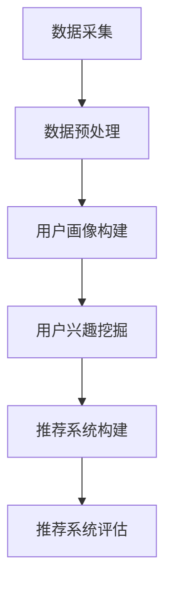
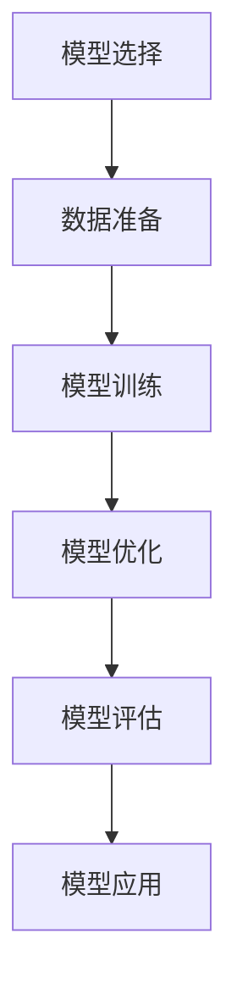
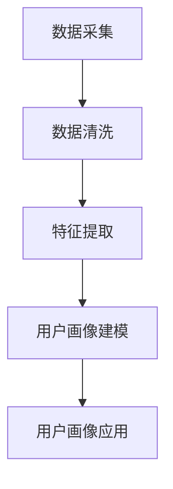

                 

## 引言

随着互联网的快速发展，推荐系统已经成为提升用户体验、提高商业价值的重要技术手段。从最初的基于内容的推荐到协同过滤推荐，再到如今的大模型赋能推荐系统，推荐系统技术经历了不断演进。然而，随着推荐系统规模的扩大和复杂度的提升，如何构建有效的用户体验评估体系成为一个亟待解决的问题。

本文旨在探讨大模型赋能下的推荐系统用户体验评估体系构建。我们将首先介绍推荐系统的基础知识，包括定义、分类以及发展历程；接着，深入探讨大模型的定义、特点以及其在推荐系统中的应用；然后，我们将分析用户画像的构建和用户兴趣挖掘的方法；最后，本文将重点讨论大模型在推荐系统评估中的应用，包括评估指标的选择和优化，以及如何构建大模型赋能下的推荐系统评估体系。

通过本文的阅读，读者将能够了解大模型赋能下推荐系统用户体验评估体系的全貌，掌握关键技术和方法，为实际项目提供理论指导和实践参考。

---

### 文章关键词

- 推荐系统
- 大模型
- 用户体验评估
- 用户画像
- 用户兴趣挖掘
- 评估指标

### 摘要

本文围绕大模型赋能下的推荐系统用户体验评估体系展开，首先介绍了推荐系统的基础知识，包括其定义、分类及发展历程。接着，深入探讨了大模型的定义、特点及其在推荐系统中的应用。随后，详细分析了用户画像的构建和用户兴趣挖掘的方法。最后，本文重点讨论了大模型在推荐系统评估中的应用，包括评估指标的选择和优化，以及如何构建大模型赋能下的推荐系统评估体系。通过本文的阅读，读者可以全面了解推荐系统用户体验评估体系的核心内容，掌握关键技术和方法。

---

### 《大模型赋能下的推荐系统用户体验评估体系构建》目录大纲

1. 引言
   - 文章关键词
   - 摘要
2. 推荐系统基础
   - 推荐系统概述
   - 大模型概述
   - 大模型在推荐系统中的应用
3. 用户画像与兴趣挖掘
   - 用户画像构建
   - 用户兴趣挖掘
   - 用户行为分析与预测
4. 大模型赋能下的推荐系统评估
   - 推荐系统评估指标
   - 大模型在推荐系统评估中的应用
   - 大模型赋能下的推荐系统评估体系构建
5. 项目实战
   - 推荐系统用户体验评估项目实战
   - 大模型应用与推荐系统评估实战
6. 附录
   - 相关工具与资源
   - Mermaid流程图
   - 伪代码与数学公式

通过以上目录大纲，本文将系统性地介绍大模型赋能下的推荐系统用户体验评估体系，旨在为读者提供全面的技术解读和实践指南。

---

### 第一部分: 推荐系统基础

推荐系统作为信息过滤技术的一种，其目的是根据用户的兴趣和偏好，向用户推荐相关的商品、服务或内容。推荐系统在互联网行业中的应用范围广泛，涵盖了电子商务、社交媒体、媒体播放等多个领域，极大地提升了用户体验和商业价值。

#### 第1章: 推荐系统概述

**1.1 推荐系统的定义与分类**

推荐系统（Recommender System）是一种信息过滤技术，旨在向用户推荐他们可能感兴趣的内容。根据推荐策略的不同，推荐系统可以分为以下几类：

- **基于内容的推荐（Content-Based Filtering）**：基于用户过去的喜好和内容特征进行推荐。
- **协同过滤推荐（Collaborative Filtering）**：通过收集用户之间的相似性来进行推荐。
- **混合推荐（Hybrid Recommender Systems）**：结合基于内容和协同过滤的方法进行推荐。

**1.2 推荐系统的发展历程**

推荐系统的发展历程可以分为几个阶段：

- **早期推荐系统**：基于规则和记忆的简单推荐系统。
- **基于内容的推荐系统**：通过计算内容特征进行推荐。
- **协同过滤推荐系统**：通过用户行为数据计算相似性进行推荐。
- **现代推荐系统**：结合深度学习和大数据技术，实现更加智能的推荐。

**1.3 推荐系统在互联网行业中的应用**

推荐系统在互联网行业中的应用非常广泛，以下是一些典型应用场景：

- **电子商务平台**：通过推荐商品提升用户体验和销售额。
- **社交媒体平台**：通过推荐内容提升用户活跃度和用户粘性。
- **媒体播放平台**：通过推荐视频、音乐等内容提升用户观看时长。

#### 第2章: 大模型概述

**2.1 大模型的定义与特点**

大模型（Large-scale Model）是指具有大规模参数和高计算需求的神经网络模型。大模型的主要特点包括：

- **参数规模大**：具有数十亿甚至数万亿个参数。
- **计算需求高**：训练过程需要大量计算资源。
- **迁移能力强**：能够在不同任务中实现良好的迁移效果。
- **推理效率低**：推理过程需要大量计算资源。

**2.2 大模型的主要类型**

目前主流的大模型主要包括以下几种类型：

- **GPT系列模型**：基于转换器（Transformer）架构的语言模型。
- **BERT及其变体**：基于Transformer架构的预训练模型。
- **其他知名大模型**：如XLNet、T5等。

**2.3 大模型的优势与挑战**

大模型的优势包括：

- **强大的表征能力**：能够捕捉复杂的语义信息。
- **广泛的适用性**：适用于多种自然语言处理任务。
- **高效的迁移学习**：能够在不同任务中实现良好的性能。

然而，大模型也存在一些挑战：

- **资源需求高**：训练和推理过程需要大量计算资源和存储资源。
- **训练时间长**：大规模模型的训练过程非常耗时。
- **模型解释性低**：大模型的内部工作机制复杂，难以解释。

#### 第3章: 大模型在推荐系统中的应用

**3.1 大模型在协同过滤中的应用**

在协同过滤（Collaborative Filtering）中，大模型可以用于矩阵分解（Matrix Factorization）和用户兴趣预测。具体方法如下：

- **矩阵分解**：利用大模型对用户-物品矩阵进行低维表示，从而提高推荐系统的性能。
- **用户兴趣预测**：利用用户行为数据训练大模型，预测用户对未访问物品的兴趣。

**3.2 大模型在基于内容的推荐中的应用**

在基于内容的推荐（Content-Based Filtering）中，大模型可以用于文本数据预处理和特征提取。具体方法如下：

- **文本数据预处理**：利用大模型进行文本嵌入（Text Embedding），将文本转换为固定长度的向量。
- **特征提取**：利用大模型提取文本中的潜在特征，为推荐系统提供丰富的特征信息。

**3.3 大模型在混合推荐系统中的应用**

在混合推荐系统（Hybrid Recommender Systems）中，大模型可以用于融合不同推荐策略，提高推荐系统的效果。具体方法如下：

- **推荐策略融合**：利用大模型将基于内容和协同过滤的推荐结果进行融合，生成综合推荐结果。
- **用户兴趣建模**：利用大模型对用户兴趣进行建模，为个性化推荐提供支持。

通过以上三部分的介绍，我们可以看到大模型在推荐系统中的应用已经越来越广泛，其强大的表征能力和迁移能力为推荐系统的优化提供了新的思路和方法。

### 第二部分: 用户画像与兴趣挖掘

用户画像和兴趣挖掘是推荐系统中的重要环节，它们直接关系到推荐系统的效果和用户体验。在这一部分，我们将深入探讨用户画像的构建和用户兴趣挖掘的方法。

#### 第4章: 用户画像构建

**4.1 用户画像的概念与体系**

用户画像（User Profile）是指对用户的基本属性、行为偏好、社会属性等多维度信息的整合与提炼。一个完整的用户画像体系通常包括以下几个部分：

- **基础属性**：如年龄、性别、地理位置、职业等基本信息。
- **行为数据**：如浏览记录、购买历史、评论等用户行为数据。
- **社会属性**：如社交网络关系、兴趣爱好等社会属性信息。
- **偏好兴趣**：通过对用户历史行为的分析，提取出用户的偏好和兴趣点。

**4.2 用户画像的数据来源**

用户画像的数据来源主要包括以下几个方面：

- **用户行为数据**：如登录日志、浏览记录、购买记录、评论等。
- **第三方数据**：如人口统计数据、地理位置数据、社交网络数据等。
- **传感器数据**：如移动设备的位置信息、搜索历史等。

**4.3 用户画像构建流程**

用户画像的构建通常包括以下几个步骤：

- **数据采集**：从各种渠道获取用户数据，如数据库、日志文件、第三方API等。
- **数据预处理**：对采集到的用户数据进行清洗、去重、归一化等处理，确保数据质量。
- **特征提取**：根据用户画像的体系，从预处理后的数据中提取特征，如文本特征、数值特征等。
- **用户画像建模**：利用机器学习算法构建用户画像模型，如聚类算法、关联规则算法等。
- **用户画像应用**：根据用户画像模型进行用户细分和个性化推荐。

#### 第5章: 用户兴趣挖掘

**5.1 用户兴趣挖掘的基本方法**

用户兴趣挖掘（User Interest Mining）是指通过分析用户的行为数据，提取出用户的兴趣点。基本方法包括以下几种：

- **协同过滤**：通过计算用户之间的相似性，发现具有相似兴趣的用户群体。
- **基于内容的推荐**：通过分析用户对特定内容的偏好，提取用户的兴趣点。
- **深度学习**：利用深度学习模型，如神经网络，提取用户行为数据中的潜在兴趣。

**5.2 用户兴趣挖掘的数据预处理**

在进行用户兴趣挖掘之前，需要对用户行为数据进行预处理，以确保数据质量。预处理步骤包括：

- **数据清洗**：去除噪声数据和缺失值。
- **数据归一化**：将不同规模的数据归一化处理。
- **文本预处理**：对文本数据进行分词、去停用词等处理。

**5.3 用户兴趣挖掘模型**

用户兴趣挖掘模型主要包括以下几种：

- **协同过滤模型**：如矩阵分解、SGD等。
- **基于内容的推荐模型**：如LDA、TF-IDF等。
- **深度学习模型**：如CNN、RNN、Transformer等。

通过用户画像和用户兴趣挖掘，我们可以更准确地了解用户的偏好和兴趣，从而为推荐系统提供有效的支持。

### 第三部分: 大模型赋能下的推荐系统评估

在大模型赋能下，推荐系统评估变得更加复杂和多样化。在这一部分，我们将探讨推荐系统评估指标的选择与优化，以及大模型在推荐系统评估中的应用。

#### 第7章: 推荐系统评估指标

**7.1 评估指标的选择**

推荐系统评估指标的选择至关重要，它决定了评估结果的准确性和可靠性。在选择评估指标时，应考虑以下因素：

- **相关性**：评估指标应与推荐系统的目标紧密相关。
- **计算复杂度**：评估指标的计算复杂度应适中，以确保评估过程的高效性。
- **多样性**：评估指标应具备多样性，以便从不同角度对推荐系统进行评估。

**7.2 常见评估指标详解**

以下是一些常见的推荐系统评估指标：

- **准确率（Accuracy）**：预测正确的样本数占总样本数的比例。
- **召回率（Recall）**：预测正确的正样本数占总正样本数的比例。
- **精确率（Precision）**：预测正确的正样本数占预测为正样本的总数的比例。
- **F1值（F1-score）**：精确率和召回率的调和平均值。
- **平均准确率（MAP）**：多个评估指标的平均值。

**7.3 评估指标优化**

评估指标的优化主要包括以下几个方面：

- **指标融合**：将多个评估指标进行融合，以获得更全面的评估结果。
- **指标加权**：根据不同业务需求对评估指标进行加权，以突出关键指标。
- **指标调整**：根据用户行为和业务场景对评估指标进行调整，以提高评估的准确性和实用性。

#### 第8章: 大模型在推荐系统评估中的应用

**8.1 大模型在评估指标优化中的应用**

大模型在评估指标优化中的应用主要体现在以下几个方面：

- **指标融合**：利用大模型对评估指标进行融合，以提高评估的准确性和全面性。
- **指标加权**：利用大模型对评估指标进行加权，以突出关键指标。
- **动态调整**：根据用户行为和业务场景，利用大模型动态调整评估指标。

**8.2 大模型在推荐效果分析中的应用**

大模型在推荐效果分析中的应用主要包括以下几个方面：

- **用户行为分析**：利用大模型对用户行为进行深入分析，以发现用户的潜在兴趣和偏好。
- **推荐效果评估**：利用大模型对推荐效果进行评估，以判断推荐系统的优劣。
- **模型解释性**：利用大模型对推荐结果进行解释，以提高模型的可解释性。

**8.3 大模型在推荐系统调优中的应用**

大模型在推荐系统调优中的应用主要包括以下几个方面：

- **模型选择**：利用大模型选择适合推荐系统的模型，以提高推荐效果。
- **超参数调整**：利用大模型调整推荐系统的超参数，以优化模型性能。
- **实时调优**：利用大模型进行实时调优，以适应不断变化的用户行为和业务场景。

通过大模型在推荐系统评估中的应用，我们可以实现更加准确和高效的推荐效果评估，从而提升用户体验和商业价值。

### 第四部分: 项目实战

在了解了大模型赋能下的推荐系统用户体验评估体系的理论知识后，我们需要通过实际项目来验证和应用这些理论。本部分将介绍推荐系统用户体验评估项目实战，包括项目背景与目标、项目数据集介绍、项目实施流程以及项目结果分析。

#### 第10章: 推荐系统用户体验评估项目实战

**10.1 项目背景与目标**

推荐系统用户体验评估项目旨在评估推荐系统在提升用户体验和商业价值方面的效果。项目的目标包括：

- **评估推荐系统的准确性和召回率**：通过评估推荐系统的性能，判断其能否有效地向用户推荐他们感兴趣的内容。
- **优化推荐系统的评估指标**：通过调整评估指标，提高评估的准确性和全面性。
- **提升用户满意度**：通过优化推荐系统，提高用户满意度，从而提升商业价值。

**10.2 项目数据集介绍**

项目所使用的数据集主要包括用户行为数据、用户画像数据以及推荐物品数据。数据集的来源可以是电商平台、社交媒体平台或其他相关数据来源。数据集的特点包括：

- **用户行为数据**：包括用户的浏览记录、购买记录、评论等。
- **用户画像数据**：包括用户的基本属性、行为偏好、社会属性等信息。
- **推荐物品数据**：包括物品的属性、标签、分类等信息。

**10.3 项目实施流程**

项目实施流程主要包括以下步骤：

1. **数据采集**：从各个数据源获取用户行为数据、用户画像数据和推荐物品数据。
2. **数据预处理**：对采集到的数据进行清洗、去重、归一化等处理，确保数据质量。
3. **用户画像构建**：根据用户画像体系，从预处理后的数据中提取特征，构建用户画像。
4. **用户兴趣挖掘**：利用用户兴趣挖掘模型，对用户行为数据进行挖掘，提取用户的兴趣点。
5. **推荐系统构建**：利用推荐算法，结合用户画像和用户兴趣，构建推荐系统。
6. **推荐系统评估**：利用评估指标，对推荐系统进行评估，判断其性能。
7. **优化与调整**：根据评估结果，对推荐系统进行优化和调整，提高评估指标。

**10.4 项目结果分析**

项目结果分析主要包括以下几个方面：

1. **评估指标分析**：分析推荐系统的评估指标，如准确率、召回率、F1值等，判断推荐系统的性能。
2. **用户满意度分析**：通过用户调查和数据分析，评估用户对推荐系统的满意度。
3. **商业价值分析**：分析推荐系统对商业价值的影响，如销售额、用户留存率等。

通过项目实战，我们可以验证大模型赋能下的推荐系统用户体验评估体系的实际效果，为实际项目提供参考和指导。

### 第11章: 大模型应用与推荐系统评估实战

在大模型赋能下，推荐系统评估变得更加智能和高效。本章节将详细介绍大模型在推荐系统评估中的应用，包括大模型选择、训练与优化，以及在推荐系统评估中的实际应用案例。

#### 11.1 大模型应用实战

**11.1.1 大模型选择**

选择适合推荐系统评估的大模型是关键步骤。常见的大模型包括：

- **GPT系列模型**：适用于文本数据分析和生成。
- **BERT及其变体**：适用于文本嵌入和语义分析。
- **XLNet、T5**：适用于多任务学习和跨领域迁移。

根据评估需求，选择具有强大表征能力和迁移能力的大模型。

**11.1.2 大模型训练**

大模型的训练过程需要大量计算资源和时间。以下步骤展示了大模型训练的基本流程：

1. **数据准备**：准备训练数据，包括用户行为数据、用户画像数据和推荐物品数据。
2. **数据预处理**：对数据进行清洗、去重、归一化等处理。
3. **模型架构设计**：根据需求设计模型架构，如Transformer、BERT等。
4. **模型训练**：使用GPU或分布式训练框架进行模型训练，调整学习率和优化器等超参数。
5. **模型评估**：使用验证集对模型进行评估，调整模型参数。

**11.1.3 大模型优化**

大模型的优化主要包括以下几个方面：

- **超参数调整**：调整学习率、批量大小、隐藏层维度等超参数。
- **正则化**：使用Dropout、L2正则化等技术防止过拟合。
- **数据增强**：通过数据增强技术增加训练数据的多样性。

#### 11.2 大模型在推荐系统评估中的实战

**11.2.1 大模型在评估指标优化中的应用**

大模型可以用于优化推荐系统评估指标，如：

- **融合评估指标**：利用大模型将多个评估指标进行融合，生成综合评估指标。
- **动态调整评估指标**：根据用户行为和业务场景，利用大模型动态调整评估指标，提高评估的准确性和全面性。

**11.2.2 大模型在评估方法选择中的应用**

大模型可以帮助选择最适合推荐系统评估的方法，如：

- **用户行为分析**：利用大模型对用户行为数据进行深入分析，为评估方法选择提供依据。
- **模型解释性**：利用大模型解释推荐结果，提高评估方法的透明度和可信度。

**11.2.3 大模型在评估结果分析中的应用**

大模型可以用于评估结果分析，如：

- **用户兴趣分析**：利用大模型分析用户的兴趣点，为评估结果提供更深刻的解释。
- **推荐效果评估**：利用大模型对推荐效果进行综合评估，判断推荐系统的优劣。

#### 11.3 实战案例分析与总结

**11.3.1 案例分析**

以下是一个实际案例：

- **项目背景**：一家电商平台希望通过优化推荐系统，提高用户满意度和销售额。
- **数据集**：包括用户行为数据、用户画像数据和推荐物品数据。
- **大模型选择**：选择了BERT模型，用于文本嵌入和用户兴趣分析。
- **训练与优化**：使用GPU进行模型训练，调整学习率和隐藏层维度，通过数据增强提高模型泛化能力。
- **评估方法**：利用BERT模型融合评估指标，动态调整评估指标，提高评估的准确性和全面性。

**11.3.2 总结与展望**

通过实际案例，我们可以看到大模型在推荐系统评估中的应用效果显著。未来，随着大模型技术的不断发展，推荐系统评估将变得更加智能和高效，为电商平台和其他互联网企业带来更大的商业价值。

### 附录

#### 附录 A: 相关工具与资源

**A.1 推荐系统常用工具**

- **推荐系统框架**：如Surprise、LightFM等。
- **数据预处理工具**：如Pandas、NumPy等。
- **机器学习库**：如Scikit-learn、TensorFlow等。

**A.2 大模型开发工具**

- **预训练模型库**：如Hugging Face Transformers、PyTorch等。
- **分布式训练工具**：如Horovod、DistributedDataParallel等。
- **GPU加速库**：如CUDA、cuDNN等。

**A.3 数据集资源链接**

- **公开数据集**：如MovieLens、Netflix Prize等。
- **特定领域数据集**：如电商数据集、社交媒体数据集等。

#### 附录 B: Mermaid流程图

**B.1 推荐系统流程图**



**B.2 大模型应用流程图**



**B.3 用户画像构建流程图**



#### 附录 C: 伪代码与数学公式

**C.1 协同过滤算法伪代码**

```python
# 输入：用户-物品评分矩阵R，用户数量m，物品数量n
# 输出：预测评分矩阵\hat{R}

# 矩阵分解
U = matrix(m, k) # 用户潜在特征矩阵
V = matrix(n, k) # 物品潜在特征矩阵

# 初始化U和V
U .= random(m, k)
V .= random(n, k)

# 训练过程
for i in 1 to num_iterations:
    for user in 1 to m:
        for item in 1 to n:
            if R[user, item] > 0:
                error = R[user, item] - dot(U[user], V[item])
                U[user] += learning_rate * (error * V[item])
                V[item] += learning_rate * (error * U[user])
```

**C.2 基于内容的推荐算法伪代码**

```python
# 输入：用户历史行为数据，物品特征向量
# 输出：推荐列表

# 特征提取
user_features = extract_features(user_history)
item_features = extract_features(item)

# 计算相似性
similarity = dot(user_features, item_features) / (norm(user_features) * norm(item_features))

# 推荐结果
recommendation = []
for item in candidate_items:
    if similarity > threshold:
        recommendation.append(item)
```

**C.3 用户行为预测算法伪代码**

```python
# 输入：用户行为数据，模型参数
# 输出：预测行为

# 数据预处理
X = preprocess_data(user_behavior_data)

# 模型预测
predicted_behavior = model.predict(X)

# 输出预测行为
return predicted_behavior
```

**C.4 数学公式详细解析**

$$
J(\theta) = -\frac{1}{m}\sum_{i=1}^{m}l(y^{(i)}, \hat{y}^{(i)}; \theta)
$$

其中，$J(\theta)$ 表示损失函数，$m$ 表示样本数量，$l(y^{(i)}, \hat{y}^{(i)}; \theta)$ 表示每个样本的损失函数。

$$
\hat{y}^{(i)} = \sigma(\theta^T x^{(i)})
$$

其中，$\hat{y}^{(i)}$ 表示预测的标签，$x^{(i)}$ 表示第 $i$ 个样本的特征向量，$\sigma$ 表示sigmoid函数。

$$
l(y, \hat{y}) = -y \log(\hat{y}) - (1 - y) \log(1 - \hat{y})
$$

其中，$l(y, \hat{y})$ 表示交叉熵损失函数，$y$ 表示真实标签，$\hat{y}$ 表示预测标签。

### 作者

- 作者：AI天才研究院/AI Genius Institute & 禅与计算机程序设计艺术 /Zen And The Art of Computer Programming

---

**全文总结：**

本文围绕大模型赋能下的推荐系统用户体验评估体系进行了详细探讨。通过介绍推荐系统的基本概念、大模型的定义与应用，以及用户画像与兴趣挖掘的方法，我们为构建有效的用户体验评估体系提供了理论基础。随后，本文重点分析了大模型在推荐系统评估中的应用，包括评估指标的选择与优化，并提供了实际项目案例以验证理论。最后，附录部分提供了相关工具、资源、流程图、伪代码和数学公式，以帮助读者更好地理解和应用文中内容。

大模型赋能下的推荐系统用户体验评估体系是推荐系统领域的一个重要研究方向。通过本文的探讨，我们期望能够为业界提供有益的参考，推动推荐系统技术的发展和创新。未来，随着大模型技术的不断进步，推荐系统用户体验评估体系将变得更加智能和高效，为企业和用户带来更大的价值。让我们共同期待这一美好前景的到来！

