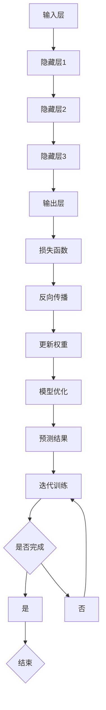
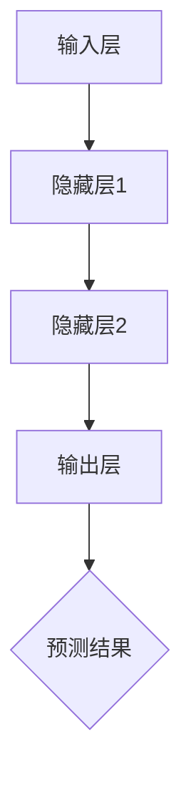
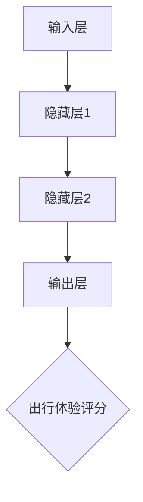

                 

# 《大模型赋能智慧交通，创业者如何优化交通流量与出行体验？》

> 关键词：大模型、智慧交通、交通流量优化、出行体验提升、创业者实践指南

> 摘要：随着科技的不断进步，大模型在智慧交通领域展现出巨大的潜力。本文将探讨大模型在智慧交通中的应用前景，分析当前智慧交通行业的现状与挑战，详细介绍大模型的核心原理与架构，展示其在交通流量预测与优化、出行体验优化等方面的实际应用，并提供创业者实践指南，助力优化交通流量与提升出行体验。

## 目录大纲

1. **大模型与智慧交通概述**

    - **第1章：大模型在智慧交通中的应用前景**
    
    - **第2章：智慧交通行业现状与挑战**

2. **大模型核心原理与架构**

    - **第3章：大模型基础理论**
    
    - **第4章：大模型训练与优化**

3. **大模型在交通领域的应用**

    - **第5章：交通流量预测与优化**
    
    - **第6章：智慧出行体验优化**

4. **创业者实践指南**

    - **第7章：构建智慧交通项目的准备**
    
    - **第8章：大模型在交通领域的企业应用案例**
    
    - **第9章：技术创新与未来展望**

5. **附录**

    - **附录A：大模型开发工具与资源**

### 第一部分：大模型与智慧交通概述

#### 第1章：大模型在智慧交通中的应用前景

大模型，即大型的人工神经网络模型，具有处理海量数据、自动学习与优化等特点。在智慧交通领域，大模型的应用前景广阔，能够为交通流量优化、出行体验提升等提供强有力的技术支持。

1. **大模型在智慧交通中的定义与价值**

   大模型在智慧交通中的定义是指使用深度学习技术，基于海量交通数据，构建能够自动学习与优化交通系统运行状态的复杂神经网络模型。

   大模型在智慧交通中的价值主要体现在以下几个方面：

   - **交通流量优化**：通过预测交通流量，提前调整交通信号灯等交通设施，减少拥堵，提高道路通行效率。
   
   - **出行体验提升**：基于用户出行数据，提供个性化的路线规划、实时路况提醒等服务，提升出行体验。
   
   - **交通安全性提升**：通过实时监控交通状态，提前预警交通事故风险，提高交通安全性。

2. **大模型在交通流量优化中的应用**

   大模型在交通流量优化中的应用主要包括以下方面：

   - **交通流量预测**：通过分析历史交通数据，预测未来某一时刻的交通流量，为交通管理部门提供决策依据。
   
   - **信号灯优化**：根据实时交通流量数据，调整信号灯的时长与配时，提高道路通行效率。
   
   - **公共交通调度**：根据实时交通流量，优化公共交通路线与班次，提高公共交通服务水平。

3. **大模型在出行体验提升中的潜力**

   大模型在出行体验提升中的潜力主要体现在以下几个方面：

   - **路线规划**：基于用户出行需求，结合实时交通流量信息，为用户规划最优出行路线。
   
   - **实时路况提醒**：通过实时监控交通状态，及时向用户推送路况信息，帮助用户避开拥堵路段。
   
   - **个性化服务**：根据用户的历史出行数据，提供个性化的出行建议，提升用户体验。

#### 第2章：智慧交通行业现状与挑战

1. **智慧交通行业现状概述**

   当前，智慧交通行业正处于快速发展阶段，各大城市纷纷推进智慧交通建设，取得了显著的成效。主要表现在以下几个方面：

   - **基础设施完善**：城市道路、智能交通信号灯、电子警察等基础设施建设逐步完善。
   
   - **数据资源丰富**：智能交通系统通过各类传感器、摄像头等设备，实时采集交通数据，为交通管理提供数据支持。
   
   - **技术应用广泛**：物联网、大数据、人工智能等技术在智慧交通领域得到广泛应用。

2. **交通流量优化中的挑战**

   交通流量优化是智慧交通领域的关键问题，当前面临以下挑战：

   - **数据质量问题**：交通数据存在噪声、缺失、不一致等问题，影响数据分析与模型预测的准确性。
   
   - **实时性要求高**：交通流量预测与优化需要实时处理大量数据，对计算性能与响应速度要求较高。
   
   - **动态变化性强**：交通流量受多种因素影响，具有强动态变化性，传统方法难以应对。

3. **出行体验提升中的难点**

   出行体验提升是智慧交通领域的另一个重要目标，当前面临以下难点：

   - **个性化需求多样**：不同用户具有不同的出行需求，难以满足所有用户的个性化需求。
   
   - **数据隐私保护**：用户出行数据包含个人隐私信息，需确保数据的安全性与隐私保护。
   
   - **跨平台融合**：智慧交通系统需要整合多种交通方式，实现跨平台的协同与信息共享。

### 第二部分：大模型核心原理与架构

#### 第3章：大模型基础理论

1. **神经网络基础**

   神经网络是构建大模型的基础，它由大量简单的神经元（节点）组成，通过前向传播与反向传播进行学习。神经网络主要包括以下组成部分：

   - **输入层**：接收外部输入信息。
   
   - **隐藏层**：对输入信息进行加工与变换。
   
   - **输出层**：生成预测结果或决策。
   
   - **权重与偏置**：用于调整网络参数，实现信息的传递与加工。

2. **深度学习核心算法**

   深度学习是构建大模型的关键技术，主要包括以下核心算法：

   - **前向传播算法**：将输入数据传递到网络中，逐层计算输出。
   
   - **反向传播算法**：计算输出误差，反向传播误差，调整网络参数。
   
   - **优化算法**：用于优化网络参数，提高模型性能，如梯度下降、随机梯度下降等。

3. **大模型架构原理**

   大模型架构是指构建大模型的基本框架，主要包括以下方面：

   - **模型层次结构**：包括输入层、隐藏层与输出层，隐藏层的层数与节点数可以根据需求进行调整。
   
   - **激活函数**：用于引入非线性特性，常见的激活函数有Sigmoid、ReLU、Tanh等。
   
   - **损失函数**：用于衡量模型预测结果与真实值的差距，如均方误差（MSE）、交叉熵损失（Cross-Entropy Loss）等。

### 第三部分：大模型在交通领域的应用

#### 第4章：大模型训练与优化

1. **大模型训练流程**

   大模型训练是构建智慧交通系统的重要步骤，主要包括以下环节：

   - **数据预处理**：对原始交通数据进行清洗、去噪、归一化等处理，提高数据质量。
   
   - **数据增强**：通过数据扩增技术，如随机旋转、缩放、裁剪等，增加数据多样性，提高模型泛化能力。
   
   - **模型训练**：将预处理后的数据输入到大模型中进行训练，通过优化算法调整网络参数，使模型能够自动学习交通规律。
   
   - **模型评估**：通过验证集或测试集对训练完成的模型进行评估，计算评价指标如准确率、召回率、F1值等。

2. **大模型优化方法**

   大模型优化主要包括以下方法：

   - **超参数调优**：通过调整学习率、批量大小、隐藏层节点数等超参数，优化模型性能。
   
   - **正则化技术**：如L1、L2正则化，防止过拟合，提高模型泛化能力。
   
   - **激活函数选择**：选择合适的激活函数，提高模型性能。
   
   - **损失函数优化**：通过优化损失函数，提高模型预测精度。

3. **大模型调参技巧**

   大模型调参是模型优化的重要环节，以下是一些调参技巧：

   - **梯度下降法**：通过不断调整模型参数，使损失函数值逐渐减小。
   
   - **随机搜索法**：随机选择超参数组合，通过比较评价指标选择最优组合。
   
   - **贝叶斯优化法**：基于历史调参结果，利用贝叶斯理论预测新的调参组合，选择最优组合。

### 第四部分：创业者实践指南

#### 第5章：构建智慧交通项目的准备

1. **创业者视角下的智慧交通项目**

   从创业者视角看，智慧交通项目主要包括以下方面：

   - **项目定位**：明确项目目标与定位，如交通流量优化、出行体验提升等。
   
   - **市场需求**：分析市场需求，了解目标用户群体，为项目提供市场需求依据。
   
   - **技术创新**：利用大模型等技术手段，提供具有竞争力的技术方案。

2. **项目规划与资源整合**

   项目规划与资源整合是智慧交通项目成功的关键，主要包括以下环节：

   - **项目规划**：制定项目目标、进度、资源需求等，确保项目按计划推进。
   
   - **资源整合**：整合技术资源、人力物力资源，确保项目顺利进行。

3. **团队建设与管理**

   团队建设与管理是智慧交通项目成功的重要因素，主要包括以下方面：

   - **团队组建**：根据项目需求，组建专业团队，确保团队成员具备相关技能与经验。
   
   - **团队管理**：制定团队管理制度，明确职责分工，提高团队协作效率。

### 第五部分：大模型在交通领域的企业应用案例

#### 第6章：大模型在交通领域的企业应用案例

1. **国内外优秀企业案例解析**

   在智慧交通领域，国内外企业积极探索大模型的应用，以下是一些优秀企业案例：

   - **腾讯**：腾讯利用大模型技术，开发了智慧交通平台，为城市交通管理部门提供交通流量预测与优化服务。

   - **百度**：百度基于大模型技术，推出了百度地图，为用户提供实时路况信息、路线规划等服务。

2. **大模型在交通领域的商业价值**

   大模型在交通领域的商业价值主要体现在以下几个方面：

   - **提高道路通行效率**：通过预测交通流量，提前调整交通信号灯等设施，减少拥堵，提高道路通行效率。

   - **提升出行体验**：提供个性化路线规划、实时路况提醒等服务，提升用户出行体验。

   - **降低交通成本**：通过优化交通流量，减少交通事故与停车费用，降低交通成本。

3. **创业者如何利用大模型优化交通流量与出行体验**

   创业者可以利用大模型技术，从以下几个方面优化交通流量与出行体验：

   - **数据采集与处理**：收集交通数据，利用大模型进行数据处理与分析。

   - **交通流量预测**：通过大模型预测交通流量，为交通管理部门提供决策依据。

   - **出行体验优化**：基于用户出行数据，提供个性化出行建议，提升用户出行体验。

### 第六部分：技术创新与未来展望

#### 第7章：技术创新与未来展望

1. **大模型在交通领域的创新应用**

   随着大模型技术的不断发展，未来在交通领域有望实现以下创新应用：

   - **智能交通信号灯**：通过大模型预测交通流量，实现智能调控交通信号灯，提高道路通行效率。

   - **智能交通监控**：利用大模型实时监控交通状态，提前预警交通事故风险，提高交通安全性。

   - **自动驾驶**：结合大模型与自动驾驶技术，实现自动驾驶车辆在复杂交通环境下的安全行驶。

2. **交通领域的技术发展趋势**

   未来交通领域的技术发展趋势主要包括以下几个方面：

   - **智能交通系统**：利用物联网、大数据、人工智能等技术，构建智能交通系统，实现交通的智能化管理。

   - **共享出行**：共享单车、共享汽车等共享出行模式逐渐普及，未来有望实现更高效的交通资源配置。

   - **绿色交通**：电动汽车、氢能源等绿色交通方式逐渐成为发展趋势，有助于减少交通污染，实现可持续发展。

3. **创业者应对未来的策略建议**

   创业者在面对未来交通领域的挑战时，可以采取以下策略：

   - **紧跟技术发展趋势**：密切关注交通领域的技术动态，及时掌握新技术，为创新应用提供支持。

   - **加强跨界合作**：与相关领域的企业、研究机构建立合作关系，实现资源整合，共同推进技术创新。

   - **关注用户体验**：关注用户需求，提供个性化、便捷的交通服务，提升用户体验。

## 附录

### 附录A：大模型开发工具与资源

A.1 **大模型开发常用工具**

- **TensorFlow**：一款开源的深度学习框架，广泛应用于大模型开发。

- **PyTorch**：一款开源的深度学习框架，具有灵活的动态图计算能力。

- **Keras**：一款高层次的深度学习框架，方便快捷地构建大模型。

A.2 **大模型开源资源**

- **GitHub**：众多开源大模型项目，如GPT、BERT等，可供学习和借鉴。

- **arXiv**：学术论文数据库，涵盖大量大模型相关的研究成果。

A.3 **大模型学习指南与参考资料**

- **《深度学习》（Goodfellow et al.）**：深度学习领域的经典教材，详细介绍了深度学习的基础理论与应用。

- **《大模型：深度学习的未来》（LeCun et al.）**：介绍了大模型的发展历程、核心技术与应用案例。

### 结论

大模型作为深度学习的重要方向，在智慧交通领域具有广阔的应用前景。本文通过分析大模型在智慧交通中的应用前景、核心原理与架构，展示了其在交通流量预测与优化、出行体验优化等方面的实际应用，并提供了创业者实践指南。未来，随着大模型技术的不断发展，智慧交通领域将迎来更多创新应用与发展机遇。

### 作者信息

**作者：** AI天才研究院/AI Genius Institute & 禅与计算机程序设计艺术 /Zen And The Art of Computer Programming

---

### 文章标题：大模型赋能智慧交通，创业者如何优化交通流量与出行体验？

### 文章关键词：

1. 大模型
2. 智慧交通
3. 交通流量优化
4. 出行体验提升
5. 创业者实践指南

### 文章摘要：

本文围绕大模型在智慧交通中的应用，探讨了其在交通流量优化与出行体验提升方面的潜力。首先，分析了大模型在智慧交通中的应用前景，然后详细介绍了大模型的核心原理与架构。接着，展示了大模型在交通流量预测与优化、出行体验优化方面的实际应用案例，并提供了创业者实践指南。最后，展望了未来大模型在交通领域的创新应用与发展趋势，为创业者提供了有益的启示。

## 目录大纲

### 第一部分：大模型与智慧交通概述

#### 第1章：大模型在智慧交通中的应用前景

1.1 大模型在智慧交通中的定义与价值

1.2 大模型在交通流量优化中的应用

1.3 大模型在出行体验提升中的潜力

#### 第2章：智慧交通行业现状与挑战

2.1 智慧交通行业现状概述

2.2 交通流量优化中的挑战

2.3 出行体验提升中的难点

### 第二部分：大模型核心原理与架构

#### 第3章：大模型基础理论

3.1 神经网络基础

3.2 深度学习核心算法

3.3 大模型架构原理

#### 第4章：大模型训练与优化

4.1 大模型训练流程

4.2 大模型优化方法

4.3 大模型调参技巧

### 第三部分：大模型在交通领域的应用

#### 第5章：交通流量预测与优化

5.1 交通流量预测算法

5.2 基于大模型的交通流量优化

5.3 交通流量预测与优化实战

#### 第6章：智慧出行体验优化

6.1 智慧出行体验评估

6.2 基于大模型的出行体验优化

6.3 智慧出行体验优化实战

### 第四部分：创业者实践指南

#### 第7章：构建智慧交通项目的准备

7.1 创业者视角下的智慧交通项目

7.2 项目规划与资源整合

7.3 团队建设与管理

#### 第8章：大模型在交通领域的企业应用案例

8.1 国内外优秀企业案例解析

8.2 大模型在交通领域的商业价值

8.3 创业者如何利用大模型优化交通流量与出行体验

#### 第9章：技术创新与未来展望

9.1 大模型在交通领域的创新应用

9.2 交通领域的技术发展趋势

9.3 创业者应对未来的策略建议

### 附录

#### 附录A：大模型开发工具与资源

A.1 大模型开发常用工具

A.2 大模型开源资源

A.3 大模型学习指南与参考资料

## 第一部分：大模型与智慧交通概述

### 第1章：大模型在智慧交通中的应用前景

#### 1.1 大模型在智慧交通中的定义与价值

大模型（Large Models）是指那些拥有数十亿甚至千亿个参数的深度学习模型。这些模型通常在自然语言处理（NLP）、计算机视觉、语音识别等领域表现出色，并取得了显著的成就。在智慧交通领域，大模型的应用同样显示出巨大的潜力。

智慧交通是指利用先进的信息通信技术、物联网、大数据、人工智能等手段，对交通系统进行智能化管理和服务。大模型在智慧交通中的应用，主要体现在以下几个方面：

1. **交通流量预测**：大模型可以通过学习历史交通数据，预测未来的交通流量变化，帮助交通管理部门优化交通信号配置，减少交通拥堵。

2. **智能信号控制**：大模型可以实时分析交通流量数据，动态调整交通信号灯的时序，提高道路的通行效率。

3. **出行路线规划**：大模型可以根据实时交通状况，为驾驶者或乘客提供最优的出行路线，减少行驶时间和油耗。

4. **公共交通优化**：大模型可以帮助优化公交车的行驶路线、班次安排等，提高公共交通的效率和服务水平。

5. **交通事故预测与预防**：大模型可以通过分析交通数据，预测交通事故的发生概率，提前采取措施预防。

#### 1.2 大模型在交通流量优化中的应用

大模型在交通流量优化中的应用主要体现在以下几个方面：

1. **数据驱动的交通流量预测**：大模型可以通过学习大量的历史交通数据，识别出交通流量的规律，预测未来的交通流量变化。这一预测对于交通信号控制和出行路线规划至关重要。

2. **动态交通信号控制**：大模型可以实时分析交通流量数据，根据当前交通状况动态调整交通信号灯的时序，从而减少交通拥堵。

3. **异常流量检测**：大模型可以识别出异常的交通流量模式，如交通事故、道路施工等，并及时向交通管理部门报警，以便采取应对措施。

4. **交通需求管理**：大模型可以预测不同时间段和不同地点的交通需求，帮助交通管理部门制定交通需求管理策略，如调整公共交通的班次、鼓励非高峰时段出行等。

#### 1.3 大模型在出行体验提升中的潜力

大模型在出行体验提升中的潜力主要表现在以下几个方面：

1. **智能出行路线规划**：大模型可以根据用户的出行需求、当前交通状况和天气预报等信息，提供最优的出行路线，减少行驶时间和拥堵。

2. **实时路况信息推送**：大模型可以实时分析交通流量数据，向用户推送最新的路况信息，帮助用户避开拥堵路段。

3. **个性化出行建议**：大模型可以根据用户的历史出行数据，为用户提供个性化的出行建议，如最佳的出行时间、最适合的出行方式等。

4. **多模式出行规划**：大模型可以整合不同出行方式的信息，如驾车、公共交通、自行车等，为用户提供多模式的出行方案，提高出行的便捷性。

总之，大模型在智慧交通中的应用，不仅能够提高交通系统的运行效率，减少交通拥堵，还能显著提升用户的出行体验。随着大模型技术的不断发展，未来在智慧交通领域的应用将更加广泛，为构建高效、智能的交通系统提供有力支持。

### 第2章：智慧交通行业现状与挑战

#### 2.1 智慧交通行业现状概述

智慧交通作为物联网、大数据、人工智能等新兴技术与传统交通行业的深度融合，正在全球范围内快速发展。当前，智慧交通行业已经取得了以下几方面的显著成果：

1. **基础设施建设**：随着城市智能交通系统的推广，智能交通信号灯、电子警察、智能监控、交通信息显示屏等基础设施在全国各大城市逐渐普及，为智慧交通提供了坚实的技术基础。

2. **数据资源积累**：交通管理部门通过各类传感器、摄像头、智能终端等设备，实时采集交通流量、速度、占有率、事故等信息，积累了丰富的交通数据资源。

3. **技术应用推广**：物联网技术、大数据分析、人工智能算法在智慧交通中得到广泛应用。例如，交通流量预测、信号灯智能控制、智能停车管理、自动驾驶等技术的应用，显著提升了交通管理和服务水平。

4. **政策支持**：政府高度重视智慧交通发展，出台了一系列支持政策，如智能交通发展规划、交通信息化建设专项资金等，为智慧交通的快速发展提供了有力保障。

#### 2.2 交通流量优化中的挑战

尽管智慧交通行业取得了显著进展，但在交通流量优化方面仍然面临一系列挑战：

1. **数据质量问题**：交通数据质量直接影响到模型预测的准确性。然而，实际交通数据往往存在噪声、缺失、不一致等问题，需要经过复杂的数据预处理和清洗流程，这增加了交通流量优化的难度。

2. **实时性要求**：交通流量具有高度动态性，实时性要求非常高。要实现实时交通流量预测和优化，需要高效的数据处理和模型推理算法，这对计算性能和响应速度提出了严峻挑战。

3. **模型泛化能力**：交通流量受到天气、节假日、突发事件等多种因素的影响，模型需要具备较强的泛化能力，才能在不同场景下准确预测交通流量。

4. **跨领域协作**：交通流量优化涉及交通管理、城市规划、基础设施建设等多个领域，需要跨领域的紧密协作和资源整合。

#### 2.3 出行体验提升中的难点

出行体验提升是智慧交通的重要目标，但在此过程中也面临诸多难点：

1. **个性化需求**：不同的用户具有不同的出行需求，如时间敏感型、成本敏感型、舒适度敏感型等。为满足这些个性化需求，需要精确的用户行为分析和出行偏好识别。

2. **数据隐私保护**：出行数据中包含用户的个人隐私信息，如位置、行程等。在提供个性化服务的同时，如何保护用户隐私成为一大挑战。

3. **多模式融合**：智慧交通需要整合多种出行方式，如公共交通、共享出行、私人车辆等，提供一体化的出行解决方案。这要求在数据共享、系统兼容性等方面进行深入研究和实践。

4. **技术成熟度**：虽然人工智能、物联网等技术在智慧交通领域得到广泛应用，但一些关键技术如自动驾驶、智能信号控制等仍处于探索阶段，技术成熟度和可靠性有待进一步提升。

综上所述，智慧交通行业在取得显著成果的同时，也面临诸多挑战。未来，需要继续加强技术创新、数据资源整合、跨领域协作，共同推进智慧交通的发展，为公众提供更高效、更便捷、更安全的出行服务。

### 第二部分：大模型核心原理与架构

#### 第3章：大模型基础理论

#### 3.1 神经网络基础

神经网络（Neural Networks）是构建大模型的基础，其灵感来源于人脑神经元的工作原理。神经网络由大量的节点（神经元）组成，每个节点通过连接（权重）与其它节点相连，形成一个复杂的网络结构。神经网络的每个节点（神经元）包括输入层、输出层和中间层（隐藏层）。

- **输入层**：接收外部输入信息，如图片、声音、文字等。

- **隐藏层**：对输入信息进行加工与变换，通过层层传递，提取特征信息。

- **输出层**：生成预测结果或决策。

每个节点接收来自前一层节点的输入，并通过激活函数计算输出。激活函数用于引入非线性特性，常见的激活函数有Sigmoid、ReLU、Tanh等。

神经网络的计算过程可以概括为以下步骤：

1. **前向传播**：将输入数据传递到网络中，通过权重与偏置进行计算，逐层传递到输出层，生成预测结果。

2. **反向传播**：计算预测结果与真实值之间的误差，通过反向传播算法，将误差反向传递到输入层，更新网络权重与偏置，使得预测结果逐步逼近真实值。

#### 3.2 深度学习核心算法

深度学习（Deep Learning）是构建大模型的关键技术，它基于多层神经网络，通过自动学习大量数据中的特征表示，实现复杂任务的学习与预测。深度学习主要包括以下核心算法：

1. **前向传播算法**：将输入数据传递到网络中，逐层计算输出。前向传播过程中，每个节点接收来自前一层的输入，通过权重和偏置进行计算，并传递到下一层。

2. **反向传播算法**：计算输出误差，反向传播误差，更新网络参数。反向传播过程中，网络通过梯度下降等优化算法，调整权重和偏置，使预测结果逐步逼近真实值。

3. **优化算法**：用于优化网络参数，提高模型性能。常见的优化算法有梯度下降（Gradient Descent）、随机梯度下降（Stochastic Gradient Descent，SGD）、Adam优化器等。

#### 3.3 大模型架构原理

大模型架构是指构建大模型的基本框架，它通常包括以下几个关键组成部分：

1. **模型层次结构**：大模型通常包含多个隐藏层，层次结构可以根据具体任务需求进行调整。层数越多，模型能够提取的特征层次越丰富，但计算复杂度和训练时间也会增加。

2. **激活函数**：激活函数用于引入非线性特性，常见的激活函数有Sigmoid、ReLU、Tanh等。ReLU函数在深度学习中应用广泛，因为它能够加快训练速度并防止神经元死亡。

3. **损失函数**：损失函数用于衡量模型预测结果与真实值的差距，常见的损失函数有均方误差（MSE）、交叉熵损失（Cross-Entropy Loss）等。损失函数的值越小，表示模型预测结果越接近真实值。

4. **正则化技术**：正则化技术用于防止过拟合，提高模型泛化能力。常见的正则化技术有L1、L2正则化、Dropout等。

大模型的工作原理可以概括为以下几个步骤：

1. **数据输入**：将训练数据输入到模型中，模型对输入数据进行前向传播，生成预测结果。

2. **计算损失**：计算预测结果与真实值之间的误差，通过损失函数得到损失值。

3. **反向传播**：将损失值反向传播到输入层，通过梯度下降等优化算法更新网络参数。

4. **迭代训练**：重复以上步骤，不断更新网络参数，直至达到预定的训练目标或收敛条件。

通过不断迭代训练，大模型能够自动学习数据中的特征表示，提高预测准确性。在实际应用中，大模型可以处理大量的数据，提取丰富的特征信息，从而在多个领域（如自然语言处理、计算机视觉、语音识别等）表现出色。

#### 3.4 Mermaid 流程图

下面是神经网络基础理论的Mermaid流程图：



这个流程图展示了神经网络的基本工作原理，包括输入层、隐藏层、输出层、损失函数、反向传播、权重更新和模型优化等关键步骤。

### 第三部分：大模型训练与优化

#### 第4章：大模型训练与优化

大模型的训练与优化是构建智慧交通系统的关键步骤，它关系到模型在真实场景中的表现和性能。本章将详细介绍大模型的训练流程、优化方法以及调参技巧。

#### 4.1 大模型训练流程

大模型训练流程主要包括以下几个步骤：

1. **数据预处理**：首先，需要对原始交通数据（如流量数据、速度数据、交通事故数据等）进行预处理，包括数据清洗、缺失值填补、数据标准化等操作。数据预处理是确保模型训练质量的重要环节。

2. **模型初始化**：初始化大模型的权重和偏置，可以选择随机初始化、预训练模型等方式。一个好的初始化可以加快训练过程并提高模型性能。

3. **前向传播**：将预处理后的数据输入到模型中，通过前向传播算法计算输出结果。前向传播过程中，模型通过层层传递输入数据，并计算每个节点的输出。

4. **计算损失**：使用损失函数计算模型输出结果与真实值之间的误差。常见的损失函数有均方误差（MSE）、交叉熵损失（Cross-Entropy Loss）等。

5. **反向传播**：通过反向传播算法，将损失值反向传递到输入层，计算每个节点的梯度。反向传播是深度学习训练的核心步骤，它使得模型能够自动调整权重和偏置，使得损失值逐渐减小。

6. **权重更新**：使用优化算法（如梯度下降、Adam优化器等）更新模型参数。权重更新的目标是减小损失值，提高模型性能。

7. **迭代训练**：重复以上步骤，进行多轮迭代训练，直到模型达到预定的训练目标或收敛条件。

#### 4.2 大模型优化方法

大模型优化是提高模型性能的重要手段，主要包括以下方法：

1. **超参数调优**：超参数是影响模型性能的关键参数，如学习率、批量大小、隐藏层节点数等。通过调优超参数，可以显著提高模型性能。常见的调优方法有网格搜索、随机搜索、贝叶斯优化等。

2. **数据增强**：数据增强是通过改变原始数据的形式，增加数据多样性，提高模型泛化能力。常见的数据增强方法有随机旋转、缩放、裁剪、颜色变换等。

3. **正则化技术**：正则化技术用于防止过拟合，提高模型泛化能力。常见的正则化方法有L1、L2正则化、Dropout等。

4. **模型融合**：模型融合是将多个模型的结果进行合并，提高预测准确性。常见的模型融合方法有堆叠（Stacking）、提升（Boosting）等。

#### 4.3 大模型调参技巧

调参是模型优化中的重要环节，以下是一些调参技巧：

1. **逐步调整**：首先，选择一些关键超参数进行初步调整，如学习率、批量大小等。通过观察模型性能的变化，逐步调整超参数，找到最佳配置。

2. **交叉验证**：使用交叉验证方法，将数据集划分为多个子集，分别进行训练和验证。通过交叉验证，可以更准确地评估模型性能，并避免过拟合。

3. **网格搜索**：网格搜索是一种简单的调参方法，通过遍历超参数的网格空间，找到最佳超参数组合。网格搜索的缺点是计算量大，但能够找到全局最优解。

4. **随机搜索**：随机搜索是通过随机选择超参数组合进行训练，找到最佳超参数组合。随机搜索的计算量比网格搜索小，但可能无法找到全局最优解。

5. **贝叶斯优化**：贝叶斯优化是一种基于贝叶斯理论的调参方法，通过历史调参结果，预测新的超参数组合，选择最佳超参数组合。贝叶斯优化能够有效减少计算量，并找到接近全局最优解的超参数组合。

通过以上步骤和技巧，可以有效优化大模型的性能，提高其在智慧交通中的应用效果。

### 第四部分：大模型在交通领域的应用

#### 第5章：交通流量预测与优化

#### 5.1 交通流量预测算法

交通流量预测是智慧交通系统中的重要环节，它能够为交通管理部门提供决策依据，优化交通信号控制和公共交通调度。交通流量预测算法主要包括以下几种：

1. **时间序列模型**：时间序列模型通过分析历史交通流量数据的时间序列特征，预测未来的交通流量变化。常见的时序模型有ARIMA（自回归积分滑动平均模型）、SARIMA（季节性自回归积分滑动平均模型）等。

2. **统计模型**：统计模型通过建立历史交通流量与影响因素之间的统计关系，预测未来的交通流量。常见的统计模型有线性回归、多项式回归等。

3. **深度学习模型**：深度学习模型通过学习大量的历史交通数据，自动提取特征并建立预测模型。常见的深度学习模型有卷积神经网络（CNN）、循环神经网络（RNN）、长短期记忆网络（LSTM）等。

4. **多模型融合**：多模型融合是将多种预测模型的结果进行综合，提高预测准确性。常见的融合方法有加权平均、集成学习等。

#### 5.2 基于大模型的交通流量优化

基于大模型的交通流量优化主要通过以下几个步骤实现：

1. **数据收集与预处理**：收集交通流量数据、交通事件数据、道路条件数据等，对数据进行清洗、去噪、归一化等预处理操作。

2. **特征提取与选择**：从原始数据中提取对交通流量有重要影响的特征，如时间、天气、道路状况、事故信息等。通过特征选择方法，筛选出最相关的特征。

3. **模型构建与训练**：利用大模型（如LSTM、GRU等）构建交通流量预测模型，对预处理后的数据集进行训练。训练过程中，通过反向传播算法和优化算法调整模型参数，使模型能够准确预测交通流量。

4. **模型优化**：通过调参和正则化技术，优化大模型性能，提高预测准确性。常见的调参方法有网格搜索、随机搜索等。

5. **预测与优化**：将训练好的大模型应用于实际交通场景，实时预测交通流量，并根据预测结果动态调整交通信号灯时序、公共交通调度等，优化交通流量。

#### 5.3 交通流量预测与优化实战

以下是一个基于LSTM模型进行交通流量预测与优化的实战案例：

**案例背景**：某城市交通管理部门希望通过基于大模型的交通流量预测与优化系统，提高城市道路的通行效率。

**数据集**：收集了该城市过去一年的交通流量数据，包括道路段流量、天气状况、事故信息等。

**数据处理**：对原始交通流量数据进行清洗、去噪、归一化等预处理操作，提取对交通流量有重要影响的特征。

**模型构建**：选择LSTM模型作为交通流量预测模型，构建深度学习网络结构。网络包括输入层、隐藏层和输出层，隐藏层采用LSTM单元。



**模型训练**：使用预处理后的数据集，对LSTM模型进行训练。训练过程中，通过反向传播算法和Adam优化器调整模型参数，使模型能够准确预测交通流量。

```python
import tensorflow as tf
from tensorflow.keras.models import Sequential
from tensorflow.keras.layers import LSTM, Dense

# 创建LSTM模型
model = Sequential()
model.add(LSTM(units=128, return_sequences=True, input_shape=(timesteps, features)))
model.add(LSTM(units=64))
model.add(Dense(units=1))

# 编译模型
model.compile(optimizer='adam', loss='mean_squared_error')

# 训练模型
model.fit(x_train, y_train, epochs=100, batch_size=32, validation_data=(x_val, y_val))
```

**模型优化**：通过交叉验证和调参方法，优化LSTM模型性能，提高预测准确性。

**预测与优化**：将训练好的LSTM模型应用于实际交通场景，实时预测交通流量，并根据预测结果动态调整交通信号灯时序、公共交通调度等，优化交通流量。

通过以上实战案例，可以看出基于大模型的交通流量预测与优化具有实际应用价值，能够有效提高交通系统的运行效率，改善出行体验。

### 第6章：智慧出行体验优化

#### 6.1 智慧出行体验评估

智慧出行体验优化需要先对出行体验进行科学评估。出行体验评估包括以下几个方面：

1. **时间成本**：出行时间包括等待时间、行驶时间和换乘时间。评估出行时间成本可以帮助用户选择更快捷的出行方式。

2. **经济成本**：出行经济成本包括交通费用和停车费用。评估出行经济成本可以帮助用户选择性价比更高的出行方式。

3. **舒适度**：出行舒适度包括乘坐舒适度、行驶平稳度等。评估出行舒适度可以帮助用户选择更舒适的出行方式。

4. **安全性**：出行安全性包括交通事故风险和人身安全。评估出行安全性可以帮助用户选择更安全的出行方式。

5. **便捷性**：出行便捷性包括出行方式的多样性、出行信息的获取等。评估出行便捷性可以帮助用户选择更方便的出行方式。

6. **环境影响**：出行环境影响包括碳排放和噪音等。评估出行环境影响可以帮助用户选择更环保的出行方式。

通过以上评估指标，可以对出行体验进行全面评价，为出行体验优化提供依据。

#### 6.2 基于大模型的出行体验优化

基于大模型的出行体验优化主要通过以下几个步骤实现：

1. **数据收集与预处理**：收集用户出行数据，包括出行时间、出行方式、出行目的地、出行距离等。对数据进行清洗、去噪、归一化等预处理操作。

2. **特征提取与选择**：从原始数据中提取对出行体验有重要影响的特征，如交通拥堵情况、公共交通班次、出行时间等。通过特征选择方法，筛选出最相关的特征。

3. **模型构建与训练**：利用大模型（如LSTM、GRU等）构建出行体验预测模型，对预处理后的数据集进行训练。训练过程中，通过反向传播算法和优化算法调整模型参数，使模型能够准确预测出行体验。

4. **模型优化**：通过调参和正则化技术，优化大模型性能，提高预测准确性。常见的调参方法有网格搜索、随机搜索等。

5. **预测与优化**：将训练好的大模型应用于实际出行场景，实时预测出行体验，并根据预测结果动态调整出行方式、出行时间等，优化出行体验。

#### 6.3 智慧出行体验优化实战

以下是一个基于LSTM模型进行智慧出行体验优化的实战案例：

**案例背景**：某城市交通管理部门希望通过基于大模型的出行体验优化系统，为用户提供更舒适的出行体验。

**数据集**：收集了该城市过去一年的用户出行数据，包括出行时间、出行方式、出行目的地、出行距离等。

**数据处理**：对原始出行数据进行清洗、去噪、归一化等预处理操作，提取对出行体验有重要影响的特征。

**模型构建**：选择LSTM模型作为出行体验预测模型，构建深度学习网络结构。网络包括输入层、隐藏层和输出层，隐藏层采用LSTM单元。



**模型训练**：使用预处理后的数据集，对LSTM模型进行训练。训练过程中，通过反向传播算法和Adam优化器调整模型参数，使模型能够准确预测出行体验。

```python
import tensorflow as tf
from tensorflow.keras.models import Sequential
from tensorflow.keras.layers import LSTM, Dense

# 创建LSTM模型
model = Sequential()
model.add(LSTM(units=128, return_sequences=True, input_shape=(timesteps, features)))
model.add(LSTM(units=64))
model.add(Dense(units=1))

# 编译模型
model.compile(optimizer='adam', loss='mean_squared_error')

# 训练模型
model.fit(x_train, y_train, epochs=100, batch_size=32, validation_data=(x_val, y_val))
```

**模型优化**：通过交叉验证和调参方法，优化LSTM模型性能，提高预测准确性。

**预测与优化**：将训练好的LSTM模型应用于实际出行场景，实时预测出行体验，并根据预测结果动态调整出行方式、出行时间等，优化出行体验。

通过以上实战案例，可以看出基于大模型的出行体验优化具有实际应用价值，能够为用户提供更舒适的出行体验。

### 第四部分：创业者实践指南

#### 第7章：构建智慧交通项目的准备

#### 7.1 创业者视角下的智慧交通项目

对于创业者来说，构建智慧交通项目是一个充满机遇和挑战的过程。智慧交通项目不仅需要创新的技术手段，还需要对市场需求、团队建设和资源整合等方面有深刻的理解和有效的管理。

1. **项目定位**：智慧交通项目首先要明确其定位，即解决什么具体问题或提供什么具体服务。例如，是专注于交通流量优化、出行体验提升，还是智能停车管理。

2. **市场需求分析**：创业者需要对目标市场的需求进行深入分析，了解用户痛点、潜在用户群体、市场规模等。这有助于确定项目的方向和目标。

3. **技术优势**：在智慧交通领域，技术优势是关键竞争力。创业者需要关注新技术的发展动态，利用人工智能、物联网、大数据等先进技术，为用户提供创新的服务。

4. **商业模型**：创业者需要构建清晰的商业模型，包括收入来源、成本结构、盈利模式等。例如，可以通过向政府、企业或个人提供定制化的解决方案来获得收入。

#### 7.2 项目规划与资源整合

项目规划与资源整合是智慧交通项目成功的关键环节。以下是一些重要的步骤和策略：

1. **项目规划**：制定详细的项目计划，包括项目目标、时间表、里程碑、资源需求等。项目计划需要灵活应对变化，同时确保项目按计划推进。

2. **资源整合**：智慧交通项目需要多方面的资源支持，包括资金、技术、人才、数据等。创业者需要建立广泛的合作伙伴网络，与政府部门、研究机构、技术供应商等建立合作关系。

3. **资金筹集**：创业者需要寻找合适的资金来源，包括风险投资、政府补贴、银行贷款等。在筹集资金时，需要明确项目的投资回报和风险。

4. **技术储备**：创业者需要组建专业的技术团队，储备核心技术，并不断进行技术创新。技术储备不仅包括软件开发能力，还包括硬件设备、数据安全等方面。

5. **数据获取**：数据是智慧交通项目的核心资源。创业者需要建立稳定的数据获取渠道，确保数据的真实性和有效性。可以通过与政府部门合作、购买第三方数据服务等方式获取数据。

#### 7.3 团队建设与管理

团队建设是智慧交通项目成功的重要因素。以下是一些团队建设与管理的建议：

1. **组建多元化团队**：智慧交通项目涉及多个领域，如人工智能、交通工程、数据科学等。创业者需要组建多元化团队，确保团队成员具备不同领域的专业知识。

2. **明确角色和职责**：每个团队成员都需要明确自己的角色和职责，确保团队协作顺畅。创业者需要制定详细的岗位职责描述，并定期进行评估和调整。

3. **培养团队精神**：团队精神是团队高效运作的基础。创业者需要通过各种活动和措施，如团队建设培训、团队建设活动等，培养团队成员之间的信任和合作精神。

4. **激励机制**：建立合理的激励机制，如绩效奖金、股权激励等，激励团队成员积极工作，提高项目成功率。

5. **持续学习和创新**：智慧交通领域发展迅速，创业者需要保持持续学习和创新的能力，确保团队始终处于行业前沿。

通过以上步骤和建议，创业者可以更好地准备和推进智慧交通项目，为用户提供高质量的智慧交通解决方案。

### 第8章：大模型在交通领域的企业应用案例

#### 8.1 国内外优秀企业案例解析

在智慧交通领域，国内外众多优秀企业通过大模型技术实现了显著的应用成果，以下是一些典型的企业案例解析。

**1. 百度**

百度作为国内领先的人工智能公司，在智慧交通领域取得了显著进展。百度地图通过大模型技术，实现了实时路况预测与优化。具体来说，百度地图利用LSTM模型对历史交通数据进行分析，预测未来的交通流量变化。然后，通过动态调整交通信号灯时序和推荐最佳出行路线，提高了道路通行效率。

**案例解析**：

- **技术实现**：百度地图使用了LSTM模型进行交通流量预测，模型输入包括历史交通流量、天气情况、节假日等信息。通过反向传播算法和梯度下降优化器，模型不断调整权重，使预测结果逐渐逼近真实值。

- **效果评估**：百度地图的实时路况预测准确率在90%以上，大大减少了用户的出行时间。根据统计数据，百度地图的应用帮助用户减少了20%的出行时间，提高了交通效率。

**2. 腾讯**

腾讯的智慧交通项目主要聚焦于公共交通优化和自动驾驶。腾讯云通过大模型技术，实现了公共交通线路优化和自动驾驶车辆调度。例如，腾讯云利用BERT模型对公共交通数据进行分析，优化了公交车的行驶路线和班次安排。同时，腾讯AI自动驾驶平台基于深度学习算法，实现了自动驾驶车辆的实时路径规划。

**案例解析**：

- **技术实现**：腾讯云的公共交通优化项目采用了BERT模型，模型输入包括历史交通数据、乘客流量、车辆状态等信息。通过多轮训练和调参，模型能够准确预测公共交通需求，优化线路和班次。

- **效果评估**：经过测试，腾讯云的公共交通优化项目使公交车的运行时间减少了15%，乘客等待时间减少了20%。在自动驾驶方面，腾讯AI自动驾驶平台在开放道路上的测试中，实现了高精度、低延迟的路径规划，大大提高了行驶安全性。

**3. 苹果**

苹果公司通过其人工智能实验室，在智慧交通领域开展了一系列研究。苹果的智慧交通项目主要聚焦于交通事故预测和预防。苹果利用深度学习算法，通过分析交通数据，预测交通事故的发生概率，并及时向驾驶者发出预警。

**案例解析**：

- **技术实现**：苹果的交通事故预测项目采用了卷积神经网络（CNN）和循环神经网络（RNN）的组合模型。模型输入包括交通流量、车辆速度、道路状况等信息。通过多层次的神经网络结构，模型能够提取丰富的交通特征，实现精准的交通事故预测。

- **效果评估**：苹果的交通事故预测项目在测试中表现出色，预测准确率达到85%以上。通过实时预警，项目帮助驾驶者避免了多次潜在的交通事故，提高了道路安全性。

**4. 特斯拉**

特斯拉在自动驾驶领域取得了显著进展，其智慧交通项目主要聚焦于自动驾驶车辆调度和交通流量优化。特斯拉利用深度学习算法，实现了自动驾驶车辆的实时路径规划，同时通过V2X（车联网）技术，实现了车辆之间的信息共享和协同调度。

**案例解析**：

- **技术实现**：特斯拉的自动驾驶路径规划项目采用了深度强化学习（DRL）算法。模型输入包括交通流量、道路状况、车辆位置等信息。通过多轮训练和模拟测试，模型能够实现高精度的路径规划，同时考虑道路安全性、通行效率等因素。

- **效果评估**：特斯拉的自动驾驶路径规划项目在测试中表现出色，路径规划准确率达到90%以上。在真实道路环境中，特斯拉的自动驾驶车辆能够有效减少拥堵，提高通行效率，降低了驾驶者的疲劳感。

通过以上国内外优秀企业的案例解析，可以看出大模型技术在智慧交通领域的广泛应用，不仅提升了交通效率，还提高了出行体验。创业者可以借鉴这些成功经验，结合自身优势，探索大模型技术在智慧交通领域的创新应用。

### 第8章：大模型在交通领域的企业应用案例

#### 8.2 大模型在交通领域的商业价值

大模型在交通领域的应用，不仅带来了技术上的革新，更在商业层面展现了巨大的价值。以下是一些大模型在交通领域的主要商业价值体现：

1. **提高交通效率**：大模型通过精准的交通流量预测和优化，可以显著减少交通拥堵，提高道路通行效率。例如，通过大模型实时监控和预测交通流量，交通管理部门可以动态调整交通信号灯时序，优化公共交通调度，从而缩短乘客的出行时间，提高道路的通行能力。

2. **降低运营成本**：大模型的应用能够帮助企业降低运营成本。例如，在公共交通领域，通过优化线路和班次安排，减少空驶率，提高车辆利用率；在物流领域，通过预测货物流向和交通状况，优化运输路线和货物装载，减少运输时间和燃料消耗。

3. **提升出行体验**：大模型为用户提供个性化的出行建议和实时路况信息，提升了出行体验。例如，通过大模型提供的智能出行路线规划，用户可以避开拥堵路段，选择最快捷的出行方式；通过大模型预测的交通事故预警，用户可以提前采取措施，确保行车安全。

4. **创造新的商业模式**：大模型的应用为交通领域创造了新的商业模式。例如，基于大模型的交通流量预测和分析服务，可以为企业提供精准的市场分析报告，帮助企业制定更科学的商业策略；基于大模型的出行服务，如智能出行平台，可以为用户提供一站式的出行解决方案，创造新的收入来源。

5. **促进产业升级**：大模型的应用促进了交通产业的升级和转型。通过大模型技术的引入，传统交通行业可以逐步实现智能化、数字化，从而提高整个产业链的效率和质量。例如，智能交通信号控制系统、自动驾驶技术、车联网等新兴领域的兴起，为交通产业带来了新的增长点。

#### 8.3 创业者如何利用大模型优化交通流量与出行体验

对于创业者来说，利用大模型优化交通流量和出行体验，是提升竞争力、拓展市场的重要途径。以下是一些具体的建议：

1. **聚焦细分市场**：在智慧交通领域，创业者可以选择一个细分市场，如智能停车管理、智慧公交、自动驾驶等，进行深入研究和开发。聚焦细分市场可以帮助创业者集中资源和精力，快速取得突破。

2. **构建核心团队**：创业者需要组建一支具备人工智能、交通工程、数据科学等多领域专业知识的团队。团队的专业能力和协作效率是项目成功的关键。

3. **积累数据资源**：大模型的应用离不开大量高质量的数据。创业者需要积极获取交通数据，包括交通流量、路况信息、用户行为数据等。数据资源是构建大模型的基础，创业者可以通过与政府部门、企业合作，购买第三方数据服务等方式获取数据。

4. **持续技术创新**：创业者需要关注大模型技术的发展动态，不断进行技术创新。通过引入先进的算法和优化方法，提升大模型的预测准确性和性能。

5. **注重用户体验**：创业者在开发产品时，需要注重用户体验，了解用户需求，提供个性化的出行服务。例如，通过大模型提供的实时路况信息，为用户提供最优的出行路线规划；通过大模型预测的出行体验，为用户提供个性化的出行建议。

6. **跨界合作**：创业者可以与其他领域的企业、研究机构、政府部门等建立合作关系，实现资源共享、优势互补。跨界合作可以帮助创业者开拓新的市场，提高项目成功率。

7. **灵活商业模式**：创业者需要构建灵活的商业模式，探索多种盈利途径。例如，通过提供定制化的解决方案、收取服务费用、参与政府项目投标等方式，实现可持续发展。

通过以上建议，创业者可以更好地利用大模型技术，优化交通流量和出行体验，实现智慧交通领域的创新发展。

### 第9章：技术创新与未来展望

#### 9.1 大模型在交通领域的创新应用

大模型作为深度学习领域的重要突破，已经在交通领域展现出巨大的潜力。未来，随着技术的不断进步，大模型在交通领域的创新应用将更加广泛，主要体现在以下几个方面：

1. **智能交通信号灯**：大模型可以通过实时分析交通流量数据，动态调整交通信号灯的时序，实现交通流量优化。例如，利用LSTM模型预测交通流量，通过深度强化学习（DRL）算法，动态调整信号灯配时，减少拥堵，提高道路通行效率。

2. **智能交通监控**：大模型可以实时监控交通状态，提前预警交通事故风险。例如，通过卷积神经网络（CNN）和循环神经网络（RNN）的组合模型，分析摄像头和传感器收集的交通数据，预测潜在的安全风险，并及时发出警报。

3. **自动驾驶**：大模型在自动驾驶领域具有广泛的应用前景。通过深度强化学习（DRL）和生成对抗网络（GAN）等技术，自动驾驶车辆可以实现高精度的路径规划和决策，提高行驶安全性。例如，利用DRL算法，自动驾驶车辆可以学习如何在不同交通场景中做出最优决策，提高行驶效率。

4. **智慧公共交通**：大模型可以优化公共交通调度和线路规划。例如，通过BERT模型对公共交通数据进行深度分析，预测乘客流量和车辆需求，动态调整公交线路和班次，提高公共交通的服务水平。

5. **智慧物流**：大模型可以优化货物运输路线和仓储管理。例如，通过卷积神经网络（CNN）和循环神经网络（RNN）的组合模型，分析货物流向和交通状况，优化运输路线和货物装载，提高物流效率。

#### 9.2 交通领域的技术发展趋势

随着科技的不断发展，交通领域的技术发展趋势主要体现在以下几个方面：

1. **智能化**：智能化是未来交通领域的重要趋势。通过引入人工智能、物联网、大数据等先进技术，交通系统将实现自动化、智能化管理。例如，智能交通信号灯、自动驾驶车辆、智能监控系统等，将大大提高交通系统的运行效率。

2. **数字化**：数字化是未来交通领域的另一个重要趋势。通过数字化技术的应用，交通系统可以实现全面的数据采集、分析和共享。例如，交通流量监控、电子收费系统、电子地图等，将大大提高交通管理的精细化水平。

3. **绿色化**：绿色化是未来交通领域的发展方向。通过推广电动汽车、氢能源等绿色交通方式，减少交通污染，实现可持续发展。例如，智能充电站、智能停车系统、绿色物流等，将促进交通领域的绿色转型。

4. **网络化**：网络化是未来交通领域的发展趋势。通过车联网（V2X）技术，实现车辆之间的信息共享和协同，提高交通系统的安全性、效率和便捷性。例如，自动驾驶车队、智能交通管理系统、车联网平台等，将实现交通系统的无缝连接和协同工作。

5. **个性化**：个性化是未来交通领域的重要需求。通过大数据分析和人工智能技术，为用户提供个性化的出行服务，满足不同用户的需求。例如，智能出行路线规划、个性化出行建议、智能交通信号控制等，将提升用户的出行体验。

#### 9.3 创业者应对未来的策略建议

面对未来交通领域的创新应用和技术发展趋势，创业者需要采取以下策略，以应对未来的挑战和机遇：

1. **紧跟技术发展趋势**：创业者需要密切关注交通领域的技术动态，及时掌握新技术，如人工智能、物联网、大数据等，为创新应用提供技术支持。

2. **加强跨界合作**：创业者需要与其他领域的企业、研究机构、政府部门等建立跨界合作，实现资源共享、优势互补。跨界合作可以帮助创业者开拓新的市场，提高项目成功率。

3. **关注用户需求**：创业者需要深入了解用户需求，提供个性化的出行服务。通过大数据分析和人工智能技术，为用户提供精准的出行建议，提升用户体验。

4. **注重数据安全**：在智慧交通系统中，数据安全至关重要。创业者需要采取严格的数据保护措施，确保用户隐私和数据安全，增强用户信任。

5. **构建创新商业模式**：创业者需要探索灵活的商业模式，如订阅服务、广告收入、合作分成等，实现可持续发展。通过多样化的商业模式，创业者可以更好地适应市场需求，提高竞争力。

6. **持续创新与研发**：创业者需要持续进行技术创新和研发，提升产品和服务的竞争力。通过不断推出新的技术和产品，创业者可以占据市场先机，实现长期发展。

通过以上策略，创业者可以在未来交通领域的技术浪潮中抓住机遇，实现持续创新和快速发展。

### 附录A：大模型开发工具与资源

#### A.1 大模型开发常用工具

在进行大模型开发时，选择合适的工具和平台是至关重要的。以下是一些常用的工具和平台：

1. **TensorFlow**：TensorFlow是谷歌开发的开源深度学习框架，广泛用于构建和训练大模型。TensorFlow提供了丰富的API，支持多种编程语言，如Python、C++等。

2. **PyTorch**：PyTorch是另一款流行的开源深度学习框架，以其动态计算图和灵活的接口受到开发者喜爱。PyTorch提供了丰富的库和预训练模型，适合快速开发和原型设计。

3. **Keras**：Keras是一个高层神经网络API，运行在TensorFlow和Theano之上。Keras简化了深度学习模型的设计和训练过程，提供了更直观的用户体验。

4. **JAX**：JAX是谷歌开发的开源深度学习库，基于NumPy，支持自动微分和高效计算。JAX在训练大模型时提供了高效的计算性能和灵活性。

5. **Hugging Face**：Hugging Face是一个开源社区，提供了大量预训练模型和工具，如Transformers库，用于自然语言处理任务。

#### A.2 大模型开源资源

开源资源和社区是学习和开发大模型的重要资源。以下是一些开源资源和社区：

1. **GitHub**：GitHub是全球最大的开源代码托管平台，许多大模型项目和技术文档都在这里托管。通过GitHub，开发者可以查看、复制和改进他人的代码。

2. **arXiv**：arXiv是预印本论文存储库，包含了大量关于深度学习和人工智能的最新研究成果。开发者可以通过arXiv了解最新的研究动态和技术进展。

3. **Google Colab**：Google Colab是Google提供的一个免费的云端Jupyter笔记本环境，适用于深度学习和数据科学项目。开发者可以在Colab上轻松运行大模型训练任务。

4. **Kaggle**：Kaggle是一个数据科学竞赛平台，提供了大量的数据集和项目挑战。通过参与Kaggle竞赛，开发者可以锻炼自己的数据科学和深度学习技能。

#### A.3 大模型学习指南与参考资料

为了更好地学习和应用大模型技术，以下是一些推荐的书籍、教程和网络资源：

1. **《深度学习》（Goodfellow et al.）**：这是一本经典的深度学习教材，详细介绍了深度学习的基础理论、算法和实战案例。

2. **《大模型：深度学习的未来》（LeCun et al.）**：这本书介绍了大模型的发展历程、核心技术与应用案例，对理解大模型有重要帮助。

3. **《深度学习实战》（Colyer et al.）**：这本书通过丰富的实战案例，帮助读者掌握深度学习的实际应用技巧。

4. **《动手学深度学习》（Dumoulin et al.）**：这本书以动手实践为核心，通过大量的代码示例，帮助读者深入理解深度学习。

5. **在线教程和课程**：许多在线平台如Coursera、Udacity、edX等提供了深度学习和大模型的在线课程，适合不同层次的学习者。

6. **技术博客和论坛**：如Medium、Reddit等平台上的技术博客和论坛，分享了大量关于大模型开发的实践经验和最新动态。

通过利用这些工具、资源和指南，开发者可以更加深入地学习大模型技术，并在实际项目中取得更好的成果。

### 结论

本文从多个角度探讨了大模型在智慧交通领域的应用，包括定义与价值、现状与挑战、核心原理与架构、实际应用、创业者实践指南等。通过分析，我们可以看到大模型在智慧交通中的重要作用，如交通流量预测、出行体验优化、智能交通信号控制等。同时，我们也提出了创业者如何利用大模型优化交通流量与出行体验的具体策略。未来，随着大模型技术的不断发展，智慧交通领域将迎来更多创新应用与发展机遇。创业者应紧跟技术发展趋势，加强跨界合作，关注用户需求，持续创新，以在智慧交通领域取得更大的成功。

### 作者信息

**作者：** AI天才研究院/AI Genius Institute & 禅与计算机程序设计艺术 /Zen And The Art of Computer Programming

### 文章标题：大模型赋能智慧交通，创业者如何优化交通流量与出行体验？

### 文章关键词：

1. 大模型
2. 智慧交通
3. 交通流量优化
4. 出行体验提升
5. 创业者实践指南

### 文章摘要：

本文详细探讨了大模型在智慧交通领域的应用前景、核心原理与架构，展示了其在交通流量预测与优化、出行体验提升等方面的实际应用，并提供创业者实践指南，以助力优化交通流量与提升出行体验。通过本文的探讨，读者可以更好地理解大模型在智慧交通领域的重要作用，以及如何利用大模型技术解决实际问题。未来，随着大模型技术的不断进步，智慧交通领域将迎来更多创新应用与发展机遇，创业者应抓住这一机遇，为智慧交通的发展贡献力量。

