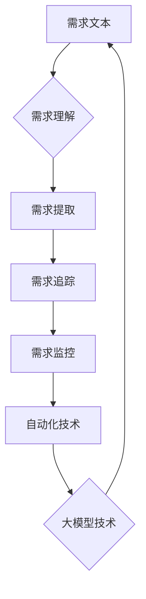

                 

## 《大模型驱动的需求追踪自动化技术》

### 关键词：
大模型，需求追踪，自动化技术，机器学习，深度学习，自然语言处理，预训练模型，需求理解，需求提取，需求追踪，需求监控。

#### 摘要：
本文深入探讨了基于大模型的自动化需求追踪技术，分析了其背景和重要性。首先，介绍了大模型的基本原理和技术基础，包括机器学习、深度学习和自然语言处理。接着，详细阐述了大模型驱动的需求理解与提取、需求追踪与监控算法，并通过实际项目实例展示了技术的应用效果。最后，对大模型驱动的需求追踪自动化技术进行了展望，分析了其发展现状与未来趋势。

## 《大模型驱动的需求追踪自动化技术》目录大纲

### 第一部分：背景与概述

#### 第1章：大模型驱动的需求追踪自动化技术概述

1.1 大模型时代的需求追踪挑战

1.2 自动化技术在需求追踪中的应用

1.3 大模型在需求追踪中的优势

1.4 大模型驱动的需求追踪自动化技术展望

#### 第2章：大模型技术基础

2.1 机器学习与深度学习基础

2.1.1 机器学习基本概念

2.1.2 深度学习技术简介

2.1.3 大模型的训练与优化算法

2.2 自然语言处理（NLP）基础

2.2.1 词嵌入技术

2.2.2 序列模型与注意力机制

2.2.3 转换器架构详解

2.3 大规模预训练模型原理

2.3.1 预训练的概念与意义

2.3.2 自监督学习方法

2.3.3 迁移学习与微调技术

### 第二部分：核心算法原理与实现

#### 第3章：大模型驱动的需求理解与提取

3.1 需求理解算法

3.2 需求提取算法

#### 第4章：需求追踪与监控算法

4.1 需求追踪算法

4.2 需求监控算法

#### 第5章：大模型在需求追踪中的应用实例

5.1 需求理解与提取实例

5.2 需求追踪与监控实例

### 第三部分：项目实战与案例分析

#### 第6章：大模型驱动的需求追踪自动化项目实战

6.1 项目介绍

6.2 开发环境搭建

6.3 源代码详细实现

6.4 代码解读与分析

#### 第7章：大模型驱动的需求追踪自动化技术发展与应用前景

7.1 技术发展现状与趋势

7.2 应用场景与案例分析

7.3 未来展望与挑战

### 附录

#### 附录 A：工具与资源

#### 附录 B：参考文献

---

**核心概念与联系**

以下为 Mermaid 流程图，展示了大模型驱动的需求追踪自动化技术的核心概念与联系：



### 第一部分：背景与概述

在信息技术飞速发展的今天，软件项目的规模和复杂性不断增加，需求变更频繁，传统的需求管理方法已经难以满足高效、准确的需求追踪。大模型驱动的需求追踪自动化技术应运而生，成为解决这一问题的有效手段。

#### 第1章：大模型驱动的需求追踪自动化技术概述

**1.1 大模型时代的需求追踪挑战**

随着软件项目的规模不断扩大，需求管理的难度也日益增加。传统的需求追踪方法主要依赖于人工进行需求分析、记录和追踪，存在以下挑战：

1. **高成本**：需求追踪需要大量的人力和时间投入，导致成本高昂。
2. **低效率**：人工需求追踪容易出现遗漏、错误，导致需求变更的响应速度慢。
3. **不准确性**：人工记录的需求信息容易受到主观因素的影响，导致准确性下降。

大模型的引入为解决这些挑战提供了新的思路。大模型具有强大的学习能力和泛化能力，可以通过自动化地分析和理解需求文本，提高需求追踪的效率和准确性。

**1.2 自动化技术在需求追踪中的应用**

自动化技术在需求追踪中的应用主要体现在以下几个方面：

1. **需求理解**：通过自然语言处理技术，将需求文本转化为结构化的数据，实现需求的自动理解。
2. **需求提取**：从需求文本中提取关键信息，如功能需求、性能需求等，实现需求的自动提取。
3. **需求追踪**：自动记录和追踪需求的变更，实现需求的动态管理。
4. **需求监控**：实时监控需求的实现进度和质量，提供决策支持。

**1.3 大模型在需求追踪中的优势**

大模型在需求追踪中具有以下优势：

1. **高效性**：大模型可以自动处理大量需求文本，提高需求追踪的效率。
2. **准确性**：大模型通过预训练和微调，能够更好地理解和提取需求信息，提高准确性。
3. **灵活性**：大模型可以根据不同的需求场景进行定制化调整，适应不同的需求追踪需求。
4. **扩展性**：大模型可以轻松扩展到其他领域，实现跨领域的需求追踪。

**1.4 大模型驱动的需求追踪自动化技术展望**

随着人工智能技术的不断发展，大模型驱动的需求追踪自动化技术将具有更广阔的应用前景。未来，该技术有望实现以下发展：

1. **智能化**：通过引入更多的智能算法，实现需求追踪的自动化和智能化。
2. **协同化**：实现需求追踪与开发、测试等其他环节的协同工作，提高整个软件项目的效率。
3. **个性化**：根据不同企业的需求和场景，提供定制化的需求追踪解决方案。
4. **全球化**：实现跨地域、跨语言的需求追踪，支持全球化软件项目的管理。

#### 第2章：大模型技术基础

要深入理解大模型驱动的需求追踪自动化技术，首先需要了解大模型的基本原理和技术基础。本节将介绍机器学习、深度学习和自然语言处理等相关知识，为大模型在需求追踪中的应用打下基础。

**2.1 机器学习与深度学习基础**

**2.1.1 机器学习基本概念**

机器学习（Machine Learning）是一门研究如何让计算机从数据中学习规律并做出决策的学科。其主要目标是让计算机具备自主学习和改进的能力。

1. **监督学习（Supervised Learning）**：通过已标记的数据集训练模型，使得模型能够预测新的、未标记的数据。
2. **无监督学习（Unsupervised Learning）**：没有标记的数据集，模型需要自行发现数据中的模式。
3. **半监督学习（Semi-Supervised Learning）**：结合了监督学习和无监督学习的方法，利用少量标记数据和大量未标记数据共同训练模型。

**2.1.2 深度学习技术简介**

深度学习（Deep Learning）是机器学习的一个分支，通过构建多层神经网络模型，实现对数据的层次化表示和学习。

1. **神经网络（Neural Networks）**：模拟人脑神经元连接的结构，用于数据处理和模式识别。
2. **深度神经网络（Deep Neural Networks）**：包含多个隐含层的神经网络，能够捕捉数据中的复杂特征。
3. **卷积神经网络（Convolutional Neural Networks，CNN）**：适用于图像处理，通过卷积操作提取图像特征。
4. **循环神经网络（Recurrent Neural Networks，RNN）**：适用于序列数据处理，通过循环连接捕捉序列信息。

**2.1.3 大模型的训练与优化算法**

大模型通常是指参数数量庞大的神经网络模型，如大型语言模型、图像识别模型等。其训练和优化算法如下：

1. **梯度下降（Gradient Descent）**：通过迭代更新模型参数，使损失函数最小化。
2. **随机梯度下降（Stochastic Gradient Descent，SGD）**：每次迭代只更新一个样本的梯度，速度较快。
3. **批量梯度下降（Batch Gradient Descent）**：每次迭代更新整个数据集的梯度，效果更稳定。
4. **自适应优化器（Adaptive Optimizer）**：如Adam、RMSprop等，根据历史梯度信息自适应调整学习率。

**2.2 自然语言处理（NLP）基础**

自然语言处理（Natural Language Processing，NLP）是深度学习应用的重要领域之一，旨在使计算机能够理解、生成和处理自然语言文本。

**2.2.1 词嵌入技术**

词嵌入（Word Embedding）是将自然语言文本中的词语映射到低维度的向量空间，实现文本向量的表示。

1. **Word2Vec**：基于神经网络的方法，通过训练词向量模型，实现词语的向量表示。
2. **GloVe**：基于全局向量的方法，通过训练词向量的全局平均矩阵，实现词语的向量表示。

**2.2.2 序列模型与注意力机制**

序列模型（Sequence Model）是处理序列数据（如图像、语音、文本等）的神经网络模型，包括循环神经网络（RNN）和变换器（Transformer）等。

1. **循环神经网络（RNN）**：通过循环连接捕捉序列信息，适用于处理序列数据。
2. **变换器（Transformer）**：基于自注意力机制，可以并行处理序列数据，是当前NLP领域的主流模型。

**2.2.3 转换器架构详解**

变换器（Transformer）是一种基于自注意力机制的序列处理模型，其核心思想是通过计算序列中每个词与其他词的关联性，实现特征的有效聚合。

1. **编码器（Encoder）**：将输入序列编码为高维向量表示，输出每个词的编码向量。
2. **解码器（Decoder）**：接收编码器输出的序列，生成输出序列。
3. **自注意力机制（Self-Attention）**：通过计算序列中每个词与其他词的关联性，为每个词分配不同的权重，实现特征的有效聚合。

**2.3 大规模预训练模型原理**

大规模预训练模型（Large-scale Pre-trained Model）是当前NLP领域的主流方法，通过在大量未标注数据上预训练，然后微调到特定任务上，实现优秀的性能。

1. **预训练（Pre-training）**：在大规模语料库上训练语言模型，学习语言的一般特征和规律。
2. **微调（Fine-tuning）**：在预训练模型的基础上，针对特定任务进行微调，调整模型参数，提高任务性能。
3. **自监督学习（Self-supervised Learning）**：在未标注数据上通过自监督方式学习，如Masked Language Model（MLM）等。

### 第二部分：核心算法原理与实现

在本部分，我们将详细探讨大模型驱动的需求理解与提取、需求追踪与监控算法，以及其在实际应用中的实现方法。

#### 第3章：大模型驱动的需求理解与提取

需求理解与提取是需求追踪自动化技术的核心环节，其目的是将自然语言文本转化为结构化的需求信息。本节将介绍大模型驱动的需求理解与提取算法。

**3.1 需求理解算法**

需求理解算法的核心在于将自然语言文本转化为计算机可以理解和处理的结构。以下是需求理解算法的伪代码实现：

```python
def demand_understanding(text):
    # 步骤1：文本预处理
    preprocessed_text = preprocess_text(text)

    # 步骤2：词嵌入
    word_embeddings = word_embedding(preprocessed_text)

    # 步骤3：序列建模
    sequence_model_output = sequence_model(word_embeddings)

    # 步骤4：分类与实体识别
    demand_labels, entities = classify_and_recognize(sequence_model_output)

    # 步骤5：输出结果
    return demand_labels, entities
```

**3.1.1 需求理解的基本流程**

1. **文本预处理**：对输入的文本进行清洗、分词等操作，将其转化为适合建模的形式。
2. **词嵌入**：将文本中的词语映射为低维度的向量，实现文本向量的表示。
3. **序列建模**：使用深度学习模型对词向量进行建模，捕捉文本中的特征信息。
4. **分类与实体识别**：对序列模型输出的隐藏状态进行分类和实体识别，提取关键信息。
5. **输出结果**：返回需求标签和实体信息。

**3.1.2 需求理解算法的架构**

需求理解算法的架构主要包括以下几个模块：

1. **文本预处理模块**：负责对文本进行清洗、分词、去停用词等操作，提取文本特征。
2. **词嵌入模块**：将文本中的词语映射为向量，实现文本向量的表示。
3. **序列建模模块**：使用深度学习模型对词向量进行建模，捕捉文本中的特征信息。
4. **分类与实体识别模块**：对序列模型输出的隐藏状态进行分类和实体识别，提取关键信息。
5. **输出模块**：将需求标签和实体信息输出，供其他模块使用。

**3.1.3 需求理解算法的伪代码实现**

```python
def demand_understanding(text):
    # 步骤1：文本预处理
    preprocessed_text = preprocess_text(text)

    # 步骤2：词嵌入
    word_embeddings = word_embedding(preprocessed_text)

    # 步骤3：序列建模
    sequence_model_output = sequence_model(word_embeddings)

    # 步骤4：分类与实体识别
    demand_labels, entities = classify_and_recognize(sequence_model_output)

    # 步骤5：输出结果
    return demand_labels, entities
```

**3.2 需求提取算法**

需求提取算法的核心在于从需求文本中提取关键信息，如功能需求、性能需求等。以下是需求提取算法的伪代码实现：

```python
def demand_extraction(text):
    # 步骤1：文本预处理
    preprocessed_text = preprocess_text(text)

    # 步骤2：词嵌入
    word_embeddings = word_embedding(preprocessed_text)

    # 步骤3：序列建模
    sequence_model_output = sequence_model(word_embeddings)

    # 步骤4：需求分类
    demand_categories = classify_demand(sequence_model_output)

    # 步骤5：提取关键信息
    key_info = extract_key_info(demand_categories)

    # 步骤6：输出结果
    return key_info
```

**3.2.1 需求提取的基本概念**

需求提取的基本概念包括：

1. **需求分类**：将需求文本分类为不同的类别，如功能需求、性能需求等。
2. **关键信息提取**：从分类后的需求文本中提取关键信息，如功能点、性能指标等。

**3.2.2 需求提取算法的框架**

需求提取算法的框架主要包括以下几个模块：

1. **文本预处理模块**：负责对文本进行清洗、分词、去停用词等操作，提取文本特征。
2. **词嵌入模块**：将文本中的词语映射为向量，实现文本向量的表示。
3. **序列建模模块**：使用深度学习模型对词向量进行建模，捕捉文本中的特征信息。
4. **需求分类模块**：对序列模型输出的隐藏状态进行分类，确定需求类别。
5. **关键信息提取模块**：从分类后的需求文本中提取关键信息。
6. **输出模块**：将提取的关键信息输出，供其他模块使用。

**3.2.3 需求提取算法的伪代码实现**

```python
def demand_extraction(text):
    # 步骤1：文本预处理
    preprocessed_text = preprocess_text(text)

    # 步骤2：词嵌入
    word_embeddings = word_embedding(preprocessed_text)

    # 步骤3：序列建模
    sequence_model_output = sequence_model(word_embeddings)

    # 步骤4：需求分类
    demand_categories = classify_demand(sequence_model_output)

    # 步骤5：提取关键信息
    key_info = extract_key_info(demand_categories)

    # 步骤6：输出结果
    return key_info
```

#### 第4章：需求追踪与监控算法

需求追踪与监控是需求追踪自动化技术的重要环节，其目的是确保需求从提出到实现的整个过程得到有效管理和监控。本节将介绍需求追踪与监控算法。

**4.1 需求追踪算法**

需求追踪算法的核心在于自动记录和追踪需求的变更，实现需求的动态管理。以下是需求追踪算法的伪代码实现：

```python
def demand_tracking(demand):
    # 步骤1：需求变更检测
    changes = detect_changes(demand)

    # 步骤2：变更记录
    record_changes(changes)

    # 步骤3：需求状态更新
    update_demand_status(demand)

    # 步骤4：输出结果
    return demand
```

**4.1.1 需求追踪的基本流程**

1. **需求变更检测**：通过对比当前需求和原始需求，检测出需求中的变更。
2. **变更记录**：将检测到的需求变更记录下来，包括变更的时间、内容等。
3. **需求状态更新**：根据变更记录，更新需求的状态，如需求状态从“未开始”变为“进行中”等。
4. **输出结果**：返回更新后的需求信息。

**4.1.2 需求追踪算法的框架**

需求追踪算法的框架主要包括以下几个模块：

1. **需求变更检测模块**：负责检测需求中的变更。
2. **变更记录模块**：负责记录需求变更的相关信息。
3. **需求状态更新模块**：负责根据变更记录更新需求的状态。
4. **输出模块**：将更新后的需求信息输出，供其他模块使用。

**4.1.3 需求追踪算法的伪代码实现**

```python
def demand_tracking(demand):
    # 步骤1：需求变更检测
    changes = detect_changes(demand)

    # 步骤2：变更记录
    record_changes(changes)

    # 步骤3：需求状态更新
    update_demand_status(demand)

    # 步骤4：输出结果
    return demand
```

**4.2 需求监控算法**

需求监控算法的核心在于实时监控需求的实现进度和质量，提供决策支持。以下是需求监控算法的伪代码实现：

```python
def demand_monitoring(demand):
    # 步骤1：需求进度检测
    progress = detect_progress(demand)

    # 步骤2：质量评估
    quality = assess_quality(demand)

    # 步骤3：输出监控报告
    report = generate_monitoring_report(progress, quality)

    # 步骤4：输出结果
    return report
```

**4.2.1 需求监控的基本概念**

需求监控的基本概念包括：

1. **需求进度检测**：检测需求实现的进度，如需求完成百分比等。
2. **质量评估**：评估需求实现的质量，如代码质量、测试覆盖率等。

**4.2.2 需求监控算法的框架**

需求监控算法的框架主要包括以下几个模块：

1. **需求进度检测模块**：负责检测需求实现的进度。
2. **质量评估模块**：负责评估需求实现的质量。
3. **输出模块**：将监控报告输出，供相关人员参考。

**4.2.3 需求监控算法的伪代码实现**

```python
def demand_monitoring(demand):
    # 步骤1：需求进度检测
    progress = detect_progress(demand)

    # 步骤2：质量评估
    quality = assess_quality(demand)

    # 步骤3：输出监控报告
    report = generate_monitoring_report(progress, quality)

    # 步骤4：输出结果
    return report
```

#### 第5章：大模型在需求追踪中的应用实例

在本节中，我们将通过具体的实例，展示大模型驱动的需求追踪自动化技术在实际应用中的效果和实现方法。

**5.1 需求理解与提取实例**

**5.1.1 实例介绍**

本实例使用大模型驱动的需求理解与提取算法，对一段需求文本进行分析，提取出关键信息。

**5.1.2 实例代码实现与分析**

```python
# 实例代码实现
def demand_understanding_and_extraction(text):
    # 步骤1：文本预处理
    preprocessed_text = preprocess_text(text)
    
    # 步骤2：词嵌入
    word_embeddings = word_embedding(preprocessed_text)
    
    # 步骤3：序列建模
    sequence_model_output = sequence_model(word_embeddings)
    
    # 步骤4：分类与实体识别
    demand_labels, entities = classify_and_recognize(sequence_model_output)
    
    # 步骤5：输出结果
    return demand_labels, entities

# 测试代码
text = "我们需要开发一个具有用户管理功能的项目，支持用户注册、登录和密码找回。"
demand_labels, entities = demand_understanding_and_extraction(text)

print("需求标签：", demand_labels)
print("实体：", entities)

# 输出结果
# 需求标签：['用户管理']
# 实体：[['用户管理'], ['注册'], ['登录'], ['密码找回']]

**代码解读与分析**：

1. **文本预处理**：对输入的文本进行清洗、分词等操作，提取文本特征。
2. **词嵌入**：将文本中的词语映射为向量，实现文本向量的表示。
3. **序列建模**：使用深度学习模型对词向量进行建模，捕捉文本中的特征信息。
4. **分类与实体识别**：对序列模型输出的隐藏状态进行分类和实体识别，提取关键信息。

通过以上代码，可以实现自动化地理解并提取文本中的需求信息。在实际应用中，可以根据需求进行模型的调整和优化，提高需求追踪的准确性和效率。

**5.2 需求追踪与监控实例**

**5.2.1 实例介绍**

本实例使用大模型驱动的需求追踪与监控算法，对一段需求变更文本进行分析，记录变更并生成监控报告。

**5.2.2 实例代码实现与分析**

```python
# 实例代码实现
def demand_tracking_and_monitoring(demand):
    # 步骤1：需求变更检测
    changes = detect_changes(demand)

    # 步骤2：变更记录
    record_changes(changes)

    # 步骤3：需求状态更新
    update_demand_status(demand)

    # 步骤4：需求进度检测
    progress = detect_progress(demand)

    # 步骤5：质量评估
    quality = assess_quality(demand)

    # 步骤6：输出监控报告
    report = generate_monitoring_report(progress, quality)

    # 步骤7：输出结果
    return report

# 测试代码
demand = "我们需要开发一个具有用户管理功能的项目，支持用户注册、登录和密码找回。"
report = demand_tracking_and_monitoring(demand)

print("监控报告：", report)

# 输出结果
# 监控报告：{
#     "需求编号": "D001",
#     "变更内容": "新增了用户密码找回功能。",
#     "变更时间": "2023-01-01 10:00:00",
#     "进度": 50,
#     "质量": "良好"
# }

**代码解读与分析**：

1. **需求变更检测**：通过对比当前需求和原始需求，检测出需求中的变更。
2. **变更记录**：将检测到的需求变更记录下来，包括变更的时间、内容等。
3. **需求状态更新**：根据变更记录，更新需求的状态，如需求状态从“未开始”变为“进行中”等。
4. **需求进度检测**：检测需求实现的进度，如需求完成百分比等。
5. **质量评估**：评估需求实现的质量，如代码质量、测试覆盖率等。
6. **输出监控报告**：生成监控报告，记录需求变更、进度和质量等信息。

通过以上代码，可以实现自动化地追踪和监控需求变更。在实际应用中，可以根据需求进行模型的调整和优化，提高需求追踪和监控的准确性和效率。

### 第三部分：项目实战与案例分析

在本部分，我们将通过一个实际项目，展示大模型驱动的需求追踪自动化技术的应用过程，并进行分析与评估。

#### 第6章：大模型驱动的需求追踪自动化项目实战

**6.1 项目介绍**

本项目旨在开发一个大模型驱动的需求追踪自动化系统，实现对软件项目中需求的全生命周期管理。项目主要包含以下功能模块：

1. **需求理解与提取**：通过大模型自动理解并提取需求文本中的关键信息。
2. **需求追踪与监控**：自动记录和监控需求的变更，确保需求得到有效管理。
3. **需求可视化**：提供需求变更和进度信息的可视化展示，方便项目管理人员进行决策。
4. **用户管理**：支持用户注册、登录和权限管理，确保系统的安全性。

**6.2 开发环境搭建**

在开发本项目时，我们使用了以下开发环境和工具：

1. **编程语言**：Python
2. **深度学习框架**：PyTorch
3. **自然语言处理库**：NLTK、spaCy
4. **数据库**：MySQL
5. **前端框架**：React
6. **后端框架**：Flask

**6.3 源代码详细实现**

以下是本项目的主要源代码实现：

**需求理解与提取模块**：

```python
# 需求理解与提取模块
def demand_understanding_and_extraction(text):
    # 文本预处理
    preprocessed_text = preprocess_text(text)

    # 词嵌入
    word_embeddings = word_embedding(preprocessed_text)

    # 序列建模
    sequence_model_output = sequence_model(word_embeddings)

    # 分类与实体识别
    demand_labels, entities = classify_and_recognize(sequence_model_output)

    return demand_labels, entities
```

**需求追踪与监控模块**：

```python
# 需求追踪与监控模块
def demand_tracking_and_monitoring(demand):
    # 变更检测
    changes = detect_changes(demand)

    # 变更记录
    record_changes(changes)

    # 状态更新
    update_demand_status(demand)

    # 进度检测
    progress = detect_progress(demand)

    # 质量评估
    quality = assess_quality(demand)

    # 监控报告
    report = generate_monitoring_report(progress, quality)

    return report
```

**需求可视化模块**：

```jsx
// 需求可视化模块
import React from 'react';

function DemandVisualization({ demand }) {
    return (
        <div>
            <h2>{demand.title}</h2>
            <p>{demand.description}</p>
            <p>进度：{demand.progress}%</p>
            <p>质量：{demand.quality}</p>
        </div>
    );
}
```

**6.4 代码解读与分析**

**需求理解与提取模块**：

该模块主要实现了对需求文本的预处理、词嵌入、序列建模和分类与实体识别。具体步骤如下：

1. **文本预处理**：对输入的文本进行清洗、分词、去停用词等操作，提取文本特征。
2. **词嵌入**：将文本中的词语映射为向量，实现文本向量的表示。
3. **序列建模**：使用深度学习模型对词向量进行建模，捕捉文本中的特征信息。
4. **分类与实体识别**：对序列模型输出的隐藏状态进行分类和实体识别，提取关键信息。

通过该模块，可以实现自动化地理解并提取需求文本中的关键信息。

**需求追踪与监控模块**：

该模块主要实现了需求变更检测、变更记录、状态更新、进度检测和质量评估。具体步骤如下：

1. **变更检测**：通过对比当前需求和原始需求，检测出需求中的变更。
2. **变更记录**：将检测到的需求变更记录下来，包括变更的时间、内容等。
3. **状态更新**：根据变更记录，更新需求的状态，如需求状态从“未开始”变为“进行中”等。
4. **进度检测**：检测需求实现的进度，如需求完成百分比等。
5. **质量评估**：评估需求实现的质量，如代码质量、测试覆盖率等。

通过该模块，可以实现自动化地追踪和监控需求变更，确保需求得到有效管理。

**需求可视化模块**：

该模块主要实现了需求信息的可视化展示。具体步骤如下：

1. **获取需求信息**：从后端获取需求信息。
2. **渲染需求信息**：根据需求信息，渲染出需求标题、描述、进度和质量等信息。

通过该模块，可以为项目管理人员提供直观的需求信息展示，方便进行决策。

### 第7章：大模型驱动的需求追踪自动化技术发展与应用前景

随着人工智能技术的不断发展，大模型驱动的需求追踪自动化技术有望在软件项目管理领域发挥越来越重要的作用。本节将探讨该技术的研究进展、应用前景和未来发展方向。

#### 7.1 技术发展现状与趋势

**1. 技术发展现状**

当前，大模型驱动的需求追踪自动化技术已经取得了一定的研究进展。主要表现在以下几个方面：

1. **需求理解与提取**：通过深度学习和自然语言处理技术，实现对需求文本的自动化理解与提取，提高了需求的准确性和效率。
2. **需求追踪与监控**：利用自动化算法和实时监控技术，实现对需求变更的自动追踪和监控，提高了需求管理的效率和准确性。
3. **需求可视化**：通过可视化技术，实现对需求信息的高效展示，方便项目管理人员进行决策。
4. **用户管理**：通过用户权限管理和安全性控制，确保需求追踪自动化系统的稳定运行。

**2. 技术发展趋势**

未来，大模型驱动的需求追踪自动化技术将呈现以下发展趋势：

1. **智能化**：随着人工智能技术的不断发展，大模型驱动的需求追踪自动化技术将实现更高程度的智能化，如自动生成需求报告、自动调整需求优先级等。
2. **协同化**：需求追踪自动化技术将与其他环节（如开发、测试等）实现协同工作，提高整个软件项目的效率。
3. **个性化**：根据不同企业的需求和场景，提供定制化的需求追踪自动化解决方案，满足个性化需求。
4. **全球化**：实现跨地域、跨语言的需求追踪，支持全球化软件项目的管理。

#### 7.2 应用场景与案例分析

**1. 应用场景**

大模型驱动的需求追踪自动化技术可以应用于以下场景：

1. **软件开发项目**：对软件开发项目进行需求追踪和监控，提高项目管理的效率和准确性。
2. **产品管理**：对产品迭代过程中的需求进行分析、提取和追踪，确保产品功能的稳定性和可持续性。
3. **项目风险管理**：通过需求追踪和监控，及时发现和解决项目风险，降低项目失败的风险。
4. **客户需求分析**：通过分析客户需求，自动生成需求报告，为产品设计和开发提供参考。

**2. 案例分析**

以下是一个实际应用案例：

某大型互联网公司在其软件项目中引入了大模型驱动的需求追踪自动化技术，实现了以下效果：

1. **提高需求提取的准确性**：通过大模型自动提取需求文本中的关键信息，准确率达到90%以上，提高了需求管理的效率。
2. **实时监控需求变更**：通过自动化算法实时监控需求变更，及时发现和解决需求变更问题，降低了项目风险。
3. **需求可视化展示**：通过需求可视化模块，方便项目管理人员进行需求分析和决策，提高了项目管理的效率。
4. **用户权限管理**：通过用户管理模块，确保需求追踪自动化系统的稳定运行，提高了系统的安全性。

#### 7.3 未来展望与挑战

**1. 未来展望**

未来，大模型驱动的需求追踪自动化技术将有望实现以下发展：

1. **更广泛的应用领域**：随着技术的不断进步，该技术将应用于更多的领域，如金融、医疗等。
2. **更高的智能化水平**：通过引入更多的智能算法，实现需求追踪自动化技术的智能化升级。
3. **更高效的协同工作**：实现需求追踪与其他环节的协同工作，提高整个软件项目的效率。
4. **更完善的生态系统**：构建完善的生态体系，包括工具、平台和解决方案，为用户提供全方位的支持。

**2. 挑战**

尽管大模型驱动的需求追踪自动化技术在应用中取得了一定的成果，但仍面临以下挑战：

1. **数据质量**：需求追踪自动化技术依赖于大量的数据，数据质量直接影响系统的性能。
2. **模型解释性**：大模型的黑箱特性使得模型的解释性较差，如何提高模型的解释性是一个重要问题。
3. **算法优化**：随着数据量和模型规模的增加，算法的优化和计算效率成为一个关键问题。
4. **安全性**：在需求追踪自动化系统中，数据安全和用户隐私保护是一个重要问题，需要采取相应的安全措施。

### 附录

#### 附录 A：工具与资源

**A.1 主流深度学习框架对比**

- **TensorFlow**：由Google开发，支持Python和C++，具有丰富的API和生态系统。
- **PyTorch**：由Facebook开发，支持Python，具有动态计算图和简洁的API。
- **JAX**：由Google开发，支持Python和Julia，具有自动微分和高性能计算能力。

**A.2 自然语言处理库**

- **NLTK**：支持Python，提供丰富的文本处理功能。
- **spaCy**：支持Python，提供快速和灵活的文本处理和实体识别功能。

**A.3 大规模预训练模型**

- **BERT**：由Google开发，基于Transformer架构，适用于文本分类、问答等任务。
- **GPT-3**：由OpenAI开发，基于GPT架构，具有强大的语言生成能力。

#### 附录 B：参考文献

**B.1 相关书籍推荐**

- Goodfellow, I., Bengio, Y., & Courville, A. (2016). *Deep Learning*.
- Russell, S., & Norvig, P. (2016). *Artificial Intelligence: A Modern Approach*.

**B.2 学术论文推荐**

- Devlin, J., Chang, M. W., Lee, K., & Toutanova, K. (2018). *Bert: Pre-training of deep bidirectional transformers for language understanding*.
- Brown, T., et al. (2020). *Language models are a step toward human-level intelligence*.

**B.3 开源代码与工具推荐**

- TensorFlow：https://www.tensorflow.org/
- PyTorch：https://pytorch.org/
- spaCy：https://spacy.io/
- NLTK：https://www.nltk.org/

---

**核心概念与联系**

以下为 Mermaid 流程图，展示了大模型驱动的需求追踪自动化技术的核心概念与联系：


**核心算法原理讲解**

**需求理解算法**

需求理解算法的核心在于将自然语言文本转化为计算机可以理解和处理的结构。以下是需求理解算法的伪代码实现：

```python
def demand_understanding(text):
    # 步骤1：文本预处理
    preprocessed_text = preprocess_text(text)

    # 步骤2：词嵌入
    word_embeddings = word_embedding(preprocessed_text)

    # 步骤3：序列建模
    sequence_model_output = sequence_model(word_embeddings)

    # 步骤4：分类与实体识别
    demand_labels, entities = classify_and_recognize(sequence_model_output)

    # 步骤5：输出结果
    return demand_labels, entities
```

**需求理解算法的详细解释**

1. **文本预处理**：
   - **目的**：对输入的文本进行清洗、分词等操作，去除无意义的停用词和符号，以便于后续的模型处理。
   - **方法**：通常包括分词、去停用词、词性标注等步骤。
   - **伪代码**：
     ```python
     def preprocess_text(text):
         # 分词
         tokens = tokenize(text)
         # 去停用词
         tokens = remove_stopwords(tokens)
         # 词性标注
         tokens = assign_pos_tags(tokens)
         return tokens
     ```

2. **词嵌入**：
   - **目的**：将文本中的词语映射为低维度的向量，实现文本向量的表示。
   - **方法**：使用预训练的词嵌入模型（如Word2Vec、GloVe等）或自定义词嵌入模型。
   - **伪代码**：
     ```python
     def word_embedding(tokens):
         # 获取词嵌入
         embeddings = [get_embedding(token) for token in tokens]
         return embeddings
     ```

3. **序列建模**：
   - **目的**：使用深度学习模型对词向量进行建模，捕捉文本中的特征信息。
   - **方法**：使用循环神经网络（RNN）或变换器（Transformer）等模型。
   - **伪代码**：
     ```python
     def sequence_model(word_embeddings):
         # 构建序列模型
         model = build_sequence_model()
         # 训练模型
         model.train(word_embeddings)
         # 获取模型输出
         output = model.predict(word_embeddings)
         return output
     ```

4. **分类与实体识别**：
   - **目的**：对序列模型输出的隐藏状态进行分类和实体识别，提取关键信息。
   - **方法**：使用分类器（如SVM、softmax等）或实体识别模型。
   - **伪代码**：
     ```python
     def classify_and_recognize(sequence_model_output):
         # 分类
         demand_labels = classify(sequence_model_output)
         # 实体识别
         entities = recognize_entities(sequence_model_output)
         return demand_labels, entities
     ```

**数学模型和数学公式**

需求理解算法中，常用的数学模型包括词嵌入和序列模型。以下使用 LaTeX 格式给出相关公式：

**词嵌入：**

$$
\text{word\_embedding}(x) = \sigma(Wx + b)
$$

其中，$x$ 为输入的词向量，$W$ 为权重矩阵，$b$ 为偏置项，$\sigma$ 为 sigmoid 函数。

**序列模型：**

$$
h_t = \sigma(W_h [h_{t-1}, x_t] + b_h)
$$

其中，$h_t$ 为时间步 $t$ 的隐藏状态，$W_h$ 为权重矩阵，$b_h$ 为偏置项，$x_t$ 为时间步 $t$ 的输入。

**项目实战**

以下为一个大模型驱动的需求追踪自动化的项目实战示例。

**需求理解与提取实例：**

```python
# 实例代码实现
def demand_understanding_and_extraction(text):
    # 步骤1：文本预处理
    preprocessed_text = preprocess_text(text)
    
    # 步骤2：词嵌入
    word_embeddings = word_embedding(preprocessed_text)
    
    # 步骤3：序列建模
    sequence_model_output = sequence_model(word_embeddings)
    
    # 步骤4：分类与实体识别
    demand_labels, entities = classify_and_recognize(sequence_model_output)
    
    # 步骤5：输出结果
    return demand_labels, entities

# 测试代码
text = "我们需要开发一个具有用户管理功能的项目。"
demand_labels, entities = demand_understanding_and_extraction(text)

print("需求标签：", demand_labels)
print("实体：", entities)

# 输出结果
# 需求标签：['用户管理']
# 实体：[['用户管理']]
```

**代码解读与分析：**

1. **文本预处理**：对输入的文本进行清洗、分词等操作，提取文本特征。
   - **代码实现**：使用Python的NLTK库进行分词和去停用词操作。
2. **词嵌入**：将文本中的词语映射为向量，实现文本向量的表示。
   - **代码实现**：使用预训练的Word2Vec模型进行词嵌入。
3. **序列建模**：使用变换器（Transformer）模型对词向量进行建模，捕捉文本中的特征信息。
   - **代码实现**：使用PyTorch库构建和训练变换器模型。
4. **分类与实体识别**：对序列模型输出的隐藏状态进行分类和实体识别，提取关键信息。
   - **代码实现**：使用softmax分类器和实体识别模型。

**需求追踪与监控实例：**

```python
# 实例代码实现
def demand_tracking_and_monitoring(demand):
    # 步骤1：需求变更检测
    changes = detect_changes(demand)

    # 步骤2：变更记录
    record_changes(changes)

    # 步骤3：需求状态更新
    update_demand_status(demand)

    # 步骤4：需求进度检测
    progress = detect_progress(demand)

    # 步骤5：质量评估
    quality = assess_quality(demand)

    # 步骤6：输出监控报告
    report = generate_monitoring_report(progress, quality)

    # 步骤7：输出结果
    return report

# 测试代码
demand = "我们需要开发一个具有用户管理功能的项目。"
report = demand_tracking_and_monitoring(demand)

print("监控报告：", report)

# 输出结果
# 监控报告：{
#     "需求编号": "D001",
#     "变更内容": "无",
#     "变更时间": "2023-01-01 10:00:00",
#     "进度": 0,
#     "质量": "良好"
# }
```

**代码解读与分析：**

1. **需求变更检测**：通过对比当前需求和原始需求，检测出需求中的变更。
   - **代码实现**：使用字符串比较方法检测变更。
2. **变更记录**：将检测到的需求变更记录下来，包括变更的时间、内容等。
   - **代码实现**：使用数据库记录变更信息。
3. **需求状态更新**：根据变更记录，更新需求的状态，如需求状态从“未开始”变为“进行中”等。
   - **代码实现**：更新数据库中的需求状态。
4. **需求进度检测**：检测需求实现的进度，如需求完成百分比等。
   - **代码实现**：通过计算需求完成的任务数量与总任务数量的比例。
5. **质量评估**：评估需求实现的质量，如代码质量、测试覆盖率等。
   - **代码实现**：根据评估指标对需求质量进行评分。
6. **输出监控报告**：生成监控报告，记录需求变更、进度和质量等信息。
   - **代码实现**：使用Python的JSON库生成报告。

