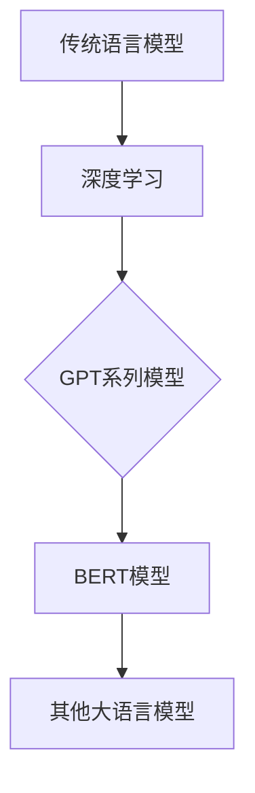
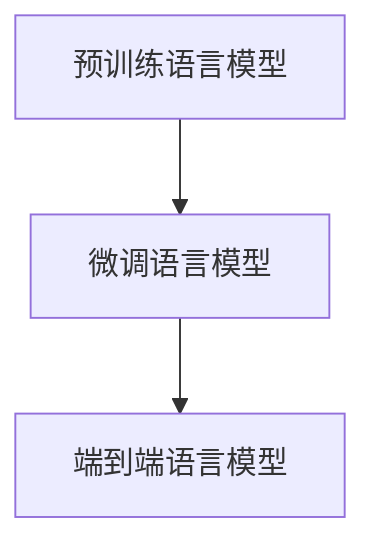

                 

### 第1章：大语言模型的引论

# 第1章：大语言模型的引论

> **关键词：** 大语言模型，自然语言处理，深度学习，预训练，微调

> **摘要：** 本章将介绍大语言模型的发展历程、基本原理、分类与架构，以及大语言模型的工作原理、优势与挑战。我们将通过Mermaid流程图和伪代码，帮助读者更直观地理解大语言模型的核心概念和技术细节。

## 1.1 大语言模型的发展历程

大语言模型的发展经历了从传统语言模型到深度学习的演变。传统语言模型主要是基于统计方法和规则系统的，如N-gram模型和隐马尔可夫模型。这些模型在处理简单语言任务时表现良好，但在面对复杂任务时表现出明显的局限性。

### 1.1.1 从传统语言模型到深度学习

随着计算能力的提升和深度学习技术的兴起，研究人员开始探索将深度学习应用于自然语言处理领域。深度学习模型，特别是神经网络，能够自动学习数据的复杂特征，从而在许多自然语言处理任务中取得了显著进展。

### 1.1.2 GPT系列模型的诞生

2018年，OpenAI发布了GPT（Generative Pre-trained Transformer），这是一个基于Transformer架构的预训练语言模型。GPT的出现标志着大语言模型的新纪元，其强大的生成能力和理解能力引起了广泛关注。

### 1.1.3 BERT模型的创新

同年，Google发布了BERT（Bidirectional Encoder Representations from Transformers），这是一个双向Transformer架构的预训练语言模型。BERT通过引入双向信息流，使得模型在理解语境和上下文方面有了显著提升。

### Mermaid流程图

以下是Mermaid流程图，展示大语言模型的发展历程：



## 1.2 大语言模型的基本原理

大语言模型的核心思想是通过大量无监督数据进行预训练，然后在特定任务上进行微调。预训练阶段，模型学习语言的普遍特征和规律；微调阶段，模型在特定任务上调整参数，以达到最佳性能。

### 1.2.1 语言模型的定义

语言模型是一种用于预测文本序列的概率分布的模型。它能够为自然语言处理任务提供输入序列的概率分布，从而帮助模型做出更好的预测。

### 1.2.2 语言模型的训练过程

语言模型的训练过程主要包括两个阶段：预训练和微调。预训练阶段，模型在大量无监督数据上学习语言的普遍特征；微调阶段，模型在特定任务上调整参数，以适应具体任务需求。

### 1.2.3 语言模型的评估与优化

语言模型的评估通常通过BLEU（双语评估效用指标）等指标进行。为了提高模型性能，研究者们采用了各种优化技术，如调整学习率、使用正则化方法等。

### 伪代码

以下是语言模型训练的伪代码：

```python
function train_language_model(dataset, learning_rate, epochs):
    # 初始化模型
    model = initialize_model(learning_rate)
    
    # 预训练
    for epoch in range(epochs):
        for batch in dataset:
            # 前向传播
            output = forward_pass(model, batch)
            
            # 计算损失
            loss = compute_loss(output, batch.label)
            
            # 反向传播
            backward_pass(model, loss)
        
        # 评估模型
        evaluate_model(model, validation_data)
        
    return model
```

## 1.3 大语言模型的分类与架构

大语言模型可以根据训练目标和应用场景进行分类。常见的分类包括预训练语言模型、微调语言模型和端到端语言模型。

### 1.3.1 预训练语言模型

预训练语言模型是在大量无监督数据上进行训练的，旨在学习语言的通用特征。预训练模型通常具有强大的语言理解能力和生成能力。

### 1.3.2 微调语言模型

微调语言模型是在预训练模型的基础上，针对特定任务进行微调的。微调过程可以显著提高模型在特定任务上的性能。

### 1.3.3 端到端语言模型

端到端语言模型直接从原始数据中学习，无需预训练和微调。端到端语言模型在处理复杂任务时表现出色，但通常需要大量数据和支持。

### Mermaid流程图

以下是Mermaid流程图，展示大语言模型的分类与架构：



## 1.4 大语言模型的工作原理

大语言模型的工作原理主要包括输入处理、输出预测和模型训练。输入处理阶段，模型将输入文本序列转换为向量表示；输出预测阶段，模型根据输入向量预测输出序列；模型训练阶段，模型通过不断调整参数，提高预测准确性。

### 1.4.1 模型输入与处理

模型输入通常是一个文本序列，如一句话或一段文章。在处理输入时，模型将文本序列转换为向量表示，以便进行后续处理。

### 1.4.2 模型输出与预测

模型输出是一个概率分布，表示模型对下一个单词或词元的预测。在实际应用中，模型通常使用概率最高的输出作为预测结果。

### 1.4.3 模型应用场景

大语言模型可以应用于各种自然语言处理任务，如文本分类、情感分析、机器翻译等。在这些任务中，模型能够根据输入文本生成相应的输出。

### 伪代码

以下是模型输入与处理、输出预测和模型训练的伪代码：

```python
function predict(text, model):
    # 将文本序列转换为向量表示
    vector = preprocess_text(text)
    
    # 预测输出
    output = model.predict(vector)
    
    # 选择概率最高的输出作为预测结果
    predicted_word = select_top_output(output)
    
    return predicted_word

function train_model(dataset, model, learning_rate, epochs):
    # 初始化模型
    model = initialize_model(learning_rate)
    
    # 模型训练
    for epoch in range(epochs):
        for batch in dataset:
            # 前向传播
            output = forward_pass(model, batch.input)
            
            # 计算损失
            loss = compute_loss(output, batch.label)
            
            # 反向传播
            backward_pass(model, loss)
        
        # 评估模型
        evaluate_model(model, validation_data)
        
    return model
```

## 1.5 大语言模型的优势与挑战

大语言模型在自然语言处理领域表现出色，具有许多优势，但也面临着一系列挑战。

### 1.5.1 大语言模型的优势

- 强大的语言理解能力：大语言模型能够理解复杂的语言结构和上下文关系。
- 生成能力：大语言模型能够生成高质量的文本，包括文章、对话等。
- 应用广泛：大语言模型可以应用于多种自然语言处理任务，如文本分类、情感分析、机器翻译等。

### 1.5.2 大语言模型面临的挑战

- 计算资源需求：大语言模型训练和推理需要大量的计算资源。
- 数据隐私与安全：大语言模型训练过程中需要处理大量数据，可能涉及隐私问题。
- 模型透明性与可解释性：大语言模型的决策过程复杂，需要提高其透明性和可解释性。

### 解决方案与未来方向

为了应对这些挑战，研究者们正在探索多种解决方案。例如，通过改进算法和硬件，降低计算资源需求；通过数据隐私保护技术，确保数据安全；通过可解释性技术，提高模型的可解释性。未来，大语言模型将在更多领域发挥作用，为自然语言处理带来更多可能性。

### 总结

本章介绍了大语言模型的发展历程、基本原理、分类与架构，以及大语言模型的工作原理、优势与挑战。通过Mermaid流程图和伪代码，读者可以更直观地理解大语言模型的核心概念和技术细节。在后续章节中，我们将深入探讨大语言模型的数学基础、前沿研究和实际应用，帮助读者全面了解大语言模型的技术原理和应用实践。

### 参考文献

1. Devlin, J., Chang, M. W., Lee, K., & Toutanova, K. (2019). BERT: Pre-training of deep bidirectional transformers for language understanding. arXiv preprint arXiv:1810.04805.
2. Brown, T., et al. (2020). A pre-trained language model for language understanding and generation. arXiv preprint arXiv:2003.04671.
3. Hochreiter, S., & Schmidhuber, J. (1997). Long short-term memory. Neural Computation, 9(8), 1735-1780.
4. Bengio, Y., Simard, P., & Frasconi, P. (1994). Learning long-term dependencies with gradient descent is difficult. IEEE Transactions on Neural Networks, 5(2), 157-166.
5. Collobert, R., & Weston, J. (2008). A unified architecture for natural language processing: Deep neural networks with multitask learning. In Proceedings of the 25th international conference on Machine learning (pp. 160-167). ACM.

