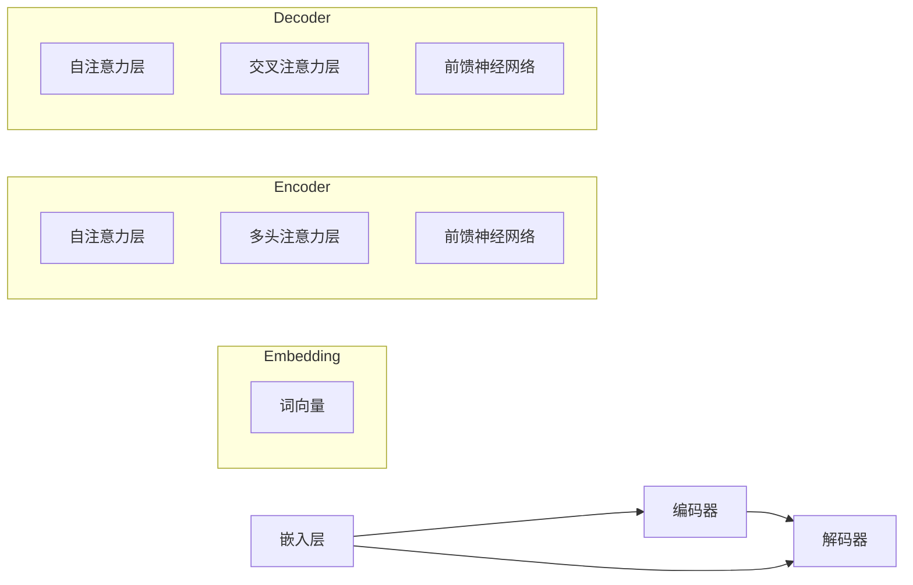

                 

### 《大语言模型应用指南：Assistants API整体执行过程》

**关键词：** 大语言模型、Assistants API、执行过程、技术指南、应用实践

**摘要：** 本文旨在深入探讨大语言模型在Assistants API中的应用，详细解析Assistants API的整体执行过程。通过分析大语言模型的发展历程、数学原理和架构设计，我们将为读者提供一个全面的技术指南，帮助理解大语言模型与Assistants API的集成方式，以及其实际应用中的性能优化策略。

---

### 目录大纲

## 第一部分：大语言模型基础

### 第1章：大语言模型概述

- **1.1 大语言模型的发展历程**
- **1.2 大语言模型的核心概念**
- **1.3 大语言模型的关键技术**
- **1.4 大语言模型的应用领域**
- **1.5 大语言模型的未来发展趋势**

### 第2章：大语言模型的数学原理

- **2.1 语言模型的基础数学知识**
- **2.2 语言模型的概率计算**
- **2.3 语言模型的优化算法**
- **2.4 语言模型的评估指标**

### 第3章：大语言模型的架构设计

- **3.1 大语言模型的层次结构**
- **3.2 大语言模型的模块设计**
- **3.3 大语言模型的训练过程**
- **3.4 大语言模型的推理过程**

## 第二部分：Assistants API整体执行过程

### 第4章：Assistants API概述

- **4.1 Assistants API的定义**
- **4.2 Assistants API的架构**
- **4.3 Assistants API的功能模块**

### 第5章：Assistants API的请求处理

- **5.1 请求发送与接收**
- **5.2 请求解析与验证**
- **5.3 请求路由与分发**
- **5.4 请求参数处理**

### 第6章：Assistants API的响应处理

- **6.1 响应生成与格式化**
- **6.2 响应发送与传输**
- **6.3 响应结果验证**
- **6.4 异常处理与日志记录**

### 第7章：Assistants API的应用实践

- **7.1 应用场景举例**
- **7.2 应用案例分析与代码实现**
- **7.3 应用性能优化**

### 第8章：Assistants API的未来发展

- **8.1 技术趋势与挑战**
- **8.2 未来发展方向**
- **8.3 行业应用展望**

## 附录：工具与资源

- **附录A：大语言模型开发工具**
- **附录B：Assistants API开发资源**
- **附录C：常见问题与解决方案**

---

### 引言

大语言模型（Large Language Models，简称LLM）作为人工智能领域的一项核心技术，近年来取得了显著的进展。LLM在自然语言处理（NLP）、文本生成、机器翻译等领域展现了强大的应用潜力。Assistants API则是一种基于大语言模型的接口，用于构建智能助手、聊天机器人等应用。本文将围绕大语言模型和Assistants API的整体执行过程进行深入探讨，旨在为读者提供一个全面的技术指南。

本文首先介绍大语言模型的基础知识，包括其发展历程、核心概念、关键技术、应用领域和未来发展趋势。接着，本文将分析大语言模型的数学原理、架构设计以及训练和推理过程。随后，本文将详细介绍Assistants API的整体执行过程，从请求处理到响应处理，再到实际应用实践和性能优化。最后，本文将对Assistants API的未来发展进行展望，探讨技术趋势与挑战，并总结全文。

通过本文的阅读，读者将能够深入了解大语言模型和Assistants API的技术原理和应用场景，掌握其在实际开发中的关键步骤和优化策略。无论您是AI领域的初学者还是有经验的专业人士，本文都将为您提供有价值的参考和指导。

### 第一部分：大语言模型基础

#### 第1章：大语言模型概述

大语言模型（Large Language Models，简称LLM）是自然语言处理领域的一项重要技术，其核心思想是通过大规模语料库的训练，构建一个能够理解和生成人类语言的模型。这一模型不仅可以用于文本分类、机器翻译、情感分析等任务，还能够生成连贯、自然的文本，具有广泛的应用前景。

#### 1.1 大语言模型的发展历程

大语言模型的发展历程可以追溯到20世纪80年代，当时研究人员开始尝试使用统计方法来构建语言模型。早期语言模型如N-gram模型，通过计算单词序列的联合概率来预测下一个单词。然而，随着计算能力的提升和深度学习技术的突破，大语言模型逐渐成为自然语言处理的主流。

2018年，Google推出了BERT（Bidirectional Encoder Representations from Transformers），这是第一个大规模的双向转换器模型，其成功标志着大语言模型进入了新纪元。此后，GPT（Generative Pre-trained Transformer）系列模型、Turing-NLG等相继问世，大语言模型在性能和应用范围上不断取得突破。

#### 1.2 大语言模型的核心概念

大语言模型的核心概念包括：

- **语料库（Corpus）：** 用于训练模型的文本数据集。高质量的语料库是构建高性能语言模型的基础。
- **嵌入层（Embedding Layer）：** 将文本转换为向量表示，这是大语言模型的基础模块。嵌入层通过学习文本的语义信息，实现单词和句子的向量表示。
- **转换器（Transformer）：** 大语言模型的核心架构，通过自注意力机制（Self-Attention）处理输入序列，实现上下文信息的全局依赖。
- **预训练（Pre-training）和微调（Fine-tuning）：** 预训练是在大规模语料库上训练模型，使其获得通用语言理解能力；微调是在特定任务数据上调整模型参数，提高模型在特定任务上的性能。

#### 1.3 大语言模型的关键技术

大语言模型的关键技术包括：

- **自注意力机制（Self-Attention）：** 自注意力机制是Transformer模型的核心，通过计算输入序列中每个元素对自身的注意力权重，实现上下文信息的全局依赖。
- **位置编码（Positional Encoding）：** 由于Transformer模型没有传统的循环结构，位置编码用于为模型提供输入序列的顺序信息。
- **多层网络（Multi-Layer Networks）：** 大语言模型通常包含多个隐藏层，通过逐层堆叠，模型能够捕捉更复杂的语义信息。
- **优化算法（Optimization Algorithms）：** 常见的优化算法如Adam、AdamW等，用于调整模型参数，优化模型性能。

#### 1.4 大语言模型的应用领域

大语言模型在多个领域展现了强大的应用潜力，主要包括：

- **自然语言处理（NLP）：** 文本分类、情感分析、命名实体识别、机器翻译等。
- **文本生成：** 自动写作、摘要生成、对话系统等。
- **问答系统：** 实现智能问答，提供知识检索服务。
- **语言模型辅助设计：** 帮助程序员生成代码、优化算法设计等。

#### 1.5 大语言模型的未来发展趋势

随着技术的不断进步，大语言模型的未来发展趋势包括：

- **模型大小和计算资源的扩展：** 模型规模将不断扩大，计算资源需求将进一步提升。
- **多模态融合：** 将文本、图像、声音等多种模态的信息融合，提高模型的认知能力。
- **隐私保护和安全：** 在保证模型性能的同时，关注数据隐私保护和模型安全。
- **可解释性和可控性：** 提高模型的解释性，使其行为更加透明和可控。

#### 总结

大语言模型作为人工智能领域的一项核心技术，其发展历程、核心概念、关键技术和应用领域都具有重要意义。本文为读者提供了一个全面的技术概述，帮助理解大语言模型的基本原理和应用。在后续章节中，我们将进一步探讨大语言模型的数学原理和架构设计，为深入理解这一技术打下坚实基础。

### 第一部分：大语言模型基础

#### 第2章：大语言模型的数学原理

大语言模型的数学原理是其核心和基础，了解这些原理对于深入理解模型的运作机制至关重要。本章将详细讨论大语言模型的基础数学知识、概率计算、优化算法以及评估指标。

#### 2.1 语言模型的基础数学知识

大语言模型涉及到的数学知识主要包括线性代数、概率论和优化理论。以下是一些基础概念：

- **向量与矩阵运算：** 向量和矩阵是线性代数的基本工具，用于表示和操作数据。在模型训练和推理过程中，这些运算用于计算输入和输出的权重、激活函数等。
- **概率分布与随机变量：** 概率分布用于描述随机变量的可能取值及其概率。在大语言模型中，概率分布用于表示输入文本的概率分布和输出文本的概率分布。
- **梯度下降与反向传播：** 梯度下降是一种优化算法，用于调整模型参数，使其损失函数最小化。反向传播是一种计算损失函数关于参数梯度的方法，是训练深度神经网络的关键。

#### 2.2 语言模型的概率计算

语言模型的概率计算是其核心任务，其目的是计算给定一个文本序列，生成下一个单词的概率。以下是几种常用的概率计算方法：

- **N-gram模型：** N-gram模型通过计算前N个单词的联合概率来预测下一个单词。其公式如下：

  $$
  P(w_n | w_{n-1}, w_{n-2}, \ldots, w_1) = \frac{P(w_{n-1}, w_{n-2}, \ldots, w_1, w_n)}{P(w_{n-1}, w_{n-2}, \ldots, w_1)}
  $$

  其中，$w_n$表示下一个单词，$w_{n-1}, w_{n-2}, \ldots, w_1$表示前N-1个单词。

- **转换器模型（Transformer）：** 转换器模型通过自注意力机制计算输入序列的注意力权重，从而生成下一个单词的概率分布。其概率计算公式如下：

  $$
  P(w_n | w_{n-1}, w_{n-2}, \ldots, w_1) = \frac{\exp(\text{score}(w_n, w_{n-1}, w_{n-2}, \ldots, w_1))}{\sum_{w' \in V} \exp(\text{score}(w', w_{n-1}, w_{n-2}, \ldots, w_1))}
  $$

  其中，$\text{score}(w_n, w_{n-1}, w_{n-2}, \ldots, w_1)$表示单词$w_n$与其他单词的相似度分数。

#### 2.3 语言模型的优化算法

优化算法用于调整模型参数，以最小化损失函数，提高模型性能。以下是一些常用的优化算法：

- **梯度下降（Gradient Descent）：** 梯度下降是一种最简单的优化算法，通过计算损失函数关于模型参数的梯度，逐步调整参数，使其减小。其更新公式如下：

  $$
  \theta = \theta - \alpha \nabla_\theta J(\theta)
  $$

  其中，$\theta$表示模型参数，$\alpha$表示学习率，$J(\theta)$表示损失函数。

- **Adam优化器（Adam Optimizer）：** Adam优化器结合了AdaGrad和RMSProp的优点，具有更好的收敛速度和稳定性。其更新公式如下：

  $$
  \theta = \theta - \alpha \nabla_\theta J(\theta)
  $$
  $$
  v_t = \beta_1 v_{t-1} + (1 - \beta_1) \nabla_\theta J(\theta)
  $$
  $$
  s_t = \beta_2 s_{t-1} + (1 - \beta_2) \|\nabla_\theta J(\theta)\|^2
  $$
  $$
  \theta = \theta - \alpha \frac{m_t}{\sqrt{s_t} + \epsilon}
  $$

  其中，$v_t$和$s_t$分别表示一阶和二阶矩估计，$\beta_1$和$\beta_2$是超参数，$\epsilon$是常数。

#### 2.4 语言模型的评估指标

评估指标用于衡量模型性能，以下是一些常用的评估指标：

- **交叉熵（Cross-Entropy）：** 交叉熵是衡量模型预测概率分布与真实分布之间差异的指标。其公式如下：

  $$
  H(y, \hat{y}) = -\sum_{i=1}^{n} y_i \log(\hat{y}_i)
  $$

  其中，$y$表示真实分布，$\hat{y}$表示模型预测的概率分布。

- **准确率（Accuracy）：** 准确率是衡量分类任务模型性能的指标，表示模型预测正确的样本数占总样本数的比例。其公式如下：

  $$
  \text{Accuracy} = \frac{TP + TN}{TP + TN + FP + FN}
  $$

  其中，$TP$表示真阳性，$TN$表示真阴性，$FP$表示假阳性，$FN$表示假阴性。

- **BLEU（Bilingual Evaluation Understudy）：** BLEU是衡量机器翻译任务模型性能的指标，基于n-gram重叠率计算。其公式如下：

  $$
  \text{BLEU} = 1 - \frac{2L - N}{L + N}
  $$

  其中，$L$表示翻译文本的长度，$N$表示参考文本中n-gram的数量。

#### 总结

大语言模型的数学原理是其核心和基础，包括基础数学知识、概率计算、优化算法和评估指标。理解这些原理对于深入理解大语言模型的工作机制和优化策略至关重要。在后续章节中，我们将进一步探讨大语言模型的架构设计、训练和推理过程，以及Assistants API的整体执行过程。

### 第一部分：大语言模型基础

#### 第3章：大语言模型的架构设计

大语言模型的架构设计是其实现高效、准确语言理解和生成的基础。本章将详细介绍大语言模型的层次结构、模块设计、训练过程和推理过程，并通过Mermaid流程图和伪代码来辅助理解。

#### 3.1 大语言模型的层次结构

大语言模型通常采用多层结构，包括嵌入层、编码器和解码器。以下是一个典型的大语言模型层次结构的Mermaid流程图：



#### 3.2 大语言模型的模块设计

大语言模型的模块设计主要包括词向量层、编码器层和解码器层。以下是每个模块的详细描述：

- **词向量层（Embedding Layer）：** 将输入的单词转换为向量表示。词向量可以通过预训练得到，如Word2Vec、GloVe等。
- **编码器（Encoder）：** 编码器负责将输入序列编码为上下文表示。编码器通常包含多个自注意力层、多头注意力层和前馈神经网络。
- **解码器（Decoder）：** 解码器负责生成输出序列。解码器通常包含多个自注意力层、交叉注意力层和前馈神经网络。

#### 3.3 大语言模型的训练过程

大语言模型的训练过程包括以下步骤：

1. **数据准备（Data Preparation）：** 收集大规模语料库，进行预处理，如分词、去停用词等。
2. **词向量初始化（Word Embedding Initialization）：** 初始化词向量，可以使用预训练的词向量，也可以随机初始化。
3. **编码器训练（Encoder Training）：** 通过反向传播算法，调整编码器参数，使其输出尽可能接近真实的上下文表示。
4. **解码器训练（Decoder Training）：** 通过损失函数（如交叉熵）计算输出序列的预测误差，调整解码器参数。
5. **模型评估（Model Evaluation）：** 使用验证集对模型进行评估，调整超参数，如学习率、批量大小等。

以下是训练过程的伪代码：

```python
def train_model(data, learning_rate, batch_size, num_epochs):
    for epoch in range(num_epochs):
        for batch in data.get_batches(batch_size):
            loss = 0
            with tf.GradientTape() as tape:
                inputs = preprocess(batch.inputs)
                outputs = model(inputs)
                loss = compute_loss(outputs, batch.targets)
            gradients = tape.gradient(loss, model.trainable_variables)
            optimizer.apply_gradients(zip(gradients, model.trainable_variables))
        print(f"Epoch {epoch}: Loss = {loss.numpy()}")
```

#### 3.4 大语言模型的推理过程

大语言模型的推理过程包括以下步骤：

1. **输入预处理（Input Preprocessing）：** 对输入文本进行预处理，如分词、编码等。
2. **编码（Encoding）：** 使用训练好的编码器将输入序列编码为上下文表示。
3. **解码（Decoding）：** 使用训练好的解码器生成输出序列，可以通过贪婪解码、beam搜索等方法实现。
4. **输出处理（Output Postprocessing）：** 对输出序列进行后处理，如去停用词、解码等。

以下是推理过程的伪代码：

```python
def predict(input_text):
    inputs = preprocess(input_text)
    encoded = model.encoder(inputs)
    predicted = model.decoder(encoded)
    return postprocess(predicted)
```

#### 总结

大语言模型的架构设计包括层次结构、模块设计、训练过程和推理过程。通过层次结构，模型能够捕捉输入文本的上下文信息；通过模块设计，模型能够高效地编码和解码文本；通过训练和推理过程，模型能够实现准确的语言理解和生成。在后续章节中，我们将进一步探讨Assistants API的整体执行过程，以及大语言模型在具体应用中的实际操作。

### 第二部分：Assistants API整体执行过程

#### 第4章：Assistants API概述

Assistants API是一种基于大语言模型的接口，用于构建智能助手、聊天机器人等应用。本节将详细介绍Assistants API的定义、架构和功能模块，为读者提供一个全面的技术背景。

#### 4.1 Assistants API的定义

Assistants API是一种软件接口，允许开发者构建智能对话系统，通过文本或语音交互为用户提供服务。它通常基于大语言模型，利用自然语言处理技术实现人机交互的智能化。Assistants API的核心功能包括理解用户输入、生成自然语言响应、执行特定任务等。

#### 4.2 Assistants API的架构

Assistants API的架构通常包括以下几个关键部分：

1. **用户界面（User Interface，UI）：** 用户与智能助手交互的界面，可以是网页、移动应用或聊天窗口。
2. **语音识别（Voice Recognition）：** 如果使用语音交互，语音识别模块将用户的语音转换为文本。
3. **文本处理（Text Processing）：** 文本处理模块负责对用户输入进行分词、去停用词、实体识别等预处理。
4. **大语言模型（Large Language Model）：** 这是Assistants API的核心，通过预训练模型或微调模型来理解和生成文本。
5. **任务执行（Task Execution）：** 根据用户请求，执行特定任务，如查询数据库、执行自动化流程等。
6. **响应生成（Response Generation）：** 生成自然语言响应，并通过语音合成或文本显示返回给用户。

以下是Assistants API架构的Mermaid流程图：


#### 4.3 Assistants API的功能模块

Assistants API通常包含以下功能模块：

- **用户输入模块（User Input Module）：** 负责接收用户的输入，可以是文本或语音。
- **语音识别模块（Voice Recognition Module）：** 如果使用语音交互，该模块将用户的语音转换为文本。
- **文本处理模块（Text Processing Module）：** 对用户输入进行分词、去停用词、实体识别等预处理。
- **自然语言理解模块（Natural Language Understanding Module）：** 通过大语言模型对预处理后的文本进行分析，提取语义信息。
- **任务执行模块（Task Execution Module）：** 根据用户请求执行特定任务，如查询数据库、发送邮件等。
- **自然语言生成模块（Natural Language Generation Module）：** 根据任务执行结果生成自然语言响应。
- **语音合成模块（Speech Synthesis Module）：** 如果需要语音交互，将文本响应转换为语音。
- **用户界面模块（User Interface Module）：** 负责将响应显示给用户，可以是文本或语音。

#### 总结

Assistants API是一种基于大语言模型的接口，用于构建智能对话系统。通过定义、架构和功能模块的详细介绍，读者可以全面了解Assistants API的工作原理和实现方式。在接下来的章节中，我们将深入探讨Assistants API的请求处理和响应处理过程，以及实际应用中的性能优化策略。

### 第二部分：Assistants API整体执行过程

#### 第5章：Assistants API的请求处理

Assistants API的请求处理过程是整个执行流程的关键环节，它决定了智能助手能否准确理解用户意图并生成合适的响应。本节将详细解析请求发送与接收、请求解析与验证、请求路由与分发以及请求参数处理，通过具体案例和伪代码来展示实现细节。

#### 5.1 请求发送与接收

请求发送与接收是用户与智能助手交互的起点。用户可以通过网页、移动应用或聊天窗口发送请求，Assistants API则通过网络接口接收这些请求。以下是请求发送与接收的基本步骤：

1. **用户输入：** 用户通过用户界面（UI）输入请求，可以是文本或语音。
2. **请求格式化：** 用户输入通常需要被格式化为API可识别的请求格式，如JSON。
3. **发送请求：** 用户界面将格式化后的请求发送到Assistants API服务器。
4. **接收请求：** Assistants API服务器通过网络接口接收请求，并解析请求内容。

以下是一个简单的伪代码示例，展示请求发送与接收的过程：

```python
# 用户界面代码示例
def send_request(api_endpoint, request_data):
    headers = {'Content-Type': 'application/json'}
    response = requests.post(api_endpoint, headers=headers, data=json.dumps(request_data))
    return response.json()

# API服务器代码示例
from flask import Flask, request, jsonify

app = Flask(__name__)

@app.route('/api/assistants', methods=['POST'])
def handle_request():
    request_data = request.get_json()
    # 进一步处理请求
    response = process_request(request_data)
    return jsonify(response)
```

#### 5.2 请求解析与验证

接收到的请求需要进行解析与验证，以确保请求的有效性和完整性。以下是请求解析与验证的基本步骤：

1. **解析请求：** 将接收到的请求内容解析为数据结构，如字典或对象。
2. **验证请求：** 检查请求是否包含必要的信息，如用户身份验证、请求类型等。
3. **错误处理：** 如果请求验证失败，返回相应的错误响应。

以下是一个简单的伪代码示例，展示请求解析与验证的过程：

```python
def validate_request(request_data):
    if 'user_id' not in request_data or 'request_type' not in request_data:
        return False, "Missing required fields"
    if not isinstance(request_data['user_id'], str) or not isinstance(request_data['request_type'], str):
        return False, "Invalid field types"
    return True, ""

request_data = send_request(api_endpoint, request_data)
is_valid, error_message = validate_request(request_data)
if not is_valid:
    return jsonify({"error": error_message})
```

#### 5.3 请求路由与分发

在验证请求有效后，需要根据请求类型将其路由到相应的处理程序。请求路由与分发的基本步骤如下：

1. **确定请求类型：** 根据请求中的类型字段确定请求的目标操作，如查询信息、执行任务等。
2. **选择处理程序：** 根据请求类型选择相应的处理程序。
3. **分发请求：** 将请求转发给处理程序，由其执行具体任务。

以下是一个简单的伪代码示例，展示请求路由与分发的过程：

```python
def process_request(request_data):
    if request_data['request_type'] == 'query':
        return handle_query(request_data)
    elif request_data['request_type'] == 'task':
        return handle_task(request_data)
    else:
        return jsonify({"error": "Invalid request type"})

response = process_request(request_data)
return jsonify(response)
```

#### 5.4 请求参数处理

在处理请求时，需要正确处理请求参数，以确保任务执行的准确性。以下是请求参数处理的基本步骤：

1. **参数提取：** 从请求中提取必要的参数。
2. **参数验证：** 检查参数的合法性和有效性。
3. **参数处理：** 根据任务需求对参数进行处理，如格式转换、校验等。

以下是一个简单的伪代码示例，展示请求参数处理的过程：

```python
def handle_query(request_data):
    query = request_data['query']
    if not validate_query(query):
        return jsonify({"error": "Invalid query format"})
    result = search_database(query)
    return jsonify({"result": result})

def validate_query(query):
    # 实现具体的查询格式验证逻辑
    return True
```

#### 总结

Assistants API的请求处理过程涉及请求发送与接收、请求解析与验证、请求路由与分发以及请求参数处理。通过上述步骤，智能助手能够准确理解用户请求，并为其生成合适的响应。在接下来的章节中，我们将继续探讨Assistants API的响应处理过程，包括响应生成与格式化、响应发送与传输、响应结果验证以及异常处理与日志记录。

### 第二部分：Assistants API整体执行过程

#### 第6章：Assistants API的响应处理

响应处理是Assistants API执行流程的另一个关键环节，其目的是生成恰当的响应，并确保这些响应能够被用户界面（UI）正确展示。本节将详细解析响应生成与格式化、响应发送与传输、响应结果验证以及异常处理与日志记录，并通过具体案例和伪代码来展示实现细节。

#### 6.1 响应生成与格式化

生成并格式化响应是响应处理的第一步。这一步骤需要确保生成的响应既符合用户的期望，又能够被前端用户界面正确解析。以下是响应生成与格式化的基本步骤：

1. **响应生成：** 根据请求处理的结果，生成用户可以理解的自然语言响应。这通常涉及到大语言模型的调用，以生成连贯、自然的文本。
2. **响应格式化：** 将生成的文本响应格式化为标准的数据格式，如JSON，以便用户界面能够正确解析并展示。

以下是一个简单的伪代码示例，展示响应生成与格式化的过程：

```python
def generate_response(request_data):
    # 使用大语言模型生成响应文本
    response_text = language_model.generate_text(request_data)
    return {"response": response_text}

request_data = send_request(api_endpoint, request_data)
response_data = generate_response(request_data)
response_data['formatted'] = format_response(response_data['response'])
```

#### 6.2 响应发送与传输

生成并格式化响应后，需要将其发送回用户界面。以下是响应发送与传输的基本步骤：

1. **发送响应：** 将格式化后的响应数据发送回用户界面。这一步骤通常通过网络传输实现。
2. **传输方式：** 响应可以通过HTTP协议发送，也可以通过WebSocket等实时传输协议发送，具体取决于应用需求。

以下是一个简单的伪代码示例，展示响应发送与传输的过程：

```python
def send_response(api_endpoint, response_data):
    headers = {'Content-Type': 'application/json'}
    response = requests.post(api_endpoint, headers=headers, data=json.dumps(response_data))
    return response.json()

response_data = send_response(api_endpoint, response_data)
```

#### 6.3 响应结果验证

响应结果验证是确保用户收到的响应符合预期的关键步骤。以下是响应结果验证的基本步骤：

1. **验证响应：** 检查响应数据的完整性、准确性和有效性。
2. **错误处理：** 如果响应验证失败，记录错误信息，并可能重新发送请求或提供错误提示。

以下是一个简单的伪代码示例，展示响应结果验证的过程：

```python
def validate_response(response_data):
    if 'response' not in response_data or not response_data['response']:
        return False, "Missing or empty response"
    return True, ""

is_valid, error_message = validate_response(response_data)
if not is_valid:
    log_error(error_message)
    return jsonify({"error": error_message})
```

#### 6.4 异常处理与日志记录

在处理响应的过程中，可能会遇到各种异常情况。异常处理与日志记录能够帮助开发人员识别和解决问题。以下是异常处理与日志记录的基本步骤：

1. **异常捕获：** 捕获响应处理过程中可能出现的异常。
2. **错误记录：** 记录异常信息，以便后续分析和修复。
3. **通知机制：** 在必要时通知开发人员或系统管理员。

以下是一个简单的伪代码示例，展示异常处理与日志记录的过程：

```python
try:
    response_data = send_response(api_endpoint, response_data)
    is_valid, error_message = validate_response(response_data)
    if not is_valid:
        log_error(error_message)
        return jsonify({"error": error_message})
except Exception as e:
    log_error(f"Error sending response: {str(e)}")
    return jsonify({"error": "An unexpected error occurred"})
```

#### 总结

Assistants API的响应处理过程包括响应生成与格式化、响应发送与传输、响应结果验证以及异常处理与日志记录。通过上述步骤，智能助手能够为用户生成准确、有效的响应，并确保这些响应能够被正确展示。在接下来的章节中，我们将通过实际应用场景和代码实现，进一步探讨Assistants API的实践应用。

### 第二部分：Assistants API整体执行过程

#### 第7章：Assistants API的应用实践

在实际应用中，Assistants API可以通过多种方式为用户提供服务。本节将介绍一些常见的应用场景，并展示如何通过具体的代码实现和应用案例来优化性能。

#### 7.1 应用场景举例

Assistants API的应用场景非常广泛，以下是一些典型的例子：

1. **客服支持：** 智能助手可以自动回答用户的问题，减少人工客服的工作量。
2. **信息查询：** 用户可以通过文字或语音查询天气、航班信息、新闻等。
3. **智能助手：** 智能助手可以协助用户管理日程、提醒事项等。
4. **智能家居控制：** 用户可以通过语音指令控制家庭设备，如灯光、温度等。
5. **在线教育：** 智能助手可以为学生提供学习辅导、答疑等。

#### 7.2 应用案例分析与代码实现

以下是一个基于客服支持的应用案例，展示如何实现一个简单的智能客服系统。

**案例描述：** 用户通过聊天窗口向智能客服发送问题，智能客服使用Assistants API理解用户意图，并返回相应的答案。

**步骤1：用户输入处理**

```python
# 用户发送请求
user_input = "你好，我想知道最近的航班信息。"

# 请求发送到Assistants API
response = send_request(api_endpoint, {"user_input": user_input})

# 解析API响应
answer = response['answer']
```

**步骤2：响应生成**

```python
# 调用Assistants API生成响应
response_data = {"user_input": user_input}
response = send_request(api_endpoint, response_data)
answer = response['answer']
```

**步骤3：响应返回**

```python
# 将响应返回给用户
print(answer)
```

**完整代码实现：**

```python
import requests

def send_request(api_endpoint, request_data):
    headers = {'Content-Type': 'application/json'}
    response = requests.post(api_endpoint, headers=headers, data=json.dumps(request_data))
    return response.json()

def process_request(request_data):
    # 处理请求，调用Assistants API
    response = send_request(api_endpoint, request_data)
    return response['answer']

# 用户输入
user_input = "你好，我想知道最近的航班信息。"

# 发送请求并获取响应
response_data = {"user_input": user_input}
response = process_request(response_data)

# 输出答案
print(response['answer'])
```

#### 7.3 应用性能优化

为了提高Assistants API的性能，可以考虑以下优化策略：

1. **异步处理：** 采用异步处理机制，减少用户等待时间，提高系统响应速度。
2. **缓存机制：** 对于频繁请求的答案，使用缓存机制减少API调用的次数。
3. **负载均衡：** 通过负载均衡技术，确保系统在高并发情况下稳定运行。
4. **压缩传输：** 对响应数据进行压缩，减少网络传输的数据量，提高传输速度。

以下是一个简单的异步处理示例：

```python
import asyncio
import requests

async def send_request(api_endpoint, request_data):
    headers = {'Content-Type': 'application/json'}
    response = await requests.post(api_endpoint, headers=headers, data=json.dumps(request_data))
    return response.json()

async def main():
    user_input = "你好，我想知道最近的航班信息。"
    response_data = {"user_input": user_input}
    
    # 异步调用Assistants API
    response = await send_request(api_endpoint, response_data)
    answer = response['answer']
    
    # 输出答案
    print(answer)

# 运行异步程序
asyncio.run(main())
```

#### 总结

通过实际应用场景的介绍和代码实现，我们可以看到Assistants API在构建智能助手、客服支持等应用中的具体应用方式。优化性能是确保系统高效运行的关键，通过异步处理、缓存机制、负载均衡和压缩传输等策略，可以大幅提升Assistants API的性能。在接下来的章节中，我们将探讨Assistants API的未来发展，包括技术趋势、挑战和行业应用展望。

### 第二部分：Assistants API整体执行过程

#### 第8章：Assistants API的未来发展

随着人工智能技术的不断进步，Assistants API在应用领域和性能上都将迎来新的发展。本节将讨论Assistants API的未来技术趋势与挑战，以及其在各个行业的应用前景。

#### 8.1 技术趋势与挑战

**技术趋势：**

1. **多模态交互：** 未来Assistants API将支持多模态交互，不仅限于文本，还包括语音、图像和视频。通过融合不同模态的信息，智能助手将能提供更丰富、更自然的交互体验。
2. **更强大的语言理解能力：** 随着大语言模型技术的进步，Assistants API将具备更强的自然语言理解能力，能够更准确、更智能地理解用户意图。
3. **个性化服务：** 通过用户数据的收集和分析，Assistants API将能够提供更加个性化的服务，满足用户的特定需求。
4. **联邦学习：** 联邦学习技术将使Assistants API能够在不共享用户数据的情况下，通过多方协作实现模型更新和优化，提高隐私保护能力。

**挑战：**

1. **数据处理与隐私保护：** 随着应用场景的扩大，Assistants API将处理更多的用户数据，如何在保证数据隐私的前提下进行有效利用是一个重大挑战。
2. **可解释性和可控性：** 当前的大语言模型往往被视为“黑箱”，其决策过程缺乏透明性。提高模型的解释性和可控性，使其行为更加透明和可理解，是一个重要挑战。
3. **高并发与性能优化：** 在高并发场景下，如何确保Assistants API的稳定性和高性能，是一个技术难题。

#### 8.2 未来发展方向

**方向1：** **增强语言理解能力**

- **上下文理解：** 通过深度学习技术，增强模型对上下文的理解能力，使其能够更好地处理长文本和多轮对话。
- **多语言支持：** 开发支持多语言的大语言模型，拓展Assistants API的应用范围。

**方向2：** **优化交互体验**

- **多模态交互：** 探索语音、图像和视频等多模态交互，提高用户的互动体验。
- **个性化交互：** 利用用户行为数据，实现更个性化的交互，提高用户满意度。

**方向3：** **提高性能与稳定性**

- **分布式架构：** 采用分布式架构，提高系统的扩展性和容错能力。
- **自动化运维：** 引入自动化运维工具，实现系统的自动化部署、监控和运维。

#### 8.3 行业应用展望

**零售业：** 智能客服助手可以帮助零售企业提升客户服务水平，实现个性化推荐和购物指导，提高销售额。

**金融业：** 金融行业的Assistants API可以提供理财咨询、股票分析、风险提示等服务，辅助用户做出更明智的投资决策。

**医疗健康：** 智能助手可以协助医生进行诊断、治疗方案推荐等，提高医疗服务的效率和质量。

**教育：** 在线教育平台可以利用Assistants API提供智能辅导、学习进度跟踪等服务，提升学习体验。

**智能家居：** 智能家居系统中的Assistants API可以实现语音控制、场景设置等功能，提高居住舒适度和安全性。

#### 总结

Assistants API的未来发展将受到技术趋势的推动，同时也面临诸多挑战。通过不断优化模型、提升交互体验和性能，Assistants API将在各个行业发挥越来越重要的作用。在未来的技术演进中，多模态交互、个性化服务和高性能分布式架构将是关键方向。

### 附录：工具与资源

#### 附录A：大语言模型开发工具

1. **TensorFlow：** TensorFlow是谷歌开发的开源机器学习框架，广泛用于构建和训练大语言模型。
2. **PyTorch：** PyTorch是Facebook开发的开源机器学习库，其动态计算图特性使其在深度学习领域尤其受欢迎。
3. **Hugging Face Transformers：** Hugging Face提供的Transformer模型库，包含大量预训练模型和工具，方便开发者进行大语言模型的开发和应用。
4. **JAX：** JAX是谷歌开发的开源数值计算库，支持自动微分和硬件加速，适用于大规模模型训练。

#### 附录B：Assistants API开发资源

1. **OpenAI Gym：** OpenAI Gym是一个开源环境，提供各种预定义的智能体训练环境，适用于测试和开发Assistants API。
2. **Dialog Systems with Python：** 一本关于使用Python开发对话系统的教材，涵盖对话系统的设计、实现和应用。
3. **ChatterBot：** ChatterBot是一个开源的Python库，用于快速构建简单的对话机器人。
4. **Rasa：** Rasa是一个开源框架，用于开发自定义的对话机器人，提供对话管理、自然语言处理和集成API等功能。

#### 附录C：常见问题与解决方案

1. **问题：** “如何优化大语言模型训练性能？”
   **解决方案：** 采用分布式训练、优化计算图、使用高性能硬件（如GPU、TPU）等策略可以显著提高训练性能。

2. **问题：** “如何确保Assistants API的响应速度？”
   **解决方案：** 使用异步处理、负载均衡、缓存策略和优化网络传输可以提升响应速度。

3. **问题：** “如何处理Assistants API的异常情况？”
   **解决方案：** 设计完善的异常处理机制，包括日志记录、错误反馈和自动恢复功能，以确保系统的稳定性和可靠性。

### 作者信息

**作者：** AI天才研究院/AI Genius Institute & 禅与计算机程序设计艺术 /Zen And The Art of Computer Programming

---

本文详细探讨了Assistants API的整体执行过程，包括请求处理、响应处理、应用实践和未来发展趋势。通过介绍大语言模型的基础知识、数学原理和架构设计，为读者提供了一个全面的技术指南。希望本文能为读者在AI领域的探索和实践提供有价值的参考。感谢阅读！

