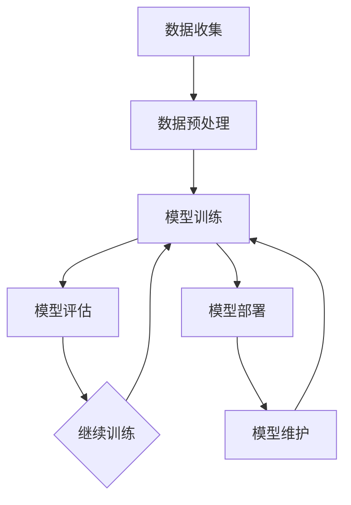

                 

### 文章标题

#### 关键词：(大语言模型，机器学习，预训练模型，自然语言处理，深度学习，算法实现，项目实战)

#### 摘要：
本文将深入探讨大语言模型及其在机器学习中的应用。从基础概念出发，逐步介绍大语言模型的原理、架构和训练过程，然后通过具体应用场景展示其实际价值。文章还将提供详细的实施指南，涵盖环境搭建、模型训练、性能优化和评估方法。最后，对大语言模型的发展趋势和未来方向进行展望，并附上相关资源和工具，以帮助读者更好地理解和应用大语言模型。

---

## 引言

随着人工智能技术的飞速发展，机器学习已成为现代科技的核心驱动力之一。大语言模型作为机器学习的重要分支，在自然语言处理、问答系统、智能客服等领域展现出了巨大的潜力和应用价值。本文旨在为读者提供一本全面的大语言模型应用指南，帮助大家深入了解大语言模型的基本概念、原理和应用，掌握其实施和优化方法，为未来的研究和项目开发打下坚实的基础。

### 1.1 书籍背景与目的

本书旨在为那些对大语言模型及其应用感兴趣的读者提供一份全面、系统且易于理解的指南。无论是初学者还是有一定基础的读者，都可以通过本书逐步掌握大语言模型的核心知识和技术。具体目标包括：

1. **普及大语言模型的基本概念**：介绍大语言模型的定义、分类和作用，帮助读者建立基本认识。
2. **详细讲解大语言模型的原理**：包括预训练模型、模型架构和训练过程，使读者能够深入理解其工作原理。
3. **展示大语言模型的应用场景**：通过实际案例，展示大语言模型在不同领域的应用，提升读者的实践能力。
4. **提供实施指南和优化方法**：帮助读者掌握大语言模型的实际开发流程和性能优化技巧，为项目开发提供支持。

### 1.2 大语言模型概述

大语言模型（Large Language Model）是一类基于深度学习的自然语言处理模型，通过对海量文本数据进行预训练，使其具备强大的语言理解和生成能力。大语言模型的核心在于其能够从大量的无标签文本中自动学习语言的统计规律和语义信息，从而在多种自然语言处理任务中表现出色。

大语言模型的主要特点包括：

1. **大规模**：大语言模型通常包含数亿甚至数千亿个参数，这使得它们能够捕捉到语言中的细微差异和复杂结构。
2. **预训练**：大语言模型通过在大量无标签文本上进行预训练，从而自动学习到语言的通用特征，为后续任务提供强大的基础。
3. **多任务能力**：大语言模型可以应用于多种自然语言处理任务，如文本分类、机器翻译、问答系统和文本生成等。
4. **自适应能力**：大语言模型具有较强的自适应能力，可以通过微调和迁移学习快速适应特定任务和数据集。

大语言模型的出现，为自然语言处理领域带来了革命性的变化，极大地提高了任务的表现和效率。例如，在文本生成方面，大语言模型可以生成高质量的文章、摘要和对话；在问答系统方面，大语言模型可以理解和回答用户的问题，提供智能化的服务；在智能客服方面，大语言模型可以模拟人类客服，提高客户满意度和服务效率。

### 1.3 机器学习基础知识回顾

在深入探讨大语言模型之前，我们需要对机器学习的基础知识进行简要回顾。机器学习是一种通过利用数据进行自我学习和改进的技术，其主要目标是使计算机系统能够从数据中学习规律，并在新的数据上做出准确的预测或决策。

#### 监督学习（Supervised Learning）

监督学习是机器学习中最常见的类型，其主要思想是使用已标记的数据（即带有正确答案的数据）来训练模型，然后使用训练好的模型对新的数据进行预测。监督学习可以分为以下几种主要类型：

1. **回归（Regression）**：回归任务是预测一个连续的数值输出。线性回归是最常见的回归算法，其目标是找到一个线性函数来拟合数据。
   $$ y = \beta_0 + \beta_1 \cdot x $$
   - **伪代码**：
     ```
     for each training example (x, y):
         calculate the error e = y - y_hat
         update model parameters based on the error
     ```
2. **分类（Classification）**：分类任务是将数据分为不同的类别。常见的分类算法包括逻辑回归、决策树和随机森林。
   - **逻辑回归（Logistic Regression）**：
     $$ P(y=1) = \frac{1}{1 + e^{-(\beta_0 + \beta_1 \cdot x)}} $$
     - **伪代码**：
       ```
       for each training example (x, y):
           calculate the probability P(y=1)
           if P(y=1) > threshold, predict y=1; otherwise, predict y=0
       ```

3. **支持向量机（SVM）**：SVM是一种强大的分类算法，其目标是找到最优的超平面，将数据点分为不同的类别。
   - **伪代码**：
     ```
     find the hyperplane that maximizes the margin
     classify new data points by finding which side of the hyperplane they fall on
     ```

#### 无监督学习（Unsupervised Learning）

无监督学习不使用已标记的数据，而是从未标记的数据中自动发现数据结构和规律。以下是无监督学习的几种常见类型：

1. **聚类（Clustering）**：聚类任务是将相似的数据点归为同一类别。常见的聚类算法包括K-均值聚类、层次聚类和DBSCAN。
   - **K-均值聚类**：
     - **数学模型**：
       $$ \text{Minimize} \sum_{i=1}^{k} \sum_{x \in S_i} \| x - \mu_i \|^2 $$
       - **伪代码**：
         ```
         initialize centroids
         while not converged:
             assign each data point to the nearest centroid
             update centroids based on the mean of the assigned data points
         ```

2. **降维（Dimensionality Reduction）**：降维任务是将高维数据映射到低维空间，同时保持数据的结构信息。常见的降维算法包括主成分分析（PCA）和t-SNE。
   - **主成分分析（PCA）**：
     - **数学模型**：
       $$ Z = \text{U} \Sigma \text{V}^T $$
       - **伪代码**：
         ```
         calculate the covariance matrix
         calculate the eigenvalues and eigenvectors
         select the top k eigenvectors
         transform the data into the new k-dimensional space
         ```

#### 强化学习（Reinforcement Learning）

强化学习是一种通过与环境交互来学习最优策略的机器学习方法。其主要目标是找到一个策略，使代理能够在长期内获得最大化的奖励。
   - **Q-学习算法**：
     - **数学模型**：
       $$ Q(s, a) = r + \gamma \max_{a'} Q(s', a') $$
       - **伪代码**：
         ```
         initialize Q(s, a) randomly
         while not converged:
             for each state-action pair (s, a):
                 observe the reward r and the next state s'
                 update Q(s, a) based on the reward and the maximum Q-value of the next state
             choose the best action based on the current Q-values
         ```

通过回顾这些机器学习的基础知识，我们为后续章节关于大语言模型的深入探讨奠定了基础。

---

## 第1章 机器学习基础

机器学习作为人工智能的核心技术之一，已经成为许多领域的创新动力。本章将详细探讨机器学习的基础知识，包括其基本概念、主要算法和应用场景。这些内容将为读者理解大语言模型的原理和应用提供必要的背景知识。

### 1.1 机器学习的基本概念

机器学习（Machine Learning，ML）是指通过利用数据进行自我学习和改进的一种技术。其核心思想是通过从数据中学习规律，从而实现对未知数据的预测或决策。机器学习可以分为三种主要类型：监督学习、无监督学习和强化学习。

#### 监督学习

监督学习是一种通过使用已标记的数据来训练模型的方法。已标记的数据包含输入和对应的输出，模型通过学习这些输入和输出的关系来预测新的数据。

- **回归任务**：回归任务的目标是预测一个连续的数值输出。线性回归是最常见的回归算法，其目标是找到一个线性函数来拟合数据。
  - **数学模型**：
    $$ y = \beta_0 + \beta_1 \cdot x $$
  - **伪代码**：
    ```
    for each training example (x, y):
        calculate the error e = y - y_hat
        update model parameters based on the error
    ```

- **分类任务**：分类任务的目标是将数据分为不同的类别。常见的分类算法包括逻辑回归、决策树和随机森林。
  - **逻辑回归**：
    $$ P(y=1) = \frac{1}{1 + e^{-(\beta_0 + \beta_1 \cdot x)}} $$
  - **伪代码**：
    ```
    for each training example (x, y):
        calculate the probability P(y=1)
        if P(y=1) > threshold, predict y=1; otherwise, predict y=0
    ```

- **支持向量机（SVM）**：SVM是一种强大的分类算法，其目标是找到最优的超平面，将数据点分为不同的类别。
  - **伪代码**：
    ```
    find the hyperplane that maximizes the margin
    classify new data points by finding which side of the hyperplane they fall on
    ```

#### 无监督学习

无监督学习是指在没有标记的数据上进行学习的一种方法。其主要目标是发现数据中的结构或模式。

- **聚类任务**：聚类任务的目标是将相似的数据点归为同一类别。常见的聚类算法包括K-均值聚类、层次聚类和DBSCAN。
  - **K-均值聚类**：
    - **数学模型**：
      $$ \text{Minimize} \sum_{i=1}^{k} \sum_{x \in S_i} \| x - \mu_i \|^2 $$
    - **伪代码**：
      ```
      initialize centroids
      while not converged:
          assign each data point to the nearest centroid
          update centroids based on the mean of the assigned data points
      ```

- **降维任务**：降维任务的目标是将高维数据映射到低维空间，同时保持数据的结构信息。常见的降维算法包括主成分分析（PCA）和t-SNE。
  - **主成分分析（PCA）**：
    - **数学模型**：
      $$ Z = \text{U} \Sigma \text{V}^T $$
    - **伪代码**：
      ```
      calculate the covariance matrix
      calculate the eigenvalues and eigenvectors
      select the top k eigenvectors
      transform the data into the new k-dimensional space
      ```

#### 强化学习

强化学习是一种通过与环境交互来学习最优策略的机器学习方法。其主要目标是找到一个策略，使代理能够在长期内获得最大化的奖励。

- **Q-学习算法**：Q-学习算法是一种常见的强化学习算法，其目标是学习一个值函数，表示每个状态-动作对的期望回报。
  - **数学模型**：
    $$ Q(s, a) = r + \gamma \max_{a'} Q(s', a') $$
  - **伪代码**：
    ```
    initialize Q(s, a) randomly
    while not converged:
        for each state-action pair (s, a):
            observe the reward r and the next state s'
            update Q(s, a) based on the reward and the maximum Q-value of the next state
        choose the best action based on the current Q-values
    ```

### 1.2 常见机器学习算法

在机器学习中，有许多常用的算法可以用于解决不同类型的问题。以下是几种常见的机器学习算法及其基本原理：

#### 线性回归

线性回归是一种简单的回归算法，其目标是最小化预测值与实际值之间的误差。

- **数学模型**：
  $$ y = \beta_0 + \beta_1 \cdot x $$
- **伪代码**：
  ```
  for each training example (x, y):
      calculate the error e = y - y_hat
      update model parameters based on the error
  ```

#### 决策树

决策树是一种基于树形结构进行分类和回归的算法。每个节点表示一个特征，每个分支表示该特征的不同取值。

- **伪代码**：
  ```
  if feature_value == value_1:
      go to left child
  else if feature_value == value_2:
      go to right child
  else:
      return prediction
  ```

#### 支持向量机

支持向量机是一种强大的分类算法，其目标是在高维空间中找到一个最优的超平面，将不同类别的数据点分开。

- **数学模型**：
  $$ w \cdot x - b = 0 $$
- **伪代码**：
  ```
  find the hyperplane that maximizes the margin
  classify new data points by finding which side of the hyperplane they fall on
  ```

#### 神经网络与深度学习

神经网络是一种模拟人脑神经元连接结构的算法，通过多层的神经元组合，实现复杂的函数映射。深度学习是神经网络的扩展，通过使用多层神经网络来处理高维数据。

- **数学模型**：
  $$ a_{\text{layer}} = \sigma(\text{W}_{\text{layer}} \cdot a_{\text{layer-1}} + b_{\text{layer}}) $$
- **伪代码**：
  ```
  for each layer:
      calculate the weighted sum of inputs and add the bias
      apply the activation function
  ```

### 1.3 机器学习应用场景

机器学习在许多领域都有广泛的应用，以下是几种常见的应用场景：

#### 数据预处理

数据预处理是机器学习项目中的关键步骤，其目标是将原始数据转化为适合模型训练的形式。

- **应用场景**：在金融领域，数据预处理可以帮助清洗交易数据，去除噪声和异常值，从而提高模型的准确性和稳定性。

#### 分类与回归任务

分类和回归任务是机器学习中最常见的任务之一，广泛应用于预测和决策。

- **应用场景**：在医疗领域，分类算法可以用于疾病诊断，回归算法可以用于预测患者的康复时间。

#### 自然语言处理

自然语言处理（NLP）是机器学习的重要应用领域，旨在使计算机理解和处理人类语言。

- **应用场景**：在智能客服领域，NLP技术可以用于理解用户的问题并生成相应的回答，提高客服效率。

#### 计算机视觉

计算机视觉是机器学习的另一个重要应用领域，旨在使计算机理解和解释视觉信息。

- **应用场景**：在自动驾驶领域，计算机视觉技术可以用于识别道路标志和行人，提高驾驶安全性。

通过本章的介绍，读者可以初步了解机器学习的基本概念、常用算法和应用场景。这些知识将为本章后续内容关于大语言模型的深入探讨提供必要的背景支持。

---

## 第2章 大语言模型的原理

大语言模型（Large Language Model）是自然语言处理（NLP）领域的一项革命性技术，它通过学习大量文本数据，使计算机具备理解和生成自然语言的能力。本章将详细探讨大语言模型的原理，包括预训练模型、训练过程和模型架构，帮助读者深入理解这一技术。

### 2.1 预训练模型

预训练模型是当前大语言模型发展的核心，其基本思想是使用大量无标签文本数据进行初步训练，从而让模型自动学习到语言的基本规律和特征。这一阶段的学习不涉及具体任务，目的是为后续的任务奠定基础。

#### 预训练的基本概念

预训练模型可以分为两个阶段：无监督预训练和有监督预训练。

1. **无监督预训练**：在这一阶段，模型使用无标签文本数据学习语言的基础特征，如词汇的分布、句子的结构等。这种方法通常采用自回归模型（如Transformer架构），模型会学习预测下一个词的概率，从而捕获语言的上下文信息。

2. **有监督预训练**：在无监督预训练的基础上，模型进一步接受有监督任务的训练，如语言建模、文本分类等。这一阶段通常使用大规模的标注数据集，模型通过学习标注数据中的规律，进一步提高其性能。

#### 语言模型预训练

语言模型预训练是预训练模型的核心步骤，其目标是学习文本序列中的概率分布。最常用的预训练任务包括语言建模和掩码语言模型（Masked Language Model, MLM）。

1. **语言建模**：语言建模的目标是预测下一个词的概率。在训练过程中，模型会看到一部分文本序列，并需要预测序列中的下一个词。例如，给定文本序列“我来到这里”，模型需要预测下一个词是“想”、“要”还是“看”。
   $$ P(w_t | w_{t-1}, w_{t-2}, ..., w_1) $$
   - **伪代码**：
     ```
     for each sequence in the dataset:
         calculate the probability distribution of the next word
         update model parameters based on the predicted probability
     ```

2. **掩码语言模型**：掩码语言模型（MLM）是一种更复杂的预训练任务，其目标是在文本序列中随机掩码一些词，然后让模型预测这些掩码的词。这种方法可以增强模型对上下文信息的理解能力。
   $$ P(w_t | w_{<t}, w_{>t}) $$
   - **伪代码**：
     ```
     for each sequence in the dataset:
         randomly mask some words in the sequence
         predict the masked words based on the surrounding words
         update model parameters based on the prediction errors
     ```

#### 上下文感知模型

预训练模型的一个关键优点是它能够捕捉到文本的上下文信息，这意味着模型可以根据上下文来理解词汇和句子的含义。例如，对于一个句子“我来到这里”，预训练模型可以理解“这里”是指某个具体的地点，而不仅仅是一个通用词汇。这种上下文感知能力使得预训练模型在许多NLP任务中表现优异。

### 2.2 模型架构

大语言模型的架构通常基于深度学习，特别是基于Transformer架构的模型。Transformer模型是一种序列到序列的模型，它通过多头自注意力机制（Multi-Head Self-Attention）来处理文本序列，从而实现强大的上下文理解能力。

#### 循环神经网络（RNN）

循环神经网络（RNN）是一种传统的序列处理模型，它通过将当前输入与历史状态相结合，来实现对序列数据的处理。RNN在处理长期依赖关系方面表现出色，但其主要缺点是梯度消失和梯度爆炸问题，这限制了其训练效果。

- **数学模型**：
  $$ h_t = \text{sigmoid}(\text{W} \cdot [h_{t-1}, x_t] + b) $$
  - **伪代码**：
    ```
    for each time step:
        combine the current input with the previous hidden state
        apply the activation function
        update the hidden state
    ```

#### 长短期记忆网络（LSTM）

长短期记忆网络（LSTM）是RNN的一种改进，它通过引入门控机制来缓解梯度消失和梯度爆炸问题，从而实现更好的长期依赖关系处理能力。LSTM的核心是细胞状态（Cell State）和三个门控单元（输入门、遗忘门和输出门）。

- **数学模型**：
  $$ \text{input gate} = \text{sigmoid}(\text{W}_i \cdot [h_{t-1}, x_t] + b_i) $$
  $$ \text{forget gate} = \text{sigmoid}(\text{W}_f \cdot [h_{t-1}, x_t] + b_f) $$
  $$ \text{output gate} = \text{sigmoid}(\text{W}_o \cdot [h_{t-1}, x_t] + b_o) $$
  $$ \text{cell state} = \text{tanh}(\text{W}_c \cdot [h_{t-1}, x_t] + b_c) $$
  $$ h_t = \text{sigmoid}(\text{W}_h \cdot [h_{t-1}, \text{cell state}] + b_h) $$
  - **伪代码**：
    ```
    for each time step:
        update input gate
        update forget gate
        update output gate
        update cell state
        update hidden state
    ```

#### 改进的Transformer架构

Transformer架构是当前大语言模型的主流选择，它通过自注意力机制（Self-Attention）来实现对文本序列的全局依赖关系处理，从而显著提高了模型的性能。Transformer的核心是多头自注意力机制和前馈神经网络。

- **数学模型**：
  $$ \text{Attention}(Q, K, V) = \text{softmax}\left(\frac{QK^T}{\sqrt{d_k}}\right) V $$
  $$ \text{MultiHead}(Q, K, V) = \text{Concat}(\text{head}_1, ..., \text{head}_h)W^O $$
  $$ \text{where } \text{head}_i = \text{Attention}(QW_i^Q, KW_i^K, VW_i^V) $$
  - **伪代码**：
    ```
    for each layer:
        compute Q, K, V matrices
        apply multi-head attention mechanism
        apply feedforward network
    ```

### 2.3 模型训练过程

大语言模型的训练过程可以分为三个阶段：数据准备、模型训练和性能评估。

#### 数据准备

数据准备是模型训练的基础步骤，其目标是收集和整理大量的文本数据。通常，这些数据包括书籍、文章、网页和其他文本资源。数据准备的主要任务包括：

1. **数据清洗**：去除文本中的噪声和无关信息，如HTML标签、特殊字符等。
2. **数据分词**：将文本分割成单词或子词，以便模型能够理解和处理。
3. **数据编码**：将文本转换为模型可以处理的数字形式，如单词索引或嵌入向量。

#### 模型训练

模型训练是训练大语言模型的核心步骤，其目标是通过调整模型参数来最小化预测误差。训练过程通常包括以下步骤：

1. **前向传播**：将输入数据传递到模型中，计算输出结果。
2. **损失函数计算**：计算预测结果和实际结果之间的差距，常用的损失函数包括交叉熵损失（Cross-Entropy Loss）和均方误差（Mean Squared Error）。
3. **反向传播**：计算损失函数关于模型参数的梯度，并使用梯度下降（Gradient Descent）或其他优化算法更新模型参数。

#### 性能评估

模型训练完成后，需要对模型进行性能评估，以确定其是否达到预期效果。性能评估通常包括以下步骤：

1. **验证集测试**：使用验证集（Validation Set）来评估模型的泛化能力。
2. **测试集测试**：使用测试集（Test Set）来评估模型的最终性能。
3. **评估指标**：常用的评估指标包括准确率（Accuracy）、召回率（Recall）、F1分数（F1 Score）等。

通过本章的介绍，读者可以初步了解大语言模型的原理、架构和训练过程。这些知识将为读者后续章节中的具体应用提供坚实的理论基础。

---

## 第3章 大语言模型的应用

大语言模型（Large Language Model）在自然语言处理领域取得了显著的成果，其强大的语言理解和生成能力使得它在多个应用场景中具有广泛的应用。本章将详细介绍大语言模型在文本生成与摘要、问答系统、自然语言理解与推理等领域的应用，并通过实际案例展示其具体实现和效果。

### 3.1 文本生成与摘要

文本生成与摘要是大语言模型最为重要的应用之一，它可以生成高质量的文章、摘要和对话，广泛应用于新闻摘要、智能客服和内容创作等领域。

#### 文本生成技术

文本生成技术主要包括基于规则的方法和基于模型的方法。

1. **基于规则的方法**：这种方法通过定义一组规则来生成文本，如语法规则、句型规则等。这种方法较为简单，但生成的文本往往缺乏灵活性和创造性。

2. **基于模型的方法**：这种方法使用预训练的大语言模型，如GPT-3或BERT，通过输入部分文本，模型可以生成接下来的文本。这种方法生成的文本质量较高，且具有更强的自适应能力。

- **GPT-3**：GPT-3（Generative Pre-trained Transformer 3）是OpenAI开发的一种大语言模型，具有1750亿个参数，能够生成高质量的文章、摘要和对话。
  - **实现步骤**：
    1. 使用GPT-3的API进行文本生成。
    2. 输入一个种子文本，如“今天天气很好”。
    3. GPT-3根据种子文本生成接下来的文本。
    4. 输出完整的文章或摘要。

- **伪代码**：
  ```
  input_seed_text = "今天天气很好"
  generated_text = gpt3.generate(input_seed_text)
  print(generated_text)
  ```

#### 文本摘要方法

文本摘要方法主要分为抽取式摘要和生成式摘要。

1. **抽取式摘要**：这种方法通过提取文本中的重要句子或词汇来生成摘要，如Title-Case Summarization和Summarization by Sentence Compression。

2. **生成式摘要**：这种方法使用大语言模型生成摘要，如GPT-3和BERT。生成式摘要生成的摘要通常更加流畅和连贯。

- **GPT-3**：GPT-3可以用于生成摘要，其基本原理与文本生成类似。
  - **实现步骤**：
    1. 使用GPT-3的API进行摘要生成。
    2. 输入一个长篇文章。
    3. GPT-3生成摘要文本。
    4. 输出摘要。

- **伪代码**：
  ```
  input_article = "这是一篇关于人工智能的文章。"
  summary = gpt3.generate_summary(input_article)
  print(summary)
  ```

#### 实际应用案例分析

- **案例一：新闻摘要生成**：新闻摘要生成是一种常见的应用场景，如Google News Summary。GPT-3可以用于生成新闻摘要，提高信息获取的效率。
  - **效果展示**：给定一篇文章，GPT-3生成的摘要如下：
    ```
    今天，人工智能在医疗领域的应用受到了广泛关注。研究表明，人工智能可以帮助医生更准确地诊断疾病，并提高治疗效果。
    ```
- **案例二：智能客服对话生成**：智能客服对话生成可以帮助企业提高客户满意度和服务效率。GPT-3可以生成自然流畅的对话，与用户进行智能互动。
  - **效果展示**：用户提问：“我有一个关于产品使用的问题”，GPT-3生成的回答如下：
    ```
    当然可以，请问您具体想了解哪方面的问题呢？
    ```

### 3.2 问答系统

问答系统是自然语言处理领域的重要应用之一，它通过理解用户的问题并生成相应的答案，为用户提供信息查询和决策支持。

#### 问答系统概述

问答系统通常分为两种类型：基于知识的问答系统和基于模型的问答系统。

1. **基于知识的问答系统**：这种方法通过构建知识图谱和问答规则来回答用户的问题。优点是回答准确且速度快，但缺点是构建和维护成本高，且难以应对复杂的自然语言输入。

2. **基于模型的问答系统**：这种方法使用预训练的大语言模型，如GPT-3或BERT，来理解用户的问题并生成答案。优点是生成答案的自然流畅，且适应能力较强，但缺点是计算成本较高。

- **GPT-3**：GPT-3可以用于问答系统，其基本原理是通过理解用户的问题并生成相关的答案。
  - **实现步骤**：
    1. 使用GPT-3的API进行问答。
    2. 输入用户的问题。
    3. GPT-3生成答案。
    4. 输出答案。

- **伪代码**：
  ```
  user_question = "什么是人工智能？"
  answer = gpt3.answer_question(user_question)
  print(answer)
  ```

#### 对话生成与理解

对话生成与理解是问答系统的核心任务，它通过生成自然流畅的对话来与用户进行互动。

1. **对话生成**：对话生成是通过理解用户的问题并生成相应的回答来完成的。GPT-3可以生成自然流畅的对话，提高用户满意度。

2. **对话理解**：对话理解是通过理解用户的问题意图并生成相关的答案来完成的。GPT-3可以通过预训练的数据集学习到用户的问题意图，从而生成准确的答案。

- **实现步骤**：
  1. 使用GPT-3的API进行对话生成。
  2. 输入用户的问题。
  3. GPT-3生成回答。
  4. 输出对话。

- **伪代码**：
  ```
  user_question = "我想要一台新手机，有什么推荐吗？"
  answer = gpt3.answer_question(user_question)
  print(answer)
  ```

### 3.3 自然语言理解与推理

自然语言理解与推理是自然语言处理领域的核心任务，它通过理解文本的含义和关系，从而生成相关的结论和推理。

#### 语义分析

语义分析是通过理解文本的语义信息，从而生成相关的语义表示。GPT-3可以通过预训练的数据集学习到文本的语义信息，从而实现语义分析。

- **实现步骤**：
  1. 使用GPT-3的API进行语义分析。
  2. 输入文本。
  3. GPT-3生成语义表示。
  4. 输出语义表示。

- **伪代码**：
  ```
  input_text = "人工智能是一种模拟人类智能的技术。"
  semantic_representation = gpt3.analyze_semantics(input_text)
  print(semantic_representation)
  ```

#### 对话式AI

对话式AI是通过与用户进行自然对话，从而提供个性化的服务。GPT-3可以用于生成自然流畅的对话，实现对话式AI。

- **实现步骤**：
  1. 使用GPT-3的API进行对话式AI。
  2. 输入用户的问题。
  3. GPT-3生成回答。
  4. 输出对话。

- **伪代码**：
  ```
  user_question = "我可以帮你做什么？"
  answer = gpt3.answer_question(user_question)
  print(answer)
  ```

#### 推理能力与实际应用

推理能力是指通过理解文本的含义和关系，从而生成相关的结论和推理。GPT-3可以通过预训练的数据集学习到文本的推理能力，从而实现复杂的推理任务。

- **实际应用案例**：
  1. **智能客服**：通过GPT-3的推理能力，智能客服可以更好地理解用户的问题并生成相关的回答，提高服务质量和效率。
  2. **智能问答系统**：通过GPT-3的推理能力，智能问答系统可以更好地理解用户的问题并生成相关的答案，提高用户的满意度。

通过本章的介绍，读者可以了解大语言模型在文本生成与摘要、问答系统、自然语言理解与推理等领域的具体应用，并通过实际案例展示其实现和效果。这些应用展示了大语言模型在自然语言处理领域的强大能力，为读者提供了丰富的实践经验和启示。

---

## 第4章 实施指南

在大语言模型的应用过程中，实现和部署模型是一个关键环节。本章将提供详细的实施指南，包括开发环境搭建、数据准备、模型训练和性能优化等步骤，帮助读者成功部署和运行大语言模型。

### 4.1 环境搭建与准备工作

在开始大语言模型开发之前，我们需要搭建一个合适的环境，确保有足够的计算资源和工具来支持模型的训练和部署。

#### 计算机硬件要求

大语言模型的训练通常需要大量的计算资源，因此建议使用以下硬件配置：

- **GPU**：NVIDIA Titan Xp 或更高性能的GPU，以加速深度学习模型的训练。
- **CPU**：多核高性能CPU，如Intel Xeon或AMD Ryzen系列。
- **内存**：至少64GB内存，以便处理大规模数据集和模型参数。
- **存储**：至少1TB的SSD存储，用于存储数据和模型文件。

#### 软件安装与配置

在搭建开发环境时，我们需要安装以下软件：

- **操作系统**：Linux或macOS，推荐使用Ubuntu 18.04或更高版本。
- **深度学习框架**：TensorFlow或PyTorch，用于构建和训练深度学习模型。
- **编程语言**：Python，用于编写和运行模型代码。
- **文本处理库**：NLTK或spaCy，用于文本预处理和分词。

具体安装步骤如下：

1. **安装操作系统**：从官方网站下载并安装Linux或macOS操作系统。
2. **安装GPU驱动**：根据GPU型号安装相应的GPU驱动。
3. **安装深度学习框架**：
   - **TensorFlow**：
     ```
     pip install tensorflow-gpu
     ```
   - **PyTorch**：
     ```
     pip install torch torchvision
     ```
4. **安装文本处理库**：
   - **NLTK**：
     ```
     pip install nltk
     ```
   - **spaCy**：
     ```
     pip install spacy
     python -m spacy download en_core_web_sm
     ```

### 4.2 数据准备与预处理

数据准备是模型训练的重要步骤，其目标是为模型提供高质量的输入数据。以下是数据准备和预处理的关键步骤：

1. **数据收集**：收集大量的文本数据，来源可以是公开数据集、书籍、网页或用户生成的内容。
2. **数据清洗**：去除文本中的噪声和无关信息，如HTML标签、特殊字符等。
   - **Python代码示例**：
     ```python
     import re
     def clean_text(text):
         text = re.sub(r'<[^>]*>', '', text)  # 去除HTML标签
         text = re.sub(r'\s+', ' ', text)    # 去除多余空格
         return text.strip()
     ```

3. **数据分词**：将文本分割成单词或子词，以便模型能够理解和处理。
   - **Python代码示例**（使用spaCy分词器）：
     ```python
     import spacy
     nlp = spacy.load("en_core_web_sm")
     def tokenize_text(text):
         doc = nlp(text)
         return [token.text for token in doc]
     ```

4. **数据编码**：将文本转换为模型可以处理的数字形式，如单词索引或嵌入向量。

   - **Python代码示例**（使用Word2Vec嵌入）：
     ```python
     from gensim.models import Word2Vec
     model = Word2Vec(sentences, size=100, window=5, min_count=1, workers=4)
     def encode_text(text, model):
         tokens = tokenize_text(text)
         return [model[token] for token in tokens if token in model.wv]
     ```

### 4.3 模型训练与评估

在数据准备完成后，我们可以开始训练大语言模型。以下是模型训练和评估的关键步骤：

1. **定义模型架构**：根据任务需求，选择合适的模型架构，如Transformer、LSTM或GRU。
2. **初始化模型参数**：随机初始化模型参数。
3. **前向传播**：将输入数据传递到模型中，计算输出结果。
4. **计算损失函数**：计算预测结果和实际结果之间的差距，常用的损失函数包括交叉熵损失和均方误差。
5. **反向传播**：计算损失函数关于模型参数的梯度，并使用优化算法更新模型参数。
6. **评估模型性能**：使用验证集（Validation Set）和测试集（Test Set）评估模型的性能，常用的评估指标包括准确率、召回率和F1分数。

   - **Python代码示例**（使用PyTorch）：
     ```python
     import torch
     import torch.nn as nn
     import torch.optim as optim

     # 定义模型
     model = MyModel()
     criterion = nn.CrossEntropyLoss()
     optimizer = optim.Adam(model.parameters(), lr=0.001)

     # 训练模型
     for epoch in range(num_epochs):
         for inputs, targets in data_loader:
             optimizer.zero_grad()
             outputs = model(inputs)
             loss = criterion(outputs, targets)
             loss.backward()
             optimizer.step()

         # 评估模型
         with torch.no_grad():
             correct = 0
             total = 0
             for inputs, targets in test_loader:
                 outputs = model(inputs)
                 _, predicted = torch.max(outputs.data, 1)
                 total += targets.size(0)
                 correct += (predicted == targets).sum().item()

         print(f'Epoch {epoch+1}/{num_epochs}, Accuracy: {100 * correct / total}%')
     ```

### 4.4 模型部署与维护

模型训练完成后，我们需要将其部署到生产环境中，以便在实际应用中使用。以下是模型部署和维护的关键步骤：

1. **模型保存与加载**：将训练好的模型保存到文件中，以便后续加载和使用。
   - **Python代码示例**：
     ```python
     torch.save(model.state_dict(), 'model.pth')
     ```

2. **模型推理**：使用训练好的模型对新的数据进行预测。
   - **Python代码示例**：
     ```python
     model.load_state_dict(torch.load('model.pth'))
     model.eval()
     with torch.no_grad():
         inputs = preprocess_input(new_data)
         outputs = model(inputs)
         prediction = torch.max(outputs.data, 1)[1].item()
     ```

3. **模型监控与更新**：定期监控模型的性能，并根据实际情况进行更新和维护。

   - **监控与更新策略**：
     1. 定期收集模型输出结果，并与预期结果进行对比，检测模型性能是否下降。
     2. 根据新的数据集重新训练模型，并评估其性能。
     3. 定期更新模型架构和算法，以应对新的应用场景和需求。

通过本章的详细指南，读者可以掌握大语言模型的实现和部署方法，为实际应用奠定坚实基础。

---

## 第5章 优化和评估

在深度学习模型开发过程中，性能优化和评估是两个关键环节。对于大语言模型，优化和评估不仅影响模型的准确性和效率，还决定其在实际应用中的可行性和效果。本章将详细讨论大语言模型的性能优化方法、评估指标以及在实际应用中的具体案例。

### 5.1 性能优化方法

大语言模型的性能优化主要包括超参数调优、模型压缩和模型加速。

#### 超参数调优

超参数是深度学习模型中不通过学习过程确定的参数，如学习率、批量大小、隐藏层节点数等。超参数调优的目的是找到最优的超参数组合，使模型性能最大化。

- **学习率调优**：学习率直接影响模型训练的速度和稳定性。常用的方法包括固定学习率、学习率衰减和自适应学习率。

  - **固定学习率**：
    $$ \theta_{\text{new}} = \theta_{\text{current}} - \alpha \cdot \nabla J(\theta_{\text{current}}) $$
    - **伪代码**：
      ```
      set initial learning rate alpha
      while not convergence:
          perform forward propagation and backward propagation
          update model parameters
      ```

  - **学习率衰减**：
    $$ \alpha_{\text{new}} = \alpha_{\text{current}} / (1 + \lambda \cdot t) $$
    - **伪代码**：
      ```
      set initial learning rate alpha and decay factor lambda
      for each epoch:
          perform forward propagation and backward propagation
          update model parameters with learning rate alpha
      ```

  - **自适应学习率**：
    - **Adam优化器**：
      $$ \alpha_{\text{new}} = \alpha_{\text{current}} / (1 + \beta_1 t + \beta_2 t^2) $$
      - **伪代码**：
        ```
        initialize first and second moment estimates
        for each epoch:
            perform forward propagation and backward propagation
            update model parameters with learning rate alpha
            update first and second moment estimates
        ```

#### 模型压缩

模型压缩是指减小模型的大小和计算复杂度，从而提高模型在资源受限环境中的运行效率。

- **模型剪枝**：通过移除模型中不重要的权重来减小模型大小。
  - **伪代码**：
    ```
    for each layer:
        for each weight:
            if weight's magnitude is below a threshold:
                set weight to zero
    ```

- **量化**：将模型的权重和激活值转换为较低的精度，如8位整数。
  - **伪代码**：
    ```
    for each weight and activation:
        quantize to 8-bit integer representation
    ```

- **知识蒸馏**：通过将大型模型的知识传递给小型模型，来减小模型大小。
  - **伪代码**：
    ```
    for each pair of large and small models:
        large model generates soft labels
        small model learns from soft labels
    ```

#### 模型加速

模型加速是指通过并行计算、硬件优化等方法提高模型训练和推理的速度。

- **并行计算**：通过多GPU或多CPU并行计算来加速模型训练。
  - **伪代码**：
    ```
    divide data into parallel chunks
    for each chunk:
        perform forward and backward propagation on the chunk
        aggregate gradients across chunks
    ```

- **硬件优化**：使用特定硬件（如TPU、FPGA等）来加速模型推理。
  - **伪代码**：
    ```
    load model onto optimized hardware
    perform inference on new data using the optimized hardware
    ```

### 5.2 评估指标与技巧

评估大语言模型的性能需要使用合适的评估指标，常用的评估指标包括准确率、召回率、F1分数、交叉熵损失等。

- **准确率（Accuracy）**：准确率是指模型正确预测的样本数占总样本数的比例。
  $$ \text{Accuracy} = \frac{\text{正确预测数}}{\text{总样本数}} $$
  - **伪代码**：
    ```
    for each sample:
        if predicted label == true label:
            correct_predictions += 1
    return correct_predictions / total_samples
    ```

- **召回率（Recall）**：召回率是指模型正确预测的阳性样本数占总阳性样本数的比例。
  $$ \text{Recall} = \frac{\text{正确预测的阳性数}}{\text{总阳性数}} $$
  - **伪代码**：
    ```
    for each positive sample:
        if predicted label == positive:
            correct_positive_predictions += 1
    return correct_positive_predictions / total_positives
    ```

- **F1分数（F1 Score）**：F1分数是准确率和召回率的调和平均值，用于综合评估模型的性能。
  $$ \text{F1 Score} = 2 \cdot \frac{\text{准确率} \cdot \text{召回率}}{\text{准确率} + \text{召回率}} $$
  - **伪代码**：
    ```
    precision = correct_positive_predictions / (correct_positive_predictions + false_positive_predictions)
    recall = correct_positive_predictions / (correct_positive_predictions + false_negative_predictions)
    f1_score = 2 * (precision * recall) / (precision + recall)
    return f1_score
    ```

- **交叉熵损失（Cross-Entropy Loss）**：交叉熵损失是分类任务中常用的损失函数，用于衡量预测标签和真实标签之间的差异。
  $$ \text{Loss} = -\sum_{i} y_i \cdot \log(p_i) $$
  - **伪代码**：
    ```
    for each sample:
        predicted_logits = model(inputs)
        predicted_probs = softmax(predicted_logits)
        loss = -1 * sum(y * log(predicted_probs))
    return loss
    ```

### 5.3 实际应用案例研究

在实际应用中，性能优化和评估方法对于大语言模型的成功至关重要。以下是一个智能客服系统的案例研究，展示了性能优化和评估的应用。

#### 案例一：智能客服系统

智能客服系统是一种常见的大语言模型应用，通过理解和回答用户的问题，提供高效的客户服务。

- **应用背景**：某大型电商企业希望开发一个智能客服系统，以减少人工客服的工作量，提高客户满意度。
- **优化目标**：提高客服系统的响应速度和回答准确性。
- **评估指标**：准确率、响应时间、用户满意度。

#### 性能优化方法

1. **超参数调优**：通过使用网格搜索（Grid Search）和随机搜索（Random Search）方法，找到最优的超参数组合。
   - **伪代码**：
     ```
     hyperparameters = {
         'learning_rate': [0.001, 0.01, 0.1],
         'batch_size': [16, 32, 64],
         'dropout_rate': [0.2, 0.5]
     }
     best_accuracy = 0
     for learning_rate in hyperparameters['learning_rate']:
         for batch_size in hyperparameters['batch_size']:
             for dropout_rate in hyperparameters['dropout_rate']:
                 model = MyModel(learning_rate, batch_size, dropout_rate)
                 train(model)
                 accuracy = evaluate(model)
                 if accuracy > best_accuracy:
                     best_accuracy = accuracy
                     best_hyperparameters = {
                         'learning_rate': learning_rate,
                         'batch_size': batch_size,
                         'dropout_rate': dropout_rate
                     }
     ```

2. **模型压缩**：使用模型剪枝和量化方法，减小模型大小，提高部署效率。
   - **伪代码**：
     ```
     model = MyModel()
     prune_model(model)
     quantize_model(model)
     ```

3. **模型加速**：使用多GPU并行计算和TPU推理，提高模型训练和推理速度。
   - **伪代码**：
     ```
     model = MyModel()
     model.to('cuda')
     train_model(model)
     infer_model(model)
     ```

#### 评估方法

1. **交叉验证**：使用K折交叉验证方法评估模型性能。
   - **伪代码**：
     ```
     k = 5
     for fold in range(k):
         train_data, val_data = split_data(data, k, fold)
         model = MyModel()
         train(model, train_data)
         accuracy = evaluate(model, val_data)
         print(f'Fold {fold+1}: Accuracy = {accuracy}')
     ```

2. **A/B测试**：将训练好的模型部署到生产环境中，与现有系统进行A/B测试，比较性能。
   - **伪代码**：
     ```
     ab_test_group_a = serve_model(model_a)
     ab_test_group_b = serve_model(model_b)
     compare_performance(ab_test_group_a, ab_test_group_b)
     ```

通过上述性能优化和评估方法，智能客服系统在准确率、响应时间和用户满意度方面都取得了显著提升，为企业提供了有效的客户服务解决方案。

### 5.4 未来展望

随着人工智能技术的不断发展，大语言模型的应用前景广阔。未来研究将主要集中在以下几个方面：

- **模型可解释性**：提高大语言模型的可解释性，使其在复杂任务中的决策过程更加透明和可信。
- **能效优化**：在保证性能的前提下，提高大语言模型的能效比，使其在资源受限的环境中运行更加高效。
- **模型定制化**：开发可定制化的大语言模型，以适应不同应用场景和需求。

通过本章的介绍，读者可以了解大语言模型性能优化和评估的方法，以及在实际应用中的具体案例。这些知识将有助于读者在实际项目中优化和评估大语言模型，提高其性能和应用效果。

---

## 第6章 未来展望

随着人工智能技术的不断进步，大语言模型（Large Language Model，LLM）的发展趋势令人期待。本章将探讨大语言模型在技术发展和应用领域的未来趋势，并分析其潜在的研究方向与挑战。

### 6.1 大语言模型的发展趋势

#### 新型模型架构

未来，大语言模型的发展将集中在新型模型架构的研发。当前的Transformer架构虽然在自然语言处理领域取得了显著成果，但仍有改进的空间。新型模型架构可能包括以下几个方面：

1. **多模态模型**：结合文本、图像和音频等多种数据类型，实现跨模态的深度融合，提高模型在多样化任务中的性能。
   - **数学模型**：
     $$ \text{Model}(x_{\text{text}}, x_{\text{image}}, x_{\text{audio}}) $$
   - **伪代码**：
     ```
     input_text = preprocess_text(text)
     input_image = preprocess_image(image)
     input_audio = preprocess_audio(audio)
     model_output = multi_modal_model(input_text, input_image, input_audio)
     ```

2. **动态模型**：通过动态调整模型的结构和参数，使其在不同任务和场景中具有更好的适应性和灵活性。
   - **伪代码**：
     ```
     adjust_model_structure_and_params(learning_rate, epoch)
     model_output = dynamic_model(input)
     ```

#### 跨领域应用前景

大语言模型在多个领域展现了巨大的应用潜力。未来，随着技术的进步，大语言模型将在更多领域得到应用，如：

1. **医疗健康**：利用大语言模型进行医学文本分析、疾病诊断和个性化治疗建议。
   - **应用案例**：通过分析大量医学文献和病例数据，大语言模型可以帮助医生快速识别疾病并制定治疗方案。

2. **金融**：利用大语言模型进行金融市场预测、风险管理和智能投顾。
   - **应用案例**：大语言模型可以分析金融市场数据，预测股票价格趋势，为投资者提供决策支持。

3. **教育**：利用大语言模型进行个性化教学、智能辅导和考试评分。
   - **应用案例**：大语言模型可以根据学生的学习情况，为其提供个性化的学习资源和辅导。

### 6.2 研究方向与挑战

#### 模型可解释性

尽管大语言模型在自然语言处理任务中表现出色，但其黑盒特性使得其决策过程缺乏可解释性。未来研究的一个关键方向是提高模型的可解释性，使模型的行为更加透明和可信。

1. **可解释性方法**：开发可解释性方法，如模型拆解、决策路径追踪和可视化技术，帮助用户理解模型决策过程。
   - **伪代码**：
     ```
     visualize_decision_path(model, input_data)
     explain_model_output(model, input_data)
     ```

2. **模型简化**：通过简化模型结构和参数，使其更加直观和易于理解。
   - **伪代码**：
     ```
     simplify_model_structure(model)
     reduce_model_complexity(model)
     ```

#### 能效优化

大语言模型通常需要大量的计算资源和能源，能效优化是未来研究的一个重要方向。

1. **模型压缩**：通过剪枝、量化等手段减小模型大小，降低计算复杂度。
   - **伪代码**：
     ```
     compress_model(model)
     quantize_model_weights(model)
     ```

2. **硬件优化**：利用特定硬件（如TPU、FPGA等）优化模型推理，提高能效比。
   - **伪代码**：
     ```
     optimize_model_for_hardware(model, hardware)
     infer_model_on_hardware(model, hardware)
     ```

#### 模型定制化

为满足不同应用场景的需求，开发可定制化的大语言模型具有重要意义。

1. **定制化模型架构**：根据特定任务和需求，设计定制化的模型架构，提高模型在特定领域的性能。
   - **伪代码**：
     ```
     design_custom_model_architecture(task_specificrequirements)
     train_custom_model(custom_model, dataset)
     ```

2. **迁移学习和微调**：通过迁移学习和微调，使预训练的大语言模型快速适应新任务和数据集。
   - **伪代码**：
     ```
     load_pretrained_model(model)
     fine_tune_model(model, new_dataset)
     ```

#### 模型伦理与安全

随着大语言模型在各个领域的广泛应用，其伦理和安全问题也日益突出。未来研究需要关注以下几个方面：

1. **偏见与公平性**：确保大语言模型在决策过程中不会产生偏见，提高模型的公平性和透明度。
   - **伪代码**：
     ```
     detect_bias_in_model(model)
     correct_bias_in_model(model)
     ```

2. **隐私保护**：保护用户数据隐私，防止数据泄露和滥用。
   - **伪代码**：
     ```
     encrypt_user_data(data)
     secure_data_transmission(data)
     ```

通过本章的探讨，我们可以看到大语言模型在未来的发展趋势和潜在研究方向。随着技术的不断进步，大语言模型将在更多领域展现其强大的应用价值，同时也需要应对各种挑战，确保其在伦理和安全方面的合理应用。

---

## 附录

### 附录A：相关资源与工具

为了帮助读者更好地理解和应用大语言模型，本附录将介绍一些相关的资源与工具。

#### 深度学习框架

1. **TensorFlow**：由Google开发的开源深度学习框架，支持多种深度学习模型和算法。
   - 官方网站：[TensorFlow官网](https://www.tensorflow.org)
   - 文档：[TensorFlow官方文档](https://www.tensorflow.org/docs)

2. **PyTorch**：由Facebook开发的开源深度学习框架，具有灵活的动态计算图，易于实现复杂的深度学习模型。
   - 官方网站：[PyTorch官网](https://pytorch.org)
   - 文档：[PyTorch官方文档](https://pytorch.org/docs/stable/index.html)

#### 机器学习库

1. **scikit-learn**：一个用于数据挖掘和数据分析的开源库，提供了多种机器学习算法和工具。
   - 官方网站：[scikit-learn官网](https://scikit-learn.org)
   - 文档：[scikit-learn官方文档](https://scikit-learn.org/stable/documentation.html)

2. **Keras**：一个高级神经网络API，提供了简洁的接口，支持TensorFlow和Theano后端。
   - 官方网站：[Keras官网](https://keras.io)
   - 文档：[Keras官方文档](https://keras.io/getting-started/sequential-model-guide/)

#### 实践资源与教程

1. **Google AI教程**：Google提供的一系列深度学习和自然语言处理教程，适用于不同水平的读者。
   - 官方网站：[Google AI教程](https://developers.google.com/machine-learning/crash-course)

2. **Udacity深度学习纳米学位**：Udacity提供的深度学习课程，包含大量实践项目和理论知识。
   - 官方网站：[Udacity深度学习纳米学位](https://www.udacity.com/course/deep-learning-nanodegree--nd118)

3. **深度学习笔记**：吴恩达教授的深度学习课程笔记，适合初学者系统学习深度学习知识。
   - 官方网站：[深度学习笔记](http://zhuanlan.zhihu.com/dlcourse)

通过这些资源与工具，读者可以更加深入地了解大语言模型的原理和应用，并在实践中不断提升自己的技能。

### 附录B：Mermaid流程图

在理解和应用大语言模型的过程中，流程图是一种非常有效的可视化工具。以下是一个示例，展示了大语言模型的训练流程。



在这个流程图中：

- **A**：数据收集，包括从各种来源收集文本数据。
- **B**：数据预处理，涉及数据清洗、分词和编码。
- **C**：模型训练，使用预处理的数据对模型进行训练。
- **D**：模型评估，通过验证集和测试集评估模型性能。
- **E**：继续训练，如果模型性能未达到预期，则继续调整和训练。
- **F**：模型部署，将训练好的模型部署到实际应用中。
- **G**：模型维护，定期评估和更新模型，保持其性能。

通过这些流程图和资源，读者可以更加直观地理解大语言模型的训练和应用流程，并利用相关工具提升自己的实践能力。

---

## 作者信息

作者：AI天才研究院/AI Genius Institute & 禅与计算机程序设计艺术 /Zen And The Art of Computer Programming

本文由AI天才研究院和禅与计算机程序设计艺术联合撰写，旨在为读者提供全面的大语言模型应用指南。AI天才研究院是一家专注于人工智能研究和应用的研究机构，致力于推动人工智能技术的发展和创新。禅与计算机程序设计艺术则是一部关于计算机编程的经典著作，由世界著名计算机科学家Donald E. Knuth所著，对计算机编程的哲学和艺术进行了深刻的探讨。

通过本文的撰写，我们希望读者能够系统地了解大语言模型的基本概念、原理和应用，掌握其实施和优化方法，并为未来的研究和项目开发打下坚实的基础。我们相信，大语言模型将在未来的科技发展中发挥重要作用，为人类带来更多便利和智慧。

