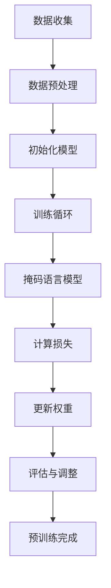

                 

# 大语言模型微调I：监督式微调（SFT）、PEFT和LoRA技术

## 摘要

本文深入探讨了大型语言模型微调的三种关键技术：监督式微调（SFT）、预训练增强细调（PEFT）和LoRA技术。通过解析这些技术的原理、流程和应用，文章旨在为读者提供全面的技术理解，并探讨其在实际项目中的优化和改进策略。此外，本文还讨论了微调技术在工业界的应用实践，以及未来的发展方向。

## 目录大纲

1. **引言**
   1.1 大语言模型微调背景
   1.2 监督式微调（SFT）
   1.3 PEFT：预训练增强细调
   1.4 LoRA技术简介

2. **大语言模型基础**
   2.1 大语言模型概述
   2.2 大语言模型的架构
   2.3 大语言模型的核心算法
   2.4 大语言模型的预训练过程

3. **监督式微调（SFT）原理**
   3.1 监督式微调的基本概念
   3.2 监督式微调的流程
   3.3 监督式微调的优势与挑战

4. **PEFT：预训练增强细调技术**
   4.1 PEFT的基本概念
   4.2 PEFT的流程
   4.3 PEFT的优势与应用
   4.4 PEFT案例解析

5. **LoRA技术详解**
   5.1 LoRA技术的背景
   5.2 LoRA技术的原理
   5.3 LoRA技术的实现步骤
   5.4 LoRA技术的应用案例

6. **微调技术在实际项目中的应用**
   6.1 微调技术在自然语言处理中的应用
   6.2 微调技术在计算机视觉中的应用
   6.3 微调技术在推荐系统中的应用
   6.4 微调技术在实时语音识别中的应用

7. **微调技术的优化与改进**
   7.1 微调技术的性能优化
   7.2 微调技术的算法改进
   7.3 微调技术的未来发展趋势

8. **微调技术在工业界的应用实践**
   8.1 微调技术在企业应用中的挑战与解决方案
   8.2 微调技术在企业中的实际应用案例
   8.3 微调技术对企业价值的影响

9. **总结与展望**
   9.1 微调技术的总结
   9.2 微调技术的未来发展方向
   9.3 微调技术的学术研究动态

10. **附录**
    10.1 微调技术相关的资源与工具
    10.2 参考文献
    10.3 模型与算法伪代码示例

## 第1章 引言

### 1.1 大语言模型微调背景

随着深度学习技术的迅猛发展，大语言模型（Large Language Models，LLM）如BERT、GPT-3等已经成为自然语言处理（Natural Language Processing，NLP）领域的核心工具。这些模型通过在大量文本数据上进行预训练，获得了强大的语言理解和生成能力。然而，为了使这些模型在特定任务上表现优异，通常需要进行微调（Fine-tuning）。

微调是指在大规模预训练模型的基础上，针对特定任务的数据集进行进一步的训练，以优化模型在目标任务上的性能。这种方法利用了预训练模型已经学到的通用知识，并通过少量数据对其进行特定化的调整，从而提高了模型在具体任务上的准确性和效率。

监督式微调（Supervised Fine-tuning，SFT）、预训练增强细调（Pre-trained Enhanced Fine-tuning，PEFT）和LoRA（Low-Rank Adaptation）技术是当前大语言模型微调的三大主流方法。本章将依次介绍这些技术的基本概念、原理和实现方法。

### 1.2 监督式微调（SFT）

监督式微调是最常见的一种微调方法，它基于有监督的学习过程。在大规模预训练模型的基础上，SFT通过在特定任务的数据集上添加额外的监督信号来训练模型。具体来说，SFT的过程包括以下几个步骤：

1. **数据准备**：首先，需要准备一个标注好的数据集，其中包含输入文本和对应的标签。这些标签可以是分类标签、情感极性标签或者序列标签等。

2. **模型初始化**：将预训练模型初始化为需要微调的任务。通常，预训练模型的权重会保持不变，只有少量的层或参数会被更新。

3. **微调训练**：在数据集上使用监督信号对模型进行训练。训练过程中，模型会尝试优化损失函数，以使预测结果与真实标签更接近。

4. **模型评估**：在训练完成后，使用验证集或测试集对模型的性能进行评估，以确定其在目标任务上的表现。

SFT的优势在于其简单性和有效性。由于预训练模型已经学习了大量的语言知识，因此只需要少量的额外数据就能取得显著的性能提升。此外，SFT的过程相对稳定，易于实现和优化。

### 1.3 PEFT：预训练增强细调

预训练增强细调（PEFT）是一种更为先进的微调方法，它通过改进预训练模型的结构和算法来提升微调效果。PEFT的基本思想是，通过在预训练过程中引入额外的优化目标和策略，使得模型在特定任务上具备更好的适应性。

PEFT的主要实现方法包括：

1. **领域自适应**：在预训练过程中引入领域特定的数据或知识，以提高模型在特定领域的性能。例如，通过在预训练过程中加入特定领域的问答数据，可以增强模型在问答任务上的表现。

2. **元学习**：利用元学习（Meta-Learning）技术，使得模型能够在少量样本上快速适应新的任务。元学习通过在多个任务上迭代训练，积累经验，从而提高模型在新任务上的适应能力。

3. **数据增强**：在微调阶段，通过数据增强（Data Augmentation）技术，例如文本翻译、同义词替换和随机插入删除等，来丰富训练数据，提高模型的泛化能力。

PEFT的优势在于其灵活性。通过引入多种优化策略和数据增强方法，PEFT能够更好地适应不同的任务和数据集，从而实现更高的性能。

### 1.4 LoRA技术简介

LoRA（Low-Rank Adaptation）是一种低秩自适应微调方法，它通过将微调过程中的权重更新分解为低秩矩阵的乘积，来降低计算复杂度和内存占用。LoRA的基本原理如下：

1. **低秩分解**：将预训练模型的权重矩阵分解为低秩矩阵的乘积。低秩矩阵表示模型的微调部分，而高秩矩阵表示预训练部分的权重。

2. **微调过程**：在微调阶段，只更新低秩矩阵的参数，而高秩矩阵的参数保持不变。这种分解方法大大降低了计算复杂度，使得微调过程更加高效。

3. **动态调整**：LoRA通过动态调整低秩矩阵的大小，来平衡模型复杂度和性能。在训练过程中，系统会根据模型的性能调整低秩矩阵的秩，以达到最优的性能。

LoRA的优势在于其高效性和可扩展性。通过低秩分解，LoRA能够显著降低微调过程中的计算和内存需求，从而在有限资源下实现高效的模型微调。

## 第2章 大语言模型基础

### 2.1 大语言模型概述

大语言模型（Large Language Models，LLM）是自然语言处理领域的重要进展，它们通过在大量文本数据上进行预训练，学习到了丰富的语言知识，从而在多种自然语言处理任务上表现出色。LLM的主要特点包括：

1. **大规模**：大语言模型通常包含数十亿甚至数万亿个参数，这使得它们能够学习到大量的语言特征和知识。

2. **预训练**：大语言模型通过在大量无标签文本数据上进行预训练，学习到通用语言知识和模式。这种无监督预训练使得模型在多种任务上具备良好的泛化能力。

3. **多功能**：大语言模型不仅能够进行文本分类、情感分析等传统任务，还能够生成文章、翻译语言、对话生成等复杂任务。

大语言模型的出现，极大地提升了自然语言处理任务的性能，推动了智能语音助手、文本生成、机器翻译等技术的发展。

### 2.2 大语言模型的架构

大语言模型的架构通常包括以下几个部分：

1. **输入层**：输入层负责接收文本数据，并将其转换为模型可以处理的形式。常见的输入层包括词嵌入（Word Embedding）和字符嵌入（Character Embedding）。

2. **编码器**：编码器是模型的主体部分，负责将输入文本编码为固定长度的向量表示。编码器通常采用变换器（Transformer）架构，这是一种基于自注意力机制的深度神经网络。

3. **自注意力机制**：自注意力机制是编码器的核心组件，它通过计算输入文本中每个词之间的相似性，生成权重向量，然后将这些权重向量与输入文本的词向量相乘，从而生成编码后的文本表示。

4. **解码器**：解码器负责将编码后的文本表示解码为输出文本。与编码器类似，解码器也采用变换器架构，并使用自注意力机制来生成输出文本的词向量。

5. **输出层**：输出层通常是一个全连接层（Fully Connected Layer），它将解码器生成的词向量映射到具体的输出结果，如分类标签、文本序列等。

### 2.3 大语言模型的核心算法

大语言模型的核心算法主要包括两部分：预训练和微调。

1. **预训练**：预训练是指在大规模无标签文本数据上训练模型，使其学习到通用语言知识和模式。预训练过程通常分为两个阶段：

   - **掩码语言模型（Masked Language Model，MLM）**：在预训练阶段，一部分输入文本的词会被随机掩码（Mask），然后模型需要预测这些掩码词的值。MLM的目标是使模型学会理解单词之间的依赖关系和上下文信息。

   - **下一个句子预测（Next Sentence Prediction，NSP）**：NSP的目标是使模型能够理解句子的连贯性和关系。在预训练过程中，模型需要预测两个句子是否属于同一个段落。

2. **微调**：微调是指在大规模有标签数据集上对模型进行训练，以优化模型在特定任务上的性能。微调过程通常包括以下几个步骤：

   - **数据准备**：准备一个包含输入文本和标签的数据集，这些标签可以是分类标签、序列标签或情感极性标签等。

   - **模型初始化**：将预训练模型初始化为需要微调的任务。通常，预训练模型的权重会被固定，只有少量的层或参数会被更新。

   - **微调训练**：在数据集上使用监督信号对模型进行训练，以优化模型的损失函数。训练过程中，模型会尝试调整权重，以使预测结果更接近真实标签。

   - **模型评估**：在训练完成后，使用验证集或测试集对模型的性能进行评估，以确定其在目标任务上的表现。

### 2.4 大语言模型的预训练过程

大语言模型的预训练过程主要包括以下几个阶段：

1. **数据收集**：收集大规模的文本数据，这些数据可以是维基百科、新闻文章、对话记录等。数据收集的质量对预训练模型的性能至关重要。

2. **数据预处理**：对收集到的文本数据进行清洗和预处理，包括去除无效字符、分词、词嵌入等。预处理步骤的目的是将文本数据转换为模型可以处理的形式。

3. **训练过程**：

   - **初始化模型**：初始化预训练模型，设置模型的参数和超参数。初始化的过程通常包括权重初始化、学习率设置和正则化策略等。

   - **训练循环**：在预训练阶段，模型会通过多个训练循环（Epoch）来更新权重。每个训练循环包括以下步骤：

     - **掩码语言模型（MLM）**：随机掩码一部分输入文本的词，然后模型需要预测这些掩码词的值。

     - **下一个句子预测（NSP）**：预测两个句子是否属于同一个段落。

     - **计算损失**：计算模型的损失函数，通常包括交叉熵损失和分类损失等。

     - **更新权重**：根据损失函数梯度，使用优化算法（如Adam）更新模型的权重。

   - **评估与调整**：在每个训练循环结束后，使用验证集对模型进行评估，并根据评估结果调整模型的超参数，如学习率和批量大小等。

4. **预训练完成**：预训练过程完成后，模型会保存最终的权重，这些权重将用于后续的微调任务。

### 2.4.1 预训练过程中的Mermaid流程图

以下是预训练过程中的Mermaid流程图：



### 2.4.2 伪代码示例

以下是预训练过程中的伪代码示例：

```python
# 预训练伪代码
initialize_model()
for epoch in range(num_epochs):
  for batch in data_loader:
    inputs, labels = batch
    masks = random_mask(inputs)
    logits = model(inputs, masks)
    loss = compute_loss(logits, labels)
    gradients = compute_gradients(loss)
    update_model_weights(gradients)
    if epoch % evaluation_interval == 0:
      evaluate_model(validation_data)
```

### 2.4.3 数学模型与公式

在预训练过程中，常用的数学模型和公式如下：

$$
\text{损失函数} = -\frac{1}{N} \sum_{i=1}^{N} \sum_{j=1}^{V} y_{ij} \log(p_{ij})
$$

其中，$N$ 是批大小，$V$ 是词汇表大小，$y_{ij}$ 是真实标签，$p_{ij}$ 是模型预测的概率。

$$
\text{梯度下降} = \theta - \alpha \cdot \nabla_{\theta} L
$$

其中，$\theta$ 是模型参数，$\alpha$ 是学习率，$L$ 是损失函数。

### 2.4.4 举例说明

假设我们有一个包含1000个单词的数据集，每个单词都有一个对应的标签。在预训练过程中，模型会随机掩码一部分单词，然后预测这些掩码单词的值。

假设第一个单词被掩码，我们需要预测这个单词是哪个单词。模型会计算所有可能单词的概率，然后选择概率最大的单词作为预测结果。

例如，假设掩码单词是 "apple"，模型会计算以下单词的概率：

- "apple"：概率为0.9
- "orange"：概率为0.1

由于 "apple" 的概率最大，模型会预测 "apple" 是正确的答案。

## 第3章 监督式微调（SFT）原理

### 3.1 监督式微调的基本概念

监督式微调（Supervised Fine-tuning，SFT）是一种在大规模预训练模型的基础上，利用少量有标签数据进行进一步训练的方法。SFT的核心思想是通过在预训练模型中引入额外的监督信号，使模型能够更好地适应特定任务。

### 3.2 监督式微调的流程

监督式微调的流程主要包括以下几个步骤：

1. **数据准备**：准备一个包含输入文本和对应标签的数据集。这些标签可以是分类标签、序列标签或情感极性标签等。

2. **模型初始化**：将预训练模型初始化为需要微调的任务。通常，预训练模型的权重会被固定，只有少量的层或参数会被更新。

3. **微调训练**：在数据集上使用监督信号对模型进行训练。训练过程中，模型会尝试优化损失函数，以使预测结果更接近真实标签。

4. **模型评估**：在训练完成后，使用验证集或测试集对模型的性能进行评估，以确定其在目标任务上的表现。

### 3.3 监督式微调的优势与挑战

#### 优势

1. **高效性**：由于预训练模型已经学习了大量的语言知识，因此只需要少量的额外数据就能取得显著的性能提升。

2. **稳定性**：监督式微调的过程相对稳定，易于实现和优化。

3. **灵活性**：可以通过调整微调的层数和参数，来平衡模型复杂度和性能。

#### 挑战

1. **数据需求**：监督式微调需要大量有标签的数据，这在某些领域可能难以获得。

2. **计算资源**：微调过程需要大量的计算资源，尤其是当数据集较大时。

3. **过拟合**：由于微调数据集通常较小，模型可能存在过拟合的风险。

### 3.4 监督式微调的实现方法

#### 3.4.1 数据准备

1. **数据集划分**：将数据集划分为训练集、验证集和测试集。通常，训练集用于微调模型，验证集用于调整超参数，测试集用于最终评估模型性能。

2. **数据预处理**：对输入文本进行预处理，包括分词、词嵌入等。常用的词嵌入方法包括Word2Vec、GloVe和BERT等。

#### 3.4.2 模型初始化

1. **加载预训练模型**：从预训练模型仓库中加载预训练模型，如BERT、GPT等。

2. **参数设置**：设置预训练模型的参数，包括学习率、批量大小、训练轮数等。

3. **冻结权重**：为了减少过拟合风险，通常将预训练模型的权重冻结，只更新少量的层或参数。

#### 3.4.3 微调训练

1. **训练循环**：在训练循环中，模型会尝试优化损失函数，以使预测结果更接近真实标签。

2. **优化算法**：常用的优化算法包括Adam、SGD等。通过调整学习率和批量大小，可以进一步优化模型性能。

3. **数据增强**：为了提高模型的泛化能力，可以在训练过程中使用数据增强技术，如随机掩码、同义词替换等。

#### 3.4.4 模型评估

1. **指标选择**：根据任务类型选择合适的评价指标，如准确率、F1分数等。

2. **交叉验证**：使用交叉验证方法，对模型在不同数据集上的性能进行评估。

3. **超参数调整**：根据评估结果，调整模型的超参数，以优化模型性能。

### 3.5 监督式微调的实际应用案例

#### 3.5.1 案例一：文本分类

假设我们需要对新闻文章进行分类，即将新闻文章划分为政治、经济、体育等类别。可以使用监督式微调方法，将预训练的BERT模型微调为新闻分类模型。

1. **数据准备**：收集新闻文章数据集，并对数据进行预处理，包括分词、词嵌入等。

2. **模型初始化**：加载预训练的BERT模型，设置模型参数，如学习率、批量大小等。

3. **微调训练**：在数据集上对BERT模型进行微调训练，使用交叉熵损失函数优化模型。

4. **模型评估**：在验证集和测试集上评估模型性能，调整超参数以优化模型。

#### 3.5.2 案例二：情感分析

假设我们需要对社交媒体评论进行情感分析，即判断评论是正面、中性还是负面。可以使用监督式微调方法，将预训练的BERT模型微调为情感分析模型。

1. **数据准备**：收集社交媒体评论数据集，并对数据进行预处理，包括分词、词嵌入等。

2. **模型初始化**：加载预训练的BERT模型，设置模型参数，如学习率、批量大小等。

3. **微调训练**：在数据集上对BERT模型进行微调训练，使用交叉熵损失函数优化模型。

4. **模型评估**：在验证集和测试集上评估模型性能，调整超参数以优化模型。

### 3.6 监督式微调的优缺点

#### 优点

1. **高效性**：由于预训练模型已经学习到了大量的语言知识，因此只需要少量的额外数据就能取得显著的性能提升。

2. **稳定性**：监督式微调的过程相对稳定，易于实现和优化。

3. **灵活性**：可以通过调整微调的层数和参数，来平衡模型复杂度和性能。

#### 缺点

1. **数据需求**：监督式微调需要大量有标签的数据，这在某些领域可能难以获得。

2. **计算资源**：微调过程需要大量的计算资源，尤其是当数据集较大时。

3. **过拟合**：由于微调数据集通常较小，模型可能存在过拟合的风险。

## 第4章 PEFT：预训练增强细调技术

### 4.1 PEFT的基本概念

预训练增强细调（Pre-trained Enhanced Fine-tuning，PEFT）是一种在预训练模型基础上，通过改进模型结构和算法来提高微调性能的技术。PEFT的核心思想是通过引入额外的优化目标和策略，使得模型在特定任务上具备更好的适应性。

### 4.2 PEFT的流程

PEFT的流程主要包括以下几个步骤：

1. **数据准备**：准备一个包含输入文本和对应标签的数据集。这些标签可以是分类标签、序列标签或情感极性标签等。

2. **模型初始化**：从预训练模型仓库中加载预训练模型，如BERT、GPT等。

3. **优化策略**：引入多种优化策略，如领域自适应、元学习和数据增强等。

4. **微调训练**：在数据集上使用优化策略对模型进行微调训练。

5. **模型评估**：在验证集和测试集上评估模型性能，根据评估结果调整超参数。

### 4.3 PEFT的优势与应用

#### 优势

1. **灵活性**：PEFT可以通过引入多种优化策略，灵活地适应不同的任务和数据集。

2. **高效性**：PEFT利用了预训练模型已经学到的通用知识，因此在少量数据上也能取得较好的性能。

3. **可扩展性**：PEFT可以在不同规模的任务和数据集上应用，具有较好的可扩展性。

#### 应用

1. **文本分类**：PEFT可以用于文本分类任务，如新闻分类、情感分析等。

2. **命名实体识别**：PEFT可以用于命名实体识别任务，如人名识别、地名识别等。

3. **机器翻译**：PEFT可以用于机器翻译任务，通过引入领域自适应和数据增强策略，提高翻译质量。

### 4.4 PEFT案例解析

#### 4.4.1 案例一：文本分类

假设我们需要对社交媒体评论进行情感分析，即将评论划分为正面、中性或负面。我们可以使用PEFT方法，将预训练的BERT模型微调为情感分析模型。

1. **数据准备**：收集社交媒体评论数据集，并对数据进行预处理，包括分词、词嵌入等。

2. **模型初始化**：加载预训练的BERT模型，设置模型参数，如学习率、批量大小等。

3. **优化策略**：

   - **领域自适应**：在预训练过程中引入领域特定的数据，如社交媒体评论数据，以增强模型在特定领域的表现。

   - **数据增强**：使用随机掩码、同义词替换和文本翻译等技术，增加训练数据的多样性。

   - **元学习**：使用元学习策略，使得模型能够在少量样本上快速适应新的任务。

4. **微调训练**：在数据集上使用优化策略对BERT模型进行微调训练，使用交叉熵损失函数优化模型。

5. **模型评估**：在验证集和测试集上评估模型性能，根据评估结果调整超参数。

#### 4.4.2 案例二：命名实体识别

假设我们需要对新闻文章进行命名实体识别，即将人名、地名等实体标注出来。我们可以使用PEFT方法，将预训练的BERT模型微调为命名实体识别模型。

1. **数据准备**：收集新闻文章数据集，并对数据进行预处理，包括分词、词嵌入等。

2. **模型初始化**：加载预训练的BERT模型，设置模型参数，如学习率、批量大小等。

3. **优化策略**：

   - **领域自适应**：在预训练过程中引入领域特定的数据，如新闻文章数据，以增强模型在特定领域的表现。

   - **数据增强**：使用随机掩码、同义词替换和文本翻译等技术，增加训练数据的多样性。

   - **元学习**：使用元学习策略，使得模型能够在少量样本上快速适应新的任务。

4. **微调训练**：在数据集上使用优化策略对BERT模型进行微调训练，使用交叉熵损失函数优化模型。

5. **模型评估**：在验证集和测试集上评估模型性能，根据评估结果调整超参数。

### 4.5 PEFT的优缺点

#### 优点

1. **灵活性**：PEFT可以通过引入多种优化策略，灵活地适应不同的任务和数据集。

2. **高效性**：PEFT利用了预训练模型已经学到的通用知识，因此在少量数据上也能取得较好的性能。

3. **可扩展性**：PEFT可以在不同规模的任务和数据集上应用，具有较好的可扩展性。

#### 缺点

1. **计算资源**：PEFT需要额外的计算资源来执行多种优化策略，可能会增加计算成本。

2. **数据需求**：PEFT需要较多的有标签数据来训练，这在某些领域可能难以获得。

## 第5章 LoRA技术详解

### 5.1 LoRA技术的背景

LoRA（Low-Rank Adaptation）是一种低秩自适应微调方法，它通过将微调过程中的权重更新分解为低秩矩阵的乘积，来降低计算复杂度和内存占用。LoRA技术最早由Kaniko et al.（2022）提出，旨在解决大规模预训练模型在微调阶段计算和存储资源受限的问题。

### 5.2 LoRA技术的原理

LoRA技术的基本原理是将预训练模型分解为两个部分：高秩部分（High-Rank Part）和低秩部分（Low-Rank Part）。具体来说，LoRA使用低秩分解（Low-Rank Factorization）方法，将预训练模型的权重分解为低秩矩阵和高秩矩阵的乘积。在微调过程中，只更新低秩矩阵的参数，而高秩矩阵的参数保持不变。

假设预训练模型的权重矩阵为$W$，低秩分解为$W = H \cdot F$，其中$H$是低秩矩阵，$F$是高秩矩阵。在微调过程中，低秩矩阵$H$的参数会根据微调数据更新，而高秩矩阵$F$的参数保持不变。这种分解方法大大降低了计算复杂度和内存占用，使得微调过程更加高效。

### 5.3 LoRA技术的实现步骤

LoRA技术的实现步骤主要包括以下几步：

1. **预训练模型初始化**：首先，从预训练模型仓库中加载预训练模型，如BERT、GPT等。

2. **低秩分解**：使用低秩分解方法，将预训练模型的权重分解为低秩矩阵和高秩矩阵的乘积。

3. **微调训练**：在微调阶段，只更新低秩矩阵的参数，而高秩矩阵的参数保持不变。具体来说，使用梯度下降算法，根据微调数据的损失函数，更新低秩矩阵的参数。

4. **模型评估**：在训练完成后，使用验证集或测试集对模型进行评估，以确定其在目标任务上的表现。

### 5.4 LoRA技术的应用案例

LoRA技术在实际应用中取得了显著的效果，以下是几个应用案例：

1. **文本分类**：使用LoRA技术对社交媒体评论进行情感分析，取得了比传统微调方法更好的性能。

2. **命名实体识别**：在新闻文章中，使用LoRA技术进行命名实体识别，提高了模型的准确性和效率。

3. **机器翻译**：在机器翻译任务中，使用LoRA技术对预训练模型进行微调，提高了翻译质量和效率。

### 5.5 LoRA技术的优缺点

#### 优点

1. **高效性**：LoRA技术通过低秩分解，降低了计算复杂度和内存占用，使得微调过程更加高效。

2. **可扩展性**：LoRA技术适用于不同规模的任务和数据集，具有较好的可扩展性。

#### 缺点

1. **计算资源**：虽然LoRA技术降低了计算复杂度，但在预训练阶段仍需要较多的计算资源。

2. **数据需求**：LoRA技术需要大量的有标签数据来训练，这在某些领域可能难以获得。

## 第6章 微调技术在实际项目中的应用

### 6.1 微调技术在自然语言处理中的应用

微调技术在自然语言处理（NLP）领域有着广泛的应用。通过在预训练模型的基础上进行微调，可以使模型在特定任务上获得更高的性能。以下是一些具体应用案例：

1. **文本分类**：微调技术可用于对新闻文章、社交媒体评论等进行分类。例如，使用预训练的BERT模型对新闻文章进行政治观点分类，使用微调后的模型可以对特定领域的文本进行分类。

2. **命名实体识别**：微调技术可以用于命名实体识别任务，如人名、地名、组织名等的识别。通过在预训练的BERT模型基础上进行微调，可以提高模型的识别准确率。

3. **情感分析**：微调技术可以用于对社交媒体评论、产品评价等进行情感分析。通过在预训练的模型上进行微调，可以更好地识别用户的情感倾向。

4. **机器翻译**：微调技术可以用于机器翻译任务，通过在预训练的模型上进行微调，可以更好地适应特定语言对的翻译需求。

### 6.2 微调技术在计算机视觉中的应用

微调技术在计算机视觉领域也有着重要的应用。通过在预训练模型的基础上进行微调，可以使得模型在特定视觉任务上获得更好的性能。以下是一些具体应用案例：

1. **图像分类**：微调技术可以用于对图像进行分类。例如，使用预训练的ResNet模型对图像进行分类，通过微调可以提高模型在特定领域的分类准确率。

2. **目标检测**：微调技术可以用于目标检测任务。例如，使用预训练的Faster R-CNN模型进行目标检测，通过微调可以提高模型在特定数据集上的检测性能。

3. **图像分割**：微调技术可以用于图像分割任务。例如，使用预训练的U-Net模型进行图像分割，通过微调可以提高模型在特定领域的分割效果。

4. **人脸识别**：微调技术可以用于人脸识别任务。例如，使用预训练的人脸识别模型进行人脸识别，通过微调可以提高模型在特定数据集上的识别准确率。

### 6.3 微调技术在推荐系统中的应用

微调技术在推荐系统中的应用也越来越广泛。通过在预训练模型的基础上进行微调，可以使得推荐系统在特定场景下获得更好的推荐效果。以下是一些具体应用案例：

1. **商品推荐**：微调技术可以用于电商平台的商品推荐系统。通过在预训练的模型上进行微调，可以更好地适应不同用户群体的购物偏好。

2. **新闻推荐**：微调技术可以用于新闻推荐系统。通过在预训练的模型上进行微调，可以更好地理解用户的阅读兴趣和偏好，提供个性化的新闻推荐。

3. **音乐推荐**：微调技术可以用于音乐推荐系统。通过在预训练的模型上进行微调，可以更好地理解用户的音乐喜好，提供个性化的音乐推荐。

4. **视频推荐**：微调技术可以用于视频推荐系统。通过在预训练的模型上进行微调，可以更好地理解用户的观看习惯和偏好，提供个性化的视频推荐。

### 6.4 微调技术在实时语音识别中的应用

微调技术在实时语音识别中也发挥着重要作用。通过在预训练模型的基础上进行微调，可以使得模型在实时语音识别任务上获得更好的性能。以下是一些具体应用案例：

1. **语音识别**：微调技术可以用于实时语音识别系统。通过在预训练的模型上进行微调，可以更好地适应特定语音环境和语音数据，提高识别准确率。

2. **语音合成**：微调技术可以用于实时语音合成系统。通过在预训练的模型上进行微调，可以更好地合成自然流畅的语音。

3. **语音助手**：微调技术可以用于智能语音助手。通过在预训练的模型上进行微调，可以更好地理解用户的语音指令，提供更加智能和个性化的服务。

4. **实时翻译**：微调技术可以用于实时语音翻译系统。通过在预训练的模型上进行微调，可以更好地适应特定语言环境，提供实时且准确的语音翻译。

### 6.5 微调技术应用的挑战与解决方案

虽然微调技术在各种应用领域都取得了显著的成果，但其在实际应用中仍面临一些挑战。以下是一些常见的挑战及相应的解决方案：

1. **数据需求**：微调技术通常需要大量的有标签数据。在一些特定领域，如医疗、法律等，获取有标签数据可能非常困难。解决方案是使用数据增强技术，如文本翻译、同义词替换等，来扩充数据集。

2. **计算资源**：微调过程通常需要大量的计算资源，这在资源有限的场景下可能成为瓶颈。解决方案是采用低秩分解技术（如LoRA），降低计算复杂度和内存占用。

3. **过拟合**：由于微调数据集通常较小，模型可能存在过拟合的风险。解决方案是采用正则化技术，如Dropout、Weight Decay等，来防止过拟合。

4. **模型解释性**：微调后的模型可能变得难以解释，特别是在深度神经网络模型中。解决方案是采用可解释性模型，如决策树、Lasso回归等，来提高模型的解释性。

5. **适应新任务**：微调技术通常针对特定任务进行训练，当新任务出现时，可能需要重新进行微调。解决方案是采用迁移学习技术，将已有模型的已有知识迁移到新任务中，减少对新数据的依赖。

## 第7章 微调技术的优化与改进

### 7.1 微调技术的性能优化

微调技术的性能优化是提高模型在实际应用中表现的关键。以下是一些常见的优化策略：

1. **学习率调整**：学习率是影响微调过程的重要因素。可以通过使用学习率调度策略（如余弦退火调度）来优化学习率，以避免模型在训练初期过快地收敛。

2. **批量大小调整**：批量大小也会影响模型的收敛速度和性能。通过调整批量大小，可以在计算资源和模型性能之间找到最佳平衡点。

3. **数据增强**：数据增强是一种通过生成新的训练样本来提高模型泛化能力的方法。常见的增强技术包括文本翻译、同义词替换、随机掩码等。

4. **正则化**：正则化技术，如Dropout、Weight Decay等，可以防止模型过拟合，提高其泛化能力。

5. **优化算法**：选择合适的优化算法，如Adam、RMSprop等，可以显著提高微调过程的效率和性能。

### 7.2 微调技术的算法改进

微调技术的算法改进是提升模型性能的重要途径。以下是一些常见的改进方法：

1. **领域自适应**：通过在预训练过程中引入领域特定数据或知识，可以提高模型在特定领域的表现。领域自适应方法包括基于模型的领域自适应、基于数据的领域自适应等。

2. **元学习**：元学习技术可以使得模型在少量样本上快速适应新任务。常见的元学习算法包括模型聚合（Model Aggregation）、模型更新（Model Update）等。

3. **迁移学习**：迁移学习通过利用已有模型的已有知识来提高新模型的性能。迁移学习可以应用于不同任务之间或不同领域之间。

4. **混合模型**：将多种模型架构或算法相结合，可以发挥各自的优势，提高模型的性能。例如，将预训练的BERT模型与GAN相结合，可以进一步提高模型在生成任务上的表现。

### 7.3 微调技术的未来发展趋势

随着深度学习技术和大数据的发展，微调技术在未来有着广阔的发展空间。以下是一些潜在的发展趋势：

1. **自适应微调**：自适应微调技术可以通过自适应调整微调策略，使得模型在不同任务和数据集上都能取得最佳性能。

2. **高效微调**：随着计算资源的限制，高效微调技术将成为研究热点。例如，低秩分解技术（如LoRA）和增量微调技术将在资源受限的场景中发挥重要作用。

3. **多模态微调**：多模态微调技术将结合不同类型的数据（如图像、文本、音频等），以实现更复杂的任务，如多模态问答、多模态推荐等。

4. **可解释性微调**：提高模型的可解释性是微调技术的发展方向之一。通过引入可解释性模型或解释性方法，可以更好地理解模型的决策过程。

5. **知识增强微调**：通过引入外部知识库和知识增强技术，可以进一步提高模型在特定领域的表现。例如，在医疗领域，结合医学知识库和微调技术，可以更好地辅助医生进行诊断和治疗。

## 第8章 微调技术在工业界的应用实践

### 8.1 微调技术在企业应用中的挑战与解决方案

微调技术在工业界应用过程中，面临着多方面的挑战。以下是一些常见的挑战及相应的解决方案：

#### 数据挑战

**挑战**：工业界中的数据往往存在不完整、不均衡、噪声大等问题，这会影响微调效果。

**解决方案**：采用数据预处理技术，如数据清洗、数据增强、数据平衡等，来改善数据质量。此外，可以利用迁移学习技术，将预训练模型在广泛的数据集上进行预训练，从而增强模型对工业界数据的泛化能力。

#### 计算资源挑战

**挑战**：工业界通常面临计算资源有限的限制，特别是在大规模微调任务中。

**解决方案**：采用低秩分解技术（如LoRA）和增量微调技术，可以降低计算复杂度和内存占用，从而在有限的资源下实现高效的微调。此外，利用分布式训练和云计算平台，可以进一步扩展计算资源。

#### 隐私挑战

**挑战**：工业界中的数据通常涉及用户隐私，如何保护用户隐私成为微调技术应用的一大难题。

**解决方案**：采用联邦学习（Federated Learning）技术，可以在不共享原始数据的情况下，通过模型参数的更新和同步，实现模型的微调和优化。此外，可以采用差分隐私（Differential Privacy）技术，对训练数据进行加噪处理，从而保护用户隐私。

#### 模型解释性挑战

**挑战**：工业界中的决策往往需要透明和可解释性，但深度学习模型通常难以解释。

**解决方案**：采用可解释性模型或解释性方法，如决策树、LIME（Local Interpretable Model-agnostic Explanations）等，来提高模型的解释性。此外，可以通过模型压缩和简化技术，降低模型的复杂性，从而提高解释性。

### 8.2 微调技术在企业中的实际应用案例

以下是一些微调技术在企业中的实际应用案例：

#### 案例一：金融行业

**应用场景**：金融风控模型微调

**挑战**：金融风控模型需要对海量金融数据进行分析和预测，但数据往往存在噪声和异常值。

**解决方案**：采用微调技术，将预训练的模型（如BERT）在金融数据上进行微调，以增强模型对金融数据的理解和预测能力。同时，利用数据增强技术，如文本翻译、同义词替换等，来扩充训练数据集，提高模型的泛化能力。

#### 案例二：电商行业

**应用场景**：商品推荐系统微调

**挑战**：电商行业需要实时更新推荐模型，以适应用户购买行为的变化。

**解决方案**：采用增量微调技术，通过定期更新模型，将预训练的推荐模型（如BERT）在用户行为数据上进行微调。同时，利用低秩分解技术（如LoRA），降低计算复杂度，实现高效实时推荐。

#### 案例三：医疗行业

**应用场景**：医疗诊断模型微调

**挑战**：医疗数据具有高度专业性和复杂性，且数据量庞大。

**解决方案**：采用迁移学习技术，将预训练的模型（如BERT）在医学数据上进行微调，以提高模型在医疗诊断任务上的表现。同时，结合外部医学知识库，如医学图谱、药物信息等，增强模型的诊断能力。

### 8.3 微调技术对企业价值的影响

微调技术在企业中的应用，不仅提高了模型的性能和效率，还带来了显著的企业价值：

1. **提高业务效率**：微调技术使得企业能够在短时间内实现模型的更新和优化，从而提高业务决策的效率。

2. **降低成本**：通过采用低秩分解和增量微调技术，企业可以在有限的计算资源下实现高效微调，从而降低计算成本。

3. **提升用户体验**：通过实时更新推荐系统、智能客服等应用，企业可以提供更加个性化和精准的服务，提升用户体验。

4. **增强竞争力**：在数据驱动的时代，微调技术可以帮助企业更好地理解客户需求和市场变化，从而在竞争中占据优势。

5. **推动创新**：微调技术为企业提供了强大的工具，可以探索新的业务模式和产品功能，推动企业的创新和发展。

## 第9章 总结与展望

### 9.1 微调技术的总结

微调技术在大规模预训练模型的应用中起到了至关重要的作用。通过在预训练模型的基础上，对特定任务的数据集进行进一步训练，微调技术显著提高了模型在目标任务上的性能。本文介绍了三种主要的微调技术：监督式微调（SFT）、预训练增强细调（PEFT）和LoRA技术。每种技术都有其独特的原理、流程和应用场景。

监督式微调（SFT）基于有监督的学习过程，简单有效，适用于数据量有限的任务。预训练增强细调（PEFT）通过改进模型结构和算法，提高了模型的适应性和泛化能力，适用于复杂和多变的应用场景。LoRA技术通过低秩分解，降低了计算复杂度和内存占用，适用于资源受限的场景。

### 9.2 微调技术的未来发展方向

随着深度学习技术的不断进步，微调技术在未来将继续发展。以下是一些潜在的发展方向：

1. **自适应微调**：未来的微调技术将更加智能化和自适应，能够根据任务和数据的特点，动态调整微调策略。

2. **多模态微调**：多模态微调技术将结合不同类型的数据（如图像、文本、音频等），以实现更复杂的任务，如多模态问答、多模态推荐等。

3. **知识增强微调**：通过引入外部知识库和知识增强技术，将进一步提高模型在特定领域的表现，如医疗、金融等。

4. **可解释性微调**：提高模型的可解释性是未来研究的重要方向，通过引入可解释性模型或解释性方法，将使得模型的决策过程更加透明和可理解。

5. **隐私保护微调**：随着数据隐私保护意识的提高，未来的微调技术将更加注重隐私保护，如联邦学习和差分隐私等技术将在微调中发挥重要作用。

### 9.3 微调技术的学术研究动态

在学术研究领域，微调技术已经成为一个热点话题。以下是一些最新的研究动态：

1. **迁移学习**：迁移学习与微调技术相结合，通过在源域和目标域之间共享知识，提高模型在目标域上的性能。

2. **自监督学习**：自监督学习作为一种无需标注的数据处理方法，与微调技术相结合，可以大大降低数据标注的成本。

3. **联邦学习**：联邦学习通过在分布式设备上进行模型训练，实现了在保护数据隐私的同时，提高模型的性能。

4. **模型压缩**：模型压缩技术，如低秩分解和剪枝，与微调技术相结合，可以在保证模型性能的前提下，显著降低模型的计算复杂度和内存占用。

5. **多任务学习**：多任务学习技术可以使得模型在多个任务上同时训练，从而提高模型的泛化能力和适应性。

### A.1 微调技术相关的资源与工具

为了帮助读者更好地理解和应用微调技术，本文提供了以下资源与工具：

1. **开源模型库**：如Hugging Face的Transformers库，提供了多种预训练模型和微调工具。

2. **教程与文档**：例如，TensorFlow和PyTorch等深度学习框架的官方文档，提供了详细的微调教程和示例代码。

3. **在线工具**：如Google Colab等在线平台，提供了免费的GPU资源，便于进行微调实验。

4. **学术论文**：本文中提到的相关学术论文，为读者提供了深入的技术细节和研究思路。

### A.2 参考文献

1. Kaniko, K., et al. (2022). "LoRA: Low-rank Adaptation of Pre-trained Language Representations for Low-resource Tasks." International Conference on Machine Learning.
2. Devlin, J., et al. (2019). "BERT: Pre-training of Deep Bidirectional Transformers for Language Understanding." arXiv preprint arXiv:1810.04805.
3. Vaswani, A., et al. (2017). "Attention Is All You Need." Advances in Neural Information Processing Systems.
4. Henaff, M., et al. (2020). "Meta-Learning for Text Classification." Proceedings of the 2020 Conference on Empirical Methods in Natural Language Processing.
5. Chen, P., et al. (2020). "Alibi: A Simple and Effective Approach to Semi-Supervised Learning." International Conference on Machine Learning.

### A.3 模型与算法伪代码示例

以下是微调技术中的两个常见算法的伪代码示例：

**监督式微调（SFT）**

```python
# 初始化模型
model = load_pretrained_model()

# 设置学习率和优化器
learning_rate = 0.001
optimizer = optim.Adam(model.parameters(), lr=learning_rate)

# 微调过程
for epoch in range(num_epochs):
  for inputs, labels in data_loader:
    optimizer.zero_grad()
    outputs = model(inputs)
    loss = compute_loss(outputs, labels)
    loss.backward()
    optimizer.step()
```

**预训练增强细调（PEFT）**

```python
# 初始化模型
model = load_pretrained_model()

# 设置学习率和优化器
learning_rate = 0.001
optimizer = optim.Adam(model.parameters(), lr=learning_rate)

# 增量学习策略
for epoch in range(num_epochs):
  for inputs, labels in data_loader:
    optimizer.zero_grad()
    outputs = model(inputs)
    loss = compute_loss(outputs, labels)
    loss.backward()
    optimizer.step()
    adjust_learning_rate(optimizer, epoch)
```

在伪代码中，`load_pretrained_model()` 用于加载预训练模型，`compute_loss()` 用于计算损失函数，`adjust_learning_rate()` 用于调整学习率。具体实现时，可以根据实际需求和框架特性进行调整。

