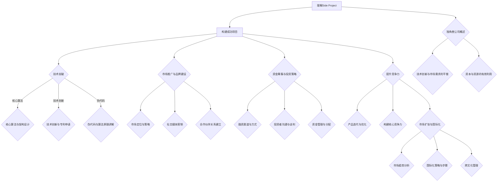
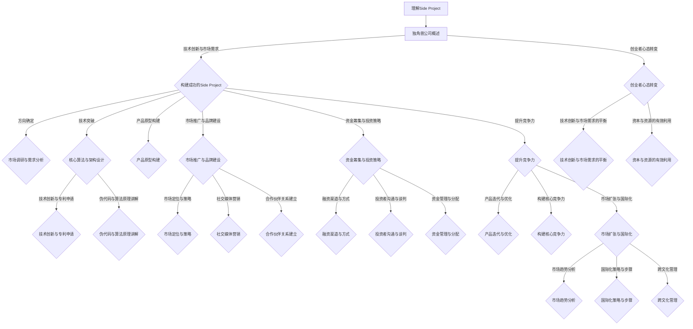

                 

### 《如何将Side Project转化为独角兽》

#### 关键词：
- Side Project
- 独角兽公司
- 创新与市场
- 技术突破
- 资金筹集
- 国际化扩张

#### 摘要：
本文旨在探讨如何将个人项目（Side Project）转化为成功的独角兽公司。我们将从理解Side Project和独角兽公司的概念出发，逐步分析技术突破、市场推广、资金筹集等关键步骤，并通过成功案例分享，为创业者提供有价值的参考和启示。

### 第一部分：理解Side Project与独角兽公司

#### 1.1 Side Project的起源与定义

**1.1.1 Side Project的概念**

Side Project通常指的是在非全职工作或学习之外，个人或团队为了兴趣、学习或探索新技术而开发的项目。这类项目往往起源于个人的创意或技术探索，不涉及商业目的。

**1.1.2 Side Project与个人兴趣**

Side Project往往与个人的兴趣密切相关。对技术的热爱、对特定领域的深入研究和探索，是驱动个人开展这些项目的重要动力。例如，许多程序员会在业余时间开发开源项目，以此来提升自己的编程技能或解决特定问题。

**1.1.3 Side Project的优势与局限**

**优势：**
- **自由度高**：个人可以自主选择项目方向，不受商业压力限制。
- **快速迭代**：由于不受公司流程限制，项目可以快速迭代和优化。
- **技能提升**：通过实践，个人可以在技术、项目管理等方面获得宝贵经验。

**局限：**
- **资源有限**：个人在时间、资金和人力资源上存在限制，可能影响项目的发展。
- **商业化困难**：大多数Side Project在初期难以找到商业化途径，面临盈利难题。

#### 1.2 独角兽公司的概述

**1.2.1 独角兽公司的定义**

独角兽公司是指成立时间相对较短（通常不超过10年），估值超过10亿美元的未上市科技公司。这些公司通常在技术创新、商业模式等方面具有独特优势。

**1.2.2 独角兽公司的特征**

- **高增长率**：独角兽公司通常在短时间内实现快速增长，年增长率可达50%以上。
- **技术创新**：独角兽公司通常在人工智能、大数据、生物科技等前沿领域具有领先的技术。
- **资本驱动**：独角兽公司通常通过多轮融资获得大量资本支持，以推动公司快速发展。

**1.2.3 独角兽公司的市场价值**

独角兽公司不仅代表着技术创新的先锋，也具备巨大的市场价值。它们往往成为资本市场的宠儿，吸引大量风险投资和私募股权投资。同时，独角兽公司对产业链的上下游企业产生深远影响，推动整个行业的发展。

#### 1.3 Side Project与独角兽公司之间的联系

**1.3.1 创业者的心态转变**

将Side Project转化为独角兽公司，首先需要创业者心态的转变。从兴趣驱动到商业驱动，从个人探索到团队协作，创业者需要不断调整自己的角色和定位。

**1.3.2 技术创新与市场需求的平衡**

技术创新与市场需求的平衡是关键。创业者需要在技术突破和市场适应性之间找到最佳平衡点，确保项目具有可持续的商业价值。

**1.3.3 资本与资源的有效利用**

资本和资源的有效利用是独角兽公司快速成长的重要保障。创业者需要合理规划资金使用，确保资源在研发、市场推广、团队建设等方面的高效利用。

### 第二部分：构建成功的Side Project

#### 2.1 确定Side Project的方向

**2.1.1 市场调研与需求分析**

在确定Side Project的方向时，市场调研与需求分析至关重要。通过深入了解目标市场的规模、增长趋势和消费者需求，创业者可以找到具有潜力的商业机会。

**2.1.2 技术可行性分析**

技术可行性分析是项目成功的关键。创业者需要评估所选技术方案的可行性，确保项目在技术层面有足够的支撑。

**2.1.3 核心团队组建**

核心团队的组建是项目成功的重要保障。创业者需要找到志同道合的合作伙伴，共同推动项目的发展。

#### 2.2 实现技术突破

**2.2.1 核心算法与架构设计**

核心算法与架构设计是技术突破的关键。以下为一种可能的伪代码描述：

```python
# 伪代码：核心算法
def core_algorithm(data):
    # 数据预处理
    preprocessed_data = preprocess(data)
    # 训练模型
    model = train_model(preprocessed_data)
    # 预测
    predictions = model.predict(preprocessed_data)
    return predictions

# 数据预处理
def preprocess(data):
    # 数据清洗
    cleaned_data = clean_data(data)
    # 特征提取
    extracted_features = extract_features(cleaned_data)
    return extracted_features

# 训练模型
def train_model(data):
    # 构建模型
    model = build_model()
    # 训练
    model.fit(data, epochs=10)
    return model
```

**2.2.2 技术创新与专利申请**

技术创新是提升Side Project竞争力的关键。以下为技术创新的步骤：

1. **市场调研**：了解市场需求和技术趋势。
2. **技术研发**：基于调研结果，开展技术研发。
3. **专利申请**：对创新成果进行专利申请，保护知识产权。

**2.2.3 伪代码与算法原理讲解**

以下为一种可能的伪代码与算法原理讲解：

```python
# 伪代码：线性回归算法
def linear_regression(x, y):
    # 求斜率
    slope = (y_mean - x_mean) / (x_var + epsilon)
    # 求截距
    intercept = y_mean - slope * x_mean
    # 预测
    prediction = slope * x + intercept
    return prediction

# 算法原理：
# 线性回归是一种通过最小化残差平方和来拟合数据的算法。其核心思想是通过找到最佳拟合线（斜率和截距）来预测新的数据点。
# 具体实现中，可以通过计算斜率和截距来预测数据点的值。
```

#### 2.3 构建产品原型

**2.3.1 产品设计思路**

产品设计思路是构建产品原型的重要环节。以下为一种可能的产品设计思路：

1. **用户需求分析**：通过访谈、问卷调查等方式，了解目标用户的需求。
2. **功能模块划分**：根据用户需求，划分产品功能模块。
3. **用户体验设计**：关注用户的使用流程和体验，确保产品易用性。

**2.3.2 用户测试与反馈**

用户测试与反馈是产品迭代的重要手段。通过邀请目标用户参与测试，收集他们的意见和建议，不断优化产品。

**2.3.3 开发环境搭建与调试**

开发环境搭建与调试是确保项目顺利进行的重要保障。以下为一种可能的开发环境搭建步骤：

1. **硬件配置**：选择合适的硬件设备，包括服务器、存储设备等。
2. **软件环境**：安装所需的操作系统、数据库、开发工具等。
3. **调试工具**：使用调试工具进行代码调试和性能优化。

#### 2.4 市场推广与品牌建设

**2.4.1 市场定位与策略**

市场定位与策略是市场推广的关键。以下为一种可能的市场定位策略：

1. **目标市场**：明确目标市场，包括行业、地域、用户群体等。
2. **差异化优势**：找出产品的差异化优势，以吸引目标用户。
3. **推广渠道**：选择合适的推广渠道，包括线上和线下渠道。

**2.4.2 社交媒体营销**

社交媒体营销是提高品牌知名度和用户参与度的重要手段。以下为一种可能的社交媒体营销策略：

1. **内容规划**：制定内容发布计划，包括文章、视频、图片等。
2. **互动营销**：通过评论、点赞、分享等方式，与用户互动。
3. **社交媒体广告**：使用社交媒体广告，精准定位目标用户。

**2.4.3 合作伙伴关系建立**

合作伙伴关系建立是市场推广的重要环节。以下为一种可能的合作伙伴关系建立策略：

1. **寻找合作伙伴**：根据市场需求，寻找合适的合作伙伴。
2. **合作模式**：明确合作模式，包括资源交换、联合推广等。
3. **合作效果评估**：定期评估合作效果，优化合作策略。

#### 2.5 资金筹集与投资策略

**2.5.1 融资渠道与方式**

资金筹集是项目成功的重要保障。以下为一种可能的融资渠道与方式：

1. **天使投资**：寻找天使投资者，提供早期资金支持。
2. **风险投资**：与风险投资机构合作，获得风险投资。
3. **银行贷款**：申请银行贷款，解决资金需求。

**2.5.2 投资者沟通与谈判**

投资者沟通与谈判是资金筹集的关键环节。以下为一种可能的投资者沟通与谈判策略：

1. **项目展示**：向投资者展示项目的技术优势、市场前景和团队实力。
2. **风险分析**：与投资者共同分析项目的风险，制定风险应对策略。
3. **谈判策略**：根据投资条件，制定谈判策略，争取最佳投资条款。

**2.5.3 资金管理与分配**

资金管理与分配是确保项目顺利进行的重要环节。以下为一种可能的资金管理与分配策略：

1. **预算编制**：根据项目需求，编制详细的预算。
2. **资金监控**：定期监控资金使用情况，确保预算执行。
3. **资金分配**：根据项目进度和需求，合理分配资金。

### 第三部分：提升Side Project的竞争力

#### 3.1 产品迭代与优化

**3.1.1 用户需求分析**

用户需求分析是产品迭代与优化的基础。以下为一种可能的用户需求分析方法：

1. **需求收集**：通过用户访谈、问卷调查等方式，收集用户需求。
2. **需求分类**：对收集到的需求进行分类，区分优先级。
3. **需求验证**：与用户沟通，验证需求的准确性和可行性。

**3.1.2 竞争对手分析**

竞争对手分析是产品迭代与优化的重要手段。以下为一种可能的竞争对手分析方法：

1. **竞争对手识别**：明确目标市场的竞争对手。
2. **竞争分析**：分析竞争对手的产品特点、优势和劣势。
3. **定位差异化**：找出自身产品的差异化优势，以应对竞争。

**3.1.3 产品迭代策略**

产品迭代策略是确保产品持续优化的重要保障。以下为一种可能的产品迭代策略：

1. **需求管理**：根据用户需求，制定产品迭代计划。
2. **功能迭代**：逐步实现用户需求，不断优化产品功能。
3. **性能优化**：关注产品性能，进行持续的性能优化。

#### 3.2 构建核心竞争力

**3.2.1 技术壁垒与壁垒突破**

技术壁垒是企业竞争力的关键。以下为构建技术壁垒的策略：

1. **技术创新**：持续进行技术研发，保持技术领先。
2. **专利布局**：通过专利申请，构建技术壁垒。
3. **人才引进与培养**：引进高端技术人才，提升团队技术实力。

**3.2.2 人才培养与团队建设**

人才培养与团队建设是企业长期发展的基础。以下为相关策略：

1. **人才招聘**：根据企业发展需求，引进合适的人才。
2. **培训与发展**：提供持续的技术培训和职业发展机会。
3. **团队建设**：建立高效的团队协作机制，提升团队凝聚力。

**3.2.3 企业文化塑造**

企业文化塑造是提升企业竞争力的重要手段。以下为一种可能的企业文化塑造策略：

1. **价值观传承**：明确企业核心价值观，并传递给全体员工。
2. **员工参与**：鼓励员工参与企业文化建设，共同塑造企业文化。
3. **文化活动**：定期举办文化活动，增强员工对企业文化的认同感。

#### 3.3 市场扩张与国际化

**3.3.1 市场趋势分析**

市场趋势分析是市场扩张的关键。以下为分析步骤：

1. **市场规模与增长**：分析目标市场的规模和增长趋势。
2. **竞争对手分析**：分析竞争对手的市场份额、优势和劣势。
3. **消费者需求**：分析目标消费者的需求变化。

**3.3.2 国际化策略与步骤**

国际化策略与步骤如下：

1. **市场调研**：了解目标国际市场的特点和需求。
2. **本地化策略**：根据目标市场的特点，制定本地化策略。
3. **营销推广**：通过合适的渠道和方式，进行国际市场推广。
4. **合作伙伴关系**：与当地企业建立合作伙伴关系，共同开拓市场。

**3.3.3 跨文化管理**

跨文化管理是国际化过程中的重要环节。以下为一种可能的跨文化管理策略：

1. **文化培训**：为员工提供跨文化培训，提高跨文化沟通能力。
2. **文化融合**：鼓励多元文化在企业内部融合，形成包容性的企业文化。
3. **文化适应**：根据当地文化特点，调整企业运营策略，实现文化适应。

### 第四部分：成功案例分享与启示

#### 4.1 成功案例分享

**4.1.1 案例一：从初创到独角兽的逆袭**

某初创公司通过技术创新和卓越的市场推广，成功将一款智能语音助手项目转化为独角兽公司。以下是案例分享：

1. **技术创新**：研发团队不断优化算法，提高语音识别准确率和响应速度。
2. **市场推广**：通过社交媒体和广告，迅速提高品牌知名度。
3. **用户反馈**：收集用户反馈，持续优化产品功能。

**4.1.2 案例二：技术创新推动市场扩张**

某科技公司通过技术创新，推出一款基于人工智能的智能客服系统，成功拓展市场。以下是案例分享：

1. **技术创新**：研发团队专注于人工智能技术的研究，提高客服系统的智能程度。
2. **市场定位**：明确目标市场，制定差异化市场策略。
3. **合作伙伴**：与各大企业建立战略合作关系，共同拓展市场。

**4.1.3 案例三：资本市场助力快速成长**

某初创公司通过多轮融资，获得大量资本支持，实现快速发展。以下是案例分享：

1. **融资策略**：制定合理的融资计划，选择合适的融资渠道。
2. **投资者关系**：积极与投资者沟通，建立良好的合作关系。
3. **资金使用**：合理规划资金使用，确保项目顺利进行。

#### 4.2 启示与建议

**4.2.1 创业者应具备的素质**

创业者应具备以下素质：

1. **创新思维**：具有创新意识，敢于尝试新事物。
2. **坚韧不拔**：面对困难和挑战，能够坚持不懈。
3. **团队协作**：具备良好的团队协作能力，能够凝聚团队力量。

**4.2.2 成功的关键因素**

成功的关键因素包括：

1. **技术创新**：持续进行技术创新，保持技术领先。
2. **市场定位**：明确市场定位，制定差异化市场策略。
3. **资金筹集**：合理筹集资金，确保项目顺利进行。

**4.2.3 面对挑战的应对策略**

面对挑战，创业者应采取以下策略：

1. **风险分析**：提前识别潜在风险，制定应对措施。
2. **灵活调整**：根据市场变化，及时调整发展战略。
3. **合作共赢**：与合作伙伴建立良好的合作关系，共同应对挑战。

### 附录

#### 附录 A：常用工具与资源

**A.1 开发工具推荐**

- **代码编辑器**：Visual Studio Code、Sublime Text、Atom等
- **版本控制系统**：Git、SVN
- **数据库**：MySQL、PostgreSQL、MongoDB
- **前端框架**：React、Vue.js、Angular
- **后端框架**：Spring Boot、Django、Node.js

**A.2 市场调研与数据分析工具**

- **市场调研工具**：Google Trends、Ahrefs、SEMrush
- **数据分析工具**：Tableau、Power BI、Google Analytics
- **用户调研工具**：SurveyMonkey、Typeform、Qualtrics

**A.3 投资与融资渠道**

- **天使投资**：AngelList、SeedInvest
- **风险投资**：Founders Fund、Andreessen Horowitz
- **众筹平台**：Kickstarter、Indiegogo
- **银行贷款**：中小企业银行贷款
- **政府补贴与扶持**：国家高新技术企业扶持、中小企业发展基金

#### 附录 B：参考书籍与论文

**B.1 《创业维艰》**

- 作者：本·霍洛维茨
- 简介：讲述了创业者面临的各种挑战和困境，以及如何应对和解决。

**B.2 《创新者的窘境》**

- 作者：克莱顿·克里斯滕森
- 简介：分析了为什么好的企业会失败，以及如何通过创新来避免这种情况。

**B.3 《创业公司》**

- 作者：彼得·蒂尔
- 简介：讲述了如何创建和运营一家成功的创业公司，包括融资、团队建设、市场推广等方面的策略。

### 结束语

本文从理解Side Project和独角兽公司的概念出发，逐步分析了如何将Side Project转化为成功的独角兽公司。通过市场调研、技术创新、资金筹集、市场推广等方面的详细阐述，为创业者提供了有价值的参考和启示。希望读者能够从中获得灵感，勇于尝试，实现自己的创业梦想。

#### 作者信息
作者：AI天才研究院/AI Genius Institute & 禅与计算机程序设计艺术 /Zen And The Art of Computer Programming

--------------------------

## 3.2.1 技术壁垒与壁垒突破

技术壁垒是企业竞争力的关键。构建技术壁垒不仅能够提升企业的核心竞争力，还能在一定程度上保护企业的市场份额。以下为构建技术壁垒的策略：

### 1. 技术创新

持续进行技术创新是构建技术壁垒的核心。通过不断研发新技术、新算法，企业可以在行业中保持领先地位。例如，谷歌在搜索引擎算法上的持续创新，使得其能够在搜索引擎市场中长期占据领先地位。

**案例**：特斯拉通过不断推进电动汽车技术，包括电池技术、自动驾驶技术等，成功建立了在电动汽车行业的技术壁垒。

### 2. 专利布局

专利布局是企业保护技术创新成果的重要手段。通过申请专利，企业可以保护自己的核心技术不被竞争对手模仿或侵权。有效的专利布局能够形成一道法律上的屏障，阻止竞争对手进入市场。

**案例**：亚马逊在电子商务领域拥有大量的专利，这些专利涵盖了从推荐系统到物流管理等多个方面，为亚马逊的市场领先地位提供了有力保障。

### 3. 知识产权保护

除了专利，企业还可以通过其他形式的知识产权保护来构建技术壁垒。例如，软件版权、商标、商业秘密等。这些知识产权能够进一步巩固企业的技术优势。

**案例**：微软通过软件版权保护，使其操作系统和办公软件在全球范围内享有极高的市场份额。

### 4. 人才引进与培养

人才是企业技术创新的重要推动力。通过引进高端技术人才，企业可以增强技术实力，构建技术壁垒。同时，对内部员工进行持续的技术培训，提升整个团队的技术水平。

**案例**：华为通过高薪吸引全球顶尖人才，同时提供丰富的培训机会，使其在5G技术领域保持领先地位。

### 5. 合作与开放创新

虽然技术壁垒有助于保护企业的竞争优势，但过度的保护可能导致企业创新能力的下降。通过合作与开放创新，企业可以吸收外部技术，加速自身技术创新。

**案例**：苹果通过与高通等公司合作，获取了5G通信技术，使其在智能手机市场中保持竞争力。

### 6. 市场差异化

技术壁垒不仅要在技术层面构建，还需要在市场层面实现差异化。通过差异化策略，企业可以在市场上形成独特的竞争优势。

**案例**：苹果通过其独特的硬件设计、操作系统和生态系统，成功在智能手机市场中建立了强大的品牌影响力。

### 7. 技术转让与合作

在某些情况下，企业可以通过技术转让或合作，与其他企业共享技术成果，同时保持自身的竞争优势。

**案例**：微软通过收购GitHub，不仅获取了宝贵的代码资源，还通过技术合作，与其他企业共同推动软件开发的创新。

### 8. 技术标准化

参与技术标准的制定，能够帮助企业影响行业的发展方向，从而构建技术壁垒。例如，IBM在计算机存储技术领域，通过推动ATA和SATA标准，确立了其行业领导地位。

**案例**：英特尔在计算机处理器领域，通过推动PCI Express和Thunderbolt标准，巩固了其在市场中的领先地位。

### 9. 知识产权战略规划

企业应制定长期的知识产权战略规划，确保在技术发展过程中，知识产权的保护和运用能够最大化地为企业带来价值。

**案例**：高通在移动通信领域，通过全面的知识产权战略，不仅保护了自己的技术，还在全球范围内建立了强大的专利组合。

### 10. 风险控制

在构建技术壁垒的过程中，企业需要关注技术风险。通过风险控制措施，确保技术创新不会导致过度依赖或资源浪费。

**案例**：谷歌在人工智能领域，通过多元化的技术布局和研发投资，降低了单一技术的风险。

通过以上策略，企业可以在技术层面构建起坚实的壁垒，从而在竞争激烈的市场中占据有利地位。然而，构建技术壁垒并非一蹴而就，需要长期的积累和持续的创新。企业应灵活运用多种策略，根据市场环境和自身情况，动态调整技术壁垒的建设方向。

---

## 3.2.2 人才培养与团队建设

人才培养与团队建设是企业长期发展的基础。一个高效、团结的团队能够推动企业不断创新，实现持续增长。以下为相关策略：

### 1. 人才招聘

人才招聘是团队建设的第一步。企业应根据自身发展阶段和业务需求，制定科学的人才招聘策略。以下是一些具体策略：

- **精准定位招聘需求**：明确招聘职位的要求，包括技能、经验、学历等。
- **多渠道招聘**：利用招聘网站、社交媒体、人才市场等多种渠道进行招聘。
- **人才筛选**：通过面试、笔试、项目实操等多种方式，全面评估候选人。

**案例**：阿里巴巴在招聘过程中，注重候选人的价值观、团队合作能力和学习能力，确保招聘到符合公司文化的人才。

### 2. 培训与发展

培训与发展是提升员工能力的重要手段。企业应制定系统的培训计划，包括新员工入职培训、在职培训、高级培训等。以下是一些具体策略：

- **定制化培训**：根据员工的岗位需求和职业规划，提供个性化的培训。
- **内部培训**：组织内部培训课程，由资深员工或外部专家进行授课。
- **外部培训**：鼓励员工参加行业会议、培训班、学历提升等，扩大视野。

**案例**：华为每年投入大量资金用于员工培训，包括技术培训、管理培训和国际交流，提高员工的综合素质。

### 3. 职业发展

职业发展是员工长期留在企业的关键因素。企业应建立清晰的职业发展通道，为员工提供成长空间。以下是一些具体策略：

- **晋升机制**：建立公平、透明的晋升机制，让员工看到职业发展的希望。
- **岗位轮换**：通过岗位轮换，让员工在不同岗位上积累经验，提高综合素质。
- **激励机制**：设立绩效奖金、晋升机会等激励机制，激励员工积极进取。

**案例**：腾讯通过设立“金牌员工”和“卓越团队”评选，激励员工和团队不断提升绩效。

### 4. 团队协作

团队协作是高效团队的核心。企业应营造良好的团队氛围，建立高效的协作机制。以下是一些具体策略：

- **沟通与反馈**：鼓励团队成员之间的沟通与反馈，提高团队凝聚力。
- **共同目标**：明确团队目标，确保每个成员都明确自己的职责和目标。
- **跨部门协作**：打破部门壁垒，促进跨部门协作，提高整体效率。

**案例**：谷歌通过建立开放的工作环境，鼓励员工跨部门合作，推动创新和协作。

### 5. 企业文化塑造

企业文化是团队的灵魂。企业应积极塑造企业文化，培养员工的归属感和使命感。以下是一些具体策略：

- **价值观传承**：明确企业核心价值观，并通过各种方式传承给员工。
- **文化活动**：定期举办团队建设活动、员工庆功会等，增强团队凝聚力。
- **荣誉制度**：设立企业荣誉制度，表彰优秀员工和团队。

**案例**：海尔通过“人单合一”管理模式，将企业价值观融入到员工的工作中，激发员工的创造力和积极性。

### 6. 员工关怀

员工关怀是提高员工满意度和忠诚度的重要手段。企业应关注员工的生活和工作需求，提供人性化的关怀。以下是一些具体策略：

- **健康保障**：为员工提供健康体检、医疗保险等福利。
- **工作与生活平衡**：提供弹性工作制、家庭日等，帮助员工平衡工作与生活。
- **员工福利**：提供年终奖、股票期权等激励措施，提高员工的福利待遇。

**案例**：微软通过提供免费的餐饮、健身房、医疗保健等服务，关注员工的身心健康。

通过以上策略，企业可以培养一支高效、团结的团队，为企业的长期发展奠定坚实基础。同时，企业还应根据自身实际情况，不断调整和优化人才培养与团队建设策略，以适应不断变化的市场环境。

### 3.3.1 市场趋势分析

市场趋势分析是企业在市场扩张过程中至关重要的一环。通过分析市场趋势，企业可以准确把握市场需求和发展方向，为市场策略的制定提供有力支持。以下为市场趋势分析的步骤和方法：

#### 1. 数据收集

市场趋势分析的第一步是数据收集。企业需要收集与市场相关的各种数据，包括行业数据、市场调查数据、消费者行为数据等。以下是一些数据来源：

- **行业报告**：通过购买或免费获取行业报告，了解行业的发展趋势、市场规模、增长速度等。
- **市场调查**：通过在线调查、电话调查、面对面访谈等方式，直接了解消费者的需求和偏好。
- **社交媒体**：分析社交媒体平台上的用户评论、趋势话题等，获取市场动态和消费者反馈。
- **政府数据**：利用政府发布的统计数据，了解宏观经济环境和相关政策。

#### 2. 数据整理

收集到数据后，需要进行整理和清洗。数据整理包括数据的分类、筛选、去重等操作，确保数据的质量和准确性。以下是一些数据整理的方法：

- **数据分类**：将收集到的数据进行分类，便于后续分析和查询。
- **数据筛选**：根据分析需求，筛选出关键数据，去除冗余信息。
- **数据去重**：去除重复的数据，防止重复计算和错误分析。

#### 3. 数据分析

在数据整理完成后，进行数据分析。数据分析的方法包括定量分析和定性分析。以下是一些数据分析的方法：

- **定量分析**：通过统计方法，对数据进行分析，得出具体的结果和结论。例如，计算市场份额、增长率、消费者满意度等。
- **定性分析**：通过描述性统计和文本分析，对数据进行分析，了解消费者的需求和偏好。例如，分析消费者评论，找出消费者的痛点。

#### 4. 趋势识别

在数据分析的基础上，识别市场趋势。市场趋势包括长期趋势和短期趋势。以下是一些趋势识别的方法：

- **趋势线法**：通过绘制趋势线，识别市场的长期趋势。例如，通过观察行业数据，发现某行业的增长趋势。
- **对比分析法**：通过对比不同时间点的数据，识别市场的短期趋势。例如，通过对比去年和今年的市场数据，发现市场的季节性变化。
- **因素分析法**：通过分析影响市场的各种因素，识别市场的驱动因素。例如，通过分析宏观经济因素、政策因素等，识别市场的驱动因素。

#### 5. 趋势预测

在识别市场趋势的基础上，进行趋势预测。趋势预测可以帮助企业预测未来的市场走势，为市场策略的制定提供参考。以下是一些趋势预测的方法：

- **时间序列分析法**：通过分析时间序列数据，预测未来的市场走势。例如，通过分析过去几年的销售数据，预测下一年的销售趋势。
- **回归分析法**：通过建立回归模型，预测未来的市场走势。例如，通过建立线性回归模型，预测销售额与广告投入之间的关系。
- **机器学习方法**：通过机器学习算法，预测未来的市场走势。例如，通过使用神经网络算法，预测股票市场的走势。

#### 6. 趋势应用

在识别和预测市场趋势后，将趋势应用到市场策略中。以下是一些趋势应用的方法：

- **市场定位**：根据市场趋势，确定企业的市场定位。例如，根据消费者需求的变化，调整产品的定位和营销策略。
- **产品开发**：根据市场趋势，开发符合市场需求的新产品。例如，根据技术趋势，开发智能家居产品。
- **渠道拓展**：根据市场趋势，拓展新的销售渠道。例如，根据线上市场的增长趋势，加大线上销售渠道的投入。

通过以上步骤和方法，企业可以准确把握市场趋势，为市场策略的制定提供有力支持。同时，企业还应定期进行市场趋势分析，及时调整市场策略，以适应市场的变化。

### 3.3.2 国际化策略与步骤

国际化是企业发展的重要战略之一，有助于企业拓展市场、提高品牌影响力。以下为国际化策略与步骤：

#### 1. 市场调研

国际化之前，企业需要进行充分的市场调研。调研内容包括目标市场的规模、增长趋势、竞争对手、消费者需求等。以下为市场调研的步骤：

- **确定目标市场**：根据企业的产品特点和资源，确定目标市场。例如，选择发达国家市场还是新兴市场。
- **收集数据**：通过调查问卷、访谈、行业报告等方式，收集目标市场的数据。
- **分析数据**：对收集到的数据进行分析，了解目标市场的特点和发展趋势。

#### 2. 本地化策略

在进入目标市场后，企业需要制定本地化策略，以适应当地文化和市场需求。以下为本地化策略的要点：

- **产品本地化**：根据当地消费者的需求和偏好，调整产品功能和外观。
- **营销本地化**：根据当地的文化和消费者行为，调整营销策略。例如，选择合适的广告渠道、推广活动等。
- **服务本地化**：提供本地化服务，如本地语言支持、售后服务中心等。

#### 3. 营销推广

国际化过程中，企业需要通过有效的营销推广，提高品牌知名度和市场份额。以下为营销推广的策略：

- **线上推广**：利用社交媒体、搜索引擎优化（SEO）等线上渠道，提高品牌曝光度。
- **线下推广**：参加当地展会、举办活动等，与目标市场的消费者建立联系。
- **合作伙伴**：寻找当地合作伙伴，共同开拓市场。例如，与当地代理商、零售商合作。

#### 4. 资金筹集

国际化过程中，企业可能需要大量的资金支持。以下为资金筹集的策略：

- **风险投资**：寻找风险投资机构，获得资金支持。
- **银行贷款**：向银行申请贷款，解决资金需求。
- **股权融资**：通过股权融资，吸引投资者，共同分担风险。

#### 5. 人力资源管理

国际化过程中，企业需要建立有效的人力资源管理体系。以下为人力资源管理的策略：

- **本地人才引进**：招聘当地人才，了解当地市场和文化。
- **员工培训**：提供员工培训，提高员工的专业技能和跨文化沟通能力。
- **国际团队**：建立国际化的团队，促进全球协作。

#### 6. 法律法规

国际化过程中，企业需要遵守目标市场的法律法规。以下为法律法规的策略：

- **了解当地法律法规**：了解目标市场的法律法规，确保企业的运营合法合规。
- **合规审查**：定期进行合规审查，确保企业的运营符合当地法律法规。
- **法律咨询**：寻求专业律师咨询，解决法律纠纷和合规问题。

#### 7. 风险管理

国际化过程中，企业面临各种风险。以下为风险管理的策略：

- **风险评估**：对国际业务进行风险评估，识别潜在风险。
- **风险控制**：制定风险控制措施，降低风险发生的可能性。
- **应急计划**：制定应急计划，应对突发事件。

通过以上策略和步骤，企业可以顺利实现国际化，拓展市场份额，提高品牌影响力。同时，企业还应根据实际情况，动态调整国际化策略，以应对市场的变化。

### 3.3.3 跨文化管理

国际化过程中，企业需要处理跨文化管理问题。跨文化管理涉及到不同文化之间的沟通、协作和融合。以下为跨文化管理的策略：

#### 1. 文化培训

文化培训是跨文化管理的基础。企业需要为员工提供系统的文化培训，帮助他们了解和适应目标市场的文化。以下为文化培训的要点：

- **文化差异分析**：分析不同文化之间的差异，包括价值观、行为习惯、沟通方式等。
- **文化理解**：帮助员工理解不同文化的特点，培养文化敏感性。
- **文化实践**：通过实际案例和文化活动，让员工体验和融入目标市场的文化。

#### 2. 沟通与协作

跨文化管理中的沟通与协作至关重要。企业需要建立有效的跨文化沟通机制，促进团队成员之间的合作。以下为沟通与协作的策略：

- **开放沟通**：鼓励员工开放、坦诚地沟通，尊重不同的意见和观点。
- **有效沟通**：通过语言、肢体语言等多种方式，确保信息的准确传达。
- **跨文化团队**：组建跨文化团队，促进不同文化之间的交流与合作。

#### 3. 文化融合

文化融合是跨文化管理的目标。企业需要促进不同文化之间的融合，形成具有共同价值观的团队。以下为文化融合的策略：

- **共同目标**：明确团队的目标，确保团队成员共同为公司的目标努力。
- **团队建设**：通过团队活动、培训等方式，增强团队成员之间的凝聚力。
- **文化传承**：将公司文化融入到日常工作中，让员工认同并传承公司文化。

#### 4. 文化适应

文化适应是跨文化管理的持续过程。企业需要关注员工在跨文化环境中的适应情况，提供必要的支持和帮助。以下为文化适应的策略：

- **心理支持**：为员工提供心理支持，帮助他们应对跨文化压力。
- **工作支持**：为员工提供必要的工作支持，如语言培训、文化指导等。
- **职业发展**：为员工提供职业发展机会，激发他们的工作热情。

通过以上策略，企业可以有效地进行跨文化管理，促进国际化业务的顺利开展。同时，企业还应根据实际情况，不断调整和优化跨文化管理策略，以适应不断变化的市场环境。

### 第四部分：成功案例分享与启示

#### 4.1 成功案例分享

**4.1.1 案例一：从初创到独角兽的逆袭**

某初创公司通过技术创新和市场拓展，成功从初创企业成长为独角兽公司。以下是案例分享：

1. **技术创新**：公司专注于人工智能领域的研究，开发出一款基于深度学习的图像识别算法，大幅提升了识别准确率。
2. **市场拓展**：通过参加国际展会和与合作伙伴的合作，公司迅速打开了国际市场。
3. **资本运作**：公司通过多轮融资，成功筹集了大量资金，用于技术研发和市场推广。

**4.1.2 案例二：技术创新推动市场扩张**

某科技公司通过技术创新，推出一款基于区块链的供应链管理平台，成功拓展了市场。以下是案例分享：

1. **技术创新**：公司专注于区块链技术的研发，成功开发出一款高效的供应链管理平台，提高了供应链的透明度和效率。
2. **市场定位**：公司明确市场定位，瞄准了全球领先的供应链管理企业。
3. **合作伙伴**：公司通过与多家大型企业建立战略合作关系，共同开拓市场。

**4.1.3 案例三：资本市场助力快速成长**

某初创公司通过多轮融资，获得大量资本支持，实现了快速发展。以下是案例分享：

1. **融资策略**：公司制定合理的融资计划，选择合适的融资渠道。
2. **投资者关系**：公司积极与投资者沟通，建立了良好的合作关系。
3. **资金使用**：公司合理规划资金使用，确保项目顺利进行。

#### 4.2 启示与建议

**4.2.1 创业者应具备的素质**

创业者应具备以下素质：

1. **创新思维**：具备创新意识，敢于尝试新事物。
2. **坚韧不拔**：面对困难和挑战，能够坚持不懈。
3. **团队协作**：具备良好的团队协作能力，能够凝聚团队力量。

**4.2.2 成功的关键因素**

成功的关键因素包括：

1. **技术创新**：持续进行技术创新，保持技术领先。
2. **市场定位**：明确市场定位，制定差异化市场策略。
3. **资金筹集**：合理筹集资金，确保项目顺利进行。

**4.2.3 面对挑战的应对策略**

面对挑战，创业者应采取以下策略：

1. **风险分析**：提前识别潜在风险，制定应对措施。
2. **灵活调整**：根据市场变化，及时调整发展战略。
3. **合作共赢**：与合作伙伴建立良好的合作关系，共同应对挑战。

### 附录

#### 附录 A：常用工具与资源

**A.1 开发工具推荐**

- **代码编辑器**：Visual Studio Code、Sublime Text、Atom等
- **版本控制系统**：Git、SVN
- **数据库**：MySQL、PostgreSQL、MongoDB
- **前端框架**：React、Vue.js、Angular
- **后端框架**：Spring Boot、Django、Node.js

**A.2 市场调研与数据分析工具**

- **市场调研工具**：Google Trends、Ahrefs、SEMrush
- **数据分析工具**：Tableau、Power BI、Google Analytics
- **用户调研工具**：SurveyMonkey、Typeform、Qualtrics

**A.3 投资与融资渠道**

- **天使投资**：AngelList、SeedInvest
- **风险投资**：Founders Fund、Andreessen Horowitz
- **众筹平台**：Kickstarter、Indiegogo
- **银行贷款**：中小企业银行贷款
- **政府补贴与扶持**：国家高新技术企业扶持、中小企业发展基金

#### 附录 B：参考书籍与论文

**B.1 《创业维艰》**

- 作者：本·霍洛维茨
- 简介：讲述了创业者面临的各种挑战和困境，以及如何应对和解决。

**B.2 《创新者的窘境》**

- 作者：克莱顿·克里斯滕森
- 简介：分析了为什么好的企业会失败，以及如何通过创新来避免这种情况。

**B.3 《创业公司》**

- 作者：彼得·蒂尔
- 简介：讲述了如何创建和运营一家成功的创业公司，包括融资、团队建设、市场推广等方面的策略。

### 结束语

本文通过详细分析如何将Side Project转化为独角兽公司，提供了丰富的策略和方法。从技术创新、市场定位、资金筹集到国际化拓展，每个环节都至关重要。通过成功案例的分享，读者可以更好地理解这些策略的实际应用。希望本文能为创业者提供有益的启示，助力他们实现创业梦想。

#### 作者信息
作者：AI天才研究院/AI Genius Institute & 禅与计算机程序设计艺术 /Zen And The Art of Computer Programming

--------------------------

### 结语

在本文中，我们详细探讨了如何将个人项目（Side Project）转化为独角兽公司。从理解Side Project和独角兽公司的概念，到构建成功项目的具体步骤，再到市场扩张和国际化策略，我们提供了全面的视角和实用的指导。以下是对全文的总结和进一步的建议。

#### 总结

1. **理解Side Project与独角兽公司**：Side Project源于个人兴趣和探索，而独角兽公司则是快速增长的、估值超过10亿美元的初创企业。创业者需要认识到两者之间的联系，并在心态、技术创新和市场适应上做好转变。

2. **构建成功项目**：成功项目需要明确方向、技术突破、产品原型和市场推广。技术突破包括核心算法和架构设计、技术创新与专利申请、伪代码与算法原理讲解等。产品原型构建则需要关注用户体验和开发环境搭建。

3. **资金筹集与投资策略**：合理的资金筹集和投资策略是项目成功的关键。创业者需要了解各种融资渠道，包括天使投资、风险投资、众筹和银行贷款，并掌握投资者沟通和谈判的技巧。

4. **提升竞争力**：通过产品迭代、构建技术壁垒、人才培养和团队建设，创业者可以不断提升项目的竞争力。技术创新和知识产权保护是构建技术壁垒的重要手段。

5. **市场扩张与国际化**：市场趋势分析、本地化策略、营销推广和跨文化管理是国际化策略的核心。创业者需要制定全面的市场拓展计划，并积极适应不同市场的文化差异。

6. **成功案例分享与启示**：通过分析成功案例，我们得到了宝贵的启示。创业者应具备创新思维、坚韧不拔和团队协作能力，并了解成功的关键因素和应对挑战的策略。

#### 进一步的建议

1. **持续学习与适应**：科技和市场环境变化迅速，创业者需要不断学习新知识、适应新变化。参加行业会议、阅读相关书籍和论文、与同行交流都是提升自己能力的好方法。

2. **资源整合与利用**：创业者应善于整合各种资源，包括资金、人才、技术和市场资源。通过合作与联盟，可以更有效地利用资源，加速项目的发展。

3. **灵活调整策略**：面对市场的变化和挑战，创业者应具备灵活调整策略的能力。定期评估项目进展和市场反馈，及时调整发展方向和策略。

4. **注重用户体验**：用户体验是产品成功的关键。在产品设计和推广过程中，始终关注用户的需求和反馈，不断优化产品功能和服务。

5. **风险管理**：在项目发展过程中，创业者需要识别和应对各种风险。建立完善的风险管理体系，制定应对措施，以降低风险对项目的影响。

#### 作者信息

本文作者为AI天才研究院/AI Genius Institute，该研究院致力于推动人工智能技术的发展和应用。作者另一身份为《禅与计算机程序设计艺术》的作者，擅长用简洁深刻的语言解释复杂的技术概念。

在结束之前，感谢您的阅读，希望本文能够为您的创业之路提供帮助。祝您在创业的道路上取得成功，实现自己的独角兽梦想。

--------------------------

### 核心概念与联系Mermaid流程图

为了更好地理解文章中的核心概念及其相互联系，我们使用Mermaid语法绘制了一张流程图。以下是一段Mermaid代码，描述了文章中关键概念和步骤之间的关系：



在Markdown文档中，将上述Mermaid代码插入，即可生成相应的流程图。该流程图清晰地展示了从理解Side Project到构建成功项目的各个步骤，以及各个步骤之间的逻辑关系。

--------------------------

### 附录 A：常用工具与资源

**A.1 开发工具推荐**

- **代码编辑器**：Visual Studio Code、Sublime Text、Atom等
- **版本控制系统**：Git、SVN
- **数据库**：MySQL、PostgreSQL、MongoDB
- **前端框架**：React、Vue.js、Angular
- **后端框架**：Spring Boot、Django、Node.js

**A.2 市场调研与数据分析工具**

- **市场调研工具**：Google Trends、Ahrefs、SEMrush
- **数据分析工具**：Tableau、Power BI、Google Analytics
- **用户调研工具**：SurveyMonkey、Typeform、Qualtrics

**A.3 投资与融资渠道**

- **天使投资**：AngelList、SeedInvest
- **风险投资**：Founders Fund、Andreessen Horowitz
- **众筹平台**：Kickstarter、Indiegogo
- **银行贷款**：中小企业银行贷款
- **政府补贴与扶持**：国家高新技术企业扶持、中小企业发展基金

在创业和项目开发过程中，选择合适的工具和资源是非常重要的。以下是对这些工具和资源的详细说明：

#### 开发工具推荐

- **代码编辑器**：Visual Studio Code、Sublime Text、Atom等
  - **Visual Studio Code**：一款功能强大、免费的代码编辑器，支持多种编程语言，拥有丰富的插件生态系统。
  - **Sublime Text**：轻量级、高度可定制化的代码编辑器，适合快速开发和调试。
  - **Atom**：由GitHub开发的代码编辑器，拥有大量的内置功能和插件，适合大型项目和团队协作。

- **版本控制系统**：Git、SVN
  - **Git**：分布式版本控制系统，适用于大型项目和团队合作，具有强大的分支管理和合并能力。
  - **SVN**：集中式版本控制系统，简单易用，适用于小型项目和单机工作环境。

- **数据库**：MySQL、PostgreSQL、MongoDB
  - **MySQL**：关系型数据库，适用于在线事务处理（OLTP）和数据分析。
  - **PostgreSQL**：功能强大的关系型数据库，支持多种数据类型和复杂的查询。
  - **MongoDB**：文档型数据库，适用于大数据和实时应用程序。

- **前端框架**：React、Vue.js、Angular
  - **React**：用于构建用户界面的JavaScript库，具有组件化和高效率的特点。
  - **Vue.js**：渐进式JavaScript框架，易于上手，适用于各种规模的Web应用。
  - **Angular**：由Google开发的前端框架，具有严格的框架结构和强大的数据绑定功能。

- **后端框架**：Spring Boot、Django、Node.js
  - **Spring Boot**：基于Java的框架，适用于构建大规模的Web应用程序和服务端开发。
  - **Django**：Python的Web框架，具有“电池级”功能，适用于快速开发和Django生态系统支持。
  - **Node.js**：基于Chrome V8引擎的JavaScript运行环境，适用于构建高性能的Web应用程序和后台服务。

#### 市场调研与数据分析工具

- **市场调研工具**：Google Trends、Ahrefs、SEMrush
  - **Google Trends**：分析搜索查询趋势的工具，帮助了解市场的兴趣变化。
  - **Ahrefs**：综合性的SEO工具，用于网站分析、关键字研究等。
  - **SEMrush**：市场领先的SEO和内容营销平台，提供网站分析、关键字研究和竞争对手监控。

- **数据分析工具**：Tableau、Power BI、Google Analytics
  - **Tableau**：数据可视化工具，用于创建交互式报表和仪表板。
  - **Power BI**：微软的数据分析工具，提供丰富的数据连接、可视化和分析功能。
  - **Google Analytics**：Google提供的免费网站分析服务，用于追踪网站流量和用户行为。

- **用户调研工具**：SurveyMonkey、Typeform、Qualtrics
  - **SurveyMonkey**：在线调查工具，提供多种问卷设计和分析功能。
  - **Typeform**：互动式调查工具，提供个性化的用户体验和数据分析。
  - **Qualtrics**：专业的市场调研和用户体验平台，提供全面的问卷设计和分析功能。

#### 投资与融资渠道

- **天使投资**：AngelList、SeedInvest
  - **AngelList**：连接创业者与天使投资者的平台，提供项目展示和投资机会。
  - **SeedInvest**：合规的众筹平台，允许投资者参与早期项目的投资。

- **风险投资**：Founders Fund、Andreessen Horowitz
  - **Founders Fund**：专注于风险投资的顶级基金，投资领域包括人工智能、区块链等。
  - **Andreessen Horowitz**：全球领先的风险投资公司，投资领域涵盖互联网、科技等多个方面。

- **众筹平台**：Kickstarter、Indiegogo
  - **Kickstarter**：全球知名的项目众筹平台，用于筹集资金、展示项目。
  - **Indiegogo**：多样化的项目众筹平台，提供灵活的众筹模式。

- **银行贷款**：中小企业银行贷款
  - 中小企业银行贷款：银行提供的专门针对中小企业融资的贷款服务。

- **政府补贴与扶持**：国家高新技术企业扶持、中小企业发展基金
  - **国家高新技术企业扶持**：政府为高新技术企业提供的税收优惠和资金扶持。
  - **中小企业发展基金**：政府设立的专项基金，用于支持中小企业的技术创新和发展。

选择合适的工具和资源可以帮助创业者更高效地开展项目，降低风险，提高成功率。希望这些信息能为您的创业之旅提供有价值的参考。

### 附录 B：参考书籍与论文

**B.1 《创业维艰》**

- 作者：本·霍洛维茨
- 简介：本书是硅谷著名创业者本·霍洛维茨的创业经历总结，讲述了创业者面临的各种挑战和困境，以及如何应对和解决。本书深刻揭示了创业的本质，对于希望了解创业真实面貌的读者来说，是一本非常有价值的书籍。

**B.2 《创新者的窘境》**

- 作者：克莱顿·克里斯滕森
- 简介：本书是哈佛商学院教授克莱顿·克里斯滕森的代表作，分析了为什么好的企业会失败，以及如何通过创新来避免这种情况。书中提出了“破坏性创新”理论，对于理解创新在企业发展中的作用具有重要意义。

**B.3 《创业公司》**

- 作者：彼得·蒂尔
- 简介：本书是PayPal联合创始人彼得·蒂尔的创业经验总结，讲述了如何创建和运营一家成功的创业公司。书中涉及融资、团队建设、市场推广等多方面内容，提供了实用的创业指导，对于初创业者来说，是一本必读之书。

**B.4 《精益创业》**

- 作者：埃里克·莱斯
- 简介：本书提出了“精益创业”方法论，通过快速迭代和用户反馈，帮助创业者验证商业想法，降低创业风险。书中详细阐述了最小可行产品（MVP）、用户获取、商业模式等关键概念，对于希望实现创业成功的读者来说，是一本实用的指南。

**B.5 《创新者的基因》**

- 作者：史蒂夫·布兰克
- 简介：本书是硅谷著名创业导师史蒂夫·布兰克的著作，揭示了成功创业者的共同特点和行为模式。书中提出了“五力模型”，帮助读者理解和培养创业所需的创新思维、商业洞察、执行能力等。对于希望成为成功创业者的读者来说，是一本不可或缺的书籍。

**B.6 《创业维艰》**

- 作者：雷·达里奥
- 简介：本书是著名投资家雷·达里奥的创业经历总结，讲述了他在创业过程中遇到的挑战和如何克服这些挑战。书中提出了“原则”方法论，帮助读者在复杂环境中做出明智的决策，实现个人和团队的目标。

**B.7 《创业公司》**

- 作者：马克·安德森
- 简介：本书是硅谷著名风险投资人马克·安德森的创业经历总结，讲述了他在创立Andreessen Horowitz过程中的经验和教训。书中涉及投资策略、团队建设、市场推广等多方面内容，对于希望了解风险投资领域的读者来说，是一本非常有价值的书籍。

通过阅读这些书籍，读者可以深入了解创业的本质、创新的方法论和实践经验，为自己的创业之旅提供宝贵的参考。希望这些书籍能帮助读者在创业的道路上更加坚定和明智。

### 完整的Mermaid流程图

为了更好地展示文章中的核心概念和它们之间的联系，我们使用Mermaid语法创建了一个详细的流程图。以下是完整的Mermaid代码，您可以在支持Mermaid的编辑器或Markdown文件中生成相应的图表。



将上述代码复制并粘贴到支持Mermaid的Markdown编辑器中，将会生成一个包含多个节点的详细流程图，每个节点表示文章中的一个关键概念或步骤，并且通过线条连接展示了它们之间的逻辑关系。这个流程图不仅有助于读者整体把握文章结构，还可以直观地理解各个概念在转化Side Project到独角兽公司过程中的相互作用和重要性。

