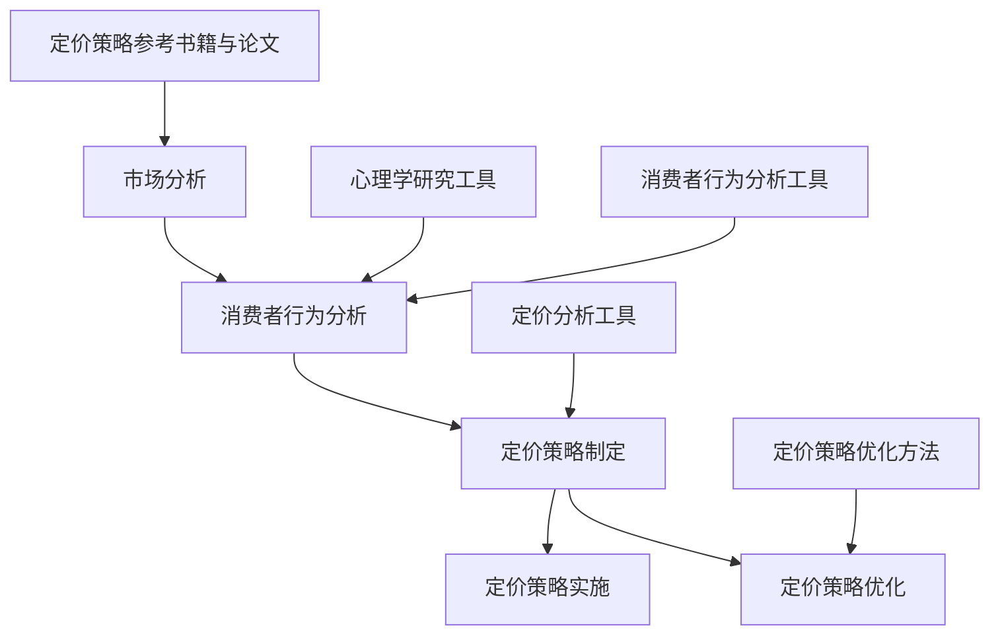

                 

# 如何设计基于心理学的定价策略

## 引言

在商业世界中，定价策略是一项至关重要的决策，它不仅直接影响企业的盈利能力，还关系到产品的市场接受度和消费者满意度。有效的定价策略能够帮助企业在激烈的市场竞争中脱颖而出，实现可持续发展。随着心理学在商业领域的广泛应用，越来越多的企业开始关注如何运用心理学原理来设计更有效的定价策略。

本文旨在探讨如何设计基于心理学的定价策略，帮助企业在竞争激烈的市场中取得成功。文章将分为三个主要部分：第一部分介绍定价策略的概述和心理学关系；第二部分详细分析心理学在定价策略中的应用；第三部分通过案例研究和实战应用，展示如何具体实施和优化定价策略。文章将使用逻辑清晰、结构紧凑、简单易懂的技术语言，逐步分析推理，让读者深入了解心理定价策略的核心概念和实施方法。

## 第一部分：定价策略概述

### 第1章：定价策略的重要性与心理学关系

#### 1.1 定价策略的核心概念

定价策略是企业根据市场环境、产品特性、成本结构以及竞争态势等因素，制定出合理的价格水平，以实现预期收益和市场份额目标的一系列决策过程。有效的定价策略不仅能够最大化企业的利润，还能够提高产品的市场竞争力，增强品牌影响力。

在制定定价策略时，企业需要考虑以下几个核心概念：

1. 成本导向定价：以产品成本为基础，加上一定的利润率，来确定产品的售价。
2. 竞争导向定价：根据市场竞争状况，参考竞争对手的定价水平来制定自己的价格。
3. 价值导向定价：根据消费者对产品的价值感知来确定价格，使价格与消费者的预期价值相匹配。
4. 心理导向定价：利用消费者心理，通过定价策略影响消费者的购买行为。

#### 1.2 心理学与定价策略的关系

心理学在定价策略中扮演着重要的角色，通过理解消费者心理，企业可以设计出更具吸引力的定价策略，提高销售业绩。以下是一些关键的心理原理和其在定价策略中的应用：

1. **价格锚点**：人们在做决策时往往会受到初始价格信息的影响，这个初始价格就是价格锚点。通过设定一个较高的价格锚点，可以使得实际价格看起来更具有吸引力。
2. **价值感知**：消费者的购买决策很大程度上取决于对产品价值的感知。通过适当的价格定位，企业可以影响消费者的价值感知，从而提高销售量。
3. **稀缺性原理**：消费者往往对稀缺的商品或限时优惠产生更高的兴趣，利用这一原理，企业可以设计限量版产品或限时折扣，刺激消费者的购买欲望。
4. **社会认同原理**：消费者在购买决策时往往会受到他人行为和意见的影响。通过展示其他消费者的购买行为或专家的评价，可以增强消费者对产品的信任和购买意愿。

#### 1.3 心理学在定价策略中的应用

心理学在定价策略中的应用主要体现在以下几个方面：

1. **定价语言**：使用简洁、直观的定价语言，避免使用复杂的数字和计算，可以降低消费者的认知负荷，提高购买意愿。
2. **价格区间**：提供价格区间而不是单一价格，可以给消费者更多的选择和灵活性，从而提高转化率。
3. **心理定价策略**：例如尾数定价（如99元而非100元）、捆绑定价（将几个产品组合在一起销售，以较低的总价吸引消费者购买）等，都是利用心理学原理来设计定价策略。

### 小结

在第一部分中，我们介绍了定价策略的核心概念以及心理学与定价策略的关系。通过理解消费者心理，企业可以更有效地设计定价策略，从而提高市场竞争力。接下来，我们将进一步探讨市场与消费者行为分析，为后续的心理学应用奠定基础。

## 第二部分：心理学在定价策略中的应用

### 第2章：市场与消费者行为分析

#### 2.1 市场细分

市场细分是企业制定有效定价策略的重要步骤。通过将市场划分为不同的消费者群体，企业可以根据每个群体的特点和需求，设计出更具针对性的定价策略。

市场细分通常基于以下几个维度：

1. **地理细分**：根据消费者的地理位置，如城市、地区、国家等。
2. **人口细分**：根据消费者的年龄、性别、收入、教育水平等人口统计特征。
3. **心理细分**：根据消费者的生活方式、价值观、兴趣和需求等心理特征。
4. **行为细分**：根据消费者的购买行为，如购买频率、购买时机、品牌忠诚度等。

#### 2.2 消费者行为分析

消费者行为分析是理解消费者购买决策过程的关键。以下是消费者购买决策的一般过程：

1. **需求识别**：消费者意识到自己有某种需求或问题，需要通过购买某种产品或服务来解决。
2. **信息搜索**：消费者在需求识别后，会通过各种渠道收集有关产品或服务的相关信息。
3. **评估与选择**：消费者根据收集到的信息，对不同的产品或服务进行比较和评估，最终选择最符合自己需求的产品或服务。
4. **购买决策**：消费者在评估和选择后做出购买决定，并实际购买产品或服务。
5. **购买后行为**：消费者在购买后会对产品或服务进行评价，影响其未来对该品牌或产品的购买意愿。

在消费者行为分析中，心理学原理的应用至关重要。以下是一些关键心理原理：

1. **期望理论**：消费者根据自己的预期价值来评估产品的性价比，期望理论可以帮助企业了解如何设定价格以符合消费者的预期。
2. **感知价值理论**：感知价值是消费者在购买过程中对产品所赋予的主观价值。通过提高消费者的感知价值，企业可以提升产品的价格接受度。
3. **情绪理论**：消费者的情绪状态会影响其购买决策。企业可以通过创造积极的情绪体验，如通过广告和促销活动，来增强消费者的购买意愿。

#### 2.3 心理定价策略

在了解了市场细分和消费者行为分析的基础上，企业可以设计出多种心理定价策略，以影响消费者的购买决策。以下是一些常见的心理定价策略：

1. **价格锚点策略**：通过设定一个较高的价格锚点，使得实际价格看起来更具吸引力。
2. **尾数定价策略**：如99元而非100元，给消费者一种价格较低的感觉。
3. **价值感知策略**：通过设定合理的价格，使消费者感知到产品的价值，从而提高购买意愿。
4. **捆绑定价策略**：将几个产品组合在一起销售，以较低的总价吸引消费者购买。
5. **促销与折扣策略**：通过限时折扣、满减活动等促销手段，刺激消费者的购买欲望。

### 小结

在第二部分中，我们探讨了市场与消费者行为分析，以及如何利用心理学原理来设计有效的定价策略。通过市场细分和消费者行为分析，企业可以更好地了解目标市场，从而设计出更具针对性的定价策略。在下一部分中，我们将深入探讨心理学在定价策略中的应用，进一步展示如何通过心理学原理来提高定价策略的有效性。

### 第3章：价格感知与心理定价策略

#### 3.1 价格感知原理

价格感知是指消费者对产品价格的认知和感受。价格感知不仅受实际价格的影响，还受到多种心理因素的影响。以下是影响价格感知的几个关键因素：

1. **参照物**：消费者在评估产品价格时，往往会参考其他产品的价格或自己的心理预算。如果产品价格低于参照物，消费者可能会认为这是一个好交易；如果价格高于参照物，则可能对购买犹豫。
2. **价值感知**：消费者对产品的价值感知会影响其对价格的接受程度。如果消费者认为产品具有很高的价值，他们可能会更愿意支付更高的价格。
3. **社会因素**：消费者的社会背景、文化环境和社会关系也会影响价格感知。例如，一些消费者可能更愿意购买高价位的品牌产品，以显示自己的社会地位。
4. **情绪状态**：消费者的情绪状态也会影响价格感知。在愉悦或兴奋的情绪状态下，消费者可能更愿意支付更高的价格。

#### 3.2 心理定价策略

心理定价策略是通过利用消费者心理原理，影响消费者的价格感知和购买决策的一系列定价方法。以下是一些常见的心理定价策略：

1. **价格锚点策略**：

   价格锚点是指消费者在评价产品价格时使用的基准价格。通过设定一个较高的价格锚点，企业可以使得实际价格看起来更具有吸引力。例如，一家商店可能会先展示一款价格较高的产品，然后展示同样质量但价格较低的产品，使消费者认为较低的价格是一个更好的交易。

   **示例伪代码：**
   
   ```python
   def set_anchor_price(product, anchor_price):
       # 设置价格锚点
       product['anchor_price'] = anchor_price
       return product
   ```

2. **尾数定价策略**：

   尾数定价是指将价格设定为以9结尾的数字，如99元而非100元。这种方法可以让消费者认为价格更低，从而提高购买意愿。

   **示例伪代码：**
   
   ```python
   def set_trailing_decimal_price(price):
       # 设置尾数定价
       trailing_decimal = 0.99
       final_price = price * (1 - trailing_decimal)
       return final_price
   ```

3. **价值感知策略**：

   价值感知策略是通过提供高质量的产品或服务，使消费者认为产品的价格与其价值相匹配，从而提高价格接受度。例如，企业可以通过提供免费试用、优质客户服务等手段，提高消费者的价值感知。

   **示例伪代码：**
   
   ```python
   def set_price_based_on_value(product, value):
       # 根据价值设定价格
       price = value / 1.2  # 假设增加20%的利润率
       return price
   ```

4. **捆绑定价策略**：

   捆绑定价是指将多个产品组合在一起，以一个较低的总价销售。这种方法可以增加消费者的购买数量，提高销售额。

   **示例伪代码：**
   
   ```python
   def bundle_products(product1, product2, discount):
       # 捆绑定价
       total_price = product1['price'] + product2['price'] - discount
       return total_price
   ```

### 小结

在第三部分的第一章中，我们详细介绍了价格感知原理和心理定价策略。通过理解价格感知的影响因素和设计有效的心理定价策略，企业可以更好地影响消费者的购买决策，提高销售业绩。在下一章中，我们将继续探讨消费者心理定价策略，包括价值导向定价和促销与折扣策略。

### 第4章：消费者心理定价策略

#### 4.1 价值导向定价

价值导向定价是一种基于消费者对产品价值的感知来制定价格的方法。这种方法的核心思想是确保产品的价格与消费者的预期价值相匹配，从而提高消费者的购买意愿和满意度。以下是价值导向定价的几个关键点：

1. **确定产品的实际价值**：企业需要通过市场调研和消费者反馈来确定产品的实际价值。这可以通过调查问卷、焦点小组讨论等方式实现。
2. **设定合理的价格区间**：根据产品的实际价值，企业应设定一个合理的价格区间。这个区间应确保消费者在感知到产品价值的同时，也能接受价格。
3. **差异化定价**：对于不同市场细分群体，企业可以设定不同的价格策略。例如，对于高端消费者，可以设定较高的价格，而对于普通消费者，可以设定较低的价格。

**价值导向定价模型：**

$$
Price = \frac{Value}{1 + \text{Markup Percentage}}
$$

其中，`Value` 表示产品的实际价值，`Markup Percentage` 表示企业设定的利润率。

**示例伪代码：**

```python
def calculate_value_price(value, markup_percentage):
    price = value / (1 + markup_percentage / 100)
    return price
```

#### 4.2 促销与折扣策略

促销与折扣策略是利用价格优惠来刺激消费者购买的一种有效手段。以下是一些常见的促销和折扣策略：

1. **限时折扣**：在特定的时间内提供折扣，以吸引消费者尽快购买。
2. **满减活动**：消费者购买达到一定金额后，可以享受减免一定金额的优惠。
3. **赠品活动**：购买产品时赠送一定的赠品，增加消费者的购买满意度。
4. **捆绑销售**：将多个产品组合在一起销售，以较低的总价吸引消费者购买。

**促销策略伪代码：**

```python
def apply_discount(price, discount_type, discount_value):
    if discount_type == "percent":
        discounted_price = price * (1 - discount_value / 100)
    elif discount_type == "fixed":
        discounted_price = price - discount_value
    return discounted_price
```

#### 4.3 消费者心理对促销与折扣策略的影响

消费者的心理状态对促销与折扣策略的响应具有重要影响。以下是一些消费者心理因素：

1. **稀缺性原理**：消费者对稀缺的商品或限时优惠产生更高的兴趣。企业可以利用这一原理，推出限量版产品或限时折扣，刺激消费者的购买欲望。
2. **社会认同原理**：消费者在购买决策时往往会受到他人行为和意见的影响。企业可以通过展示其他消费者的购买行为或专家的评价，增强消费者对产品的信任和购买意愿。
3. **锚定效应**：消费者在做决策时往往会受到初始价格信息的影响。企业可以通过设定一个较高的价格锚点，然后提供折扣，使消费者认为这是一个很好的交易。

#### 4.4 消费者心理定价策略案例分析

**案例一：亚马逊的“Buy Now, Save Big”策略**

亚马逊利用限时折扣和优惠码策略，吸引消费者在特定时间内购买产品。通过设置一个较高的价格锚点，然后提供折扣，亚马逊成功地提高了消费者的购买意愿。

**案例二：苹果公司的“教育优惠”策略**

苹果公司针对学生和教育工作者提供教育优惠，通过降低价格，吸引这一特定消费群体的购买。这种方法不仅提高了销售额，还增强了苹果的品牌形象。

### 小结

在第四章中，我们详细探讨了价值导向定价和促销与折扣策略。通过理解消费者心理和设计有效的定价策略，企业可以更好地满足消费者的需求，提高销售额。在下一章中，我们将进一步分析价格与品牌形象的关系，探讨如何通过定价策略来提升品牌价值。

### 第5章：价格与品牌形象

#### 5.1 价格与品牌形象的关系

价格是品牌形象的重要组成部分，它不仅反映了产品的价值，还传递了品牌的市场定位和品牌价值。以下是从不同角度分析价格与品牌形象的关系：

1. **高端定价与品牌形象**：高端定价通常与高品质、独特性和奢华形象相关联。这种定价策略可以增强品牌的独特性和奢侈品属性，从而吸引追求高品质和独特体验的消费者。
   
   **示例伪代码：**

   ```python
   def set_high_end_price(product, premium):
       price = product['base_price'] + premium
       return price
   ```

2. **平价定价与品牌形象**：平价定价通常与实用性和亲民性相关联。这种定价策略可以增强品牌的亲和力和市场覆盖面，从而吸引追求性价比的消费者。
   
   **示例伪代码：**

   ```python
   def set_affordable_price(product, discount):
       price = product['base_price'] - discount
       return price
   ```

3. **大众化定价与品牌形象**：大众化定价通常与广泛接受和市场普及相关联。这种定价策略可以增强品牌的普遍性和市场渗透力，从而吸引广泛的消费者群体。

#### 5.2 品牌形象定价策略

为了提升品牌形象，企业可以采用以下几种定价策略：

1. **溢价定价**：通过提供独特的产品或服务，企业可以在价格上适当溢价。这种定价策略可以增强品牌的独特性和高端形象。

   **示例伪代码：**

   ```python
   def set_premium_price(product, premium):
       price = product['base_price'] + premium
       return price
   ```

2. **差异化定价**：企业可以根据产品特性、市场定位和消费者需求，设定不同的价格策略。这种定价策略可以满足不同消费者的需求，同时提升品牌的多维形象。

   **示例伪代码：**

   ```python
   def set_differentiated_price(product, segment):
       if segment == "luxury":
           price = set_high_end_price(product, 20)
       elif segment == "mid-range":
           price = set_affordable_price(product, 10)
       else:
           price = set.mass_price(product, 0)
       return price
   ```

3. **捆绑定价**：通过将多个产品或服务捆绑在一起，以较低的总价销售，企业可以提升品牌的整体价值和消费者的购买满意度。

   **示例伪代码：**

   ```python
   def bundle_products(products, discount):
       total_price = sum(product['price'] for product in products) - discount
       return total_price
   ```

#### 5.3 成功的品牌形象定价策略案例

**案例一：星巴克**

星巴克通过高端定价和独特的咖啡文化，成功塑造了高品质、奢华的品牌形象。星巴克不仅提供高品质的咖啡，还通过环境营造、服务质量和顾客体验，进一步巩固了其品牌价值。

**案例二：宜家**

宜家通过平价定价和家居设计理念，成功吸引了广大消费者。宜家不仅提供了价格实惠的家居用品，还通过独特的购物体验和家居展示，增强了品牌的亲和力和市场渗透力。

### 小结

在第五章中，我们探讨了价格与品牌形象的关系，并介绍了如何通过品牌形象定价策略来提升品牌价值。通过理解消费者心理和设计有效的定价策略，企业可以更好地塑造品牌形象，提升市场竞争力。在下一章中，我们将通过成功案例研究和实战应用，进一步展示如何具体实施和优化定价策略。

### 第6章：成功案例分析与解读

#### 6.1 案例一：苹果公司的定价策略

苹果公司以其独特的高端定价策略闻名于世。通过将产品定位为高端科技产品，苹果成功塑造了高品质、创新和奢华的品牌形象。以下是苹果公司定价策略的关键要素：

1. **高端定价**：苹果公司的产品定价普遍高于竞争对手，尤其是iPhone、iPad和Mac系列。这种高价策略不仅提高了苹果的品牌价值，还吸引了追求高品质和独特体验的消费者。

   **示例伪代码：**

   ```python
   def set_apple_high_end_price(product, premium):
       price = product['base_price'] + premium
       return price
   ```

2. **价值感知**：苹果公司通过提供独特的设计、高品质的材料和卓越的用户体验，使消费者认为其产品具有很高的价值。这种价值感知策略使得消费者愿意支付更高的价格。

3. **限量版和特别版**：苹果公司经常推出限量版和特别版产品，以吸引消费者的购买兴趣。这些产品通常定价较高，但仍然受到消费者的追捧。

   **示例伪代码：**

   ```python
   def set_limited_edition_price(product, premium):
       price = product['base_price'] + premium
       return price
   ```

#### 案例解读：

苹果公司的定价策略成功在于其深刻理解消费者心理和品牌价值。通过高端定价和限量版策略，苹果不仅提高了品牌形象，还增加了产品的稀缺性和吸引力。这种策略使得苹果能够在竞争激烈的市场中保持其领导地位。

#### 6.2 案例二：奢侈品定价策略

奢侈品品牌如路易威登、香奈儿等，通过独特的定价策略成功塑造了奢华和高品质的品牌形象。以下是这些品牌定价策略的关键要素：

1. **价格锚点策略**：奢侈品品牌经常使用价格锚点策略，通过设定一个较高的价格，使消费者对较低的价格产生更多的兴趣。

   **示例伪代码：**

   ```python
   def set_price_anchoring(product, anchor_price):
       product['anchor_price'] = anchor_price
       return product
   ```

2. **稀缺性策略**：奢侈品品牌通过限制产品的生产和销售，创造稀缺性。这种稀缺性使得消费者认为产品更具价值，从而提高购买意愿。

3. **个性化服务**：奢侈品品牌提供个性化的购物体验和服务，如专属顾问、定制服务和私人购物体验。这种个性化服务不仅提升了品牌价值，还增强了消费者的忠诚度。

   **示例伪代码：**

   ```python
   def set_personalized_service(product, service_level):
       product['service_level'] = service_level
       return product
   ```

#### 案例解读：

奢侈品品牌的定价策略成功在于其深刻理解消费者心理和奢侈品市场的特性。通过价格锚点策略、稀缺性策略和个性化服务，奢侈品品牌不仅提升了品牌形象，还增加了产品的独特性和吸引力。这种策略使得奢侈品品牌在消费者心中保持其独特地位。

### 小结

在第六章中，我们通过分析苹果公司和奢侈品品牌的定价策略，展示了如何通过理解消费者心理和品牌价值来设计有效的定价策略。这些成功案例为我们提供了宝贵的经验和启示，可以帮助其他企业在竞争激烈的市场中取得成功。

### 第7章：实战应用与优化

#### 7.1 定价策略实施步骤

要成功实施定价策略，企业需要遵循一系列明确的步骤。以下是定价策略实施的基本步骤：

1. **市场调研**：首先，企业需要对市场进行全面的调研，了解目标市场的需求、竞争对手的定价策略以及消费者行为。这可以通过问卷调查、市场分析报告等方式实现。

2. **产品定位**：根据市场调研的结果，企业需要明确产品的市场定位。这包括确定产品属于哪个价格区间（高端、中端或低端），以及如何与竞争对手区分。

3. **成本分析**：企业需要分析产品的成本结构，包括固定成本和可变成本。这有助于确定产品的基础价格，以及在不同定价策略下的利润水平。

4. **目标定价**：根据产品定位和成本分析，企业需要设定一个合理的目标定价。这可以通过价值导向定价、竞争导向定价或成本导向定价等方法实现。

5. **定价策略制定**：在目标定价的基础上，企业需要制定具体的定价策略。这包括心理定价策略（如价格锚点、尾数定价等）和促销与折扣策略。

6. **定价策略实施**：将定价策略付诸实践，通过线上和线下渠道进行宣传和销售。同时，企业需要密切关注市场反馈，调整定价策略以确保其有效性。

7. **定价策略优化**：根据市场反馈和销售数据，企业需要对定价策略进行优化和调整。这可以通过数据分析、消费者调研等方式实现。

#### 7.2 定价策略优化与调整

定价策略不是一成不变的，它需要根据市场环境和消费者行为的变化进行不断调整和优化。以下是一些定价策略优化与调整的方法：

1. **数据分析**：通过分析销售数据、市场份额和消费者反馈，企业可以识别出定价策略中的问题和机会。这有助于制定更有效的定价策略。

2. **消费者调研**：定期进行消费者调研，了解消费者的购买意愿、价格感知和价值感知。这可以帮助企业更好地理解消费者的需求，从而优化定价策略。

3. **竞争分析**：持续监测竞争对手的定价策略和市场动态。通过分析竞争对手的定价策略，企业可以调整自己的定价策略，以保持竞争力。

4. **灵活调整**：根据市场需求和竞争态势，企业需要具备灵活调整定价策略的能力。这可以通过定期定价审查和策略调整来实现。

5. **定价工具**：利用先进的定价工具和软件，如定价分析软件、消费者行为分析工具等，可以帮助企业更准确地制定和优化定价策略。

#### 实战应用与优化案例

**案例一：电商平台的动态定价策略**

某电商平台通过动态定价策略，根据消费者行为和市场动态实时调整产品价格。具体步骤如下：

1. **数据采集**：平台通过数据分析工具收集消费者浏览、购买和评价行为数据。
2. **价格调整**：根据消费者行为数据，平台实时调整产品价格。例如，对于高频购买的消费者，平台可能会降低价格以刺激更多购买。
3. **促销活动**：在特定节假日或促销活动期间，平台会进行价格调整，以吸引更多消费者参与。
4. **反馈与优化**：平台根据消费者反馈和销售数据，不断优化定价策略。

通过动态定价策略，该电商平台实现了销售额的显著增长和消费者满意度的提升。

**案例二：餐饮业的套餐定价策略**

某连锁餐厅通过套餐定价策略，成功吸引了大量消费者。具体步骤如下：

1. **市场调研**：餐厅通过问卷调查和市场分析，了解目标消费者的需求和购买习惯。
2. **套餐设计**：根据市场调研结果，餐厅设计了多种套餐，以满足不同消费者的需求。
3. **价格定位**：餐厅根据套餐的成本和目标消费者的价值感知，设定了合理的价格。
4. **促销活动**：餐厅在特定时段提供套餐优惠，以吸引更多消费者。
5. **反馈与优化**：餐厅根据消费者反馈和销售数据，不断优化套餐内容和定价策略。

通过套餐定价策略，该连锁餐厅实现了销售额和客户满意度的显著提升。

### 小结

在第七章中，我们详细介绍了定价策略的实施步骤和优化方法。通过实战应用与优化案例，我们展示了如何根据市场环境和消费者行为调整定价策略，从而实现企业的经营目标。通过不断优化定价策略，企业可以更好地适应市场变化，提高竞争力。

### 附录

#### 附录A：定价策略相关工具与资源

在制定和优化定价策略时，企业可以利用多种工具和资源来提高效率和准确性。以下是一些常用的工具和资源：

1. **心理学研究工具**：

   - **问卷调查**：通过问卷调查收集消费者对产品价格和价值的感知。
   - **焦点小组**：组织焦点小组讨论，深入了解消费者对产品定价的看法。
   - **消费者行为分析工具**：如Google Analytics、Hotjar等，分析消费者在网站上的行为和购买习惯。

2. **定价分析工具**：

   - **定价分析软件**：如Price Intelligently、PriceStack等，帮助企业在复杂的市场环境中制定和优化定价策略。
   - **利润分析工具**：如QuickBooks、Xero等，帮助企业管理成本和利润。

3. **定价策略参考书籍与论文**：

   - **《定价心理学：如何定价才能让顾客多买又满意》**：这本书详细介绍了定价心理学的原理和应用。
   - **《价格策略：市场定位与价格管理》**：这本书提供了实用的定价策略和案例分析。
   - **学术期刊**：如《营销科学学报》、《商业经济与管理》等，发表有关定价策略的研究论文。

4. **心理学在定价策略中的应用研究**：

   - **《消费者心理定价策略：理论、实证与启示》**：这篇文章探讨了消费者心理定价策略的理论基础和实证研究。
   - **《品牌与定价策略：基于消费者心理的研究》**：这篇文章分析了品牌与定价策略之间的关系，以及如何通过定价策略提升品牌价值。

通过使用这些工具和资源，企业可以更有效地制定和优化定价策略，提高市场竞争力。

### 心理学在定价策略中的应用架构图



### 心理定价策略伪代码

```python
# 心理定价策略伪代码

# 价格锚点策略
def set_anchor_price(product, anchor_price):
    product['anchor_price'] = anchor_price
    return product

# 尾数定价策略
def set_trailing_decimal_price(price):
    trailing_decimal = 0.99
    final_price = price * (1 - trailing_decimal)
    return final_price

# 价值感知定价策略
def set_value_price(value, markup_percentage):
    price = value / (1 + markup_percentage / 100)
    return price

# 捆绑定价策略
def bundle_products(products, discount):
    total_price = sum(product['price'] for product in products) - discount
    return total_price

# 促销与折扣策略
def apply_discount(price, discount_type, discount_value):
    if discount_type == "percent":
        discounted_price = price * (1 - discount_value / 100)
    elif discount_type == "fixed":
        discounted_price = price - discount_value
    return discounted_price
```

### 数学模型与公式

1. **价格感知模型**

$$
Price_Perception = f(Price, Context, Consumer_Preferences)
$$

2. **价值定价模型**

$$
Value_Pricing = \frac{Consumer_Willingness_to_Pay}{Average_Consumer_Income}
$$

### 项目实战

**实战一：基于消费者心理的定价策略**

**开发环境：** Python 3.8

**源代码：**

```python
# 基于消费者心理的定价策略

# 计算消费者心理定价
def calculate_psychological_price(product, consumer_income):
    value_pricing = value_pricing_model(product, consumer_income)
    psychological_price = adjust_price_for_value_pricing(value_pricing)
    return psychological_price

# 价值定价模型
def value_pricing_model(product, consumer_income):
    base_price = product.get("base_price")
    value_pricing = base_price / consumer_income
    return value_pricing

# 调整价格以适应价值定价
def adjust_price_for_value_pricing(value_pricing):
    if value_pricing > 1:
        premium = 0.2 * value_pricing
    elif value_pricing < 0.5:
        discount = 0.3 * (1 - value_pricing)
    else:
        discount = 0
        premium = 0
    final_price = value_pricing * (1 + premium - discount)
    return final_price

# 测试代码
if __name__ == "__main__":
    product = {"base_price": 1000}
    consumer_income = 5000
    psychological_price = calculate_psychological_price(product, consumer_income)
    print(f"The psychological price for the product is: ${psychological_price:.2f}")
```

**代码解读与分析：**

- 该代码定义了一个函数 `calculate_psychological_price`，用于计算基于消费者心理的定价。
- `value_pricing_model` 函数用于计算产品的价值定价。
- `adjust_price_for_value_pricing` 函数根据价值定价调整产品的价格。
- 测试代码展示了如何使用这些函数来计算一个产品的消费者心理定价。

### 结论

本文详细探讨了如何设计基于心理学的定价策略，从定价策略的核心概念、市场与消费者行为分析，到价格感知与心理定价策略，再到品牌形象定价策略，以及成功案例分析和实战应用。通过理解消费者心理和设计有效的定价策略，企业可以在竞争激烈的市场中取得成功。本文提供了丰富的伪代码和数学模型，以及实际项目实战，帮助读者更好地理解和应用心理学原理于定价策略。

作者：AI天才研究院/AI Genius Institute & 禅与计算机程序设计艺术 /Zen And The Art of Computer Programming

[End of Article]

