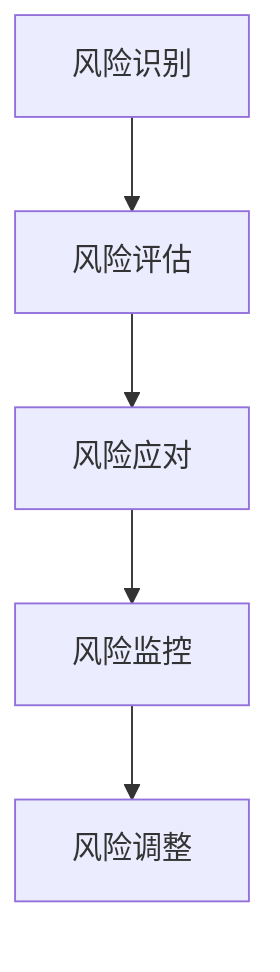

                 

### 引言

在现代商业环境中，风险控制已成为企业成功运营的关键因素。随着全球市场的复杂性和不确定性不断增加，企业面临的风险种类繁多，包括市场风险、财务风险、操作风险、法律风险等。有效的风险控制不仅能帮助企业规避潜在的损失，还能提高企业的竞争力和可持续发展能力。本文旨在探讨如何进行风险控制，包括规避风险和降低损失的方法。

### 核心概念与联系

在深入讨论风险控制之前，我们需要明确一些核心概念，这些概念之间存在着紧密的联系。以下是这些核心概念的 Mermaid 流程图：



**风险识别**：是风险控制的第一步，旨在识别企业可能面临的各种风险因素。这一过程通常通过访谈、文档审查和现场观察等方法进行。

**风险评估**：在识别出风险后，对其进行量化评估，确定其发生概率和影响程度。风险评估的方法包括审计评估法、专家评估法、财务评估法和系统分析评估法等。

**风险应对**：根据风险评估的结果，制定和实施相应的风险应对策略。常见的策略包括风险规避、风险转移和风险缓解等。

**风险监控**：是对风险控制措施的实施情况进行跟踪和监控，确保风险控制在可接受的范围内。监控方法包括定期监控、实时监控和异常监控等。

**风险调整**：根据监控结果对风险控制措施进行调整，以应对新的风险变化和挑战。

这些概念相互联系，共同构成了一个完整的风险控制框架。接下来，我们将逐一深入探讨这些核心概念。

### 核心概念与联系

在深入讨论风险控制之前，我们需要明确一些核心概念，这些概念之间存在着紧密的联系。以下是这些核心概念的 Mermaid 流程图：


**风险识别**：是风险控制的第一步，旨在识别企业可能面临的各种风险因素。这一过程通常通过访谈、文档审查和现场观察等方法进行。

**风险评估**：在识别出风险后，对其进行量化评估，确定其发生概率和影响程度。风险评估的方法包括审计评估法、专家评估法、财务评估法和系统分析评估法等。

**风险应对**：根据风险评估的结果，制定和实施相应的风险应对策略。常见的策略包括风险规避、风险转移和风险缓解等。

**风险监控**：是对风险控制措施的实施情况进行跟踪和监控，确保风险控制在可接受的范围内。监控方法包括定期监控、实时监控和异常监控等。

**风险调整**：根据监控结果对风险控制措施进行调整，以应对新的风险变化和挑战。

这些概念相互联系，共同构成了一个完整的风险控制框架。接下来，我们将逐一深入探讨这些核心概念。

### 风险识别

风险识别是风险管理的第一步，其目标是识别企业可能面临的各种风险因素。这一过程至关重要，因为只有全面了解潜在风险，企业才能制定有效的应对策略。

#### 方法

风险识别的方法多种多样，主要包括以下几种：

1. **访谈法**：通过与企业管理层、员工和其他相关利益相关者的访谈，了解他们对于企业潜在风险的看法和经验。

2. **文档审查法**：审查企业的政策、流程、合同和其他相关文件，以识别潜在的风险因素。

3. **现场观察法**：实地观察企业的运营活动，识别可能的风险。

4. **历史数据分析**：分析企业过去的风险事件，从中提取经验和教训，为未来的风险管理提供参考。

5. **外部专家咨询**：邀请外部专家对企业面临的风险进行评估，获取专业的见解和建议。

#### 实例

例如，某企业在进行风险识别时，通过访谈管理层和员工，发现以下几个潜在的风险因素：

- **市场风险**：由于市场需求波动，可能导致产品销售不稳定。
- **财务风险**：由于融资困难，可能导致资金链断裂。
- **操作风险**：由于系统故障，可能导致数据丢失和业务中断。
- **法律风险**：由于法规变化，可能导致企业面临法律纠纷。

通过这些方法，企业可以全面识别潜在的风险，为后续的风险评估和应对奠定基础。

### 风险评估

风险评估是风险管理的核心步骤，其目的是对识别出的风险因素进行量化评估，确定其发生概率和影响程度。这一过程对于企业制定有效的风险应对策略至关重要。

#### 方法

风险评估的方法多种多样，主要包括以下几种：

1. **审计评估法**：通过审计过程识别和评估风险，包括财务审计和管理审计。

2. **专家评估法**：邀请专家对企业面临的风险进行评估，专家的经验和知识是评估的重要基础。

3. **财务评估法**：通过财务指标评估风险，如利润率、负债率等。

4. **系统分析评估法**：通过系统分析工具评估风险，包括风险识别、评估和应对的自动化流程。

#### 实例

例如，某企业在对财务风险进行评估时，采用以下步骤：

1. **确定评估指标**：确定评估财务风险的指标，如利润率、负债率、流动性比率等。

2. **收集数据**：收集与企业财务相关的数据，如财务报表、市场数据等。

3. **分析数据**：对收集到的数据进行分析，计算各指标的数值。

4. **评估风险**：根据各指标的数值，评估企业财务风险的程度。

5. **制定应对策略**：根据评估结果，制定相应的财务风险管理策略。

通过这些方法，企业可以全面评估财务风险，为制定风险应对策略提供依据。

### 风险应对

风险应对是根据风险评估的结果，制定和实施相应的风险应对策略和措施，以降低风险发生概率和影响程度。风险应对策略主要包括风险规避、风险转移和风险缓解。

#### 方法

1. **风险规避**：通过改变决策，避免风险的发生。例如，在投资决策中避免高风险项目。

2. **风险转移**：通过保险或其他方式将风险转移给第三方。例如，购买保险将意外损失的风险转移给保险公司。

3. **风险缓解**：通过采取措施降低风险的发生概率或影响程度。例如，通过安全措施降低生产事故的概率。

#### 实例

例如，某企业在应对市场风险时，采用以下策略：

1. **多元化产品策略**：通过开发多种产品，降低单一市场波动对企业的影响。

2. **市场调研**：定期进行市场调研，了解市场需求和趋势，及时调整产品策略。

3. **风险转移**：购买市场风险保险，将市场风险转移给保险公司。

4. **风险缓解**：通过优化供应链管理，提高产品供应的稳定性和灵活性。

通过这些方法，企业可以降低市场风险的发生概率和影响程度，确保企业的稳定运营。

### 风险监控

风险监控是对风险控制措施的实施情况进行跟踪和监控，确保风险控制在可接受的范围内。风险监控是风险管理的持续过程，需要定期评估和调整风险控制措施。

#### 方法

1. **定期监控**：定期评估风险控制措施的效果，及时发现和纠正问题。

2. **实时监控**：通过实时监控系统，及时发现风险变化，确保风险控制措施的有效性。

3. **异常监控**：对异常情况进行分析和处理，防止风险失控。

#### 实例

例如，某企业在进行风险监控时，采用以下步骤：

1. **建立监控指标**：确定用于评估风险控制效果的指标，如风险事件发生率、损失金额等。

2. **数据收集**：收集与风险监控相关的数据，如风险事件记录、损失报告等。

3. **分析数据**：对收集到的数据进行分析，评估风险控制措施的有效性。

4. **报告与反馈**：定期编制风险监控报告，向企业管理层反馈监控结果，并提出改进建议。

通过这些方法，企业可以确保风险控制措施的有效实施，降低风险对企业运营的影响。

### 风险调整

风险调整是根据风险监控的结果，对风险控制措施进行调整，以应对新的风险变化和挑战。风险调整是风险管理的重要组成部分，能够确保企业始终保持有效的风险控制。

#### 方法

1. **定期审查**：定期审查风险控制措施的有效性，识别需要调整的风险。

2. **动态调整**：根据风险变化情况，实时调整风险控制措施。

3. **反馈机制**：建立风险调整的反馈机制，确保调整措施的及时性和有效性。

#### 实例

例如，某企业在进行风险调整时，采用以下步骤：

1. **评估监控结果**：评估风险监控报告，确定需要调整的风险控制措施。

2. **制定调整方案**：根据评估结果，制定具体的调整方案，包括风险识别、评估、应对和监控等方面的调整。

3. **实施调整方案**：根据调整方案，实施具体的风险调整措施。

4. **跟踪效果**：跟踪调整措施的实施效果，确保风险得到有效控制。

通过这些方法，企业可以确保风险控制措施始终与企业的风险状况相适应，降低风险对企业运营的潜在影响。

### 风险规避策略

风险规避是一种常见的风险应对策略，其核心思想是通过改变决策，避免风险的发生。风险规避策略适用于那些发生概率高且影响重大的风险，特别是企业无法通过其他策略有效管理的风险。

#### 方法

1. **避免高风险行为**：企业可以避免从事高风险的业务或投资，从而避免风险的发生。

2. **改变决策**：在项目投资、产品开发等决策过程中，考虑风险因素，避免选择高风险的项目。

3. **限制高风险活动**：对高风险活动进行限制，减少风险暴露。

4. **制定预防措施**：在业务运营中制定预防措施，降低风险发生的概率。

#### 实例

例如，某企业在应对市场风险时，采用以下风险规避策略：

1. **多元化市场策略**：企业将产品销售市场分散到多个国家和地区，降低单一市场波动对企业的影响。

2. **技术创新**：企业不断进行技术创新，开发新产品，避免陷入某一特定市场的风险。

3. **避免高风险投资**：在投资决策中，避免投资于高风险的行业或项目。

4. **制定预防措施**：加强市场调研，了解市场需求和趋势，及时调整产品策略。

通过这些方法，企业可以有效规避市场风险，确保企业的稳定运营。

### 风险转移策略

风险转移是一种将风险责任和损失转移到第三方的方法，通过这种方式，企业可以减轻自身面临的潜在损失。风险转移策略包括保险转移和合同转移两种主要方法。

#### 方法

1. **保险转移**：企业通过购买保险，将风险转移给保险公司。保险产品种类多样，包括财产保险、责任保险、信用保险等。

2. **合同转移**：企业通过合同将风险转移给供应商、合作伙伴或客户。在合同条款中明确风险责任的归属。

3. **第三方担保**：企业可以寻求第三方担保，将风险转移给担保机构。

#### 实例

例如，某企业在应对供应链风险时，采用以下风险转移策略：

1. **购买供应链保险**：企业购买供应链保险，将供应链中断的风险转移给保险公司。

2. **签订风险转移合同**：企业与供应商签订合同，明确在供应链中断时，供应商需要承担的责任和赔偿。

3. **寻求第三方担保**：企业与银行合作，通过银行担保，将风险转移给银行。

通过这些方法，企业可以有效降低供应链风险，确保供应链的稳定运营。

### 风险缓解策略

风险缓解是一种通过采取措施降低风险发生概率或影响程度的方法。与风险规避和风险转移不同，风险缓解并不完全消除风险，而是通过减少风险的影响，使企业能够更好地应对潜在的风险。

#### 方法

1. **风险分散**：通过多元化投资、多元化业务等手段，降低单一风险的影响。

2. **风险预防**：采取预防措施，降低风险发生的概率。例如，建立安全管理系统，提高产品质量。

3. **应急响应**：建立应急响应机制，确保在风险事件发生时，企业能够迅速采取行动，降低损失。

4. **培训与教育**：对员工进行培训和教育，提高其风险意识和应对能力。

#### 实例

例如，某企业在应对操作风险时，采用以下风险缓解策略：

1. **风险分散**：企业通过多元化产品线和业务，降低单一业务风险。

2. **风险预防**：企业建立严格的操作规程和安全管理系统，降低操作失误的概率。

3. **应急响应**：企业制定应急预案，确保在突发事件发生时，能够迅速响应，降低损失。

4. **员工培训**：企业定期对员工进行安全培训，提高其安全意识和操作技能。

通过这些方法，企业可以有效降低操作风险，确保企业的稳定运营。

### 组织架构调整

组织架构调整是风险控制的重要组成部分，通过优化组织结构，明确各部门的职责和权限，可以提高企业的风险控制效率和效果。合理的组织架构有助于企业更好地识别、评估和应对风险。

#### 方法

1. **明确职责和权限**：根据风险管理需要，明确各部门的职责和权限，确保风险控制措施能够得到有效执行。

2. **建立专门的风险管理部门**：设立专门的风险管理部门，负责企业整体风险管理工作。

3. **加强跨部门协作**：通过加强跨部门协作，提高风险识别和应对的效率。

4. **优化决策流程**：优化决策流程，确保风险控制措施能够得到及时、有效的决策和执行。

#### 实例

例如，某企业在进行组织架构调整时，采用以下步骤：

1. **明确职责和权限**：明确各部门的职责和权限，特别是风险管理部门与其他部门的职责划分。

2. **建立专门的风险管理部门**：设立风险管理部门，负责企业整体风险管理工作，包括风险识别、评估、应对和监控。

3. **加强跨部门协作**：通过建立跨部门协作机制，确保各部门在风险识别和应对过程中能够及时沟通和协作。

4. **优化决策流程**：优化决策流程，确保风险控制措施能够得到及时、有效的决策和执行。

通过这些方法，企业可以优化组织架构，提高风险控制效果。

### 内部控制体系

内部控制体系是风险控制的重要组成部分，通过建立和完善内部控制体系，企业可以确保其经营活动的合规性、有效性和效率。内部控制体系旨在识别、评估和应对企业内部和外部风险，确保企业目标的实现。

#### 方法

1. **风险管理政策**：制定风险管理政策，明确企业风险管理的基本原则和目标。

2. **风险识别**：通过访谈、文档审查和现场观察等方法，识别企业内部和外部风险。

3. **风险评估**：对识别出的风险进行量化评估，确定其发生概率和影响程度。

4. **风险应对**：根据风险评估结果，制定和实施相应的风险应对策略。

5. **风险监控**：对风险控制措施的实施情况进行跟踪和监控，确保风险控制在可接受的范围内。

6. **内部审计**：定期进行内部审计，评估内部控制体系的有效性，并提出改进建议。

#### 实例

例如，某企业在建立和完善内部控制体系时，采用以下步骤：

1. **制定风险管理政策**：明确企业风险管理的基本原则和目标，确保风险管理政策的可操作性和有效性。

2. **风险识别**：通过访谈、文档审查和现场观察等方法，识别企业内部和外部风险。

3. **风险评估**：对识别出的风险进行量化评估，确定其发生概率和影响程度。

4. **风险应对**：根据风险评估结果，制定和实施相应的风险应对策略，如风险规避、风险转移和风险缓解等。

5. **风险监控**：建立风险监控机制，对风险控制措施的实施情况进行跟踪和监控，确保风险控制在可接受的范围内。

6. **内部审计**：定期进行内部审计，评估内部控制体系的有效性，并根据审计结果提出改进建议。

通过这些方法，企业可以建立和完善内部控制体系，提高风险控制效果。

### 管理信息系统

管理信息系统（Management Information System, MIS）是现代企业管理中不可或缺的一部分，它通过收集、处理、存储和传递信息，帮助企业实现信息共享和资源优化配置。管理信息系统在风险控制中发挥着重要作用，可以提高企业风险识别、评估和应对的效率。

#### 方法

1. **信息收集**：利用各种信息技术手段，如物联网、大数据等，收集与风险相关的信息。

2. **信息处理**：对收集到的信息进行整理、分析和处理，提取有价值的信息。

3. **信息存储**：建立数据库系统，存储和处理风险信息，确保信息的可靠性和安全性。

4. **信息传递**：通过内部网络、电子邮件、短信等方式，及时传递风险信息，确保各部门能够迅速响应风险事件。

5. **信息共享**：建立信息共享平台，促进各部门之间的信息交流，提高风险控制的整体效率。

#### 实例

例如，某企业建立管理信息系统时，采用以下步骤：

1. **信息收集**：利用物联网技术，实时收集与生产设备、供应链相关的数据。

2. **信息处理**：利用大数据分析技术，对收集到的数据进行分析，提取有价值的信息。

3. **信息存储**：建立数据库系统，存储和处理风险信息，确保信息的可靠性和安全性。

4. **信息传递**：通过内部网络和电子邮件，及时传递风险信息，确保各部门能够迅速响应风险事件。

5. **信息共享**：建立信息共享平台，促进各部门之间的信息交流，提高风险控制的整体效率。

通过这些方法，企业可以建立高效的管理信息系统，提高风险控制的效率和效果。

### 风险监控方法

风险监控是风险控制的重要环节，通过对风险控制措施的实施情况进行跟踪和监控，企业可以确保风险控制在可接受的范围内。有效的风险监控方法包括定期监控、实时监控和异常监控。

#### 方法

1. **定期监控**：定期评估风险控制措施的效果，通过定期检查和评估，发现潜在问题并及时纠正。

2. **实时监控**：通过实时监控系统，对企业运营过程中的风险进行实时监测，确保风险在第一时间得到发现和应对。

3. **异常监控**：对异常情况进行分析和处理，及时发现和处理异常情况，防止风险扩大。

#### 实例

例如，某企业在进行风险监控时，采用以下方法：

1. **定期监控**：每月对风险控制措施进行一次全面评估，检查各项措施的实施情况和效果。

2. **实时监控**：通过实时监控系统，对生产过程、财务状况、供应链等方面进行实时监测，确保风险在第一时间得到发现和应对。

3. **异常监控**：建立异常处理机制，对发现的问题进行及时处理，确保风险得到有效控制。

通过这些方法，企业可以确保风险监控的有效实施，提高风险控制的效果。

### 风险评估指标

风险评估指标是衡量风险严重程度和发生概率的量化工具。合理的风险评估指标可以帮助企业更准确地评估风险，制定有效的风险应对策略。常见的风险评估指标包括财务指标、非财务指标和综合指标。

#### 方法

1. **财务指标**：通过财务报表等数据，评估企业的财务状况，如利润率、负债率、流动性比率等。

2. **非财务指标**：通过业务流程、市场状况等数据，评估企业的运营状况，如客户满意度、员工满意度、市场占有率等。

3. **综合指标**：将财务指标和非财务指标结合起来，形成综合指标体系，更全面地评估企业风险。

#### 实例

例如，某企业在进行风险评估时，采用以下指标：

1. **财务指标**：利润率、负债率、流动性比率。
2. **非财务指标**：客户满意度、员工满意度、市场占有率。
3. **综合指标**：通过加权计算，形成综合风险评估指标。

通过这些指标，企业可以更准确地评估风险，制定相应的风险应对策略。

### 风险评估报告

风险评估报告是对企业风险控制工作的全面总结和展示，它不仅包括风险识别、评估和应对的结果，还包括对风险控制措施实施情况的详细分析。风险评估报告是企业管理层决策的重要依据。

#### 方法

1. **报告内容**：包括风险评估结果、风险控制措施、风险控制效果评估、改进建议等。
2. **报告格式**：一般采用图表、文字、数据分析等形式，使报告内容更加直观、易懂。
3. **报告编制**：根据风险评估的实际情况，编制详细的风险评估报告，确保报告的准确性和完整性。

#### 实例

例如，某企业在编制风险评估报告时，采用以下步骤：

1. **收集数据**：收集与企业风险相关的数据，如财务报表、市场调研报告等。
2. **分析数据**：对收集到的数据进行分析，评估企业面临的风险。
3. **编写报告**：根据分析结果，编写详细的风险评估报告，包括风险识别、评估、应对和监控等方面的内容。
4. **审核报告**：对报告进行审核，确保报告的准确性和完整性。

通过这些方法，企业可以编制出高质量的风险评估报告，为管理层提供可靠的决策依据。

### 国内案例分析

通过实际案例的分析，我们可以更深入地了解风险控制的方法和实践。以下是国内部分企业的风险控制案例分析。

#### 案例一：某大型制造企业的风险规避策略

**背景**：该企业在市场竞争激烈的环境下，面临产品价格波动、原材料供应不稳定等风险。

**应对措施**：

1. **多元化产品策略**：企业通过研发和生产多种产品，降低单一产品价格波动对企业的影响。
2. **供应链风险管理**：企业建立稳定的原材料供应渠道，降低供应链中断的风险。
3. **风险管理培训**：定期对员工进行风险管理培训，提高员工的风险意识。

**效果**：通过这些措施，企业有效规避了市场风险，提高了市场竞争力和盈利能力。

#### 案例二：某金融机构的风险管理实践

**背景**：该金融机构在金融市场中面临信用风险、市场风险等多种风险。

**应对措施**：

1. **内部控制体系**：建立完善的内部控制体系，确保业务操作的合规性和安全性。
2. **风险评估**：定期对业务进行风险评估，识别和评估潜在风险。
3. **风险监控**：通过实时监控系统，对业务风险进行实时监控。

**效果**：通过这些措施，金融机构有效降低了风险，保障了业务的稳定运营。

#### 案例三：某互联网企业的风险控制措施

**背景**：该企业在快速发展的过程中，面临数据安全、网络安全等风险。

**应对措施**：

1. **信息安全管理体系**：建立信息安全管理体系，确保企业数据的安全性和保密性。
2. **网络安全监控**：通过网络安全监控，及时发现和处理网络安全事件。
3. **员工培训**：定期对员工进行信息安全培训，提高员工的安全意识和技能。

**效果**：通过这些措施，企业有效保障了数据安全和网络安全，提高了企业的竞争力。

### 国际案例分析

通过国际案例分析，我们可以了解不同地区和企业如何进行风险控制，从而为国内企业借鉴和参考。

#### 案例一：跨国公司的全球风险管理体系

**背景**：该跨国公司在全球范围内开展业务，面临政治风险、市场风险、汇率风险等多种风险。

**应对措施**：

1. **全球风险管理体系**：建立全球风险管理体系，统一管理和控制全球业务风险。
2. **风险识别和评估**：通过全球风险识别和评估，全面了解企业面临的风险。
3. **风险应对策略**：根据风险评估结果，制定和实施相应的风险应对策略。

**效果**：通过这些措施，跨国公司有效降低了全球业务风险，保障了企业的可持续发展。

#### 案例二：金融机构的国际风险管理实践

**背景**：该金融机构在国际金融市场开展业务，面临信用风险、市场风险、操作风险等多种风险。

**应对措施**：

1. **国际风险管理政策**：制定国际风险管理政策，明确风险管理的基本原则和目标。
2. **风险评估和监控**：通过国际风险评估和监控，确保业务风险在可控范围内。
3. **跨境风险转移**：通过跨境风险转移，将部分风险转移给第三方，降低企业风险。

**效果**：通过这些措施，金融机构有效降低了国际业务风险，保障了业务的稳定运营。

#### 案例三：政府部门的公共政策风险控制

**背景**：政府部门在实施公共政策时，面临政策风险、社会风险等多种风险。

**应对措施**：

1. **政策风险评估**：在政策制定和实施过程中，进行全面的风险评估，确保政策的有效性和可行性。
2. **公众参与**：通过公众参与，收集社会各界的意见和建议，降低政策风险。
3. **风险应对策略**：根据风险评估结果，制定和实施相应的风险应对策略。

**效果**：通过这些措施，政府部门有效降低了政策风险，提高了公共政策的执行效果。

### 大数据与人工智能在风险控制中的应用

随着大数据和人工智能技术的发展，风险控制在技术和方法上取得了显著进展。大数据和人工智能在风险识别、风险评估、风险预测和决策支持等方面具有独特优势，为风险控制提供了新的工具和方法。

#### 方法

1. **大数据分析**：通过大数据技术，对企业内外部数据进行深入分析，识别潜在的风险因素。

2. **人工智能算法**：利用人工智能算法，对风险因素进行建模和分析，提高风险评估的准确性和效率。

3. **机器学习模型**：通过机器学习模型，对历史风险数据进行训练，实现风险的预测和预警。

4. **数据可视化**：利用数据可视化技术，将复杂的风险数据以直观的形式展示，帮助企业更好地理解风险。

#### 实例

例如，某企业在进行风险控制时，采用以下方法：

1. **大数据分析**：通过大数据分析，识别出影响企业财务状况的关键因素。

2. **人工智能算法**：利用人工智能算法，对风险因素进行建模和分析，评估企业面临的风险。

3. **机器学习模型**：通过机器学习模型，对历史风险数据进行训练，实现风险的预测和预警。

4. **数据可视化**：利用数据可视化技术，将复杂的风险数据以直观的形式展示，帮助企业更好地理解风险。

通过这些方法，企业可以更准确地评估风险，制定有效的风险应对策略，提高风险控制效果。

### 新兴技术在风险控制中的影响

随着区块链、云计算和物联网等新兴技术的发展，风险控制在技术和方法上发生了深刻变革。这些新兴技术为风险控制提供了新的工具和方法，提高了风险识别、评估和应对的效率。

#### 方法

1. **区块链技术**：通过区块链技术，实现风险信息的透明化和不可篡改，提高风险管理的可信度和效率。

2. **云计算技术**：利用云计算技术，实现风险数据的集中存储和处理，提高风险管理的灵活性和可扩展性。

3. **物联网技术**：通过物联网技术，实现对企业设备和环境的实时监控，提高风险识别和预警的能力。

#### 实例

例如，某企业在进行风险控制时，采用以下方法：

1. **区块链技术**：利用区块链技术，建立风险信息共享平台，提高风险管理的透明度和协作效率。

2. **云计算技术**：通过云计算技术，建立集中式的风险监控和管理系统，提高风险管理的效率和可靠性。

3. **物联网技术**：通过物联网技术，实现对生产设备和环境的实时监控，提高风险识别和预警的能力。

通过这些方法，企业可以更有效地进行风险控制，降低风险对企业运营的影响。

### 未来风险控制的挑战与机遇

随着全球化和数字化的发展，风险控制面临着前所未有的挑战和机遇。未来风险控制将面临以下挑战：

#### 挑战

1. **技术挑战**：新兴技术的发展，带来新的风险因素和风险类型，如何有效应对这些新风险成为挑战。

2. **法律法规挑战**：随着风险控制技术的发展，相关法律法规需要不断完善，如何适应法律法规的变化是挑战。

3. **伦理道德挑战**：风险控制中涉及到的隐私保护、数据安全等问题，需要遵守伦理道德规范，如何平衡风险控制与伦理道德是挑战。

#### 机遇

1. **数字化转型**：通过数字化转型，提高风险控制的效果和效率，降低风险管理的成本。

2. **国际化扩展**：随着全球化的发展，风险控制需要面对国际市场的挑战和机遇，如何拓展国际业务是机遇。

3. **技术创新**：新兴技术的不断进步，为风险控制提供了新的工具和方法，如何利用新技术提高风险控制能力是机遇。

### 结论

风险控制是企业成功运营的关键因素。通过本文的探讨，我们了解了风险控制的基本概念、方法、策略和技术。未来，随着全球化和数字化的发展，风险控制将面临新的挑战和机遇。企业应积极应对这些挑战，利用新兴技术提高风险控制能力，确保企业的可持续发展。

### 附录

#### 附录A：风险控制相关工具与资源

1. **风险评估软件**：
   - **RiskMeter**：一款功能强大的风险评估工具。
   - **Riskscope**：提供全面的评估和监控功能。

2. **风险管理平台**：
   - **RiskLens**：专注于风险管理解决方案。
   - **Fathom Risk Analytics**：提供实时风险监控和分析。

3. **专业书籍**：
   - 《风险管理：全面风险管理框架与实践》
   - 《风险管理与决策》

4. **在线课程**：
   - Coursera上的《风险管理》
   - edX上的《风险管理基础》

5. **专业网站**：
   - 风险管理协会（RMA）的网站
   - 国际风险管理协会（IRMA）的网站

#### 附录B：风险控制术语表

1. **风险相关术语**：
   - 风险：潜在的不利事件，可能对企业目标实现造成影响。
   - 风险识别：识别企业面临的各种风险因素。
   - 风险评估：对风险进行量化评估，确定其发生概率和影响程度。
   - 风险应对：根据风险评估结果，制定和实施风险控制策略。

2. **风险管理相关术语**：
   - 风险管理：通过计划、组织、控制和协调等活动，实现风险控制的目标。
   - 风险规避：通过改变决策，避免风险的发生。
   - 风险转移：通过保险或其他方式将风险转移给第三方。
   - 风险缓解：通过采取措施降低风险的发生概率或影响程度。

3. **风险控制相关术语**：
   - 组织架构调整：通过调整组织架构，明确各部门的职责，提高风险管理效率。
   - 内部控制体系：建立内部控制体系，确保企业风险管理的规范化、系统化和高效化。
   - 管理信息系统：构建管理信息系统，提高风险监控和分析的实时性和准确性。

### 核心算法原理讲解

#### 风险评估算法

风险评估算法是风险控制的核心组成部分，其目的是对风险因素进行量化评估，确定其发生概率和影响程度。以下是一个简单的风险评估算法的伪代码：

```plaintext
// 输入：风险因素列表F，每个风险因素的发生概率P，影响程度I
// 输出：风险评估结果R

// 初始化风险评估结果R为空列表
R = []

// 遍历每个风险因素
for each f in F:
    // 计算风险因素f的综合风险值R(f) = P(f) * I(f)
    Rf = P(f) * I(f)
    // 将风险因素f和其综合风险值R(f)添加到风险评估结果R中
    R.append((f, Rf))

// 对风险评估结果R进行排序，降序排列
R.sort(key=lambda x: x[1], reverse=True)

// 输出风险评估结果R
print(R)
```

在这个伪代码中，我们首先初始化一个空列表`R`，用于存储每个风险因素及其综合风险值。然后，我们遍历每个风险因素，计算其发生概率`P(f)`和影响程度`I(f)`的乘积，即综合风险值`R(f)`。将每个风险因素和其综合风险值作为一个元组添加到列表`R`中。最后，我们对列表`R`进行排序，根据综合风险值降序排列，以确保最严重的风险排在最前面。这样，我们可以直观地看到哪些风险因素需要优先处理。

#### 风险价值（VaR）计算公式

风险价值（Value at Risk, VaR）是金融领域中常用的一个指标，用于衡量在一定置信水平和一定时间内，风险可能造成的最大损失。VaR的计算公式如下：

$$
VaR = F^{-1}(1 - \alpha) \cdot \sum_{i=1}^{n} P_i \cdot I_i
$$

其中：
- \( F \) 是累计概率分布函数（Cumulative Distribution Function, CDF）。
- \( \alpha \) 是置信水平（Confidence Level），通常取0.01、0.05或0.95。
- \( P_i \) 是第 \( i \) 个风险因素的发生概率（Probability）。
- \( I_i \) 是第 \( i \) 个风险因素的影响程度（Impact）。

#### 详细讲解

1. **累计概率分布函数（CDF）**：累计概率分布函数是概率密度函数的积分，表示随机变量小于或等于某个值的概率。在VaR计算中，我们使用CDF来确定在一定置信水平下的损失阈值。

2. **置信水平（Confidence Level）**：置信水平是VaR计算中的一个重要参数，表示在特定时间内，风险损失不超过VaR的概率。例如，如果置信水平为95%，则表示在一年内，风险损失不超过VaR的概率为95%。

3. **风险因素的发生概率（Probability）**：每个风险因素的发生概率是指在一定时间内，该风险因素实际发生的概率。这些概率可以通过历史数据分析、专家评估或模型预测等方法获得。

4. **风险因素的影响程度（Impact）**：风险因素的影响程度是指该风险因素发生时，对企业造成损失的严重程度。这些影响程度可以通过历史数据分析、专家评估或模型预测等方法获得。

5. **综合风险值（Composite Risk Value）**：综合风险值是风险因素的发生概率和影响程度的乘积，表示该风险因素在特定时间内可能造成的最大损失。

通过以上公式，我们可以计算出在给定置信水平下，企业可能遭受的最大损失（VaR）。这个指标可以帮助企业制定相应的风险应对策略，确保企业财务稳定和可持续发展。

### 项目实战

#### 风险控制项目案例

##### 1. 项目背景

某企业是一家大型制造业公司，主要从事电子产品制造。随着市场竞争的加剧和技术的快速更新，企业面临着多种风险，包括市场需求波动、供应链中断、技术创新风险等。为了确保企业的可持续发展，企业决定进行一次全面的风险控制项目，以识别、评估和应对各类风险。

##### 2. 开发环境搭建

为了顺利进行风险控制项目，企业搭建了以下开发环境：

- **开发工具**：Python
- **库**：NumPy，Pandas，Matplotlib，Scikit-learn，Seaborn
- **数据处理工具**：Excel，SQL

##### 3. 代码实现

以下是一个简单的风险控制项目代码实现，用于风险评估和可视化：

```python
import numpy as np
import pandas as pd
import matplotlib.pyplot as plt
import seaborn as sns

# 读取数据
data = pd.read_csv('risk_data.csv')

# 风险因素与风险影响矩阵
risk_factors = data['Risk_Factor']
risk_impacts = data['Impact']

# 计算风险价值（VaR）
var = np.percentile(data['RiskValue'], 95)

# 可视化风险因素
plt.figure(figsize=(10, 6))
sns.barplot(x=risk_impacts, y=risk_factors, palette="viridis")
plt.xlabel('Impact')
plt.ylabel('Risk Factor')
plt.title('Risk Factors and Their Impacts')
plt.xticks(rotation=45)
plt.show()

# 风险评估报告
assessment_report = f"""
### 风险评估报告

- **置信水平**：95%
- **VaR（风险价值）**：{var:.2f}
- **风险因素**：{risk_factors.unique()}
- **影响程度**：{risk_impacts.unique()}
"""
print(assessment_report)
```

##### 4. 代码解读与分析

- **数据读取与处理**：使用Pandas库读取风险数据，包括风险因素和风险影响。
- **风险评估**：使用NumPy库计算风险价值（VaR），这是衡量企业可能遭受的最大损失的重要指标。
- **可视化**：使用Seaborn库创建条形图，直观地展示每个风险因素的影响程度。
- **风险评估报告**：生成一份简单的风险评估报告，包括置信水平、VaR、风险因素和影响程度。

通过这个项目实战，企业可以全面了解自身面临的各类风险，并制定相应的风险应对策略，确保企业的稳定运营和可持续发展。

### 数学模型与公式

在风险控制中，数学模型和公式是评估和管理风险的重要工具。以下是一些常用的数学模型和公式，用于风险评估、风险预测和风险控制。

#### 风险价值（VaR）计算公式

风险价值（Value at Risk, VaR）是一种衡量金融资产或投资组合在一定置信水平和特定时间段内可能遭受的最大损失。VaR的计算公式如下：

$$
VaR = F^{-1}(1 - \alpha) \cdot \sum_{i=1}^{n} P_i \cdot I_i
$$

其中：
- \( F \) 是累计概率分布函数（Cumulative Distribution Function, CDF）。
- \( \alpha \) 是置信水平（Confidence Level），例如95%或99%。
- \( P_i \) 是第 \( i \) 个风险因素的发生概率（Probability）。
- \( I_i \) 是第 \( i \) 个风险因素的影响程度（Impact）。

#### 条件值（CVaR）计算公式

条件值（Conditional Value at Risk, CVaR）又称期望短损（Expected Shortfall, ES），是VaR的补充指标，用于衡量风险超过VaR值后的平均损失。CVaR的计算公式如下：

$$
CVaR = \frac{1}{N} \sum_{i=1}^{N} max(L_i - VaR, 0)
$$

其中：
- \( L_i \) 是第 \( i \) 个风险因素的损失值（Loss）。
- \( N \) 是风险因素的个数。
- \( VaR \) 是计算出的风险价值。

#### 贝叶斯风险评估模型

贝叶斯风险评估模型是一种基于贝叶斯定理的风险评估方法，它利用先验知识和样本数据来更新对风险的估计。贝叶斯风险评估模型的公式如下：

$$
P(R|E) = \frac{P(E|R) \cdot P(R)}{P(E)}
$$

其中：
- \( P(R|E) \) 是在事件 \( E \) 发生的情况下风险 \( R \) 发生的概率（Posterior Probability）。
- \( P(E|R) \) 是在风险 \( R \) 发生的情况下事件 \( E \) 发生的概率（Likelihood）。
- \( P(R) \) 是风险 \( R \) 发生的概率（Prior Probability）。
- \( P(E) \) 是事件 \( E \) 发生的概率（Evidence）。

#### 决策树模型

决策树模型是一种常见的风险决策工具，它通过一系列的选择和条件判断，帮助决策者选择最佳的风险应对策略。决策树模型的公式如下：

```
决策树模型 = 决策节点 + 子树
```

其中：
- **决策节点**：表示决策者需要做出选择的点。
- **子树**：表示决策节点下的不同选择及其相应的结果。

#### 风险矩阵

风险矩阵是一种用于评估风险因素发生概率和影响程度的方法，它通常以矩阵的形式呈现。风险矩阵的公式如下：

```
风险矩阵 = | P1  P2  ...  Pn |
            | I1  I2  ...  In |
```

其中：
- \( P1, P2, ..., Pn \) 是风险因素的发生概率。
- \( I1, I2, ..., In \) 是风险因素的影响程度。

通过这些数学模型和公式，企业可以更准确地评估和管理风险，为风险决策提供科学依据。

### 实际应用中的风险控制案例

为了更好地理解风险控制在实际应用中的具体操作，下面我们将通过几个实际案例来详细阐述企业如何进行风险控制，包括风险识别、风险评估、风险应对和风险监控。

#### 案例一：某科技公司的信息安全风险控制

**背景**：

某科技公司在数字化转型过程中，面临着日益严峻的信息安全风险。黑客攻击、数据泄露、系统漏洞等风险事件频发，严重影响了公司的正常运营和用户信任。

**风险识别**：

1. **访谈法**：公司组织了信息安全访谈，与IT部门、安全团队和管理层进行了深入交流，了解了现有信息安全问题的具体表现和潜在威胁。
2. **文档审查法**：审查了公司的信息安全政策和相关文档，分析了以往的信息安全事件记录。
3. **现场观察法**：对公司的IT基础设施和安全防护措施进行了现场观察，识别了潜在的安全漏洞。

**风险评估**：

1. **审计评估法**：邀请外部安全审计团队对公司进行全面审计，评估信息安全风险。
2. **财务评估法**：使用财务指标（如潜在损失、修复成本等）评估风险的影响程度。
3. **系统分析评估法**：通过安全测试和渗透测试，评估系统的安全性和潜在威胁。

**风险应对**：

1. **风险规避**：对于无法通过技术手段解决的安全漏洞，公司决定暂停相关的业务功能，避免安全事件的发生。
2. **风险转移**：公司购买信息安全保险，将部分风险转移给保险公司。
3. **风险缓解**：公司加强了安全培训，提高了员工的安全意识和操作技能，同时部署了防火墙、入侵检测系统和加密技术等安全措施。

**风险监控**：

1. **实时监控**：通过部署安全监控工具，实时监测网络流量和系统活动，及时发现和响应安全事件。
2. **定期监控**：公司定期进行安全检查和风险评估，确保信息安全措施的有效性。
3. **异常监控**：建立了异常事件报告和响应机制，对异常活动进行及时处理。

**效果**：

通过以上措施，公司的信息安全风险得到了显著控制，安全事件的发生频率和影响程度均有所降低，用户信任度和公司声誉得到了提升。

#### 案例二：某金融机构的市场风险控制

**背景**：

某金融机构在金融市场中从事多种金融产品交易，面临着市场波动、利率变化和汇率波动等市场风险。

**风险识别**：

1. **财务评估法**：通过分析财务报表和市场数据，识别了市场风险的主要来源。
2. **专家评估法**：邀请金融专家对市场风险进行评估，提供了专业的见解和建议。
3. **历史数据分析**：分析了公司历史上的市场波动情况，识别了潜在的市场风险。

**风险评估**：

1. **VaR模型**：使用VaR模型计算了在不同置信水平下的市场风险。
2. **CVaR模型**：使用CVaR模型评估了市场风险超过VaR后的平均损失。
3. **敏感性分析**：通过敏感性分析，评估了市场波动对金融机构资产组合的影响。

**风险应对**：

1. **风险分散**：通过投资组合的多元化，降低单一市场波动的影响。
2. **风险对冲**：使用期货、期权等金融工具进行风险对冲，降低市场风险。
3. **风险规避**：对于高风险的市场交易，公司选择暂时退出，避免潜在损失。

**风险监控**：

1. **实时监控**：通过实时监控系统，监控市场波动和交易情况。
2. **定期监控**：定期进行市场风险评估和交易审计。
3. **风险报告**：定期编制风险报告，向管理层提供风险监控和评估的结果。

**效果**：

通过以上措施，金融机构有效降低了市场风险，确保了业务的稳定运营，并提高了市场风险管理的效率。

#### 案例三：某制造业公司的供应链风险控制

**背景**：

某制造业公司依赖于全球供应链进行生产和运营，面临着供应链中断、原材料价格上涨和物流风险等问题。

**风险识别**：

1. **供应链审计法**：对公司供应链的各个环节进行审计，识别了潜在的风险因素。
2. **专家评估法**：邀请供应链管理专家对供应链风险进行评估。
3. **历史数据分析**：分析了公司历史上的供应链中断事件，识别了潜在的风险。

**风险评估**：

1. **脆弱性分析**：评估了供应链中各个环节的脆弱性，确定了风险的关键节点。
2. **财务评估法**：使用财务指标评估供应链中断对公司的潜在损失。
3. **情景分析**：通过情景分析，模拟了供应链中断事件对公司运营的影响。

**风险应对**：

1. **供应链多元化**：通过与多个供应商建立合作关系，降低单一供应商依赖的风险。
2. **库存管理**：建立适当的库存水平，以应对原材料价格波动和供应链中断。
3. **物流优化**：优化物流网络，提高供应链的灵活性和响应速度。

**风险监控**：

1. **实时监控**：通过供应链管理系统，实时监控供应链的各个环节。
2. **定期评估**：定期对供应链进行风险评估和优化。
3. **风险预警**：建立风险预警机制，及时识别和响应潜在的风险。

**效果**：

通过以上措施，公司有效降低了供应链风险，提高了供应链的稳定性和运营效率，确保了业务的连续性。

这些案例展示了企业如何通过系统的风险控制措施，有效地识别、评估和应对各种风险，从而确保企业的稳定运营和可持续发展。

### 结论

本文通过详细探讨风险控制的基本概念、方法、策略和技术，以及实际应用中的案例，展示了企业如何进行有效的风险控制。通过风险识别、风险评估、风险应对和风险监控，企业可以降低潜在风险对运营的影响，确保业务的稳定和可持续发展。随着全球化和数字化的发展，企业需要不断更新和优化风险控制策略，以应对日益复杂多变的风险环境。未来，大数据、人工智能等新兴技术将在风险控制中发挥越来越重要的作用，为企业提供更加精准和高效的风险管理工具。企业应积极拥抱新技术，提升风险控制能力，确保在激烈的市场竞争中立于不败之地。

