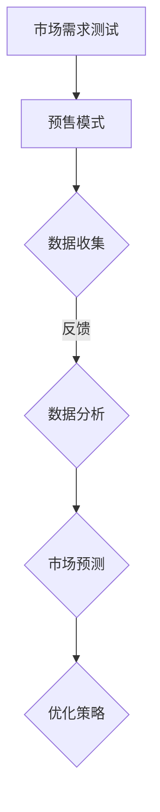

                 

### 核心概念与联系

预售模式，作为一种在产品或服务推出前通过提前销售来验证市场需求和市场反应的商业模式，已经成为现代企业战略规划中不可或缺的一部分。核心概念包括：

- **预售模式**：指企业通过预先接受消费者的订单或付款来获取资金，从而在正式推出产品或服务前验证市场需求的一种营销策略。
- **市场需求测试**：通过预售活动收集潜在客户对产品或服务的反馈，以预测未来市场的接受度和销售前景。

这两者的联系在于，预售模式为市场需求测试提供了一个有效的平台。企业可以通过预售活动获得以下关键数据：

1. **订单量**：反映潜在客户的购买意愿和市场规模。
2. **用户反馈**：了解消费者对产品或服务的需求和改进建议。
3. **预售转化率**：衡量预售活动的效果和市场的实际接受程度。

这些数据有助于企业调整产品策略、定价策略和市场推广策略，从而更好地满足市场需求。

为了更直观地理解这些核心概念和它们之间的联系，我们可以使用以下 Mermaid 流程图：



在这个流程图中，市场需求测试作为输入驱动预售模式，预售模式通过数据收集反馈至数据分析，最终用于市场预测和优化策略的制定。这个过程形成了一个闭环，确保企业能够根据市场反馈不断调整和优化其产品和服务。

### 核心算法原理讲解

预售转化率分析是评估预售活动效果的重要环节。转化率（Conversion Rate）通常定义为完成预售交易的用户数与参与预售的用户数之比，其计算公式如下：

$$
\text{转化率} = \left(\frac{\text{完成预售交易的用户数}}{\text{参与预售的用户数}}\right) \times 100\%
$$

这个指标可以帮助企业了解其预售活动的吸引力和用户购买意愿。以下是详细的伪代码示例：

```python
def calculate_conversion_rate(completed_sales, total_participants):
    conversion_rate = (completed_sales / total_participants) * 100
    return conversion_rate
```

在这个函数中，`completed_sales` 代表完成预售交易的用户数，`total_participants` 代表参与预售的用户总数。函数计算并返回转化率。

#### 数学模型和数学公式 & 详细讲解 & 举例说明

预售需求预测模型通常采用回归分析方法，其中需求量（Q）是关于价格（P）和促销力度（I）的函数。这种模型的数学表达式如下：

$$
Q = a - bP + cI
$$

其中，a、b 和 c 是模型参数，可以通过历史数据拟合得到。

#### 举例说明

假设某商品的历史预售数据如下：

| 价格（元） | 促销力度（百分比） | 需求量（件） |
|------------|---------------------|-------------|
| 100        | 10%                 | 500         |
| 90         | 20%                 | 600         |
| 80         | 30%                 | 700         |

使用最小二乘法拟合上述数据，得到模型参数如下：

$$
a = 800, \quad b = 0.1, \quad c = 50
$$

现在，我们预测价格为 85 元时的需求量。根据模型公式，我们有：

$$
Q = 800 - 0.1 \times 85 + 50 \times 20\% = 665
$$

这意味着在价格为 85 元时，预计需求量为 665 件。

### 项目实战

#### 预售活动策划与执行

1. **需求分析**：首先，企业需要分析目标市场和潜在消费者，明确预售的产品和目标需求。这包括了解目标市场的规模、消费者的购买习惯和偏好。

2. **预售策略制定**：在明确了市场需求后，企业需要制定预售策略，包括确定预售价格、促销力度、时间安排等。例如，可以根据成本、市场需求和竞争对手定价来设定合理的预售价格。

3. **预售活动执行**：
   - **宣传推广**：企业可以通过社交媒体、电子邮件、广告等渠道宣传预售活动，提高曝光度和参与度。
   - **渠道选择**：选择合适的预售平台或渠道，如淘宝、京东、自有商城等，以方便消费者参与。

4. **数据收集与分析**：
   - **用户反馈**：收集用户对产品的反馈，包括意见、建议和需求。这些反馈可以通过问卷调查、用户评论、客服沟通等方式获得。
   - **销售数据**：整理和分析预售期间的销售数据，包括订单量、销售额、转化率等。这些数据可以帮助企业了解市场接受程度和用户购买意愿。

5. **预售结果评估**：根据预售数据和用户反馈，企业需要评估预售活动的效果。例如，通过比较实际销售数据与预测数据，评估预售活动的成功程度。

#### 代码实际案例和详细解释说明

以下是一个使用 Python 进行预售数据分析和预测的代码实际案例：

```python
# 导入必要的库
import pandas as pd
import numpy as np

# 加载数据
data = pd.read_csv('presale_data.csv')

# 数据预处理
data['Price'] = data['Price'].astype(float)
data['Promotion'] = data['Promotion'].astype(float)
data['Quantity'] = data['Quantity'].astype(int)

# 模型拟合
model = np.polyfit(data['Price'], data['Quantity'], 2)
q_predict = np.polyval(model, 85)

# 输出预测结果
print(f'Price: 85, Predicted Quantity: {q_predict:.2f}')
```

**开发环境搭建**：

1. **Python 环境安装**：在本地计算机上安装 Python 3.8+ 版本。
2. **库安装**：通过 pip 命令安装 pandas、numpy 等库。

**源代码详细实现和代码解读**：

- **数据加载与预处理**：使用 pandas 库加载数据，并对数据类型进行转换，确保数据的准确性和一致性。
- **模型拟合**：使用 numpy 库的 polyfit 函数进行多项式拟合，得到模型参数。
- **预测**：使用 numpy 库的 polyval 函数进行预测，输出预测结果。

**代码解读与分析**：

上述代码首先加载并预处理了预售数据，然后使用最小二乘法对数据进行了拟合，最后预测了价格为 85 元时的需求量。通过这个实际案例，读者可以了解如何使用 Python 进行预售数据的分析和预测。

### 预售模式的实施步骤

预售模式是一种通过提前销售产品或服务来测试市场需求的有效方式。要成功实施预售模式，企业需要经过以下几个关键步骤：

#### 准备工作

1. **明确目标市场和产品定位**：首先，企业需要明确目标市场，包括目标消费者的年龄、性别、地理位置、消费习惯等。同时，要明确产品定位，即产品在市场中的独特价值和竞争优势。

2. **制定预售策略**：根据目标市场和产品定位，制定预售策略。这包括确定预售价格、促销力度、时间安排等。预售价格可以设定为市场参考价、成本价或特别优惠价，以吸引消费者。

3. **确定预售目标和时间安排**：明确预售活动的目标，例如预计的订单量、销售额、用户反馈等。同时，根据目标设定预售时间，确保活动有足够的时间来吸引潜在客户。

#### 招募预售参与者

1. **选择合适的渠道**：选择适合产品的预售渠道，如电商平台、社交媒体、自有商城等。根据目标市场的特点，选择最有效的渠道进行推广。

2. **设计预售激励机制**：为了激励消费者参与预售，可以设计一系列激励机制，如折扣优惠、赠品、积分等。这些激励措施可以增加消费者的购买意愿。

3. **与参与者沟通与合作**：在预售活动前，与参与者进行有效沟通，确保他们了解预售活动的细节和流程。通过建立良好的合作关系，可以增加参与者的积极性和忠诚度。

#### 进行预售活动

1. **设计预售方案**：制定详细的预售方案，包括预售活动的时间、流程、奖励机制等。确保方案具有吸引力，能够激发消费者的购买欲望。

2. **发布预售信息**：在选定渠道发布预售信息，包括产品介绍、预售价格、优惠活动等。通过多种渠道进行推广，扩大活动影响力。

3. **监控预售进度与反馈**：实时监控预售活动的进展，包括订单量、销售额、用户反馈等。根据监控结果及时调整预售策略，提高活动的效果。

#### 预售数据分析与评估

1. **预售数据的收集与处理**：收集预售活动期间的所有相关数据，包括用户反馈、订单信息、销售数据等。使用数据处理工具，如 Excel、SQL 或数据分析软件，对收集的数据进行整理和分析。

2. **预售结果评估**：根据收集的数据，评估预售活动的效果。主要评估指标包括预售转化率、用户满意度、销售额等。通过评估结果，了解市场的实际接受度和用户需求。

3. **调整与优化**：根据评估结果，调整预售策略和产品定位，以提高后续活动的效果。例如，根据用户反馈改进产品，调整价格策略，优化宣传推广等。

### 第3章 预售数据分析与评估

预售数据分析与评估是预售模式中至关重要的一环，通过数据收集、处理和分析，企业可以深入了解市场反应，为产品优化和市场策略调整提供依据。以下是预售数据分析与评估的详细步骤：

#### 预售数据的收集与处理

1. **用户反馈信息的收集**：
   - **渠道选择**：选择合适的渠道收集用户反馈，如问卷调查、用户评论、社交媒体互动等。
   - **内容整理**：将收集到的用户反馈整理成结构化的数据，方便后续分析。

2. **销售数据的整理与分析**：
   - **数据来源**：销售数据可以从电商平台、自有商城、财务系统等渠道获取。
   - **数据清洗**：清洗数据，包括去除重复记录、纠正错误数据、填补缺失值等，确保数据质量。

#### 预售结果评估

1. **评估指标的选择**：
   - **转化率**：转化率是评估预售活动效果的重要指标，计算公式为：
     $$
     \text{转化率} = \left(\frac{\text{完成预售交易的用户数}}{\text{参与预售的用户数}}\right) \times 100\%
     $$
   - **用户满意度**：通过用户反馈评估用户对产品的满意度，可以使用评分、评论等数据进行分析。
   - **销售额**：预售期间的总销售额，可以反映产品的市场接受程度。

2. **评估结果的解读与应用**：
   - **市场接受度**：通过转化率和销售额评估产品的市场接受度。高转化率和销售额通常意味着产品受到市场的欢迎。
   - **用户需求**：通过用户反馈分析用户需求，了解消费者对产品的期望和改进建议。
   - **策略调整**：根据评估结果，调整预售策略，如价格调整、促销活动优化等，以提高市场反应。

#### 预售数据报告

1. **报告撰写**：撰写详细的预售数据报告，包括数据收集和处理过程、评估结果、分析和建议等。报告应具有清晰的结构和易于理解的数据图表。

2. **报告呈现**：将报告呈现给管理层，提供决策依据。报告应突出关键数据和结论，以便管理层快速了解预售活动的效果和后续改进方向。

### 预售模式优化策略

预售模式的优化策略是企业提升预售效果、满足市场需求的关键。以下是根据不同阶段和具体目标制定优化策略的方法：

#### 针对不同阶段的优化策略

1. **起步阶段**：
   - **目标**：提高品牌知名度和用户参与度。
   - **策略**：
     - **市场调研**：深入了解目标市场和潜在消费者，为产品定位和策略提供依据。
     - **内容营销**：通过高质量的内容吸引潜在客户，增加预售活动的影响力。
     - **合作伙伴**：与相关行业或领域的合作伙伴建立合作关系，共同推广预售活动。

2. **成长阶段**：
   - **目标**：扩大市场份额，提升销售额。
   - **策略**：
     - **数据分析**：利用预售数据，分析市场趋势和用户需求，调整产品策略。
     - **精细化运营**：针对不同用户群体，制定个性化的预售策略和优惠活动。
     - **技术支持**：利用数据分析工具，提高预售活动的自动化和智能化水平。

3. **成熟阶段**：
   - **目标**：维持市场份额，提高用户忠诚度。
   - **策略**：
     - **品牌建设**：强化品牌形象，提高品牌知名度和美誉度。
     - **客户关系管理**：通过良好的客户关系管理，提高用户满意度和忠诚度。
     - **产品迭代**：根据用户反馈和市场需求，不断优化产品，提升用户体验。

#### 提升预售效果的技巧

1. **提高用户参与度**：
   - **互动活动**：举办线上线下互动活动，增加用户参与感。
   - **用户奖励**：设立积分、优惠券等奖励机制，激励用户参与预售活动。

2. **提高预售转化率**：
   - **精准营销**：通过数据分析，精准定位目标客户，提高营销效果。
   - **限时优惠**：设置限时优惠，刺激用户在短时间内完成购买。

3. **提高预售后的销售业绩**：
   - **客户跟进**：预售活动结束后，及时跟进客户，了解用户反馈，提高后续销售转化率。
   - **市场推广**：持续进行市场推广，扩大品牌影响力，提高销售额。

### 预售模式优化策略的实施案例

以下是一个预售模式优化策略的实施案例：

- **背景**：某电子产品公司在起步阶段通过社交媒体宣传预售新产品，但用户参与度和转化率较低。
- **优化策略**：
  - **市场调研**：通过问卷调查和数据分析，了解目标消费者的需求和偏好。
  - **内容营销**：发布高质量的产品评测文章和视频，提高产品知名度和用户信任度。
  - **合作伙伴**：与知名科技博主和媒体合作，扩大宣传范围。
  - **互动活动**：举办产品体验活动，邀请潜在客户参与，增加用户参与感。
- **结果**：通过上述策略，用户参与度和转化率显著提高，预售活动取得了成功。

### 预售模式优化策略的总结

通过针对不同阶段的优化策略和具体技巧，企业可以有效提升预售模式的效果，满足市场需求。关键在于充分利用数据分析和用户反馈，不断调整和优化预售策略，以实现长期的业务增长。

### 预售模式的案例研究

预售模式作为一种有效的市场验证工具，在全球范围内得到了广泛应用。以下列举了国内外知名企业的预售案例，通过具体案例分析和总结，我们可以更好地理解预售模式在不同行业和领域的成功实践。

#### 案例一：小米的预售模式

小米作为一家全球知名的智能硬件和电子产品公司，其预售模式被广泛认为是成功的典范。以下是小米预售模式的关键特点和成功原因：

1. **特点**：
   - **定期发布**：小米定期发布新产品，通过预售活动吸引消费者关注。
   - **限量发售**：每次预售活动均设定限量发售，制造稀缺感，提高消费者购买欲望。
   - **高性价比**：小米通过高性价比的产品吸引大量消费者参与预售。

2. **成功原因**：
   - **精准市场定位**：小米明确目标市场，专注于年轻消费者群体，满足他们对性价比和功能性的需求。
   - **良好的品牌形象**：小米通过高质量的产品和服务建立了良好的品牌形象，增强了消费者的信任。
   - **高效的供应链管理**：小米拥有高效的供应链管理体系，能够快速响应市场需求，确保预售活动的顺利进行。

#### 案例二：苹果的预售策略

苹果公司作为全球科技产业的领军企业，其预售策略在电子消费品领域具有很高的参考价值。以下是苹果预售策略的关键特点和成功原因：

1. **特点**：
   - **新品发布**：苹果通过新品发布会公布新产品，并在发布后立即开启预售。
   - **全球同步**：苹果在全球范围内同步开启预售活动，确保不同地区消费者的公平机会。
   - **高端定位**：苹果的产品定价较高，面向高端消费者群体。

2. **成功原因**：
   - **技术创新**：苹果始终引领科技潮流，其产品具有独特的技术创新和用户体验，吸引消费者。
   - **品牌忠诚度**：苹果建立了强大的品牌忠诚度，消费者对苹果的产品充满期待。
   - **强大的渠道支持**：苹果在全球范围内拥有广泛的销售渠道，确保预售活动的顺利进行。

#### 不同行业的预售实践

除了电子消费品行业，预售模式也在其他行业中得到了广泛应用。以下是电子产品、服装和文化娱乐行业的预售实践：

1. **电子产品行业**：
   - **特点**：预售活动通常在产品发布前进行，通过提前预订吸引消费者。
   - **成功案例**：如小米、苹果等公司，通过预售活动验证市场需求，确保产品顺利上市。

2. **服装行业**：
   - **特点**：预售活动在时尚季开始前进行，通过限量款式和提前预订吸引消费者。
   - **成功案例**：如优衣库、ZARA等公司，通过预售活动提高品牌知名度和销售额。

3. **文化娱乐行业**：
   - **特点**：预售活动在文化演出、电影等作品发布前进行，通过提前预订吸引观众。
   - **成功案例**：如电影院线上预售、演唱会门票预售等，通过预售活动提高票房收入。

通过这些案例研究，我们可以看到预售模式在不同行业和领域的成功实践。预售模式的关键在于充分利用数据分析和用户反馈，制定合理的预售策略，确保市场验证的有效性和可靠性。

### 预售模式的法律与伦理问题

在实施预售模式的过程中，企业需要关注一系列法律与伦理问题，以确保活动的合法性和道德性。以下是对预售模式中的法律问题、消费者权益保护、知识产权问题以及伦理问题的详细探讨。

#### 预售模式中的法律问题

1. **合同法适用**：
   - **合同成立**：预售活动中，企业与消费者之间的合同何时成立是关键问题。通常，当消费者提交订单并完成支付时，合同即告成立。
   - **合同条款**：预售合同中应明确约定产品的质量标准、交付时间、售后服务等内容，避免未来纠纷。

2. **消费者权益保护**：
   - **信息披露**：企业应在预售过程中充分披露产品信息、价格、促销条件等，确保信息的透明度。
   - **隐私保护**：企业应遵守相关法律法规，保护消费者的个人隐私，不得滥用消费者信息。

3. **预售中的知识产权问题**：
   - **版权**：企业在预售活动中应尊重他人的知识产权，不得侵犯他人的版权、商标权等。
   - **专利**：对于涉及专利技术的产品，企业应在预售前确保专利的有效性，避免侵犯他人专利权。

#### 伦理问题

1. **信息披露与透明度**：
   - **真实披露**：企业应在预售过程中如实披露产品信息，不得夸大其词或隐瞒重要信息，以欺骗消费者。

2. **用户隐私保护**：
   - **隐私安全**：企业应采取措施保护用户隐私，确保用户数据不被泄露或滥用。
   - **数据用途**：企业应明确告知用户其个人数据的用途，并严格限制数据的使用范围。

3. **社会责任与可持续发展**：
   - **社会责任**：企业在预售活动中应承担社会责任，关注社会问题，推动可持续发展。
   - **环保实践**：企业应采用环保材料和生产工艺，减少对环境的负面影响。

#### 实践建议

1. **遵守法律法规**：企业在实施预售模式时，应严格遵守相关法律法规，确保活动的合法性。

2. **加强内部管理**：企业应建立完善的内部管理体系，包括信息披露、隐私保护、知识产权管理等，以规范预售活动的执行。

3. **注重用户体验**：企业应关注消费者的需求，提供优质的产品和服务，增强消费者的信任和满意度。

通过关注和解决预售模式中的法律与伦理问题，企业可以确保预售活动的顺利进行，提升品牌形象和市场竞争力。

### 预售模式的未来发展趋势

随着科技的不断进步和市场的日益成熟，预售模式也在不断演变和优化，未来的发展趋势主要集中在以下几个方面：

#### 新技术对预售模式的影响

1. **区块链技术**：
   - **去中心化**：区块链技术可以提供去中心化的交易平台，提高预售活动的透明度和安全性。
   - **智能合约**：通过智能合约，预售活动中的条款和条件可以自动执行，减少人工干预和纠纷。

2. **人工智能技术**：
   - **个性化推荐**：人工智能可以分析海量用户数据，提供个性化的产品推荐和促销策略。
   - **自动化管理**：通过人工智能，企业可以实现预售活动的自动化管理，提高运营效率。

3. **物联网技术**：
   - **智能设备**：物联网技术使得预售活动中的智能设备互联，为用户提供更加便捷的购物体验。
   - **供应链优化**：物联网技术可以实时监控产品库存和运输情况，优化供应链管理。

#### 预售模式的国际化与本土化

1. **国际化预售模式的发展趋势**：
   - **跨境交易**：随着跨境电商的兴起，预售模式逐渐向全球扩展，企业可以通过跨境预售活动进入国际市场。
   - **本地化策略**：企业在国际化过程中，需要根据不同地区的文化、消费习惯和法律法规，制定本地化策略。

2. **本土化预售策略的实践与探索**：
   - **文化融入**：企业在本土化过程中，应注重文化融入，尊重当地消费者的文化和价值观。
   - **市场细分**：根据本土市场的特点，进行市场细分，提供针对性的预售产品和策略。

3. **跨境电商中的预售模式**：
   - **跨境支付**：跨境电商中的预售模式需要解决跨境支付和结算问题，提高支付效率和用户体验。
   - **物流配送**：跨境电商的物流配送是影响预售活动成功的关键因素，企业需要优化物流网络，提高配送速度。

#### 新技术的具体应用案例

1. **区块链技术在预售中的应用**：
   - **案例**：某区块链公司通过预售活动发售虚拟商品，利用区块链技术保证交易的透明和安全。
   - **效果**：预售活动获得了大量用户参与，交易透明度提高，用户信任度增强。

2. **人工智能技术在预售中的创新**：
   - **案例**：某电商平台利用人工智能技术进行预售用户画像分析，提供个性化的预售推荐。
   - **效果**：预售活动的用户参与度和转化率显著提升，企业能够更好地满足市场需求。

3. **物联网技术在预售中的应用**：
   - **案例**：某智能家居品牌通过预售活动推广智能设备，用户可以通过物联网技术实现远程控制。
   - **效果**：预售活动获得了广泛好评，智能家居产品的市场接受度显著提高。

通过新技术和国际化策略的应用，预售模式将继续发展壮大，为企业和消费者带来更多机遇和挑战。

### 附录 A：预售模式常用工具与资源

在实施预售模式时，企业需要利用一系列工具和资源来支持数据收集、分析和管理。以下列出了一些常用的工具和资源，以帮助企业和个人在预售活动中更好地开展工作和优化策略。

#### 预售模式数据分析工具

1. **Google Analytics**：
   - **功能**：提供网站流量分析、用户行为跟踪等功能，帮助企业了解市场反应和用户偏好。
   - **适用场景**：网站和在线销售平台的用户行为分析。

2. **Tableau**：
   - **功能**：数据可视化工具，能够将复杂的数据转化为易于理解的图表和报告。
   - **适用场景**：数据分析和报告制作。

3. **SQL**：
   - **功能**：用于数据库查询和数据处理，适合处理大规模数据。
   - **适用场景**：数据存储和查询。

#### 预售活动管理工具

1. **Mailchimp**：
   - **功能**：电子邮件营销平台，用于发送预售通知和促销邮件。
   - **适用场景**：邮件营销和用户沟通。

2. **HubSpot**：
   - **功能**：提供客户关系管理（CRM）功能，帮助企业管理客户信息和销售活动。
   - **适用场景**：客户管理和销售活动跟踪。

3. **Slack**：
   - **功能**：团队沟通和协作工具，用于团队内部的信息交流和任务分配。
   - **适用场景**：团队协作和项目跟进。

#### 预售模式相关法律法规与政策文件

1. **《中华人民共和国合同法》**：
   - **内容**：规定了合同的基本原则和合同各方的权利义务。
   - **适用场景**：合同签订和执行。

2. **《中华人民共和国电子商务法》**：
   - **内容**：规定了电子商务的基本规则，包括电子合同、电子支付等内容。
   - **适用场景**：电子商务活动。

3. **《消费者权益保护法》**：
   - **内容**：规定了消费者权益保护的基本原则和具体措施。
   - **适用场景**：消费者权益保护和售后服务。

通过使用这些工具和资源，企业可以更高效地实施预售模式，提高市场反应速度和客户满意度，从而在竞争激烈的市场中脱颖而出。

### 总结

本文通过对预售模式的概念、实施步骤、数据分析、优化策略、案例分析以及法律与伦理问题的详细探讨，全面介绍了预售模式在现代商业活动中的重要性。预售模式作为一种有效的市场验证工具，不仅帮助企业预测市场需求，还能提升品牌知名度和用户忠诚度。

首先，预售模式的核心概念包括市场需求测试和预售模式的结合，通过预售活动收集用户反馈和市场数据，为产品优化和市场策略提供有力支持。其次，预售模式的实施步骤包括明确目标市场、制定预售策略、招募参与者、进行预售活动以及数据收集与分析。通过这些步骤，企业可以确保预售活动的顺利进行。

在数据分析与评估环节，企业需要收集和处理预售数据，评估市场反应，并根据评估结果调整预售策略。预售转化率和用户满意度是关键评估指标，通过分析这些数据，企业可以更好地了解市场需求和用户偏好。

优化策略是企业提升预售效果的关键。根据不同阶段和具体目标，企业可以制定针对性的优化策略，如市场调研、内容营销、数据分析等。同时，通过提高用户参与度、转化率和预售后的销售业绩，企业可以进一步提升市场竞争力。

案例分析部分展示了小米和苹果等知名企业的成功实践，通过这些案例，读者可以了解预售模式在不同行业和领域的应用效果。法律与伦理问题的探讨则提醒企业在实施预售模式时需关注法律法规和道德责任，确保活动的合法性和道德性。

未来的预售模式将继续受到新技术的影响，如区块链、人工智能和物联网等技术的应用，将使预售模式更加智能化和高效化。同时，国际化与本土化策略的实践将使预售模式在全球范围内得到更广泛的推广和应用。

附录部分提供了预售模式常用的工具和资源，包括数据分析工具、预售活动管理工具以及相关法律法规，为企业实施预售模式提供实用参考。

总之，预售模式是一种极具价值的商业策略，通过科学的方法和有效的工具，企业可以更好地验证市场需求，优化产品和服务，从而在竞争激烈的市场中取得成功。

