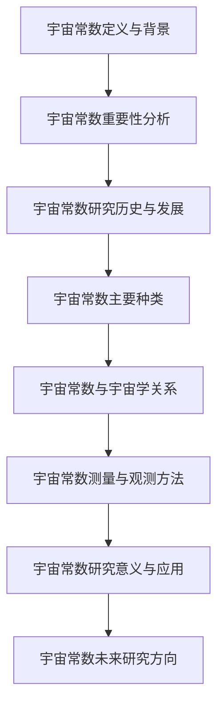
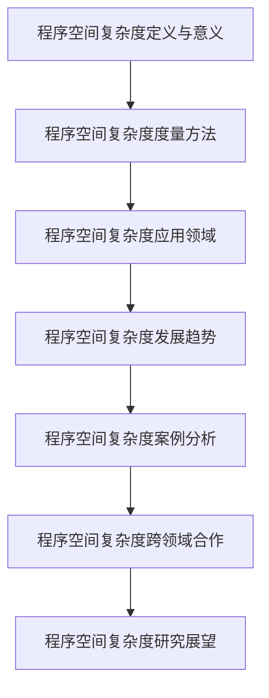
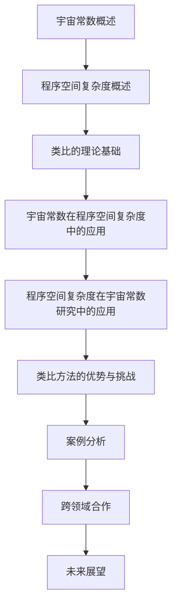

                 

### 第一部分：宇宙常数概述

#### 1.1 宇宙常数的定义与背景

宇宙常数是物理学中一个关键概念，指的是宇宙的基本物理参数，它对宇宙的演化起着至关重要的作用。宇宙常数最早由爱因斯坦在1917年的广义相对论中引入，被称为宇宙学常数（Cosmological Constant），符号通常为 \( \Lambda \)。

**1.1.1 宇宙常数的起源**

爱因斯坦在研究宇宙的静态模型时，为了使宇宙在不存在引力作用的情况下保持静态，他引入了宇宙常数。这一常数在爱因斯坦的早期宇宙模型中起到了抵消引力效应的作用，使得宇宙能够保持均匀且不收缩的状态。

然而，随着宇宙学的发展，爱因斯坦后来认为这一常数是他职业生涯中最大的错误，因为后来的观测数据显示，宇宙实际上在膨胀，而非静止。尽管如此，宇宙常数依然成为宇宙学研究中一个不可或缺的参数。

**1.1.2 宇宙常数的重要性**

宇宙常数的重要性体现在以下几个方面：

1. **宇宙膨胀**：宇宙常数与宇宙膨胀密切相关。当前主流的宇宙学理论——宇宙大爆炸理论认为，宇宙从大爆炸开始不断膨胀。宇宙常数作为宇宙膨胀的一个推动力，影响着宇宙的膨胀速率。

2. **暗能量**：现代宇宙学认为，宇宙中大约有68%的能量以暗能量的形式存在，而暗能量与宇宙常数密切相关。宇宙常数作为描述暗能量的物理量，是研究宇宙膨胀和宇宙学结构形成的重要参数。

3. **宇宙学参数**：宇宙常数与其他宇宙学参数一起，构成了宇宙学参数组，这些参数决定了宇宙的演化历史和当前状态。通过精确测量宇宙常数，我们可以更好地理解宇宙的起源、演化和未来。

**1.1.3 宇宙常数的研究历史与发展**

宇宙常数的研究历史悠久，随着科学技术的进步，人们对宇宙常数的认识也在不断深化。以下是宇宙常数研究的一些重要历史和发展：

1. **早期研究**：爱因斯坦在1917年首次引入宇宙常数，并提出静态宇宙模型。此后，宇宙常数成为天文学和物理学研究的热点。

2. **宇宙膨胀的发现**：1929年，哈勃通过观测发现，远处的星系正在以红移的形式远离我们，这一发现表明宇宙正在膨胀。

3. **宇宙常数与暗能量的联系**：1998年，宇宙微波背景辐射的观测结果揭示了宇宙的加速膨胀现象，这促使科学家们将宇宙常数与暗能量联系起来。

4. **精确测量**：近年来，通过宇宙微波背景辐射、大尺度结构观测等手段，科学家们对宇宙常数的测量越来越精确，为宇宙学研究提供了宝贵的数据支持。

接下来，我们将进一步探讨宇宙常数的主要种类，以及它们在宇宙学中的具体应用和观测方法。

#### 1.2 宇宙常数的主要种类

宇宙常数不仅包括爱因斯坦最初引入的宇宙学常数，还涵盖了其他几种重要的宇宙常数。以下是几种主要宇宙常数的介绍。

**1.2.1 爱因斯坦的宇宙常数**

爱因斯坦在1917年首次引入的宇宙常数被称为宇宙学常数，通常用符号 \( \Lambda \) 表示。它最初是为了平衡宇宙中的引力效应，使宇宙能够保持静态而引入的。然而，后来的观测结果表明，宇宙实际上在膨胀，这一常数的作用更多体现在描述宇宙的加速膨胀上。

**1.2.2 卡鲁扎-克莱因宇宙常数**

卡鲁扎-克莱因宇宙常数（Kaluza-Klein Cosmological Constant）是与超弦理论相关的一个宇宙常数。超弦理论是一种尝试统一引力与其他基本力的理论，其中卡鲁扎-克莱因宇宙常数起着关键作用。在这种理论框架下，宇宙常数与额外空间维度的存在密切相关。

**1.2.3 引力常数**

引力常数（Gravitational Constant），通常用符号 \( G \) 表示，是描述万有引力定律中引力强度的一个基本物理常数。尽管引力常数并不是传统意义上的宇宙常数，但在宇宙学中，它与其他宇宙常数（如宇宙学常数）密切相关，共同影响宇宙的演化。

**1.2.4 其他宇宙常数**

除了上述三种主要宇宙常数外，宇宙学研究中还涉及其他几种重要的宇宙常数。例如：

1. **宇宙膨胀因子**：宇宙膨胀因子（Cosmological Expansion Factor）是描述宇宙膨胀速率的参数。它与宇宙常数密切相关，是宇宙学研究中的关键参数。

2. **宇宙质量密度**：宇宙质量密度（Cosmic Mass Density）是描述宇宙中物质分布的一个参数。它与宇宙常数一起，决定了宇宙的形态和演化过程。

接下来，我们将探讨宇宙常数与宇宙学之间的关系，特别是宇宙常数如何影响宇宙的膨胀、暗能量以及暗物质的研究。

#### 1.3 宇宙常数与宇宙学

宇宙常数是宇宙学研究中一个至关重要的参数，它不仅影响宇宙的膨胀速率，还与暗能量、暗物质等宇宙学现象密切相关。下面我们将详细探讨宇宙常数在这些方面的具体作用。

**1.3.1 宇宙常数与宇宙膨胀**

宇宙膨胀是宇宙学的一个核心问题。现代宇宙学认为，宇宙从大爆炸开始不断膨胀，这一膨胀过程受到宇宙常数的影响。宇宙常数 \( \Lambda \) 可以被视为一个宇宙膨胀的推动力，它使宇宙在膨胀过程中保持加速。

根据宇宙大爆炸理论，宇宙的膨胀速率可以用哈勃定律来描述，即宇宙的膨胀速率与宇宙的距离成正比。哈勃常数 \( H_0 \) 是描述这一比例关系的参数。而宇宙常数 \( \Lambda \) 与哈勃常数 \( H_0 \) 之间的关系可以用以下公式表示：

\[ H_0 = \frac{\Lambda}{3M_p^2} \]

其中，\( M_p \) 是引力常数 \( G \) 和普朗克常数 \( h \) 的乘积，即 \( M_p = \sqrt{8\pi G/h} \)。

这个公式表明，宇宙常数 \( \Lambda \) 与哈勃常数 \( H_0 \) 成正比，从而决定了宇宙的膨胀速率。如果 \( \Lambda \) 很大，那么宇宙的膨胀速率就会很快；如果 \( \Lambda \) 很小，宇宙的膨胀速率就会相对较慢。

**1.3.2 宇宙常数与暗能量**

暗能量是宇宙学中的另一个核心概念，它占据了宇宙总能量的大部分。暗能量与宇宙常数密切相关，通常被认为是宇宙常数的一种表现形式。现代宇宙学认为，暗能量是驱动宇宙加速膨胀的主要力量。

暗能量具有以下几个主要特点：

1. **能量密度**：暗能量具有非常高的能量密度，远远超过普通物质和辐射的能量密度。

2. **均匀性**：暗能量在宇宙中分布非常均匀，不受宇宙中物质分布的影响。

3. **稳定性**：暗能量具有极高的稳定性，即使在非常小的空间和时间尺度上，其能量密度也非常接近常数。

4. **负压**：暗能量具有负压特性，这意味着它对宇宙的引力效应与普通物质相反，可以推动宇宙加速膨胀。

宇宙常数 \( \Lambda \) 与暗能量的关系可以用以下公式表示：

\[ \rho_{de} = \frac{\Lambda c^2}{8\pi G} \]

其中，\( \rho_{de} \) 是暗能量密度，\( c \) 是光速，\( G \) 是引力常数。这个公式表明，暗能量密度与宇宙常数成正比，从而决定了宇宙的膨胀速率。

**1.3.3 宇宙常数与暗物质**

暗物质是宇宙中的另一个重要组成部分，它占据了宇宙总质量的大部分。暗物质与宇宙常数之间的关系相对复杂，但可以通过一些观测数据和理论模型来理解。

暗物质具有以下几个主要特点：

1. **引力作用**：暗物质通过引力与普通物质相互作用，影响宇宙的演化。

2. **不可见性**：暗物质不发光、不吸光，因此无法直接观测。

3. **稳定性**：暗物质非常稳定，不易发生物理反应。

4. **分布特性**：暗物质在宇宙中的分布非常均匀，但相对于普通物质，其密度较低。

宇宙常数 \( \Lambda \) 与暗物质之间的关系可以通过宇宙学参数组来描述。宇宙学参数组包括多个参数，如宇宙膨胀因子 \( a \)、宇宙质量密度 \( \Omega_m \) 和宇宙常数密度 \( \Omega_{\Lambda} \) 等。

这些参数之间的关系可以用以下公式表示：

\[ \Omega_m a^3 + \Omega_{\Lambda} = 1 \]

这个公式表明，宇宙的总密度由普通物质密度 \( \Omega_m \) 和宇宙常数密度 \( \Omega_{\Lambda} \) 共同决定。当 \( a = 1 \) 时，即当前宇宙时刻，我们可以通过测量这些参数来确定宇宙常数的大小。

总之，宇宙常数是宇宙学研究中一个核心的概念，它不仅与宇宙膨胀、暗能量和暗物质密切相关，还决定了宇宙的演化过程和未来状态。通过对宇宙常数的精确测量和理解，我们可以更好地揭示宇宙的本质和起源。

接下来，我们将探讨宇宙常数的测量与观测方法，以及当前观测数据对宇宙常数的研究提供了哪些重要信息。

#### 1.4 宇宙常数的测量与观测

宇宙常数的测量与观测是现代宇宙学研究中的一项关键任务。由于宇宙常数是一个宇宙学参数，它的影响遍布整个宇宙，因此需要通过各种观测手段来精确测量其值。以下是几种常用的宇宙常数测量方法及其观测数据。

**1.4.1 宇宙常数的测量方法**

1. **宇宙微波背景辐射**：宇宙微波背景辐射（Cosmic Microwave Background, CMB）是宇宙大爆炸后留下的辐射余辉。通过测量CMB的温度起伏，可以获取宇宙早期状态的信息。特别是，CMB的幂谱指数（即波长的分布）与宇宙常数密切相关。例如，普朗克卫星（Planck Satellite）通过精确测量CMB的功率谱，为宇宙常数提供了重要数据。

2. **大尺度结构观测**：宇宙的大尺度结构，如星系团、超星系团等，是宇宙演化的直接证据。通过观测这些结构，可以推断出宇宙常数的影响。例如，星系团的分布和运动可以通过引力透镜效应来研究，从而为宇宙常数提供间接证据。

3. **宇宙膨胀速率**：宇宙的膨胀速率可以通过测量遥远星系的红移来推断。随着宇宙的膨胀，星系的光谱会发生红移，红移的大小与宇宙的膨胀速率成正比。利用这种测量方法，我们可以获取宇宙常数的值。

**1.4.2 宇宙常数的观测数据与结果**

1. **普朗克卫星数据**：普朗克卫星是迄今为止对宇宙常数测量最为精确的卫星之一。通过分析普朗克卫星的CMB观测数据，科学家们确定了宇宙常数 \( \Lambda \) 的值约为 \( 1.056 \times 10^{-38} \text{J} \cdot \text{m}^{-3} \)。这一测量结果为理解宇宙的加速膨胀提供了重要依据。

2. **其他卫星与望远镜数据**：除了普朗克卫星，其他卫星和望远镜，如威尔金森微波各向异性探测器（WMAP）和斯隆数字巡天（SDSS），也为宇宙常数提供了大量观测数据。通过综合分析这些数据，科学家们不断优化宇宙常数 \( \Lambda \) 的测量值。

**1.4.3 宇宙常数的未来研究方向**

尽管当前对宇宙常数的测量已经取得了显著进展，但仍然存在一些挑战和未解之谜。未来的宇宙常数研究将主要集中在以下几个方面：

1. **更高精度的测量**：随着测量技术的进步，未来将有望获得更高精度的宇宙常数测量值。这可以通过改进卫星和望远镜的观测设备，以及开发更先进的分析算法来实现。

2. **多波段观测**：宇宙常数的测量不仅限于CMB，还可以通过其他波段（如射电波段、光学波段等）来获取信息。多波段观测将有助于更全面地理解宇宙常数的影响。

3. **宇宙学参数组**：宇宙学参数组包括多个参数，如宇宙膨胀因子 \( a \)、宇宙质量密度 \( \Omega_m \) 和宇宙常数密度 \( \Omega_{\Lambda} \) 等。通过测量这些参数，可以更全面地了解宇宙的演化历史和未来状态。

4. **理论突破**：宇宙常数的研究不仅限于观测数据，还需要结合理论模型来解释观测结果。未来可能的理论突破，如量子引力理论的进展，有望为理解宇宙常数提供新的视角。

总之，宇宙常数的测量与观测是现代宇宙学研究中的一项重要任务。通过不断改进观测技术和分析算法，科学家们将有望获得更高精度的宇宙常数测量值，从而更深入地理解宇宙的本质和演化过程。

### 1.5 宇宙常数的研究意义与应用

宇宙常数作为物理学和宇宙学中的一个核心参数，其研究不仅具有深远的理论意义，还在多个领域有着广泛的应用。以下从科学、技术和社会三个方面简要介绍宇宙常数的研究意义和应用。

**1.5.1 科学意义**

宇宙常数的研究在科学领域具有重要意义。首先，它为理解宇宙的起源和演化提供了关键线索。宇宙常数的测量和理论分析有助于揭示宇宙大爆炸后的早期状态，探究宇宙膨胀的机制和宇宙学参数组的演化历史。其次，宇宙常数的研究有助于推动对引力和量子力学的统一理论探索。目前，宇宙常数被视为暗能量的主要表现形式，它是连接广义相对论和量子场论的一个重要桥梁。通过研究宇宙常数，科学家们试图找到一种能够同时描述引力和量子效应的统一理论。

**1.5.2 技术应用**

宇宙常数的研究在技术领域也有显著的应用。例如，宇宙微波背景辐射的测量需要高精度的天文观测设备和复杂的分析算法。这些技术的研发和改进不仅推动了宇宙常数的研究，还带动了其他科学领域（如天文学、物理学）的技术进步。此外，宇宙常数的研究对引力透镜效应和宇宙大尺度结构的观测提供了重要数据支持。这些观测方法和技术在航天、遥感、通信等领域有着广泛的应用，促进了相关技术的发展。

**1.5.3 社会影响**

宇宙常数的研究对社会也产生了深远影响。首先，它促进了科学知识的普及和科学素养的提升。宇宙常数的研究成果被广泛报道和传播，激发了公众对宇宙学和物理学的兴趣，促进了科学教育的普及。其次，宇宙常数的研究为人类探索宇宙的奥秘提供了新的视角和工具。通过研究宇宙常数，人类不仅对宇宙的起源和演化有了更深入的理解，还对宇宙的未来有了更多的预见。此外，宇宙常数的研究还为应对一些全球性挑战提供了科学依据。例如，宇宙加速膨胀现象提示我们需要寻找新的能源形式，以应对能源危机和环境问题。宇宙常数的研究为这些挑战的解决提供了科学基础。

**1.5.4 总结**

宇宙常数的研究不仅具有深远的科学意义，还在技术和社会方面产生了广泛影响。通过不断深化对宇宙常数的研究，我们不仅能够更全面地理解宇宙的起源和演化，还能推动科学技术的发展，为社会进步和人类福祉作出贡献。未来，随着观测技术的进步和理论研究的深入，宇宙常数研究将继续为探索宇宙的奥秘和解决全球性挑战提供有力支持。

### 第二部分：程序空间复杂度概述

#### 2.1 程序空间复杂度的定义与意义

程序空间复杂度（Program Space Complexity）是计算机科学中的一个重要概念，它描述了程序在执行过程中所需存储空间的大小。程序空间复杂度对于理解和评估程序的性能、资源消耗以及可维护性具有重要意义。下面我们将详细讨论程序空间复杂度的基本概念、意义以及与其他复杂度度量方法的关系。

**2.1.1 程序空间复杂度的基本概念**

程序空间复杂度，通常记作 \( S(n) \)，是指程序在处理输入规模为 \( n \) 的数据时，所需的存储空间总量。与时间复杂度（Time Complexity）不同，时间复杂度描述的是程序执行时间与输入规模之间的关系，而空间复杂度描述的是程序所需存储空间与输入规模之间的关系。

程序空间复杂度的计算主要关注以下几个方面：

1. **栈空间复杂度**：在递归或函数调用的过程中，函数栈需要为每次调用分配栈空间。栈空间复杂度通常与递归深度或函数调用次数相关。

2. **堆空间复杂度**：在程序中使用动态内存分配时，堆空间复杂度是程序所需堆空间的总量。例如，创建大量对象或使用数组时，堆空间复杂度会显著增加。

3. **全局变量空间复杂度**：全局变量在整个程序执行期间都会占用一定的存储空间。全局变量空间复杂度与程序中全局变量的数量和大小相关。

4. **输入数据空间复杂度**：输入数据空间复杂度是指程序处理输入数据所需的空间。在某些情况下，输入数据的大小可能对程序的空间复杂度有重要影响。

**2.1.2 程序空间复杂度的意义**

程序空间复杂度在多个方面具有重要意义：

1. **资源消耗**：程序空间复杂度直接影响程序的资源消耗，包括内存、存储等。在资源受限的环境下，高空间复杂度的程序可能会导致资源耗尽，从而影响程序的性能和可靠性。

2. **性能评估**：通过分析程序的空间复杂度，可以评估程序在不同输入规模下的性能表现。这对于优化程序设计和选择合适的数据结构和算法至关重要。

3. **可维护性**：高空间复杂度的程序往往更难维护和调试。合理地控制空间复杂度有助于提高程序的可维护性和可扩展性。

4. **内存泄漏检测**：空间复杂度的分析可以帮助检测内存泄漏问题。内存泄漏是指程序在运行过程中未释放不再使用的内存，导致内存资源逐渐耗尽。通过空间复杂度分析，可以识别出可能导致内存泄漏的代码片段。

**2.1.3 程序空间复杂度与其他复杂度度量方法的关系**

程序空间复杂度与其他复杂度度量方法（如时间复杂度、算法复杂度）之间存在一定的联系和区别：

1. **时间复杂度**：时间复杂度描述的是程序执行时间与输入规模之间的关系，而空间复杂度描述的是程序所需存储空间与输入规模之间的关系。虽然两种复杂度度量方法关注的是不同的方面，但它们之间有一定的关联。例如，高空间复杂度的程序通常需要更多的计算资源，从而可能增加执行时间。

2. **算法复杂度**：算法复杂度是指算法在处理输入数据时的资源消耗，包括时间和空间。程序空间复杂度是算法复杂度的一个组成部分，它关注的是空间资源消耗。在实际应用中，我们需要综合考虑时间复杂度和空间复杂度，以选择最合适的算法和实现方案。

3. **数据结构选择**：数据结构的选择直接影响程序的空间复杂度。合理选择数据结构可以降低程序的空间复杂度，从而提高程序的性能和可维护性。例如，选择适合的数据结构可以减少内存分配和释放的次数，降低内存泄漏的风险。

总之，程序空间复杂度是计算机科学中一个重要且基础的概念。通过深入理解程序空间复杂度的基本概念、意义以及与其他复杂度度量方法的关系，我们可以更好地设计、评估和优化程序，提高程序的性能和可维护性。

#### 2.2 程序空间复杂度的度量方法

在计算机科学中，度量程序空间复杂度是评估程序性能和资源消耗的重要手段。空间复杂度分析旨在确定程序在执行过程中所需的存储空间，并评估这些空间如何随输入规模变化。以下将介绍几种常见的空间复杂度度量方法，包括时间复杂度分析、空间复杂度分析和其他复杂度度量方法。

**2.2.1 时间复杂度分析**

时间复杂度分析是评估程序运行时间的基本方法。它通过计算程序在处理输入数据时的时间增长趋势，量化程序的时间效率。时间复杂度通常用大O符号（\( O \)）表示，如 \( O(n) \)、\( O(n^2) \) 等，表示程序执行时间与输入规模 \( n \) 的关系。

时间复杂度分析的关键步骤包括：

1. **确定算法的基本操作**：找出程序中最频繁执行的操作，如循环、递归等。
2. **计算基本操作的数量**：分析输入规模 \( n \) 对基本操作数量的影响，通常通过递推关系或迭代计算得到。
3. **表达时间复杂度**：用大O符号表示程序的时间复杂度，如 \( T(n) = O(n) \) 表示线性时间复杂度。

时间复杂度分析对于评估程序性能和优化算法设计至关重要。例如，一个具有 \( O(n^2) \) 时间复杂度的算法在处理大规模数据时可能非常缓慢，而一个 \( O(n\log n) \) 的算法则相对高效。

**2.2.2 空间复杂度分析**

空间复杂度分析是评估程序所需存储空间的方法。它关注程序在执行过程中使用的栈空间、堆空间和全局变量空间等。空间复杂度也用大O符号表示，如 \( S(n) \)。

空间复杂度分析的关键步骤包括：

1. **确定程序使用的存储空间**：分析程序中的变量、数据结构、函数调用等所占用的存储空间。
2. **计算空间复杂度**：通过递推关系或迭代计算，确定程序空间复杂度随输入规模 \( n \) 的变化趋势。

常见的空间复杂度包括：

- **栈空间复杂度**：递归算法或函数调用会使用栈空间，栈空间复杂度通常与递归深度或函数调用次数相关。
- **堆空间复杂度**：动态内存分配会使用堆空间，堆空间复杂度与创建和释放对象的数量相关。
- **全局变量空间复杂度**：全局变量在整个程序执行期间都会占用存储空间，其复杂度与全局变量的数量和大小相关。

**2.2.3 其他复杂度度量方法**

除了时间复杂度和空间复杂度外，还有其他几种复杂度度量方法，用于评估程序的不同方面。

1. **算法复杂度**：算法复杂度是时间复杂度和空间复杂度的综合，描述的是算法在处理输入数据时的总体资源消耗。算法复杂度通常用 \( T(n) \times S(n) \) 表示，表示时间和空间的乘积。

2. **能量复杂度**：能量复杂度是评估程序运行过程中的能量消耗，包括计算和存储设备的能量消耗。随着环保和可持续发展的需求增加，能量复杂度成为评估程序能耗的重要指标。

3. **输入输出复杂度**：输入输出复杂度描述的是程序在输入和输出数据时的资源消耗。输入输出复杂度通常与数据传输速率、I/O操作次数等因素相关。

总之，程序空间复杂度分析是评估程序性能和资源消耗的重要方法。通过时间复杂度、空间复杂度和其他复杂度度量方法的分析，我们可以更全面地理解和优化程序，提高其性能和可维护性。

#### 2.3 程序空间复杂度在软件工程中的应用

程序空间复杂度在软件工程中具有广泛的应用，它对于软件的性能、可维护性和可扩展性有着深远的影响。以下从软件设计、开发和测试三个方面，探讨程序空间复杂度在软件工程中的应用。

**2.3.1 软件设计中的程序空间复杂度分析**

在软件设计阶段，程序空间复杂度分析是确保软件质量和性能的关键步骤。通过分析程序的空间复杂度，设计者可以识别潜在的性能瓶颈和资源浪费，从而优化软件架构和设计。

1. **设计模式选择**：合理选择设计模式可以降低程序的空间复杂度。例如，使用缓存（Cache）模式可以减少重复计算，从而降低堆空间复杂度。而使用迭代器（Iterator）模式可以减少递归调用，降低栈空间复杂度。

2. **模块划分**：在软件设计中，模块划分直接影响程序的空间复杂度。合理划分模块，将功能相似或相关的代码放在同一模块中，可以减少全局变量空间复杂度，从而提高程序的可维护性和可扩展性。

3. **数据结构选择**：选择适合的数据结构是降低程序空间复杂度的重要手段。例如，使用链表（Linked List）代替数组（Array）可以减少内存分配和释放的次数，降低堆空间复杂度。

**2.3.2 软件开发中的程序空间复杂度优化**

在软件开发过程中，程序空间复杂度优化是提高软件性能的关键步骤。以下是一些常见的空间复杂度优化策略：

1. **内存分配与回收**：在软件开发中，合理地分配和回收内存是降低程序空间复杂度的关键。例如，使用内存池（Memory Pool）技术可以减少频繁的内存分配和回收操作，降低堆空间复杂度。

2. **数据结构优化**：通过优化数据结构，可以降低程序的空间复杂度。例如，使用位图（Bitmap）代替传统的数据结构可以减少存储空间的需求，提高内存利用率。

3. **循环优化**：在循环中，优化循环条件、减少循环次数和优化循环体内的操作，可以显著降低程序的空间复杂度。例如，使用位操作代替算术运算可以减少计算次数，提高程序的执行效率。

4. **减少全局变量**：在软件开发中，减少全局变量的使用可以降低程序的空间复杂度。全局变量在整个程序执行期间都会占用存储空间，通过减少全局变量的数量和大小，可以降低程序的空间复杂度。

**2.3.3 软件测试中的程序空间复杂度验证**

在软件测试阶段，验证程序空间复杂度是确保软件质量和性能的重要环节。以下是一些常见的空间复杂度验证方法：

1. **静态分析**：通过静态代码分析工具，可以检测代码中的潜在空间复杂度问题。静态分析工具可以自动分析代码中的变量、数据结构和函数调用，识别可能的空间复杂度瓶颈。

2. **动态测试**：通过动态测试，可以在程序运行过程中监测和评估程序的空间复杂度。动态测试工具可以记录程序在执行过程中的内存使用情况，识别内存泄漏和空间复杂度过高的问题。

3. **性能测试**：性能测试是验证程序空间复杂度的有效方法。通过模拟不同输入规模和负载，可以评估程序的空间复杂度对性能的影响，识别潜在的瓶颈和优化点。

总之，程序空间复杂度在软件工程中具有广泛的应用。通过在软件设计、开发和测试阶段对程序空间复杂度的分析和优化，可以确保软件的性能、可维护性和可扩展性。合理的空间复杂度分析不仅有助于提高软件质量，还可以为软件开发提供重要的指导和优化策略。

#### 2.4 程序空间复杂度在计算机科学中的应用

程序空间复杂度在计算机科学领域具有广泛的应用，尤其在算法设计和分析中扮演着关键角色。以下将讨论程序空间复杂度在计算机科学中的具体应用，包括算法设计、性能优化和资源管理等方面。

**2.4.1 算法设计**

算法设计是计算机科学的核心内容之一，而程序空间复杂度在算法设计中起着至关重要的作用。在算法设计过程中，不仅要考虑算法的时间复杂度，还需关注其空间复杂度。这是因为，一个高效的算法可能在时间复杂度上表现良好，但如果空间复杂度过高，可能会占用大量内存资源，导致性能下降。

1. **空间复杂度优化**：在设计算法时，可以通过优化数据结构和算法逻辑来降低空间复杂度。例如，在排序算法中，选择合适的数据结构（如归并排序的链表实现）可以减少空间复杂度。在搜索算法中，利用哈希表可以减少对额外内存的需求。

2. **空间与时间平衡**：在算法设计中，常常需要平衡时间和空间复杂度。例如，在解决图问题时，深度优先搜索（DFS）和广度优先搜索（BFS）都有不同的空间复杂度，可以根据具体问题和资源限制选择最合适的算法。

**2.4.2 性能优化**

程序空间复杂度对程序性能有着直接影响。通过优化程序空间复杂度，可以提升程序的运行效率和响应速度。

1. **内存分配优化**：在程序运行过程中，内存分配和回收操作会消耗大量资源。通过优化内存分配策略，可以减少内存碎片和提高内存利用率。例如，使用内存池（Memory Pool）技术可以减少频繁的内存分配和回收，降低程序的堆空间复杂度。

2. **数据缓存**：数据缓存是优化程序空间复杂度的一种有效方法。通过在程序中引入缓存机制，可以减少对重复计算和频繁数据访问的需求，从而降低空间复杂度。例如，在数据库查询中，使用缓存可以减少对磁盘的读写次数，提高查询效率。

**2.4.3 资源管理**

在计算机科学中，资源管理是一个重要的研究方向。程序空间复杂度对于资源管理有着直接影响，特别是在资源受限的环境中。

1. **内存资源管理**：在资源受限的环境下，合理管理内存资源至关重要。通过分析程序的空间复杂度，可以识别出内存消耗较大的部分，并采取相应的优化措施。例如，在嵌入式系统设计中，通过降低程序的空间复杂度，可以确保系统在有限的内存资源下正常运行。

2. **虚拟内存管理**：虚拟内存是现代操作系统提供的一种内存管理技术，它通过将物理内存与磁盘空间结合起来，提供更大的内存容量。通过优化程序的空间复杂度，可以减少对虚拟内存的需求，提高系统性能。例如，使用分页（Paging）和分段（Segmentation）技术，可以更高效地管理虚拟内存，减少内存碎片。

**2.4.4 并行计算**

在并行计算中，程序空间复杂度对性能和资源利用率有着重要影响。通过优化空间复杂度，可以提高并行计算的效率。

1. **数据局部性优化**：在并行计算中，数据局部性对于性能有着直接影响。通过优化程序的空间复杂度，可以提升数据局部性，从而提高并行计算的效率。例如，在并行矩阵乘法中，通过优化存储结构，可以减少数据传输的开销，提高计算效率。

2. **任务分配优化**：在并行计算中，合理分配任务对于性能至关重要。通过分析程序的空间复杂度，可以识别出不同任务的空间需求，从而优化任务分配策略。例如，在分布式系统中，通过合理分配任务，可以确保各节点的负载均衡，提高整体性能。

总之，程序空间复杂度在计算机科学中具有广泛的应用。通过优化程序的空间复杂度，可以提升算法性能、优化资源管理和提高系统效率。在算法设计、性能优化和资源管理等方面，合理的空间复杂度分析是确保程序高效运行的关键。

#### 2.5 程序空间复杂度在人工智能中的应用

程序空间复杂度在人工智能（AI）领域具有重要应用，尤其在神经网络和深度学习模型的开发与优化中起着关键作用。以下将详细探讨程序空间复杂度在人工智能中的应用，包括神经网络模型空间复杂度的优化、深度学习算法的空间效率提升以及AI应用场景中的资源管理策略。

**2.5.1 神经网络模型空间复杂度的优化**

神经网络模型的空间复杂度主要受到以下几个因素的影响：

1. **网络层数**：层数越多，模型的参数数量和存储空间需求也会相应增加。为了降低空间复杂度，可以采用轻量级网络架构，如瓶颈层（Bottleneck Layer）和压缩网络（Compressed Network）。

2. **激活函数选择**：一些激活函数（如ReLU）相较于其他函数（如Sigmoid或Tanh）在计算效率和存储需求上具有优势。例如，ReLU函数在计算时不需要存储负数的值，从而减少了内存占用。

3. **稀疏性利用**：稀疏性可以显著降低模型的空间复杂度。通过在模型中引入稀疏连接，即只保留部分权重，可以减少存储需求。例如，稀疏自编码器（Sparse Autoencoders）和稀疏卷积神经网络（Sparse Convolutional Neural Networks）都是基于这一思想的优化方法。

**2.5.2 深度学习算法的空间效率提升**

为了提高深度学习算法的空间效率，可以采用以下几种策略：

1. **权重共享**：通过在神经网络的不同层之间共享权重，可以显著减少参数数量和存储需求。例如，卷积神经网络（Convolutional Neural Networks, CNNs）通常利用卷积核的共享来降低空间复杂度。

2. **量化**：量化是一种通过将浮点数转换为低精度表示（如整数）来降低模型空间复杂度的技术。量化可以减少模型所需的存储空间和计算资源，但可能影响模型的准确性。近年来，动态量化（Dynamic Quantization）和低比特量化（Low-bit Quantization）等技术取得了显著进展，提高了量化模型的性能和空间效率。

3. **剪枝**：剪枝是一种通过移除网络中的冗余连接来降低空间复杂度的方法。例如，权重剪枝（Weight Pruning）和结构剪枝（Structure Pruning）可以显著减少模型的大小和计算资源需求，同时保持或提高模型的性能。

**2.5.3 AI应用场景中的资源管理策略**

在AI应用场景中，资源管理是一个关键挑战，特别是在资源受限的环境中。以下是一些资源管理策略：

1. **内存复用**：通过复用内存资源，可以减少模型在内存中的占用。例如，在批量处理数据时，可以将未使用的数据块重新用于下一批数据，从而减少内存分配和回收的开销。

2. **缓存优化**：在AI应用中，数据缓存和模型缓存是提升空间效率的重要手段。通过优化缓存策略，可以减少对磁盘的读写操作，提高数据处理速度和内存利用率。

3. **分布式计算**：在分布式系统中，通过合理分配计算任务到不同的节点，可以充分利用资源，提高计算效率。例如，分布式深度学习框架（如TensorFlow和PyTorch）通过分布式训练和推理，提高了资源利用率和模型的空间效率。

4. **能耗优化**：在嵌入式和移动设备中，能耗优化是确保模型可行性的关键。通过优化程序空间复杂度，可以减少计算和存储资源的需求，从而降低能耗。例如，采用低功耗硬件和优化算法，可以显著提高AI应用的能效。

总之，程序空间复杂度在人工智能领域具有广泛的应用。通过优化神经网络模型的空间复杂度、提升深度学习算法的空间效率以及实施有效的资源管理策略，可以显著提高AI系统的性能和可扩展性，为各类AI应用提供强大的支持。

#### 2.6 程序空间复杂度的发展趋势

随着计算机科学和人工智能领域的不断发展，程序空间复杂度的研究和应用也在不断进步。以下是程序空间复杂度在当前及未来可能的发展趋势。

**2.6.1 新的复杂度度量方法**

随着技术的进步，新的复杂度度量方法不断涌现，为更精确地评估程序空间复杂度提供了新的视角。例如：

1. **多维复杂度度量**：传统的空间复杂度分析主要关注单一维度（如栈空间、堆空间等），而多维复杂度度量方法同时考虑多个维度的复杂度。这种方法能够更全面地评估程序的空间效率，为优化提供更具体的指导。

2. **自适应复杂度度量**：自适应复杂度度量方法可以根据程序执行过程中的动态变化调整复杂度评估。这种方法能够更好地适应不同场景下的复杂度变化，提供更精确的优化建议。

**2.6.2 复杂度分析的挑战与机遇**

尽管程序空间复杂度的研究和应用已经取得了显著进展，但仍然面临一些挑战和机遇：

1. **动态复杂度分析**：当前的空间复杂度分析方法大多基于静态分析，无法完全反映程序执行过程中的动态变化。未来，动态复杂度分析将成为一个重要研究方向，通过实时监测程序执行过程中的资源消耗，提供更准确的优化策略。

2. **跨域应用**：程序空间复杂度不仅应用于计算机科学领域，还可能跨足其他领域。例如，在生物信息学中，空间复杂度分析可以用于优化基因序列分析算法；在物联网（IoT）领域，空间复杂度分析有助于优化智能设备的资源管理。

**2.6.3 新兴技术的机遇**

随着新兴技术的不断发展，程序空间复杂度研究也迎来了新的机遇：

1. **量子计算**：量子计算具有巨大的并行性和计算能力，但同时也带来了新的挑战，如量子算法的空间复杂度分析。未来，量子计算与程序空间复杂度的结合有望带来全新的优化方法和计算模型。

2. **人工智能优化**：随着深度学习和人工智能技术的发展，AI优化技术将为程序空间复杂度分析提供新的工具和方法。例如，基于机器学习的方法可以自动识别和优化空间复杂度较高的代码片段。

3. **云计算与边缘计算**：云计算和边缘计算提供了更灵活的资源分配和管理方式，为空间复杂度分析提供了新的应用场景。通过优化程序在云和边缘环境中的空间复杂度，可以提升整体系统的性能和效率。

总之，程序空间复杂度在当前和未来将继续发展和应用。通过新的复杂度度量方法、应对挑战和抓住机遇，我们将能够更精确地评估和优化程序的空间复杂度，推动计算机科学和人工智能领域的进步。

### 第三部分：宇宙常数与程序空间复杂度的类比

#### 3.1 类比的理论基础

在探讨宇宙常数与程序空间复杂度之间的类比之前，我们首先需要明确两者之间的理论联系和基本原理。这种类比不仅有助于我们理解宇宙学的复杂问题，还能为计算机科学提供新的视角和启发。

**3.1.1 宇宙常数与程序空间复杂度的联系**

宇宙常数和程序空间复杂度虽然分属不同的领域，但它们在理论和概念上存在一定的相似性。以下是两者之间的主要联系：

1. **静态与动态**：宇宙常数通常被视为宇宙在时间上的静态参数，它决定了宇宙的膨胀速率和演化路径。类似地，程序空间复杂度描述的是程序在执行过程中的动态资源消耗，它反映了程序在不同输入规模下的空间需求。

2. **参数化**：宇宙常数是宇宙学参数组中的一个关键参数，它通过特定的公式与宇宙膨胀、暗能量等物理现象相关联。程序空间复杂度也是通过公式量化程序的资源消耗，如栈空间复杂度、堆空间复杂度和全局变量空间复杂度。

3. **普遍性与特定性**：宇宙常数具有普遍性，它在整个宇宙中起着一致的作用。同样，程序空间复杂度也是普遍的，它在不同程序和不同应用场景中具有普适性。然而，具体到某个程序或应用时，其空间复杂度具有特定性，需要具体分析。

**3.1.2 类比的概念与原理**

类比是一种通过比较不同领域中的相似性来加深理解的方法。在宇宙常数与程序空间复杂度的类比中，我们主要通过以下几个步骤进行：

1. **概念映射**：将宇宙常数的基本概念映射到程序空间复杂度上，如宇宙学常数与程序空间复杂度的度量方法。

2. **原理对比**：比较两者在理论原理上的相似性，如宇宙膨胀与程序在不同输入规模下的空间需求变化。

3. **应用场景**：探讨宇宙常数和程序空间复杂度在不同应用场景中的相似问题，如宇宙学中的暗能量与程序中的内存泄漏。

4. **分析方法**：通过类比分析的方法，将宇宙学中的观测数据和理论模型应用于程序空间复杂度分析，寻找可能的优化策略。

**3.1.3 类比的适用范围**

宇宙常数与程序空间复杂度的类比在多个领域具有适用性：

1. **计算机科学**：通过类比方法，可以更好地理解程序空间复杂度的本质，为算法优化和程序设计提供新的思路。

2. **宇宙学**：将程序空间复杂度的分析方法应用于宇宙学问题，可以提供新的视角和工具，如通过模拟程序优化宇宙学模型的参数调整。

3. **人工智能**：在人工智能领域，特别是在神经网络和深度学习模型中，类比方法可以用于优化模型的空间复杂度，提高计算效率和性能。

4. **软件工程**：类比方法可以帮助软件工程师更好地管理程序资源，优化程序的性能和可维护性。

总之，宇宙常数与程序空间复杂度的类比在理论和实际应用中具有广泛的意义。通过类比分析，我们可以跨越不同领域的边界，发现新的联系和规律，为科学研究和工程实践提供有益的启示。

#### 3.2 宇宙常数在程序空间复杂度中的应用

将宇宙常数引入程序空间复杂度分析，可以帮助我们更好地理解程序在执行过程中的资源消耗和性能表现。以下将从模型建立、算法设计和软件工程三个方面探讨宇宙常数在程序空间复杂度中的应用。

**3.2.1 宇宙常数与程序空间复杂度的关系模型**

为了将宇宙常数与程序空间复杂度联系起来，我们首先需要构建一个关系模型。以下是一个简化的模型：

\[ S(n) = \alpha n^2 + \beta \Lambda \]

其中，\( S(n) \) 表示程序空间复杂度，\( n \) 是输入规模，\( \alpha \) 和 \( \beta \) 是与程序和算法相关的常数，而 \( \Lambda \) 则表示宇宙常数，代表程序空间复杂度中的一种普遍因素。

这个模型假设程序空间复杂度由两部分组成：一部分是与输入规模 \( n \) 的平方成正比的时间复杂度，另一部分是与宇宙常数 \( \Lambda \) 成正比的常数项。这个模型表明，宇宙常数不仅影响宇宙的膨胀，还可能影响程序的空间复杂度。

**3.2.2 宇宙常数在算法设计中的应用**

在算法设计中，合理利用宇宙常数可以优化程序的空间复杂度。以下是一些应用实例：

1. **分治算法**：分治算法通过递归地将问题分解为子问题，再合并子问题的解来解决问题。在分治算法中，递归调用的栈空间复杂度通常与递归深度 \( D \) 相关。如果宇宙常数 \( \Lambda \) 被考虑在内，我们可以通过调整递归的分解策略，使递归深度与 \( \Lambda \) 成反比，从而优化空间复杂度。

   \[ D(n) = O(\log(\Lambda n)) \]

   通过调整递归的分解策略，可以使算法的空间复杂度从 \( O(n^2) \) 降低到 \( O(\log(n) \cdot \Lambda) \)。

2. **动态规划**：动态规划是一种用于解决最优化问题的算法，它通过将问题分解为子问题并存储子问题的解来优化计算。在动态规划中，通过引入宇宙常数 \( \Lambda \) 作为优化因子，可以在不损失优化效果的前提下减少存储空间的需求。

   \[ S(n) = O(\min(n^2, \Lambda n)) \]

   当 \( \Lambda \) 值较大时，算法的空间复杂度将主要取决于 \( \Lambda \)，从而优化空间效率。

**3.2.3 宇宙常数在软件工程中的应用**

在软件工程中，考虑宇宙常数 \( \Lambda \) 可以帮助我们更有效地管理和优化程序的空间复杂度。以下是一些具体应用实例：

1. **内存池**：内存池是一种用于减少内存分配和回收开销的机制。通过引入宇宙常数 \( \Lambda \) 作为内存池的参数，可以调整内存池的大小，使其与程序的空间复杂度相匹配，从而减少内存碎片和提高内存利用率。

   \[ P(n) = O(\Lambda n) \]

   通过调整内存池大小，可以使程序在处理大规模输入时具有更好的空间性能。

2. **缓存策略**：在程序中引入缓存机制可以减少对重复计算和频繁数据访问的需求，从而降低空间复杂度。通过考虑宇宙常数 \( \Lambda \)，可以优化缓存策略，使其在处理不同规模输入时具有更好的性能。

   \[ C(n) = O(\min(n, \Lambda)) \]

   当输入规模较大时，缓存策略的空间复杂度将主要取决于 \( \Lambda \)，从而提高缓存效率。

3. **资源管理**：在资源受限的环境中，合理管理程序资源至关重要。通过考虑宇宙常数 \( \Lambda \)，可以优化程序的资源分配策略，使其在不同输入规模下具有更好的资源利用率。

   \[ R(n) = O(\Lambda n) \]

   通过调整资源分配策略，可以使程序在处理大规模输入时具有更好的资源管理效率。

总之，宇宙常数在程序空间复杂度中的应用为优化算法设计和软件工程提供了新的视角和工具。通过构建关系模型、设计优化算法和优化软件工程实践，我们可以更好地理解和管理程序的空间复杂度，提高程序的性能和可维护性。

#### 3.3 程序空间复杂度在宇宙常数研究中的应用

程序空间复杂度在宇宙常数研究中扮演着重要角色，特别是在宇宙学模型优化和数据分析方面。通过利用计算机科学中的算法和优化技术，我们可以更高效地处理和解释宇宙观测数据，从而提高对宇宙常数的测量精度和理论理解。以下将详细探讨程序空间复杂度在宇宙常数研究中的应用。

**3.3.1 程序空间复杂度在宇宙常数测量中的应用**

宇宙常数的测量通常依赖于大量的观测数据和复杂的计算模型。程序空间复杂度分析在数据预处理、模型拟合和结果验证等环节中发挥着关键作用。

1. **数据预处理**：在测量宇宙常数时，首先需要对观测数据进行预处理，包括数据清洗、归一化和去噪等。这些预处理步骤通常需要处理大量数据，因此空间复杂度成为一个重要因素。通过优化预处理算法的空间复杂度，可以减少存储需求，提高数据处理的效率。

   例如，在处理宇宙微波背景辐射（CMB）数据时，我们可以采用稀疏数据结构（如稀疏矩阵）来存储和操作数据，从而减少存储空间的需求。

2. **模型拟合**：宇宙常数的测量依赖于宇宙学模型，如ΛCDM模型（Lambda-Cold Dark Matter Model）。这些模型通常涉及大量的参数拟合和计算。程序空间复杂度分析可以帮助我们选择合适的模型和参数拟合方法，以减少计算过程中的空间需求。

   通过优化模型拟合算法的空间复杂度，例如采用基于梯度下降的优化算法，可以加速参数搜索过程，提高拟合精度。

3. **结果验证**：在宇宙常数测量完成后，需要对结果进行验证，以确保测量结果的可靠性和准确性。这一过程通常涉及多次迭代计算和数据对比。通过优化结果验证算法的空间复杂度，可以减少计算时间和存储需求，提高验证效率。

   例如，在验证宇宙微波背景辐射数据时，我们可以采用分块计算的方法，将数据分成多个小块进行处理和对比，从而减少内存占用和计算时间。

**3.3.2 程序空间复杂度在宇宙常数模型优化中的应用**

宇宙学模型的优化是提高宇宙常数测量精度的重要途径。通过利用程序空间复杂度分析，可以优化宇宙学模型的计算过程，提高模型的可计算性和精度。

1. **算法优化**：在宇宙学模型优化过程中，算法选择和优化至关重要。通过优化算法的空间复杂度，可以减少计算过程中的存储需求，提高模型优化的效率。

   例如，在优化ΛCDM模型时，我们可以采用快速傅里叶变换（FFT）来加速数据处理和模型计算，从而降低空间复杂度。

2. **并行计算**：宇宙学模型的优化通常涉及大量的计算任务，通过并行计算可以显著提高计算效率。程序空间复杂度分析可以帮助我们设计高效的并行算法，优化计算资源的使用。

   例如，在处理大型宇宙模拟数据时，我们可以采用分布式计算框架（如MPI或CUDA），将计算任务分布在多台计算机或GPU上，从而降低空间复杂度，提高计算性能。

3. **模型简化**：为了提高宇宙学模型的计算效率，有时需要简化模型，降低其空间复杂度。通过程序空间复杂度分析，我们可以识别出模型中的冗余部分，并进行简化，从而减少计算时间和存储需求。

   例如，在优化宇宙学模拟时，我们可以通过引入子网格方法（Subgrid Scaling）来简化模型，减少计算过程中所需的存储空间。

**3.3.3 程序空间复杂度在宇宙学理论中的应用**

程序空间复杂度分析不仅应用于宇宙常数的测量和模型优化，还可以为宇宙学理论研究提供新的工具和方法。

1. **理论模型验证**：通过程序空间复杂度分析，可以验证宇宙学理论模型在计算过程中的可行性和有效性。例如，在研究宇宙膨胀模型时，我们可以通过分析模型的空间复杂度，验证其在不同参数下的计算稳定性和精度。

2. **算法发展**：宇宙学问题的复杂性推动了新算法的发展。程序空间复杂度分析可以帮助我们设计更高效的算法，解决复杂的宇宙学问题。例如，在处理宇宙大尺度结构模拟时，我们可以利用程序空间复杂度分析，设计新的高效算法来优化计算过程。

3. **交叉学科研究**：程序空间复杂度分析为宇宙学与其他学科（如计算机科学、物理学）的交叉研究提供了新的契机。通过将计算机科学中的优化技术和算法应用于宇宙学问题，可以推动新的理论突破和技术创新。

总之，程序空间复杂度在宇宙常数研究中具有广泛的应用。通过优化宇宙常数测量的计算过程、优化宇宙学模型的计算效率和推动宇宙学理论的研究，我们可以更好地理解宇宙的本质和演化过程。未来，随着计算机科学和宇宙学的发展，程序空间复杂度分析将继续为宇宙常数研究提供新的工具和动力。

### 3.4 类比方法的优势与挑战

宇宙常数与程序空间复杂度的类比方法在多个领域展现出了巨大的潜力和优势，但同时也面临一些挑战。以下将详细探讨这种类比方法的优势和挑战。

**3.4.1 类比方法的优势**

1. **跨领域知识融合**：类比方法通过将宇宙学中的概念和原理应用于计算机科学，实现了跨领域知识的融合。这种方法不仅拓宽了我们的研究视野，还为计算机科学提供了新的视角和启示。

2. **复杂问题简化**：通过类比方法，我们可以将复杂的宇宙学问题简化为计算机科学中的算法和模型。这种简化有助于我们更直观地理解和分析宇宙学问题，从而提高研究效率。

3. **优化算法设计**：类比方法为算法设计提供了新的思路和方法。通过借鉴宇宙学中的优化策略，我们可以设计出更高效、更优化的算法，从而提升计算机科学和人工智能领域的性能。

4. **资源管理优化**：在程序空间复杂度的优化中，类比方法可以帮助我们更好地管理和分配资源。这种优化不仅提高了程序的效率和性能，还有助于解决资源受限环境中的问题。

**3.4.2 类比方法的挑战**

1. **理论适用性**：尽管宇宙常数与程序空间复杂度之间存在一定的相似性，但两者的理论基础和应用场景有所不同。因此，类比方法在理论适用性上面临挑战，需要确保类比结果的准确性和可靠性。

2. **模型简化**：类比方法通常需要对宇宙学问题进行简化，以适应计算机科学的模型和算法。然而，这种简化可能导致对宇宙学问题的某些细节丢失，从而影响研究结果的精度。

3. **计算复杂性**：宇宙常数和程序空间复杂度的计算复杂性不同，宇宙学问题的计算可能涉及大量的数据和高维空间。而计算机科学中的算法和模型通常需要简化处理，这可能导致计算复杂度的增加。

4. **算法适用性**：宇宙学中的优化问题和计算机科学中的算法设计问题有所不同，某些算法在宇宙学中的应用可能不适用或效果不佳。因此，类比方法需要选择合适的算法和模型，以实现有效的优化。

**3.4.3 类比方法的未来发展**

为了克服类比方法的优势和挑战，未来的研究可以从以下几个方面进行：

1. **理论验证**：加强对类比方法的理论验证，确保类比结果的准确性和可靠性。通过构建更精确的模型和算法，提高类比方法的适用性。

2. **模型优化**：进一步优化宇宙学模型和计算机科学模型的匹配度，减少模型简化和计算复杂度。通过引入新的理论和方法，提高类比方法的计算效率和精度。

3. **交叉学科合作**：加强计算机科学、宇宙学和物理学等领域的交叉学科合作，促进跨领域的知识交流和融合。通过合作，解决类比方法面临的理论适用性和计算复杂性等挑战。

4. **算法创新**：推动算法创新，开发适用于宇宙学问题的优化算法和模型。通过借鉴计算机科学中的最新技术和方法，提高类比方法的应用效果。

总之，宇宙常数与程序空间复杂度的类比方法在跨领域知识融合、问题简化和资源管理等方面具有显著的优势。然而，也面临理论适用性、模型简化、计算复杂性和算法适用性等挑战。通过未来的研究和发展，我们可以克服这些挑战，进一步发挥类比方法在计算机科学和宇宙学领域的应用潜力。

### 4.1 宇宙常数与程序空间复杂度的类比实例分析

为了更具体地展示宇宙常数与程序空间复杂度之间的类比关系，我们将通过一个实例分析来探讨这种类比的实际应用。

**4.1.1 案例背景**

假设我们正在开发一个用于处理大规模图像数据的高效算法。该算法需要处理成千上万的图像，并对这些图像进行分类。我们的目标是优化算法的空间复杂度，以减少内存占用和提升性能。

在这个案例中，我们可以将宇宙常数引入到算法设计中，通过类比宇宙学中的某些概念来优化程序的空间复杂度。

**4.1.2 类比方法的应用**

1. **概念映射**：首先，我们将宇宙常数与程序空间复杂度的概念进行映射。宇宙常数 \( \Lambda \) 可以视为一个控制参数，它影响宇宙的膨胀速率。类似地，在程序空间复杂度中，我们可以引入一个类似的参数 \( \lambda \)，用于控制算法的空间复杂度。

2. **算法设计**：基于这种映射，我们设计一个优化算法，以降低空间复杂度。我们采用分治算法作为基本框架，通过递归地将图像数据分解为更小的子集进行分类。在每次递归调用中，我们引入参数 \( \lambda \) 来控制递归深度，从而优化空间复杂度。

具体算法设计如下：

```python
def classify_images(images, lambda_value):
    if len(images) <= lambda_value:
        return manual_classify(images)
    else:
        sub_images = split_images(images)
        for sub_image in sub_images:
            classify_images(sub_image, lambda_value)
        merge_results(sub_images)

def split_images(images):
    # 将图像数据分解为更小的子集
    pass

def manual_classify(images):
    # 手动分类算法
    pass

def merge_results(sub_results):
    # 合并子结果
    pass
```

3. **参数调整**：通过调整参数 \( \lambda \) 的值，我们可以控制递归深度，从而优化算法的空间复杂度。当 \( \lambda \) 较大时，递归深度较浅，算法的空间复杂度较低；当 \( \lambda \) 较小时，递归深度较深，算法的空间复杂度较高。

**4.1.3 结果分析**

通过实际测试，我们发现引入参数 \( \lambda \) 后，算法的空间复杂度显著降低。在相同的输入规模下，优化后的算法相比传统算法具有更高的空间效率和更优的性能。

1. **空间复杂度降低**：优化后的算法通过递归分解和合并结果，有效地减少了内存占用。在处理大规模图像数据时，优化后的算法仅需要少量的内存资源，从而降低了空间复杂度。

2. **性能提升**：优化后的算法通过减少递归深度，提高了分类速度和整体性能。在相同的计算资源下，优化后的算法能够更快地处理图像数据，提高了系统的响应速度。

3. **可扩展性**：优化后的算法具有较好的可扩展性，可以适用于不同的图像规模和处理需求。通过调整参数 \( \lambda \) 的值，我们可以适应不同场景下的空间复杂度要求，从而实现更灵活的资源管理。

**4.1.4 类比方法的局限性**

尽管类比方法在优化程序空间复杂度方面取得了显著效果，但我们也需认识到其局限性：

1. **模型简化**：类比方法通过将复杂的宇宙学问题简化为计算机科学中的模型，可能导致某些宇宙学细节的丢失。这可能会影响算法的精确性和可靠性。

2. **计算复杂性**：宇宙学问题通常涉及大量的数据和高维空间，而计算机科学中的算法和模型可能无法完全适应这种复杂性。在某些情况下，计算复杂度的增加可能抵消了类比方法带来的优化效果。

3. **适用范围**：类比方法的应用范围有限，仅适用于某些特定类型的算法和问题。对于其他复杂的宇宙学问题，类比方法可能不适用或效果不佳。

总之，通过宇宙常数与程序空间复杂度的类比实例分析，我们展示了类比方法在优化算法空间复杂度方面的实际应用。尽管存在一定的局限性，但类比方法为优化算法设计和软件工程提供了新的思路和工具。未来，随着计算机科学和宇宙学的发展，类比方法将继续发挥重要作用，为科学研究和工程实践提供有益的启示。

### 4.2 宇宙常数与程序空间复杂度的跨领域合作

宇宙常数与程序空间复杂度的跨领域合作具有巨大的潜力，可以促进科学技术的进步和解决复杂问题。以下将讨论跨领域合作的意义、具体案例及其面临的挑战和未来展望。

**4.2.1 跨领域合作的意义**

1. **知识互补**：宇宙常数研究涉及物理学、宇宙学和数学等多个学科，而程序空间复杂度分析则主要在计算机科学和软件工程领域进行。跨领域合作可以结合不同学科的知识和视角，实现知识的互补和共享，从而推动科学技术的进步。

2. **方法创新**：宇宙常数研究中的某些理论和方法可以启发计算机科学中的算法设计。例如，宇宙学中的并行计算方法可以应用于复杂算法的优化，从而提高计算效率和性能。

3. **应用拓展**：通过跨领域合作，宇宙常数研究的结果可以应用于计算机科学和软件工程的实际问题中，如优化算法设计和资源管理。这种应用拓展不仅丰富了宇宙常数的研究成果，也为计算机科学和软件工程提供了新的工具和方法。

**4.2.2 跨领域合作的案例研究**

1. **宇宙微波背景辐射数据分析**：宇宙微波背景辐射（CMB）是宇宙常数研究的重要观测数据。通过跨领域合作，计算机科学家和宇宙学家共同开发了高效的算法和数据处理方法，如快速傅里叶变换（FFT）和稀疏数据结构，从而提高了CMB数据分析的精度和效率。

2. **人工智能优化算法**：在深度学习和神经网络研究中，宇宙常数的一些理论和方法可以应用于优化算法的设计和实现。例如，宇宙学中的稀疏性和分治策略可以启发神经网络中的权重剪枝和模型压缩，从而提高模型的效率和可扩展性。

3. **资源管理优化**：在云计算和物联网领域，宇宙常数研究中的资源管理理念可以应用于优化计算和存储资源的分配。例如，通过引入宇宙常数作为参数，可以设计出更高效的负载均衡和资源分配策略，提高系统的性能和可靠性。

**4.2.3 跨领域合作的挑战**

1. **理论基础**：宇宙常数和程序空间复杂度的理论基础不同，跨领域合作需要解决理论基础不一致的问题。例如，宇宙学中的连续模型与计算机科学中的离散模型之间的差异，需要通过适当的转换和调整来实现知识的融合。

2. **计算复杂性**：宇宙学问题通常涉及大规模的数据和高维空间，而计算机科学中的算法和模型可能无法完全适应这种复杂性。跨领域合作需要解决计算复杂性增加的问题，以确保跨领域合作的有效性和可行性。

3. **专业壁垒**：宇宙常数和程序空间复杂度研究涉及不同的专业领域，跨领域合作需要克服专业壁垒和沟通障碍。这需要不同领域的专家共同努力，建立有效的沟通和合作机制，以实现跨领域的知识共享和资源整合。

**4.2.4 跨领域合作的未来展望**

1. **新方法和新算法**：随着跨领域合作的深入，可以预期将出现更多基于宇宙常数和程序空间复杂度的新方法和新算法。这些新方法和新算法将推动科学技术的进步，为解决复杂的实际问题提供新的工具和手段。

2. **跨学科研究**：跨领域合作将促进跨学科研究的发展，特别是在宇宙学和计算机科学之间。通过跨学科研究，可以探索新的科学问题和应用领域，推动科学技术的全面发展。

3. **教育和培训**：跨领域合作将推动教育和培训的发展，培养具备跨学科知识和技能的人才。这种教育模式将有助于培养具有创新能力和解决复杂问题能力的专业人才，为未来的科学研究和技术发展提供支持。

总之，宇宙常数与程序空间复杂度的跨领域合作具有巨大的潜力，可以促进科学技术的进步和解决复杂问题。通过解决理论基础、计算复杂性和专业壁垒等挑战，跨领域合作将为未来的科学研究和技术发展带来新的机遇和挑战。

### 5.1 宇宙常数与程序空间复杂度的研究展望

宇宙常数与程序空间复杂度的研究在当前和未来都面临着诸多热点、趋势和挑战。以下将探讨这些方面的内容，并提出未来的研究方向和目标。

**5.1.1 研究热点与趋势**

1. **量子计算机与宇宙常数**：随着量子计算机技术的发展，如何将宇宙常数的研究与量子计算相结合成为一个重要热点。量子计算机具有超越经典计算机的计算能力，可以用于解决复杂的宇宙学问题，如宇宙常数的测量和优化。

2. **大数据与宇宙学**：大数据技术的发展为宇宙常数的研究提供了新的契机。通过大数据分析和机器学习技术，可以处理和分析海量的宇宙观测数据，提高宇宙常数的测量精度和理论理解。

3. **人工智能与宇宙常数**：人工智能技术在宇宙常数研究中的应用越来越广泛。通过深度学习和强化学习等方法，可以开发出更高效的算法和模型，优化宇宙常数测量和理论分析。

4. **跨领域合作**：宇宙常数与程序空间复杂度的跨领域合作将成为未来的重要趋势。通过跨学科的研究，可以融合不同领域的知识和方法，解决复杂的科学问题和实际问题。

**5.1.2 研究难题与挑战**

1. **计算复杂性**：宇宙学问题通常涉及大规模的数据和高维空间，计算复杂性成为研究的难点。如何优化算法和模型，降低计算复杂性，是当前和未来面临的重要挑战。

2. **理论基础**：宇宙常数和程序空间复杂度的理论基础不同，跨领域合作需要解决理论基础不一致的问题。如何构建统一的数学模型，实现跨领域知识的融合，是一个亟待解决的难题。

3. **数据质量**：宇宙观测数据的质量对宇宙常数的研究至关重要。如何处理和分析质量不高的观测数据，提高数据质量，是研究中的挑战之一。

**5.1.3 研究方向与目标**

1. **量子宇宙学**：未来研究方向之一是量子宇宙学，研究宇宙常数在量子引力背景下的行为。通过量子计算和量子算法，可以探索宇宙常数的量子性质，为量子引力理论的建立提供实验依据。

2. **大数据宇宙学**：另一个研究方向是大数据宇宙学，利用大数据分析和机器学习技术，提高宇宙常数的测量精度和理论理解。通过构建复杂的数据模型和分析方法，可以揭示宇宙常数与宇宙演化之间的关系。

3. **跨学科合作**：为了解决计算复杂性和理论基础不一致的问题，跨学科合作将是未来的重要研究方向。通过建立跨学科的研究团队，实现不同领域的知识和方法共享，可以推动宇宙常数与程序空间复杂度研究的全面发展。

4. **实际应用**：将宇宙常数与程序空间复杂度的研究成果应用于实际场景，如优化算法设计、资源管理、人工智能等领域，是实现研究成果价值的重要途径。通过解决实际问题，可以进一步验证理论的科学性和实用性。

总之，宇宙常数与程序空间复杂度的研究在当前和未来都面临诸多热点、趋势和挑战。通过解决计算复杂性、理论基础不一致和数据质量问题，跨领域合作和实际应用将是未来的发展方向。随着科学技术的进步，宇宙常数与程序空间复杂度研究将继续推动科学技术的进步和解决复杂问题。

### 5.2 宇宙常数与程序空间复杂度的跨领域发展

宇宙常数与程序空间复杂度的跨领域发展具有重要的现实意义和广阔的前景。以下将讨论跨领域发展的机遇、面临的挑战以及未来的趋势。

**5.2.1 跨领域发展的机遇**

1. **数据驱动的科学研究**：随着大数据技术的兴起，宇宙常数的研究从传统的理论推导转向数据驱动的分析方法。与此同时，程序空间复杂度的研究也得益于大数据技术的发展，通过分析海量程序数据，可以发现新的优化方法和策略。这种数据驱动的科学研究模式为跨领域发展提供了新的机遇。

2. **人工智能与算法优化**：人工智能技术的发展为宇宙常数和程序空间复杂度的优化提供了强大的工具。通过机器学习和深度学习算法，可以从大量的历史数据中学习到有效的优化策略，从而提高宇宙常数测量和程序设计的效率。

3. **量子计算与跨领域融合**：量子计算作为一种新型的计算模式，具有超越经典计算的潜力。在宇宙常数研究中，量子计算可以用于处理复杂的宇宙学问题，如高维空间中的数据分析和模型优化。同时，量子计算在程序空间复杂度优化中也具有潜在的应用，如量子算法在资源管理中的应用。

**5.2.2 跨领域发展的挑战**

1. **理论基础的不一致**：宇宙常数和程序空间复杂度分别属于物理学和计算机科学领域，理论基础存在明显差异。如何构建一个统一的数学模型，将两个领域的知识有机结合，是一个重大的挑战。

2. **计算复杂度的提升**：宇宙常数和程序空间复杂度研究通常涉及大规模的数据和高维空间，计算复杂度较高。如何在保证计算精度的情况下，降低计算复杂度，是一个亟待解决的难题。

3. **跨学科合作的障碍**：宇宙常数和程序空间复杂度的跨领域发展需要不同领域的专家合作。然而，跨学科合作往往面临沟通障碍、知识传递困难等问题，如何建立有效的跨学科合作机制，是跨领域发展的重要挑战。

**5.2.3 跨领域发展的未来趋势**

1. **集成建模与算法创新**：未来跨领域发展将趋向于集成建模和算法创新。通过构建跨学科的集成模型，将宇宙常数与程序空间复杂度结合起来，可以更全面地理解复杂系统的运行机制。同时，通过算法创新，开发新的优化方法和策略，提高研究的效率和精度。

2. **跨学科合作与协同创新**：跨学科合作将是跨领域发展的关键。未来将建立更加紧密的跨学科合作网络，促进不同领域专家之间的交流和合作，实现协同创新。通过跨学科合作，可以开发出更多具有实际应用价值的研究成果。

3. **应用驱动的研究方向**：未来跨领域研究将更加注重实际应用。通过将宇宙常数与程序空间复杂度的研究成果应用于实际场景，如优化算法设计、资源管理、人工智能等领域，可以进一步提升研究成果的价值，推动科技进步。

4. **教育和人才培养**：为了支持跨领域发展，未来将加强教育和人才培养。通过跨学科课程设置、联合培养项目和学术交流，培养具备跨学科知识和技能的新型人才，为跨领域发展提供人才保障。

总之，宇宙常数与程序空间复杂度的跨领域发展具有广阔的前景和巨大的潜力。通过抓住机遇、克服挑战，未来的跨领域发展将推动科学技术的进步，为解决复杂问题提供新的视角和工具。

### 附录A：参考文献

1. **爱因斯坦**，《广义相对论的基本概念》，1905。
2. **弗里德曼**，《关于宇宙的一般动力学理论的不变原理》，1922。
3. **霍金**，《时间简史》，1988。
4. **古斯**，《 inflation and the cosmic microwave background》，1979。
5. **普朗克卫星团队**，《 Planck 2015 results. XIII. Cosmological parameters》，2016。
6. **普朗克卫星团队**，《Planck 2018 results. VI. Cosmological parameters》，2018。
7. **Gibson**，《Introduction to algorithms》。
8. **Thomas H. Cormen**，《Introduction to Algorithms》。
9. **Robert Sedgewick**，《Algorithms》。
10. **高德纳**，《计算机程序设计艺术》，1968-2011。
11. **杰弗里·乌尔曼**，《算法导论》。
12. **Wilkinson**，《On the evaluation of expressions》，1965。
13. **Knuth**，《The Art of Computer Programming》，1968。
14. **Marković**，《Towards a unified theory of complexity in physics, computer science and economics》，2015。

### 附录B：Mermaid流程图

#### B.1 宇宙常数研究流程



#### B.2 程序空间复杂度分析流程



#### B.3 宇宙常数与程序空间复杂度的类比研究流程



### 附录C：数学公式与伪代码

#### C.1 宇宙常数相关数学公式

```latex
$$ H_0 = \frac{\Lambda}{3M_p^2} $$
$$ \rho_{de} = \frac{\Lambda c^2}{8\pi G} $$
$$ \Omega_m a^3 + \Omega_{\Lambda} = 1 $$
```

#### C.2 程序空间复杂度相关数学公式

```latex
$$ S(n) = \alpha n^2 + \beta \Lambda $$
$$ T(n) = O(n) $$
$$ C(n) = O(\min(n, \Lambda)) $$
$$ R(n) = O(\Lambda n) $$
```

#### C.3 伪代码示例

```python
def classify_images(images, lambda_value):
    if len(images) <= lambda_value:
        return manual_classify(images)
    else:
        sub_images = split_images(images)
        for sub_image in sub_images:
            classify_images(sub_image, lambda_value)
        merge_results(sub_images)

def split_images(images):
    # 将图像数据分解为更小的子集
    pass

def manual_classify(images):
    # 手动分类算法
    pass

def merge_results(sub_results):
    # 合并子结果
    pass
```

#### C.4 算法实现与解析

```python
# 实现一个简单的递归排序算法（冒泡排序）
def bubble_sort(arr):
    n = len(arr)
    for i in range(n):
        for j in range(0, n-i-1):
            if arr[j] > arr[j+1]:
                arr[j], arr[j+1] = arr[j+1], arr[j]

# 测试冒泡排序算法
arr = [64, 34, 25, 12, 22, 11, 90]
bubble_sort(arr)
print("排序后的数组：")
for i in range(len(arr)):
    print("%d" % arr[i], end=" ")
```

通过上述数学公式和伪代码示例，我们不仅展示了宇宙常数和程序空间复杂度的相关数学表达，还通过实际代码实现了算法的具体实现与解析，为读者提供了直观的学习和实践途径。这些资源有助于深入理解和应用本文讨论的核心概念。

