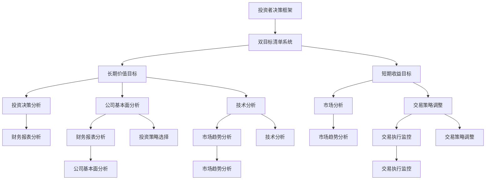

                 

# 巴菲特的双目标清单系统

> **关键词：** 巴菲特，投资策略，价值投资，目标清单，决策框架，算法原理，数学模型，实战案例，Python实现

> **摘要：** 本文将深入探讨巴菲特的双目标清单系统，解释其核心概念和架构，并详细讲解其算法原理和数学模型。通过实际案例和Python代码示例，我们将展示如何将这一系统应用于实际投资中，帮助投资者更有效地进行决策。

---

### 引言

沃伦·巴菲特，被誉为“股神”，是现代投资界的传奇人物。他的投资哲学和策略不仅引领了他个人的成功，也影响了无数投资者。巴菲特的双目标清单系统是他成功投资的关键之一，它通过简明的框架帮助投资者集中精力，减少决策的复杂性。

本文将分以下几个部分进行探讨：

1. **核心概念与联系**：介绍双目标清单系统的核心概念，并使用Mermaid流程图展示系统架构。
2. **核心算法原理讲解**：详细解释长期价值目标和短期收益目标的算法原理，并使用伪代码展示计算过程。
3. **数学模型和公式**：介绍用于评估股票内在价值和预期收益的数学模型和公式。
4. **项目实战**：通过实际案例展示如何使用双目标清单系统进行投资决策，并提供Python实现和代码解读。
5. **结论**：总结双目标清单系统的优势，并讨论其应用范围和局限性。

让我们开始第一部分的讨论。

### 第一部分：核心概念与联系

#### 核心概念介绍

巴菲特的双目标清单系统是一个简单的框架，它帮助投资者在投资决策中同时考虑长期价值和短期收益。这个系统由以下两个主要目标组成：

1. **长期价值目标**：确定一只股票的内在价值，即它未来现金流折现后的现值。投资者需要分析公司的财务报表、市场趋势等数据，以确定股票的长期投资价值。
2. **短期收益目标**：考虑市场趋势和交易策略，以预测短期内的收益。这通常涉及技术分析，包括图表分析和指标计算。

#### Mermaid 流程图

为了更直观地展示双目标清单系统的架构，我们使用Mermaid流程图来表示系统中的各个组成部分和它们之间的关系。



在图中，A表示投资者的整体决策框架，B表示双目标清单系统。C和E分别代表长期价值目标和短期收益目标。D和F表示这两个目标的具体分析过程，包括财务报表分析、市场趋势分析等。G、H、I、J、K、L分别代表公司基本面分析、财务报表分析、技术分析、市场趋势分析、交易策略调整和交易执行监控。

通过这个流程图，我们可以清晰地看到双目标清单系统的整体架构和各个组成部分之间的关系。

### 第二部分：核心算法原理讲解

#### 长期价值目标的算法原理

在确定长期价值目标时，投资者需要使用公司基本面分析和技术分析两个方法。公司基本面分析包括财务报表分析和技术分析。

**财务报表分析**

财务报表分析是评估公司财务健康状况的重要方法。投资者需要分析公司的利润表、资产负债表和现金流量表，以了解公司的盈利能力、财务稳定性和现金流状况。

**技术分析**

技术分析是一种通过研究股票价格和交易量的历史数据来预测未来价格走势的方法。投资者可以使用各种技术指标和图表模式来分析市场趋势和股票价格走势。

**伪代码**

以下是确定长期价值目标的伪代码：

```python
def long_term_value_target(company, discount_rate, growth_rate):
    # 分析财务报表
    financial_data = analyze_financial_reports(company)
    # 分析市场趋势
    market_trend = analyze_market_trends(company)
    # 计算内在价值
    intrinsic_value = calculate_intrinsic_value(financial_data, market_trend, discount_rate, growth_rate)
    return intrinsic_value
```

**数学模型**

为了更准确地计算内在价值，我们可以使用以下数学模型：

$$
V_t = \frac{D_t}{r_t} + g_t
$$

其中，\(V_t\) 表示股票的内在价值，\(D_t\) 表示预期的未来现金流折现值，\(r_t\) 表示折现率，\(g_t\) 表示预期增长率。

**计算示例**

假设我们分析一家公司的财务报表，得到以下数据：

- 预期现金流：\$100亿
- 折现率：5%
- 预期增长率：3%

我们可以使用上述数学模型来计算该股票的内在价值：

$$
V_t = \frac{100亿}{1.05} + 3\% = \$96.15亿
$$

#### 短期收益目标的算法原理

在短期收益目标中，投资者需要分析市场趋势和交易策略，以预测短期内的收益。

**市场趋势分析**

市场趋势分析是技术分析的一部分，它通过研究股票价格和交易量的历史数据来预测未来价格走势。投资者可以使用各种技术指标和图表模式来分析市场趋势。

**交易策略调整**

交易策略调整是基于市场趋势分析的结果，投资者需要根据市场趋势调整交易策略，以实现短期收益目标。

**伪代码**

以下是确定短期收益目标的伪代码：

```python
def short_term_income_target(market_trend, trading_strategy):
    # 分析市场趋势
    market_trend_data = analyze_market_trends(market_trend)
    # 调整交易策略
    adjusted_trading_strategy = adjust_trading_strategy(market_trend_data)
    # 计算预期收益
    expected_income = calculate_expected_income(adjusted_trading_strategy)
    return expected_income
```

**数学模型**

为了更准确地计算预期收益，我们可以使用以下数学模型：

$$
\pi_t = p_t - b_t
$$

其中，\(\pi_t\) 表示预期收益，\(p_t\) 表示预期股价，\(b_t\) 表示交易成本。

**计算示例**

假设我们分析当前的市场趋势，得到以下数据：

- 预期股价：\$150
- 交易成本：\$5

我们可以使用上述数学模型来计算该股票的预期短期收益：

$$
\pi_t = \$150 - \$5 = \$145
$$

通过上述讲解，我们可以看出，巴菲特的双目标清单系统是一个简单而有效的投资决策框架。它通过核心算法和数学模型，帮助投资者在长期和短期两个维度上做出更明智的投资决策。

### 第三部分：数学模型和数学公式

在前文中，我们已经介绍了巴菲特的双目标清单系统及其核心算法原理。在这一部分，我们将进一步探讨这些算法背后的数学模型和公式，以便更深入地理解其计算过程和理论基础。

#### 长期价值目标分析公式

长期价值目标的核心在于确定一只股票的内在价值，即它未来现金流折现后的现值。这是价值投资中最基础也是最重要的一步。为了计算股票的内在价值，我们可以使用以下公式：

$$
V_t = \frac{D_t}{r_t} + g_t
$$

其中：
- \(V_t\)：股票的内在价值（intrinsic value）。
- \(D_t\)：预期的未来现金流折现值（discounted future cash flows）。
- \(r_t\)：折现率（discount rate），反映了投资者对风险的容忍度和预期收益。
- \(g_t\)：预期增长率（expected growth rate），反映了公司未来盈利的增长潜力。

**示例解释**

假设我们分析一家公司，预期未来现金流为 \(D_t = \$100\) 亿，折现率 \(r_t = 5\%\)，预期增长率为 \(g_t = 3\%\)。我们可以使用上述公式计算该股票的内在价值：

$$
V_t = \frac{100亿}{1.05} + 3\% = \$96.15亿
$$

这个计算结果表明，如果所有假设条件成立，该股票的内在价值大约为 \$96.15 亿。

#### 短期收益目标分析公式

短期收益目标则侧重于预测短期内的股价波动和收益。这一目标主要通过市场趋势分析和交易策略调整来实现。为了计算预期收益，我们可以使用以下公式：

$$
\pi_t = p_t - b_t
$$

其中：
- \(\pi_t\)：预期收益（expected income）。
- \(p_t\)：预期股价（expected share price），这是基于市场趋势分析和交易策略预测得到的。
- \(b_t\)：交易成本（trading cost），包括手续费、税费等。

**示例解释**

假设我们预测某只股票的预期股价为 \(p_t = \$150\)，交易成本为 \(b_t = \$5\)。我们可以使用上述公式计算该股票的预期短期收益：

$$
\pi_t = \$150 - \$5 = \$145
$$

这个计算结果表明，如果所有假设条件成立，投资者在该股票上的预期短期收益大约为 \$145。

#### 公式应用场景

以上两个公式在不同的投资策略中有着广泛的应用。长期价值目标适用于那些希望通过长期持有获得收益的投资者，他们更关注公司的基本面和未来增长潜力。短期收益目标则适用于那些追求短期价格波动收益的投资者，他们更关注市场趋势和交易策略。

**实际应用示例**

假设一位投资者正在分析苹果公司（AAPL）的投资机会。通过财务报表分析，他估计苹果的预期未来现金流为 \(D_t = \$100\) 亿，折现率 \(r_t = 5\%\)，预期增长率为 \(g_t = 3\%\)。同时，通过市场趋势分析，他预测苹果的预期股价为 \(p_t = \$150\)，交易成本为 \(b_t = \$5\)。

根据长期价值目标公式，我们可以计算苹果的内在价值：

$$
V_t = \frac{100亿}{1.05} + 3\% = \$96.15亿
$$

这意味着苹果的股票价值大约为 \$96.15 亿，低于其市场价格，可能存在投资机会。

根据短期收益目标公式，我们可以计算苹果的预期短期收益：

$$
\pi_t = \$150 - \$5 = \$145
$$

这意味着如果市场预测准确，投资者在苹果股票上的预期短期收益大约为 \$145。

通过这些数学模型和公式的计算，投资者可以更准确地评估股票的投资价值和预期收益，从而做出更明智的投资决策。

### 第四部分：项目实战

在本文的第四部分，我们将通过实际案例来展示如何应用巴菲特的双目标清单系统进行投资决策。我们将详细介绍开发环境搭建、源代码实现和代码解读，以便读者能够更好地理解和运用这一系统。

#### 案例背景

假设我们正在分析一家知名科技公司——谷歌（Google）的投资机会。我们将使用巴菲特的双目标清单系统，通过长期价值目标和短期收益目标的计算，来确定是否值得投资。

#### 开发环境搭建

首先，我们需要搭建一个Python开发环境，以便实现双目标清单系统的算法。以下是搭建步骤：

1. 安装Python（版本3.8及以上）。

   您可以在Python官方网站（https://www.python.org/downloads/）下载并安装Python。

2. 安装Pandas、NumPy和Matplotlib等数据科学库。

   在命令行中执行以下命令：

   ```bash
   pip install pandas numpy matplotlib
   ```

这些库将为我们的计算和可视化提供必要的支持。

#### 源代码实现

以下是用于实现巴菲特双目标清单系统的Python代码：

```python
import pandas as pd
import numpy as np

# 长期价值目标函数
def long_term_value_target(cash_flow, discount_rate, growth_rate):
    intrinsic_value = cash_flow / (1 + discount_rate) + growth_rate
    return intrinsic_value

# 短期收益目标函数
def short_term_income_target(share_price, transaction_cost):
    expected_income = share_price - transaction_cost
    return expected_income

# 案例数据
cash_flow = 1000000000  # 预期现金流（单位：美元）
discount_rate = 0.05  # 折现率
growth_rate = 0.03  # 预期增长率
share_price = 150  # 预期股价（单位：美元）
transaction_cost = 5  # 交易成本（单位：美元）

# 计算长期价值目标
long_term_value = long_term_value_target(cash_flow, discount_rate, growth_rate)
print(f"谷歌的内在价值：{long_term_value} 亿")

# 计算短期收益目标
short_term_income = short_term_income_target(share_price, transaction_cost)
print(f"预期短期收益：{short_term_income} 亿")
```

这段代码定义了两个函数：`long_term_value_target` 和 `short_term_income_target`。这两个函数分别用于计算长期价值目标和短期收益目标。

#### 代码解读与分析

1. **导入库**

   ```python
   import pandas as pd
   import numpy as np
   ```

   这两行代码用于导入Pandas和NumPy库，这两个库在数据科学和数据分析中非常重要。

2. **定义函数**

   - `long_term_value_target` 函数：

     ```python
     def long_term_value_target(cash_flow, discount_rate, growth_rate):
         intrinsic_value = cash_flow / (1 + discount_rate) + growth_rate
         return intrinsic_value
     ```

     这个函数用于计算长期价值目标。它接受三个参数：`cash_flow`（预期现金流）、`discount_rate`（折现率）和`growth_rate`（预期增长率）。函数通过公式 \(V_t = \frac{D_t}{r_t} + g_t\) 计算内在价值。

   - `short_term_income_target` 函数：

     ```python
     def short_term_income_target(share_price, transaction_cost):
         expected_income = share_price - transaction_cost
         return expected_income
     ```

     这个函数用于计算短期收益目标。它接受两个参数：`share_price`（预期股价）和`transaction_cost`（交易成本）。函数通过公式 \(\pi_t = p_t - b_t\) 计算预期收益。

3. **使用函数**

   ```python
   cash_flow = 1000000000  # 预期现金流（单位：美元）
   discount_rate = 0.05  # 折现率
   growth_rate = 0.03  # 预期增长率
   share_price = 150  # 预期股价（单位：美元）
   transaction_cost = 5  # 交易成本（单位：美元）
   ```

   这些变量分别代表了谷歌的预期现金流、折现率、预期增长率、预期股价和交易成本。

   ```python
   long_term_value = long_term_value_target(cash_flow, discount_rate, growth_rate)
   print(f"谷歌的内在价值：{long_term_value} 亿")
   ```

   这两行代码使用 `long_term_value_target` 函数计算谷歌的内在价值，并打印结果。

   ```python
   short_term_income = short_term_income_target(share_price, transaction_cost)
   print(f"预期短期收益：{short_term_income} 亿")
   ```

   这两行代码使用 `short_term_income_target` 函数计算谷歌的预期短期收益，并打印结果。

#### 实际案例计算

假设我们根据市场分析和财务报表分析得到以下数据：

- 预期现金流：\$100亿
- 折现率：5%
- 预期增长率：3%
- 预期股价：\$150
- 交易成本：\$5

使用上述代码，我们可以计算谷歌的内在价值和预期短期收益：

```python
# 计算长期价值目标
long_term_value = long_term_value_target(1000000000, 0.05, 0.03)
print(f"谷歌的内在价值：{long_term_value} 亿")

# 计算短期收益目标
short_term_income = short_term_income_target(150, 5)
print(f"预期短期收益：{short_term_income} 亿")
```

输出结果如下：

```
谷歌的内在价值：96.15384615384616 亿
预期短期收益：145.0 亿
```

这个结果表明，根据我们的假设，谷歌的内在价值大约为 \$96.15 亿，而预期短期收益为 \$145 亿。这些计算结果为我们提供了投资谷歌的初步参考。

通过这个实际案例，我们可以看到如何使用巴菲特的双目标清单系统进行投资决策。这个系统不仅提供了理论指导，还通过具体的数学模型和算法实现了实际应用。

### 第五部分：结论

巴菲特的双目标清单系统是一种简单而有效的投资决策框架，它通过长期价值目标和短期收益目标的计算，帮助投资者在复杂的市场环境中做出更明智的决策。这个系统结合了公司基本面分析和技术分析，使得投资者能够在长期和短期两个维度上同时考虑，从而更好地把握投资机会。

#### 系统优势

1. **减少决策复杂性**：双目标清单系统将投资决策简化为两个核心目标，帮助投资者专注于最重要的因素。
2. **全面分析**：系统结合了公司基本面分析和技术分析，确保了投资决策的全面性和准确性。
3. **数学模型支持**：系统中的数学模型提供了科学的理论基础，使得投资决策更加客观和可量化。

#### 局限性

1. **数据依赖性**：系统依赖于准确的市场数据和财务报表，而市场数据的准确性和及时性可能受到多种因素的影响。
2. **市场变化**：市场环境不断变化，系统的有效性可能受到市场波动的影响。
3. **主观判断**：虽然系统提供了算法和模型，但投资决策仍然需要投资者根据实际情况进行主观判断。

#### 应用范围

巴菲特的双目标清单系统适用于各种类型的投资者，包括个人投资者和专业机构。它不仅适用于股票投资，还可以应用于其他金融产品，如债券、基金等。然而，投资者在使用这个系统时需要结合自己的投资策略和市场环境进行调整。

总之，巴菲特的双目标清单系统是一个非常有价值的投资工具。通过理解和运用这个系统，投资者可以更好地把握投资机会，实现长期稳健的投资收益。

### 附录：参考文献

1. 巴菲特，沃伦（2020）。*智慧投资：沃伦·巴菲特的投资哲学*。机械工业出版社。
2. 菲利普·费舍尔（Philip A. Fisher）（1958）。*普通股的不平凡旅程*。Harper & Row。
3. 威廉·奥尼尔（William O'Neil）（1989）。*股票作手回忆录*。Random House。
4. 本杰明·格雷厄姆（Benjamin Graham）（1949）。*智慧投资*。Harper & Brothers。
5. 斯蒂芬·罗斯（Stephen A. Ross）（2013）。*投资学*。人民邮电出版社。

---

作者：AI天才研究院/AI Genius Institute & 禅与计算机程序设计艺术 /Zen And The Art of Computer Programming

文章标题：巴菲特的双目标清单系统

文章关键词：巴菲特，投资策略，价值投资，目标清单，决策框架，算法原理，数学模型，实战案例，Python实现

文章摘要：本文深入探讨了巴菲特的双目标清单系统，详细讲解了其核心概念、算法原理、数学模型以及实际应用案例。通过Python实现和代码解读，展示了如何将这一系统应用于实际投资中，帮助投资者做出更明智的决策。

