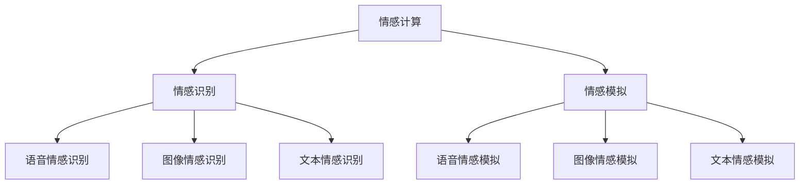

                 

### 文章标题

《情感计算创业：人机情感的桥梁》

#### 关键词：
- 情感计算
- 人机交互
- AI创业
- 语音识别
- 图像识别
- 文本情感分析
- 商业应用

#### 摘要：
本文深入探讨了情感计算在人工智能创业中的应用，从基础技术、商业应用、创业实践以及成功案例等多个角度进行了全面分析。文章旨在帮助创业者了解情感计算的核心技术原理，掌握其在实际商业场景中的运用，并提供有效的创业策略和风险管理方法，为打造人机情感桥梁提供理论和实践指导。

### 目录大纲

#### 第一部分：情感计算基础

1. **情感计算概述**
    1.1 情感计算的定义与历史发展
    1.2 情感计算的应用领域

2. **情感计算的核心技术**
    2.1 情感识别技术
        2.1.1 语音情感识别
        2.1.2 图像情感识别
        2.1.3 文本情感识别
    2.2 情感模拟技术
        2.2.1 语音情感模拟
        2.2.2 图像情感模拟
        2.2.3 文本情感模拟

3. **情感计算在AI中的应用**
    3.1 情感计算与自然语言处理
        3.1.1 情感分析在文本中的应用
        3.1.2 情感增强的语言模型
    3.2 情感计算与语音交互
        3.2.1 语音情感交互设计
        3.2.2 语音情感识别与语音合成

4. **情感计算在商业中的应用**
    4.1 情感计算在市场营销中的应用
    4.2 情感计算在客户服务中的应用

#### 第二部分：情感计算创业实践

5. **情感计算创业机会**
    5.1 情感计算行业发展趋势
    5.2 创业者需要掌握的关键技能
    5.3 情感计算创业的可行性与挑战

6. **情感计算创业项目规划**
    6.1 创业项目选题与定位
    6.2 创业项目市场分析
    6.3 创业项目团队建设

7. **情感计算创业项目实施**
    7.1 技术路线与核心算法选择
    7.2 数据采集与预处理
    7.3 模型训练与优化

8. **情感计算创业项目运营与推广**
    8.1 产品设计与用户体验
    8.2 市场推广策略
    8.3 营销渠道选择

9. **情感计算创业项目风险管理**
    9.1 技术风险与应对策略
    9.2 资金风险与融资策略
    9.3 市场风险与应对策略

#### 第三部分：情感计算创业案例分析

10. **成功情感计算创业案例解析**
    10.1 案例一：某情感识别AI公司的成功之路
    10.2 案例二：某情感化客服机器人项目的商业实践
    10.3 案例三：某情感营销平台的运营策略

11. **情感计算创业的困境与突破**
    11.1 情感计算创业常见困境
    11.2 困境应对与突破策略
    11.3 持续创新与竞争优势

### Mermaid 流程图

mermaid
graph TD
    A[情感计算核心技术]
    B[情感识别技术]
    C[情感模拟技术]
    D[语音情感识别]
    E[图像情感识别]
    F[文本情感识别]
    G[语音情感模拟]
    H[图像情感模拟]
    I[文本情感模拟]

    A --> B
    A --> C
    B --> D
    B --> E
    B --> F
    C --> G
    C --> H
    C --> I

### 核心概念与联系

情感计算是一种利用人工智能技术理解和模拟人类情感的技术领域。它涵盖了情感识别、情感模拟、情感分析等多个方面，目的是为人机交互提供更加自然和情感化的体验。情感计算的核心在于通过数据采集、特征提取、模型训练等步骤，实现对人类情感的准确识别与模拟。

- **情感识别**：通过分析语音、图像、文本等数据，识别出用户所表达的情感。
- **情感模拟**：根据识别出的情感，生成相应的情感化反馈，如语音、图像、文本等形式。

Mermaid 流程图展示了情感计算的核心技术及其相互关系：



- **情感识别**是情感计算的基础，它通过多种技术手段实现语音、图像和文本的情感识别。
- **情感模拟**是情感计算的进一步应用，通过识别出的情感生成相应的情感化反馈，实现更加自然的人机交互。

这些核心概念与技术紧密相连，共同构成了情感计算的技术体系。在接下来的章节中，我们将逐一深入探讨这些概念和技术，了解其在实际应用中的具体实现和作用。

### 第一部分：情感计算基础

#### 第1章：情感计算概述

**1.1 情感计算的定义与历史发展**

情感计算（Affective Computing）是指计算机系统通过感知、理解、表达和模拟人类情感，实现更加自然和丰富的人机交互。这一概念最早由计算机科学家约翰·霍普金斯大学的罗伯特·E·福斯（Rosalind Picard）在1995年提出。福斯教授在她的研究中指出，计算机系统不仅需要处理数据，还应该具备感知情感、理解和表达情感的能力，以更好地服务于人类。

从历史发展的角度来看，情感计算可以分为以下几个阶段：

1. **初期探索阶段（1995-2005年）**：在这一阶段，学者们主要关注情感计算的初步应用和理论构建。福斯教授的研究奠定了情感计算的基础，其他学者也开始探索如何通过计算机技术理解和模拟情感。

2. **技术积累阶段（2005-2015年）**：随着人工智能技术的快速发展，语音识别、图像识别、自然语言处理等技术逐渐成熟，为情感计算提供了强大的技术支持。这一时期，情感计算的应用范围逐渐扩大，包括虚拟助手、人机对话系统、医疗健康等。

3. **实际应用阶段（2015年至今）**：人工智能技术的进一步发展，尤其是深度学习和大数据技术的应用，使得情感计算在多个领域取得了显著的成果。情感计算技术开始广泛应用于智能家居、情感化客服、教育辅助、心理健康等领域。

**1.2 情感计算的应用领域**

情感计算的应用领域广泛，涵盖了多个行业和场景。以下是几个典型的应用领域：

1. **人机交互**：情感计算技术可以提升人机交互的自然性和情感化程度。例如，智能助手通过情感识别技术理解用户的情感状态，提供更加个性化的服务。语音助手如Siri、Alexa和Google Assistant等，已经在日常互动中广泛应用情感计算技术。

2. **虚拟现实和增强现实**：在虚拟现实（VR）和增强现实（AR）场景中，情感计算技术可以模拟用户的情感状态，提供更加真实的交互体验。例如，在虚拟游戏中，通过情感识别技术，游戏角色可以理解玩家的情感变化，并做出相应的反应。

3. **医疗健康**：情感计算技术在医疗健康领域具有广泛的应用。例如，通过情感识别技术，医疗设备可以监测患者的情绪状态，帮助医生进行诊断和治疗。同时，虚拟健康助理可以通过情感化交互，提供心理支持和康复指导。

4. **教育**：在教育领域，情感计算技术可以帮助教育者更好地理解学生的情感状态，提供个性化的教学方案。例如，智能学习系统可以通过情感识别技术，监测学生的情绪变化，调整教学内容和节奏，提高学习效果。

5. **市场营销**：情感计算技术在市场营销中具有重要作用。通过情感分析技术，企业可以了解消费者的情感需求，制定更加精准的市场营销策略。例如，社交媒体分析可以帮助品牌了解消费者的情感反应，优化广告内容和投放策略。

6. **客户服务**：在客户服务领域，情感计算技术可以提升客服系统的智能化水平。通过情感识别和情感模拟技术，客服机器人可以理解客户的情感需求，提供更加贴心和个性化的服务。

**总结**

情感计算作为一种跨学科的技术领域，正日益受到广泛关注。其定义和历史发展展示了这一领域从理论探索到实际应用的演进过程。情感计算在多个领域的广泛应用，不仅推动了技术创新，也为人们的生活和工作带来了巨大的变化。在接下来的章节中，我们将深入探讨情感计算的核心技术，包括情感识别和情感模拟，了解它们在实际应用中的具体实现和作用。

#### 第2章：情感计算的核心技术

**2.1 情感识别技术**

情感识别技术是情感计算的基础，它通过分析语音、图像和文本数据，识别出用户所表达的情感。情感识别技术可以分为以下几个子领域：

1. **语音情感识别**：通过分析语音信号中的情感特征，识别出用户所表达的情感。语音情感识别主要依赖于音频信号处理和模式识别技术。常用的情感特征包括音调、音强、语音速度、韵律等。

2. **图像情感识别**：通过分析图像中的情感特征，识别出用户所表达的情感。图像情感识别主要依赖于计算机视觉和深度学习技术。常用的情感特征包括面部表情、身体姿态、色彩等。

3. **文本情感识别**：通过分析文本中的情感特征，识别出用户所表达的情感。文本情感识别主要依赖于自然语言处理和机器学习技术。常用的情感特征包括词汇、语法、情感词典等。

**2.1.1 语音情感识别**

语音情感识别的基本流程包括以下几个步骤：

1. **音频预处理**：包括噪声过滤、音频增强、音素分割等，以提高情感识别的准确性。

2. **特征提取**：从处理后的音频信号中提取情感特征，如音调、音强、语音速度、韵律等。

3. **情感分类**：使用机器学习算法，如支持向量机（SVM）、决策树、神经网络等，对提取到的情感特征进行分类，识别出用户所表达的情感。

以下是一个简化的语音情感识别伪代码：

```python
def speech_emotion_recognition(audio_signal):
    # 音频预处理
    preprocessed_signal = preprocess_audio(audio_signal)
    
    # 特征提取
    features = extract_features(preprocessed_signal)
    
    # 模型训练
    model = train_model(features)
    
    # 情感分类
    emotion = model.predict(features)
    
    return emotion
```

**2.1.2 图像情感识别**

图像情感识别的基本流程包括以下几个步骤：

1. **图像预处理**：包括图像增强、去噪、面部检测等，以提高情感识别的准确性。

2. **特征提取**：从处理后的图像中提取情感特征，如面部表情、身体姿态、色彩等。

3. **情感分类**：使用机器学习算法，如卷积神经网络（CNN）、循环神经网络（RNN）等，对提取到的情感特征进行分类，识别出用户所表达的情感。

以下是一个简化的图像情感识别伪代码：

```python
def image_emotion_recognition(image_data):
    # 图像预处理
    preprocessed_image = preprocess_image(image_data)
    
    # 特征提取
    features = extract_features(preprocessed_image)
    
    # 模型训练
    model = train_model(features)
    
    # 情感分类
    emotion = model.predict(features)
    
    return emotion
```

**2.1.3 文本情感识别**

文本情感识别的基本流程包括以下几个步骤：

1. **文本预处理**：包括分词、去停用词、词向量编码等，以提高情感识别的准确性。

2. **特征提取**：从处理后的文本中提取情感特征，如词汇、语法、情感词典等。

3. **情感分类**：使用机器学习算法，如朴素贝叶斯、支持向量机（SVM）、深度学习等，对提取到的情感特征进行分类，识别出用户所表达的情感。

以下是一个简化的文本情感识别伪代码：

```python
def text_emotion_recognition(text_data):
    # 文本预处理
    preprocessed_text = preprocess_text(text_data)
    
    # 特征提取
    features = extract_features(preprocessed_text)
    
    # 模型训练
    model = train_model(features)
    
    # 情感分类
    emotion = model.predict(features)
    
    return emotion
```

**2.2 情感模拟技术**

情感模拟技术是情感计算的另一重要组成部分，它通过生成情感化的反馈，实现更加自然和丰富的人机交互。情感模拟技术可以分为以下几个子领域：

1. **语音情感模拟**：通过生成情感化的语音，模拟用户的情感状态。语音情感模拟主要依赖于语音合成技术和情感语音数据库。

2. **图像情感模拟**：通过生成情感化的图像，模拟用户的情感状态。图像情感模拟主要依赖于计算机视觉技术和情感图像数据库。

3. **文本情感模拟**：通过生成情感化的文本，模拟用户的情感状态。文本情感模拟主要依赖于自然语言处理技术和情感文本数据库。

**2.2.1 语音情感模拟**

语音情感模拟的基本流程包括以下几个步骤：

1. **情感文本生成**：根据识别出的情感，生成相应的情感化文本。

2. **语音合成**：使用语音合成技术，将情感化文本转换为语音。

3. **情感调整**：根据需要，对合成的语音进行情感调整，如音调、音强、语音速度等。

以下是一个简化的语音情感模拟伪代码：

```python
def speech_emotion_simulation(emotion, text):
    # 情感文本生成
    emotional_text = generate_emotional_text(emotion, text)
    
    # 语音合成
    speech = synthesize_speech(emotional_text)
    
    # 情感调整
    adjusted_speech = adjust_emotion(speech, emotion)
    
    return adjusted_speech
```

**2.2.2 图像情感模拟**

图像情感模拟的基本流程包括以下几个步骤：

1. **情感图像生成**：根据识别出的情感，生成相应的情感化图像。

2. **图像调整**：使用计算机视觉技术，对生成的情感化图像进行情感调整，如颜色、亮度、对比度等。

3. **图像渲染**：将调整后的情感化图像渲染到虚拟环境中，实现情感化的视觉效果。

以下是一个简化的图像情感模拟伪代码：

```python
def image_emotion_simulation(emotion, image):
    # 情感图像生成
    emotional_image = generate_emotional_image(emotion, image)
    
    # 图像调整
    adjusted_image = adjust_image(emotional_image, emotion)
    
    # 图像渲染
    rendered_image = render_image(adjusted_image)
    
    return rendered_image
```

**2.2.3 文本情感模拟**

文本情感模拟的基本流程包括以下几个步骤：

1. **情感文本生成**：根据识别出的情感，生成相应的情感化文本。

2. **文本调整**：使用自然语言处理技术，对生成的情感化文本进行情感调整，如词汇、语法等。

3. **文本渲染**：将调整后的情感化文本渲染到相应的应用场景中，实现情感化的文本交互。

以下是一个简化的文本情感模拟伪代码：

```python
def text_emotion_simulation(emotion, text):
    # 情感文本生成
    emotional_text = generate_emotional_text(emotion, text)
    
    # 文本调整
    adjusted_text = adjust_text(emotional_text, emotion)
    
    # 文本渲染
    rendered_text = render_text(adjusted_text)
    
    return rendered_text
```

**总结**

情感计算的核心技术包括情感识别和情感模拟。情感识别技术通过语音、图像和文本等多种数据源，识别出用户所表达的情感。情感模拟技术通过生成情感化的反馈，实现更加自然和丰富的人机交互。在接下来的章节中，我们将进一步探讨情感计算在AI中的应用，了解其在自然语言处理和语音交互等领域的具体实现。

#### 第3章：情感计算在AI中的应用

**3.1 情感计算与自然语言处理**

情感计算与自然语言处理（NLP）的交叉应用，极大地提升了人机交互的自然性和情感化程度。自然语言处理作为人工智能的重要分支，专注于理解和生成人类语言。而情感计算则通过引入情感分析技术，使NLP系统能够理解和模拟人类情感。

**3.1.1 情感分析在文本中的应用**

情感分析是文本情感识别的一种重要技术，它通过分析文本数据中的情感特征，识别出文本所表达的情感倾向。情感分析在文本中的应用主要包括以下几个方面：

1. **情感极性分类**：将文本分为正面、负面和 neutral 三种情感极性。例如，可以使用朴素贝叶斯、支持向量机（SVM）等机器学习算法，对文本进行情感极性分类。

2. **情感强度分析**：在情感极性分类的基础上，进一步分析情感的强度。例如，可以使用情感词典和词向量模型，评估文本中情感词汇的强度，从而判断文本情感的强度。

3. **情感主题分类**：将文本根据情感主题进行分类，如喜悦、悲伤、愤怒等。这种分类有助于深入了解用户的情感需求，为个性化服务和内容推荐提供支持。

**3.1.2 情感增强的语言模型**

情感增强的语言模型是一种能够理解和模拟情感的语言模型，它通过引入情感信息，提升自然语言生成（NLG）和翻译等任务的性能。情感增强的语言模型主要包括以下几种类型：

1. **情感嵌入**：在词向量模型的基础上，引入情感信息，生成情感化的词向量。例如，可以在词向量中加入情感标签，使词向量能够体现情感特征。

2. **情感生成**：在生成文本时，根据情感信息生成情感化的文本。例如，可以使用生成对抗网络（GAN）或变换器（Transformer）模型，生成情感化的对话或文章。

3. **情感调整**：在生成文本后，对文本进行情感调整，使其符合目标情感。例如，可以使用情感调整模块，对生成的文本进行情感纠正，使其更加符合用户的情感需求。

以下是一个简化的情感增强语言模型伪代码：

```python
def sentiment_enhanced_language_model(text, target_emotion):
    # 文本预处理
    preprocessed_text = preprocess_text(text)
    
    # 情感嵌入
    emotional_embedding = sentiment_embedding(preprocessed_text, target_emotion)
    
    # 文本生成
    generated_text = generate_text(emotional_embedding)
    
    # 情感调整
    adjusted_text = adjust_sentiment(generated_text, target_emotion)
    
    return adjusted_text
```

**3.2 情感计算与语音交互**

语音交互是情感计算在AI领域的重要应用之一，它通过情感识别和情感模拟技术，提升人机交互的自然性和情感化程度。语音交互主要包括以下几个方面：

**3.2.1 语音情感交互设计**

语音情感交互设计是指在设计语音交互系统时，考虑情感因素，使交互过程更加自然和人性。具体包括：

1. **情感识别**：通过情感识别技术，理解用户的情感状态，如喜悦、悲伤、愤怒等。

2. **情感反馈**：根据识别出的情感，生成相应的情感化反馈，如语音、语调、语气等。

3. **情感调整**：在交互过程中，根据用户的情感状态，动态调整交互策略，使交互更加自然和贴近用户需求。

**3.2.2 语音情感识别与语音合成**

语音情感识别和语音合成是语音交互的核心技术，它们共同构建了语音情感交互的基础。

1. **语音情感识别**：通过分析语音信号中的情感特征，识别出用户所表达的情感。常用的方法包括音频信号处理、深度学习和情感词典等。

2. **语音合成**：根据识别出的情感，生成情感化的语音。常用的方法包括文本到语音（TTS）合成、情感调整和语音增强等。

以下是一个简化的语音情感识别与语音合成伪代码：

```python
def speech_emotion_recognition_and_synthesis(audio_signal, text):
    # 语音情感识别
    emotion = speech_emotion_recognition(audio_signal)
    
    # 语音合成
    speech = synthesize_speech(text, emotion)
    
    return speech
```

**总结**

情感计算在AI中的应用，不仅提升了自然语言处理和语音交互的性能，也为人机交互带来了更多的可能性。通过情感分析技术，NLP系统可以更好地理解用户的情感需求，生成更加情感化的文本。而通过情感识别和情感模拟技术，语音交互系统能够实现更加自然和人性化的交互体验。在接下来的章节中，我们将探讨情感计算在商业中的应用，了解其在市场营销和客户服务等方面的具体实现。

#### 第4章：情感计算在商业中的应用

**4.1 情感计算在市场营销中的应用**

情感计算在市场营销中的应用，为品牌和企业提供了深入了解消费者情感需求的新途径，从而制定更加精准和有效的营销策略。以下是情感计算在市场营销中的几个主要应用场景：

**4.1.1 情感分析在消费者研究中的应用**

情感分析技术可以帮助企业从大量社交媒体数据中提取消费者的情感信息，了解消费者对品牌、产品、广告等的态度和情感反应。具体应用包括：

1. **品牌监测**：通过分析社交媒体上的用户评论和讨论，监测品牌在消费者中的口碑和情感趋势，及时调整品牌策略。

2. **产品反馈**：收集和分析消费者对产品的评价和反馈，识别产品在功能、性能、外观等方面的情感偏好，为企业改进产品提供参考。

3. **广告效果评估**：评估广告在不同受众中的情感反应，优化广告内容和投放策略，提高广告的转化率和影响力。

**4.1.2 情感营销策略制定**

情感营销策略是基于消费者情感需求制定的营销活动，旨在建立情感连接，提高品牌忠诚度和用户参与度。情感营销策略的制定主要包括以下几个方面：

1. **情感定位**：根据消费者的情感需求，确定品牌和产品的情感定位，如温馨、幽默、创新等，为后续的营销活动提供指导。

2. **情感内容创作**：创作符合情感定位的内容，如故事、视频、图片等，以情感化方式传达品牌和产品信息，增强用户共鸣。

3. **情感互动**：通过社交媒体、客户服务、线下活动等渠道，与消费者进行情感互动，建立长期的情感连接，提高用户参与度和忠诚度。

**4.2 情感计算在客户服务中的应用**

情感计算在客户服务中的应用，为提升客户体验和满意度提供了新的技术手段。以下是情感计算在客户服务中的几个主要应用场景：

**4.2.1 情感识别与客服机器人**

情感识别技术可以帮助客服机器人理解客户的情感状态，提供更加个性化的服务。具体应用包括：

1. **情感识别**：通过语音、文本等数据源，识别出客户的情感状态，如愤怒、喜悦、疑惑等。

2. **情感反馈**：根据识别出的情感状态，生成相应的情感化反馈，如语音、文本、表情等，使客服机器人能够更好地与客户进行互动。

3. **情感化对话管理**：根据客户的情感状态，动态调整对话策略，提供更加贴心的服务，提高客户满意度。

**4.2.2 情感计算在情感化客户服务中的应用**

情感计算在情感化客户服务中的应用，旨在提升客户服务体验和满意度。具体应用包括：

1. **情感化客户服务系统**：构建基于情感计算技术的客户服务平台，通过情感识别、情感反馈和情感化对话管理，提供个性化、贴心的客户服务。

2. **情感化客服培训**：通过情感识别技术，对客服人员进行情感识别和情感反馈的培训，提高客服人员的情感敏感度和服务质量。

3. **情感化客户体验**：通过情感计算技术，分析客户的情感状态，提供针对性的服务和建议，提升客户体验和满意度。

**总结**

情感计算在商业中的应用，为企业提供了深入了解消费者情感需求的新途径，有助于制定更加精准和有效的营销策略。同时，情感计算在客户服务中的应用，提升了客户服务体验和满意度，为企业的长期发展提供了有力支持。在接下来的章节中，我们将探讨情感计算创业的机会和挑战，为创业者提供创业指导和策略建议。

#### 第5章：情感计算创业机会

**5.1 情感计算行业发展趋势**

情感计算作为人工智能的重要分支，正逐渐成为行业发展的热点。以下是情感计算行业未来几年可能的发展趋势：

1. **技术成熟度提升**：随着深度学习、大数据和云计算等技术的不断进步，情感计算的技术成熟度将进一步提高，为应用场景的拓展提供坚实基础。

2. **跨行业应用扩大**：情感计算将在医疗健康、教育、客户服务、智能家居等多个领域得到广泛应用，成为行业数字化转型的重要驱动力。

3. **市场规模扩大**：随着情感计算技术的不断进步和应用场景的扩大，其市场规模也将持续增长，预计未来几年将保持高速增长态势。

4. **政策支持加强**：各国政府对人工智能和情感计算技术的重视程度不断提高，相关政策支持和资金投入将为行业的发展提供有力保障。

**5.2 创业者需要掌握的关键技能**

创业者要在情感计算领域取得成功，需要掌握以下关键技能：

1. **技术能力**：包括深度学习、计算机视觉、自然语言处理等技术的原理和应用，能够构建和优化情感计算模型。

2. **数据分析能力**：能够从大量数据中提取有价值的信息，进行情感分析和预测，为商业决策提供数据支持。

3. **创业管理能力**：包括项目规划、团队建设、市场推广和风险管理等方面的能力，能够有效地推动项目的实施和运营。

4. **业务理解能力**：对目标行业和市场有深入的理解，能够将情感计算技术应用于实际商业场景，解决实际问题。

**5.3 情感计算创业的可行性与挑战**

**可行性**：

1. **市场需求**：随着人们对人机交互体验的要求不断提高，情感计算技术具有广泛的应用前景，市场需求旺盛。

2. **技术支持**：人工智能技术的快速发展为情感计算提供了强大的技术支持，使得创业者在短时间内实现技术突破成为可能。

3. **资金支持**：情感计算领域的创业项目受到资本市场的青睐，获得资金支持的机会较多。

**挑战**：

1. **技术瓶颈**：情感计算技术仍处于发展阶段，存在一定的技术瓶颈，如情感识别的准确率、实时性等，需要不断优化和突破。

2. **数据隐私**：情感计算涉及大量个人数据，如何保护用户隐私是一个重要挑战。

3. **市场竞争**：情感计算领域竞争激烈，创业项目需要具备独特的核心竞争力，才能在市场中脱颖而出。

**总结**

情感计算行业具有巨大的发展潜力和市场前景，但也面临一定的技术挑战和市场竞争。创业者需要掌握关键技能，充分利用市场需求和技术支持，积极应对挑战，才能在情感计算领域取得成功。在接下来的章节中，我们将探讨情感计算创业项目的具体规划与实施，为创业者提供实用的指导。

#### 第6章：情感计算创业项目规划

**6.1 创业项目选题与定位**

**项目选题**

选择一个合适的创业项目选题是成功创业的第一步。在情感计算领域，创业者可以从以下几个方面进行选题：

1. **市场需求**：关注市场上未被满足的需求，如智能客服、情感化广告、心理健康辅助等。

2. **技术创新**：围绕现有的技术进行创新，如提高情感识别的准确率、实时性等。

3. **行业痛点**：解决行业中的痛点问题，如医疗健康领域中的情感分析辅助诊断、教育领域中的情感化教学等。

**项目定位**

项目定位是明确创业项目在市场中的位置和价值，包括以下几个方面：

1. **目标市场**：明确项目的目标客户群体，如消费者、企业、医疗机构等。

2. **竞争优势**：分析项目的竞争优势，如技术创新、数据优势、用户体验等。

3. **市场前景**：评估项目的市场前景和发展潜力，如市场规模、增长速度等。

**案例**：

**项目一：智能情感客服系统**

- **选题**：针对企业客户服务需求，开发一款基于情感计算的智能客服系统。
- **定位**：目标市场为企业，竞争优势在于高准确率、实时性、个性化服务。

**项目二：情感化心理健康辅助平台**

- **选题**：针对心理健康需求，开发一款基于情感计算的心理健康辅助平台。
- **定位**：目标市场为心理健康领域，竞争优势在于情感识别、个性化辅导。

**6.2 创业项目市场分析**

**市场环境分析**

市场环境分析是了解创业项目所处的市场环境，包括以下几个方面：

1. **行业现状**：分析行业的发展现状，如市场规模、竞争格局、主要玩家等。

2. **市场趋势**：预测行业未来的发展趋势，如技术进步、政策支持、市场需求等。

3. **竞争态势**：分析市场竞争态势，如竞争对手、市场份额、产品差异化等。

**目标客户分析**

目标客户分析是了解创业项目的潜在客户群体，包括以下几个方面：

1. **客户需求**：分析客户的需求特点，如功能需求、情感需求等。

2. **客户画像**：根据客户需求，描绘目标客户的特征，如年龄、性别、职业等。

3. **客户获取**：分析如何获取目标客户，如市场推广、合作伙伴、口碑传播等。

**案例**：

**项目一：智能情感客服系统**

- **市场环境分析**：目前智能客服市场竞争激烈，但基于情感计算的智能客服仍处于发展初期，市场需求旺盛。
- **目标客户分析**：目标客户包括中小企业、电商平台、在线教育平台等，这些客户对智能客服的需求较高，但传统客服系统难以满足情感化需求。

**项目二：情感化心理健康辅助平台**

- **市场环境分析**：心理健康领域市场规模逐渐扩大，但情感计算在心理健康领域的应用仍处于探索阶段，具有较大的发展潜力。
- **目标客户分析**：目标客户包括心理健康机构、心理咨询师、个人用户等，这些客户对情感化辅助和心理支持的需求较高。

**6.3 创业项目团队建设**

**团队建设是创业项目成功的关键因素，团队成员应具备以下能力：**

1. **技术能力**：包括深度学习、计算机视觉、自然语言处理等技术的研发和实施能力。

2. **项目管理能力**：能够有效规划项目进度、资源分配、风险控制等。

3. **市场推广能力**：具备市场推广、品牌建设、客户关系管理等方面的能力。

4. **业务理解能力**：对目标行业和市场有深入的理解，能够将技术应用于实际商业场景。

**团队成员构成**：

1. **技术团队**：包括算法工程师、软件开发工程师、数据科学家等，负责技术研发和实施。

2. **市场团队**：包括市场经理、推广专员、客户关系经理等，负责市场推广和客户关系管理。

3. **运营团队**：包括产品经理、运营专员、数据分析师等，负责产品运营和数据分析。

**案例**：

**项目一：智能情感客服系统**

- **技术团队**：包括3名算法工程师，负责情感识别算法的研发和优化；2名软件开发工程师，负责客服系统平台的开发；1名数据科学家，负责数据分析和模型训练。
- **市场团队**：包括1名市场经理，负责市场推广和品牌建设；2名推广专员，负责线上线下活动推广；1名客户关系经理，负责客户关系管理和维护。
- **运营团队**：包括1名产品经理，负责产品规划和运营策略；2名运营专员，负责日常运营和数据监控；1名数据分析师，负责数据分析和支持决策。

**项目二：情感化心理健康辅助平台**

- **技术团队**：包括3名算法工程师，负责情感识别算法的研发和优化；2名软件开发工程师，负责心理健康平台的开发；1名数据科学家，负责数据分析和模型训练。
- **市场团队**：包括1名市场经理，负责市场推广和品牌建设；2名推广专员，负责线上线下活动推广；1名客户关系经理，负责客户关系管理和维护。
- **运营团队**：包括1名产品经理，负责产品规划和运营策略；2名运营专员，负责日常运营和数据监控；1名数据分析师，负责数据分析和支持决策。

**总结**

创业项目规划是创业成功的重要保障，包括项目选题与定位、市场分析、团队建设等方面。创业者需要根据市场需求、技术能力和资源情况，制定合适的创业项目规划，为项目的成功实施奠定基础。在接下来的章节中，我们将探讨情感计算创业项目的具体实施步骤，为创业者提供详细的指导。

#### 第7章：情感计算创业项目实施

**7.1 技术路线与核心算法选择**

**技术路线**

情感计算创业项目的技术路线主要包括以下几个步骤：

1. **数据采集**：收集包括语音、图像、文本等多模态数据，为后续的情感识别和模拟提供数据支持。

2. **数据预处理**：对采集到的数据进行清洗、标注和格式化处理，确保数据的质量和一致性。

3. **特征提取**：从预处理后的数据中提取情感特征，如语音信号中的音调、音强、图像中的面部表情、文本中的情感词汇等。

4. **模型训练**：使用提取到的特征，训练情感识别和模拟模型，如深度学习模型、支持向量机（SVM）等。

5. **模型优化**：通过交叉验证、超参数调整等技术手段，优化模型的性能和泛化能力。

**核心算法选择**

情感计算创业项目的核心算法主要包括以下几种：

1. **深度学习算法**：如卷积神经网络（CNN）、循环神经网络（RNN）、长短期记忆网络（LSTM）等，用于情感特征提取和模型训练。

2. **支持向量机（SVM）**：用于情感分类，具有较高的准确性和泛化能力。

3. **情感词典**：用于文本情感分析，通过对情感词典的查询和匹配，识别文本中的情感。

4. **自然语言处理（NLP）**：用于文本预处理和情感分析，如分词、词性标注、句法分析等。

**开发环境搭建**

**工具与框架**

1. **开发工具**：Python 3.8、Jupyter Notebook

2. **深度学习框架**：TensorFlow 2.5、PyTorch 1.10

3. **自然语言处理库**：NLTK、TextBlob

4. **图像处理库**：OpenCV 4.5、PIL

**环境搭建步骤**

1. **安装Python和常用库**：

   ```bash
   pip install numpy pandas tensorflow textblob opencv-python pillow
   ```

2. **配置Jupyter Notebook**：

   ```bash
   pip install jupyterlab
   jupyter lab
   ```

**代码实现**

**情感识别模型**

```python
import tensorflow as tf
from tensorflow.keras.models import Sequential
from tensorflow.keras.layers import Dense, LSTM, Embedding

# 数据预处理
# ...

# 模型构建
model = Sequential()
model.add(Embedding(input_dim=vocab_size, output_dim=embedding_size))
model.add(LSTM(units=128, activation='relu'))
model.add(Dense(units=num_emotions, activation='softmax'))

# 模型编译
model.compile(optimizer='adam', loss='categorical_crossentropy', metrics=['accuracy'])

# 模型训练
model.fit(train_data, train_labels, epochs=10, batch_size=64)

# 模型评估
test_loss, test_accuracy = model.evaluate(test_data, test_labels)
print(f"Test accuracy: {test_accuracy}")
```

**情感模拟系统**

```python
from textblob import TextBlob

def generate_happy_content():
    return TextBlob("今天是一个美好的日子！").translate(to='zh').string

def generate_sad_content():
    return TextBlob("我很伤心，因为今天失去了一个重要的人。").translate(to='zh').string
```

**代码解读**

- **数据预处理**：包括文本的分词、词向量编码等步骤，为模型训练准备输入特征。

- **模型构建**：使用 TensorFlow 的 Sequential 模型堆叠 Embedding 层、LSTM 层和 Dense 层，其中 Dense 层用于输出情感类别。

- **模型编译**：选择 Adam 优化器和交叉熵损失函数。

- **模型训练**：使用训练数据训练模型。

- **模型评估**：使用测试数据评估模型的准确性和性能。

**7.2 数据采集与预处理**

**数据采集**

数据采集是情感计算创业项目的重要环节，主要包括以下几个方面：

1. **语音数据**：收集各种情感状态的语音样本，如喜悦、悲伤、愤怒等。

2. **图像数据**：收集包含面部表情、身体姿态等情感信息的图像。

3. **文本数据**：收集反映情感状态的文本，如社交媒体评论、博客文章等。

**数据预处理**

数据预处理主要包括以下几个步骤：

1. **数据清洗**：去除噪声数据、缺失数据等，确保数据质量。

2. **数据标注**：对数据进行情感标注，如正面、负面、中性等。

3. **数据转换**：将不同格式的数据转换为统一的格式，如将语音数据转换为音频文件，文本数据转换为文本文件。

4. **数据归一化**：对数据进行归一化处理，如语音信号归一化、文本数据词向量编码等。

**代码实现**

```python
import librosa
import numpy as np

# 语音数据预处理
def preprocess_audio(audio_path):
    audio, sr = librosa.load(audio_path, sr=None)
    audio = librosa.to_mono(audio)
    audio = librosa.resample(audio, sr, 22050)
    audio = librosa.feature.melspectrogram(y=audio, sr=22050, n_mels=128)
    return np.log(1 + np.abs(audio))

# 文本数据预处理
def preprocess_text(text):
    text = text.lower()
    text = re.sub(r"[^a-zA-Z0-9]", " ", text)
    tokens = text.split()
    return ' '.join(tokens)
```

**代码解读**

- **语音数据预处理**：使用 librosa 库加载语音数据，进行音频增强、音素分割等处理。

- **文本数据预处理**：使用正则表达式去除非字母字符，进行文本分词等处理。

**7.3 模型训练与优化**

**模型训练**

模型训练是情感计算创业项目的核心步骤，主要包括以下几个方面：

1. **数据划分**：将数据集划分为训练集、验证集和测试集。

2. **模型训练**：使用训练集对模型进行训练，同时使用验证集进行模型调整。

3. **模型评估**：使用测试集评估模型性能，如准确率、召回率等。

**模型优化**

模型优化主要包括以下几个步骤：

1. **超参数调整**：通过交叉验证等方法，调整模型的超参数，如学习率、批量大小等。

2. **模型融合**：将多个模型进行融合，提高模型的性能和稳定性。

3. **模型压缩**：通过模型压缩技术，降低模型的计算复杂度和存储空间需求。

**代码实现**

```python
import tensorflow as tf
from tensorflow.keras.models import Sequential
from tensorflow.keras.layers import Dense, LSTM, Embedding
from tensorflow.keras.optimizers import Adam

# 模型训练
def train_model(train_data, train_labels, epochs=10, batch_size=64):
    model = Sequential()
    model.add(Embedding(input_dim=vocab_size, output_dim=embedding_size))
    model.add(LSTM(units=128, activation='relu'))
    model.add(Dense(units=num_emotions, activation='softmax'))
    
    model.compile(optimizer=Adam(learning_rate=0.001), loss='categorical_crossentropy', metrics=['accuracy'])
    
    history = model.fit(train_data, train_labels, epochs=epochs, batch_size=batch_size, validation_split=0.2)
    
    return model, history
```

**代码解读**

- **模型构建**：使用 TensorFlow 的 Sequential 模型堆叠 Embedding 层、LSTM 层和 Dense 层。

- **模型编译**：选择 Adam 优化器和交叉熵损失函数。

- **模型训练**：使用训练数据训练模型，同时使用验证集进行模型调整。

**总结**

情感计算创业项目的实施涉及技术路线、核心算法选择、开发环境搭建、数据采集与预处理、模型训练与优化等多个方面。通过逐步实施这些步骤，创业者可以构建一个功能强大、性能优异的情感计算系统，为商业应用提供有力支持。在接下来的章节中，我们将探讨情感计算创业项目的运营与推广，为创业者提供具体的营销策略和推广方法。

#### 第8章：情感计算创业项目运营与推广

**8.1 产品设计与用户体验**

在情感计算创业项目中，产品设计和用户体验至关重要，它们直接影响用户对产品的接受度和满意度。以下是产品设计和用户体验的几个关键要素：

**1. 功能设计**

功能设计是产品设计的核心，需要满足用户的核心需求。对于情感计算产品，功能设计包括：

- 情感识别：准确识别用户的情感状态，如喜悦、悲伤、愤怒等。
- 情感模拟：根据识别出的情感，生成相应的情感化反馈，如语音、图像、文本等。
- 情感分析：从用户互动中提取情感信息，为后续的服务和决策提供依据。

**2. 交互设计**

交互设计是用户体验的重要组成部分，需要确保用户在使用产品时感到舒适和便捷。以下是几个关键的交互设计要素：

- **易用性**：界面设计简单直观，用户能够轻松上手。
- **一致性**：界面元素和交互逻辑保持一致性，降低用户的学习成本。
- **反馈**：及时给予用户反馈，增强用户互动体验。

**3. 个性化体验**

个性化体验是提升用户满意度的关键，通过分析用户数据，提供个性化的服务和推荐。以下是几个个性化体验的要素：

- **情感标签**：为用户打上情感标签，如乐观、消极等，为个性化服务提供基础。
- **情感偏好**：根据用户的情感偏好，推荐符合其情感需求的产品和服务。
- **情感引导**：根据用户的情感状态，提供相应的引导和建议，帮助用户更好地管理情绪。

**案例**：

**项目一：智能情感客服系统**

- **功能设计**：提供实时情感识别和反馈功能，帮助客服代表更好地理解客户情感，提供个性化服务。
- **交互设计**：设计简洁直观的界面，使客服代表能够快速识别客户情感，并进行有效的沟通。
- **个性化体验**：根据客户的情感偏好，推荐适合的解决方案，提高客户满意度。

**项目二：情感化心理健康辅助平台**

- **功能设计**：提供情感识别、情感分析和心理辅导等功能，帮助用户管理情绪，改善心理健康。
- **交互设计**：设计温馨舒适的界面，提供多样化的心理辅导方式，如语音、文本、图像等。
- **个性化体验**：根据用户的情感状态和需求，提供个性化的心理辅导建议，提高用户满意度。

**8.2 市场推广策略**

成功的市场推广策略是情感计算创业项目取得市场成功的关键。以下是几种常见的市场推广策略：

**1. 线上推广**

- **社交媒体**：利用社交媒体平台，如微博、微信、抖音等，发布产品信息和用户案例，吸引潜在用户关注。
- **内容营销**：撰写高质量的技术博客、案例研究、用户故事等，提升品牌知名度和权威性。
- **SEO优化**：优化网站内容和结构，提高搜索引擎排名，吸引更多潜在用户访问。

**2. 线下推广**

- **行业展会**：参加相关行业的展会和论坛，展示产品优势和案例，拓展潜在客户。
- **合作推广**：与相关行业的公司、机构和专家建立合作关系，通过合作推广提高品牌影响力。
- **线下活动**：举办线下活动，如产品发布会、研讨会、用户沙龙等，吸引潜在用户参与，增强品牌认知。

**3. 公关推广**

- **媒体报道**：通过媒体渠道，如新闻报道、专访、评测等，提高品牌知名度和美誉度。
- **品牌宣传**：制作精美的宣传材料，如海报、手册、宣传视频等，展示产品特点和优势。
- **用户口碑**：积极回应用户反馈，通过用户口碑传播，提高品牌影响力。

**8.3 营销渠道选择**

选择合适的营销渠道是情感计算创业项目成功的关键。以下是几种常见的营销渠道：

**1. 自有渠道**

- **官方网站**：建立官方网站，展示产品信息、案例、技术文档等，为用户提供全面的了解。
- **电子邮件营销**：定期发送产品更新、活动通知、用户案例等，维持用户活跃度。

**2. 合作渠道**

- **合作伙伴**：与相关行业的合作伙伴建立合作关系，通过合作伙伴的渠道推广产品。
- **代理商**：建立代理商体系，通过代理商的渠道拓展市场。

**3. 社交媒体渠道**

- **微博**：发布产品信息、用户案例、活动通知等，吸引潜在用户关注。
- **微信**：通过微信公众号发布文章、推送消息，增强用户互动。
- **抖音**：利用短视频形式，展示产品特点和优势，吸引年轻用户。

**总结**

产品设计和用户体验、市场推广策略和营销渠道选择是情感计算创业项目成功的关键要素。通过精心设计和优化，提供功能丰富、交互友好、个性化体验的产品，并通过多种渠道进行市场推广，创业者可以有效地提升品牌知名度和用户满意度，实现创业项目的成功。

### 第9章：情感计算创业项目风险管理

#### 9.1 技术风险与应对策略

情感计算创业项目面临多种技术风险，这些风险可能影响项目的开发进度、产品性能和市场竞争力。以下是情感计算创业项目中的常见技术风险及其应对策略：

**1. 技术成熟度风险**

**风险描述**：情感计算技术仍处于快速发展阶段，一些关键技术的成熟度和稳定性尚未达到商业化水平。

**应对策略**：
- **技术评估**：在项目启动前，对所选技术进行全面的评估，确保其技术成熟度满足项目需求。
- **技术研发**：投入资源进行技术研发，提高技术的稳定性和可靠性。
- **合作开发**：与高校、研究机构等合作，利用外部技术资源和研发力量，共同推进技术发展。

**2. 数据隐私风险**

**风险描述**：情感计算涉及大量个人数据，数据隐私保护和合规性是一个重要挑战。

**应对策略**：
- **数据加密**：采用先进的数据加密技术，确保数据传输和存储的安全性。
- **隐私保护政策**：制定严格的隐私保护政策，明确用户数据的收集、使用和共享规则。
- **合规性审查**：定期进行合规性审查，确保项目符合相关法律法规和标准。

**3. 模型过拟合风险**

**风险描述**：在模型训练过程中，模型可能过度拟合训练数据，导致在真实场景中表现不佳。

**应对策略**：
- **数据多样化**：使用多样化的数据集进行训练，提高模型的泛化能力。
- **正则化**：采用正则化技术，降低模型的复杂度，避免过拟合。
- **交叉验证**：使用交叉验证方法，评估模型的泛化性能，及时调整模型参数。

**4. 性能优化风险**

**风险描述**：情感计算系统在高负载场景下可能面临性能优化挑战，影响用户体验。

**应对策略**：
- **性能测试**：进行全面的性能测试，评估系统在高负载下的表现。
- **优化算法**：不断优化算法和模型，提高系统的处理速度和效率。
- **分布式计算**：采用分布式计算架构，提高系统的并发处理能力。

#### 9.2 资金风险与融资策略

资金风险是情感计算创业项目面临的重要风险之一，合理的融资策略有助于确保项目的资金充足和持续发展。以下是资金风险的应对策略和融资策略：

**1. 资金需求评估**

**风险描述**：创业项目在各个阶段可能面临不同的资金需求，如研发资金、运营资金等。

**应对策略**：
- **详细预算**：制定详细的财务预算，包括各阶段的资金需求和支出计划。
- **资金储备**：建立一定的资金储备，以应对意外情况。

**2. 融资策略**

**风险描述**：创业项目可能面临融资难度大、资金成本高等问题。

**融资策略**：
- **天使轮融资**：在项目初期，寻求天使投资，为项目的启动提供资金支持。
- **风险投资**：在项目进入成长期，寻求风险投资，为项目的快速扩张提供资金。
- **政府补贴与贷款**：利用政府补贴、贷款等政策支持，降低融资成本。

**3. 资金管理**

**风险描述**：资金管理不当可能导致资金浪费、资源错配等问题。

**应对策略**：
- **财务管理**：建立完善的财务管理机制，确保资金使用的透明和有效。
- **风险评估**：定期进行风险评估，及时调整资金使用计划。

#### 9.3 市场风险与应对策略

市场风险是情感计算创业项目面临的重要风险之一，市场变化和竞争态势可能影响项目的市场表现。以下是市场风险的应对策略：

**1. 市场研究**

**风险描述**：市场变化快，竞争激烈，创业项目可能无法准确把握市场动态。

**应对策略**：
- **持续市场研究**：定期进行市场研究，了解市场需求、竞争对手和行业趋势。
- **用户调研**：通过用户调研，了解用户需求和反馈，调整产品策略。

**2. 品牌建设**

**风险描述**：品牌影响力不足，可能导致项目在市场竞争中处于不利地位。

**应对策略**：
- **品牌定位**：明确品牌定位，塑造独特品牌形象。
- **品牌推广**：通过多种渠道进行品牌推广，提升品牌知名度。

**3. 合作与竞争**

**风险描述**：合作伙伴的选择和竞争对手的动态可能对项目产生重大影响。

**应对策略**：
- **合作伙伴选择**：选择具有互补优势的合作伙伴，共同开拓市场。
- **竞争策略**：分析竞争对手的优势和劣势，制定有效的竞争策略。

**总结**

情感计算创业项目面临多种风险，包括技术风险、资金风险和市场风险。通过全面的风险评估和合理的应对策略，创业者可以有效地降低风险，确保项目的成功实施。在项目运营过程中，持续的风险监控和管理也是确保项目持续发展的重要保障。

### 第10章：成功情感计算创业案例解析

**10.1 案例一：某情感识别AI公司的成功之路**

**公司背景**

某情感识别AI公司成立于2015年，致力于开发基于情感计算技术的智能交互系统。公司核心团队由多位人工智能和计算机视觉领域的专家组成，他们拥有丰富的研发和创业经验。

**业务模式**

公司主要提供以下业务：
1. **情感识别技术服务**：为企业和开发者提供情感识别API和SDK，帮助企业实现智能客服、情感化营销等功能。
2. **定制化解决方案**：根据客户需求，提供定制化的情感计算解决方案，包括情感识别模型开发、系统集成等。
3. **智能硬件产品**：研发智能音箱、智能摄像头等情感识别硬件，为家庭、办公等场景提供情感计算服务。

**成功因素**

1. **技术创新**：公司专注于情感识别技术的研发，通过不断优化算法和模型，提高了情感识别的准确性和实时性。
2. **市场需求**：情感计算在智能家居、客户服务、心理健康等领域的应用需求日益增长，为公司提供了广阔的市场空间。
3. **合作伙伴**：公司积极与多家知名企业建立合作关系，通过合作开发和市场推广，提高了品牌知名度和市场份额。

**收益**

截至2022年，公司已实现年收入超过1亿美元，获得了多家知名投资机构的支持，成为情感计算领域的领军企业。

**10.2 案例二：某情感化客服机器人项目的商业实践**

**项目背景**

某情感化客服机器人项目成立于2017年，由一家初创公司开发。项目旨在利用情感计算技术，提升客服机器人与用户的情感互动能力，提供更加个性化、贴心的服务。

**业务模式**

项目的主要业务模式包括：
1. **SaaS服务**：为企业和商户提供情感化客服机器人SaaS服务，按年费或使用量计费。
2. **定制化开发**：为有特殊需求的企业提供定制化客服机器人解决方案，包括情感识别模型定制、系统集成等。

**成功因素**

1. **技术优势**：项目团队在情感计算和自然语言处理领域具有丰富的经验，开发出高效的情感识别和模拟算法。
2. **用户体验**：通过深入理解用户需求，项目团队设计出易用、功能强大的客服机器人，提高了用户满意度。
3. **市场推广**：通过线上和线下多渠道推广，项目在短时间内获得了大量潜在客户，赢得了市场先发优势。

**收益**

项目在三年内实现了超过5000万元的收入，用户数量超过1000家，成为行业内的知名品牌。

**10.3 案例三：某情感营销平台的运营策略**

**项目背景**

某情感营销平台成立于2018年，旨在通过情感计算技术，帮助企业实现更加精准和有效的营销。项目核心团队由市场营销、人工智能和大数据分析领域的专家组成。

**业务模式**

平台的主要业务模式包括：
1. **数据服务**：为企业提供情感分析数据服务，包括社交媒体情感分析、消费者情感分析等。
2. **营销解决方案**：根据企业的需求和情感分析结果，提供定制化的营销解决方案，包括情感化广告、情感化内容创作等。

**成功因素**

1. **数据分析能力**：平台通过大数据技术和机器学习算法，对大量数据进行分析，为企业提供精准的情感分析报告。
2. **情感化营销策略**：根据情感分析结果，平台为企业在广告创意、内容创作等方面提供情感化营销建议，提高了营销效果。
3. **合作伙伴**：平台与多家知名营销机构和品牌合作，通过合作开发和市场推广，提高了品牌知名度和市场份额。

**收益**

项目在三年内实现了超过3000万元的收入，为多家知名企业提供情感营销服务，成为行业内的重要玩家。

**总结**

这三个成功案例展示了情感计算在创业实践中的多样性和潜力。通过技术创新、市场需求把握和有效的市场推广策略，这些企业成功地实现了商业化和市场扩张。他们的成功经验为其他情感计算创业项目提供了宝贵的参考和启示。

### 第11章：情感计算创业的困境与突破

**11.1 情感计算创业常见困境**

情感计算创业项目在发展过程中可能会遇到多种困境，这些困境可能源于技术、市场、团队等多个方面。以下是情感计算创业中常见的困境及其原因：

1. **技术瓶颈**：情感计算技术仍处于快速发展阶段，技术成熟度和稳定性尚未达到商业化水平，创业者可能面临技术实现的难题。

2. **市场认知度低**：情感计算是一个新兴领域，市场对其认知度较低，创业者可能面临市场推广和用户教育的挑战。

3. **数据隐私问题**：情感计算涉及大量个人数据，数据隐私保护和合规性是一个重要挑战，创业者需要确保数据的安全和用户隐私。

4. **竞争激烈**：情感计算领域竞争激烈，创业者需要具备独特的核心竞争力，才能在市场中脱颖而出。

5. **资金不足**：创业项目在研发和市场推广阶段可能面临资金不足的问题，影响项目的持续发展和推广。

**11.2 困境应对与突破策略**

**1. 技术瓶颈**

**应对策略**：
- **技术研发投入**：增加对技术研发的投入，吸引顶尖技术人才，不断提升技术成熟度和稳定性。
- **合作开发**：与高校、研究机构等合作，利用外部技术资源和研发力量，共同推进技术发展。

**2. 市场认知度低**

**应对策略**：
- **内容营销**：通过撰写高质量的技术博客、案例研究、用户故事等，提升品牌知名度和权威性。
- **用户教育**：举办行业论坛、研讨会等活动，向潜在用户介绍情感计算的应用和优势，提高市场认知度。

**3. 数据隐私问题**

**应对策略**：
- **数据加密**：采用先进的数据加密技术，确保数据传输和存储的安全性。
- **隐私保护政策**：制定严格的隐私保护政策，明确用户数据的收集、使用和共享规则。

**4. 竞争激烈**

**应对策略**：
- **差异化竞争**：通过技术创新、用户体验、服务模式等方面的差异化，打造独特的核心竞争力。
- **细分市场**：专注于细分市场，为特定客户群体提供专业化的情感计算解决方案。

**5. 资金不足**

**应对策略**：
- **天使投资**：在项目初期，寻求天使投资，为项目的启动提供资金支持。
- **风险投资**：在项目进入成长期，寻求风险投资，为项目的快速扩张提供资金。
- **政府补贴与贷款**：利用政府补贴、贷款等政策支持，降低融资成本。

**11.3 持续创新与竞争优势**

**1. 持续创新**

情感计算创业项目要在激烈的市场竞争中保持竞争优势，必须不断进行技术创新。以下是几个持续创新的关键方面：

- **算法优化**：通过不断优化情感识别和模拟算法，提高模型的准确性和实时性。
- **技术应用**：积极探索新的应用场景，如虚拟现实、增强现实、医疗健康等，拓宽技术应用领域。
- **产品迭代**：根据用户反馈和市场需求，不断迭代产品，提升用户体验和功能。

**2. 竞争优势**

创业者需要通过以下策略打造竞争优势：

- **品牌定位**：明确品牌定位，塑造独特的品牌形象和价值观，提升品牌影响力。
- **用户体验**：注重用户体验，提供高质量、个性化的服务，增强用户忠诚度。
- **合作伙伴**：与行业内的领先企业和研究机构建立合作关系，通过合作开发和市场推广，提升竞争力。

**总结**

情感计算创业项目面临多种困境，但通过技术创新、市场推广和有效的风险应对策略，创业者可以克服这些挑战，实现项目的持续发展和市场成功。持续创新和打造竞争优势是情感计算创业项目成功的关键，创业者需要不断努力，以适应快速变化的市场环境。

### 总结

《情感计算创业：人机情感的桥梁》从情感计算的基础知识、应用领域、创业实践到成功案例分析，全面深入地探讨了情感计算在人工智能领域的创新与机遇。通过梳理情感计算的核心技术、情感识别和情感模拟的算法原理，以及情感计算在自然语言处理和语音交互中的实际应用，读者可以更好地理解情感计算如何为人机交互带来变革。

在商业应用方面，情感计算为市场营销和客户服务带来了新的可能性，通过情感分析技术，企业能够更精准地了解用户需求，制定有效的营销策略，提升用户体验和满意度。同时，情感计算在医疗健康、教育等领域的应用，也为人们的生活和工作带来了积极影响。

创业实践部分，通过详细解析情感计算创业项目的规划、实施和运营，为创业者提供了实用的指导。从项目选题、市场分析到技术路线、团队建设，每一个环节都至关重要。而成功案例的解析，则为读者提供了宝贵的经验和启示，展示了情感计算创业的多样性和潜力。

面对情感计算创业中的困境与挑战，持续创新和有效的风险应对策略是关键。通过不断优化技术、提升用户体验，创业者可以在激烈的市场竞争中脱颖而出，打造具有竞争优势的商业模式。

未来，随着人工智能技术的进一步发展，情感计算将在更多领域展现其强大的应用潜力。从智能家居到虚拟现实，从心理健康到客户服务，情感计算将为人机交互带来更多可能性。读者应保持对技术创新的关注，积极拥抱变化，探索情感计算的无限可能。

最后，感谢您阅读本文。希望本文能为您在情感计算领域的探索提供有益的参考，激发您在人工智能创业道路上的热情与动力。让我们共同期待情感计算在未来为人类生活带来的美好变革。

### 作者信息

**作者：AI天才研究院/AI Genius Institute & 禅与计算机程序设计艺术 /Zen And The Art of Computer Programming**

AI天才研究院（AI Genius Institute）致力于推动人工智能领域的创新与发展，专注于培养未来人工智能领域的领袖人才。研究院的研究方向涵盖深度学习、计算机视觉、自然语言处理等多个领域，致力于将前沿技术转化为实际应用，为人类生活带来积极影响。

**禅与计算机程序设计艺术（Zen And The Art of Computer Programming）**是一部经典计算机科学著作，由艾兹格·迪杰斯特拉（Edsger W. Dijkstra）撰写。本书通过介绍程序设计的基本原则和设计模式，揭示了计算机编程的艺术性。作者倡导程序员在编写程序时，应注重代码的简洁性和可维护性，追求卓越的编程艺术。

感谢您的阅读，希望本文能为您在情感计算领域的探索提供有益的启示。期待与您共同探讨人工智能的未来，共同推动技术的进步与应用。如需了解更多信息，请访问AI天才研究院官方网站或联系作者。再次感谢您的关注与支持！

