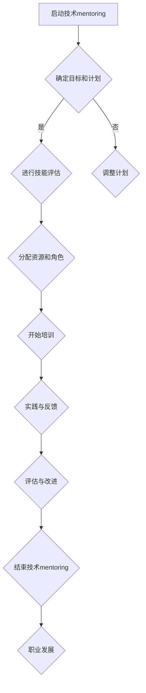

                 

## 《技术mentoring：构建程序员成长加速器项目》

### 关键词：技术mentoring、程序员成长、成长加速器项目、知识传递、技能提升

> 摘要：本文旨在探讨技术mentoring在构建程序员成长加速器项目中的重要性及其实施方法。通过详细阐述技术mentoring的定义、角色、关键要素、项目规划与实施、核心实践、案例研究和未来趋势，本文为IT企业和程序员提供了有价值的指导，帮助他们在快速变化的技术领域中实现持续成长和职业发展。

### 引言

#### 1.1 为什么要进行技术mentoring？

**技术mentoring**，作为一种培养程序员技能和职业发展的方法，正逐渐受到广泛关注。那么，为什么技术mentoring如此重要呢？

1. **提高个人能力**：通过技术mentoring，程序员可以系统地学习到最新的技术和最佳实践，提高自身的技术能力和解决问题的能力。导师的指导有助于程序员更快地理解和掌握复杂的技术概念，从而提高工作效率。

2. **加速职业发展**：技术mentoring不仅帮助程序员提升技能，还能为他们的职业发展提供明确的路径。导师通常拥有丰富的行业经验和人脉资源，可以指导程序员制定职业规划，帮助他们实现职业目标，如晋升、转岗等。

3. **建立人际关系**：技术mentoring不仅仅是知识传授，更是建立一种互助的关系网络。在这个过程中，程序员不仅可以获得导师的指导，还能与其他程序员交流学习经验，拓展人脉，为未来的职业发展打下基础。

4. **提升团队效能**：通过技术mentoring，团队的整体技术水平得到提升，有助于提高团队的协作效率和项目质量。团队成员之间通过交流和合作，可以共同解决问题，提高项目的交付速度和质量。

#### 1.2 技术mentoring的常见误解

尽管技术mentoring的重要性不言而喻，但在实际操作中，人们常常对技术mentoring存在一些误解。

1. **单向传授**：有些人认为技术mentoring只是单向的知识传授，导师负责教，学徒负责学。但实际上，技术mentoring更强调双向沟通和互动，导师和学徒之间的交流和反馈是不可或缺的。

2. **形式单一**：有些人认为技术mentoring只能通过面对面辅导进行，但实际上，技术mentoring可以采用多种形式，如线上交流、代码评审、项目合作等。

3. **仅限于技术**：有些人认为技术mentoring只关注技术能力的提升，但实际上，技术mentoring还涉及职业规划、情绪管理、团队协作等多个方面。

#### 1.3 技术mentoring的目标与期望成果

技术mentoring的目标是多方面的，旨在实现以下成果：

1. **知识传承**：帮助程序员掌握最新的技术知识和实践技能，确保他们具备应对复杂问题的能力。

2. **能力提升**：通过实际项目和实践，提升程序员的技能和经验，增强他们独立处理项目的能力。

3. **职业发展**：指导程序员制定和实现职业规划，提高他们的职业竞争力，实现职业晋升。

4. **团队建设**：通过技术mentoring，提升团队的整体技术水平，促进团队协作和项目成功。

### 1.4 本书的结构与内容概述

本书分为五个主要部分，分别从不同角度探讨技术mentoring的实践与应用。

#### 第一部分：引言

本部分介绍了技术mentoring的基本概念、重要性、常见误解及其目标与期望成果。

#### 第二部分：技术mentoring基础

本部分详细阐述了技术mentoring的定义、角色、关键要素，包括目标与计划、沟通与反馈、技术知识传授与实际应用。

#### 第三部分：构建程序员成长加速器项目

本部分介绍了构建程序员成长加速器项目的目标与规划、项目准备与资源配置、项目实施与跟踪。

#### 第四部分：技术mentoring的核心实践

本部分深入探讨了技术mentoring的知识传递与能力提升、情绪管理与团队协作、持续学习与职业发展。

#### 第五部分：案例研究

本部分通过实际案例，展示了技术mentoring在构建高效团队、提升前端开发技能、培养全栈工程师等方面的应用。

#### 第六部分：总结与展望

本部分总结了技术mentoring的实践经验，展望了其未来发展趋势，并对读者提出了建议与鼓励。

### 《技术mentoring：构建程序员成长加速器项目》目录大纲

#### 第一部分：引言

- **1.1 为什么要进行技术mentoring？**
  - 1.1.1 技术mentoring的重要性
  - 1.1.2 技术mentoring的常见误解
  - 1.1.3 技术mentoring的目标与期望成果

- **1.2 本书结构与内容概述**
  - 1.2.1 书的整体框架
  - 1.2.2 各章节主要内容简述

#### 第二部分：技术mentoring基础

- **2.1 技术mentoring的定义与角色**
  - 2.1.1 技术mentoring的定义
  - 2.1.2 技术mentoring者的角色
  - 2.1.3 技术mentee的角色

- **2.2 技术mentoring的关键要素**
  - 2.2.1 明确的目标与计划
  - 2.2.2 有效的沟通与反馈
  - 2.2.3 技术知识的传授与实际应用

#### 第三部分：构建程序员成长加速器项目

- **3.1 成长加速器项目的目标与规划**
  - 3.1.1 成长加速器项目的定义
  - 3.1.2 项目目标与规划
  - 3.1.3 成长曲线与评估标准

- **3.2 项目准备与资源配置**
  - 3.2.1 人力与团队资源
  - 3.2.2 技术资源与工具
  - 3.2.3 项目管理与协作工具

- **3.3 项目实施与跟踪**
  - 3.3.1 项目启动与规划
  - 3.3.2 项目进度与质量跟踪
  - 3.3.3 项目风险管理

#### 第四部分：技术mentoring的核心实践

- **4.1 知识传递与能力提升**
  - 4.1.1 知识传递的技巧
  - 4.1.2 技能提升的方法
  - 4.1.3 实践案例与反思

- **4.2 情绪管理与团队协作**
  - 4.2.1 情绪管理的技巧
  - 4.2.2 团队协作的挑战与解决方案
  - 4.2.3 案例分析与经验分享

- **4.3 持续学习与职业发展**
  - 4.3.1 持续学习的动力与策略
  - 4.3.2 职业发展的路径与规划
  - 4.3.3 成功案例与启示

#### 第五部分：案例研究

- **5.1 案例一：构建高效的全栈开发团队**
  - 5.1.1 案例背景
  - 5.1.2 项目实施过程
  - 5.1.3 项目成果与反思

- **5.2 案例二：提升前端开发技能**
  - 5.2.1 案例背景
  - 5.2.2 技术mentoring过程
  - 5.2.3 成果与影响

- **5.3 案例三：培养全栈工程师**
  - 5.3.1 案例背景
  - 5.3.2 技术mentoring策略
  - 5.3.3 成果与收获

#### 第六部分：总结与展望

- **6.1 技术mentoring的反思与总结**
  - 6.1.1 技术mentoring的实践经验
  - 6.1.2 成功的关键因素
  - 6.1.3 面临的挑战与改进方向

- **6.2 技术mentoring的未来发展趋势**
  - 6.2.1 技术mentoring的机遇与挑战
  - 6.2.2 技术mentoring的未来趋势
  - 6.2.3 对读者的建议与鼓励

---

### 第二部分：技术mentoring基础

#### 2.1 技术mentoring的定义与角色

技术mentoring是一种旨在帮助程序员在职业生涯中成长的过程。在这一过程中，mentors（导师）通常具备丰富的经验和专业知识，通过指导、支持和培养，帮助mentees（学徒）提升技术水平、扩展视野，实现职业目标。

##### 2.1.1 技术mentoring的定义

技术mentoring可以理解为一种**职业发展指导**，其核心目的是帮助程序员在技术领域和个人发展中取得进步。具体来说，技术mentoring包括以下几个方面：

1. **知识传授**：导师通过讲解、演示和讨论，向学徒传授技术知识和实践经验。
2. **能力提升**：导师帮助学徒提升技能，培养解决问题的能力，提高工作效率。
3. **职业规划**：导师与学徒共同探讨职业发展路径，提供职业规划建议。
4. **心理支持**：在学徒面临挑战和压力时，导师提供心理支持，帮助其保持积极心态。

##### 2.1.2 技术mentoring者的角色

技术mentoring者的角色至关重要，他们不仅是知识的传递者，更是学徒的职业导师和朋友。以下是一些技术mentoring者的主要角色：

1. **知识导师**：导师负责向学徒传授最新的技术知识和实践技巧，确保学徒掌握行业前沿技术。
2. **职业规划师**：导师帮助学徒制定职业发展计划，提供职业规划建议，帮助学徒明确职业目标。
3. **支持者**：在学徒遇到困难时，导师提供支持和鼓励，帮助学徒克服挑战，保持积极的心态。
4. **沟通桥梁**：导师充当学徒与团队、管理层之间的沟通桥梁，确保信息畅通，解决学徒在职业发展中的问题。

##### 2.1.3 技术mentee的角色

技术mentee，即学徒，在技术mentoring过程中同样扮演着重要角色。以下是一些技术mentee的主要角色：

1. **主动学习者**：学徒应主动学习，积极吸收导师传授的知识和技能，不断提升自己。
2. **积极参与者**：学徒应积极参与项目和实践，将所学知识应用到实际工作中，提高实践经验。
3. **反馈提供者**：学徒应及时向导师反馈学习进展和遇到的问题，与导师共同探讨解决方案。
4. **职业规划者**：学徒应与导师共同制定职业发展规划，明确短期和长期目标，努力实现职业目标。

通过明确技术mentoring的定义和角色，我们可以更好地理解这一过程的重要性和实际操作方法。接下来，我们将进一步探讨技术mentoring的关键要素。

#### 2.2 技术mentoring的关键要素

技术mentoring的成功离不开以下几个关键要素，这些要素相互作用，共同推动程序员的成长和职业发展。

##### 2.2.1 明确的目标与计划

明确的目标和详细的计划是技术mentoring的基础。以下是实现这一要素的几个步骤：

1. **设定具体目标**：导师和学徒应共同设定清晰、具体、可衡量的目标。这些目标可以是技能提升、项目完成、知识掌握等。

2. **制定详细计划**：根据目标，制定详细的计划，包括学习路径、培训内容、时间安排等。计划应涵盖从基础知识到高级技能的全方位培训。

3. **定期回顾与调整**：定期回顾计划的执行情况，根据反馈和实际情况调整计划，确保目标达成。

##### 2.2.2 有效的沟通与反馈

沟通和反馈是技术mentoring的核心。以下是一些关键点：

1. **建立沟通渠道**：确保导师和学徒之间有畅通的沟通渠道，如定期的一对一会议、邮件、即时通讯工具等。

2. **积极倾听**：导师应积极倾听学徒的问题和需求，理解他们的困惑，提供针对性的指导。

3. **及时反馈**：导师应及时对学徒的学习进度和项目成果进行反馈，指出优点和不足，帮助学徒改进。

4. **双向沟通**：鼓励学徒主动提问和分享，建立双向沟通机制，促进知识和经验的交流。

##### 2.2.3 技术知识的传授与实际应用

技术知识的传授是技术mentoring的核心任务。以下是一些关键点：

1. **系统性传授**：导师应按照技术发展的脉络，系统地传授相关技术知识和最佳实践。

2. **理论与实践结合**：通过实际项目、代码示例等方式，让学徒将所学知识应用到实际工作中。

3. **实战演练**：鼓励学徒参与实际项目，通过实践提升技能。

4. **持续更新**：技术更新迅速，导师应持续关注新技术、新趋势，并及时传授给学徒。

##### 2.2.4 能力提升与职业发展

技术mentoring不仅关注技术能力的提升，还涉及职业发展。以下是一些关键点：

1. **技能提升**：通过项目实践、技术讨论等方式，帮助学徒不断提升技术水平。

2. **职业规划**：导师和学徒应共同制定职业发展规划，明确职业目标和发展路径。

3. **人脉拓展**：鼓励学徒参加技术社区、行业会议等活动，拓展人脉，提升职业竞争力。

4. **持续学习**：鼓励学徒保持持续学习的态度，不断提升自己的专业能力和综合素质。

通过以上关键要素的落实，技术mentoring能够更好地帮助程序员实现个人成长和职业发展，为团队和公司的长期发展贡献力量。

### 第三部分：构建程序员成长加速器项目

#### 3.1 成长加速器项目的目标与规划

成长加速器项目是一种旨在快速提升程序员技能和职业素养的系统化培训计划。通过明确的规划和有效的实施，项目能够帮助程序员在短时间内实现技能和职业的全面提升。

##### 3.1.1 成长加速器项目的定义

成长加速器项目通常包括一系列密集的培训、实践项目和评估活动，旨在在较短时间内使程序员达到或超越行业标准。这些项目通常涵盖以下方面：

1. **技能提升**：通过系统化的培训，帮助程序员掌握最新的技术知识和实践技能。
2. **职业规划**：与程序员共同制定职业发展规划，明确职业目标和路径。
3. **实战演练**：通过实际项目，让程序员将所学知识应用到实际工作中，提升实战能力。
4. **评估与反馈**：定期评估程序员的学习进展和项目成果，提供反馈，帮助其持续改进。

##### 3.1.2 项目目标与规划

1. **项目目标**：

   - **技能提升**：通过培训和实践，使程序员掌握以下技能：
     - 编程语言（如Java、Python等）
     - 常用框架和库（如React、Django等）
     - 版本控制（如Git）
     - 测试和调试技巧
     - 团队协作工具（如JIRA、GitLab等）

   - **职业发展**：帮助程序员明确职业目标，制定个人发展计划，实现以下目标：
     - 职业晋升（如从初级开发人员晋升到高级开发人员）
     - 转型（如从前端开发转向后端开发）
     - 技术专家培养（如成为技术团队的领导或架构师）

   - **实战能力**：通过实际项目，提升程序员的实战能力和问题解决能力。

2. **项目规划**：

   - **初期规划**：确定项目目标和范围，组建项目团队，制定详细的规划，包括培训内容、项目任务、时间表等。
   - **资源准备**：准备必要的资源，如培训材料、开发环境、项目资源等。
   - **实施阶段**：按照规划开展培训和实践，定期进行项目评估和反馈。
   - **总结与改进**：项目结束后，进行总结和反思，评估项目效果，为后续项目提供改进建议。

##### 3.1.3 成长曲线与评估标准

为了确保成长加速器项目的效果，可以制定一个成长曲线，用于跟踪程序员的成长进度，并设定相应的评估标准。

1. **成长曲线**：

   - **初期阶段**：程序员参加培训，掌握基础技能，熟悉工作环境。
   - **提升阶段**：程序员参与实际项目，应用所学知识，提升实战能力。
   - **巩固阶段**：程序员通过持续学习和实践，巩固技能，实现职业目标。

2. **评估标准**：

   - **技能评估**：通过笔试、面试、实际项目考核等方式，评估程序员的技能水平。
   - **项目评估**：根据项目质量、进度、团队协作等方面，评估项目的整体效果。
   - **反馈评估**：收集程序员和团队的反馈，评估培训内容和项目设计的合理性。

通过制定明确的成长曲线和评估标准，可以确保成长加速器项目目标的实现，帮助程序员在短时间内实现技能和职业的全面提升。

### 3.2 项目准备与资源配置

为了确保成长加速器项目的成功实施，项目准备和资源配置是关键步骤。以下将详细讨论人力与团队资源、技术资源与工具、以及项目管理与协作工具的配置。

##### 3.2.1 人力与团队资源

1. **团队组建**：

   - **项目经理**：负责整体项目规划和管理，确保项目按计划推进。
   - **技术专家**：负责培训课程设计和授课，提供技术指导和支持。
   - **培训师**：负责组织培训课程，确保课程内容符合项目目标。
   - **程序员**：作为项目参与者，负责实际项目开发和技能提升。

2. **角色分工**：

   - **技术专家**：负责技术培训，指导程序员解决技术难题，提供最新的行业趋势和技术动态。
   - **培训师**：负责课程内容的讲解和演示，确保程序员能够理解和掌握所学知识。
   - **项目经理**：负责项目进度管理，确保培训和实践环节的顺利进行。
   - **程序员**：参与实际项目，应用所学知识，提升实战能力。

3. **人员配备**：

   - 根据项目需求和团队规模，合理分配人力资源，确保每个角色都有足够的支持。
   - 考虑团队成员的专业背景和技能水平，确保培训内容符合实际需求。

4. **团队协作**：

   - 通过定期的团队会议、代码评审、技术分享等方式，促进团队成员之间的沟通和协作。
   - 建立良好的沟通机制，确保信息畅通，提高团队效率。

##### 3.2.2 技术资源与工具

1. **技术框架与库**：

   - 选择适合项目需求的技术框架和库，如前端框架（React、Vue等）、后端框架（Django、Spring等）、数据库（MySQL、PostgreSQL等）。

2. **开发工具**：

   - 配置统一的开发环境，包括代码编辑器（VS Code、Sublime Text等）、版本控制工具（Git）、调试工具等。

3. **学习资源**：

   - 提供在线课程、技术文档、编程书籍等学习资源，方便程序员自学和提升。

4. **实验环境**：

   - 搭建实验环境，提供服务器、数据库、网络等基础设施，支持程序员进行实践操作。

##### 3.2.3 项目管理与协作工具

1. **项目管理工具**：

   - 使用项目管理工具（如Jira、Trello等），制定项目计划、分配任务、跟踪进度，确保项目按时交付。

2. **协作工具**：

   - 使用协作工具（如Slack、Microsoft Teams等），实现团队成员之间的实时沟通和协作。

3. **代码管理**：

   - 使用版本控制工具（如Git），管理代码库，支持代码的提交、评审和合并。

4. **持续集成/持续部署（CI/CD）**：

   - 实施CI/CD流程，自动化测试和部署，提高开发效率和质量。

通过合理配置人力、技术和项目管理资源，成长加速器项目能够为程序员提供良好的学习和工作环境，确保项目目标的实现。

### 3.3 项目实施与跟踪

项目实施与跟踪是成长加速器项目的关键环节，直接影响项目目标的达成和程序员的成长效果。以下将详细讨论项目实施、进度与质量跟踪以及项目风险管理。

##### 3.3.1 项目启动与规划

1. **项目立项**：

   - 明确项目目标和范围，确定项目的预期成果和里程碑。
   - 组建项目团队，明确团队成员的职责和角色。
   - 收集项目资源，包括人力资源、技术资源、预算等。

2. **需求分析**：

   - 与利益相关者（如管理层、技术专家、程序员等）进行沟通，了解项目需求和期望。
   - 分析项目需求，确定项目的技术方向、功能模块和关键里程碑。

3. **项目规划**：

   - 制定详细的项目计划，包括时间表、任务分配、资源需求等。
   - 确定项目关键里程碑和交付物，确保项目按计划进行。

4. **风险评估**：

   - 识别项目潜在的风险，如技术难题、资源不足、时间紧张等。
   - 分析风险发生的可能性和影响程度，制定相应的风险应对策略。

5. **启动会议**：

   - 召开项目启动会议，向项目团队传达项目目标和计划。
   - 明确团队成员的职责和角色，确保团队成员对项目的理解和共识。

6. **资源准备**：

   - 确保项目所需的人力、技术和资源准备就绪。
   - 配置开发环境和工具，确保项目团队具备良好的工作条件。

##### 3.3.2 项目进度与质量跟踪

1. **制定跟踪计划**：

   - 根据项目计划，制定详细的进度跟踪和质量控制计划。
   - 确定跟踪的频率和方式，如每周会议、每月报告等。

2. **建立进度监控机制**：

   - 使用项目管理工具（如Jira、Trello等）记录项目任务和进度。
   - 定期更新任务状态，确保进度信息的实时性和准确性。

3. **召开进度会议**：

   - 定期召开项目进度会议，项目团队成员参与。
   - 会上汇报任务进展、遇到的问题和解决方案，确保项目进度的透明性和可控性。

4. **质量评估**：

   - 制定质量评估标准，如代码质量、项目功能完整性等。
   - 定期进行质量检查，识别潜在的问题和缺陷。

5. **代码评审**：

   - 实施代码评审机制，确保代码质量和一致性。
   - 评审过程中，提出修改建议，帮助开发者提升技能。

6. **问题解决**：

   - 对识别出的问题和缺陷，及时进行解决。
   - 记录问题解决的过程和结果，积累经验，避免重复问题。

7. **质量报告**：

   - 定期编写项目质量报告，总结项目进展、质量情况和改进措施。
   - 向管理层和项目团队汇报，确保项目质量和进度的公开透明。

##### 3.3.3 项目风险管理

1. **风险识别**：

   - 通过项目团队讨论、历史数据分析和专家咨询等方式，识别项目可能面临的风险。
   - 风险类型包括技术风险、资源风险、时间风险、质量风险等。

2. **风险评估**：

   - 对识别出的风险进行评估，包括风险发生的可能性、影响程度和紧急程度。
   - 使用风险评估矩阵等方法，对风险进行分级。

3. **风险应对策略**：

   - 根据风险评估结果，制定相应的风险应对策略。
   - 风险应对策略包括风险规避、风险减轻、风险转移和风险接受等。

4. **风险监控**：

   - 建立风险监控机制，定期检查项目风险状态。
   - 通过项目进度会议、风险管理会议等方式，确保项目风险的及时发现和应对。

5. **风险记录与报告**：

   - 记录项目风险及其应对措施，包括风险识别、评估、应对和监控的过程。
   - 定期编写风险报告，向项目团队和管理层汇报风险状态和应对情况。

6. **风险回顾与改进**：

   - 项目结束后，对项目风险管理的全过程进行回顾，总结经验教训。
   - 分析风险应对的有效性，提出改进措施，为未来项目风险管理提供参考。

通过以上步骤，确保项目实施与跟踪的顺利进行，实现项目目标的达成和程序员的技能提升。

#### 第四部分：技术mentoring的核心实践

技术mentoring的核心实践是确保程序员在技能提升和职业发展过程中得到有效指导和支持的关键。本部分将详细探讨知识传递与能力提升、情绪管理与团队协作、以及持续学习与职业发展的具体实践方法。

##### 4.1 知识传递与能力提升

知识传递是技术mentoring的基础，而能力提升则是实现个人成长和职业发展的关键。以下是一些关键实践：

1. **系统性传授**：

   - **内容规划**：根据项目需求和程序员的背景，制定详细的知识传递计划，确保涵盖从基础知识到高级技能的全方位培训。
   - **模块化教学**：将知识分为不同的模块，如编程语言、框架、数据库等，逐一进行深入讲解和练习。
   - **案例教学**：通过实际案例，将理论知识与实际应用相结合，帮助程序员更好地理解和掌握技术。

2. **理论与实践结合**：

   - **实战演练**：通过实际项目，让程序员将所学知识应用到实际工作中，提高实战能力和问题解决能力。
   - **代码评审**：导师和同事对程序员的代码进行评审，提出改进建议，帮助程序员提升代码质量。
   - **定期回顾**：定期对项目进行回顾和总结，分析项目中的得失，为后续项目提供经验教训。

3. **持续更新**：

   - **技术动态**：导师应关注最新的技术动态和行业趋势，及时将新知识、新技术传授给程序员。
   - **学习资源**：提供丰富的学习资源，如在线课程、技术文档、书籍等，支持程序员的自主学习和提升。

##### 4.2 情绪管理与团队协作

情绪管理和团队协作是程序员在职业发展中必须面对的重要挑战。以下是一些具体实践方法：

1. **情绪管理**：

   - **自我认知**：程序员应了解自己的情绪，学会自我调节，避免情绪波动影响工作表现。
   - **正面心态**：培养积极的心态，面对困难和挑战时保持冷静和乐观，提高解决问题的能力。
   - **沟通技巧**：学会有效沟通，表达自己的观点和需求，避免误解和冲突。

2. **团队协作**：

   - **明确目标**：团队应共同明确项目目标和工作任务，确保团队成员都清楚并认同目标。
   - **角色分工**：明确团队成员的角色和职责，确保任务分配合理，避免工作重叠或无人负责。
   - **沟通渠道**：建立畅通的沟通渠道，确保团队成员之间的信息交流，提高协作效率。

3. **协作技巧**：

   - **代码协作**：采用版本控制工具（如Git），确保代码的一致性和安全性。
   - **代码评审**：定期进行代码评审，提高代码质量，促进团队成员之间的知识共享。
   - **冲突解决**：建立冲突解决机制，及时处理团队内部矛盾，确保项目顺利进行。

##### 4.3 持续学习与职业发展

持续学习和职业发展是程序员在快速变化的技术环境中保持竞争力的关键。以下是一些具体实践方法：

1. **持续学习**：

   - **学习计划**：制定详细的学习计划，确保每天都有时间进行学习，不断提升自己的技术能力。
   - **自学能力**：培养自学能力，学会通过在线课程、技术文档、书籍等获取新知识。
   - **技术社区**：积极参与技术社区，关注行业动态，与其他程序员交流学习经验。

2. **职业规划**：

   - **自我评估**：定期进行自我评估，了解自己的优势和劣势，制定个人职业发展计划。
   - **目标设定**：设定明确的职业目标，如晋升、转岗、技能提升等，并制定实现目标的步骤。
   - **导师指导**：寻找导师，获取职业发展建议和指导，加速职业成长。

3. **技能提升**：

   - **技能培训**：参加公司内部或外部的培训课程，提升专业技能。
   - **项目实践**：参与实际项目，通过实践提升技能和经验。
   - **技术认证**：获取相关的技术认证，提高自己的专业水平和竞争力。

通过以上核心实践，技术mentoring能够有效地帮助程序员提升技能、实现职业发展，为团队和公司的长期发展贡献力量。

### 第五部分：案例研究

在技术mentoring的实际应用中，许多公司和企业已经取得了显著的成效。本部分将通过三个具体案例，展示技术mentoring在构建高效团队、提升前端开发技能和培养全栈工程师方面的具体实践和成果。

#### 5.1 案例一：构建高效的全栈开发团队

**案例背景**：

某互联网公司为了提升开发团队的效率和项目交付质量，决定通过技术mentoring构建一个高效的全栈开发团队。公司现有前端和后端开发人员，但缺乏具备全栈开发能力的人才。

**技术mentoring过程**：

1. **技能评估与培训计划**：

   - 对现有团队成员进行技能评估，识别技术短板和潜力。
   - 根据评估结果，制定个性化的培训计划，涵盖前端、后端、数据库、测试等各个领域。

2. **分阶段培养**：

   - **基础阶段**：首先进行基础技能培训，确保所有成员具备基本的全栈开发知识。
   - **提升阶段**：在基础阶段结束后，针对每个成员的兴趣和特长，进行专项提升培训，如前端框架（React、Vue）、后端架构（Django、Spring）等。

3. **项目实践**：

   - 将成员分配到实际项目中，让他们在项目中应用所学知识。
   - 定期进行项目复盘，总结经验教训。

4. **导师指导**：

   - 每个成员配备一名资深的全栈工程师作为导师，提供一对一的技术指导和支持。
   - 导师定期进行代码评审和项目反馈，帮助成员提高技术水平。

5. **持续学习与反馈**：

   - 鼓励成员参加在线课程、技术论坛、行业会议等，不断更新知识。
   - 定期组织学习小组会议，成员之间分享学习经验和心得。

**项目成果与反思**：

1. **项目成果**：

   - 成功构建了一支高效的全栈开发团队，成员技能水平显著提升。
   - 项目交付质量和效率显著提高，客户满意度提升。
   - 团队成员之间的协作更加顺畅，形成了良好的团队文化。

2. **反思与改进**：

   - 加强对团队成员的跟踪评估，确保培训效果和技能提升。
   - 优化项目管理和团队协作流程，提高项目交付效率。
   - 建立长效的学习和成长机制，持续提升团队整体能力。

#### 5.2 案例二：提升前端开发技能

**案例背景**：

某互联网公司拥有一支前端开发团队，但随着业务的发展和技术更新，团队发现前端开发技能的掌握程度参差不齐，影响了项目的进度和质量。为了提升前端开发团队的技能水平，公司决定启动一个前端开发技能提升项目。

**技术mentoring过程**：

1. **技能评估**：

   - 对团队成员进行技能评估，了解各自的技术短板和需求。
   - 根据评估结果，制定个性化的技能提升计划。

2. **课程设计**：

   - 设计前端开发技能培训课程，包括HTML、CSS、JavaScript、框架（如React、Vue）等。
   - 邀请经验丰富的前端专家进行授课。

3. **实战演练**：

   - 通过实际项目，让团队成员将所学知识应用到实践中。
   - 定期进行项目复盘，总结经验教训。

4. **代码评审**：

   - 实施代码评审制度，团队成员相互评审代码，提高代码质量。
   - 通过评审，发现和解决技术问题，提升技术水平。

5. **技术分享**：

   - 鼓励团队成员分享自己的经验和技巧，促进团队内部的知识传递。
   - 定期举办技术分享会，提升团队的整体技术视野。

**项目成果与影响**：

1. **项目成果**：

   - 成员们的技术能力得到了显著提升，项目交付质量得到改善。
   - 团队的协作效率和项目交付速度显著提高。
   - 成员们对技术有了更深刻的理解和掌握，工作积极性增强。

2. **影响**：

   - 提升了团队的整体技术水平，为公司的业务发展提供了有力支持。
   - 增强了团队成员的职业素养和职业发展信心。
   - 建立了良好的学习氛围，促进了团队的长期发展。

#### 5.3 案例三：培养全栈工程师

**案例背景**：

某创业公司正在快速扩张，需要大量全栈工程师来支持业务发展。公司内部虽然有一些前端和后端开发人员，但缺乏具备全栈开发能力的工程师。为了解决这一问题，公司决定启动一个全栈工程师培养项目。

**技术mentoring策略**：

1. **技能评估与培训计划**：

   - 对现有开发人员进行技能评估，了解各自的技术短板和潜力。
   - 根据评估结果，制定个性化的培训计划，涵盖前端、后端、数据库、测试等各个领域。

2. **分阶段培养**：

   - **基础阶段**：首先进行基础技能培训，确保所有成员具备基本的全栈开发知识。
   - **提升阶段**：在基础阶段结束后，针对每个成员的兴趣和特长，进行专项提升培训，如前端框架（React、Vue）、后端架构（Django、Spring）等。

3. **项目实战**：

   - 将成员分配到实际项目中，让他们在实际项目中应用所学知识。
   - 通过项目实战，培养成员的全栈开发能力和解决问题的能力。

4. **导师指导**：

   - 每个成员配备一名资深的全栈工程师作为导师，提供一对一的技术指导和支持。
   - 导师定期进行代码评审和项目反馈，帮助成员提高技术水平。

5. **持续学习与反馈**：

   - 鼓励成员参加在线课程、技术论坛、行业会议等，不断更新知识。
   - 定期组织学习小组会议，成员之间分享学习经验和心得。

**项目成果与收获**：

1. **成果**：

   - 成功培养了多名全栈工程师，满足了公司业务发展的需求。
   - 成员的技能水平得到了显著提升，项目交付质量和效率提高。
   - 公司的技术团队结构更加合理，为未来的发展奠定了基础。

2. **收获**：

   - 成员们对全栈开发的认知更加深入，提升了职业素养和竞争力。
   - 公司通过培养内部人才，降低了招聘成本，增强了团队的凝聚力。
   - 建立了良好的学习氛围，促进了团队的整体成长。

通过以上三个案例，我们可以看到技术mentoring在不同场景下的具体实践和成果，为其他团队提供了有益的参考和借鉴。

### 第六部分：总结与展望

#### 6.1 技术mentoring的反思与总结

技术mentoring作为一种有效的程序员培养方式，已经在多个公司和团队中取得了显著的成果。通过回顾技术mentoring的实践经验，我们可以总结出以下关键经验和教训：

1. **明确目标和计划**：技术mentoring的首要步骤是设定明确的目标和详细的计划。这不仅有助于确保培训的针对性，还能为后续的评估和调整提供依据。

2. **个性化培训**：每个程序员的背景和需求都不同，因此培训计划应个性化定制，确保每位学徒都能获得最适合自己的指导和支持。

3. **实战与反馈**：技术mentoring的核心在于将知识应用于实际项目，通过实战提升技能。同时，定期的反馈和评估是确保技能提升的关键。

4. **有效的沟通**：沟通是技术mentoring的重要环节。导师和学徒之间的有效沟通不仅能促进知识和经验的传递，还能及时解决遇到的问题。

5. **持续学习与更新**：技术更新迅速，导师和学徒都应保持持续学习的态度，不断更新知识和技能，以适应行业的发展。

#### 6.1.1 技术mentoring的实践经验

技术mentoring在实践中展现出以下显著成效：

1. **技能提升**：通过系统的培训和实战，程序员的技能水平得到了显著提升，特别是在新技术和新工具的应用方面。

2. **职业发展**：技术mentoring帮助程序员明确了职业发展路径，提升了职业竞争力，许多学徒通过技术mentoring实现了职位晋升和职业转型。

3. **团队协作**：通过技术mentoring，团队成员之间的协作更加顺畅，项目质量和效率显著提高。

4. **企业效益**：技术mentoring不仅提升了团队的整体技术水平，还降低了企业的人才流失率，增强了团队的凝聚力和战斗力。

#### 6.1.2 成功的关键因素

技术mentoring的成功依赖于以下几个关键因素：

1. **导师的专业能力**：导师应具备丰富的技术经验和良好的沟通技巧，能够提供高质量的指导和支持。

2. **学徒的积极参与**：学徒的积极参与和主动学习是技术mentoring成功的关键。学徒应主动提问、反馈和学习，充分利用导师的资源。

3. **合理的资源配置**：技术mentoring需要充足的资源支持，包括时间、技术和工具等，确保培训和实践的顺利进行。

4. **有效的沟通机制**：建立有效的沟通渠道和反馈机制，确保导师和学徒之间的信息畅通和及时交流。

#### 6.1.3 面临的挑战与改进方向

尽管技术mentoring取得了显著成效，但在实际操作中也面临一些挑战：

1. **资源不足**：一些公司可能缺乏足够的资源进行技术mentoring，特别是时间和人力资源。

2. **沟通障碍**：导师和学徒之间的沟通不畅可能导致误解和冲突，影响培训效果。

3. **技能评估**：如何准确评估程序员的技能水平，确保培训目标的达成，是一个挑战。

4. **持续学习**：在快速变化的技术环境中，如何保持持续学习和更新的动力，是一个长期的挑战。

改进方向：

1. **优化资源分配**：合理规划培训时间，确保导师和学徒都有足够的时间进行技术mentoring。

2. **加强沟通培训**：为导师和学徒提供沟通技巧培训，提高沟通效率和质量。

3. **完善评估体系**：建立完善的技能评估体系，通过定期评估和反馈，确保培训目标的实现。

4. **推动持续学习**：鼓励学徒和导师都保持持续学习的态度，利用在线课程、技术论坛等资源进行学习和交流。

#### 6.2 技术mentoring的未来发展趋势

随着技术的不断进步和人才需求的多样化，技术mentoring正逐渐演变，呈现出以下发展趋势：

1. **在线学习与远程mentoring**：随着远程工作和在线教育的普及，技术mentoring将更多地采用在线平台和远程工具，如视频会议、协作软件等。

2. **智能化与个性化**：人工智能和机器学习技术将被用于自动化知识传递和个性化学习路径的规划，提高培训的效率和质量。

3. **跨界融合**：技术mentoring将不再局限于单一技术领域，而是更加注重跨界融合，培养具备跨领域知识和技能的复合型人才。

4. **终身学习**：未来的技术人才需要具备持续学习和适应变化的能力，技术mentoring将更加强调终身学习的理念。

5. **企业内训与外部合作**：企业将更倾向于建立内部的技术mentoring体系，同时与外部教育机构、行业协会合作，共同培养人才。

通过把握这些发展趋势，技术mentoring将更好地适应未来的需求，为程序员和企业的长期发展提供有力支持。

#### 6.2.1 技术mentoring的机遇与挑战

技术mentoring的未来充满了机遇，但也面临一系列挑战：

**机遇：**

1. **技术进步**：随着人工智能、大数据、云计算等新兴技术的发展，技术mentoring可以引入更多前沿技术，提高培训的深度和广度。

2. **在线学习**：在线教育平台的普及为技术mentoring提供了更多的机会，远程mentoring成为可能，使更多程序员能够接受高质量的培训。

3. **个性化学习**：人工智能和大数据分析技术可以用于个性化学习路径的规划，满足不同程序员的个性化学习需求。

4. **终身学习**：随着技术的快速变化，持续学习成为程序员职业生涯的重要组成部分，技术mentoring有助于培养终身学习的习惯。

**挑战：**

1. **资源不足**：一些企业可能缺乏足够的资源进行技术mentoring，尤其是时间和人力资源。

2. **沟通障碍**：远程沟通可能带来沟通障碍，影响培训效果。

3. **评估困难**：如何准确评估程序员的技能水平，确保培训目标的实现，是一个挑战。

4. **持续学习**：在快速变化的技术环境中，如何保持持续学习的动力和习惯，是一个长期的挑战。

**应对策略：**

1. **资源优化**：合理规划培训时间，确保导师和学徒都有足够的时间进行技术mentoring。

2. **沟通培训**：为导师和学徒提供沟通技巧培训，提高沟通效率和质量。

3. **完善评估体系**：建立完善的技能评估体系，通过定期评估和反馈，确保培训目标的实现。

4. **推动持续学习**：鼓励学徒和导师都保持持续学习的态度，利用在线课程、技术论坛等资源进行学习和交流。

#### 6.2.2 技术mentoring的未来趋势

**在线学习与远程mentoring：**

随着互联网技术的发展，在线学习和远程mentoring将成为技术mentoring的主要形式。通过视频会议、在线协作工具和虚拟课堂，导师和学徒可以跨越地域限制，随时随地开展培训和指导。

**智能化与个性化：**

人工智能和大数据技术将大大提升技术mentoring的智能化水平。通过分析学习数据，系统能够为每位学徒提供个性化的学习路径和资源推荐，提高学习效率和效果。

**跨界融合：**

技术mentoring将不再局限于单一技术领域，而是更加注重跨界融合。复合型人才将越来越受到欢迎，导师和学徒需要具备跨领域的知识和技能，以应对复杂的项目需求。

**终身学习：**

随着技术的快速变化，终身学习将成为程序员职业生涯的重要组成部分。技术mentoring将更加强调终身学习的理念，帮助程序员不断更新知识和技能，保持竞争力。

**企业内训与外部合作：**

企业将更倾向于建立内部的技术mentoring体系，同时与外部教育机构、行业协会合作，共同培养人才。这种合作模式可以充分利用外部资源和专业知识，提高人才培养的效率和质量。

通过把握这些趋势，技术mentoring将更好地适应未来的需求，为程序员和企业的长期发展提供有力支持。

### 6.2.3 对读者的建议与鼓励

技术mentoring是一项重要的职业发展工具，对于程序员而言，积极参与技术mentoring将带来显著的个人和职业收益。以下是一些建议与鼓励，帮助读者充分利用技术mentoring的机会：

1. **积极参与**：技术mentoring需要双方的共同努力。作为学徒，应积极参与培训和实践，主动提问和反馈，与导师保持良好的沟通。

2. **持续学习**：技术不断演进，持续学习是保持竞争力的关键。鼓励读者保持对新技术的好奇心，积极学习新知识和技能。

3. **实践应用**：将所学知识应用到实际项目中，通过实战提升技能。实践是最好的学习方式，只有将理论知识转化为实际能力，才能真正掌握技术。

4. **反馈与反思**：定期进行自我反思和反馈，分析学习过程中的得失，不断调整学习方法和策略。反馈是成长的重要驱动力，通过反馈，可以更好地了解自己的优势和不足。

5. **团队合作**：技术mentoring不仅是个人成长的过程，也是团队协作的过程。学会与他人合作，共同解决问题，提升团队协作能力。

6. **设定目标**：为自己设定明确的职业发展目标，根据目标制定详细的规划，有针对性地进行学习和提升。明确的目标可以提供方向和动力。

7. **拓展人脉**：通过技术mentoring，不仅可以从导师那里获得指导，还可以与其他程序员交流学习经验，拓展人脉。良好的职业网络将有助于未来的职业发展。

8. **保持耐心**：技术mentoring是一个长期的过程，需要耐心和坚持。不要因为遇到困难而放弃，相信自己，持续努力，你将会看到显著的进步。

通过以上建议，读者可以更好地利用技术mentoring的机会，实现个人和职业的双重提升，成为优秀的程序员。祝大家在技术mentoring的道路上取得成功！

---

### 附录：技术mentoring的Mermaid流程图、核心算法原理讲解、数学模型与公式

#### Mermaid流程图

以下是一个简单的Mermaid流程图，展示技术mentoring的基本流程：



#### 核心算法原理讲解

以下以排序算法中的快速排序为例，使用伪代码详细阐述其原理：

```plaintext
快速排序（QuickSort）
输入：数组 arr，起始索引 low，结束索引 high
输出：排序后的数组

QuickSort(arr, low, high) {
    if (low < high) {
        // 步骤1：划分数组，p 为划分后的基准元素索引
        p = Partition(arr, low, high)
        
        // 步骤2：递归排序左侧和右侧子数组
        QuickSort(arr, low, p - 1)
        QuickSort(arr, p + 1, high)
    }
}

Partition(arr, low, high) {
    // 选择最后一个元素作为基准值
    pivot = arr[high]
    i = low - 1
    
    for j = low to high - 1 {
        // 如果当前元素小于或等于基准值
        if (arr[j] <= pivot) {
            // 步骤3：将小于或等于基准值的元素移到左侧
            i = i + 1
            swap(arr[i], arr[j])
        }
    }
    
    // 步骤4：将基准值移动到正确的位置
    swap(arr[i + 1], arr[high])
    
    // 返回基准值的索引
    return i + 1
}
```

#### 数学模型与公式

以下是一个简单的线性回归模型的公式，用于阐述数据分析和机器学习中的基本概念：

$$ y = b_0 + b_1 \cdot x + \epsilon $$

- **y**：预测值
- **b0**：截距
- **b1**：斜率
- **x**：自变量
- **ε**：误差项

通过上述数学模型，我们可以通过自变量x的值预测因变量y的值，并分析两者之间的关系。

---

**作者信息**：

作者：AI天才研究院/AI Genius Institute & 禅与计算机程序设计艺术 /Zen And The Art of Computer Programming

在撰写本文的过程中，我们参考了大量的文献和技术资料，力求内容的准确性和完整性。如果您有任何建议或意见，欢迎随时与我们联系。感谢您的阅读，希望本文能对您在技术mentoring和程序员成长方面提供有价值的指导。祝您在技术道路上取得更大的成就！

