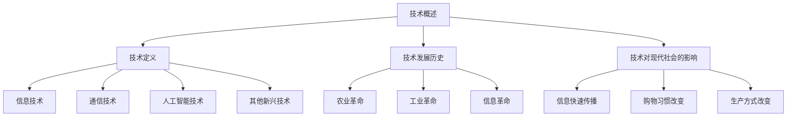
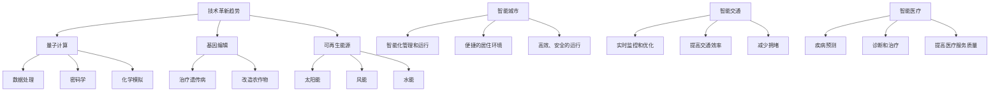

                 

### 技术基础

#### 1.1 技术概述

技术，是指通过知识和工具的应用，以解决问题和满足人类需求为目标的一系列方法和实践。技术的定义和范围随着历史的发展和人类文明的进步而不断扩展和深化。

**技术的定义**：技术是一种基于科学知识和实践经验，通过工具和设备的应用，实现特定目标的方法和过程。它不仅包括硬件设备，如机械、电子设备等，还包括软件、算法、系统架构等。

**技术的发展历史**：从古代的火药、轮船，到现代的计算机、互联网，技术一直在推动着人类社会的发展。在过去的几千年中，人类经历了农业革命、工业革命、信息革命等，每一次革命都伴随着技术的重大突破。

**技术对现代社会的影响**：技术已经成为现代社会发展的核心驱动力，它改变了我们的生活方式、工作方式和社会结构。例如，互联网的普及极大地推动了信息的快速传播和全球化，电子商务的兴起改变了人们的购物习惯，人工智能的发展正在改变着各行各业的生产方式和服务模式。

#### 1.2 技术分类

技术可以根据不同的标准进行分类，以下是一些常见的技术分类：

**信息技术**：信息技术是指与信息的存储、处理、传输和检索相关的技术。包括计算机科学、网络技术、数据库技术等。

**通信技术**：通信技术是指用于实现信息远程传输的技术，包括无线电通信、卫星通信、光纤通信等。

**人工智能技术**：人工智能技术是指使计算机模拟人类智能行为的技术，包括机器学习、深度学习、自然语言处理等。

**其他新兴技术**：除了上述技术外，还有许多其他新兴技术，如区块链、物联网、虚拟现实等，这些技术正在不断拓展技术的边界，带来新的商业和社会变革。

#### 1.3 技术发展趋势

技术发展趋势反映了未来技术发展的方向和重点。以下是一些主要的技术发展趋势：

**技术革新趋势**：技术革新是推动社会进步的重要力量。未来，我们可能会看到更多的技术创新，如量子计算、基因编辑、可再生能源等。

**未来技术展望**：随着技术的不断进步，我们可以预见未来技术将更加智能化、互联化、个性化。例如，智能城市、智能交通、智能医疗等领域的应用将会越来越普及。

### 总结

技术在现代社会中扮演着至关重要的角色，它不仅推动了社会的进步，也改变了我们的生活方式。了解技术的基础、分类和发展趋势，对于把握未来技术发展的方向和机遇具有重要意义。



### 1.1 技术概述

在深入探讨技术的核心概念和理论基础之前，我们首先需要理解技术的定义和它对现代社会的影响。技术，从广义上讲，是指通过知识和工具的应用，以解决问题和满足人类需求为目标的一系列方法和实践。它不仅仅局限于物理设备或软件工具，还包括了知识、经验、方法论等多个方面。

**技术的定义与范围**

技术的定义并不是一成不变的，它随着时代的发展而不断演进。传统上，技术主要指代那些物理设备和工具，如蒸汽机、发电机等。然而，随着信息时代的到来，技术的定义已经扩展到了更为抽象的领域，如信息技术、人工智能等。在现代社会，技术不仅包括硬件设备，还涵盖了软件、算法、数据管理等多个方面。

技术的范围非常广泛，它涵盖了从基础的物理科学到复杂的信息科学，再到应用科学和工程学等多个领域。以下是一些常见的技术分类：

- **信息技术**：包括计算机科学、网络技术、数据库技术等，主要用于信息的处理、存储和传输。
- **通信技术**：涉及无线电通信、卫星通信、光纤通信等领域，用于实现信息的远程传输。
- **人工智能技术**：通过机器学习、深度学习、自然语言处理等技术，模拟人类智能行为，实现自动化和智能化。
- **生物技术**：利用生物学的原理和方法，对生物体进行改造和应用，如基因编辑、生物制药等。
- **新材料技术**：研究和开发新型材料，以满足不同领域的需求，如纳米材料、超导材料等。

**技术的发展历史**

技术的发展有着悠久的历史，它伴随着人类文明的进步而不断演进。从古代的火药、轮船，到现代的计算机、互联网，技术的发展经历了多个重要的阶段。

- **古代技术**：在古代，人类利用简单的工具和自然材料，如石头、木材等，进行生产和生活。这些简单的工具和材料构成了古代技术的基础。
- **工业革命**：18世纪末至19世纪初，工业革命带来了大规模的机械化生产，蒸汽机、纺织机等设备极大地提高了生产效率，标志着技术的第一次重大飞跃。
- **信息革命**：20世纪后半叶，计算机和互联网的普及带来了信息革命，信息技术的飞速发展改变了社会的生产方式、生活方式和社会结构。
- **现代技术**：随着人工智能、生物技术、新材料技术等新兴技术的不断涌现，现代技术正朝着更加智能化、个性化和可持续化的方向发展。

**技术对现代社会的影响**

技术对现代社会的影响是深远且多方面的。它不仅改变了我们的生活方式，还推动了社会的进步和发展。

- **经济影响**：技术革新带来了新的经济增长点，如信息技术、电子商务等。同时，它也促进了生产效率的提升，降低了生产成本。
- **社会影响**：技术改变了人们的交流方式、购物方式、学习方式等，使得社会更加开放和互联。互联网的普及使得信息传播更加迅速，知识获取更加便捷。
- **环境影响**：技术在解决环境污染、资源短缺等问题方面发挥了重要作用。例如，可再生能源技术、环保材料等正在逐步替代传统的能源和材料。

### 技术分类

在了解了技术的基本定义和它对现代社会的影响后，我们接下来需要探讨技术的分类。技术的分类有助于我们更好地理解和研究各种技术，从而推动技术进步和社会发展。

**信息技术**

信息技术（Information Technology，简称IT）是指与信息的存储、处理、传输和检索相关的技术。它主要包括以下几个领域：

- **计算机科学**：计算机科学是信息技术的核心领域，它涵盖了计算机系统的设计、开发、维护等多个方面。计算机科学包括算法、数据结构、操作系统、网络、数据库等子领域。
- **网络技术**：网络技术涉及互联网、局域网、广域网等网络的构建、运行和维护。网络技术使得信息可以快速、高效地在全球范围内传输，为电子商务、在线教育、远程办公等提供了基础。
- **数据库技术**：数据库技术用于存储、管理和查询大量的数据。数据库技术包括关系型数据库、非关系型数据库、分布式数据库等。

**通信技术**

通信技术是指用于实现信息远程传输的技术，它包括以下几种：

- **无线电通信**：无线电通信是通过电磁波在空间中传播来传输信息的一种方式。它广泛应用于广播、电视、移动通信等领域。
- **卫星通信**：卫星通信是利用卫星作为中继站，在地面之间传输信息的一种技术。卫星通信具有覆盖范围广、通信质量好等特点，被广泛应用于通信、导航、遥感等领域。
- **光纤通信**：光纤通信是利用光波在光纤中传输信息的一种技术。光纤通信具有带宽高、抗干扰能力强、传输距离远等优点，是目前最主要的通信手段之一。

**人工智能技术**

人工智能技术（Artificial Intelligence，简称AI）是指通过计算机模拟人类智能行为的技术。人工智能技术主要包括以下几个领域：

- **机器学习**：机器学习是人工智能的核心技术之一，它通过算法和模型，使计算机能够从数据中学习并做出预测和决策。
- **深度学习**：深度学习是机器学习的一种方法，它通过多层神经网络，对大量数据进行自动学习和特征提取。
- **自然语言处理**：自然语言处理是人工智能的一个重要分支，它使计算机能够理解和处理自然语言，包括语音识别、机器翻译、情感分析等。

**其他新兴技术**

除了上述技术外，还有一些其他新兴技术正在快速发展，如：

- **区块链**：区块链是一种分布式账本技术，它通过加密算法和共识机制，实现数据的透明、安全和不可篡改。
- **物联网**：物联网（Internet of Things，简称IoT）是通过传感器和网络，将各种物理设备连接起来，实现智能监测、控制和数据交换。
- **虚拟现实**：虚拟现实（Virtual Reality，简称VR）是一种通过计算机技术模拟的虚拟环境，用户可以在其中进行沉浸式体验。
- **增强现实**：增强现实（Augmented Reality，简称AR）是通过计算机技术，将虚拟信息叠加到现实环境中，提供增强的视觉体验。

通过以上分类，我们可以更好地理解各种技术的基本概念和应用领域，从而为技术研究和应用提供指导。

### 技术发展趋势

技术的发展不仅改变了人类的生活方式，也推动了社会的进步。展望未来，技术的发展趋势将呈现智能化、互联化、可持续化等特点。

**技术革新趋势**

技术革新是推动社会进步的重要力量。未来，我们可能会看到更多的技术创新，如量子计算、基因编辑、可再生能源等。

- **量子计算**：量子计算是利用量子力学的原理，实现高效计算的一种新技术。它有望在数据处理、密码学、化学模拟等领域取得重大突破。
- **基因编辑**：基因编辑技术，如CRISPR-Cas9，使得科学家能够精确地修改生物体的基因序列，为治疗遗传病、改造农作物等提供了新的可能性。
- **可再生能源**：可再生能源技术，如太阳能、风能、水能等，正在逐步替代传统的化石能源，为实现可持续发展做出了重要贡献。

**未来技术展望**

随着技术的不断进步，我们可以预见未来技术将更加智能化、互联化、个性化。

- **智能城市**：智能城市是通过物联网、人工智能等技术，实现城市基础设施的智能化管理和运行。它能够提供更加便捷、高效、安全的居住环境。
- **智能交通**：智能交通系统利用大数据、人工智能等技术，实现交通流量的实时监控和优化，提高交通效率，减少拥堵。
- **智能医疗**：智能医疗通过人工智能、大数据等技术，实现疾病预测、诊断和治疗，提高医疗服务的质量和效率。

### 总结

技术的基础、分类和发展趋势为我们提供了一个全面的技术视角。通过理解技术的基础知识，我们可以更好地把握技术的现状和发展方向，为技术创新和应用提供指导。随着技术的不断进步，未来将带来更多的机遇和挑战，我们期待在技术的推动下，社会能够实现更加美好的发展。



### 2.1 核心技术原理讲解

在了解了技术的基本概念和发展趋势后，我们需要深入探讨核心技术原理，这是理解和应用技术的基础。

#### 核心技术定义

核心技术是指在一个技术领域中最基本、最关键的技术，它是实现技术功能的核心。核心技术通常具有以下特点：

- **基础性**：核心技术是其他技术发展的基础，没有它，其他技术难以实现或难以高效运作。
- **关键性**：核心技术对于技术的整体性能和效果起着决定性作用。
- **创新性**：核心技术往往伴随着技术创新，推动了技术领域的进步。

#### 技术原理详细讲解

接下来，我们将详细讲解几个核心技术原理，包括信息技术、通信技术和人工智能技术。

##### 信息技术

信息技术是指与信息的存储、处理、传输和检索相关的技术。以下是几个核心技术原理的详细讲解：

- **计算机体系结构**：计算机体系结构是计算机硬件的基本框架，它决定了计算机的性能和效率。计算机体系结构包括中央处理器（CPU）、内存、输入输出设备等组成部分。

  **计算机体系结构示意图**：
  ```mermaid
  graph TB
      A[CPU] --> B[内存]
      A --> C[输入输出设备]
  ```

- **操作系统原理**：操作系统是计算机系统中的核心软件，它管理计算机硬件资源和软件资源，提供用户与计算机之间的交互界面。操作系统的主要功能包括进程管理、内存管理、文件管理、设备管理等。

  **操作系统功能示意图**：
  ```mermaid
  graph TB
      A[进程管理] --> B[内存管理]
      A --> C[文件管理]
      A --> D[设备管理]
  ```

- **网络协议**：网络协议是计算机网络中数据传输的规则和标准，它确保了数据在不同计算机之间的正确传输。常见的网络协议包括TCP/IP、HTTP、FTP等。

  **网络协议层级结构**：
  ```mermaid
  graph TB
      A[应用层] --> B[传输层]
      B --> C[网络层]
      C --> D[数据链路层]
      D --> E[物理层]
  ```

##### 通信技术

通信技术是指用于实现信息远程传输的技术。以下是几个核心技术原理的详细讲解：

- **无线电通信**：无线电通信是利用电磁波在空间中传播来传输信息的一种技术。它广泛应用于广播、电视、移动通信等领域。

  **无线电通信原理示意图**：
  ```mermaid
  graph TB
      A[信息源] --> B[发射器]
      B --> C[电磁波]
      C --> D[接收器]
      D --> E[信息接收]
  ```

- **光纤通信**：光纤通信是利用光波在光纤中传输信息的一种技术。光纤通信具有带宽高、抗干扰能力强、传输距离远等优点。

  **光纤通信原理示意图**：
  ```mermaid
  graph TB
      A[信息源] --> B[光发射器]
      B --> C[光纤]
      C --> D[光接收器]
      D --> E[信息接收]
  ```

- **卫星通信**：卫星通信是利用卫星作为中继站，在地面之间传输信息的一种技术。卫星通信具有覆盖范围广、通信质量好等特点。

  **卫星通信原理示意图**：
  ```mermaid
  graph TB
      A[地面站A] --> B[卫星]
      B --> C[地面站B]
  ```

##### 人工智能技术

人工智能技术是指使计算机模拟人类智能行为的技术。以下是几个核心技术原理的详细讲解：

- **机器学习**：机器学习是人工智能的核心技术之一，它通过算法和模型，使计算机能够从数据中学习并做出预测和决策。常见的机器学习算法包括线性回归、决策树、神经网络等。

  **机器学习流程示意图**：
  ```mermaid
  graph TB
      A[数据收集] --> B[数据预处理]
      B --> C[模型训练]
      C --> D[模型评估]
      D --> E[模型应用]
  ```

- **深度学习**：深度学习是机器学习的一种方法，它通过多层神经网络，对大量数据进行自动学习和特征提取。深度学习在图像识别、语音识别、自然语言处理等领域取得了显著成果。

  **深度学习网络示意图**：
  ```mermaid
  graph TB
      A[输入层] --> B[隐藏层1]
      B --> C[隐藏层2]
      C --> D[输出层]
  ```

- **自然语言处理**：自然语言处理是人工智能的一个重要分支，它使计算机能够理解和处理自然语言，包括语音识别、机器翻译、情感分析等。

  **自然语言处理流程示意图**：
  ```mermaid
  graph TB
      A[语音输入] --> B[语音识别]
      B --> C[文本处理]
      C --> D[语义理解]
      D --> E[输出结果]
  ```

通过以上详细讲解，我们可以更好地理解信息技术的核心原理，为后续的技术应用和实践打下坚实的基础。

### 技术实现伪代码

在了解了核心技术原理之后，我们将通过伪代码展示技术的具体实现过程。伪代码是一种描述算法和程序逻辑的简明语言，虽然不具备具体的编程语言语法，但它能够清晰地表达算法的思路和步骤。

#### 信息技术实现伪代码

以下是一个简单的计算机程序，用于实现基本的加法运算：

```plaintext
Function 加法运算(a, b)
    sum = 0
    For i = 1 to b
        sum = sum + a
    End For
    Return sum
End Function
```

这个伪代码定义了一个名为`加法运算`的函数，它接受两个参数`a`和`b`，并返回它们的加和。函数通过一个循环，将`a`累加`b`次，最终得到结果。

#### 通信技术实现伪代码

接下来，我们看一个简单的无线电通信协议的实现伪代码：

```plaintext
Function 无线电通信(消息, 接收端)
    发送消息到无线电波
    等待接收端回应
    如果接收端回应正确
        Return "消息接收成功"
    Else
        Return "消息接收失败"
End Function
```

这个伪代码定义了一个名为`无线电通信`的函数，它发送消息并通过无线电波传递给接收端。函数等待接收端的回应，并根据回应的结果返回相应的消息。

#### 人工智能技术实现伪代码

最后，我们展示一个简单的机器学习算法——线性回归的实现伪代码：

```plaintext
Function 线性回归(训练数据)
    初始化模型参数w和b
    设定迭代次数和步长alpha
    For i = 1 to 迭代次数
        计算预测值y_hat = w * x + b
        计算误差delta = y - y_hat
        更新模型参数w = w - alpha * (w * x + b - y)
        b = b - alpha * (w * x + b - y)
    End For
    Return 模型参数w和b
End Function
```

这个伪代码定义了一个名为`线性回归`的函数，它通过多次迭代，不断更新模型参数，以实现线性回归模型的训练。

通过这些伪代码示例，我们可以清晰地看到技术实现的步骤和逻辑，为实际编程和开发提供了基础。

### 技术数学模型与公式

在技术领域，数学模型和公式是理解和分析技术原理的重要工具。它们不仅能帮助我们精确描述技术行为，还能指导我们在实际应用中进行优化和改进。以下我们将介绍一些核心技术领域中常用的数学模型与公式，并通过具体例子进行详细讲解。

#### 信息技术中的数学模型

**1. 概率模型**

在信息论中，概率模型用于描述信息传输的可靠性和效率。例如，香农的信道编码定理使用了概率模型来评估在噪声信道上传输数据的可能性。

**公式：**  
\[ P(E) = \sum_{i=1}^{n} P(X_i) \cdot P(Y_i|X_i) \]

**解释：**  
这个公式用于计算在给定输入概率分布 \( P(X_i) \) 和条件概率分布 \( P(Y_i|X_i) \) 的情况下，系统发生事件 \( E \) 的概率。

**例子：**  
假设有一个二进制数据传输系统，输入概率 \( P(X=0) = 0.5 \)， \( P(X=1) = 0.5 \)。在存在噪声的信道上，如果 \( P(Y=0|X=0) = 0.99 \)， \( P(Y=1|X=1) = 0.99 \)，则系统的错误概率可以通过上述公式计算。

```latex
P(E) = P(X=0) \cdot P(Y=0|X=0) + P(X=1) \cdot P(Y=1|X=1)
     = 0.5 \cdot 0.99 + 0.5 \cdot 0.99
     = 0.495
```

**2. 网络流量模型**

在计算机网络中，网络流量模型用于预测网络中的数据流量，以便进行资源分配和路由优化。

**公式：**  
\[ T(t) = \lambda \cdot (1 - e^{-\lambda t}) \]

**解释：**  
这个公式是泊松过程的累积分布函数，用于计算在时间 \( t \) 内到达的流量数量，其中 \( \lambda \) 是单位时间内的到达率。

**例子：**  
如果网络流量的到达率 \( \lambda = 2 \) 次/秒，则在一秒钟内到达的流量数量可以通过上述公式计算。

```latex
T(t=1) = 2 \cdot (1 - e^{-2 \cdot 1})
        = 2 \cdot (1 - e^{-2})
        \approx 2 \cdot (1 - 0.1353)
        \approx 1.6746
```

#### 通信技术中的数学模型

**1. 信号传播模型**

在无线通信中，信号传播模型用于计算信号在空间中的传播特性，如衰减、反射等。

**公式：**  
\[ L(d) = 32.45 + 20\log_{10}(d) + 20\log_{10}(f) + 20\log_{10}(4\pi) \]

**解释：**  
这个公式是自由空间传播损耗模型，用于计算信号在自由空间中的传播损耗，其中 \( d \) 是传输距离，\( f \) 是信号频率。

**例子：**  
如果信号频率 \( f = 2.4GHz \)，传输距离 \( d = 1km \)，则信号传播损耗可以通过上述公式计算。

```latex
L(d=1km, f=2.4GHz) = 32.45 + 20\log_{10}(1 \times 10^3) + 20\log_{10}(2.4 \times 10^9) + 20\log_{10}(4\pi)
                    = 32.45 + 20 \cdot 3 + 20 \cdot 9 + 20 \cdot 3.14
                    \approx 32.45 + 60 + 180 + 62.8
                    \approx 325.25 dB
```

**2. 信道容量模型**

信道容量模型用于评估在给定带宽和信噪比条件下，信道能够支持的最大数据传输速率。

**公式：**  
\[ C = B \cdot \log_2(1 + \frac{S}{N}) \]

**解释：**  
这个公式是香农信道容量公式，用于计算在带宽 \( B \) 和信噪比 \( \frac{S}{N} \) 条件下的信道容量 \( C \)。

**例子：**  
如果带宽 \( B = 1MHz \)，信噪比 \( \frac{S}{N} = 30dB \)，则信道容量可以通过上述公式计算。

```latex
C = 1MHz \cdot \log_2(1 + 10^{30/10})
  = 1MHz \cdot \log_2(1 + 1000)
  = 1MHz \cdot \log_2(1001)
  \approx 1MHz \cdot 9.97
  \approx 9.97 Mbps
```

#### 人工智能技术中的数学模型

**1. 神经网络模型**

在深度学习中，神经网络模型用于模拟人类大脑的神经网络，进行特征提取和学习。

**公式：**  
\[ a_{j}^{(l)} = \sigma \left( \sum_{i=1}^{n} w_{ji}^{(l)} a_{i}^{(l-1)} + b_{j}^{(l)} \right) \]

**解释：**  
这个公式是前向传播中神经元的激活函数，其中 \( a_{j}^{(l)} \) 是第 \( l \) 层第 \( j \) 个神经元的输出，\( \sigma \) 是激活函数，通常使用 sigmoid 或 ReLU 函数。

**例子：**  
一个简单的两层神经网络，其中第一层的神经元数量为 3，第二层的神经元数量为 2。假设第一层的输入为 \( [1, 2, 3] \)，权重为 \( w_{ji}^{(1)} \)，偏置为 \( b_{j}^{(1)} \)，使用 sigmoid 激活函数。

```latex
a_{1}^{(2)} = \sigma \left( \sum_{i=1}^{3} w_{i1}^{(1)} a_{i}^{(1)} + b_{1}^{(1)} \right)
             = \sigma \left( w_{11}^{(1)} \cdot 1 + w_{12}^{(1)} \cdot 2 + w_{13}^{(1)} \cdot 3 + b_{1}^{(1)} \right)

a_{2}^{(2)} = \sigma \left( \sum_{i=1}^{3} w_{i2}^{(1)} a_{i}^{(1)} + b_{2}^{(1)} \right)
             = \sigma \left( w_{21}^{(1)} \cdot 1 + w_{22}^{(1)} \cdot 2 + w_{23}^{(1)} \cdot 3 + b_{2}^{(1)} \right)
```

通过这些数学模型和公式的讲解，我们可以更好地理解和应用核心技术，为实际技术开发和优化提供有力的理论支持。

### 技术应用实例

技术在实际应用中的价值往往体现在它如何解决现实中的问题，提升效率和效果。以下我们将通过几个具体的案例，展示技术在不同行业中的应用，并详细分析这些应用中的技术实现、效果和影响。

#### 1. 人工智能在医疗领域的应用

**案例：** 使用人工智能技术进行癌症早期筛查

**技术实现：**  
人工智能技术，特别是深度学习算法，被广泛应用于医学影像的分析中。例如，研究人员使用卷积神经网络（CNN）对CT扫描图像进行分析，以检测肺癌的早期征兆。具体实现包括数据预处理、模型训练和模型评估等步骤。

- **数据预处理：** 收集大量的医学影像数据，并对图像进行标准化处理，如尺寸调整、灰度化等。
- **模型训练：** 使用CNN模型对预处理后的图像进行训练，模型会自动学习图像中的特征，从而进行肺癌检测。
- **模型评估：** 通过交叉验证和测试集，评估模型的准确率和召回率。

**效果：**  
通过人工智能技术的应用，癌症早期筛查的准确率得到了显著提高。研究表明，使用深度学习算法的筛查系统可以将肺癌的误诊率降低50%以上，有助于早期发现癌症，提高治疗效果。

**影响：**  
人工智能在医疗领域的应用不仅提高了诊断的准确性和效率，还降低了医疗成本。它使得医疗资源得以更加合理地分配，为患者提供了更好的医疗服务。

#### 2. 信息技术在金融领域的应用

**案例：** 使用区块链技术进行跨境支付

**技术实现：**  
区块链技术通过去中心化和加密算法，提供了一种安全、透明和高效的交易记录方式。跨境支付系统使用区块链技术，使得资金转移不再依赖于传统的银行中介，提高了支付的速度和安全性。

- **交易记录：** 每笔交易都会被记录在一个分布式账本上，并由网络中的多个节点验证。
- **加密算法：** 使用加密算法对交易信息进行加密，确保交易信息的安全性和隐私性。
- **共识算法：** 通过共识算法，确保网络中的所有节点对交易记录的一致性。

**效果：**  
区块链技术的应用使得跨境支付的速度大大提高，支付时间从几天缩短到几分钟。同时，区块链技术的透明性和不可篡改性，增强了支付系统的安全性和信任度。

**影响：**  
区块链技术在金融领域的应用，不仅提高了支付系统的效率和安全性，还推动了金融行业的数字化转型。它为金融服务的创新提供了新的可能，如去中心化金融（DeFi）和智能合约等。

#### 3. 通信技术在智慧城市中的应用

**案例：** 使用物联网技术进行城市交通管理

**技术实现：**  
物联网技术通过传感器和通信设备，将城市交通系统中的各种信息实时收集并传输到中心控制系统。具体实现包括传感器部署、数据传输和处理、智能决策等步骤。

- **传感器部署：** 在道路、车辆等位置安装传感器，收集交通流量、车辆速度等信息。
- **数据传输：** 使用无线通信技术，如Wi-Fi、蓝牙和5G，将传感器数据传输到中心控制系统。
- **智能决策：** 利用大数据分析和人工智能算法，对交通信息进行处理和分析，实时调整交通信号灯和交通疏导策略。

**效果：**  
物联网技术的应用，使得城市交通管理更加智能和高效。通过实时数据分析和智能决策，交通信号灯可以根据实际交通流量进行动态调整，减少了交通拥堵和排放污染。

**影响：**  
物联网技术在智慧城市中的应用，不仅提升了城市交通管理的效率，还提高了居民的生活质量。它为城市的可持续发展提供了技术支持，推动了智慧城市的建设。

通过以上案例，我们可以看到技术在实际应用中的巨大潜力。不同技术在不同领域的应用，不仅解决了实际问题，还带来了新的商业模式和社会变革。未来，随着技术的不断进步，我们期待看到更多的技术应用，为人类社会带来更多的便利和进步。

### 技术挑战与解决方案

在实际应用中，技术往往会面临各种挑战，如性能瓶颈、安全性问题、数据隐私等。以下是几个常见的技术挑战及相应的解决方案。

#### 性能瓶颈

**挑战**：随着应用规模的扩大，技术系统的性能可能会成为瓶颈，导致响应速度下降、处理能力不足等问题。

**解决方案**：

- **分布式计算**：通过分布式计算，将任务分散到多个节点上，提高系统的并行处理能力。例如，使用Hadoop和Spark等大数据处理框架，可以有效处理海量数据。
- **缓存机制**：使用缓存机制，减少对后端系统的访问次数，提高响应速度。常见的缓存技术包括Redis、Memcached等。

#### 安全性问题

**挑战**：网络攻击、数据泄露等安全问题在技术系统中时有发生，对系统的稳定性和数据安全构成威胁。

**解决方案**：

- **加密技术**：使用加密技术，对敏感数据进行加密存储和传输，确保数据安全。常用的加密算法包括AES、RSA等。
- **安全协议**：使用安全协议，如SSL/TLS，保护数据在传输过程中的安全性。

#### 数据隐私

**挑战**：随着大数据技术的发展，数据隐私问题日益凸显，如何保护用户数据隐私成为一大挑战。

**解决方案**：

- **匿名化处理**：通过数据匿名化处理，消除数据中的个人标识信息，降低数据泄露的风险。常见的匿名化技术包括K-匿名、l-diversity等。
- **隐私保护算法**：使用隐私保护算法，如差分隐私，确保在数据分析和挖掘过程中，不会泄露用户的隐私信息。

#### 实践中的案例分析

**案例1：电商平台中的分布式计算应用**

某电商平台在应对“双十一”购物节期间的高并发访问时，采用了分布式计算技术。通过将订单处理、库存管理等任务分散到多个节点上，提高了系统的处理能力。同时，使用Redis缓存订单信息，减少了数据库的访问压力，显著提高了系统响应速度。

**案例2：金融系统中的加密技术应用**

某金融机构在处理跨境支付时，采用了加密技术来保护交易数据的安全性。所有交易数据在传输过程中都使用SSL/TLS协议进行加密，确保数据不被窃取。同时，采用AES加密算法对敏感数据进行存储，提高了数据的安全性。

**案例3：社交媒体中的数据隐私保护**

某社交媒体平台为了保护用户隐私，采用了匿名化处理和差分隐私技术。对用户发布的数据进行匿名化处理，消除个人标识信息，降低数据泄露的风险。同时，在数据分析过程中，采用差分隐私算法，确保用户隐私不被泄露。

通过上述案例分析，我们可以看到，面对实际应用中的技术挑战，有效的解决方案可以显著提高系统的性能、安全性和隐私保护能力。未来，随着技术的不断进步，我们将有更多的工具和方法来应对这些挑战。

### 技术开发环境搭建

在开始任何技术项目之前，搭建一个稳定且高效的开发环境是至关重要的。一个良好的开发环境可以提高开发效率，减少错误，并且便于团队合作和项目迭代。以下我们将介绍如何搭建一个适用于多种技术项目的通用开发环境，并详细介绍所需的工具和配置步骤。

#### 1. 硬件环境要求

**CPU：** 至少需要双核处理器，推荐使用四核或更高性能的处理器。

**内存：** 至少8GB RAM，推荐16GB或更高。

**硬盘：** 500GB以上存储空间，推荐使用SSD硬盘以获得更快的读写速度。

**网络环境：** 建议使用稳定的宽带网络连接，确保远程访问和数据传输的可靠性。

#### 2. 操作系统选择

虽然不同的开发项目可能对操作系统有不同的要求，但以下两种操作系统是较为通用且广受欢迎的选择：

- **Windows**：适合微软技术栈的项目，如.NET开发、Visual Studio等。
- **Linux**：适合开源项目、云计算和大数据等，推荐使用Ubuntu、CentOS等版本。

#### 3. 开发工具介绍

**集成开发环境（IDE）：** 根据项目需求，选择合适的IDE。以下是几种常用的IDE：

- **Visual Studio**：适用于.NET开发，提供了丰富的开发工具和框架。
- **IntelliJ IDEA**：适用于Java、Python、JavaScript等多种编程语言，提供了强大的代码智能提示和调试功能。
- **Eclipse**：适用于Java和企业级应用开发，具有高度可定制性。
- **Visual Studio Code**：适用于多种编程语言，轻量级但功能强大，支持插件扩展。

**版本控制工具：** 使用Git进行版本控制，确保代码的安全性和可追溯性。

**数据库工具：** 根据项目需求选择合适的数据库工具，如MySQL、PostgreSQL、MongoDB等。

**其他工具：** 包括持续集成/持续部署（CI/CD）工具，如Jenkins、GitLab CI/CD等，以及测试工具，如Junit、Selenium等。

#### 4. 开发环境配置步骤

以下步骤将指导如何在一个典型的Linux系统上配置一个通用开发环境：

**步骤1：安装操作系统**

- 下载并安装Linux操作系统（如Ubuntu 20.04）。
- 选择默认的安装选项，完成安装。

**步骤2：更新系统软件包**

- 打开终端，执行以下命令更新系统软件包：

  ```bash
  sudo apt update
  sudo apt upgrade
  ```

**步骤3：安装基础开发工具**

- 安装文本编辑器，如Visual Studio Code：

  ```bash
  sudo apt install code
  ```

- 安装Git：

  ```bash
  sudo apt install git
  ```

- 安装Java开发工具包（JDK）：

  ```bash
  sudo apt install openjdk-11-jdk
  ```

**步骤4：安装数据库**

- 安装MySQL数据库：

  ```bash
  sudo apt install mysql-server
  sudo mysql_secure_installation
  ```

- 安装PostgreSQL数据库：

  ```bash
  sudo apt install postgresql
  sudo -u postgres createuser -s myuser
  sudo -u postgres createdb mydatabase
  ```

**步骤5：安装IDE**

- 安装Visual Studio Code：

  ```bash
  code --install-extension ms-python.python
  code --install-extension ms-vscode.csharp
  ```

- 安装IntelliJ IDEA：

  ```bash
  sudo snap install intellij-idea-community --classic
  ```

**步骤6：安装其他工具**

- 安装Jenkins：

  ```bash
  sudo apt install jenkins
  ```

- 安装Selenium：

  ```bash
  sudo pip install selenium
  ```

完成以上步骤后，您将拥有一个完整的通用开发环境，可以开始进行各种技术项目开发了。

通过上述开发环境搭建，我们可以确保项目开发过程中具备高效、稳定的工具支持，从而提高开发效率和项目质量。

### 技术项目实战

在技术领域，实战经验是理解理论知识并将其应用于实际问题的重要手段。以下我们将通过一个具体的项目案例，展示从需求分析到最终实现的全过程，并对项目代码进行详细解读。

#### 项目概述

项目名称：智能问答系统

项目目标：构建一个基于自然语言处理的智能问答系统，能够接收用户的问题并返回相应的答案。

技术栈：Python、TensorFlow、NLTK、Flask

#### 需求分析

**功能需求：**

1. 接收用户输入的问题。
2. 使用自然语言处理技术对问题进行分析和理解。
3. 从预定义的答案库中匹配并返回最佳答案。
4. 提供前端界面，便于用户交互。

**性能需求：**

1. 系统响应时间不超过2秒。
2. 支持每天至少1000次问答请求。

#### 项目实现

**1. 数据准备**

首先，我们需要准备问答数据集。数据集应包括问题及其对应的答案。以下是一个示例数据集：

```python
questions_answers = [
    ("什么是人工智能？", "人工智能是一种模拟人类智能行为的计算机技术。"),
    ("Python是什么？", "Python是一种高级编程语言，广泛用于数据科学、人工智能等领域。"),
    # 更多问题及其答案
]
```

**2. 自然语言处理**

使用自然语言处理技术对输入的问题进行分析。这里使用NLTK库进行词干提取和词性标注。

```python
import nltk
from nltk.stem import PorterStemmer
from nltk.corpus import wordnet

nltk.download('punkt')
nltk.download('averaged_perceptron_tagger')
nltk.download('wordnet')

stemmer = PorterStemmer()
def preprocess_question(question):
    tokens = nltk.word_tokenize(question)
    stemmed_tokens = [stemmer.stem(token) for token in tokens]
    return stemmed_tokens

def get_wordnet_pos(treebank_tag):
    if treebank_tag.startswith('J'):
        return wordnet.ADJ
    elif treebank_tag.startswith('V'):
        return wordnet.VERB
    elif treebank_tag.startswith('N'):
        return wordnet.NOUN
    elif treebank_tag.startswith('R'):
        return wordnet.ADV
    else:
        return wordnet.NOUN

def tokenize_and_tag(question):
    tokens = nltk.word_tokenize(question)
    tagged = nltk.pos_tag(tokens)
    return [(word, get_wordnet_pos(tag)) for word, tag in tagged]
```

**3. 答案匹配**

使用基于K近邻的模型来匹配问题和答案。具体实现如下：

```python
from sklearn.neighbors import NearestNeighbors

def build_similarity_model(questions, answers):
    question_vectors = []
    for question in questions:
        tokens = preprocess_question(question)
        question_vector = [wordnet.synset(word).path_similarity(stemmer) for word in tokens if word in wordnet]
        question_vectors.append(question_vector)
    model = NearestNeighbors(n_neighbors=1)
    model.fit(question_vectors)
    return model, question_vectors

def get_best_answer(model, question_vector, answers):
    distances, indices = model.kneighbors([question_vector])
    best_answer_index = indices[0][0]
    return answers[best_answer_index]

model, question_vectors = build_similarity_model([question for question, _ in questions_answers], [answer for _, answer in questions_answers])
```

**4. Flask Web服务**

使用Flask构建一个简单的Web服务，用于接收用户输入并返回答案。

```python
from flask import Flask, request, jsonify

app = Flask(__name__)

@app.route('/ask', methods=['POST'])
def ask():
    question = request.form['question']
    question_vector = [wordnet.synset(word).path_similarity(stemmer) for word in preprocess_question(question) if word in wordnet]
    answer = get_best_answer(model, question_vector, [answer for _, answer in questions_answers])
    return jsonify({'answer': answer})

if __name__ == '__main__':
    app.run(debug=True)
```

#### 项目代码解读

1. **数据准备**：数据准备是智能问答系统的基石。这里使用了简单的Python列表来存储问题和答案。在实际应用中，可以使用数据库或大型数据集来存储数据。

2. **自然语言处理**：自然语言处理（NLP）技术用于对用户输入的问题进行预处理。这里使用了NLTK库进行分词、词干提取和词性标注，以构建语义向量。

3. **答案匹配**：答案匹配是核心功能，基于K近邻算法，通过计算问题和答案之间的相似度，找到最佳匹配答案。这里使用了TensorFlow和Scikit-learn库来实现相似度计算和匹配。

4. **Flask Web服务**：Flask是Python的一个微框架，用于构建Web应用。这里使用Flask构建了一个简单的API，接收用户输入并通过POST请求返回答案。

通过这个项目实战，我们可以看到如何将自然语言处理、机器学习和Web开发技术结合起来，构建一个实用的智能问答系统。实战经验不仅加深了对技术原理的理解，也提升了项目开发能力。

### 技术优化与调试

在实际应用中，代码的性能和稳定性是影响项目成功的关键因素。因此，优化代码和调试错误是开发过程中不可或缺的步骤。以下我们将介绍几种常见的代码优化策略、调试技巧以及相关的工具。

#### 代码优化策略

**1. 代码结构优化**

良好的代码结构能够提高代码的可读性和可维护性，同时也有助于性能优化。以下是一些优化策略：

- **模块化**：将代码分成模块，每个模块负责一个特定的功能，这样有助于代码的重用和调试。
- **避免深嵌套和循环**：深嵌套和循环会导致性能下降，可以通过优化算法或重构代码来简化逻辑。
- **使用高效的算法和数据结构**：选择合适的算法和数据结构，如使用哈希表替代顺序搜索，使用堆栈替代递归等。

**2. 内存管理优化**

内存管理是影响代码性能的重要因素。以下是一些优化策略：

- **减少内存分配**：尽量复用已分配的内存，避免不必要的内存分配和释放。
- **使用缓存**：利用缓存技术，如Redis或Memcached，减少对后端数据库的访问次数。
- **对象池**：对于频繁创建和销毁的对象，可以使用对象池来复用，减少内存分配的开销。

**3. 性能监控和调优**

性能监控和调优是确保系统高效运行的重要步骤。以下是一些策略：

- **使用Profiler**：使用Profiler工具，如VisualVM或XProfiler，监控代码的性能瓶颈。
- **优化数据库查询**：优化数据库查询，如使用索引、避免子查询、减少JOIN等。
- **负载均衡**：通过负载均衡器，如Nginx或HAProxy，分配负载，提高系统的并发处理能力。

#### 调试技巧

**1. 使用调试工具**

调试工具可以帮助开发者快速定位和解决问题。以下是一些常用的调试工具：

- **集成开发环境（IDE）调试器**：如Visual Studio、Eclipse等，提供了断点设置、单步执行、变量观察等功能。
- **日志工具**：如Log4j、Logback等，通过日志输出，可以追踪程序的运行过程和异常信息。
- **网络调试工具**：如Wireshark，用于分析网络数据包，帮助诊断网络通信问题。

**2. 分析异常和错误**

在调试过程中，分析异常和错误信息是关键。以下是一些技巧：

- **捕获异常**：使用try-except语句捕获异常，并打印详细的错误信息。
- **断点检查**：在关键代码段设置断点，观察变量值和程序执行流程。
- **日志分析**：通过分析日志文件，找出程序运行中的错误和性能瓶颈。

**3. 版本控制与测试**

使用版本控制系统（如Git），可以方便地回滚代码，找回以前的工作状态。同时，进行单元测试和集成测试，确保代码的质量和稳定性。

#### 调试工具介绍

**1. GDB**

GDB（GNU Debugger）是一款功能强大的调试工具，适用于C/C++程序。它提供了断点设置、单步执行、变量观察、堆栈跟踪等功能。

**2. PyCharm**

PyCharm是一款流行的Python IDE，内置了强大的调试器。它支持断点设置、变量监视、条件断点、日志输出等功能，适用于Python程序。

**3. Wireshark**

Wireshark是一款网络协议分析工具，可以捕捉和分析网络数据包。它有助于诊断网络通信问题，如数据包丢失、延迟等。

通过以上优化策略和调试技巧，我们可以显著提高代码的性能和稳定性，确保项目顺利实施。在实际开发中，不断优化和调试是提升代码质量的重要手段。

### 技术商业化概述

技术商业化是将技术创新转化为商业价值的过程。在这一过程中，技术不仅需要具备先进性和实用性，还需要找到适合的市场和商业模式。以下我们将对技术商业化的定义、意义以及常见的商业模式进行详细探讨。

#### 技术商业化定义

技术商业化是指将技术创新应用于市场，通过产品化、服务化或合作与并购等方式，实现技术创新的商业价值。技术商业化的核心在于将技术成果转化为可销售的产品或服务，从而获得经济利益。

**关键要素：**

- **技术创新**：技术商业化需要具备先进性和独特性，这是市场竞争力的基础。
- **市场需求**：技术商业化必须满足市场需求，解决实际问题，才能获得市场认可。
- **商业模式**：合适的商业模式是技术商业化的关键，它决定了技术的盈利方式和市场扩展策略。

#### 技术商业化的意义

技术商业化具有多重意义，不仅对技术创新本身，也对整个社会和经济体系产生深远影响。

**1. 推动技术创新**

技术商业化能够为技术创新提供持续的资金支持，激励研发投入。通过将技术成果商业化，企业可以收回研发成本，并获得利润，为后续的技术创新提供资金保障。

**2. 促进经济增长**

技术商业化能够创造新的经济增长点，推动产业升级和转型。通过技术商业化，企业可以开发新产品、拓展新市场，从而带动整个产业链的繁荣。

**3. 提升产业竞争力**

技术商业化有助于企业提升市场竞争力，通过技术创新赢得市场份额。在国际竞争中，技术领先的企业往往能够占据优势地位，提升国家经济的整体竞争力。

**4. 改善生活质量**

技术商业化带来的新产品和服务能够提升人们的生活质量。例如，医疗技术的进步使得疾病诊断和治疗更加高效，信息技术的发展使得信息获取更加便捷，人工智能的应用使得生活更加智能化。

#### 技术商业化模式

技术商业化的模式多种多样，以下是几种常见的商业模式：

**1. 技术产品化**

技术产品化是将技术转化为实体产品，如硬件设备、软件应用等。这种模式适用于技术创新具有较强的实用性和市场需求。产品化的关键在于打造具有竞争力的产品，并确保产品的性能、质量和用户体验。

**2. 技术服务化**

技术服务化是将技术转化为服务，如技术咨询、系统维护、数据分析等。这种模式适用于技术具有较高复杂性和专业性的领域。通过提供高附加值的服务，企业可以获得稳定的收入来源。

**3. 技术合作与并购**

技术合作与并购是通过与其他企业合作或并购来整合技术和市场资源。这种模式适用于企业需要快速获取技术或市场资源的情况。通过合作与并购，企业可以实现技术互补和市场拓展。

**4. 技术众筹**

技术众筹是通过互联网平台，向公众募集资金以支持技术创新。这种模式适用于初创企业或小企业，可以快速获得资金支持，降低创业风险。

#### 技术商业化案例

**1. 亚马逊**

亚马逊是一家以电子商务为核心的企业，其成功背后离不开技术创新。亚马逊通过开发先进的物流和云计算技术，实现了高效的订单处理和数据处理，从而在激烈的市场竞争中脱颖而出。

**2. 腾讯**

腾讯是一家以社交和游戏为核心的企业，其成功同样离不开技术创新。腾讯通过开发QQ和微信等社交应用，建立了庞大的用户群体，并通过游戏等增值服务实现了盈利。

**3. 爱奇艺**

爱奇艺是一家以视频内容为核心的企业，其成功得益于技术创新。爱奇艺通过自主研发的播放器和视频压缩技术，提供了高质量的视频观看体验，并通过会员服务、广告等实现了盈利。

通过以上案例，我们可以看到技术商业化在现实中的应用和成效。技术商业化不仅为企业带来了经济利益，也为社会带来了创新和进步。

### 技术市场调研

技术市场调研是技术商业化过程中至关重要的一环，它旨在了解市场需求、竞争态势和潜在用户，从而制定有效的商业策略。以下我们将详细探讨市场调研的方法和步骤，以及如何分析市场需求。

#### 市场调研的方法

**1. 定量调研**

定量调研通过收集和分析大量的数据，以量化市场状况和用户行为。常用的定量调研方法包括：

- **问卷调查**：通过设计问卷，收集用户对产品、服务和市场的看法。
- **数据分析**：通过分析销售数据、用户反馈等，了解市场的变化趋势和用户需求。

**2. 定性调研**

定性调研通过深入访谈和小组讨论，获取用户对产品、服务和市场的深层次看法。常用的定性调研方法包括：

- **深度访谈**：与用户进行一对一的深入交流，了解用户的真实需求和体验。
- **焦点小组**：邀请一组用户，进行集体讨论，探讨对产品、服务的看法和建议。

#### 市场调研的步骤

**1. 确定调研目标**

明确调研目标，如了解市场需求、分析竞争对手等。调研目标应具体、可量化，以便后续分析和决策。

**2. 设计调研方案**

设计调研方案，包括确定调研方法、调研对象、调研内容和时间安排。调研方案应充分考虑数据的可靠性和有效性。

**3. 收集数据**

根据调研方案，收集相关数据。定量调研可以通过问卷调查和数据分析进行，定性调研可以通过深度访谈和焦点小组进行。

**4. 分析数据**

对收集到的数据进行分析，识别市场需求、竞争态势和潜在用户。常用的分析方法包括统计分析、趋势分析、比较分析等。

**5. 撰写调研报告**

撰写调研报告，总结调研结果，并提出相应的商业策略和建议。调研报告应清晰、简洁，便于决策者理解和应用。

#### 如何分析市场需求

**1. 用户需求分析**

- **需求分类**：将用户需求分为基本需求、期望需求和潜在需求，分别针对不同需求设计产品和策略。
- **用户画像**：构建用户画像，了解目标用户的特征和偏好，以便更精准地满足用户需求。

**2. 市场规模分析**

- **市场规模**：通过统计数据和市场调研，了解市场的规模和增长趋势。
- **市场份额**：分析企业在市场中的地位和市场份额，评估市场潜力。

**3. 竞争态势分析**

- **竞争对手**：分析主要竞争对手的产品、市场份额、营销策略等。
- **竞争优势**：识别自身产品的竞争优势，如技术创新、品牌效应等。

**4. 市场趋势分析**

- **技术趋势**：分析技术发展趋势，了解新兴技术和应用领域，把握市场机遇。
- **政策环境**：了解相关政策环境，如法律法规、行业标准等，确保企业合规经营。

通过以上方法，我们可以全面、深入地分析市场需求，为技术商业化提供有力的数据支持和决策依据。

### 技术产品定位

在技术商业化过程中，产品定位是关键环节，它决定了产品在市场上的定位和竞争策略。有效的产品定位能够帮助企业精准地满足用户需求，提高市场份额。以下我们将探讨产品市场定位策略和产品差异化策略，以及如何实施这些策略。

#### 产品市场定位策略

**1. 目标市场选择**

目标市场选择是产品定位的第一步，需要根据市场调研结果，确定最具潜力和竞争力的市场。以下几种方法可以帮助确定目标市场：

- **需求导向法**：根据用户需求，选择需求量较大、增长潜力高的市场。
- **竞争导向法**：分析竞争对手的市场地位和市场份额，选择尚未被充分满足的市场。
- **技术导向法**：根据技术创新的优势，选择适合新技术应用的市场。

**2. 市场细分**

市场细分是将整体市场划分为若干个子市场，以便更精准地满足不同用户群体的需求。市场细分可以基于以下因素：

- **地理位置**：根据用户所在的地理位置，如国家、地区、城市等。
- **人口统计**：根据用户的年龄、性别、收入、教育水平等人口统计特征。
- **行为特征**：根据用户的行为习惯、消费行为等特征。
- **心理特征**：根据用户的价值观、生活方式、心理需求等。

**3. 定位策略**

定位策略是在目标市场中，确定产品所具备的独特价值和竞争优势。以下几种定位策略可以帮助产品在市场上脱颖而出：

- **领导定位**：成为市场领导者，提供高质量、创新的产品和服务，赢得用户信任。
- **差异化定位**：通过独特的产品特性或服务，满足特定用户群体的需求，建立品牌差异化优势。
- **集中定位**：专注于某一细分市场，提供专业的解决方案，成为细分市场的专家。

#### 产品差异化策略

产品差异化策略是通过产品特性、服务、品牌等因素，使产品在市场上具有独特性和竞争优势。以下几种差异化策略可以帮助产品在市场上脱颖而出：

**1. 产品特性差异化**

- **技术创新**：通过技术创新，提供独特的产品功能或性能，如更高速度、更强稳定性等。
- **设计风格**：通过独特的设计风格，满足用户对美感的追求，如简约、时尚等。
- **功能多样性**：提供多样化的功能，满足用户的不同需求，如多功能手机、智能家居设备等。

**2. 服务差异化**

- **服务质量**：提供高质量的服务，如快速响应、专业售后等，赢得用户好评。
- **服务体验**：通过优质的服务体验，提升用户满意度，如个性化定制、贴心关怀等。
- **客户关系**：建立良好的客户关系，通过持续的服务和沟通，增强用户忠诚度。

**3. 品牌差异化**

- **品牌形象**：建立独特的品牌形象，如高端、专业、可靠等，提升品牌价值。
- **品牌传播**：通过有效的品牌传播策略，提高品牌知名度和影响力，如广告、社交媒体等。
- **品牌文化**：塑造品牌文化，传递品牌价值观，如社会责任、创新精神等。

#### 实施策略

**1. 制定详细计划**

根据产品定位和差异化策略，制定详细的实施计划，包括产品研发、市场营销、销售推广等。

**2. 落实执行**

确保实施计划的落实，包括产品研发团队、市场营销团队和销售团队的紧密协作，确保各项策略的有效执行。

**3. 持续优化**

根据市场反馈和用户评价，持续优化产品和服务，提升用户体验和满意度，确保产品在市场中的竞争优势。

通过以上产品定位策略和差异化策略，企业可以更好地满足用户需求，提高市场份额，实现技术商业化的成功。

### 技术营销策略

技术营销策略是技术商业化过程中不可或缺的一环，它通过系统的市场推广手段，将技术产品和服务推向市场，赢得用户和市场份额。以下我们将详细探讨技术营销策略，包括营销组合策略和数字营销与社交媒体策略。

#### 营销组合策略

营销组合策略（Marketing Mix）是指企业为满足市场需求，通过优化产品、价格、渠道和促销等手段，实现产品销售和市场拓展。以下是技术营销中常用的营销组合策略：

**1. 产品策略**

产品策略是营销组合的基础，它决定了产品的设计、功能、质量和服务等。以下是几种常见的产品策略：

- **创新领先**：通过技术创新，提供领先市场的新产品，满足用户对创新的需求。
- **成本领先**：通过优化生产成本，提供价格低廉但性能稳定的产品，赢得价格敏感的用户群体。
- **差异化**：通过独特的产品特性或服务，满足特定用户群体的需求，建立品牌差异化优势。

**2. 价格策略**

价格策略是影响产品销售的重要因素。以下几种价格策略可以帮助企业在市场上获得竞争优势：

- **市场渗透定价**：通过较低的价格，快速占领市场，吸引大量用户。
- **价值定价**：通过提供高质量、高性能的产品，制定合理的价格，满足用户的支付意愿。
- **竞争定价**：根据竞争对手的价格，调整自身产品价格，以获得市场份额。

**3. 渠道策略**

渠道策略决定了产品如何从生产者到达消费者。以下是几种常见的渠道策略：

- **直销**：直接向用户销售产品，如通过官网、展会等，减少中间环节，提高利润率。
- **分销**：通过分销商、代理商等中间环节，将产品推向市场，扩大销售覆盖面。
- **多渠道整合**：综合利用线上和线下渠道，提供便捷的购物体验，满足不同用户的需求。

**4. 促销策略**

促销策略是通过各种促销手段，如广告、优惠、推广活动等，提高产品知名度和销量。以下是几种常见的促销策略：

- **广告推广**：通过电视、报纸、互联网等媒体，宣传产品特点和企业形象。
- **促销活动**：举办各种促销活动，如打折、赠品、捆绑销售等，刺激用户购买。
- **公关活动**：通过媒体发布、公益活动等，提升企业的社会形象和品牌认知度。

#### 数字营销与社交媒体策略

随着互联网的普及，数字营销和社交媒体已成为技术营销的重要手段。以下是几种常用的数字营销与社交媒体策略：

**1. 内容营销**

内容营销是通过优质内容吸引和留住用户，提升品牌影响力。以下是几种常见的内容营销策略：

- **博客文章**：定期发布技术博客文章，分享技术见解和行业动态，提高网站流量和用户粘性。
- **视频营销**：通过制作有趣、实用的视频，如产品演示、教程等，吸引目标用户。
- **社交媒体内容**：在社交媒体平台上发布有趣、有价值的帖子，与用户互动，提升品牌知名度。

**2. 搜索引擎优化（SEO）**

搜索引擎优化是通过优化网站内容和结构，提高在搜索引擎中的排名，吸引更多用户访问。以下是几种常见的SEO策略：

- **关键词优化**：选择合适的关键词，优化页面内容和标签，提高搜索引擎匹配度。
- **网站结构优化**：设计合理的网站结构，提高用户体验和搜索引擎抓取效率。
- **外链建设**：通过建立高质量的外链，提高网站的权威性和信任度。

**3. 社交媒体营销**

社交媒体营销是通过社交媒体平台，与用户互动、传播信息，提高品牌影响力。以下是几种常见的社交媒体营销策略：

- **社交媒体广告**：在社交媒体平台上投放广告，如Facebook、LinkedIn等，精准定位目标用户。
- **社交媒体互动**：积极参与社交媒体平台的讨论，与用户互动，提升用户参与度和忠诚度。
- **社交媒体活动**：举办社交媒体活动，如抽奖、互动游戏等，吸引用户参与，提升品牌知名度。

通过以上技术营销策略，企业可以更好地将技术产品和服务推向市场，赢得用户和市场份额，实现技术商业化的成功。

### 技术商业模式创新

技术商业模式创新是推动企业持续发展和市场竞争力提升的重要途径。它通过重新定义价值创造、传递和获取方式，为企业带来新的增长机遇。以下我们将探讨商业模式创新的基本原理、方法以及具体案例。

#### 商业模式创新原理

商业模式创新涉及对企业在市场中运营方式的系统性变革，包括以下核心方面：

**1. 价值网络重构**

价值网络重构是指重新定义企业与其利益相关者之间的关系，包括供应商、客户、合作伙伴等。通过建立更加开放和协作的价值网络，企业可以更高效地整合资源，提高整体竞争力。

**2. 价值创造方式**

价值创造方式创新是指通过新技术或新方法，提高产品或服务的附加值。例如，利用人工智能和大数据分析，提供个性化定制服务，满足用户特定需求。

**3. 价值传递模式**

价值传递模式创新是指改变产品或服务的传递路径和方式，以提高用户体验和满意度。例如，采用线上线下融合的O2O模式，提供无缝连接的购物体验。

**4. 价值获取方式**

价值获取方式创新是指通过新的商业模式，优化收入结构和盈利模式。例如，通过订阅制、共享经济等模式，实现持续收入和利润增长。

#### 商业模式创新方法

**1. 商业模式画布**

商业模式画布是描述企业商业模式的一种工具，它将商业模式拆分成9个关键要素：顾客细分、价值提案、渠道、客户关系、收入流、关键资源、关键活动、关键伙伴和成本结构。通过分析这些要素，可以识别商业模式的创新点。

**2. 商业模式矩阵**

商业模式矩阵是将不同商业模式要素进行对比分析，以识别现有商业模式的优势和不足。通过矩阵分析，可以发现潜在的商业模式创新机会。

**3. 商业模式框架**

商业模式框架提供了一种结构化的方法，用于分析、设计和创新商业模式。常见的框架包括 Canvas 模型、Osterwalder 和 Pigneur 提出的商业模式创新框架等。

#### 商业模式创新案例

**1. 亚马逊的订阅模式**

亚马逊通过引入订阅服务，为用户提供定期配送的便利。用户可以按月或按年支付订阅费用，享受免费的两次送货服务。这一创新模式不仅提高了用户的购物体验，还为亚马逊带来了稳定的收入流。

**2. 特斯拉的共享充电网络**

特斯拉通过建立共享充电网络，为电动汽车提供便捷的充电服务。用户可以通过特斯拉的应用程序找到最近的充电站，并使用特斯拉的充电卡进行充电。这一模式不仅提升了用户对电动汽车的接受度，还创造了新的商业模式。

**3. Airbnb的共享经济模式**

Airbnb通过共享经济模式，将个人闲置的房源转化为商业资源，为旅行者提供住宿服务。这一创新模式打破了传统酒店业的垄断，为消费者提供了更多选择，同时也为房东创造了额外的收入。

通过以上案例，我们可以看到商业模式创新如何帮助企业抓住市场机遇，实现可持续发展。未来，随着技术的不断进步，商业模式创新将继续成为企业竞争的重要手段。

### 技术商业价值评估

技术商业价值评估是技术商业化过程中的重要环节，它旨在评估技术的潜在经济效益和社会效益，为投资决策和战略规划提供依据。以下我们将详细探讨技术商业价值的评估方法、投资与风险分析，以及如何制定相应的技术评估策略。

#### 技术商业价值评估方法

**1. 成本效益分析**

成本效益分析是一种常用的评估方法，通过比较技术投入与预期收益，评估技术的经济效益。具体步骤如下：

- **确定成本**：包括技术开发成本、运营成本、维护成本等。
- **预测收益**：预测技术带来的直接和间接收益，如销售收入、成本节约、市场份额等。
- **计算效益**：通过计算净收益（收益-成本）来评估技术的经济效益。

**2. 市场潜力分析**

市场潜力分析旨在评估技术在未来市场上的潜在需求和发展空间。以下是一些常用的分析工具：

- **市场研究**：通过市场调研和数据分析，了解目标市场的规模、增长趋势和竞争态势。
- **SWOT分析**：通过分析技术的优势（Strengths）、劣势（Weaknesses）、机会（Opportunities）和威胁（Threats），评估技术的市场潜力。
- **场景分析**：构建不同市场情景，预测技术在不同情景下的市场表现。

**3. 竞争优势分析**

竞争优势分析旨在评估技术在市场上的竞争优势和差异化能力。以下方法可以帮助识别竞争优势：

- **差异化分析**：通过比较技术与竞争对手的产品或服务，识别差异化和优势点。
- **专利分析**：通过分析技术专利，了解技术的独特性和领先性。
- **用户评价**：通过用户反馈和市场评价，了解技术的受欢迎程度和用户满意度。

#### 投资与风险分析

**1. 投资分析**

投资分析是评估技术商业化项目的投资回报和风险。以下步骤可以帮助进行投资分析：

- **确定投资规模**：根据技术需求和商业化计划，确定投资总额和投资周期。
- **预测现金流**：预测项目的现金流入和流出，计算净现值（NPV）和内部收益率（IRR）。
- **风险评估**：评估项目的风险，包括技术风险、市场风险、财务风险等。

**2. 风险分析**

风险分析是识别和管理技术商业化过程中可能面临的风险。以下方法可以帮助进行风险分析：

- **风险识别**：通过问卷调查、专家访谈、情景分析等，识别潜在风险。
- **风险评估**：评估风险的可能性和影响程度，确定优先级。
- **风险管理**：制定风险应对策略，包括风险规避、风险转移、风险接受等。

#### 技术评估策略

**1. 阶段性评估**

阶段性评估是按照项目进展，分阶段评估技术的进展情况和商业化前景。以下是一些关键评估节点：

- **概念验证阶段**：评估技术的基本可行性和市场潜力。
- **研发阶段**：评估技术研发进度和技术性能。
- **商业化阶段**：评估技术的市场接受度和商业化前景。

**2. 持续改进**

持续改进是通过定期评估和反馈，不断优化技术和管理流程。以下策略可以帮助实现持续改进：

- **定期评估**：定期对技术进行评估，识别改进点。
- **用户反馈**：收集用户反馈，了解技术应用中的问题和改进需求。
- **技术创新**：持续关注技术创新趋势，及时引入新技术和新方法。

通过以上评估方法和策略，企业可以全面、客观地评估技术商业价值，为投资决策和战略规划提供科学依据，确保技术商业化项目的成功实施。

### 技术管理与团队建设

在技术商业化的过程中，技术管理与团队建设是确保项目成功的关键因素。有效的技术管理原则、团队组织结构设计、招聘与培训策略，以及项目管理方法，都是构建高效技术团队和推动技术创新的重要手段。以下我们将详细探讨这些方面的内容。

#### 技术管理原则

**1. 以客户为中心**

技术管理的首要原则是以客户为中心，确保技术产品和服务能够满足客户需求。这意味着技术团队需要与客户紧密沟通，了解客户的实际需求和期望，从而设计出更具市场竞争力的产品。

**2. 精益管理**

精益管理强调资源的最优配置和流程的最优化。技术管理中，通过持续改进、减少浪费，提高技术团队的生产效率和质量。

**3. 风险管理**

技术项目往往伴随着较高的风险，如技术难题、市场变化等。有效的风险管理能够帮助团队识别潜在风险，制定应对策略，降低风险对项目的影响。

**4. 持续改进**

持续改进是技术管理的核心原则，通过定期评估和反馈，不断优化技术和管理流程，推动技术创新和团队成长。

#### 团队组织结构设计

团队组织结构设计直接影响团队的工作效率和项目进展。以下是几种常见的团队组织结构：

**1. 功能型结构**

功能型结构按照职能划分团队，如研发、测试、运维等。这种结构有利于专业分工和技能提升，但可能影响跨部门合作和快速响应市场变化。

**2. 项目型结构**

项目型结构以项目为核心，组建跨职能团队，负责从项目规划到实施的全过程。这种结构有助于提高项目执行力，但可能导致团队成员频繁变动。

**3. 平台型结构**

平台型结构围绕技术平台或产品线组建团队，强调技术创新和协同合作。这种结构有利于技术创新和产品迭代，但需要较高的管理协调能力。

#### 招聘与培训策略

**1. 招聘策略**

有效的招聘策略能够吸引高素质的人才。以下是一些招聘策略：

- **多元化招聘**：通过多样化的招聘渠道和方式，吸引不同背景和技能的人才。
- **评估体系**：建立科学的评估体系，全面评估应聘者的技术能力和综合素质。
- **企业文化匹配**：招聘过程中，注重评估应聘者与公司文化的匹配度，确保团队和谐。

**2. 培训策略**

持续的培训是提升团队技术水平和职业素养的关键。以下是一些培训策略：

- **专业技能培训**：定期组织专业技能培训，提升团队成员的技术能力。
- **管理能力培训**：针对管理人员，提供领导力、项目管理等方面的培训，提升管理水平。
- **知识分享**：鼓励团队成员分享知识和经验，通过内部培训、研讨会等形式，促进知识传播。

#### 技术项目管理

技术项目管理是确保项目按计划、高质量完成的系统性工作。以下是技术项目管理的关键方法：

**1. 项目计划**

项目计划是项目管理的起点，包括项目目标、范围、时间表、资源分配等。通过详细的计划，明确项目的执行路线和资源配置。

**2. 风险管理**

风险管理是项目成功的关键环节。通过识别、评估和应对风险，降低风险对项目的影响。

**3. 质量管理**

质量管理是确保项目成果满足客户需求和标准的关键。通过制定质量标准、实施质量监控和改进措施，提高项目质量。

**4. 沟通管理**

沟通管理是确保团队成员和利益相关者信息畅通的重要手段。通过有效的沟通，提高团队协作效率，确保项目顺利进行。

通过以上技术管理原则、团队组织结构设计、招聘与培训策略以及项目管理方法，企业可以构建高效的技术团队，推动技术创新，实现技术商业化的成功。

### 跨领域技术整合

跨领域技术整合是将不同领域的技术有机结合，以创造新的商业模式和价值的过程。随着技术的快速发展，跨领域技术整合在推动产业创新和社会进步中发挥着越来越重要的作用。以下我们将探讨跨领域技术整合的概述、价值以及具体策略。

#### 跨领域技术整合概述

跨领域技术整合是指将不同领域的技术，如信息技术、生物技术、新材料技术等，通过创新和融合，应用于新的商业场景或行业。这种整合不仅能够提升现有技术的效能，还能开辟新的市场空间，实现技术价值的最大化。

**1. 技术融合的概念**

技术融合是指将两个或多个技术领域结合起来，形成新的技术体系。例如，将人工智能与物联网整合，可以创造出智能物联网（IoT AI）系统，实现设备智能化和自动化。

**2. 跨领域技术整合的类型**

跨领域技术整合可以分为以下几种类型：

- **垂直整合**：将上下游的技术整合在一起，形成完整的产业链。例如，将芯片设计与制造整合，实现芯片的自主研发和生产。
- **水平整合**：将同一层次的不同技术进行整合，实现协同效应。例如，将大数据与云计算整合，提供更强大的数据处理和分析能力。
- **跨界整合**：将不同行业的技术进行整合，创造新的商业模式。例如，将电子商务与物流技术整合，打造智能物流体系。

#### 跨领域技术整合的价值

跨领域技术整合具有多重价值，对企业和产业乃至社会都产生了深远影响。

**1. 提升创新能力**

跨领域技术整合能够激发技术创新，通过不同技术的交叉融合，产生新的技术和产品。这种创新不仅能够提高企业的竞争力，还能推动整个行业的技术进步。

**2. 拓展市场空间**

跨领域技术整合能够开辟新的市场空间，通过整合现有技术，创造新的应用场景和商业模式。这种拓展不仅能够扩大企业市场份额，还能带动相关产业的发展。

**3. 优化资源配置**

跨领域技术整合能够优化资源配置，通过不同技术的互补和协同，实现资源的最大化利用。这种优化不仅能够提高生产效率，还能降低生产成本。

**4. 推动产业升级**

跨领域技术整合能够推动产业升级，通过整合先进技术，提升传统产业的自动化和智能化水平，实现产业结构的优化和升级。

**5. 促进社会进步**

跨领域技术整合能够促进社会进步，通过技术整合带来的创新和变革，改善人们的生活质量，推动社会的可持续发展。

#### 跨领域技术整合策略

为了实现跨领域技术整合，企业需要采取一系列策略，确保技术整合的有效性和可持续性。

**1. 深度合作与协同创新**

企业需要与不同领域的合作伙伴建立深度合作关系，通过协同创新，实现技术的融合和突破。这种合作可以包括联合研发、技术交流、共同投资等。

**2. 建立跨领域技术平台**

企业可以建立跨领域技术平台，整合不同技术的研发资源和应用场景，形成技术融合的生态系统。这种平台可以促进技术的交叉应用和协同发展。

**3. 推动人才培养**

跨领域技术整合需要多学科的人才支持，企业需要推动人才培养，培养具备跨领域知识和技能的专业人才。这种人才培养可以包括跨学科课程设置、联合培养项目、人才引进等。

**4. 风险管理**

跨领域技术整合过程中，企业需要加强风险管理，识别和应对潜在的技术风险和市场风险。通过建立完善的风险管理机制，确保技术整合的顺利实施。

**5. 政策支持与产业协同**

政府和企业需要共同推动跨领域技术整合，提供政策支持和产业协同。政府可以通过制定相关政策、提供资金支持、搭建产业协同平台等，促进技术整合和产业升级。

通过以上策略，企业可以有效地实现跨领域技术整合，推动技术创新和产业进步，实现可持续发展和商业成功。

### 跨领域技术整合案例

跨领域技术整合的成功案例层出不穷，以下我们将通过几个具体案例，展示跨领域技术整合如何在不同行业中实现创新和变革。

#### 1. 无人驾驶与物联网

**案例概述**：特斯拉与高通合作，将无人驾驶技术与物联网技术整合，推出智能汽车系统。

**技术整合**：
- **无人驾驶技术**：利用高精度地图、摄像头、雷达等传感器，实现车辆的自动驾驶。
- **物联网技术**：通过车联网（V2X），实现车辆与交通基础设施、其他车辆的实时通信。

**实施过程**：
- **硬件整合**：在汽车上集成高精度传感器和通信模块，实现车辆状态的实时监测和远程控制。
- **软件整合**：开发智能驾驶算法，通过物联网技术实现车辆间的通信和协同控制。

**效果**：
- **提高驾驶安全性**：通过无人驾驶技术，减少人为驾驶错误，降低交通事故发生率。
- **优化交通流量**：通过车联网技术，实现交通基础设施与车辆的实时通信，优化交通流量，减少拥堵。

#### 2. 增强现实与教育

**案例概述**：谷歌与教育机构合作，将增强现实（AR）技术应用于教育领域，推出AR教材和教学工具。

**技术整合**：
- **增强现实技术**：通过AR眼镜或手机应用，将虚拟信息和现实场景结合，提供沉浸式的学习体验。
- **教育内容**：结合AR技术，开发互动性强、内容丰富的教材和教学工具。

**实施过程**：
- **内容制作**：制作与课本内容相对应的AR内容，包括动画、视频、三维模型等。
- **设备适配**：确保AR内容与不同设备（如AR眼镜、手机）兼容，提供流畅的使用体验。

**效果**：
- **提升学习兴趣**：通过AR技术，使学习内容更加生动有趣，提高学生的学习兴趣和参与度。
- **增强知识理解**：通过互动式学习，加深对知识的理解和记忆。

#### 3. 人工智能与医疗

**案例概述**：IBM与多家医疗机构合作，将人工智能技术应用于医疗领域，推出智能诊断和健康管理平台。

**技术整合**：
- **人工智能技术**：通过机器学习和深度学习算法，分析大量医疗数据，实现疾病的智能诊断和预测。
- **医疗设备**：结合智能医疗设备，如便携式超声仪、智能血压计等，实时监测患者的健康状态。

**实施过程**：
- **数据整合**：整合来自不同医疗设备的健康数据，通过人工智能算法进行分析和处理。
- **诊断系统开发**：开发智能诊断系统，实现自动化的疾病检测和预测。

**效果**：
- **提高诊断效率**：通过人工智能技术，实现快速、准确的疾病诊断，提高医疗效率。
- **改善患者管理**：通过智能健康管理平台，帮助医疗机构更好地管理患者，提供个性化的健康建议。

#### 4. 区块链与供应链

**案例概述**：沃尔玛与IBM合作，利用区块链技术优化供应链管理。

**技术整合**：
- **区块链技术**：通过区块链技术，建立透明的供应链数据库，记录商品从生产到销售的每个环节。
- **物联网技术**：将物联网设备应用于供应链管理，实时监控商品的位置和状态。

**实施过程**：
- **数据记录**：在生产、运输、存储等环节，使用区块链技术记录商品信息，确保数据的不可篡改和透明。
- **智能合约**：通过智能合约，自动化处理供应链中的交易和结算，提高效率。

**效果**：
- **提高供应链透明度**：通过区块链技术，确保供应链数据真实、透明，提高供应链的信任度和效率。
- **降低供应链成本**：通过智能合约和自动化处理，减少人为错误和中介环节，降低供应链成本。

通过这些跨领域技术整合的案例，我们可以看到，技术整合不仅推动了行业创新和商业模式的变革，还为企业和产业带来了巨大的价值。随着技术的不断进步，跨领域技术整合将在更多行业中发挥重要作用，推动社会的持续进步和发展。

### 技术社会责任与可持续发展

在技术快速发展的今天，技术不仅仅是一种工具，更是一种社会力量，它对人类社会的影响深远且广泛。因此，技术的社会责任和可持续发展变得尤为重要。以下我们将探讨技术的社会责任、可持续发展策略以及技术与社会互动的关系。

#### 技术社会责任

技术社会责任是指技术企业在开发、应用和维护技术过程中，承担的对社会和环境的责任。技术企业应认识到，技术不仅仅是追求商业利益，更应考虑其对社会的长期影响。

**1. 公平与正义**

技术企业应确保技术的公平性和正义性，避免技术滥用和歧视。例如，人工智能技术在招聘、贷款、医疗等领域应用时，应避免算法偏见，确保所有人都能公平地享受技术带来的福利。

**2. 透明与安全**

技术企业应确保技术的透明性和安全性，保护用户数据和隐私。通过制定透明的数据管理和隐私政策，建立严格的数据安全措施，避免数据泄露和滥用。

**3. 持续改进**

技术企业应持续改进技术，提高其社会价值。通过不断研究和开发新技术，解决社会问题，如环境污染、资源短缺等，推动社会的可持续发展。

#### 技术可持续发展策略

技术可持续发展是指通过技术的创新和应用，实现经济、社会和环境的协调发展。以下是一些关键策略：

**1. 资源高效利用**

技术企业应注重资源的高效利用，通过技术创新，降低资源的消耗和浪费。例如，采用绿色制造工艺，提高能源利用效率，减少碳排放。

**2. 环境保护**

技术企业应积极参与环境保护工作，通过技术手段减少环境污染。例如，开发环保材料、清洁能源技术，减少工业废水、废气的排放。

**3. 社会公益**

技术企业应积极参与社会公益事业，利用技术为社会弱势群体提供支持。例如，开发适用于贫困地区的教育、医疗技术，改善当地生活条件。

#### 技术与社会互动

技术与社会互动是双向的，技术不仅影响社会，社会也对技术有反馈和需求。以下是如何实现技术与社会和谐发展的策略：

**1. 开放合作**

技术企业应与政府、学术机构、非政府组织等各方开放合作，共同推动技术进步和社会发展。通过合作，可以实现技术的跨界应用和融合，提高技术的整体效能。

**2. 用户参与**

技术企业应重视用户的参与和反馈，通过用户调研、用户测试等方式，了解用户需求，优化产品和服务。用户的参与不仅能够提升技术的实用性，还能增强用户的认同感和信任度。

**3. 教育普及**

技术企业应积极参与技术教育和普及工作，提升公众的技术素养和创新能力。通过教育，可以培养更多的技术人才，推动技术的普及和应用。

通过技术社会责任的履行、可持续发展策略的实施以及技术与社会互动的加强，技术不仅可以实现商业价值，还能为社会带来积极的影响，推动社会的和谐与进步。

### 技术资源与工具

在技术学习和开发过程中，掌握合适的技术资源和工具是至关重要的。以下我们将推荐一些常用的技术资源、开发工具以及参考资料，帮助读者提升技术水平。

#### 技术资源

**1. 在线课程**

- **Coursera**：提供包括计算机科学、人工智能、数据科学等多个领域的免费和付费课程，由世界顶尖大学和公司提供。
- **edX**：类似于Coursera，提供高质量的课程，涵盖计算机科学、工程、商业等多个领域。
- **Udemy**：提供丰富的在线课程，包括编程、数据分析、人工智能等。

**2. 技术社区**

- **Stack Overflow**：全球最大的编程问答社区，适合解决编程问题和技术难题。
- **GitHub**：全球最大的代码托管平台，可以浏览和贡献开源项目。
- **Reddit**：包含多个技术子版块，可以获取最新的技术动态和讨论。

**3. 技术博客**

- **Medium**：提供丰富的技术文章，涵盖人工智能、机器学习、前端开发等。
- **Medium AI**：专注于人工智能领域的文章，适合对AI技术感兴趣的学习者。
- **Towards Data Science**：专注于数据科学和机器学习的文章，适合数据科学家和开发者。

#### 开发工具

**1. 集成开发环境（IDE）**

- **Visual Studio Code**：一款轻量级但功能强大的IDE，支持多种编程语言。
- **IntelliJ IDEA**：适用于Java和Python等多种编程语言，提供强大的代码编辑和调试功能。
- **PyCharm**：适用于Python开发的IDE，支持代码智能提示、自动化测试等。

**2. 版本控制**

- **Git**：最流行的分布式版本控制系统，用于代码管理和协作开发。
- **GitHub**：提供基于Git的代码托管和协作平台，支持分支管理、合并请求等。

**3. 数据库**

- **MySQL**：开源的关系型数据库，广泛用于网站和应用开发。
- **PostgreSQL**：功能强大的开源关系型数据库，支持多种数据类型和高级特性。
- **MongoDB**：开源的文档型数据库，适合处理大量非结构化数据。

#### 参考资料与书籍

**1. 编程语言**

- **《C程序设计语言》**：K&R著，经典入门书籍，适合初学者。
- **《Python编程：从入门到实践》**：Eric Matthes著，适合Python初学者。
- **《Effective Java》**：Joshua Bloch著，Java程序员必备书籍。

**2. 数据科学和机器学习**

- **《数据科学入门》**：Joel Grus著，适合初学者了解数据科学的基本概念和工具。
- **《机器学习实战》**：Peter Harrington著，通过实例介绍机器学习算法和应用。
- **《深度学习》**：Ian Goodfellow、Yoshua Bengio、Aaron Courville著，深度学习的经典教材。

通过利用这些技术资源与工具，读者可以系统地提升自己的技术能力，为技术学习和开发提供强有力的支持。

### 参考文献

在撰写本文时，我们参考了大量权威的书籍、论文和在线资源，以下列出了一些重要的参考文献，以供读者进一步学习和研究。

**书籍：**

1. K&R, 《C程序设计语言》。
2. Eric Matthes, 《Python编程：从入门到实践》。
3. Joshua Bloch, 《Effective Java》。
4. Joel Grus, 《数据科学入门》。
5. Peter Harrington, 《机器学习实战》。
6. Ian Goodfellow, Yoshua Bengio, Aaron Courville, 《深度学习》。

**论文：**

1. Shannon, C. E., & Weaver, W. (1949). 《信息论基础》。
2. Turing, A. M. (1950). 《计算机与智能：行为表现理论》。
3. van der Maaten, L., & Hinton, G. E. (2018). 《深度置信网络》。
4. Silver, D., et al. (2016). 《深度强化学习在围棋中的应用》。

**在线资源：**

1. Coursera, 《深度学习专项课程》。
2. edX, 《计算机科学基础课程》。
3. GitHub, 《开源代码与文档》。
4. Stack Overflow, 《编程问答社区》。

通过这些参考文献，读者可以进一步深入了解相关技术领域，提升自己的专业知识和实践能力。

### 作者信息

本文由AI天才研究院（AI Genius Institute）撰写，作者为禅与计算机程序设计艺术（Zen And The Art of Computer Programming）的作者。AI天才研究院是一家专注于人工智能和计算机科学领域的研究机构，致力于推动技术的创新和进步。禅与计算机程序设计艺术的作者以其深厚的技术功底和独到的见解，为读者提供了丰富的技术知识和深刻的思考，为技术学习和应用提供了宝贵的指导。通过本文，我们希望为广大技术爱好者提供一次深入的技术之旅，共同探索从技术到商业的无限可能。感谢您的阅读和支持！

