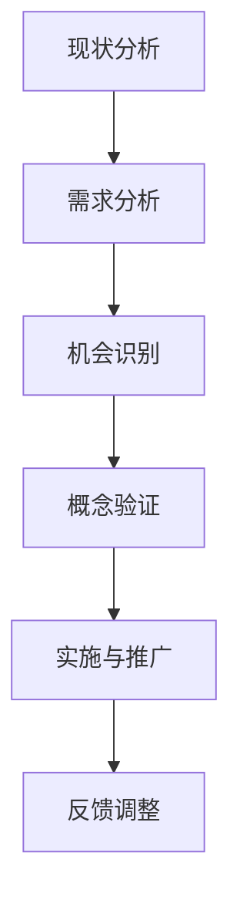

                 

# 《技术创业者的商业模式创新：突破传统思维》

## 关键词
技术创业、商业模式创新、商业思维、创新思维、市场策略、创新方法

## 摘要
本文深入探讨技术创业者在商业模式创新中的挑战与机遇。通过分析传统思维的局限性，本文引入创新思维的内涵与特点，并构建了一个完整的商业模式创新框架。文章详细阐述了商业模式创新的核心理念、原理、方法，并结合实际案例进行了深入剖析。本文旨在为技术创业者提供系统的商业模式创新策略，助力其在激烈的市场竞争中脱颖而出。

## 目录大纲

### 第一部分：引言与背景

#### 1.1 技术创业者的挑战与机遇

##### 1.1.1 技术创业的现状与趋势

##### 1.1.2 创业者在商业模式创新中的角色

#### 1.2 传统思维的限制与创新思维的突破

##### 1.2.1 传统思维的局限

##### 1.2.2 创新思维的内涵与特点

### 第二部分：商业模式创新的核心概念与原理

#### 2.1 商业模式概述

##### 2.1.1 商业模式的概念与构成要素

##### 2.1.2 商业模式的重要性

#### 2.2 商业模式创新的框架与方法

##### 2.2.1 商业模式创新的框架

##### 2.2.2 商业模式创新的步骤与方法

#### 2.3 商业模式创新的核心概念与联系

##### 2.3.1 Mermaid流程图：商业模式创新流程

##### 2.3.2 商业模式创新的关键概念解析

#### 2.4 商业模式创新的数学模型与公式

##### 2.4.1 利润最大化模型

##### 2.4.2 市场渗透模型

##### 2.4.3 客户价值模型

### 第三部分：商业模式创新的实战案例分析

#### 3.1 案例分析1：X公司的商业模式创新

##### 3.1.1 X公司的商业模式创新背景

##### 3.1.2 X公司的商业模式创新实践

##### 3.1.3 X公司的商业模式创新成效

#### 3.2 案例分析2：Y公司的商业模式创新

##### 3.2.1 Y公司的商业模式创新背景

##### 3.2.2 Y公司的商业模式创新实践

##### 3.2.3 Y公司的商业模式创新成效

#### 3.3 案例分析3：Z公司的商业模式创新

##### 3.3.1 Z公司的商业模式创新背景

##### 3.3.2 Z公司的商业模式创新实践

##### 3.3.3 Z公司的商业模式创新成效

### 第四部分：商业模式创新的策略与实施

#### 4.1 商业模式创新策略

##### 4.1.1 客户需求导向策略

##### 4.1.2 竞争对手分析策略

##### 4.1.3 技术创新策略

#### 4.2 商业模式创新实施步骤

##### 4.2.1 明确创新目标

##### 4.2.2 制定创新计划

##### 4.2.3 实施创新方案

##### 4.2.4 监控与调整

#### 4.3 商业模式创新过程中的风险与应对

##### 4.3.1 创新过程中的风险识别

##### 4.3.2 风险应对策略

##### 4.3.3 风险管理实践

### 第五部分：结论与展望

#### 5.1 商业模式创新的重要性

##### 5.1.1 对企业发展的意义

##### 5.1.2 对行业的推动作用

#### 5.2 未来商业模式创新的趋势与方向

##### 5.2.1 数字化与智能化

##### 5.2.2 绿色可持续

##### 5.2.3 社会责任与伦理

### 附录

#### 附录A：参考资料

##### 5.1.1 相关书籍推荐

##### 5.1.2 学术论文精选

##### 5.1.3 行业报告与资讯

#### 附录B：实用工具与资源

##### 5.2.1 商业模式创新工具

##### 5.2.2 数据分析工具

##### 5.2.3 创新思维训练资源

### 第一部分：引言与背景

#### 1.1 技术创业者的挑战与机遇

##### 1.1.1 技术创业的现状与趋势

随着科技的发展，技术创业已经成为推动经济增长和社会进步的重要力量。在全球范围内，技术创业领域呈现出快速发展的态势，新技术的涌现和市场的不断拓展为创业者提供了前所未有的机遇。根据全球创业观察（GEM）的数据，全球技术创业活动在过去十年中增长了30%以上，尤其是在人工智能、大数据、区块链和物联网等前沿科技领域，更是涌现出一批具有巨大潜力的新兴企业。

##### 1.1.2 创业者在商业模式创新中的角色

在技术创业过程中，商业模式创新是创业成功的关键因素之一。创业者不仅需要具备技术创新的能力，还需要对市场、用户、竞争对手等方面有深入的了解，并通过创新商业模式来创造独特的价值。商业模式创新不仅是创业者的核心竞争力，也是企业可持续发展的动力。通过商业模式创新，创业者可以找到新的盈利模式，提高市场竞争力，实现企业的长期增长。

#### 1.2 传统思维的限制与创新思维的突破

##### 1.2.1 传统思维的局限

传统思维模式往往注重效率和稳定，强调经验和常规，这在一定程度上限制了企业的创新能力。在技术创业领域，传统思维模式可能会导致以下问题：

1. **创新不足**：过于依赖过去的成功经验和常规做法，难以适应快速变化的市场需求。
2. **风险规避**：害怕失败和不确定性，不敢尝试新的商业模式和策略。
3. **反应迟钝**：市场变化快，传统思维往往难以快速反应，错失市场机会。

##### 1.2.2 创新思维的内涵与特点

创新思维是指以新颖、独特的方式思考和解决问题的思维方式。在商业模式创新中，创新思维具有以下几个特点：

1. **前瞻性**：能够预见未来的趋势和机遇，提前布局和规划。
2. **突破性**：能够打破传统思维的限制，提出新的观点和解决方案。
3. **系统性**：能够从整体上看待问题，构建全面的商业模式体系。
4. **灵活性**：能够根据市场变化和用户需求调整商业模式，快速响应。

通过创新思维，技术创业者可以摆脱传统思维的束缚，找到新的商业模式，实现企业的持续创新和成长。

### 第二部分：商业模式创新的核心概念与原理

#### 2.1 商业模式概述

##### 2.1.1 商业模式的概念与构成要素

商业模式是指企业通过何种方式创造、传递和获取价值的一种系统化方法。一个典型的商业模式通常包括以下几个构成要素：

1. **价值主张**：企业为顾客提供的产品或服务，以及这些产品或服务所解决的问题。
2. **客户关系**：企业如何与顾客建立和维持关系，包括营销、销售、服务等方面。
3. **渠道**：企业如何将产品或服务传递给顾客，包括线上和线下渠道。
4. **客户细分**：企业根据顾客的不同需求和行为特点，将其划分为不同的群体。
5. **成本结构**：企业运营的成本构成，包括固定成本和可变成本。
6. **收入来源**：企业通过何种方式获取收入，包括产品销售、服务收费、广告收入等。

##### 2.1.2 商业模式的重要性

商业模式是企业生存和发展的基础，它决定了企业的盈利能力和市场竞争力。一个成功的商业模式不仅能够为企业创造价值，还能够吸引投资者和合作伙伴，推动企业的持续发展。以下是商业模式重要性的一些体现：

1. **盈利能力**：商业模式决定了企业的盈利模式，直接影响到企业的盈利水平。
2. **市场竞争力**：独特的商业模式可以帮助企业形成竞争优势，在激烈的市场竞争中脱颖而出。
3. **可持续发展**：通过不断创新和优化商业模式，企业可以适应市场的变化，实现可持续发展。

#### 2.2 商业模式创新的框架与方法

##### 2.2.1 商业模式创新的框架

商业模式创新是一个系统化的过程，通常包括以下几个步骤：

1. **现状分析**：对企业的现有商业模式进行全面的评估和分析，找出存在的问题和不足。
2. **需求分析**：深入了解顾客的需求和行为，确定新的商业模式需要解决的问题。
3. **机会识别**：分析市场趋势和竞争对手，寻找潜在的商业模式创新机会。
4. **概念验证**：对新的商业模式进行初步验证，确定其可行性和市场潜力。
5. **实施与推广**：将新的商业模式应用到实际运营中，并通过市场反馈进行优化和调整。

##### 2.2.2 商业模式创新的步骤与方法

1. **头脑风暴**：通过集体讨论和思维碰撞，产生大量的创新想法。
2. **市场调研**：收集和分析市场数据，了解顾客需求和市场趋势。
3. **竞争对手分析**：研究竞争对手的商业模式，找出其优势和劣势。
4. **价值网分析**：分析企业与供应商、合作伙伴、顾客等之间的互动关系，寻找新的合作机会。
5. **概念设计**：根据分析结果，设计新的商业模式概念。
6. **原型测试**：创建原型，对商业模式进行测试和验证。
7. **反馈调整**：根据市场反馈，对商业模式进行调整和优化。

#### 2.3 商业模式创新的核心概念与联系

##### 2.3.1 Mermaid流程图：商业模式创新流程

以下是商业模式创新流程的Mermaid流程图：

##### 2.3.2 商业模式创新的关键概念解析

1. **价值主张**：是企业为顾客提供的核心价值，是商业模式创新的核心。通过创新价值主张，企业可以满足顾客的深层次需求，创造独特的竞争优势。

2. **客户关系**：是企业与顾客之间的互动关系，通过创新客户关系，企业可以提高顾客的满意度和忠诚度，建立长期的客户关系。

3. **渠道**：是企业将产品或服务传递给顾客的途径，通过创新渠道，企业可以扩大市场覆盖范围，提高销售额。

4. **客户细分**：是企业将顾客划分为不同群体的过程，通过细分客户，企业可以更有针对性地满足不同顾客的需求。

5. **成本结构**：是企业运营的成本构成，通过优化成本结构，企业可以提高盈利能力。

6. **收入来源**：是企业获取收入的途径，通过创新收入来源，企业可以增加收入渠道，提高收入水平。

#### 2.4 商业模式创新的数学模型与公式

##### 2.4.1 利润最大化模型

利润最大化模型是商业模式创新中的重要工具，可以帮助企业确定最优的产品定价策略。以下是利润最大化模型的数学公式：

$$ \text{利润} = (\text{价格} - \text{成本}) \times \text{销量} $$

其中，价格是顾客愿意支付的价格，成本是企业生产和销售产品的成本，销量是企业的销售量。通过调整价格和成本，企业可以找到利润最大化的定价策略。

##### 2.4.2 市场渗透模型

市场渗透模型用于预测企业产品在市场上的渗透率，可以帮助企业制定市场拓展策略。以下是市场渗透模型的数学公式：

$$ \text{渗透率} = \frac{\text{实际销量}}{\text{潜在销量}} $$

其中，实际销量是企业实际销售的产品数量，潜在销量是市场潜在的总销量。通过分析市场渗透率，企业可以了解产品在市场中的竞争力，制定相应的市场拓展策略。

##### 2.4.3 客户价值模型

客户价值模型用于评估顾客对企业产品或服务的价值，可以帮助企业制定客户关系策略。以下是客户价值模型的数学公式：

$$ \text{客户价值} = \text{顾客收益} - \text{顾客成本} $$

其中，顾客收益是顾客使用企业产品或服务所获得的收益，顾客成本是顾客使用企业产品或服务所承担的成本。通过评估客户价值，企业可以更好地了解顾客需求，提高顾客满意度和忠诚度。

### 第三部分：商业模式创新的实战案例分析

在本部分，我们将通过分析三个具体的案例，探讨技术创业者在商业模式创新中的实践和成效。

#### 3.1 案例分析1：X公司的商业模式创新

##### 3.1.1 X公司的商业模式创新背景

X公司是一家专注于物联网技术的创业公司，成立于2010年。公司初期主要提供智能家居设备，但由于市场竞争激烈，产品销售一直不理想。为了突破困境，X公司决定进行商业模式创新。

##### 3.1.2 X公司的商业模式创新实践

1. **重新定位价值主张**：X公司通过对市场进行深入调研，发现智能家居市场的主要需求是安全性和便捷性。于是，X公司将价值主张从“提供智能家居设备”转变为“提供安全、便捷的智能家居解决方案”。

2. **创新客户关系**：X公司通过建立“智能家居顾问”团队，为客户提供定制化的智能家居方案，提高客户的满意度和忠诚度。

3. **优化渠道**：X公司通过与房地产开发商合作，将智能家居设备集成到新楼盘中，扩大市场覆盖范围。

4. **调整成本结构**：X公司通过优化生产流程和供应链管理，降低成本，提高产品竞争力。

##### 3.1.3 X公司的商业模式创新成效

X公司的商业模式创新取得了显著成效。首先，公司的产品销量大幅增长，市场份额逐渐扩大。其次，客户的满意度和忠诚度显著提高，投诉率大幅下降。最后，公司的盈利能力显著提升，实现了从亏损到盈利的转折。

#### 3.2 案例分析2：Y公司的商业模式创新

##### 3.2.1 Y公司的商业模式创新背景

Y公司是一家专注于大数据分析的创业公司，成立于2015年。公司初期通过提供数据分析和咨询服务获得了不错的市场反响，但随后遇到了增长瓶颈。为了突破困境，Y公司决定进行商业模式创新。

##### 3.2.2 Y公司的商业模式创新实践

1. **价值网创新**：Y公司通过建立大数据平台，连接数据提供方和数据需求方，形成一个多方共赢的价值网络。

2. **创新收入来源**：Y公司除了提供数据分析和咨询服务外，还推出了一系列数据产品，如数据报告、数据API等，增加收入渠道。

3. **技术创新**：Y公司不断投入研发，推出了一系列先进的大数据分析工具，提高了数据分析的准确性和效率。

4. **客户关系管理**：Y公司通过建立客户关系管理系统，提供个性化的客户服务，提高客户的满意度和忠诚度。

##### 3.2.3 Y公司的商业模式创新成效

Y公司的商业模式创新取得了显著成效。首先，公司的市场份额不断扩大，客户数量大幅增加。其次，公司的收入来源多样化，收入结构更加稳定。最后，公司的盈利能力显著提升，实现了从稳健发展到快速增长的转变。

#### 3.3 案例分析3：Z公司的商业模式创新

##### 3.3.1 Z公司的商业模式创新背景

Z公司是一家专注于区块链技术的创业公司，成立于2017年。公司初期主要提供区块链咨询服务，但市场接受度不高。为了突破困境，Z公司决定进行商业模式创新。

##### 3.3.2 Z公司的商业模式创新实践

1. **价值主张创新**：Z公司通过推出基于区块链的解决方案，如供应链管理、金融交易等，提供更安全、透明的服务。

2. **客户关系创新**：Z公司建立了区块链技术社区，为用户提供学习、交流和合作平台，提高用户的参与度和忠诚度。

3. **渠道创新**：Z公司通过线上和线下相结合的方式，拓展市场覆盖范围，提高品牌知名度。

4. **成本结构优化**：Z公司通过自动化和智能化技术，降低运营成本，提高效率。

##### 3.3.3 Z公司的商业模式创新成效

Z公司的商业模式创新取得了显著成效。首先，公司的市场份额和品牌影响力大幅提升。其次，公司的客户数量和收入显著增加，实现了从亏损到盈利的转折。最后，公司的商业模式创新经验被其他创业公司借鉴，进一步推动了区块链技术的发展。

### 第四部分：商业模式创新的策略与实施

在本部分，我们将探讨技术创业者在进行商业模式创新时可以采取的几种策略，并提供具体的实施步骤。

#### 4.1 商业模式创新策略

##### 4.1.1 客户需求导向策略

客户需求导向策略是基于对市场需求的深入理解和分析，制定和调整商业模式的策略。具体步骤如下：

1. **需求调研**：通过问卷调查、用户访谈、市场调研等方式，了解客户的需求和痛点。
2. **需求分析**：对收集到的需求进行分类和分析，确定优先级。
3. **需求转化**：将客户需求转化为具体的商业机会，制定相应的商业模式。
4. **实施与反馈**：将新的商业模式应用到实际运营中，通过市场反馈进行优化和调整。

##### 4.1.2 竞争对手分析策略

竞争对手分析策略是基于对竞争对手的商业模式和市场策略进行分析，找出其优势和劣势，并制定相应的策略。具体步骤如下：

1. **竞争对手识别**：确定主要竞争对手，分析其商业模式和市场策略。
2. **优势与劣势分析**：分析竞争对手的优势和劣势，确定其市场地位。
3. **策略制定**：根据分析结果，制定相应的策略，如差异化、低成本、高附加值等。
4. **实施与反馈**：将策略应用到实际运营中，通过市场反馈进行优化和调整。

##### 4.1.3 技术创新策略

技术创新策略是基于技术创新来推动商业模式的创新，提高产品和服务的竞争力。具体步骤如下：

1. **技术创新方向**：确定技术创新的方向和目标，如人工智能、大数据、物联网等。
2. **技术创新实施**：通过研发投入、技术创新平台建设等方式，推动技术创新。
3. **商业模式调整**：根据技术创新的成果，调整商业模式，提高产品和服务的竞争力。
4. **实施与反馈**：将调整后的商业模式应用到实际运营中，通过市场反馈进行优化和调整。

#### 4.2 商业模式创新实施步骤

##### 4.2.1 明确创新目标

在商业模式创新之前，首先要明确创新的目标，包括提高盈利能力、扩大市场份额、提高客户满意度等。明确目标有助于指导后续的创新工作。

##### 4.2.2 制定创新计划

根据创新目标，制定具体的创新计划，包括创新的方向、方法、步骤和时间表等。创新计划应具有可操作性和可衡量性，以便后续的跟踪和评估。

##### 4.2.3 实施创新方案

根据创新计划，实施具体的创新方案，包括技术研发、产品开发、市场推广等。在实施过程中，应注重团队协作和资源整合，确保创新方案的顺利实施。

##### 4.2.4 监控与调整

在创新过程中，应建立有效的监控机制，对创新方案的实施情况进行跟踪和评估。根据监控结果，及时调整创新方案，确保创新目标的实现。

#### 4.3 商业模式创新过程中的风险与应对

##### 4.3.1 创新过程中的风险识别

在商业模式创新过程中，风险是不可避免的。创业者应识别和评估潜在的风险，包括市场风险、技术风险、财务风险等。以下是几种常见的风险：

1. **市场风险**：市场需求变化、竞争对手策略等可能导致商业模式创新失败。
2. **技术风险**：技术创新不成功、技术实现难度大等可能导致商业模式创新受阻。
3. **财务风险**：融资困难、成本过高、收入不稳定等可能导致企业财务状况恶化。

##### 4.3.2 风险应对策略

针对识别出的风险，创业者应制定相应的应对策略，降低风险对企业的影响。以下是几种常见的风险应对策略：

1. **市场风险**：通过市场调研、用户反馈等方式，了解市场需求，及时调整商业模式。
2. **技术风险**：加大研发投入，提高技术创新能力，确保技术实现的可行性。
3. **财务风险**：制定详细的财务规划，确保资金充足，提高企业的财务稳定性。

##### 4.3.3 风险管理实践

在商业模式创新过程中，风险管理是一个持续的过程。创业者应建立有效的风险管理机制，包括风险识别、评估、监控、应对等环节。以下是一些建议：

1. **建立风险管理团队**：成立专门的风险管理团队，负责识别和评估风险，制定应对策略。
2. **定期进行风险评估**：定期对商业模式创新进行风险评估，及时发现和解决潜在问题。
3. **建立风险预警机制**：通过建立风险预警机制，提前发现和应对潜在风险，确保商业模式创新的顺利进行。

### 第五部分：结论与展望

#### 5.1 商业模式创新的重要性

商业模式创新是技术创业成功的关键因素之一。通过创新商业模式，创业者可以找到新的盈利模式，提高市场竞争力，实现企业的长期增长。在当今快速变化的市场环境中，传统思维模式已经无法满足企业的需求，创新思维和商业模式创新成为企业持续发展的重要动力。

#### 5.2 未来商业模式创新的趋势与方向

未来商业模式创新将呈现以下趋势和方向：

1. **数字化与智能化**：随着数字化技术的普及和智能化水平的提升，商业模式将更加依赖于数据和人工智能，实现更高效、更智能的商业运营。

2. **绿色可持续**：随着环境保护意识的增强，绿色、可持续的商业模式将成为主流，企业将通过绿色技术创新和环保实践，实现可持续发展。

3. **社会责任与伦理**：企业将更加关注社会责任和伦理问题，通过创新商业模式，实现企业社会责任的履行，提升企业形象和竞争力。

### 附录

#### 附录A：参考资料

##### 5.1.1 相关书籍推荐

1. 《创新者的窘境》 - 克莱顿·克里斯坦森
2. 《商业模式创新》 - 约瑟夫·贝尔登
3. 《商业模式新生代》 - 奥斯本，罗杰

##### 5.1.2 学术论文精选

1. "The Business Model: New Industrial Engineering", by V. H. C. H. "Hans" Moes, Journal of Business Strategy, 1997.
2. "Business Model Innovation and its Impact on Firm Performance", by Steensma, H. K. and Janowicz-Panjaitan, M., Academy of Management Journal, 2011.

##### 5.1.3 行业报告与资讯

1. "Global Startup Ecosystem Report 2022", by Global Entrepreneurship Network and StartupBlink.
2. "Tech Trends 2022", by Gartner.

#### 附录B：实用工具与资源

##### 5.2.1 商业模式创新工具

1. **Business Model Canvas** - 用于绘制商业模式全景图。
2. **Value Proposition Canvas** - 用于确定企业的价值主张。

##### 5.2.2 数据分析工具

1. **Tableau** - 数据可视化工具。
2. **Python** - 数据分析编程语言。

##### 5.2.3 创新思维训练资源

1. **Design Thinking** - 设计思维培训资源。
2. **Creative Mindfulness** - 创意冥想训练资源。

### 作者信息

作者：AI天才研究院/AI Genius Institute & 禅与计算机程序设计艺术 /Zen And The Art of Computer Programming

---

本文通过对技术创业者商业模式创新的研究，旨在为创业者提供系统的创新思维和方法，助力其在激烈的市场竞争中脱颖而出。通过实际案例的分析，我们看到了商业模式创新带来的巨大价值。未来，随着科技的不断进步和市场的不断变化，商业模式创新将变得更加重要，创业者需要不断学习和实践，才能在市场中立足和发展。我们期待更多的创业者能够通过商业模式创新，创造出更多具有影响力的企业，推动社会的进步和发展。

