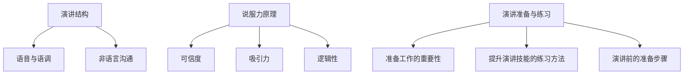

                 

### 第一部分: 技术创业者的商业演讲技巧与说服力提升

#### 第1章: 商业演讲技巧与说服力概述

商业演讲是一种强有力的工具，它能帮助技术创业者向潜在投资者、合作伙伴和客户传达他们的理念、愿景和业务计划。有效的商业演讲不仅能够提升企业的品牌形象，还能在激烈的市场竞争中脱颖而出。因此，掌握商业演讲技巧和提升说服力对于技术创业者来说至关重要。

首先，商业演讲的重要性体现在以下几个方面：

- **对企业发展的作用**：通过商业演讲，创业者可以向投资者、合作伙伴和客户展示企业的核心竞争力、市场前景和未来规划，从而吸引资源、扩大合作机会，推动企业的快速发展。

- **对个人职业发展的帮助**：具备出色的演讲能力和说服力，有助于创业者提升个人品牌，增强职业竞争力，成为行业内的领军人物。

接下来，让我们探讨一下演讲技巧和说服力的基本概念。

##### 1.2 演讲技巧概述

一个成功的商业演讲通常需要具备以下三个方面：

- **演讲结构**：演讲结构如同建筑物的框架，它决定了演讲的流畅性和逻辑性。常见的演讲结构包括引言、正文和结论。

- **语音与语调**：语音与语调是演讲的重要元素，它们能够传递演讲者的情感和态度。演讲时要注意音量的控制、语速的适中以及语调的变化。

- **非语言沟通**：非语言沟通包括肢体语言、面部表情和姿态等，这些元素能够增强演讲的说服力和感染力。例如，眼神交流、手势和姿态等都能帮助演讲者更好地与听众建立联系。

##### 1.3 说服力原理

说服力是商业演讲的核心要素之一。它不仅仅是语言的技巧，更是一种心理和情感的交流。以下是说服力的定义与构成：

- **说服力的定义**：说服力是指通过言语、情感、逻辑等手段影响他人思想和行为的能力。

- **说服力的构成**：说服力由三个基本要素构成，即可信度、吸引力和逻辑性。

  - **可信度**：演讲者的可信度越高，听众越容易接受其观点。
  - **吸引力**：演讲的内容和表达方式要能够吸引听众的注意力，激发他们的兴趣。
  - **逻辑性**：演讲的结构要清晰，论点要合理，逻辑要严密，这样才能使听众信服。

心理学在说服力中的应用也至关重要。通过了解人类心理和行为的基本原理，演讲者可以更好地设计演讲内容，提高说服效果。例如，情感诉求和故事化表达都是基于心理学原理的有效说服策略。

此外，情感与逻辑的结合是提升说服力的重要手段。情感能够引发听众的共鸣，逻辑则能够使演讲更具说服力。只有将二者结合起来，才能使演讲产生最大化的效果。

##### 1.4 演讲准备与练习

演讲的准备和练习是成功演讲的必要前提。一个有效的演讲往往离不开充分的准备工作。以下是演讲准备和练习的一些关键步骤：

- **准备工作的重要性**：准备工作决定了演讲的质量和效果。充分准备可以增强演讲者的自信心，降低演讲时的紧张感，提高演讲的说服力。

- **提升演讲技能的练习方法**：可以通过以下几种方法提升演讲技能：

  - **模拟练习**：在熟悉的环境中进行模拟演讲，可以帮助演讲者熟悉演讲内容，提高表达能力。
  - **录音和视频录制**：通过录音或视频录制，演讲者可以回放自己的演讲，发现问题并进行改进。
  - **加入演讲俱乐部**：如Toastmasters International等演讲俱乐部，提供了良好的实践平台和反馈机制，有助于演讲者不断提升。

- **演讲前的准备步骤**：演讲前要做好以下准备工作：

  - **明确目标**：确定演讲的目的和目标听众，有助于演讲者更有针对性地准备内容。
  - **制定演讲大纲**：列出演讲的主要论点和支撑材料，确保演讲内容的连贯性和逻辑性。
  - **准备演讲稿**：撰写演讲稿，并将其熟记于心，以便在演讲时能够流畅地表达。
  - **排练**：在演讲前进行充分的排练，有助于演讲者熟悉演讲流程，增强自信心。

通过充分的准备和练习，技术创业者可以在商业演讲中更好地展现自己的专业素养和说服力，从而实现演讲的目标。

---

**总结**：

商业演讲对技术创业者的企业发展和个人职业发展具有重要作用。掌握演讲技巧和提升说服力是技术创业者必备的能力。了解演讲技巧概述、说服力原理以及演讲准备与练习的方法，将为技术创业者在商业演讲中取得成功奠定基础。

---

**核心概念与联系**：

商业演讲的核心概念包括演讲结构、语音与语调、非语言沟通、说服力的构成（可信度、吸引力和逻辑性）以及演讲准备与练习的方法。这些概念相互关联，共同构成了一个完整的商业演讲框架。

**Mermaid 流程图**：



---

**核心算法原理讲解**：

在商业演讲中，核心算法原理主要涉及如何有效地传达信息、增强说服力和提高演讲效果。以下是一个简单的伪代码框架，用于指导演讲者如何构建一个有效的演讲：

```plaintext
function EffectiveSpeech(content, audience, goal)
    // 确定演讲内容
    define_content(content)
    // 分析目标听众
    analyze_audience(audience)
    // 设计演讲结构
    define_structure()
    // 选择合适的语音与语调
    select_voice_and_tone()
    // 运用非语言沟通技巧
    use_nonverbal_communication()
    // 构建可信度
    build_credibility()
    // 增强吸引力
    increase_attractiveness()
    // 确保逻辑性
    ensure_logic()
    // 进行演讲准备与练习
    prepare_and_practice()
    // 演讲实施
    deliver_speech()
    // 获取反馈
    get_feedback()
    // 改进演讲技巧
    improve_skills()
    return success
```

---

**数学模型和公式**：

在商业演讲中，逻辑性和说服力的增强可以通过以下公式来表示：

\[ P = C \times A \times L \]

其中：
- \( P \) 表示说服力（Persuasiveness）
- \( C \) 表示可信度（Credibility）
- \( A \) 表示吸引力（Attractiveness）
- \( L \) 表示逻辑性（Logic）

这个公式说明了说服力是可信度、吸引力和逻辑性的乘积。演讲者需要在这三个方面均衡发展，以实现最佳的说服效果。

**详细讲解与举例说明**：

假设一位技术创业者需要向潜在投资者介绍他们的新项目。通过应用上述公式，他们可以采取以下步骤：

1. **提高可信度**：通过提供真实的数据、案例研究和行业洞察，展示项目的可行性和潜在价值。
2. **增强吸引力**：通过讲述一个引人入胜的故事，描述项目如何解决用户的问题，激发投资者的兴趣。
3. **确保逻辑性**：通过清晰的演讲结构、逻辑严密的论点和支持数据，使投资者能够理解并信服项目的价值。

例如，在演讲中，创业者可以首先介绍项目的背景和市场需求，然后展示项目的技术优势和竞争优势，最后提出详细的商业计划和预期收益。通过这样的结构，创业者能够有效地提高项目的说服力，吸引投资者的关注。

---

**项目实战**：

在实际操作中，一位技术创业者通过上述方法进行了一次成功的商业演讲。以下是该创业者演讲的简要流程：

1. **开场白**：用一段引人入胜的故事吸引听众的注意力。
2. **介绍项目背景**：简要介绍项目的起源、目标和市场定位。
3. **展示技术优势**：详细讲解项目的核心技术，说明其创新性和竞争优势。
4. **阐述商业计划**：提出详细的商业模型、市场策略和资金需求。
5. **回答听众提问**：针对听众的疑问，提供详细的解答，增强可信度。
6. **总结与呼吁**：重申项目的优势和潜力，呼吁投资者参与。

通过这次演讲，创业者成功地吸引了多位潜在投资者的兴趣，获得了项目所需的资金支持，推动了企业的发展。

---

通过以上详细讲解和实例分析，我们可以看到商业演讲技巧和说服力在技术创业中的重要作用。掌握这些技巧，能够帮助技术创业者在商业演讲中脱颖而出，实现企业的快速发展。在下一章中，我们将深入探讨商业演讲的核心技巧，包括故事化表达、数据可视化、针对性说服和控场与应对策略等。敬请期待！

---

**作者信息**：

作者：AI天才研究院/AI Genius Institute & 禅与计算机程序设计艺术 /Zen And The Art of Computer Programming

---

**参考文献**：

1. 克里斯·安德森（Chris Anderson）。《演讲的力量：如何用故事和数字赢得人心》（"Talk Like TED: The 9 Public Speaking Habits of the World's Top Minds"）。
2. 斯坦利·迪肯（Stanley J. Durbin）。《说服力：影响力与说服技巧》（"The Art of Persuasion: A crash course in effective influence and persuasion"）。
3. 戴维·迈尔斯（David Myers）。《社会心理学》（"Social Psychology"）。

