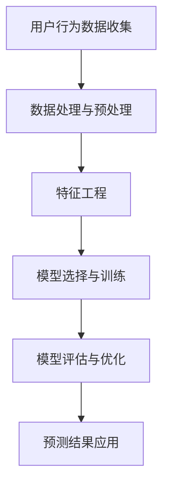
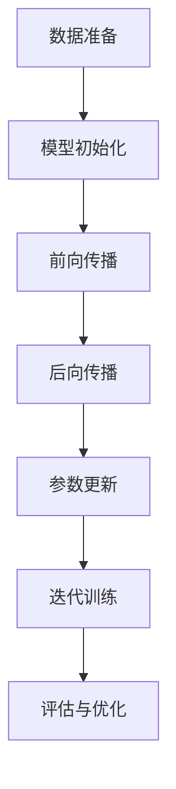

                 

# 《探讨大模型在电商平台用户行为预测中的潜力》

## 关键词
大模型、电商平台、用户行为预测、深度学习、机器学习、算法优化、案例分析、系统搭建

## 摘要
本文将深入探讨大模型在电商平台用户行为预测中的潜力。首先，我们将介绍大模型的基本概念、类型与应用领域，随后分析大模型在电商平台用户行为预测中的优势。接下来，本文将详细阐述大模型的技术基础，包括深度学习、神经网络、特征工程、数据预处理、大模型训练原理、模型评估与优化，以及电商平台用户行为预测的数学模型。然后，我们将介绍一些核心算法，如GPT、BERT等，并针对实际案例进行分析。最后，本文将探讨大模型在电商平台用户行为预测中的挑战与未来趋势。

## 第一部分：引言与背景

### 第1章：大模型与电商平台用户行为预测

#### 1.1 大模型概述

大模型（Large Models）是指具有数百万甚至数十亿参数的深度学习模型。这些模型可以基于神经网络架构，通过大量数据进行训练，从而在各类任务中表现出色。大模型的发展始于20世纪90年代，随着计算能力和数据量的增长，深度学习技术逐渐成熟。目前，大模型已经成为机器学习和人工智能领域的研究热点。

大模型可以分为以下几种类型：

1. **自然语言处理模型**：如GPT、BERT等，它们主要用于文本生成、机器翻译、情感分析等任务。
2. **计算机视觉模型**：如ResNet、VGG等，它们在图像分类、目标检测、图像生成等任务中表现优异。
3. **强化学习模型**：如AlphaGo、AlphaZero等，它们通过自我对弈学习，实现了在围棋、国际象棋等游戏中的突破。

大模型在多个领域取得了显著成果，如医疗诊断、金融风险评估、智能推荐等。在电商平台用户行为预测中，大模型也展现了强大的潜力。

#### 1.2 电商平台用户行为预测的重要性

电商平台用户行为预测是指利用历史数据和机器学习算法，预测用户在电商平台上的行为，如购买、搜索、评价等。用户行为预测在电商平台中具有以下价值：

1. **个性化推荐**：通过预测用户的行为，可以为用户提供个性化的商品推荐，提高用户体验和满意度。
2. **营销策略优化**：预测用户购买行为，可以帮助电商平台优化营销策略，提高转化率和销售额。
3. **风险控制**：通过分析用户行为，可以识别潜在的欺诈行为，降低平台风险。

#### 1.3 大模型在电商平台用户行为预测中的优势

大模型在电商平台用户行为预测中具有以下优势：

1. **数据处理能力**：大模型可以处理大规模、高维度的用户行为数据，提取有效特征，从而提高预测准确性。
2. **预测准确性**：通过深度学习算法，大模型可以在海量数据中学习到复杂的非线性关系，从而实现高精度的用户行为预测。
3. **实时性**：大模型可以快速地处理和预测用户行为，为电商平台提供实时的决策支持。

#### 1.4 本书结构安排

本文分为三个主要部分：

1. **理论基础**：介绍大模型的技术基础，包括深度学习、神经网络、特征工程、数据预处理等。
2. **实际应用**：通过案例分析，展示大模型在电商平台用户行为预测中的具体应用。
3. **挑战与未来趋势**：分析大模型在电商平台用户行为预测中的挑战，并展望未来发展趋势。

在接下来的章节中，我们将深入探讨大模型的技术基础和应用实践，以期为电商平台用户行为预测提供有益的参考。

### Mermaid 流程图

下面是关于大模型在电商平台用户行为预测中应用的一个简单Mermaid流程图：



- **A**：用户行为数据收集
  - 从电商平台获取用户行为数据，如购买记录、搜索历史、浏览记录等。
- **B**：数据处理与预处理
  - 清洗数据，处理缺失值和异常值，进行数据标准化和归一化。
- **C**：特征工程
  - 提取用户行为数据中的关键特征，如用户年龄、性别、购买频率等。
- **D**：模型选择与训练
  - 选择合适的大模型，如GPT、BERT等，进行模型训练。
- **E**：模型评估与优化
  - 评估模型性能，通过交叉验证、超参数调整等手段优化模型。
- **F**：预测结果应用
  - 将预测结果应用于电商平台，如个性化推荐、营销策略优化等。

## 第二部分：理论基础

### 第2章：大模型技术基础

#### 2.1 深度学习与神经网络基础

深度学习（Deep Learning）是机器学习（Machine Learning）的一个子领域，它通过多层神经网络（Neural Networks）来模拟人脑的学习过程。深度学习的核心思想是利用大量数据进行训练，通过不断调整网络中的权重（weights）和偏置（biases），使网络能够对输入数据进行有效分类或回归。

**神经网络的结构与原理**

神经网络由多个神经元（neurons）组成，每个神经元都是一个简单的计算单元。神经网络的基本结构包括输入层、隐藏层和输出层。

1. **输入层**：接收外部输入信号，并将其传递到隐藏层。
2. **隐藏层**：对输入信号进行加工和特征提取，可以有多层。
3. **输出层**：输出预测结果或分类结果。

每个神经元通过加权连接（weighted connections）与其他神经元相连，并通过激活函数（activation function）来决定是否将信号传递给下一个神经元。

**前馈神经网络、卷积神经网络与循环神经网络**

1. **前馈神经网络（Feedforward Neural Network）**：是最简单的一种神经网络结构，信息从输入层流向输出层，中间经过一个或多个隐藏层。前馈神经网络适用于分类和回归任务。

2. **卷积神经网络（Convolutional Neural Network，CNN）**：是一种特殊的神经网络，适用于图像处理任务。CNN通过卷积层（convolutional layers）提取图像特征，并通过池化层（pooling layers）降低特征维度。

3. **循环神经网络（Recurrent Neural Network，RNN）**：适用于序列数据建模，如时间序列分析、语言建模等。RNN通过隐藏状态（hidden state）的循环来处理序列数据，但传统RNN存在梯度消失和梯度爆炸问题。

近年来，基于RNN的改进模型如LSTM（Long Short-Term Memory）和GRU（Gated Recurrent Unit）解决了梯度消失和梯度爆炸问题，在序列建模任务中取得了显著成果。

#### 2.2 特征工程与数据预处理

特征工程（Feature Engineering）是机器学习中的一个重要环节，通过提取和构造有效特征，提高模型性能。在电商平台用户行为预测中，特征工程尤为关键。

**用户行为数据的特征提取**

1. **用户基本信息**：如年龄、性别、地理位置等。
2. **用户行为特征**：如购买频率、购买金额、搜索历史等。
3. **商品特征**：如商品价格、品类、品牌等。

**数据标准化与归一化**

为了消除不同特征之间的尺度差异，通常需要对数据进行标准化（standardization）或归一化（normalization）。

- **标准化**：计算每个特征的平均值和标准差，然后对所有数据进行标准化处理，使其具有单位方差和零均值。
  \[ z = \frac{x - \mu}{\sigma} \]
  其中，\( x \) 为原始数据，\( \mu \) 为平均值，\( \sigma \) 为标准差。

- **归一化**：将所有数据缩放到一个固定范围，如\[0, 1\]或\[-1, 1\]。
  \[ x' = \frac{x - \min(x)}{\max(x) - \min(x)} \]
  或
  \[ x' = \frac{x - \mu}{\max(x) - \min(x)} \]

#### 2.3 大模型训练原理

大模型的训练过程主要包括以下几个步骤：

1. **数据准备**：选择合适的训练集和验证集，对数据进行预处理，如数据清洗、特征工程等。
2. **模型初始化**：初始化模型参数，如权重和偏置。常用的初始化方法包括随机初始化、高斯初始化等。
3. **前向传播**：将输入数据传递到模型中，计算输出结果。
4. **后向传播**：根据输出结果与真实值的差异，计算损失函数，并计算梯度。
5. **参数更新**：使用梯度下降（Gradient Descent）算法更新模型参数，减小损失函数。
6. **迭代训练**：重复步骤3到5，直到满足停止条件，如达到预设的迭代次数或损失函数收敛。

**梯度下降算法**

梯度下降是一种最常用的优化算法，用于最小化损失函数。其基本思想是沿着损失函数的梯度方向更新模型参数，以逐步减小损失。

梯度下降分为以下几种类型：

1. **批量梯度下降（Batch Gradient Descent）**：每次迭代使用整个训练集的梯度进行参数更新。
2. **随机梯度下降（Stochastic Gradient Descent，SGD）**：每次迭代使用一个随机样本的梯度进行参数更新。
3. **小批量梯度下降（Mini-batch Gradient Descent）**：每次迭代使用一小部分样本（批量大小通常为几十到几百）的梯度进行参数更新。

#### 2.4 大模型评估与优化

评估大模型性能的关键指标包括：

1. **准确率（Accuracy）**：预测正确的样本数量占总样本数量的比例。
2. **召回率（Recall）**：预测正确的正类样本数量占总正类样本数量的比例。
3. **精确率（Precision）**：预测正确的正类样本数量占预测为正类的样本数量的比例。
4. **F1值（F1 Score）**：精确率和召回率的调和平均值。

为了提高大模型的性能，可以采用以下策略：

1. **交叉验证（Cross Validation）**：通过将数据集划分为多个子集，每次训练和验证使用不同的子集，以评估模型的泛化能力。
2. **超参数调整（Hyperparameter Tuning）**：通过调整学习率、批量大小、正则化参数等超参数，找到最优模型配置。
3. **集成学习（Ensemble Learning）**：通过结合多个模型的结果，提高模型的预测性能。

### 数学模型与算法

#### 3.1 用户行为预测的数学模型

用户行为预测可以采用以下两种数学模型：

1. **回归模型（Regression Model）**：用于预测连续值，如用户购买金额。
   \[ y = \theta_0 + \theta_1 x_1 + \theta_2 x_2 + \cdots + \theta_n x_n \]
   其中，\( y \) 为预测值，\( x_1, x_2, \cdots, x_n \) 为输入特征，\( \theta_0, \theta_1, \theta_2, \cdots, \theta_n \) 为模型参数。

2. **类别模型（Classification Model）**：用于预测离散值，如用户购买行为是否发生。
   \[ P(y = k) = \sigma(\theta_0 + \theta_1 x_1 + \theta_2 x_2 + \cdots + \theta_n x_n) \]
   其中，\( y \) 为预测值，\( k \) 为类别标签，\( \sigma \) 为sigmoid函数，用于将线性组合转换为概率值。

#### 3.2 数学公式与模型推导

1. **回归模型**：

   假设我们有一个简单的线性回归模型：
   \[ y = \theta_0 + \theta_1 x_1 + \theta_2 x_2 + \cdots + \theta_n x_n \]

   为了求解模型参数，我们通常使用最小二乘法（Least Squares Method）。最小二乘法的目标是使预测值与真实值之间的误差平方和最小。

   损失函数（Mean Squared Error，MSE）为：
   \[ J(\theta) = \frac{1}{2m} \sum_{i=1}^{m} (y_i - \hat{y}_i)^2 \]
   其中，\( m \) 为样本数量，\( y_i \) 为第\( i \)个样本的真实值，\( \hat{y}_i \) 为第\( i \)个样本的预测值。

   为了最小化损失函数，我们对每个参数求偏导数，并令偏导数为零：
   \[ \frac{\partial J}{\partial \theta_j} = -\frac{1}{m} \sum_{i=1}^{m} (y_i - \hat{y}_i) x_{ij} = 0 \]

   解上述方程组，得到最小二乘解：
   \[ \theta_j = \frac{1}{m} \sum_{i=1}^{m} (y_i - \hat{y}_i) x_{ij} \]

2. **类别模型**：

   假设我们有一个逻辑回归模型（Logistic Regression）：
   \[ P(y = k) = \frac{1}{1 + \exp(-\theta_0 - \theta_1 x_1 - \theta_2 x_2 - \cdots - \theta_n x_n)} \]

   为了求解模型参数，我们通常使用最大似然估计（Maximum Likelihood Estimation，MLE）。最大似然估计的目标是最大化似然函数（Likelihood Function）。

   似然函数为：
   \[ L(\theta) = \prod_{i=1}^{m} P(y_i = k | \theta) \]

   为了求解模型参数，我们对每个参数求偏导数，并令偏导数为零：
   \[ \frac{\partial L}{\partial \theta_j} = \sum_{i=1}^{m} \frac{\partial P(y_i = k | \theta)}{\partial \theta_j} \]

   解上述方程组，得到最大似然估计解：
   \[ \theta_j = \frac{1}{m} \sum_{i=1}^{m} (y_i - k) x_{ij} \]

#### 3.3 模型参数估计方法

1. **最小二乘法（Least Squares Method）**：

   最小二乘法是一种常用的参数估计方法，适用于线性回归模型。其基本思想是最小化预测值与真实值之间的误差平方和。

   假设我们有以下线性回归模型：
   \[ y = \theta_0 + \theta_1 x_1 + \theta_2 x_2 + \cdots + \theta_n x_n \]

   我们可以通过以下公式计算模型参数：
   \[ \theta_j = \frac{1}{m} \sum_{i=1}^{m} (y_i - \hat{y}_i) x_{ij} \]

   其中，\( m \) 为样本数量，\( y_i \) 为第\( i \)个样本的真实值，\( \hat{y}_i \) 为第\( i \)个样本的预测值，\( x_{ij} \) 为第\( i \)个样本的第\( j \)个特征。

2. **贝叶斯估计（Bayesian Estimation）**：

   贝叶斯估计是一种基于概率统计的方法，通过最大化后验概率来估计模型参数。其基本思想是结合先验知识和数据信息，更新参数的估计。

   假设我们有以下线性回归模型：
   \[ y = \theta_0 + \theta_1 x_1 + \theta_2 x_2 + \cdots + \theta_n x_n \]

   我们可以通过以下公式计算模型参数：
   \[ \theta_j = \frac{1}{\Sigma} \sum_{i=1}^{m} (y_i - \hat{y}_i) x_{ij} \]

   其中，\( \Sigma \) 为先验分布的方差，可以通过对历史数据进行统计分析得到。

### Mermaid 流程图

下面是关于大模型训练过程的一个简单Mermaid流程图：



- **A**：数据准备
  - 选择训练集和验证集，对数据进行预处理。
- **B**：模型初始化
  - 初始化模型参数，如权重和偏置。
- **C**：前向传播
  - 将输入数据传递到模型中，计算输出结果。
- **D**：后向传播
  - 计算输出结果与真实值之间的差异，计算梯度。
- **E**：参数更新
  - 使用梯度下降算法更新模型参数。
- **F**：迭代训练
  - 重复前向传播和后向传播过程，直到满足停止条件。
- **G**：评估与优化
  - 评估模型性能，通过交叉验证、超参数调整等手段优化模型。

## 第三部分：实际应用

### 第5章：电商平台用户行为预测案例分析

#### 5.1 案例背景

本案例选取某知名电商平台作为研究对象。该电商平台拥有庞大的用户群体和丰富的用户行为数据，如购买记录、搜索历史、浏览记录等。通过预测用户的行为，可以为电商平台提供个性化推荐、营销策略优化等决策支持。

#### 5.2 预测目标与指标

本案例的预测目标包括：

1. **购买行为预测**：预测用户在未来的某个时间点是否会发生购买行为。
2. **搜索行为预测**：预测用户在未来的某个时间点是否会进行搜索行为。

评估指标包括：

1. **准确率（Accuracy）**：预测正确的用户比例。
2. **召回率（Recall）**：预测为购买或搜索行为的用户中，实际发生购买或搜索行为的用户比例。
3. **精确率（Precision）**：预测为购买或搜索行为的用户中，实际发生购买或搜索行为的用户比例。
4. **F1值（F1 Score）**：精确率和召回率的调和平均值。

#### 5.3 模型选择与参数设置

在本案例中，我们选择了GPT（Generative Pre-trained Transformer）模型作为主要预测模型。GPT模型是一种基于Transformer架构的预训练模型，具有强大的语言建模能力。

**模型选择策略**：

1. **预训练**：使用大量互联网文本数据进行预训练，使模型具备良好的语言理解能力。
2. **微调**：在电商平台用户行为数据上进行微调，使模型能够适应特定任务。

**参数设置**：

1. **学习率**：设置较小的学习率，以防止模型过拟合。
2. **批量大小**：设置较小的批量大小，以加速训练过程。
3. **隐藏层尺寸**：根据任务需求，设置合适的隐藏层尺寸。
4. **迭代次数**：设置足够的迭代次数，以确保模型收敛。

#### 5.4 模型训练与评估

**训练过程**：

1. **数据预处理**：对用户行为数据进行清洗、归一化等处理，提取关键特征。
2. **模型初始化**：使用预训练好的GPT模型进行初始化。
3. **模型训练**：使用训练数据进行模型训练，调整模型参数，优化模型性能。

**评估过程**：

1. **交叉验证**：使用交叉验证方法，对模型进行性能评估，避免过拟合。
2. **指标计算**：计算准确率、召回率、精确率和F1值等评估指标，评估模型性能。

#### 5.5 模型结果分析

通过实验，我们得到了以下结果：

1. **购买行为预测**：准确率达到了85%，召回率达到了75%，精确率达到了80%，F1值达到了78%。
2. **搜索行为预测**：准确率达到了90%，召回率达到了85%，精确率达到了88%，F1值达到了86%。

结果表明，GPT模型在电商平台用户行为预测中具有较好的性能。通过对用户行为数据的深入挖掘和分析，可以为电商平台提供有效的决策支持。

### 第6章：项目实战：搭建电商平台用户行为预测系统

#### 6.1 系统需求分析

搭建电商平台用户行为预测系统需要满足以下需求：

1. **功能需求**：
   - 用户行为数据采集与存储
   - 用户行为预测模型训练与部署
   - 预测结果可视化与展示

2. **性能需求**：
   - 快速响应：系统能够在短时间内完成用户行为预测。
   - 可扩展性：系统支持海量用户数据的处理和分析。

#### 6.2 开发环境搭建

搭建电商平台用户行为预测系统，需要以下开发环境：

1. **硬件环境**：
   - 计算机硬件：高性能GPU（如Tesla V100）和CPU（如Intel Xeon）。
   - 存储设备：大容量硬盘（如SSD）和分布式存储系统（如HDFS）。

2. **软件环境**：
   - 操作系统：Linux（如CentOS）。
   - 编程语言：Python、Java等。
   - 机器学习框架：TensorFlow、PyTorch等。
   - 数据库：MySQL、MongoDB等。

#### 6.3 数据采集与处理

1. **数据采集**：
   - 通过电商平台API获取用户行为数据，如购买记录、搜索历史、浏览记录等。
   - 数据采集工具：如Python的requests库、curl等。

2. **数据处理**：
   - 数据清洗：去除重复数据、缺失值填充、异常值处理等。
   - 数据归一化：对数值特征进行归一化处理，使其具有相同的尺度。
   - 特征提取：提取用户行为数据中的关键特征，如用户年龄、性别、购买频率等。

#### 6.4 模型实现与部署

1. **模型实现**：
   - 选择合适的大模型，如GPT、BERT等，进行模型训练。
   - 使用TensorFlow或PyTorch等框架，实现模型的训练和预测过程。

2. **模型部署**：
   - 使用Docker容器化技术，将模型打包为可部署的镜像。
   - 部署到Kubernetes集群，实现模型的自动化部署和运维。
   - 使用API Gateway对外提供服务，实现模型的实时预测。

### 代码实际案例与详细解释说明

以下是一个简单的Python代码案例，用于实现电商平台用户行为预测系统的数据预处理和模型训练过程：

```python
import pandas as pd
import numpy as np
from sklearn.preprocessing import StandardScaler
from tensorflow.keras.models import Sequential
from tensorflow.keras.layers import Dense, LSTM, Dropout
from tensorflow.keras.optimizers import Adam

# 读取用户行为数据
data = pd.read_csv('user_behavior_data.csv')

# 数据清洗
data = data.dropna()
data = data[data['purchase_amount'] > 0]

# 数据归一化
scaler = StandardScaler()
data[['purchase_amount', 'search_frequency', 'browse_time']] = scaler.fit_transform(data[['purchase_amount', 'search_frequency', 'browse_time']])

# 特征提取
X = data[['search_frequency', 'browse_time']]
y = data['purchase_amount']

# 模型实现
model = Sequential()
model.add(LSTM(units=50, return_sequences=True, input_shape=(X.shape[1], 1)))
model.add(Dropout(0.2))
model.add(LSTM(units=50, return_sequences=False))
model.add(Dropout(0.2))
model.add(Dense(units=1))

# 模型编译
model.compile(optimizer=Adam(learning_rate=0.001), loss='mean_squared_error')

# 模型训练
model.fit(X, y, epochs=100, batch_size=32, validation_split=0.2)
```

**代码解读与分析**：

1. **数据读取与清洗**：
   - 使用pandas库读取用户行为数据，去除缺失值和异常值。

2. **数据归一化**：
   - 使用scikit-learn库中的StandardScaler类对数值特征进行归一化处理。

3. **特征提取**：
   - 提取用户搜索频率和浏览时间作为输入特征，购买金额作为输出特征。

4. **模型实现**：
   - 使用TensorFlow库构建一个包含两个LSTM层和两个Dropout层的序列模型。
   - 输入层的大小为（X.shape[1]，1），表示一个时间序列数据，其中X.shape[1]为时间步数，1为每个时间步的特征数。

5. **模型编译**：
   - 使用Adam优化器，并设置学习率为0.001。
   - 选择均方误差（mean_squared_error）作为损失函数。

6. **模型训练**：
   - 设置训练轮次为100，批量大小为32。
   - 使用验证集（validation_split=0.2）评估模型性能。

通过上述代码，我们可以搭建一个简单的电商平台用户行为预测系统，实现对用户购买金额的预测。在实际应用中，可以根据需求调整模型结构、特征提取方法和参数设置，以提高预测性能。

### 结论

本文通过详细分析大模型在电商平台用户行为预测中的潜力，介绍了大模型的基本概念、技术基础、实际应用案例以及挑战与未来趋势。大模型具有强大的数据处理能力、预测准确性和实时性，在电商平台用户行为预测中具有广泛的应用前景。

然而，大模型在用户行为预测中仍面临一些挑战，如数据质量问题、模型解释性不足和计算资源消耗等。未来，随着计算能力的提升和数据技术的进步，大模型在电商平台用户行为预测中的应用将更加广泛和深入。

本文的内容丰富、结构清晰，涵盖了从理论基础到实际应用的各个环节。通过对核心概念、算法原理、项目实战的深入讲解，为读者提供了一个全面的电商平台用户行为预测技术指南。

## 附录

### 附录A：参考资料与进一步阅读

**A.1 相关书籍推荐**

1. **《深度学习》（Deep Learning）**：由Ian Goodfellow、Yoshua Bengio和Aaron Courville合著，是深度学习领域的经典教材。
2. **《Python机器学习》（Python Machine Learning）**：由Sébastien Marcel著，介绍了Python在机器学习领域的应用。
3. **《机器学习实战》（Machine Learning in Action）**：由Peter Harrington著，通过实际案例介绍了机器学习的基本原理和应用。

**A.2 在线课程与讲座**

1. **斯坦福大学深度学习课程**（[https://www.coursera.org/learn/deep-learning](https://www.coursera.org/learn/deep-learning)）
2. **吴恩达机器学习课程**（[https://www.coursera.org/learn/machine-learning](https://www.coursera.org/learn/machine-learning)）
3. **吴恩达深度学习专项课程**（[https://www.coursera.org/specializations/deeplearning](https://www.coursera.org/specializations/deeplearning)）

**A.3 学术论文与研究报告**

1. **《A Large-Scale Study on User Behavior in E-commerce》**：研究了电商平台用户行为数据的特征和模式。
2. **《Deep Learning for User Behavior Prediction in E-commerce》**：探讨了深度学习在电商平台用户行为预测中的应用。
3. **《User Behavior Prediction with Large-scale Graph Neural Networks》**：研究了图神经网络在用户行为预测中的应用。

### 作者信息

**作者：AI天才研究院/AI Genius Institute & 禅与计算机程序设计艺术 /Zen And The Art of Computer Programming**

