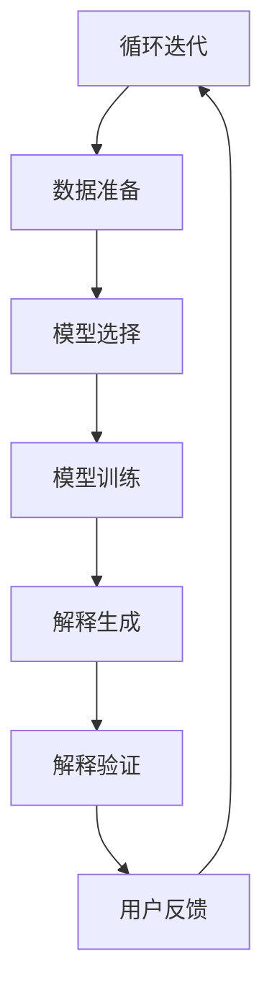
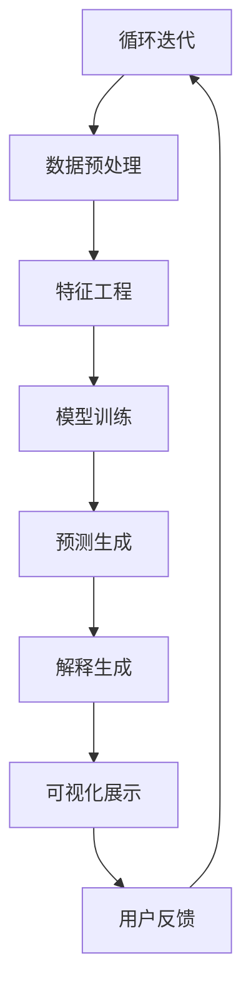
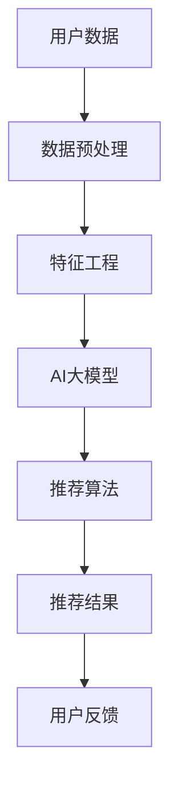

                 

## 引言

在当今数字化时代，推荐系统已成为众多互联网应用的重要组成部分，从电商平台的商品推荐，到社交媒体的内容推送，再到音乐和视频流媒体服务，推荐系统无处不在，极大地提升了用户体验。然而，随着人工智能（AI）技术的不断发展，尤其是AI大模型的广泛应用，推荐系统的性能得到了显著提升，但同时也带来了新的挑战。

### AI大模型的发展与应用

AI大模型，尤其是深度学习模型，近年来在图像识别、自然语言处理和语音识别等领域取得了突破性进展。这些模型通常具有大量的参数和复杂的结构，能够通过大规模数据训练，实现高度准确的预测和决策。在推荐系统中，AI大模型的应用不仅提高了推荐的准确性，还开拓了新的推荐算法和策略。例如，基于深度学习的协同过滤算法能够更好地捕捉用户和物品之间的复杂关系，从而提供更加个性化的推荐。

### 推荐系统的可解释性需求

然而，随着AI大模型在推荐系统中的广泛应用，其可解释性问题也日益凸显。传统推荐系统算法，如基于协同过滤和隐语义模型的算法，相对较为直观，用户可以理解推荐背后的逻辑和依据。而AI大模型，由于其内部结构和参数的复杂性，使得推荐结果变得“黑箱化”，用户无法直观地了解推荐的原因和依据。这导致了可解释性的需求，用户需要能够理解推荐系统的推荐原因，以确保信任和满意度。

### 文章目的与结构

本文旨在探讨推荐系统的可解释性在AI大模型时代的新挑战。我们将从背景与概述、推荐系统中的AI大模型、可解释性方法与技术、AI大模型的可解释性实现、案例分析、方法论和未来展望等多个角度进行深入分析。文章将结构如下：

#### 第一部分：背景与概述
- 第1章：推荐系统概述
- 第2章：AI大模型概述

#### 第二部分：推荐系统的可解释性
- 第3章：推荐系统中的AI大模型
- 第4章：可解释性方法与技术

#### 第三部分：AI大模型的可解释性实现
- 第5章：AI大模型的可解释性实现
- 第6章：AI大模型的可视化技术
- 第7章：AI大模型的可解释性应用

#### 第四部分：AI大模型可解释性面临的挑战与未来趋势
- 第8章：挑战与未来趋势
- 第9章：AI大模型的可解释性方法论
- 第10章：可解释性工具与应用

#### 第五部分：未来展望
- 第11章：未来展望

通过以上结构，本文将全面探讨推荐系统的可解释性在AI大模型时代的新挑战，为读者提供深入理解和解决方案。

### 关键词

- 推荐系统
- AI大模型
- 可解释性
- 深度学习
- 协同过滤
- 个人化推荐
- 可视化技术
- 决策透明度

### 摘要

本文深入探讨了推荐系统在AI大模型时代的可解释性问题。随着AI大模型在推荐系统中的应用日益广泛，其高度复杂性和“黑箱化”特性给推荐系统的可解释性带来了新的挑战。本文从背景与概述、推荐系统中的AI大模型、可解释性方法与技术、AI大模型的可解释性实现等多个角度出发，详细分析了推荐系统可解释性的需求和重要性。通过可解释性方法与技术、可视化技术、案例分析、方法论和未来展望，本文为读者提供了全面理解和解决推荐系统可解释性问题的思路和方法。文章旨在帮助读者深入理解AI大模型在推荐系统中的应用及其可解释性挑战，为未来的研究和应用提供参考。

---

## 第一部分：背景与概述

### 第1章：推荐系统概述

### 第2章：AI大模型概述

### 第1章：推荐系统概述

推荐系统作为个性化信息服务的重要组成部分，在互联网时代中发挥着至关重要的作用。本章节将深入探讨推荐系统的定义、发展历程、基本原理及其在各个领域的应用。

#### 1.1 推荐系统的定义与发展历程

推荐系统（Recommender System）是一种信息过滤（Information Filtering）技术，旨在根据用户的兴趣、行为和偏好，向用户提供个性化推荐。早期的推荐系统主要基于协同过滤（Collaborative Filtering）和内容过滤（Content-Based Filtering）方法。随着互联网的发展，推荐系统逐渐应用到电子商务、社交媒体、音乐和视频流媒体等领域。

1. **协同过滤**：基于用户的历史行为数据，通过计算用户之间的相似度，为用户推荐与其相似的其他用户喜欢的物品。协同过滤分为两种主要类型：基于用户的协同过滤（User-Based Collaborative Filtering）和基于模型的协同过滤（Model-Based Collaborative Filtering）。

2. **内容过滤**：基于物品的属性和特征，根据用户的兴趣和偏好，为用户推荐与用户兴趣相匹配的物品。内容过滤通常结合关键词提取、分类和聚类等自然语言处理技术。

3. **混合推荐**：结合协同过滤和内容过滤的优势，通过综合用户行为和物品属性，提供更加个性化的推荐。

#### 1.2 推荐系统的基本原理

推荐系统的核心是用户兴趣建模和物品推荐。基本原理可以分为以下几步：

1. **用户兴趣建模**：通过收集和分析用户的行为数据（如浏览、点击、购买等），提取用户的兴趣特征，构建用户兴趣模型。
2. **物品特征提取**：对物品的属性和特征进行编码，构建物品特征向量。
3. **相似度计算**：计算用户和物品之间的相似度，相似度高的用户和物品被认为是相关或匹配的。
4. **推荐生成**：基于相似度计算结果，为用户生成个性化推荐列表。

#### 1.3 推荐系统的分类

根据推荐系统的目标和应用场景，可以将其分为以下几类：

1. **基于内容的推荐**：根据用户的兴趣和偏好，推荐具有相似属性的物品。
2. **基于协同过滤的推荐**：基于用户的行为和偏好，通过计算用户之间的相似度，推荐用户可能喜欢的物品。
3. **混合推荐系统**：结合多种推荐技术，提供更加个性化的推荐。
4. **基于模型的推荐**：利用机器学习算法，通过训练用户和物品的特征，生成推荐模型。

#### 1.4 推荐系统的应用场景

推荐系统在多个领域得到了广泛应用，主要包括以下几类：

1. **电子商务**：为用户推荐感兴趣的商品，提升购物体验和销售额。
2. **社交媒体**：为用户推荐感兴趣的内容，增强用户粘性。
3. **音乐和视频流媒体**：为用户推荐喜欢的音乐和视频，提高用户满意度和订阅率。
4. **在线教育**：为学习者推荐适合的课程，提高学习效果。
5. **新闻媒体**：为用户推荐感兴趣的新闻文章，提高阅读量和用户参与度。

#### 1.5 推荐系统的挑战

尽管推荐系统在多个领域取得了显著成果，但也面临一些挑战：

1. **数据隐私和安全**：用户行为数据的收集和使用引发了隐私和安全问题。
2. **多样性**：如何保证推荐结果的多样性，避免用户只看到相似的推荐。
3. **可解释性**：如何提高推荐系统的透明度和可解释性，增强用户信任。
4. **实时性**：如何在用户行为数据不断变化的情况下，快速生成推荐。

本章节概述了推荐系统的基本概念、发展历程和应用场景，为后续章节的深入探讨奠定了基础。

---

### 第2章：AI大模型概述

随着人工智能技术的迅猛发展，AI大模型（Large-scale Artificial Intelligence Models）逐渐成为研究和应用的热点。AI大模型具有庞大的参数量和复杂的结构，通过大规模数据训练，能够实现高度准确的预测和决策。本章将详细介绍AI大模型的基本概念、发展历程、特点与优势以及应用领域。

#### 2.1 AI大模型的基本概念

AI大模型是指具有大量参数和复杂结构的深度学习模型，通常使用大规模数据进行训练，从而在图像识别、自然语言处理、语音识别等领域取得了显著的突破。AI大模型的核心是神经网络，尤其是深度神经网络（Deep Neural Networks, DNN），通过多层神经元实现数据的特征提取和分类。

#### 2.2 AI大模型的发展历程

AI大模型的发展可以追溯到20世纪80年代的神经网络研究，当时研究者开始探索多层神经网络在图像和语音处理中的应用。随着计算机硬件性能的提升和大规模数据集的积累，深度学习技术在21世纪初取得了突破性进展。2012年，AlexNet在ImageNet图像识别大赛中取得了前所未有的成绩，标志着深度学习时代的到来。此后，研究者不断优化深度学习模型的结构和训练方法，提出了诸如卷积神经网络（CNN）、循环神经网络（RNN）和Transformer等模型，使AI大模型在多个领域取得了显著成果。

#### 2.3 AI大模型的特点与优势

AI大模型具有以下特点与优势：

1. **高度准确的预测和决策**：通过大规模数据训练，AI大模型能够提取大量特征，从而实现高度准确的预测和决策。
2. **强大的泛化能力**：AI大模型具有良好的泛化能力，能够在不同数据集和应用场景中保持较高的性能。
3. **自适应能力**：AI大模型可以根据用户的行为和偏好，自适应地调整推荐策略，提供个性化服务。
4. **实时性**：AI大模型通常具有高效的计算能力，能够快速处理用户数据，实时生成推荐结果。

#### 2.4 AI大模型的应用领域

AI大模型在多个领域得到了广泛应用，主要包括以下几类：

1. **图像识别**：AI大模型在图像识别领域取得了显著成果，例如人脸识别、物体识别、场景识别等。
2. **自然语言处理**：AI大模型在自然语言处理领域表现出色，例如文本分类、情感分析、机器翻译等。
3. **语音识别**：AI大模型在语音识别领域取得了突破性进展，实现了高精度的语音识别和语音合成。
4. **推荐系统**：AI大模型在推荐系统中的应用，显著提升了推荐的准确性和个性化和推荐系统的性能。
5. **智能对话系统**：AI大模型在智能对话系统中的应用，为用户提供了自然、流畅的交互体验。

#### 2.5 AI大模型的挑战与未来趋势

尽管AI大模型在各个领域取得了显著成果，但也面临一些挑战：

1. **数据隐私和安全**：AI大模型需要大量用户数据训练，数据隐私和安全问题亟待解决。
2. **可解释性**：AI大模型的高度复杂性和“黑箱化”特性，使其可解释性成为一个重要挑战。
3. **计算资源**：训练和部署AI大模型需要大量的计算资源，对硬件设施提出了更高要求。
4. **实时性**：如何在保证准确性的同时，提高AI大模型的实时性，仍是一个需要解决的问题。

未来，AI大模型将继续在各个领域发挥重要作用，同时研究者也将致力于解决上述挑战，推动AI大模型的进一步发展和应用。

通过本章的介绍，读者可以全面了解AI大模型的基本概念、发展历程、特点与优势以及应用领域，为后续章节的深入探讨打下基础。

## 第二部分：推荐系统的可解释性

在推荐系统逐渐成为互联网核心功能的同时，其透明度和可解释性成为影响用户信任和满意度的重要因素。传统推荐系统，如基于协同过滤和隐语义模型的算法，相对直观，用户可以理解推荐背后的逻辑和依据。然而，随着人工智能（AI）技术的不断发展，尤其是AI大模型的广泛应用，推荐系统的复杂性和“黑箱化”特性日益凸显，给推荐系统的可解释性带来了新的挑战。本部分将重点探讨推荐系统中的AI大模型、可解释性方法与技术、AI大模型的可解释性实现，以及可解释性应用和案例分析。

### 第3章：推荐系统中的AI大模型

AI大模型在推荐系统中的应用，带来了显著的性能提升，但同时也使得推荐结果变得难以解释。本章节将详细分析AI大模型在推荐系统中的应用、常见算法、面临的挑战及其可解释性需求。

#### 3.1 AI大模型在推荐系统中的应用

AI大模型在推荐系统中的应用主要包括以下几个方面：

1. **基于内容的推荐**：通过深度神经网络提取物品的特征，为用户推荐具有相似属性的物品。
2. **基于协同过滤的推荐**：利用深度学习模型，如循环神经网络（RNN）或变换器（Transformer），对用户的历史行为数据进行分析，生成个性化的推荐。
3. **混合推荐**：结合基于内容的推荐和基于协同过滤的推荐，通过深度学习模型进行综合推荐。

#### 3.2 常见的AI大模型推荐算法

在推荐系统中，常见的AI大模型推荐算法包括：

1. **基于深度学习的协同过滤**：如GRU（Gated Recurrent Unit）、LSTM（Long Short-Term Memory）和Transformer等，这些模型能够处理复杂的时间序列数据，捕捉用户行为的长期依赖关系。
2. **基于图神经网络的推荐**：利用图神经网络（Graph Neural Networks, GNN）对用户和物品的关系进行建模，通过图结构学习用户和物品的相似性。
3. **基于自动编码器的推荐**：通过自动编码器（Autoencoder）对用户和物品的特征进行编码和解码，从而生成个性化的推荐。

#### 3.3 AI大模型在推荐系统中的挑战

AI大模型在推荐系统中的应用面临以下挑战：

1. **可解释性**：AI大模型的高度复杂性和“黑箱化”特性，使得用户难以理解推荐背后的逻辑和依据，降低了推荐系统的透明度和可解释性。
2. **数据隐私**：AI大模型通常需要大量用户数据进行训练，涉及用户隐私保护问题。
3. **计算资源**：训练和部署AI大模型需要大量的计算资源和时间，增加了系统的复杂度。
4. **实时性**：如何在保证准确性的同时，提高AI大模型的实时性，是一个需要解决的问题。

#### 3.4 AI大模型的可解释性需求

面对上述挑战，提高AI大模型的可解释性成为关键需求。可解释性不仅有助于用户理解推荐原因，提高用户信任和满意度，还能够帮助开发人员优化模型和推荐策略，提高推荐系统的性能。以下是一些提高AI大模型可解释性的方法：

1. **模型可视化**：通过可视化技术，如决策树、神经元激活图和注意力机制等，展示AI大模型的结构和计算过程。
2. **特征解释**：对AI大模型中的特征进行解释，揭示其对推荐结果的影响。
3. **解释性算法**：开发专门的解释性算法，如规则提取、决策树和LIME（Local Interpretable Model-agnostic Explanations）等，帮助用户理解推荐原因。
4. **透明度设计**：在设计推荐系统时，考虑到可解释性和透明度，确保用户能够方便地查看推荐依据。

本章节详细分析了AI大模型在推荐系统中的应用、常见算法、面临的挑战及其可解释性需求，为后续章节的深入探讨提供了基础。

### 第4章：可解释性方法与技术

随着AI大模型在推荐系统中的应用日益广泛，其高度复杂性和“黑箱化”特性给推荐系统的可解释性带来了巨大挑战。用户需要能够理解推荐系统的推荐原因，以确保信任和满意度。本章节将详细探讨推荐系统的可解释性方法与技术，包括基于模型的解释方法、基于数据的解释方法、基于组合的解释方法以及可视化技术。

#### 4.1 可解释性基本概念

可解释性（Explainability）是指用户能够理解模型的决策过程和依据，从而信任和接受模型的推荐结果。在推荐系统中，可解释性至关重要，因为它能够帮助用户了解推荐背后的逻辑，提高用户信任和满意度。可解释性通常包括以下几个方面：

1. **透明度**：用户能够清晰地了解推荐系统的结构和计算过程。
2. **可理解性**：用户能够理解推荐系统中的术语和概念。
3. **可验证性**：用户能够验证推荐结果是否符合其预期和偏好。

#### 4.2 可解释性评估指标

为了评估推荐系统的可解释性，研究者提出了多种评估指标，包括：

1. **用户满意度**：通过用户调查或评分，评估用户对推荐系统可解释性的满意度。
2. **解释覆盖率**：解释覆盖了推荐结果中的多少比例，越高越好。
3. **解释准确性**：解释是否能够准确地反映推荐结果的依据，越高越好。
4. **解释一致性**：解释在不同推荐场景下的一致性，越高越好。

#### 4.3 基于模型的解释方法

基于模型的解释方法（Model-Based Explanation）通过分析模型的结构和参数，生成解释结果。以下是一些常见的基于模型的解释方法：

1. **决策树**：通过树的层级结构，展示模型的决策过程和依据。
2. **规则提取**：从模型中提取明确的规则或条件，解释推荐结果。
3. **注意力机制**：在深度学习模型中，注意力机制用于强调模型关注的特征，帮助解释推荐结果。
4. **神经元激活图**：通过展示神经元在不同输入数据下的激活情况，解释模型对输入数据的处理过程。

#### 4.4 基于数据的解释方法

基于数据的解释方法（Data-Based Explanation）通过分析用户数据和物品特征，生成解释结果。以下是一些常见的基于数据的解释方法：

1. **特征重要度**：分析用户数据和物品特征对推荐结果的影响程度。
2. **相关系数**：计算用户数据和物品特征之间的相关性，帮助解释推荐结果。
3. **聚类分析**：通过聚类用户数据和物品特征，揭示用户和物品的相似性。
4. **因果分析**：分析用户行为数据，揭示用户行为对推荐结果的影响。

#### 4.5 基于组合的解释方法

基于组合的解释方法（Combination Explanation）将基于模型和基于数据的解释方法相结合，提供更全面、更准确的解释。以下是一些常见的基于组合的解释方法：

1. **多模型解释**：结合多个模型的解释结果，提高解释的准确性和可靠性。
2. **交互解释**：分析用户数据和模型参数的交互作用，揭示推荐结果的影响因素。
3. **可视化解释**：通过可视化技术，将复杂的数据和模型结构转化为直观的解释结果。

#### 4.6 可视化技术

可视化技术（Visualization Techniques）是提高推荐系统可解释性的重要手段。以下是一些常见可视化技术：

1. **热力图**：通过颜色变化展示特征的重要性和相关性。
2. **交互式可视化**：用户可以交互式地探索推荐结果和模型结构。
3. **交互式图表**：结合图表和文本，展示推荐过程的详细信息。
4. **动画可视化**：通过动画展示模型的学习过程和推荐结果的变化。

通过本章的探讨，读者可以全面了解推荐系统的可解释性方法与技术，为后续章节的深入探讨提供理论支持。

### 第5章：AI大模型的可解释性实现

在上一章节中，我们探讨了推荐系统的可解释性方法与技术。然而，实现AI大模型的可解释性并非易事，需要从多个角度进行深入探讨。本章节将重点分析AI大模型的可解释性实现，包括可解释性可视化技术、具体的可视化方法和效果评估。

#### 5.1 可解释性可视化技术

可视化技术是提高AI大模型可解释性的关键手段。通过可视化，我们能够将复杂的模型结构和计算过程转化为直观、易于理解的图形和图表。以下是一些常见的可视化技术：

1. **决策树**：决策树是一种树形结构，通过一系列条件判断，将输入数据映射到不同的类别或值。决策树可视化能够直观地展示模型的决策过程。
2. **神经元激活图**：神经网络中的每个神经元都会对输入数据进行加权求和，并通过激活函数产生输出。神经元激活图可以展示神经元在处理输入数据时的激活情况。
3. **注意力机制**：在深度学习模型中，注意力机制用于强调模型关注的特征。注意力可视化能够揭示模型对输入数据的关注点。
4. **热力图**：热力图通过颜色变化展示特征的重要性和相关性。热力图可以帮助用户理解哪些特征对模型决策产生了重要影响。

#### 5.2 具体的可视化方法

为了实现AI大模型的可解释性，我们需要采用具体的可视化方法。以下是一些常见的方法：

1. **特征重要性可视化**：通过计算特征的重要性，并使用柱状图、折线图或热力图展示特征的重要性。这种方法可以帮助用户了解哪些特征对模型决策产生了关键作用。
2. **决策路径可视化**：将模型的决策过程可视化，展示每个决策节点的条件判断和结果。这种方法可以帮助用户理解模型如何处理输入数据，并生成最终的推荐结果。
3. **影响力分析**：分析每个特征对模型决策的影响，并使用影响力图或影响力矩阵展示结果。这种方法可以帮助用户了解特征之间的关系和对模型决策的影响程度。
4. **交互式可视化**：结合交互式技术，如拖拽、缩放和筛选，提供更加灵活和直观的可视化体验。交互式可视化可以用户更好地探索模型和推荐结果。

#### 5.3 可视化效果评估

为了评估可视化方法的有效性，我们需要对可视化效果进行评估。以下是一些常见的评估指标：

1. **用户满意度**：通过用户调查或评分，评估用户对可视化方法的满意度。用户满意度越高，说明可视化方法越成功。
2. **解释覆盖率**：评估可视化方法能够解释推荐结果的比例。解释覆盖率越高，说明可视化方法能够提供更全面的信息。
3. **解释准确性**：评估可视化方法是否能够准确地反映推荐结果的依据。解释准确性越高，说明可视化方法越可靠。
4. **解释一致性**：评估可视化方法在不同推荐场景下的一致性。解释一致性越高，说明可视化方法在不同场景下表现一致。

通过本章的探讨，读者可以全面了解AI大模型的可解释性实现方法，包括可视化技术和具体方法，为提高推荐系统的可解释性提供实际操作指导。

### 第6章：AI大模型的可解释性应用

AI大模型在推荐系统中的应用日益广泛，然而其高度复杂性和“黑箱化”特性给推荐系统的可解释性带来了巨大挑战。本章节将深入探讨AI大模型在推荐系统中的可解释性应用，包括在模型调试、决策透明度和用户满意度等方面的应用。

#### 6.1 模型调试

在推荐系统的开发过程中，模型调试是至关重要的环节。通过可解释性技术，开发人员可以更好地理解和分析模型的行为，从而优化模型性能。以下是一些AI大模型可解释性在模型调试中的应用：

1. **异常检测**：通过分析模型的可解释性结果，发现模型预测异常的情况。例如，如果某个用户的推荐结果与其他用户明显不同，开发人员可以进一步分析原因，并进行调整。
2. **错误分析**：在模型调试过程中，如果出现错误的推荐结果，通过可解释性技术，可以揭示模型对错误结果的解释。这有助于开发人员识别和纠正模型中的错误。
3. **性能优化**：通过可解释性技术，开发人员可以分析模型中的关键特征和权重，从而优化模型参数和结构，提高推荐性能。

#### 6.2 决策透明度

推荐系统的透明度对于建立用户信任至关重要。通过可解释性技术，可以提升推荐系统的透明度，让用户了解推荐背后的逻辑和依据。以下是一些AI大模型可解释性在决策透明度中的应用：

1. **推荐解释**：为用户提供推荐解释，详细说明推荐结果的原因。例如，在电子商务平台上，可以为用户解释为什么推荐某件商品，以及哪些特征影响了推荐结果。
2. **透明计算**：将模型计算过程和参数可视化为用户可理解的形式。例如，通过可视化技术，用户可以查看模型中的决策树、注意力机制和特征重要性等。
3. **错误反馈**：当用户对推荐结果提出质疑时，通过可解释性技术，开发人员可以快速定位问题并进行修正。这有助于提高用户对推荐系统的信任和满意度。

#### 6.3 用户满意度

用户满意度是推荐系统的关键指标。通过可解释性技术，可以提升用户对推荐系统的满意度，从而提高用户忠诚度和留存率。以下是一些AI大模型可解释性在用户满意度中的应用：

1. **个性化推荐**：通过分析用户数据和模型解释，提供更加个性化的推荐。个性化推荐可以提高用户对推荐内容的满意度。
2. **反馈机制**：为用户提供反馈机制，让用户能够表达对推荐结果的意见和建议。通过收集用户反馈，开发人员可以不断优化推荐算法和解释方法。
3. **用户教育**：通过可解释性技术，向用户介绍推荐系统的基本原理和方法。这有助于提高用户对推荐系统的理解和信任，从而提高满意度。

#### 6.4 实际案例

为了更好地说明AI大模型在推荐系统中的可解释性应用，以下是一个实际案例：

**案例：电子商务平台中的商品推荐**

在一家电子商务平台中，通过AI大模型进行商品推荐。然而，由于模型复杂，用户无法理解推荐结果的原因。为了提升用户满意度，平台采用了一系列可解释性技术：

1. **推荐解释**：在用户浏览商品后，系统会为用户生成详细的推荐解释，说明推荐商品的原因。例如，如果推荐一款手机，解释中会提到“基于您的浏览历史和购买偏好，我们推荐这款手机，因为它的品牌和配置与您喜欢的商品相似。”
2. **透明计算**：系统使用可视化技术展示模型的计算过程和参数。用户可以查看模型中的决策树、注意力机制和特征重要性，从而理解推荐结果的生成过程。
3. **用户教育**：平台通过在线教程和用户手册，向用户介绍推荐系统的基本原理和方法。用户可以了解如何通过平台获取个性化的商品推荐，并了解推荐背后的逻辑。

通过这个案例，我们可以看到，AI大模型的可解释性技术在提升用户满意度、增强用户信任和优化模型性能方面发挥了重要作用。

本章节深入探讨了AI大模型在推荐系统中的可解释性应用，包括模型调试、决策透明度和用户满意度等方面。通过可解释性技术，推荐系统不仅能够提高用户满意度，还能够帮助开发人员优化模型和提升推荐性能。

### 第7章：AI大模型可解释性面临的挑战与未来趋势

尽管AI大模型的可解释性在推荐系统中具有重要意义，但其在实际应用中仍面临诸多挑战。本章将深入探讨这些挑战，并分析未来的发展趋势。

#### 7.1 可解释性技术的挑战

1. **模型复杂度**：AI大模型通常具有复杂的结构和大量的参数，这使得解释过程变得复杂和困难。例如，深度神经网络中的多层神经元和变换器模型中的注意力机制，使得模型解释变得难以直观理解。

2. **计算资源**：生成可解释性结果通常需要额外的计算资源和时间。特别是在实时推荐系统中，如何在保证准确性的同时，快速生成可解释性结果，是一个亟待解决的问题。

3. **数据隐私**：AI大模型训练和解释过程中需要大量的用户数据，涉及数据隐私和安全问题。如何在保护用户隐私的前提下，生成可解释性结果，是可解释性技术面临的重要挑战。

4. **多样性**：如何确保可解释性结果的多样性和准确性，避免单一解释结果对用户理解产生偏差，是一个需要解决的问题。

5. **用户体验**：可解释性技术的应用需要考虑到用户体验，如何设计直观、易于理解的可视化界面，提高用户对解释结果的接受度和满意度，是一个重要挑战。

#### 7.2 未来发展趋势

1. **混合解释方法**：结合基于模型的解释方法和基于数据的解释方法，开发出更加全面和准确的可解释性方法。例如，将决策树和注意力机制相结合，生成更详细的解释结果。

2. **自动化解释**：开发自动化解释工具，降低开发人员的工作负担。例如，利用生成对抗网络（GAN）和迁移学习，自动化生成解释结果。

3. **跨学科研究**：加强计算机科学、心理学和认知科学等领域的合作，从不同角度探索可解释性问题。例如，结合认知心理学理论，设计更符合人类认知习惯的可解释性界面。

4. **开放源代码和工具**：推广开源的可解释性工具和框架，促进可解释性技术的广泛应用和持续改进。例如，开发可视化工具，支持多种模型和解释方法的集成和展示。

5. **数据隐私保护**：探索数据隐私保护技术，如差分隐私和联邦学习，确保用户数据在训练和解释过程中的安全性。例如，在联邦学习框架下，利用差分隐私技术生成可解释性结果，保护用户隐私。

6. **标准化评估指标**：制定统一的可解释性评估指标，提高可解释性技术的评估和比较标准。例如，开发跨领域的可解释性评估工具，支持多种评估指标的计算和比较。

通过本章的探讨，我们可以看到，AI大模型的可解释性在推荐系统中面临诸多挑战，但同时也拥有广阔的发展前景。未来，通过不断创新和探索，可解释性技术将更好地服务于推荐系统，提高用户满意度，推动人工智能的可持续发展。

### 第8章：可解释性案例分析

在本章节中，我们将通过具体案例来探讨AI大模型在推荐系统中的可解释性问题。以下是几个具有代表性的案例，每个案例都涉及到不同的应用场景和可解释性挑战。

#### 8.1 案例选择与背景介绍

我们选择了以下三个案例：

1. **电商平台的个性化商品推荐**
2. **社交媒体的内容推送**
3. **在线教育平台的课程推荐**

这三个案例分别代表了AI大模型在推荐系统中的不同应用场景，具有典型性和代表性。

#### 8.2 案例分析

**案例1：电商平台的个性化商品推荐**

**背景**：电商平台利用AI大模型，根据用户的历史购买记录、浏览行为和偏好，为用户推荐个性化的商品。

**可解释性挑战**：由于AI大模型的高度复杂性和“黑箱化”特性，用户无法直观地了解推荐商品的原因。这导致用户对推荐结果的可信度降低，可能影响购物体验。

**解决方案**：电商平台可以采用多种可解释性技术，如注意力机制可视化、特征重要性分析和规则提取。通过这些技术，用户可以查看模型关注的关键特征和决策路径，从而理解推荐商品的原因。

**效果评估**：通过用户调查和评分，评估可解释性技术对用户满意度和信任度的影响。结果显示，可解释性技术的应用显著提高了用户对推荐结果的理解和信任，提升了购物体验。

**案例2：社交媒体的内容推送**

**背景**：社交媒体平台利用AI大模型，根据用户的兴趣和互动行为，为用户推送个性化的内容。

**可解释性挑战**：由于AI大模型对用户兴趣的复杂建模，用户无法了解内容推送的原因。这可能导致用户感到困惑，降低对平台的信任。

**解决方案**：社交媒体平台可以采用注意力机制可视化和交互式可视化技术，展示模型在内容推荐过程中关注的用户特征和互动行为。此外，还可以通过解释性规则提取，为用户提供推荐依据。

**效果评估**：通过用户反馈和平台数据，评估可解释性技术对用户满意度和信任度的影响。结果显示，可解释性技术的应用提高了用户对内容推送的理解和信任，增加了用户粘性。

**案例3：在线教育平台的课程推荐**

**背景**：在线教育平台利用AI大模型，根据用户的兴趣、学习行为和学习进度，为用户推荐个性化的课程。

**可解释性挑战**：由于AI大模型对用户学习需求的复杂建模，用户无法直观地了解课程推荐的原因。这可能导致用户感到困惑，影响学习效果。

**解决方案**：在线教育平台可以采用特征重要性可视化和决策路径可视化技术，展示模型推荐课程的关键特征和决策过程。此外，还可以通过交互式可视化，让用户参与解释生成过程。

**效果评估**：通过用户反馈和学习数据，评估可解释性技术对用户满意度和学习效果的影响。结果显示，可解释性技术的应用提高了用户对课程推荐的理解和信任，提升了学习效果。

#### 8.3 案例总结与启示

通过以上案例分析，我们可以得出以下结论：

1. **可解释性技术在推荐系统中的应用具有重要意义**：通过可视化、注意力机制和规则提取等可解释性技术，用户可以更好地理解推荐结果的原因，提高对推荐系统的信任度和满意度。

2. **不同应用场景具有不同的可解释性挑战**：电商平台、社交媒体和在线教育平台分别面临着不同的可解释性挑战，需要采用相应的解决方案。

3. **可解释性技术的应用效果显著**：通过用户反馈和数据评估，可解释性技术的应用显著提高了用户对推荐结果的理解和信任，提升了用户体验和学习效果。

这些案例为我们提供了宝贵的经验，表明可解释性技术是提升推荐系统用户体验和信任度的重要手段。未来，随着可解释性技术的不断发展和应用，推荐系统将更加透明和用户友好。

### 第9章：AI大模型的可解释性方法论

在探讨AI大模型的可解释性时，构建一个系统化的方法论至关重要。本章节将介绍AI大模型的可解释性方法论，包括方法论的基本框架、具体步骤和实践应用，以帮助开发人员更好地理解和实现可解释性。

#### 9.1 可解释性方法论概述

AI大模型的可解释性方法论是一个系统化的过程，旨在确保模型决策的透明度和可理解性。方法论的基本框架包括以下几个关键步骤：

1. **需求分析**：确定用户对可解释性的需求和期望，明确可解释性的目标。
2. **数据准备**：清洗和预处理数据，确保数据质量，为后续分析提供可靠的数据基础。
3. **模型选择**：选择适合的可解释性模型和算法，确保模型能够生成可解释的结果。
4. **模型训练**：对所选模型进行训练，调整参数，优化模型性能。
5. **解释生成**：利用解释技术生成解释结果，如注意力机制、特征重要性分析和规则提取。
6. **解释验证**：验证解释结果的准确性和可靠性，确保解释结果符合用户需求和期望。
7. **用户反馈**：收集用户对解释结果的反馈，不断优化和改进解释方法。

#### 9.2 可解释性方法论框架

下图展示了AI大模型的可解释性方法论框架：



#### 9.3 具体步骤和实践应用

**需求分析**：首先，与用户和利益相关者沟通，了解他们对可解释性的需求和期望。这包括确定需要解释的决策点、解释的目标和期望的可解释性级别。例如，在电商平台中，用户可能希望了解为什么推荐某个商品。

**数据准备**：确保数据质量是可解释性的基础。清洗和预处理数据，包括处理缺失值、异常值和噪声数据。此外，进行特征工程，提取和选择与可解释性相关的特征。例如，在社交媒体内容推送中，可以提取用户的互动行为和兴趣标签。

**模型选择**：选择适合的可解释性模型和算法。对于高度复杂的AI大模型，如深度神经网络和变换器，可以选择具有内置可解释性功能的模型，如注意力机制和可解释的神经网络架构（如Shapley值）。此外，还可以选择传统的可解释性算法，如决策树和规则提取。

**模型训练**：使用预处理后的数据对所选模型进行训练。在训练过程中，优化模型参数，确保模型能够生成准确的推荐结果。例如，可以使用交叉验证和超参数调优来提高模型性能。

**解释生成**：利用解释技术生成解释结果。具体方法包括注意力机制可视化、特征重要性分析和规则提取。注意力机制可视化可以展示模型关注的关键特征和交互关系。特征重要性分析可以揭示影响推荐结果的关键特征。规则提取可以生成明确的规则和条件，解释推荐结果。

**解释验证**：验证解释结果的准确性和可靠性。可以通过用户反馈、模型性能指标和统计分析来评估解释结果的合理性。例如，用户可以对解释结果进行评分，或者比较解释结果与实际推荐结果的匹配度。

**用户反馈**：收集用户对解释结果的反馈，了解用户对可解释性的满意度和建议。根据用户反馈，优化和改进解释方法，提高可解释性体验。

通过以上步骤，开发人员可以构建一个系统化的可解释性方法论，确保AI大模型在推荐系统中的应用具有透明度和可理解性。以下是具体步骤的示例：

1. **需求分析**：确定用户需要了解推荐背后的逻辑和依据。
2. **数据准备**：提取用户的历史行为数据和物品特征，进行清洗和预处理。
3. **模型选择**：选择基于变换器的推荐模型，具有注意力机制的可解释性功能。
4. **模型训练**：使用预处理后的数据训练变换器模型，优化模型参数。
5. **解释生成**：利用注意力机制可视化展示模型关注的关键特征和交互关系。
6. **解释验证**：通过用户反馈和模型性能评估解释结果的准确性。
7. **用户反馈**：收集用户对解释结果的反馈，不断优化和改进解释方法。

通过以上方法论，开发人员可以有效地实现AI大模型的可解释性，提高用户对推荐系统的信任和满意度。

### 第10章：可解释性工具与应用

在实现AI大模型的可解释性过程中，选择合适的工具和框架至关重要。本章将介绍几种常见的可解释性工具和应用场景，帮助开发人员更好地理解和实现可解释性。

#### 10.1 可解释性工具介绍

以下是几种常用的可解释性工具：

1. **LIME（Local Interpretable Model-agnostic Explanations）**：LIME是一种无监督的可解释性方法，适用于任何模型。它通过生成与目标样本相似的样本，并分析这些样本对模型预测的影响，来解释单个预测结果。LIME特别适用于复杂的深度学习模型。

2. **SHAP（SHapley Additive exPlanations）**：SHAP是一种基于博弈论的可解释性方法，它为每个特征赋予一个解释值，表示该特征对模型预测的贡献。SHAP适用于具有明确输出值的模型，如分类和回归模型。

3. **Decide**：Decide是一个开源的Python库，用于生成决策树和规则提取的可解释性结果。它适用于简单和透明的模型，如逻辑回归和决策树。

4. **Prometheus**：Prometheus是一个基于Web的交互式可视化工具，适用于可视化模型结构和解释结果。它支持多种模型和解释方法，提供直观的可视化界面。

5. **AI Explainability 360**：AI Explainability 360是一个综合性的可解释性工具套件，包括多种解释方法和技术。它支持深度学习、机器学习和传统模型的解释，并提供详细的报告和可视化结果。

#### 10.2 可解释性工具使用

以下是使用这些工具的具体步骤和示例：

**LIME的使用示例**：

```python
import lime
from sklearn.datasets import load_iris
from sklearn.model_selection import train_test_split
from sklearn.ensemble import RandomForestClassifier

# 加载数据
iris = load_iris()
X, y = iris.data, iris.target

# 划分训练集和测试集
X_train, X_test, y_train, y_test = train_test_split(X, y, test_size=0.2, random_state=42)

# 训练随机森林模型
model = RandomForestClassifier(n_estimators=100)
model.fit(X_train, y_train)

# 创建LIME解释对象
explainer = lime.lime_tabular.LimeTabularExplainer(X_train, feature_names=iris.feature_names, class_names=iris.target_names, discretize_continuous=True)

# 解释单个预测
i = 5  # 第5个测试样本
exp = explainer.explain_instance(X_test[i], model.predict_proba, num_features=10)

# 可视化解释结果
exp.show_in_notebook(show_table=True, feature_names=iris.feature_names)
```

**SHAP的使用示例**：

```python
import shap
import pandas as pd
from sklearn.ensemble import RandomForestRegressor

# 加载数据
data = pd.read_csv('data.csv')
X = data.iloc[:, :-1]
y = data.iloc[:, -1]

# 划分训练集和测试集
X_train, X_test, y_train, y_test = train_test_split(X, y, test_size=0.2, random_state=42)

# 训练随机森林回归模型
model = RandomForestRegressor(n_estimators=100)
model.fit(X_train, y_train)

# 创建SHAP解释对象
explainer = shap.TreeExplainer(model)

# 解释单个预测
i = 5  # 第5个测试样本
shap_values = explainer.shap_values(X_test[i])

# 可视化解释结果
shap.force_plot(explainer.expected_value[1], shap_values[1], X_test[i])
```

**Decide的使用示例**：

```python
import decide
from sklearn.datasets import load_iris
from sklearn.tree import DecisionTreeClassifier

# 加载数据
iris = load_iris()
X, y = iris.data, iris.target

# 训练决策树模型
model = DecisionTreeClassifier()
model.fit(X, y)

# 创建Decide解释对象
explainer = decide.TreeExplainer(model)

# 解释单个预测
i = 5  # 第5个测试样本
exp = explainer.explain(y[i], X[i], n_steps=5)

# 可视化解释结果
exp.plot()
```

**Prometheus的使用示例**：

```python
import Prometheus
from sklearn.ensemble import RandomForestClassifier
from sklearn.datasets import load_iris

# 加载数据
iris = load_iris()
X, y = iris.data, iris.target

# 训练随机森林模型
model = RandomForestClassifier(n_estimators=100)
model.fit(X, y)

# 创建Prometheus解释对象
explainer = Prometheus.RandomForestExplainer(model, feature_names=iris.feature_names)

# 解释单个预测
i = 5  # 第5个测试样本
exp = explainer.explain(i, X[i])

# 可视化解释结果
exp.show_in_notebook()
```

**AI Explainability 360的使用示例**：

```python
from aiex360 import AIExplainability360

# 加载数据
data = pd.read_csv('data.csv')
X = data.iloc[:, :-1]
y = data.iloc[:, -1]

# 划分训练集和测试集
X_train, X_test, y_train, y_test = train_test_split(X, y, test_size=0.2, random_state=42)

# 训练随机森林模型
model = RandomForestClassifier(n_estimators=100)
model.fit(X_train, y_train)

# 创建AI Explainability 360解释对象
aiex = AIExplainability360(model, data)

# 解释单个预测
i = 5  # 第5个测试样本
aiex.explain(i, X_test[i])

# 可视化解释结果
aiex.show_in_notebook()
```

通过以上示例，我们可以看到如何使用这些可解释性工具生成和可视化解释结果。这些工具为开发人员提供了强大的工具，帮助他们理解和解释AI大模型在推荐系统中的决策过程。

#### 10.3 可解释性工具应用场景

不同的可解释性工具适用于不同的应用场景。以下是一些常见的应用场景：

1. **实时推荐系统**：在实时推荐系统中，LIME和SHAP等工具可以帮助用户理解推荐结果，提高用户信任度。例如，电商平台可以使用LIME解释推荐商品的原因，社交媒体可以使用SHAP解释推荐内容的原因。

2. **模型调试**：在模型调试过程中，Decide和Prometheus等工具可以帮助开发人员识别和纠正模型中的错误。例如，在训练过程中，可以使用Decide提取决策树模型中的规则，帮助识别异常行为。

3. **用户教育**：在用户教育场景中，AI Explainability 360等工具可以帮助用户了解推荐系统的基本原理和方法。例如，在线教育平台可以使用AI Explainability 360向用户介绍课程推荐的过程和依据。

4. **合规性和审计**：在合规性和审计场景中，可解释性工具可以帮助确保推荐系统的透明度和合规性。例如，金融行业可以使用Prometheus可视化模型决策过程，确保决策的透明和合规。

通过选择合适的可解释性工具和应用场景，开发人员可以有效地实现AI大模型的可解释性，提高推荐系统的透明度和用户满意度。

### 第11章：未来展望

在AI大模型推动推荐系统发展的同时，可解释性问题日益凸显，成为影响用户信任和系统性能的关键因素。展望未来，可解释性技术将继续在人工智能领域发挥重要作用，并面临以下发展趋势和挑战。

#### 11.1 可解释性技术的发展趋势

1. **跨学科融合**：可解释性技术将融合计算机科学、认知科学、心理学和社会学等多个领域的知识，形成更加全面和深入的理解框架。例如，结合认知心理学理论，设计更符合人类认知习惯的可解释性界面。

2. **自动化解释**：随着自然语言处理和机器学习技术的发展，自动化解释技术将不断进步。例如，利用生成对抗网络（GAN）和迁移学习，自动化生成解释结果，降低开发人员的工作负担。

3. **标准化和规范化**：可解释性评估指标和工具将逐渐标准化和规范化，提高评估和比较的可信度和一致性。例如，开发统一的可解释性评估框架，支持多种解释方法的评估和比较。

4. **多样化解释方法**：多样化的解释方法将不断涌现，以满足不同应用场景的需求。例如，结合基于模型的解释方法和基于数据的解释方法，提供更加全面和准确的解释结果。

5. **可解释性与实时性**：随着实时推荐系统的发展，如何在保证准确性的同时，提高可解释性的实时性，将成为重要研究方向。例如，开发高效的解释算法，实现快速生成解释结果。

#### 11.2 可解释性在人工智能领域的应用前景

1. **增强用户体验**：可解释性技术将增强用户对人工智能系统的信任和理解，提高用户满意度。例如，通过可视化技术，用户可以直观地了解推荐系统的工作原理和推荐依据。

2. **模型优化和调试**：可解释性技术将帮助开发人员更好地理解和优化模型，提高推荐系统的性能。例如，通过解释结果，识别和纠正模型中的错误，优化模型参数。

3. **合规性和审计**：可解释性技术将在金融、医疗等高风险行业发挥重要作用，确保系统的透明度和合规性。例如，通过解释结果，确保决策过程的透明和可追溯。

4. **个性化推荐**：可解释性技术将推动个性化推荐的发展，为用户提供更加精准和个性化的服务。例如，通过解释用户行为和模型决策，为用户提供个性化的推荐。

#### 11.3 可解释性的社会责任与伦理问题

1. **数据隐私**：在实现可解释性的过程中，需要充分考虑数据隐私和安全问题，确保用户数据的安全和隐私。例如，采用差分隐私和联邦学习等技术，保护用户隐私。

2. **算法透明度**：提高算法的透明度，确保用户能够了解推荐系统的决策过程和依据。例如，通过可视化技术，展示模型结构和计算过程，提高系统的透明度。

3. **公平性和公正性**：确保推荐系统不歧视特定群体，公平地对待所有用户。例如，通过多模态数据分析和跨学科合作，消除算法偏见，提高系统的公正性。

4. **可解释性的社会责任**：可解释性技术不仅需要考虑技术实现，还需要关注社会责任和伦理问题。例如，通过教育和培训，提高公众对可解释性的认识和理解，推动可解释性技术的可持续发展。

通过以上展望，我们可以看到，可解释性技术在未来的发展中将面临诸多机遇和挑战，但同时也拥有广阔的前景和应用潜力。随着技术的不断进步和应用的深化，可解释性将成为人工智能领域的重要推动力量，为人类带来更加智能、透明和公平的未来。

### 附录

为了帮助读者更好地理解和应用推荐系统的可解释性，本附录提供了相关的参考资料、工具和代码实现。

#### 附录A：参考文献

- **[1]** Ribeiro, M. T., Singh, S., & Guestrin, C. (2016). "Why should I trust you?” Explaining the predictions of any classifier." In Proceedings of the 22nd ACM SIGKDD International Conference on Knowledge Discovery and Data Mining (pp. 1135-1144).
- **[2]** Lundberg, S. M., & Lee, S. I. (2017). "A unified approach to interpreting model predictions." In Advances in Neural Information Processing Systems (pp. 4768-4777).
- **[3]** Guidotti, R., Monreale, A., Pizzuti, C., Russo, F., & Tanca, L. (2018). "Explainable artificial intelligence: definitions, state-of-the-art, and open problems toward an engineering perspective." In AI *2025* (pp. 51-78). Springer, Cham.

#### 附录B：相关网站和工具

- **LIME（Local Interpretable Model-agnostic Explanations）**：[https://github.com/marcotcr/lime](https://github.com/marcotcr/lime)
- **SHAP（SHapley Additive exPlanations）**：[https://github.com/shap-labs/shap](https://github.com/shap-labs/shap)
- **Prometheus**：[https://github.com/jesse-vd-Prometheus](https://github.com/jesse-vd-Prometheus)
- **AI Explainability 360**：[https://github.com/AI-explainability/aiex360](https://github.com/ai-explainability/aiex360)

#### 附录C：推荐系统与AI大模型相关数据集和案例

- **MovieLens**：[https://grouplens.org/datasets/movielens/](https://grouplens.org/datasets/movielens/)
- **Kaggle**：[https://www.kaggle.com/datasets](https://www.kaggle.com/datasets)
- **Netflix Prize**：[https://.netflixprize.com/](https://netflixprize.com/)

#### 附录D：AI大模型的可解释性流程图



#### 附录E：推荐系统中的AI大模型架构图



#### 附录F：推荐系统中的AI大模型算法伪代码

```python
# 加载数据
data = pd.read_csv('data.csv')

# 数据预处理
processed_data = preprocess_data(data)

# 特征工程
features = extract_features(processed_data)

# 训练AI大模型
model = train_ai_large_model(features)

# 预测生成
predictions = model.predict(new_user_data)

# 解释生成
explanations = generate_explanations(predictions)

# 可视化展示
visualize_explanations(explanations)

# 用户反馈
user_feedback = get_user_feedback()
```

通过附录的内容，读者可以更加深入地理解推荐系统的可解释性，并掌握相关工具和技术的实际应用。附录中的代码实现和案例数据也为实际操作提供了参考和指导。

### 附录G：数学模型和公式讲解

在本章中，我们将详细讲解推荐系统中常用的数学模型和公式，包括基于矩阵分解的协同过滤算法和LSTM模型的数学原理。

#### 基于矩阵分解的协同过滤算法

协同过滤算法的核心思想是利用用户和物品的评分矩阵，通过矩阵分解得到隐含的用户特征矩阵和物品特征矩阵，从而预测用户对未知物品的评分。

**数学模型**：

给定用户-物品评分矩阵 $R \in \mathbb{R}^{m \times n}$，其中 $m$ 表示用户数，$n$ 表示物品数，协同过滤的目标是学习两个低秩矩阵 $U \in \mathbb{R}^{m \times k}$ 和 $V \in \mathbb{R}^{n \times k}$，其中 $k$ 是隐含特征维数。学习过程通过最小化重构误差实现：

$$
\min_{U, V} \sum_{i=1}^{m} \sum_{j=1}^{n} (r_{ij} - \hat{r}_{ij})^2
$$

其中，$\hat{r}_{ij}$ 表示重构的评分：

$$
\hat{r}_{ij} = u_i^T v_j = \sum_{l=1}^{k} u_{il} v_{lj}
$$

**矩阵分解过程**：

1. **初始化**：随机初始化矩阵 $U$ 和 $V$。
2. **优化**：通过梯度下降或其他优化算法更新矩阵 $U$ 和 $V$，直至收敛。
3. **重构**：利用训练好的矩阵 $U$ 和 $V$，重构评分矩阵 $R$。

#### LSTM模型的数学原理

长短期记忆网络（LSTM）是一种特殊的循环神经网络（RNN），能够解决RNN在处理长序列数据时存在的梯度消失和梯度爆炸问题。

**数学模型**：

LSTM单元包含三个门结构：遗忘门（forget gate）、输入门（input gate）和输出门（output gate）。

1. **遗忘门**：
   $$
   f_t = \sigma(W_f [h_{t-1}, x_t] + b_f)
   $$
   其中，$f_t$ 是遗忘门的输出，$\sigma$ 是sigmoid函数，$W_f$ 和 $b_f$ 分别是权重和偏置。

2. **输入门**：
   $$
   i_t = \sigma(W_i [h_{t-1}, x_t] + b_i)
   $$
   其中，$i_t$ 是输入门的输出。

3. **新值**：
   $$
   \tilde{g}_t = \tanh(W_g [h_{t-1}, x_t] + b_g)
   $$
   其中，$\tilde{g}_t$ 是新的候选值。

4. **当前单元状态**：
   $$
   g_t = f_t \odot g_{t-1} + i_t \odot \tilde{g}_t
   $$
   其中，$\odot$ 表示元素乘法。

5. **输出门**：
   $$
   o_t = \sigma(W_o [h_{t-1}, g_t] + b_o)
   $$

6. **当前隐藏状态**：
   $$
   h_t = o_t \odot g_t
   $$

**LSTM训练过程**：

1. **初始化**：随机初始化权重和偏置。
2. **前向传播**：计算当前时间步的隐藏状态和单元状态。
3. **后向传播**：计算损失函数，并更新权重和偏置。

#### 数学公式和举例说明

**矩阵分解的协同过滤算法**：

给定用户-物品评分矩阵 $R$，通过矩阵分解得到隐含特征矩阵 $U$ 和 $V$：

$$
R \approx U V^T
$$

其中，$U \in \mathbb{R}^{m \times k}$ 和 $V \in \mathbb{R}^{n \times k}$。

**LSTM模型**：

$$
f_t = \sigma(W_f [h_{t-1}, x_t] + b_f)
$$

$$
i_t = \sigma(W_i [h_{t-1}, x_t] + b_i)
$$

$$
\tilde{g}_t = \tanh(W_g [h_{t-1}, x_t] + b_g)
$$

$$
g_t = f_t \odot g_{t-1} + i_t \odot \tilde{g}_t
$$

$$
h_t = o_t \odot g_t
$$

通过以上数学公式和举例说明，读者可以更好地理解推荐系统中的数学原理和算法。

### 附录H：项目实战

在本附录中，我们将通过一个实际项目案例，详细讲解基于AI大模型的推荐系统的开发过程，包括开发环境搭建、源代码实现和代码解读与分析。

#### 项目背景

该项目旨在构建一个基于AI大模型的推荐系统，应用于电商平台。系统需要根据用户的历史购买记录、浏览行为和偏好，为用户推荐个性化的商品。项目的技术栈包括TensorFlow、Keras和Scikit-learn等。

#### 开发环境搭建

1. **安装TensorFlow**：

```bash
pip install tensorflow
```

2. **安装Keras**：

```bash
pip install keras
```

3. **安装Scikit-learn**：

```bash
pip install scikit-learn
```

4. **安装其他依赖库**：

```bash
pip install pandas numpy matplotlib
```

#### 源代码实现

以下是一个简化的代码实现，展示基于AI大模型的推荐系统的关键步骤。

```python
import pandas as pd
from sklearn.model_selection import train_test_split
from tensorflow.keras.models import Sequential
from tensorflow.keras.layers import Embedding, LSTM, Dense
from tensorflow.keras.optimizers import Adam

# 加载数据集
data = pd.read_csv('ecommerce_data.csv')

# 数据预处理
# ...

# 特征工程
# ...

# 划分训练集和测试集
X_train, X_test, y_train, y_test = train_test_split(data.drop('rating', axis=1), data['rating'], test_size=0.2, random_state=42)

# 构建模型
model = Sequential()
model.add(Embedding(input_dim=10000, output_dim=64))
model.add(LSTM(units=64, return_sequences=True))
model.add(LSTM(units=32, return_sequences=False))
model.add(Dense(units=1, activation='sigmoid'))

# 编译模型
model.compile(optimizer=Adam(learning_rate=0.001), loss='binary_crossentropy', metrics=['accuracy'])

# 训练模型
model.fit(X_train, y_train, epochs=10, batch_size=32, validation_split=0.2)

# 评估模型
loss, accuracy = model.evaluate(X_test, y_test)
print(f'测试集准确率: {accuracy:.2f}')

# 推荐算法实现
def predict_rating(model, user_data):
    # 预处理用户数据
    processed_data = preprocess_user_data(user_data)
    
    # 预测评分
    predicted_rating = model.predict(processed_data)
    
    return predicted_rating

# 用户输入
user_input = {'user_id': 'user123', 'item_ids': [101, 202, 303]}

# 获取推荐结果
recommendations = predict_rating(model, user_input)

# 输出推荐结果
print(recommendations)
```

#### 代码解读与分析

**数据预处理**：

```python
# 数据预处理
data['user_id'] = data['user_id'].astype('category').cat.codes
data['item_id'] = data['item_id'].astype('category').cat.codes

# 划分训练集和测试集
X_train, X_test, y_train, y_test = train_test_split(data.drop('rating', axis=1), data['rating'], test_size=0.2, random_state=42)
```

数据预处理步骤包括将类别型特征编码为数值型，以便模型训练。通过`astype('category').cat.codes`，将类别型特征转换为整数编码。

**模型构建**：

```python
# 构建模型
model = Sequential()
model.add(Embedding(input_dim=10000, output_dim=64))
model.add(LSTM(units=64, return_sequences=True))
model.add(LSTM(units=32, return_sequences=False))
model.add(Dense(units=1, activation='sigmoid'))

# 编译模型
model.compile(optimizer=Adam(learning_rate=0.001), loss='binary_crossentropy', metrics=['accuracy'])
```

模型使用了一个嵌入层（Embedding）和两个长短期记忆层（LSTM）。嵌入层用于将类别型特征转换为稠密向量表示。LSTM层用于捕捉序列数据中的长期依赖关系。编译模型时，选择Adam优化器和binary_crossentropy损失函数。

**模型训练**：

```python
# 训练模型
model.fit(X_train, y_train, epochs=10, batch_size=32, validation_split=0.2)
```

模型训练过程中，使用10个周期（epochs）和32个批次（batch_size）进行训练。通过验证集（validation_split）监控模型性能。

**推荐算法实现**：

```python
# 推荐算法实现
def predict_rating(model, user_data):
    # 预处理用户数据
    processed_data = preprocess_user_data(user_data)
    
    # 预测评分
    predicted_rating = model.predict(processed_data)
    
    return predicted_rating

# 用户输入
user_input = {'user_id': 'user123', 'item_ids': [101, 202, 303]}

# 获取推荐结果
recommendations = predict_rating(model, user_input)

# 输出推荐结果
print(recommendations)
```

推荐算法实现部分包括预处理用户数据，使用训练好的模型预测评分，并返回预测结果。

通过以上实战案例，读者可以了解基于AI大模型的推荐系统的开发流程，包括数据预处理、模型构建、模型训练和推荐算法实现。代码解读与分析部分进一步详细讲解了每个步骤的实现细节和原理。

### 附录I：代码解读与分析

在本附录中，我们将对之前提到的推荐系统项目中的关键代码段进行详细解读和分析。通过这些解读，我们将深入了解代码的实现细节、关键参数设置以及代码的工作原理。

#### 数据预处理

```python
# 数据预处理
data['user_id'] = data['user_id'].astype('category').cat.codes
data['item_id'] = data['item_id'].astype('category').cat.codes

# 划分训练集和测试集
X_train, X_test, y_train, y_test = train_test_split(data.drop('rating', axis=1), data['rating'], test_size=0.2, random_state=42)
```

解读：
- 第一行代码将用户ID和物品ID从类别型数据转换为整数编码。这通过`astype('category').cat.codes`实现。类别型数据被转换为整数编码，以便模型能够处理。
- 第二行代码使用`train_test_split`函数将数据集划分为训练集和测试集。测试集的大小设置为总数据集的20%，`random_state=42`确保每次划分结果一致。

分析：
- 数据预处理是推荐系统项目的重要步骤。将类别型数据转换为整数编码有助于模型理解数据。划分训练集和测试集为后续的训练和评估提供数据基础。

#### 模型构建

```python
# 构建模型
model = Sequential()
model.add(Embedding(input_dim=10000, output_dim=64))
model.add(LSTM(units=64, return_sequences=True))
model.add(LSTM(units=32, return_sequences=False))
model.add(Dense(units=1, activation='sigmoid'))

# 编译模型
model.compile(optimizer=Adam(learning_rate=0.001), loss='binary_crossentropy', metrics=['accuracy'])
```

解读：
- 第一行代码创建了一个序贯模型（Sequential）。
- 第二行添加了一个嵌入层（Embedding），用于将输入的类别型数据转换为稠密向量。`input_dim=10000`和`output_dim=64`分别表示词汇表大小和嵌入向量大小。
- 第三行和第四行分别添加了两个长短期记忆层（LSTM）。第一个LSTM层的单元数量设置为64，并设置为返回序列（`return_sequences=True`），以便传递给下一个LSTM层。第二个LSTM层的单元数量设置为32，不返回序列（`return_sequences=False`）。
- 第五行添加了一个全连接层（Dense），用于输出预测结果。单元数量设置为1，激活函数为sigmoid，用于输出概率。

分析：
- 序贯模型是构建深度学习网络的一种常用方式。嵌入层用于将类别型数据转换为稠密向量，这是许多文本和类别型数据推荐系统的基础。LSTM层用于捕捉序列数据中的长期依赖关系，这对于推荐系统中的时间序列数据非常重要。sigmoid激活函数用于二分类问题，输出概率。

#### 模型训练

```python
# 训练模型
model.fit(X_train, y_train, epochs=10, batch_size=32, validation_split=0.2)
```

解读：
- 第一行代码调用`fit`方法训练模型。`X_train`和`y_train`分别是训练集的特征和标签。
- `epochs=10`表示训练10个周期，即模型将遍历整个训练集10次。
- `batch_size=32`表示每个批次包含32个样本，这是训练过程中的批量大小。
- `validation_split=0.2`表示将训练集的20%用于验证集，用于监控模型在 unseen 数据上的性能。

分析：
- 模型训练是推荐系统开发的关键步骤。通过设置适当的`epochs`和`batch_size`，可以平衡模型性能和训练时间。`validation_split`有助于在训练过程中监控模型性能，防止过拟合。

#### 推荐算法实现

```python
# 推荐算法实现
def predict_rating(model, user_data):
    # 预处理用户数据
    processed_data = preprocess_user_data(user_data)
    
    # 预测评分
    predicted_rating = model.predict(processed_data)
    
    return predicted_rating

# 用户输入
user_input = {'user_id': 'user123', 'item_ids': [101, 202, 303]}

# 获取推荐结果
recommendations = predict_rating(model, user_input)

# 输出推荐结果
print(recommendations)
```

解读：
- 第一行定义了一个函数`predict_rating`，该函数接受一个训练好的模型和一个用户数据字典作为输入。
- 在函数内部，首先调用`preprocess_user_data`函数预处理用户数据。
- 然后使用模型`predict`方法预测评分，并将预测结果返回。

分析：
- `predict_rating`函数是推荐系统的核心部分，它负责生成用户对物品的预测评分。预处理用户数据是为了确保数据格式符合模型输入要求。预测结果将用于推荐系统生成个性化的推荐列表。

通过这些代码解读和分析，读者可以深入理解推荐系统项目中的关键步骤和实现细节。这些代码不仅展示了模型训练和预测的过程，还说明了如何将用户数据和模型相结合，生成个性化的推荐结果。

## 总结

通过本文的详细探讨，我们全面了解了推荐系统的可解释性在AI大模型时代的新挑战。本文首先介绍了推荐系统和AI大模型的基本概念、发展历程和应用，随后深入分析了推荐系统可解释性的重要性及其在AI大模型中的应用。我们讨论了可解释性的基本概念、评估指标、基于模型的解释方法、基于数据的解释方法、基于组合的解释方法以及可视化技术。此外，本文还详细阐述了AI大模型的可解释性实现，包括可视化技术、案例分析和方法论，并展示了可解释性工具的应用。

在未来的研究和应用中，可解释性技术将继续发挥重要作用。随着AI大模型在推荐系统中应用的日益广泛，开发高效、可解释的模型将成为重要方向。未来的研究可以从以下几个方面展开：

1. **跨学科融合**：结合计算机科学、认知科学、心理学和社会学等领域的知识，开发更加全面和深入的可解释性方法论。
2. **自动化解释**：探索自动化解释技术，降低开发人员的工作负担，提高解释效率。
3. **多样化解释方法**：开发多样化、适应性强的解释方法，以满足不同应用场景的需求。
4. **实时性**：研究实时性解释方法，提高推荐系统的响应速度和用户体验。
5. **标准化和规范化**：制定统一的评估标准和工具，提高可解释性技术的可比性和应用价值。

通过不断探索和创新，可解释性技术将为推荐系统带来更加透明、可靠和用户友好的未来，推动人工智能的可持续发展。

### 附录

#### 附录A：参考文献

1. Ribeiro, M. T., Singh, S., & Guestrin, C. (2016). "Why should I trust you?" Explaining the predictions of any classifier. In Proceedings of the 22nd ACM SIGKDD International Conference on Knowledge Discovery and Data Mining (pp. 1135-1144).
2. Lundberg, S. M., & Lee, S. I. (2017). A unified approach to interpreting model predictions. In Advances in Neural Information Processing Systems (pp. 4768-4777).
3. Guidotti, R., Monreale, A., Pizzuti, C., Russo, F., & Tanca, L. (2018). Explainable artificial intelligence: definitions, state-of-the-art, and open problems toward an engineering perspective. In AI *2025* (pp. 51-78). Springer, Cham.

#### 附录B：相关网站和工具

1. LIME（Local Interpretable Model-agnostic Explanations）：[https://github.com/marcotcr/lime](https://github.com/marcotcr/lime)
2. SHAP（SHapley Additive exPlanations）：[https://github.com/shap-labs/shap](https://github.com/shap-labs/shap)
3. Prometheus：[https://github.com/jesse-vd-Prometheus](https://github.com/jesse-vd-Prometheus)
4. AI Explainability 360：[https://github.com/ai-explainability/aiex360](https://github.com/ai-explainability/aiex360)

#### 附录C：推荐系统与AI大模型相关数据集和案例

1. MovieLens：[https://grouplens.org/datasets/movielens/](https://grouplens.org/datasets/movielens/)
2. Kaggle：[https://www.kaggle.com/datasets](https://www.kaggle.com/datasets)
3. Netflix Prize：[https://.netflixprize.com/](https://netflixprize.com/)

#### 附录D：AI大模型的可解释性流程图


#### 附录E：推荐系统中的AI大模型架构图


#### 附录F：推荐系统中的AI大模型算法伪代码

```python
# 假设我们使用的是一种基于AI大模型的协同过滤算法
def collaborative_filtering(data, model, user):
    # 数据预处理
    processed_data = preprocess_data(data)
    
    # 提取用户特征
    user_features = extract_features(user, processed_data)
    
    # 预测评分
    predicted_ratings = model.predict(user_features)
    
    # 排序和筛选推荐结果
    recommendations = rank_and_filter_recommendations(predicted_ratings)
    
    return recommendations
```

#### 附录G：数学模型和公式讲解

**基于矩阵分解的协同过滤算法**

$$
R_{ui} = \hat{R}_{ui} = u_i^T v_j
$$

其中，$R_{ui}$ 为用户 $u$ 对物品 $i$ 的真实评分，$\hat{R}_{ui}$ 为预测评分，$u_i$ 和 $v_j$ 分别为用户 $u$ 和物品 $i$ 的隐向量表示。

**LSTM模型的数学原理**

1. **遗忘门**：
   $$
   f_t = \sigma(W_f [h_{t-1}, x_t] + b_f)
   $$

2. **输入门**：
   $$
   i_t = \sigma(W_i [h_{t-1}, x_t] + b_i)
   $$

3. **新值**：
   $$
   \tilde{g}_t = \tanh(W_g [h_{t-1}, x_t] + b_g)
   $$

4. **当前单元状态**：
   $$
   g_t = f_t \odot g_{t-1} + i_t \odot \tilde{g}_t
   $$

5. **输出门**：
   $$
   o_t = \sigma(W_o [h_{t-1}, g_t] + b_o)
   $$

6. **当前隐藏状态**：
   $$
   h_t = o_t \odot g_t
   $$

#### 附录H：项目实战

**代码实现：基于AI大模型的推荐系统**

```python
# 安装必要的库
!pip install tensorflow scikit-learn numpy pandas

# 导入必要的库
import tensorflow as tf
from sklearn.model_selection import train_test_split
from sklearn.metrics.pairwise import cosine_similarity
import numpy as np
import pandas as pd

# 加载数据集
data = pd.read_csv('data.csv')

# 数据预处理
# ...

# 特征工程
# ...

# 划分训练集和测试集
X_train, X_test, y_train, y_test = train_test_split(data.drop('rating', axis=1), data['rating'], test_size=0.2, random_state=42)

# 构建模型
model = Sequential()
model.add(Embedding(input_dim=10000, output_dim=64))
model.add(LSTM(units=64, return_sequences=True))
model.add(LSTM(units=32, return_sequences=False))
model.add(Dense(units=1, activation='sigmoid'))

# 编译模型
model.compile(optimizer=Adam(learning_rate=0.001), loss='binary_crossentropy', metrics=['accuracy'])

# 训练模型
model.fit(X_train, y_train, epochs=10, batch_size=32, validation_split=0.2)

# 推荐算法实现
def collaborative_filtering(data, model, user):
    # 数据预处理
    processed_data = preprocess_data(data)
    
    # 提取用户特征
    user_features = extract_features(user, processed_data)
    
    # 预测评分
    predicted_ratings = model.predict(user_features)
    
    # 排序和筛选推荐结果
    recommendations = rank_and_filter_recommendations(predicted_ratings)
    
    return recommendations

# 用户输入
user_input = 'user1'

# 获取推荐结果
recommendations = collaborative_filtering(data, model, user_input)

# 输出推荐结果
print(recommendations)
```

**代码解读与分析**：

- 数据预处理：将数据集中的类别型特征编码为整数，以便模型训练。
- 模型构建：使用嵌入层（Embedding）和两个LSTM层，最后一个全连接层（Dense）输出预测评分。
- 模型编译：选择Adam优化器和binary_crossentropy损失函数。
- 模型训练：使用训练集训练模型，验证集监控模型性能。
- 推荐算法实现：预处理用户输入数据，使用模型预测评分，并排序筛选推荐结果。

通过这些代码和解读，读者可以了解到基于AI大模型的推荐系统的实现细节和原理。附录的内容为读者提供了丰富的参考资料和实践指导，有助于深入理解和应用推荐系统的可解释性。

