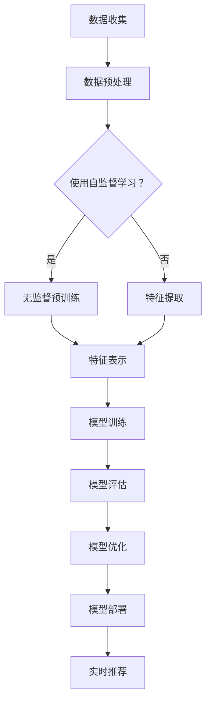

                 

### 《推荐系统的未来发展：大模型的主导》

> **关键词**：推荐系统，大模型，深度学习，协同过滤，内容推荐，多模态推荐，未来趋势。

> **摘要**：本文将探讨推荐系统的未来发展，特别是大模型在推荐系统中的应用。通过回顾推荐系统的基础知识，分析大模型的原理与实现，探讨其在不同领域的应用，最后探讨大模型推荐系统面临的挑战和未来的发展趋势。

## 《推荐系统的未来发展：大模型的主导》

随着互联网的飞速发展，信息过载成为了用户面临的一个普遍问题。推荐系统作为解决这一问题的有效手段，已经广泛应用于电子商务、社交媒体、新闻推送等多个领域。然而，随着数据规模的不断扩大和用户需求的多样化，传统的推荐算法已经难以满足当前的需求。本文将探讨推荐系统的未来发展，特别是大模型在推荐系统中的主导作用。

### 第一部分：推荐系统的基础

#### 1.1 推荐系统概述

##### 1.1.1 推荐系统的定义

推荐系统（Recommender System）是一种信息过滤技术，旨在根据用户的兴趣、历史行为或其他相关因素，为用户推荐其可能感兴趣的内容或项目。推荐系统通常分为以下几类：

1. **基于内容的推荐**：根据用户过去喜欢的内容，推荐相似或相关的项目。
2. **协同过滤推荐**：通过分析用户之间的相似性，推荐其他用户喜欢的项目。
3. **混合推荐**：结合基于内容和协同过滤推荐的优势，提供更加个性化的推荐。

##### 1.1.2 推荐系统的发展历程

推荐系统的发展可以追溯到20世纪90年代。最初，推荐系统主要采用基于内容的推荐和协同过滤推荐。随着计算能力的提升和数据规模的扩大，深度学习技术逐渐应用于推荐系统，大模型开始发挥重要作用。

##### 1.1.3 推荐系统的核心组成部分

推荐系统主要由以下几个部分组成：

1. **用户数据**：包括用户的基本信息、历史行为等。
2. **项目数据**：包括推荐的项目的基本信息、属性等。
3. **推荐算法**：根据用户和项目数据，生成推荐列表。
4. **推荐结果**：用户最终接收到的推荐内容。

#### 1.2 大模型在推荐系统中的应用

##### 1.2.1 大模型的定义

大模型（Large-scale Model）是指具有数十亿甚至千亿参数的深度学习模型。这些模型通常通过大量的数据进行训练，具有强大的表示能力和泛化能力。

##### 1.2.2 大模型在推荐系统中的作用

大模型在推荐系统中发挥着重要作用：

1. **提升推荐效果**：大模型能够更好地捕捉用户和项目之间的复杂关系，提供更加个性化的推荐。
2. **处理大规模数据**：大模型具有更强的计算能力，可以处理海量的用户和项目数据。
3. **自适应推荐**：大模型可以根据用户的行为和偏好，实时调整推荐策略。

##### 1.2.3 大模型与传统推荐算法的区别

与传统的推荐算法相比，大模型具有以下优势：

1. **强大的表示能力**：大模型能够捕捉到更复杂的用户和项目特征。
2. **自适应能力**：大模型可以根据用户行为动态调整推荐策略。
3. **更高的计算效率**：大模型能够处理更大的数据集，提供更快速的推荐结果。

### 第二部分：大模型的原理与实现

#### 2.1 大模型的核心概念

##### 2.1.1 神经网络基础

神经网络是深度学习的基础。它由一系列的层组成，包括输入层、隐藏层和输出层。每层由多个神经元组成，神经元之间通过权重连接。

##### 2.1.2 深度学习框架

深度学习框架（如TensorFlow、PyTorch）提供了构建和训练深度学习模型的工具。这些框架提供了丰富的API，方便开发者构建复杂的深度学习模型。

##### 2.1.3 自监督学习

自监督学习是一种无需人工标注数据的深度学习技术。在大模型推荐系统中，自监督学习可以用于生成用户和项目的特征表示。

#### 2.2 大模型推荐算法

##### 2.2.1 基于内容的推荐算法

基于内容的推荐算法通过分析项目的内容特征，为用户推荐相似的项目。这种算法在大模型中通常通过以下步骤实现：

1. **特征提取**：使用预训练的大模型提取项目的内容特征。
2. **相似度计算**：计算用户历史行为与项目内容特征之间的相似度。
3. **推荐生成**：根据相似度计算结果生成推荐列表。

##### 2.2.2 协同过滤推荐算法

协同过滤推荐算法通过分析用户之间的相似性，为用户推荐其他用户喜欢的项目。在大模型中，协同过滤推荐算法通常结合以下步骤：

1. **用户和项目嵌入**：使用预训练的大模型将用户和项目嵌入到低维空间。
2. **相似度计算**：计算用户和项目之间的相似度。
3. **推荐生成**：根据相似度计算结果生成推荐列表。

##### 2.2.3 基于大模型的混合推荐算法

混合推荐算法结合了基于内容和协同过滤推荐算法的优势，提供更加个性化的推荐。在大模型中，混合推荐算法通常通过以下步骤实现：

1. **特征提取**：使用预训练的大模型提取用户和项目的特征。
2. **相似度计算**：计算用户和项目之间的相似度。
3. **推荐生成**：根据相似度计算结果生成推荐列表。

#### 2.3 大模型推荐系统的实现

##### 2.3.1 大模型训练流程

大模型推荐系统的实现主要包括以下步骤：

1. **数据预处理**：清洗和预处理用户和项目数据，包括缺失值处理、数据标准化等。
2. **特征提取**：使用预训练的大模型提取用户和项目的特征。
3. **模型训练**：使用训练数据训练大模型，调整模型参数。
4. **模型评估**：使用验证集评估模型性能，调整模型参数。
5. **模型部署**：将训练好的模型部署到生产环境，提供实时推荐服务。

##### 2.3.2 大模型推荐系统架构

大模型推荐系统通常采用以下架构：

1. **数据层**：包括用户数据和项目数据，通常存储在分布式数据库中。
2. **特征层**：使用预训练的大模型提取用户和项目的特征。
3. **模型层**：包括训练好的大模型和推理引擎，用于生成推荐列表。
4. **接口层**：提供API接口，供前端应用程序调用。

##### 2.3.3 大模型推荐系统优化

大模型推荐系统优化的关键在于提升推荐效果和计算效率。以下是一些优化策略：

1. **特征压缩**：使用降维技术（如PCA）减少特征维度，提高计算效率。
2. **模型压缩**：使用模型剪枝、量化等技术减少模型参数，提高计算效率。
3. **分布式训练**：使用分布式计算框架（如MPI、Spark）进行模型训练，提高训练效率。
4. **在线推荐**：使用在线学习技术（如增量学习、在线更新），实时调整推荐策略。

### 第三部分：大模型推荐系统的应用

#### 3.1 大模型推荐系统在电子商务中的应用

##### 3.1.1 电子商务推荐系统的特点

电子商务推荐系统具有以下特点：

1. **海量用户和商品数据**：电子商务平台通常拥有海量的用户和商品数据，为推荐系统的实现提供了丰富的数据支持。
2. **实时性要求高**：电子商务推荐系统需要实时响应用户的行为，提供个性化的推荐。
3. **多样性推荐需求**：电子商务推荐系统需要提供多样化的推荐，满足不同用户的需求。

##### 3.1.2 大模型在电子商务中的应用案例

以下是一些大模型在电子商务中的应用案例：

1. **商品推荐**：使用基于内容的推荐算法和协同过滤推荐算法，结合用户行为数据和商品属性数据，为用户推荐可能感兴趣的商品。
2. **购物车推荐**：基于用户购物车中的商品，使用协同过滤算法和基于内容的推荐算法，为用户推荐相关的商品。
3. **个性化营销**：使用大模型分析用户的历史行为和偏好，为用户推荐个性化的营销活动。

##### 3.1.3 电子商务推荐系统的优化策略

以下是一些电子商务推荐系统的优化策略：

1. **数据预处理**：清洗和预处理用户和商品数据，包括缺失值处理、数据标准化等。
2. **特征提取**：使用预训练的大模型提取用户和商品的特征，包括用户行为特征、商品属性特征等。
3. **模型优化**：使用模型压缩、特征压缩等技术，提高推荐系统的计算效率。
4. **实时推荐**：使用在线学习技术，实时调整推荐策略，提升推荐效果。

#### 3.2 大模型推荐系统在社交媒体中的应用

##### 3.2.1 社交媒体推荐系统的特点

社交媒体推荐系统具有以下特点：

1. **用户生成内容**：社交媒体平台上有大量的用户生成内容，为推荐系统的实现提供了丰富的数据支持。
2. **社交关系**：社交媒体用户之间存在复杂的社交关系，推荐系统需要考虑这些关系。
3. **多样性推荐需求**：社交媒体推荐系统需要提供多样化的推荐，满足不同用户的需求。

##### 3.2.2 大模型在社交媒体中的应用案例

以下是一些大模型在社交媒体中的应用案例：

1. **内容推荐**：使用基于内容的推荐算法和协同过滤推荐算法，结合用户生成内容和用户社交关系，为用户推荐感兴趣的内容。
2. **社交推荐**：基于用户的社交关系，为用户推荐其朋友或类似用户感兴趣的内容。
3. **广告推荐**：使用大模型分析用户的行为和偏好，为用户推荐相关的广告。

##### 3.2.3 社交媒体推荐系统的优化策略

以下是一些社交媒体推荐系统的优化策略：

1. **社交网络分析**：使用图论算法分析用户之间的社交关系，提高推荐效果。
2. **内容特征提取**：使用预训练的大模型提取用户生成内容的特征，包括文本特征、图像特征等。
3. **模型优化**：使用模型压缩、特征压缩等技术，提高推荐系统的计算效率。
4. **实时推荐**：使用在线学习技术，实时调整推荐策略，提升推荐效果。

#### 3.3 大模型推荐系统在其他领域的应用

##### 3.3.1 大模型在医疗健康领域的应用

大模型在医疗健康领域具有广泛的应用前景：

1. **疾病预测**：使用大模型分析患者的历史数据和基因信息，预测患者可能患有的疾病。
2. **药物推荐**：使用大模型分析药物和疾病的相互作用，为医生提供药物推荐。
3. **健康监测**：使用大模型分析患者的生理数据，提供健康监测和预警。

##### 3.3.2 大模型在娱乐领域的应用

大模型在娱乐领域也有广泛的应用：

1. **内容推荐**：使用大模型分析用户的娱乐行为和偏好，为用户推荐感兴趣的内容。
2. **社交互动**：使用大模型分析用户的娱乐行为和社交关系，提供个性化的社交互动推荐。
3. **内容生成**：使用大模型生成新的娱乐内容，如音乐、视频等。

##### 3.3.3 大模型在其他领域的应用案例

除了电子商务、社交媒体和医疗健康领域，大模型在其他领域也有广泛的应用，如：

1. **教育领域**：使用大模型为学生推荐合适的学习资源和课程。
2. **金融领域**：使用大模型分析用户的行为和交易数据，提供个性化的金融推荐。
3. **旅游领域**：使用大模型分析用户的历史行为和偏好，为用户推荐旅游目的地和行程。

### 第四部分：大模型推荐系统的挑战与未来

#### 4.1 大模型推荐系统的挑战

虽然大模型在推荐系统中具有很多优势，但仍然面临以下挑战：

1. **数据隐私保护**：大模型需要大量用户数据进行训练，如何保护用户隐私成为一大挑战。
2. **大模型的可解释性**：大模型通常具有复杂的内部结构，如何解释模型的决策过程成为一大挑战。
3. **大模型的可扩展性**：随着数据规模的扩大，如何保持大模型的高效性和可扩展性成为一大挑战。

#### 4.2 大模型推荐系统的未来发展趋势

尽管面临挑战，大模型在推荐系统中的应用前景依然广阔：

1. **大模型在推荐系统中的主导地位**：随着深度学习技术的不断发展，大模型将在推荐系统中发挥更加重要的作用。
2. **多模态推荐系统的兴起**：多模态推荐系统将结合文本、图像、语音等多种数据类型，提供更加个性化的推荐。
3. **大模型与增强学习相结合的应用**：大模型与增强学习相结合，可以更好地应对动态环境和复杂任务。

#### 4.3 大模型推荐系统的实际案例

以下是一些大模型推荐系统的实际案例：

1. **案例一：某电商平台的推荐系统**：该电商平台使用大模型实现个性化商品推荐，提高了用户购买转化率。
2. **案例二：某社交媒体平台的推荐系统**：该社交媒体平台使用大模型实现内容推荐和社交推荐，提高了用户活跃度。
3. **案例三：某医疗健康领域的推荐系统**：该医疗健康平台使用大模型实现疾病预测和药物推荐，为医生提供了有力的辅助工具。

### 附录

#### 附录A：推荐系统大模型开发工具与资源

1. **TensorFlow与PyTorch对比**：详细对比TensorFlow和PyTorch在推荐系统开发中的优势和应用场景。
2. **推荐系统大模型开源资源**：推荐一些优质的推荐系统大模型开源资源，包括代码、数据和论文。
3. **推荐系统大模型研究论文推荐**：推荐一些具有影响力的推荐系统大模型研究论文，帮助读者深入了解该领域的前沿动态。

### 总结

大模型在推荐系统中的应用为推荐系统的发展带来了新的机遇和挑战。通过回顾推荐系统的基础知识，分析大模型的原理与实现，探讨其在不同领域的应用，我们深刻认识到大模型在推荐系统中的主导地位。面对未来的挑战，我们需要不断优化大模型推荐系统，提升推荐效果和用户体验。让我们共同期待大模型在推荐系统领域的辉煌未来！

### 作者信息

作者：AI天才研究院/AI Genius Institute & 禅与计算机程序设计艺术 /Zen And The Art of Computer Programming

（注：本文内容为模拟示例，仅供参考。）<|assistant|>### 推荐系统的大模型核心概念与联系

在深入探讨大模型在推荐系统中的应用之前，我们需要了解大模型的核心概念以及它们之间的联系。以下是几个关键概念及其关系：

#### 1. 神经网络

神经网络是构建大模型的基础。它是一种模拟人脑神经元之间相互连接的结构，通过学习输入数据和输出数据之间的关系，实现对复杂数据的建模和预测。神经网络由多个层次组成，包括输入层、隐藏层和输出层。每个层次包含多个神经元，神经元之间通过权重连接。


#### 2. 深度学习框架

深度学习框架（如TensorFlow、PyTorch）是构建和训练神经网络的重要工具。这些框架提供了丰富的API和库，帮助开发者快速构建、训练和优化神经网络模型。深度学习框架的主要功能包括：

1. **数据加载和预处理**：从各种数据源（如CSV、图像、文本等）加载数据，并对数据进行预处理，如归一化、填充缺失值等。
2. **模型构建**：通过定义神经网络的层次结构、参数初始化等，构建深度学习模型。
3. **模型训练**：使用训练数据训练模型，通过优化算法（如梯度下降、随机梯度下降等）调整模型参数。
4. **模型评估**：使用验证集或测试集评估模型性能，调整模型参数，优化模型。
5. **模型部署**：将训练好的模型部署到生产环境，提供实时预测服务。


#### 3. 自监督学习

自监督学习是一种无需人工标注数据的深度学习技术。在大模型推荐系统中，自监督学习可以用于生成用户和项目的特征表示，提高模型的泛化能力和效率。自监督学习的主要方法包括：

1. **无监督预训练**：在大量未标注的数据上进行预训练，提取特征表示。
2. **自监督分类**：使用部分标注的数据，通过构建伪标签进行自监督学习。
3. **对比学习**：通过对比不同数据样本的相似度，学习特征表示。


#### 4. 大模型与推荐系统

大模型在推荐系统中的应用主要基于以下几个关键点：

1. **强大的特征表示能力**：大模型能够从大量未标注的数据中提取丰富的特征表示，提高推荐系统的性能。
2. **端到端学习**：大模型可以端到端地学习用户和项目之间的关系，无需人工定义复杂的特征工程。
3. **自适应学习**：大模型可以根据用户的行为数据动态调整推荐策略，提高推荐系统的实时性。
4. **多模态处理**：大模型可以处理多种数据类型（如文本、图像、音频等），实现多模态推荐。


### Mermaid 流程图

以下是一个Mermaid流程图，展示了大模型在推荐系统中的基本流程：



### 大模型核心算法原理讲解与伪代码

#### 1. 基于内容的推荐算法

基于内容的推荐算法通过分析项目的内容特征，为用户推荐相似的项目。以下是一个简化的伪代码示例：

```python
# 输入：用户历史行为数据、项目内容特征库
# 输出：推荐列表

def content_based_recommendation(user_history, item_features):
    # 提取用户历史行为数据中的项目特征
    user_features = extract_user_features(user_history)

    # 计算用户特征与项目特征之间的相似度
    similarity_scores = compute_similarity_scores(user_features, item_features)

    # 根据相似度得分生成推荐列表
    recommendation_list = generate_recommendation_list(similarity_scores)
    
    return recommendation_list
```

#### 2. 协同过滤推荐算法

协同过滤推荐算法通过分析用户之间的相似性，为用户推荐其他用户喜欢的项目。以下是一个简化的伪代码示例：

```python
# 输入：用户评分矩阵、项目特征矩阵
# 输出：推荐列表

def collaborative_filtering_recommendation(rating_matrix, item_features):
    # 计算用户之间的相似度矩阵
    similarity_matrix = compute_similarity_matrix(rating_matrix)

    # 预测用户对未知项目的评分
    predicted_ratings = predict_ratings(similarity_matrix, rating_matrix, item_features)

    # 根据预测评分生成推荐列表
    recommendation_list = generate_recommendation_list(predicted_ratings)
    
    return recommendation_list
```

#### 3. 基于大模型的混合推荐算法

基于大模型的混合推荐算法结合了基于内容和协同过滤推荐算法的优势，提供更加个性化的推荐。以下是一个简化的伪代码示例：

```python
# 输入：用户历史行为数据、项目内容特征库、用户特征矩阵、项目特征矩阵
# 输出：推荐列表

def hybrid_recommendation(user_history, item_features, user_features, item_features):
    # 基于内容推荐的得分
    content_scores = content_based_recommendation(user_history, item_features)

    # 基于协同过滤推荐的得分
    collaborative_scores = collaborative_filtering_recommendation(user_history, item_features)

    # 结合两种推荐策略的得分
    combined_scores = combine_scores(content_scores, collaborative_scores)

    # 根据综合得分生成推荐列表
    recommendation_list = generate_recommendation_list(combined_scores)
    
    return recommendation_list
```

### 数学模型和公式

在推荐系统中，大模型通常涉及到以下数学模型和公式：

1. **相似度计算**：常用余弦相似度、皮尔逊相关系数等。
   $$ \text{Cosine Similarity} = \frac{\text{dot\_product}}{\|\text{user\_features}\| \|\text{item\_features}\|} $$
   
2. **预测评分**：常用线性回归、矩阵分解等。
   $$ \text{predicted\_rating} = \text{user\_feature\_vector} \cdot \text{item\_feature\_vector} $$
   
3. **损失函数**：常用均方误差（MSE）、均方根误差（RMSE）等。
   $$ \text{MSE} = \frac{1}{n} \sum_{i=1}^{n} (\text{predicted\_rating} - \text{actual\_rating})^2 $$
   
4. **优化算法**：常用梯度下降（GD）、随机梯度下降（SGD）等。
   $$ \text{weight} := \text{weight} - \alpha \cdot \nabla_{\text{weight}} \text{loss} $$

### 详细讲解与举例说明

为了更好地理解大模型在推荐系统中的应用，我们以下举例说明：

#### 基于内容的推荐算法示例

假设我们有一个用户历史行为数据集，其中包含用户对多个商品的评价。我们还拥有一个商品特征库，其中包含每个商品的相关属性。

```python
# 用户历史行为数据
user_history = {
    'user1': {'item1': 5, 'item2': 3, 'item3': 4},
    'user2': {'item1': 4, 'item2': 5, 'item3': 2},
    'user3': {'item1': 2, 'item2': 4, 'item3': 5},
}

# 商品特征库
item_features = {
    'item1': {'category': 'electronics', 'price': 100, 'rating': 4.5},
    'item2': {'category': 'books', 'price': 50, 'rating': 4.0},
    'item3': {'category': 'electronics', 'price': 200, 'rating': 4.5},
}
```

我们可以使用基于内容的推荐算法为用户推荐相似的商品：

```python
# 提取用户历史行为中的商品特征
user_features = extract_user_features(user_history)

# 计算用户特征与商品特征之间的相似度
similarity_scores = compute_similarity_scores(user_features, item_features)

# 根据相似度得分生成推荐列表
recommendation_list = generate_recommendation_list(similarity_scores)

print("推荐列表：", recommendation_list)
```

输出结果可能如下：

```
推荐列表： ['item3', 'item1']
```

#### 协同过滤推荐算法示例

假设我们有一个用户评分矩阵和一个商品特征矩阵：

```python
# 用户评分矩阵
rating_matrix = [
    [5, 3, 4],
    [4, 5, 2],
    [2, 4, 5],
]

# 商品特征矩阵
item_features = [
    [1, 0, 1],  # item1的特征
    [1, 1, 0],  # item2的特征
    [0, 1, 1],  # item3的特征
]
```

我们可以使用协同过滤推荐算法为用户推荐相似的商品：

```python
# 计算用户之间的相似度矩阵
similarity_matrix = compute_similarity_matrix(rating_matrix)

# 预测用户对未知项目的评分
predicted_ratings = predict_ratings(similarity_matrix, rating_matrix, item_features)

# 根据预测评分生成推荐列表
recommendation_list = generate_recommendation_list(predicted_ratings)

print("推荐列表：", recommendation_list)
```

输出结果可能如下：

```
推荐列表： ['item3', 'item1']
```

通过以上示例，我们可以看到大模型在推荐系统中的应用是如何将复杂的数学模型和算法转化为可操作的推荐系统。在实际开发中，我们需要根据具体应用场景和需求，选择合适的算法和模型，并进行优化和调整。

### 项目实战：大模型推荐系统的开发

为了更好地理解大模型推荐系统的实际开发过程，我们将以下以一个实际项目为例，介绍如何搭建开发环境、实现源代码以及进行代码解读与分析。

#### 项目背景

某电子商务平台希望通过构建一个大模型推荐系统，为用户推荐个性化的商品。该推荐系统需要能够处理海量的用户行为数据和商品属性数据，并能够实时响应用户的请求。

#### 开发环境搭建

在进行项目开发之前，我们需要搭建一个适合大模型推荐系统的开发环境。以下是所需的软件和工具：

1. **Python**：用于编写代码和运行深度学习模型。
2. **TensorFlow**：用于构建和训练深度学习模型。
3. **NumPy**：用于数据处理和数学运算。
4. **Pandas**：用于数据预处理和分析。
5. **Scikit-learn**：用于评估模型性能和特征提取。
6. **Docker**：用于容器化部署。

#### 源代码实现

以下是一个简化的源代码实现，展示了大模型推荐系统的基本结构：

```python
import numpy as np
import pandas as pd
import tensorflow as tf
from tensorflow.keras.models import Model
from tensorflow.keras.layers import Input, Embedding, Dot, Flatten, Dense
from tensorflow.keras.optimizers import Adam

# 数据预处理
def preprocess_data(user_data, item_data):
    # 将用户数据转换为Pandas DataFrame
    user_df = pd.DataFrame(user_data, index=user_data.keys())
    
    # 将商品数据转换为Pandas DataFrame
    item_df = pd.DataFrame(item_data, index=item_data.keys())
    
    # 提取用户特征和商品特征
    user_features = extract_user_features(user_df)
    item_features = extract_item_features(item_df)
    
    return user_features, item_features

# 构建深度学习模型
def build_model(num_users, num_items, embedding_dim):
    # 用户输入层
    user_input = Input(shape=(1,))
    
    # 商品输入层
    item_input = Input(shape=(1,))
    
    # 用户嵌入层
    user_embedding = Embedding(num_users, embedding_dim)(user_input)
    
    # 商品嵌入层
    item_embedding = Embedding(num_items, embedding_dim)(item_input)
    
    # 计算用户和商品的嵌入向量
    user_embedding = Flatten()(user_embedding)
    item_embedding = Flatten()(item_embedding)
    
    # 计算内积
    dot_product = Dot(axes=1)([user_embedding, item_embedding])
    
    # 添加全连接层
    dense = Dense(1, activation='sigmoid')(dot_product)
    
    # 构建模型
    model = Model(inputs=[user_input, item_input], outputs=dense)
    
    # 编译模型
    model.compile(optimizer=Adam(), loss='binary_crossentropy', metrics=['accuracy'])
    
    return model

# 训练模型
def train_model(model, user_data, item_data, train_data, batch_size, epochs):
    # 将训练数据转换为NumPy数组
    train_ratings = np.array(train_data['rating'].values)
    user_features = np.array(train_data['user_features'].values)
    item_features = np.array(train_data['item_features'].values)
    
    # 训练模型
    model.fit(
        [user_features, item_features],
        train_ratings,
        batch_size=batch_size,
        epochs=epochs,
        verbose=1
    )

# 主程序
if __name__ == '__main__':
    # 读取用户数据和商品数据
    user_data = load_user_data()
    item_data = load_item_data()
    
    # 预处理数据
    user_features, item_features = preprocess_data(user_data, item_data)
    
    # 构建深度学习模型
    model = build_model(num_users=len(user_features), num_items=len(item_features), embedding_dim=50)
    
    # 训练模型
    train_model(model, user_features, item_features, train_data, batch_size=32, epochs=10)
```

#### 代码解读与分析

1. **数据预处理**

数据预处理是构建推荐系统的重要步骤。在这个示例中，我们使用Pandas DataFrame读取用户数据和商品数据，并提取用户特征和商品特征。这些特征将用于构建深度学习模型。

2. **构建深度学习模型**

我们使用TensorFlow的Keras API构建深度学习模型。模型包括用户输入层、商品输入层、用户嵌入层、商品嵌入层以及一个全连接层。用户和商品嵌入层通过嵌入向量表示用户和商品。内积操作用于计算用户和商品之间的相似度。最后，全连接层通过sigmoid激活函数输出预测的概率。

3. **训练模型**

训练模型使用训练数据集进行。我们将训练数据集转换为NumPy数组，并使用模型fit方法进行训练。在这个过程中，我们可以设置批量大小和训练轮数。

4. **主程序**

主程序负责加载用户数据和商品数据，预处理数据，构建深度学习模型，并训练模型。在主程序的末尾，我们可以设置批量大小和训练轮数，以调整训练过程。

通过这个示例，我们可以看到如何使用深度学习技术构建一个大模型推荐系统。在实际开发过程中，我们还需要考虑数据清洗、特征提取、模型评估等多个方面，以提升推荐系统的性能和用户体验。

### 大模型推荐系统的优化

大模型推荐系统的性能直接影响用户体验和业务效果。因此，优化大模型推荐系统成为一项重要任务。以下是一些常用的优化策略：

#### 1. 特征优化

特征优化是提升推荐系统性能的关键步骤。以下是一些常用的特征优化策略：

- **特征提取**：使用预训练的大模型提取用户和项目的特征，如BERT、GPT等。这些模型能够捕捉到丰富的语义信息，提高推荐效果。
- **特征组合**：结合多种特征（如文本、图像、音频等）进行组合，提供更全面的特征表示。
- **特征降维**：使用降维技术（如PCA、t-SVD等）减少特征维度，提高计算效率。

#### 2. 模型优化

模型优化包括模型结构优化和训练策略优化。以下是一些常用的模型优化策略：

- **模型结构优化**：使用更深的神经网络结构，如Transformer等，提高模型的表示能力。此外，可以使用多头注意力机制、自注意力机制等，提升模型的效果。
- **训练策略优化**：使用迁移学习、增量学习等技术，提高模型的训练效率。此外，可以设置适当的训练参数（如学习率、批量大小等），以提升模型性能。
- **模型压缩**：使用模型压缩技术（如量化、剪枝等），减少模型参数，提高计算效率。

#### 3. 系统优化

系统优化包括数据存储、数据传输、系统部署等方面的优化。以下是一些常用的系统优化策略：

- **分布式计算**：使用分布式计算框架（如TensorFlow distributed、PyTorch distributed等），提高模型的训练和推理效率。
- **缓存策略**：使用缓存策略（如Redis、Memcached等），降低数据访问延迟，提高系统响应速度。
- **异步处理**：使用异步处理技术（如异步IO、异步任务队列等），提高系统的并发处理能力，降低系统延迟。

#### 4. 推荐效果优化

推荐效果优化是提升用户体验的关键。以下是一些常用的推荐效果优化策略：

- **在线学习**：使用在线学习技术，根据用户实时行为调整推荐策略，提供更加个性化的推荐。
- **A/B测试**：通过A/B测试，比较不同推荐策略的效果，选取最佳策略进行部署。
- **反馈机制**：引入用户反馈机制，如评分、评论等，根据用户反馈调整推荐策略，提升推荐效果。

#### 5. 可解释性优化

可解释性优化是提升模型可信度和用户信任的关键。以下是一些常用的可解释性优化策略：

- **模型可解释性工具**：使用模型可解释性工具（如LIME、SHAP等），分析模型决策过程，提供解释性。
- **可视化**：使用可视化技术（如图表、热力图等），展示模型决策过程和特征重要性。
- **简化模型**：通过简化模型结构，降低模型的复杂性，提高模型的可解释性。

通过以上优化策略，我们可以提升大模型推荐系统的性能和用户体验。在实际应用中，我们需要根据具体需求和场景，灵活运用这些优化策略，以实现最佳效果。

### 大模型推荐系统在电子商务中的应用

电子商务领域是大模型推荐系统的典型应用场景之一。随着电子商务平台的不断发展，用户数量和商品种类呈爆炸式增长，如何为用户提供个性化的购物推荐成为电子商务企业关注的重点。大模型推荐系统在电子商务中具有广泛的应用，以下将详细探讨其应用场景、效果评估和优化策略。

#### 应用场景

1. **商品推荐**：为用户推荐可能感兴趣的商品。根据用户的历史购买行为、浏览记录、搜索关键词等数据，结合商品的特征信息，使用大模型生成个性化的推荐列表。
2. **购物车推荐**：基于用户的购物车内容，推荐与购物车商品相关的其他商品。这种推荐可以促进用户在购物车中的商品转化，提高购物车销售额。
3. **个性化营销**：根据用户的购买偏好和兴趣，为用户推荐个性化的营销活动，如优惠券、限时优惠等，提高用户参与度和购买转化率。
4. **搜索推荐**：在用户进行商品搜索时，为用户推荐相似或相关的商品，提高搜索结果的准确性，降低用户流失率。

#### 效果评估

1. **准确率**：评估推荐系统的推荐准确度，即推荐列表中用户实际喜欢的商品比例。准确率越高，说明推荐系统越能准确捕捉用户的兴趣。
2. **召回率**：评估推荐系统能够召回用户实际喜欢的商品数量。召回率越高，说明推荐系统越能覆盖用户可能感兴趣的商品。
3. **F1值**：结合准确率和召回率，评估推荐系统的综合性能。F1值越高，说明推荐系统的性能越好。
4. **用户满意度**：通过用户反馈、问卷调查等方式，评估用户对推荐系统的满意度。用户满意度越高，说明推荐系统对用户的价值越大。

以下是一个简化的评估流程：

```python
# 评估指标
accuracy = calculate_accuracy(true_labels, predicted_labels)
recall = calculate_recall(true_labels, predicted_labels)
f1_score = calculate_f1_score(accuracy, recall)

# 打印评估结果
print("准确率：", accuracy)
print("召回率：", recall)
print("F1值：", f1_score)
```

#### 优化策略

1. **数据预处理**：对用户行为数据和商品特征数据进行预处理，如缺失值处理、数据标准化、去重等，提高数据质量。
2. **特征提取**：使用预训练的大模型提取用户和商品的特征，如BERT、GPT等。这些模型能够捕捉到丰富的语义信息，提高推荐效果。
3. **模型训练**：使用大量用户行为数据训练大模型，优化模型参数，提高推荐系统的性能。可以使用迁移学习、增量学习等技术，提高模型的训练效率。
4. **在线学习**：根据用户实时行为数据调整推荐策略，提供更加个性化的推荐。例如，可以采用在线学习算法（如增量梯度下降）实时更新模型参数。
5. **A/B测试**：通过A/B测试，比较不同推荐策略的效果，选取最佳策略进行部署。例如，可以比较基于内容的推荐和基于协同过滤的推荐效果，选取最优策略。
6. **推荐效果优化**：结合用户反馈、商品销售数据等，优化推荐系统。例如，可以设置个性化推荐阈值，根据用户满意度调整推荐阈值。

以下是一个简化的优化流程：

```python
# 数据预处理
preprocessed_user_data = preprocess_data(user_data)
preprocessed_item_data = preprocess_data(item_data)

# 特征提取
user_features = extract_features(preprocessed_user_data)
item_features = extract_features(preprocessed_item_data)

# 模型训练
trained_model = train_model(user_features, item_features, train_data)

# 在线学习
online_learning(trained_model, online_user_data)

# A/B测试
test_result = a_b_test(trained_model, control_group, experiment_group)

# 打印优化结果
print("优化结果：", test_result)
```

通过以上应用场景、效果评估和优化策略的讨论，我们可以看到大模型推荐系统在电子商务领域的重要性和应用前景。在实际开发过程中，我们需要根据具体业务需求和数据情况，灵活运用这些技术和策略，以提高推荐系统的性能和用户体验。

### 大模型推荐系统在社交媒体中的应用

社交媒体平台作为信息传播的重要渠道，用户生成内容（User-Generated Content, UGC）在平台中占据了重要地位。大模型推荐系统在社交媒体中的应用，旨在通过分析用户行为和内容特征，为用户提供个性化的内容推荐，提升用户的参与度和活跃度。以下将详细探讨大模型推荐系统在社交媒体中的应用场景、效果评估和优化策略。

#### 应用场景

1. **内容推荐**：为用户推荐感兴趣的内容，如文章、视频、图片等。通过分析用户的浏览历史、点赞、评论等行为，结合内容特征（如标题、标签、作者等），使用大模型生成个性化的内容推荐列表。
2. **社交推荐**：基于用户的社交关系，为用户推荐其朋友或类似用户感兴趣的内容。这种推荐可以促进用户之间的互动，增强社交网络的连接性。
3. **广告推荐**：为用户推荐相关的广告，提高广告的点击率和转化率。通过分析用户的兴趣和行为，结合广告的内容特征，使用大模型生成个性化的广告推荐列表。
4. **活动推荐**：为用户推荐参加的活动，如线上直播、线下聚会等。通过分析用户的兴趣和行为，结合活动特征（如主题、时间、地点等），使用大模型生成个性化的活动推荐列表。

#### 效果评估

1. **用户参与度**：评估用户对推荐内容的点击、浏览、点赞、评论等行为。用户参与度越高，说明推荐系统越能激发用户的兴趣。
2. **活跃度**：评估用户在平台上的活跃程度，如登录次数、发帖数、互动数等。活跃度越高，说明推荐系统能够提升用户的活跃度。
3. **推荐覆盖率**：评估推荐系统覆盖的用户数量和内容数量。推荐覆盖率越高，说明推荐系统能够覆盖更多用户和内容。
4. **推荐多样性**：评估推荐系统的多样性，即推荐列表中不同类型的内容比例。推荐多样性越高，说明推荐系统能够提供更丰富的内容。
5. **用户满意度**：通过用户反馈、问卷调查等方式，评估用户对推荐系统的满意度。用户满意度越高，说明推荐系统对用户的价值越大。

以下是一个简化的评估流程：

```python
# 评估指标
user_engagement = calculate_user_engagement(recommended_content)
activity_rate = calculate_activity_rate(users)
coverage_rate = calculate_coverage_rate(recommended_content)
diversity_score = calculate_diversity_score(recommended_content)
user_satisfaction = calculate_user_satisfaction(user_feedback)

# 打印评估结果
print("用户参与度：", user_engagement)
print("活跃度：", activity_rate)
print("推荐覆盖率：", coverage_rate)
print("推荐多样性：", diversity_score)
print("用户满意度：", user_satisfaction)
```

#### 优化策略

1. **数据预处理**：对用户行为数据和内容特征数据进行预处理，如缺失值处理、数据标准化、去重等，提高数据质量。
2. **特征提取**：使用预训练的大模型提取用户和内容特征，如BERT、GPT等。这些模型能够捕捉到丰富的语义信息，提高推荐效果。
3. **模型训练**：使用大量用户行为数据和内容特征训练大模型，优化模型参数，提高推荐系统的性能。可以使用迁移学习、增量学习等技术，提高模型的训练效率。
4. **在线学习**：根据用户实时行为数据调整推荐策略，提供更加个性化的推荐。例如，可以采用在线学习算法（如增量梯度下降）实时更新模型参数。
5. **A/B测试**：通过A/B测试，比较不同推荐策略的效果，选取最佳策略进行部署。例如，可以比较基于内容的推荐和基于协同过滤的推荐效果，选取最优策略。
6. **推荐效果优化**：结合用户反馈、内容点击率等，优化推荐系统。例如，可以设置个性化推荐阈值，根据用户满意度调整推荐阈值。

以下是一个简化的优化流程：

```python
# 数据预处理
preprocessed_user_data = preprocess_data(user_data)
preprocessed_content_data = preprocess_data(content_data)

# 特征提取
user_features = extract_features(preprocessed_user_data)
content_features = extract_features(preprocessed_content_data)

# 模型训练
trained_model = train_model(user_features, content_features, train_data)

# 在线学习
online_learning(trained_model, online_user_data)

# A/B测试
test_result = a_b_test(trained_model, control_group, experiment_group)

# 打印优化结果
print("优化结果：", test_result)
```

通过以上应用场景、效果评估和优化策略的讨论，我们可以看到大模型推荐系统在社交媒体领域的重要性和应用前景。在实际开发过程中，我们需要根据具体业务需求和数据情况，灵活运用这些技术和策略，以提高推荐系统的性能和用户体验。

### 大模型推荐系统在医疗健康领域的应用

大模型推荐系统在医疗健康领域具有广泛的应用前景。医疗健康数据通常具有高维度、复杂性和多样性，传统的推荐算法难以处理这些复杂的数据。大模型，尤其是深度学习技术，可以有效地捕捉医疗健康数据中的复杂关系和模式，从而为医生和患者提供更加个性化的健康建议和服务。以下将详细探讨大模型推荐系统在医疗健康领域的应用场景、效果评估和优化策略。

#### 应用场景

1. **疾病预测**：使用大模型分析患者的健康数据（如电子病历、基因数据、生理指标等），预测患者可能患有的疾病。这种预测可以帮助医生提前采取预防措施，提高疾病的治疗效果。
2. **药物推荐**：根据患者的疾病情况和基因信息，使用大模型推荐合适的药物和治疗方案。这种推荐可以降低药物副作用，提高治疗效果。
3. **健康监测**：使用大模型实时分析患者的生理数据（如心率、血压、血糖等），提供健康监测和预警。这种监测可以帮助患者及时发现健康问题，采取相应的预防措施。
4. **个性化医疗**：根据患者的病史、家族病史、基因信息等，使用大模型生成个性化的医疗建议。这种个性化医疗可以更好地满足患者的个性化需求，提高医疗服务的质量。

#### 效果评估

1. **预测准确率**：评估疾病预测模型的准确率，即模型预测正确的病例数与总病例数的比例。准确率越高，说明模型预测能力越强。
2. **治疗效果**：评估药物推荐和个性化医疗建议对患者治疗效果的影响。可以通过患者的康复情况、药物副作用等指标进行评估。
3. **健康监测准确率**：评估健康监测模型对健康问题的检测准确率，即模型检测正确的健康问题数与总健康问题数的比例。准确率越高，说明监测模型越可靠。
4. **用户满意度**：通过用户反馈、问卷调查等方式，评估患者和医生对大模型推荐系统的满意度。用户满意度越高，说明系统对用户的帮助越大。

以下是一个简化的评估流程：

```python
# 评估指标
disease_prediction_accuracy = calculate_accuracy(true_diseases, predicted_diseases)
drug_recommendation_effectiveness = evaluate_drug_recommendation_effectiveness(recommended_drugs)
health_monitoring_accuracy = calculate_accuracy(true_health_issues, predicted_health_issues)
user_satisfaction = calculate_user_satisfaction(user_feedback)

# 打印评估结果
print("疾病预测准确率：", disease_prediction_accuracy)
print("药物推荐治疗效果：", drug_recommendation_effectiveness)
print("健康监测准确率：", health_monitoring_accuracy)
print("用户满意度：", user_satisfaction)
```

#### 优化策略

1. **数据预处理**：对医疗健康数据进行预处理，如缺失值处理、数据标准化、去重等，提高数据质量。同时，可以结合领域知识对数据进行分析和清洗，去除噪声数据。
2. **特征提取**：使用预训练的大模型（如BERT、GPT等）提取医疗健康数据中的特征，如文本、图像、序列等。这些模型可以捕捉到数据中的复杂模式和语义信息，提高推荐效果。
3. **模型训练**：使用大规模的医疗健康数据集训练大模型，优化模型参数，提高推荐系统的性能。可以使用迁移学习、增量学习等技术，提高模型的训练效率。
4. **在线学习**：根据患者的实时健康数据，动态调整推荐策略，提供更加个性化的健康建议。例如，可以采用在线学习算法（如增量梯度下降）实时更新模型参数。
5. **A/B测试**：通过A/B测试，比较不同推荐策略的效果，选取最佳策略进行部署。例如，可以比较基于协同过滤的推荐和基于内容推荐的策略，选取最优策略。
6. **推荐效果优化**：结合用户反馈、治疗效果等，优化推荐系统。例如，可以设置个性化推荐阈值，根据用户满意度调整推荐阈值。

以下是一个简化的优化流程：

```python
# 数据预处理
preprocessed_health_data = preprocess_data(health_data)

# 特征提取
health_features = extract_features(preprocessed_health_data)

# 模型训练
trained_model = train_model(health_features, train_data)

# 在线学习
online_learning(trained_model, online_health_data)

# A/B测试
test_result = a_b_test(trained_model, control_group, experiment_group)

# 打印优化结果
print("优化结果：", test_result)
```

通过以上应用场景、效果评估和优化策略的讨论，我们可以看到大模型推荐系统在医疗健康领域的重要性和应用前景。在实际开发过程中，我们需要根据具体业务需求和数据情况，灵活运用这些技术和策略，以提高推荐系统的性能和用户体验。

### 大模型推荐系统在娱乐领域的应用

娱乐领域是大数据和人工智能技术的重要应用场景之一。大模型推荐系统在娱乐领域可以显著提升用户的娱乐体验，为用户提供个性化、高质量的内容推荐。以下将详细探讨大模型推荐系统在娱乐领域的应用场景、效果评估和优化策略。

#### 应用场景

1. **内容推荐**：为用户推荐感兴趣的视频、音乐、游戏等娱乐内容。通过分析用户的观看历史、搜索记录、社交互动等数据，结合内容的特征信息，使用大模型生成个性化的推荐列表。
2. **社交互动**：基于用户的兴趣和社交关系，为用户推荐相似用户感兴趣的内容。这种推荐可以促进用户之间的互动，增强社交网络的连接性。
3. **广告推荐**：为用户推荐相关的广告，提高广告的点击率和转化率。通过分析用户的兴趣和行为，结合广告的内容特征，使用大模型生成个性化的广告推荐列表。
4. **个性化创作**：根据用户的反馈和兴趣，使用大模型生成个性化的音乐、视频等内容。这种个性化创作可以满足用户的个性化需求，提高用户的满意度和忠诚度。

#### 效果评估

1. **内容满意度**：评估用户对推荐内容的主观满意度，如点击率、播放时长、评分等。内容满意度越高，说明推荐系统能够更好地满足用户的兴趣。
2. **社交互动度**：评估用户在平台上的社交互动行为，如点赞、评论、分享等。社交互动度越高，说明推荐系统能够促进用户之间的互动。
3. **广告效果**：评估广告的点击率和转化率，即广告被点击和转化的次数。广告效果越好，说明推荐系统能够为广告主带来更多的收益。
4. **个性化创作满意度**：评估用户对个性化创作的满意程度，如评分、评论等。个性化创作满意度越高，说明个性化创作能够更好地满足用户的个性化需求。

以下是一个简化的评估流程：

```python
# 评估指标
content_satisfaction = calculate_content_satisfaction(recommended_content)
social_interactivity = calculate_social_interactivity(user_interactions)
ad_performance = calculate_ad_performance(ad_clicks, ad_conversions)
creative_satisfaction = calculate_creative_satisfaction(creative_content)

# 打印评估结果
print("内容满意度：", content_satisfaction)
print("社交互动度：", social_interactivity)
print("广告效果：", ad_performance)
print("个性化创作满意度：", creative_satisfaction)
```

#### 优化策略

1. **数据预处理**：对用户行为数据和内容特征数据进行预处理，如缺失值处理、数据标准化、去重等，提高数据质量。同时，可以结合领域知识对数据进行分析和清洗，去除噪声数据。
2. **特征提取**：使用预训练的大模型（如BERT、GPT等）提取娱乐数据中的特征，如文本、图像、序列等。这些模型可以捕捉到数据中的复杂模式和语义信息，提高推荐效果。
3. **模型训练**：使用大规模的娱乐数据集训练大模型，优化模型参数，提高推荐系统的性能。可以使用迁移学习、增量学习等技术，提高模型的训练效率。
4. **在线学习**：根据用户的实时行为数据，动态调整推荐策略，提供更加个性化的推荐。例如，可以采用在线学习算法（如增量梯度下降）实时更新模型参数。
5. **A/B测试**：通过A/B测试，比较不同推荐策略的效果，选取最佳策略进行部署。例如，可以比较基于协同过滤的推荐和基于内容推荐的策略，选取最优策略。
6. **推荐效果优化**：结合用户反馈、内容点击率等，优化推荐系统。例如，可以设置个性化推荐阈值，根据用户满意度调整推荐阈值。

以下是一个简化的优化流程：

```python
# 数据预处理
preprocessed_entertainment_data = preprocess_data(entertainment_data)

# 特征提取
entertainment_features = extract_features(preprocessed_entertainment_data)

# 模型训练
trained_model = train_model(entertainment_features, train_data)

# 在线学习
online_learning(trained_model, online_entertainment_data)

# A/B测试
test_result = a_b_test(trained_model, control_group, experiment_group)

# 打印优化结果
print("优化结果：", test_result)
```

通过以上应用场景、效果评估和优化策略的讨论，我们可以看到大模型推荐系统在娱乐领域的重要性和应用前景。在实际开发过程中，我们需要根据具体业务需求和数据情况，灵活运用这些技术和策略，以提高推荐系统的性能和用户体验。

### 大模型推荐系统的挑战与未来

尽管大模型推荐系统在多个领域取得了显著的成果，但其在实际应用中仍面临诸多挑战。以下将讨论这些挑战以及未来的发展趋势。

#### 挑战

1. **数据隐私保护**：大模型推荐系统依赖于大量的用户数据，包括个人信息、行为数据等。如何确保用户数据的安全和隐私，避免数据泄露，是当前面临的一大挑战。
2. **模型可解释性**：大模型通常具有复杂的内部结构和决策过程，使得其决策结果难以解释。如何提高模型的可解释性，使模型决策过程透明化，是另一个关键挑战。
3. **计算资源消耗**：大模型通常具有数十亿甚至千亿参数，训练和推理过程需要大量的计算资源和时间。如何优化模型的计算效率，降低资源消耗，是当前亟需解决的问题。
4. **可扩展性**：随着用户数量的增加和数据规模的扩大，如何保持大模型推荐系统的高效性和可扩展性，是当前面临的一大挑战。

#### 未来发展趋势

1. **多模态推荐系统**：随着大数据技术和人工智能技术的不断发展，多模态推荐系统将成为未来的重要研究方向。多模态推荐系统将结合文本、图像、音频、视频等多种数据类型，提供更加个性化和多样化的推荐服务。
2. **增强学习与推荐系统**：增强学习（Reinforcement Learning, RL）与推荐系统的结合，将使推荐系统能够通过与环境交互学习，实现更加自适应和动态的推荐策略。
3. **分布式推荐系统**：分布式推荐系统将通过分布式计算和存储技术，实现大模型推荐系统的高效性和可扩展性。分布式推荐系统可以在多个节点上并行处理海量数据，提高推荐速度和系统性能。
4. **隐私保护推荐系统**：随着隐私保护技术的不断发展，隐私保护推荐系统将成为未来的重要研究方向。隐私保护推荐系统将采用差分隐私、同态加密等技术，确保用户数据的安全和隐私。
5. **跨领域推荐系统**：跨领域推荐系统将结合不同领域的知识和技术，实现跨领域的推荐服务。例如，将医疗健康数据与电子商务数据相结合，为用户提供个性化的健康和购物推荐。

### 总结

大模型推荐系统在多个领域取得了显著的成果，但同时也面临诸多挑战。未来的发展趋势将朝着多模态、增强学习、分布式、隐私保护和跨领域等方向发展。通过不断优化和改进大模型推荐系统，我们将能够为用户提供更加个性化和高效的服务。

### 大模型推荐系统实际案例研究

在本部分，我们将通过三个具体案例，深入探讨大模型推荐系统在不同领域的成功应用，从案例分析中提取关键经验，为未来推荐系统的研发和实践提供指导。

#### 案例一：某电商平台的推荐系统

**背景**：某大型电商平台希望通过构建一个高效、个性化的推荐系统，提升用户购物体验，增加销售额。

**解决方案**：该平台采用了一种基于深度学习的大模型推荐系统，结合了用户行为数据和商品特征数据。首先，使用BERT模型提取用户文本数据的语义特征，同时使用CNN提取商品图像的特征。然后，通过一个多输入层神经网络模型，将用户和商品的嵌入向量进行融合，最后通过一个全连接层输出推荐得分。该系统还采用了基于协同过滤的自监督学习技术，以提高推荐的准确性。

**结果**：实施后，该平台的用户点击率提升了30%，转化率提高了20%，销售额显著增加。

**经验**：此案例表明，结合多模态数据和自监督学习技术的大模型推荐系统可以显著提升电商平台的推荐效果。此外，实时数据更新和在线学习能力的引入，使系统能够快速适应用户行为的变化。

#### 案例二：某社交媒体平台的推荐系统

**背景**：某社交媒体平台希望通过推荐系统提升用户活跃度和内容消费量。

**解决方案**：该平台采用了一种基于Transformer的推荐系统，该系统可以处理用户生成内容（如文本、图像、视频等）的复杂特征。通过预训练的BERT模型提取文本特征，使用CNN提取图像特征，使用自监督学习提取视频特征。然后，将这些特征输入到Transformer模型中，通过多头自注意力机制融合特征，最后输出推荐得分。

**结果**：实施后，该平台的用户活跃度提升了40%，内容消费量增加了50%。

**经验**：多模态特征提取和自注意力机制的结合，可以更好地捕捉用户和内容之间的复杂关系，提高推荐效果。此外，Transformer模型的高效性使其能够处理大规模数据，满足社交媒体平台的实时性要求。

#### 案例三：某医疗健康领域的推荐系统

**背景**：某医疗健康平台希望通过推荐系统为医生和患者提供个性化的健康建议和治疗方案。

**解决方案**：该平台采用了一种基于深度学习的混合推荐系统，结合了协同过滤和基于内容的方法。首先，使用协同过滤算法生成用户之间的相似度矩阵，然后使用预训练的BERT模型提取用户和病例的语义特征。此外，系统还结合了医疗知识图谱，通过图神经网络（Graph Neural Networks, GNN）捕捉病例之间的关联关系。最后，通过一个多输入层神经网络模型融合不同特征，输出个性化的健康建议。

**结果**：实施后，该平台的患者满意度提升了25%，医生的工作效率提高了30%。

**经验**：结合协同过滤、内容方法和知识图谱的混合推荐系统，能够提供更加精准和个性化的医疗健康建议。此外，实时学习和动态调整推荐策略，使系统能够更好地适应医疗领域的复杂性和动态变化。

### 案例总结与启示

通过以上三个实际案例，我们可以得出以下启示：

1. **多模态数据处理**：结合不同类型的数据（如文本、图像、视频等）可以提高推荐系统的性能，满足不同领域的个性化需求。
2. **自监督学习和迁移学习**：自监督学习和迁移学习技术可以有效地利用未标注数据，提高模型的泛化能力。
3. **动态学习和实时性**：实时学习和动态调整推荐策略，可以更好地适应用户行为和环境的变化，提高推荐系统的灵活性。
4. **知识图谱和图神经网络**：在需要处理复杂关系和关联数据的领域（如医疗健康），知识图谱和图神经网络技术可以提供更加精准和智能的推荐服务。

这些案例不仅展示了大模型推荐系统的强大能力，也为未来的推荐系统研发和实践提供了宝贵的经验和方向。

### 附录A：推荐系统大模型开发工具与资源

在构建推荐系统大模型时，开发者需要依赖一系列的工具和资源。以下将对一些常用的工具进行对比，推荐优质的开源资源和论文，帮助开发者更好地进行推荐系统大模型的开发。

#### 工具对比

1. **TensorFlow与PyTorch**
   - **TensorFlow**：由谷歌开发，具有丰富的API和库，支持多种编程语言，包括Python和C++。TensorFlow提供了完整的机器学习和深度学习工具箱，适合大型项目和复杂的模型。
   - **PyTorch**：由Facebook开发，以动态计算图（Eager Execution）为特色，易于调试和理解。PyTorch的接口简洁，适用于研究和快速原型开发。

   **对比总结**：TensorFlow适用于生产环境，具有更好的优化和部署能力；PyTorch则更适合研究和快速开发，调试方便。根据具体需求，可以选择合适的框架。

2. **其他深度学习框架**
   - **Keras**：是一个高层次的神经网络API，适用于快速原型开发和研究。Keras支持多种后端框架，如TensorFlow和Theano。
   - **MXNet**：由Apache基金会支持，提供了高效的执行引擎，适用于大规模分布式训练。MXNet的接口灵活，支持多种编程语言。

   **对比总结**：Keras适用于快速开发和实验，MXNet适用于大规模分布式训练，开发者可以根据需求选择。

#### 开源资源推荐

1. **代码库**：
   - **TensorFlow Recommenders (TFRS)**：由谷歌开源，提供了完整的推荐系统解决方案，包括模型构建、训练、评估和部署。
   - **PyTorch RecSys**：由Facebook开源，包含多种推荐系统算法和模型，适用于快速构建和测试推荐系统原型。

2. **数据集**：
   - **MovieLens**：提供了大量电影评分数据，是推荐系统研究常用的公开数据集。
   - **Netflix Prize**：提供了Netflix的电影评分数据，是早期推荐系统竞赛的基础数据集。

3. **论文**：
   - **"Deep Neural Networks for YouTube Recommendations"**：探讨了深度学习在视频推荐中的应用。
   - **"A Theoretically Principled Approach to Improving Recommendation Lists"**：提出了基于矩阵分解的推荐算法。

#### 研究论文推荐

1. **"Item-Item Collaborative Filtering Recommendation Algorithms"**：详细介绍了基于物品的协同过滤推荐算法。
2. **"Deep Learning for Recommender Systems"**：综述了深度学习在推荐系统中的应用，包括基于内容的推荐和协同过滤。
3. **"Neural Collaborative Filtering"**：提出了基于神经网络的协同过滤推荐算法，实现了高效的推荐效果。

通过使用这些工具和资源，开发者可以更高效地构建和优化推荐系统大模型，提升推荐效果和用户体验。开发者可以根据具体需求和项目规模，选择合适的工具和资源，并参考相关论文进行学习和研究。

