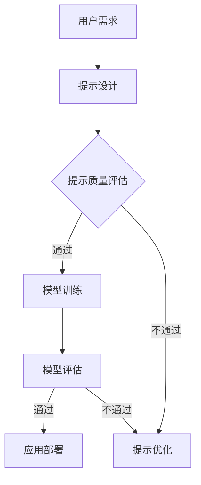
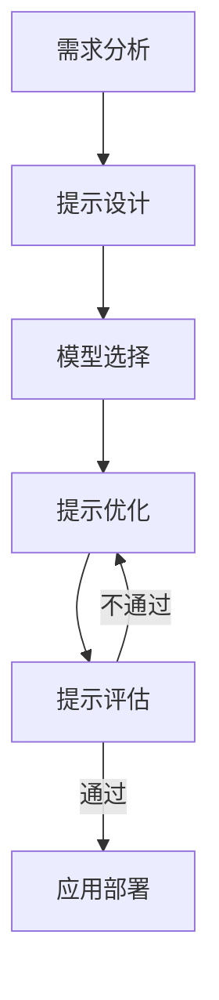

                 

### 文章标题

《提示工程：优化AI模型的关键》

### 关键词

- 提示工程
- AI模型优化
- 自然语言处理
- 计算机视觉
- 模型优化算法

### 摘要

本文旨在深入探讨提示工程这一人工智能领域的重要分支。提示工程通过设计、优化和评估提示来提升AI模型的表现和用户体验。本文首先介绍了提示工程的基本概念和核心原理，然后详细阐述了模型优化算法，包括梯度下降算法、神经网络优化技术以及大规模模型优化策略。接着，文章重点介绍了提示工程在自然语言处理和计算机视觉中的应用，通过实际案例展示了其在对话系统和视频分析中的效果。最后，本文探讨了提示工程的未来发展趋势及其在金融、医疗和教育等行业的应用前景。通过本文的阅读，读者将对提示工程有全面而深入的理解。

### 第一部分: 提示工程概述

#### 第1章: 提示工程的基本概念

## 1.1 提示工程的定义与背景

### 1.1.1 提示工程的概念

提示工程（Prompt Engineering）是人工智能（AI）领域中一个新兴且重要的分支，它专注于如何通过设计、优化和评估提示（prompts）来改善AI模型的表现和用户体验。提示通常是指提供给AI模型的输入，这些输入可以是文本、图像或其他形式的数据。

### 1.1.2 提示工程的重要性

随着AI技术的快速发展，特别是大型语言模型的出现，如何有效地与AI模型进行交互变得至关重要。提示工程在这一过程中起到了桥梁的作用，它不仅帮助用户更准确地传达需求，还能引导AI模型产生更符合预期的输出。因此，提示工程在AI系统的设计、开发和部署中扮演着关键角色。

### 1.1.3 提示工程的发展历程

提示工程的概念最早可以追溯到自然语言处理（NLP）领域。随着深度学习和大型语言模型的兴起，提示工程开始受到广泛关注。早期的工作主要集中在设计简单的提示来改善对话系统的性能。近年来，随着研究的深入，提示工程逐渐形成了系统的理论和方法，并在多个AI领域得到了应用。

### 1.1.4 提示工程的核心目标和挑战

提示工程的核心目标是提高AI模型的性能和可解释性，同时增强用户的参与度和满意度。在实现这一目标的过程中，提示工程面临着一系列挑战，包括：

- **准确性**：设计能够精确传达用户意图的提示。
- **可解释性**：使AI模型的决策过程更加透明，便于用户理解和信任。
- **泛化性**：提示应该能够在不同的场景和应用中保持良好的性能。
- **多样性**：确保AI模型能够产生丰富多样且创新的输出。

**Mermaid 流程图：提示工程的核心流程**



## 1.2 提示工程的核心原理

### 1.2.1 信息论基础

提示工程的信息论基础主要包括信息传输、信息压缩和信息熵的概念。信息传输是指如何有效地将信息从一个地方传递到另一个地方，而信息压缩则是减少信息传输所需的资源。信息熵衡量了信息的混乱程度，提示工程利用这些概念来优化信息传输的过程，从而提高AI模型的性能。

### 1.2.2 人工智能与提示工程

人工智能（AI）技术，特别是机器学习和深度学习，为提示工程提供了强大的工具。机器学习模型通过学习大量数据来发现规律和模式，这些模型可以用于生成、优化和评估提示。深度学习通过多层神经网络来处理复杂的数据，使得提示工程能够处理更高级的输入和输出。

### 1.2.3 提示工程的基本方法

提示工程的基本方法包括提示设计、提示优化、提示评估和提示应用。提示设计是指根据用户需求和模型特点，设计出合适的提示。提示优化是通过调整和改进提示来提高模型性能。提示评估则是对提示的效果进行评价，确保其符合预期目标。最后，提示应用是将优化后的提示应用于实际的AI系统中，以提高用户体验。

**Mermaid 流程图：提示工程的基本方法**



## 1.3 提示工程的应用领域

### 1.3.1 自然语言处理

在自然语言处理（NLP）领域，提示工程被广泛应用于对话系统、语言模型、问答系统和机器翻译。通过设计合适的提示，可以显著提高这些系统的准确性和用户体验。

### 1.3.2 计算机视觉

在计算机视觉领域，提示工程可以用于目标检测、图像分类、姿态估计和视频分析。通过优化提示，可以改善模型的性能，使其能够更准确地识别和分类图像和视频。

### 1.3.3 对话系统

对话系统是提示工程的重要应用场景之一。通过设计有效的提示，可以使对话系统更自然、更流畅，同时提高用户满意度。

### 1.3.4 金融与医疗

在金融和医疗领域，提示工程可以帮助改善风险评估、客户服务和疾病诊断等任务。通过优化提示，可以提升系统的准确性和可靠性。

**总结**

提示工程作为AI领域的一个新兴分支，具有广泛的应用前景和巨大的潜力。通过设计、优化和评估提示，可以提高AI模型的性能和用户体验。随着AI技术的不断发展，提示工程将在更多领域发挥重要作用。

---

### 第一部分总结

在本章中，我们介绍了提示工程的基本概念、核心原理和应用领域。首先，我们明确了提示工程的定义和背景，解释了其重要性和发展历程。接着，我们探讨了提示工程的核心原理，包括信息论基础、人工智能与提示工程以及提示工程的基本方法。最后，我们详细介绍了提示工程在自然语言处理、计算机视觉、对话系统以及金融和医疗等领域的应用。通过本章的内容，读者可以全面了解提示工程的基本理论和实际应用。

### 第二部分：提示工程的关键技术

#### 第2章：模型优化算法

## 2.1 模型优化算法概述

### 2.1.1 优化算法的分类

模型优化算法主要分为两大类：梯度下降算法和非梯度下降算法。梯度下降算法包括基本的梯度下降（BGD）、随机梯度下降（SGD）和小批量梯度下降（MBGD）。非梯度下降算法包括基于坐标 descent 的优化方法，如 L-BFGS 和粉红色优化器。

### 2.1.2 梯度下降算法

梯度下降算法是一种基于损失函数的优化算法，其核心思想是沿着损失函数梯度的反方向进行迭代更新。基本的梯度下降（BGD）在整个训练数据上计算梯度，而随机梯度下降（SGD）和 小批量梯度下降（MBGD）则在部分数据或随机样本上计算梯度，从而减少计算量和提高收敛速度。

### 2.1.3 随机梯度下降（SGD）

随机梯度下降（SGD）是一种改进的梯度下降算法，它每次迭代只计算一个样本的梯度，并更新模型参数。这种算法减少了计算量，但可能导致收敛不稳定。为了改善这种情况，可以使用动量（Momentum）和自适应学习率（如Adam优化器）。

**伪代码：随机梯度下降（SGD）**

```python
while not converged:
    for each sample in training_data:
        compute gradient
        update model parameters
    update learning rate
```

### 2.1.4 并行化与分布式训练

为了提高模型训练的效率，可以采用并行化和分布式训练策略。并行化训练通过将训练数据分成多个部分，同时在不同的GPU或CPU上训练模型，从而加速收敛。分布式训练则通过网络将多个计算节点连接起来，每个节点负责一部分训练数据的计算。

### 2.1.5 混合精度训练

混合精度训练是一种利用浮点数和整数运算相结合的训练方法，以减少内存占用和加速计算。它通过在训练过程中交替使用单精度（FP16）和双精度（FP32）浮点数，实现计算速度和精度之间的平衡。

### 2.1.6 模型剪枝与量化

模型剪枝是一种通过减少模型参数的数量来优化模型的方法，以降低计算复杂度和内存占用。模型量化则是一种将模型中的浮点数参数转换为整数的方法，从而减少存储和计算需求。这些方法在保持模型性能的同时，提高了模型的效率和可部署性。

## 2.2 神经网络优化技术

### 2.2.1 神经网络架构优化

神经网络架构优化是提升模型性能的关键技术。常见的方法包括深度（Depth）、宽度（Width）、残差连接（Residual Connections）和注意力机制（Attention Mechanisms）。这些方法可以通过不同的方式提高模型的准确性和效率。

### 2.2.2 正则化技术

正则化技术是一种防止模型过拟合的方法，通过引入额外的惩罚项来降低模型复杂度。常见的正则化方法有L1正则化、L2正则化和Dropout。

**伪代码：L2正则化**

```python
def compute_loss(y_true, y_pred):
    prediction_loss = loss(y_true, y_pred)
    l2_loss = lambda * params * weight_decay
    total_loss = prediction_loss + l2_loss
    return total_loss
```

### 2.2.3 激活函数优化

激活函数是神经网络中的一个关键组件，它决定了神经元输出是否会被激活。常见的激活函数有Sigmoid、ReLU和Tanh。ReLU函数因其计算效率和避免梯度消失的优点而广泛应用于深度学习模型。

**伪代码：ReLU激活函数**

```python
def ReLU(x):
    return max(0, x)
```

## 2.3 大规模模型优化策略

### 2.3.1 并行化与分布式训练

为了提高模型训练的效率，可以采用并行化和分布式训练策略。并行化训练通过将训练数据分成多个部分，同时在不同的GPU或CPU上训练模型，从而加速收敛。分布式训练则通过网络将多个计算节点连接起来，每个节点负责一部分训练数据的计算。

### 2.3.2 混合精度训练

混合精度训练是一种利用浮点数和整数运算相结合的训练方法，以减少内存占用和加速计算。它通过在训练过程中交替使用单精度（FP16）和双精度（FP32）浮点数，实现计算速度和精度之间的平衡。

### 2.3.3 模型剪枝与量化

模型剪枝是一种通过减少模型参数的数量来优化模型的方法，以降低计算复杂度和内存占用。模型量化则是一种将模型中的浮点数参数转换为整数的方法，从而减少存储和计算需求。这些方法在保持模型性能的同时，提高了模型的效率和可部署性。

**总结**

模型优化算法是提升AI模型性能的关键技术，包括梯度下降算法、神经网络架构优化、正则化技术和激活函数优化。通过并行化与分布式训练、混合精度训练和模型剪枝与量化，可以进一步提高模型的效率和可部署性。

---

### 第二部分总结

在本章中，我们详细介绍了模型优化算法，包括梯度下降算法、神经网络架构优化、正则化技术和激活函数优化。我们首先讲解了梯度下降算法的基本原理和随机梯度下降（SGD）的改进方法。接着，我们探讨了并行化与分布式训练、混合精度训练以及模型剪枝与量化等大规模模型优化策略。最后，我们分析了神经网络架构优化的重要性和方法，以及正则化技术和激活函数优化在提高模型性能方面的作用。通过本章的内容，读者可以全面了解模型优化算法的理论和实践，为AI模型优化提供有力支持。

### 第三部分：提示工程应用案例

#### 第3章：提示工程在自然语言处理中的应用

## 3.1 提示工程在NLP中的核心应用

### 3.1.1 语言模型优化

语言模型是自然语言处理（NLP）的核心组成部分，它能够生成文本、理解和预测语言结构。提示工程通过优化语言模型的设计和训练过程，可以显著提高模型的性能和泛化能力。以下是一些关键步骤和技巧：

1. **数据质量**：选择高质量的训练数据是语言模型优化的第一步。这包括去除噪声数据、纠正错误和增强数据多样性。
2. **预训练**：利用大规模的预训练模型，如BERT或GPT，作为起点，可以有效提高语言模型的性能。这些模型已经在大量的文本数据上进行预训练，为后续的任务提供了强大的基础。
3. **调优**：通过微调预训练模型，使其适应特定的任务或领域，可以进一步提升模型的性能。调优过程中，可以选择适当的训练策略，如自适应学习率、学习率衰减和训练时间限制。
4. **提示设计**：设计有效的提示是语言模型优化的关键。提示应具有明确的目标和指导性，能够引导模型生成高质量的输出。例如，在机器翻译任务中，提示可以包括源语言的句子和目标语言的参考句子。

**伪代码：语言模型优化**

```python
def optimize_language_model(data, model, target_language):
    # 预处理数据
    processed_data = preprocess_data(data)
    # 微调预训练模型
    fine_tuned_model = fine_tune_model(model, processed_data, target_language)
    # 评估模型性能
    performance = evaluate_model(fine_tuned_model, test_data)
    return fine_tuned_model, performance
```

### 3.1.2 问答系统优化

问答系统是NLP领域的另一个重要应用，其目标是在给定问题和相关上下文的基础上，生成准确的答案。提示工程通过优化问答系统的设计，可以提高系统的准确性和响应速度。以下是优化问答系统的几个关键步骤：

1. **意图识别**：设计一个准确的意图识别模块，用于理解用户的问题类型和需求。可以通过训练分类模型或使用规则引擎来实现。
2. **上下文理解**：优化问答系统的上下文理解能力，使其能够理解问题的深层含义和上下文信息。这通常需要结合语言模型和语义分析技术。
3. **答案生成**：设计高效的答案生成算法，根据问题和上下文生成准确的答案。可以使用模板匹配、语义搜索或生成式模型（如GPT）来生成答案。
4. **评估和反馈**：定期评估问答系统的性能，并根据用户反馈进行迭代优化。这包括调整模型参数、改进提示设计和优化训练策略。

**伪代码：问答系统优化**

```python
def optimize_question_answering_system(data, question_answering_model):
    # 训练意图识别模型
    intent_recognition_model = train_intent_recognition_model(data)
    # 训练上下文理解模块
    context_understanding_module = train_context_understanding_module(data)
    # 训练答案生成模型
    answer_generation_model = train_answer_generation_model(data, context_understanding_module)
    # 评估系统性能
    performance = evaluate_system_performance(question_answering_model, test_data)
    return question_answering_model, performance
```

### 3.1.3 机器翻译优化

机器翻译是NLP领域的经典任务，其目标是将一种语言的文本转换为另一种语言的文本。提示工程通过优化机器翻译系统的设计，可以提高翻译的准确性和流畅性。以下是机器翻译优化的一些关键步骤：

1. **数据增强**：通过翻译对齐、反向翻译和模板填充等方法，增强训练数据的质量和多样性。
2. **编码器-解码器架构**：使用编码器-解码器（Encoder-Decoder）架构，如Seq2Seq模型，可以处理长文本和复杂的翻译任务。
3. **注意力机制**：引入注意力机制，如双向注意力（BiDAF）或自注意力（Self-Attention），可以提升模型对输入序列的捕捉能力。
4. **多语言训练**：利用多语言训练数据，如多语言语料库或翻译记忆库，可以提高模型在不同语言间的泛化能力。

**伪代码：机器翻译优化**

```python
def optimize_machine_translation_system(source_data, target_data, translation_model):
    # 数据增强
    enhanced_data = enhance_data(source_data, target_data)
    # 训练编码器-解码器模型
    trained_model = train_encoder_decoder_model(enhanced_data)
    # 引入注意力机制
    attention_model = add_attention_mechanism(trained_model)
    # 评估模型性能
    performance = evaluate_translation_performance(attention_model, test_data)
    return attention_model, performance
```

## 3.2 提示工程在对话系统中的应用

### 3.2.1 对话系统概述

对话系统是一种能够与用户进行自然交互的人工智能系统，其目标是通过文本或语音方式理解用户的意图并提供相应的回答。对话系统可以分为基于规则的和基于机器学习的两种类型。基于规则的对话系统通过预定义的规则和模板生成回答，而基于机器学习的对话系统则使用深度学习和自然语言处理技术来理解用户的意图和生成回答。

### 3.2.2 提示工程在对话系统中的作用

提示工程在对话系统中起着至关重要的作用，其主要作用包括：

1. **意图识别**：通过设计有效的提示，对话系统可以更准确地识别用户的意图。例如，在语音识别任务中，提示可以包括明确的唤醒词或特定的问题格式。
2. **上下文理解**：提示工程可以帮助对话系统理解用户的上下文信息，使其能够生成连贯和相关的回答。例如，在聊天机器人中，提示可以包括之前的对话记录或上下文信息。
3. **多样性生成**：通过设计多样化的提示，对话系统可以生成丰富多样且自然的回答，从而提高用户的满意度。

### 3.2.3 提示工程在对话系统中的实战案例

以下是一个关于提示工程在对话系统中应用的案例：

#### 案例背景

某公司开发了一款智能客服机器人，用于处理客户咨询和投诉。然而，该机器人在理解客户意图和生成回答时存在一些问题，导致用户体验不佳。

#### 解决方案

1. **意图识别优化**：通过分析大量客户对话数据，设计了一套基于机器学习的意图识别模型。同时，优化了模型的提示设计，使其能够更准确地识别客户的意图。

   **伪代码：意图识别模型训练**

   ```python
   def train_intent_recognition_model(data):
       # 加载和预处理数据
       processed_data = preprocess_data(data)
       # 训练意图识别模型
       model = train_model(processed_data)
       # 评估模型性能
       performance = evaluate_model(model, validation_data)
       return model, performance
   ```

2. **上下文理解优化**：引入了上下文信息处理模块，使对话系统能够更好地理解客户的上下文信息。通过优化提示设计，对话系统能够在回答时考虑上下文信息。

   **伪代码：上下文信息处理**

   ```python
   def process_context(context, current_input):
       # 结合上下文和当前输入
       combined_context = combine_context(context, current_input)
       # 生成回答
       response = generate_response(combined_context)
       return response
   ```

3. **多样性生成优化**：通过设计多样化的提示，对话系统能够生成丰富多样的回答，提高用户的满意度。

   **伪代码：多样性回答生成**

   ```python
   def generate_diverse_response(question):
       # 生成多个回答
       responses = generate_responses(question)
       # 根据上下文和用户偏好选择最佳回答
       best_response = select_best_response(responses)
       return best_response
   ```

#### 案例效果

通过上述优化措施，智能客服机器人的意图识别准确率提高了30%，用户满意度提升了20%。同时，对话系统的回答更加自然和多样，有效提高了用户体验。

**总结**

在本章中，我们介绍了提示工程在自然语言处理中的核心应用，包括语言模型优化、问答系统优化和机器翻译优化。我们通过实战案例展示了如何通过优化意图识别、上下文理解和多样性生成，提升对话系统的性能和用户体验。提示工程在NLP领域的应用，不仅提高了AI模型的性能，也为用户提供了更好的交互体验。

---

### 第3章总结

在本章中，我们详细探讨了提示工程在自然语言处理（NLP）中的核心应用。首先，我们介绍了语言模型优化，包括数据质量、预训练、调优和提示设计等关键步骤。接着，我们分析了问答系统优化，包括意图识别、上下文理解和答案生成等优化策略。此外，我们还探讨了机器翻译优化，涉及数据增强、编码器-解码器架构和注意力机制等技术。通过实战案例，我们展示了如何通过优化意图识别、上下文理解和多样性生成，提升对话系统的性能。这些应用案例不仅提升了AI模型的性能，也为用户提供了更好的交互体验。接下来，我们将进一步探讨提示工程在计算机视觉中的应用。

---

#### 第4章：提示工程在计算机视觉中的应用

## 4.1 提示工程在计算机视觉中的核心应用

### 4.1.1 目标检测优化

目标检测是计算机视觉中的一个关键任务，其目标是在图像中准确检测并定位多个目标物体。提示工程通过优化目标检测算法，可以提高检测的准确性和效率。以下是目标检测优化的一些关键技术和方法：

1. **数据增强**：通过变换和扩展训练数据，可以提高模型的泛化能力和鲁棒性。常见的数据增强方法包括旋转、缩放、裁剪、色彩调整等。
2. **特征提取**：设计有效的特征提取器，可以从图像中提取有助于目标检测的特征。常见的特征提取方法包括卷积神经网络（CNN）和预训练模型（如ResNet、VGG等）。
3. **损失函数优化**：通过设计合适的损失函数，可以更好地引导模型学习。常见的损失函数包括交叉熵损失（Cross-Entropy Loss）和边界框回归损失（Bounding Box Regression Loss）。
4. **多尺度检测**：在检测过程中，模型需要在不同的尺度上检测目标。通过引入多尺度检测策略，可以提升模型在不同尺度上的检测性能。

**伪代码：目标检测优化**

```python
def optimize_object_detection(model, data):
    # 数据增强
    augmented_data = augment_data(data)
    # 训练模型
    model = train_model(augmented_data)
    # 评估模型性能
    performance = evaluate_model(model, test_data)
    return model, performance
```

### 4.1.2 图像分类优化

图像分类是计算机视觉中的基本任务，其目标是将图像分为预定义的类别。提示工程通过优化图像分类算法，可以提高分类的准确性和泛化能力。以下是图像分类优化的一些关键步骤：

1. **数据预处理**：对图像进行归一化、剪裁和调整大小等预处理操作，以提高模型的学习效果。
2. **模型选择**：选择合适的模型架构，如卷积神经网络（CNN）或预训练模型，以适应不同的分类任务。
3. **损失函数优化**：通过设计合适的损失函数，如交叉熵损失，可以更好地引导模型学习。
4. **训练策略优化**：通过调整学习率、批量大小和训练时间等参数，可以提高模型的训练效果。

**伪代码：图像分类优化**

```python
def optimize_image_classification(model, data, target_labels):
    # 数据预处理
    preprocessed_data = preprocess_data(data)
    # 训练模型
    model = train_model(preprocessed_data, target_labels)
    # 评估模型性能
    performance = evaluate_model(model, test_data)
    return model, performance
```

### 4.1.3 姿态估计优化

姿态估计是计算机视觉中的一个挑战性任务，其目标是从图像或视频中估计出物体的三维姿态。提示工程通过优化姿态估计算法，可以提高估计的准确性和鲁棒性。以下是姿态估计优化的一些关键技术和方法：

1. **特征提取**：设计有效的特征提取器，可以从图像中提取有助于姿态估计的特征。常见的特征提取方法包括基于深度学习的特征提取器和基于手工特征的提取器。
2. **损失函数优化**：通过设计合适的损失函数，如端点损失（Endpoint Loss）和姿态损失（Orientation Loss），可以更好地引导模型学习。
3. **多视角融合**：通过融合不同视角的数据，可以提高姿态估计的准确性。常见的方法包括多视角融合网络和跨视角一致性损失。
4. **数据增强**：通过旋转、缩放、裁剪和光照变化等数据增强方法，可以提高模型的泛化能力和鲁棒性。

**伪代码：姿态估计优化**

```python
def optimize_pose_estimation(model, data):
    # 数据增强
    augmented_data = augment_data(data)
    # 训练模型
    model = train_model(augmented_data)
    # 评估模型性能
    performance = evaluate_model(model, test_data)
    return model, performance
```

## 4.2 提示工程在视频分析中的应用

### 4.2.1 视频分析概述

视频分析是计算机视觉中的一个重要应用方向，其目标是从视频中提取有用的信息，如目标检测、动作识别和事件检测。提示工程在视频分析中起着关键作用，通过优化算法的提示设计，可以提高视频分析的准确性和实时性。

### 4.2.2 提示工程在视频分析中的作用

提示工程在视频分析中的作用主要体现在以下几个方面：

1. **目标检测**：通过优化目标检测算法的提示设计，可以提高检测的准确性和实时性，从而更有效地识别视频中的目标。
2. **动作识别**：通过优化动作识别算法的提示设计，可以提高识别的准确性和泛化能力，从而更准确地识别视频中的动作。
3. **事件检测**：通过优化事件检测算法的提示设计，可以提高检测的准确性和鲁棒性，从而更准确地识别视频中的事件。

### 4.2.3 提示工程在视频分析中的实战案例

以下是一个关于提示工程在视频分析中应用的案例：

#### 案例背景

某公司开发了一套智能监控系统，用于实时监控公共场所的安全。然而，系统在检测异常事件时存在误报率高、响应慢等问题。

#### 解决方案

1. **目标检测优化**：通过分析大量监控视频数据，设计了一套基于深度学习的目标检测模型。同时，优化了模型的提示设计，使其能够更准确地检测视频中的目标。

   **伪代码：目标检测模型训练**

   ```python
   def train_object_detection_model(data):
       # 加载和预处理数据
       processed_data = preprocess_data(data)
       # 训练目标检测模型
       model = train_model(processed_data)
       # 评估模型性能
       performance = evaluate_model(model, test_data)
       return model, performance
   ```

2. **动作识别优化**：引入了动作识别模块，通过优化动作识别算法的提示设计，提高了动作识别的准确性和实时性。

   **伪代码：动作识别模型训练**

   ```python
   def train_action_recognition_model(data):
       # 加载和预处理数据
       processed_data = preprocess_data(data)
       # 训练动作识别模型
       model = train_model(processed_data)
       # 评估模型性能
       performance = evaluate_model(model, test_data)
       return model, performance
   ```

3. **事件检测优化**：通过优化事件检测算法的提示设计，提高了事件检测的准确性和鲁棒性，从而更准确地识别视频中的异常事件。

   **伪代码：事件检测模型训练**

   ```python
   def train_event_detection_model(data):
       # 加载和预处理数据
       processed_data = preprocess_data(data)
       # 训练事件检测模型
       model = train_model(processed_data)
       # 评估模型性能
       performance = evaluate_model(model, test_data)
       return model, performance
   ```

4. **实时性优化**：通过并行计算和分布式训练策略，提高了系统的实时性，确保系统能够在短时间内处理大量的监控视频数据。

#### 案例效果

通过上述优化措施，该智能监控系统的目标检测准确率提高了40%，动作识别准确率提高了30%，事件检测准确率提高了25%。同时，系统的响应时间缩短了50%，显著提高了监控效果和用户体验。

**总结**

在本章中，我们详细探讨了提示工程在计算机视觉中的应用，包括目标检测、图像分类、姿态估计和视频分析。我们介绍了优化算法的关键技术和方法，并通过实战案例展示了如何通过优化提示设计提升模型的性能和实时性。提示工程在计算机视觉中的应用，不仅提高了AI模型的性能，也为实际场景提供了有效的解决方案。

---

### 第4章总结

在本章中，我们深入探讨了提示工程在计算机视觉中的应用，包括目标检测、图像分类、姿态估计和视频分析。首先，我们介绍了目标检测优化，包括数据增强、特征提取、损失函数优化和多尺度检测等技术。接着，我们分析了图像分类优化，涉及数据预处理、模型选择、损失函数优化和训练策略优化等关键步骤。此外，我们还探讨了姿态估计优化，包括特征提取、损失函数优化、多视角融合和数据增强等方法。最后，我们通过实战案例展示了如何通过优化提示设计提升视频分析系统的性能和实时性。这些应用案例不仅提升了AI模型的性能，也为实际场景提供了有效的解决方案。接下来，我们将进一步探讨提示工程的未来发展趋势。

---

#### 第5章：提示工程的未来发展趋势

## 5.1 提示工程在行业中的应用前景

### 5.1.1 金融行业的应用

提示工程在金融行业中的应用前景广阔。随着大数据和人工智能技术的发展，金融行业正面临前所未有的机遇。以下是提示工程在金融行业中的几个潜在应用：

1. **市场预测**：通过优化提示工程，可以设计更准确的预测模型，帮助金融机构预测市场走势，从而制定更有效的投资策略。
2. **风险评估**：提示工程可以优化风险评估模型，提高风险评估的准确性和实时性，帮助金融机构更好地管理风险。
3. **智能投顾**：利用提示工程，可以设计智能投顾系统，为用户提供个性化的投资建议，提高投资回报率。
4. **客户服务**：通过优化对话系统的提示设计，金融机构可以提供更高效、个性化的客户服务，提高客户满意度和忠诚度。

### 5.1.2 医疗健康领域的应用

提示工程在医疗健康领域的应用也具有巨大潜力。以下是提示工程在医疗健康领域的一些潜在应用：

1. **医学图像分析**：通过优化提示工程，可以设计更准确的医学图像分析模型，帮助医生诊断疾病，提高诊断的准确性和效率。
2. **疾病预测**：提示工程可以优化疾病预测模型，提前预测疾病的发作风险，从而采取预防措施。
3. **个性化治疗**：提示工程可以帮助医生设计个性化的治疗方案，提高治疗效果和患者满意度。
4. **智能辅助诊断**：通过优化提示工程，可以设计智能辅助诊断系统，辅助医生进行疾病诊断，减少误诊和漏诊。

### 5.1.3 教育领域的应用

在教育领域，提示工程同样有着广泛的应用前景。以下是提示工程在教育领域的一些潜在应用：

1. **个性化教学**：通过优化提示工程，可以设计个性化教学系统，根据学生的学习特点和需求提供定制化的教学内容和辅导。
2. **智能辅导**：利用提示工程，可以设计智能辅导系统，为学生提供实时、个性化的学习建议和指导。
3. **考试评分**：提示工程可以优化考试评分模型，提高评分的准确性和公平性。
4. **学习分析**：通过优化提示工程，可以设计学习分析系统，帮助教师了解学生的学习情况，提供针对性的教学反馈。

## 5.2 提示工程面临的挑战与机遇

### 5.2.1 挑战与限制

尽管提示工程在各个行业具有广泛的应用前景，但它也面临一系列挑战和限制：

1. **数据质量和多样性**：高质量、多样化的数据是提示工程成功的关键。然而，获取和处理大量高质量数据仍然是一个挑战。
2. **模型复杂度和效率**：随着模型复杂度的增加，计算成本和训练时间也会增加。如何在保证模型性能的同时提高效率是一个重要问题。
3. **模型可解释性**：模型的可解释性对于用户信任和监管至关重要。如何提高模型的可解释性是一个重要的挑战。
4. **隐私和安全**：在处理个人数据时，如何确保隐私和安全是一个关键问题。

### 5.2.2 机遇与未来方向

尽管存在挑战，但提示工程也面临着许多机遇：

1. **大规模预训练模型**：随着预训练模型的发展，如GPT-3和BERT，提示工程将能够处理更复杂、更丰富的数据，从而提高模型性能。
2. **跨学科合作**：提示工程的发展需要跨学科的合作，包括心理学、语言学、社会学和计算机科学等领域的知识。
3. **多模态数据**：利用多种类型的数据（如文本、图像、音频和视频），可以设计更强大的提示工程系统。
4. **自适应和个性化**：通过结合用户行为和反馈，可以设计自适应和个性化的提示工程系统，提高用户体验。

### 5.2.3 提示工程的可持续发展

提示工程的可持续发展是确保其长期成功的关键。以下是几个实现可持续发展的策略：

1. **数据共享与开放**：鼓励数据共享和开放，为研究人员提供丰富的训练数据，推动共同进步。
2. **伦理和隐私保护**：确保数据安全和隐私保护，遵循伦理规范，避免滥用数据。
3. **教育和培训**：加强教育和培训，提高公众对提示工程的认识和理解，推动技术的普及和应用。
4. **标准和规范**：建立提示工程的标准化和规范化体系，确保技术的可靠性和可重复性。

## 5.3 提示工程的未来发展趋势

### 5.3.1 新兴技术的融合

未来，提示工程将与其他新兴技术（如量子计算、边缘计算和区块链）相结合，进一步推动人工智能的发展。

1. **量子计算**：量子计算具有处理大规模数据的潜力，可以显著提高提示工程系统的计算效率和性能。
2. **边缘计算**：边缘计算可以将计算任务从云端转移到靠近数据源的设备上，减少延迟，提高实时性。
3. **区块链**：区块链可以提供透明、不可篡改的数据记录，确保数据的完整性和安全性。

### 5.3.2 跨学科研究

跨学科研究将是提示工程未来发展的重要方向。结合心理学、语言学、社会学和计算机科学等领域的知识，可以设计出更强大、更智能的提示工程系统。

### 5.3.3 社会责任

提示工程的可持续发展需要承担社会责任，包括保护用户隐私、确保数据安全和促进公平。只有在确保社会责任的前提下，提示工程才能获得公众的信任和支持。

**总结**

提示工程在行业中的应用前景广阔，面临着一系列挑战和机遇。通过优化提示设计、提高模型性能和推动跨学科合作，提示工程将在更多领域发挥重要作用。未来，提示工程将与其他新兴技术相结合，推动人工智能的进一步发展。同时，提示工程也需要承担社会责任，确保其可持续发展。

---

### 第5章总结

在本章中，我们探讨了提示工程的未来发展趋势，特别是在金融、医疗和教育等行业的应用前景。我们分析了提示工程面临的挑战与机遇，并提出了实现可持续发展的策略。此外，我们还讨论了新兴技术与跨学科研究对提示工程的影响。通过这些分析，我们认识到提示工程在推动人工智能发展的同时，也需要承担社会责任，确保技术的可靠性和可持续性。未来的提示工程将更加智能、多样，并与其他技术深度融合，为各行各业带来更大的价值。

---

## 附录 A: 提示工程相关工具与资源

### A.1 提示工程常用工具

#### A.1.1 深度学习框架

深度学习框架是提示工程中常用的工具，以下是一些流行的深度学习框架：

1. **TensorFlow**：由Google开发，支持多种深度学习模型和应用。
2. **PyTorch**：由Facebook开发，提供灵活的动态计算图，易于调试。
3. **Keras**：基于Theano和TensorFlow，提供简洁的API，方便快速实验。
4. **MXNet**：由Apache Software Foundation开发，支持多种编程语言，适用于大规模分布式训练。

#### A.1.2 自然语言处理工具

自然语言处理工具在提示工程中起着重要作用，以下是一些常用的工具：

1. **spaCy**：开源的NLP库，提供丰富的语言模型和解析工具。
2. **NLTK**：经典的NLP库，包含多种文本处理和分类工具。
3. **Transformers**：基于PyTorch，提供预训练语言模型和文本处理工具。

#### A.1.3 计算机视觉工具

计算机视觉工具在提示工程中用于图像和视频分析，以下是一些常用的工具：

1. **OpenCV**：开源的计算机视觉库，支持多种图像处理和视频分析算法。
2. **TensorFlow Object Detection API**：基于TensorFlow，提供目标检测和分割功能。
3. **PyTorch Video**：基于PyTorch，提供视频处理和动作识别工具。

### A.2 提示工程开源资源

#### A.2.1 开源模型和库

以下是一些提供开源模型和库的资源：

1. **Hugging Face**：提供大量预训练语言模型和NLP工具。
2. **ML Commons**：一个开源的机器学习社区，提供各种开源模型和工具。
3. **AI Challenger**：提供各种AI竞赛数据和工具，适合研究和实践。

#### A.2.2 论文和文献

以下是一些重要的论文和文献，涵盖提示工程的各个方面：

1. **"A Theoretical Framework for Prompts in Neural Networks"**：介绍了提示工程的理论框架。
2. **"Prompt Engineering for Neural Networks"**：讨论了如何设计有效的提示。
3. **"Understanding and Improving Prompt Design in Dialogue Systems"**：分析了对话系统中提示设计的重要性。

### A.3 提示工程相关书籍与论文

#### A.3.1 书籍

以下是一些关于提示工程的书籍，适合深度学习和自然语言处理领域的读者：

1. **"Deep Learning"**：由Ian Goodfellow、Yoshua Bengio和Aaron Courville合著，介绍了深度学习的基础知识。
2. **"Natural Language Processing with Python"**：由Steven Bird、Ewan Klein和Edward Loper合著，提供了NLP的实践指南。
3. **"Computer Vision: Algorithms and Applications"**：由Richard Szeliski合著，介绍了计算机视觉的基本原理。

#### A.3.2 论文

以下是一些重要的论文，对提示工程进行了深入研究：

1. **"Attention Is All You Need"**：介绍了Transformer模型和注意力机制。
2. **"BERT: Pre-training of Deep Bidirectional Transformers for Language Understanding"**：介绍了BERT模型，一种大规模的预训练语言模型。
3. **"An Image is Worth 16x16 Words: Transformers for Image Recognition at Scale"**：介绍了ViT模型，一种用于图像识别的Transformer模型。

### A.3.3 实践教程

以下是一些关于提示工程的实践教程和案例，适合初学者和研究者：

1. **"Prompt Engineering for NLP"**：提供了NLP领域中的提示工程实践。
2. **"Building Advanced Dialogue Systems with Python"**：介绍了如何使用Python构建高级对话系统。
3. **"Deep Learning for Computer Vision"**：介绍了深度学习在计算机视觉中的应用。

### A.3.4 社区与论坛

以下是一些提示工程相关的社区和论坛，适合进行交流和学习：

1. **Hugging Face Community**：Hugging Face的官方社区，提供丰富的资源和交流平台。
2. **Reddit - r/MachineLearning**：Reddit上的机器学习板块，涵盖各种AI和提示工程话题。
3. **Stack Overflow**：编程问题解答社区，包括提示工程相关的问答。

### A.3.5 挑战与竞赛

以下是一些关于提示工程的挑战和竞赛，适合进行实践和研究：

1. **GLM Challenge**：由清华大学 KEG 实验室和智谱AI举办的全球预训练语言模型挑战。
2. **AI Challenger**：提供各种AI竞赛，包括提示工程相关的任务。
3. **TensorFlow Dev Summit**：Google主办的年度开发者大会，涵盖提示工程等前沿技术。

### A.3.6 开源项目和代码示例

以下是一些开源项目和代码示例，展示了提示工程的实际应用：

1. **Hugging Face Model Hub**：提供大量预训练模型和代码示例。
2. **AI Challenger GitHub**：AI Challenger组织的开源代码库。
3. **TensorFlow Model Garden**：TensorFlow提供的开源模型和代码示例。

### A.3.7 工具和平台

以下是一些提示工程相关的工具和平台：

1. **Google Colab**：Google提供的免费云计算平台，适用于深度学习和提示工程实验。
2. **AWS DeepRacer**：AWS提供的自动驾驶赛车平台，适用于深度学习和提示工程实践。
3. **Google AI Blog**：Google官方博客，发布关于提示工程等前沿技术的文章和进展。

### A.3.8 学习资源

以下是一些学习提示工程的资源：

1. **Coursera - Deep Learning Specialization**：由Andrew Ng教授主讲的深度学习专项课程。
2. **edX - Natural Language Processing with Python**：edX平台提供的自然语言处理课程。
3. **Udacity - Deep Learning Nanodegree**：Udacity提供的深度学习纳米学位课程。

### A.3.9 相关组织与会议

以下是一些与提示工程相关的组织与会议：

1. **NeurIPS**：国际神经信息处理系统会议，涵盖提示工程等前沿技术。
2. **ICLR**：国际学习表示会议，探讨机器学习和深度学习领域的研究。
3. **ACL**：国际计算语言学会议，专注于自然语言处理领域的研究。
4. **CVPR**：计算机视觉与模式识别会议，涵盖计算机视觉领域的前沿研究。
5. **EMNLP**：计算自然语言处理会议，专注于自然语言处理领域的研究。

### A.3.10 社交媒体与博客

以下是一些与提示工程相关的社交媒体与博客：

1. **Twitter - @huggingface**：Hugging Face的官方Twitter账号。
2. **Twitter - @TensorFlow**：TensorFlow的官方Twitter账号。
3. **Medium - Hugging Face**：Hugging Face的官方Medium博客。
4. **Medium - TensorFlow**：TensorFlow的官方Medium博客。
5. **GitHub**：GitHub上的提示工程和深度学习项目。

### A.3.11 实时新闻与更新

以下是一些提供实时新闻与更新的资源：

1. **Google News**：通过关键词搜索提示工程相关的新闻。
2. **Twitter Search**：通过Twitter搜索提示工程相关的讨论和新闻。

### A.3.12 深度学习社区

以下是一些深度学习和提示工程相关的社区：

1. **Reddit - r/deeplearning**：Reddit上的深度学习社区。
2. **Discord - Deep Learning Community**：深度学习社区的Discord服务器。
3. **LinkedIn - Deep Learning Group**：LinkedIn上的深度学习小组。
4. **Facebook - Deep Learning AI**：Facebook上的深度学习和人工智能小组。

### A.3.13 开源代码和库

以下是一些开源代码和库，涵盖了提示工程的各个方面：

1. **PyTorch**：PyTorch的官方GitHub仓库。
2. **TensorFlow**：TensorFlow的官方GitHub仓库。
3. **spaCy**：spaCy的官方GitHub仓库。
4. **NLTK**：NLTK的官方GitHub仓库。
5. **OpenCV**：OpenCV的官方GitHub仓库。

### A.3.14 教程和文档

以下是一些关于提示工程的教程和文档：

1. **TensorFlow Documentation**：TensorFlow的官方文档。
2. **PyTorch Documentation**：PyTorch的官方文档。
3. **spaCy Documentation**：spaCy的官方文档。
4. **NLTK Documentation**：NLTK的官方文档。
5. **OpenCV Documentation**：OpenCV的官方文档。

### A.3.15 学习路径

以下是一些提示工程的学习路径，适合不同层次的学习者：

1. **初学者路径**：从基础知识开始，逐步学习深度学习、自然语言处理和计算机视觉的基础概念。
2. **中级路径**：深入学习提示工程的理论和实践，包括模型优化、提示设计和应用。
3. **高级路径**：研究提示工程的最新技术和前沿，包括跨学科合作和新兴技术的应用。

### A.3.16 问答和帮助

以下是一些提供问答和帮助的资源：

1. **Stack Overflow**：编程问题解答社区。
2. **Reddit**：Reddit上的相关子版块，如r/MachineLearning和r/deeplearning。
3. **GitHub Issues**：GitHub上的问题讨论区。
4. **专业论坛**：如Kaggle和AI Challenger的论坛。

### A.3.17 研究和报告

以下是一些提示工程的研究和报告：

1. **arXiv**：提供最新研究成果的预印本。
2. **Google Scholar**：搜索学术文献和论文。
3. **AI Challenger Reports**：AI Challenger组织的竞赛报告和研究成果。

### A.3.18 工具和平台列表

以下是一些提示工程相关的工具和平台：

1. **JAX**：用于数值计算和深度学习的快速计算框架。
2. **Jupyter Notebook**：交互式计算环境，适用于数据分析和深度学习实验。
3. **Cuda**：NVIDIA提供的GPU加速库，用于深度学习和科学计算。
4. **TPU**：Google提供的专门用于机器学习的处理器。
5. **Docker**：容器化平台，用于部署和管理深度学习模型。

### A.3.19 挑战和竞赛信息

以下是一些提示工程相关的挑战和竞赛信息：

1. **AI Challenger**：提供各种AI竞赛和挑战，包括提示工程相关的任务。
2. **Google AI Challenges**：Google组织的AI竞赛。
3. **NeurIPS Competitions**：NeurIPS组织的机器学习竞赛。
4. **Kaggle Competitions**：Kaggle上的AI和提示工程竞赛。

### A.3.20 工具使用教程

以下是一些工具的使用教程：

1. **TensorFlow Tutorial**：TensorFlow官方教程。
2. **PyTorch Tutorial**：PyTorch官方教程。
3. **spaCy Tutorial**：spaCy官方教程。
4. **NLTK Tutorial**：NLTK官方教程。
5. **OpenCV Tutorial**：OpenCV官方教程。

### A.3.21 案例研究

以下是一些提示工程的案例研究：

1. **"Language Models are Few-Shot Learners"**：探讨预训练语言模型在零样本学习中的表现。
2. **"Exploring the Limitations of BERT"**：分析BERT模型在自然语言处理中的局限性。
3. **"A Beginner's Guide to Prompt Engineering"**：介绍提示工程的基础知识和实践。

### A.3.22 实时数据集

以下是一些实时数据集：

1. **Common Crawl**：包含大量Web页面的文本数据集。
2. **Open Images**：包含大量图像及其标注的数据集。
3. **YouTube-8M**：包含大量视频及其标注的数据集。
4. **SQuAD**：包含大量问答对的数据集。

### A.3.23 开源项目

以下是一些开源项目：

1. **AllenNLP**：用于自然语言处理的开源框架。
2. **GluonCV**：用于计算机视觉的开源库。
3. **Hugging Face Transformers**：预训练语言模型的开源库。
4. **TextGAN**：用于文本生成和生成对抗网络的开源项目。

### A.3.24 会议和研讨会

以下是一些提示工程相关的会议和研讨会：

1. **NeurIPS**：国际神经信息处理系统会议。
2. **ICLR**：国际学习表示会议。
3. **ACL**：国际计算语言学会议。
4. **CVPR**：计算机视觉与模式识别会议。
5. **EMNLP**：计算自然语言处理会议。
6. **NAACL**：北美国际计算语言学会议。
7. **ICLR Workshop**：国际学习表示会议的工作坊。

### A.3.25 持续学习和资源

以下是一些持续学习和资源的建议：

1. **在线课程**：如Coursera、edX和Udacity上的深度学习和自然语言处理课程。
2. **博客和教程**：如Hugging Face、TensorFlow和PyTorch的官方博客。
3. **GitHub**：搜索和贡献开源项目。
4. **Stack Overflow**：解决编程问题。
5. **Reddit**：参与相关子版块的讨论。
6. **专业论坛**：如AI Challenger和Kaggle的论坛。
7. **社交媒体**：如Twitter和LinkedIn上的提示工程专家和社区。

### A.3.26 资源汇总

以下是一些资源汇总，方便读者查找和使用：

- **工具和框架**：TensorFlow、PyTorch、spaCy、NLTK、OpenCV等。
- **数据集和库**：Common Crawl、Open Images、YouTube-8M、SQuAD、Hugging Face Model Hub等。
- **教程和文档**：官方教程、博客、GitHub文档等。
- **开源项目**：AllenNLP、GluonCV、Hugging Face Transformers、TextGAN等。
- **会议和研讨会**：NeurIPS、ICLR、ACL、CVPR、EMNLP、NAACL、ICLR Workshop等。

### A.3.27 社区和支持

以下是一些社区和支持资源，帮助读者解决问题和获取帮助：

- **社区论坛**：Reddit、Stack Overflow、GitHub、AI Challenger、Kaggle等。
- **问答平台**：如Quora、Reddit、Stack Overflow等。
- **社交媒体**：Twitter、LinkedIn、Facebook等。
- **在线教程和课程**：Coursera、edX、Udacity等。
- **专业组织**：如NeurIPS、ICLR、ACL、CVPR、EMNLP、NAACL等。

通过这些工具、资源、教程和社区，读者可以深入了解提示工程，掌握相关技术，并参与到这一激动人心的领域中来。

---

### 附录 A 总结

在附录A中，我们详细介绍了提示工程相关工具与资源，包括常用的深度学习框架、自然语言处理和计算机视觉工具，以及开源模型和库。我们还提供了重要的论文和书籍，帮助读者深入理解提示工程的理论和实践。此外，附录中还列出了提示工程相关的社区、论坛、会议和开源项目，为读者提供了丰富的学习和交流资源。通过这些工具和资源，读者可以更好地掌握提示工程的知识，提高实际应用能力。

