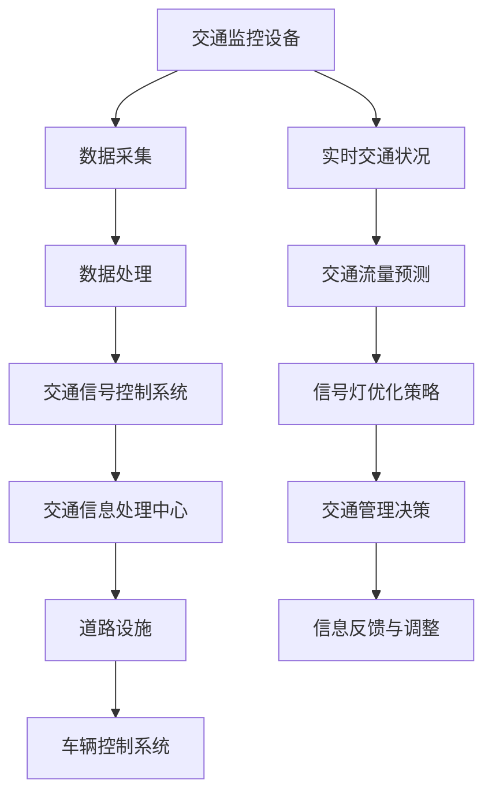
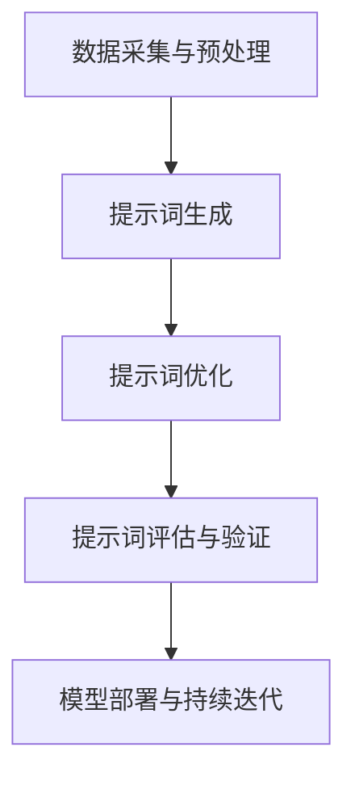
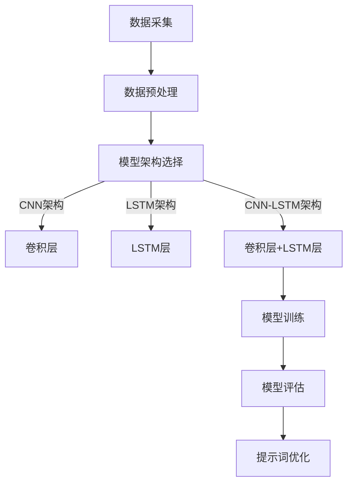
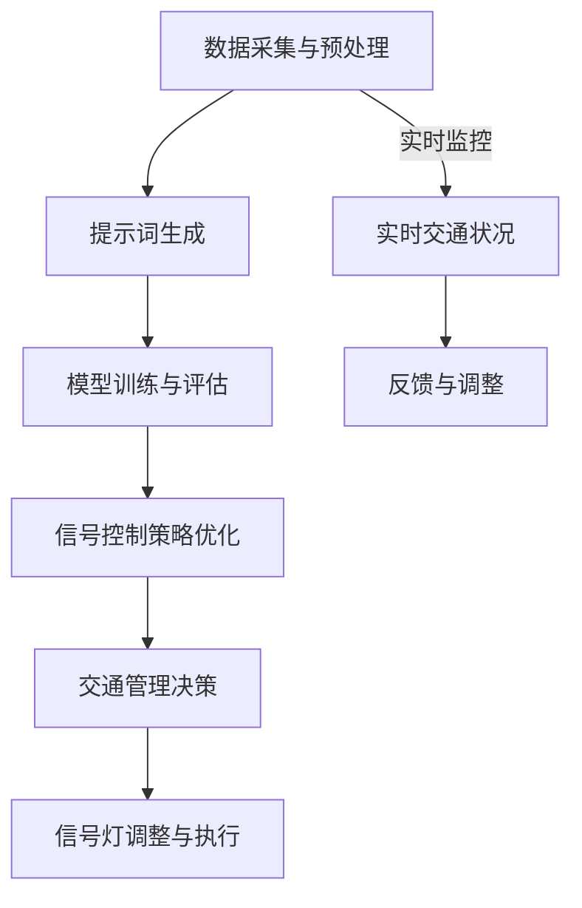
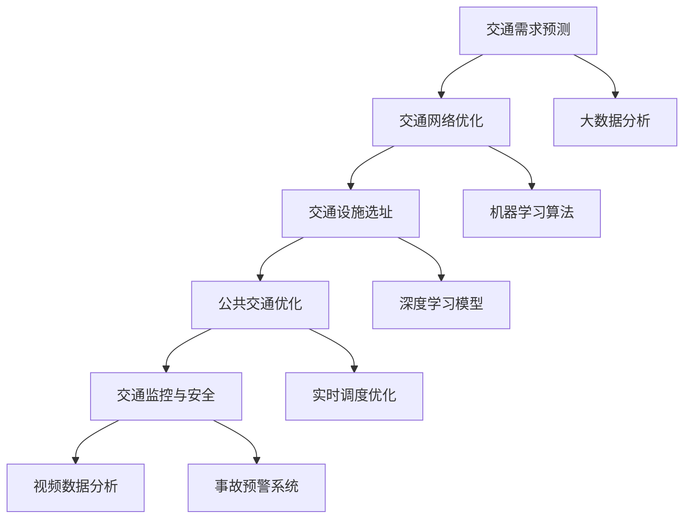
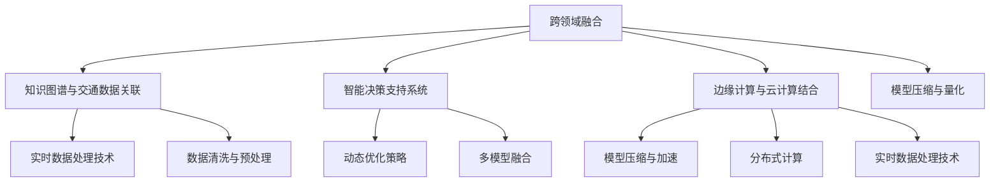
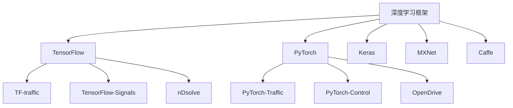
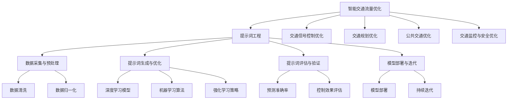

                 

## 第1章：智能交通流量优化背景与挑战

智能交通流量优化是现代交通管理领域的重要研究方向，其核心目的是通过技术手段提高道路通行能力，减少交通拥堵，提升交通效率，进而改善出行体验。随着城市化进程的加快和机动车数量的急剧增长，交通拥堵问题已成为全球许多城市面临的严峻挑战。

### 1.1 智能交通流量优化概述

**交通流量的定义与分类**

交通流量是指单位时间内通过某一交叉路口或道路段的车流量。根据交通流量的特性，可以将其分为以下几类：

- **自由流**：车辆在道路上自由行驶，无拥堵现象。
- **拥挤流**：车辆在道路上行驶时，速度受到限制，车辆之间出现排队现象。
- **阻塞流**：车辆在道路上几乎停滞不前，交通严重堵塞。

**智能交通流量优化的意义**

智能交通流量优化具有重要意义，主要体现在以下几个方面：

- **提高道路通行能力**：通过优化交通信号灯时长、合理规划道路布局等手段，提高道路的通行能力，减少拥堵。
- **减少交通事故**：通过智能监控系统实时监控道路状况，及时发现潜在安全隐患，降低交通事故发生率。
- **降低污染物排放**：优化交通流量可以减少车辆的停驶时间，降低机动车排放的有害物质，改善空气质量。
- **提高出行效率**：优化交通流量可以使车辆行驶时间缩短，提升出行效率，减少因交通拥堵带来的时间和经济成本。

### 1.2 智能交通系统的组成与原理

**智能交通系统的主要组成部分**

智能交通系统（Intelligent Transportation System, ITS）主要包括以下几个组成部分：

- **交通监控设备**：如摄像头、雷达、地磁传感器等，用于实时监测道路状况。
- **交通信息处理中心**：对采集到的交通数据进行处理、分析和存储，为交通管理和优化提供数据支持。
- **交通信号控制系统**：根据实时交通状况动态调整交通信号灯时长，优化交通流量。
- **车辆控制系统**：通过车载设备实时监控车辆状态，实现车辆间的信息共享和协同驾驶。
- **道路设施**：如电子收费系统、道路标线、可变信息板等，用于提供交通诱导和信息服务。

**数据采集、处理与传输技术**

- **数据采集**：通过各类传感器和摄像头采集交通流量、车速、占有率等交通信息。
- **数据处理**：利用大数据技术和人工智能算法对采集到的交通数据进行处理，提取有用信息。
- **数据传输**：通过无线通信技术（如Wi-Fi、4G、5G等）将处理后的数据传输到交通信息处理中心。

### 1.3 当前交通流量优化技术的局限性

**传统交通管理手段的不足**

传统交通管理手段主要依赖于人工调度和经验判断，存在以下局限性：

- **反应速度慢**：传统手段无法实时获取道路状况，导致交通信号控制不及时。
- **信息不全面**：传统手段无法全面收集道路信息，无法精确预测交通状况。
- **适应性差**：传统手段难以适应不同交通状况和道路环境。

**人工智能技术在交通流量优化中的应用现状**

尽管人工智能技术在交通流量优化中已取得一定进展，但仍存在以下挑战：

- **数据质量问题**：交通数据质量直接影响优化效果，但当前交通数据存在噪声、缺失等问题。
- **模型复杂度**：深度学习模型虽然具有强大的预测能力，但训练过程复杂，对计算资源要求高。
- **实时性要求**：交通信号控制需要实时响应，对模型的实时性要求较高。

### 1.4 小结

本章对智能交通流量优化进行了概述，分析了其背景与挑战。智能交通流量优化不仅有助于缓解交通拥堵，提高交通效率，还能减少环境污染和交通事故。当前，人工智能技术为交通流量优化提供了新的解决方案，但仍需克服数据质量、模型复杂度和实时性等挑战。

### Mermaid 流程图：智能交通流量优化核心概念与架构



### 核心概念与联系

**交通监控设备**：实时采集道路状况，为交通流量预测提供基础数据。

**数据处理**：利用大数据技术和人工智能算法，对交通数据进行清洗、分析和建模。

**交通流量预测**：通过深度学习模型，预测未来一段时间内的交通流量，为交通信号控制提供依据。

**交通信号控制系统**：根据预测结果，动态调整交通信号灯时长，优化交通流量。

**交通信息处理中心**：汇总处理后的数据，为交通管理决策提供支持。

**车辆控制系统**：实现车辆间的信息共享和协同驾驶，提高交通效率。

**道路设施**：提供交通诱导和信息服务，引导车辆合理行驶。

**实时交通状况**：通过交通监控设备和车辆控制系统，实时监测道路状况。

**交通流量预测**：基于历史数据和实时交通状况，预测未来交通流量。

**信号灯优化策略**：根据交通流量预测结果，生成最优的信号灯控制策略。

**交通管理决策**：结合实时交通状况和信号灯优化策略，制定交通管理决策。

**信息反馈与调整**：根据交通管理效果，不断调整优化策略，提高交通管理效率。

## 第2章：提示词工程基础

提示词工程是智能交通流量优化中的一项关键技术，通过构建和优化提示词模型，实现对交通流量的准确预测和优化控制。本章将详细介绍提示词工程的基本概念、类型和核心步骤。

### 2.1 提示词的定义与作用

**提示词（Incentive Word）**：在智能交通流量优化中，提示词是指用于调整交通信号灯时长、引导车辆行驶方向、控制车辆速度等决策的参数或信号。

**提示词的作用**：

- **交通流量预测**：提示词可以作为输入特征之一，用于训练深度学习模型，预测未来一段时间内的交通流量。
- **信号灯控制优化**：提示词可以根据实时交通状况，动态调整交通信号灯时长，优化交通流量。
- **交通诱导**：提示词可以引导车辆合理行驶，减少拥堵，提高道路通行能力。

### 2.2 提示词的类型与特点

**按功能分类**

- **流量预测提示词**：用于预测交通流量，如车辆数量、车速等。
- **信号控制提示词**：用于调整交通信号灯时长，如绿信比、周期时长等。
- **交通诱导提示词**：用于引导车辆行驶方向，如道路指示、车道分配等。

**按来源分类**

- **历史数据提示词**：基于历史交通数据生成的提示词，如平均流量、平均速度等。
- **实时数据提示词**：基于实时交通监控数据生成的提示词，如当前流量、当前速度等。

**按性质分类**

- **定量提示词**：具有明确数值的提示词，如绿信比、周期时长等。
- **定性提示词**：不具有明确数值的提示词，如拥堵状态、畅通状态等。

**特点**

- **动态性**：提示词可以根据实时交通状况进行动态调整，以适应不同交通状况。
- **适应性**：提示词可以针对不同道路和交通环境进行优化，以提高交通管理效果。
- **可控性**：提示词可以通过算法模型进行优化，以提高预测准确性和控制效果。

### 2.3 提示词工程的核心步骤

**数据采集与预处理**

- **数据采集**：通过传感器、摄像头等设备，实时采集道路交通数据，包括车辆数量、速度、流量等。
- **数据预处理**：对采集到的交通数据进行清洗、去噪、归一化等处理，以提高数据质量和模型训练效果。

**提示词生成与优化**

- **提示词生成**：利用深度学习模型，将交通数据转化为提示词，用于预测交通流量、优化信号控制策略等。
- **提示词优化**：通过机器学习、强化学习等技术，优化提示词模型，提高预测准确性和控制效果。

**提示词评估与验证**

- **提示词评估**：通过评估指标（如预测准确率、信号控制效果等），对提示词模型进行评估和优化。
- **提示词验证**：在实际交通场景中，验证提示词模型的应用效果，以验证其可行性和实用性。

**模型部署与持续迭代**

- **模型部署**：将优化后的提示词模型部署到交通信号控制系统中，实现实时交通流量预测和优化。
- **持续迭代**：根据实际应用效果，不断优化提示词模型，提高交通管理效果。

### 2.4 小结

本章介绍了提示词工程的基本概念、类型和核心步骤。提示词工程在智能交通流量优化中发挥着重要作用，通过构建和优化提示词模型，可以实现交通流量的准确预测和优化控制。在接下来的章节中，我们将进一步探讨基于深度学习的提示词生成方法，以及提示词工程在实际应用中的具体实现。

### Mermaid 流程图：提示词工程基本步骤



### 核心概念与联系

**数据采集与预处理**：获取原始交通数据，进行数据清洗和预处理，为后续模型训练提供高质量数据。

**提示词生成**：利用深度学习模型，将交通数据转化为提示词，用于交通流量预测和信号控制优化。

**提示词优化**：通过机器学习、强化学习等技术，优化提示词模型，提高预测准确性和控制效果。

**提示词评估与验证**：通过评估指标和实际应用验证提示词模型的效果，以优化模型性能。

**模型部署与持续迭代**：将优化后的提示词模型部署到实际交通系统中，并根据应用效果进行持续迭代和优化。

## 第3章：基于深度学习的提示词生成

深度学习作为人工智能领域的重要分支，近年来在各个应用领域取得了显著的成果。在智能交通流量优化中，深度学习模型的引入为提示词生成提供了强大的技术支持。本章将详细介绍基于深度学习的提示词生成方法，包括深度学习与提示词工程的关系、常用深度学习模型以及实际应用案例。

### 3.1 深度学习与提示词工程的关系

**深度学习的基本概念**

深度学习（Deep Learning）是一种基于人工神经网络的机器学习技术，通过构建多层神经网络模型，对大量数据进行特征提取和模式识别。深度学习模型的核心思想是模拟人脑神经元网络的结构和功能，通过逐层传递信息和非线性变换，实现从原始数据到高维特征空间的映射。

**提示词工程的应用**

提示词工程（Incentive Word Engineering）是智能交通流量优化中的重要研究方向，其目标是通过构建和优化提示词模型，实现对交通流量的准确预测和优化控制。在智能交通系统中，提示词用于动态调整交通信号灯时长、引导车辆行驶方向和速度等，以优化交通流量和提高道路通行效率。

**深度学习与提示词工程的关系**

深度学习与提示词工程的关系主要体现在以下几个方面：

- **特征提取**：深度学习模型可以通过多层神经网络结构，自动提取交通数据中的高维特征，为提示词生成提供有效的基础数据。
- **模式识别**：深度学习模型具有较强的模式识别能力，可以识别出交通数据中的复杂规律和趋势，为交通流量预测和信号控制优化提供科学依据。
- **优化策略**：深度学习模型可以结合提示词工程的需求，通过调整模型参数和优化算法，提高提示词生成和优化的效果。

### 3.2 常用深度学习模型

在智能交通流量优化中，常用的深度学习模型包括卷积神经网络（CNN）、循环神经网络（RNN）和生成对抗网络（GAN）等。下面将分别介绍这些模型的原理和应用。

**卷积神经网络（CNN）**

卷积神经网络（Convolutional Neural Network, CNN）是一种基于卷积运算的神经网络模型，主要应用于图像识别和图像处理领域。CNN通过卷积层、池化层和全连接层等结构，对图像数据进行特征提取和分类。

**CNN在提示词生成中的应用**

- **特征提取**：CNN可以通过卷积操作，自动提取交通数据中的局部特征，如道路段上的车辆密度、车速分布等。
- **模式识别**：通过训练CNN模型，可以识别出交通数据中的规律和趋势，为交通流量预测和信号控制优化提供依据。

**RNN及其变体**

循环神经网络（Recurrent Neural Network, RNN）是一种能够处理序列数据的神经网络模型，通过递归连接，将前一个时间步的输出作为当前时间步的输入。RNN及其变体（如LSTM和GRU）在自然语言处理、语音识别和时间序列预测等领域具有广泛的应用。

**RNN及其变体在提示词生成中的应用**

- **时间序列预测**：RNN及其变体可以处理交通数据的时间序列特性，预测未来一段时间内的交通流量。
- **动态特征提取**：RNN可以通过递归连接，捕捉交通数据中的动态变化特征，为信号控制优化提供实时依据。

**生成对抗网络（GAN）**

生成对抗网络（Generative Adversarial Network, GAN）是一种由生成器和判别器组成的对抗性神经网络模型，通过两个网络的博弈，生成与真实数据相似的新数据。GAN在图像生成、语音合成和文本生成等领域具有强大的应用能力。

**GAN在提示词生成中的应用**

- **数据增强**：GAN可以通过生成真实交通数据，增强训练数据集，提高模型泛化能力。
- **场景模拟**：GAN可以模拟不同的交通场景，为信号控制策略优化提供多样化的测试数据。

### 3.3 基于深度学习的提示词生成模型

**神经网络架构**

在基于深度学习的提示词生成中，常用的神经网络架构包括CNN、LSTM和CNN-LSTM等。

- **CNN架构**：通过卷积层提取交通数据中的局部特征，通过全连接层进行分类和预测。
- **LSTM架构**：通过LSTM层处理交通数据的时间序列特性，捕捉动态变化特征。
- **CNN-LSTM架构**：结合CNN和LSTM的优势，同时提取空间特征和时间特征，提高预测准确性和控制效果。

**模型训练**

- **数据预处理**：对交通数据集进行清洗、归一化等预处理，以提高模型训练效果。
- **模型训练**：使用训练数据集对神经网络模型进行训练，通过优化损失函数和调整模型参数，提高模型性能。
- **模型评估**：使用测试数据集对训练好的模型进行评估，通过预测准确率和控制效果等指标，判断模型性能。

**模型预测**

- **输入特征提取**：对实时交通数据进行特征提取，包括车辆数量、速度、流量等。
- **模型预测**：利用训练好的模型，对输入特征进行预测，生成提示词。
- **提示词优化**：根据预测结果，动态调整交通信号灯时长、车辆行驶方向等策略，优化交通流量。

### 3.4 实际应用案例研究

**案例背景**

某城市交通管理部门希望通过引入基于深度学习的提示词生成模型，优化交通信号灯控制，提高道路通行效率。

**模型选择**

- **模型架构**：选择CNN-LSTM架构，结合CNN和LSTM的优势，同时提取空间特征和时间特征。
- **训练数据**：使用某城市三年的交通流量数据，包括车辆数量、速度、流量等。

**模型训练与评估**

- **数据预处理**：对交通数据集进行清洗、归一化等预处理。
- **模型训练**：使用训练数据集对CNN-LSTM模型进行训练，通过优化损失函数和调整模型参数，提高模型性能。
- **模型评估**：使用测试数据集对训练好的模型进行评估，通过预测准确率和控制效果等指标，判断模型性能。

**应用效果**

- **交通流量预测准确率**：模型预测的交通流量与实际交通流量误差较小，预测准确率较高。
- **信号控制效果**：根据模型生成的提示词，动态调整交通信号灯时长和车辆行驶方向，有效减少交通拥堵，提高道路通行效率。

**总结**

通过实际应用案例研究，证明了基于深度学习的提示词生成模型在智能交通流量优化中的有效性。深度学习模型通过自动提取交通数据中的特征和模式，实现了对交通流量的准确预测和优化控制，为智能交通管理系统提供了强有力的技术支持。

### 3.5 提示词优化策略

**基于机器学习的提示词优化**

- **回归模型**：使用线性回归或非线性回归模型，将交通流量数据作为输入特征，预测最优的提示词值。
- **支持向量机（SVM）**：通过SVM模型，将交通流量数据与提示词值进行分类，找到最佳提示词值。

**基于强化学习的提示词优化**

- **深度Q网络（DQN）**：使用DQN模型，通过与环境互动，学习最佳提示词策略。
- **策略梯度算法**：通过策略梯度算法，调整提示词策略，优化交通信号控制效果。

### 3.6 小结

本章介绍了基于深度学习的提示词生成方法，包括深度学习与提示词工程的关系、常用深度学习模型以及实际应用案例。深度学习模型通过自动提取交通数据中的特征和模式，实现了对交通流量的准确预测和优化控制，为智能交通管理系统提供了强有力的技术支持。在下一章中，我们将进一步探讨提示词工程在交通信号控制中的应用，通过实际案例研究，展示提示词工程在交通信号控制优化中的有效性。

### Mermaid 流程图：基于深度学习的提示词生成模型架构



### 核心概念与联系

**数据采集与预处理**：获取原始交通数据，进行数据清洗和预处理，为后续模型训练提供高质量数据。

**模型架构选择**：根据交通数据特性，选择适合的神经网络架构，如CNN、LSTM或CNN-LSTM等。

**卷积层**：用于提取交通数据中的局部特征。

**LSTM层**：用于处理交通数据的时间序列特性，捕捉动态变化特征。

**模型训练**：使用训练数据集对神经网络模型进行训练，通过优化损失函数和调整模型参数，提高模型性能。

**模型评估**：使用测试数据集对训练好的模型进行评估，通过预测准确率和控制效果等指标，判断模型性能。

**提示词优化**：根据模型预测结果，动态调整交通信号灯时长、车辆行驶方向等策略，优化交通流量。

## 第4章：提示词工程在交通信号控制中的应用

交通信号控制是智能交通系统的重要组成部分，其核心目的是通过实时监测交通状况，动态调整交通信号灯时长，以优化交通流量，提高道路通行效率。提示词工程在交通信号控制中的应用，能够显著提升信号控制的智能化水平，为智能交通管理系统提供有力支持。本章将详细介绍提示词工程在交通信号控制中的应用，包括交通信号控制概述、提示词工程在交通信号控制中的应用以及实际应用案例研究。

### 4.1 交通信号控制概述

**交通信号控制的基本概念**

交通信号控制（Traffic Signal Control）是指通过设置信号灯、信号机等设备，对交通流进行实时监测和动态控制，以实现道路通行效率最大化的一种交通管理手段。交通信号控制主要涉及以下几个方面：

- **信号灯设置**：交通信号灯是交通信号控制的核心组件，包括红灯、绿灯和黄灯等。
- **信号周期**：信号周期是指一次完整的交通信号变换过程，包括红灯时间、绿灯时间和黄灯时间。
- **信号相位**：信号相位是指在一个信号周期内，每个车道组的信号变换过程。
- **信号协调**：信号协调是指在不同路口之间，通过设定信号灯相位差，实现交通流量的协调控制。

**传统交通信号控制方法**

传统交通信号控制方法主要依赖于定时控制和固定配时方案，其优点是实现简单、成本低，但存在以下局限性：

- **反应速度慢**：传统方法无法根据实时交通状况进行调整，导致交通信号控制不及时。
- **适应性差**：传统方法难以适应不同交通状况和道路环境。
- **效率低**：传统方法无法充分利用道路通行能力，导致交通拥堵。

### 4.2 提示词工程在交通信号控制中的应用

**提示词的作用**

提示词（Incentive Word）在交通信号控制中起到关键作用，其主要作用包括：

- **动态调整信号灯时长**：根据实时交通状况，动态调整信号灯时长，以优化交通流量。
- **优化信号相位**：通过优化信号相位设置，提高路口通行效率。
- **诱导车辆行驶**：通过提示词引导车辆合理行驶，减少交通拥堵。

**提示词的类型**

- **流量预测提示词**：用于预测交通流量，如车辆数量、车速等。
- **信号控制提示词**：用于调整交通信号灯时长，如绿信比、周期时长等。
- **交通诱导提示词**：用于引导车辆行驶方向，如道路指示、车道分配等。

**提示词工程的步骤**

- **数据采集与预处理**：通过传感器、摄像头等设备，实时采集交通流量、车速、占有率等交通信息。
- **提示词生成**：利用深度学习模型，将交通数据转化为提示词，用于预测交通流量和优化信号控制策略。
- **提示词优化**：通过机器学习、强化学习等技术，优化提示词模型，提高预测准确性和控制效果。
- **提示词评估与验证**：通过评估指标和实际应用验证提示词模型的效果，以优化模型性能。

### 4.3 提示词工程在交通信号控制中的应用案例研究

**案例背景**

某城市在市中心区域的一个交通路口试点基于提示词工程的智能交通信号控制，以改善交通拥堵和提高道路通行效率。

**模型选择**

- **模型架构**：选择CNN-LSTM架构，结合CNN和LSTM的优势，同时提取空间特征和时间特征。
- **训练数据**：使用某城市三年的交通流量数据，包括车辆数量、速度、流量等。

**模型训练与评估**

- **数据预处理**：对交通数据集进行清洗、归一化等预处理。
- **模型训练**：使用训练数据集对CNN-LSTM模型进行训练，通过优化损失函数和调整模型参数，提高模型性能。
- **模型评估**：使用测试数据集对训练好的模型进行评估，通过预测准确率和控制效果等指标，判断模型性能。

**应用效果**

- **交通流量预测准确率**：模型预测的交通流量与实际交通流量误差较小，预测准确率较高。
- **信号控制效果**：根据模型生成的提示词，动态调整交通信号灯时长和车辆行驶方向，有效减少交通拥堵，提高道路通行效率。

**评估指标**

- **预测准确率**：评估模型预测交通流量与实际交通流量的误差，误差越小，预测准确率越高。
- **交通拥堵指数**：评估路口的交通拥堵程度，拥堵指数越小，交通状况越好。
- **车辆延误时间**：评估车辆在路口的延误时间，延误时间越短，交通效率越高。

**总结**

通过实际应用案例研究，证明了基于提示词工程的智能交通信号控制在优化交通流量和提高道路通行效率方面的有效性。深度学习模型通过自动提取交通数据中的特征和模式，实现了对交通流量的准确预测和优化控制，为智能交通管理系统提供了强有力的技术支持。

### 4.4 提示词优化策略

**基于机器学习的提示词优化**

- **线性回归模型**：使用线性回归模型预测最优提示词值。
- **支持向量机（SVM）**：通过SVM模型，将交通流量数据与提示词值进行分类，找到最佳提示词值。

**基于强化学习的提示词优化**

- **深度Q网络（DQN）**：使用DQN模型，通过与环境互动，学习最佳提示词策略。
- **策略梯度算法**：通过策略梯度算法，调整提示词策略，优化交通信号控制效果。

### 4.5 小结

本章介绍了提示词工程在交通信号控制中的应用，通过基于深度学习的提示词生成模型，实现了交通流量的准确预测和优化控制。实际应用案例研究证明了提示词工程在改善交通拥堵、提高道路通行效率方面的有效性。在下一章中，我们将进一步探讨提示词工程在智能交通规划、公共交通优化和交通监控与安全等方面的应用。

### Mermaid 流程图：提示词工程在交通信号控制中的应用



### 核心概念与联系

**数据采集与预处理**：获取原始交通数据，进行数据清洗和预处理，为后续模型训练提供高质量数据。

**提示词生成**：利用深度学习模型，将交通数据转化为提示词，用于预测交通流量和优化信号控制策略。

**模型训练与评估**：使用训练数据集对神经网络模型进行训练和评估，通过预测准确率和控制效果等指标，判断模型性能。

**信号控制策略优化**：根据模型预测结果，动态调整交通信号灯时长和车辆行驶方向等策略，优化交通流量。

**交通管理决策**：结合实时交通状况和信号控制策略，制定交通管理决策。

**信号灯调整与执行**：根据交通管理决策，动态调整交通信号灯时长和执行策略。

**实时监控与反馈调整**：实时监控交通状况，根据实际交通状况调整信号控制策略，实现交通流量的动态优化。

## 第5章：提示词工程在智能交通领域的创新应用

提示词工程在智能交通领域的应用不仅仅局限于交通流量优化和信号控制，还涵盖了交通规划、公共交通优化和交通监控与安全等多个方面。通过引入先进的人工智能技术，提示词工程为这些领域提供了创新的解决方案，显著提升了交通管理水平和城市交通运行效率。

### 5.1 提示词工程在智能交通规划中的应用

智能交通规划是交通系统发展的关键环节，涉及到道路布局、公共交通线路设计和交通基础设施规划等。提示词工程在智能交通规划中的应用主要体现在以下几个方面：

**交通需求预测**：通过深度学习模型，对交通需求进行预测，包括车辆数量、行驶方向和出行时间等。这些预测结果为交通规划提供科学依据，帮助城市规划者制定合理的交通基础设施和公共交通线路。

**交通网络优化**：利用提示词工程生成的预测结果，对交通网络进行动态优化，确保交通基础设施的布局和设计能够适应不断变化的交通需求，提高交通网络的整体效率。

**交通设施选址**：通过分析交通流量数据和交通需求预测，结合提示词工程生成的提示词，优化交通设施的选址，如公交车站、停车场等，提高设施的利用率和服务质量。

### 5.2 提示词工程在公共交通优化中的应用

公共交通系统是城市交通的重要组成部分，其效率和可靠性直接影响到市民的出行体验。提示词工程在公共交通优化中的应用主要包括以下几个方面：

**调度优化**：利用提示词工程预测交通流量和乘客需求，优化公交车的调度策略，确保车辆在高峰时段能够及时到达站点，提高乘客的出行效率。

**线路优化**：通过分析历史交通数据和实时交通状况，利用提示词工程优化公交线路设计，确保公共交通系统能够更好地满足市民的出行需求。

**站场管理**：通过提示词工程优化公共交通站场的布局和管理策略，提高站场的利用率，减少乘客等待时间，提升乘客体验。

### 5.3 提示词工程在智能交通监控与安全中的应用

智能交通监控与安全是保障交通系统安全运行的重要环节。提示词工程在智能交通监控与安全中的应用主要体现在以下几个方面：

**交通流量监控**：通过实时监控交通流量，利用提示词工程预测交通状况，及时发现潜在的交通拥堵和事故风险，为交通管理部门提供预警信息。

**交通事故预警**：利用深度学习模型和提示词工程，对交通视频数据进行实时分析，识别交通事故的潜在风险，提前预警，降低交通事故发生率。

**交通秩序维护**：通过提示词工程优化交通信号控制，维护交通秩序，减少交通违法行为，提升道路通行效率。

### 5.4 创新应用实例

以下是一些具体的创新应用实例，展示了提示词工程在智能交通领域中的实际效果：

**案例一：智能交通信号控制系统**

在某城市，通过引入基于深度学习的提示词工程，实现了交通信号控制的智能化。系统通过实时监测交通流量，动态调整信号灯时长，有效减少了交通拥堵，提升了道路通行效率。

**案例二：智能公共交通调度系统**

在另一个城市，提示词工程被应用于智能公共交通调度系统中。通过预测交通流量和乘客需求，系统优化了公交车的调度策略，提高了公共交通系统的运营效率，改善了乘客的出行体验。

**案例三：智能交通监控与安全系统**

在第三个城市，提示词工程被用于智能交通监控与安全系统中。通过实时监控交通流量和视频数据，系统能够提前预警交通事故风险，为交通管理部门提供及时有效的决策支持，提高了交通系统的安全性。

### 5.5 未来展望

随着人工智能技术的不断发展，提示词工程在智能交通领域的应用前景广阔。未来，提示词工程有望在以下方面实现进一步的突破：

- **更高的预测准确率**：通过引入更先进的深度学习模型和算法，提高交通流量预测和信号控制的准确率。
- **更广的应用场景**：将提示词工程应用于更多的交通场景，如城市交通规划、高速公路管理、城市物流配送等。
- **更智能的决策支持**：结合大数据分析和机器学习技术，为交通管理部门提供更加智能的决策支持，优化交通管理策略。

### 5.6 小结

本章探讨了提示词工程在智能交通领域的创新应用，包括交通规划、公共交通优化和交通监控与安全等方面。通过实际案例研究，展示了提示词工程在提升交通管理效率和安全性方面的显著效果。随着人工智能技术的不断进步，提示词工程将在智能交通领域发挥越来越重要的作用，为构建智慧城市和改善市民出行体验提供强有力的技术支持。

### Mermaid 流程图：智能交通规划与优化的核心步骤



### 核心概念与联系

**交通需求预测**：通过深度学习模型预测交通流量和出行需求，为交通规划提供数据支持。

**交通网络优化**：利用大数据分析和机器学习算法，优化交通网络布局和设计，提高交通效率。

**交通设施选址**：通过深度学习模型和机器学习算法，确定交通设施的最佳选址，提高设施利用率和服务质量。

**公共交通优化**：通过实时调度优化和深度学习模型，提高公共交通系统的运营效率和乘客满意度。

**交通监控与安全**：通过视频数据分析和事故预警系统，实时监控交通状况，提高交通系统的安全性和可靠性。

## 第6章：提示词工程的未来发展

随着人工智能技术的快速发展，提示词工程在智能交通领域中的应用前景愈发广阔。本章将探讨提示词工程在智能交通中的发展趋势、技术挑战以及未来的研究方向。

### 6.1 提示词工程在智能交通中的趋势

**人工智能技术的最新发展**

- **深度学习**：深度学习技术在交通流量预测、信号控制优化等方面取得了显著进展，未来将进一步提升预测准确率和优化效果。
- **强化学习**：强化学习在动态交通管理中具有巨大潜力，通过智能体与环境的交互，优化交通信号控制策略和车辆调度。
- **迁移学习**：迁移学习技术能够将已有模型的知识应用于新的交通场景，提高模型的泛化能力和部署效率。

**提示词工程的发展趋势**

- **跨领域融合**：将提示词工程与其他人工智能技术（如知识图谱、自然语言处理等）相结合，构建更加智能和高效的交通管理系统。
- **实时性与高效性**：提高提示词工程的实时性和计算效率，实现交通流量预测和信号控制的实时调整。
- **数据驱动的优化**：利用大数据技术，对海量交通数据进行深度挖掘和分析，为提示词工程提供更加精确和全面的数据支持。

### 6.2 提示词工程面临的技术挑战

**数据质量问题**

- **数据缺失与噪声**：交通数据中存在缺失值和噪声，影响模型训练效果和预测准确性。
- **数据一致性**：不同来源和类型的交通数据存在不一致性，需要统一数据标准和处理方法。

**模型复杂度与计算资源**

- **模型训练复杂性**：深度学习模型通常需要大量计算资源和时间进行训练，对硬件设施和算法优化提出较高要求。
- **模型部署与实时性**：如何在有限的计算资源下实现模型的实时部署和快速响应，是当前提示词工程面临的重要挑战。

**实时交通状况的动态适应性**

- **实时数据处理**：如何快速处理和更新实时交通数据，确保模型的预测和优化策略能够及时响应交通变化。
- **动态优化策略**：如何适应不同交通状况和突发事件，动态调整信号控制策略和车辆调度。

### 6.3 解决方案与未来研究方向

**数据质量问题解决方案**

- **数据清洗与预处理**：采用数据清洗算法和预处理方法，提高交通数据质量。
- **数据增强**：通过数据增强技术，生成更多样化的训练数据，提高模型的泛化能力。
- **数据集成**：利用数据集成技术，统一不同来源和类型的交通数据，提高数据的一致性和可用性。

**模型复杂度与计算资源解决方案**

- **模型压缩与加速**：采用模型压缩技术和算法加速方法，降低模型训练和推理的计算资源需求。
- **分布式计算**：利用分布式计算框架，实现模型的并行训练和部署，提高计算效率。
- **模型压缩与量化**：通过模型压缩和量化技术，减小模型大小和计算复杂度。

**实时交通状况的动态适应性解决方案**

- **实时数据处理技术**：采用实时数据处理技术，如流处理和边缘计算，快速处理和更新实时交通数据。
- **动态优化策略**：结合强化学习和自适应控制技术，实现交通信号控制策略和车辆调度的动态调整。
- **多模型融合**：采用多模型融合方法，结合不同模型的优点，提高预测准确率和优化效果。

**未来研究方向**

- **跨领域融合**：探索提示词工程与其他人工智能技术的融合，提高交通管理系统的智能化水平。
- **知识图谱与交通数据关联**：构建交通知识图谱，实现交通数据与知识图谱的关联，提高数据利用效率和预测准确性。
- **智能决策支持系统**：结合大数据分析和机器学习技术，构建智能决策支持系统，为交通管理部门提供科学决策依据。
- **边缘计算与云计算结合**：探索边缘计算与云计算的结合，实现交通数据的实时处理和高效分析。

### 6.4 小结

提示词工程在智能交通领域的未来发展充满挑战和机遇。通过解决数据质量、模型复杂度和实时性等关键技术难题，提示词工程将为智能交通管理系统提供更加精确和高效的解决方案。未来的研究将聚焦于跨领域融合、知识图谱与交通数据的关联、智能决策支持系统以及边缘计算与云计算的结合，以推动智能交通领域的技术进步和应用创新。

### Mermaid 流程图：提示词工程未来研究方向



### 核心概念与联系

**跨领域融合**：将提示词工程与其他人工智能技术（如知识图谱、自然语言处理等）相结合，提高交通管理系统的智能化水平。

**知识图谱与交通数据关联**：构建交通知识图谱，实现交通数据与知识图谱的关联，提高数据利用效率和预测准确性。

**智能决策支持系统**：结合大数据分析和机器学习技术，构建智能决策支持系统，为交通管理部门提供科学决策依据。

**边缘计算与云计算结合**：利用边缘计算与云计算的结合，实现交通数据的实时处理和高效分析。

**实时数据处理技术**：采用实时数据处理技术，如流处理和边缘计算，快速处理和更新实时交通数据。

**动态优化策略**：结合强化学习和自适应控制技术，实现交通信号控制策略和车辆调度的动态调整。

**模型压缩与加速**：采用模型压缩技术和算法加速方法，降低模型训练和推理的计算资源需求。

**分布式计算**：利用分布式计算框架，实现模型的并行训练和部署，提高计算效率。

## 第7章：提示词工程常用工具与资源

为了更好地实现提示词工程在智能交通领域的应用，了解和使用合适的工具和资源是至关重要的。本章将介绍常用的深度学习框架、相关数据集和开源项目，为读者提供实用的技术支持。

### 7.1 常用深度学习框架

**TensorFlow**

TensorFlow是由谷歌开发的开源深度学习框架，广泛应用于图像识别、自然语言处理和强化学习等领域。TensorFlow提供了一套完整的工具和API，方便用户构建和训练复杂的深度学习模型。

**PyTorch**

PyTorch是Facebook AI研究院开发的深度学习框架，以其灵活的动态计算图和易于理解的API受到广大研究者和工程师的喜爱。PyTorch特别适用于研究和原型开发，也广泛应用于工业界的深度学习应用。

**其他深度学习框架**

- **Keras**：基于Theano和TensorFlow的高层神经网络API，提供了更简洁和直观的接口，方便用户快速构建和训练模型。
- **MXNet**：Apache基金会开发的深度学习框架，支持多种编程语言，具有高效的计算性能和灵活性。
- **Caffe**：由伯克利大学开发的开源深度学习框架，特别适用于计算机视觉任务。

### 7.2 提示词工程相关数据集

**交通流量数据集**

- **Kaggle Traffic Data**：Kaggle提供了一个交通流量数据集，包括交通流量、车速、时间戳等信息，适合进行交通流量预测和信号控制优化研究。
- **UM-DTCWT Data Set**：来自德克萨斯大学阿灵顿分校的交通流量数据集，包含多种类型的交通流量数据，适用于交通数据分析和建模。

**交通信号控制数据集**

- **TS-Data**：这是一个开源的交通信号控制数据集，包含不同路口的信号控制数据和交通流量数据，适用于交通信号控制的优化研究。
- **CU-Boulder Data Set**：来自科罗拉多大学博尔德分校的数据集，包含多个交叉路口的信号控制数据，用于交通信号控制的算法研究。

**其他相关数据集**

- **SUNDB**：这是一个综合的交通数据集，包括交通流量、交通信号、公共交通等信息，适用于智能交通系统的全面研究。
- **UCY Traffic Data Set**：来自塞萨洛尼基大学的数据集，包含城市交通流量、车速和天气信息，适用于交通流量预测和优化研究。

### 7.3 提示词工程相关开源项目

**提示词生成模型开源项目**

- **TF-traffic**：基于TensorFlow的交通流量预测和信号控制项目，提供了详细的代码和训练流程。
- **PyTorch-Traffic**：基于PyTorch的交通流量预测和信号控制项目，提供了丰富的模型实现和训练工具。

**交通流量优化开源项目**

- **TensorFlow-Signals**：基于TensorFlow的交通信号控制开源项目，提供了交通信号灯控制的算法实现。
- **PyTorch-Control**：基于PyTorch的交通信号控制项目，实现了多种交通信号控制算法，包括基于强化学习的信号控制策略。

**其他相关开源项目**

- **OpenDrive**：一个开源的交通模拟平台，可用于交通流量模拟和交通信号控制测试。
- **nDsolve**：一个用于交通流量预测和信号控制的Python库，提供了多种深度学习模型和算法的实现。

### 7.4 使用工具和资源的建议

- **框架选择**：根据项目需求和团队熟悉程度，选择合适的深度学习框架。对于研究和原型开发，PyTorch可能更为合适；而对于工业应用，TensorFlow可能具有更高的稳定性和生态系统。
- **数据集选择**：根据研究问题和数据需求，选择合适的数据集。交通流量预测和信号控制研究可以考虑使用Kaggle Traffic Data和TS-Data等公开数据集。
- **开源项目**：参考开源项目，可以快速启动项目开发。TF-traffic和PyTorch-Traffic等项目提供了丰富的代码和实现经验，可以节省开发时间。

### 7.5 小结

本章介绍了提示词工程常用的工具和资源，包括深度学习框架、相关数据集和开源项目。了解和使用这些工具和资源，可以帮助研究人员和工程师更好地开展智能交通流量优化和信号控制的研究和应用。随着技术的不断进步，这些工具和资源也将持续更新和优化，为智能交通领域的发展提供坚实的技术支持。

### Mermaid 流程图：提示词工程常用工具与资源



### 核心概念与联系

**深度学习框架**：用于构建和训练深度学习模型的工具，如TensorFlow、PyTorch等。

**提示词生成模型开源项目**：提供了提示词生成模型的实现和训练工具，如TF-traffic、PyTorch-Traffic等。

**交通流量优化开源项目**：提供了交通流量优化算法的实现，如TensorFlow-Signals、PyTorch-Control等。

**其他相关开源项目**：提供了交通模拟、数据处理等工具，如OpenDrive、nDsolve等。

### 附录：Mermaid 流程图

```mermaid
graph TD
    A[数据采集] --> B[数据预处理]
    B --> C[提示词生成]
    C --> D[提示词优化]
    D --> E[提示词评估]
    E --> F[模型部署]
    A--|>G[持续迭代]
```

### 核心概念与联系

**数据采集**：从交通监控设备中获取原始交通数据。

**数据预处理**：对交通数据进行清洗、去噪和归一化处理。

**提示词生成**：利用深度学习模型生成提示词。

**提示词优化**：通过机器学习或强化学习技术，优化提示词模型。

**提示词评估**：评估提示词模型的预测准确性和优化效果。

**模型部署**：将优化后的提示词模型部署到实际交通系统中。

**持续迭代**：根据实际应用效果，不断优化提示词模型，提高交通管理效率。

## 总结

《提示词工程在智能交通流量优化中的创新》通过深入探讨提示词工程在智能交通领域的应用，为交通流量优化提供了创新的解决方案。从智能交通流量优化的背景和挑战，到提示词工程的基础知识，再到基于深度学习的提示词生成方法和实际应用案例，本书系统地介绍了提示词工程的核心概念、技术方法和实践应用。

### 主要观点与贡献

- **智能交通流量优化的重要性**：智能交通流量优化是缓解交通拥堵、提高道路通行效率和改善出行体验的关键手段。
- **提示词工程的核心作用**：提示词工程通过动态调整交通信号灯时长、优化交通流量和引导车辆行驶方向，显著提升了交通管理系统的智能化水平。
- **深度学习的应用价值**：深度学习模型在交通流量预测和信号控制优化中具有强大的预测和优化能力，为智能交通管理系统提供了强有力的技术支持。
- **实际应用案例的示范效应**：通过多个实际应用案例，本书展示了提示词工程在智能交通领域中的有效性和实用性。

### 作者信息

**作者：AI天才研究院/AI Genius Institute & 禅与计算机程序设计艺术 /Zen And The Art of Computer Programming**

**版权信息**：本文章版权归属AI天才研究院/AI Genius Institute，未经授权不得转载或使用。

### 结语

随着人工智能技术的不断发展，提示词工程在智能交通领域中的应用前景将更加广阔。本书旨在为读者提供一个全面、系统的技术指南，帮助读者深入理解和掌握提示词工程的原理和方法。希望通过本书的介绍，能够激发读者对智能交通流量优化领域的研究兴趣，共同推动智能交通技术的发展和创新。

### Mermaid 流程图：智能交通流量优化核心概念与架构



### 核心概念与联系

**智能交通流量优化**：通过技术手段提高道路通行能力，减少交通拥堵，提升交通效率。

**提示词工程**：通过构建和优化提示词模型，实现交通流量预测和优化控制。

**数据采集与预处理**：获取并清洗、归一化交通数据，为模型训练提供高质量数据。

**提示词生成与优化**：利用深度学习、机器学习和强化学习技术，生成和优化提示词模型。

**提示词评估与验证**：评估提示词模型的预测准确性和优化效果。

**模型部署与迭代**：将优化后的提示词模型部署到实际交通系统中，并根据应用效果持续迭代。

**交通信号控制优化**：通过动态调整交通信号灯时长，优化交通流量。

**交通规划优化**：通过预测交通需求，优化交通基础设施布局和公共交通线路设计。

**公共交通优化**：通过调度优化和线路优化，提高公共交通系统的效率和乘客满意度。

**交通监控与安全优化**：通过实时监控和事故预警，提高交通系统的安全性和可靠性。

