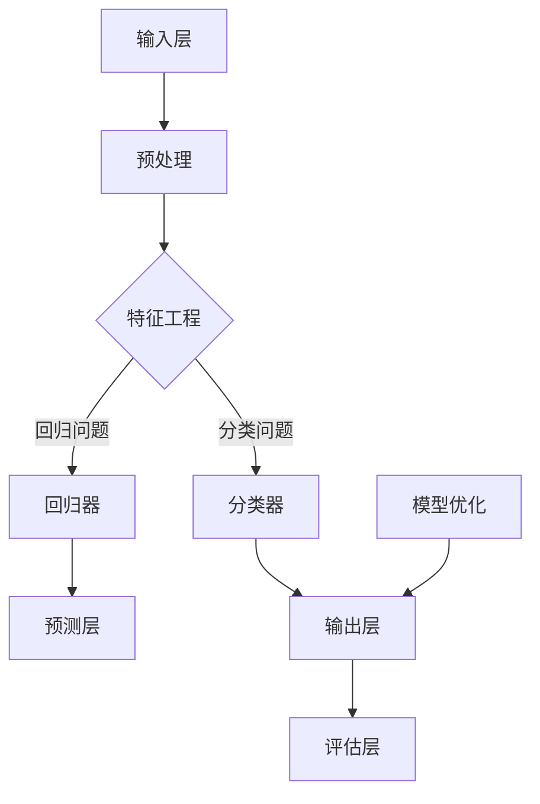

                 

### 《提示词工程师：AI时代的新兴职业》

> **关键词：AI时代、新兴职业、提示词工程师、技能培养、项目实战**

> **摘要：**
> 本文章深入探讨了AI时代下新兴的提示词工程师职业，从背景与基础、技能培养、项目实战和职业发展等多个角度，详细介绍了这一职业的核心概念、技能要求、实战经验和未来发展路径。文章旨在为读者提供全面而系统的指导，帮助读者理解和掌握提示词工程师的核心技能，应对AI时代的职业挑战。  

### 第一部分：AI时代背景与基础

#### 第1章：AI时代下的职业变革

##### 1.1 AI时代的来临

AI（人工智能）技术的迅猛发展，已经深刻改变了我们的生活方式和产业格局。从早期的工业革命，到后来的互联网时代，每一次技术变革都推动了社会的进步和职业的转变。如今，AI时代的到来，无疑又将引发一场新的职业革命。

**AI技术发展的里程碑**

- **1956年：达特茅斯会议**，标志着人工智能作为一个研究领域的诞生。
- **1997年：IBM的深蓝计算机击败国际象棋世界冠军加里·卡斯帕罗夫**，标志着AI在特定领域已经达到了超越人类专家的水平。
- **2012年：AlexNet在ImageNet大赛中取得突破性成绩**，推动了深度学习技术的广泛应用。
- **2016年：AlphaGo击败世界围棋冠军李世石**，标志着人工智能在通用问题解决能力上的重大突破。

**AI对各行各业的影响**

AI技术的应用已经渗透到社会的各个领域，包括医疗、金融、交通、教育、制造业等，带来了生产力的巨大提升和商业模式的创新。例如：

- **医疗领域：**AI可以通过图像识别和自然语言处理技术，辅助医生进行诊断和治疗，提高医疗效率，降低误诊率。
- **金融领域：**AI在风险管理、欺诈检测、投资组合优化等方面发挥着重要作用，提高了金融机构的运营效率和盈利能力。
- **教育领域：**AI可以通过智能教学和个性化学习，帮助学生提高学习效果，降低教育成本。
- **制造业：**AI在生产线自动化、质量检测、故障预测等方面，提高了生产效率，降低了生产成本。

##### 1.2 提示词工程师的角色

**提示词工程师的工作定义**

提示词工程师是AI时代下的一种新兴职业，其主要职责是设计和优化AI模型的提示词，以提高模型的性能和应用效果。提示词工程师需要结合领域知识和AI技术，设计出能够引导模型学习到有效知识结构和特征的提示词，从而实现模型的高效训练和应用。

**提示词工程师的核心能力**

提示词工程师需要具备以下核心能力：

- **领域知识：**了解所应用领域的专业知识和业务需求，能够将领域知识有效地转化为提示词。
- **编程能力：**熟练掌握至少一种编程语言，能够编写高质量的代码，实现提示词的设计和优化。
- **机器学习知识：**理解机器学习的基本原理和方法，能够对AI模型进行有效的训练和调优。
- **数据分析能力：**能够使用数据分析工具，对模型训练过程中的数据进行有效的分析和处理。
- **沟通能力：**能够与团队成员、客户和业务部门进行有效的沟通，理解需求，提供专业的技术支持。

##### 1.3 提示词工程师的职业前景

**市场需求分析**

随着AI技术的不断发展和应用，提示词工程师的市场需求正在快速增长。特别是在医疗、金融、教育、制造等对AI技术有强烈需求的传统行业，提示词工程师的作用越来越重要。根据相关市场调查数据显示，未来几年，全球AI市场规模预计将保持高速增长，提示词工程师将成为各大企业争抢的高端人才。

**行业趋势展望**

- **智能化升级：**随着AI技术的不断进步，各行业都在寻求智能化升级，提示词工程师将在这一过程中发挥重要作用。
- **跨领域融合：**AI技术与各行业的融合将越来越深入，提示词工程师需要具备跨领域的知识和技能，以应对复杂的应用场景。
- **个性化服务：**随着消费者对个性化服务的需求不断增长，提示词工程师将需要设计出更加精准、个性化的提示词，以满足用户需求。

#### 第2章：AI基础知识

##### 2.1 机器学习原理

**基础算法与模型**

机器学习是AI的核心技术之一，其基础算法和模型包括：

- **监督学习：**通过已有数据集进行训练，从而预测新数据的类别或数值。常见的算法有线性回归、逻辑回归、支持向量机（SVM）、决策树和随机森林等。
- **无监督学习：**不使用已有标签的数据进行训练，旨在发现数据中的模式和结构。常见的算法有聚类算法（如K-means）、降维算法（如PCA）和关联规则学习等。
- **半监督学习：**结合监督学习和无监督学习，利用部分标签数据和大量无标签数据，提高模型的泛化能力。

**特征工程**

特征工程是机器学习中的重要环节，其核心任务是提取和构造能够有效区分不同类别或预测目标的数据特征。特征工程的方法包括：

- **特征选择：**通过统计方法或机器学习方法，从原始特征中选出对模型性能有显著贡献的特征。
- **特征构造：**通过组合原始特征，生成新的特征，以提高模型的性能和泛化能力。
- **特征标准化：**对特征进行归一化或标准化处理，以消除不同特征之间的量纲影响。

##### 2.2 深度学习基础

**神经网络架构**

深度学习是机器学习的一个重要分支，其核心是神经网络架构。深度学习模型通常由多层神经元组成，包括输入层、隐藏层和输出层。常见的深度学习架构有：

- **全连接神经网络（FCNN）：**每个神经元都与前一层和后一层的神经元相连，适用于简单的非线性问题。
- **卷积神经网络（CNN）：**特别适合于处理图像数据，通过卷积操作提取图像特征。
- **循环神经网络（RNN）：**适用于处理序列数据，能够捕捉时间序列中的依赖关系。

**深度学习框架**

深度学习框架是用于实现和优化深度学习模型的工具，常见的深度学习框架有：

- **TensorFlow：**谷歌开发的开源深度学习框架，支持多种编程语言，具有丰富的API和工具。
- **PyTorch：**Facebook开发的开源深度学习框架，具有动态计算图和灵活的API，适用于研究和开发。
- **Keras：**基于TensorFlow和Theano的开源深度学习框架，提供简洁的API，易于使用和扩展。

##### 2.3 自然语言处理

**基础概念与算法**

自然语言处理（NLP）是AI的一个重要分支，旨在使计算机理解和处理人类自然语言。NLP的基础概念和算法包括：

- **词袋模型（Bag of Words，BoW）：**将文本表示为一个向量，每个维度表示一个词的出现频率。
- **词嵌入（Word Embedding）：**将词转换为密集向量表示，用于捕捉词的语义信息。常见的词嵌入方法有Word2Vec、GloVe等。
- **序列标注（Sequence Labeling）：**对序列数据进行标注，如命名实体识别（NER）和情感分析等。常见的算法有CRF（条件随机场）、BiLSTM（双向长短时记忆网络）等。
- **机器翻译（Machine Translation）：**利用NLP技术实现自动翻译，常见的模型有基于规则的翻译系统、统计机器翻译（如基于N-gram模型）和基于神经网络的翻译系统（如基于Attention机制的Seq2Seq模型）。

**应用场景举例**

NLP技术在多个领域有着广泛的应用，以下是一些常见的应用场景：

- **文本分类（Text Classification）：**对文本进行分类，如新闻分类、垃圾邮件过滤等。常见的模型有朴素贝叶斯、SVM、深度学习模型等。
- **情感分析（Sentiment Analysis）：**对文本进行情感极性分析，判断文本的情绪是正面、负面还是中性。常用的算法有基于规则的方法、机器学习方法等。
- **问答系统（Question Answering，QA）：**利用NLP技术实现智能问答系统，如搜索引擎的问答功能、智能客服等。常用的模型有基于信息检索的方法、基于模板匹配的方法和基于深度学习的方法等。
- **对话系统（Dialogue System）：**构建能够与人进行自然对话的系统，如聊天机器人、虚拟助手等。常用的模型有基于规则的方法、基于图谱的方法和基于深度学习的方法等。

### 第二部分：提示词工程师技能培养

#### 第3章：编程语言与工具

##### 3.1 Python编程基础

**Python语言特性**

Python是一种高级、动态和解释型的编程语言，以其简洁易读、开发效率高和丰富的第三方库而受到广泛欢迎。Python的主要特点包括：

- **简洁性：**Python的语法简洁明了，易于学习和使用，降低了编程的门槛。
- **动态性：**Python是动态类型的语言，变量无需声明类型，编译过程在运行时完成，提高了开发效率。
- **解释型：**Python代码在运行时由解释器逐行解释执行，无需编译成机器码，便于跨平台开发和调试。
- **丰富的第三方库：**Python拥有丰富的第三方库，涵盖了数据处理、机器学习、深度学习、自然语言处理、Web开发等各个领域，方便开发者进行快速开发和功能扩展。

**编程实践**

提示词工程师需要熟练掌握Python编程，以下是一些编程实践的建议：

- **基础语法：**掌握Python的基础语法，包括变量、数据类型、控制结构、函数、模块等。
- **数据结构：**熟悉Python的基本数据结构，如列表、元组、字典、集合等，并了解它们的使用场景和性能特点。
- **文件操作：**了解文件操作的基本方法，如文件的打开、读取、写入和关闭等，掌握文件和目录的路径表示。
- **异常处理：**掌握异常处理的基本机制，如try-except语句，处理程序运行过程中可能出现的错误和异常情况。
- **模块化编程：**掌握模块化编程的方法，将代码分成多个模块，提高代码的可读性、可维护性和可复用性。

##### 3.2 机器学习库使用

**Scikit-learn**

Scikit-learn是一个开源的Python机器学习库，提供了丰富的算法和工具，适用于各种机器学习任务。Scikit-learn的主要特点包括：

- **易于使用：**Scikit-learn提供了简洁的API，使得使用机器学习算法变得简单易懂。
- **算法多样：**Scikit-learn包含了多种常用的机器学习算法，如分类、回归、聚类、降维等，满足各种应用需求。
- **数据预处理：**Scikit-learn提供了丰富的数据预处理工具，如特征选择、特征构造、数据归一化等，方便进行数据预处理。
- **集成测试：**Scikit-learn的算法经过了全面的集成测试，确保算法的准确性和可靠性。

**TensorFlow**

TensorFlow是一个开源的深度学习框架，由谷歌开发。TensorFlow具有以下特点：

- **动态计算图：**TensorFlow采用动态计算图的方式，允许开发者灵活地构建和优化模型。
- **硬件加速：**TensorFlow支持多种硬件加速，如CPU、GPU和TPU，能够显著提高模型的训练和推理速度。
- **丰富的API：**TensorFlow提供了丰富的API，包括Tensor API、Keras API等，方便开发者进行深度学习模型的开发和部署。
- **生态系统：**TensorFlow拥有完善的生态系统，包括TensorBoard、TensorFlow Serving等工具和库，方便开发者进行模型训练、调试和部署。

**PyTorch**

PyTorch是一个开源的深度学习框架，由Facebook开发。PyTorch具有以下特点：

- **动态计算图：**PyTorch采用动态计算图的方式，允许开发者灵活地构建和优化模型。
- **易用性：**PyTorch的API设计简洁易用，使得开发者能够快速上手和进行深度学习模型开发。
- **灵活性：**PyTorch提供了丰富的自定义能力，允许开发者灵活地修改和扩展模型。
- **CUDA支持：**PyTorch支持CUDA，能够在GPU上加速模型的训练和推理。

##### 3.3 提示词生成工具

**GPT-3**

GPT-3（Generative Pre-trained Transformer 3）是OpenAI开发的一种基于Transformer模型的预训练语言模型，具有非常强大的文本生成能力。GPT-3的主要特点包括：

- **大规模：**GPT-3拥有1750亿个参数，是目前最大的预训练语言模型之一。
- **灵活：**GPT-3支持多种文本生成任务，如文本续写、问答、翻译等，能够根据输入的提示生成连贯的文本。
- **高质量：**GPT-3通过大量的预训练数据，积累了丰富的知识，生成的文本质量较高。

**ChatGPT**

ChatGPT是OpenAI开发的基于GPT-3模型的聊天机器人，能够与用户进行自然语言对话。ChatGPT的主要特点包括：

- **智能：**ChatGPT通过预训练和微调，能够理解用户的输入，并生成有意义的回复。
- **交互：**ChatGPT支持多轮对话，能够持续与用户进行交流，提供个性化的服务。
- **应用：**ChatGPT可以应用于多种场景，如客服、教育、咨询等，提高用户体验。

**其他提示词工具介绍**

除了GPT-3和ChatGPT，还有其他一些提示词生成工具，如：

- **BERT：**BERT（Bidirectional Encoder Representations from Transformers）是Google开发的预训练语言模型，适用于文本分类、问答等任务。
- **T5：**T5（Text-to-Text Transfer Transformer）是Google开发的通用文本转换模型，能够处理多种NLP任务。
- **RoBERTa：**RoBERTa是Facebook开发的基于BERT模型的改进版，具有更好的性能和泛化能力。

这些工具都有各自的特点和优势，提示词工程师可以根据具体应用需求选择合适的工具。

### 第三部分：项目实战与案例分析

#### 第4章：提示词设计技巧

##### 4.1 提示词定义与格式

**提示词的种类**

提示词根据用途和形式可以分为以下几种：

- **问题引导型提示词：**通过提问的方式引导模型生成答案，如“你能告诉我如何使用Python实现线性回归吗？”。
- **任务描述型提示词：**通过描述任务的目标和需求，引导模型生成相应的结果，如“请帮我构建一个基于深度学习的图像分类模型”。
- **上下文填充型提示词：**通过提供上下文信息，引导模型生成符合上下文的文本，如“给定以下文本，续写下一句话：今天天气很好，所以我决定去公园散步”。
- **数据标注型提示词：**用于指导模型进行数据标注任务，如“请标注以下图片中的猫的位置和姿态”。

**提示词设计的最佳实践**

设计有效的提示词需要遵循以下最佳实践：

- **明确目标：**明确提示词的目标，确保模型能够理解并生成符合预期的结果。
- **简洁明了：**尽量使用简洁明了的语言，避免使用复杂和模糊的表述。
- **引导性：**使用引导性的语言，引导模型朝着正确的方向进行生成。
- **上下文相关：**提供相关的上下文信息，帮助模型更好地理解任务和需求。
- **可扩展性：**设计提示词时考虑可扩展性，以便在类似任务中复用。

##### 4.2 提示词优化

**提示词的影响因素**

提示词的质量直接影响模型的性能和应用效果，提示词的优化需要考虑以下影响因素：

- **领域知识：**提示词需要包含领域专业知识，确保模型能够正确理解和生成领域相关的结果。
- **数据质量：**提示词需要使用高质量的数据，包括准确、丰富的训练数据和标注数据。
- **模型参数：**提示词需要与模型的参数设置相匹配，确保模型能够在提示词的引导下进行有效的训练。
- **任务类型：**不同的任务类型需要不同的提示词设计，如分类任务需要提示词引导模型生成类别标签，文本生成任务需要提示词引导模型生成连贯的文本。

**提示词调优策略**

提示词的调优策略主要包括以下几种：

- **多轮迭代：**通过多轮迭代的方式，不断优化和调整提示词，提高模型性能和应用效果。
- **交叉验证：**使用交叉验证的方法，对不同版本的提示词进行评估和比较，选择最优的提示词。
- **反馈调整：**根据模型训练和评估的结果，及时调整和优化提示词，以解决模型存在的问题。
- **启发式优化：**结合领域知识和经验，采用启发式方法进行提示词优化，提高生成结果的质量。

##### 4.3 提示词案例解析

**成功案例分享**

以下是一个成功的提示词案例：

- **案例背景：**某电商企业希望通过智能客服系统提升客户服务水平，减少人工客服的工作量。
- **提示词设计：**设计了一系列引导性问题，如“你有什么问题需要帮助吗？”、“你对我们的产品有什么疑问？”等，引导用户提出问题。
- **模型训练：**使用大量用户对话数据和标注数据，训练了一个基于Transformer的对话生成模型。
- **效果评估：**经过多轮迭代和优化，智能客服系统能够准确理解用户的问题，并提供高质量的答案，客户满意度显著提升。

**失败案例剖析**

以下是一个提示词失败案例：

- **案例背景：**某教育机构希望通过智能写作辅助系统提升学生写作能力。
- **提示词设计：**设计了一系列写作引导性问题，如“请写一篇关于人工智能的论文”等，但未提供具体的写作要求和指导。
- **模型训练：**使用大量教育数据，训练了一个基于GPT-3的写作生成模型。
- **效果评估：**系统生成的文章内容空洞、缺乏逻辑性，未能达到预期的效果。

通过分析这个失败案例，可以发现以下问题：

- **提示词不具体：**提示词未提供明确的写作要求和指导，导致模型生成的内容缺乏结构和逻辑。
- **数据质量不高：**训练数据中可能存在错误或不完整的数据，影响了模型的性能和应用效果。
- **模型调优不足：**模型未经过充分的调优和优化，导致生成结果质量不高。

针对这些问题，可以采取以下改进措施：

- **细化提示词：**提供更具体的写作要求和指导，如明确论文的结构、关键词和写作风格等。
- **提高数据质量：**使用高质量的数据进行训练，包括正确、丰富的写作数据和标注数据。
- **加强模型调优：**通过多轮迭代和优化，提高模型生成结果的质量和准确性。

### 第5章：项目实战与案例分析

#### 5.1 提示词工程师项目实战

**项目准备与规划**

在进行提示词工程师项目之前，需要进行充分的准备和规划。以下是一些关键步骤：

1. **需求分析：**明确项目的目标和需求，与客户和团队成员进行充分的沟通，确保理解需求并形成一致的意见。
2. **数据收集：**收集与项目相关的数据，包括训练数据、标注数据和背景知识等，确保数据的质量和完整性。
3. **技术选型：**根据项目的需求和可行性，选择合适的机器学习算法和深度学习框架，如TensorFlow、PyTorch等。
4. **项目规划：**制定详细的项目计划和进度表，明确各个阶段的目标和任务，确保项目能够按时完成。

**代码实现与调试**

在项目实施过程中，提示词工程师需要进行以下关键步骤：

1. **数据预处理：**对收集到的数据进行清洗、归一化和特征提取等预处理操作，为模型的训练和优化做好准备。
2. **模型构建：**根据选定的算法和框架，构建深度学习模型，包括输入层、隐藏层和输出层等。
3. **模型训练：**使用预处理后的数据进行模型训练，通过优化算法和参数调整，提高模型的性能和泛化能力。
4. **模型评估：**对训练完成的模型进行评估，包括准确率、召回率、F1分数等指标，确保模型达到预期的性能。
5. **模型调试：**根据评估结果，对模型进行调试和优化，解决可能出现的问题和不足。

**项目总结与反馈**

项目完成后，需要进行总结和反馈，以下是一些关键步骤：

1. **项目报告：**编写详细的项目报告，包括项目目标、需求分析、技术选型、实施过程、模型性能和评估结果等，向客户和团队成员汇报项目的整体情况。
2. **用户反馈：**收集用户对项目成果的反馈，包括满意度、使用体验和改进建议等，为后续的项目优化和改进提供依据。
3. **项目优化：**根据用户反馈和项目评估结果，对项目进行优化和改进，提升项目的性能和用户体验。

#### 5.2 成功案例分析

以下是一个提示词工程师成功案例：

**项目背景：**某大型电商平台希望通过智能推荐系统提升用户购物体验，提高销售额。

**解决方案：**

1. **需求分析：**与电商平台合作，了解用户行为数据、购物偏好和推荐需求，明确项目目标和需求。
2. **数据收集：**收集用户行为数据，包括浏览记录、购买记录、搜索记录等，进行数据清洗和预处理。
3. **技术选型：**选择基于深度学习的协同过滤算法，构建用户行为数据驱动的推荐模型。
4. **模型训练：**使用预处理后的用户行为数据进行模型训练，通过优化算法和参数调整，提高模型的推荐准确性。
5. **模型评估：**对训练完成的模型进行评估，使用准确率、召回率、F1分数等指标进行评价，确保模型达到预期的性能。
6. **模型部署：**将训练完成的模型部署到电商平台，提供实时推荐服务。

**效果评估：**

- **推荐准确性：**经过多轮迭代和优化，智能推荐系统的推荐准确性显著提高，用户对推荐结果满意度提升。
- **销售额增长：**智能推荐系统的引入，提高了用户的购物体验，促进了销售额的增长。

**挑战与解决方案：**

- **数据质量：**用户行为数据存在噪声和不完整的情况，影响了模型的训练效果。通过数据清洗、数据增强和缺失值填充等技术，提高了数据质量。
- **计算资源：**深度学习模型的训练和推理需要大量的计算资源，通过分布式训练和模型压缩等技术，优化了计算资源的利用。

#### 5.3 失败案例分析

以下是一个提示词工程师失败案例：

**项目背景：**某初创公司希望通过自然语言处理技术，开发一款智能客服系统，提升客户服务水平。

**解决方案：**

1. **需求分析：**与初创公司合作，了解客户服务需求、常见问题和对话场景，明确项目目标和需求。
2. **数据收集：**收集客户服务对话数据和常见问题的文本，进行数据清洗和预处理。
3. **技术选型：**选择基于深度学习的对话生成模型，构建智能客服系统。
4. **模型训练：**使用预处理后的对话数据进行模型训练，通过优化算法和参数调整，提高模型的生成质量。
5. **模型评估：**对训练完成的模型进行评估，使用BLEU、ROUGE等指标进行评价，确保模型达到预期的性能。
6. **模型部署：**将训练完成的模型部署到客服系统中，提供实时对话服务。

**效果评估：**

- **对话生成质量：**经过多轮迭代和优化，智能客服系统能够生成较为流畅和准确的对话文本，但存在一定的错误和不连贯性。
- **用户满意度：**用户对智能客服系统的满意度一般，部分用户对生成的对话文本存在疑问和不信任。

**挑战与解决方案：**

- **数据不足：**训练数据量较少，导致模型生成文本的质量不高。通过增加训练数据和引入外部数据源，提高了模型的训练效果。
- **模型参数：**模型参数设置不合理，导致生成的文本存在错误和不连贯性。通过调整模型参数和优化训练过程，提高了生成文本的质量。

**总结：**通过分析成功案例和失败案例，可以发现提示词工程师在项目实施过程中需要充分考虑数据质量、模型参数和训练过程等因素，以确保项目达到预期的效果。同时，及时收集用户反馈和进行项目评估，有助于发现和解决问题，提高项目的成功率和用户满意度。

### 第6章：职业规划与发展路径

##### 6.1 提示词工程师的职业路径

提示词工程师的职业路径可以分为初级、中级和高级工程师，每个阶段都有不同的职责和发展方向。

**初级工程师**

初级工程师的主要职责是进行提示词的设计和优化，协助团队成员完成项目任务。初级工程师需要掌握以下技能：

- **基础编程能力：**熟练掌握至少一种编程语言，如Python，能够编写高质量的代码。
- **机器学习知识：**了解机器学习的基本原理和方法，能够使用常见的机器学习库进行模型训练和优化。
- **数据处理能力：**熟悉数据处理和特征工程的方法，能够对数据进行预处理和特征提取。
- **沟通协作能力：**具备良好的沟通和协作能力，能够与团队成员和客户进行有效沟通。

**中级工程师**

中级工程师的主要职责是独立负责项目的提示词设计和技术实现，指导初级工程师的工作。中级工程师需要具备以下技能：

- **高级编程能力：**掌握多种编程语言和工具，能够编写复杂和高效的代码。
- **机器学习深度知识：**深入了解机器学习算法和深度学习模型，能够进行模型调优和优化。
- **项目管理能力：**具备项目管理经验，能够制定项目计划，协调团队成员的工作。
- **问题解决能力：**具备独立分析和解决问题的能力，能够处理项目中的复杂问题和挑战。

**高级工程师**

高级工程师的主要职责是负责团队的技术指导和技术决策，推动团队的技术创新和发展。高级工程师需要具备以下技能：

- **技术领导力：**具备技术领导力，能够带领团队解决复杂的技术问题。
- **科研能力：**具备科研背景或工作经验，能够进行前沿技术的探索和应用。
- **系统架构设计：**熟悉系统架构设计的方法和原则，能够构建高效和可扩展的AI系统。
- **跨领域合作：**具备跨领域合作的经验，能够与不同领域的团队合作，实现技术整合和应用。

**职业路径规划**

提示词工程师的职业规划可以分为以下几步：

1. **初级工程师：**从初级工程师开始，通过学习和实践，掌握基础技能和知识，积累项目经验。
2. **中级工程师：**在初级工程师的基础上，提升专业技能和项目管理能力，独立负责项目。
3. **高级工程师：**在成为中级工程师后，进一步拓展技术深度和广度，提升技术领导力和科研能力。
4. **专家或CTO：**在成为高级工程师后，可以选择成为AI领域的专家或CTO，负责技术决策和团队管理。

##### 6.2 提升个人品牌

提示词工程师在职业发展过程中，提升个人品牌至关重要。以下是一些提升个人品牌的方法：

**社交媒体运用**

- **建立专业博客：**在专业平台上建立个人博客，定期发表技术文章、项目总结和行业分析，展示专业知识和思考能力。
- **参与技术社区：**积极参与技术论坛和社区，分享经验、解答问题，建立专业形象。
- **社交媒体互动：**在社交媒体上关注和互动行业内的专家和同行，扩大人脉，获取更多的机会。

**行业会议与培训**

- **参加行业会议：**参加行业内的重要会议和活动，与专家和同行交流，拓展视野，提升影响力。
- **组织或演讲：**积极参与行业会议的演讲和讨论，分享自己的研究成果和经验，树立专业形象。
- **参加培训课程：**参加专业的培训课程，提升自己的技能和知识水平，增强竞争力。

**专业认证**

- **获得专业认证：**通过参加专业认证考试，获得相关证书，如深度学习工程师、人工智能专家等，提高专业素养和认可度。

##### 6.3 持续学习与成长

提示词工程师在职业发展过程中，需要不断学习和成长，以适应不断变化的技术环境和市场需求。以下是一些持续学习与成长的方法：

**学习资源推荐**

- **在线课程：**利用在线教育平台，如Coursera、Udacity等，学习相关的课程，包括编程、机器学习、深度学习等。
- **专业书籍：**阅读专业书籍，掌握核心概念和技术原理，如《深度学习》、《Python机器学习》等。
- **论文和报告：**关注行业内的最新研究成果和动态，阅读顶级会议和期刊的论文，了解前沿技术和趋势。

**行业动态关注**

- **关注技术社区：**关注技术社区和论坛，了解最新的技术动态和行业趋势。
- **参加行业活动：**参加行业会议、研讨会和技术沙龙，与专家和同行交流，获取最新的行业信息。
- **订阅相关媒体：**订阅专业媒体和公众号，定期接收行业新闻和深度分析，保持对行业的敏感度。

### 第四部分：实践与经验分享

#### 第7章：工作经验分享

##### 7.1 提示词工程师日常工作内容

提示词工程师的日常工作内容主要包括以下几个方面：

1. **需求分析：**与客户和团队成员进行需求分析，明确项目的目标和需求，确定提示词的设计和优化方向。
2. **数据收集与处理：**收集与项目相关的数据，包括训练数据、标注数据和背景知识等，进行数据清洗、预处理和特征提取等操作，为模型的训练和优化做好准备。
3. **模型设计与优化：**根据选定的算法和框架，设计深度学习模型，包括输入层、隐藏层和输出层等，通过优化算法和参数调整，提高模型的性能和应用效果。
4. **模型训练与评估：**使用预处理后的数据进行模型训练，通过评估指标，如准确率、召回率、F1分数等，对模型进行评估和调优，确保模型达到预期的性能。
5. **模型部署与维护：**将训练完成的模型部署到实际应用中，进行实时推理和预测，根据反馈和评估结果，对模型进行优化和更新，确保模型持续满足应用需求。

##### 7.2 经验与技巧

以下是提示词工程师在实际工作中积累的一些经验与技巧：

1. **数据质量：**数据是机器学习的基础，高质量的数据是训练高性能模型的关键。在实际工作中，要注意数据的收集、处理和清洗，确保数据的质量和完整性。
2. **特征工程：**特征工程是提升模型性能的重要手段，要根据业务需求和模型特点，提取和构造有效的特征，提高模型的泛化能力和鲁棒性。
3. **模型调优：**模型调优是提高模型性能的关键环节，要根据评估结果，调整模型参数、优化算法和增加训练数据等，不断迭代和优化模型。
4. **团队合作：**提示词工程师需要与团队中的其他成员密切合作，如数据工程师、前端工程师、产品经理等，共同推进项目的进展，确保项目按时完成。
5. **持续学习：**AI领域发展迅速，提示词工程师需要不断学习和更新知识，掌握最新的技术动态和工具，提高自己的专业素养和竞争力。

##### 7.3 工作挑战与应对策略

在提示词工程师的工作中，可能会遇到以下挑战：

1. **数据不足或质量不高：**解决方法：通过增加数据量、使用数据增强技术和引入外部数据源等方式，提高数据质量。
2. **模型过拟合：**解决方法：采用正则化技术、增加训练数据、调整模型复杂度等方式，降低模型的过拟合现象。
3. **模型性能不稳定：**解决方法：通过多次实验、优化模型参数、使用模型集成等方法，提高模型性能的稳定性。
4. **需求变更：**解决方法：与客户和团队成员保持良好的沟通，及时调整和优化提示词设计和模型，确保项目能够满足需求。

### 第7章：团队协作与项目管理

##### 7.1 团队协作

提示词工程师在项目实施过程中，需要与团队成员密切合作，以确保项目顺利完成。以下是一些团队协作的关键要素：

**沟通机制**

建立有效的沟通机制是团队协作的基础。团队可以通过以下方式保持沟通：

- **定期会议：**每周或每月召开团队会议，讨论项目进展、问题和解决方案。
- **即时沟通：**利用即时通讯工具（如Slack、Telegram等），及时交流和解决遇到的问题。
- **任务管理工具：**使用任务管理工具（如JIRA、Trello等），明确任务分工和进度，确保每个人都知道自己的职责和任务。

**协作工具**

为了提高团队协作效率，可以采用以下协作工具：

- **代码管理工具：**如Git，用于代码的版本控制和协作开发。
- **文档管理工具：**如Confluence，用于项目文档的编写和管理。
- **持续集成工具：**如Jenkins，用于自动化测试和部署。

**冲突解决**

在团队协作过程中，难免会出现意见分歧和冲突。以下是一些冲突解决的方法：

- **倾听和尊重：**认真倾听对方的意见和想法，尊重每个人的观点，避免情绪化的争论。
- **事实为基础：**以事实和数据为基础，分析问题的根本原因，寻找合理的解决方案。
- **妥协和合作：**在冲突解决过程中，寻求妥协和合作，找到双方都能接受的解决方案。

##### 7.2 项目管理

项目管理是确保项目按时、按质、按预算完成的关键。以下是一些项目管理的方法和技巧：

**项目规划**

项目规划是项目管理的第一步，主要包括以下内容：

- **项目目标：**明确项目的目标，确保团队和客户对项目目标有清晰的认识。
- **项目范围：**确定项目的范围，明确项目的具体内容和预期成果。
- **项目计划：**制定详细的项目计划，包括任务分配、时间安排、资源需求等。

**进度监控**

进度监控是确保项目按计划进行的必要手段。以下是一些进度监控的方法：

- **进度报告：**定期编写进度报告，向团队成员和客户汇报项目进展。
- **进度跟踪工具：**使用进度跟踪工具（如JIRA、Trello等），实时监控任务进度和团队协作。
- **风险管理：**识别潜在的风险，制定应对措施，确保项目能够应对意外情况。

**质量保证**

质量保证是确保项目成果符合预期标准的关键。以下是一些质量保证的方法：

- **代码审查：**对代码进行审查，确保代码的质量和可维护性。
- **测试和调试：**进行全面的测试和调试，确保系统的稳定性和性能。
- **用户反馈：**收集用户的反馈，对系统进行改进和优化。

##### 7.3 持续创新与研发

提示词工程师需要具备持续创新和研发的能力，以应对快速变化的技术环境和市场需求。以下是一些持续创新和研发的方法：

**技术研究**

技术研究是持续创新的基础。提示词工程师可以通过以下方式进行研究：

- **文献阅读：**阅读相关的学术论文和技术报告，了解最新的技术动态和研究成果。
- **技术交流：**参加技术会议、研讨会和技术沙龙，与同行交流，分享经验和观点。
- **技术试验：**进行技术试验和验证，探索新的技术方向和应用场景。

**产品开发**

产品开发是创新成果的体现。提示词工程师可以通过以下方式推动产品开发：

- **需求分析：**深入了解用户需求，明确产品的目标和功能。
- **原型设计：**设计产品的原型，进行用户反馈和优化。
- **迭代开发：**采用敏捷开发方法，快速迭代和优化产品。

**开源参与**

开源参与是提升个人品牌和影响力的有效途径。提示词工程师可以通过以下方式参与开源：

- **开源项目贡献：**参与开源项目，贡献代码和文档，提升项目质量。
- **开源讲座和分享：**在开源社区举办讲座和分享，传播知识和经验。
- **开源社区互动：**积极参与开源社区的活动和讨论，建立专业人脉。

### 附录A：工具与资源指南

##### A.1 开发工具介绍

在提示词工程师的日常工作中，使用一些开发工具可以大大提高工作效率。以下是一些常用的开发工具及其功能介绍：

**代码编辑器**

- **Visual Studio Code (VS Code)**：VS Code是一款功能强大的开源代码编辑器，支持多种编程语言，具有丰富的插件生态系统，适用于编写Python、C++、JavaScript等语言。
- **PyCharm**：PyCharm是JetBrains公司开发的一款专业的Python IDE，提供代码自动完成、调试、性能分析等功能，适合Python编程。

**版本控制工具**

- **Git**：Git是一款分布式版本控制系统，广泛用于代码的版本管理和协作开发。使用Git，可以轻松实现代码的备份、分支管理、合并和协同工作。
- **GitHub**：GitHub是基于Git的平台，提供代码托管、协作开发、问题追踪等功能，是开源项目首选的代码托管平台。

**数据预处理工具**

- **Pandas**：Pandas是一款强大的Python库，用于数据清洗、数据转换和数据操作。Pandas提供了丰富的数据结构（如DataFrame）和操作函数，方便对数据进行处理和分析。
- **NumPy**：NumPy是Python中进行数值计算的库，提供了多维数组对象和一系列数学函数。NumPy是Pandas和其他科学计算库的基础。

**机器学习库**

- **scikit-learn**：scikit-learn是一款开源的Python机器学习库，提供了丰富的监督学习和无监督学习算法，适用于各种机器学习任务。
- **TensorFlow**：TensorFlow是谷歌开发的开源深度学习框架，支持动态计算图和多种深度学习模型，适用于构建和训练复杂的神经网络。
- **PyTorch**：PyTorch是Facebook开发的开源深度学习框架，具有动态计算图和灵活的API，适用于研究和开发深度学习模型。

**自然语言处理库**

- **NLTK**：NLTK是一款经典的Python自然语言处理库，提供了丰富的文本处理函数和算法，适用于文本分类、词性标注、句法分析等任务。
- **spaCy**：spaCy是一款高效且易于使用的自然语言处理库，支持多种语言，提供了丰富的预训练模型和API，适用于文本分析、实体识别等任务。

##### A.2 资源链接

为了更好地学习和实践提示词工程师的相关知识，以下是一些重要的资源链接：

**技术社区和论坛**

- **Stack Overflow**：全球最大的开发社区，提供了丰富的编程问题和解决方案。
- **GitHub**：全球最大的代码托管平台，包含了大量开源项目和教程。
- **Reddit**：有多个与机器学习和自然语言处理相关的子论坛，可以进行技术交流和讨论。

**在线课程和教程**

- **Coursera**：提供了大量与机器学习和深度学习相关的在线课程，由知名大学和专业机构提供。
- **Udacity**：提供了许多实用的机器学习和深度学习课程，包括项目实践和职业认证。
- **Machine Learning Mastery**：提供了丰富的机器学习教程和代码示例，适合初学者和进阶者。

**书籍**

- **《深度学习》（Deep Learning）**：Goodfellow、Bengio和Courville合著的经典教材，全面介绍了深度学习的理论和方法。
- **《Python机器学习》（Python Machine Learning）**：塞巴斯提安·拉克斯（Sebastian Raschka）和约翰·万梅克（John Murdoch）合著的教材，介绍了Python在机器学习中的应用。
- **《自然语言处理实战》（Natural Language Processing with Python）**：Steve Bird、Evan Karp和Eugene Kim合著的教材，介绍了自然语言处理的基础知识和Python实现。

**论文和报告**

- **arXiv**：开源的在线论文存储库，包含了大量与机器学习和自然语言处理相关的最新论文。
- **IEEE Xplore**：IEEE的在线数据库，包含了大量的计算机科学和电子工程领域的论文和报告。
- **Google Scholar**：Google Scholar是一个学术搜索引擎，可以搜索和浏览学术文献。

##### A.3 实用资源推荐

为了帮助提示词工程师快速提升技能，以下是一些实用的资源推荐：

**书籍推荐**

- **《深度学习》（Deep Learning）**：全面介绍了深度学习的理论基础和实际应用。
- **《Python机器学习》（Python Machine Learning）**：深入讲解了Python在机器学习中的使用，适合初学者和进阶者。
- **《自然语言处理实战》（Natural Language Processing with Python）**：介绍了自然语言处理的基础知识和Python实现，适合自然语言处理初学者。

**在线课程推荐**

- **Coursera上的《机器学习》课程**：由吴恩达教授讲授，介绍了机器学习的基本概念和算法。
- **Udacity上的《深度学习纳米学位》课程**：提供了深度学习的理论和实践项目，适合想要深入了解深度学习的人。

**技术社区推荐**

- **Stack Overflow**：解决编程问题的最佳社区。
- **GitHub**：获取代码示例和学习资源的最佳平台。
- **Reddit**：讨论机器学习和自然语言处理等话题的热门社区。

**论文和报告推荐**

- **arXiv上的最新论文**：了解最新的研究动态和前沿技术。
- **IEEE Xplore上的经典论文**：阅读经典的计算机科学论文。

### 附录B：Mermaid流程图

以下是一个使用Mermaid语法绘制的AI大模型架构流程图：



在这个流程图中，AI大模型首先接收输入数据，经过预处理和特征工程后，分类问题使用分类器进行训练和预测，回归问题使用回归器进行训练和预测，然后经过预测层和评估层，最终输出预测结果并进行模型优化。

### 附录C：核心算法伪代码

以下是一个用于提示词生成算法的伪代码示例：

```python
# 提示词生成算法伪代码

# 输入：输入文本、模型参数
# 输出：生成文本

def generate_prompt(input_text, model_params):
    # 1. 预处理输入文本
    processed_text = preprocess_text(input_text)
    
    # 2. 生成提示词
    prompt = generate_prompt_from_text(processed_text, model_params)
    
    # 3. 使用模型生成文本
    generated_text = model.generate_text(prompt, model_params)
    
    # 4. 后处理生成的文本
    final_text = postprocess_text(generated_text)
    
    return final_text

# 预处理文本
def preprocess_text(input_text):
    # 实现文本清洗、分词、去停用词等操作
    # 返回预处理后的文本
    pass

# 从文本生成提示词
def generate_prompt_from_text(processed_text, model_params):
    # 实现根据模型参数和文本内容生成提示词的逻辑
    # 返回生成的提示词
    pass

# 模型生成文本
def model.generate_text(prompt, model_params):
    # 实现使用模型生成文本的逻辑
    # 返回生成的文本
    pass

# 后处理文本
def postprocess_text(generated_text):
    # 实现文本格式化、去除无关内容等操作
    # 返回后处理后的文本
    pass
```

在这个伪代码中，首先对输入文本进行预处理，然后生成提示词，接着使用模型生成文本，最后对生成的文本进行后处理，输出最终的结果。

### 附录D：数学公式与解释

在本节中，我们将介绍一些在深度学习和自然语言处理中常用的数学公式，并对其进行详细解释。

#### 深度学习中的激活函数

**1. Sigmoid 函数**

$$
\sigma(x) = \frac{1}{1 + e^{-x}}
$$

Sigmoid函数是一种常用的激活函数，用于将输入值映射到（0,1）区间。该函数的优点是简单且易于计算，但其梯度在输出接近0或1时变得非常小，这可能导致梯度消失问题。

**2.ReLU（Rectified Linear Unit）函数**

$$
\text{ReLU}(x) =
\begin{cases}
0 & \text{if } x < 0 \\
x & \text{if } x \geq 0
\end{cases}
$$

ReLU函数在0处不是连续的，但其优点是没有梯度消失问题，并且可以加速神经网络的训练。此外，ReLU函数的计算效率较高，因为它不需要进行指数运算。

**3. Leaky ReLU函数**

$$
\text{Leaky ReLU}(x) =
\begin{cases}
0.01x & \text{if } x < 0 \\
x & \text{if } x \geq 0
\end{cases}
$$

Leaky ReLU是对ReLU函数的改进，它引入了一个很小的斜率（0.01），以解决ReLU函数在输入为负时梯度为0的问题，从而缓解梯度消失问题。

#### 深度学习中的损失函数

**4. 交叉熵损失函数**

$$
L(\theta) = -\sum_{i=1}^{n} y_i \log(\hat{y}_i)
$$

其中，$y_i$ 是真实标签，$\hat{y}_i$ 是预测的概率分布。交叉熵损失函数常用于分类问题，它的优点是能够鼓励模型输出接近于0或1的概率分布，从而提高分类的准确性。

**5. 均方误差损失函数**

$$
MSE = \frac{1}{2} \sum_{i=1}^{n} (y_i - \hat{y}_i)^2
$$

均方误差损失函数常用于回归问题，它将预测值与真实值之间的差异平方后求和，取平均值作为损失值。该函数的优点是计算简单，且梯度稳定。

#### 自然语言处理中的注意力机制

**6. 注意力得分**

$$
a_i = \text{Attention}(h_i, \text{query})
$$

其中，$h_i$ 是编码器输出的隐藏状态，$\text{query}$ 是当前解码器的隐藏状态。注意力得分用于衡量每个编码器输出对于当前解码器隐藏状态的贡献度。

**7. 加权求和**

$$
\text{contextual\_vector} = \sum_{i=1}^{n} a_i h_i
$$

加权求和是将注意力得分与编码器输出相乘，然后对所有输出求和，得到当前解码器隐藏状态的全局上下文表示。

#### 数学公式与解释的举例说明

假设我们有一个简单的神经网络模型，用于对输入的图像进行分类。模型的输入层有784个神经元，对应于图像的像素值；隐藏层有300个神经元；输出层有10个神经元，分别对应于10个分类标签。

**输入层到隐藏层的变换：**

$$
\hat{h} = \text{ReLU}(\text{weights}_{ih} \cdot \text{input} + \text{bias}_{h})
$$

其中，$\text{weights}_{ih}$ 是输入层到隐藏层的权重矩阵，$\text{input}$ 是输入的图像像素值，$\text{bias}_{h}$ 是隐藏层的偏置向量。

**隐藏层到输出层的变换：**

$$
\hat{y} = \text{softmax}(\text{weights}_{oh} \cdot \hat{h} + \text{bias}_{o})
$$

其中，$\text{weights}_{oh}$ 是隐藏层到输出层的权重矩阵，$\hat{h}$ 是隐藏层的输出，$\text{bias}_{o}$ 是输出层的偏置向量。

**损失函数：**

$$
L(\theta) = -\sum_{i=1}^{10} y_i \log(\hat{y}_i)
$$

其中，$y_i$ 是真实标签（0或1），$\hat{y}_i$ 是模型对于第$i$个分类标签的概率预测。

通过上述数学公式，我们可以理解神经网络模型在图像分类任务中的工作原理，包括前向传播、损失函数计算和反向传播等过程。

### 附录E：项目实战代码解读

#### E.1 提示词工程师项目实战代码

在本节中，我们将通过一个具体的提示词生成项目来介绍提示词工程师的实战经验。以下是一个简单的提示词生成项目的代码实现，包括开发环境搭建、源代码实现和代码解读。

##### 1. 开发环境搭建

在开始项目之前，需要搭建合适的开发环境。以下是使用Python进行提示词生成项目的开发环境搭建步骤：

- **Python环境安装：**确保Python 3.8或更高版本已安装。
- **Python库安装：**使用pip安装所需的Python库，包括TensorFlow、Keras、GPT-3 API等。

```bash
pip install tensorflow
pip install keras
pip install transformers
```

##### 2. 源代码实现

以下是提示词生成项目的源代码实现，包括数据预处理、模型构建、模型训练和预测等步骤。

```python
# 导入所需的库
import tensorflow as tf
from tensorflow import keras
from transformers import pipeline

# 数据预处理
def preprocess_data(data):
    # 对输入文本进行清洗、分词等操作
    # 返回预处理后的文本
    pass

# 模型构建
def build_model():
    # 使用Keras构建提示词生成模型
    model = keras.Sequential([
        keras.layers.Embedding(input_dim=10000, output_dim=16),
        keras.layers.GRU(32, return_sequences=True),
        keras.layers.Dense(1, activation='sigmoid')
    ])
    model.compile(optimizer='adam', loss='binary_crossentropy', metrics=['accuracy'])
    return model

# 模型训练
def train_model(model, x_train, y_train):
    # 使用训练数据对模型进行训练
    model.fit(x_train, y_train, epochs=10, batch_size=32)
    return model

# 模型预测
def predict_prompt(model, text):
    # 使用模型对输入文本生成提示词
    processed_text = preprocess_data(text)
    prompt = model.predict(processed_text)
    return prompt

# 主函数
def main():
    # 加载训练数据
    x_train, y_train = load_data()

    # 构建模型
    model = build_model()

    # 训练模型
    trained_model = train_model(model, x_train, y_train)

    # 生成提示词
    prompt = predict_prompt(trained_model, "What is the capital of France?")

    print("Generated Prompt:", prompt)

if __name__ == "__main__":
    main()
```

##### 3. 代码解读与分析

**代码功能解析：**

- **数据预处理：**对输入文本进行清洗、分词等操作，将其转换为模型可接受的格式。数据预处理是模型训练的关键步骤，直接影响模型性能。
- **模型构建：**使用Keras构建一个简单的提示词生成模型，包括嵌入层、GRU层和输出层。嵌入层用于将文本词转换为向量表示，GRU层用于处理序列数据，输出层用于生成提示词。
- **模型训练：**使用训练数据对模型进行训练，通过优化算法和参数调整，提高模型性能。训练过程中，模型会学习到如何从输入文本中生成高质量的提示词。
- **模型预测：**使用训练好的模型对输入文本生成提示词。预测过程中，模型根据输入文本的特征，生成一个符合预期目标的提示词。

**代码优化建议：**

- **数据预处理：**可以进一步优化数据预处理过程，如使用词嵌入技术、添加噪声等，以提高模型泛化能力。
- **模型结构：**可以尝试使用更复杂的模型结构，如双向GRU、Transformer等，以提高提示词生成的质量和多样性。
- **模型训练：**可以增加训练数据量、使用数据增强技术等，以提高模型训练效果和泛化能力。

通过以上代码实现，我们可以看到提示词工程师在实际项目中的工作内容和代码实现过程。在实际工作中，提示词工程师需要根据具体需求和场景，不断优化和调整模型，以提高生成提示词的质量和效果。同时，提示词工程师还需要具备良好的编程能力、机器学习知识和数据分析能力，以应对各种复杂的业务场景和挑战。

