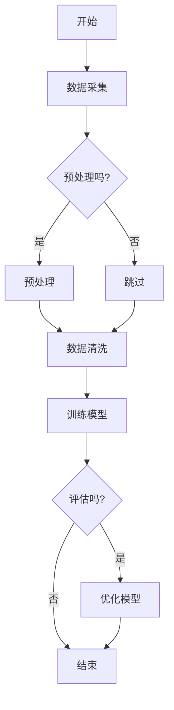

                 

### 《AI编程的新视角与新思维》

#### 关键词：人工智能，编程，深度学习，机器学习，自然语言处理，强化学习

> 摘要：本文将深入探讨AI编程的新视角与新思维，从基础概念到实际应用，全面解读人工智能编程的核心技术。通过分析AI编程的历史发展、关键算法、新趋势以及实战案例，为读者提供一份详尽的AI编程指南，帮助开发者更好地理解和掌握AI编程的精髓。

#### 引言

人工智能（AI）作为计算机科学的一个重要分支，近年来取得了飞速的发展。AI编程也因其广阔的应用前景而备受关注。从早期的专家系统到如今的深度学习、强化学习，AI编程的技术体系日趋完善。然而，随着AI技术的不断进步，传统编程方法也逐渐暴露出其局限性。如何站在新的视角审视AI编程，如何运用新的思维来设计和实现AI系统，成为当前亟待解决的问题。

本文旨在为读者提供一份全面的AI编程指南，帮助大家从基础知识出发，逐步深入到AI编程的核心技术和新思维。我们将首先回顾AI编程的历史发展，介绍AI编程的基本概念和关键算法，然后探讨AI编程的新视角，包括大规模数据处理、实时数据流处理、自动驾驶与机器人编程等。最后，通过实际案例分析和编程实践指南，帮助读者将AI编程理论应用到实际项目中。

通过本文的阅读，读者将能够：

- 理解AI编程的核心概念和关键算法；
- 掌握AI编程的新视角和新思维；
- 学会如何将AI编程理论应用到实际项目中；
- 了解AI编程的未来发展趋势和挑战。

#### 目录

1. **第一部分：AI编程基础与背景**
    1.1 AI编程的基本概念与历史发展
    1.2 AI编程的基础原理
    1.3 AI编程的关键技术与工具
    2. **深度学习算法详解**
    2.1 神经网络基础
    2.2 深度学习算法原理
    2.3 深度学习算法应用
    3. **自然语言处理基础**
    3.1 自然语言处理概述
    3.2 语言模型与文本分类
    4. **强化学习与决策算法**
    4.1 强化学习基础
    4.2 决策算法与优化

2. **第二部分：AI编程新视角**
    5. **大规模数据处理与分布式计算**
    6. **实时数据流处理**
    7. **自动驾驶与机器人编程**
    8. **AI编程新思维**
    9. **AI编程的人文关怀**

3. **第三部分：AI编程实战与案例分析**
    10. **AI项目实战**
    11. **案例分析**
    12. **AI编程实践指南**

4. **附录**
    A. **AI编程资源汇总**
    B. **Mermaid流程图与数学公式**

### 第一部分：AI编程基础与背景

#### 第1章: AI编程的基本概念与历史发展

##### 1.1 AI编程的定义与分类

AI编程，即人工智能编程，是利用计算机程序实现人工智能功能的过程。它涵盖了从简单算法到复杂系统的一系列活动，包括数据处理、模型训练、模型优化和部署等。AI编程的核心任务是让计算机具备处理、理解和生成数据的能力，从而实现智能行为。

AI编程可以大致分为以下几个类别：

1. **机器学习编程**：机器学习是AI的核心技术之一，通过设计算法使计算机能够从数据中学习规律并做出预测。常见的机器学习算法包括线性回归、决策树、支持向量机、神经网络等。

2. **深度学习编程**：深度学习是机器学习的一个分支，它通过模拟人脑神经网络结构进行学习。深度学习算法在图像识别、语音识别、自然语言处理等领域取得了显著的成果。

3. **强化学习编程**：强化学习是一种通过奖励机制使计算机在特定环境中进行学习的方法。它常用于游戏AI、自动驾驶等领域。

4. **自然语言处理编程**：自然语言处理是AI的重要应用领域，旨在让计算机理解和生成人类语言。常见的任务包括文本分类、情感分析、机器翻译等。

5. **计算机视觉编程**：计算机视觉是AI的一个重要分支，通过计算机对图像和视频进行理解。常见的任务包括图像分类、目标检测、图像分割等。

##### 1.2 AI编程的历史发展

AI编程的历史可以追溯到20世纪50年代。当时的AI研究主要集中在符号主义方法和知识表示上。早期的AI系统，如ELIZA，是一种基于规则的自然语言处理系统，可以与人类进行简单的对话。然而，由于符号主义方法在处理复杂任务时的局限性，AI研究在20世纪80年代遭遇了所谓的“AI冬天”。

随着计算机性能的提升和大数据时代的到来，AI研究在21世纪初迎来了新的机遇。深度学习的兴起标志着AI编程的转折点。深度学习通过多层神经网络的结构，使计算机在图像识别、语音识别等领域取得了突破性进展。2012年，AlexNet在ImageNet竞赛中夺冠，标志着深度学习时代的到来。

近年来，强化学习和自然语言处理等领域也取得了显著进展。AlphaGo在围棋领域的胜利展示了强化学习的强大能力。而BERT等大型语言模型的推出，使自然语言处理达到了新的高度。

##### 1.3 AI编程的基础原理

AI编程的基础原理主要涉及以下几个方面：

1. **机器学习的基本流程**：机器学习的基本流程包括数据采集与预处理、模型选择与训练、模型评估与优化、模型部署与应用。

2. **深度学习算法原理**：深度学习算法的核心是神经网络，包括前向传播和反向传播过程。激活函数、优化算法和正则化技术是深度学习算法的重要组成部分。

3. **自然语言处理基本任务**：自然语言处理的基本任务包括分词、词性标注、命名实体识别、情感分析等。语言模型和文本分类是自然语言处理的核心算法。

4. **强化学习基础**：强化学习通过奖励机制引导计算机在特定环境中进行学习。Q-learning和SARSA算法是强化学习的基础算法。

##### 1.4 AI编程的关键技术与工具

AI编程需要依赖多种关键技术和工具，其中Python是最常用的编程语言。Python的简洁性和丰富的库支持，使其成为AI编程的首选语言。

以下是AI编程中常用的几个库：

1. **NumPy与Pandas**：NumPy提供高性能的数组操作，是数据处理的基础库。Pandas则提供数据结构和数据操作的功能，适用于数据预处理和分析。

2. **Scikit-learn**：Scikit-learn是一个基于Python的机器学习库，提供了丰富的机器学习算法，适用于数据建模和预测。

3. **TensorFlow**：TensorFlow是Google开发的开源深度学习框架，支持多种神经网络结构和优化算法，适用于大规模深度学习任务。

4. **PyTorch**：PyTorch是Facebook开发的开源深度学习框架，以其灵活的动态计算图和强大的GPU支持而著称。

5. **Keras**：Keras是一个基于TensorFlow和Theano的开源深度学习库，提供了简洁的API，适用于快速实验和开发。

#### 第2章: AI编程的基础原理

##### 2.1 机器学习的基本流程

机器学习是AI编程的核心技术之一，其基本流程可以分为以下几个步骤：

1. **数据采集与预处理**：数据是机器学习的基石。首先需要从各种来源采集数据，如公开数据集、互联网爬虫、传感器数据等。然后对采集到的数据进行预处理，包括数据清洗、归一化、缺失值填充等，以确保数据的质量和一致性。

2. **模型选择与训练**：选择合适的机器学习算法，并根据问题的特点设计模型架构。常见的机器学习算法包括线性回归、决策树、支持向量机、神经网络等。训练过程包括模型参数的初始化、前向传播、反向传播和优化算法的迭代。常用的优化算法包括梯度下降、随机梯度下降和Adam等。

3. **模型评估与优化**：通过验证集或测试集对训练好的模型进行评估，常用的评估指标包括准确率、召回率、F1分数等。如果模型效果不理想，可以通过调整模型参数、增加数据或更换算法等方法进行优化。

4. **模型部署与应用**：将训练好的模型部署到生产环境中，并与其他系统进行集成，实现实际应用。部署过程包括模型转换、服务化、监控与维护等。

##### 2.2 深度学习算法原理

深度学习是机器学习的一个分支，它通过多层神经网络的结构实现数据的自动特征提取和学习。以下是深度学习算法的几个核心组成部分：

1. **神经网络基础**：

   神经网络由多个神经元组成，每个神经元接收多个输入，并通过激活函数产生一个输出。神经网络可以分为输入层、隐藏层和输出层。输入层接收外部输入数据，隐藏层进行数据的特征提取和转换，输出层生成预测结果。

2. **前向传播与反向传播**：

   前向传播是指将输入数据通过神经网络逐层传递，最终得到输出结果。反向传播是指利用输出结果与实际标签之间的误差，通过反向传递计算各层神经元的梯度，从而更新模型参数。

3. **损失函数与优化算法**：

   损失函数用于衡量模型预测结果与实际结果之间的误差。常见的损失函数包括均方误差（MSE）、交叉熵损失等。优化算法用于更新模型参数，以最小化损失函数。常用的优化算法包括梯度下降、Adam等。

4. **激活函数与正则化**：

   激活函数用于引入非线性因素，使神经网络能够拟合更复杂的函数。常见的激活函数包括ReLU、Sigmoid和Tanh等。正则化技术用于防止模型过拟合，常见的正则化方法包括L1正则化、L2正则化等。

##### 2.3 深度学习算法应用

深度学习算法在多个领域取得了显著的成果，以下是几个典型的应用场景：

1. **图像识别**：深度学习算法在图像识别领域取得了突破性进展，常见的算法包括卷积神经网络（CNN）和卷积神经网络变种（如ResNet、Inception等）。这些算法在ImageNet等大规模图像识别竞赛中取得了优异的成绩。

2. **语音识别**：深度学习算法在语音识别领域也取得了显著成果，常用的算法包括深度神经网络（DNN）和卷积神经网络（CNN）。结合循环神经网络（RNN）和长短时记忆网络（LSTM），可以进一步提高语音识别的准确率。

3. **自然语言处理**：深度学习算法在自然语言处理领域也得到了广泛应用，常见的算法包括循环神经网络（RNN）、长短时记忆网络（LSTM）和门控循环单元（GRU）。这些算法在文本分类、情感分析、机器翻译等领域取得了显著成果。

4. **推荐系统**：深度学习算法在推荐系统领域也取得了应用，通过用户行为数据构建深度学习模型，可以实现对用户的个性化推荐。

##### 2.4 深度学习算法的优缺点

深度学习算法具有以下几个优点：

1. **强大的特征提取能力**：深度学习算法通过多层神经网络结构，能够自动提取数据的特征，实现端到端的学习。

2. **适应性强**：深度学习算法可以适应各种类型的数据和问题，适用于图像、语音、文本等多种领域。

3. **优秀的性能**：深度学习算法在许多领域取得了优异的性能，如图像识别、语音识别、自然语言处理等。

然而，深度学习算法也存在一些缺点：

1. **计算资源需求大**：深度学习算法通常需要大量的计算资源和时间进行训练，对硬件要求较高。

2. **数据依赖性强**：深度学习算法的性能很大程度上依赖于训练数据的质量和数量，数据不足或质量差可能导致模型效果不佳。

3. **解释性差**：深度学习算法的黑箱特性使得模型难以解释，不利于调试和优化。

#### 第3章: 自然语言处理基础

##### 3.1 自然语言处理概述

自然语言处理（Natural Language Processing，NLP）是AI的重要应用领域，旨在让计算机理解和生成人类语言。NLP涉及多种技术和方法，包括语言模型、文本分类、情感分析、机器翻译等。以下是NLP的基本任务和特点：

1. **基本任务**：

   - **分词**：将连续的文本分割成有意义的单词或短语。
   - **词性标注**：对文本中的每个单词标注其词性，如名词、动词、形容词等。
   - **命名实体识别**：识别文本中的特定实体，如人名、地名、组织机构名等。
   - **情感分析**：分析文本中的情感倾向，如正面、负面、中性等。
   - **机器翻译**：将一种语言的文本翻译成另一种语言。

2. **特点**：

   - **复杂性**：自然语言是一个复杂的系统，涉及到语法、语义、语用等多个层面。
   - **多样性**：自然语言的多样性使得NLP面临多种语言、方言、俚语等挑战。
   - **上下文依赖**：NLP任务往往需要依赖上下文信息，如词语的多义性、语境的变化等。

##### 3.2 语言模型与文本分类

语言模型是NLP的核心技术之一，用于生成和预测文本。语言模型可以基于统计方法和神经网络方法构建。以下是几种常见的语言模型和文本分类方法：

1. **N-gram模型**：

   N-gram模型是一种基于统计的简单语言模型，它将文本分割成连续的N个词的序列，并计算这些序列的联合概率。N-gram模型可以用于文本生成、文本分类等任务。

2. **神经网络语言模型**：

   神经网络语言模型通过多层神经网络的结构学习文本的表示和概率分布。常见的神经网络语言模型包括循环神经网络（RNN）、长短时记忆网络（LSTM）和门控循环单元（GRU）等。

3. **文本分类**：

   文本分类是将文本分配到预定义的类别中的任务。常见的文本分类方法包括朴素贝叶斯分类器、支持向量机（SVM）和深度学习等方法。文本分类可以应用于垃圾邮件过滤、新闻分类、情感分析等任务。

##### 3.3 深度学习文本分类

深度学习文本分类是一种基于深度学习技术的文本分类方法，它通过学习文本的深度表示来实现分类。以下是几种常见的深度学习文本分类方法：

1. **卷积神经网络（CNN）**：

   CNN是一种用于图像分类的神经网络模型，它也可以应用于文本分类。CNN通过卷积操作提取文本的局部特征，并通过全连接层进行分类。

2. **循环神经网络（RNN）**：

   RNN是一种适用于序列数据学习的神经网络模型，它可以用于文本分类。RNN通过循环连接的方式处理文本序列，提取序列的特征。

3. **长短时记忆网络（LSTM）**：

   LSTM是RNN的一种变体，它能够更好地处理长序列数据。LSTM通过引入门控机制，有效解决了RNN的梯度消失问题，适用于长文本分类。

4. **预训练语言模型**：

   预训练语言模型（如BERT、GPT等）通过在大规模语料库上进行预训练，学习到丰富的语言特征。预训练语言模型可以用于文本分类、命名实体识别等任务。

##### 3.4 自然语言处理的发展与应用

自然语言处理自诞生以来，已经经历了多个阶段的发展。以下是NLP的主要发展阶段和应用领域：

1. **早期阶段**：

   - **规则驱动方法**：基于手工编写的规则进行文本处理，如词汇表匹配、词性标注等。
   - **统计方法**：基于统计模型进行文本处理，如N-gram模型、隐马尔可夫模型（HMM）等。

2. **中间阶段**：

   - **监督学习**：使用有标签的数据进行模型训练，如朴素贝叶斯分类器、SVM等。
   - **深度学习方法**：基于深度神经网络进行文本处理，如CNN、RNN、LSTM等。

3. **当前阶段**：

   - **预训练语言模型**：通过在大规模语料库上进行预训练，学习到丰富的语言特征，如BERT、GPT等。
   - **多模态处理**：结合文本、图像、语音等多种模态进行信息处理，如多模态情感分析、图像文本检索等。

自然语言处理在多个领域得到了广泛应用，包括但不限于：

1. **信息检索**：通过NLP技术对大量文本进行检索和排序，如搜索引擎、文档分类等。

2. **机器翻译**：将一种语言的文本翻译成另一种语言，如谷歌翻译、百度翻译等。

3. **文本生成**：生成符合语法和语义要求的文本，如自动摘要、对话系统等。

4. **情感分析**：分析文本中的情感倾向，如社交媒体情感分析、客户反馈分析等。

5. **语音识别**：将语音信号转换为文本，如语音助手、智能客服等。

##### 3.5 自然语言处理的关键挑战

自然语言处理在发展过程中面临多个挑战，以下是其中几个关键挑战：

1. **数据质量**：自然语言处理依赖于大规模、高质量的数据进行模型训练。数据质量直接影响模型的性能和泛化能力。

2. **上下文理解**：自然语言处理需要理解和处理上下文信息，如词语的多义性、语境的变化等。这需要模型具备较强的上下文理解能力。

3. **多语言处理**：自然语言处理需要支持多种语言，包括低资源语言和方言。多语言处理面临词汇、语法、语用等方面的挑战。

4. **解释性**：深度学习模型通常具有黑箱特性，难以解释其决策过程。这可能导致模型在实际应用中缺乏信任度。

5. **伦理与隐私**：自然语言处理在处理个人数据时，需要关注数据隐私和伦理问题，如用户隐私保护、偏见消除等。

#### 第4章: 强化学习与决策算法

##### 4.1 强化学习基础

强化学习（Reinforcement Learning，RL）是机器学习的一个分支，它通过智能体在环境中进行交互，学习最优策略以实现特定目标。强化学习的基础概念包括状态（State）、动作（Action）、奖励（Reward）和策略（Policy）。

1. **状态（State）**：状态是描述环境当前状态的变量集合。在强化学习问题中，状态决定了智能体的行为。

2. **动作（Action）**：动作是智能体可以执行的操作。智能体在给定状态下选择动作，并希望获得最大化的奖励。

3. **奖励（Reward）**：奖励是智能体执行动作后获得的即时反馈。奖励可以鼓励或惩罚智能体的行为，以引导其学习最优策略。

4. **策略（Policy）**：策略是智能体在给定状态下选择动作的规则。最优策略是使得智能体在长期内获得最大总奖励的策略。

强化学习的主要目标是找到一种策略，使得智能体在长期内获得的累计奖励最大化。以下是强化学习的基本原理：

- **模型学习**：智能体通过与环境交互，学习到状态和动作之间的映射关系。
- **策略迭代**：智能体根据学习到的模型，不断调整策略，以实现最优行为。

强化学习可以分为两种类型：**模型基础强化学习**和**无模型强化学习**。

1. **模型基础强化学习**：智能体具备对环境的完整模型，可以根据模型进行预测和决策。
2. **无模型强化学习**：智能体没有对环境的完整模型，只能通过直接与环境交互来学习。

##### 4.2 强化学习算法原理

强化学习算法主要包括以下几种：

1. **值函数方法**：

   值函数方法通过学习状态值函数（State-Value Function）和动作值函数（Action-Value Function）来指导智能体的行为。

   - **状态值函数**：给定状态s，状态值函数V(s)表示在状态s下执行最优策略获得的期望奖励。
   - **动作值函数**：给定状态s和动作a，动作值函数Q(s, a)表示在状态s下执行动作a获得的期望奖励。

   常见的值函数方法包括Q学习（Q-Learning）和SARSA（SARSA）。

2. **策略迭代方法**：

   策略迭代方法通过不断迭代优化策略，以实现最优行为。

   - **策略评价**：评估当前策略下的期望奖励，更新状态值函数和动作值函数。
   - **策略改进**：根据评估结果，选择新的最优策略。

   常见的策略迭代方法包括SARSA（On-Policy）和Q学习（Off-Policy）。

3. **策略梯度方法**：

   策略梯度方法通过计算策略梯度来优化策略。

   - **策略梯度**：给定策略π，策略梯度表示策略π相对于奖励函数R的偏导数。
   - **策略优化**：通过策略梯度更新策略，以最大化期望奖励。

   常见的策略梯度方法包括REINFORCE算法和PPO（Proximal Policy Optimization）算法。

##### 4.3 强化学习应用案例

强化学习在多个领域取得了显著的应用成果，以下是几个典型的应用案例：

1. **游戏AI**：

   强化学习在游戏AI领域取得了成功，如AlphaGo在围棋领域的胜利。游戏AI通过强化学习算法，学习到如何进行游戏决策，从而实现自主游戏。

2. **自动驾驶**：

   强化学习在自动驾驶领域也有广泛应用，如无人驾驶车辆的学习和控制。自动驾驶系统通过强化学习算法，学习到如何在不同交通环境下做出正确的驾驶决策。

3. **机器人控制**：

   强化学习在机器人控制领域也有应用，如机器人路径规划、抓取等。机器人通过强化学习算法，学习到如何适应不同的环境和任务，提高其自主性。

4. **资源调度**：

   强化学习在资源调度领域也有应用，如网络流量管理、数据中心调度等。通过强化学习算法，系统能够根据实时负载情况，动态调整资源分配策略，提高资源利用效率。

##### 4.4 强化学习的挑战与未来发展方向

强化学习在发展过程中面临多个挑战，以下是其中几个关键挑战：

1. **探索与利用平衡**：

   强化学习需要在探索（Exploration）和利用（Utilization）之间找到平衡。如果智能体过度探索，可能导致学习效率低下；如果过度利用，可能导致学习停滞。

2. **稀疏奖励问题**：

   稀疏奖励问题是强化学习中的一个常见问题。在许多任务中，智能体获得的奖励非常稀疏，这导致学习过程变得困难。

3. **可扩展性**：

   强化学习算法在处理大规模、高维状态空间时，可能面临计算复杂度和可扩展性问题。

4. **模型解释性**：

   强化学习模型通常具有黑箱特性，难以解释其决策过程，这在某些应用场景中可能成为问题。

未来，强化学习在以下几个方向有发展潜力：

1. **多智能体强化学习**：

   随着多智能体系统的发展，多智能体强化学习成为一个重要研究方向。通过多智能体强化学习，多个智能体可以协同工作，共同实现复杂任务。

2. **强化学习与深度学习结合**：

   深度学习与强化学习的结合，可以发挥两者的优势，实现更高效的学习和决策。

3. **强化学习在实时系统中的应用**：

   强化学习在实时系统中的应用，如自动驾驶、无人机控制等，有广阔的前景。

4. **强化学习在自然语言处理中的应用**：

   强化学习在自然语言处理领域的应用，如对话系统、文本生成等，也有很大的潜力。

#### 第5章: 大规模数据处理与分布式计算

##### 5.1 大规模数据处理挑战

随着互联网和物联网的快速发展，数据量呈现出爆炸式增长。大规模数据处理（Big Data Processing）成为当前数据科学和人工智能领域的重要课题。大规模数据处理面临以下主要挑战：

1. **数据量与计算需求**：

   - **数据量**：大数据的特征之一是“大量”，即数据量巨大。例如，社交媒体平台每天产生的数据量可以达到数PB级别。
   - **计算需求**：处理大规模数据需要大量的计算资源。传统的单机计算方法难以应对这种计算需求。

2. **数据多样性**：

   - **数据类型**：大规模数据包括结构化数据（如关系型数据库）、半结构化数据（如XML、JSON）和非结构化数据（如图像、视频、文本）。
   - **数据来源**：大规模数据的来源多样化，包括互联网、传感器、日志等。

3. **数据时效性**：

   - **实时处理**：许多应用场景需要实时处理大规模数据，如金融交易监控、交通流量监控等。
   - **批量处理**：一些应用场景可以容忍一定的时间延迟，如电商数据分析、天气预报等。

4. **数据质量**：

   - **数据完整性**：大规模数据可能存在缺失值、重复值等问题。
   - **数据准确性**：数据来源的多样性可能导致数据准确性问题。

##### 5.2 分布式计算框架

分布式计算框架是应对大规模数据处理挑战的有效手段。分布式计算通过将计算任务分解到多个节点上并行执行，从而提高计算效率和可扩展性。以下是几种常用的分布式计算框架：

1. **Hadoop与MapReduce**：

   - **Hadoop**：Hadoop是一个开源的分布式计算框架，主要用于处理大规模数据集。
   - **MapReduce**：MapReduce是一种编程模型，用于大规模数据的分布式处理。MapReduce将任务分为Map（映射）和Reduce（归约）两个阶段，通过并行处理和分治策略实现高效的数据处理。

2. **Spark与Flink**：

   - **Spark**：Spark是一个开源的分布式计算框架，提供了丰富的API，支持多种数据处理任务，如批处理、流处理、机器学习等。
   - **Flink**：Flink是一个开源的流处理框架，提供了高性能、低延迟的流处理能力。Flink支持批处理和流处理一体化，可以实时处理大规模数据。

3. **HBase与Cassandra**：

   - **HBase**：HBase是一个分布式、可扩展的非关系型数据库，基于Hadoop平台，适用于大规模数据存储和实时查询。
   - **Cassandra**：Cassandra是一个开源的分布式键值存储系统，提供了高可用性和高性能的分布式数据存储解决方案。

##### 5.3 分布式计算的优势

分布式计算具有以下优势：

1. **可扩展性**：

   分布式计算框架可以通过增加节点数量来水平扩展，从而应对数据量和计算需求的增长。

2. **高性能**：

   分布式计算通过并行处理和分治策略，提高了数据处理的速度和效率。

3. **高可用性**：

   分布式计算框架具备高可用性，即使某些节点发生故障，系统仍能正常运行。

4. **容错性**：

   分布式计算框架具备容错性，可以通过数据备份和节点冗余来保证数据的可靠性和系统的稳定性。

5. **灵活性与多样性**：

   分布式计算框架支持多种数据处理任务，如批处理、流处理、机器学习等，适用于不同类型的数据和场景。

##### 5.4 分布式计算框架的应用案例

分布式计算框架在多个领域得到了广泛应用，以下是几个典型的应用案例：

1. **搜索引擎**：

   搜索引擎（如Google、Bing）使用分布式计算框架来处理海量的网页数据，实现高效的索引和搜索。

2. **社交媒体分析**：

   社交媒体平台（如Facebook、Twitter）使用分布式计算框架来实时处理用户生成的大量数据，实现内容推荐、广告投放等。

3. **金融交易监控**：

   金融交易平台（如高频交易系统）使用分布式计算框架来实时监控交易数据，实现风险控制、交易策略优化等。

4. **智能家居系统**：

   智能家居系统使用分布式计算框架来处理来自多个智能设备的实时数据，实现家居环境监测、设备控制等。

5. **物联网应用**：

   物联网应用（如智能交通、智能工厂）使用分布式计算框架来处理来自物联网设备的大量数据，实现智能决策、设备管理等功能。

#### 第6章: 实时数据流处理

##### 6.1 实时数据流处理概述

实时数据流处理（Real-Time Data Stream Processing）是一种处理实时数据的技术，旨在快速、准确地处理和分析大规模、高速流动的数据。实时数据流处理在许多应用领域具有重要价值，如金融交易、社交媒体、智能家居、智能交通等。

1. **实时数据处理需求**：

   - **低延迟**：实时数据流处理要求对数据进行快速处理，以实现低延迟响应。例如，金融交易系统需要在毫秒级内处理交易数据。
   - **高吞吐量**：实时数据流处理需要处理大量数据，以应对高速流动的数据流。例如，社交媒体平台需要处理数百万条实时消息。
   - **数据完整性**：实时数据流处理需要确保数据在传输和处理过程中不丢失或重复。

2. **实时数据处理的应用场景**：

   - **金融交易**：实时数据流处理用于监控交易市场，快速识别交易机会、控制风险等。
   - **社交媒体分析**：实时数据流处理用于分析社交媒体用户行为，实现内容推荐、广告投放等。
   - **智能交通**：实时数据流处理用于监控交通流量，实现交通信号优化、车辆调度等。
   - **智能家居**：实时数据流处理用于监控家庭设备状态，实现设备控制、环境监测等。

##### 6.2 实时数据流处理框架

实时数据流处理框架是一组工具和组件的集合，用于处理实时数据流。以下是几种常用的实时数据流处理框架：

1. **Apache Kafka**：

   - **基本原理**：Kafka是一个分布式流处理平台，用于处理大规模实时数据流。Kafka采用分布式架构，可以水平扩展，提供高吞吐量和低延迟的数据处理能力。
   - **应用场景**：Kafka广泛应用于消息队列、实时数据处理、日志收集等领域。例如，在社交媒体平台中，Kafka用于实时处理用户生成的大量消息。
   - **优势**：Kafka具有高吞吐量、低延迟、可扩展性和高可用性等优点。

2. **Apache Flink**：

   - **基本原理**：Flink是一个开源的流处理框架，提供高性能、低延迟的实时数据处理能力。Flink采用事件驱动架构，支持批处理和流处理一体化。
   - **应用场景**：Flink广泛应用于实时数据分析、机器学习、复杂事件处理等领域。例如，在智能交通系统中，Flink用于实时监控交通流量，实现交通信号优化。
   - **优势**：Flink具有高性能、灵活性和可扩展性等优点。

3. **Apache Storm**：

   - **基本原理**：Storm是一个分布式实时处理框架，用于处理大规模实时数据流。Storm采用分布式拓扑结构，支持流处理任务的高效执行。
   - **应用场景**：Storm广泛应用于实时数据处理、实时分析、物联网等领域。例如，在智能家居系统中，Storm用于实时处理来自智能设备的监控数据。
   - **优势**：Storm具有高性能、灵活性和高可用性等优点。

##### 6.3 实时数据流处理框架的比较

以下是几种常用实时数据流处理框架的比较：

1. **性能**：

   - **Kafka**：Kafka在高吞吐量和低延迟方面表现出色，适用于大规模实时数据处理。
   - **Flink**：Flink在实时数据处理方面具有高性能，适用于复杂实时分析任务。
   - **Storm**：Storm在流处理任务方面表现出色，适用于实时数据处理和复杂事件处理。

2. **可扩展性**：

   - **Kafka**：Kafka采用分布式架构，支持水平扩展，可以应对大规模数据流。
   - **Flink**：Flink采用分布式计算模型，支持动态资源调整，可以适应不同规模的数据处理需求。
   - **Storm**：Storm采用分布式拓扑结构，支持水平扩展，可以处理大规模实时数据流。

3. **灵活性**：

   - **Kafka**：Kafka提供简单的消息队列功能，适用于多种实时数据处理场景。
   - **Flink**：Flink提供丰富的API和算子，支持复杂实时分析任务。
   - **Storm**：Storm提供灵活的流处理模型，适用于实时数据处理和复杂事件处理。

4. **高可用性**：

   - **Kafka**：Kafka提供数据复制和故障转移功能，确保数据的高可用性。
   - **Flink**：Flink提供故障恢复和状态持久化功能，确保实时数据处理的高可用性。
   - **Storm**：Storm提供分布式拓扑和故障恢复功能，确保实时数据处理的高可用性。

##### 6.4 实时数据流处理的应用案例

以下是几个实时数据流处理的应用案例：

1. **金融交易监控**：

   - **应用场景**：实时监控股票市场、外汇市场等金融交易数据，快速识别交易机会、控制风险。
   - **技术实现**：使用Kafka和Flink进行实时数据处理，实现交易数据的实时监控和分析。

2. **社交媒体分析**：

   - **应用场景**：实时分析社交媒体用户行为，实现内容推荐、广告投放等。
   - **技术实现**：使用Kafka进行实时数据采集，使用Flink进行实时数据分析，实现社交媒体应用的实时推荐和广告投放。

3. **智能交通**：

   - **应用场景**：实时监控交通流量，实现交通信号优化、车辆调度等。
   - **技术实现**：使用Storm进行实时数据处理，实现智能交通系统的实时监控和优化。

4. **智能家居**：

   - **应用场景**：实时监控智能家居设备状态，实现设备控制、环境监测等。
   - **技术实现**：使用Kafka进行实时数据采集，使用Flink进行实时数据处理，实现智能家居系统的实时监控和设备控制。

#### 第7章: 自动驾驶与机器人编程

##### 7.1 自动驾驶概述

自动驾驶（Autonomous Driving）是人工智能和计算机科学领域的前沿技术之一，旨在实现车辆在无人干预的情况下自主完成驾驶任务。自动驾驶技术包括多个核心组成部分，如感知、规划、控制和决策等。

1. **自动驾驶的基本概念**：

   - **自动驾驶等级**：根据国际自动机工程师学会（SAE）的标准，自动驾驶分为0到5级。0级为完全手动驾驶，5级为完全自动驾驶。
   - **自动驾驶标准**：不同国家和组织制定了自动驾驶的相关标准和法规，如ISO 26262、SAE J3016等。

2. **自动驾驶的关键技术**：

   - **感知技术**：感知技术是自动驾驶系统的核心组成部分，包括激光雷达（LiDAR）、摄像头、毫米波雷达、超声波传感器等。这些传感器用于采集车辆周围的环境信息，如障碍物、道路标志、交通信号等。
   - **定位技术**：定位技术用于确定车辆在道路上的位置和姿态。常见的定位技术包括GPS、惯性测量单元（IMU）、视觉里程计（Visual Odometry）等。
   - **规划与控制技术**：规划与控制技术用于生成车辆的行驶路径和驾驶策略。规划技术包括路径规划、轨迹规划等，控制技术包括车辆控制、转向控制、制动控制等。
   - **决策技术**：决策技术用于处理复杂场景和异常情况。决策技术通常基于强化学习、深度学习等算法，实现自动驾驶系统的智能决策。

##### 7.2 机器人编程基础

机器人编程是自动驾驶和机器人技术领域的重要组成部分，旨在实现机器人的自主运动和任务执行。以下是机器人编程的基础知识：

1. **机器人编程框架**：

   - **ROS（Robot Operating System）**：ROS是一个开源的机器人编程框架，提供了一整套工具和库，用于机器人系统的开发、调试和部署。ROS包括核心库、中间件、工具集等，支持多种编程语言，如Python、C++等。
   - **机器人控制算法**：机器人控制算法包括运动控制、路径规划、传感器数据处理等。常见的控制算法包括PID控制、神经网络控制、模糊控制等。

2. **机器人控制算法**：

   - **运动控制**：运动控制算法用于控制机器人的关节运动，实现机器人的定位和姿态控制。常见的运动控制算法包括逆运动学、正运动学、轨迹规划等。
   - **路径规划**：路径规划算法用于生成机器人从起点到终点的行驶路径。常见的路径规划算法包括A*算法、RRT（快速随机树）算法、Dijkstra算法等。
   - **传感器数据处理**：传感器数据处理算法用于处理机器人采集到的传感器数据，如激光雷达数据、摄像头数据等。常见的传感器数据处理算法包括点云处理、图像处理、滤波等。

##### 7.3 自动驾驶编程实战

自动驾驶编程实战涉及多个方面，包括数据采集、模型训练、系统集成等。以下是几个自动驾驶编程实战的案例：

1. **数据采集与预处理**：

   - **数据采集**：使用激光雷达、摄像头、毫米波雷达等传感器采集车辆周围的环境数据。
   - **数据预处理**：对采集到的数据进行预处理，包括去噪、去重复、数据对齐等，以生成高质量的标注数据。

2. **模型训练与优化**：

   - **模型训练**：使用深度学习算法（如卷积神经网络、循环神经网络等）训练自动驾驶模型，实现感知、规划、控制等任务。
   - **模型优化**：通过调参、模型融合等方法，优化自动驾驶模型的性能。

3. **系统集成与测试**：

   - **系统集成**：将自动驾驶模型与车辆控制系统、传感器系统等进行集成，实现自动驾驶系统的功能。
   - **系统测试**：在模拟环境和实际道路上对自动驾驶系统进行测试，验证其性能和安全性。

##### 7.4 自动驾驶编程的挑战与未来发展方向

自动驾驶编程面临多个挑战，以下是其中几个关键挑战：

1. **数据挑战**：

   - **数据量**：自动驾驶系统需要处理海量数据，包括传感器数据、道路数据等。
   - **数据质量**：数据质量直接影响自动驾驶模型的性能和可靠性。

2. **实时性能挑战**：

   - **低延迟**：自动驾驶系统需要快速处理传感器数据，以实现实时响应。
   - **高吞吐量**：自动驾驶系统需要处理高速流动的数据流，以应对复杂交通环境。

3. **安全挑战**：

   - **鲁棒性**：自动驾驶系统需要具备良好的鲁棒性，以应对各种异常情况。
   - **安全性**：自动驾驶系统需要确保乘客和行人的安全。

未来，自动驾驶编程将在以下几个方向有发展：

1. **多模态感知**：

   - **结合多种传感器**：将激光雷达、摄像头、毫米波雷达等多种传感器结合起来，实现更准确的环境感知。
   - **多传感器数据融合**：对多传感器数据进行融合处理，提高自动驾驶系统的感知能力。

2. **实时决策与规划**：

   - **实时决策**：实现自动驾驶系统的实时决策能力，以应对复杂交通环境。
   - **路径规划**：开发高效的路径规划算法，实现自动驾驶系统的灵活性和适应性。

3. **人工智能与边缘计算结合**：

   - **边缘计算**：将部分计算任务迁移到边缘设备，提高自动驾驶系统的实时性能。
   - **人工智能**：结合人工智能技术，实现自动驾驶系统的智能决策和自主学习能力。

4. **安全与伦理**：

   - **安全测试**：加强自动驾驶系统的安全测试，确保其可靠性和安全性。
   - **伦理规范**：制定自动驾驶的伦理规范，确保自动驾驶系统的社会责任和道德责任。

#### 第8章: AI编程新思维

##### 8.1 AI编程的未来趋势

随着人工智能技术的不断进步，AI编程也在不断演变和发展。以下是一些AI编程的未来趋势：

1. **混合智能与自主系统**：

   混合智能将结合人类智能和机器智能，实现更高效、更智能的决策和任务执行。自主系统将具备更高的自主性和灵活性，能够在复杂环境中独立运行和完成任务。

2. **联邦学习与边缘计算**：

   联邦学习是一种分布式学习方法，可以保护用户数据隐私，同时实现数据的协同学习。边缘计算将计算任务迁移到边缘设备，提高系统的实时性能和响应速度。

3. **模型压缩与优化**：

   随着AI模型的复杂性和规模不断增大，模型压缩与优化成为重要研究方向。通过模型压缩和优化，可以降低模型的计算资源需求，提高模型的部署效率和性能。

4. **迁移学习与模型融合**：

   迁移学习可以在不同的任务和数据集之间共享知识，提高模型的泛化能力和适应性。模型融合通过结合不同模型的优势，实现更好的性能和效果。

5. **多模态数据处理**：

   随着多模态数据的广泛应用，AI编程需要处理来自多种模态的数据，如文本、图像、语音等。多模态数据处理技术将实现更准确和丰富的信息理解和应用。

##### 8.2 AI编程的创新方法

AI编程的创新方法不断推动着人工智能技术的发展和应用。以下是一些AI编程的创新方法：

1. **模型可解释性**：

   传统的深度学习模型具有黑箱特性，难以解释其决策过程。模型可解释性研究旨在提高模型的透明度和可解释性，帮助用户理解和信任AI系统的决策过程。

2. **自适应学习**：

   自适应学习是一种动态调整学习策略的方法，使模型能够根据环境和任务的变化进行自我优化。自适应学习可以提升AI系统的适应性和鲁棒性。

3. **迁移学习**：

   迁移学习通过在不同任务和数据集之间共享知识，提高模型的泛化能力和适应性。迁移学习可以减少模型对大规模训练数据的需求，加速模型训练过程。

4. **生成对抗网络（GAN）**：

   生成对抗网络是一种基于博弈论的生成模型，可以生成高质量的图像、音频和文本。GAN在图像生成、图像修复、图像合成等领域取得了显著成果。

5. **强化学习与深度学习结合**：

   强化学习与深度学习的结合，可以发挥两者的优势，实现更高效的学习和决策。深度强化学习在游戏AI、自动驾驶等领域取得了成功。

##### 8.3 AI编程的人文关怀

随着AI技术的快速发展，AI编程的人文关怀成为一个重要议题。以下是一些AI编程的人文关怀方面：

1. **数据隐私与安全**：

   AI编程需要关注数据隐私和安全问题，确保用户数据的保密性和安全性。数据隐私保护措施包括数据加密、匿名化、差分隐私等。

2. **算法公平性与透明性**：

   AI算法的公平性和透明性是AI编程的重要课题。算法公平性研究旨在消除算法偏见和歧视，确保算法对所有用户公平对待。算法透明性研究旨在提高算法的透明度和可解释性，帮助用户理解算法的决策过程。

3. **伦理规范与社会责任**：

   AI编程需要遵守伦理规范和社会责任，确保AI技术的应用符合道德和法律标准。AI伦理规范包括隐私保护、公平性、透明性、可解释性等方面。

4. **人类-AI协作**：

   人类-AI协作是一种新型的协作模式，旨在充分发挥人类和机器的优势。在AI编程中，通过设计人性化的交互界面和协作机制，实现人类和AI的有效协作。

#### 第9章: AI项目实战

##### 9.1 项目实战准备

在进行AI项目实战之前，需要充分准备，以确保项目的顺利进行。以下是项目实战准备的关键步骤：

1. **项目需求分析与规划**：

   - **需求分析**：明确项目的目标、功能、性能和用户需求，确保项目能够满足实际需求。
   - **项目规划**：制定项目的时间表、任务分配、资源需求等，确保项目能够按计划推进。

2. **项目团队与资源准备**：

   - **团队组建**：组建具备相关技能和经验的团队，包括数据科学家、工程师、产品经理等。
   - **硬件资源**：准备足够的计算资源，如高性能计算机、GPU等，以支持模型的训练和推理。
   - **软件资源**：安装和配置开发环境，如Python、TensorFlow、PyTorch等，确保开发环境正常运行。

3. **数据采集与预处理**：

   - **数据来源**：确定数据来源，包括公开数据集、企业数据、传感器数据等。
   - **数据采集**：根据项目需求，采集相关数据，确保数据的完整性和质量。
   - **数据预处理**：对采集到的数据进行清洗、归一化、缺失值填充等预处理操作，以提高模型训练效果。

4. **技术选型与工具选择**：

   - **技术选型**：根据项目需求和现有技术，选择合适的AI算法和框架，如深度学习、机器学习等。
   - **工具选择**：选择合适的开发工具和库，如Jupyter Notebook、PyCharm等，以提高开发效率和代码质量。

##### 9.2 项目开发流程

AI项目开发通常包括以下几个阶段：

1. **数据探索与分析**：

   - **数据探索**：对采集到的数据进行初步探索，了解数据的基本特征和分布。
   - **数据分析**：使用统计分析和可视化方法，深入分析数据的特点和规律，为后续建模提供依据。

2. **特征工程**：

   - **特征提取**：根据数据特点，提取有助于模型训练的特征。
   - **特征选择**：对提取的特征进行筛选，去除无关特征和噪声，以提高模型性能。

3. **模型设计与训练**：

   - **模型选择**：根据项目需求，选择合适的AI模型，如深度神经网络、决策树等。
   - **模型训练**：使用训练数据集对模型进行训练，通过调整超参数和优化算法，提高模型性能。
   - **模型评估**：使用验证数据集对训练好的模型进行评估，选择性能最佳的模型。

4. **模型优化与调优**：

   - **超参数调优**：通过调整模型超参数，如学习率、批量大小等，优化模型性能。
   - **正则化技术**：应用正则化技术，如L1正则化、L2正则化等，防止模型过拟合。

5. **模型部署与应用**：

   - **模型部署**：将训练好的模型部署到生产环境中，实现实时预测和应用。
   - **模型监控**：监控模型性能和运行状态，及时发现和处理问题。

##### 9.3 项目实战案例

以下是几个AI项目实战案例，供读者参考：

1. **智能客服系统**：

   - **项目背景**：企业客服部门需要处理大量的用户咨询，人力成本较高，且响应速度较慢。
   - **解决方案**：设计并实现一个基于深度学习的智能客服系统，通过自然语言处理技术，实现用户咨询的自动回复。
   - **技术实现**：使用深度学习框架TensorFlow，构建语言模型和对话管理模块，实现对用户咨询的自动理解和回复。

2. **图像识别系统**：

   - **项目背景**：企业需要对大量图像进行分类和识别，以提高工作效率。
   - **解决方案**：设计并实现一个基于卷积神经网络的图像识别系统，通过对图像的特征提取和分类，实现图像的自动识别。
   - **技术实现**：使用深度学习框架PyTorch，构建卷积神经网络模型，实现对不同类别的图像的自动识别和分类。

3. **推荐系统**：

   - **项目背景**：电商平台需要为用户推荐个性化的商品，提高用户购买体验和销售量。
   - **解决方案**：设计并实现一个基于协同过滤和深度学习的推荐系统，通过对用户行为的分析，实现商品推荐的个性化。
   - **技术实现**：使用深度学习框架TensorFlow，构建用户行为模型和商品推荐模型，实现对用户购买行为的预测和商品推荐。

#### 第10章: 案例分析

##### 10.1 案例一：智能客服系统

智能客服系统是AI编程在自然语言处理和对话系统领域的典型应用。以下是一个智能客服系统的案例分析：

1. **系统设计与实现**：

   - **用户交互与对话管理**：系统设计了一个基于文本的交互界面，用户可以通过输入文本提问，系统根据预定的流程和策略对用户问题进行理解和回应。
   - **知识图谱与语义理解**：为了提高系统的语义理解能力，系统采用知识图谱技术，将用户问题映射到知识图谱中的实体和关系，从而准确理解用户的意图。
   - **文本分类与情感分析**：系统通过文本分类和情感分析技术，对用户输入的文本进行分类和情感判断，以生成相应的回复。

2. **性能评估与优化**：

   - **模型效果评估**：通过评估指标（如准确率、召回率、F1分数）对训练好的模型进行评估，以确定模型的性能。
   - **系统性能优化策略**：为了提高系统的响应速度和处理能力，系统采用了分布式计算和内存优化等技术，以提高系统的性能和可靠性。

##### 10.2 案例二：智能推荐系统

智能推荐系统是AI编程在电子商务和社交媒体领域的典型应用。以下是一个智能推荐系统的案例分析：

1. **系统设计与实现**：

   - **用户行为分析**：系统通过对用户的历史行为数据（如浏览记录、购买记录、点击记录等）进行分析，提取用户的兴趣和偏好。
   - **推荐算法与模型**：系统采用基于协同过滤和深度学习的推荐算法，通过用户行为数据生成个性化的推荐列表。

2. **案例分析与反思**：

   - **推荐系统效果评估**：通过评估指标（如点击率、购买率、用户满意度等）对推荐系统进行评估，以确定系统的性能。
   - **案例中的AI编程新思维应用**：在案例中，AI编程新思维的应用体现在以下几个方面：
     - **迁移学习**：通过迁移学习，将已有的模型应用于新任务，减少模型训练的时间和成本。
     - **多模态数据处理**：结合用户的行为数据和商品的特征信息，实现多模态数据的整合和处理。
     - **模型压缩与优化**：通过模型压缩和优化技术，提高模型的可扩展性和运行效率。

#### 第11章: AI编程实践指南

##### 11.1 编程实践基础

在进行AI编程实践时，掌握编程基础是非常重要的。以下是一些编程实践基础：

1. **编程语言选择与工具使用**：

   - **Python**：Python是一种广泛应用于AI编程的语言，具有简洁的语法和丰富的库支持。常见的库包括NumPy、Pandas、Scikit-learn、TensorFlow和PyTorch等。
   - **IDE**：选择合适的集成开发环境（IDE），如Jupyter Notebook、PyCharm等，可以提高开发效率和代码质量。

2. **代码规范与调试**：

   - **代码风格**：遵循统一的代码风格规范，如PEP 8，可以提高代码的可读性和可维护性。
   - **调试技巧**：掌握常用的调试技巧，如断点调试、日志输出等，可以帮助快速定位和解决问题。

3. **版本控制与协作开发**：

   - **Git**：使用Git进行版本控制，可以方便地管理代码的版本和历史，提高团队协作效率。
   - **协作开发**：采用协作开发工具，如GitHub、GitLab等，可以方便地实现代码的协同编辑和审查。

##### 11.2 编程实践技巧

在AI编程实践中，掌握一些技巧可以提高开发效率和质量。以下是一些编程实践技巧：

1. **代码规范与优化**：

   - **代码复用**：通过编写可复用的函数和模块，可以减少代码冗余，提高代码的可维护性。
   - **代码优化**：通过优化算法和数据结构，可以降低时间复杂度和空间复杂度，提高代码的运行效率。

2. **项目管理与评估**：

   - **项目管理工具**：使用项目管理工具，如Jira、Trello等，可以方便地管理项目任务、进度和协作。
   - **性能评估**：通过性能测试和评估，可以了解系统的性能瓶颈和改进方向。

3. **持续集成与持续交付**：

   - **持续集成**：通过自动化测试和集成，确保代码的质量和一致性。
   - **持续交付**：通过自动化部署和交付，实现快速、可靠的软件发布。

##### 11.3 AI编程职业发展

在AI编程领域，职业发展机会丰富，以下是一些职业发展的建议：

1. **技能提升与持续学习**：

   - **技术能力**：不断学习和掌握新的AI技术和工具，提高自己的技术能力。
   - **软技能**：培养沟通、协作、解决问题的能力，提高团队协作效率。

2. **项目经验积累**：

   - **实践经验**：参与实际项目，积累项目经验，提高项目管理和解决问题的能力。
   - **研究成果**：参与学术论文、专利申请等，提升自己的学术水平和科研成果。

3. **职业规划与职业路径**：

   - **初级工程师**：从基础知识开始，逐步掌握AI编程的核心技术和工具。
   - **中级工程师**：具备独立开发项目的能力，能够解决复杂的技术问题。
   - **高级工程师**：具备技术领导力和项目管理能力，能够带领团队完成重要项目。

### 附录

#### 附录A: AI编程资源汇总

以下是AI编程领域的一些重要资源和工具，供开发者参考：

1. **在线课程与教材**：

   - **Coursera**：提供多种AI编程相关课程，如《深度学习》、《机器学习》等。
   - **Udacity**：提供AI编程领域的专业课程和实践项目。
   - **MIT OpenCourseWare**：MIT提供的免费课程资源，包括《人工智能》等。

2. **开源框架与工具**：

   - **TensorFlow**：Google开发的深度学习框架，适用于各种深度学习任务。
   - **PyTorch**：Facebook开发的深度学习框架，以其灵活性著称。
   - **Scikit-learn**：Python的机器学习库，提供了丰富的算法和工具。

3. **AI编程社区与论坛**：

   - **Stack Overflow**：编程社区，提供了大量的AI编程问题和解决方案。
   - **GitHub**：代码托管平台，许多AI项目都托管在GitHub上。
   - **Reddit**：AI编程相关讨论区，可以交流和学习。

4. **AI编程实践指南**：

   - **《深度学习》**：Goodfellow等著，详细介绍了深度学习的基础知识和应用。
   - **《Python机器学习》**：Sebastian Raschka著，介绍了Python在机器学习领域的应用。
   - **《人工智能实战》**：Jay Alammar著，提供了多个AI编程实战案例。

#### 附录B: Mermaid流程图与数学公式

Mermaid是一种Markdown的图形语法，可以方便地绘制流程图、时序图等。以下是一个简单的Mermaid流程图示例：

以下是一个数学公式示例，使用LaTeX格式嵌入在文中独立段落中：

$$
\frac{\partial J}{\partial \theta} = \nabla_{\theta} J(\theta)
$$

这个公式表示了损失函数J对参数θ的偏导数，即梯度。

### 结束语

通过本文的阅读，读者对AI编程有了更深入的理解，掌握了从基础概念到实际应用的全方位知识。AI编程作为人工智能领域的核心技术，正不断推动着计算机科学和技术的进步。随着AI技术的不断发展，AI编程将面临更多的挑战和机遇。希望读者能够持续学习和探索，把握AI编程的新视角和新思维，为人工智能的发展贡献自己的力量。

