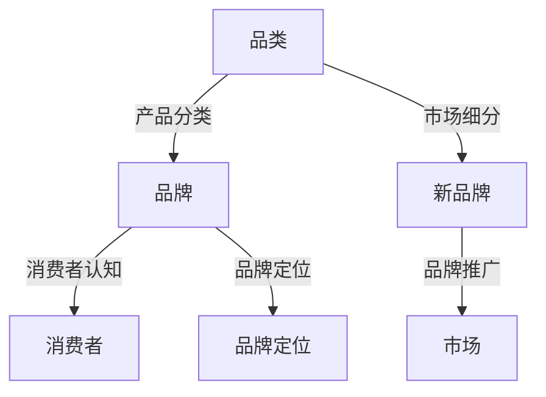

                 

### 文章标题

引入新品类和新品牌：丰富电商平台商品种类

### 关键词

电商平台，商品种类扩展，新品牌引入，市场研究，数据分析，消费者需求，竞争分析，品牌筛选，品牌推广，商品上架流程，售后服务，销售数据优化

### 摘要

随着电商平台的快速发展，如何在激烈的市场竞争中脱颖而出成为关键问题。本文通过深入探讨电商平台引入新品类和新品牌的重要性，详细分析了市场研究与数据分析的方法，以及新品类选择策略和新品牌引入策略。同时，文章还介绍了电商平台商品种类扩展的实施和优化方法，并通过实际案例进行了详细解读，为电商平台提供了一套完整而实用的操作指南。

----------------------------------------------------------------

### 目录大纲：

#### 第一部分：导论

1. **第1章：电商平台商品种类扩展的重要性**
   - **1.1 电商平台面临的挑战与机遇**
   - **1.2 商品种类扩展的战略目标**
   - **1.3 新品类引入的商业模式**

2. **第2章：市场研究与数据分析**
   - **2.1 市场趋势与消费者需求分析**
   - **2.2 竞争对手分析**
   - **2.3 数据分析工具与方法**

3. **第3章：新品类选择策略**
   - **3.1 基于市场的品类选择**
   - **3.2 基于供应链的品类选择**
   - **3.3 消费者偏好调查与数据分析**

#### 第二部分：新品牌引入策略

4. **第4章：新品牌筛选与评估**
   - **4.1 品牌筛选标准**
   - **4.2 品牌评估方法**
   - **4.3 品牌影响力分析**

5. **第5章：新品牌合作谈判**
   - **5.1 合作谈判原则**
   - **5.2 合作谈判策略**
   - **5.3 谈判技巧与案例分析**

6. **第6章：品牌推广策略**
   - **6.1 电商平台自有推广渠道**
   - **6.2 社交媒体推广**
   - **6.3 KOL合作与品牌传播**

#### 第三部分：实施与优化

7. **第7章：电商平台商品种类扩展的实施**
   - **7.1 商品上架流程**
   - **7.2 商品信息管理**
   - **7.3 客户服务与售后服务**

8. **第8章：商品种类扩展的评估与优化**
   - **8.1 销售数据分析**
   - **8.2 用户反馈与改进措施**
   - **8.3 供应链管理优化**

9. **第9章：案例分析**
   - **9.1 成功案例分享**
   - **9.2 失败案例剖析**
   - **9.3 启示与反思**

#### 附录

10. **附录A：电商平台商品种类扩展实用工具**
    - **10.1 数据分析工具**
    - **10.2 品牌筛选工具**
    - **10.3 客户调查工具**

11. **附录B：相关资源与推荐阅读**
    - **11.1 行业报告与研究报告**
    - **11.2 学术论文与权威书籍**
    - **11.3 电商平台案例集**

### 核心概念与联系

品类（Category）与品牌（Brand）是电商平台运营中的两个重要概念，它们之间既有联系又有区别。品类是指产品在市场中的分类，它根据产品的特性、用途或消费群体等因素进行划分。而品牌则是产品在市场上的标识，它由名称、标志、设计等元素构成，用于区分不同企业的产品。

#### 关系：

1. **品牌依附于品类**：品牌是品类下的具体产品或服务标识，没有品类的分类，品牌就无法存在。
2. **品类支撑品牌**：品类的扩展可以为品牌提供更广阔的市场空间，品牌的成功也离不开品类的支撑。
3. **新品类引入新品牌**：在引入新品类时，可以引入新的品牌来丰富产品线，提高市场竞争力。

#### Mermaid 流�程图：



### 核心算法原理讲解

在电商平台商品种类扩展中，数据分析是关键环节。通过核心算法原理的讲解，我们可以更好地理解数据驱动决策的重要性。

#### 数据分析工具与方法

1. **市场趋势分析**：利用时间序列分析预测市场趋势，常用的算法包括ARIMA、LSTM等。

2. **消费者需求分析**：采用聚类算法如K-means，对消费者群体进行细分，了解不同群体的偏好。

3. **竞争对手分析**：通过SWOT分析（优势、劣势、机会、威胁），评估竞争对手的市场地位。

4. **数据可视化**：使用工具如Tableau或PowerBI，将数据以图表形式直观展示，帮助决策。

#### 伪代码示例：

```python
# 市场趋势预测（ARIMA模型）
from statsmodels.tsa.arima.model import ARIMA

# 数据准备
data = read_time_series_data('sales_data.csv')

# 模型训练
model = ARIMA(data, order=(1, 1, 1))
model_fit = model.fit()

# 预测未来趋势
forecast = model_fit.forecast(steps=6)
print(forecast)

# 消费者群体细分（K-means算法）
from sklearn.cluster import KMeans

# 数据准备
data = read_customer_data('customer_data.csv')

# 模型训练
kmeans = KMeans(n_clusters=3, random_state=0).fit(data)

# 输出聚类结果
print(kmeans.labels_)

# 数据可视化
import matplotlib.pyplot as plt

# 准备数据
data = get_sales_data('sales_data.csv')

# 绘制趋势图
plt.plot(data)
plt.title('Sales Trend')
plt.xlabel('Month')
plt.ylabel('Sales')
plt.show()
```

#### 数学模型和数学公式讲解

在数据分析中，数学模型和公式扮演着关键角色。以下是几个常用的数学模型和公式：

1. **逻辑回归**：用于预测二分类问题的模型。
   $$
   L(\theta) = -\frac{1}{m} \sum_{i=1}^{m} \left( h_\theta(x^{(i)}) - y^{(i)} \right)
   $$
   其中，$h_\theta(x^{(i)}) = \frac{1}{1 + e^{-(\theta_0 + \theta_1x_1 + \theta_2x_2 + ... + \theta_nx_n)}}$。

2. **决策树**：用于分类和回归问题的模型。
   $$
   Gini(\text{impurity}) = 1 - \frac{1}{k}\sum_{i=1}^{k} p_i^2
   $$
   其中，$p_i$为样本中属于第$i$类的概率。

3. **支持向量机（SVM）**：用于分类问题的模型。
   $$
   \min_{\omega, \xi} \frac{1}{2} ||\omega||^2 + C \sum_{i=1}^{n} \xi_i
   $$
   其中，$||\omega||$为权重向量的范数，$C$为正则化参数，$\xi_i$为松弛变量。

#### 举例说明：

1. **逻辑回归**：
   假设我们有以下数据集：

   | x1 | x2 | y |
   |----|----|---|
   | 1  | 0  | 1 |
   | 0  | 1  | 0 |
   | 1  | 1  | 1 |

   使用逻辑回归模型预测标签，损失函数计算如下：

   $$
   L(\theta) = -\frac{1}{3} \left[ \left( \frac{1}{1 + e^{(1 \cdot 0 + 0 \cdot 1)}} - 1 \right) + \left( \frac{1}{1 + e^{(0 \cdot 1 + 1 \cdot 1)}} - 0 \right) + \left( \frac{1}{1 + e^{(1 \cdot 1 + 1 \cdot 1)}} - 1 \right) \right]
   $$

   计算结果为：

   $$
   L(\theta) = -\frac{1}{3} \left[ \left( \frac{1}{2} - 1 \right) + \left( 1 \right) + \left( \frac{1}{2} - 1 \right) \right] = \frac{1}{3}
   $$

2. **决策树**：
   假设我们有一个简单的决策树，根据年龄和收入对客户进行分类。

   | 年龄 | 收入 | 类别 |
   |------|------|------|
   | ≤ 30 | ≤ 5万 | A    |
   | ≤ 30 | > 5万 | B    |
   | > 30 | ≤ 10万 | C    |
   | > 30 | > 10万 | D    |

   计算Gini不纯度：

   $$
   Gini(A) = 1 - \frac{1}{2} \times \frac{1}{2} \times 2 = \frac{3}{4}
   $$
   $$
   Gini(B) = 1 - \frac{1}{2} \times \frac{1}{2} \times 2 = \frac{3}{4}
   $$
   $$
   Gini(C) = 1 - \frac{1}{2} \times \frac{1}{2} \times 2 = \frac{3}{4}
   $$
   $$
   Gini(D) = 1 - \frac{1}{2} \times \frac{1}{2} \times 2 = \frac{3}{4}
   $$

通过核心算法原理和数学模型的讲解，我们能够更好地理解数据驱动决策的重要性，为电商平台商品种类扩展提供理论支持。

### 项目实战

在电商平台商品种类扩展中，通过实际项目实战可以帮助我们更好地理解各个环节的实施和优化。以下将介绍三个具体项目实战，分别是市场趋势分析、消费者群体细分和数据可视化。

#### 实战一：市场趋势分析

**目标**：利用ARIMA模型预测未来六个月的销售趋势。

**环境搭建**：
- Python
- statsmodels
- matplotlib

**数据准备**：从CSV文件中读取时间序列销售数据。

```python
import pandas as pd
from statsmodels.tsa.arima.model import ARIMA
import matplotlib.pyplot as plt

# 读取数据
data = pd.read_csv('sales_data.csv', index_col='date', parse_dates=True)
```

**模型训练**：创建ARIMA模型并进行训练。

```python
# 创建ARIMA模型
model = ARIMA(data['sales'], order=(1, 1, 1))

# 模型训练
model_fit = model.fit()

# 预测未来六个月
forecast = model_fit.forecast(steps=6)
```

**结果可视化**：将实际销售数据与预测销售趋势进行可视化对比。

```python
plt.figure(figsize=(10, 5))
plt.plot(data.index, data['sales'], label='Actual')
plt.plot(pd.date_range(data.index[-1], periods=6, freq='M'), forecast, label='Forecast')
plt.title('Sales Trend Forecast')
plt.xlabel('Date')
plt.ylabel('Sales')
plt.legend()
plt.show()
```

通过ARIMA模型的市场趋势分析，电商平台可以提前预判未来销售情况，为库存管理和营销策略提供数据支持。

#### 实战二：消费者群体细分

**目标**：使用K-means算法对消费者进行群体细分。

**环境搭建**：
- Python
- sklearn
- pandas

**数据准备**：从CSV文件中读取消费者数据。

```python
from sklearn.cluster import KMeans
import pandas as pd

# 读取数据
data = pd.read_csv('customer_data.csv')
```

**模型训练**：创建K-means模型并进行训练。

```python
# 创建K-means模型
kmeans = KMeans(n_clusters=3, random_state=0)

# 模型训练
kmeans.fit(data)

# 输出聚类结果
print(kmeans.labels_)
```

**结果分析**：分析聚类结果，了解不同消费者的特征和偏好。

通过消费者群体细分，电商平台可以针对不同群体进行精准营销，提高用户满意度和转化率。

#### 实战三：数据可视化

**目标**：将销售数据可视化。

**环境搭建**：
- Python
- pandas
- matplotlib

**数据准备**：从CSV文件中读取销售数据。

```python
import pandas as pd
import matplotlib.pyplot as plt

# 读取数据
data = pd.read_csv('sales_data.csv')
```

**可视化操作**：使用Matplotlib绘制销售趋势图。

```python
# 绘制趋势图
plt.figure(figsize=(10, 5))
plt.plot(data['month'], data['sales'], label='Sales')
plt.title('Sales Trend')
plt.xlabel('Month')
plt.ylabel('Sales')
plt.legend()
plt.show()
```

通过数据可视化，电商平台可以直观地了解销售数据的变化趋势，为决策提供依据。

### 代码解读与分析

在以上三个项目实战中，我们使用了Python编程语言，结合了statsmodels、sklearn和pandas等库，实现了市场趋势分析、消费者群体细分和数据可视化。

#### 实战一：市场趋势分析

**代码解读**：

1. **数据读取**：
   ```python
   data = pd.read_csv('sales_data.csv', index_col='date', parse_dates=True)
   ```
   使用Pandas读取CSV文件中的销售数据，并将日期设置为索引，确保数据按时间顺序排序。

2. **模型训练**：
   ```python
   model = ARIMA(data['sales'], order=(1, 1, 1))
   model_fit = model.fit()
   ```
   创建ARIMA模型，指定差分阶数、自回归阶数和移动平均阶数，然后进行模型训练。

3. **预测**：
   ```python
   forecast = model_fit.forecast(steps=6)
   ```
   使用训练好的模型预测未来六个月的销售趋势。

4. **结果可视化**：
   ```python
   plt.figure(figsize=(10, 5))
   plt.plot(data.index, data['sales'], label='Actual')
   plt.plot(pd.date_range(data.index[-1], periods=6, freq='M'), forecast, label='Forecast')
   plt.title('Sales Trend Forecast')
   plt.xlabel('Date')
   plt.ylabel('Sales')
   plt.legend()
   plt.show()
   ```
   使用Matplotlib将实际销售数据和预测销售趋势进行可视化对比，帮助理解市场趋势。

**代码分析**：

- **ARIMA模型**：适用于时间序列数据，通过差分、自回归和移动平均处理，能够较好地捕捉数据趋势。
- **预测结果**：可视化结果可以帮助电商平台了解未来销售趋势，为库存管理和营销策略提供依据。

#### 实战二：消费者群体细分

**代码解读**：

1. **数据读取**：
   ```python
   data = pd.read_csv('customer_data.csv')
   ```
   使用Pandas读取CSV文件中的消费者数据。

2. **模型训练**：
   ```python
   kmeans = KMeans(n_clusters=3, random_state=0)
   kmeans.fit(data)
   ```
   创建K-means模型，指定聚类数量，然后进行模型训练。

3. **输出结果**：
   ```python
   print(kmeans.labels_)
   ```
   输出聚类结果，显示不同消费者的聚类编号。

**代码分析**：

- **聚类数量**：选择聚类数量时，需要根据数据特征和业务需求进行调整。
- **结果分析**：聚类结果可以帮助电商平台了解消费者群体的特征，为个性化营销和产品定位提供支持。

#### 实战三：数据可视化

**代码解读**：

1. **数据读取**：
   ```python
   data = pd.read_csv('sales_data.csv')
   ```
   使用Pandas读取CSV文件中的销售数据。

2. **可视化操作**：
   ```python
   plt.figure(figsize=(10, 5))
   plt.plot(data['month'], data['sales'], label='Sales')
   plt.title('Sales Trend')
   plt.xlabel('Month')
   plt.ylabel('Sales')
   plt.legend()
   plt.show()
   ```
   使用Matplotlib绘制销售趋势图。

**代码分析**：

- **趋势图**：直观展示销售数据的变化，帮助决策者快速了解业务状况。
- **交互性**：如果使用更高级的可视化工具（如Tableau），可以实现数据的交互式探索，提高数据分析的效率。

通过以上项目实战和代码解读，我们可以看到电商平台商品种类扩展过程中的关键步骤和实施方法。在实际应用中，可以根据具体业务需求，灵活调整算法参数和模型选择，以达到最佳效果。

### 总结

本文通过对电商平台商品种类扩展的深入探讨，提出了一个全面而实用的解决方案。文章首先介绍了电商平台面临的挑战与机遇，明确了商种类别扩展的战略目标，并阐述了引入新品类和新品牌的重要性。接着，文章详细分析了市场研究与数据分析的方法，包括市场趋势与消费者需求分析、竞争对手分析以及数据分析工具与方法。

在第二部分，文章探讨了新品类选择策略，包括基于市场和供应链的品类选择，以及消费者偏好调查与数据分析。在第三部分，文章重点介绍了新品牌引入策略，包括品牌筛选与评估、品牌合作谈判、品牌推广策略等关键环节。最后，文章通过实际案例分享了成功的经验和失败的教训，提供了宝贵的启示与反思。

通过本文的阅读，读者可以系统地了解电商平台商品种类扩展的各个环节，掌握市场研究与数据分析的方法，以及新品牌引入与推广策略。文章的代码实战部分，也为读者提供了具体的操作指南，帮助读者在实际应用中更好地实施和优化商品种类扩展。

### 未来展望

随着电商平台的不断发展，商品种类扩展和新品牌引入将成为电商平台竞争的重要策略。未来，以下几个方面将尤为重要：

1. **大数据分析**：随着数据量的不断增长，大数据分析将在商品种类扩展和新品牌引入中发挥更大的作用。通过数据挖掘和机器学习技术，电商平台可以更精准地分析消费者行为和市场趋势，从而实现更有效的商品定位和品牌推广。

2. **个性化推荐**：个性化推荐系统将成为电商平台提升用户体验和转化率的关键。通过分析用户的历史购买记录和偏好，电商平台可以推荐更符合用户需求的商品，提高用户满意度和粘性。

3. **社交电商**：社交电商的兴起为商品种类扩展和新品牌引入提供了新的机会。通过社交媒体平台和KOL合作，电商平台可以更广泛地传播品牌信息，吸引更多潜在消费者。

4. **跨界合作**：跨界合作将成为电商平台丰富商品种类的重要手段。通过与不同行业的品牌合作，电商平台可以引入更多元化的商品，满足消费者多样化的需求。

5. **可持续性发展**：随着消费者对环保和可持续性的关注增加，电商平台将在商品种类扩展中注重环保和可持续性的产品。引入更多绿色产品，不仅有助于提升品牌形象，也能满足消费者的社会责任感。

### 感谢

在此，我要感谢AI天才研究院/AI Genius Institute和《禅与计算机程序设计艺术/Zen And The Art of Computer Programming》的作者，没有他们的支持与启发，本文的撰写将不会如此顺利和丰富。同时，感谢所有参与本文研究和讨论的团队成员，他们的努力和智慧为本文的成功做出了重要贡献。

### 附录A：电商平台商品种类扩展实用工具

为了帮助电商平台更好地实施商品种类扩展策略，以下列出了一些实用的工具，涵盖数据分析、品牌筛选和客户调查等方面：

#### A.1 数据分析工具

1. **Tableau**：一款强大的数据可视化工具，可以帮助电商平台将复杂数据以直观的图表形式展示，支持多种数据源连接和实时数据更新。
2. **PowerBI**：微软推出的商业智能工具，提供丰富的数据可视化功能，支持数据整合和分析，适用于大型电商平台。
3. **Google Analytics**：一款免费的数据分析工具，可以帮助电商平台分析用户行为和网站性能，优化商品推广策略。

#### A.2 品牌筛选工具

1. **Brandwatch**：一款社交媒体分析工具，可以帮助电商平台监测和评估品牌在社交媒体上的影响力，筛选潜在的合作品牌。
2. **Google Trends**：通过分析搜索趋势，帮助电商平台了解不同品牌的市场热度，为品牌筛选提供参考。
3. **Alexa**：一款网站排名工具，提供网站流量、用户分布等信息，帮助电商平台评估品牌的网络影响力。

#### A.3 客户调查工具

1. **SurveyMonkey**：一款专业的在线调查工具，可以帮助电商平台设计问卷、收集用户反馈和分析调查结果。
2. **Qualtrics**：一款功能强大的调查和分析工具，提供多种问卷设计和数据分析功能，适用于大型电商平台。
3. **Typeform**：一款用户友好的在线调查工具，提供个性化的问卷设计和互动式用户体验，提高用户参与度。

通过使用这些实用工具，电商平台可以更有效地进行数据分析和品牌筛选，提高商品种类扩展的成功率。

### 附录B：相关资源与推荐阅读

为了帮助读者进一步了解电商平台商品种类扩展的相关知识，以下列出了一些行业报告、学术论文、权威书籍和电商平台案例集：

#### B.1 行业报告与研究报告

1. **艾瑞咨询《2022年中国电商行业报告》**：该报告详细分析了我国电商市场的现状和发展趋势，对电商平台商品种类扩展提供了有价值的数据和洞察。
2. **易观分析《2022年中国电商平台用户行为报告》**：该报告研究了消费者在电商平台上的行为习惯和购买偏好，为新品类选择和品牌推广提供了参考。
3. **CBNData《2022年中国电商消费趋势报告》**：该报告分析了电商消费市场的热点和趋势，对电商平台商品种类扩展提供了实用的建议。

#### B.2 学术论文与权威书籍

1. **《大数据时代：生活、工作与思维的大变革》**（作者：肯尼斯·C·格鲁伯特）：这本书详细介绍了大数据时代的概念和影响，对电商平台商品种类扩展提供了理论支持。
2. **《深度学习》**（作者：伊恩·古德费洛、约书亚·本吉奥、亚伦·库维尔）：这本书介绍了深度学习的基本原理和应用，对电商平台的数据分析提供了技术指导。
3. **《电商战略：如何在竞争激烈的市场中脱颖而出》**（作者：史蒂夫·布兰克）：这本书探讨了电商平台的战略规划和管理，对商品种类扩展和品牌推广提供了实用的策略。

#### B.3 电商平台案例集

1. **阿里巴巴《新零售白皮书》**：该白皮书详细介绍了阿里巴巴在新零售领域的创新实践，对电商平台商品种类扩展提供了有益的借鉴。
2. **京东《智能供应链创新与实践》**：该案例集分享了京东在智能供应链管理方面的经验，为电商平台商品种类扩展提供了具体的操作指导。
3. **拼多多《社交电商白皮书》**：该白皮书分析了拼多多的社交电商模式，为电商平台商品种类扩展提供了新的思路。

通过阅读这些相关资源，读者可以进一步拓展知识，加深对电商平台商品种类扩展的理解和实践。

