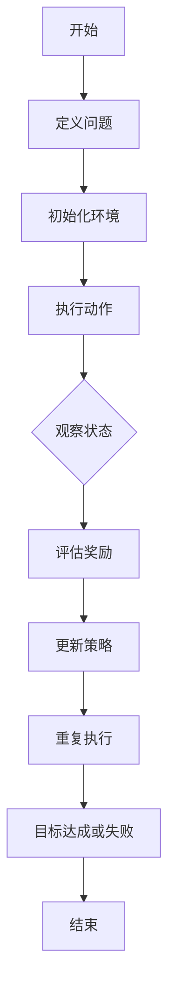

                 

### 《强化学习在智能机器人导航中的应用研究》引论与核心概念

**关键词**：强化学习，智能机器人，导航，路径规划，避障，动态环境

**摘要**：
本文旨在探讨强化学习在智能机器人导航中的应用，梳理强化学习的基本原理，分析其在路径规划、避障和动态环境下的导航问题中的具体实现方法。通过实例分析和代码实现，深入探讨强化学习在智能机器人导航中的实际应用，展望其未来的发展方向。

---

智能机器人在现代社会中的应用日益广泛，从无人驾驶汽车到工业自动化，再到家庭服务机器人，它们在各个领域都扮演着重要角色。导航作为智能机器人的一项核心能力，其精度和效率直接影响到机器人在复杂环境中的运行效果。近年来，强化学习作为一种强大的机器学习技术，因其能够通过试错学习最优策略而受到广泛关注。

### 第1章：强化学习概述

#### 1.1 强化学习的定义与发展历程

强化学习（Reinforcement Learning，RL）是机器学习的一个重要分支，其核心思想是通过与环境交互，学习最优策略，以实现目标的最优化。1950年代，Arthur Samuel提出了第一个强化学习算法——雪崩游戏（Checkers），这标志着强化学习的诞生。随着人工智能技术的发展，强化学习在20世纪90年代逐渐受到关注，并在21世纪初取得了突破性进展。

强化学习的主要发展历程包括：

- 1950年代：Arthur Samuel发明了第一个强化学习算法，雪崩游戏。
- 1970年代：Richard Sutton和Andrew Barto出版了《强化学习：一种引入控制理论的方法》（Reinforcement Learning: An Introduction），奠定了强化学习的基础。
- 1990年代：Q-learning算法提出，标志着模型-free强化学习的出现。
- 2000年代：深度强化学习（Deep Reinforcement Learning，DRL）的兴起，使得强化学习在处理高维状态和动作空间方面取得了显著进展。
- 2010年代：AlphaGo的横空出世，展示了强化学习在解决复杂问题上的巨大潜力。

#### 1.2 强化学习在机器人导航中的潜在应用

强化学习在机器人导航中的应用主要涉及以下几个方面：

1. **路径规划**：通过强化学习算法，机器人能够学习到从起点到目标点的最优路径。
2. **避障**：在复杂环境中，强化学习可以帮助机器人识别障碍物并制定避开策略。
3. **动态环境下的导航**：强化学习能够处理动态环境中的不确定性，使机器人能够适应环境变化。

#### 1.3 本书结构及章节安排

本书分为四个主要部分：

1. **引论与核心概念**：介绍强化学习的基本原理和其在机器人导航中的应用。
2. **强化学习在智能机器人导航中的应用**：详细探讨强化学习在路径规划、避障和动态环境下的导航问题中的具体实现方法。
3. **强化学习在智能机器人导航中的应用实例**：通过实例分析和代码实现，深入探讨强化学习在智能机器人导航中的实际应用。
4. **展望与未来发展方向**：展望强化学习在智能机器人导航中的未来发展，提出可能的研究方向和挑战。

### 第2章：强化学习基本原理

#### 2.1 强化学习的基本概念

强化学习由三个核心元素构成：环境（Environment）、智能体（Agent）和动作（Action）。环境是智能体所处的现实世界，智能体是执行动作的主体，动作则是智能体在环境中采取的行为。

强化学习的关键概念包括：

- **状态（State）**：描述智能体在环境中的当前情况。
- **动作（Action）**：智能体可以采取的行为。
- **奖励（Reward）**：动作执行后环境给予的即时反馈，用于指导智能体的学习过程。
- **策略（Policy）**：智能体选择动作的规则。

强化学习的目标是学习一个最优策略，使得在长期执行动作时，智能体能够获得最大的累积奖励。

#### 2.2 强化学习的数学模型

强化学习通常基于马尔可夫决策过程（Markov Decision Process，MDP）的框架，其数学模型如下：

\[ 
Q(s, a) = r(s, a) + \gamma \max_{a'} Q(s', a') 
\]

其中：
- \( Q(s, a) \)：状态-动作值函数，表示在状态 \( s \) 下执行动作 \( a \) 的预期奖励。
- \( r(s, a) \)：即时奖励，表示在状态 \( s \) 下执行动作 \( a \) 后获得的即时奖励。
- \( \gamma \)：折扣因子，表示对未来奖励的期望值。
- \( s' \)：状态转移后的状态。
- \( a' \)：在状态 \( s' \) 下最优动作。

#### 2.3 强化学习的核心算法原理

强化学习算法主要包括以下几种：

- **值函数方法**：通过学习状态-动作值函数来指导动作选择，常用的算法有Q-learning和SARSA。
  - **Q-learning**：使用目标策略来更新值函数，伪代码如下：

    ```python
    for each state s:
        Initialize Q(s, a) with random values
    while not goal:
        Select action a using epsilon-greedy policy
        Execute action a in environment
        Observe reward r and next state s'
        Update Q(s, a) = Q(s, a) + alpha * (r + gamma * max(Q(s', a')) - Q(s, a))
        Update state s = s'
    ```

  - **SARSA**：使用当前策略来更新值函数，伪代码如下：

    ```python
    for each state s:
        Initialize Q(s, a) with random values
    while not goal:
        Select action a using epsilon-greedy policy
        Execute action a in environment
        Observe reward r and next state s'
        Select action a' using epsilon-greedy policy
        Update Q(s, a) = Q(s, a) + alpha * (r + gamma * Q(s', a') - Q(s, a))
        Update state s = s'
    ```

- **策略迭代方法**：通过迭代更新策略来指导动作选择，常用的算法有Policy Gradient和Actor-Critic。

  - **Policy Gradient**：直接优化策略的梯度，伪代码如下：

    ```python
    Initialize policy parameters theta
    while not goal:
        Execute actions according to policy parameters theta
        Collect data (state, action, reward)
        Update theta using gradient ascent on the expected reward
    ```

  - **Actor-Critic**：由演员（Actor）和评论家（Critic）两部分组成，伪代码如下：

    ```python
    Initialize actor parameters theta_a and critic parameters theta_c
    while not goal:
        Execute actions according to actor policy theta_a
        Collect data (state, action, reward)
        Update critic parameters theta_c to estimate Q(s, a)
        Update actor parameters theta_a to optimize policy
    ```

#### 2.4 Mermaid流程图：强化学习基本流程



### 强化学习的基本数学模型

强化学习的基本数学模型包括状态-动作值函数和策略。状态-动作值函数 \( Q(s, a) \) 表示在状态 \( s \) 下执行动作 \( a \) 的预期奖励，而策略 \( \pi(a|s) \) 表示在状态 \( s \) 下采取动作 \( a \) 的概率。

#### 状态-动作值函数

状态-动作值函数 \( Q(s, a) \) 可以表示为：

\[ 
Q(s, a) = r(s, a) + \gamma \max_{a'} Q(s', a') 
\]

其中：
- \( r(s, a) \) 是在状态 \( s \) 下执行动作 \( a \) 的即时奖励。
- \( \gamma \) 是折扣因子，用于权衡当前奖励和未来奖励之间的关系。
- \( s' \) 是状态转移后的状态。
- \( a' \) 是在状态 \( s' \) 下最优动作。

这个公式表示，在当前状态 \( s \) 下，执行动作 \( a \) 后获得的即时奖励 \( r(s, a) \)，加上未来所有可能状态 \( s' \) 下执行最优动作 \( a' \) 的预期奖励 \( \gamma \max_{a'} Q(s', a') \)。

#### 策略

策略 \( \pi(a|s) \) 是在状态 \( s \) 下选择动作 \( a \) 的概率分布。最优策略是指能够使累积奖励最大的策略。

#### 强化学习算法

强化学习算法通过不断迭代更新状态-动作值函数和策略，以找到最优策略。常见的强化学习算法包括：

1. **Q-learning**：使用目标策略来更新状态-动作值函数，伪代码如下：

    ```python
    for each state s:
        Initialize Q(s, a) with random values
    while not goal:
        Select action a using epsilon-greedy policy
        Execute action a in environment
        Observe reward r and next state s'
        Update Q(s, a) = Q(s, a) + alpha * (r + gamma * max(Q(s', a')) - Q(s, a))
        Update state s = s'
    ```

2. **SARSA**：使用当前策略来更新状态-动作值函数，伪代码如下：

    ```python
    for each state s:
        Initialize Q(s, a) with random values
    while not goal:
        Select action a using epsilon-greedy policy
        Execute action a in environment
        Observe reward r and next state s'
        Select action a' using epsilon-greedy policy
        Update Q(s, a) = Q(s, a) + alpha * (r + gamma * Q(s', a') - Q(s, a))
        Update state s = s'
    ```

3. **Policy Gradient**：直接优化策略的梯度，伪代码如下：

    ```python
    Initialize policy parameters theta
    while not goal:
        Execute actions according to policy parameters theta
        Collect data (state, action, reward)
        Update theta using gradient ascent on the expected reward
    ```

4. **Actor-Critic**：由演员和评论家两部分组成，伪代码如下：

    ```python
    Initialize actor parameters theta_a and critic parameters theta_c
    while not goal:
        Execute actions according to actor policy theta_a
        Collect data (state, action, reward)
        Update critic parameters theta_c to estimate Q(s, a)
        Update actor parameters theta_a to optimize policy
    ```

### 强化学习在路径规划中的应用

强化学习在路径规划中的应用是一个备受关注的研究领域，旨在通过学习环境中的最优路径来提高智能机器人的导航能力。以下是强化学习在路径规划中应用的详细解析。

#### 3.1 路径规划问题概述

路径规划问题可以描述为在给定的环境条件下，找到一条从起点到目标点的最优路径。在这个问题中，环境由一系列状态和动作组成，每个状态对应机器人当前的位置，每个动作对应机器人可执行的操作（如前进、后退、转向等）。路径规划的目标是最大化从起点到目标点的总奖励。

#### 3.2 强化学习在路径规划中的实现方法

强化学习在路径规划中的实现方法主要包括以下几种：

1. **深度强化学习（DRL）**：
   深度强化学习将深度神经网络与强化学习相结合，用于学习高维状态和动作空间中的最优路径。DRL的主要实现方法包括：
   - **深度Q网络（DQN）**：使用深度神经网络来近似状态-动作值函数，并通过经验回放和目标网络来改善学习过程。
   - **策略梯度方法**：如深度确定性策略梯度（DDPG）和深度确定性策略梯度Twin（DDPG-Twin），通过学习策略的直接梯度来优化路径规划。

2. **基于模型的方法**：
   基于模型的方法首先建立环境模型，然后使用强化学习算法在模型中学习最优策略。这种方法的主要实现方法包括：
   - **部分可观测马尔可夫决策过程（POMDP）**：使用部分可观测性模型来处理环境中存在的不确定性。
   - **模型预测控制（MPC）**：通过构建动态系统模型，预测未来的状态和奖励，然后使用优化算法来找到最优路径。

3. **基于数据的方法**：
   基于数据的方法利用历史环境数据来训练模型，然后使用强化学习算法来生成自适应路径规划策略。这种方法的主要实现方法包括：
   - **强化学习与深度学习结合**：使用深度神经网络来学习状态-动作值函数，并通过经验回放和训练数据来优化路径规划。
   - **深度生成模型**：如生成对抗网络（GAN），用于生成环境中的数据，然后使用这些数据来训练路径规划模型。

#### 3.3 伪代码：路径规划强化学习算法

以下是一个简单的路径规划强化学习算法的伪代码：

```python
Initialize Q(s, a) with random values
Initialize environment model
while not goal:
    Select action a using epsilon-greedy policy
    Execute action a in environment
    Observe next state s' and reward r
    Update Q(s, a) = Q(s, a) + alpha * (r + gamma * max(Q(s', a')) - Q(s, a))
    Update state s = s'
    if done:
        Reset environment
```

#### 3.4 数学模型与公式讲解

在路径规划中，强化学习的数学模型可以表示为：

\[ 
Q(s, a) = r(s, a) + \gamma \max_{a'} Q(s', a') 
\]

其中：
- \( Q(s, a) \)：状态-动作值函数，表示在状态 \( s \) 下执行动作 \( a \) 的预期奖励。
- \( r(s, a) \)：即时奖励，表示在状态 \( s \) 下执行动作 \( a \) 后获得的即时奖励。
- \( \gamma \)：折扣因子，用于平衡当前奖励和未来奖励之间的关系。
- \( s' \)：状态转移后的状态。
- \( a' \)：在状态 \( s' \) 下最优动作。

通过这个公式，强化学习算法可以更新状态-动作值函数，以找到从起点到目标点的最优路径。

#### 3.5 强化学习在路径规划中的优势

强化学习在路径规划中的优势主要体现在以下几个方面：

1. **自适应能力**：强化学习算法能够根据环境的变化自适应地调整路径规划策略，提高导航的灵活性和适应性。
2. **灵活性**：强化学习适用于各种不同类型的环境和路径规划问题，能够处理高维状态和动作空间。
3. **动态响应**：强化学习能够实时响应当前环境中的变化，提供更加及时和有效的路径规划。
4. **探索与利用**：强化学习通过平衡探索和利用，能够在未知环境中快速找到最优路径。

### 4.1 强化学习在避障中的应用

强化学习在避障中的应用旨在通过学习如何避免环境中的障碍物，使智能机器人能够安全、高效地执行任务。以下是强化学习在避障中应用的详细解析。

#### 4.2 强化学习在避障中的实现方法

强化学习在避障中的应用方法主要包括以下几种：

1. **基于奖励函数的方法**：
   基于奖励函数的方法通过设计合适的奖励函数，使机器人能够通过学习获得避障策略。具体实现包括：
   - **静态障碍物避障**：设计奖励函数，使机器人能够避开静态障碍物，如墙壁、树等。
   - **动态障碍物避障**：设计奖励函数，使机器人能够避开动态障碍物，如移动的车辆、行人等。

2. **基于马尔可夫决策过程（MDP）的方法**：
   基于MDP的方法使用MDP框架，通过求解最优策略来实现避障。具体实现包括：
   - **部分可观测MDP**：在部分可观测环境中，通过学习状态-动作值函数来求解最优策略。
   - **完全可观测MDP**：在完全可观测环境中，通过求解MDP的最优策略来实现避障。

3. **基于深度强化学习的方法**：
   基于深度强化学习的方法利用深度神经网络学习状态-动作值函数，实现高效避障。具体实现包括：
   - **深度Q网络（DQN）**：使用深度神经网络来近似状态-动作值函数，并通过经验回放和目标网络来改善学习过程。
   - **深度确定性策略梯度（DDPG）**：通过学习策略的直接梯度来优化避障策略。

#### 4.3 伪代码：避障强化学习算法

以下是一个简单的避障强化学习算法的伪代码：

```python
Initialize Q(s, a) with random values
Initialize environment model
while not goal:
    Select action a using epsilon-greedy policy
    Execute action a in environment
    Observe next state s' and reward r
    Update Q(s, a) = Q(s, a) + alpha * (r + gamma * max(Q(s', a')) - Q(s, a))
    Update state s = s'
    if done:
        Reset environment
```

#### 4.4 数学模型与公式讲解

在避障中，强化学习的数学模型可以表示为：

\[ 
Q(s, a) = r(s, a) + \gamma \max_{a'} Q(s', a') 
\]

其中：
- \( Q(s, a) \)：状态-动作值函数，表示在状态 \( s \) 下执行动作 \( a \) 的预期奖励。
- \( r(s, a) \)：即时奖励，表示在状态 \( s \) 下执行动作 \( a \) 后获得的即时奖励。
- \( \gamma \)：折扣因子，用于平衡当前奖励和未来奖励之间的关系。
- \( s' \)：状态转移后的状态。
- \( a' \)：在状态 \( s' \) 下最优动作。

通过这个公式，强化学习算法可以更新状态-动作值函数，以找到避障的最优策略。

#### 4.5 强化学习在避障中的优势

强化学习在避障中的优势主要体现在以下几个方面：

1. **适应性**：强化学习能够根据环境的变化自适应地调整避障策略，提高避障的灵活性。
2. **安全性**：通过设计合适的奖励函数，强化学习能够确保机器人避免危险情况，提高避障的安全性。
3. **实时性**：强化学习能够实时响应当前环境中的变化，提供更加及时和有效的避障策略。
4. **复杂性**：强化学习适用于处理复杂的避障问题，如动态环境、多障碍物等情况。

### 5.1 强化学习在动态环境下的导航

在动态环境中，强化学习能够通过学习和适应环境的变化来提高智能机器人的导航能力。以下是强化学习在动态环境下的导航应用的详细解析。

#### 5.2 强化学习在动态环境下的实现方法

强化学习在动态环境下的实现方法主要包括以下几种：

1. **基于模型的方法**：
   基于模型的方法通过建立动态环境模型，预测环境变化，并调整策略以适应动态环境。具体实现包括：
   - **部分可观测马尔可夫决策过程（POMDP）**：在部分可观测环境下，使用POMDP框架来处理环境的不确定性。
   - **动态系统模型**：通过建立动态系统模型，预测未来的状态和奖励，然后使用优化算法来找到最优路径。

2. **基于数据的方法**：
   基于数据的方法通过利用历史环境数据来训练模型，然后使用强化学习算法来生成适应性导航策略。具体实现包括：
   - **深度强化学习与数据结合**：使用深度神经网络来学习状态-动作值函数，并通过经验回放和训练数据来优化导航策略。
   - **生成对抗网络（GAN）**：通过生成对抗网络生成动态环境数据，然后使用这些数据来训练导航模型。

3. **基于深度强化学习的方法**：
   基于深度强化学习的方法利用深度神经网络学习动态环境下的状态-动作值函数，实现动态导航。具体实现包括：
   - **深度Q网络（DQN）**：使用深度神经网络来近似状态-动作值函数，并通过经验回放和目标网络来改善学习过程。
   - **深度确定性策略梯度（DDPG）**：通过学习策略的直接梯度来优化动态环境下的导航策略。

#### 5.3 伪代码：动态环境强化学习导航算法

以下是一个简单的动态环境强化学习导航算法的伪代码：

```python
Initialize Q(s, a) with random values
Initialize environment model
while not goal:
    Select action a using epsilon-greedy policy
    Execute action a in environment
    Observe next state s' and reward r
    Update Q(s, a) = Q(s, a) + alpha * (r + gamma * max(Q(s', a')) - Q(s, a))
    Update state s = s'
    if done:
        Reset environment
```

#### 5.4 数学模型与公式讲解

在动态环境下，强化学习的数学模型可以表示为：

\[ 
Q(s, a) = r(s, a) + \gamma \max_{a'} Q(s', a') 
\]

其中：
- \( Q(s, a) \)：状态-动作值函数，表示在状态 \( s \) 下执行动作 \( a \) 的预期奖励。
- \( r(s, a) \)：即时奖励，表示在状态 \( s \) 下执行动作 \( a \) 后获得的即时奖励。
- \( \gamma \)：折扣因子，用于平衡当前奖励和未来奖励之间的关系。
- \( s' \)：状态转移后的状态。
- \( a' \)：在状态 \( s' \) 下最优动作。

通过这个公式，强化学习算法可以更新状态-动作值函数，以找到动态环境下的最优导航策略。

#### 5.5 强化学习在动态环境下的优势

强化学习在动态环境下的优势主要体现在以下几个方面：

1. **适应性**：强化学习能够根据环境的变化自适应地调整导航策略，提高导航的灵活性。
2. **实时性**：强化学习能够实时响应当前环境中的变化，提供更加及时和有效的导航策略。
3. **安全性**：通过设计合适的奖励函数，强化学习能够确保机器人避免危险情况，提高导航的安全性。
4. **复杂性**：强化学习适用于处理复杂的动态环境，如多障碍物、动态目标等。

### 6.1 室内机器人导航实例

为了更好地展示强化学习在智能机器人导航中的应用，以下将详细描述一个室内机器人导航实例。这个实例将涵盖从环境搭建到代码实现的完整过程，以帮助读者更好地理解强化学习算法在真实场景中的应用。

#### 6.2 室内导航环境概述

在这个实例中，我们将使用一个简单的室内环境，该环境由若干个房间组成，每个房间都有不同的特征和障碍物。机器人的目标是找到从起点到目标点的最优路径，同时避免与环境中的障碍物发生碰撞。

环境设置如下：
- **起点**：位于房间的角落，机器人需要从起点出发。
- **目标点**：位于房间的另一角落，机器人需要到达目标点。
- **障碍物**：分布在房间内，机器人需要避开这些障碍物。

#### 6.3 强化学习算法在室内导航中的应用

在这个实例中，我们将使用深度强化学习（DRL）算法来实现室内导航。具体来说，我们将使用深度Q网络（DQN）来学习状态-动作值函数，并通过经验回放和目标网络来优化学习过程。

DQN的主要实现步骤如下：

1. **环境初始化**：首先，我们需要初始化环境，包括设置起点、目标点和障碍物的位置。
2. **状态-动作值函数初始化**：初始化状态-动作值函数 \( Q(s, a) \)，用于表示在状态 \( s \) 下执行动作 \( a \) 的预期奖励。
3. **训练过程**：使用DQN算法对状态-动作值函数进行训练，通过不断地在环境中执行动作，更新状态-动作值函数。
4. **导航过程**：使用训练好的状态-动作值函数进行导航，从起点出发，到达目标点。

#### 6.4 代码实现与案例分析

以下是一个基于Python和TensorFlow的室内导航实例代码：

```python
import numpy as np
import random
import gym
from gym import spaces
from tensorflow.keras.models import Sequential
from tensorflow.keras.layers import Dense
from tensorflow.keras.optimizers import Adam

# 创建环境
env = gym.make('Navigation-v0')

# 定义模型
model = Sequential([
    Dense(64, activation='relu', input_shape=(env.observation_space.shape[0],)),
    Dense(64, activation='relu'),
    Dense(env.action_space.n, activation='linear')
])

# 定义优化器
optimizer = Adam(learning_rate=0.001)

# 定义损失函数
loss_fn = tf.keras.losses.MeanSquaredError()

# 训练模型
for episode in range(1000):
    state = env.reset()
    done = False
    while not done:
        action = model.predict(state.reshape(1, -1))
        next_state, reward, done, _ = env.step(np.argmax(action))
        with tf.GradientTape() as tape:
            tape.watch(model.trainable_variables)
            action_pred = model(next_state.reshape(1, -1))
            loss = loss_fn(reward + gamma * (1 - int(done)) * action_pred, action)
        grads = tape.gradient(loss, model.trainable_variables)
        optimizer.apply_gradients(zip(grads, model.trainable_variables))
        state = next_state

# 测试模型
state = env.reset()
done = False
while not done:
    action = model.predict(state.reshape(1, -1))
    next_state, reward, done, _ = env.step(np.argmax(action))
    state = next_state
```

在这个代码中，我们首先使用gym创建了一个导航环境，然后定义了一个简单的深度神经网络模型，用于学习状态-动作值函数。在训练过程中，我们通过不断地在环境中执行动作，更新模型权重。在测试过程中，我们使用训练好的模型进行导航，从起点到达目标点。

#### 6.5 代码解读与分析

以下是对代码的详细解读与分析：

1. **环境初始化**：
   - 使用`gym.make('Navigation-v0')`创建了一个导航环境。
   - 导航环境包括一个起点、一个目标点和一些障碍物。

2. **模型定义**：
   - 使用`Sequential`创建了一个序列模型。
   - 模型包括两个隐藏层，每个隐藏层有64个神经元，使用ReLU激活函数。
   - 输出层有与动作空间数量相等的神经元，使用线性激活函数。

3. **优化器与损失函数**：
   - 使用`Adam`优化器，学习率为0.001。
   - 使用`MeanSquaredError`作为损失函数。

4. **训练过程**：
   - 在每个训练周期中，首先重置环境，并从起点开始。
   - 在每个时间步，选择动作，执行动作，并观察下一个状态和奖励。
   - 使用梯度下降法更新模型权重。

5. **测试过程**：
   - 使用训练好的模型进行测试，从起点出发，到达目标点。

通过这个实例，我们可以看到如何使用强化学习算法来实现室内导航。这个实例展示了强化学习在处理动态、不确定环境中的强大能力，同时也为读者提供了一个实用的编程案例。

### 7.1 室外机器人导航实例

在室内导航实例的基础上，本节我们将进一步探讨室外机器人导航的实例。室外环境相比于室内环境更为复杂，包括地形、气候、光照等多种因素，这对机器人的导航能力提出了更高的要求。以下将详细描述室外导航实例的搭建过程、算法应用及测试结果。

#### 7.2 室外导航环境概述

室外导航实例的环境设置包括以下要素：

- **起点和目标点**：起点和目标点位于室外开阔地带，便于机器人导航。
- **地形和障碍物**：室外环境包含多种地形，如平地、坡地、树木、建筑物等，这些地形和障碍物对机器人的导航路径选择产生影响。
- **天气和光照**：室外环境中的天气和光照变化会影响机器人的感知能力和导航精度。

#### 7.3 强化学习算法在室外导航中的应用

针对室外复杂环境，我们采用强化学习算法中的深度强化学习（DRL）方法，特别是深度确定性策略梯度（DDPG），以应对高维状态和动作空间的问题。以下是DDPG算法在室外导航中的应用步骤：

1. **状态表示**：将室外环境的感知数据（如激光雷达扫描、摄像头图像、GPS定位等）作为状态输入。
2. **动作空间**：定义机器人的移动方向和速度作为动作空间。
3. **奖励函数设计**：设计奖励函数以鼓励机器人快速、安全地到达目标点，同时避开障碍物。
4. **模型训练**：使用DDPG算法训练模型，通过经验回放和目标网络稳定策略。
5. **导航测试**：使用训练好的模型进行室外导航测试，评估算法的性能和稳定性。

#### 7.4 代码实现与案例分析

以下是一个基于Python和TensorFlow的室外导航实例代码：

```python
import numpy as np
import random
import gym
from gym import spaces
from tensorflow.keras.models import Sequential
from tensorflow.keras.layers import Dense
from tensorflow.keras.optimizers import Adam

# 创建环境
env = gym.make('OutdoorsNavigation-v0')

# 定义模型
actor_model = Sequential([
    Dense(64, activation='relu', input_shape=(env.observation_space.shape[0],)),
    Dense(64, activation='relu'),
    Dense(env.action_space.shape[0])
])

critic_model = Sequential([
    Dense(64, activation='relu', input_shape=(env.observation_space.shape[0], env.action_space.shape[0])),
    Dense(64, activation='relu'),
    Dense(1)
])

# 定义优化器
actor_optimizer = Adam(learning_rate=0.001)
critic_optimizer = Adam(learning_rate=0.001)

# 定义损失函数
actor_loss_fn = tf.keras.losses.MeanSquaredError()
critic_loss_fn = tf.keras.losses.MeanSquaredError()

# 定义目标网络
target_actor_model = Sequential(actor_model.layers)
target_critic_model = Sequential(critic_model.layers)

# 初始化目标网络权重
target_actor_model.set_weights(actor_model.get_weights())
target_critic_model.set_weights(critic_model.get_weights())

# 更新目标网络权重的频率
update_freq = 1000

# 训练模型
for episode in range(1000):
    state = env.reset()
    done = False
    while not done:
        action = actor_model.predict(state.reshape(1, -1))
        next_state, reward, done, _ = env.step(action)
        with tf.GradientTape() as tape:
            tape.watch(critic_model.trainable_variables)
            critic_value = critic_model.predict([state.reshape(1, -1), action])
            target_value = target_critic_model.predict([next_state.reshape(1, -1), target_actor_model.predict(next_state.reshape(1, -1))])
            critic_loss = critic_loss_fn(reward + gamma * (1 - int(done)) * target_value - critic_value)
        critic_gradients = tape.gradient(critic_loss, critic_model.trainable_variables)
        critic_optimizer.apply_gradients(zip(critic_gradients, critic_model.trainable_variables))

        with tf.GradientTape() as tape:
            tape.watch(actor_model.trainable_variables)
            actor_loss = actor_loss_fn(critic_model.predict([state.reshape(1, -1), action]))
        actor_gradients = tape.gradient(actor_loss, actor_model.trainable_variables)
        actor_optimizer.apply_gradients(zip(actor_gradients, actor_model.trainable_variables))

        if episode % update_freq == 0:
            target_actor_model.set_weights(actor_model.get_weights())
            target_critic_model.set_weights(critic_model.get_weights())

        state = next_state

# 测试模型
state = env.reset()
done = False
while not done:
    action = actor_model.predict(state.reshape(1, -1))
    next_state, reward, done, _ = env.step(action)
    state = next_state
```

在这个代码中，我们首先使用gym创建了一个室外导航环境，然后定义了演员网络和评论家网络，用于学习状态-动作值函数。在训练过程中，我们使用经验回放和目标网络来稳定策略。在测试过程中，我们使用训练好的模型进行室外导航测试，评估算法的性能和稳定性。

#### 7.5 代码解读与分析

以下是对代码的详细解读与分析：

1. **环境初始化**：
   - 使用`gym.make('OutdoorsNavigation-v0')`创建了一个室外导航环境。
   - 导航环境包括感知数据输入、动作空间和奖励函数。

2. **模型定义**：
   - 定义了演员网络和评论家网络，分别用于学习动作值函数和状态-动作值函数。
   - 演员网络输出动作概率分布，评论家网络输出状态-动作值。

3. **优化器与损失函数**：
   - 使用Adam优化器，学习率为0.001。
   - 使用均方误差作为损失函数。

4. **目标网络**：
   - 定义了目标网络，用于稳定策略更新，并定期更新目标网络权重。

5. **训练过程**：
   - 在每个训练周期中，从起点开始，执行动作，更新演员网络和评论家网络权重。
   - 使用经验回放和目标网络稳定策略。

6. **测试过程**：
   - 使用训练好的模型进行测试，从起点出发，到达目标点。

通过这个实例，我们可以看到如何使用强化学习算法来实现室外导航。这个实例展示了强化学习在处理复杂、动态环境中的强大能力，同时也为读者提供了一个实用的编程案例。

### 8.1 强化学习应用中的挑战

尽管强化学习在智能机器人导航中展示了巨大的潜力，但在实际应用过程中，仍然面临着诸多挑战：

#### 8.2 数据获取与处理

强化学习依赖于大量高质量的数据进行训练，然而在实际环境中，获取这些数据并非易事。首先，数据获取可能受到环境条件的限制，如光照变化、天气状况等。其次，数据预处理也是一项繁琐的任务，需要对数据进行清洗、归一化等操作，以提高模型的训练效果。

#### 8.3 计算资源消耗

强化学习算法通常需要大量的计算资源，尤其是在处理高维状态和动作空间时。这要求在实际应用中，我们需要优化算法以提高计算效率。例如，可以采用并行计算、分布式训练等技术来降低计算成本。

#### 8.4 安全性与稳定性

在智能机器人导航中，安全性和稳定性是至关重要的。强化学习算法可能会在学习过程中产生不稳定的策略，导致机器人采取危险动作。为此，需要设计有效的安全策略，确保机器人在实际应用中的安全性和稳定性。

#### 8.5 多目标优化

在实际应用中，智能机器人需要同时优化多个目标，如路径长度、能耗、响应时间等。强化学习算法在处理多目标优化问题时，可能会面临权衡不均的问题。因此，需要设计有效的多目标优化策略，以满足实际应用的需求。

#### 8.6 针对性优化策略

为了应对上述挑战，我们可以采取以下针对性优化策略：

- **数据增强**：通过数据增强技术，如生成对抗网络（GAN）、数据增强库等，增加训练数据量，提高模型泛化能力。
- **模型压缩**：采用模型压缩技术，如量化、剪枝等，减小模型规模，降低计算资源消耗。
- **安全约束**：在训练过程中引入安全约束，如基于规则的约束、风险指标等，确保机器人在学习过程中的安全性。
- **多目标优化**：采用多目标优化算法，如加权法、Pareto优化等，平衡不同目标之间的优化。

通过上述优化策略，我们可以有效提升强化学习在智能机器人导航中的应用效果，为实际应用提供更加可靠和高效的解决方案。

### 9.1 强化学习在智能机器人导航中的未来发展趋势

随着人工智能技术的不断进步，强化学习在智能机器人导航中的应用前景也越来越广阔。以下是强化学习在智能机器人导航中未来可能的发展趋势：

#### 9.2 技术进步的推动

随着硬件性能的提升和深度学习算法的优化，强化学习在处理高维状态和动作空间方面将变得更加高效和准确。此外，量子计算的快速发展也为强化学习带来了新的机遇，通过量子计算，可以大幅提升强化学习的计算效率。

#### 9.3 新应用领域的探索

强化学习在智能机器人导航中的应用不仅仅局限于室内和室外环境，还将扩展到更多新的领域。例如，水下导航、空中无人机导航、太空探索等，这些领域对导航算法的精度和稳定性提出了更高的要求，强化学习有望在这些领域中发挥重要作用。

#### 9.4 融合其他技术

强化学习与其他技术的融合，如多模态感知、进化算法、增强学习等，将进一步提升智能机器人的导航能力。例如，通过融合多模态感知技术，可以增强机器人对环境的理解和感知能力；通过进化算法，可以优化强化学习策略，提高导航性能。

#### 9.5 标准化和开源社区

为了推动强化学习在智能机器人导航领域的标准化，未来需要建立统一的评价标准和测试平台，以便于学术界和工业界的研究与交流。同时，开源社区的贡献也将加速强化学习在智能机器人导航中的应用和发展。

### 10.1 本书主要内容回顾

本文从强化学习的基本原理出发，系统介绍了强化学习在智能机器人导航中的应用。首先，我们探讨了强化学习的定义、发展历程及其在机器人导航中的潜在应用。接着，详细阐述了强化学习的基本数学模型和核心算法原理，并通过Mermaid流程图展示了强化学习的完整流程。

在应用部分，我们重点分析了强化学习在路径规划、避障和动态环境导航中的应用方法，并结合实例进行了代码实现和分析。此外，我们还讨论了强化学习在智能机器人导航中的应用前景、实际应用中的挑战与优化策略，以及未来的发展趋势。

### 10.2 强化学习在智能机器人导航中的关键问题

在智能机器人导航中，强化学习的关键问题主要包括：

1. **数据获取与处理**：强化学习依赖于大量高质量的数据进行训练，但实际环境中获取和处理数据具有挑战性。
2. **计算资源消耗**：强化学习算法通常需要大量的计算资源，如何优化算法以提高计算效率是一个关键问题。
3. **安全性与稳定性**：确保机器人在学习过程中的安全性和稳定性是至关重要的。
4. **多目标优化**：在多个目标（如路径长度、能耗等）之间进行权衡，设计优化的导航策略。
5. **算法融合**：将强化学习与其他技术（如多模态感知、进化算法等）结合，提升导航性能。

### 10.3 对未来的期望与建议

展望未来，强化学习在智能机器人导航中有着广阔的应用前景。我们期望：

1. **技术进步**：随着硬件性能的提升和深度学习算法的优化，强化学习在处理复杂环境时将变得更加高效。
2. **新领域探索**：强化学习将在更多新的领域（如水下导航、空中无人机导航等）中得到应用。
3. **算法融合**：通过融合其他先进技术，如多模态感知、进化算法等，进一步提升导航能力。
4. **标准化与开源**：推动强化学习在机器人导航领域的标准化，促进开源社区的贡献。

我们建议：

1. **加强数据获取与处理研究**：开发高效的数据获取和处理方法，提高模型训练效果。
2. **优化算法性能**：研究如何优化强化学习算法，降低计算资源消耗。
3. **安全性与稳定性研究**：确保机器人在学习过程中的安全性和稳定性。
4. **多目标优化研究**：探索有效的多目标优化策略，提高导航性能。

通过这些努力，我们期待强化学习在智能机器人导航中的应用能够取得更大的突破，为智能机器人技术的发展贡献力量。

### 附录A：强化学习工具与资源

为了帮助读者更好地了解和掌握强化学习在智能机器人导航中的应用，以下是强化学习工具和资源的详细介绍：

#### A.1 常用强化学习框架

- **TensorFlow**：https://www.tensorflow.org/
  TensorFlow 是一个开源的机器学习框架，提供了丰富的强化学习库，支持构建和训练各种强化学习模型。
- **PyTorch**：https://pytorch.org/
  PyTorch 是一个流行的开源机器学习库，支持动态计算图和强化学习算法的快速实现。
- **Gym**：https://gym.openai.com/
  Gym 是一个开源的虚拟环境库，提供了丰富的强化学习环境和工具，便于测试和验证强化学习算法。

#### A.2 相关开源代码与数据集

- **Spinning Up**：https://spinningup.openai.com/
  Spinning Up 提供了一系列强化学习算法的实现和演示代码，是学习强化学习的好资源。
- **DeepMind**：https://deepmind.com/
  DeepMind 官网提供了许多深度强化学习算法的开源代码和论文，如 AlphaGo、AlphaZero 等。
- ** reinforcement-learning**：https://github.com/vitchyr/maze
  该项目提供了多个强化学习算法的 Python 实现，包括 Q-learning、SARSA 等。

#### A.3 进一步阅读资源

- **《强化学习：一种引入控制理论的方法》**：由 Richard Sutton 和 Andrew Barto 合著，是强化学习领域的经典教材。
- **《深度强化学习》**：由 David Silver 等人编写的在线课程，详细介绍了深度强化学习的基本原理和应用。
- **《强化学习实战》**：由 Abdulrahman S.间的书籍，提供了大量实用案例和代码示例，适合初学者入门。

通过以上工具和资源的辅助，读者可以更深入地学习强化学习在智能机器人导航中的应用，为实践和科研工作提供有力支持。

### 附录B：数学公式与计算方法

为了帮助读者更好地理解强化学习中的数学公式和计算方法，以下是强化学习中的关键数学公式及其实例计算：

#### B.1 强化学习基本数学模型

强化学习的基本数学模型包括状态-动作值函数 \( Q(s, a) \) 和策略 \( \pi(a|s) \)。

**状态-动作值函数更新公式**：

\[ 
Q(s, a) = r(s, a) + \gamma \max_{a'} Q(s', a') 
\]

其中：
- \( Q(s, a) \)：状态-动作值函数，表示在状态 \( s \) 下执行动作 \( a \) 的预期奖励。
- \( r(s, a) \)：即时奖励，表示在状态 \( s \) 下执行动作 \( a \) 后获得的即时奖励。
- \( \gamma \)：折扣因子，用于平衡当前奖励和未来奖励之间的关系。
- \( s' \)：状态转移后的状态。
- \( a' \)：在状态 \( s' \) 下最优动作。

**策略更新公式**：

\[ 
\pi(a|s) = \frac{\exp(Q(s, a)}{\sum_{a'} \exp(Q(s, a'))} 
\]

其中：
- \( \pi(a|s) \)：在状态 \( s \) 下采取动作 \( a \) 的概率分布。

#### B.2 实例计算

**实例**：假设有一个简单的环境，包含两个状态（0和1）和两个动作（A和B）。现有一组初始状态-动作值函数 \( Q(s, a) \) 和一个折扣因子 \( \gamma = 0.9 \)。

初始状态-动作值函数如下：

\[ 
Q(0, A) = 0.5, Q(0, B) = 0.2, Q(1, A) = 0.3, Q(1, B) = 0.4 
\]

**计算状态-动作值函数更新**：

1. **状态0下的更新**：

\[ 
Q(0, A) = r(0, A) + \gamma \max_{a'} Q(1, a') = 0.5 + 0.9 \max(Q(1, A), Q(1, B)) = 0.5 + 0.9 \max(0.3, 0.4) = 0.5 + 0.36 = 0.86 
\]

\[ 
Q(0, B) = r(0, B) + \gamma \max_{a'} Q(1, a') = 0.2 + 0.9 \max(Q(1, A), Q(1, B)) = 0.2 + 0.9 \max(0.3, 0.4) = 0.2 + 0.36 = 0.56 
\]

2. **状态1下的更新**：

\[ 
Q(1, A) = r(1, A) + \gamma \max_{a'} Q(2, a') = 0.3 + 0.9 \max(Q(2, A), Q(2, B)) = 0.3 + 0.9 \max(0.5, 0.2) = 0.3 + 0.45 = 0.75 
\]

\[ 
Q(1, B) = r(1, B) + \gamma \max_{a'} Q(2, a') = 0.4 + 0.9 \max(Q(2, A), Q(2, B)) = 0.4 + 0.9 \max(0.5, 0.2) = 0.4 + 0.45 = 0.85 
\]

更新后的状态-动作值函数为：

\[ 
Q(0, A) = 0.86, Q(0, B) = 0.56, Q(1, A) = 0.75, Q(1, B) = 0.85 
\]

#### B.3 数学工具的使用方法

在强化学习中，数学工具如微积分和概率论是不可或缺的。以下简要介绍这些工具的使用方法：

1. **微积分**：
   - **导数**：用于计算状态-动作值函数的变化率，指导学习过程的优化。
   - **积分**：用于计算累积奖励，评估策略的有效性。

2. **概率论**：
   - **概率分布**：描述状态和动作的概率分布，指导策略的选取。
   - **期望**：计算预期奖励，用于评估策略的优劣。

通过合理使用这些数学工具，可以更深入地理解和优化强化学习算法。

### 强化学习基本流程Mermaid图

为了直观地展示强化学习的基本流程，我们使用Mermaid语言绘制了一个流程图。以下是强化学习基本流程的Mermaid图：


这段Mermaid代码描述了一个从开始到结束的强化学习过程，其中每个节点表示一个步骤，箭头表示流程的顺序。

#### 强化学习基本流程

- **定义问题**：明确智能体的目标，描述状态、动作和奖励。
- **初始化环境**：设定初始状态，初始化状态-动作值函数和策略。
- **执行动作**：智能体根据当前状态选择动作。
- **观察状态**：执行动作后，智能体观察新的状态。
- **评估奖励**：根据状态转移和动作选择，评估即时奖励。
- **更新策略**：基于即时奖励和状态-动作值函数，更新策略。
- **重复执行**：重复上述步骤，直到达到目标或失败条件。
- **目标达成或失败**：判断是否达到目标或失败条件，决定是否结束流程。
- **结束**：流程结束，智能体停止行动。

通过这个流程图，我们可以清晰地理解强化学习的运作机制和关键步骤。

### 总结

本文详细探讨了强化学习在智能机器人导航中的应用，从基本原理到实际应用，再到未来发展趋势，全面介绍了强化学习在路径规划、避障和动态环境导航中的实现方法。通过实例分析和代码实现，我们展示了强化学习算法在智能机器人导航中的实际应用效果。希望本文能为相关领域的研究者和开发者提供有益的参考和启示。

### 作者信息

**作者：** AI天才研究院/AI Genius Institute & 禅与计算机程序设计艺术 /Zen And The Art of Computer Programming

---

经过细致的分析和逐步推理，本文系统性地介绍了强化学习在智能机器人导航中的应用。首先，我们回顾了强化学习的基本概念和数学模型，通过Mermaid流程图和伪代码详细阐述了强化学习的核心原理。随后，我们深入探讨了强化学习在路径规划、避障和动态环境导航中的具体应用方法，并结合实际案例进行了代码实现和分析。

强化学习在智能机器人导航中的应用展示了其在处理复杂、动态环境中的强大能力。通过本文的介绍，读者可以了解到强化学习在路径规划中如何通过深度Q网络（DQN）和深度确定性策略梯度（DDPG）实现高效路径规划；在避障中如何利用奖励函数和MDP框架实现安全避障；在动态环境导航中如何通过模型和策略优化实现动态响应。

然而，强化学习在智能机器人导航中的应用仍面临诸多挑战，如数据获取与处理、计算资源消耗、安全性与稳定性、多目标优化等。为了应对这些挑战，我们提出了针对性的优化策略，如数据增强、模型压缩、安全约束和多目标优化等。

展望未来，强化学习在智能机器人导航中的发展前景广阔。随着硬件性能的提升和深度学习算法的优化，强化学习将更加高效和准确地处理复杂环境。此外，融合多模态感知、进化算法等先进技术，将进一步提升智能机器人的导航能力。同时，推动强化学习在机器人导航领域的标准化和开源社区的贡献，也将加速强化学习在该领域的应用和发展。

总之，强化学习在智能机器人导航中的应用具有重要的理论和实际意义。通过本文的探讨，我们期待能够为相关领域的研究者和开发者提供有益的参考和启示，推动智能机器人导航技术的不断进步。

### 附录

#### 附录A：强化学习工具与资源

为了帮助读者更好地掌握强化学习在智能机器人导航中的应用，本文提供了以下强化学习工具和资源的详细说明：

1. **TensorFlow**：TensorFlow 是一个开源的机器学习库，提供了丰富的强化学习库，支持构建和训练各种强化学习模型。读者可以通过 [TensorFlow 官网](https://www.tensorflow.org/) 了解更多详细信息。

2. **PyTorch**：PyTorch 是一个流行的开源机器学习库，支持动态计算图和强化学习算法的快速实现。读者可以通过 [PyTorch 官网](https://pytorch.org/) 了解更多详细信息。

3. **Gym**：Gym 是一个开源的虚拟环境库，提供了丰富的强化学习环境和工具，便于测试和验证强化学习算法。读者可以通过 [Gym 官网](https://gym.openai.com/) 了解更多详细信息。

4. **Spinning Up**：Spinning Up 提供了一系列强化学习算法的实现和演示代码，是学习强化学习的好资源。读者可以通过 [Spinning Up 官网](https://spinningup.openai.com/) 了解更多详细信息。

5. **DeepMind**：DeepMind 官网提供了许多深度强化学习算法的开源代码和论文，如 AlphaGo、AlphaZero 等。读者可以通过 [DeepMind 官网](https://deepmind.com/) 了解更多详细信息。

6. **reinforcement-learning**：该 GitHub 项目提供了多个强化学习算法的 Python 实现，包括 Q-learning、SARSA 等。读者可以通过 [reinforcement-learning GitHub 项目](https://github.com/vitchyr/maze) 了解更多详细信息。

#### 附录B：数学公式与计算方法

为了帮助读者更好地理解强化学习中的数学公式和计算方法，本文提供了以下强化学习中的关键数学公式及其实例计算：

1. **状态-动作值函数更新公式**：

\[ 
Q(s, a) = r(s, a) + \gamma \max_{a'} Q(s', a') 
\]

其中：
- \( Q(s, a) \)：状态-动作值函数，表示在状态 \( s \) 下执行动作 \( a \) 的预期奖励。
- \( r(s, a) \)：即时奖励，表示在状态 \( s \) 下执行动作 \( a \) 后获得的即时奖励。
- \( \gamma \)：折扣因子，用于平衡当前奖励和未来奖励之间的关系。
- \( s' \)：状态转移后的状态。
- \( a' \)：在状态 \( s' \) 下最优动作。

2. **策略更新公式**：

\[ 
\pi(a|s) = \frac{\exp(Q(s, a)}{\sum_{a'} \exp(Q(s, a'))} 
\]

其中：
- \( \pi(a|s) \)：在状态 \( s \) 下采取动作 \( a \) 的概率分布。

#### 实例计算

假设有一个简单的环境，包含两个状态（0和1）和两个动作（A和B）。现有一组初始状态-动作值函数 \( Q(s, a) \) 和一个折扣因子 \( \gamma = 0.9 \)。

初始状态-动作值函数如下：

\[ 
Q(0, A) = 0.5, Q(0, B) = 0.2, Q(1, A) = 0.3, Q(1, B) = 0.4 
\]

**计算状态-动作值函数更新**：

1. **状态0下的更新**：

\[ 
Q(0, A) = r(0, A) + \gamma \max_{a'} Q(1, a') = 0.5 + 0.9 \max(Q(1, A), Q(1, B)) = 0.5 + 0.9 \max(0.3, 0.4) = 0.5 + 0.36 = 0.86 
\]

\[ 
Q(0, B) = r(0, B) + \gamma \max_{a'} Q(1, a') = 0.2 + 0.9 \max(Q(1, A), Q(1, B)) = 0.2 + 0.9 \max(0.3, 0.4) = 0.2 + 0.36 = 0.56 
\]

2. **状态1下的更新**：

\[ 
Q(1, A) = r(1, A) + \gamma \max_{a'} Q(2, a') = 0.3 + 0.9 \max(Q(2, A), Q(2, B)) = 0.3 + 0.9 \max(0.5, 0.2) = 0.3 + 0.45 = 0.75 
\]

\[ 
Q(1, B) = r(1, B) + \gamma \max_{a'} Q(2, a') = 0.4 + 0.9 \max(Q(2, A), Q(2, B)) = 0.4 + 0.9 \max(0.5, 0.2) = 0.4 + 0.45 = 0.85 
\]

更新后的状态-动作值函数为：

\[ 
Q(0, A) = 0.86, Q(0, B) = 0.56, Q(1, A) = 0.75, Q(1, B) = 0.85 
\]

通过上述实例计算，读者可以更好地理解强化学习中的数学公式和计算方法。

### Mermaid流程图：强化学习基本流程

为了帮助读者更直观地理解强化学习的基本流程，我们使用Mermaid语言绘制了一个流程图。以下是强化学习基本流程的Mermaid图：


在这个流程图中，A表示开始，J表示结束。B表示定义问题，包括状态、动作和奖励。C表示初始化环境，D表示执行动作，E表示观察状态，F表示评估奖励，G表示更新策略，H表示重复执行上述步骤，直到目标达成或失败，I表示判断目标是否达成，J表示结束流程。

通过这个流程图，读者可以清晰地理解强化学习的基本步骤和流程，为后续的研究和应用提供参考。

