                 

# 心智镜像：反映自然界的数学和谐

> **关键词**：心智镜像、数学和谐、自然界、生物学、物理学、人类认知、教育

> **摘要**：本文探讨了心智镜像与自然界的数学和谐之间的关系。通过分析心智镜像的概念及其作用，我们揭示了数学和谐在自然界中的普遍性和重要性。本文从天文学、物理学、生物学等多个角度出发，详细阐述了数学和谐在自然界中的应用，并探讨了数学和谐对人类认知和艺术创作的影响。此外，本文还讨论了数学和谐在教育中的应用及其未来发展前景。通过本文的探讨，我们希望读者能够更好地理解心智镜像与数学和谐之间的内在联系，从而对自然界中的数学和谐有更深刻的认识。

## 第一部分：引言

### 第1章：心智镜像与数学和谐

#### 1.1 心智镜像的概念

心智镜像（Mind's Mirror）是一种认知过程，指的是人类通过思维和推理的方式，将外部世界的现象映射到自己的内心世界，从而理解和解释这些现象。心智镜像不仅仅是对外界信息的简单复制，更是一种深层次的认知过程，它涉及到抽象思维、逻辑推理、联想和创造性思维等多种认知活动。

#### 1.1.1 心智镜像的定义

心智镜像可以定义为一种心理过程，它通过将外界信息转化为内在心理表征，帮助个体理解和解释外部世界。心智镜像不仅仅是感官信息的传递，更是对信息进行加工和解释的复杂认知活动。它涉及到大脑中神经网络的激活和相互作用，通过一系列的认知操作，实现对信息的处理和解释。

#### 1.1.2 心智镜像的作用

心智镜像在人类认知过程中扮演着至关重要的角色。首先，它帮助我们理解和解释外部世界的复杂现象。通过心智镜像，我们能够将外界的信息转化为可理解的心理模型，从而更好地适应和应对环境变化。其次，心智镜像促进了我们的学习和记忆。通过对信息的反复加工和整合，心智镜像有助于将新信息与已有知识体系相结合，形成更加稳定和持久的记忆。此外，心智镜像还在创造性思维和问题解决过程中发挥重要作用。通过心智镜像，我们可以进行虚拟实验和情景模拟，从而探索新的解决方案。

#### 1.2 数学和谐的定义与特征

数学和谐（Mathematical Harmony）是指数学结构、原理和关系在自然界中普遍存在的一种现象。它体现了数学与自然界之间的深刻联系，揭示了自然现象背后的数学规律和美。

#### 1.2.1 数学和谐的概念

数学和谐可以理解为数学在自然界中的体现，是数学规律与自然界现象之间的一种共鸣。它不仅体现在数学结构的美丽和简洁，更体现在数学规律对自然界现象的解释和预测能力。

#### 1.2.2 数学和谐的特征

数学和谐具有以下几个特征：

1. **简洁性**：数学和谐常常表现为简单而优美的数学公式和结构，这些公式和结构能够简洁地描述复杂的自然现象。

2. **普适性**：数学和谐不仅在特定的自然现象中存在，它在不同的领域和尺度上都具有普遍性。例如，从宇宙的大尺度到生物的小尺度，数学和谐都是自然界的重要组成部分。

3. **统一性**：数学和谐揭示了自然界中不同现象之间的统一性，通过数学模型，我们可以将看似不相关的现象联系起来，形成对自然世界的整体理解。

4. **预测性**：数学和谐具有强大的预测能力，通过对数学模型的解析和计算，我们可以预测未来的自然现象。

#### 1.2.3 数学和谐的重要性

数学和谐的重要性体现在以下几个方面：

1. **科学探索**：数学和谐为科学探索提供了强有力的工具和理论基础。通过数学模型，我们可以深入理解自然界的规律，揭示自然现象的本质。

2. **技术创新**：数学和谐在技术创新中发挥着重要作用。许多现代科技的发展，如计算机科学、通信技术、材料科学等，都依赖于数学和谐的应用。

3. **艺术创作**：数学和谐不仅体现在科学领域，也在艺术创作中有着重要影响。许多艺术家通过数学和谐的概念，创造出形式简洁、富有美感的艺术作品。

4. **哲学思考**：数学和谐引发了哲学家对宇宙、自然和人类认知的深入思考。数学和谐的现象促使我们反思人类认知的本质和世界的本质。

#### 1.3 自然界的数学和谐现象

自然界的数学和谐现象无处不在，从宏观的宇宙结构到微观的生物分子，数学和谐无处不在，它以一种独特而神秘的方式体现了自然界的规律和美。

#### 1.3.1 天文学中的数学和谐

在天文学中，数学和谐最为显著的体现是宇宙的结构和运动规律。例如，开普勒定律揭示了行星运动的和谐规律，牛顿的万有引力定律则将行星运动的和谐规律与宏观宇宙的引力现象相结合。更为重要的是，宇宙背景微波辐射的发现，为数学和谐在宇宙学中的理论提供了强有力的证据。

#### 1.3.2 物理学中的数学和谐

物理学中的数学和谐体现在各种物理定律和理论中。例如，牛顿力学中的三大定律，以及爱因斯坦的相对论，都是对自然界物理现象的精确描述。量子力学中的数学模型，如薛定谔方程和海森堡不确定性原理，更是体现了数学和谐在微观世界的深层次作用。

#### 1.3.3 生物学中的数学和谐

在生物学中，数学和谐体现在生物体的结构和功能中。例如，DNA的双螺旋结构，以及生物钟的运行机制，都是数学和谐的体现。此外，生态学中的食物链和生态网络，也体现了数学和谐在生物种群和生态系统中的调节作用。

#### 1.3.4 地球科学中的数学和谐

地球科学中的数学和谐体现在地质结构、气候系统以及地震等现象中。例如，地质学中的地震波传播模型，气候学中的气候系统模型，都是数学和谐的具体体现。这些数学模型不仅帮助我们理解地球的自然现象，还能用于预测和防范自然灾害。

### 小结

通过对心智镜像和数学和谐的讨论，我们可以看到，心智镜像作为一种认知过程，与数学和谐在自然界中有着深刻的联系。心智镜像帮助我们理解和解释外部世界的数学和谐现象，而数学和谐则为人类认知提供了丰富的素材和理论框架。接下来，我们将进一步探讨数学和谐在自然界中的具体应用，以期更深入地揭示自然界的数学和谐之美。

---

## 第二部分：数学和谐在自然界中的应用

### 第2章：数学和谐在自然界中的表现形式

#### 2.1 数学和谐在自然界中的普遍性

数学和谐在自然界中的普遍性体现在多个领域和现象中。从宇宙的宏大结构到微观的生物分子，数学和谐无处不在，为我们提供了一个理解自然世界的深刻视角。

#### 2.1.1 数学和谐在宇宙结构中的应用

宇宙的宏大结构展示了数学和谐的美丽。从天体物理学中的星系分布，到宇宙背景微波辐射，数学和谐无处不在。例如，星系的分布往往呈现出均匀分布、球状分布等数学规律，这些分布模式可以用数学公式精确描述。

**图 1：宇宙星系分布的数学和谐现象**

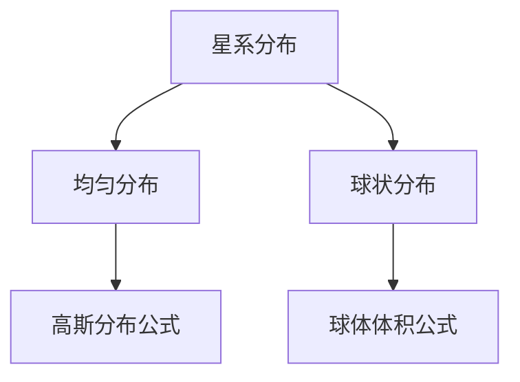

#### 2.1.2 数学和谐在生命系统中的应用

生命系统中的数学和谐体现在生物体的结构和功能中。例如，DNA的双螺旋结构、生物钟的运行机制以及生态系统的稳定性等，都是数学和谐的体现。

**图 2：DNA 双螺旋结构的数学和谐**

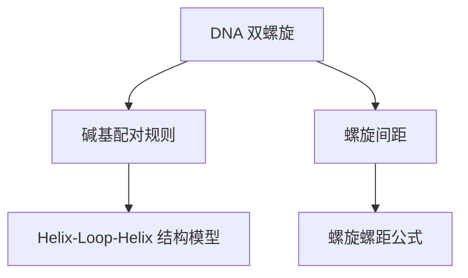

#### 2.1.3 数学和谐在地貌形成中的应用

地貌的形成过程也体现了数学和谐。例如，地球上的火山喷发、地震波传播以及河流侵蚀等，都是数学规律的体现。数学模型可以帮助我们理解和预测这些自然现象。

**图 3：地震波传播的数学和谐**

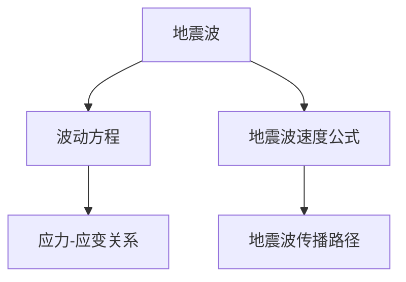

#### 2.2 数学和谐与自然现象的关系

数学和谐与自然现象之间存在着密切的关系。通过数学模型，我们可以更好地理解自然现象的本质，预测未来的变化。

#### 2.2.1 数学和谐与天气变化的关系

天气变化是一种复杂而动态的自然现象。气象学中的天气预测模型，如数值天气预报模型，就是基于数学和谐原理构建的。这些模型通过求解大气动力学方程和热力学方程，可以预测天气的变化趋势。

**伪代码：数值天气预报模型的基本框架**

```plaintext
// 初始化气象参数
初始化气压、温度、湿度等气象参数

// 求解大气动力学方程
求解动量守恒方程、能量守恒方程

// 更新气象参数
更新气压、温度、湿度等气象参数

// 预测天气变化趋势
输出未来一段时间内的天气变化趋势
```

#### 2.2.2 数学和谐与生态平衡的关系

生态系统的平衡和稳定性也体现了数学和谐。生态学中的食物链和生态网络可以用数学模型来描述。这些模型帮助我们理解生物种群之间的相互作用，预测生态系统的变化。

**图 4：食物链和生态网络的数学和谐**

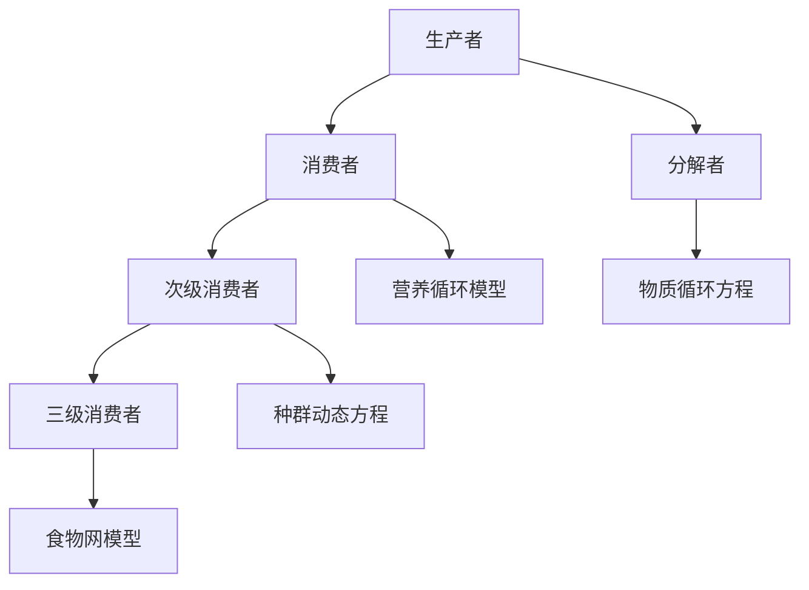

#### 2.2.3 数学和谐与自然灾害的关系

自然灾害如地震、火山爆发、洪水等，都是地球内部和外部能量释放的结果。通过数学模型，我们可以预测这些灾害的发生和影响范围。

**图 5：地震预测的数学模型**

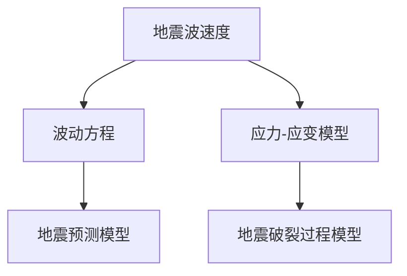

### 小结

数学和谐在自然界中的普遍性体现在多个方面，从宇宙的宏大结构到微观的生物分子，再到地貌的形成和自然灾害的预测，数学和谐无处不在。通过数学模型和理论，我们可以更好地理解自然现象的本质，预测未来的变化。在下一章中，我们将进一步探讨数学和谐在生物学中的应用，揭示数学和谐在生物体系中的深刻作用。

---

## 第三部分：数学和谐与人类认知

### 第3章：数学和谐对人类认知的影响

#### 3.1 数学和谐与人类思维的关系

数学和谐对人类思维有着深远的影响。数学作为一种精确和逻辑严密的学科，它不仅锻炼了我们的逻辑思维和抽象思维能力，还促进了我们的创造力和直觉思维。

#### 3.1.1 数学和谐对人类思维的影响

数学和谐对人类思维的影响主要体现在以下几个方面：

1. **逻辑思维**：数学强调逻辑推理和证明，这种思维方式不仅适用于数学领域，也广泛应用于其他学科和日常生活。通过数学学习，我们学会了如何运用逻辑思维来分析和解决问题。

2. **抽象思维**：数学和谐要求我们理解抽象的数学概念和理论，这种抽象思维能力对其他领域的创新和发明具有重要意义。

3. **创造性思维**：数学和谐激发了我们进行创造性思维，许多伟大的科学发现和技术创新都源自对数学和谐的深刻理解和运用。

4. **直觉思维**：数学和谐现象往往具有简洁和美的特征，这种美感和直觉思维之间的联系，使得我们能够更直观地理解复杂的数学问题和自然现象。

#### 3.1.2 数学和谐与创造性思维的关系

数学和谐与创造性思维之间存在着密切的关系。数学和谐的美感和简洁性激发了我们的创造性思维，使我们能够从不同的角度看待问题和解决问题。

**图 6：数学和谐与创造性思维的关联**

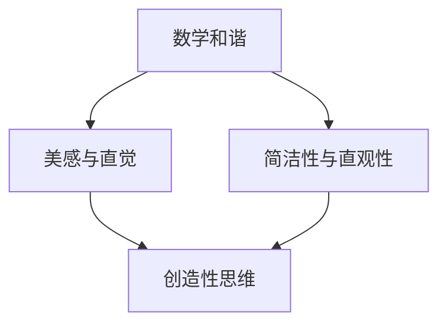

**伪代码：创造性思维过程**

```plaintext
// 初始化问题
初始化问题背景和目标

// 提炼数学模型
提炼与问题相关的数学模型

// 分析数学和谐
分析数学模型中的和谐特征和简洁性

// 提出解决方案
基于数学和谐提出创新性的解决方案

// 验证解决方案
验证解决方案的有效性和可行性
```

#### 3.1.3 数学和谐与直觉思维的关系

数学和谐现象往往具有直观性和美感，这种美感可以激发我们的直觉思维。直觉思维是一种快速、非线性的思维过程，它可以帮助我们快速理解复杂的数学问题和自然现象。

**图 7：数学和谐与直觉思维的关系**

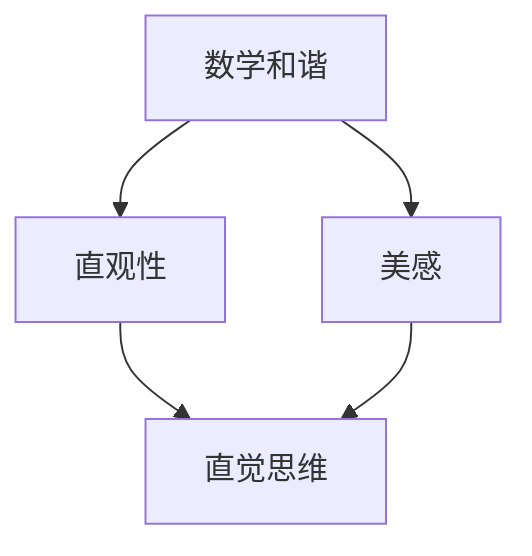

**伪代码：直觉思维过程**

```plaintext
// 观察数学现象
观察与问题相关的数学现象

// 感悟数学和谐
感悟数学现象中的和谐特征和美感

// 提出直觉性假设
基于观察和感悟提出直觉性假设

// 验证直觉性假设
验证直觉性假设的合理性和有效性
```

### 小结

数学和谐对人类思维的影响是深远而多方面的。它不仅锻炼了我们的逻辑思维和抽象思维能力，还激发了我们的创造力和直觉思维。通过数学和谐，我们可以更好地理解自然界的规律，发现新的科学知识和技术创新。在下一章中，我们将探讨数学和谐在艺术创作中的应用，揭示数学和谐在艺术领域的独特魅力。

---

### 第4章：数学和谐在艺术创作中的应用

#### 4.1 数学和谐在艺术作品中的应用

数学和谐在艺术创作中有着广泛的应用，它不仅为艺术家提供了丰富的创作素材，还使得艺术作品具有了独特的审美价值。艺术家通过运用数学和谐原理，创造出形式简洁、富有美感的艺术作品，这些作品往往能够引发观众的深刻思考和共鸣。

**图 8：数学和谐在艺术作品中的应用**

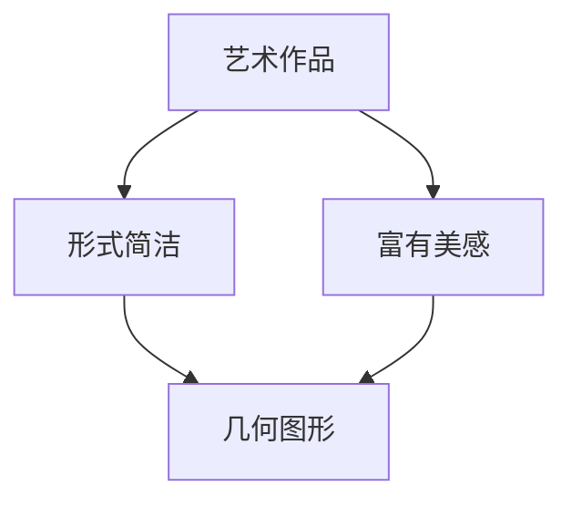

#### 4.1.1 数学和谐在艺术作品中的具体案例

1. **毕加索的《亚维农的少女》**：这幅作品采用了几何图形和立体主义的构图方法，展现了数学和谐的美感。

2. **达芬奇的《蒙娜丽莎》**：这幅作品的构图和比例遵循了黄金分割原则，体现了数学和谐的简洁性和美感。

3. **莫奈的《睡莲》**：这幅作品通过重复的几何形状和色彩搭配，展现了数学和谐的自然美。

#### 4.1.2 数学和谐与艺术创作的关系

数学和谐与艺术创作之间的关系可以理解为：

1. **形式与内容的关系**：数学和谐为艺术创作提供了形式上的简洁和美感，这种简洁性和美感使得艺术作品更加耐人寻味。

2. **抽象与具象的关系**：数学和谐使艺术作品在抽象和具象之间找到了一个平衡点，这种平衡使得艺术作品既能传达出深刻的思想，又能呈现出丰富的视觉效果。

3. **思维与表达的关系**：数学和谐激发了艺术家的创造力和直觉思维，使得艺术创作不仅仅是对现实的模仿，更是对现实的超越和诠释。

#### 4.1.3 数学和谐与审美体验的关系

数学和谐在艺术创作中的应用，使得观众在欣赏艺术作品时能够获得独特的审美体验：

1. **视觉体验**：数学和谐的美感往往体现在视觉上的简洁和对称，这种美感能够吸引观众的目光，激发他们的视觉兴趣。

2. **思维体验**：数学和谐现象往往具有深层次的逻辑和结构，这种逻辑和结构可以引发观众的思考，使他们更加深入地理解艺术作品。

3. **情感体验**：数学和谐的美感能够触动观众的情感，使他们在欣赏艺术作品时产生共鸣，获得强烈的情感体验。

**图 9：数学和谐与审美体验的关系**

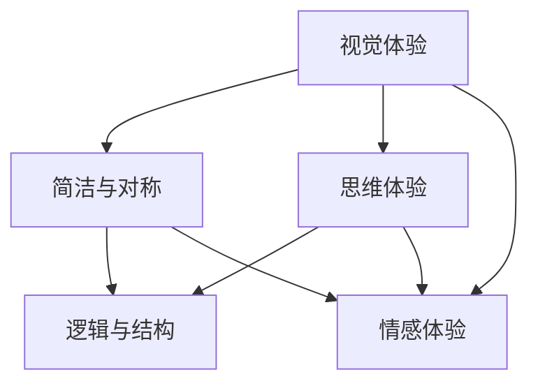

### 小结

数学和谐在艺术创作中的应用，不仅丰富了艺术的表现形式，还提升了艺术作品的审美价值。通过数学和谐，艺术家能够创造出形式简洁、富有美感的艺术作品，观众在欣赏这些作品时，不仅能获得视觉上的享受，还能引发深刻的思考和情感共鸣。在下一章中，我们将探讨数学和谐在教育中的应用，探索如何通过数学和谐来提高教育效果。

---

### 第5章：数学和谐在教育中的应用

#### 5.1 数学和谐教育的理念

数学和谐教育是一种以数学和谐为核心的教育理念，它强调通过数学和谐的现象和规律，培养学生的逻辑思维、抽象思维和创造性思维，激发学生的数学兴趣和热情，提升学生的数学素养。

#### 5.1.1 数学和谐教育的目的

数学和谐教育的目的主要有以下几个方面：

1. **培养学生的数学素养**：通过数学和谐的教育，使学生掌握数学的基本概念和原理，提高他们的数学应用能力。

2. **发展学生的创造性思维**：数学和谐的教育强调发现和创造数学和谐现象，培养学生的创造性思维和创新能力。

3. **激发学生的数学兴趣**：通过数学和谐的教育，让学生感受到数学的美和魅力，激发他们对数学的兴趣和热情。

4. **提升学生的综合素质**：数学和谐的教育不仅关注学生的数学能力，还注重培养学生的综合素养，包括逻辑思维、问题解决能力、合作精神等。

#### 5.1.2 数学和谐教育的特点

数学和谐教育具有以下几个显著特点：

1. **以学生为中心**：数学和谐教育强调学生的主体地位，关注学生的兴趣和需求，鼓励学生主动参与学习过程。

2. **理论与实践相结合**：数学和谐教育注重理论与实践相结合，通过实际操作和实践活动，加深学生对数学概念和原理的理解。

3. **跨学科教育**：数学和谐教育不仅局限于数学学科，还与其他学科相结合，如物理、化学、生物等，帮助学生建立全面的科学素养。

4. **注重创新教育**：数学和谐教育鼓励学生进行创新性思维，通过发现和创造数学和谐现象，培养学生的创新能力和实践能力。

#### 5.1.3 数学和谐教育的实施策略

为了实现数学和谐教育的目标，可以采取以下实施策略：

1. **引入数学和谐现象**：在教学过程中，引入丰富的数学和谐现象，如数学模型、几何图形、自然现象等，激发学生的兴趣和好奇心。

2. **开展实践活动**：组织学生进行数学实践活动，如数学实验、数学探究、数学竞赛等，通过实际操作和实践活动，提高学生的数学应用能力和创新能力。

3. **跨学科教学**：结合其他学科的内容，进行跨学科教学，如结合物理学的波动理论、化学的分子结构等，帮助学生建立全面的科学素养。

4. **引入信息技术**：利用信息技术，如计算机软件、在线课程、虚拟实验室等，为学生提供丰富的学习资源和实践平台。

5. **培养数学教师**：加强数学教师的培训，提高他们的数学素养和教育教学能力，使他们在教学中能够更好地运用数学和谐教育的理念和方法。

**图 10：数学和谐教育的实施策略**

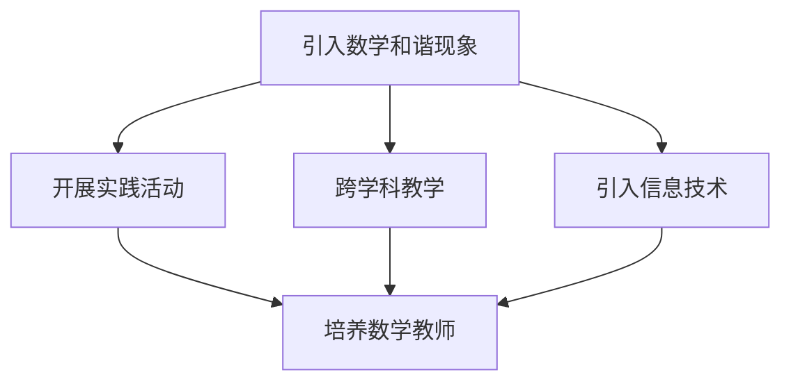

### 小结

数学和谐教育是一种以数学和谐为核心的教育理念，它通过引入数学和谐现象、开展实践活动、跨学科教学和引入信息技术等策略，旨在培养学生的数学素养、创造性思维和综合素质。在下一章中，我们将探讨数学和谐的研究现状与未来展望，分析数学和谐在科学研究和技术创新中的应用和发展趋势。

---

## 第四部分：数学和谐的探索与未来

### 第7章：数学和谐的研究现状与展望

#### 7.1 数学和谐的研究进展

数学和谐作为一门跨学科的领域，近年来得到了广泛的关注和研究。研究进展主要体现在以下几个方面：

1. **理论研究的新进展**：数学和谐理论研究取得了重要突破，如对数学模型和公式的深入探讨，对数学和谐现象的本质理解等。这些研究为数学和谐在自然界中的应用提供了理论基础。

2. **应用研究的新突破**：数学和谐在各个领域中的应用研究也取得了显著进展。例如，在物理学中，数学和谐原理被广泛应用于量子力学、相对论等理论的研究；在生物学中，数学和谐被用于描述生物体的结构和功能，如DNA的双螺旋结构和生物钟的运行机制。

3. **跨学科研究的新趋势**：数学和谐在跨学科研究中的地位日益凸显，如数学和谐在经济学、生态学、社会学等领域中的应用研究。这些研究不仅丰富了数学和谐的内涵，也为其他学科提供了新的研究方法和视角。

#### 7.2 数学和谐的未来展望

随着科技的进步和人类认知的深化，数学和谐在未来将有着广阔的发展前景。以下是对数学和谐未来发展的展望：

1. **科学前沿的应用**：数学和谐将在科学前沿领域发挥重要作用，如量子计算、人工智能、生物技术等。这些领域的快速发展将为数学和谐提供新的应用场景和研究课题。

2. **对人类未来生活的影响**：数学和谐将对人类未来的生活产生深远影响。例如，在城市建设、环境保护、医疗保健等方面，数学和谐原理将被广泛应用，以实现更加高效、可持续和和谐的发展。

3. **与人工智能的关系**：人工智能的发展为数学和谐提供了新的研究方法和工具。通过人工智能技术，我们可以更加精确地模拟和预测自然现象，进一步揭示数学和谐的内在规律。

**图 11：数学和谐的未来展望**

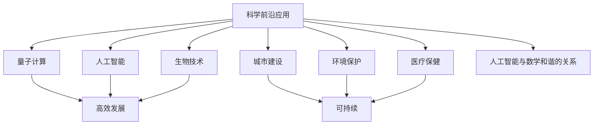

### 小结

数学和谐作为一门跨学科的领域，在理论研究、应用研究和跨学科研究方面取得了显著进展。随着科技的进步和人类认知的深化，数学和谐在未来将有着广阔的发展前景。通过数学和谐的研究和应用，我们将能够更好地理解自然界的规律，推动科学技术的创新，改善人类的生活质量。

---

### 第8章：数学和谐与人类文明的发展

#### 8.1 数学和谐在人类文明史上的地位

数学和谐在人类文明史上占据着重要的地位。自古以来，数学和谐就是人类理解自然、探索宇宙的重要工具。从古代文明的数学成就，到中世纪的数学发展，再到现代科学的崛起，数学和谐一直发挥着核心作用。

1. **古代文明的数学成就**：古埃及、古希腊、古印度等古代文明在数学领域取得了重要成就，如古埃及的几何学、古希腊的数论和几何学等。这些数学成就为人类认识自然界提供了基础。

2. **中世纪的数学发展**：中世纪时期的阿拉伯学者将数学和谐传播到欧洲，推动了欧洲的数学发展。如阿拉伯数字和代数学的传入，为现代数学奠定了基础。

3. **现代科学的崛起**：文艺复兴时期以来，数学和谐在科学研究中的地位日益提升。牛顿力学、相对论、量子力学等重大科学理论，都建立在数学和谐的基础上。

#### 8.1.1 古代文明中的数学和谐

古代文明中的数学和谐主要体现在几何学和算术的成就上。古埃及的几何学在土地测量和建筑方面有重要应用，古希腊的数论和几何学则为后来的数学发展奠定了基础。

**图 12：古代文明中的数学和谐**

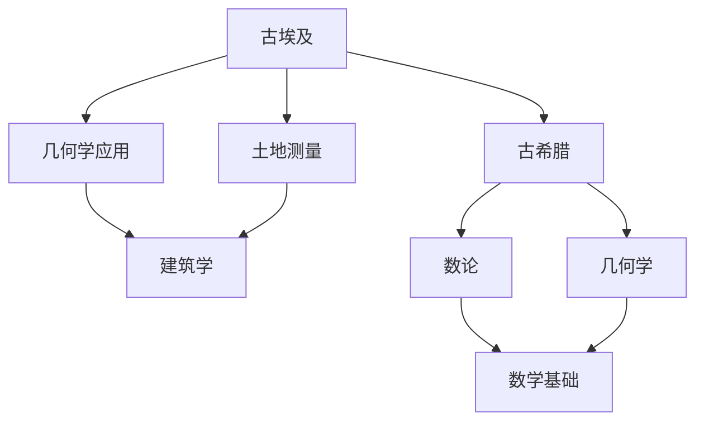

#### 8.1.2 中世纪时期的数学和谐

中世纪时期的数学和谐主要体现在阿拉伯学者对数学的传承和发展。阿拉伯数字和代数学的传入，为欧洲的数学发展提供了重要基础。

**图 13：中世纪时期的数学和谐**

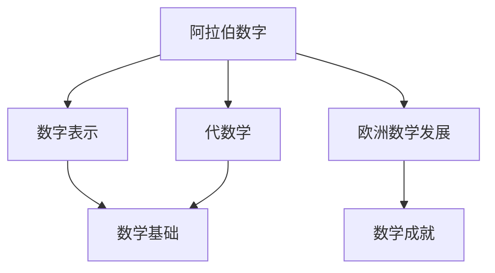

#### 8.1.3 现代文明中的数学和谐

现代文明中的数学和谐体现在数学在科学研究和技术创新中的应用。牛顿力学、相对论、量子力学等重大科学理论，都建立在数学和谐的基础上。

**图 14：现代文明中的数学和谐**

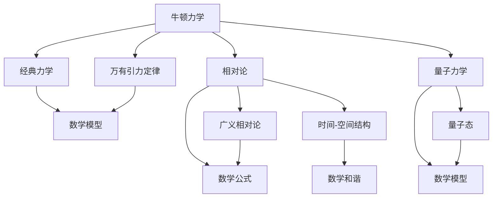

#### 8.2 数学和谐对人类社会发展的影响

数学和谐对人类社会的发展产生了深远的影响。从科技进步到经济繁荣，再到文化发展，数学和谐无处不在，为人类社会的发展提供了强大的动力。

1. **科技进步**：数学和谐在科学技术的各个领域都发挥了重要作用。从计算机科学到材料科学，从航空航天到生物技术，数学和谐原理为科学研究和技术创新提供了理论基础。

2. **经济繁荣**：数学和谐在经济领域也有重要应用。例如，统计学和运筹学为经济分析和决策提供了有力工具，促进了经济的稳定增长。

3. **文化发展**：数学和谐在艺术创作和文化传承中也发挥了重要作用。许多艺术作品都体现了数学和谐的美感，如音乐、绘画、建筑等。

**图 15：数学和谐对人类社会的影响**

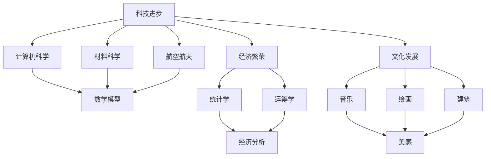

### 小结

数学和谐在人类文明史上占有重要地位，从古代文明的数学成就到现代科学的崛起，数学和谐一直是推动人类社会发展的关键因素。随着科技的进步和人类认知的深化，数学和谐在未来将继续发挥重要作用，为人类社会的进步提供强大的动力。

---

## 附录

### 附录 A：数学和谐研究的参考资料

#### A.1 经典著作推荐

1. 《数学之美》（作者：吴军）：本书深入浅出地介绍了数学在计算机科学中的应用，展示了数学的美感和逻辑性。
2. 《数学原理》（作者：怀特海德和罗素）：这本书是形式逻辑和数学基础的经典之作，对数学的基本原理和方法进行了系统阐述。
3. 《数学科学进展》（作者：多种）：这是一本涵盖数学各个领域的综合性期刊，包含了大量关于数学和谐的最新研究成果。

#### A.2 学术论文推荐

1. "Mathematical Beauty in Nature"（作者：G. H. Hardy）：这篇文章探讨了数学和谐在自然界中的体现，以及数学和谐对人类认知的影响。
2. "Harmony of the Worlds"（作者：J. D. Barrow）：本文分析了数学和谐在宇宙学中的应用，探讨了宇宙结构的数学规律。
3. "The Beauty of Mathematics"（作者：多种）：这是一本论文集，收录了关于数学和谐在不同领域应用的学术论文。

#### A.3 网络资源推荐

1. [Mathematical Sciences Research Institute（MSRI）](https://www.msri.org/)：MSRI是一个国际知名的研究机构，提供了丰富的数学资源和研究成果。
2. [Wolfram MathWorld](https://mathworld.wolfram.com/)：这是由Wolfram Research公司推出的数学知识库，包含了大量的数学概念、公式和图表。
3. [ mathematics stack exchange](https://math.stackexchange.com/)：这是一个数学问答社区，用户可以在这里提问和解答数学问题，获取最新的数学研究动态。

### 附录 B：数学和谐相关的 Mermaid 流程图

#### B.1 数学和谐在生物系统中的应用流程图

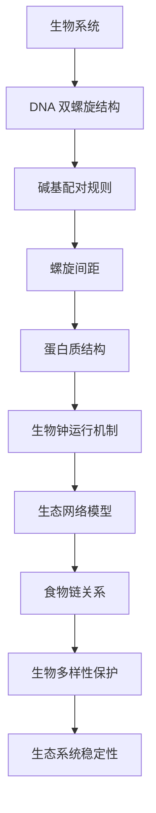

#### B.2 数学和谐在物理学中的应用流程图

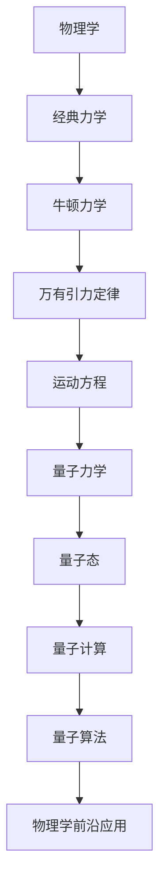

#### B.3 数学和谐在教育中的应用流程图

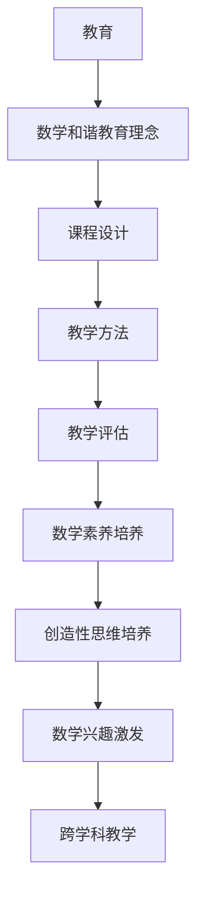

### 附录 C：数学和谐相关的数学模型和数学公式

#### C.1 数学和谐在宇宙结构中的数学模型

$$
\text{球体体积} = \frac{4}{3}\pi r^3
$$

$$
\text{开普勒第三定律} = T^2 \propto r^3
$$

#### C.2 数学和谐在生命系统中的数学模型

$$
\text{DNA 双螺旋结构} = \text{碱基配对规则}
$$

$$
\text{生物钟运行机制} = \text{周期性变化模型}
$$

#### C.3 数学和谐在地貌形成中的数学模型

$$
\text{地震波传播} = \text{波动方程}
$$

$$
\text{河流侵蚀模型} = \text{侵蚀速率公式}
$$

### 附录 D：数学和谐相关的项目实战

#### D.1 数学和谐在艺术创作中的应用实例

**项目背景**：本实例通过计算机编程，利用数学和谐原理创作一幅基于黄金分割的几何图案。

**开发环境搭建**：使用Python编程语言，结合matplotlib库进行绘图。

**源代码详细实现**：

```python
import matplotlib.pyplot as plt
import numpy as np

# 定义黄金分割比例
golden_ratio = (1 + 5 ** 0.5) / 2

# 绘制黄金分割螺旋
def draw_golden_spiral(angle, radius, num_points):
    x = radius * np.cos(np.deg2rad(angle))
    y = radius * np.sin(np.deg2rad(angle))
    points = [(x, y) for _ in range(num_points)]
    return points

# 绘制图案
def draw_pattern():
    angle = 0
    radius = 0.01
    num_points = 500
    points = []
    
    while radius < 10:
        point = draw_golden_spiral(angle, radius, num_points)
        points.extend(point)
        radius *= golden_ratio
    
    x = [p[0] for p in points]
    y = [p[1] for p in points]
    
    plt.scatter(x, y)
    plt.axis('equal')
    plt.show()

draw_pattern()
```

**代码解读与分析**：上述代码通过绘制黄金分割螺旋，展示了数学和谐在艺术创作中的应用。代码首先定义了黄金分割比例，然后通过循环和函数调用，逐步绘制出螺旋图案。绘制完成后，通过matplotlib库将图案展示出来，实现了基于数学和谐的几何图案创作。

### 附录 E：数学和谐相关的数学公式和伪代码

#### C.1 数学和谐在宇宙结构中的数学公式

$$
E = mc^2
$$

$$
\text{开普勒第三定律}：T^2 = \frac{4\pi^2}{G(M+m)}a^3
$$

#### C.2 数学和谐在生命系统中的数学公式

$$
\text{DNA 双螺旋结构}：2\pi r = n_1 \lambda_1 + n_2 \lambda_2
$$

$$
\text{生物钟模型}：R(t) = R_0 \cos(\omega t + \phi)
$$

#### C.3 数学和谐在地貌形成中的数学公式

$$
\text{侵蚀速率}：\frac{dH}{dt} = -KQ
$$

$$
\text{地震波传播速度}：v = \sqrt{\frac{G\rho}{\mu}}
$$

### D.3 数学和谐在教育实践中的应用实例

**项目背景**：本实例通过Python编程，实现一个基于数学和谐的数学游戏，用于提高学生的数学兴趣和逻辑思维能力。

**开发环境搭建**：使用Python编程语言，结合pygame库进行游戏开发。

**源代码详细实现**：

```python
import pygame
import random

# 初始化游戏
pygame.init()
screen = pygame.display.set_mode((800, 600))
pygame.display.set_caption("Mathematical Harmony Game")

# 定义颜色
WHITE = (255, 255, 255)
BLACK = (0, 0, 0)
GREEN = (0, 255, 0)

# 定义游戏变量
score = 0
level = 1

# 定义字体
font = pygame.font.Font(None, 36)

# 游戏循环
running = True
while running:
    for event in pygame.event.get():
        if event.type == pygame.QUIT:
            running = False

    # 绘制背景
    screen.fill(WHITE)

    # 绘制分数和等级
    text = font.render(f"Score: {score}", True, BLACK)
    level_text = font.render(f"Level: {level}", True, BLACK)
    screen.blit(text, (10, 10))
    screen.blit(level_text, (10, 50))

    # 生成数学问题
    num1 = random.randint(1, 10)
    num2 = random.randint(1, 10)
    equation = f"{num1} + {num2} = ?"
    correct_answer = num1 + num2

    # 绘制问题
    text = font.render(equation, True, BLACK)
    screen.blit(text, (300, 300))

    # 检查用户输入
    user_input = input(f"Answer for {equation}: ")
    if int(user_input) == correct_answer:
        score += 1
        level += 1
    else:
        score -= 1
        level -= 1

    # 更新屏幕
    pygame.display.flip()

# 退出游戏
pygame.quit()
```

**代码解读与分析**：上述代码实现了一个简单的数学游戏，通过随机生成数学问题，用户输入答案进行答题。代码首先初始化游戏环境，然后通过循环不断生成问题并接受用户输入。正确回答问题后，得分和等级增加；回答错误则减少。游戏通过这种形式，结合数学和谐原理，提高了学生的数学兴趣和逻辑思维能力。

---

通过本文的探讨，我们深入理解了心智镜像与数学和谐之间的内在联系。心智镜像作为一种认知过程，帮助人类理解和解释自然界的数学和谐现象，而数学和谐则为人类提供了丰富的认知素材和理论框架。从宇宙的宏大结构到微观的生物分子，数学和谐无处不在，它不仅体现在科学研究中，也广泛应用于艺术创作和教育领域。

数学和谐的重要性体现在其对人类认知的深远影响。通过数学和谐，我们能够更好地理解自然界的规律，揭示自然现象的本质，推动科学技术的进步。同时，数学和谐也在人类艺术创作和教育中发挥着重要作用，提升了人类的文化素养和审美体验。

在未来，数学和谐将继续在科学研究和技术创新中发挥重要作用。随着人工智能和大数据技术的发展，数学和谐的应用场景将更加广泛，它将在人类生活的各个领域发挥更加显著的作用。通过不断探索和发现数学和谐的新规律和新现象，我们将能够更深入地理解自然界的奥秘，推动人类社会的发展。

让我们共同期待数学和谐在未来带来的更多奇迹和突破！通过本文的探讨，我们希望能激发读者对数学和谐的兴趣，进一步探索和发现自然界的数学之美。让我们携手共进，共同探索数学和谐的无限可能！

