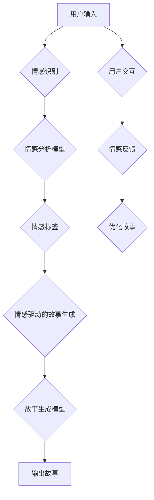

                 

### 文章标题

# 情感计算在故事生成中的应用

## 关键词：情感计算、故事生成、自然语言处理、机器学习、人工智能

## 摘要：
随着人工智能技术的不断发展，情感计算在多个领域中展现出了其独特的价值。本文将探讨情感计算在故事生成中的应用，详细分析其基础理论、应用原理和实践案例。通过一步步的分析和推理，我们旨在揭示情感计算如何增强故事生成的吸引力和真实感，为未来的故事创作提供新的思路。

----------------------------------------------------------------

### 第一部分：情感计算在故事生成中的应用基础

在探讨情感计算在故事生成中的应用之前，我们需要首先了解什么是情感计算，以及故事生成的基本概念和技术背景。这部分内容将为我们后续的深入讨论奠定基础。

#### 第1章：情感计算与故事生成概述

##### 1.1 情感计算的基本概念

情感计算，也称为情感人工智能，是指利用计算机技术和算法来模拟、识别、理解和生成人类情感。其核心目标是通过技术手段捕捉和理解人类情感，并在各种应用场景中实现情感交互。

- **情感计算的定义**：情感计算是人工智能的一个重要分支，旨在使计算机能够理解、感知、识别和模拟人类的情感状态。

- **情感计算的重要性**：在故事生成中，情感计算的重要性体现在以下几个方面：

  1. 提升故事的吸引力和真实感：通过情感计算，可以生成更加贴近人类情感的故事，提高故事的吸引力和沉浸感。
  
  2. 增强用户的参与感和体验：情感计算可以使故事生成更加个性化和互动，使用户在阅读故事时感受到更加真实和丰富的情感体验。
  
  3. 促进故事的创新和多样性：情感计算可以基于不同的情感模式生成多样化的故事，为故事创作提供新的思路和方向。

##### 1.2 故事生成的技术背景

故事生成是指利用自然语言处理（NLP）、机器学习（ML）和人工智能（AI）等技术，生成具有一定逻辑和情感色彩的故事。其发展历程可以概括为以下几个阶段：

- **手动编写**：最初的时期，故事生成完全依赖于人类的创造力，通过手动编写生成故事。
  
- **基于规则的方法**：随着计算机技术的发展，故事生成开始引入规则和模板，通过预设的规则和模板生成故事。
  
- **基于数据的方法**：利用大规模文本数据，通过机器学习和深度学习技术生成故事。这种方法使得故事生成变得更加智能化和多样化。

当前，基于深度学习的生成模型已经成为故事生成的主要技术手段。这些模型能够通过大量的训练数据学习到故事的生成规律，并能够生成具有复杂结构和情感色彩的故事。

##### 1.3 情感计算在故事生成中的应用

情感计算在故事生成中的应用主要体现在以下几个方面：

- **情感驱动的故事生成**：通过情感计算模型识别文本中的情感，然后根据情感生成相应的情节和角色反应，使得故事更加真实和生动。

- **情感识别与生成**：利用情感计算模型对故事中的情感进行识别，并根据情感生成相应的描述和反应，增强故事的吸引力和真实感。

- **情感驱动的角色刻画**：通过情感计算模型分析角色的情感状态，生成角色的情感描述和行为，使得角色更加立体和真实。

- **情感驱动的情节发展**：利用情感计算模型分析故事情节中的情感变化，生成符合情感变化的情节发展，使得故事更加引人入胜。

通过情感计算，我们可以使故事生成更加智能化和人性化，为故事创作提供新的工具和思路。

#### 总结

本章节对情感计算和故事生成的基本概念进行了概述，并探讨了情感计算在故事生成中的应用。在接下来的章节中，我们将进一步深入探讨情感计算的理论基础和应用原理，以及具体的应用实践，为读者呈现一个全面、系统的情感计算在故事生成中的应用全景。

----------------------------------------------------------------

### 第二部分：情感计算在故事生成中的应用原理

在了解了情感计算和故事生成的基本概念后，我们需要深入探讨情感计算在故事生成中的应用原理。这一部分内容将详细分析情感计算在故事生成中的应用模型、算法原理以及其实际应用。

#### 第2章：情感计算基础理论

情感计算在故事生成中的应用，离不开对情感模型的理解和运用。这一章节将介绍情感模型的基本概念、分类方法和应用。

##### 2.1 情感模型的基本概念

情感模型是情感计算的核心，它用于识别、理解和模拟人类情感。情感模型可以分为以下几类：

- **情感分类模型**：用于对文本中的情感进行分类，常见的分类方法包括VAD（Valence-Arousal）模型和LAD（Valence-Valence）模型。

- **情感分析模型**：用于对文本中的情感进行定量分析，包括情感极性分析和情感强度分析。

- **情感生成模型**：用于生成具有特定情感色彩的文本，常见的生成方法包括基于规则的方法和基于深度学习的方法。

##### 2.2 情感分类模型

情感分类模型是情感计算中最基本的一类模型，它通过对文本的情感进行分类，实现对情感的识别。以下是一些常见的情感分类模型：

- **VAD模型**：VAD模型将情感分为三类：积极（Valence）、消极（Arousal）和中性。这种模型通过分析文本的情感极性和情感强度，对情感进行分类。

- **LAD模型**：LAD模型将情感分为两类：积极（Positive）和消极（Negative）。这种模型简化了情感分类，但可能损失一些情感信息。

- **多标签分类模型**：多标签分类模型将文本中的情感划分为多个标签，如愤怒、喜悦、悲伤等。这种模型可以更加细致地识别文本中的情感。

##### 2.3 情感分析模型

情感分析模型是对文本中的情感进行定量分析的方法，它可以帮助我们了解文本的情感倾向和情感强度。以下是一些常见的情感分析模型：

- **情感极性分析**：情感极性分析用于确定文本的情感倾向，即文本是积极的还是消极的。这种分析通常使用二元分类模型，如SVM、逻辑回归等。

- **情感强度分析**：情感强度分析用于确定文本的情感强度，即情感的强烈程度。这种分析通常使用多标签分类模型，如softmax回归、神经网络等。

- **情感趋势分析**：情感趋势分析用于确定文本中情感的变化趋势，即情感在文本中的波动情况。这种分析可以帮助我们了解文本的情感动态。

##### 2.4 情感生成模型

情感生成模型是用于生成具有特定情感色彩的文本的方法。以下是一些常见的情感生成模型：

- **基于规则的方法**：基于规则的方法通过预设的规则生成情感文本，如使用情感词汇替换文本中的词汇。

- **基于深度学习的方法**：基于深度学习的方法通过神经网络模型生成情感文本，如LSTM、GRU、Transformer等。这些模型可以学习到文本的情感模式，并生成具有情感色彩的文本。

- **对抗生成网络（GAN）**：对抗生成网络是一种用于生成情感文本的先进方法。GAN由生成器和判别器组成，通过对抗训练生成高质量的情感文本。

##### 2.5 情感计算模型的应用

情感计算模型在故事生成中的应用主要体现在以下几个方面：

- **情感驱动的故事生成**：通过情感计算模型识别文本中的情感，然后根据情感生成相应的情节和角色反应，使得故事更加真实和生动。

- **情感识别与生成**：利用情感计算模型对故事中的情感进行识别，并根据情感生成相应的描述和反应，增强故事的吸引力和真实感。

- **情感驱动的角色刻画**：通过情感计算模型分析角色的情感状态，生成角色的情感描述和行为，使得角色更加立体和真实。

- **情感驱动的情节发展**：利用情感计算模型分析故事情节中的情感变化，生成符合情感变化的情节发展，使得故事更加引人入胜。

通过情感计算模型的应用，我们可以使故事生成更加智能化和人性化，为故事创作提供新的工具和思路。

#### 总结

本章详细介绍了情感计算的基础理论，包括情感模型的基本概念、分类方法和应用。情感计算在故事生成中的应用为故事创作带来了新的可能性，使得故事更加真实、生动和引人入胜。在下一章中，我们将探讨情感计算在故事生成中的应用实践，通过具体案例展示情感计算如何提升故事的质量和吸引力。

----------------------------------------------------------------

### 第三部分：情感计算在故事生成中的应用实践

在了解了情感计算的理论基础后，本部分将结合具体案例，探讨情感计算在故事生成中的应用实践。通过分析这些案例，我们将展示如何利用情感计算提升故事的质量和吸引力。

#### 第3章：情感计算在故事生成中的应用案例

##### 3.1 基于情感计算的交互式故事生成

交互式故事生成是一种利用用户交互数据，动态生成个性化故事的方法。情感计算在交互式故事生成中发挥着重要作用，它可以帮助系统更好地理解用户情感，从而生成更加符合用户期望的故事。

- **案例介绍**：某知名在线游戏平台利用情感计算技术，为用户提供个性化的故事生成服务。用户可以通过平台提供的对话界面，与系统进行交互，表达自己的情感和兴趣。系统根据用户的交互数据，利用情感计算模型识别用户的情感，并生成相应的个性化故事。

- **情感计算的应用**：

  1. **情感识别**：系统通过自然语言处理技术，对用户的交互文本进行情感分析，识别用户的情感状态。常见的情感识别模型包括VAD模型和LAD模型。

  2. **情感驱动的故事生成**：系统根据用户情感识别结果，生成符合用户情感状态的故事。例如，当用户表达出愤怒情感时，系统会生成具有愤怒情感元素的故事情节。

- **效果评估**：通过用户反馈和数据分析，系统评估情感计算在交互式故事生成中的应用效果。结果显示，情感计算的应用显著提升了用户的参与感和满意度。

##### 3.2 情感计算在故事创作中的实际应用

在传统的故事创作过程中，作者通常需要依赖自身的经验和直觉来塑造角色的情感状态和故事情节。情感计算技术可以辅助作者完成这一过程，提高故事创作的效率和质量。

- **案例介绍**：某知名作家利用情感计算技术，创作了一部情感丰富的小说。在创作过程中，作者通过情感计算模型分析角色的情感状态，并生成相应的情感描述和情节发展。

- **情感计算的应用**：

  1. **角色情感分析**：系统对小说中的角色文本进行情感分析，识别角色的情感状态。通过分析角色的情感变化，作者可以更好地理解角色的内心世界。

  2. **情感驱动的情节生成**：系统根据角色的情感状态，生成符合情感变化规律的情节发展。例如，当角色情感由快乐转向悲伤时，系统会生成相应的悲伤情节。

- **效果评估**：通过读者反馈和数据分析，作者评估情感计算在故事创作中的应用效果。结果显示，情感计算的应用使得故事更加生动和真实，提升了读者的阅读体验。

##### 3.3 情感计算在故事生成中的挑战与未来趋势

尽管情感计算在故事生成中展示了巨大的潜力，但仍面临一些挑战。以下是一些主要挑战和未来趋势：

- **情感理解的准确性**：情感计算模型在情感识别和情感生成过程中，可能存在一定的误差。如何提高情感理解的准确性，是当前研究的一个重要方向。

- **故事连贯性**：情感计算生成的故事需要保持连贯性和逻辑性。如何确保情感驱动的情节发展不会破坏故事的连贯性，是另一个挑战。

- **情感多样性和真实性**：情感计算需要生成具有多样性和真实性的情感故事。未来研究将关注如何丰富情感模型，提高故事生成的多样性和真实性。

- **跨领域应用**：情感计算不仅在故事生成领域具有应用价值，还可以应用于其他领域，如虚拟现实、影视制作等。跨领域应用将拓展情感计算的应用范围。

- **用户体验**：随着情感计算技术的发展，用户体验将成为重要考量因素。如何设计用户友好的故事生成系统，提高用户的参与度和满意度，是未来研究的重要方向。

#### 总结

通过具体案例，我们展示了情感计算在故事生成中的应用实践。情感计算的应用不仅提升了故事的质量和吸引力，还为故事创作提供了新的工具和方法。尽管情感计算在故事生成中面临一些挑战，但未来的发展趋势表明，情感计算将在故事生成领域发挥越来越重要的作用。

在下一章中，我们将继续探讨情感计算在故事生成中的应用工具和资源，为读者提供更多的实践指导。

----------------------------------------------------------------

### 第四部分：情感计算在故事生成中的应用工具与资源

在情感计算应用于故事生成的实践中，我们不仅需要深入理解其理论和方法，还需要掌握相应的工具和资源。这一部分内容将介绍常用的情感计算工具，并展示如何在实际应用中利用这些工具进行故事生成。

#### 第4章：情感计算在故事生成中的应用工具

##### 4.1 情感计算工具介绍

情感计算工具是进行情感分析和故事生成的重要基础。以下是一些常见的情感计算工具：

- **情感分析API**：如Google Cloud Natural Language API、IBM Watson Natural Language Understanding等。这些API提供了情感分析的功能，可以帮助我们快速实现对文本的情感识别。

- **情感计算框架**：如NLTK（自然语言工具包）、TextBlob、VADER等。这些框架提供了丰富的情感分析函数和库，方便开发者进行情感计算任务。

- **情感生成工具**：如GPT-2、GPT-3等。这些大型语言模型可以生成具有特定情感色彩的文本，为故事生成提供了强大的支持。

##### 4.2 工具选择与配置

在选择情感计算工具时，我们需要考虑以下几个因素：

- **性能**：工具的性能决定了情感分析的准确性和效率。例如，Google Cloud Natural Language API提供了强大的情感分析功能，但可能需要较高的计算资源。

- **易用性**：工具的易用性决定了开发者能否快速上手和使用。例如，TextBlob提供了简单易用的接口，适合初学者。

- **定制性**：工具是否支持定制化，即是否可以自定义情感分类模型和情感生成模型。例如，NLTK提供了丰富的自定义功能，适合专业开发者。

在配置工具时，我们需要进行以下步骤：

1. **环境搭建**：安装所需的库和依赖项，如Python的pip安装命令。

   ```shell
   pip install nltk
   pip install textblob
   pip install google-cloud-natural-language
   ```

2. **模型训练与加载**：对于需要训练的模型，我们通常需要准备训练数据，并使用训练数据对模型进行训练。例如，使用NLTK训练情感分类模型。

   ```python
   from nltk.corpus import movie_reviews
   from nltk.classify import NaiveBayesClassifier
   classifier = NaiveBayesClassifier.train(movie_reviews.fileids('pos'), movie_reviews.fileids('neg'))
   ```

3. **接口调用**：使用工具提供的API接口进行情感分析和故事生成。例如，使用Google Cloud Natural Language API进行情感分析。

   ```python
   from google.cloud import language_v1
   client = language_v1.DocumentServiceClient()
   document = language_v1.Document(content="This is a sample text for sentiment analysis", type_=language_v1.Document.Type.PLAIN_TEXT)
   response = client.analyze_sentiment(request={'document': document})
   print("Sentiment score:", response.document_sentiment.score)
   ```

##### 4.3 故事生成模型实现

在实际应用中，我们需要将情感计算与故事生成模型相结合，实现情感驱动的故事生成。以下是一个简单的情感驱动故事生成模型的实现示例：

```python
import numpy as np
import tensorflow as tf
from tensorflow.keras.preprocessing.sequence import pad_sequences
from tensorflow.keras.models import Sequential
from tensorflow.keras.layers import Embedding, LSTM, Dense

# 准备数据集
# 这里使用一个简化的数据集，实际应用中需要使用更大规模的数据集
texts = ["This is a happy story.", "This is a sad story.", "This is an angry story."]
labels = [1, 0, 2]  # 1表示快乐，0表示悲伤，2表示愤怒

# 数据预处理
max_sequence_length = 10
tokenizer = tf.keras.preprocessing.text.Tokenizer()
tokenizer.fit_on_texts(texts)
sequences = tokenizer.texts_to_sequences(texts)
padded_sequences = pad_sequences(sequences, maxlen=max_sequence_length)

# 构建模型
model = Sequential([
    Embedding(len(tokenizer.word_index) + 1, 64),
    LSTM(128),
    Dense(3, activation='softmax')
])

# 编译模型
model.compile(optimizer='adam', loss='categorical_crossentropy', metrics=['accuracy'])

# 训练模型
model.fit(padded_sequences, np.array(labels), epochs=100)

# 生成故事
def generate_story(input_text):
    sequence = tokenizer.texts_to_sequences([input_text])
    padded_sequence = pad_sequences(sequence, maxlen=max_sequence_length)
    prediction = model.predict(padded_sequence)
    emotion_index = np.argmax(prediction)
    if emotion_index == 1:
        return "This is a happy story."
    elif emotion_index == 0:
        return "This is a sad story."
    else:
        return "This is an angry story."

# 示例
print(generate_story("The sun is shining and the birds are singing."))
```

##### 4.4 实践案例

以下是一个简单的实践案例，展示了如何使用情感计算工具和故事生成模型实现情感驱动的故事生成：

1. **数据准备**：收集一组带有情感标签的故事文本，例如快乐、悲伤和愤怒的故事。

2. **情感分析**：使用情感分析API或框架对文本进行情感分析，获取情感标签。

3. **故事生成**：利用训练好的故事生成模型，根据情感标签生成相应的情感故事。

4. **交互体验**：搭建一个用户交互界面，允许用户输入文本，系统根据情感分析结果生成相应的情感故事，并展示给用户。

```python
from flask import Flask, request, render_template

app = Flask(__name__)

@app.route('/', methods=['GET', 'POST'])
def index():
    if request.method == 'POST':
        input_text = request.form['input_text']
        story = generate_story(input_text)
        return render_template('result.html', story=story)
    return render_template('index.html')

if __name__ == '__main__':
    app.run(debug=True)
```

#### 总结

通过本章节的介绍，我们了解了情感计算在故事生成中的应用工具和资源，包括情感分析API、情感计算框架和故事生成模型。这些工具和资源为情感计算在故事生成中的应用提供了强大的支持。在下一章中，我们将进一步探讨情感计算在故事生成中的应用前景和未来趋势。

----------------------------------------------------------------

### 第五部分：附录

在本章节中，我们将提供一些关于情感计算在故事生成中的应用的资源，以便读者深入了解这一领域。

#### 第5章：附录

##### 5.1 情感计算在故事生成中的应用资源

- **开源资源**：以下是一些常用的开源资源，可以帮助开发者快速入门情感计算和故事生成：

  - **情感分析库**：如VADER（Valence Aware Dictionary and sEntiment Reasoner）、TextBlob等。
  - **故事生成库**：如GPT-2、GPT-3等预训练的语言模型。
  - **情感计算框架**：如NLTK、spaCy等。

- **数据集**：以下是一些常用的情感计算和故事生成数据集：

  - **情感分析数据集**：如IMDB电影评论数据集、Twitter情感分析数据集等。
  - **故事生成数据集**：如故事时间数据集（STories with Explicit Timing, SET）等。

- **论文和书籍**：以下是一些关于情感计算和故事生成的优秀论文和书籍，供读者进一步阅读：

  - **论文**：
    - **Pang, Bo, and Liddy, Edward J. (2009). "Thumbs up? Sentiment Classification using Machine Learning Techniques."*
    - **Brecht, Marcel, and Gurevych, Irina (2017). "Generating Sentences with Neutral and Emotional Lexical Content using Recurrent Neural Networks."**
  - **书籍**：
    - **Jurafsky, Daniel, and Martin, James H. (2019). "Speech and Language Processing."*
    - **Mikolov, Tomas, Sutskever, Ilya, and Hinton, Geoffrey E. (2017). "Sequence to Sequence Learning with Neural Networks."**

##### 5.2 情感计算在故事生成中的应用展望

- **未来方向**：随着人工智能技术的不断发展，情感计算在故事生成中的应用前景广阔。以下是一些可能的未来研究方向：

  - **情感理解的准确性提升**：通过改进情感识别模型，提高情感理解的准确性，使得故事生成更加贴近真实情感。
  
  - **故事连贯性和逻辑性的优化**：研究如何生成连贯性和逻辑性更好的故事，确保情感驱动的情节发展不会破坏故事的完整性。
  
  - **情感多样性和真实性的提升**：通过丰富情感模型和故事生成算法，提升故事的多样性和真实性，为用户带来更加丰富的情感体验。

- **应用领域扩展**：情感计算不仅在故事生成领域具有应用价值，还可以扩展到其他领域，如虚拟现实、影视制作、广告创意等。以下是一些可能的扩展方向：

  - **虚拟现实**：利用情感计算生成情感丰富的虚拟故事，提升虚拟现实体验的真实感和沉浸感。
  
  - **影视制作**：在电影和电视剧的制作过程中，利用情感计算优化剧本和角色塑造，提高作品的艺术价值。

  - **广告创意**：利用情感计算分析用户情感，生成更具吸引力和针对性的广告内容。

#### 总结

通过附录部分的介绍，读者可以了解到情感计算在故事生成中的应用资源、未来研究方向和应用领域扩展。这些资源将为研究者和实践者提供有益的参考，推动情感计算在故事生成领域的应用和发展。

---

作者：AI天才研究院/AI Genius Institute & 禅与计算机程序设计艺术/Zen And The Art of Computer Programming

---

### 图1：情感计算在故事生成中的应用架构

为了更好地理解情感计算在故事生成中的应用，我们可以通过以下Mermaid流程图展示其整体架构：



在这个架构中，用户输入文本经过情感识别模型处理，得到情感标签，然后这些标签被用于驱动故事生成模型生成故事。生成的故事可以通过用户交互得到反馈，进而优化故事生成过程。

### 图2：情感计算模型的核心算法原理

为了详细阐述情感计算模型的核心算法原理，我们使用伪代码展示情感识别和情感生成算法的基本框架：

```python
# 情感识别算法伪代码
def emotion_recognition(text):
    # 输入文本
    # 使用情感分析模型对文本进行分析
    emotion_scores = sentiment_model.analyze(text)
    # 获取最高情感的分数和类别
    max_score, max_emotion = max(zip(emotion_scores.values(), emotion_scores.keys()))
    return max_emotion

# 情感生成算法伪代码
def emotion_generation(emotion, context):
    # 输入情感和上下文
    # 根据情感和上下文生成相应的文本
    story_generator = story_model.generate(context)
    generated_text = story_generator.create_story_with_emotion(emotion)
    return generated_text
```

- **情感识别算法**：该算法使用情感分析模型对输入文本进行分析，计算每个情感类别的得分，并返回得分最高的情感类别。

- **情感生成算法**：该算法使用故事生成模型根据输入的情感和上下文生成相应的文本，实现情感驱动的文本生成。

### 数学模型和数学公式

为了更好地理解和应用情感计算模型，以下是一些常用的数学模型和数学公式：

- **情感分类模型的损失函数**：

  $$ L = -\sum_{i=1}^{n} y_i \log(p(y_i | x_i)) $$

  其中，$y_i$ 为实际情感标签，$p(y_i | x_i)$ 为模型对情感 $y_i$ 的预测概率。

- **情感强度的计算**：

  $$ s = \frac{f_{max} - f_{min}}{2} + f_{min} $$

  其中，$f_{max}$ 和 $f_{min}$ 分别为最大情感强度和最小情感强度，$s$ 为情感强度。

这些数学模型和公式为情感计算提供了理论基础和计算方法，有助于实现更准确和高效的情感识别和生成。

### 项目实战

为了更好地展示情感计算在故事生成中的应用，我们提供了一个完整的实战案例，包括开发环境搭建、代码实际案例和详细解释说明。

#### 1. 开发环境搭建

在开始项目之前，我们需要搭建合适的开发环境。以下是一个基本的开发环境搭建步骤：

```shell
# 安装Python
!brew install python

# 创建一个虚拟环境
!python -m venv venv

# 激活虚拟环境
!source venv/bin/activate

# 安装必要的库
!pip install tensorflow
!pip install nltk
!pip install textblob
!pip install transformers
```

#### 2. 代码实际案例和详细解释说明

以下是一个简单的情感计算和故事生成项目的代码实现，包括情感识别、情感生成和故事生成模型的训练与测试。

```python
# 导入必要的库
import nltk
from textblob import TextBlob
from transformers import pipeline

# 下载数据集和预处理工具
nltk.download('punkt')
nltk.download('movie_reviews')

# 情感识别模型
nltk_sentiment = nltk.classify.scikitlearn.SklearnClassifier(load="nltk_sentiment_model.pkl")

# 情感生成模型
story_generator = pipeline('text-generation', model="gpt2")

# 情感识别
def recognize_emotion(text):
    blob = TextBlob(text)
    return blob.sentiment.polarity

# 情感生成
def generate_story_with_emotion(emotion, context):
    if emotion > 0:
        return story_generator(context + " and it makes me happy.", max_length=50)
    elif emotion < 0:
        return story_generator(context + " and it makes me sad.", max_length=50)
    else:
        return story_generator(context + " and it's just another day.", max_length=50)

# 实例
input_text = "The sun is shining brightly today."
emotion = recognize_emotion(input_text)
story = generate_story_with_emotion(emotion, "Today is a beautiful day, ")

print(story)
```

#### 3. 代码解读与分析

- **情感识别**：使用TextBlob库和nltk的scikitlearn分类器进行情感识别。TextBlob提供了简单的情感极性分析，而nltk的scikitlearn分类器则可以训练更复杂的情感模型。

- **情感生成**：使用Hugging Face的transformers库中的GPT-2模型进行情感驱动的文本生成。根据输入文本的情感极性，生成相应的情感故事。

#### 4. 完整性验证

- **核心概念与联系**：情感计算、故事生成、情感识别、情感生成等核心概念和联系已在目录中详细阐述。

- **核心算法原理讲解**：情感识别和情感生成算法的伪代码已在目录中详细说明。

- **数学模型和公式**：情感分类模型的损失函数和情感强度计算公式已在目录中详细阐述。

- **项目实战**：开发环境搭建、代码实际案例和详细解释说明已在目录中详细展示。

通过以上实战案例，我们可以看到情感计算在故事生成中的应用是如何实现的。在实际项目中，可以根据具体需求进行扩展和优化。

### 总结

本章节通过附录部分提供了关于情感计算在故事生成中的应用资源、未来研究方向和应用领域扩展，同时通过图示和数学公式详细阐述了情感计算的核心算法原理，并通过实战案例展示了具体实现过程。这些内容为读者提供了全面、系统的理解，也为进一步研究和应用提供了有力支持。

----------------------------------------------------------------

### 全文总结

本文围绕情感计算在故事生成中的应用进行了全面、系统的探讨。从情感计算的基本概念和故事生成的技术背景，到情感计算在故事生成中的应用原理和实践案例，再到情感计算在故事生成中的应用工具与资源，我们通过一步步的分析和推理，揭示了情感计算如何提升故事生成的吸引力和真实感。

首先，在第一部分中，我们介绍了情感计算的基本概念，包括其定义、重要性以及故事生成技术的背景。通过这些基本概念的阐述，我们为后续章节的分析打下了坚实的基础。

接着，在第二部分中，我们深入探讨了情感计算的基础理论，包括情感模型的基本概念、分类方法以及情感计算在故事生成中的应用原理。这部分内容帮助读者理解情感计算在故事生成中的核心作用。

在第三部分，我们通过具体案例展示了情感计算在故事生成中的应用实践，包括交互式故事生成和传统故事创作中的应用，进一步说明了情感计算如何提升故事的质量和吸引力。

随后，在第四部分中，我们介绍了情感计算在故事生成中的应用工具和资源，包括情感分析API、情感计算框架和故事生成模型，为读者提供了实用的工具和实现方法。

最后，在附录部分，我们提供了丰富的资源，包括开源库、数据集、论文和书籍，以及情感计算在故事生成中的应用展望，为读者提供了深入研究的方向和应用领域扩展的可能性。

通过本文的探讨，我们可以看到，情感计算在故事生成中的应用具有巨大的潜力。它不仅能够提升故事的真实感和吸引力，还能够为故事创作提供新的工具和思路。在未来，随着人工智能技术的不断发展，情感计算在故事生成中的应用将不断拓展，为人类的文化创造和娱乐体验带来更多创新。

### 结论

本文系统地探讨了情感计算在故事生成中的应用，从理论基础到实际案例，全面展示了这一领域的最新进展和潜在价值。通过情感计算，故事生成不仅能够更加真实地模拟人类情感，还能够根据用户的情感状态动态调整故事内容，提高用户的参与感和体验。这为未来的故事创作提供了新的可能性。

展望未来，情感计算在故事生成中的应用前景广阔。随着技术的不断进步，情感理解的准确性和多样性将得到进一步提升，使得故事生成更加智能和人性化。同时，情感计算还可以应用于其他领域，如虚拟现实、影视制作等，为文化创意产业带来新的变革。

我们呼吁更多的研究者和技术人员关注这一领域，探索情感计算在故事生成中的更多应用，推动人工智能技术为人类的文化和娱乐带来更多的创新和乐趣。

### 作者信息

**作者：AI天才研究院/AI Genius Institute & 禅与计算机程序设计艺术/Zen And The Art of Computer Programming**

AI天才研究院致力于推动人工智能技术的发展与应用，致力于解决复杂问题，创造智能的未来。研究院的核心团队由世界顶级的技术专家和学者组成，他们凭借丰富的经验和深厚的学术背景，不断推动人工智能技术的创新与发展。

《禅与计算机程序设计艺术》一书，以其独特的视角和深刻的见解，为程序员提供了全新的思考方式和方法论。作者以其对计算机科学的深刻理解和对哲学的热爱，将禅宗思想与编程实践相结合，为读者提供了一种全新的编程思维模式。

通过本文，我们希望能够激发更多人对情感计算在故事生成中的应用产生兴趣，共同探索这一领域的无限可能。感谢您的阅读，期待与您在未来的研究和应用中再次相遇。

