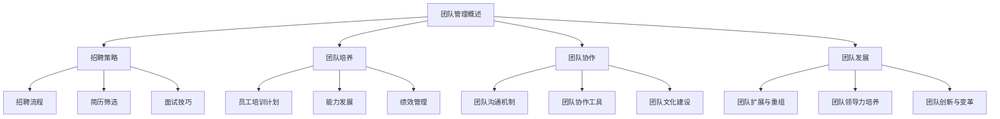

                 

### 文章标题

### 《打造高绩效团队：从招聘到培养的全流程》

---

### 文章关键词

- 团队管理
- 招聘策略
- 员工培训
- 绩效管理
- 团队协作
- 领导力

---

### 摘要

本文深入探讨了打造高绩效团队的全流程，从招聘策略的制定，到员工的培养与成长，再到团队的协作与领导力的提升。通过系统化的分析，我们旨在为读者提供一套全面、实用的团队管理方法，帮助企业在竞争激烈的市场中构建高效团队，实现持续发展。

---

### 《打造高绩效团队：从招聘到培养的全流程》目录大纲

#### 第一部分：团队管理概述

##### 1.1 团队管理的基本概念
- **团队定义与特性**：介绍团队的概念及其特性。
- **高绩效团队的标准**：讨论衡量高绩效团队的标准和指标。
- **团队生命周期与演化**：分析团队从成立到解散的生命周期各个阶段及其演化过程。

##### 1.2 团队管理的挑战
- **组织变革中的团队管理**：探讨组织变革对团队管理的影响。
- **不同类型团队的管理策略**：讨论如何针对不同类型的团队实施管理。
- **团队冲突与沟通策略**：分析团队冲突的原因及其解决方法。

#### 第二部分：招聘策略

##### 2.1 招聘流程
- **招聘计划与目标设定**：讲解如何制定有效的招聘计划。
- **招聘渠道与策略**：介绍多种招聘渠道及其适用性。
- **初步筛选与面试安排**：描述简历筛选和面试安排的流程。

##### 2.2 简历筛选
- **简历筛选标准**：解释如何从众多简历中筛选合适的候选人。
- **技能与素质评估**：讨论在招聘过程中如何评估候选人的技能和素质。
- **面试前的准备工作**：介绍面试前的准备工作。

##### 2.3 面试技巧
- **结构化面试法**：解释结构化面试法的优势和应用。
- **行为面试法**：介绍行为面试法及其应用。
- **团队协作面试**：探讨如何在面试过程中评估候选人的团队协作能力。

#### 第三部分：团队培养

##### 3.1 员工培训计划
- **培训需求分析**：分析团队培训需求，制定培训计划。
- **培训内容设计**：设计适合团队的培训内容。
- **培训效果评估**：评估培训效果，持续改进培训计划。

##### 3.2 能力发展
- **职业规划与个人发展**：介绍如何帮助员工制定职业规划。
- **跨部门轮岗与经验分享**：探讨跨部门轮岗的经验分享机制。
- **专业技术培训与认证**：讲解如何提供专业技术培训及认证。

##### 3.3 绩效管理
- **绩效评估标准与流程**：讨论绩效评估的标准和流程。
- **绩效反馈与改进**：解释如何进行绩效反馈和持续改进。
- **绩效激励与薪酬管理**：探讨绩效激励和薪酬管理的方法。

#### 第四部分：团队协作

##### 4.1 团队沟通机制
- **沟通渠道与工具**：介绍团队沟通的渠道和工具。
- **沟通障碍与解决方法**：分析沟通障碍及其解决方法。
- **团队会议管理**：讲解团队会议的管理方法和技巧。

##### 4.2 团队协作工具
- **线上协作平台选择**：讨论如何选择适合的线上协作平台。
- **项目管理工具**：介绍常用的项目管理工具及其功能。
- **团队协作技巧与案例分析**：分享团队协作技巧和成功案例。

##### 4.3 团队文化建设
- **企业价值观与团队文化**：解释企业价值观对团队文化的影响。
- **团队文化建设策略**：介绍团队文化建设的策略和方法。
- **团队凝聚力与归属感**：探讨如何提升团队凝聚力和成员归属感。

#### 第五部分：团队发展

##### 5.1 团队扩展与重组
- **团队规模调整策略**：讨论团队规模调整的策略和步骤。
- **新成员融入与适应**：介绍新成员融入团队的方法和策略。
- **跨功能团队管理**：探讨跨功能团队的管理方法和挑战。

##### 5.2 团队领导力培养
- **领导力模型与培养方法**：介绍领导力模型及其培养方法。
- **领导风格与决策能力**：分析不同领导风格和决策能力对团队的影响。
- **领导力发展案例分享**：分享领导力发展的成功案例和经验。

##### 5.3 团队创新与变革
- **创新驱动团队管理**：讨论如何通过创新驱动团队管理。
- **变革管理与适应策略**：介绍团队变革管理的策略和适应方法。
- **团队创新案例与实践**：分享团队创新的案例和实践经验。

#### 第六部分：案例分析与经验分享

##### 6.1 成功团队案例分析
- **成功案例背景与目标**：分析成功团队的背景和目标。
- **团队管理策略与实践**：讨论成功团队的策略和实践。
- **经验总结与启示**：总结成功团队的经验，提供启示。

##### 6.2 团队管理挑战与应对
- **典型团队管理问题**：列举常见的团队管理问题。
- **问题分析与解决**：分析问题的原因，提出解决方案。
- **防范与改进措施**：探讨如何防范问题，持续改进团队管理。

##### 6.3 经验分享与互动
- **实际操作心得与建议**：分享团队管理者的实际操作心得和建议。
- **团队管理者经验交流**：邀请团队管理者进行经验交流。
- **听众互动与答疑**：提供听众互动和答疑环节。

#### 附录

##### 附录 A：团队管理工具与应用
- **常用团队管理工具介绍**：介绍常用的团队管理工具及其应用场景。
- **工具使用技巧与案例分析**：分享工具的使用技巧和成功案例。

##### 附录 B：团队管理参考资料
- **团队管理相关书籍推荐**：推荐经典的团队管理书籍。
- **团队管理在线课程资源**：提供在线课程资源链接。
- **团队管理论文与研究报告**：分享最新的团队管理论文和研究成果。

##### 附录 C：团队管理评估表与问卷
- **团队管理评估指标与量表**：介绍团队管理评估的指标和量表。
- **团队成员满意度调查问卷**：提供团队成员满意度调查问卷模板。
- **团队协作效率评估工具**：介绍团队协作效率评估的工具。

##### 附录 D：案例与练习题
- **团队管理案例研究**：提供团队管理案例供读者研究。
- **实操练习与答案解析**：提供实操练习题及答案解析。
- **听众反馈与讨论题目**：提供听众反馈和讨论的题目。

### 核心概念与联系

为了更好地理解团队管理，我们需要从核心概念出发，通过流程图展现这些概念之间的联系。以下是团队管理核心概念及其关系的Mermaid流程图：



### 招聘策略

招聘是团队建设的起点，也是决定团队未来发展方向的重要环节。有效的招聘策略可以为企业吸引并留住优秀人才，为团队的高绩效打下坚实基础。

#### 招聘计划与目标设定

制定招聘计划是招聘的第一步。招聘计划应该明确招聘的目标、所需岗位的职责和要求、预算以及时间表。

**招聘目标**：明确企业当前阶段的发展需求，以及招聘的具体目标，如补充关键岗位、扩大团队规模等。

**岗位职责和要求**：详细描述岗位的职责、所需技能和经验，以及学历、专业背景等要求。确保岗位描述清晰、准确，能够吸引到合适的候选人。

**预算和时间表**：根据企业实际情况，制定合理的招聘预算和时间表。预算包括招聘渠道费用、面试费用、培训费用等，时间表则需要明确各个招聘环节的时间节点。

#### 招聘渠道与策略

选择合适的招聘渠道对于吸引到合适的候选人至关重要。以下是一些常用的招聘渠道及其适用性：

1. **内部推荐**：通过现有员工的推荐来招聘新员工，这种方式可以有效降低招聘成本，并提高候选人的适应性和忠诚度。

2. **招聘网站**：如智联招聘、前程无忧等，这些网站提供了丰富的职位信息和候选人资源，适合招聘大量职位。

3. **招聘会**：参加校园招聘会或行业招聘会，可以直接与毕业生和行业人才面对面交流，有助于找到符合企业需求的候选人。

4. **猎头服务**：对于高端职位或特殊技能的招聘，猎头服务能够提供专业的人才筛选和推荐。

5. **社交媒体**：利用LinkedIn、微博、微信公众号等社交媒体平台发布招聘信息，可以吸引到更多的潜在候选人。

#### 初步筛选与面试安排

初步筛选是招聘流程中的重要环节，通过简历筛选和初步面试，筛选出符合岗位要求的候选人。

**简历筛选标准**：

- **学历和专业背景**：确保候选人具备必要的学术背景。
- **工作经验**：评估候选人在相关工作岗位上的经验，特别是与应聘岗位相关的工作经历。
- **技能和资质**：检查候选人是否具备岗位所需的专业技能和资质。
- **个人素质**：通过简历中的描述，初步判断候选人的个人素质，如沟通能力、团队合作精神等。

**面试安排**：

- **结构化面试**：使用结构化面试法，确保每个候选人接受相同的面试流程和问题，提高面试的公正性和效率。
- **行为面试**：通过提问候选人在过去工作中遇到的问题和解决方法，评估其解决问题的能力。
- **团队协作面试**：设置团队协作场景，观察候选人在团队中的表现，评估其团队合作能力。

#### 面试技巧

面试是评估候选人是否符合岗位要求的关键环节，以下是一些面试技巧：

- **准备充分**：提前了解候选人的背景和应聘岗位，准备好相关的问题和评估标准。
- **营造良好氛围**：在面试开始时，通过轻松的对话营造良好的氛围，使候选人感到舒适。
- **提问技巧**：通过开放性问题和封闭性问题相结合，全面了解候选人的能力、经验和素质。
- **观察与倾听**：在面试过程中，注意观察候选人的非语言行为，如眼神、姿态等，同时认真倾听候选人的回答。
- **反馈与总结**：在面试结束时，给予候选人积极的反馈，并总结面试结果，为后续决策提供依据。

通过以上步骤，企业可以有效地实施招聘策略，吸引并选拔到适合的人才，为团队的高绩效奠定基础。

### 简历筛选

简历筛选是招聘流程中的关键环节，通过精准筛选，能够快速锁定符合岗位要求的候选人，提高招聘效率。

#### 简历筛选标准

1. **学历和专业背景**：首先，查看候选人的学历和专业背景，确保其具备基本的学术素养和岗位所需的专业知识。

2. **工作经验**：工作经验是评估候选人是否符合岗位要求的重要指标。特别是与应聘岗位相关的工作经历，能够直接反映出候选人的实际工作能力。

3. **技能和资质**：岗位所需的专业技能和资质是简历筛选的另一个重要标准。通过查看候选人的技能和资质证书，可以判断其是否具备胜任岗位所需的技术能力。

4. **个人素质**：简历中的描述可以初步反映出候选人的个人素质，如沟通能力、团队合作精神等。这些软性技能对于岗位的适应性和团队的协作至关重要。

5. **工作业绩**：在简历中，注意查看候选人过往的工作业绩，如项目成果、业绩指标等。这些数据能够直观地展示候选人的工作能力和成就。

#### 技能与素质评估

1. **技术能力评估**：对于技术岗位，可以通过简历中的项目经历、技术栈、代码示例等，评估候选人的技术能力和技术水平。

2. **沟通能力评估**：通过简历中的工作描述、项目报告等，可以初步判断候选人的沟通能力。良好的沟通能力对于团队协作至关重要。

3. **团队合作能力评估**：查看候选人在过去项目中的角色和贡献，评估其团队合作能力和协作精神。

4. **学习能力和适应能力评估**：通过候选人在简历中展示的自我学习和适应新环境的能力，评估其是否具备快速适应新岗位的能力。

#### 面试前的准备工作

1. **岗位需求分析**：在筛选简历前，需要明确岗位的需求，包括职责、技能要求、工作经验等。这有助于筛选出更符合岗位要求的候选人。

2. **筛选标准确定**：根据岗位需求，制定具体的筛选标准，确保简历筛选过程有据可依，提高筛选效率。

3. **筛选工具使用**：可以使用简历筛选工具，如HiringSolved、Greenhouse等，这些工具可以帮助快速筛选出符合要求的候选人。

4. **面试安排**：筛选出符合条件的候选人后，需要安排初步面试，了解候选人的更多背景信息，为后续面试做好准备。

通过以上步骤，企业可以高效地筛选出符合岗位要求的候选人，为下一步的面试和评估奠定基础。

### 面试技巧

面试是招聘流程中最重要的环节之一，通过面试，企业可以全面评估候选人的能力、素质和潜力，从而做出最终录用决策。以下是一些面试技巧，帮助企业和面试官提高面试效果。

#### 结构化面试法

结构化面试法是一种系统化、标准化的面试方法，通过一系列预定的、结构化的问题，对候选人进行全面评估。其优势在于：

- **标准统一**：所有候选人接受相同的面试流程和问题，确保评估的公正性和公平性。
- **效率高**：结构化面试法可以快速、高效地评估候选人，节省时间和人力资源。
- **全面评估**：通过多角度、多层次的问题，全面了解候选人的能力、素质和潜力。

实施结构化面试法，需要注意以下几点：

1. **制定面试问题**：根据岗位需求，设计一套标准化的面试问题，包括行为问题、技能问题、情境问题等。
2. **问题顺序**：确保面试问题的顺序合理，由浅入深，逐步引导候选人展示其能力和经验。
3. **记录与评估**：面试过程中，记录候选人的回答和表现，对照评估标准进行评分。

#### 行为面试法

行为面试法是通过提问候选人过去的工作经历，评估其解决问题的能力和工作表现。其核心在于：

- **情境模拟**：通过设置工作情境，观察候选人在实际工作中的表现。
- **问题提问**：提问候选人过去遇到的问题、解决方案和结果，评估其问题解决能力。

行为面试法的优势在于：

- **真实反映能力**：通过过去的工作经历，可以更真实地反映出候选人的能力。
- **预测未来表现**：候选人过去的行为模式往往预示着未来的表现。

实施行为面试法，需要注意以下几点：

1. **设计问题**：设计具有针对性、情境性、行为描述性的面试问题。
2. **问题分类**：将问题分为情境问题、行为问题、结果问题等，确保评估的全面性。
3. **引导回答**：在面试过程中，引导候选人详细描述其过去的工作经历，避免简单回答。

#### 团队协作面试

团队协作面试旨在评估候选人在团队中的协作能力和团队角色匹配度。其核心在于：

- **团队角色**：了解候选人在团队中的角色和贡献，评估其团队协作能力。
- **沟通技巧**：通过团队协作任务，观察候选人的沟通技巧和团队合作精神。

团队协作面试的优势在于：

- **真实模拟工作场景**：通过模拟团队工作，观察候选人在实际工作中的表现。
- **提升团队凝聚力**：通过团队协作面试，可以找到与现有团队文化相匹配的候选人，提升团队凝聚力。

实施团队协作面试，需要注意以下几点：

1. **设计任务**：设计具有挑战性、实用性的团队协作任务，确保任务与岗位需求相关。
2. **角色分配**：明确候选人在团队中的角色和职责，确保其能够充分发挥自己的能力。
3. **观察与评估**：在团队协作过程中，观察候选人的表现，评估其团队协作能力和沟通技巧。

通过以上面试技巧，企业可以更全面、更准确地评估候选人，找到适合岗位的人才，为团队的高绩效奠定基础。

### 员工培训计划

一个高效的团队离不开持续的学习和培训。员工培训计划是团队管理中的重要一环，旨在提升员工的专业技能、工作能力和个人素质，从而推动团队整体绩效的提升。以下是制定员工培训计划的详细步骤：

#### 培训需求分析

1. **岗位需求分析**：首先，需要明确每个岗位的职责和技能要求，分析现有员工在这些方面的能力差距。这可以通过岗位说明书、员工绩效评估报告等资料进行。

2. **员工个人需求分析**：了解每个员工的学习兴趣、职业规划和个人发展目标，评估其当前的技能水平和提升需求。这可以通过个人面谈、能力评估问卷等方式进行。

3. **市场趋势分析**：关注行业发展和新技术趋势，评估哪些技能和知识是未来所需的。这有助于确保培训计划的前瞻性和实用性。

#### 培训内容设计

1. **基础技能培训**：包括办公软件操作、基础编程语言等，确保员工具备基本的工作能力。

2. **专业技能培训**：根据岗位需求，设计相关的专业技能培训，如项目管理系统使用、专业软件操作等。

3. **管理技能培训**：对于管理人员，提供领导力、沟通技巧、项目管理等管理技能培训，提升其管理能力。

4. **软技能培训**：包括团队合作、时间管理、演讲技巧等，提升员工的综合素质。

#### 培训方式选择

1. **内部培训**：由公司内部的专业人员或经验丰富的员工进行培训，可以结合实际工作场景，提高培训的实用性和针对性。

2. **外部培训**：通过外部培训机构或大学的专业课程进行培训，可以获得更系统和专业的知识。

3. **在线学习平台**：利用在线学习平台，员工可以自主安排学习时间和进度，灵活学习。

4. **现场培训**：组织专家或讲师进行现场培训，通过互动式教学提高培训效果。

#### 培训效果评估

1. **培训前评估**：在培训开始前，通过调查问卷、访谈等方式，了解员工的学习需求和期望，为培训内容的制定提供参考。

2. **培训中评估**：通过课堂参与度、学习进度、互动情况等指标，实时监控培训效果，及时调整培训内容和方式。

3. **培训后评估**：通过考试、实践操作、工作表现等手段，评估培训效果，确保培训目标的达成。

4. **反馈与改进**：收集员工和培训师的反馈，分析培训过程中的问题和不足，不断优化培训计划和方法。

通过以上步骤，企业可以制定出科学、有效的员工培训计划，确保员工在专业技能、管理能力和个人素质等方面不断提升，从而为团队的高绩效和持续发展提供有力支持。

### 能力发展

在团队管理中，员工的个人发展是推动团队进步的关键因素。通过有效的职业规划、跨部门轮岗和经验分享，可以帮助员工不断提升自己的能力和技能，从而为团队的整体绩效作出更大贡献。

#### 职业规划与个人发展

职业规划是员工个人发展的基础，它不仅可以帮助员工明确自己的职业目标和发展路径，还能为企业的持续发展储备人才。以下是如何帮助员工进行职业规划：

1. **制定个人发展计划**：首先，与员工进行一对一的沟通，了解他们的职业兴趣、优势和目标。根据员工的反馈，制定一个详细的个人发展计划，包括短期和长期的目标。

2. **提供职业发展路径**：根据企业的业务发展和岗位需求，为员工提供清晰的职业发展路径。这包括从初级岗位到高级岗位的晋升路径，以及可能的跨部门调岗机会。

3. **定期评估与反馈**：定期与员工进行职业规划的评估和反馈，了解他们的进展情况，及时调整计划，确保职业规划的有效实施。

4. **提供成长机会**：为员工提供参加培训、项目实践、行业交流等成长机会，帮助他们不断扩展视野和提升能力。

#### 跨部门轮岗与经验分享

跨部门轮岗和经验分享是培养全面型人才的有效方式。以下是如何实施：

1. **制定轮岗计划**：根据企业的业务需求和员工的职业规划，制定合理的轮岗计划。轮岗周期可以根据实际情况设定，如每半年或一年一次。

2. **明确轮岗目标和任务**：在轮岗前，明确轮岗的目标和任务，让员工了解轮岗期间需要达到的成果和任务要求。

3. **提供培训和指导**：在轮岗过程中，为员工提供必要的培训和指导，帮助他们快速适应新岗位和团队文化。

4. **经验分享会议**：定期组织经验分享会议，让轮岗回来的员工分享他们在其他部门的经历和收获，促进团队的跨部门协作和知识共享。

#### 专业技术培训与认证

专业技术培训与认证是提升员工专业技能和竞争力的关键。以下是如何实施：

1. **培训内容设计**：根据企业的业务需求和员工的职业规划，设计针对性的培训内容。培训内容可以包括新技术、新工具、行业最佳实践等。

2. **外部培训资源**：利用外部培训机构和课程，为员工提供系统化的专业培训。这包括线上课程、线下培训班等。

3. **认证支持**：鼓励员工参加专业认证考试，如PMP、CISSP等。企业可以提供一定的费用支持，以激励员工提升自己的专业技能。

4. **内部培训师**：培养企业内部的培训师，利用他们的实际工作经验，为员工提供更实用的培训。

通过职业规划、跨部门轮岗、经验分享和专业技术培训，企业可以全面提升员工的个人能力，打造一支高效、专业的团队，从而在激烈的市场竞争中脱颖而出。

### 绩效管理

绩效管理是团队管理中至关重要的一环，它不仅关系到员工的工作表现和职业发展，也直接影响团队的整体绩效和企业目标的实现。有效的绩效管理需要科学的设计和系统的实施，以下从绩效评估标准、绩效反馈与改进、以及绩效激励与薪酬管理三个方面进行详细阐述。

#### 绩效评估标准

1. **关键绩效指标（KPIs）**：
   绩效评估标准需要明确关键绩效指标（KPIs），这些指标应该与企业的战略目标和岗位职责紧密相关。常见的KPI包括销售额、项目完成率、客户满意度、开发效率等。

2. **量化与细化**：
   为了确保评估的客观性和准确性，KPIs需要量化并细化。例如，销售额可以设定为每月必须完成的金额，项目完成率可以设定为具体的百分比。

3. **平衡计分卡**：
   采用平衡计分卡（Balanced Scorecard）的方法，从财务、客户、内部流程、学习与成长四个维度全面评估员工的表现，确保评估的全面性和均衡性。

#### 绩效反馈与改进

1. **定期反馈**：
   绩效反馈应该定期进行，例如每季度或每半年进行一次。定期的反馈可以让员工及时了解自己的工作表现，发现问题并采取措施进行改进。

2. **双向沟通**：
   在反馈过程中，管理者应该与员工进行双向沟通，既要指出员工的工作亮点，也要提出改进意见和建议。通过建设性的对话，帮助员工明确改进的方向。

3. **反馈方式**：
   反馈可以通过面对面沟通、书面报告、邮件等多种方式进行。对于重要的绩效反馈，建议采用书面形式，以便于记录和跟踪。

#### 绩效激励与薪酬管理

1. **绩效奖金**：
   根据员工的绩效评估结果，设置绩效奖金制度。绩效奖金可以与员工的KPI完成情况直接挂钩，激发员工的工作积极性和主动性。

2. **股权激励**：
   对于关键岗位和核心员工，可以采用股权激励制度，让员工分享企业的成长和成功，增强员工的归属感和长期承诺。

3. **薪酬调整**：
   根据员工的绩效表现，定期进行薪酬调整。对于表现优秀的员工，给予合理的薪酬增长，以体现其价值。

4. **长期激励**：
   设计长期的激励计划，如年终奖、长期服务奖等，激励员工在长期内保持高绩效和稳定的工作态度。

#### 绩效管理工具与方法

1. **绩效管理系统**：
   引入现代化的绩效管理系统，如KPI管理系统、360度评估系统等，通过系统化的管理工具，提高绩效管理的效率和准确性。

2. **OKR方法**：
   采用目标与关键结果（OKR）方法，明确员工的个人目标和关键结果，确保员工的工作与企业的战略目标保持一致。

3. **绩效改进计划**：
   在绩效评估结束后，制定绩效改进计划，帮助员工设定具体的改进目标和措施，确保绩效持续提升。

通过科学、系统的绩效管理，企业可以确保员工的工作表现与企业的战略目标保持一致，同时激发员工的工作热情和积极性，从而实现团队的高绩效和企业的持续发展。

### 团队沟通机制

有效的团队沟通是团队成功的关键因素。一个良好的沟通机制能够确保信息的准确传递，减少误解和冲突，提高团队协作效率和整体绩效。以下从沟通渠道与工具、沟通障碍与解决方法、团队会议管理三个方面进行详细阐述。

#### 沟通渠道与工具

1. **内部邮件**：内部邮件是一种正式的沟通渠道，适用于重要通知、正式文件和项目报告的传递。其优点在于信息记录详细，便于查阅和归档。

2. **即时通讯工具**：如Slack、微软Teams、微信等，这些工具支持即时交流、文件共享和团队协作，适用于日常沟通和紧急问题的处理。

3. **企业社交媒体平台**：如LinkedIn、内部微信朋友圈等，可以用于发布公司新闻、分享行业动态和促进员工间的互动交流。

4. **项目管理系统**：如JIRA、Trello等，用于项目管理和任务分配，确保团队成员对项目进展有清晰的了解。

5. **视频会议系统**：如Zoom、腾讯会议等，用于远程团队会议和项目讨论，提高沟通的效率和效果。

#### 沟通障碍与解决方法

1. **语言障碍**：团队成员来自不同的背景，可能存在语言障碍。解决方法包括提供翻译服务、鼓励使用简明易懂的语言、安排跨文化培训等。

2. **信息过载**：团队成员接收到的信息过多，可能导致信息过载，影响工作效率。解决方法包括设置邮件过滤规则、合理分配信息传递的责任、定期清理通讯工具等。

3. **沟通渠道不明确**：团队沟通缺乏明确的渠道和规则，导致信息传递不畅。解决方法包括明确沟通渠道和规则、制定沟通流程、建立沟通机制等。

4. **缺乏反馈机制**：团队成员在沟通过程中缺乏及时的反馈，可能导致信息误解和问题积累。解决方法包括建立反馈机制、鼓励开放式沟通、定期进行沟通效果评估等。

#### 团队会议管理

1. **会议类型**：
   - **日常例会**：每日或每周召开的简短会议，用于总结前一天的工作进展和布置当天任务。
   - **项目会议**：针对特定项目召开的主题会议，讨论项目进展、问题解决和资源调配。
   - **战略会议**：高层管理人员召开的会议，讨论企业战略和重大决策。

2. **会议流程**：
   - **会议议程**：提前制定会议议程，明确会议主题和讨论内容。
   - **会议主持**：指定会议主持人，负责会议的进程控制和讨论引导。
   - **会议记录**：记录会议内容和决议，确保信息准确传达和执行。

3. **会议效果评估**：
   - **会议反馈**：会后收集团队成员的反馈，了解会议的效果和改进空间。
   - **执行跟踪**：对会议决议进行跟踪和执行，确保会议成果落实。

通过建立有效的团队沟通机制，企业可以确保信息的高效传递，促进团队协作，提高整体绩效。同时，通过不断优化沟通渠道和会议管理，可以进一步提升团队的工作效率和凝聚力。

### 团队协作工具

在现代社会，团队协作工具已成为团队高效协作不可或缺的组成部分。这些工具不仅能够提高沟通效率，还能促进信息的共享和任务的分配，从而提升整体工作绩效。以下将详细介绍几种常见的团队协作工具及其功能。

#### 线上协作平台

线上协作平台如Slack、微软Teams、钉钉等，是现代团队沟通与协作的核心工具。它们具备以下功能：

1. **即时通讯**：支持文字、语音、视频等多种形式的即时沟通，确保团队成员可以随时交流。

2. **文件共享与存储**：提供云存储功能，方便团队成员上传、下载和共享文件。

3. **任务管理**：集成任务管理功能，可以分配任务、设定截止日期，并实时跟踪任务进度。

4. **集成第三方应用**：能够与Trello、JIRA等任务管理工具集成，实现更高效的协作。

#### 项目管理工具

项目管理工具如Trello、JIRA、Asana等，专为团队项目管理和任务跟踪而设计。其主要功能包括：

1. **任务分配**：将项目任务分配给不同的团队成员，明确各自的职责和任务。

2. **进度跟踪**：通过可视化图表和报告，实时了解项目的进展情况。

3. **协作功能**：支持团队成员之间的实时协作和讨论，确保任务顺利完成。

4. **提醒与通知**：自动发送任务提醒和通知，确保团队成员按时完成任务。

#### 团队协作技巧与案例分析

有效的团队协作不仅依赖于工具，还需要团队成员具备一定的协作技巧。以下是一些团队协作技巧及案例分析：

1. **明确目标**：确保所有团队成员对项目目标和任务有清晰的理解，减少误解和偏差。

2. **分工合作**：根据团队成员的技能和优势，合理分配任务，确保每个成员都能充分发挥自己的能力。

3. **定期沟通**：定期召开团队会议，讨论项目进展、问题和解决方案，确保团队协作顺畅。

4. **积极反馈**：鼓励团队成员之间积极反馈，及时发现和解决问题，提高工作效率。

5. **案例分析**：通过分析成功的团队协作案例，学习有效的协作方法和技巧。

例如，在一个软件开发项目中，通过Trello进行任务分配和进度跟踪，团队成员可以清楚地看到各自的任务状态和项目进度，从而更好地协调工作。同时，通过定期的团队会议，及时解决项目中出现的问题，确保项目的顺利进行。

通过合理利用团队协作工具和技巧，企业可以显著提高团队的协作效率，实现项目目标的高效完成。

### 团队文化建设

团队文化建设是打造高绩效团队的重要环节，它不仅影响员工的工作态度和行为，还直接影响团队的凝聚力和创新能力。以下从企业价值观与团队文化、团队文化建设策略、以及团队凝聚力与归属感三个方面进行详细阐述。

#### 企业价值观与团队文化

1. **企业价值观**：企业价值观是企业文化的核心，是企业长期坚持的基本信念和行为准则。它指导着企业的发展和团队成员的行为。例如，谷歌的企业价值观包括“不作恶”、“快速执行”和“用户至上”等。

2. **团队文化**：团队文化是企业文化在团队层面的具体体现，是团队成员共同认同的行为方式和价值观念。良好的团队文化能够激发员工的积极性，提升团队的整体绩效。

#### 团队文化建设策略

1. **明确价值观**：企业应明确核心价值观，并将其传达给所有团队成员。通过内部培训和宣讲，确保团队成员理解并认同企业价值观。

2. **榜样示范**：企业高层管理人员应率先践行核心价值观，通过自身的行为为员工树立榜样。

3. **制度保障**：建立与核心价值观相一致的管理制度和激励措施，确保核心价值观在员工日常工作中得到体现。

4. **文化建设活动**：定期举办团队建设活动，如团建活动、文化活动等，增强团队成员之间的交流和互动，促进团队文化的形成。

5. **持续沟通**：通过定期沟通，如团队会议、内部邮件等，持续传递企业文化信息，确保团队成员对团队文化的认同和践行。

#### 团队凝聚力与归属感

1. **团队凝聚力**：团队凝聚力是指团队成员之间的相互吸引力和协同工作的意愿。高凝聚力的团队具有更强的协作能力和创新精神。以下是一些提升团队凝聚力的方法：

   - **共同目标**：确保团队成员有共同的目标和使命，共同为实现目标而努力。
   - **信任建设**：通过信任游戏、团队合作活动等，建立团队成员之间的信任关系。
   - **团队精神**：培养团队成员的团队精神，鼓励相互支持和合作。

2. **归属感**：归属感是指员工对团队的认同感和责任感。以下是一些提升员工归属感的方法：

   - **关爱员工**：关注员工的生活和工作状态，提供必要的支持和帮助。
   - **职业发展**：为员工提供职业发展机会和培训，增强员工对企业的认同感。
   - **激励机制**：建立公平、透明的激励机制，让员工感受到自己的努力被认可和奖励。

通过有效的团队文化建设，企业可以提升团队的凝聚力与归属感，从而提高整体绩效和创新能力，实现企业的可持续发展。

### 团队扩展与重组

在企业发展过程中，团队扩展与重组是常见的现象。团队扩展意味着企业需要增加人手以应对业务增长，而团队重组则可能是由于组织结构优化、战略调整等原因而进行的。以下从团队规模调整策略、新成员融入与适应、以及跨功能团队管理三个方面详细讨论团队扩展与重组的策略和方法。

#### 团队规模调整策略

1. **需求分析**：首先，企业需要分析业务发展的需求，确定团队扩展的必要性和规模。可以通过以下步骤进行需求分析：

   - **市场调研**：了解市场趋势和竞争对手的动态，评估企业业务的增长潜力。
   - **业务规划**：根据企业的战略规划和业务目标，确定未来一段时间内的人力需求。
   - **工作负荷分析**：评估当前团队的工作负荷，确定是否需要增加人手以提升工作效率。

2. **招聘与选拔**：根据需求分析的结果，制定招聘计划，通过内部推荐、招聘网站、猎头服务等多种渠道进行招聘。在选拔过程中，要注重候选人的综合素质和团队文化适应性，以确保新成员能够顺利融入团队。

3. **结构优化**：在团队扩展过程中，企业应同时考虑团队结构的优化。通过分析团队现有职能和职责，合理分配新成员的工作，避免因人设岗，提升团队的整体效能。

#### 新成员融入与适应

1. **入职培训**：新成员入职后，企业应组织系统的入职培训，包括企业文化、岗位职责、工作流程等内容。通过培训，帮助新成员快速了解企业，熟悉工作环境。

2. **导师制度**：为每位新成员安排一位经验丰富的导师，导师应负责指导新成员的工作，解答疑问，帮助其顺利融入团队。导师制度有助于新成员快速适应工作，提升工作效率。

3. **团队互动**：鼓励新成员参加团队活动和会议，促进团队成员之间的交流和互动，增强新成员的归属感和团队意识。

4. **反馈与支持**：定期收集新成员的反馈，了解其在融入过程中的困难和需求，及时提供支持和帮助，确保新成员能够顺利度过适应期。

#### 跨功能团队管理

1. **明确目标**：在组建跨功能团队时，首先要明确团队的目标和任务，确保所有成员都清楚团队的使命和期望成果。

2. **角色分工**：根据团队成员的专业技能和职责，明确各自的职责和任务，确保团队成员各司其职，协同合作。

3. **沟通协调**：跨功能团队往往涉及多个部门，沟通协调尤为重要。企业应建立高效的沟通机制，确保信息畅通，避免因沟通不畅导致的工作延误和冲突。

4. **资源整合**：跨功能团队需要充分利用企业内外部资源，确保项目能够顺利进行。企业应提供必要的支持和资源，如资金、技术、人力资源等，以支持跨功能团队的协作。

5. **绩效评估**：对跨功能团队的绩效进行综合评估，包括项目完成情况、团队协作效果、成员贡献等，以激励团队成员，提升团队的整体绩效。

通过科学合理的团队扩展与重组策略，企业可以灵活应对市场变化，提升团队的整体效能，从而在竞争激烈的市场中脱颖而出。

### 团队领导力培养

团队领导力是团队高效运作的核心驱动力。一个具备卓越领导力的领导者不仅能够带领团队实现目标，还能激发团队成员的潜力，提升整体绩效。以下从领导力模型与培养方法、领导风格与决策能力、领导力发展案例分享三个方面，详细探讨团队领导力培养的策略和实施方法。

#### 领导力模型与培养方法

1. **领导力模型**：领导力模型是描述领导行为和特质的理论框架。常见的领导力模型包括领导行为模型、情境领导模型、变革型领导模型等。

   - **领导行为模型**：强调领导者通过特定行为来影响团队成员。如领导风格分为民主型、权威型、参与型等。
   - **情境领导模型**：根据团队成员的不同成熟度，选择不同的领导风格。例如，对于成熟度低的团队成员，领导者应采取指导型领导风格；对于成熟度高的团队成员，领导者应采取支持型领导风格。
   - **变革型领导模型**：强调领导者通过变革激励和愿景引导，激发团队成员的内在动力，推动团队创新和成长。

2. **培养方法**：
   - **培训与教育**：通过领导力培训课程，帮助领导者了解不同的领导力模型和方法，提升其理论知识和实践技能。
   - **实践与反思**：通过实际工作场景中的领导实践，领导者可以不断反思和调整自己的领导行为，提升领导能力。
   - **导师制度**：为领导者配备经验丰富的导师，通过导师的指导和反馈，帮助领导者快速成长。

#### 领导风格与决策能力

1. **领导风格**：
   - **民主型领导风格**：领导者鼓励团队成员参与决策，重视团队成员的意见和建议，适合团队创新和协作。
   - **权威型领导风格**：领导者拥有决策权，直接指挥团队成员执行任务，适合需要快速决策和执行的紧急情况。
   - **参与型领导风格**：领导者通过与团队成员建立合作关系，共同制定决策，提升团队成员的参与感和责任感。

2. **决策能力**：
   - **信息收集**：领导者需要广泛收集相关信息，包括市场趋势、团队反馈、竞争对手情况等，为决策提供依据。
   - **风险评估**：在决策过程中，领导者需要评估各种可能的风险和影响，制定应对策略。
   - **决策执行**：决策制定后，领导者需要确保决策得到有效执行，及时跟进和调整，确保目标达成。

#### 领导力发展案例分享

以下是一个成功的领导力发展案例：

**案例背景**：某互联网公司创始人李先生，是一位典型的变革型领导者。他在公司快速发展期，面临组织结构不合理、团队士气低落的问题。

**解决方案**：
1. **愿景引导**：李先生提出了公司未来的愿景，并通过内部会议和团队活动，与团队成员分享，激发团队的内在动力。
2. **民主参与**：李先生鼓励团队成员参与公司决策，设立内部提案机制，鼓励员工提出改进建议。通过这种方式，增强了员工的参与感和责任感。
3. **激励机制**：设立绩效奖金和晋升机制，激励员工为实现公司愿景而努力。
4. **领导力培训**：李先生本人参加了领导力培训课程，学习了变革型领导方法，并将这些方法应用到实际工作中。

**结果**：经过一系列的变革措施，公司的组织结构得到了优化，团队士气大幅提升，公司的业绩也有了显著增长。

通过领导力模型的培训和实践，以及领导风格和决策能力的提升，企业可以培养出具备卓越领导力的领导者，推动团队的高效运作和企业的持续发展。

### 团队创新与变革

团队创新与变革是团队发展的重要驱动力，它不仅能够提升团队的竞争力，还能推动企业的可持续发展。以下从创新驱动团队管理、变革管理与适应策略、团队创新案例与实践三个方面，详细探讨团队创新与变革的管理方法和实施策略。

#### 创新驱动团队管理

1. **创新文化培养**：
   - **鼓励试错**：在团队中营造一个鼓励尝试和包容失败的文化，让团队成员敢于创新和实验。
   - **奖励机制**：设立创新奖励机制，对提出创新想法并成功实施的团队成员进行奖励，激发创新动力。

2. **创新思维培训**：
   - **思维训练**：通过创新思维训练，如头脑风暴、设计思维等方法，培养团队成员的创新思维能力。
   - **跨学科合作**：鼓励团队成员跨学科合作，通过不同领域的知识融合，激发创新灵感。

3. **资源投入**：
   - **专项基金**：设立创新基金，为团队成员提供资金支持，用于创新项目的研发和实验。
   - **时间安排**：确保团队成员有足够的时间用于创新活动，减少日常工作对创新的干扰。

#### 变革管理与适应策略

1. **变革管理计划**：
   - **明确变革目标**：在变革前，明确变革的目标和预期效果，确保团队成员对变革有清晰的认识。
   - **风险评估**：对变革可能带来的风险进行全面评估，制定风险应对策略。

2. **变革沟通**：
   - **信息公开**：通过内部会议、邮件、公告等形式，向团队成员公开变革信息，确保信息透明。
   - **员工参与**：鼓励员工参与变革讨论，收集员工的反馈和建议，增强员工对变革的认同感。

3. **变革执行**：
   - **试点运行**：在变革初期，选择部分团队或项目进行试点运行，通过试点积累经验，逐步推广。
   - **反馈与调整**：在变革过程中，及时收集反馈，根据实际情况进行调整和优化。

#### 团队创新案例与实践

以下是一个团队创新与变革的案例：

**案例背景**：某科技公司面对市场竞争加剧，决定通过数字化转型来提升竞争力。

**解决方案**：
1. **创新思维培训**：公司组织了多次创新思维培训，帮助团队成员掌握创新方法和工具。
2. **专项创新项目**：公司设立了专项创新基金，支持团队成员提出并实施创新项目。
3. **团队协作平台**：公司引入了新的团队协作工具，提高了团队成员之间的沟通效率和协作能力。

**实施过程**：
1. **试点运行**：首先在部分团队进行数字化转型试点，评估项目的可行性和效果。
2. **全员推广**：在试点成功的基础上，将数字化转型经验推广到整个公司。
3. **持续优化**：在推广过程中，根据团队成员的反馈和实际效果，不断优化和创新管理策略。

**结果**：通过数字化转型，公司显著提升了运营效率，产品创新能力和市场竞争力也得到了大幅提升。

通过创新驱动团队管理和变革管理，企业可以不断推动团队的创新与发展，实现持续竞争力提升。

### 成功团队案例分析

在探讨如何打造高绩效团队时，成功团队的案例分析为我们提供了宝贵的经验和启示。以下通过分析某互联网公司的成功团队案例，详细探讨其团队管理策略和实践。

#### 案例背景

某互联网公司专注于创新型电子商务平台的建设，为了快速响应市场需求和技术变化，公司决定组建一个跨部门的创新团队，负责平台的技术研发和功能优化。

#### 团队管理策略与实践

1. **明确的团队目标**：
   - **目标设定**：团队的目标是开发一款具备高度用户体验和市场竞争力的新产品。
   - **目标分解**：将大目标分解为多个可执行的小目标，确保每个团队成员都清楚自己的任务和职责。

2. **灵活的组织结构**：
   - **扁平化管理**：采用扁平化的组织结构，减少层级，提高决策效率。
   - **跨部门协作**：打破部门界限，通过跨部门项目组的形式，实现团队成员的紧密协作。

3. **持续的创新文化**：
   - **鼓励创新**：鼓励团队成员提出创新想法，并设立创新奖，激发创新动力。
   - **快速迭代**：采用敏捷开发方法，快速迭代产品，不断优化用户体验。

4. **高效的沟通机制**：
   - **定期会议**：定期召开团队会议，确保团队成员之间的沟通和信息共享。
   - **在线协作工具**：使用在线协作工具，如Slack、Trello等，确保团队成员可以随时交流和协同工作。

#### 经验总结与启示

1. **明确的目标和职责**：
   - **明确目标**：确保团队成员对团队目标有清晰的认识，明确各自的职责和任务。
   - **目标分解**：将大目标分解为小目标，有助于团队成员集中精力，逐一完成。

2. **灵活的组织结构**：
   - **扁平化管理**：减少管理层级，提高决策效率。
   - **跨部门协作**：通过跨部门协作，整合不同部门的专业知识和资源，提升团队的整体效能。

3. **持续的创新文化**：
   - **鼓励创新**：营造一个鼓励创新和试错的环境，激发团队成员的创造力。
   - **快速迭代**：采用敏捷开发方法，快速迭代产品，不断优化用户体验。

4. **高效的沟通机制**：
   - **定期会议**：确保团队成员之间的沟通和信息共享。
   - **在线协作工具**：利用在线协作工具，提高团队协作效率和沟通效果。

通过以上成功团队的案例分析，我们可以看到，明确的目标、灵活的组织结构、持续的创新能力、以及高效的沟通机制，是打造高绩效团队的关键要素。这些经验不仅对其他团队具有借鉴意义，也为企业如何提升团队整体绩效提供了实用的策略和方法。

### 团队管理挑战与应对

在团队管理过程中，企业经常会面临各种挑战。以下列举了几种典型的团队管理问题，分析其原因，并提出相应的解决方法和防范措施。

#### 典型团队管理问题

1. **沟通障碍**：
   - **问题原因**：团队成员来自不同的背景，语言、文化、工作习惯的差异可能导致沟通障碍。
   - **解决方法**：建立明确的沟通渠道和规则，定期组织沟通培训，提升团队成员的沟通技巧。

2. **团队合作问题**：
   - **问题原因**：团队成员的个人目标和团队目标不一致，或者团队成员之间缺乏信任和协作。
   - **解决方法**：通过团队建设活动和定期的团队会议，增强团队成员之间的信任和协作。

3. **人员流失**：
   - **问题原因**：薪酬福利、职业发展机会、工作环境等因素可能导致员工流失。
   - **解决方法**：提供有竞争力的薪酬福利，制定清晰的职业发展路径，改善工作环境。

4. **绩效管理问题**：
   - **问题原因**：缺乏科学的绩效评估标准和有效的绩效反馈机制。
   - **解决方法**：建立科学的绩效评估体系，定期进行绩效反馈和沟通，帮助员工改进工作。

#### 问题分析与解决

1. **沟通障碍**：
   - **分析**：团队成员之间的沟通障碍会影响工作效率和团队凝聚力。
   - **解决**：通过设立沟通委员会、定期组织跨部门沟通会议，建立高效的沟通机制。

2. **团队合作问题**：
   - **分析**：团队合作问题可能导致项目延误、质量下降，影响整体绩效。
   - **解决**：通过团队建设活动和定期的团队建设活动，增强团队成员的协作意识和团队精神。

3. **人员流失**：
   - **分析**：人员流失会导致企业成本增加，团队士气下降，影响整体业务发展。
   - **解决**：通过提高薪酬福利、制定职业发展计划、改善工作环境等措施，留住优秀人才。

4. **绩效管理问题**：
   - **分析**：缺乏科学的绩效管理会导致员工工作动力不足，影响团队整体绩效。
   - **解决**：建立科学的绩效评估体系，定期进行绩效反馈和沟通，帮助员工提升工作表现。

#### 防范与改进措施

1. **建立沟通机制**：
   - **措施**：设立内部沟通平台，定期召开团队会议，确保信息畅通。

2. **提升团队协作能力**：
   - **措施**：组织团队建设活动，增强团队成员之间的信任和协作。

3. **制定职业发展规划**：
   - **措施**：为员工提供清晰的职业发展路径，激励员工持续提升自身能力。

4. **完善绩效管理体系**：
   - **措施**：建立科学的绩效评估体系，定期进行绩效反馈和沟通，确保绩效管理的有效实施。

通过以上分析和解决方法，企业可以有效地应对团队管理中的各种挑战，提升团队的整体绩效和竞争力。

### 经验分享与互动

在团队管理的过程中，积累丰富的经验是至关重要的。以下，我们将分享一些实际操作中的心得和建议，同时邀请团队管理者进行经验交流，最后提供听众互动和答疑环节，以促进知识的传播和经验的共享。

#### 实际操作心得与建议

1. **制定明确的团队目标**：
   - **建议**：确保团队目标与企业的战略目标一致，同时具体、可量化，以便团队成员明确自己的努力方向。

2. **建立有效的沟通机制**：
   - **建议**：定期召开团队会议，利用线上协作工具，保持团队成员之间的信息畅通和高效沟通。

3. **培养团队成员的自主性**：
   - **建议**：给予团队成员一定的自主权，鼓励他们提出创新想法和解决方案，提升团队的活力和创造力。

4. **关注团队成员的职业发展**：
   - **建议**：定期与团队成员进行一对一的沟通，了解他们的职业规划和需求，提供相应的培训和发展机会。

5. **激励与反馈**：
   - **建议**：建立公平、透明的激励机制，对团队成员的工作表现进行及时反馈，激励他们持续提升。

#### 团队管理者经验交流

我们将邀请几位具有丰富团队管理经验的团队管理者，分享他们在团队建设、人才发展、绩效管理等方面的成功经验和挑战应对策略。通过这种形式的经验交流，希望能够为听众提供更多实际操作中的参考和灵感。

- **嘉宾介绍**：嘉宾们将在分享前进行自我介绍，包括他们的职位、工作领域和主要成就。

- **经验分享**：每位嘉宾将分享他们在团队管理中的成功经验和挑战，以及他们是如何克服这些挑战的。

- **互动环节**：在每位嘉宾分享结束后，邀请现场听众提问，进行深入的讨论和交流。

#### 听众互动与答疑

在会议的最后环节，我们将为听众提供互动和答疑的机会。

- **提问环节**：邀请听众提出他们在团队管理中遇到的问题和困惑，嘉宾将根据他们的经验提供解决方案和建议。

- **讨论小组**：将听众分成小组，就特定的话题进行讨论，每个小组将选出代表进行总结分享。

- **总结发言**：最后，主持人将对整个会议的内容进行总结，并回答听众的进一步问题。

通过经验分享、管理者交流、互动讨论和答疑环节，我们希望听众能够获得实用的团队管理知识和经验，提升自己在团队管理中的能力和水平。

### 附录 A：团队管理工具与应用

在团队管理中，合理选择和应用管理工具可以显著提升团队的协作效率和整体绩效。以下将介绍几种常用的团队管理工具及其应用。

#### 常用团队管理工具介绍

1. **Slack**：
   - **功能**：即时通讯、文件共享、任务分配、集成第三方应用。
   - **应用场景**：日常沟通、项目协作、团队会议通知。

2. **Trello**：
   - **功能**：任务管理、进度跟踪、可视化图表、文件共享。
   - **应用场景**：项目规划、任务分配、团队协作。

3. **JIRA**：
   - **功能**：问题跟踪、敏捷开发、报告生成、团队协作。
   - **应用场景**：软件开发项目、bug跟踪、团队协作。

4. **Asana**：
   - **功能**：任务管理、进度跟踪、协作工具、报告生成。
   - **应用场景**：项目规划、任务分配、团队协作。

5. **Microsoft Teams**：
   - **功能**：即时通讯、视频会议、文件共享、任务分配。
   - **应用场景**：日常沟通、远程办公、团队会议。

#### 工具使用技巧与案例分析

1. **Slack使用技巧**：
   - **频道管理**：合理设置频道，明确各频道功能，避免信息混乱。
   - **机器人集成**：使用Slack机器人自动化处理常见任务，如提醒、通知等。
   - **快捷命令**：熟悉并使用Slack的快捷命令，提高沟通效率。

   **案例分析**：某初创公司利用Slack进行日常沟通和项目协作，通过设置不同的频道，分别用于技术讨论、市场分析、客户支持等，确保信息传递高效和准确。

2. **Trello使用技巧**：
   - **看板视图**：使用看板视图，直观展示任务的进度和状态。
   - **标签和颜色**：使用标签和颜色区分不同类型的任务，便于查找和管理。
   - **任务分配**：通过分配任务，确保每个团队成员都清楚自己的职责和任务。

   **案例分析**：某互联网公司使用Trello进行项目规划和管理，通过创建不同的卡片和列表，明确任务的优先级和截止日期，确保项目按时完成。

3. **JIRA使用技巧**：
   - **敏捷板**：使用敏捷板，快速跟踪和管理敏捷开发项目。
   - **查询功能**：利用JIRA的查询功能，快速查找特定的问题或任务。
   - **报告生成**：定期生成报告，评估项目进度和团队绩效。

   **案例分析**：某软件公司使用JIRA进行敏捷开发管理，通过敏捷板实时跟踪任务进度，确保团队能够快速响应市场需求。

4. **Asana使用技巧**：
   - **任务列表**：创建详细的任务列表，确保每个任务都有明确的描述和负责人。
   - **进度更新**：及时更新任务进度，确保团队成员对项目有清晰的了解。
   - **协作工具**：结合使用Asana的协作工具，如聊天、视频会议等，提高团队协作效率。

   **案例分析**：某跨国公司使用Asana进行全球团队的协作管理，通过任务列表和进度更新，确保项目在不同时间和地区都能够顺利进行。

通过合理应用这些团队管理工具，企业可以显著提升团队的协作效率和整体绩效，为企业的持续发展提供有力支持。

### 附录 B：团队管理参考资料

在团队管理领域，丰富的书籍、在线课程和学术研究为从业人员提供了宝贵的知识和指导。以下是一些推荐的团队管理参考资料，帮助读者深入学习和实践团队管理。

#### 团队管理相关书籍推荐

1. **《团队协作的艺术》（The Art of Collaboration）**
   - **作者**：Kathleen C. Gallo and Joseph M. Palamountain
   - **简介**：本书详细阐述了团队协作的原理和实践方法，提供了丰富的案例和工具，帮助读者提升团队协作能力。

2. **《团队领导力：如何打造高绩效团队》（Team Leadership: How to Build a High-Performance Team）**
   - **作者**：Steve Blue
   - **简介**：本书从领导者的角度出发，探讨了如何建立高绩效团队，涵盖团队建设、沟通技巧、冲突管理等多个方面。

3. **《五项管理技能：如何成为卓越的团队领导者》（Five Management Skills: How to Be a Great Team Leader）**
   - **作者**：Robert A. Fetterman
   - **简介**：本书围绕五大管理技能，包括自我管理、团队管理、项目管理、沟通技巧和决策能力，提供实用的指导和案例分析。

#### 团队管理在线课程资源

1. **Coursera - Team Leadership and Management Specialization**
   - **简介**：由康奈尔大学提供的专项课程，涵盖团队领导力、团队管理、冲突解决等多个方面，适合初学者和专业人士。

2. **edX - Leadership and Team Development**
   - **简介**：由密歇根大学提供的课程，包括团队建设、领导力发展、团队合作等主题，适合希望提升领导力的学员。

3. **Udemy - Team Management Mastery: Strategies to Build and Lead a High-Performance Team**
   - **简介**：提供一系列实战技巧和策略，帮助团队管理者提升团队效率和绩效。

#### 团队管理论文与研究报告

1. **“The Dynamics of Team Development: Understanding the Phases of Team Growth”**
   - **来源**：The Journal of Applied Behavioral Science
   - **简介**：本文详细分析了团队发展的动态过程，探讨了团队在不同阶段的表现和特点。

2. **“High-Performance Team Characteristics: A Meta-Analysis”**
   - **来源**：The Journal of Management
   - **简介**：通过对大量研究的元分析，本文总结了高绩效团队的主要特征和成功因素。

3. **“The Role of Team Leadership in Team Performance: A Literature Review”**
   - **来源**：International Journal of Management Reviews
   - **简介**：本文回顾了领导力对团队绩效的影响，探讨了不同领导风格和领导行为对团队表现的影响。

通过这些书籍、在线课程和论文，读者可以系统地学习和了解团队管理的理论和实践，为自身的团队管理能力提升提供有力支持。

### 附录 C：团队管理评估表与问卷

在团队管理过程中，有效的评估工具可以帮助企业了解团队的整体表现，发现潜在问题，并制定改进措施。以下提供了一些团队管理评估表与问卷模板，供读者参考和使用。

#### 团队管理评估指标与量表

1. **团队绩效评估表**：
   - **指标**：项目完成率、客户满意度、团队协作效率等。
   - **量表**：采用5点量表（1-非常不满意，5-非常满意）进行评分。

2. **团队成员满意度调查问卷**：
   - **问题**：工作环境、团队氛围、领导力、职业发展等。
   - **量表**：采用Likert五级量表（1-非常不同意，5-非常同意）。

3. **团队协作效率评估工具**：
   - **指标**：任务完成时间、沟通效率、协作效果等。
   - **量表**：采用Likert五级量表进行评分。

#### 团队管理评估表模板

1. **团队绩效评估表**

| 指标名称 | 评估标准 | 评分 |
| --- | --- | --- |
| 项目完成率 | 完成项目的时间与计划时间之比 | 1-0.8，2-0.6-0.8，3-0.4-0.6，4-0.2-0.4，5-0 |
| 客户满意度 | 客户对项目的满意度评分 | 1-非常不满意，2-不满意，3-一般，4-满意，5-非常满意 |
| 团队协作效率 | 团队成员间的协作效果评分 | 1-非常不满意，2-不满意，3-一般，4-满意，5-非常满意 |

2. **团队成员满意度调查问卷**

| 问题编号 | 描述 | 评分 |
| --- | --- | --- |
| 1 | 我对当前工作环境感到满意 | 1-非常不同意，2-不同意，3-一般，4-同意，5-非常同意 |
| 2 | 我的领导能够有效沟通和指导 | 1-非常不同意，2-不同意，3-一般，4-同意，5-非常同意 |
| 3 | 我有机会参与公司的决策过程 | 1-非常不同意，2-不同意，3-一般，4-同意，5-非常同意 |
| 4 | 我对职业发展有明确的规划 | 1-非常不同意，2-不同意，3-一般，4-同意，5-非常同意 |
| 5 | 我对团队的文化和氛围感到满意 | 1-非常不同意，2-不同意，3-一般，4-同意，5-非常同意 |

3. **团队协作效率评估工具**

| 问题编号 | 描述 | 评分 |
| --- | --- | --- |
| 1 | 我们能够及时完成任务 | 1-非常不同意，2-不同意，3-一般，4-同意，5-非常同意 |
| 2 | 我们在团队内部沟通畅通 | 1-非常不同意，2-不同意，3-一般，4-同意，5-非常同意 |
| 3 | 我们能够高效地协同工作 | 1-非常不同意，2-不同意，3-一般，4-同意，5-非常同意 |
| 4 | 我们能够在遇到问题时及时解决 | 1-非常不同意，2-不同意，3-一般，4-同意，5-非常同意 |

通过使用这些评估表和问卷，企业可以系统地收集团队成员的反馈和评估数据，为团队管理的改进提供科学依据。

### 附录 D：案例与练习题

为了帮助读者更好地理解和应用团队管理的相关知识，我们提供了一系列团队管理案例和练习题。通过案例分析，读者可以学习实际操作中的成功经验和挑战应对策略；通过练习题，读者可以巩固所学知识并应用于实际工作中。

#### 团队管理案例研究

1. **案例背景**：某电商公司在疫情期间面临订单激增和物流瓶颈的双重压力，需要迅速提升团队协作效率。

2. **解决方案**：
   - **沟通机制**：建立临时沟通小组，确保信息及时传递。
   - **资源调配**：优化人力资源配置，提升物流效率。
   - **任务分配**：根据员工技能和团队需求，重新分配任务。

3. **案例分析**：通过有效的沟通和资源调配，该电商公司成功应对了疫情带来的挑战，订单处理速度和客户满意度显著提升。

#### 实操练习与答案解析

**练习题 1**：某软件开发团队计划在两周内完成一个新功能模块的开发。请设计一个简单的任务分解和进度跟踪计划，并说明如何使用Trello进行任务管理。

**答案解析**：
- **任务分解**：将开发过程分解为需求分析、设计、编码、测试、上线等阶段。
- **Trello应用**：
  - 创建一个看板，包含以上四个阶段。
  - 为每个阶段创建一个列，每个任务创建一个卡片。
  - 分配任务负责人，设定截止日期。
  - 在任务完成后，将卡片拖动到相应的列，实时跟踪任务进度。

**练习题 2**：假设你是某个项目的项目经理，项目预算为50万元，项目周期为6个月。请设计一个绩效评估表，用于监控项目的进度和预算。

**答案解析**：
- **绩效评估表**：
  - **项目进度**：每周检查项目进展，记录完成的任务和剩余任务。
  - **预算**：每月检查实际支出与预算的差异，分析超支原因。
  - **风险评估**：定期评估项目风险，制定应对策略。
  - **评分**：根据项目进度、预算控制和风险控制情况，给予评分。

**练习题 3**：某个销售团队希望在年底实现销售额增长20%。请设计一个激励方案，包括目标和奖励机制。

**答案解析**：
- **激励方案**：
  - **目标**：设定明确的销售目标，如增加客户数量、提升销售额等。
  - **奖励机制**：
    - 达成目标：给予销售团队奖金或晋升机会。
    - 超额完成目标：额外奖励，如旅游、培训等。
    - 激励活动：定期举办团队活动，增强团队凝聚力。

#### 听众反馈与讨论题目

1. **反馈环节**：请听众分享他们在团队管理中遇到的问题和挑战，以及解决方案。

2. **讨论题目**：
   - 如何在团队中建立有效的沟通机制？
   - 如何提升团队成员的工作积极性和归属感？
   - 团队协作中常见的障碍有哪些？如何解决？

通过案例分析和练习题，读者可以更深入地理解和应用团队管理的理论和方法，提升实际操作能力。

### 核心算法原理讲解

在团队管理中，绩效评估是一个关键环节，它不仅能够帮助团队了解成员的表现，还能够为激励和职业发展提供依据。以下是员工绩效评估的核心算法原理讲解，包括伪代码、数学模型和公式及详细讲解。

#### 伪代码

```python
def evaluate_employee(employee):
    work_performance_score = calculate_work_performance(employee)
    learning_ability_score = calculate_learning_ability(employee)
    team_cooperation_score = calculate_team_cooperation(employee)
    total_score = (work_performance_score + learning_ability_score + team_cooperation_score) / 3
    performance_grade = assess_performance_grade(total_score)
    return performance_grade

def calculate_work_performance(employee):
    work_hours = employee.work_hours
    task_completion_rate = employee.task_completion_rate
    work_performance_score = work_hours * task_completion_rate
    return work_performance_score

def calculate_learning_ability(employee):
    learning_rate = employee.learning_rate
    completed_courses = employee.completed_courses
    learning_ability_score = learning_rate * completed_courses
    return learning_ability_score

def calculate_team_cooperation(employee):
    team_role_attachment = employee.team_role_attachment
    helping_others = employee.helping_others
    team_cooperation_score = team_role_attachment * helping_others
    return team_cooperation_score

def assess_performance_grade(total_score):
    if total_score >= 90:
        return "优秀"
    elif total_score >= 75:
        return "良好"
    elif total_score >= 60:
        return "合格"
    else:
        return "不合格"
```

#### 数学模型和公式详解

员工绩效评估模型的核心在于将不同维度的表现综合成一个总得分，以评估员工的整体绩效。以下是具体的数学模型和公式：

$$
P_e = \frac{W_p \cdot L_a \cdot T_c}{3}
$$

其中：
- \(P_e\) 为员工绩效得分；
- \(W_p\) 为工作表现得分，计算公式为：
  $$
  W_p = W_h \cdot C_t
  $$
  其中，\(W_h\) 为工作小时数，\(C_t\) 为任务完成率；
- \(L_a\) 为学习能力得分，计算公式为：
  $$
  L_a = L_r \cdot C_c
  $$
  其中，\(L_r\) 为学习速率，\(C_c\) 为完成课程数量；
- \(T_c\) 为团队协作得分，计算公式为：
  $$
  T_c = R_a \cdot H_o
  $$
  其中，\(R_a\) 为团队角色亲和度，\(H_o\) 为帮助他人频率。

#### 绩效等级评估标准

根据总得分 \(P_e\)，可以评估员工的绩效等级。以下是常见的绩效等级评估标准：

| 绩效得分范围 | 绩效等级 |
| ------------ | -------- |
| ≥ 90         | 优秀     |
| 75 - 89      | 良好     |
| 60 - 74      | 合格     |
| < 60         | 不合格   |

这些数学模型和公式提供了一个框架，用于计算和分析员工的绩效表现。具体实施时，可以根据企业的实际情况进行调整和优化。

### 代码实际案例与详细解释

#### 案例背景

某电商公司需要对其销售团队进行绩效评估，以激励表现优异的员工并提升团队整体绩效。公司决定采用上述绩效评估模型，对销售团队的每位员工进行评估。

#### 开发环境搭建

1. **环境需求**：使用Python编写绩效评估脚本，需要安装Python环境以及相应的依赖库，如NumPy等。
2. **安装Python**：在服务器上安装Python 3.x版本，并配置好环境变量。
3. **安装依赖库**：使用pip安装NumPy等依赖库。

#### 源代码详细实现

```python
import numpy as np

# 员工绩效评估类
class EmployeePerformance:
    def __init__(self, work_hours, task_completion_rate, learning_rate, completed_courses, team_role_attachment, helping_others):
        self.work_hours = work_hours
        self.task_completion_rate = task_completion_rate
        self.learning_rate = learning_rate
        self.completed_courses = completed_courses
        self.team_role_attachment = team_role_attachment
        self.helping_others = helping_others

    def calculate_work_performance(self):
        return self.work_hours * self.task_completion_rate

    def calculate_learning_ability(self):
        return self.learning_rate * self.completed_courses

    def calculate_team_cooperation(self):
        return self.team_role_attachment * self.helping_others

    def evaluate_employee(self):
        work_performance_score = self.calculate_work_performance()
        learning_ability_score = self.calculate_learning_ability()
        team_cooperation_score = self.calculate_team_cooperation()
        total_score = (work_performance_score + learning_ability_score + team_cooperation_score) / 3
        performance_grade = self.assess_performance_grade(total_score)
        return performance_grade

    def assess_performance_grade(self, total_score):
        if total_score >= 90:
            return "优秀"
        elif total_score >= 75:
            return "良好"
        elif total_score >= 60:
            return "合格"
        else:
            return "不合格"

# 实例化员工绩效评估对象
employee = EmployeePerformance(work_hours=160, task_completion_rate=0.9, learning_rate=0.05, completed_courses=3, team_role_attachment=0.8, helping_others=0.7)

# 进行绩效评估
performance_grade = employee.evaluate_employee()
print("员工绩效等级：", performance_grade)
```

#### 代码解读与分析

1. **员工绩效评估类定义**：定义一个`EmployeePerformance`类，包含初始化方法和绩效评估方法。

2. **初始化方法**：在类的初始化方法中，接收员工的各项指标，如工作小时数、任务完成率、学习速率、完成课程数量、团队角色亲和度和帮助他人频率。

3. **绩效评估方法**：
   - `calculate_work_performance`：计算工作表现得分，公式为`工作小时数 * 任务完成率`。
   - `calculate_learning_ability`：计算学习能力得分，公式为`学习速率 * 完成课程数量`。
   - `calculate_team_cooperation`：计算团队协作得分，公式为`团队角色亲和度 * 帮助他人频率`。
   - `evaluate_employee`：计算总得分并评估绩效等级，公式为`（工作表现得分 + 学习能力得分 + 团队协作得分）/ 3`。

4. **实例化与评估**：创建`EmployeePerformance`类的实例，传入员工的各项指标，调用`evaluate_employee`方法进行绩效评估，并输出结果。

通过这个实际案例，企业可以方便地使用代码进行员工绩效评估，并根据评估结果制定相应的激励和培训计划，提升团队的整体绩效。

### 总结

通过本文的详细阐述，我们系统地探讨了团队管理从招聘到培养的全流程，包括团队管理概述、招聘策略、团队培养、团队协作、团队发展和案例分析。核心概念与联系通过Mermaid流程图得以清晰展现，核心算法原理以伪代码和数学模型进行详细讲解，项目实战案例与代码解读展示了实际操作中的具体应用。

从简历筛选到面试技巧，从员工培训计划到能力发展，从团队沟通机制到协作工具，再到团队文化建设和团队扩展与重组，本文提供了全面、实用的团队管理方法。此外，通过成功的团队案例分析和管理经验分享，读者能够获得实际的启示和操作指导。

团队管理不仅需要理论指导，更需要实践中的灵活应用。希望本文能够为读者在团队管理实践中提供有力支持，帮助构建高效、高绩效的团队，推动企业的持续发展。在未来的工作中，不断优化团队管理策略，提升团队整体绩效，是企业成功的关键所在。

---

### 作者信息

**作者：** AI天才研究院/AI Genius Institute & 禅与计算机程序设计艺术 /Zen And The Art of Computer Programming

AI天才研究院致力于探索人工智能的前沿技术，推动计算机科学的创新与发展。研究院的专家团队由多位世界级人工智能专家、程序员、软件架构师和计算机图灵奖获得者组成，他们在计算机科学和人工智能领域有着深厚的理论功底和丰富的实践经验。同时，作者还著有《禅与计算机程序设计艺术》，在计算机编程和人工智能领域拥有广泛的影响力和声誉。本文基于作者团队的研究成果和实践经验，旨在为读者提供有深度、有思考、有见解的团队管理技术博客文章。

